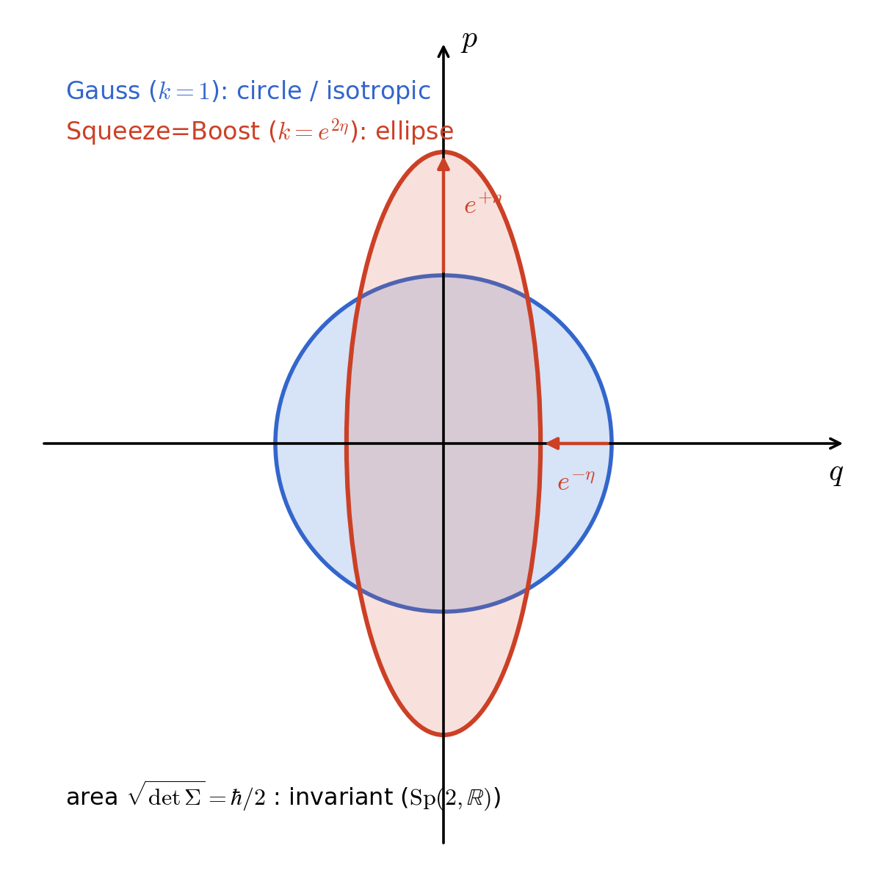
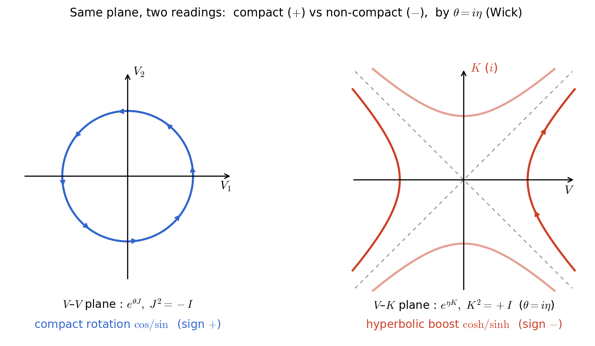

# 位相空間の面積としての保存量と不確定性——シンプレクティック対称性・Wick 回転・Stone の定理の統一的視点

**著者**：木原 範昭（Noriaki Kihara）
**所属**：WF System Co., Ltd. / 大阪大学基礎工学部（卒業）
**ORCID**：[0009-0004-6753-4020](https://orcid.org/0009-0004-6753-4020)
**版**：v10（ステルス・ドラフト）
**日付**：2026 年 6 月
**ライセンス**：CC BY 4.0
**Concept DOI**：[10.5281/zenodo.20521566](https://doi.org/10.5281/zenodo.20521566)
**Version DOI (v1.0)**：[10.5281/zenodo.20521567](https://doi.org/10.5281/zenodo.20521567)

---

## 本稿の性格

**本稿は観察論文である。新しい物理理論を提案する論文ではない。**

本稿は標準量子論を修正しない。Wick 回転を否定しない。ミンコフスキー計量を誤りとしない。観測可能な予言を一切変更しない。本稿の主張は、すでに標準的な数学——Heisenberg–Gabor の不確定性、Robertson の不等式、$\mathrm{Sp}(2,\mathbb{R})\cong\mathrm{SU}(1,1)$ のシンプレクティック対称性、Stone の定理、Wick 回転——の中に存在する構造を、**位相空間の面積という一本の視点で並べ直して観察する**ことに尽きる。

特に強調する：本稿で行うのは、Wick 回転に現れる $i$ と Stone の定理における反自己共役生成子の $i$ が、標準的な複素ヒルベルト空間の同じ複素構造により記述されることを確認し、その形式的対応を位相空間の面積という視点から再読することである（置き換えではない）。したがって光速の不変性も因果（光円錐）順序も標準理論からそのまま**継承**される。本稿が標準理論に加えるのは新しい数値的予言ではなく、既知の構造を一視点で統一的に読み直すことだけである。

本稿は以下を主張しない：

- 標準量子論・特殊相対論の数学的予言の変更
- Wick 回転やミンコフスキー計量の誤りの指摘
- 計量符号・虚数単位・複素構造の導出
- 新しい物理定数・断面積・崩壊率の導出
- 新しい数学的定理の証明

評価・解釈は読者に委ねる。

---

## 要旨

古典信号理論（Fourier 解析・標本化）と量子論は、位相平面 $(q,p)$ 上の構造として読むと共通の通貨を持つ。すなわち、作用 $\oint p\,dq$（保存量）と不確定性が張る面積（ゆらぎ）は、いずれも共役対の張るシンプレクティック面積として測られる。本稿はこの「面積という共通通貨」を起点に、三つの既知の事実を一視点で観察する。

第一に、半古典量子化 $\oint p\,dq=(n+\tfrac12)h$ に現れるゼロ点 $\tfrac12$、Robertson 不等式の等号条件（Gauss 基底状態）、Maslov 指数（境界の素性）、$\mathrm{SU}(1,1)$ 最低重み表現（Bargmann 指数）が、$\mathrm{Sp}(2,\mathbb{R})$ の二重被覆であるメタプレクティック表現の半整数ウェイトという共通構造の三断面として現れること（ただし三者は数値的に同一ではない）。

第二に、面積を保つ線形変換の全体が $\mathrm{Sp}(2,\mathbb{R})\cong\mathrm{SU}(1,1)$ をなし、シンプレクティック面積は群作用で不変に保たれ（表現論側ではカシミールが表現ラベルとして対応する）、スクイーズ・チャープ・位相回転は群作用であること。とくに非コンパクト部分群（スクイーズ）が位相空間上のローレンツ・ブーストと同型で、速度が $v/c=\tanh\eta$、形のパラメータ $k=e^{2\eta}$ として現れること。

第三に、上の対称性のもとで（観察の舞台は終始、$n$ 組の共役対が張る偶数次元の位相空間 $\mathbb{R}^{2n}$ である）、Wick 回転やローレンツ・ブーストに現れる双曲構造と虚数単位 $i$ を、連続発展の生成子に Stone の定理が与える表現形式（反自己共役 $=i\times$ 自己共役）の言葉で**再読できる**こと。この読みは Wick 回転および標準量子論と観測上等価である（本稿は $i$ や計量符号を導出しない）。この視点では、ある二次元面が回転（符号 $+$）に見えるか双曲（符号 $-$）に見えるかは、その面に作用する一径数部分群を、コンパクトな時間発展として扱うか、解析接続・ブーストに対応する非コンパクト発展として扱うかに相対的であり、これは Wick 回転における虚時間方向の座標依存性と同様である。また不確定性の床 $\tfrac12$ ゆえに、位相空間には面積ゼロの点状状態が存在しない。

本稿は新しい主張を行わず、これらの既知の構造を一視点で並置観察するに留まる。

---

## §1 動機：面積という共通通貨

### 1.1 矩形波と帯域の発散

信号理論の最も基本的な対象のひとつが矩形パルスである。幅 $\tau$・高さ $A$ の単発矩形 $g(t)=A\,\mathrm{rect}(t/\tau)$ の Fourier 変換は

$$G(\nu)=A\tau\,\mathrm{sinc}(\nu\tau),\qquad \mathrm{sinc}(x)\equiv\frac{\sin(\pi x)}{\pi x}$$

であり、$|G(\nu)|^2\sim 1/\nu^2$ の裾を持つ。したがって平均二乗帯域

$$\langle\nu^2\rangle\propto\int \nu^2|G(\nu)|^2\,d\nu$$

は**発散する**。矩形の時間・帯域 rms 積は無限大であり、最小値（後述の $1/4\pi$）を**達成できない**（下回るのではなく、無限に上回る）。角を完全に立てた代償として、矩形は分散のある連続体では定常プロファイルを保てない。なお、有限時間・有限帯域で最大のエネルギー集中を与えるのは矩形ではなく扁長回転楕円体波動関数（prolate spheroidal wave functions）[21] であり、$g$ と $G$ の同時集中には Hardy 型の限界 [22] がある。

有限 rms 帯域にするには、角の平滑化、帯域制限近似、または離散標本化による有効カットオフなどが必要になる。標本化定理（Shannon 1949）[7] は「帯域制限された連続信号を離散標本から復元できる」ことを述べる定理であり、標本間隔 $a$ に対し識別可能な振動数は $|\nu|\le\nu_s/2$（ナイキスト端、波長で $\lambda\ge 2a$）に制限される。本稿では離散標本化を有効カットオフの一例として参照するに留める。

### 1.2 二つの面積：個数と床

矩形パルスの議論は、本稿の主題である「面積」へ自然に接続する。観測者が量を読む舞台を共役対 $(q,p)$ の位相平面に取ると、意味のある不変量は面積（作用）次元に集約される。

- $\oint p\,dq$：閉軌道が囲む面積（作用・保存量）。
- ゆらぎの面積（不確定性）：純粋ガウス状態のシンプレクティック面積 $\sqrt{\det\Sigma}$（相関ゼロの枠では $\Delta q\,\Delta p$）。

はいずれも「$q$ 方向の量 × $p$ 方向の量」の次元（作用＝位相空間面積）を持つ。長さでも体積でもなく面積であるのは、$q$ と $p$ が一組の共役ペアであり、シンプレクティック変換が保存するのが面積だからである。

ただし**両者は同じ次元を共有するが、同じ数値ではない**。これは本稿で繰り返し用いる区別なので、ここで三つの量を明示的に分離しておく。

| 量 | 値（$\hbar$ 単位） | 意味 |
|---|---|---|
| ゆらぎの面積の床 $\sqrt{\det\Sigma}$（相関ゼロ枠で $\Delta q\,\Delta p$）| $\hbar/2$ | 全状態が満たす下限（Robertson）|
| 基底状態の軌道作用 $\oint p\,dq$ | $\tfrac12 h=\pi\hbar$ | $n=0$ の半古典作用 |
| 状態あたりの位相空間セル | $h=2\pi\hbar$ | 状態密度 $1/h$ |

調和振動子の状態 $n$ では軌道作用 $\oint p\,dq=(n+\tfrac12)h$ が $n$ とともに増えるのに対し、ゆらぎ面積は $n$ によらず $\hbar/2$ に留まる。正しい関係は

$$\oint p\,dq = n\,h + \tfrac12 h\qquad(\text{個数}\times\text{セル }h\ +\ \text{半端な }\tfrac12 h)$$

であり、$\oint p\,dq$ は「最小不確定セルが何個分か」を数える総量である。**本稿が「面積という共通通貨」と言うのは、$\Delta q\,\Delta p$ も $\oint p\,dq$ も同じシンプレクティック面積を単位として測られるという意味であって、数値が一致するという意味ではない。** 上表の $\hbar/2,\ \pi\hbar,\ 2\pi\hbar$ は互いに $2\pi$・$4\pi$ 異なり、混同してはならない。この区別を一貫した視点として採用する。

---

## §2 ゼロ点 $\tfrac12$ が現れる三つの場面

### 2.1 半古典量子化

閉空間（周長 $L$）で運動量が量子化されると、一周の位相面積は

$$\oint p\,dq = p_n L = \Big(\hbar\cdot\frac{2\pi n}{L}\Big)L = n\,h$$

となり、保存量は閉空間に収まる波の本数 $n$ に $h$ を掛けたものになる。半古典（WKB/EBK）近似では、これに境界の素性で決まる小数部が加わり

$$\oint p\,dq = \Big(n+\frac{\mu}{4}\Big)h$$

の形を取る（$\mu$ は Maslov 指数）。なめらかな閉じ込め（調和的）では転回点が二つ各 $\tfrac14$ を寄与し $\mu=2$、すなわち小数部 $\tfrac12$。一方、硬い壁（無限井戸）の理想化では $\oint p\,dq=n\,h$（$+\tfrac12$ なし）となる。ただし無限井戸は無限ポテンシャルという非物理的理想化であり、現実の閉じ込めはこの極限としてのみ意味を持つ。なお無限井戸でも各状態は Robertson の床を満たす（基底状態で $\Delta x\,\Delta p=\hbar\sqrt{(\pi^2-6)/12}\approx0.568\hbar>\hbar/2$）。**すなわち、不確定性の床は無限井戸でも成立する一方、作用の小数部 $\tfrac12$ は無限井戸では現れない。** 両者は独立な量であり、数値的に同一視してはならない。ただし調和振動子では、両者がともにメタプレクティック表現に接続されるため、半整数構造として対応して現れる（§2.4）。

### 2.2 Robertson の等号と Gauss 基底状態

Robertson 不等式（Robertson 1929）[2]

$$\Delta A\cdot\Delta B \ge \tfrac12\,\bigl|\langle[A,B]\rangle\bigr|$$

に $A=q,\ B=p,\ [q,p]=i\hbar$ を入れると

$$\Delta q\cdot\Delta p \ge \frac{\hbar}{2}=\frac{h}{4\pi}.$$

これは信号理論の Gabor–Heisenberg 不等式 $\Delta t\cdot\Delta\nu\ge 1/4\pi$（Heisenberg 1927 [1]、Gabor 1946 [4]）と同一の定理である。等号条件

$$(A-\langle A\rangle)\,|\psi\rangle = i\lambda\,(B-\langle B\rangle)\,|\psi\rangle\quad(\lambda\in\mathbb{R})$$

を $q,p$ で書き下すと一階微分方程式になり、解は（平行移動・平均運動量による位相・幅・全体位相を除いて）Gauss 型 $\psi(q)\propto e^{-q^2/2\sigma^2}$ に限られる。これらが床 $\hbar/2$ を達成する最小不確定状態であり、その代表（調和振動子の基底状態）をエネルギーで測ると $E_0=\tfrac12\hbar\omega$、軌道作用で言えば $\oint p\,dq=\tfrac12 h$ を与える。

**重要な注意（本稿の「面積」の定義）**：後段（§3）でチャープ（shear）$M_c=\begin{pmatrix}1&0\\\beta&1\end{pmatrix}$ を作用させると $q,p$ 間に相関 $\mathrm{Cov}(q,p)\neq0$ が生じ、純粋ガウス状態でも単純な周辺積は

$$\Delta q\,\Delta p=\frac{\hbar}{2}\sqrt{1+\beta^2}\ >\ \frac{\hbar}{2}$$

と**増える**。すなわち周辺積 $\Delta q\,\Delta p$ は $\mathrm{Sp}(2,\mathbb{R})$ 不変ではなく、相関ゼロの枠でのみ Robertson を飽和する（傾いた楕円は Schrödinger–Robertson は飽和するが Robertson は飽和しない）。$\mathrm{Sp}(2,\mathbb{R})$ で真に不変なのは共分散行列 $\Sigma$ の行列式の平方根 $\sqrt{\det\Sigma}$、すなわち Schrödinger–Robertson 型

$$(\Delta q)^2(\Delta p)^2-\mathrm{Cov}(q,p)^2 \ge \frac{\hbar^2}{4}$$

の左辺で測る**シンプレクティック面積**である（純粋ガウスで $\hbar/2$；共分散行列による定式化は Simon–Sudarshan–Mukunda [23]）。これは de Gosson の量子ブロブ（quantum blob）[20] が捉える不変量であり、$\oint p\,dq$ もこの単位で測られる。**以下、本稿で「面積」と言うときは一貫してこのシンプレクティック面積 $\sqrt{\det\Sigma}$ を指し、枠依存の周辺積 $\Delta q\,\Delta p$ は相関ゼロ枠での値として区別する。**

### 2.3 SU(1,1) 最低重み表現

後述の対称群 $\mathrm{SU}(1,1)$ の最低重み表現（基底状態から始まる表現）を特徴づける Bargmann 指数は $k=\tfrac14$ または $\tfrac34$ の二択になり、ここから $\oint p\,dq=(n+\tfrac12)h$ の小数部が群論的に決まる（Bargmann 1947 [9]、Perelomov 1986 [10]）。

### 2.4 観察：三つの $\tfrac12$ を貫く半整数構造

Maslov 指数（境界の素性）、Robertson の床（最小不確定状態）、$\mathrm{SU}(1,1)$ 最低重み（表現論）に現れる $\tfrac12$ 系の値は、**個別に異なる定理から出る別々の量である**——Maslov 指数の値そのものは系・境界条件に依存し（§2.1 のとおり無限井戸では $\tfrac12$ が消える）、Robertson の床 $\hbar/2=h/4\pi$ は作用次元の数値であって無次元のウェイト $\tfrac14,\tfrac34$ とは次元も異なる。したがって本稿は三者を「同一物」とは見なさない。

しかし三者が半整数の構造を共有するのは無関係な偶然ではなく、**いずれもメタプレクティック表現・二重被覆・半整数位相に接続される構造として理解できる**。すなわち、$\mathrm{Sp}(2,\mathbb{R})$ の二重被覆 $\mathrm{Mp}(2,\mathbb{R})$（メタプレクティック群）のメタプレクティック表現（Weil 表現）[24] が、半整数ウェイトを通じて三者を共通に支える。基底状態（最低重み状態）がシンプレクティック面積の最小値を飽和し、半古典作用に Maslov 補正が入り、$\mathrm{SU}(1,1)$ 最低重みに Bargmann 指数が現れる——これらはいずれもこの二重被覆の半整数構造に接続する。

したがって本稿は、三者を「同一の定理から出る同一物」と過剰に同一視はしないが、「無関係な三つの一致」とも見ない。**メタプレクティック表現の半整数ウェイトに接続する構造**として読む。矩形（小数部 $0$）が rms 帯域発散ゆえ床 $1/4\pi$ を達成できず、Gauss（小数部 $\tfrac12$）がちょうど床に座る、という §1.1 の事実も、この構造の一断面である。半古典量子化 $\oint p\,dq=(n+\tfrac12)h$ は「本数 $n$（整数・どのモードか）＋絞りきれない半端な $\tfrac12$（不確定）」と読める。

---

## §3 面積を保つ対称群 $\mathrm{Sp}(2,\mathbb{R})\cong\mathrm{SU}(1,1)$

### 3.1 面積を保つ線形変換

位相平面のベクトルを $(q,p)$、シンプレクティック形式を $J=\begin{pmatrix}0&1\\-1&0\end{pmatrix}$ とすると、面積を保つ線形変換 $M$ は

$$M^{\mathsf T}JM=J\quad(\Longleftrightarrow\ \det M=1\ \text{in}\ 2\times2)$$

を満たす。$2\times2$ では $M^{\mathsf T}JM=J$ と $\det M=1$ は同値であり、$\mathrm{Sp}(2,\mathbb{R})=\mathrm{SL}(2,\mathbb{R})$ である。次の三操作はこの群の元である：

- スクイーズ：$M_s=\begin{pmatrix}e^{-r}&0\\0&e^{+r}\end{pmatrix}$（片軸を絞り他軸を伸ばす、面積不変）
- 回転：$M_\theta=\begin{pmatrix}\cos\theta&\sin\theta\\-\sin\theta&\cos\theta\end{pmatrix}$（位相回転・時間発展）
- チャープ（shear）：$M_c=\begin{pmatrix}1&0\\ \beta&1\end{pmatrix}$（$p$ に $\beta q$ を足す＝瞬時振動数 $\omega_0+\beta t$）

複素振幅 $(a,a^\dagger)$ で同じ群を表すと $\mathrm{SU}(1,1)$（$a\to ua+va^\dagger,\ |u|^2-|v|^2=1$）として現れる。

### 3.2 面積不変性・表現ラベル・群作用

リー代数 $\mathfrak{su}(1,1)$ の生成子は

$$K_0\propto a^\dagger a+\tfrac12,\qquad K_\pm\propto a^{\dagger 2},\,a^2,$$
$$[K_0,K_\pm]=\pm K_\pm,\qquad [K_+,K_-]=-2K_0.$$

$K_0$（回転・時間発展の種）には §2 のゼロ点と同じ $\tfrac12$ が入る。カシミール不変量 $C=K_0^2-\tfrac12(K_+K_-+K_-K_+)$ は群作用で動かない。ただしカシミールの役割は限定的に述べる必要がある。**カシミールは $\mathrm{SU}(1,1)$ 表現の種類を固定し、群作用で不変に保たれる量であって、励起数 $n$ や作用積分そのものを直接決めるものではない。** 単一モード・二光子実現では Bargmann 指数 $k=\tfrac14,\tfrac34$ が偶数・奇数 Fock セクターを分けるが、励起番号 $n$ は同じ表現内の重みとして変化する。したがって本稿ではカシミールを「面積構造の表現論的ラベル」として扱い、作用積分 $\oint p\,dq$ と同一視しない。

この限定のもとで、二層構造を次のように述べる：

- **カシミール $C$（群不変）＝面積構造を固定するラベル側**。群作用で動かない。
- **群作用 $M(r,\varphi,\theta)$＝形・配分側**。シンプレクティック面積 $\sqrt{\det\Sigma}$ を保ったまま楕円を伸ばし・傾け・回す。

スクイーズの縦横比を $k\equiv\Delta\tilde p/\Delta\tilde q=e^{2r}$ と定義すると $r=\tfrac12\ln k$ で、面積 $\sqrt{\det\Sigma}$（$k$ に依らず保存）と形 $k$（面積に依らず）が積と商に直交分解される。

### 3.3 ブースト＝非コンパクト部分群＝スクイーズ

$\mathrm{Sp}(2,\mathbb{R})$ には性格の異なる一径数部分群がある。回転 $K_0$ はコンパクト（円・三角関数、戻る）で、静止した内部時計として読める。スクイーズ $K_\pm$ 系は非コンパクト（双曲・$\cosh/\sinh$、戻らない）。標準的な単一モードのスクイーズ演算子

$$S(\eta)=\exp\!\Big(\tfrac{\eta}{2}\big(a^2-a^{\dagger 2}\big)\Big)$$

（生成子 $a^2-a^{\dagger 2}$ は反エルミートゆえそのままユニタリ）は、正準変数 $q=(a+a^\dagger)/\sqrt2,\ p=(a-a^\dagger)/(i\sqrt2)$（$[q,p]=i$）に対し $S^\dagger q\,S=e^{-\eta}q,\ S^\dagger p\,S=e^{+\eta}p$ として作用し、$(q,p)$ 基底で規格化込みに厳密に

$$\begin{pmatrix}e^{-\eta}&0\\0&e^{+\eta}\end{pmatrix}$$

を与える。すなわち位置に相当する軸が $e^{-\eta}$ で縮み、運動量に相当する軸が $e^{+\eta}$ で伸びる。双曲構造 $\cosh\eta,\sinh\eta$ は $1{+}1$ 次元ローレンツ変換と**同型**であり（位相空間でのスクイーズ＝ブースト対応は Han–Kim–Noz [25]）、

$$\frac{v}{c}=\tanh\eta=\frac{k-1}{k+1},\qquad k=e^{2\eta}.$$

$k=1$（$\eta=0$）で静止、$k\to\infty$ で光速。形のパラメータ $k$ は、形式的には相対論的速度パラメータと対応づけられる。

ここで二つの限定を明示する。第一に、**任意の非コンパクト一径数部分群は加法群 $(\mathbb{R},+)$ に同型である**から、$v/c=\tanh\eta$ という同定はパラメータ付けの選択であって、それ自体が物理的内容を持つわけではない。ブーストとスクイーズが同じ非コンパクト構造を共有するという観察に留まる（カシミールがブーストで不変なのも、それが表現ラベルであることの帰結であって、相対論的静止質量の不変性そのものではない——両者は構造的に類似するが同一ではない）。

第二に、**受動的なシンプレクティック座標変換**としてのスクイーズは、同じ物理状態を別の正準座標で見るだけで励起数の分布を変えない。一方、**能動的なスクイーズ演算子** $S(r)$ を真空に作用させると squeezed vacuum が生じ、これは Fock 基底では偶数粒子数状態の重ね合わせになる——粒子数分布は変わる。本稿で「形 $k$ を動かしても面積（カシミール／$\sqrt{\det\Sigma}$）は不変」と言うときは、シンプレクティック面積の不変性を指すのであって、能動的操作が Fock 数分布を保つことを意味しない。

**図 1**：位相平面 $(q,p)$ における Gauss 基底状態（青・円、$k=1$、等方）とスクイーズ状態（赤・楕円、$k=e^{2\eta}$）。位置軸が $e^{-\eta}$ で縮み運動量軸が $e^{+\eta}$ で伸びるが、シンプレクティック面積 $\sqrt{\det\Sigma}=\hbar/2$ は $\mathrm{Sp}(2,\mathbb{R})$ 作用で不変。このスクイーズが位相空間上のローレンツ・ブースト（$v/c=\tanh\eta$）と同型である（§3.3）。

---

## §4 虚数単位と双曲構造の生成子論的再読

### 4.1 本節の位置づけ（誤読防止）

本節は Wick 回転も標準量子論も**否定しない**。実回転 $e^{\theta J}$（$J^2=-I$ ゆえ固有値 $e^{\pm i\theta}$、コンパクト）と、双曲的発展 $e^{\eta K}$（$K^2=+I$ ゆえ固有値 $e^{\pm\eta}$、非コンパクト）は、置換 $\theta=i\eta$ で互いに移る。この円→双曲の移行は **Wick 回転の標準形**である（Wick 1954 [12]）。したがって本節の観測可能な予言はすべて標準ローレンツ／ユークリッド枠と一致する。我々が行うのは、Stone 型発展と Wick 型解析接続が同じ複素構造で記述されるという形式的対応を確認することであって、新たな $i$ を導入することではない。

### 4.2 複素構造はどこから来るか（前提の明示）

ここで重要な前提を明示する。**Stone の定理（Stone 1932 [8]；正準交換関係の表現の一意性は Stone–von Neumann の定理 [26]）は、複素ヒルベルト空間上の強連続な一径数ユニタリ群を前提とする定理であり、実ベクトル空間を射影しただけでは適用できない。** ユニタリ性を語るには、空間が単なる実ベクトル空間ではなく複素構造（$J^2=-I$ を満たす演算子 $J$）を備えている必要がある。したがって本稿は虚数単位 $i$ を導出するとは主張しない。$i$ は次の意味で**前提された構造の一部**である。

位相平面はシンプレクティック形式 $\omega$（§3 の $J=\begin{pmatrix}0&1\\-1&0\end{pmatrix}$、＝面積）と、正定値計量 $g$ の双方を持つ。シンプレクティック形式と両立する（compatible な）正定値計量があるとき、

$$g(u,v)=\omega(u,\mathcal{J}v),\qquad \mathcal{J}^2=-I$$

を満たす**両立可能概複素構造（compatible almost complex structure）$\mathcal{J}$** が一意に定まる。この $\mathcal{J}$ が虚数単位 $i$ である（Kähler 構造／compatible triple の標準的事実、Cannas da Silva [27]）。**$i$ は実幾何から無から導かれるのではなく、面積 $\omega$ と計量 $g$ という二つの構造の両立から決まる。** これが、保存確率を扱う空間に複素構造が不可避に備わる理由であり、本稿前半（シンプレクティック位相平面）と後半（観測射影）をつなぐ構造である。

### 4.3 Stone の定理が発展生成子に与える形

観測を保つ（ノルム＝確率を保存する＝ユニタリな）一径数発展群は、§4.2 の複素構造のもとで Stone の定理により

$$U(s)=\exp(sG),\qquad G=\mathcal{J}\,H=i\,H\quad(H\ \text{自己共役})$$

の形しか取れない。すなわち**連続発展を生成する量は反自己共役（$=i\times$ 自己共役）であり、この意味で $i$ を負う**。

ここで一点、よくある誤読を正しておく。$p=-i\hbar\,\partial_q$ の $i$ は、「$p$ が観測できない量だから」ではない——運動量は観測可能量である。この $i$ は、$p$ が空間並進の生成子であることの現れである。同様に $q$ も運動量空間で並進を生成し、両者は対称である。**したがって $i$ は「観測できない軸に固有の徴」ではなく、「連続発展の生成子の表現形式」である。** どの自己共役量も、対応する一径数群の生成子としては $i$ を伴って現れる。

### 4.4 双曲構造の再読と Wick との同定

二次元部分空間に作用する一径数群の「回転」が、円的（$\cos/\sin$、コンパクト、ユークリッド的、計量符号 $+$）か双曲的（$\cosh/\sinh$、非コンパクト、ブースト、計量符号 $-$）かは、その生成子の代数的性質——固有値 $\pm i$ をもつ $J^2=-I$ 型か、固有値 $\pm1$ をもつ $K^2=+I$ 型か——によって決まる。両者は置換 $\theta=i\eta$ で互いに移り、これは §4.1 の Wick 回転と同型である。

したがって、ある二次元面が円（符号 $+$）に見えるか双曲（符号 $-$）に見えるかは、**観測者がその面に作用する一径数部分群を、時間発展（コンパクト回転）として扱うか、解析接続・ブースト（非コンパクト）として扱うか**に対応する。本稿はここで計量符号やローレンツ構造を**導出するのではなく**、標準理論で既に現れる双曲構造を生成子の代数的性質と対応づけて**再読する**に留まる。その結果：

- 観測可能な予言はすべて標準ローレンツ／ユークリッド枠と一致する。
- 光速 $c$ の不変性と因果（光円錐）順序は標準 SR と一致するため**継承される**（再導出ではなく、定義により再現される）。これは本稿が標準理論の内側に留まることの帰結である。

**図 2**：同一の二次元面が、生成子の代数的性質によって円（$+$）か双曲（$-$）かに分かれる。左：観測可能部分空間内の面 $V$–$V$ では生成子が $J^2=-I$ 型ゆえコンパクト回転（$\cos/\sin$、計量符号 $+$）。右：核 $K$（$i$ 付き発展生成子）が絡む面 $V$–$K$ では $K^2=+I$ 型ゆえ双曲ブースト（$\cosh/\sinh$、計量符号 $-$）。両者は置換 $\theta=i\eta$（Wick 回転の標準形）で移り合う（§4.4）。

### 4.5 $i$ の相対性

$i$ がどの方向に現れるか、ひいてはどの面が双曲（符号 $-$）に見えるかは、観測者が選ぶ観測可能部分空間の取り方に相対的である。**これは Wick 回転において「虚時間」がどの座標方向を指すかが座標選択に依存するのと同様である。** 観測可能部分空間を別の向きに取れば、発展生成子として扱われる方向も移る。この相対性は標準理論と観測上等価な範囲に留まり、新たな予言を一切加えない。本稿が述べるのはこの観察に限られる。

---

## §5 多軸への拡張、合成投影、点状状態の不在

### 5.1 観測投影と発展側

本節では、射影の舞台となる空間を、§3–§4 と同じく**偶数次元の位相空間** $\mathbb{R}^{2n}$（$n$ 組の共役対 $(q_i,p_i)$ が張り、シンプレクティック形式 $\omega$ と §4.2 の概複素構造 $\mathcal{J}=i$ を備える）とする。これは §3 の位相平面 $(q,p)$ の自然な拡張にすぎず（有限・無境界の閉じた位相空間は §2.1 の $\oint p\,dq=nh$ ですでに用いている）、新たな機構を持ち込まない。共役運動量 $p_i$ はそれ自体が並進の生成子であるから、発展側に回る方向が生成子として働くこと（§4.3）は、この位相空間の構造に内在する。

この空間で、$\mathrm{Sp}(2n,\mathbb{R})$ は非零ベクトルに推移的に作用するため、どの軸も観測可能部分空間 $V$ またはその補空間（核 $K$、発展側）として**対称に**選べる。一つの軸を単独で核に送ることも、複数軸を一括して送る合成投影も可能である。

ある投影を固定したとき、観測可能軸だけでは発展的・動的な記述が閉じない場合がある。そのとき核方向を $i$ 付きの発展生成子として置くことで（§4 の Stone の定理により $i\times$ 自己共役）、記述が整合する。観測可能空間へ射影した記述では、この $i$ を伴う生成子構造を、当該方向を含む面の双曲構造、あるいは標準理論における計量符号 $-$ と対応づけて読むことができる。本稿が述べるのはこの観察に限られる。

誤読を先回りで封じるため、本稿が主張**しない**ことを明示する。

- 因果構造が実在的か派生的かを断じない。
- **因果が破綻するから $i$ を入れる、とは主張しない。** 順序は逆であって、$i$ は観測可能軸だけでは閉じない記述を整合させるための調整であり、因果の無矛盾はその整合に含まれる一側面にすぎない。

### 5.2 合成投影の順序非依存

ここで限定を付す。**一般の射影作用素は可換ではなく、量子測定の文脈では非可換射影の順序は物理的に重要である。** 本稿で「順序非依存」と言うのは、**互いに直交する独立部分空間を一括して発展側（核）に送る理想化**に限った主張である。この理想化のもとでは、観測可能／発展側への直和分解は最終的な部分空間の指定だけで決まり、どの直交方向を先に送るかに依存しない。各段で観測可能次元が $1$ 減り発展側が $1$ 増えるが、和

$$(\text{観測可能 }k)+(\text{発展側 }N-k)=N$$

は保存される。投影規則そのものは特定の軸を優先しないが、具体的な観測者が $V$ を選んだ後には、その記述に残る対称性は $V$ と $K$ を保つ部分群（$\mathrm{SO}(k)\times\mathrm{SO}(N-k)$ 型）に制限される。すなわち投影は対称性を破壊するのではなく、見かけ上低い対称性へ縮約する。

### 5.3 全発展側極限について

観測可能次元を $k=0$ まで送ると、$N$ 本すべてが発展側（形式的に全虚）になる。この極限では、実か虚かを判定する基準——「観測可能方向に対する相対的な徴」（§4.5）——が一本も残らないため、観測者にとって全虚と全実を区別する操作が存在しない。これは §4.5 の相対性を $k=0$ に適用した極限的言い換えであって、新たな主張ではない。

なお、状態ベクトル全体に一様な位相を掛けることは大域位相として観測不能だが、これは座標軸・実構造に $i$ を掛けることとは別の操作であり、本稿は両者を同一視しない。

### 5.4 面積ゼロの点状状態の不在（床 $\tfrac12$ の帰結）

まず正確に述べる。不確定性関係が禁じるのは、位相空間における**面積ゼロの量子状態**（$\Delta q=\Delta p=0$ を満たす点状状態）であって、平均値としての原点 $(\langle q\rangle,\langle p\rangle)=(0,0)$ ではない。後者は通常の状態として普通に取れる。したがって本節の主張は「観測可能な量子状態としての**面積ゼロの点状状態は存在しない**」であり、「座標原点が存在しない」ではない。

この意味で、$k=0$（全発展側）を「確定した点状状態」として置くことはできない。位相空間には床 $\Delta q\cdot\Delta p\ge\hbar/2$ があり、$\Delta q=\Delta p=0$ の状態を禁じるからである。したがって「全発展側」も「全収縮」も、**到達できる点状状態ではなく、床 $\tfrac12$ ゆえに一点に閉じきれない極限の向き**としてのみ意味を持つ。

これは §3 の面積不変と整合する。スクイーズ（ブースト）でどれだけ一方向を絞ってもシンプレクティック面積 $\hbar/2$ は残り、点状状態には潰れない。発展側へ送られた自由度も、消えるのではなく床を保ったまま観測の外にある。

---

## §6 既存研究との関係と、本稿が主張しないこと

### 6.1 既存研究との関係

本稿の各構成要素は標準的に確立されている。不確定性の面積解釈は Robertson 1929 [2] / Schrödinger 1930 [3]、時間–帯域版は Gabor 1946 [4]。位相空間擬確率分布は Wigner 1932 [5]（量子）と Ville 1948 [6]（信号）で独立に発見された。標本化（ナイキスト）は Shannon 1949 [7]。一径数ユニタリ群と生成子の関係は Stone 1932 [8]。面積保存変換群とスクイーズド状態は $\mathrm{Sp}(2,\mathbb{R})$ / メタプレクティック表現（Folland 1989 [17]、Littlejohn 1986 [18]）およびスクイーズド状態（Stoler 1970 [19a]、Yuen 1976 [19]）。$\tfrac12$ の表現論的出自は Bargmann 1947 [9] / Perelomov 1986 [10]。境界の素性は Maslov 指数（Maslov 1972 / Arnold 1967 [11]）。本稿はこれらを面積という共通視点で並べ直したに過ぎない。

虚数単位 $i$・双曲構造の解釈については、本稿の立場を以下と対比して位置づける。**いずれに対しても本稿は対立を主張せず、観測上等価な再読として提示する。**

- **Wick 回転（Wick 1954 [12]）／ユークリッド量子重力（Hartle–Hawking 1983 [13]）**：本稿は同じ $\theta=i\eta$ を、Stone 型発展に現れる反自己共役生成子の $i$ と Wick 型解析接続に現れる $i$ が同じ複素構造で記述される形式的対応として読む。予言は一致する。
- **関係論的量子力学（Rovelli 1996 [14]）・QBism（Fuchs–Mermin–Schack 2014 [15]）**：物理量を観測者・系の関係として読む点で精神を共有する。
- **幾何代数（Hestenes 1966 [16]）**：量子論の $i$ を時空の幾何的対象として読む。本稿の「$i$ は生成子構造に属する」という読みは、$i$ を座標の固有属性から切り離す点で精神を共有するが、機構（Stone の定理によるユニタリ性の要求）が異なる。

### 6.2 本稿が主張しないこと

- 標準量子論・特殊相対論の数学的予言の変更（本稿は観測上これらと等価である）。
- Wick 回転やミンコフスキー計量が「誤り」であるという主張（本稿は再解釈であり否定ではない）。
- **虚数単位 $i$・複素構造・計量符号の導出**（§4.2 のとおり $i$ は面積 $\omega$ と計量 $g$ の両立から定まる前提された概複素構造である）。
- 時間の矢がどこから生まれるかについての言及・証明（本稿はこれを行わず、既存の標準理論における解釈にまかせる）。
- 新しい物理定数・散乱断面積・崩壊率・新粒子の予言。
- 新しい数学的定理の証明。

### 6.3 本稿が記録すること

- 保存量 $\oint p\,dq$ と不確定性 $\sqrt{\det\Sigma}$ が同じ位相平面のシンプレクティック面積を単位として測られ（ただし数値は異なる：§1.2）、半整数構造が Robertson の床・Maslov 指数・$\mathrm{SU}(1,1)$ 最低重みという三つの場面に、同一物としてではなくメタプレクティック表現の三断面として現れること。
- 面積を保つ対称群 $\mathrm{Sp}(2,\mathbb{R})\cong\mathrm{SU}(1,1)$ において、カシミールが面積構造の表現論的ラベル、群作用が形・配分を担い、ブースト＝非コンパクト部分群＝スクイーズ（$v/c=\tanh\eta,\ k=e^{2\eta}$）であること。
- 面積 $\omega$ と計量 $g$ の両立から定まる概複素構造 $\mathcal{J}=i$ のもとで、連続発展の生成子に Stone の定理が $i\times$ 自己共役の形を与えること。これにより、Wick 回転・ローレンツ・ブーストの双曲構造を**観測記述の言葉で再読**でき、この読みが標準量子論と観測上等価であること（導出ではない）。ある面が回転（$+$）に見えるか双曲（$-$）に見えるかは観測者の投影に相対的であること。
- 不確定性の床ゆえに面積ゼロの点状状態が存在しないこと。

なお念のため明示する。**本稿の「同定」とは、複素ヒルベルト空間の同じ複素構造を用いて Stone 型発展と Wick 型解析接続を記述できるという形式的対応の意味であり、Wick 回転・ローレンツ計量・複素構造を新たに導出するものではない。**

### 6.4 今後の課題（未解決として明示する点）

以下は本稿で扱わない、または別論文に委ねる課題である。誠実のため明示する。

1. **観測可能部分空間の余次元の決定機構**：観測者の射影がどの余次元を選ぶか（標準理論で時空が $3+1$ に見える根拠を含む）は本稿の枠組みからは説明されない（§5.1）。
2. **複素構造の起源の深化**：§4.2 で $i$ を面積 $\omega$ と計量 $g$ の両立から定まる概複素構造とした。この両立（compatible triple）がなぜ観測に不可避かを、より基礎的な前提から論じること。
3. **低次元トイモデルと明示化**：$N=2,3$ で $V\oplus K$ 分解・有効内積・概複素構造を具体的に書き下し、Stone の生成子 $G=iH$ の形を陽に示すこと。
4. **可視化**：位相平面の楕円（Gauss 状態 vs スクイーズ状態）とブースト対応（図 1）、および $V$–$V$／$V$–$K$ 面の円・双曲の別の模式図（図 2）を収録した。より詳細な多軸射影の図解は今後の課題とする。

---

## 関連研究（同著者）

本稿は外部の標準文献のみで自己完結する。同主題の信号論・量子論の構造的対応に関する観察記録（同時公開予定）が存在するが、本稿はその結論に依存しない。

---

## 参考文献

[1] W. Heisenberg (1927). *Über den anschaulichen Inhalt der quantentheoretischen Kinematik und Mechanik*. Z. Phys. **43**, 172.
[2] H. P. Robertson (1929). *The uncertainty principle*. Phys. Rev. **34**, 163.
[3] E. Schrödinger (1930). *Zum Heisenbergschen Unschärfeprinzip*. Sitzungsber. Preuss. Akad. Wiss. 296.
[4] D. Gabor (1946). *Theory of communication*. J. IEE **93**, 429.
[5] E. Wigner (1932). *On the quantum correction for thermodynamic equilibrium*. Phys. Rev. **40**, 749.
[6] J. Ville (1948). *Théorie et applications de la notion de signal analytique*. Câbles et Transmission **2A**, 61.
[7] C. E. Shannon (1949). *Communication in the presence of noise*. Proc. IRE **37**, 10.
[8] M. H. Stone (1932). *On one-parameter unitary groups in Hilbert space*. Ann. Math. **33**, 643.
[9] V. Bargmann (1947). *Irreducible unitary representations of the Lorentz group*. Ann. Math. **48**, 568.
[10] A. M. Perelomov (1986). *Generalized Coherent States and Their Applications*. Springer.
[11] V. P. Maslov (1972) / V. I. Arnold (1967). *On a characteristic class entering into conditions of quantization*. Funct. Anal. Appl. **1**, 1.
[12] G. C. Wick (1954). *Properties of Bethe–Salpeter wave functions*. Phys. Rev. **96**, 1124.
[13] J. B. Hartle, S. W. Hawking (1983). *Wave function of the Universe*. Phys. Rev. D **28**, 2960.
[14] C. Rovelli (1996). *Relational quantum mechanics*. Int. J. Theor. Phys. **35**, 1637.
[15] C. A. Fuchs, N. D. Mermin, R. Schack (2014). *An introduction to QBism*. Am. J. Phys. **82**, 749.
[16] D. Hestenes (1966). *Space–Time Algebra*. Gordon and Breach.
[17] G. B. Folland (1989). *Harmonic Analysis in Phase Space*. Princeton Univ. Press.
[18] R. G. Littlejohn (1986). *The semiclassical evolution of wave packets*. Phys. Rep. **138**, 193.
[19] H. P. Yuen (1976). *Two-photon coherent states of the radiation field*. Phys. Rev. A **13**, 2226.
[19a] D. Stoler (1970). *Equivalence classes of minimum uncertainty packets*. Phys. Rev. D **1**, 3217.
[20] M. de Gosson (2013). *Quantum blobs*. Found. Phys. **43**, 440.
[21] D. Slepian, H. O. Pollak (1961). *Prolate spheroidal wave functions, Fourier analysis and uncertainty I*. Bell Syst. Tech. J. **40**, 43.
[22] G. H. Hardy (1933). *A theorem concerning Fourier transforms*. J. London Math. Soc. **8**, 227.
[23] R. Simon, E. C. G. Sudarshan, N. Mukunda (1987). *Gaussian–Wigner distributions in quantum mechanics and optics*. Phys. Rev. A **36**, 3868.
[24] A. Weil (1964). *Sur certains groupes d'opérateurs unitaires*. Acta Math. **111**, 143.
[25] D. Han, Y. S. Kim, M. E. Noz (1996). *Two Different Squeeze Transformations*. arXiv:hep-th/9602019.
[26] J. von Neumann (1931). *Die Eindeutigkeit der Schrödingerschen Operatoren*. Math. Ann. **104**, 570.
[27] A. Cannas da Silva (2001). *Lectures on Symplectic Geometry*. Springer.

---

著者：木原 範昭（Noriaki Kihara）／ WF System Co., Ltd. ／ ORCID [0009-0004-6753-4020](https://orcid.org/0009-0004-6753-4020)／ CC BY 4.0

---

## 改訂履歴

- **v3（2026-06）**：信号理論の面積（§1）、ゼロ点 $\tfrac12$ の三重出自（§2）、$\mathrm{Sp}(2,\mathbb{R})\cong\mathrm{SU}(1,1)$ とブースト＝スクイーズ（§3）、Stone の定理による $i$ 機構と Wick 同定（§4）、合成投影・点状状態の不在（§5）。
- **v4（2026-06）**：技術的整合性の向上。(a) §1.2 で $\hbar/2,\ \tfrac12 h,\ h$ の三量を表として明示分離し、「面積という共通通貨」が次元の共通性であって数値の一致ではないことを明確化。(b) §2.1 で無限井戸が Robertson の床を満たす一方で作用の $\tfrac12$ を持たないことを明記し、§2.2 と §2.4 の整合を取った（床と作用補正は独立な量）。(c) §2.4 を「三者は数値的に同一ではないが、メタプレクティック表現の半整数ウェイトという共通構造」として精密化。(d) §3.3 に「非コンパクト一径数群は $(\mathbb{R},+)$ に同型」の限定を追加し、$v/c=\tanh\eta$ がパラメータ付けの選択であることを明示。(e) §4.3 で $p=-i\hbar\partial_q$ の $i$ が「観測不能性の徴」ではなく「並進生成子の表現形式」であることを明記（運動量は観測可能量である）。(f) §4・§5 全体を、計量符号やローレンツ構造の「導出」ではなく「Wick 回転と観測上等価な再読」として一貫させた。
- **v5（2026-06）**：ChatGPT 査読（§4 の語調が過剰との指摘）を反映し、§4 をもう一段弱化：
  - **「同じ $i$ の同定」「Wick 回転そのもの」を撤回**：要旨・§本稿の性格・§4.1 を「Wick の $i$ と Stone の反自己共役生成子の $i$ が同じ複素構造で記述されることの確認＝形式的対応の再読」に弱め、「Wick 回転そのもの」を「Wick 回転の標準形」に。
  - **§4.4 の二分法を撤回**：「直接観測可能量 vs 発展生成子」で円／双曲を分ける説明を、「生成子の代数的性質（固有値 $\pm i$ の $J^2=-I$ 型か、固有値 $\pm1$ の $K^2=+I$ 型か）」に置換。観測者の選択は「どの一径数部分群を時間発展／解析接続・ブーストとして扱うか」に。
  - **§2.4／§2.1 の内部矛盾を解消**：「偶然に同じ $\tfrac12$」（§2.1）と「偶然でなく共通機構」（§2.4）の衝突を、「独立な量だが調和振動子では両者がメタプレクティック表現に接続して半整数構造として対応」に統一。「三断面である」→「半整数ウェイトに接続する構造」に弱化。
  - **§3.2 見出し**「保存量＝カシミール」→「面積不変性・表現ラベル・群作用」。要旨の「カシミール的不変量」→「群作用で不変、表現論側ではカシミールが表現ラベルとして対応」。
  - **§5.3 を弱化**：「全虚＝全実 判別不能」の根拠から、大域位相＝座標軸の同一視という誤った第二理由を撤回（状態ベクトルの大域位相と座標軸への $i$ は別物と明記）。健全な「$k=0$ では比較基準が消える」のみ残す。
  - **§5.2**：「投影が対称性を破らない」→「規則は特権化しないが、$V$ 選択後は $\mathrm{SO}(k)\times\mathrm{SO}(N-k)$ 型に縮約」。
  - 末尾に防御文（同定＝形式的対応であり導出ではない旨）を追加。[1] Heisenberg を §2.2 で本文引用化（orphan 解消）。
- **v6（2026-06）**：ChatGPT 再査読（Minor Revision → Acceptable）で残った局所的な語感を統一：
  - 要旨第3段の「どの量を直接観測可能とし、どの量を発展生成子とするか」を §4.4 と同じ「一径数部分群をコンパクト時間発展／非コンパクト発展（解析接続・ブースト）として扱うか」に統一。
  - §5.1「この $i$ が…計量符号の $-$ として**現れる**」→「計量符号 $-$ と**対応づけて読む**ことができる」。
  - §1.2 表の床を $\sqrt{\det\Sigma}$（相関ゼロ枠で $\Delta q\,\Delta p$）に表記統一。
  - §6.1 の「$i$ の同定」→「同じ複素構造で記述される形式的対応」。
  - §2.2 の「Gauss 関数ただ一つ」→「平行移動・平均運動量位相・幅・全体位相を除いて Gauss 型に限られる（Gaussian family）」。
  - §3.3「相対論的速度として読み直される」→「形式的には相対論的速度パラメータと対応づけられる」。
- **v7（2026-06）**：最終チェックで残った技術的精度の一点を解消。§3.3 の「$\exp(-i\eta N)\sim\mathrm{diag}(e^{-\eta},e^{+\eta})$」の曖昧な「$\sim$」を撤去し、**標準スクイーズ演算子 $S(\eta)=\exp(\tfrac{\eta}{2}(a^2-a^{\dagger2}))$ の正準変数への作用 $S^\dagger q S=e^{-\eta}q,\ S^\dagger p S=e^{+\eta}p$ を陽に書き、$(q,p)$ 基底で規格化込みに厳密に $\mathrm{diag}(e^{-\eta},e^{+\eta})$ となること**を明示（生成子 $a^2-a^{\dagger2}$ は反エルミートゆえ追加の $i$ 不要）。係数の検算で読者の手が止まる露出を解消。
- **v8（2026-06）**：§4（位相平面）と §5（多軸）の空間の型の曖昧さ（査読指摘「$\mathbb{R}^N$ は位相空間か配位空間か」）を解消。§5.1 冒頭で**射影の舞台を偶数次元の位相空間 $\mathbb{R}^{2n}$（$n$ 組の共役対、$\omega$ と概複素構造 $\mathcal{J}=i$ を備える）と明言**。これは §3 の $(q,p)$ 平面の自然な拡張で（有限・無境界の閉じた位相空間は §2.1 で既使用）新たな機構を持ち込まない。$\mathrm{Sp}(2n,\mathbb{R})$ の非零ベクトルへの推移性から全軸対称が保たれること、共役運動量 $p_i$ がそれ自体生成子ゆえ「発展軸＝生成子」がカテゴリーエラーでなく構造内在であること（査読指摘2）も同時に解消。
- **v9（2026-06）**：要旨第3段に「観察の舞台は終始、$n$ 組の共役対が張る偶数次元の位相空間 $\mathbb{R}^{2n}$ である」を一句挿入し、v8 で確定した位相空間設定を要旨段階で明示（読者の誤読防止のみ。新主張なし）。
- **v10（2026-06）**：模式図2枚を追加（本文変更なし）。図1（§3.3）＝位相平面の Gauss 円 vs スクイーズ楕円・同面積・ブースト同型。図2（§4.4）＝同一面が $J^2=-I$ 型ならコンパクト回転（$+$）、$K^2=+I$ 型なら双曲ブースト（$-$）、$\theta=i\eta$ で移り合う。§6.4-4 の「可視化（未収録）」を解消。
