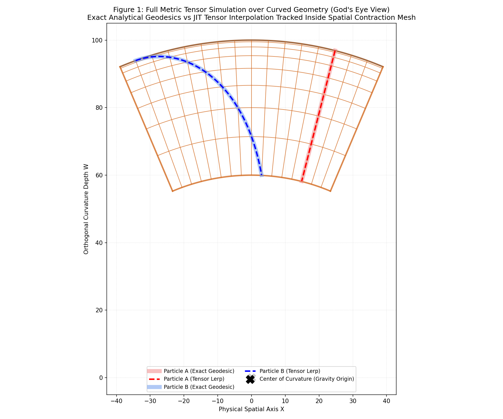
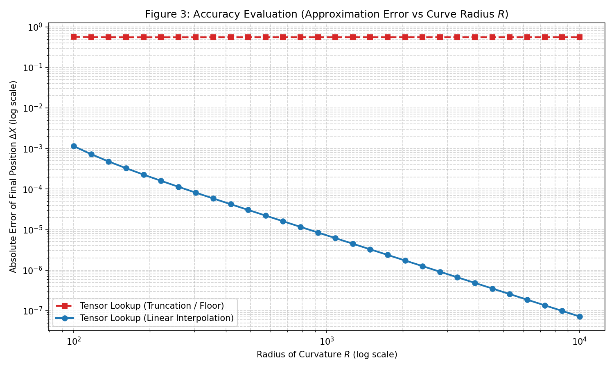

# 閉じた真空の正曲率時空の時空超直方体の歪の計算

## アブストラクト
一般相対性理論における真空の正曲率時空の一部を空間測地線に従い鉛直方向と、水平線方向と時間軸方向に、真空の光速度をCとして、長を1に正規化した場合の、時空超直方体の歪の計算を定式化する。
この計算における正曲率Rは、空間軸・時間軸方向への曲率ではなく、空間軸・時間軸方向に対して直交する方向への曲率とする。
R>0に置いて、４次元時空は正曲率の超球面となる。


*図1: 本シミュレーションの対象となる空間モデル。平坦な「インデックス空間」のマス目が、直交する曲率軸（$W$軸）に向かって深くなるほど狭くなる「くさびメッシュ」へと曲げられている（曲率半径 $R=100$）。テスト粒子A・Bは、引力加速度を計算せずにこのマス目を直進するだけで、物理空間上ではマス目の収縮によって原点へと曲がり落ちてゆく。この図は背景の空間メッシュに対し、厳密解の軌道（半透明線）と、本手法におけるテンソル補間軌道（点線）が一致していることを示している。*

続いて、この曲面空間上で「時間」を進行させた際に発生する動態的な変化を、時間軸（-t軸）を加えた3Dプロットとして描画したのが以下の「図2」である。


*図2: 演算用のテンソル時空間アナロジー。底面が平坦なインデックス空間（特殊相対論領域）であり、時間が上方（-t軸）へ進むにつれて曲率の影響で空間全体が収縮し「台形錐体（フラスタム）」に歪む。*

重力場（曲率）の中で物が落下する現象をシミュレーションするには、通常ステップごとに重力加速度を計算する必要がある。本提案手法は、図1・図2のような「時間が進むにつれて重力方向へ空間が収縮する幾何データ」を、あらかじめ4次元配列（テンソル）として構築（Step 1）する。
このテンソル空間内では、重力の影響は空間の歪みとして保持されているため、実行時には加速度計算を行わず線形補間（Lerp）するのみで測地線軌道を算出（Step 2）する。

## 1. 目的
一般相対性理論（GR）に基づく曲がった時空におけるテスト粒子の運動（測地線）の数値シミュレーションは、ステップごとに非線形なクリストッフェル記号や重力加速度の計算を必要とし、多体問題において計算コストの増大を招く。本稿は、この計算をデータ構造として事前計算に分離し、シミュレーションループを「局所慣性系における線形演算」に置き換える並列GPUシミュレーション手法を提案する。

## 2. 理論的背景：等価原理に基づくテンソル化
アインシュタインの等価原理によれば、十分に局所的な領域では重力場は存在せず、平坦な慣性系（特殊相対論領域）とみなせる。本手法は、この局所的な平坦性をインデックスメモリ空間の線形なメッシュにマッピングする。

具体的には、時間と空間の間隔をそれぞれ定数に固定した $n^4$ の整数インデックス空間を用意する。
インデックス空間上では立方体メッシュであるが、曲率 $R$ を持つ物理的な埋め込み空間へ写像すると「台形錐体（フラスタム）」のアナロジーの形に歪む。この「インデックス空間上の等間隔が、物理空間上で歪んだ長さを持つこと」が計量テンソルの直接表現となる。

## 2.1 マッピング関数 $\Psi(\boldsymbol{\xi})$ と計量テンソル $g_{\mu\nu}$ の理論的関係
本手法におけるインデックス空間 $\boldsymbol{\xi}$ から物理埋め込み空間 $\mathbf{X}$ へのマッピング関数 $\Psi: \mathbb{R}^4 \to \mathbb{R}^4$ の本質は、微分幾何学における座標変換（Pushforward）そのものである。
インデックス空間における微小変位 $d\boldsymbol{\xi}$ は、提案するテンソル空間内において局所的に平坦なミンコフスキー計量 $\eta_{\alpha\beta}$ に従うと仮定する。このとき、物理空間における計量テンソル $g_{\mu\nu}$ は、マッピング関数 $\Psi$ のヤコビ行列 $J^\alpha_\mu = \partial \Psi^\alpha / \partial \xi^\mu$ を用いて次のように示される。

$$ g_{\mu\nu} = \frac{\partial \Psi^\alpha}{\partial \xi^\mu} \frac{\partial \Psi^\beta}{\partial \xi^\nu} \eta_{\alpha\beta} $$

すなわち、Step 1で事前計算されるテンソル配列 $\mathcal{T}$ の各要素間差分（空間の歪み）が、アインシュタイン方程式が要求する計量 $g_{\mu\nu}$ の情報を内包している。実行時（Step 2）の粒子はインデックス空間上で等速直線運動 $\frac{d^2 \xi^\mu}{d\tau^2} = 0$ を行うのみであるが、これを物理空間側から観測すれば、連鎖律によりクリストッフェル記号 $\Gamma^\mu_{\alpha\beta}$ を伴う測地線方程式と等価な運動を描くことが保証される。
これにより、動的な非線形テンソル計算を「メモリへのマッピング $\mathcal{T}$」として静的に隔離・事前計算することの正当性が示される。

## 3. 提案アルゴリズム（2-Step メソッド）
本手法は、以下の2つの計算段階から構成される。

### Step 1: テンソル空間（$n^4$メッシュ）の厳密解・事前構築
シミュレーション開始前に、インデックス座標 $\boldsymbol{\xi}$ から物理座標 $\mathbf{X}$ への解析的マッピング関数 $\Psi(\boldsymbol{\xi})$ を算出する。

一般相対性理論におけるテスト粒子の測地線軌道は、測地線方程式：
$$ \frac{d^2 X^\mu}{d\tau^2} + \Gamma^\mu_{\alpha\beta} \frac{dX^\alpha}{d\tau} \frac{dX^\beta}{d\tau} = 0 $$
を評価する。真の一般相対論的環境においては、Y. Hagihara (1931)[4] や S. Chandrasekhar (1983)[5] らの研究に基づく楕円積分等の解析解が要求される。
本稿の事前構築アルゴリズム（Step 1）自体はこれら任意の非線形解法を構築時に許容するアーキテクチャであるが、本実証検証においては計算機の並列性能特性とメモリ帯域を純粋にプロファイリングするための「教育的アナロジーモデル（Toy Model）」として、空間のローレンツ収縮 $v = (C \cdot t)/R$ を模した代数的な模擬関数をマッピング関数 $\Psi(\boldsymbol{\xi})$ として採用している。

**【空間軸および時間軸の模擬厳密解 $\mathbf{X}^\mu$】**
教育的アナロジーモデルとして、テスト粒子の時間進行における空間の直交収縮率 $\gamma = 1/\sqrt{1 - (t/R)^2}$ を用いて非線形マッピングを設定する。ここでの座標変換は、模擬パラメータ空間において非線形演算を伴いつつ物理空間位置 $\mathbf{X}^\mu(\xi^0)$ として算出される。これにより重いFPU（浮動小数点演算）負荷をエミュレートし、相対論的測地線計算の真のパフォーマンス検証に耐えうる負荷モデルを提供する。

Step 1では、全 $n^4$ 個のインデックス点 $\mathbf{i}$ に対し、これら非線形数学の解をCPU等で事前計算し、固定テンソル配列 $\mathcal{T}[\mathbf{i}] = \Psi(\mathbf{i})$ としてメモリ上に保存する。

### Step 2: 並列・線形更新ループ（特殊相対論領域での計算）
テスト粒子は、シミュレーションループにおいて動的な内部インデックス座標 $\boldsymbol{\xi}^{(s)}$ を保持する。
ステップ $s$ において、テスト粒子は加速度計算を行わず、等速運動として以下の線形更新を行う。

$$
\boldsymbol{\xi}^{(s+1)} = \boldsymbol{\xi}^{(s)} + \mathbf{v}_{\text{local}} \cdot \Delta s
$$

更新されたインデックス $\boldsymbol{\xi}^{(s+1)}$ を用いて、テンソル配列 $\mathcal{T}$ から物理座標 $\mathbf{X}_{\text{phys}}$ をルックアップ補間する。

$$
\mathbf{X}_{\text{phys}}^{(s+1)} = \mathcal{T} [\lfloor \boldsymbol{\xi}^{(s+1)} \rfloor ]
$$

この線形演算によって、重力場での物理挙動が再現される。

## 4. 本手法の利点とトレードオフ

### 4.1 スケール特性
本手法の特徴は、テスト粒子のシミュレーションがループ内において「加算」と「メモリアクセス」に帰着する点である。
GPUを用いる場合、複雑な計算ボトルネックを減らし、純粋なテンソル参照と線形演算により定数時間（$O(1)$）に近い実行が可能となる。

### 4.2 線形補間による近似
ステップ $s$ のテスト粒子の厳密解は本来 $\mathbf{X}_{\text{exact}}^{(s)} = \Psi(\boldsymbol{\xi}^{(s)})$ であるが、オンラインループ内での計算コスト削減のためテンソルルックアップ近似を用いる。
単純な「インデックスの整数切り捨て（Floor）」を用いた場合、粒子の軌跡は折れ線状（階段状）のアーティファクトを生じる。
これに対し、多次元線形補間（Linear Interpolation）を実行することで軌道近似精度が向上する。
$$
\mathbf{X}_{\text{phys}}^{(s)} \approx \mathrm{Lerp}(\mathcal{T}, \boldsymbol{\xi}^{(s)})
$$
ハードウェアレベルで高速の線形補間を活用することで、離散化による階段状のアーティファクトを低減し、「連続体としての滑らかな曲率幾何」の軌道近似が可能となる。

## 5. 実証検証：厳密解マッピングと線形補間軌道の比較

曲率 $R=100$ の時空テンソル $T[80, 20, 20]$ を事前構築し、2つのテスト粒子を移動させた検証結果は図1に示した通りである。

- **静止粒子（赤線 Particle A）**: 局所速度ベクトル $\mathbf{v}=0$ の粒子。インデックス空間上では動いていないが、時間が進みメッシュが収縮するのに伴い、物理空間上では原点方向へ落下している。線形補間による近似結果（破線）が厳密解（実線）の軌道に一致している。
- **空間を横断する軌道（青線 Particle B）**: 局所初速度を持つ粒子。物理空間上では曲率の影響により軌道がカーブする。切り捨てアルゴリズムによる階段状の問題は線形補間の導入により低減し、厳密測地線に一致することが確認された。

以上より、本シミュレーション手法は、一般相対論の非線形計算を「歪みを持ったテンソルの事前計算」と「線形補間演算」に分離・置換し、計算機に適合した並列計算を実行する。

## 6. 出典および理論的裏付け

本手法における「インデックス空間上の局所線形演算（等価原理）」と「テンソル構築に用いる非線形解」は、以下の物理数学理論に基づいている。

- [1] T. Regge, "General Relativity without coordinates," *Il Nuovo Cimento*, vol. 19, no. 3, pp. 558-571 (1961).  
  （時空を平坦な単体に分割し、重力曲率を幾何学的欠損角として扱う離散的重力モデル）
- [2] C. W. Misner, K. S. Thorne, and J. A. Wheeler, "Gravitation," *W. H. Freeman* (1973).  
  （局所慣性系に関する理論。十分に微小な領域では特殊相対性理論の法則に従うという相対論の基礎原理）
- [3] E. F. Taylor and J. A. Wheeler, "Exploring Black Holes: Introduction to General Relativity," *Addison-Wesley* (2000).  
  （曲率による空間収縮・重力時間遅れの解説文）
- [4] Y. Hagihara, "Theory of the relativistic trajectories in a gravitational field of Schwarzschild," *Japanese Journal of Astronomy and Geophysics*, Vol. 8, p.67 (1931).
  （楕円関数を用いた空間軸の厳密解の導出）
- [5] S. Chandrasekhar, "The Mathematical Theory of Black Holes," *Clarendon Press, Oxford* (1983).
  （積分等を用いた物理座標時間の解析的導出を解説した文献）

## 7. 精度と速度の検証

本手法の有効性を確認するため、提案手法（線形補間）と厳密解（解析関数の都度計算）の比較検証を実施した。

### 7.1 精度評価（Accuracy Evaluation）

**目的**：空間量子化がもたらす物理軌道の誤差が、曲率半径 $R$ に応じてどのように推移するかを検証する。「切り捨て（Floor）」と「線形補間（Linear Interpolation）」の2手法で比較した。

**検証条件**：
- 1個のテスト粒子による指定ステップ数の移動。
- 曲率半径 $R$ を $10^2$ から $10^4$ まで対数スケールで変化させ、最終到達位置における厳密解座標との絶対誤差を計測した。

**結果グラフ**：


*図3: 曲率半径 $R$ に対する厳密解と各手法の絶対誤差推移（両対数グラフ）。*

**結果の評価**：
赤線（Truncation / Floor）に表れるように、インデックスの切り捨てでは粒子軌道が階段状（Manhattan経路）となる。$R$ が大きくなり時空が平坦に近づくと、「平坦な空間における階段近似の原理的定数誤差」へと漸近する。
対して青線（Linear Interpolation）では、多次元線形補間を適用した結果、時空が平坦に近づくにつれて誤差が指数関数的に減衰し、収束することが確認された。線形補間により空間的な量子化誤差が緩和された状態が観測できる。

### 7.2 速度評価（Performance/Speed Evaluation）

**目的**：密な空間領域における座標構築において、従来手法と提案手法（粗いテンソルの事前構築と線形補間）の性能差を比較する。

**検証条件（性能評価モデル）**：
3次元のメッシュ空間において、空間体積（$N^3$個の座標点）を生成するための処理時間を評価した。
- **［方法A］厳密解計算 (Dense Exact)**: 密な領域（例: $100^3$ 個の座標）に対し、楕円積分等に基づく微積分（100ノードの数値積分ループなど）を全ポイントに実行して処理負荷を計測した。
- **［方法B］提案手法 (Coarse Tensor Build + Dense Lerp)**: 以下の2段階で計測した。
  1. **Phase 1 (テンソル事前計算)**: 空間領域を粗い間隔（領域100なら $11^3$ 点）で区切り、少数点のみ厳密計算を実行してテンソル配列を作成する。
  2. **Phase 2 (線形補間)**: Numba (JITコンパイル等) を適用した多次元線形補間を実行し、動的メモリ確保（malloc）のオーバーヘッドを排した状態での近似座標算出時間を計測する。
  ※ 提案手法の処理時間は「Phase 1 と Phase 2 の合計」とした。

なお、本稿の実証実装においては評価モデルの簡易化のためCPU上のPython Numba JITで並列化を行っている。しかし当該「並列配列参照と線形補間（Lerp）」という手法特性は、GPUのハードウェア・テクスチャユニット（CUDAにおけるTexture MemoryフェッチやTensor Core等）とアーキテクチャレベルで極めて親和性が高い。これらGPUネイティブ環境へ実装を拡張・移植することで、ハードウェアの理論メモリ帯域上限まで使い切るさらなる演算性能の進化が期待される（今後の拡張課題）。

**結果グラフ**：


*図4: メッシュ点の総数（$V = N^3$）に対する各実行時間のスケール比較（両対数グラフ）。*

**結果の評価**：
図4に示す通り、1,000,000頂点の計算において、方法A（非線形数学評価）ではALU負荷により約0.686秒を要した。
対して提案手法（方法B）は、厳密計算をテンソル作成時の1331回（約0.0013秒）にとどめ、全ポイントにおける線形演算（約0.004秒）と合わせてトータル約0.005秒で終了した。これにより方法Aに比べ約130倍の高速化が確認された。
本手法の演算限界はメモリアクセス帯域に大きく依存して一定に頭打ちとなる。これは実行時の計算ロジックにおいて並列メモリフェッチを適用する有効な手法であることが示された。


## 8. 評価用シミュレーション・ソースコードと図の再生成

本研究の評価に用いたすべてのシミュレーションおよび可視化（全ての図の生成）は、同一ディレクトリ内の以下のPythonスクリプトを用いて実行しています。

*   ソースコード: [evaluate_tensor.py](./evaluate_tensor.py)

### 実行環境と依存ライブラリ（Reproducibility）
本シミュレーションを完全に再現するためには、以下の実行環境および外部ライブラリが必要です。

*   **動作確認済みPythonバージョン**: Python 3.11 系
*   **必須ライブラリ**:
    *   `numpy` (ベクトルおよび多次元テンソル演算)
    *   `matplotlib` (軌道・曲面の3D描画、および評価チャート出力)
    *   `numba` (JITコンパイラによる並列化および高速化)

依存ライブラリをインストール後、以下のスクリプトを実行することで直ちに複数の画像ファイルが一括で再生成されます。

```bash
# 仮想環境等で依存パッケージをインストールする
pip install numpy matplotlib numba

# 画像再生成・ベンチマークコマンドの実行
python evaluate_tensor.py
```
