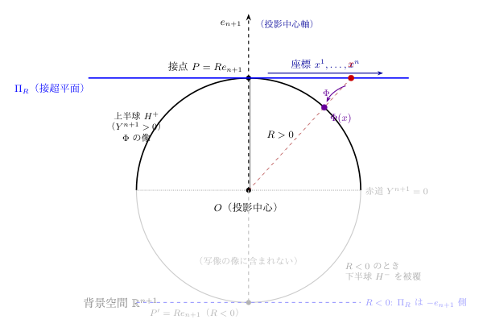
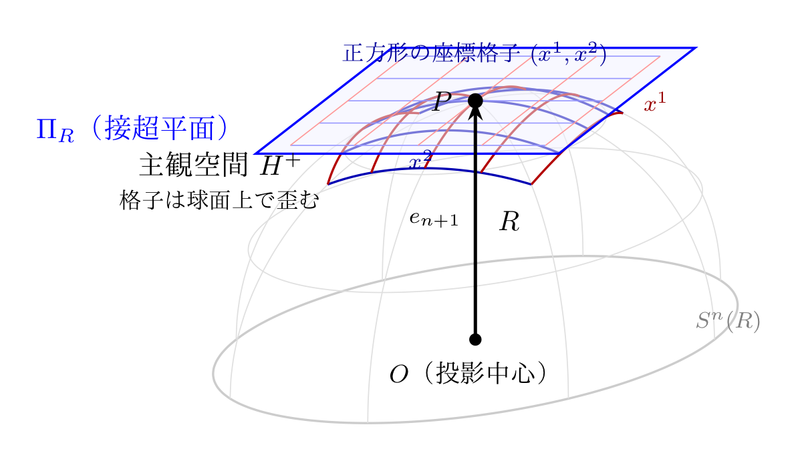
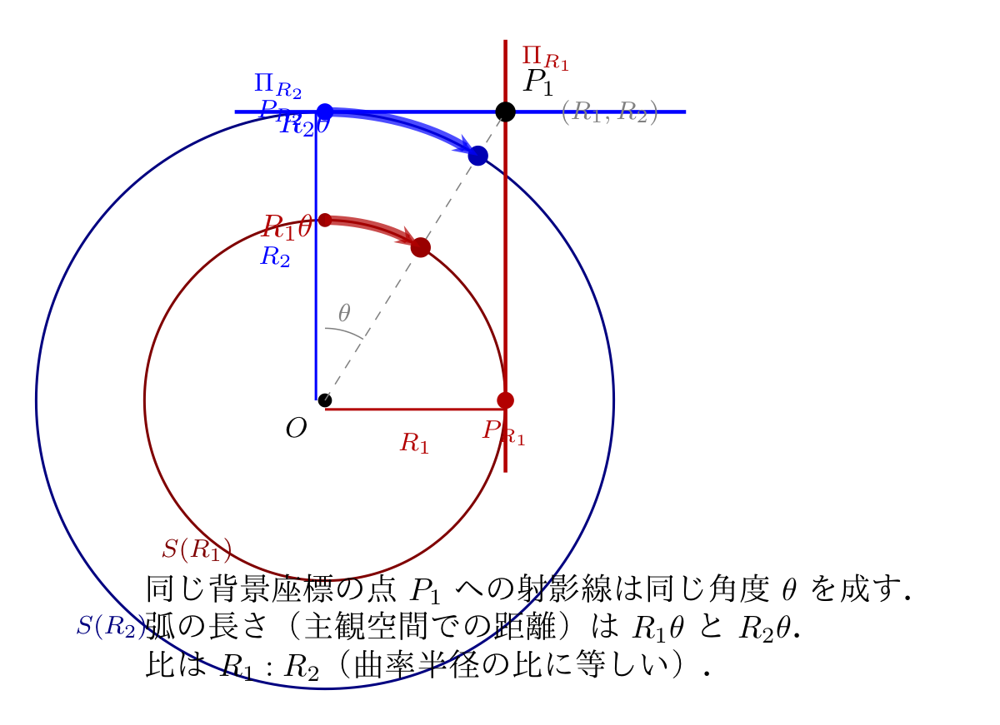

# 中心投影の幾何学的対称性：多軸モデルの数学的基盤

**著者：** Noriaki Kihara（木原 範昭）  
**所属：** WF System Co., Ltd.（大阪大学 基礎工学部 卒業）  
**作成日：** 2026年4月  
**種別：** 研究ノート（幾何学的考察）  
**DOI：** [10.5281/zenodo.19434932](https://doi.org/10.5281/zenodo.19434932)  
**前論文：** [1] 中心投影による4次元空間の幾何学的定式化. DOI: [10.5281/zenodo.19427780](https://doi.org/10.5281/zenodo.19427780).

---

## 概要

前稿 [1] において，中心投影（central projection）により $n$ 次元接超平面を超球面 $S^n(R)$ に写像し，誘導計量テンソルおよび Einstein テンソルを導出した．本稿では，この中心投影が持つ4つの幾何学的対称性を厳密に証明する：

1. **離散安定性：** 座標が零・正の整数・負の整数のいずれの値をとっても，写像が大域的に正則であり発散しないこと
2. **軸の対等性：** 背景空間 $\mathbb{R}^{n+1}$ のどの軸を投影中心に選んでも，写像の数学的構造が同一であること
3. **測地線偏差：** 主観空間 $H^+$（断面曲率 $K = 1/R^2$）上で，曲率半径 $R$ が測地線間の偏差を生み，そのスカラー量 $|\xi|^2$ が内部観測者に測定可能であること
4. **主観座標系の変換可能性：** 異なる軸を中心とする2つの中心投影の主観座標系が，逆射影と再射影の合成により相互変換可能であること

これら4つの性質は純粋に幾何学的な命題であり，物理的解釈を含まない．

---

## 1. はじめに

前稿 [1] は，$n$ 次元ユークリッド空間の接超平面 $\Pi_R$ から超球面 $S^n(R) \subset \mathbb{R}^{n+1}$ への中心投影を定義し，$n = 4$ の場合に誘導計量 $g_{\mu\nu}$ と Einstein テンソルを導出した．本稿の目的は，中心投影の構造そのものが持つ幾何学的対称性を明らかにすることである．

これらの対称性は，中心投影に基づくモデルが複数の独立な座標軸を包含しうるための数学的基盤を提供する．本稿では一切の物理的解釈を排除し，純粋に幾何学的な命題とその証明のみを述べる．

---

## 2. 準備：一般軸の中心投影

本節の用語は [1] §2 の定義に従う．読者の便宜のため，図と用語表を再掲する．

| 用語           | 定義                                                                          | 記号               |
| -------------- | ----------------------------------------------------------------------------- | ------------------ |
| **背景空間**   | 球面 $S^n(R)$ を含むユークリッド空間                                          | $\mathbb{R}^{n+1}$ |
| **接超平面**   | 接点 $P = Re_{n+1}$ を原点とし $e_{n+1}$ に直交する $n$ 次元平面              | $\Pi_R$            |
| **主観空間**   | $\Phi$ の像．球面の上半球 $\{Y^{n+1} > 0\}$．内部観測者が住む空間             | $H^+$              |
| **内部観測者** | 主観空間 $H^+$ の内部で計量 $g_{\mu\nu}$ のみを用いて測定を行う仮想的な観測者 | —                  |
| **曲率半径**   | 球面 $S^n(R)$ の半径．断面曲率は $K = 1/R^2$                                  | $R$                |
| **投影中心**   | 背景空間の原点（球の中心）                                                    | $O$                |
| **投影中心軸** | $O$ から接点 $P$ への方向（$e_{n+1}$ 方向）                                   | —                  |

本稿で追加する用語：

| 用語           | 定義                                                                                                                                                        | 記号                |
| -------------- | ----------------------------------------------------------------------------------------------------------------------------------------------------------- | ------------------- |
| **測地線偏差** | 隣接測地線間の偏差ベクトル $\xi^\mu$ の2乗ノルム $g_{\mu\nu}\xi^\mu\xi^\nu$．内部観測者が曲率半径 $R$ に起因して測定しうる $[L^2]$ 次元の量                 | $\lvert\xi\rvert^2$ |
| **大円**       | 主観空間 $H^+$ 上の測地線．背景空間において投影中心 $O$ を通る平面と $S^n(R)$ の交わりとして与えられる円．主観空間内では曲率半径 $R$ の円弧として現れる     | —                   |

**図 2.2（再掲）：** 接超平面 $\Pi_R$ 上の正方形格子が，中心投影 $\Phi$ により主観空間 $H^+$（球面上半球）上の曲線格子に写される．

**図 2.3（再掲）：曲率半径と主観距離の関係．** 同じ角度 $\theta$ に対する弧の長さは $R_1\theta$ と $R_2\theta$ であり，比は $R_1 : R_2$（曲率半径の比に等しい）．背景座標が同じでも曲率半径が異なれば主観距離は異なる．

### 2.1 中心投影と軸の記法

前稿 [1] 定義 2.1 の中心投影は，投影中心軸を $e_{n+1}$ に固定し，$l = \sqrt{R^2 + \sum_{i=1}^{n}(x^i)^2}$ とおいて次のように定義された：

$$\Phi: \Pi_R \to S^n(R), \quad (x^1, \ldots, x^n) \mapsto \left(\frac{Rx^1}{l}, \ldots, \frac{Rx^n}{l},\; \frac{R^2}{l}\right) \tag{2.1}$$

本稿では複数の軸を比較する．式 (2.1) の構造は投影中心軸の選択に依存しない——$e_{n+1}$ の役割を任意の基底ベクトル $e_A$（$A \in \{1, \ldots, n+1\}$）に置き換えれば，$\Phi$ の最後の成分 $R^2/l$ が $A$ 番目の成分に，残りの $n$ 個の成分が $\mu \neq A$ に対応するだけである．そこで投影中心軸 $e_A$ に対応する中心投影・接超平面・主観座標をそれぞれ $\Phi_A$, $\Pi_R^{(A)}$, $(x^\mu)_{\mu \neq A}$ と表し，式 (2.1) を書き直すと

$$Y^\mu = \frac{Rx^\mu}{l_A} \quad (\mu \neq A), \qquad Y^A = \frac{R^2}{l_A}, \qquad l_A = \sqrt{R^2 + \sum_{\mu \neq A}(x^\mu)^2} \tag{2.2}$$

が得られる．前稿の定義は $A = n+1$ の場合に他ならない．逆写像は $x^\mu = RY^\mu/Y^A$（$\mu \neq A$）であり（前稿 [1] §2），$\Phi_A$ の像は開半球面 $H_A^+ = \{Y \in S^n(R) \mid Y^A > 0\}$ である．

---

## 3. 対称性 I：離散安定性

**定理 3.1**（Euclidean 中心投影の大域的正則性）  
Euclidean 版の中心投影 $\Phi_A$ において，任意の座標値 $x^\mu \in \mathbb{R}$（$\mu \neq A$）に対して以下が成立する：

**(i)** $l_A^2 = R^2 + \displaystyle\sum_{\mu \neq A}(x^\mu)^2 \geq R^2 > 0$

**(ii)** $|Y^\mu| = R|x^\mu|/l_A < R$ （$\mu \neq A$）

**(iii)** $0 < Y^A = R^2/l_A \leq R$

特に，$x^\mu$ が零・正の整数・負の整数のいずれの値をとっても，$\Phi_A$ は定義域全体で正則であり，像は $S^n(R)$ の開半球面に含まれ，いかなる成分も発散しない．

**証明**  
(i) $\sum_{\mu \neq A}(x^\mu)^2 \geq 0$ であるから $l_A^2 \geq R^2 > 0$．  
(ii) $l_A^2 = R^2 + \sum(x^\mu)^2 > (x^\mu)^2$ であるから $|x^\mu| < l_A$．したがって $|Y^\mu| = R|x^\mu|/l_A < R$．  
(iii) $l_A > 0$ より $Y^A > 0$．$l_A \geq R$ より $Y^A = R^2/l_A \leq R$．等号は $x^\mu = 0$（全 $\mu \neq A$）のとき，すなわち接点 $P_A$ に一致するとき成立する．$\square$

**系 3.1**（負座標に対する不変性）  
2乗形式 $(x^\mu)^2$ は $x^\mu$ の符号に依存しない：

$$(-x^\mu)^2 = (x^\mu)^2 \qquad \forall\, x^\mu \tag{3.1}$$

したがって $l_A^2$ は各座標の符号に依存せず，$x^\mu$ と $-x^\mu$ に対して同一の値をとる．中心投影の全成分 $Y^\mu, Y^A$ もまた，$x^\mu$ の符号反転に対して $Y^\mu \to -Y^\mu$（反対側の点に写る）と整合的に変化し，$l_A$ の値自体は不変である．

**系 3.2**（$|x| \to \infty$ での漸近挙動）  
$r^2 = \sum_{\mu \neq A}(x^\mu)^2 \to \infty$ のとき：

$$Y^\mu \to \frac{Rx^\mu}{r} \quad \text{（有界，$|Y^\mu| \to R|x^\mu|/r$）}, \qquad Y^A = \frac{R^2}{l_A} \to 0 \tag{3.2}$$

すなわち写像の像は $S^n(R)$ の赤道面 $\{Y^A = 0\}$ に漸近するが，いかなる成分も発散しない．中心投影は無限遠を球面の赤道に「圧縮」する．

---

## 4. 対称性 II：軸の対等性

**定理 4.1**（軸の対等性）  
定義 2.1 の中心投影 $\Phi_A$ において，写像の数学的構造は軸の選択 $A$ に依存しない：

**(i)** 任意の $A, B \in \{1, \ldots, n+1\}$ に対し，$\Phi_A$ と $\Phi_B$ は同一の代数的構造を持つ．すなわち，軸の再命名（添え字の入れ替え $A \leftrightarrow B$）のもとで，式 (2.2) は形式的に同一である．

**(ii)** 引き戻し計量の構造も同一：軸 $A$ を中心として引き戻した計量は

$$g_{\mu\nu}^{(A)} = \frac{R^2}{l_A^2}\left(\delta_{\mu\nu} - \frac{x_\mu x_\nu}{l_A^2}\right) \qquad (\mu, \nu \neq A) \tag{4.1}$$

の形を持ち，曲率テンソル，リッチテンソル，Einstein テンソルはいずれも $A$ の選択に依存しない：

$$R_{\mu\nu\rho\sigma}^{(A)} = \frac{1}{R^2}(g_{\mu\rho}^{(A)}g_{\nu\sigma}^{(A)} - g_{\mu\sigma}^{(A)}g_{\nu\rho}^{(A)}), \qquad G_{\mu\nu}^{(A)} + \Lambda_n\, g_{\mu\nu}^{(A)} = 0 \tag{4.2}$$

**証明**  
(i) 式 (2.2) において $A$ は「投影中心軸」のラベルにすぎない．$A$ を $B$ に置き換えると $Y^\mu = Rx^\mu/l_B$（$\mu \neq B$），$Y^B = R^2/l_B$，$l_B^2 = R^2 + \sum_{\mu \neq B}(x^\mu)^2$ となり，同一の代数的構造が再現される．  
(ii) 前稿 [1] §3 の引き戻し計量の導出は，「投影中心軸」がどの軸であるかにのみ依存し，その計算は任意の $A$ に対して同一の手順で実行される．得られる計量 (4.1) は $S^n(R)$ の内在計量の座標表現であり，定曲率空間の曲率テンソル（[1] 定理 4.1）は計量のみから決まるため，$A$ の選択に依存しない．$\square$

**注意 4.1**（幾何学的解釈）  
定理 4.1 は，$S^n(R)$ の等長群 $SO(n+1)$（Euclidean 版）が $\mathbb{R}^{n+1}$ の軸方向の置換を含むことの反映である．$S^n(R)$ は最大対称空間であり [2, 3]，どの点を接点に選んでも同一の内在幾何が得られる．

**注意 4.2**（$R$ を変数とした場合の安定性）  
定義 2.1 において $R > 0$ は定数として導入したが，$R$ を正の変数（$R > 0$）としても写像の正則性は保たれる：$l_A^2 = R^2 + \sum(x^\mu)^2 > 0$ は $R > 0$ である限り成立する．$R$ の変動に伴い断面曲率 $K = 1/R^2$ および誘導計量は $R$ に依存するが，写像の定義域・全単射性は影響を受けない．

---

## 5. 対称性 III：測地線偏差

投影中心軸の値（曲率半径 $R$ またはその他の軸）は，Gauss の驚異定理 [2, Ch.4] により，主観空間 $H^+$ の内部観測者には長さ $[L]$ として直接測定できない．内部観測者が曲率半径 $R$ の存在を認識する手段の一つが，隣接する2本の測地線間の偏差——すなわち**測地線偏差** $|\xi|^2$（§2 用語表）——である．

**定義 5.1**（測地線偏差の2乗ノルム）  
偏差ベクトル $\xi^\mu$ に対し，誘導計量 $g_{\mu\nu}$ による2乗ノルム

$$|\xi|^2 \;=\; g_{\mu\nu}\,\xi^\mu\,\xi^\nu \tag{5.5}$$

を**測地線偏差の2乗ノルム**と呼ぶ．以下，本論文において「測地線偏差」とは，特に断らない限りこの $|\xi|^2$ を指す．

### 5.1 Jacobi 方程式と $S^n(R)$ 上の偏差ベクトル

**定理 5.1**（測地線偏差方程式 [2, 3]）  
リーマン多様体 $(M, g)$ 上の測地線の1パラメータ族 $\gamma_s(\tau)$ に対し，偏差ベクトル $\xi^\mu = \partial \gamma_s^\mu / \partial s$ は Jacobi 方程式

$$\frac{D^2 \xi^\mu}{d\tau^2} = -R^\mu{}_{\nu\rho\sigma}\, u^\nu \xi^\rho u^\sigma \tag{5.1}$$

を満たす．ここで $D/d\tau$ は測地線に沿った共変微分，$u^\mu = d\gamma^\mu/d\tau$ は接線ベクトルである．

**命題 5.1**（$S^n(R)$ 上の偏差ベクトル）  
定曲率空間 $S^n(R)$ のリーマン曲率テンソル（[1] 定理 4.1）

$$R^\mu{}_{\nu\rho\sigma} = \frac{1}{R^2}(\delta^\mu_\rho\, g_{\nu\sigma} - \delta^\mu_\sigma\, g_{\nu\rho}) \tag{5.2}$$

を Jacobi 方程式 (5.1) に代入すると，弧長パラメータ（$g_{\nu\sigma}u^\nu u^\sigma = 1$）に対して

$$\frac{D^2 \xi^\mu}{d\tau^2} = -\frac{1}{R^2}\left(\xi^\mu - (u_\sigma \xi^\sigma)\, u^\mu\right) \tag{5.3}$$

が得られる．測地線に直交する成分 $\xi^\mu_\perp$（$u_\mu \xi^\mu_\perp = 0$）に対しては

$$\frac{D^2 \xi^\mu_\perp}{d\tau^2} = -\frac{1}{R^2}\,\xi^\mu_\perp \tag{5.4}$$

**証明**  
(5.2) を (5.1) に代入する：$-R^\mu{}_{\nu\rho\sigma}\, u^\nu \xi^\rho u^\sigma = -(1/R^2)(\delta^\mu_\rho\, g_{\nu\sigma}\, u^\nu u^\sigma\, \xi^\rho - \delta^\mu_\sigma\, g_{\nu\rho}\, u^\nu \xi^\rho\, u^\sigma) = -(1/R^2)(\xi^\mu - (u_\sigma\xi^\sigma)u^\mu)$．弧長条件 $g_{\nu\sigma}u^\nu u^\sigma = 1$ を用いた．直交成分 $u_\mu\xi^\mu_\perp = 0$ に対し第2項が消えて (5.4) を得る．負符号は正曲率空間における測地線の収束（振動的偏差 $\xi_\perp \propto \cos(\tau/R)$）を反映する．$\square$

### 5.2 測地線偏差の次元と符号不変性

**定理 5.2**（測地線偏差 $|\xi|^2$ の次元と符号不変性）  
定義 5.1 の $|\xi|^2 = g_{\mu\nu}\,\xi^\mu\,\xi^\nu$ に対し，以下が成立する：

**(i) 次元：** $|\xi|^2$ の次元は $[L^2]$ である．$g_{\mu\nu}$ は $R^2$ の有理式であり $R$（奇数冪）を独立に含まないから（(4.1) より），投影中心軸の値は $[L]$ として内部から測定不可能であり，$R^2$（$[L^2]$）を通じてのみ $|\xi|^2$ に寄与する．軸の対等性（定理 4.1）により，この性質はすべての軸に等しく適用される．

**(ii) 符号不変性：** $|\xi|^2 = g_{\mu\nu}\,\xi^\mu\,\xi^\nu$ はリーマン的二次形式から作られるスカラー不変量であり，任意の座標の符号反転 $x^\mu \to -x^\mu$ のもとで値が不変である．したがって主観空間 $H^+$ の内部観測者は，$|\xi|^2$ の測定から座標の正負を弁別することはできない．

**証明**  
(i) $g_{\mu\nu}$ は無次元（$R^2/l_A^2$ と $x_\mu x_\nu/l_A^2$ の組合せ），$\xi^\mu$ は $[L]$ であるから $|\xi|^2$ は $[L^2]$．$g_{\mu\nu} = (R^2/l_A^2)(\delta_{\mu\nu} - x_\mu x_\nu/l_A^2)$ において $R$ は $R^2$ を通じてのみ現れる．  
(ii) $|\xi|^2 = g_{\mu\nu}\,\xi^\mu\,\xi^\nu$ はスカラー不変量（0階テンソル）であるから，符号反転 $\phi \to -\phi$ を含む任意の座標変換の下で不変である．座標の向き付けを弁別するには擬スカラー（Levi-Civita 記号を含む量）が必要であるが，$|\xi|^2$ はそれを含まない．$\square$

**注意 5.1**（定理 5.2 の意味）  
曲率半径 $R$ は $[L]$ として内部観測者に測定不可能であるが，測地線偏差 $|\xi|^2$ は $[L^2]$ 次元の量として主観空間 $H^+$ 内から測定可能である．ただしこの量はスカラー不変量であるため，座標の符号も曲率の方向も内部観測者には弁別できない．$R$ から内部観測者に到達する情報は，$|\xi|^2$ という符号を持たない正の量に集約される．曲率の方向や座標の正負は背景空間 $\mathbb{R}^{n+1}$ においてのみ定義される情報であり，主観空間の内在幾何には現れない．

---

## 6. 対称性 IV：主観座標系の変換可能性

本節では，異なる軸を投影中心とする2つの中心投影の「主観座標系」が，球面上の点（「神の目」座標）を経由して相互変換可能であることを示す．

### 6.1 神の目座標と主観座標

**定義 6.1**  
$S^n(R)$ 上の点 $Y = (Y^1, \ldots, Y^{n+1})$（$\sum_{A=1}^{n+1}(Y^A)^2 = R^2$）を**神の目座標**（embedding coordinates）と呼ぶ．

軸 $A$ を投影中心とした中心投影 $\Phi_A$ の逆写像（§2.1）により得られる座標 $(x^\mu)_{\mu \neq A}$ を，軸 $A$ に対する**主観座標**と呼ぶ．

### 6.2 座標変換の構成

**定理 6.1**（主観座標系の変換可能性）  
$A, B \in \{1, \ldots, n+1\}$（$A \neq B$）を異なる2つの軸とする．$\Phi_A$ の像 $H_A^+ = \{Y \in S^n(R) \mid Y^A > 0\}$ と $\Phi_B$ の像 $H_B^+ = \{Y \in S^n(R) \mid Y^B > 0\}$ の共通部分を $U_{AB} = H_A^+ \cap H_B^+$ とする．$U_{AB}$ は $S^n(R)$ の空でない開集合である．

$U_{AB}$ に対応する主観座標の間に，合成写像

$$T_{A \to B} = \Phi_B^{-1} \circ \Phi_A: \Phi_A^{-1}(U_{AB}) \to \Phi_B^{-1}(U_{AB}) \tag{6.1}$$

が定義され，これは $C^\infty$ 級の微分同相写像である．

**証明**  
$\Phi_A$ は $\Pi_R^{(A)}$ から $H_A^+$ への $C^\infty$ 級全単射であり（定理 3.1），$\Phi_B^{-1}$ は $H_B^+$ から $\Pi_R^{(B)}$ への $C^\infty$ 級全単射である．$U_{AB}$ は空でない（例えば $Y = (R/\sqrt{n+1})\,(1,1,\ldots,1) \in U_{AB}$）．$\Phi_A$ と $\Phi_B^{-1}$ がともに $C^\infty$ 級であるから，合成 $T_{A \to B}$ も $C^\infty$ 級である．逆写像 $T_{B \to A} = \Phi_A^{-1} \circ \Phi_B$ が同様に $C^\infty$ 級であるから，$T_{A \to B}$ は微分同相写像である．$\square$

### 6.3 変換の明示的公式

**命題 6.1**（主観座標変換の明示的公式）  
軸 $A$ の主観座標 $(x^\mu)_{\mu \neq A}$ から軸 $B$ の主観座標 $(x'^\nu)_{\nu \neq B}$ への変換 $T_{A \to B}$ は以下の手順で与えられる：

**Step 1**（射影：主観座標 → 神の目座標）

$$Y^\mu = \frac{Rx^\mu}{l_A} \quad (\mu \neq A), \qquad Y^A = \frac{R^2}{l_A} \tag{6.2}$$

**Step 2**（逆射影：神の目座標 → 別の主観座標）

$$x'^\nu = \frac{R\,Y^\nu}{Y^B} \quad (\nu \neq B) \tag{6.3}$$

この2段階を合成すると，$\nu \neq B$ かつ $\nu \neq A$ の場合：

$$x'^\nu = \frac{R \cdot Rx^\nu / l_A}{Rx^B/l_A} = x^\nu \quad \text{（$A$ でも $B$ でもない軸は不変）} \tag{6.4}$$

$\nu = A$（すなわち $A$ 軸の主観座標を $B$ 軸の主観座標で表す）の場合：

$$x'^A = \frac{R \cdot Y^A}{Y^B} = \frac{R \cdot R^2/l_A}{Rx^B/l_A} = \frac{R^2}{x^B} \tag{6.5}$$

**証明**  
(6.4)：$\nu \neq A$ かつ $\nu \neq B$ のとき，$Y^\nu = Rx^\nu/l_A$ であり，$Y^B = Rx^B/l_A$ であるから，$x'^\nu = RY^\nu/Y^B = R(Rx^\nu/l_A)/(Rx^B/l_A) = x^\nu$．  
(6.5)：$Y^A = R^2/l_A$，$Y^B = Rx^B/l_A$ であるから，$x'^A = RY^A/Y^B = R(R^2/l_A)/(Rx^B/l_A) = R^2/x^B$．$\square$

**注意 6.1**（変換の構造）  
式 (6.4)--(6.5) は次の構造を持つ：

- $A$ でも $B$ でもない軸の座標は変換で**不変**（$x'^\nu = x^\nu$）
- $A$ 軸と $B$ 軸の間には反転的関係 $x'^A = R^2/x^B$ が成立する

この変換は $S^n(R)$ 上の点を経由する純粋な幾何演算であり，いかなる物理的仮定も含まない．

**注意 6.2**（推移性）  
3つ以上の軸 $A, B, C$ に対して，$T_{A \to C} = T_{B \to C} \circ T_{A \to B}$ が成立する．これは $T_{A \to B}$ が神の目座標を経由するため自明に従う：

$$\Pi_R^{(A)} \xrightarrow{\Phi_A} S^n(R) \xrightarrow{\Phi_B^{-1}} \Pi_R^{(B)} \xrightarrow{\Phi_B} S^n(R) \xrightarrow{\Phi_C^{-1}} \Pi_R^{(C)}$$

中間の $\Phi_B^{-1} \circ \Phi_B = \mathrm{id}$ が消えるため，$T_{A \to C} = \Phi_C^{-1} \circ \Phi_A$ に帰着する．

### 6.4 座標変換の Jacobian とスケールファクター

**命題 6.2**（座標変換の Jacobian）  
$T_{A \to B}$ の Jacobian は以下で与えられる：

**(i)** $A$ でも $B$ でもない軸 $\nu$ に対し：$\dfrac{\partial x'^\nu}{\partial x^\mu} = \delta^\nu_\mu$（恒等）

**(ii)** $\nu = A$，$\mu = B$ の成分：

$$\frac{\partial x'^A}{\partial x^B} = -\frac{R^2}{(x^B)^2} \tag{6.6}$$

このスケールファクターは $[L]/[L]$（無次元）であり，**1次**である．

**証明**  
(i) (6.4) より $x'^\nu = x^\nu$（$\nu \neq A, \nu \neq B$）であるから偏微分は Kronecker delta．(ii) (6.5) より $x'^A = R^2/x^B$ であるから $\partial x'^A/\partial x^B = -R^2/(x^B)^2$．次元：$[L^2]/[L^2] = [L^0]$．$\square$

**命題 6.3**（計量テンソル成分の変換）  
$B$ 軸の主観座標 $(x^\mu)_{\mu \neq B}$ における計量成分 $g_{Bj}$（$j \neq B$，$j \neq A$）が，$A$ 軸の主観座標 $(x'^\nu)_{\nu \neq A}$ では

$$g'_{Aj} = \frac{\partial x^B}{\partial x'^A}\, g_{Bj} = -\frac{(x^B)^2}{R^2}\, g_{Bj} \tag{6.7}$$

と変換される．

**注意 6.3**（スケールファクターの次数）  
座標変換はテンソルの各添え字に対して Jacobian を1回適用する規則（1次のテンソル変換則）に従う．

### 6.5 等質性と位置情報の構造的脱落

**命題 6.4**（等質空間としての $S^n(R)$）  
超球面 $S^n(R)$ の等長群は $O(n+1)$ であり，$S^n(R)$ 上に推移的に作用する：

$$S^n(R) \cong SO(n+1)\,/\,SO(n) \tag{6.8}$$

すなわち，任意の2点 $P, Q \in S^n(R)$ に対し，$\sigma(P) = Q$ を満たす等長変換 $\sigma \in SO(n+1)$ が存在する [2, Ch.8; 4]．

**命題 6.5**（位置情報の構造的脱落）  
遷移関数 $T_{A \to B}$ に入るパラメータは曲率半径 $R$ と座標値 $x^\mu$ のみである．背景空間 $\mathbb{R}^{n+1}$ における投影中心の絶対位置は $T_{A \to B}$ に現れない．

**証明**  
命題 6.4 により，球面上の任意の点は等長変換で他の任意の点に移せる．等長変換は内在計量を保存するから，接点の選択は等長変換の違いに吸収される．命題 6.1 の明示的公式 (6.4)--(6.5) において，右辺に現れるのは $R$ と座標値のみであり，接点の位置座標は含まれない．$\square$

---

## 7. 結果の整理

| 対称性              | 内容                                                                                                                                                        | 式番号       | 根拠                                                                                                     |
| ------------------- | ----------------------------------------------------------------------------------------------------------------------------------------------------------- | ------------ | -------------------------------------------------------------------------------------------------------- |
| **I. 離散安定性**   | 任意の $x^\mu \in \mathbb{Z}$（零・正・負）に対し $l_A > 0$，写像は正則で全成分有界                                                                         | (3.1)--(3.2) | 定理 3.1                                                                                                 |
| **II. 軸の対等性**  | どの軸を投影中心に選んでも，写像・計量・曲率テンソルの構造は同一                                                                                            | (4.1)--(4.2) | 定理 4.1                                                                                                 |
| **III. 測地線偏差** | $                                                                                                                                                           | \xi          | ^2 = g_{\mu\nu}\xi^\mu\xi^\nu$ は $[L^2]$ 次元のスカラー不変量．座標の符号も曲率方向も内部から弁別不可能 | (5.1)--(5.5) | 定義 5.1, 定理 5.2 |
| **IV. 座標変換**    | 異なる軸の主観座標は逆射影→再射影で $C^\infty$ 級に相互変換可能．スケールファクターは1次（$[L]/[L]$）．等質性により位置情報は脱落し，$R$ が唯一のパラメータ | (6.1)--(6.8) | 定理 6.1, 命題 6.2--6.5                                                                                  |

これら4つの対称性により，中心投影に基づくモデルは以下の構造的能力を持つ：

1. 離散的な整数値（零・正・負）をとる座標軸を安全に追加できる（対称性 I）
2. 追加軸も既存軸と完全に同一の幾何学的構造を持つ（対称性 II）
3. 任意の軸方向の曲率半径 $R$ が測地線偏差 $|\xi|^2$ を生む．$|\xi|^2$ は $[L^2]$ 次元のスカラー不変量であり，座標の正負も曲率方向も内部観測者には弁別できない（対称性 III, 定理 5.2）
4. 異なる軸を中心とする主観座標系は整合的に変換可能であり，計量成分の変換スケールは1次（各添え字につき Jacobian 1回）である（対称性 IV, 命題 6.2--6.3）
5. 等質性により座標変換に位置情報は混入せず，$R$ が唯一の外部パラメータである（命題 6.4--6.5）

---

## 参考文献

[1] Kihara, N. (2026). 中心投影による4次元空間の幾何学的定式化. DOI: [10.5281/zenodo.19427780](https://doi.org/10.5281/zenodo.19427780).

[2] do Carmo, M. P., *Riemannian Geometry*, Birkhaeuser, Boston, 1992, Chapter 4, 8.

[3] Wald, R. M., *General Relativity*, University of Chicago Press, Chicago, 1984, Appendix C, D.

[4] Wolf, J. A., *Spaces of Constant Curvature*, 6th ed., AMS Chelsea Publishing, Providence, 2011, Chapter 2.

---

*本稿は純粋に幾何学的な命題の証明に限定される．物理的解釈は行わない．*