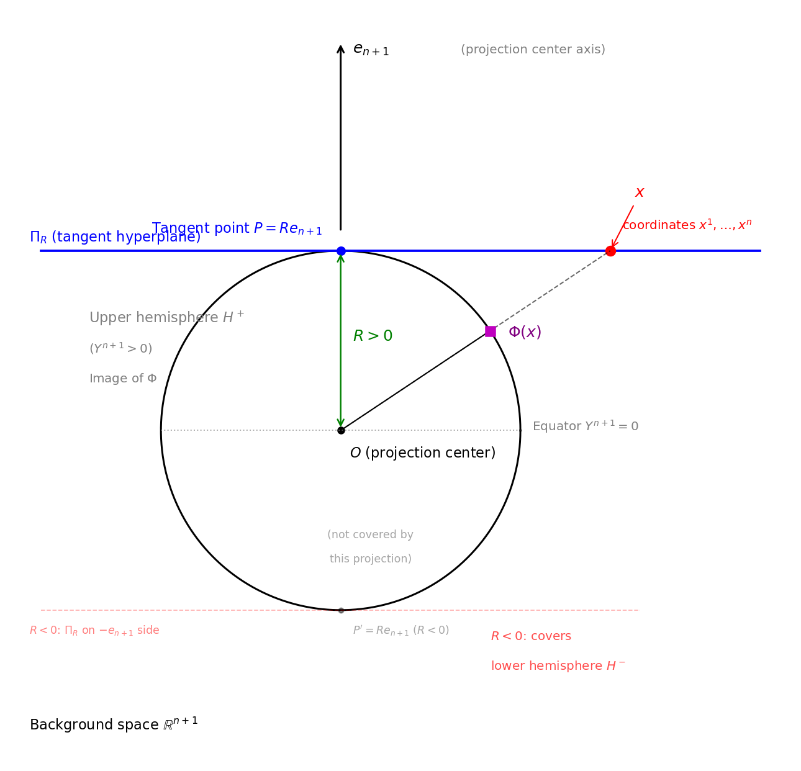
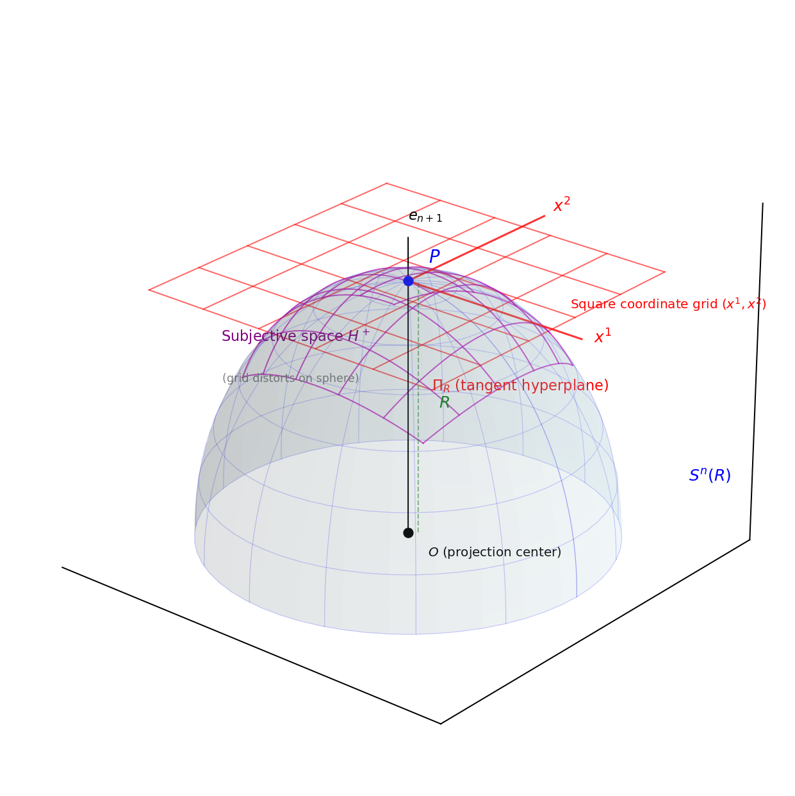
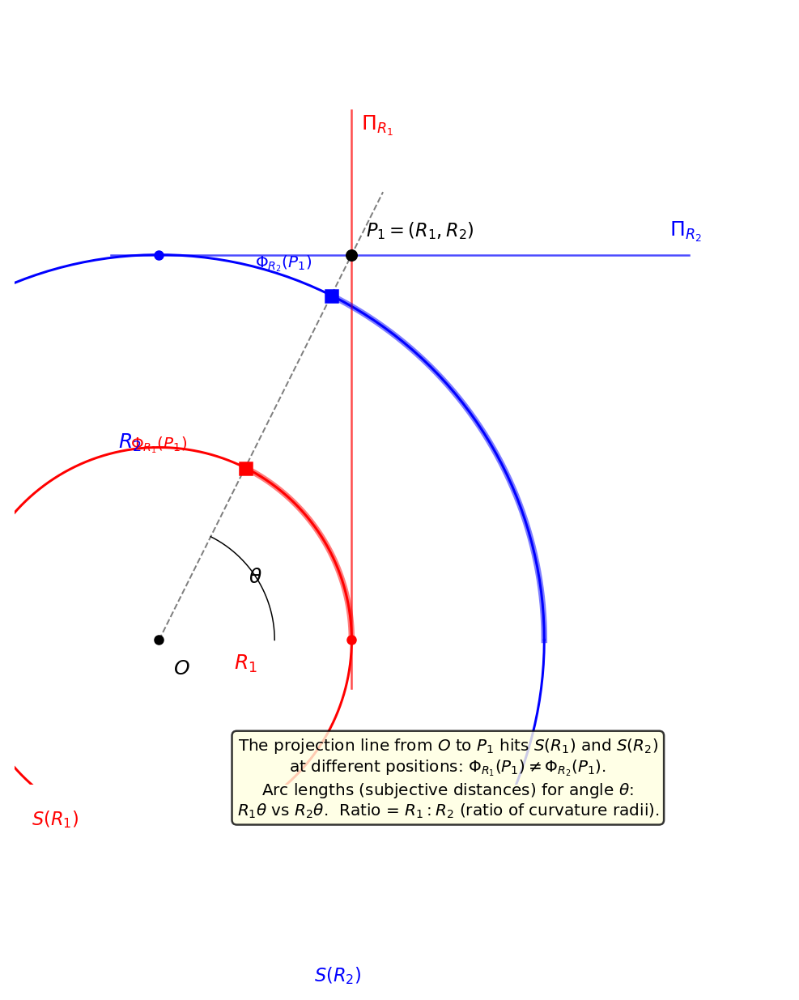

# Geometric Symmetries of Central Projection: Mathematical Foundations of the Multi-Axis Model

**Author:** Noriaki Kihara  
**Affiliation:** WF System Co., Ltd. (B.Eng., Osaka University, School of Engineering Science)  
**Date:** April 2026  
**Category:** Research Note (Geometric Considerations)  
**DOI:** [10.5281/zenodo.19434932](https://doi.org/10.5281/zenodo.19434932)  
**Preceding paper:** [1] Geometric Formulation of 4-Dimensional Space via Central Projection. DOI: [10.5281/zenodo.19427780](https://doi.org/10.5281/zenodo.19427780).

---

## Abstract

In the preceding paper [1], central projection was used to map an $n$-dimensional tangent hyperplane onto the hypersphere $S^n(R)$, and the induced metric tensor and Einstein tensor were derived. In this paper, we rigorously prove five geometric symmetries possessed by this central projection:

1. **Discrete stability:** The mapping is globally regular and non-divergent regardless of whether coordinates take zero, positive integer, or negative integer values
2. **Axis equivalence:** The mathematical structure of the mapping is identical regardless of which axis of the background space $\mathbb{R}^{n+1}$ is chosen as the projection center
3. **Geodesic deviation:** On the subjective space $H^+$ (sectional curvature $K = 1/R^2$), the curvature radius $R$ generates deviation between geodesics, and the scalar quantity $|\xi|^2$ is measurable by an internal observer
4. **Transformability of subjective coordinate systems:** The subjective coordinate systems of two central projections centered on different axes are mutually transformable via the composition of inverse projection and re-projection
5. **Centripetal acceleration on great circles:** An internal observer in uniform circular motion along a great circle (geodesic) of the subjective space measures a centripetal acceleration $a = R\omega^2$ as a scalar, determined by the curvature radius $R$ and angular velocity $\omega$. This quantity gives only the magnitude of the acceleration; the direction is indiscernible to the internal observer

These five properties are purely geometric propositions and contain no physical interpretation.

---

## 1. Introduction

The preceding paper [1] defined central projection from the tangent hyperplane $\Pi_R$ of $n$-dimensional Euclidean space to the hypersphere $S^n(R) \subset \mathbb{R}^{n+1}$, and derived the induced metric $g_{\mu\nu}$ and Einstein tensor for the case $n = 4$. The purpose of this paper is to elucidate the geometric symmetries inherent in the structure of central projection itself.

These symmetries provide the mathematical foundation for a model based on central projection to encompass multiple independent coordinate axes. This paper excludes all physical interpretations and presents only purely geometric propositions and their proofs.

---

## 2. Preliminaries: Central Projection with General Axis

The terminology in this section follows the definitions in [1] $\S$2. For the reader's convenience, we reproduce the figures and terminology table.

| Term | Definition | Symbol |
| ---- | ---------- | ------ |
| **Background space** | The Euclidean space containing the sphere $S^n(R)$ | $\mathbb{R}^{n+1}$ |
| **Tangent hyperplane** | The $n$-dimensional plane with origin at the tangent point $P = Re_{n+1}$, orthogonal to $e_{n+1}$ | $\Pi_R$ |
| **Subjective space** | The image of $\Phi$. The upper hemisphere $\{Y^{n+1} > 0\}$ of the sphere. The space where the internal observer resides | $H^+$ |
| **Internal observer** | A hypothetical observer who performs measurements within the subjective space $H^+$ using only the metric $g_{\mu\nu}$ | --- |
| **Curvature radius** | The radius of the sphere $S^n(R)$. The sectional curvature is $K = 1/R^2$ | $R$ |
| **Projection center** | The origin of the background space (center of the sphere) | $O$ |
| **Projection center axis** | The direction from $O$ to the tangent point $P$ ($e_{n+1}$ direction) | --- |

Additional terminology introduced in this paper:

| Term | Definition | Symbol |
| ---- | ---------- | ------ |
| **Geodesic deviation** | The squared norm $g_{\mu\nu}\xi^\mu\xi^\nu$ of the deviation vector $\xi^\mu$ between adjacent geodesics. A quantity of dimension $[L^2]$ that the internal observer can measure, arising from the curvature radius $R$ | $\lvert\xi\rvert^2$ |
| **Great circle** | A geodesic on the subjective space $H^+$. Given as the intersection of a plane passing through the projection center $O$ in the background space with $S^n(R)$. Appears as a circular arc of curvature radius $R$ within the subjective space | --- |
| **Centripetal acceleration** | The magnitude of acceleration measured by an internal observer in uniform circular motion along a great circle, as the rate of change in direction of velocity with respect to proper time. Given by the classical mechanics formula $a = R\omega^2 = v^2/R$ | $a$ |

**Figure 2.2 (reproduced):** The square grid on the tangent hyperplane $\Pi_R$ is mapped by the central projection $\Phi$ to a curved grid on the subjective space $H^+$ (upper hemisphere of the sphere).

**Figure 2.3 (reproduced): Relationship between curvature radius and subjective distance.** The arc length for the same angle $\theta$ is $R_1\theta$ and $R_2\theta$, and the ratio is $R_1 : R_2$ (equal to the ratio of curvature radii). Even if the background coordinates are the same, if the curvature radii differ, the subjective distances differ.

### 2.1 Central Projection and Axis Notation

The central projection in Definition 2.1 of the preceding paper [1] was defined by fixing the projection center axis to $e_{n+1}$ and setting $l = \sqrt{R^2 + \sum_{i=1}^{n}(x^i)^2}$:

$$\Phi: \Pi_R \to S^n(R), \quad (x^1, \ldots, x^n) \mapsto \left(\frac{Rx^1}{l}, \ldots, \frac{Rx^n}{l},\; \frac{R^2}{l}\right) \tag{2.1}$$

In this paper, we compare multiple axes. The structure of Eq. (2.1) does not depend on the choice of projection center axis---replacing the role of $e_{n+1}$ with any basis vector $e_A$ ($A \in \{1, \ldots, n+1\}$) merely makes the last component $R^2/l$ of $\Phi$ correspond to the $A$-th component, with the remaining $n$ components corresponding to $\mu \neq A$. Accordingly, we denote the central projection, tangent hyperplane, and subjective coordinates corresponding to the projection center axis $e_A$ by $\Phi_A$, $\Pi_R^{(A)}$, $(x^\mu)_{\mu \neq A}$, respectively, and rewrite Eq. (2.1) as

$$Y^\mu = \frac{Rx^\mu}{l_A} \quad (\mu \neq A), \qquad Y^A = \frac{R^2}{l_A}, \qquad l_A = \sqrt{R^2 + \sum_{\mu \neq A}(x^\mu)^2} \tag{2.2}$$

The definition in the preceding paper is nothing but the case $A = n+1$. The inverse mapping is $x^\mu = RY^\mu/Y^A$ ($\mu \neq A$) (preceding paper [1] $\S$2), and the image of $\Phi_A$ is the open hemisphere $H_A^+ = \{Y \in S^n(R) \mid Y^A > 0\}$.

---

## 3. Symmetry I: Discrete Stability

**Theorem 3.1** (Global Regularity of Euclidean Central Projection)  
For the Euclidean version of central projection $\Phi_A$, the following hold for arbitrary coordinate values $x^\mu \in \mathbb{R}$ ($\mu \neq A$):

**(i)** $l_A^2 = R^2 + \displaystyle\sum_{\mu \neq A}(x^\mu)^2 \geq R^2 > 0$

**(ii)** $|Y^\mu| = R|x^\mu|/l_A < R$ ($\mu \neq A$)

**(iii)** $0 < Y^A = R^2/l_A \leq R$

In particular, regardless of whether $x^\mu$ takes zero, positive integer, or negative integer values, $\Phi_A$ is regular on the entire domain, the image is contained in the open hemisphere of $S^n(R)$, and no component diverges.

**Proof**  
(i) Since $\sum_{\mu \neq A}(x^\mu)^2 \geq 0$, we have $l_A^2 \geq R^2 > 0$.  
(ii) Since $l_A^2 = R^2 + \sum(x^\mu)^2 > (x^\mu)^2$, we have $|x^\mu| < l_A$. Therefore $|Y^\mu| = R|x^\mu|/l_A < R$.  
(iii) From $l_A > 0$, $Y^A > 0$. From $l_A \geq R$, $Y^A = R^2/l_A \leq R$. Equality holds when $x^\mu = 0$ (for all $\mu \neq A$), i.e., when coinciding with the tangent point $P_A$. $\square$

**Corollary 3.1** (Invariance under Negative Coordinates)  
The squared form $(x^\mu)^2$ is independent of the sign of $x^\mu$:

$$(-x^\mu)^2 = (x^\mu)^2 \qquad \forall\, x^\mu \tag{3.1}$$

Therefore $l_A^2$ is independent of the sign of each coordinate and takes the same value for $x^\mu$ and $-x^\mu$. All components $Y^\mu, Y^A$ of the central projection also change consistently under sign reversal of $x^\mu$ as $Y^\mu \to -Y^\mu$ (mapped to the opposite point), while the value of $l_A$ itself remains invariant.

**Corollary 3.2** (Asymptotic Behavior as $|x| \to \infty$)  
As $r^2 = \sum_{\mu \neq A}(x^\mu)^2 \to \infty$:

$$Y^\mu \to \frac{Rx^\mu}{r} \quad \text{(bounded, $|Y^\mu| \to R|x^\mu|/r$)}, \qquad Y^A = \frac{R^2}{l_A} \to 0 \tag{3.2}$$

That is, the image of the mapping approaches the equatorial plane $\{Y^A = 0\}$ of $S^n(R)$ asymptotically, but no component diverges. The central projection "compresses" infinity to the equator of the sphere.

---

## 4. Symmetry II: Axis Equivalence

**Theorem 4.1** (Axis Equivalence)  
For the central projection $\Phi_A$ of Definition 2.1, the mathematical structure of the mapping is independent of the axis choice $A$:

**(i)** For arbitrary $A, B \in \{1, \ldots, n+1\}$, $\Phi_A$ and $\Phi_B$ have the same algebraic structure. That is, under axis relabeling (index exchange $A \leftrightarrow B$), Eq. (2.2) is formally identical.

**(ii)** The structure of the pullback metric is also identical: the metric pulled back with axis $A$ as center has the form

$$g_{\mu\nu}^{(A)} = \frac{R^2}{l_A^2}\left(\delta_{\mu\nu} - \frac{x_\mu x_\nu}{l_A^2}\right) \qquad (\mu, \nu \neq A) \tag{4.1}$$

and the curvature tensor, Ricci tensor, and Einstein tensor are all independent of the choice of $A$:

$$R_{\mu\nu\rho\sigma}^{(A)} = \frac{1}{R^2}(g_{\mu\rho}^{(A)}g_{\nu\sigma}^{(A)} - g_{\mu\sigma}^{(A)}g_{\nu\rho}^{(A)}), \qquad G_{\mu\nu}^{(A)} + \Lambda_n\, g_{\mu\nu}^{(A)} = 0 \tag{4.2}$$

**Proof**  
(i) In Eq. (2.2), $A$ is merely a label for the "projection center axis." Replacing $A$ with $B$ gives $Y^\mu = Rx^\mu/l_B$ ($\mu \neq B$), $Y^B = R^2/l_B$, $l_B^2 = R^2 + \sum_{\mu \neq B}(x^\mu)^2$, reproducing the same algebraic structure.  
(ii) The derivation of the pullback metric in [1] $\S$3 depends only on which axis is the "projection center axis," and the computation is carried out by the same procedure for any $A$. The resulting metric (4.1) is a coordinate expression of the intrinsic metric of $S^n(R)$, and since the curvature tensor of a constant curvature space ([1] Theorem 4.1) is determined solely by the metric, it is independent of the choice of $A$. $\square$

**Remark 4.1** (Geometric Interpretation)  
Theorem 4.1 reflects the fact that the isometry group $SO(n+1)$ (Euclidean version) of $S^n(R)$ includes permutations of axis directions in $\mathbb{R}^{n+1}$. $S^n(R)$ is a maximally symmetric space [2, 3], and the same intrinsic geometry is obtained regardless of which point is chosen as the tangent point.

**Remark 4.2** (Stability when $R$ is Treated as a Variable)  
In Definition 2.1, $R > 0$ was introduced as a constant, but the regularity of the mapping is preserved even when $R$ is treated as a positive variable ($R > 0$): $l_A^2 = R^2 + \sum(x^\mu)^2 > 0$ holds as long as $R > 0$. Although the sectional curvature $K = 1/R^2$ and the induced metric depend on $R$ as $R$ varies, the domain and bijectivity of the mapping are unaffected.

---

## 5. Symmetry III: Geodesic Deviation

The value of the projection center axis (curvature radius $R$ or other axes) cannot be directly measured as a length $[L]$ by an internal observer in the subjective space $H^+$, by Gauss's Theorema Egregium [2, Ch.4]. One means by which the internal observer can recognize the existence of the curvature radius $R$ is the deviation between two adjacent geodesics---namely, the **geodesic deviation** $|\xi|^2$ ($\S$2 terminology table).

**Definition 5.1** (Squared Norm of Geodesic Deviation)  
For the deviation vector $\xi^\mu$, the squared norm with respect to the induced metric $g_{\mu\nu}$

$$|\xi|^2 \;=\; g_{\mu\nu}\,\xi^\mu\,\xi^\nu \tag{5.5}$$

is called the **squared norm of geodesic deviation**. Hereafter in this paper, "geodesic deviation" refers to this $|\xi|^2$ unless otherwise stated.

### 5.1 Jacobi Equation and Deviation Vector on $S^n(R)$

**Theorem 5.1** (Geodesic Deviation Equation [2, 3])  
For a one-parameter family of geodesics $\gamma_s(\tau)$ on a Riemannian manifold $(M, g)$, the deviation vector $\xi^\mu = \partial \gamma_s^\mu / \partial s$ satisfies the Jacobi equation

$$\frac{D^2 \xi^\mu}{d\tau^2} = -R^\mu{}_{\nu\rho\sigma}\, u^\nu \xi^\rho u^\sigma \tag{5.1}$$

where $D/d\tau$ is the covariant derivative along the geodesic and $u^\mu = d\gamma^\mu/d\tau$ is the tangent vector.

**Proposition 5.1** (Deviation Vector on $S^n(R)$)  
Substituting the Riemann curvature tensor of the constant curvature space $S^n(R)$ ([1] Theorem 4.1)

$$R^\mu{}_{\nu\rho\sigma} = \frac{1}{R^2}(\delta^\mu_\rho\, g_{\nu\sigma} - \delta^\mu_\sigma\, g_{\nu\rho}) \tag{5.2}$$

into the Jacobi equation (5.1), for the arc length parameter ($g_{\nu\sigma}u^\nu u^\sigma = 1$),

$$\frac{D^2 \xi^\mu}{d\tau^2} = -\frac{1}{R^2}\left(\xi^\mu - (u_\sigma \xi^\sigma)\, u^\mu\right) \tag{5.3}$$

is obtained. For the component $\xi^\mu_\perp$ orthogonal to the geodesic ($u_\mu \xi^\mu_\perp = 0$),

$$\frac{D^2 \xi^\mu_\perp}{d\tau^2} = -\frac{1}{R^2}\,\xi^\mu_\perp \tag{5.4}$$

**Proof**  
Substituting (5.2) into (5.1): $-R^\mu{}_{\nu\rho\sigma}\, u^\nu \xi^\rho u^\sigma = -(1/R^2)(\delta^\mu_\rho\, g_{\nu\sigma}\, u^\nu u^\sigma\, \xi^\rho - \delta^\mu_\sigma\, g_{\nu\rho}\, u^\nu \xi^\rho\, u^\sigma) = -(1/R^2)(\xi^\mu - (u_\sigma\xi^\sigma)u^\mu)$. The arc length condition $g_{\nu\sigma}u^\nu u^\sigma = 1$ was used. For the orthogonal component $u_\mu\xi^\mu_\perp = 0$, the second term vanishes, yielding (5.4). The negative sign reflects the convergence of geodesics in a positively curved space (oscillatory deviation $\xi_\perp \propto \cos(\tau/R)$). $\square$

### 5.2 Dimension and Sign Invariance of Geodesic Deviation

**Theorem 5.2** (Dimension and Sign Invariance of Geodesic Deviation $|\xi|^2$)  
For $|\xi|^2 = g_{\mu\nu}\,\xi^\mu\,\xi^\nu$ of Definition 5.1, the following hold:

**(i) Dimension:** The dimension of $|\xi|^2$ is $[L^2]$. Since $g_{\mu\nu}$ is a rational function of $R^2$ and does not independently contain $R$ (odd powers) (from (4.1)), the value of the projection center axis is unmeasurable from within as $[L]$ and contributes to $|\xi|^2$ only through $R^2$ ($[L^2]$). By axis equivalence (Theorem 4.1), this property applies equally to all axes.

**(ii) Sign invariance:** $|\xi|^2 = g_{\mu\nu}\,\xi^\mu\,\xi^\nu$ is a scalar invariant constructed from a Riemannian quadratic form, and its value is invariant under any coordinate sign reversal $x^\mu \to -x^\mu$. Therefore, an internal observer in the subjective space $H^+$ cannot distinguish the sign of coordinates from a measurement of $|\xi|^2$.

**Proof**  
(i) $g_{\mu\nu}$ is dimensionless (a combination of $R^2/l_A^2$ and $x_\mu x_\nu/l_A^2$), and $\xi^\mu$ has dimension $[L]$, so $|\xi|^2$ has dimension $[L^2]$. In $g_{\mu\nu} = (R^2/l_A^2)(\delta_{\mu\nu} - x_\mu x_\nu/l_A^2)$, $R$ appears only through $R^2$.  
(ii) The coordinate sign reversal $\phi \to \phi' = -\phi$ is a type of diffeomorphism. Under the tensor transformation law, the off-diagonal components of the metric transform as

$$g_{\phi' j'} = \frac{\partial \phi}{\partial \phi'}\,\frac{\partial x^j}{\partial x'^j}\,g_{\phi j} = (-1)(1)\,g_{\phi j} = -g_{\phi j} \tag{5.6}$$

Meanwhile, the contravariant vector components follow the same transformation law: $\xi^{\phi'} = (\partial \phi'/\partial \phi)\,\xi^\phi = -\xi^\phi$. $\xi^j$ is invariant. Therefore, the inner product of the off-diagonal contributions is

$$g_{\phi' j'}\,\xi^{\phi'}\,\xi^j = (-g_{\phi j})(-\xi^\phi)\,\xi^j = g_{\phi j}\,\xi^\phi\,\xi^j \tag{5.7}$$

and the signs cancel, leaving the value invariant. The diagonal components $g_{\mu\mu}\,(\xi^\mu)^2$ are clearly invariant under sign reversal, so $|\xi|^2 = g_{\mu\nu}\,\xi^\mu\,\xi^\nu$ as a whole is invariant under any coordinate sign reversal.

More generally, $|\xi|^2$ is a scalar invariant constructed from a Riemannian quadratic form and is invariant under any diffeomorphism (including coordinate sign reversals). Distinguishing the orientation of coordinates requires a pseudo-scalar (a quantity involving the Levi-Civita symbol), but $|\xi|^2$ does not contain one. $\square$

**Remark 5.1** (Meaning of Theorem 5.2)  
The curvature radius $R$ is unmeasurable by the internal observer as $[L]$, but the geodesic deviation $|\xi|^2$ is measurable from within the subjective space $H^+$ as a quantity of dimension $[L^2]$. However, since this quantity is a scalar invariant, neither the sign of the coordinates nor the direction of the curvature is discernible to the internal observer. The information that reaches the internal observer from $R$ is condensed into $|\xi|^2$, a positive quantity without sign. The direction of curvature and the sign of coordinates are information defined only in the background space $\mathbb{R}^{n+1}$ and do not appear in the intrinsic geometry of the subjective space.

---

## 6. Symmetry IV: Transformability of Subjective Coordinate Systems

In this section, we show that the "subjective coordinate systems" of two central projections centered on different axes are mutually transformable via points on the sphere ("God's-eye" coordinates).

### 6.1 God's-Eye Coordinates and Subjective Coordinates

**Definition 6.1**  
A point $Y = (Y^1, \ldots, Y^{n+1})$ on $S^n(R)$ ($\sum_{A=1}^{n+1}(Y^A)^2 = R^2$) is called the **God's-eye coordinates** (embedding coordinates).

The coordinates $(x^\mu)_{\mu \neq A}$ obtained via the inverse mapping of the central projection $\Phi_A$ centered on axis $A$ ($\S$2.1) are called the **subjective coordinates** with respect to axis $A$.

### 6.2 Construction of the Coordinate Transformation

**Theorem 6.1** (Transformability of Subjective Coordinate Systems)  
Let $A, B \in \{1, \ldots, n+1\}$ ($A \neq B$) be two distinct axes. Let $U_{AB} = H_A^+ \cap H_B^+$ be the intersection of the image $H_A^+ = \{Y \in S^n(R) \mid Y^A > 0\}$ of $\Phi_A$ and the image $H_B^+ = \{Y \in S^n(R) \mid Y^B > 0\}$ of $\Phi_B$. $U_{AB}$ is a non-empty open subset of $S^n(R)$.

A composite mapping is defined between the subjective coordinates corresponding to $U_{AB}$:

$$T_{A \to B} = \Phi_B^{-1} \circ \Phi_A: \Phi_A^{-1}(U_{AB}) \to \Phi_B^{-1}(U_{AB}) \tag{6.1}$$

and this is a $C^\infty$ diffeomorphism.

**Proof**  
$\Phi_A$ is a $C^\infty$ bijection from $\Pi_R^{(A)}$ to $H_A^+$ (Theorem 3.1), and $\Phi_B^{-1}$ is a $C^\infty$ bijection from $H_B^+$ to $\Pi_R^{(B)}$. $U_{AB}$ is non-empty (for example, $Y = (R/\sqrt{n+1})\,(1,1,\ldots,1) \in U_{AB}$). Since both $\Phi_A$ and $\Phi_B^{-1}$ are $C^\infty$, the composition $T_{A \to B}$ is also $C^\infty$. Since the inverse mapping $T_{B \to A} = \Phi_A^{-1} \circ \Phi_B$ is similarly $C^\infty$, $T_{A \to B}$ is a diffeomorphism. $\square$

### 6.3 Explicit Formulas for the Transformation

**Proposition 6.1** (Explicit Formulas for Subjective Coordinate Transformation)  
The transformation $T_{A \to B}$ from the subjective coordinates $(x^\mu)_{\mu \neq A}$ of axis $A$ to the subjective coordinates $(x'^\nu)_{\nu \neq B}$ of axis $B$ is given by the following steps:

**Step 1** (Projection: Subjective coordinates $\to$ God's-eye coordinates)

$$Y^\mu = \frac{Rx^\mu}{l_A} \quad (\mu \neq A), \qquad Y^A = \frac{R^2}{l_A} \tag{6.2}$$

**Step 2** (Inverse projection: God's-eye coordinates $\to$ other subjective coordinates)

$$x'^\nu = \frac{R\,Y^\nu}{Y^B} \quad (\nu \neq B) \tag{6.3}$$

Composing these two steps, for $\nu \neq B$ and $\nu \neq A$:

$$x'^\nu = \frac{R \cdot Rx^\nu / l_A}{Rx^B/l_A} = x^\nu \quad \text{(axes that are neither $A$ nor $B$ are invariant)} \tag{6.4}$$

For $\nu = A$ (i.e., expressing the subjective coordinate of the $A$-axis in terms of the subjective coordinates of the $B$-axis):

$$x'^A = \frac{R \cdot Y^A}{Y^B} = \frac{R \cdot R^2/l_A}{Rx^B/l_A} = \frac{R^2}{x^B} \tag{6.5}$$

**Proof**  
(6.4): When $\nu \neq A$ and $\nu \neq B$, $Y^\nu = Rx^\nu/l_A$ and $Y^B = Rx^B/l_A$, so $x'^\nu = RY^\nu/Y^B = R(Rx^\nu/l_A)/(Rx^B/l_A) = x^\nu$.  
(6.5): Since $Y^A = R^2/l_A$ and $Y^B = Rx^B/l_A$, $x'^A = RY^A/Y^B = R(R^2/l_A)/(Rx^B/l_A) = R^2/x^B$. $\square$

**Remark 6.1** (Structure of the Transformation)  
Equations (6.4)--(6.5) have the following structure:

- Coordinates of axes that are neither $A$ nor $B$ are **invariant** under the transformation ($x'^\nu = x^\nu$)
- Between the $A$-axis and the $B$-axis, an inversive relation $x'^A = R^2/x^B$ holds

This transformation is a purely geometric operation via a point on $S^n(R)$ and contains no physical assumptions.

**Remark 6.2** (Transitivity)  
For three or more axes $A, B, C$, $T_{A \to C} = T_{B \to C} \circ T_{A \to B}$ holds. This follows trivially because $T_{A \to B}$ passes through the God's-eye coordinates:

$$\Pi_R^{(A)} \xrightarrow{\Phi_A} S^n(R) \xrightarrow{\Phi_B^{-1}} \Pi_R^{(B)} \xrightarrow{\Phi_B} S^n(R) \xrightarrow{\Phi_C^{-1}} \Pi_R^{(C)}$$

Since $\Phi_B^{-1} \circ \Phi_B = \mathrm{id}$ in the middle cancels, it reduces to $T_{A \to C} = \Phi_C^{-1} \circ \Phi_A$.

### 6.4 Jacobian and Scale Factor of the Coordinate Transformation

**Proposition 6.2** (Jacobian of the Coordinate Transformation)  
The Jacobian of $T_{A \to B}$ is given by:

**(i)** For an axis $\nu$ that is neither $A$ nor $B$: $\dfrac{\partial x'^\nu}{\partial x^\mu} = \delta^\nu_\mu$ (identity)

**(ii)** The component $\nu = A$, $\mu = B$:

$$\frac{\partial x'^A}{\partial x^B} = -\frac{R^2}{(x^B)^2} \tag{6.6}$$

This scale factor is $[L]/[L]$ (dimensionless) and is **first order**.

**Proof**  
(i) From (6.4), $x'^\nu = x^\nu$ ($\nu \neq A, \nu \neq B$), so the partial derivative is the Kronecker delta. (ii) From (6.5), $x'^A = R^2/x^B$, so $\partial x'^A/\partial x^B = -R^2/(x^B)^2$. Dimension: $[L^2]/[L^2] = [L^0]$. $\square$

**Proposition 6.3** (Transformation of Metric Tensor Components)  
The metric component $g_{Bj}$ ($j \neq B$, $j \neq A$) in the subjective coordinates $(x^\mu)_{\mu \neq B}$ of axis $B$ transforms in the subjective coordinates $(x'^\nu)_{\nu \neq A}$ of axis $A$ as

$$g'_{Aj} = \frac{\partial x^B}{\partial x'^A}\, g_{Bj} = -\frac{(x^B)^2}{R^2}\, g_{Bj} \tag{6.7}$$

**Remark 6.3** (Order of the Scale Factor)  
The coordinate transformation follows the rule of applying the Jacobian once for each index of the tensor (first-order tensor transformation law).

### 6.5 Homogeneity and Structural Absence of Position Information

**Proposition 6.4** (Hypersphere $S^n(R)$ as a Homogeneous Space)  
The isometry group of the hypersphere $S^n(R)$ is $O(n+1)$, which acts transitively on $S^n(R)$:

$$S^n(R) \cong SO(n+1)\,/\,SO(n) \tag{6.8}$$

That is, for any two points $P, Q \in S^n(R)$, there exists an isometry $\sigma \in SO(n+1)$ satisfying $\sigma(P) = Q$ [2, Ch.8; 4].

**Proposition 6.5** (Structural Absence of Position Information)  
The only parameters entering the transition function $T_{A \to B}$ are the curvature radius $R$ and the coordinate values $x^\mu$. The absolute position of the projection center in the background space $\mathbb{R}^{n+1}$ does not appear in $T_{A \to B}$.

**Proof**  
By Proposition 6.4, any point on the sphere can be moved to any other point by an isometry. Since isometries preserve the intrinsic metric, the choice of tangent point is absorbed into the difference of isometries. In the explicit formulas (6.4)--(6.5) of Proposition 6.1, only $R$ and coordinate values appear on the right-hand side; the position coordinates of the tangent point are not included. $\square$

---

## 7. Symmetry V: Centripetal Acceleration on Great Circles

In this section, we show that an internal observer in uniform circular motion along a great circle (geodesic) of the subjective space $H^+$ measures a centripetal acceleration $a = R\omega^2$ as a scalar, determined by the curvature radius $R$ and angular velocity $\omega$. This is a direct application of the centrifugal force formula of classical mechanics (a standard result from introductory physics [5]) to the subjective space $H^+$.

### 7.1 Great Circles of the Subjective Space

**Definition 7.1** (Great Circle)  
A **great circle** on the subjective space $H^+$ is a circle given as the intersection of a 2-dimensional plane passing through the projection center $O$ in the background space $\mathbb{R}^{n+1}$ with $S^n(R)$. A great circle is a geodesic of $S^n(R)$ and appears as a circular arc of curvature radius $R$ within the subjective space.

**Proposition 7.1** (Geometric Properties of Great Circles)  
A great circle $C$ on $S^n(R)$ has the following properties:

**(i)** $C$ is a geodesic ([2, Ch.4; 3, Ch.3]).  
**(ii)** The curvature radius of $C$ equals $R$ (the curvature radius of the sphere).  
**(iii)** The relationship between the arc length $\ell$ and the central angle $\theta$ of $C$ is $\ell = R\theta$.

**Proof**  
(i) Geodesics on the constant curvature space $S^n(R)$ are characterized as intersections of 2-dimensional planes (passing through the origin) with the sphere in $\mathbb{R}^{n+1}$ [2, Ch.4]. This coincides with the definition of great circles.  
(ii) A great circle is the circle obtained by cutting the sphere of radius $R$ with a plane passing through its center, and its radius is $R$.  
(iii) The standard relationship between arc length and central angle for a circle of radius $R$. $\square$

**Remark 7.1** (Consistency with Axis Equivalence)  
Great circles are defined as intersections of planes with the sphere in the background space, but by Symmetry II (Theorem 4.1), from the perspective of the subjective space $H^+$, every great circle is a geodesic with the same curvature radius $R$. The information that distinguishes "which great circle" (the direction of the plane in the background space) is indiscernible to the internal observer.

### 7.2 Uniform Circular Motion on Great Circles and Centripetal Acceleration

**Definition 7.2** (Uniform Circular Motion on a Great Circle)  
When an internal observer moves along a great circle $C$ of the subjective space $H^+$ at a constant angular velocity $\omega$ with respect to proper time $\tau$, this is called **uniform circular motion on a great circle**. The observer's position is expressed by the central angle $\theta(\tau) = \omega\tau$.

**Theorem 7.1** (Centripetal Acceleration on a Great Circle)  
An internal observer in uniform circular motion at angular velocity $\omega$ along a great circle $C$ (curvature radius $R$) of the subjective space $H^+$ measures a centripetal acceleration of the following magnitude:

$$a = R\omega^2 = \frac{v^2}{R} \tag{7.1}$$

where $v = R\omega$ is the observer's tangential velocity (proper time derivative of arc length).

**Proof**  
The magnitude of centripetal acceleration in circular motion of radius $R$ and angular velocity $\omega$ is a standard result of classical mechanics: $a = R\omega^2$ [5]. From the relationship $v = R\omega$ between tangential velocity $v$ and angular velocity $\omega$, $a = v^2/R$ also holds equivalently.

A great circle $C$ of the subjective space $H^+$ is a circular arc of curvature radius $R$ (Proposition 7.1 (ii)), and when the internal observer undergoes uniform circular motion along $C$, this motion is circular motion of radius $R$. Therefore, the magnitude of the centripetal acceleration measured by the observer is $a = R\omega^2$. $\square$

**Remark 7.2** (On the Application of Classical Mechanics Formulas)  
The proof of Theorem 7.1 relies on the fact that local motion within the subjective space is isomorphic to circular motion in classical mechanics. The subjective space $H^+$ is a connected Riemannian manifold, and geodesics (great circles) on it behave locally as circular arcs. The classical mechanics relation that the second derivative of position with respect to the observer's proper time $\tau$ gives centripetal acceleration holds directly as a relationship between velocity and acceleration derived from the intrinsic metric of the subjective space. The centrifugal force formula $a = R\omega^2$ from introductory physics [5] applies directly to the kinematics within this subjective space.

### 7.3 Scalar Nature of Centripetal Acceleration and Indiscernibility of Direction

**Theorem 7.2** (Indiscernibility of Direction of Centripetal Acceleration)  
The centripetal acceleration $a = R\omega^2$ of Theorem 7.1 has the following properties:

**(i) Scalar nature:** $a$ is the magnitude (norm) of the acceleration vector and is a scalar quantity. Its dimension is $[L T^{-2}]$.

**(ii) Indiscernibility of direction:** The internal observer can measure the **magnitude** $a = R\omega^2$ of the acceleration, but its **direction** (the centripetal direction in the background space) is indiscernible by Symmetry III (Theorem 5.2 (ii)). The direction of the acceleration is information defined only in the background space $\mathbb{R}^{n+1}$ and does not appear in the intrinsic geometry of the subjective space.

**(iii) Axis equivalence:** By Symmetry II (Theorem 4.1), regardless of which axis $A$ is chosen as the projection center for the central projection, the centripetal acceleration on great circles in the subjective space $H_A^+$ is given by the same form $a = R\omega^2$.

**Proof**  
(i) The magnitude of centripetal acceleration in classical mechanics is defined as the norm of the acceleration vector, which is a scalar quantity.  
(ii) The direction of the acceleration vector is defined within the subjective space as "the direction toward the center of the great circle," but there is no point corresponding to the "center" of the great circle within the subjective space $H^+$ (the center of the great circle is the projection center $O$ in the background space $\mathbb{R}^{n+1}$ or a point on the corresponding plane, which is not a point of the subjective space). Therefore, the internal observer cannot point to the direction of acceleration as a point within the subjective space, and the direction is indiscernible. Only the magnitude $a = R\omega^2$ remains as a scalar quantity. This is a specialization to centripetal acceleration of the general statement from Symmetry III (Theorem 5.2 (ii)) that "direction is indiscernible from scalar invariants."  
(iii) By Symmetry II (Theorem 4.1), the structure of the pullback metric and curvature tensor is independent of the axis choice. Since the definition of great circles (Proposition 7.1) is also independent of the axis choice, the centripetal acceleration formula $a = R\omega^2$ applies equally to all axes. $\square$

**Remark 7.3** (Relationship with Symmetry III)  
Symmetry III (Theorem 5.2) addressed the scalar invariant $|\xi|^2$ of dimension $[L^2]$, the geodesic deviation. The centripetal acceleration $a = R\omega^2$ of Symmetry V is a scalar quantity of dimension $[L T^{-2}]$, possessing a different physical dimension. What both share is the structure that "the internal observer can measure quantities arising from the curvature radius $R$ only as scalars, and their direction or sign is indiscernible." Symmetry V demonstrates that the structure of Symmetry III extends to quantities beyond geodesic deviation (namely, centripetal acceleration).

**Remark 7.4** (Extension via Axis Equivalence)  
By Symmetry II (Theorem 4.1), the discussion of this section holds regardless of which axis $A$ is the projection center. In particular, even when constructing a central projection with the 5th axis or beyond as a new projection center, if its curvature radius is $R'$, the centripetal acceleration on great circles in the subjective space is given by $a = R'\omega^2$. This signifies the invariance of Symmetry V under the addition of axes.

---

## 8. Summary of Results

| Symmetry | Content | Eq. | Basis |
| -------- | ------- | --- | ----- |
| **I. Discrete stability** | For arbitrary $x^\mu \in \mathbb{Z}$ (zero, positive, negative), $l_A > 0$; the mapping is regular and all components are bounded | (3.1)--(3.2) | Theorem 3.1 |
| **II. Axis equivalence** | Regardless of which axis is chosen as the projection center, the structure of the mapping, metric, and curvature tensor is identical | (4.1)--(4.2) | Theorem 4.1 |
| **III. Geodesic deviation** | $\lvert\xi\rvert^2 = g_{\mu\nu}\xi^\mu\xi^\nu$ is a scalar invariant of dimension $[L^2]$. Neither the sign of coordinates nor the direction of curvature is discernible from within | (5.1)--(5.7) | Definition 5.1, Theorem 5.2 |
| **IV. Coordinate transformation** | Subjective coordinates of different axes are mutually transformable via inverse projection $\to$ re-projection as $C^\infty$ diffeomorphisms. The scale factor is first order ($[L]/[L]$). By homogeneity, position information is absent; $R$ is the sole parameter | (6.1)--(6.8) | Theorem 6.1, Propositions 6.2--6.5 |
| **V. Centripetal acceleration** | An internal observer in uniform circular motion on a great circle measures $a = R\omega^2$ as a scalar. The direction of the acceleration is indiscernible from within | (7.1) | Theorems 7.1, 7.2 |

These five symmetries endow the model based on central projection with the following structural capabilities:

1. Coordinate axes taking discrete integer values (zero, positive, negative) can be safely added (Symmetry I)
2. Added axes have exactly the same geometric structure as existing axes (Symmetry II)
3. The curvature radius $R$ in any axis direction generates geodesic deviation $|\xi|^2$. $|\xi|^2$ is a scalar invariant of dimension $[L^2]$, and neither the sign of coordinates nor the direction of curvature is discernible to the internal observer (Symmetry III, Theorem 5.2)
4. Subjective coordinate systems centered on different axes are consistently transformable, and the transformation scale of metric components is first order (one Jacobian per index) (Symmetry IV, Propositions 6.2--6.3)
5. By homogeneity, no position information enters the coordinate transformation, and $R$ is the sole external parameter (Propositions 6.4--6.5)
6. An internal observer in uniform circular motion along a great circle of the subjective space measures a centripetal acceleration $a = R\omega^2$ determined by the curvature radius $R$ and angular velocity $\omega$ as a scalar. The direction is indiscernible, and by Symmetry II, it does not depend on the choice of axis (Symmetry V, Theorems 7.1, 7.2)

---

## References

[1] Kihara, N. (2026). Geometric Formulation of 4-Dimensional Space via Central Projection. DOI: [10.5281/zenodo.19427780](https://doi.org/10.5281/zenodo.19427780).

[2] do Carmo, M. P., *Riemannian Geometry*, Birkhauser, Boston, 1992, Chapters 4, 8.

[3] Wald, R. M., *General Relativity*, University of Chicago Press, Chicago, 1984, Appendices C, D.

[4] Wolf, J. A., *Spaces of Constant Curvature*, 6th ed., AMS Chelsea Publishing, Providence, 2011, Chapter 2.

[5] Standard introductory physics textbooks, chapter on circular motion (centripetal acceleration $a = r\omega^2 = v^2/r$).

---

*This paper is limited to the proof of purely geometric propositions. No physical interpretation is given.*
