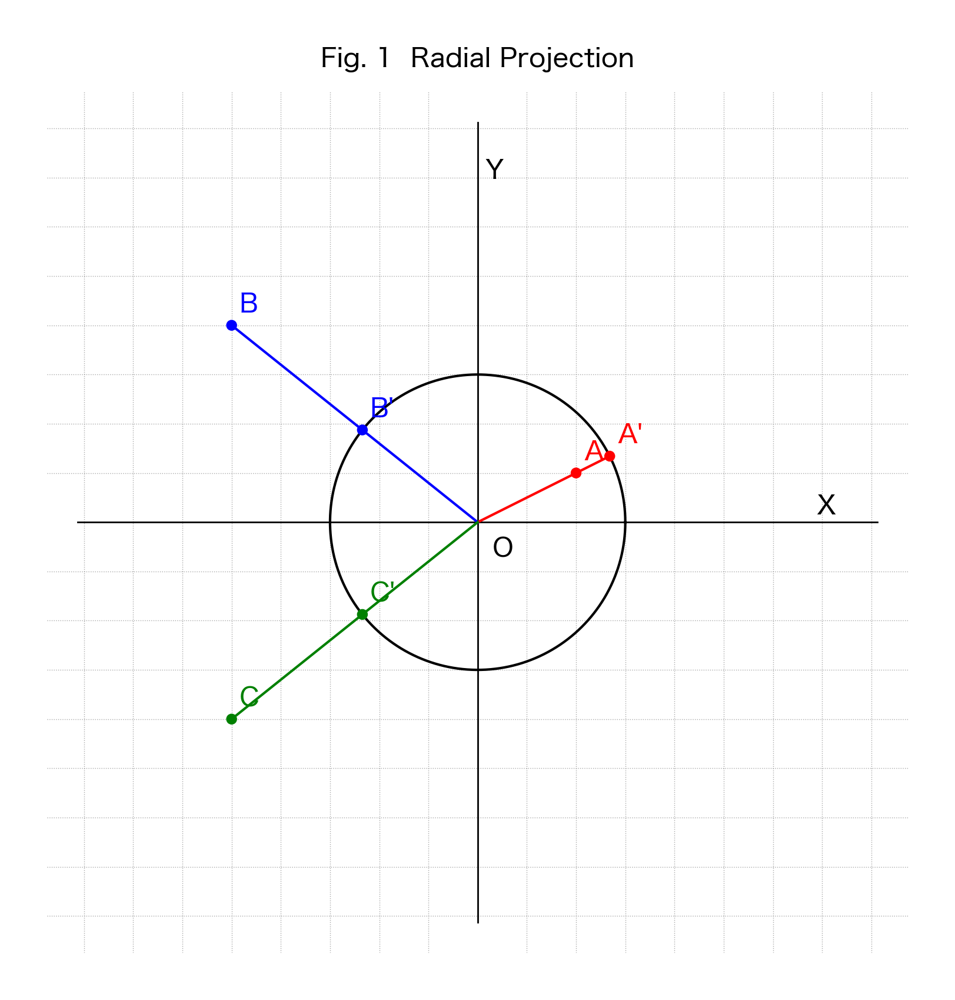
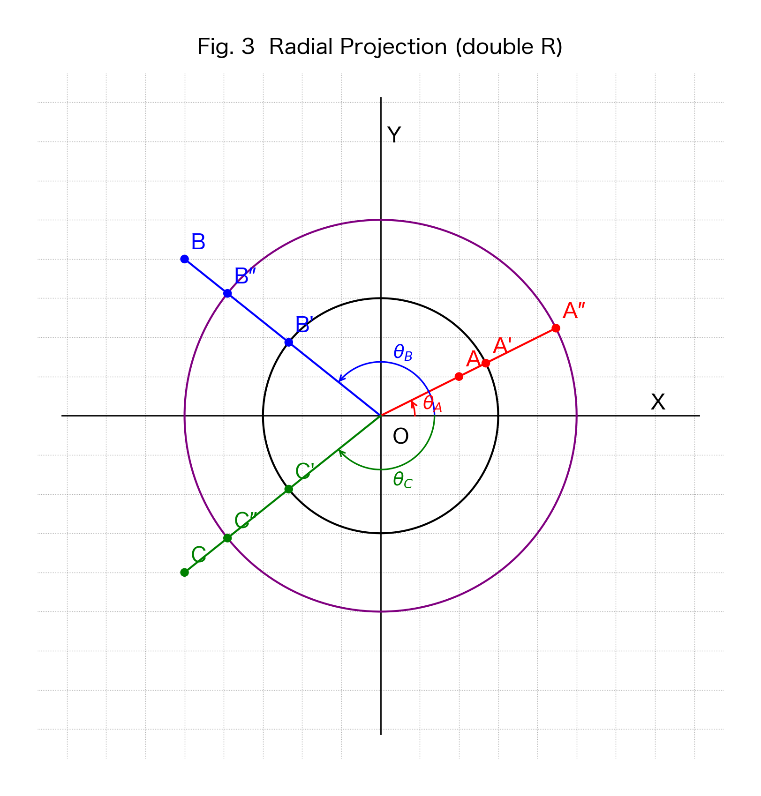
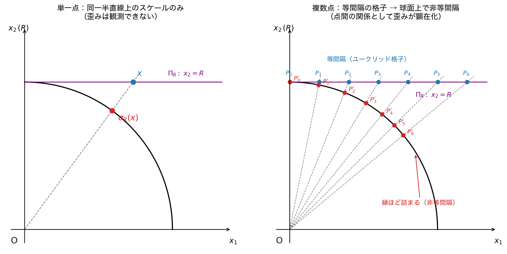
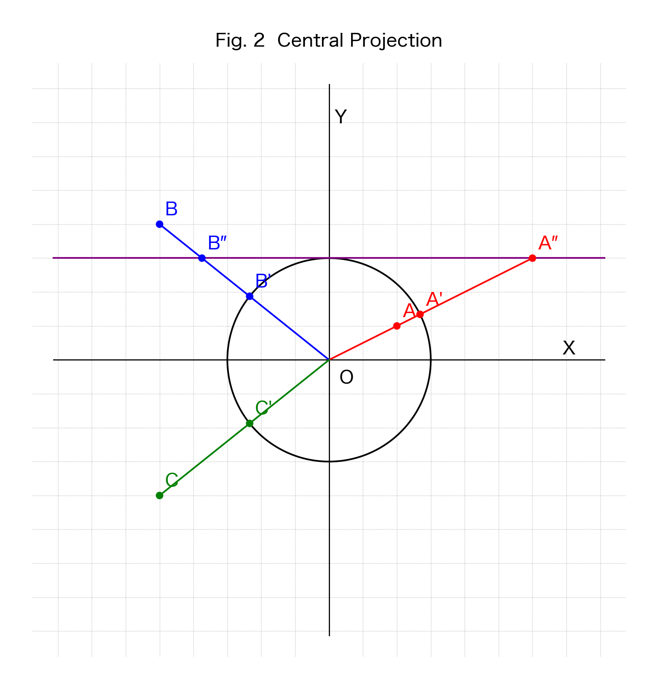

**Concept DOI（最新版に自動転送）**：[10.5281/zenodo.20462569](https://doi.org/10.5281/zenodo.20462569)
**v3.2 Version DOI**：[10.5281/zenodo.20500187](https://doi.org/10.5281/zenodo.20500187)
**Zenodo ページ**：<https://zenodo.org/records/20500187>

# 本ノートの性格

**本稿は中心投影フレームワーク [1], [2] の基礎写像を明示的に定義・整理するテクニカルノートである。**

本ノートが扱う写像

$$\sigma_R: \mathbb{R}^{n+1} \setminus \{0\} \to S^n(R), \quad \sigma_R(x) = \frac{R}{\|x\|} \cdot x$$

は、位相幾何学において **radial projection（動径射影）**、線形代数・微分幾何において **正規化写像 (normalization map)**、変形レトラクトの典型例（[Hatcher, Ch.0]）として古典的に既知である。本ノートは新規の幾何学的定理を主張せず、以下のみを行う：

- この写像を **「球面投影 $\sigma_R$」** と呼称し、記号を固定する（§2）
- 著者の中心投影 [1] および合成演算 [2] が、球面投影の接超平面 $\Pi_R$ への制限として特徴付けられることを示す（§3）
- $\sigma_R$ と中心投影 $\Phi_R$ の単射性・像・微分構造の対比を整理する（§3）

ジャーナル投稿ではなく、著者の中心投影シリーズの**基礎を固める Zenodo プレプリント**として公開する。

---

# §1 序論

## 1.1 動機

ベクトルを正規化して指定半径の球面に写す写像 $x \mapsto (R/\|x\|) x$ は、位相幾何学において **radial projection** または **動径レトラクト**として、線形代数において **正規化写像 (normalization map)** として古典的に既知である。例えば Hatcher 『Algebraic Topology』Chapter 0 では、$\mathbb{R}^n \setminus \{0\}$ から $S^{n-1}$ への変形レトラクトの典型例として登場し、ホモトピー同値の最も基本的な例として扱われる。

本ノートでは、この既知の写像に著者の中心投影フレームワーク [1], [2] 内で用いる記号 $\sigma_R$ を固定し、必要な基本性質を一箇所に整理する。多くの教科書ではこの写像が中間計算または例として扱われるため、シリーズ内での参照基盤として明示的なノートが有用と判断した。

本ノートはこの基礎的写像を「球面投影 $\sigma_R$」と呼称して記号を固定し、著者の中心投影フレームワーク [1], [2] における操作との関係を明示することを目的とする。

## 1.2 既存中心投影フレームワークとの関係

著者は先行論文 [1] において、中心投影 $\Phi_R: \Pi_R \to S^n(R)$ による 4 次元時空の幾何学的定式化を与えた。さらに [2] において、複数軸での次元削減操作が「複数回の中心投影」ではなく「**1 回の中心投影と球面上の可換切断**」として正しく代数化されることを示した。

本ノートは、これら既存の中心投影が、より広い定義域を持つ球面投影 $\sigma_R$ の**接超平面 $\Pi_R$ への制限**として特徴付けられることを示す（補題 3.2）。

なお、[1] における「中心投影」$\Phi_R: \Pi_R \to S^n(R)$ は、古典地図学における gnomonic projection（心射図法、$S^n_+ \to \Pi_R$）と**向きが逆**である。本ノートおよび [1] では、接超平面を始域、球面を終域とする向きを採る。

## 1.3 本ノートの射程

本ノートは以下のみを扱う：

- 球面投影 $\sigma_R$ の定義と基本性質
- 中心投影 $\Phi_R$ との関係（特殊化としての位置付け）
- $\Phi_R$ の像と単射性、$\sigma_R$ の非単射性の対比

以下は本ノートの射程外である：

- 球面投影の物理的解釈・応用（曲率、時空、量子論等）
- [1], [2] の具体的応用（誘導計量、Einstein テンソル、ブラックホール熱力学等）
- 等径関数・極作用といった抽象的部分多様体論との対応
- ステレオ射影（共形）など他の球面関連写像との比較

これらは別ノートまたは別論文において扱う。

## 1.4 用語に関する注意

「球面投影 (spherical projection)」という語は文献によって異なる意味で用いられる（ステレオ射影、各種地図投影など）。本ノートでは $\sigma_R$ をこの名で呼ぶが、これは位相幾何学の標準術語 **radial projection** と同じ写像である。読者の混乱を避けるため、本文では括弧書きで radial projection を併記する。

---

# §2 球面投影の定義と基本性質

## 2.1 定義

**定義 2.1（球面投影 / radial projection）**：正の実数 $R > 0$ に対し、球面投影 $\sigma_R$ を以下で定める：

$$\sigma_R: \mathbb{R}^{n+1} \setminus \{0\} \to S^n(R), \quad \sigma_R(x) = \frac{R}{\|x\|} \cdot x \tag{2.1}$$

ここで $S^n(R) = \{y \in \mathbb{R}^{n+1} \mid \|y\| = R\}$ は半径 $R$ の $n$ 次元球面、$\|\cdot\|$ は標準ユークリッドノルム。

**Well-definedness**：$\|\sigma_R(x)\| = (R/\|x\|) \cdot \|x\| = R$ より $\sigma_R(x) \in S^n(R)$。

## 2.2 基本性質

**命題 2.1（基本性質）**：

(i) $\sigma_R$ は $\mathbb{R}^{n+1} \setminus \{0\}$ 全域で $C^\infty$ 級である（部分多様体 $S^n(R) \subset \mathbb{R}^{n+1}$ への滑らかな写像）。

(ii) $\sigma_R$ は **$S^n(R)$ 上へのレトラクション**である：$\sigma_R \big|_{S^n(R)} = \mathrm{id}_{S^n(R)}$。特に全射。

(iii) 任意の $t > 0$ と $x \in \mathbb{R}^{n+1} \setminus \{0\}$ に対し $\sigma_R(tx) = \sigma_R(x)$。

**証明**：

(i) $\|x\| > 0$ なので $1/\|x\|$ は $C^\infty$、線形写像 $x \mapsto x$ も $C^\infty$、これらの積は $C^\infty$。

(ii) $y \in S^n(R)$ なら $\|y\| = R$、$\sigma_R(y) = (R/R) y = y$。よって $S^n(R) \subset \mathrm{Im}(\sigma_R)$、すなわち全射。

(iii) $\sigma_R(tx) = (R/\|tx\|)(tx) = (R/(t\|x\|))(tx) = (R/\|x\|) x = \sigma_R(x)$。$\square$

**脚注（$t < 0$ の扱い）**：$t < 0$ の場合は $\sigma_R(tx) = -\sigma_R(x)$ となり、向きが反転する。性質 (iii) が同一視するのは原点を通る**正の半直線** $\{tx : t > 0\}$ であり、両側の直線ではない。

## 2.3 冪等性とレトラクト構造

**命題 2.2（冪等性）**：$\sigma_R$ を $\mathbb{R}^{n+1} \setminus \{0\}$ の自己写像とみなせば $\sigma_R \circ \sigma_R = \sigma_R$。

**証明**：$\sigma_R(x) \in S^n(R)$ なので、命題 2.1(ii) より $\sigma_R(\sigma_R(x)) = \sigma_R(x)$。$\square$

これは「projection」という語を正当化する：$\sigma_R$ は像 $S^n(R)$ への射影演算子である。

**変形レトラクト**：ホモトピー $H(x, s) = (1-s) x + s \cdot \sigma_R(x)$（$s \in [0, 1]$）は $\mathbb{R}^{n+1} \setminus \{0\}$ の $S^n(R)$ への**強変形レトラクト**を与える（古典的、[Hatcher Ch.0] 参照）。

## 2.4 商空間としての特徴

正の実数群 $\mathbb{R}_{>0}$ がスカラー乗法 $t \cdot x = tx$ により $\mathbb{R}^{n+1} \setminus \{0\}$ に作用する。

**命題 2.3（商空間）**：商空間

$$(\mathbb{R}^{n+1} \setminus \{0\}) / \mathbb{R}_{>0} \cong S^n(R)$$

であり、$\sigma_R$ は各正の半直線（軌道）から半径 $R$ の代表点を選ぶ標準切断と解釈される。

**証明**：商写像 $\pi: \mathbb{R}^{n+1} \setminus \{0\} \to (\mathbb{R}^{n+1} \setminus \{0\}) / \mathbb{R}_{>0}$ と $\sigma_R$ は同じファイバー $\{tx : t > 0\}$ を持つので、写像 $\overline{\sigma_R}: (\mathbb{R}^{n+1} \setminus \{0\}) / \mathbb{R}_{>0} \to S^n(R)$ が誘導され、これは全単射。連続性・可微性は標準的。$\square$

これは命題 2.1(iii) の構造的な言い換えで、**動径方向の情報が完全に捨てられる**ことを商構造として明示する。

## 2.5 微分構造

**命題 2.4（微分の核と像）**：各 $x \in \mathbb{R}^{n+1} \setminus \{0\}$ における $\sigma_R$ の微分 $D\sigma_R|_x: \mathbb{R}^{n+1} \to T_{\sigma_R(x)} S^n(R)$ は

$$D\sigma_R|_x (v) = \frac{R}{\|x\|}\left(v - \frac{x \cdot v}{\|x\|^2} x\right) \tag{2.2}$$

であり、その核は

$$\ker D\sigma_R|_x = \mathrm{span}\{x\} \tag{2.3}$$

すなわち $x$ 方向（動径方向）。$D\sigma_R|_x$ は階数 $n$ の沈め込みであり、その像は

$$\mathrm{Im}(D\sigma_R|_x) = x^\perp = T_{\sigma_R(x)} S^n(R) \tag{2.4}$$

である（$\sigma_R(x)$ は $x$ の正のスカラー倍なので、$\sigma_R(x)$ における球面 $S^n(R)$ の接空間は $x$ の直交補空間 $x^\perp$ に等しい）。

**証明**：$\|x\|^{-1}$ の方向 $v$ に沿った微分が $-\|x\|^{-3}(x \cdot v)$ であることを用いて、$\sigma_R(x) = R \|x\|^{-1} x$ を方向 $v$ に微分すると

$$D\sigma_R|_x(v) = R \big(-\|x\|^{-3} (x \cdot v)\big) x + R \|x\|^{-1} v = -R \|x\|^{-3} (x \cdot v) x + R \|x\|^{-1} v$$

これを整理すると (2.2)。核について、$D\sigma_R|_x(v) = 0$ とすると

$$v - \frac{x \cdot v}{\|x\|^2} x = 0$$

である。したがって

$$v = \frac{x \cdot v}{\|x\|^2} x$$

となり、$v$ は $x$ のスカラー倍である。逆に $v = \lambda x$ とおけば

$$v - \frac{x \cdot v}{\|x\|^2} x = \lambda x - \frac{\lambda \|x\|^2}{\|x\|^2} x = 0$$

なので $D\sigma_R|_x(v) = 0$。ゆえに $\ker D\sigma_R|_x = \mathrm{span}\{x\}$。

像について、任意の $v$ に対し $x \cdot D\sigma_R|_x(v) = \frac{R}{\|x\|}\left(x \cdot v - \frac{x \cdot v}{\|x\|^2}\|x\|^2\right) = 0$ であるから $\mathrm{Im}(D\sigma_R|_x) \subseteq x^\perp$。階数・退化次数定理より $\dim \mathrm{Im}(D\sigma_R|_x) = (n+1) - \dim \ker D\sigma_R|_x = n = \dim x^\perp$ なので、$\mathrm{Im}(D\sigma_R|_x) = x^\perp = T_{\sigma_R(x)} S^n(R)$。$\square$

これにより、**動径方向は微分の核に正確に対応し、接方向のみが球面に写る**という球面投影の微分幾何学的構造が明確化される。

## 2.6 角度成分の保存

**命題 2.5（角度の保存）**：任意の $x, y \in \mathbb{R}^{n+1} \setminus \{0\}$ に対し

$$\angle(\sigma_R(x), \sigma_R(y)) = \angle(x, y) \tag{2.5}$$

ここで $\angle(\cdot, \cdot)$ はベクトル間の非有向角度。

**証明**：

$$\frac{\sigma_R(x) \cdot \sigma_R(y)}{\|\sigma_R(x)\| \cdot \|\sigma_R(y)\|} = \frac{(R/\|x\|)(R/\|y\|)(x \cdot y)}{R \cdot R} = \frac{x \cdot y}{\|x\| \cdot \|y\|}$$

すなわち余弦値が一致し、角度は等しい。$\square$

**注意（用語）**：本性質は二つのベクトル間の角度の保存であり、共形写像（曲線間の角度を保存する写像）とは異なる概念である。$\sigma_R$ は次元を落とすため、曲線間の角度の保存性は意味を成さない。

## 2.7 スケール不変性

**命題 2.6（半径スケールに対する方向の不変性）**：任意の $R_1, R_2 > 0$ と $x \in \mathbb{R}^{n+1} \setminus \{0\}$ に対し、$\sigma_{R_1}(x)$ と $\sigma_{R_2}(x)$ は原点 $O$ から $x$ への正の半直線上にある。

**証明**：$\sigma_{R_1}(x) = (R_1/\|x\|) x$, $\sigma_{R_2}(x) = (R_2/\|x\|) x$ はいずれも $x$ の正のスカラー倍。$\square$

すなわち、球面投影において**方向成分は半径 $R$ のスケールに対し不変**である。

**図 1**：球面投影 $\sigma_R$ の図解（$n=1$、$R=3$）。原点 $O$ を視点とする放射状半直線上で、点 $A$（円の内側）、$B, C$（円の外側、異なる象限）はそれぞれ円周上の $A', B', C'$ に投影される。

**図 3**：球面投影における半径スケールに対する方向不変性（命題 2.6）。半径 $R=3$（黒円）と $R=5$（紫円）の双方に対し、点 $A, B, C$ の像は同一の放射状半直線上に並ぶ。したがって、各点と $x$ 軸正方向のなす角 $\theta_A, \theta_B, \theta_C$ は $R$ に依らず保存される。

## 2.8 単一点では現れず、複数点で顕在化する歪み

命題 2.5（角度保存）・命題 2.6（半径スケールに対する方向不変性）は、$\sigma_R$ が各点の方向を保つことを述べる。一方、命題 2.3・命題 2.4 は動径方向の情報が完全に捨てられることを述べる。これらを合わせると、$\sigma_R$ の歪みの性格について次の初等的観察が得られる。

**観察 2.7（歪みの関係的性質）**：単一の点 $x$ のみに着目すると、$\sigma_R(x) = (R/\|x\|)\,x$ は $x$ を同一の正の半直線上で半径 $R$ に正規化するだけであり（命題 2.6）、その作用はスケール変換と区別できない。$\sigma_R$ が距離（間隔）を保たないことは、**単一点の像からは観測できない**。

これに対し、相異なる複数の点 $x_1, \ldots, x_m$ に着目すると、各点は自身のノルムに応じた**異なる係数 $R/\|x_i\|$** で正規化されるため、像 $\sigma_R(x_i)$ どうしの球面上の間隔（弧長・弦長）は、一般に元の点どうしのユークリッド間隔と一致しない。とくに、接超平面 $\Pi_R$ 上で**等間隔に並んだ点列**は、$\sigma_R$（$= \Phi_R$、補題 3.2）により球面上で**非等間隔な点列**に写る（図 4）。すなわち $\sigma_R$ の歪みは単一点の属性ではなく、**点と点の関係（相対配置・間隔）としてのみ顕在化する**。

これは、$\sigma_R$ が角度（命題 2.5）と方向（命題 2.6）を保存する一方で距離を保存しないことの、初等的かつ可視的な現れである。なお、この間隔の歪みを誘導計量・曲率として定式化する側面は本ノートの射程外であり（§1.3, §4.3）、別論文 [1], [2] で扱う。

**図 4**：球面投影における歪みの関係的性質（$n=1$、$R=3$）。（左）単一点 $x$：像 $\sigma_R(x)$ は同一の放射状半直線上にあり、作用はスケール変換と区別できない。（右）接超平面 $\Pi_R$ 上に等間隔に並ぶ点列 $P_0, \ldots, P_6$ は、球面上では非等間隔な $P_0', \ldots, P_6'$ に写る（縁＝大きな角度ほど詰まる）。歪みは点と点の間隔として初めて顕在化する。

---

# §3 中心投影との関係

## 3.1 中心投影の定義

**定義 3.1（中心投影）**：球面 $S^n(R)$ の北極 $N = (0, \ldots, 0, R)$ における接超平面を

$$\Pi_R = \{x \in \mathbb{R}^{n+1} \mid x_{n+1} = R\} \tag{3.1}$$

と定める。$\Pi_R \cong \mathbb{R}^n$。中心投影 $\Phi_R$ を以下で定める：

$$\Phi_R: \Pi_R \to S^n_+(R), \quad \Phi_R(x) = \frac{R}{\|x\|} \cdot x \tag{3.2}$$

ここで $S^n_+(R) = \{y \in S^n(R) \mid y_{n+1} > 0\}$ は**開上半球面**である。これが $\Phi_R$ の像であることは下記命題 3.1 で示す。

これは [1] §2 で定義された中心投影と一致する（最終座標の正値性については [1] 注釈 3.1 参照）。

**注釈（向きについて）**：本定義の $\Phi_R$ は**接超平面を始域、球面を終域**とする向きである。古典地図学における gnomonic projection（心射図法）は逆向き（球面 → 接平面）で定義されることが多いので、用語上の混同に注意。

## 3.2 中心投影の像と単射性

**命題 3.1（$\Phi_R$ の像と単射性）**：

(i) $\Phi_R$ の像は開上半球面 $S^n_+(R) = \{y \in S^n(R) \mid y_{n+1} > 0\}$ である。

(ii) $\Phi_R: \Pi_R \to S^n_+(R)$ は **微分同相**である（特に単射）。

**証明**：

(i) $x \in \Pi_R$ は $x_{n+1} = R$ なので、$\Phi_R(x)$ の最終座標は $(R/\|x\|) \cdot R = R^2/\|x\| > 0$。よって $\Phi_R(\Pi_R) \subset S^n_+(R)$。逆に任意の $y \in S^n_+(R)$ に対し $y_{n+1} > 0$、$x := (R/y_{n+1}) y$ とおけば $x_{n+1} = R$ なので $x \in \Pi_R$、$\|x\| = R\|y\|/y_{n+1} = R^2/y_{n+1}$、$\Phi_R(x) = (R/\|x\|) x = (y_{n+1}/R) \cdot (R/y_{n+1}) y = y$。よって全射。

(ii) (i) の構成は逆写像 $\Phi_R^{-1}(y) = (R/y_{n+1}) y$ を与え、両方向で $C^\infty$。$\square$

## 3.3 球面投影と中心投影の関係

**補題 3.2（中心投影は球面投影の制限）**：中心投影 $\Phi_R$ は、球面投影 $\sigma_R$ の定義域を $\Pi_R$ に制限したものと、像を $S^n_+(R)$ に制限したものに一致する：

$$\Phi_R = \sigma_R \big|_{\Pi_R}: \Pi_R \to S^n_+(R) \tag{3.3}$$

**証明**：定義 2.1 の写像式 $\sigma_R(x) = (R/\|x\|) x$ と定義 3.1 の写像式 $\Phi_R(x) = (R/\|x\|) x$ は完全に同一。$\Pi_R \subset \mathbb{R}^{n+1} \setminus \{0\}$（$\Pi_R$ 上 $x_{n+1} = R > 0$ なので原点でない）であり、$\sigma_R$ の定義域を $\Pi_R$ に制限すれば $\Phi_R$ と一致する。像が $S^n_+(R)$ に収まることは命題 3.1(i) より。$\square$

## 3.4 $\sigma_R$ と $\Phi_R$ の対比

| 性質 | $\sigma_R$ | $\Phi_R$ |
|---|---|---|
| 定義域 | $\mathbb{R}^{n+1} \setminus \{0\}$ | $\Pi_R$（接超平面、$\mathbb{R}^n$ と同型） |
| 像 | $S^n(R)$（全球面）| $S^n_+(R)$（**開上半球面のみ**） |
| 単射性 | **非単射**（半直線を 1 点に潰す） | **単射**（微分同相） |
| 動径方向 | 核に含まれる（命題 2.4）| 核の方向が定義域の接空間に含まれない（横断的） |

この対比は本ノートの**核心**である。球面投影は定義域を $\mathbb{R}^{n+1} \setminus \{0\}$ 全体に拡張する代償として単射性を失う。一方、中心投影は単射性と豊かな幾何構造（誘導計量、曲率等）を保つが、定義域は $\Pi_R$、像は $S^n_+(R)$ に限定される。

**図 2**：中心投影 $\Phi_R$ の図解（$n=1$、$R=3$）。北極で接する接超平面（紫線、$n=1$ のとき $y = R$、一般には式 (3.1) の $x_{n+1} = R$）上の点 $A'', B''$ を、原点 $O$ を視点とする放射状半直線で球面上の $A', B'$ に投影する。同じ放射線で球面投影 $\sigma_R$ も定義されており、両者の唯一の違いは定義域である。$\Phi_R$ の像は開上半球（南半球には到達せず、赤道にも有限点からは到達しない）。緑の $C, C'$ は球面投影 $\sigma_R$ の例であり、中心投影 $\Phi_R$ の像（開上半球）には含まれない。

## 3.5 既存結果との関係

**注釈 3.1（既存結果の書き換え）**：[1] および [2] において $\Phi_R$ により定義された幾何量（誘導計量 $g_{\mu\nu} = \Phi_R^* g_{S^n(R)}$、Einstein テンソル、合成曲率半径 $r_{\text{final}}^2 = r_1^2 - \sum_{j \in S}(x_{i_j}^*)^2$ 等）は、本ノートの記法では $\sigma_R \big|_{\Pi_R}$ による引き戻しとして書き換え可能。

ただし、これらの幾何量は本質的に $\Pi_R$（上半球面）上の構造であり、球面投影 $\sigma_R$ の定義域拡張への自動的な拡張は意味しない。一般の滑らかな写像 $f: M \to N$ の引き戻し $f^* T$ は写像の単射性によらず well-defined であり、特に $\sigma_R^* g_{S^n(R)}$ は $\mathbb{R}^{n+1} \setminus \{0\}$ 上の well-defined な対称 2 テンソルである。しかし命題 2.4 により動径方向 $\mathrm{span}\{x\}$ が微分の核に入るため、この引き戻しテンソルは退化しており、リーマン計量ではない。したがって、$\Phi_R^* g_{S^n(R)}$ が $\Pi_R$ 上に与える非退化な誘導計量と同一視することはできない。

[2] の切断操作（本ノートでは記号衝突回避のため $\kappa_S$ と書く）の半群構造、可換性、合成曲率半径の閉形式は、$\sigma_R$ の像空間 $S^n(R)$ 上の操作として位置付けられる。

---

# §4 結語

## 4.1 本ノートの主要結果

1. 球面投影 $\sigma_R(x) = (R/\|x\|) x$ を $\mathbb{R}^{n+1} \setminus \{0\}$ から $S^n(R)$ への $C^\infty$ 級レトラクションとして明示的に定義した（定義 2.1、命題 2.1）。
2. 冪等性、変形レトラクト構造、商空間表示、微分の核と像、角度保存、スケール不変性を初等的に整理した（命題 2.2 〜 2.6）。さらに、$\sigma_R$ の歪みが単一点には現れず複数点の間隔としてのみ顕在化するという関係的性質を観察として明示した（観察 2.7、図 4）。
3. 中心投影 $\Phi_R$ は球面投影 $\sigma_R$ を接超平面 $\Pi_R$ に制限したものに等しく、その像は**開上半球面 $S^n_+(R)$** であり、$\Phi_R$ は微分同相である（定義 3.1、命題 3.1、補題 3.2）。
4. $\sigma_R$ の非単射性と $\Phi_R$ の単射性の対比を §3.4 に整理した。

## 4.2 位置付け

本ノートで定義された球面投影 $\sigma_R$ は、位相幾何学において **radial projection** として古典的に既知の写像と同一である（[Hatcher Ch.0] 等）。本ノートの貢献は新規の幾何学的定理の発見ではなく、

- この基礎写像を「球面投影 $\sigma_R$」として明示的に命名・記号固定すること
- 著者の中心投影フレームワーク [1], [2] における操作との関係を明示的に整理すること

に限定される。本ノートは中心投影シリーズの基礎を固めるための **Zenodo プレプリント／テクニカルノート**として公開し、純粋数学ジャーナル投稿は意図しない。

## 4.3 本ノートが主張しないこと

- 球面投影 $\sigma_R$ が「先行研究において発見されていなかった」こと（radial projection として古典的に既知）。
- 球面投影 $\sigma_R$ に関する深い数学的結果（部分多様体論、極作用、等径関数、共形性等との一般的対応）。
- 球面投影 $\sigma_R$ が中心投影 $\Phi_R$ の単なる定義域拡張により、$\Phi_R$ の豊かな幾何構造（誘導計量・曲率テンソル等）が自動的に $\sigma_R$ に継承されること（実際は単射性が失われるため、引き戻しは制限 $\Pi_R$ 上でのみ well-defined）。
- 物理的応用、宇宙論的解釈、量子論的含意等。

これらは別ノートまたは別論文において扱う。

---

# 参考文献

[1] Kihara, N. (2026). *中心投影による4次元空間の幾何学的定式化*. Zenodo. Concept DOI: [10.5281/zenodo.19427780](https://doi.org/10.5281/zenodo.19427780).

[2] Kihara, N. (2026). *中心投影の合成演算と合成曲率半径の閉形式：1 回の中心投影と球面上の可換切断による高次元削減の代数的定式化*. Zenodo. Concept DOI: [10.5281/zenodo.20060728](https://doi.org/10.5281/zenodo.20060728).

[3] A. Hatcher (2002). *Algebraic Topology*. Cambridge University Press. （Chapter 0: deformation retract $r(x) = x/\|x\|$）

---

著者：木原 範昭（Noriaki Kihara）
所属：WF System Co., Ltd.
ORCID：[0009-0004-6753-4020](https://orcid.org/0009-0004-6753-4020)
ライセンス：CC BY 4.0

---

## 改訂履歴

- **v1（2026-05-30 第一稿）**：初版。
- **v2（2026-05-30 改訂）**：4 AI 査読（Claude.ai、ChatGPT、Gemini、Grok）の指摘を統合反映：
  - 命名：「球面投影」を保持しつつ「radial projection と同一」を §1 で明示
  - 位置付け：テクニカルノート/Zenodo プレプリントとして明記
  - 中心投影の像を開上半球面 $S^n_+(R)$ と明示（命題 3.1）
  - 「角度保存性」を真の角度保存（命題 2.5、内積式）に厳密化、別途スケール不変性（命題 2.6）に分離
  - 追加命題：冪等性（命題 2.2）、商空間（命題 2.3）、微分の核（命題 2.4）
  - 「上位概念」「標準テキスト存在せず」の主張を弱化
  - 系 3.1(ii) を注釈 3.1 に格下げ、自己完結化
  - 外部文献 Hatcher を追加（参考文献 [3]）
  - 記号 $\sigma_S$ → $\kappa_S$ に変更（[2] 切断操作）
  - 「位相」→「方向成分」全文置換
  - $t<0$ の扱いを脚注で補足
  - 中心投影 $\Phi_R$ と古典 gnomonic projection の向きの差異を §1.2、§3.1 で明示
  - Well-definedness を定義直後に明記
- **v3（2026-05-30 微修正）**：ChatGPT v2 再査読の指摘を反映：
  - 命題 2.4 の核の証明を正しく書き直し（$D\sigma_R|_x(v)=0$ から $v=\lambda x$ の同値性を示す形式に）
  - §3.5 注釈 3.1 の「引き戻しは well-defined でない」を「well-defined だが退化する」に修正（引き戻しは単射性に依らず常に well-defined、問題は退化）
  - Fig. 3 キャプションを命題 2.6 のみ参照に修正（命題 2.5 削除）
  - Fig. 2 キャプションに緑 $C, C'$ が中心投影像に含まれない旨を補足
  - §1.1 「primary な named operation として独立文書は存在しない」を「シリーズ内での参照基盤として有用」に弱化
  - Fig. 2 キャプションに「$n=1$ のとき $y = R$、一般には式 (3.1) の $x_{n+1} = R$」を補足（Gemini v2 再査読指摘）
- **v3.1（2026-05-30 微修正）**：Claude.ai v2 再査読の軽微指摘を反映：
  - 命題 2.4 に微分の像 $\mathrm{Im}(D\sigma_R|_x) = x^\perp = T_{\sigma_R(x)} S^n(R)$ を追記（式 2.4）。沈め込み構造をより明示的にし、$\sigma_R(x)$ における球面の接空間が動径方向の直交補空間と一致することを明記。
- **v3.3（2026-06-06 内容追加・日本語版ドラフト）**：§2.8「単一点では現れず、複数点で顕在化する歪み」を新設（観察 2.7、図 4）。$\sigma_R$ が角度（命題 2.5）・方向（命題 2.6）を保存する一方で距離（間隔）を保存しないことを、純幾何の register で初等的に明示。単一点では作用がスケール変換と区別できず歪みが観測されないが、接超平面 $\Pi_R$ 上の等間隔点列が球面上で非等間隔（縁ほど圧縮）に写ることとして、点間の関係においてのみ歪みが顕在化することを記述。図 4（単一点／複数点の2パネル対比）を追加。物理解釈（曲率・時空・運動）は従来どおり射程外（§1.3, §4.3）とし [1], [2] に委ねる。§4.1 主要結果に観察 2.7 を追記。**本版は日本語版 .md のドラフト。英語版 (radial_projection_en.md)・LaTeX/PDF 再生成・RELEASE_NOTES・Zenodo 新バージョン公開は別途反映予定。**
- **v3.2（2026-06-02 校正・推敲）**：査読指摘の校正・推敲を反映：
  - 式番号の重複を解消：命題 2.5（角度保存）の式を (2.4) から **(2.5)** に振り直し（命題 2.4 の像の式 (2.4) と衝突していた）。
  - §1.2 の相互参照を「補題 3.1」から正しい「**補題 3.2**」に修正。
  - 命題 2.4 の証明に**像 $\mathrm{Im} = x^\perp$ の論証**（$x \cdot D\sigma_R|_x(v) = 0$ と階数・退化次数定理）を追記。従来は核のみで像の根拠が欠けていた。
  - 命題 2.4 の見出しを「微分の核」から「**微分の核と像**」に変更（内容に整合）。§4.1 第2項も同様に更新。
  - §3.4 表の $\Phi_R$ 動径方向の欄を「定義域に動径方向ない」から「**核の方向が定義域の接空間に含まれない（横断的）**」に厳密化。
  - 命題 2.4 証明冒頭の微分を、曖昧な $\frac{d}{dx}$ 表記から「**方向 $v$ に沿った微分**」へ明確化。
