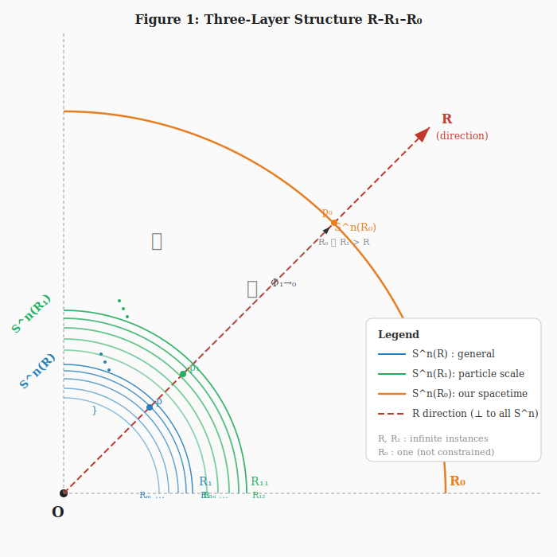

# 中心投影の三層構造モデル: $R$–$R_1$–$R_0$ による主観空間の入れ子構造とミドルウェア的幾何学

**著者**: 木原 範昭 (Noriaki Kihara)  
**所属**: WF System Co., Ltd.  
**ORCID**: 0009-0004-6753-4020  
**版**: 草稿 v0.4  
**日付**: 2026 年 4 月

---

## 要旨

本論文は、先行する中心投影シリーズで既に確立された主観空間の幾何学的性質を、**三層構造 $R$–$R_1$–$R_0$** として整理・統合するミドルウェア論文である。本論文は新たな定理を証明せず、中心投影の既知の性質の組み合わせとして、以下の構造を観察するに留まる:

1. 任意の曲率半径 $R$ に対する主観空間 $S^n(R)$ は、背景座標空間の共通原点 $O$ を中心とした中心投影として定義される。
2. 異なるスケールの二つの主観空間 $S^n(R_1)$ と $S^n(R_0)$ は、原点共有と投影軸一直性により、同心的な入れ子構造として配置される。
3. 異なる主観空間上の対応点を結ぶ $R$ 方向の変位は、いずれの主観空間の接空間とも直交するため、いずれの主観空間の内在計量でも計量できない。

本構造は、各粒子がマイクロブラックホールとして固有の主観空間を持ち得るような**上下層の実装例**に対して、**実装に依存しない安定なインターフェース**を与える。本論文は、粒子内部構造の具体的実装および位相空間の動力学の具体的実装には依拠せず、両者を接続する幾何学的ミドルウェアのみを主張範囲とする。

**キーワード**: 中心投影, 主観空間, 背景座標保存, 原点共有, 同心構造, R方向変位の計量的非寄与, ミドルウェア的幾何学

---

## §1 本論文の主張範囲と分離原則

本論文の主張は、中心投影シリーズ基本論文 [P1], [P2], [P8] で確立された性質の **整理・統合** のみに限定される。新たな数学的主張は行わない。

以下の要素は **本論文の主張範囲外** であり、本文中で言及される場合は実装例としてのみ扱う:

- 粒子の内部構造の具体的実装 (6 次元超直方体モデル [W8] を含む)
- マイクロブラックホール内部の位相空間の動力学 (ソリトン波方程式を含む)
- 標準模型の個別粒子との対応関係

本論文の主張は、上記の実装が仮に全面的に誤っていたとしても、中心投影の幾何学的性質そのものに依拠している限り、影響を受けない。これは [W8] における「数学的本体と解釈の分離」の方針を、さらに上位のレイヤーで踏襲したものである。

---

## §2 基本条件と拘束

本論文の三層構造は、以下の条件の下で定義される。

### 条件 1 (原点共有)

すべての主観空間 $S^n(R)$, $S^n(R_1)$, $S^n(R_0)$ は、背景座標空間 $\mathbb{R}^{n+1}$ の **同一の原点 $O$** を中心投影の射影中心として共有する。これは中心投影の定義 (§3.1) から直接従う構造的条件であり、追加の仮定ではない。

### 条件 2 (軸方向の共有)

$R > 0$ である任意の主観空間について、背景座標空間の原点 $O$ から出る半直線（投影軸）の **方向は共有される**。すなわち、曲率半径の値 $R$ が異なっても、投影軸の方向構造は同一である。これも §3.1 の中心投影の定義（$R > 0$）から直接従う。

### 条件 3 (多重性に関する非拘束)

一般的な主観空間 $S^n(R)$ および粒子スケールの主観空間 $S^n(R_1)$ の **個数に上限はない**。同一の原点 $O$ を共有する主観空間は、異なる曲率半径ごとに無限に存在しうる。これは中心投影の定義が曲率半径 $R > 0$ の任意の値に対して成立することから従う。

### 条件 4 ($R_0$ の単一性について)

本論文では、$S^n(R_0)$ を我々が観測する4次元時空に対応する主観空間として扱うため、$R_0$ は **1つを想定** している。ただし、これは本論文の幾何学的主張に対する **拘束条件ではない**。$R_0$ に相当する主観空間が複数（あるいは無限に）存在したとしても、§3–§6 の主張は破綻しない。$R_0$ の単一性は、我々の観測的立場を反映した便宜的な設定である。

以上の条件を図示する。

**図 1**: 三層構造の概念図。原点 $O$ を共有する1/4円として描画。青色の弧群 $S^n(R)$ と緑色の弧群 $S^n(R_1)$ はそれぞれ無限個のインスタンスを持ちうる（条件 3）。橙色の弧 $S^n(R_0)$ は我々の主観空間（条件 4）。赤破線は $R$ 方向を示し、すべての $S^n$ の接空間に直交する。図中の45度方向の半直線上に示した点 $p$, $p_1$, $p_0$ は、同一の背景座標半直線上の対応点であり、写像 $\Phi_{1 \to 0}$ で結ばれる（45度方向は描画上の便宜であり、任意の方向の半直線について同じ対応が成立する）。

---

## §3 前提: 中心投影の基本性質 (引用)

本節は新たな主張を含まない。以後の議論で用いる基本的な性質を、基本論文群から引用して整理する。

### §3.1 中心投影の定義

背景座標空間 $\mathbb{R}^{n+1}$ の原点 $O$ を射影中心とし、曲率半径 $R > 0$ の超球面 $S^n(R) \subset \mathbb{R}^{n+1}$ への中心投影を

$$
P_R : \mathbb{R}^{n+1} \setminus \{O\} \to S^n(R), \quad P_R(\mathbf{x}) = R \cdot \frac{\mathbf{x}}{\|\mathbf{x}\|}
$$

と定義する ([P1] §2)。$P_R$ の像 $S^n(R)$ を **曲率半径 $R$ の主観空間** と呼ぶ。

### §3.2 背景座標保存

中心投影 $P_R$ は **背景座標を保存する** ([P1] §3)。すなわち、射影の像から逆射影によって元の背景座標の半直線を一意に復元でき、この対応は正則である。

### §3.3 主観空間内部の観測可能性

主観空間 $S^n(R)$ 内部の観測者が測定可能な量は、$S^n(R)$ 上の測地線長および巻き数に限られる。特に、半径方向 ($R$ 方向) の距離は主観空間内部からは **認知できない** ([P2] §4, [P8] §3)。

---

## §4 三層構造の定義

### §4.1 三つの記号の位置づけ

本論文では、中心投影で定義される曲率半径として以下の三つの記号を用いる。

- $R$: 主観空間 $S^n(R)$ の曲率半径を指す **一般的な記号**。§3 で定義された中心投影の定義パラメータ。
- $R_1$: 粒子スケールの主観空間 $S^n(R_1)$ の曲率半径を指す **具体的インスタンス**。上位の実装層 (§7 参照) では、マイクロブラックホールの曲率半径として解釈されうる。
- $R_0$: 我々の主観空間 $S^n(R_0)$ の曲率半径を指す **具体的インスタンス**。$R_0 \to \infty$ に近い、ほぼ平坦な主観空間。

**注意**: 本論文の枠内では、$R$ は一般的記号であり、$R_1$ と $R_0$ はそれを具体化した二つのインスタンスである。$R = R_1$ と同定する実装は §7 (実装例) において示すが、本論文の主張はこの同定に依拠しない。

### §4.2 三層構造の主張

**主張 4.1 (原点共有)**: 任意の曲率半径 $R$ に対する主観空間 $S^n(R)$ は、§3.1 の定義により背景座標の **同一原点 $O$** を中心とする中心投影によって定義される。したがって、$S^n(R_1)$ と $S^n(R_0)$ は共通の原点 $O$ を持つ。

**根拠**: [P1] §2 の中心投影の定義より直接。新たな証明は不要。

**主張 4.2 (投影軸一直性)**: 背景座標空間の原点 $O$ から出る任意の半直線は、$S^n(R_1)$ と $S^n(R_0)$ の両方を **同一の方向** で貫く。

**根拠**: [P1] §3 の背景座標保存の性質より直接。新たな証明は不要。

**主張 4.3 (同心的入れ子構造)**: 主張 4.1 および 4.2 より、$S^n(R_1)$ と $S^n(R_0)$ は原点 $O$ を中心とし、同一の軸構造を共有する **同心的な入れ子** として配置される。

**根拠**: 主張 4.1, 4.2 の組み合わせによる自明な帰結。

---

## §5 $R$ 方向の直交性と計量的非寄与

### §5.1 $R$ 方向の直交性

$S^n(R)$ は背景座標空間 $\mathbb{R}^{n+1}$ において原点 $O$ を中心とする半径 $R$ の超球面であるから、任意の点 $p \in S^n(R)$ において半径方向（$R$ 方向）は $S^n(R)$ の接空間 $T_p S^n(R)$ に **直交** する。したがって、$R$ 方向の変位は $S^n(R)$ 上の誘導計量に **寄与しない**。

### §5.2 計量的不可視性

**主張 5.1 ($R$ 方向変位の計量的非寄与)**: 背景座標空間の原点 $O$ から出る任意の半直線 $\ell$ 上で、$S^n(R_1)$ 上の点 $p_1$ と $S^n(R_0)$ 上の点 $p_0$ が対応する。$p_1$ と $p_0$ を結ぶ $R$ 方向の変位は $S^n(R_0)$ の接空間に直交するため、$S^n(R_0)$ 上の測地線計量には **寄与しない**。同様に $S^n(R_1)$ 上の測地線計量にも寄与しない。したがって、$p_1$ と $p_0$ の間の $R$ 方向の距離は、**いずれの主観空間の内在計量でも計量できない**。

**根拠**: §5.1 の直交性および主張 4.2 の組み合わせによる観察。新たな証明は不要。

**注意 1**: 本主張は、背景座標空間の外部的視点において $p_1$ と $p_0$ が同一点であること、あるいは両者の距離がゼロであることを意味しない。外部視点では両者は異なる半径位置にある。主張は、$p_1$ と $p_0$ を結ぶ $R$ 方向の変位が主観空間の接空間に直交するため、**その方向の距離が計量に寄与しない**という幾何学的事実に留まる。

**注意 2**: 本主張は、曲率半径 $R_0$, $R_1$ の値そのものが主観空間内部から認知できないことを意味 **しない**。曲率半径 $R$ は $S^n(R)$ の測地線曲率を決定するため、$R$ の値が変われば内部の測地線構造（曲率歪み）が変化し、内部観測者にとって認知可能である。本主張が述べているのは、異なる主観空間上の対応点間の **$R$ 方向の距離** が計量できないという、より限定された事実である。

### §5.3 中心投影による相互写像

$S^n(R_1)$ 上の任意の点 $p_1$ に対し、$p_1$ を含む原点 $O$ からの半直線と $S^n(R_0)$ の交点 $p_0$ を対応させる写像

$$
\Phi_{1 \to 0} : S^n(R_1) \to S^n(R_0), \quad \Phi_{1 \to 0}(p_1) = P_{R_0}(P_{R_1}^{-1}(p_1))
$$

は well-defined かつ正則である。

**根拠**: §3.1 の中心投影定義と §3.2 の背景座標保存より直接。

**注記**: $P_{R_1}$ は $\mathbb{R}^{n+1} \setminus \{O\}$ から $S^n(R_1)$ への全射であり単射ではない（同一半直線上の全点が一点に射影される）。ここで $P_{R_1}^{-1}(p_1)$ は $p_1$ に射影される半直線全体を指す。§3.2 の背景座標保存により、この半直線は $p_1$ から一意に復元され、$P_{R_0}$ を作用させれば $S^n(R_0)$ 上の一意な像 $p_0$ が得られるため、$\Phi_{1 \to 0}$ は well-defined である。

---

## §6 本論文の主張のまとめ

本論文が主張する幾何学的構造は、以下に尽きる。

1. 中心投影で定義される任意の主観空間は、背景座標の原点を共有する (§4.2 主張 4.1)。
2. 異なる曲率半径の主観空間は、同心的な入れ子構造として配置される (§4.2 主張 4.3)。
3. 異なる主観空間上の対応点を結ぶ $R$ 方向の変位は、いずれの主観空間の接空間とも直交するため、その方向の距離はいずれの内在計量でも計量できない (§5.2 主張 5.1)。
4. 主観空間間の中心投影による相互写像は well-defined かつ正則である (§5.3)。

これらはすべて、基本論文 [P1], [P2], [P8] から直接導かれる性質であり、本論文に独自の証明負担はない。

本論文の独自性は、これらの既知の性質を **ミドルウェア的構造として統合した視点** にある。すなわち、$R$ を一般記号、$R_1$ と $R_0$ をそのインスタンスとして階層化し、両者を結ぶインターフェースとして中心投影を位置づけることで、**内部構造の具体的実装に依存しない安定な幾何学的枠組み** を得る、という観点である。

---

## §7 実装例 (本論文の主張ではない)

**本節の内容は本論文の主張ではなく、三層構造モデルの具体化の一例である。** 本節で言及される実装 (6 次元超直方体、ソリトン波、マイクロブラックホール解釈等) が仮に誤っていたとしても、§3–§6 の主張は影響を受けない。

### §7.1 下位層の実装例: 粒子の内部構造

$R = R_1$ と同定し、各粒子を固有の主観空間 $S^n(R_1)$ を持つ閉じた幾何学的対象として扱う実装が考えられる。この実装では、粒子の内部構造は $S^n(R_1)$ の内部の組合せ論的構造として記述される。具体例として、[W8] の 6 次元超直方体モデル (xyztRQ の軸配向による 62 粒子の分類) がある。

本論文はこの実装が正しいことを主張しない。中心投影の幾何学的構造は、粒子の内部が 6 次元超直方体であっても、他の組合せ論的構造であっても、同様に成立する。

### §7.2 上位層の実装例: 位相空間の所在

$S^n(R_1)$ の内部に、粒子のソリトン波としての位相空間を定位する実装が考えられる。この実装では、多体問題における各粒子インスタンスの位置・位相情報は、それぞれの $S^n(R_1)$ 内部に保持される。$S^n(R_0)$ 側には、中心投影による像として観測情報のみが現れる。

本論文はこの実装が正しいことを主張しない。位相空間の所在についての代替案として、$S^n(R_0)$ 側が位相空間を保持する案なども構造的には検討可能である。著者は §7.1 の実装と合わせて前者の案をより自然と考えているが、この選好は本論文の主張ではない。

### §7.3 マイクロブラックホール解釈

$S^n(R_1)$ を粒子スケールのマイクロブラックホール主観空間として解釈し、一般相対論的無毛定理の拡張として粒子性質を記述する解釈が考えられる。この解釈では、$S^n(R_0)$ の内部観測者に対してマイクロブラックホールは中心投影像 (点状の射影) として現れ、内部構造は事象の地平線に閉じ込められる。

本論文はこの解釈が正しいことを主張しない。解釈はあくまで中心投影の幾何学的構造の一つの読み方であり、他の解釈の可能性も排除されない。

### §7.4 相互作用機構の実装例

§5.2 の $R$ 方向変位の計量的非寄与を、異なる粒子 (異なる $S^n(R_1)$ インスタンス) 間の相互作用の幾何学的機構として解釈する実装が考えられる。二つの粒子主観空間 $S^n(R_1^{(A)})$ と $S^n(R_1^{(B)})$ が、同じ背景座標半直線上で内在計量では計量できない $R$ 方向の接続を持つとき、両者の間に相互作用チャンネルが開く、という描像である。

本論文はこの実装の動力学的詳細を扱わない。相互作用の具体的な方程式、結合定数、媒介粒子の役割などは、今後の論文に委ねる。

---

## §8 結論

本論文は、中心投影シリーズ基本論文 [P1], [P2], [P8] で確立された主観空間の幾何学的性質を、三層構造 $R$–$R_1$–$R_0$ として整理・統合するミドルウェア論文である。新たな定理証明は行わず、既知の性質の組み合わせとして以下の構造を観察した:

- すべての主観空間は背景座標の共通原点を共有する
- 異なる曲率半径の主観空間は同心的な入れ子として配置される
- 異なる主観空間上の対応点を結ぶ $R$ 方向の変位は、いずれの主観空間の接空間とも直交するため、その方向の距離は内在計量で計量できない
- 主観空間間の中心投影による相互写像は well-defined かつ正則である

本構造は、粒子の内部構造や位相空間の動力学などの具体的実装から独立しており、上下層の実装が変更されても安定に成立する **ミドルウェア的幾何学** として位置づけられる。

今後の論文では、本ミドルウェア構造の上に、粒子内部の具体的実装 (6 次元超直方体モデル等) および位相空間の動力学 (ソリトン波モデル等) を段階的に積み上げていく予定である。各実装論文は、本論文の幾何学的基盤を前提としつつ、独立の検証対象として展開される。

**シリーズ内の位置づけ**: 本論文は、中心投影シリーズ基礎論文群（Paper 1–10）と位相方程式篇（W1–W9）の間に位置する。基礎論文群が確立した個々の幾何学的性質を三層構造として統合し、位相方程式篇の実装がその上に載るための安定なインターフェースを提供する。

### §8.1 本論文が主張しないことの明示

誤読を防ぐため、以下を明示的に記す。

- **マイクロブラックホールの存在を主張しない。** §7.3 でマイクロブラックホール解釈に言及しているが、これは三層構造の一つの読み方（実装例）であり、本論文はマイクロブラックホールが物理的に存在するという主張を含まない。
- **多世界解釈・多世界仮説を主張しない。** 本論文の「入れ子構造」は、中心投影の幾何学的性質として同心球面が配置されることを述べたものであり、量子力学における多世界解釈（Everett 解釈）やそれに類する主張とは無関係である。
- **$R \to 0$ の極限に粒子が凝縮されるという主張をしない。** 本論文は $R_1$ が $R_0$ より小さいことを述べるが、$R \to 0$ の極限操作を行わない。粒子が点状に凝縮されるという描像は本論文の主張に含まれない。

---

## 参考文献

### 本体（§3–§6）で引用

- [P1]: 木原範昭, 中心投影による4次元空間の幾何学的定式化, Zenodo, 2026. DOI: [10.5281/zenodo.19427780](https://doi.org/10.5281/zenodo.19427780)
- [P2]: 木原範昭, 中心投影の幾何学的対称性：多軸モデルの数学的基盤, Zenodo, 2026. DOI: [10.5281/zenodo.19434932](https://doi.org/10.5281/zenodo.19434932)
- [P8]: 木原範昭, 体積1の四次元超直方体に外接する超球体の直径, Zenodo, 2026. DOI: [10.5281/zenodo.19533313](https://doi.org/10.5281/zenodo.19533313)

### 実装例（§7）で引用

- [W8]: 木原範昭, 6次元超直方体の集合構造とその組合せ論的性質 (v5), Zenodo, 2026. DOI: [10.5281/zenodo.19688521](https://doi.org/10.5281/zenodo.19688521)

### その他

- ソースコード: https://github.com/WurabeSeiji/ai-chat-logs-open/

---

## 付録 A: 本論文の射程に関する自己点検

本論文の主張が以下のいずれの場合にも影響を受けないことを、執筆方針の自己点検として明記する。

| 影響を受けない仮想シナリオ | 理由 |
|--------------------------|------|
| 6 次元超直方体モデル [W8] が全面的に誤りと判明 | §7.1 は実装例であり §3–§6 の主張と独立 |
| ソリトン波モデルが全面的に誤りと判明 | §7.2 は実装例であり §3–§6 の主張と独立 |
| マイクロブラックホール解釈が物理的に不適切と判明 | §7.3 は解釈例であり §3–§6 の主張と独立 |
| 標準模型との個別粒子対応が不成立と判明 | 本論文は個別粒子対応を主張していない |

本論文の主張は、基本論文 [P1], [P2], [P8] が数学的に有効である限り、上記いずれのシナリオにおいても成立する。

---

*草稿 v0.4 終*
