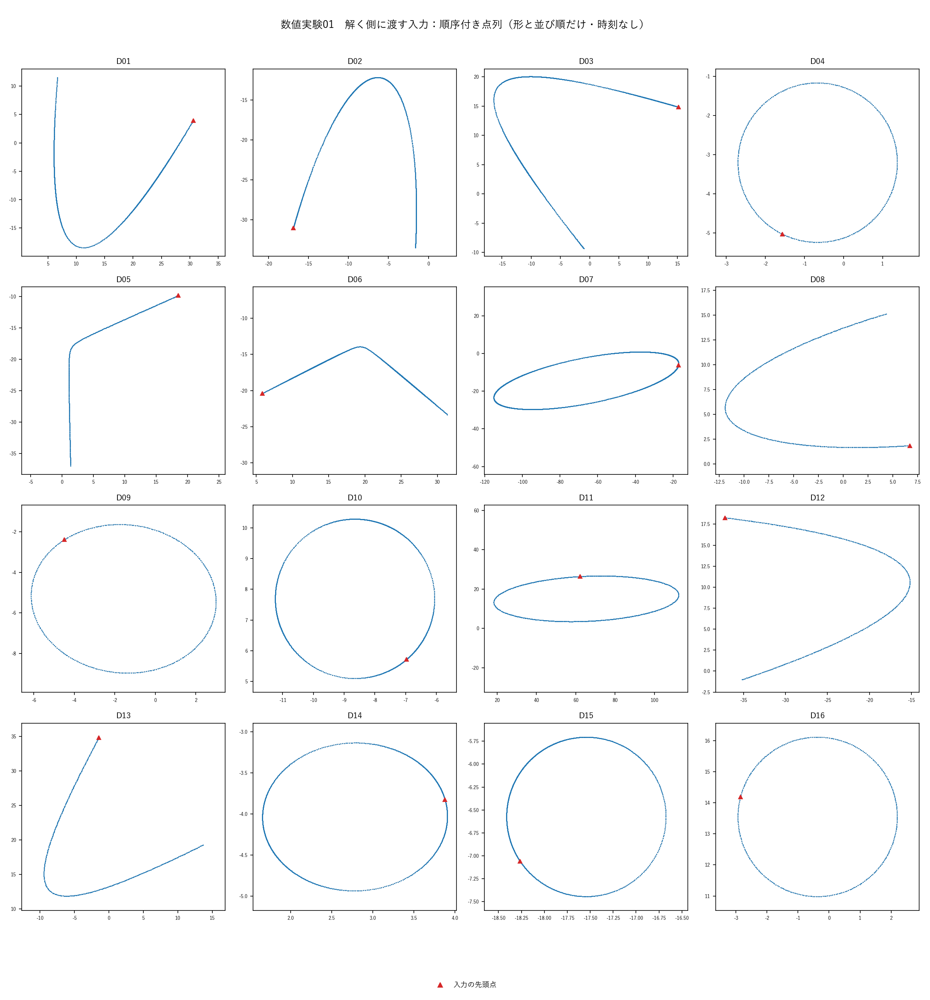
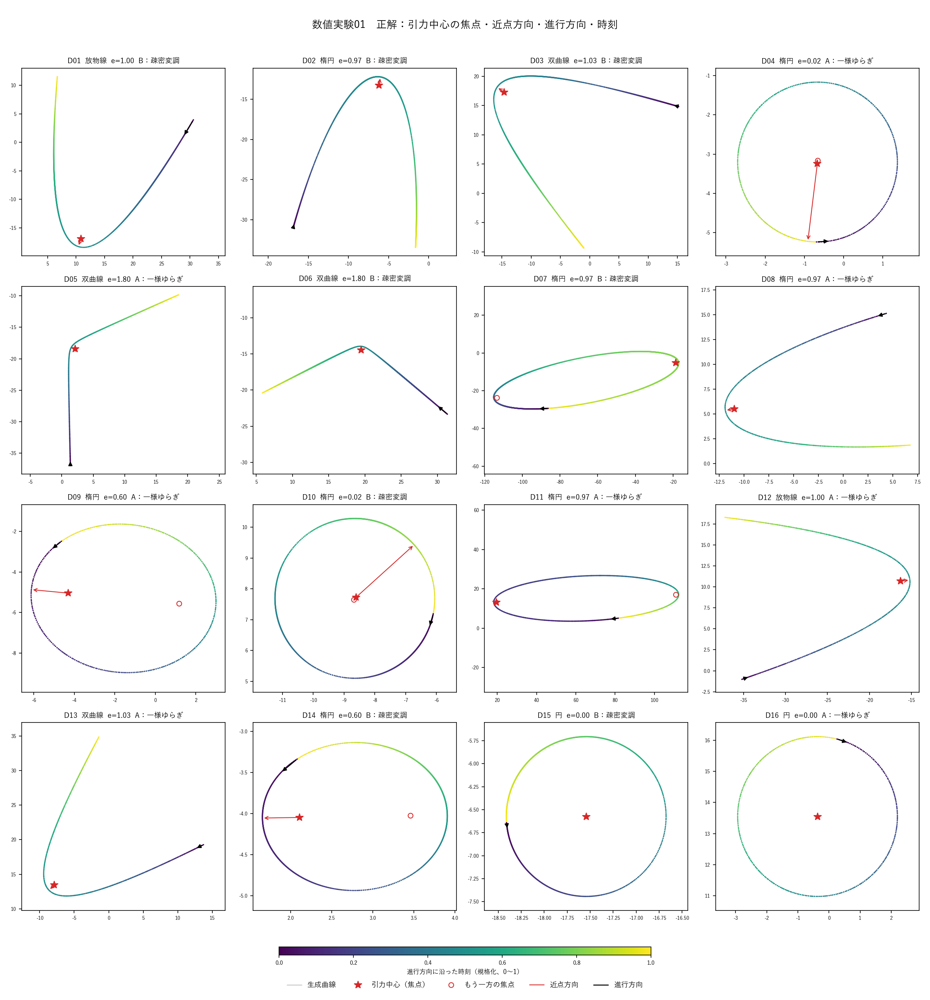
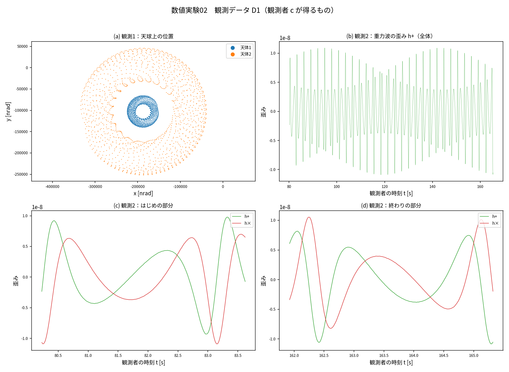
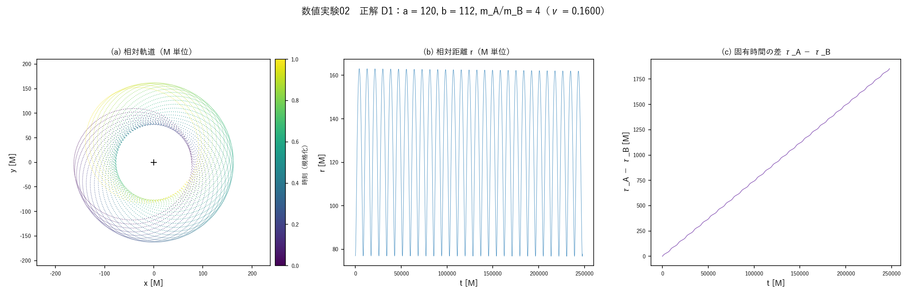
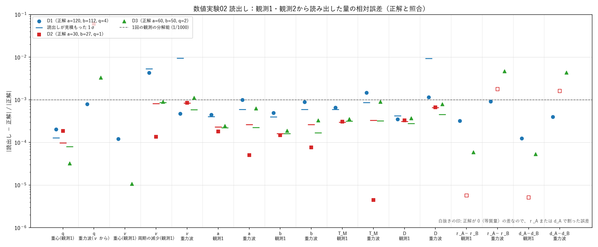
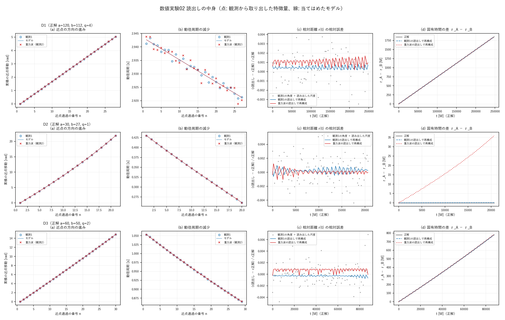

# 第三思考実験：a b 2体の天体の軌道から a b 2体の状態を読み出す
## ― 意味を定めない二つの値と G=c=M=1 の知識だけで、軌道と重力波の読み出しから質量比・相対距離・相対時間を得る ―

**著者:** 木原範昭 (Noriaki Kihara)  
**ORCID:** 0009-0004-6753-4020  
**Version DOI:** （公開時に付与）  
**Concept DOI:** （公開時に付与）  
**版:** v1.1  
**日付:** 2026-09-23  

---

## 要旨

第一思考実験 [1] と第二思考実験 [2] では、名前のない二つの値 $a, b$ から出発して、ケプラー型の軌道と逆二乗の力を導いた。一方で [2] は、二体の相対運動から読めるのは結合 $\mu_{12}$ 一つだけであり、質量比は二つの値では書けないと結論した。本稿はこの結論への疑問から出発し、これまでとは別のアプローチで再検討する。厳密なニュートン方程式と一般相対論（ポストニュートン近似）で二つの天体の軌道を計算し、後者について、観測した軌道から質量比・相対距離・相対時間が読み出せるかを数値実験で確かめた。

状態 $\Psi$ に課す条件は、二つの状態（自由度）を要することだけである。$a, b$ が何であるか（軌道の長半径・短半径か、2体の質量か）は、観測者にとってゼロ知識とする。読み出しの側は $G=c=M=1$（$M$ は全質量）という知識を持ち、観測データを2体の運動として読む。「2体」は $\Psi$ に課した条件ではなく、読み出しの側がデータに与える読み方である。

数値実験01では、ニュートン方程式の厳密解として、円・楕円・放物線・双曲線の相対軌道の形状点列を、時刻・位置・向きの情報を除いて生成した。数値実験02では、$a$ が 30〜120（$b$ が 27〜112）の強い場の軌道を、放射反作用を含むポストニュートン近似（1PN、2PN、2.5PN）で計算した。遠方の軽い観測者 $c$ が得る二種類のデータを作った。軌道面の法線方向から見た2天体の天球上の位置（観測1）と、重力波の2偏光（観測2）である。距離、$M$ の秒換算、時刻の原点、天球の向き、どちらの天体が重いかは伏せた。読み出しは観測データだけを使い、正解は最後の照合でだけ読んだ。

質量比 1、2、4 の三つのデータセットのすべてで、質量比、軌道の形 $a, b$、$M$ の秒換算 $T_M$、距離 $D$、相対距離 $r(t)$、経過時間、2天体の固有時間の差が、相対誤差 $10^{-4}$〜$10^{-3}$ で読み出せた。重力波だけから $\nu$ を経由して読んだ質量比は例外で、等質量に近い D2 では $6\times10^{-2}$ になった。1回の観測の分解能は $1/1000$ である。観測1からは、どちらの天体が重いかも正しく判定できた。強い場では、2次元平面の軌道が読み出せれば、質量比・相対距離・相対時間が読み出せる。

**キーワード:** 二体問題、読み出し、質量比、ポストニュートン近似、重力波、固有時間、ゼロ知識、思考実験

---

## 0. この稿の位置づけ

本稿は、設計書 [0] のもとでの第三の思考実験である。[1] と [2] は、名前のない二つの値と法則から出発し、法則の側から軌道を導いた。本稿は向きが逆で、軌道を観測したデータから、系について何が読み出せるかを見る。

札は [1, 2] と同じものを使う。本稿で使うものだけを挙げる。

| 札 | 意味 |
|---|---|
| 【原則】 | 哲学的原則 |
| 【設計仮定】 | 予備設計上の仮定（外してよい、外す予定のもの） |
| 【数値】 | 数値実験で確認したこと |
| 【照合】 | 既知物理との対応。導出ではない |

**入力の一覧（これ以外は使わない）**

| 記号 | 札 | 内容 |
|---|---|---|
| P1 | 【原則】 | 状態 $\Psi$ には二つの状態（自由度）が要る（[1] §2.1）。二つが何であるかは定めない |
| P2 | 【原則】 | 状態単独は読めない。読めるのは読み出し（相互作用）を通したものだけである（[0] §5） |
| D7 | 【設計仮定】 | 読み出しの側は、観測データを $G=c=M=1$（$M$ は全質量）の単位で解釈する |
| D8 | 【設計仮定】 | 読み出しの側は、観測データを2体の運動として読み、既知の重力の法則（ポストニュートン近似の運動方程式）を使う。この法則は、[0] §6 が除外しないとした自己相互作用の項を持たない（§2.2） |
| D9 | 【設計仮定】 | 観測者 $c$ は2体の運動に影響しないほど軽く、遠方にいて、軌道面の法線方向から見る。天球の座標と時計を持つ。2天体を自転のない質点として読み、ドップラー効果と光の到達時間の差は無視する。観測の分解能は §4.4 のとおり |

読み出しの側が使わないもの：$a, b$ の意味（生成で与えた定義）、データの作り方、伏せた観測条件（距離、$M$ の秒換算、時刻の原点、天球の回転・鏡映・原点、どちらの天体が重いか）。[1, 2] の設計仮定（可逆な線形写像 D2、積的演算 D3、三次元の読み出し空間 D5、面積の時計 D6）も使わない。本稿で使う法則は、読み出しの側が既知として持ち込む D8 だけである。

設計仮定の番号は、[1] の D1〜D4、[2] の D5、D6 に続けて D7 から始める。

---

## 1. 問い

[2] の §8.2（導出 T21b）は次のとおりである。二つの値では、質量比と電荷比が書けない。二体の相対運動から読めるのは結合 $\mu_{12}$ 一つだけで、そこから個々の比を逆算できないからである。

この結論には疑問が残った。本稿の問いは次である。

$$
\boxed{\text{意味を定めない二つの値で書かれた系を }G=c=M=1\text{ の知識で読むとき、軌道から質量比・相対距離・相対時間は読み出せるか}}
$$

---

## 2. 設定

### 2.1 状態 Ψ と二つの値

状態 $\Psi$ に課す条件は P1 だけである。本稿の生成では、二つの値 $a, b$ を出発時の相対軌道の長半径・短半径（$M$ 単位）とした。これは、P1 が要る二つの自由度をこの生成でどう書いたかの一つにすぎず、$\Psi$ の自由度が二つだけであることを意味しない。

$a, b$ が何であるかは、観測者にとってゼロ知識である。読み出しは $a, b$ の定義を使わない。観測データは2体の配置（位置と速度）だけで決まり、入力にどんな名前を付けたかには依存しない。同じ配置を別の書き方で作っても、観測データは同じになり、読み出される値も同じになる。たとえば $a, b$ を2体の質量とし、軌道の大きさと形を別に与える書き方でもよい。本稿の生成でも、質量比は $a, b$ に入れず、別の入力として与えている。

### 2.2 読み出しの側の知識

**G=c=M=1 の解釈（D7）。** 【照合】ニュートン力学では、軌道の大きさを $\lambda$ 倍、時間を $\lambda^{3/2}$ 倍しても運動方程式は変わらない（力学的相似 [4]）。このため $G=M=1$ だけでは、軌道の大きさを比べる尺度がない。形から読めるのは離心率 $e$ と、単位を除いた時間だけである。

$c=1$ を加えると、重力の長さ $GM/c^2$ が単位になる。2体の軌道を決める無次元量は、離心率 $e$、場の強さ $M/p$（$p$ は半直弦）、対称質量比 $\nu=m_Am_B/M^2$ の三つになる。$G=c=M=1$ の知識を持つとは、観測した軌道の大きさや周期を、この単位で読めるということである。$a, b$ が数十の範囲では場が十分に強く、近点移動と重力放射の効果が軌道に現れる。

**2体として読むこと（D8）。** 読み出しの側は、観測データを、重力で運動する二つの質点として読む。そのとき使う法則は、放射反作用を含むポストニュートン近似の運動方程式 [9, 10] で、データの生成に使ったものと同じである。この法則は二つの質点の相対運動を記述する。質点の自己場は質量に繰り込まれていて、明示的な自己相互作用の項は持たない（2.5PN の放射反作用は、系が出した重力波の反作用として含む）。[0] §6 は自己相互作用を除外しないとし、[0] §12 はそれを除外するときは新しい仮定として明示することを求めているので、ここに明示する。「2体」は $\Psi$ に課した条件ではなく、この読み方である。読み出しで得られる情報は $\Psi$ が持つものと等しくなく、読み出しは $\Psi$ の全体を写すものではない。

**法線方向からの観測（D9）。** 傾いた円は楕円に見える。2次元平面の軌道の形を読むことは、その平面を法線方向から見ている（または傾きを知っている）ことを前提にしている。本稿はこの前提を D9 として明示する。D9 は、[0] §5 の「観測 ≡ 相互作用を伴う読み出し」のうち、観測者 $c$ から2体への反作用を無視する近似である。

### 2.3 読み出す量

観測者 $c$ から見た量は次のとおりである。

- 質量比 $q=m_A/m_B\ (\ge 1)$ と、どちらの天体が重いか。対称質量比 $\nu$
- 軌道の形 $a, b$（$M$ 単位）
- $M$ の秒換算 $T_M=GM/c^3$ [s] と、距離 $D$（$M$ 単位）
- 相対距離 $r(t)$ と経過時間 $t$（どちらも $M$ 単位）

2天体それぞれの量は次のとおりである（重い方を $A$ とする）。

- 固有時間 $\tau_A(t)$, $\tau_B(t)$（$M$ 単位）。相手の天体の場だけを含む 1PN の計量から、$d\tau_A/dt=1-m_B/r-v_A^2/2$、$v_A=m_Bv$ とする（$v$ は相対速度）[15, 16]。$\tau_B$ も同様である。
- 自分の時計で測ったレーダー距離 $d_A=r\,d\tau_A/dt$、$d_B=r\,d\tau_B/dt$ [15]。1PN の近似で、シャピロ遅延 [17] は含めない。

---

## 3. 数値実験01：ニュートン方程式による軌道

### 3.1 目的と設計

ニュートン方程式の2体問題は厳密に解ける。換算質量に移ると相対運動は一体の中心力問題になり、軌道は焦点を中心とする円錐曲線 $r(\theta)=p/(1+e\cos\theta)$ になる [3, 4, 5]。相対軌道の式に入るのは全質量 $M$ だけで、質量比は入らない。【照合】

数値実験01では、この厳密解から、時刻の情報を含まない形状点列を作った。形と並び順だけから、軌道の種類、形の二つの自由度、焦点の位置と向き、時間での位置が推定できるかを調べるための、ブラインドテスト用のデータである。

- **生成式**：焦点を原点、近点方向を $+x$ とする標準座標で $\mathbf q(\theta)=r(\theta)(\cos\theta,\sin\theta)$ を作り、乱数の回転 $R(\varphi)$ と平行移動 $O$ でデータ座標に置く（$P=O+R(\varphi)\,\mathbf q(\theta)$）。
- **形の二つの自由度**：$(p, e)$。$p$ は 0.5〜3.0 の一様乱数とした。楕円では $a=p/(1-e^2)$、$b=p/\sqrt{1-e^2}$ も派生値として保存した。
- **ケース**：円（$e=0$）、楕円（$e=0.02$、0.6、0.97）、細長い楕円の部分弧（$e=0.97$）、放物線（$e=1$）、双曲線（$e=1.03$、1.8）の8通り。各ケースを2通りの刻み方で作り、計16データセット（各 318〜1274 点）とした。
- **時刻の排除**：点は時間とは無関係に、弧長を基準にした不規則な間隔で置いた。時間に比例する角で刻むと、点の密度に時間の情報が残るためである。
- **先入観の排除**：焦点の位置、長軸の向き、進行方向は乱数で与えた。データセット番号とケースの対応も乱数で並べ替えた。
- **時刻の正解**：$GM$ は形からは決まらないので、$p$ を長さの単位とする無次元時刻 $\tau=\sqrt{GM/p^3}\,(t-t_p)=\int_0^\theta d\theta'/(1+e\cos\theta')^2$ で保存した。

### 3.2 自己検証 【数値】

生成したデータは、自己検証をすべて満たした。円錐曲線の式を満たすこと、最近傍をたどる並べ替えで並び順が復元できること、時刻の解析式が数値積分と一致することなどで、最大残差は $1\times10^{-14}\,p$ 未満だった。保存したパラメータだけから再生成した点列も、相対誤差 $3\times10^{-15}$ で一致した。

### 3.3 この計算から分かること 【照合】

- 相対軌道の形は二つの値（$p, e$、または $a, b$）で決まり、質量比は入らない。
- 時刻は、単位 $\sqrt{p^3/GM}$ と原点を除いてしか決まらない。形だけからは $GM$ が決まらないからである。
- 形を読むこと自体が、軌道面を法線方向から見ているという前提（D9）の上にある。

数値実験01では、生成と自己検証までを行った。形状点列からの読み出しは、本稿では行っていない。読み出しの実験は、次の数値実験02で行う。

---

## 4. 数値実験02：一般相対論による軌道と観測データ

### 4.1 運動方程式

相対運動は、調和座標でのポストニュートン近似の運動方程式で計算した。ニュートン項に、1PN と 2PN の保存項と、2.5PN の放射反作用の項を加えたものである。Kidder [9] が与える相対加速度の式のうち、自転を含まない部分を使った（総説 [10]）。

積分は4次のルンゲ・クッタ法で行い、刻みは局所的な力学時間に比例させて $h=(2\pi/4000)\,r^{3/2}$ とした。相対距離が $8M$ を下回ったら打ち切る設定にしたが、どのデータセットでも打ち切りは起きていない。

2天体の個々の位置は、1PN の重心の関係 [9, 10] から求めた。

$$
\mathbf x_A=\Bigl(m_B+\tfrac12\nu\,\delta m\,(v^2-1/r)\Bigr)\mathbf x,\qquad
\mathbf x_B=\Bigl(-m_A+\tfrac12\nu\,\delta m\,(v^2-1/r)\Bigr)\mathbf x
$$

ここで $\mathbf x=\mathbf x_A-\mathbf x_B$、$\delta m=m_A-m_B$ である。固有時間 $\tau_A$, $\tau_B$ は §2.3 の式で積分した。

### 4.2 a, b の定義

$a, b$ は、出発時（$t=0$）の相対軌道の長半径と短半径である。放射反作用を除いた 2PN の運動で、折り返し点（近点と遠点）がちょうど $a(1-e)$ と $a(1+e)$ になるように、近点での接線速度を二分法で決めた（$e=\sqrt{1-b^2/a^2}$）。

強い場では、この速度はニュートン力学の値と最大で約10%違う（$a=30$ で 0.2624 と 0.2913）。$a, b$ はニュートン力学の接触楕円ではなく、2PN の運動の折り返し点で定義した量である。

### 4.3 三つのデータセット

| データセット | $a$ | $b$ | $e$ | 半直弦 $p$ | 質量比 $q$ | $\nu$ | 計算した長さ |
|---|---|---|---|---|---|---|---|
| D1 | 120 | 112 | 0.3590 | 104.5 | 4 | 0.1600 | $T_0$ の30倍 |
| D2 | 30 | 27 | 0.4359 | 24.3 | 1 | 0.2500 | $T_0$ の20倍 |
| D3 | 60 | 50 | 0.5528 | 41.7 | 2 | 0.2222 | $T_0$ の30倍 |

$T_0=2\pi a^{3/2}$ はニュートン力学の周期である。場が最も強いのは D2 で、近点距離は $16.9M$ である。データセットの番号と条件の対応は、生成の側で乱数で並べ替えた。

### 4.4 観測者 c と観測データ

観測者 $c$ は軌道面の法線方向の遠方にいて、2体の運動に影響しない。ドップラー効果と、2天体からの光の到達時間の差は無視した。

- **観測1（軌道観測）**：2天体それぞれの天球上の位置（nrad）と、観測者の時刻（秒）。標本の間隔は $T_0/48$、位置の誤差は、軌道の大きさ $a$ を天球上の角度に換算した値の $1/1000$（$\sigma=10^{-3}\,a/D$ rad）とした。
- **観測2（重力波観測）**：重力波の2偏光 $h_+$, $h_\times$ と、観測者の時刻。標本の間隔は $T_0/192$ とした。波形は四重極公式 $h_{ij}=(4\nu/D)(v_iv_j-n_in_j/r)$ [11, 12, 14] で、誤差は最大振幅の $1/1000$ とした。

伏せた観測条件（読み出しの側には与えない）は次のとおりである。

- 距離 $D$：$3\times10^5$〜$3\times10^6\,M$ の対数一様乱数
- $M$ の秒換算 $T_M$：全質量を太陽質量の 20〜80 倍の一様乱数として決めた
- 時刻の原点：0〜1000 s のずれ
- 天球の回転角、鏡映の有無、天球上の原点のずれ（最大 $\pm2\times10^5$ nrad）
- 観測1の「天体1」「天体2」が、それぞれ重い方か軽い方か

D2、D3 は同じフォルダの obs_D2_ja.png、obs_D3_ja.png に示す。

### 4.5 自己検証 【数値】

| 項目 | D1 | D2 | D3 |
|---|---|---|---|
| 1周あたりの近点移動 ÷ 最低次の値 $6\pi/p$ [6] | 1.032 | 1.218 | 1.092 |
| エネルギーの減り方 ÷ Peters の最低次の式 [12, 13] | 0.974 | 0.982 | 0.968 |
| 刻みを細かくしたときの位置の差 ÷ $a$ | $5.8\times10^{-12}$ | $3.8\times10^{-12}$ | $9.1\times10^{-12}$ |

近点移動の最低次からのずれは、場が強いほど大きい。これは 2PN の補正の大きさと合う。どのデータセットでも、2PN のエネルギーは 1PN のエネルギーより良く保存された。

ポストニュートン近似の整合性も確かめた。場の強さを変えたとき（$\nu=0.25$、$e=0.436$、$a=60$〜480）、1PN と 2PN のエネルギーの保存の破れは、近点での場の強さのそれぞれ 1.83 乗と 3.95 乗で小さくなった（合格の基準はそれぞれ 1.5 超と 2.7 超とした。漸近的には 2 乗と 3 乗が期待される）。

D2、D3 は同じフォルダの truth_D2_ja.png、truth_D3_ja.png に示す。

---

## 5. 読み出しの方法

### 5.1 手順の原則

読み出しは観測データ（観測1、観測2）だけを使う。正解は §6 の照合でだけ読む。読み出しの側が持つのは D7〜D9 の知識である。

### 5.2 重心から質量比を読む（観測1）

2天体の天球上の位置を $\mathbf X_1$, $\mathbf X_2$、$\boldsymbol\rho=\mathbf X_1-\mathbf X_2$ とすると、1PN の重心の関係から次が成り立つ。

$$
\mathbf X_1=\mathbf C+\bigl(\mu_2+\nu(\mu_1-\mu_2)f(t)\bigr)\boldsymbol\rho,\qquad f=\tfrac12\left(v^2-1/r\right)
$$

$\mu_i$ は天体 $i$ の質量の割合、$\mathbf C$ は重心の天球上の位置である。まず $f=0$（ニュートン近似）として $\mathbf C$ と $\mu_2$ を最小二乗で求めた。次に、§5.4 で再構成した軌道から $f(t)$ を計算して求め直した。$\mu_2<1/2$ なら天体1が重い。

### 5.3 近点通過ごとの特徴量

- **観測1**：相対位置 $\boldsymbol\rho$ の距離と角度を使う。近点ごとに、近点移動を含む円錐曲線 $1/r=A+B\cos\kappa\phi+C\sin\kappa\phi$ を局所的に当てはめ、近点の時刻、近点の方向、近点距離と、続く遠点距離を求めた。ここで $\kappa=1/(1+k)$、$k$ は1動径周期あたりの近点移動の割合である。
- **観測2**：複素振幅 $H=h_+-ih_\times$ を使う。$|H|$ の極大の時刻、そのときの位相、極大値と、続く極小値を求めた。四重極の波形では、$|H|$ は近点で極大、遠点で極小になり、位相は近点ごとに $4\pi(1+k)$ 進む。重力場の振動が、そのまま時計の役割をする。

### 5.4 モデルの特徴量の列を当てはめる

D8 の運動方程式でモデルの軌道を計算し、観測と同じ時刻で標本化して、§5.3 と同じ手順で特徴量を取り出す。これを観測の特徴量の列に当てはめる。こうすると、特徴量の取り出し方に由来する偏りは、観測とモデルで打ち消し合う。モデルの計算の刻みは、1周あたり 500 とした。

- **非線形のパラメータ**：$a$, $e$。$\nu$ は、観測1では §5.2 の重心の値に固定し、観測2では自由にした。観測1で $\nu$ も自由にした当てはめも別に行い、周期の減少から $\nu$ を読んだ。
- **線形のパラメータ**：時刻の原点、$T_M$、方向（位相）の原点、尺度（観測1では nrad/$M$、観測2では $1/D$）。これらは最小二乗で消去した [24]。
- **当てはめ**：Levenberg–Marquardt 法 [22, 23] を使った。特徴量ごとの誤差は残差から見積もり、1σ はパラメータ全体の共分散から求めた。

それぞれの量を主に決める手がかりは次のとおりである。【照合】

| 読み出す量 | 手がかり |
|---|---|
| $a$（$M$ 単位） | 1動径周期あたりの近点移動 [6, 7, 8] |
| $e$ | 近点距離と遠点距離の比（観測2では振幅の極大と極小の比） |
| $\nu$ | 動径周期の減少（重力放射）[12, 13] |
| $T_M$ | 動径周期の秒数 ÷ モデルの周期（$M$ 単位） |
| $D$ | 角度の大きさ ÷ $M$ 単位の大きさ（観測1）、振幅（観測2）[21] |
| 質量比と、どちらが重いか | 2天体の個々の位置と重心（観測1） |

### 5.5 再構成

読み出したパラメータでモデルの軌道を作り直し、観測時刻での相対距離 $r(t)$、経過時間 $t$、固有時間 $\tau_A$, $\tau_B$、レーダー距離 $d_A$, $d_B$ を計算した（重い方を $A$ とする）。相対距離は、観測1の角度を読み出した尺度で割って直接求める方法でも計算した。

---

## 6. 結果 【数値】

### 6.1 読み出した量の誤差

表は相対誤差 $|\text{読み出し}-\text{正解}|/\text{正解}$ である。

| 量 | 方法 | D1 | D2 | D3 |
|---|---|---|---|---|
| 質量比 $q$ | 重心（観測1） | $2.0\times10^{-4}$ | $1.9\times10^{-4}$ | $3.2\times10^{-5}$ |
| 質量比 $q$ | 重力波（$\nu$ から） | $7.9\times10^{-4}$ | $6.0\times10^{-2}$ | $3.3\times10^{-3}$ |
| $\nu$ | 重心（観測1） | $1.2\times10^{-4}$ | $8.7\times10^{-9}$ | $1.1\times10^{-5}$ |
| $\nu$ | 周期の減少（観測1） | $4.3\times10^{-3}$ | $1.4\times10^{-4}$ | $9.1\times10^{-4}$ |
| $\nu$ | 重力波 | $4.8\times10^{-4}$ | $8.6\times10^{-4}$ | $1.1\times10^{-3}$ |
| $a$ | 観測1 / 重力波 | $4.4\times10^{-4}$ / $1.0\times10^{-3}$ | $1.8\times10^{-4}$ / $5.1\times10^{-5}$ | $2.4\times10^{-4}$ / $6.3\times10^{-4}$ |
| $b$ | 観測1 / 重力波 | $4.9\times10^{-4}$ / $8.9\times10^{-4}$ | $1.5\times10^{-4}$ / $7.6\times10^{-5}$ | $1.9\times10^{-4}$ / $3.3\times10^{-4}$ |
| $e$ | 観測1 / 重力波 | $3.2\times10^{-4}$ / $7.0\times10^{-4}$ | $1.4\times10^{-4}$ / $5.4\times10^{-4}$ | $1.3\times10^{-4}$ / $6.8\times10^{-4}$ |
| $T_M$ | 観測1 / 重力波 | $6.6\times10^{-4}$ / $1.5\times10^{-3}$ | $3.1\times10^{-4}$ / $4.5\times10^{-6}$ | $3.5\times10^{-4}$ / $9.0\times10^{-4}$ |
| $D$ | 観測1 / 重力波 | $3.5\times10^{-4}$ / $1.2\times10^{-3}$ | $3.3\times10^{-4}$ / $6.6\times10^{-4}$ | $3.7\times10^{-4}$ / $7.9\times10^{-4}$ |
| $\tau_A-\tau_B$（最後） | 観測1 / 重力波 | $3.2\times10^{-4}$ / $9.1\times10^{-4}$ | 正解は 0（※） | $5.9\times10^{-5}$ / $4.7\times10^{-3}$ |
| $d_A-d_B$（平均） | 観測1 / 重力波 | $1.2\times10^{-4}$ / $4.0\times10^{-4}$ | 正解は 0（※） | $5.3\times10^{-5}$ / $4.4\times10^{-3}$ |
| $r(t)$ の二乗平均 | 観測1の角度 ÷ 尺度 | $1.5\times10^{-3}$ | $1.8\times10^{-3}$ | $1.7\times10^{-3}$ |
| $r(t)$ の二乗平均 | 再構成（観測1 / 重力波） | $4.6\times10^{-4}$ / $1.1\times10^{-3}$ | $3.9\times10^{-4}$ / $3.3\times10^{-4}$ | $3.0\times10^{-4}$ / $7.8\times10^{-4}$ |

※ D2 は等質量なので、$\tau_A-\tau_B$ と $d_A-d_B$ の正解は 0 である。観測1からの読み出しは、それぞれ $\tau_A$ の $5.7\times10^{-6}$、$d_A$ の $5.1\times10^{-6}$ だった。重力波からは $\tau_A$ の $1.8\times10^{-3}$、$d_A$ の $1.6\times10^{-3}$ だった。

経過時間の終わりの値（$M$ 単位）の誤差は、観測1で D1 が $6.6\times10^{-4}$、D2 が $3.0\times10^{-4}$、D3 が $3.6\times10^{-4}$ だった。これは $T_M$ の誤差と合う。

### 6.2 読み出した値の例

| データセット | 量 | 読み出し | 正解 |
|---|---|---|---|
| D1 | 質量比 $q$（重心） | 4.0008 | 4 |
| D1 | $\tau_A-\tau_B$（最後、観測1） | 1853.15 $M$ | 1852.56 $M$ |
| D1 | $T_M$（観測1） | $3.4320\times10^{-4}$ s | $3.4343\times10^{-4}$ s |
| D1 | $D$（観測1） | $8.740\times10^5\,M$ | $8.737\times10^5\,M$ |
| D2 | 質量比 $q$（重心） | 1.0002 | 1 |
| D2 | $a$ / $b$（重力波） | 30.002 / 26.998 | 30 / 27 |
| D3 | 質量比 $q$（重心） | 2.0001 | 2 |
| D3 | $\tau_A-\tau_B$（最後、観測1） | 778.85 $M$ | 778.90 $M$ |

どちらの天体が重いかは、観測1の重心から、D1 と D3 で正しく判定できた。D2 は等質量なので、判定の対象にならない。

### 6.3 当てはめの妥当性と、残った偏り

すべての当てはめで、$\chi^2$/自由度は 1.05〜1.09 だった。見積もった 1σ に対する実際の誤差（pull）は、多くが $\pm2$ 以内に入った。

重力波から読んだ $e$ は、三つのデータセットとも正の側に $5\times10^{-4}$〜$7\times10^{-4}$ ずれた（pull 2.5〜3.2）。振幅の極大・極小の値を雑音のあるデータから求めるときの偏りで、雑音のないモデルの側では打ち消されない。重力波から読んだ $a$ と $T_M$ の一部のずれ（D3 で pull 約 2.8）も、これに連動している。

重力波だけから求める質量比は $\nu$ を経由するので、$q$ と $1/q$ を区別できない。等質量の近くでは $\nu$ に対する $q$ の変化が大きいので、D2 では $\nu$ の誤差が $8.6\times10^{-4}$ でも $q$ は 1.06 になった。同じ理由で、D2 の重力波からの再構成では、$\nu=0.24979$ が質量差約 0.03 として扱われ、$\tau_A-\tau_B$ が最後に 35.9 $M$ になった（正解は 0）。

---

## 7. 議論

### 7.1 a, b の意味は読み出しに要らない

読み出しは $a, b$ の定義を一度も使っていない。使ったのは観測データと、D7〜D9 の知識だけである。質量比は $a, b$ に入れずに与えたが、それでも読み出せた。読み出しの内部では $a, e, \nu$ という座標で当てはめたが、これは読み出しの側が選んだ座標である。別の座標で当てはめても、同じ質量比・相対距離・相対時間が出る。

2体として読むという読み方（D8）で、データは雑音の水準まで説明できた（$\chi^2$/自由度 1.05〜1.09）。これは「2体という読み方で足りる」ことを示すもので、「$\Psi$ が2体である」ことを示すものではない。

読み出しで得られる情報は、$\Psi$ が持つものと等しくない。相対運動だけから読める $\nu$ は、2体を入れ替えても変わらない。観測1の相対位置や重力波だけでは、どちらが重いかは読めない。どちらが重いかを言えたのは、観測者 $c$ の天球で2天体の位置を別々に見たときだけである。等質量の D2 では、それでも区別がつかない。

### 7.2 読み出しに加えた知識

読み出しは、次の知識の上で成り立った。

- $G=c=M=1$ の単位で解釈すること（D7）
- 2体の運動として読み、既知の法則を使うこと（D8）。法則は、データの生成と同じポストニュートン近似の運動方程式である
- 観測者 $c$ が法線方向から見ていること、軽く遠方にいて天球の座標を持っていること（D9）。2天体を自転のない質点として読み、ドップラー効果と光の到達時間の差を無視したこと

$a, b$ の意味はゼロ知識のままで、読み出しに必要だったのはこれらの知識だけである。

### 7.3 [2] の結論との関係

[2] の §8.2（導出 T21b）は、逆二乗の結合のもとでの二体の相対運動について述べたもので、その範囲では今も成り立つ。本稿で質量比が読めたのは、読み出す材料が増えたからである。一つは、観測1が2天体それぞれの位置を含むことで、これは [2] §8.2 が質量比の読み出しに要るとした「二つの加速度を同一の慣性基準で比較できる追加の関係情報」に当たる。もう一つは、強い場では相対運動そのものに $\nu$ が入ることである（運動方程式には 1PN の項から入る。最低次の近点移動 $6\pi/p$ には入らず、近点移動の 2PN の項 [8] と放射反作用 [12, 13] に現れる）。本稿は [2] を否定するものではない。また本稿では質量比を生成の入力として与えており、二つの値から質量比を書けるかは試していない。

相対論的な軌道の効果（近点移動、固有時間の遅れ、周期の減少）から質量を読むことは、連星パルサー [18, 19] や重力波の観測 [20] で行われてきたことで、本稿が使った理論的な根拠もそれと同じである。本稿固有の位置づけは、$a, b$ の意味をゼロ知識とし、読み出しの側の知識を $G=c=M=1$ と2体という読み方に限った設定にある。

### 7.4 限界

- 一般相対論の軌道は、ポストニュートン近似（2PN の保存項と 2.5PN の放射反作用）で計算した。完全な一般相対論の計算ではない。場の強さは、近点距離が $16.9M$ 以上の範囲に限った。
- 読み出しでは、データの生成と同じ運動方程式を使った。法則を知っていれば観測からパラメータが決まることを確かめたもので、法則そのものの誤差は試していない。
- 読み出しのモデル計算の刻みは1周あたり 500 で、生成の約 4000 より粗い。D2 で刻みを 1000 にして読み出し直すと、読み出したパラメータの変化は最大で相対 $8\times10^{-9}$、見積もった 1σ の $1\times10^{-5}$ 倍で、読み出しの誤差より十分小さかった（results/stepsize_check_D2.csv）。
- 各データセットの雑音は1通りである。重力波から読んだ $e$ には、§6.3 の偏りが残っている。
- 固有時間は相手の天体の場だけから求め、レーダー距離はシャピロ遅延を含まない 1PN の近似で定義した。
- 数値実験01は、生成と自己検証までを行った。形状点列からの読み出しは行っていない。

---

## 8. 結論

状態 $\Psi$ に課した条件は、二つの状態（自由度）を要することだけだった。$a, b$ が何であるかはゼロ知識とし、読み出しの側は $G=c=M=1$ の知識を持って、観測データを2体の運動として読んだ。

【数値】この設定で、強い場の2体の軌道観測と重力波観測から、質量比、軌道の形、$M$ の秒換算、距離、相対距離、経過時間、2天体の固有時間の差が、1回の観測の分解能 $1/1000$ に対して相対誤差 $10^{-4}$〜$10^{-3}$ で読み出せた。重力波だけから $\nu$ を経由して読んだ質量比は例外で、等質量に近い D2 では $6\times10^{-2}$ になった（§6.3）。どちらの天体が重いかも、2天体の位置の観測から判定できた。

強い場では、2次元平面の軌道が読み出せれば、質量比・相対距離・相対時間が読み出せる。

---

## データとプログラムの所在

すべて Google Drive の「匿名頂点状態生成幾何-匿名内部観測者から不変な関係量の体系」フォルダの下にある。

- **数値実験01**：円錐曲線軌道_形状点列データ生成_v1/（generate_conic_orbit_samples.py、reproduce_from_meta.py、plot_conic_orbit_samples.py、README.md）。乱数のシードは固定（20260922）で、データと図はプログラムの実行で再生成できる。
- **数値実験02**：強い場の二体軌道_観測1観測2データ生成_v1/（generate_binary_pn_observations.py、plot_binary_pn_observations.py、README.md、data/input、data/truth、figures）。乱数のシードは 2026092202。
- **読み出し**：強い場の二体軌道_読出し実験_v1/（readout_binary_pn.py、plot_readout_results.py、README.md、results/、figures/）。

---

## 作業の記録

- 数値実験02の生成で、近点での接線速度をニュートン力学の値で与えると、強い場では折り返し点が $a(1\pm e)$ から大きく外れることが分かった。このため §4.2 の定義（2PN の運動の折り返し点）に改めた。
- 読み出しの最初の版では、見積もった誤差が実際の誤差の約3分の1と小さすぎ、距離 $D$ の誤差の計算にも誤りがあった。また、雑音のないデータでの試験で、場が最も強い D2 では、特徴量の取り出し方そのものに偏りがあることが分かった（重力波の振幅の極大の時刻で、動径周期の $5\times10^{-4}$）。モデルの軌道も観測と同じ時刻で標本化して同じ手順で取り出す方式に改め、当てはめの窓の端をなめらかに落とし、共分散の計算を直した。§6 はこの改良後の結果である。
- 重力波から読んだ $e$ の偏り（§6.3）は、改良後も残っている。
- v1.1（2026-09-23）で直した点。結論の一行に「強い場では」を付けた（§3.3 と両立させるため）。「2体」を $\Psi$ の性質ではなく「$\Psi$ に課した条件ではない」と書き改めた。$\Psi$ の自由度が二つだけとは限らないこと、質量比を生成の入力として与えたことを明記した。$\nu$ が運動方程式に入る次数（1PN から）を正した。D8 に自己相互作用の項を持たないこと、D9 に天球の座標・時計・質点・ドップラー効果の無視を明示し、D9 が [0] §5 からの近似であることを書いた。[1, 2] の設計仮定の名前と、[2] の参照箇所（§8.2、T21b）を原本に合わせた。要旨の $a, b$ の範囲、重力波だけからの質量比の例外、観測1の誤差の単位、PN 整合性検査の合格基準の語、Kidder の式の引き方、札の欠落を直した。読み出しのモデル計算の刻みの影響を D2 で確かめた（§7.4）。

---

## 参考文献

**自己引用**

[0] 木原範昭「状態と関係性から時空・粒子・相互作用の創発を探索する研究プロジェクト設計 ― 不確実性下の基礎物理モデル探索に対する予備設計と実装可能性検証の枠組み ―」v1.0（2026）. Concept DOI: 10.5281/zenodo.22851944（Version DOI: 10.5281/zenodo.22851945）

[1] 木原範昭「第一思考実験：等価原理を無名な二自由度まで遡る ― 面積読み出しの保存から、二乗和の符号・曲率半径・三つの系（慣性／一様加速／回転）を導く ―」v1.0（2026）. Concept DOI: 10.5281/zenodo.22857952（Version DOI: 10.5281/zenodo.22857953）

[2] 木原範昭「第二思考実験：クーロン型の逆二乗の力を、積の読み出しと面積の時計から導く ― 二つの値と線形の法則のまま、焦点・引力と斥力・中性を出し、二つの値では書けないものを確定する ―」v1.2（2026）. Concept DOI: 10.5281/zenodo.22867336（Version DOI: 10.5281/zenodo.22876596）

**ニュートン力学の2体**

[3] I. Newton, *Philosophiæ Naturalis Principia Mathematica* (London, 1687).

[4] L. D. Landau and E. M. Lifshitz, *Mechanics*, 3rd ed., Course of Theoretical Physics Vol. 1 (Pergamon, Oxford, 1976).

[5] H. Goldstein, C. P. Poole, and J. L. Safko, *Classical Mechanics*, 3rd ed. (Addison-Wesley, 2002).

**一般相対論の2体の運動**

[6] A. Einstein, "Erklärung der Perihelbewegung des Merkur aus der allgemeinen Relativitätstheorie," *Sitzungsber. Preuss. Akad. Wiss. Berlin*, 831–839 (1915).

[7] T. Damour and N. Deruelle, "General relativistic celestial mechanics of binary systems. I. The post-Newtonian motion," *Ann. Inst. Henri Poincaré, Phys. Théor.* **43**, 107–132 (1985).

[8] T. Damour and G. Schäfer, "Higher-order relativistic periastron advances and binary pulsars," *Nuovo Cimento B* **101**, 127–176 (1988).

[9] L. E. Kidder, "Coalescing binary systems of compact objects to (post)^{5/2}-Newtonian order. V. Spin effects," *Phys. Rev. D* **52**, 821–847 (1995).

[10] L. Blanchet, "Gravitational radiation from post-Newtonian sources and inspiralling compact binaries," *Living Rev. Relativ.* **17**, 2 (2014).

**重力放射と波形**

[11] A. Einstein, "Über Gravitationswellen," *Sitzungsber. Preuss. Akad. Wiss. Berlin*, 154–167 (1918).

[12] P. C. Peters and J. Mathews, "Gravitational radiation from point masses in a Keplerian orbit," *Phys. Rev.* **131**, 435–440 (1963).

[13] P. C. Peters, "Gravitational radiation and the motion of two point masses," *Phys. Rev.* **136**, B1224–B1232 (1964).

[14] M. Maggiore, *Gravitational Waves, Vol. 1: Theory and Experiments* (Oxford University Press, 2008).

**時計と距離**

[15] L. D. Landau and E. M. Lifshitz, *The Classical Theory of Fields*, 4th ed., Course of Theoretical Physics Vol. 2 (Pergamon, Oxford, 1975).

[16] T. Damour and N. Deruelle, "General relativistic celestial mechanics of binary systems. II. The post-Newtonian timing formula," *Ann. Inst. Henri Poincaré, Phys. Théor.* **44**, 263–292 (1986).

[17] I. I. Shapiro, "Fourth test of general relativity," *Phys. Rev. Lett.* **13**, 789–791 (1964).

**相対論的な軌道の効果から質量や距離を読む先行例**

[18] J. H. Taylor and J. M. Weisberg, "A new test of general relativity: Gravitational radiation and the binary pulsar PSR 1913+16," *Astrophys. J.* **253**, 908–920 (1982).

[19] T. Damour and J. H. Taylor, "Strong-field tests of relativistic gravity and binary pulsars," *Phys. Rev. D* **45**, 1840–1868 (1992).

[20] C. Cutler and É. E. Flanagan, "Gravitational waves from merging compact binaries: How accurately can one extract the binary's parameters from the inspiral waveform?," *Phys. Rev. D* **49**, 2658–2697 (1994).

[21] B. F. Schutz, "Determining the Hubble constant from gravitational wave observations," *Nature* **323**, 310–311 (1986).

**数値手法**

[22] K. Levenberg, "A method for the solution of certain non-linear problems in least squares," *Q. Appl. Math.* **2**, 164–168 (1944).

[23] D. W. Marquardt, "An algorithm for least-squares estimation of nonlinear parameters," *J. Soc. Ind. Appl. Math.* **11**, 431–441 (1963).

[24] G. H. Golub and V. Pereyra, "The differentiation of pseudo-inverses and nonlinear least squares problems whose variables separate," *SIAM J. Numer. Anal.* **10**, 413–432 (1973).
