# 背景時空を置かない二体系の放出記録
## ― 標準理論（Dirac–Coulomb 束縛状態・1PN 二体重力・Einstein の A 係数）を無限遠の吸収体の静止系だけを基準に数値計算し、水素原子・電子–電子・陽子–陽子・水素分子の 4 系で放出と吸収の関係量を読み出す ―

**著者:** 木原範昭 (Noriaki Kihara)  
**ORCID:** 0009-0004-6753-4020  
**Version DOI:** （Zenodo 公開時に発番）  
**Concept DOI:** （Zenodo 公開時に発番）  
**版:** v1.0  
**日付:** 2026-10-07  
**関連論文:** 設計書（第 0 論文）[S1]、第六思考実験 v1.1 [S2]、同 補遺 [S3]、中心投影合成演算 [S4]、球面投影 [S5]（いずれも references。本稿は別系列）

**キーワード:** 二体系、放出記録、吸収体、Einstein の A 係数、マスター方程式、Dirac–Coulomb、反跳補正、1PN 重力、重力波、水素原子、水素分子、Mott 散乱、放射会合、宇宙背景放射、再現可能性

---

# 要旨

前回の論文（第六思考実験 [S2] と補遺 [S3]）を精査したところ、重力・Coulomb 力と重力波・電磁波の放射は、状態の相互作用による分配配列演算で更新されておらず、別途既知の方程式で更新されていた。このため第七〜第十思考実験を行い、分配配列演算の相互作用から重力・Coulomb 力の動力学を導くことを試みたが、いずれも二体の重力込みの軌道に到達しなかった。方針を変え、既知の Einstein–Maxwell 方程式を初期化で展開して離散変分式に実装し、分配配列演算に置き換える実験も行ったが、吸収体つきの走行はロックに達せず崩壊し、目的を満たす結果は得られなかった。

本稿はこれらとは別の系列である。万能相互作用の分配配列演算で動力学を導くことは一旦置き、既知の標準理論――電子の Dirac–Coulomb 束縛状態と反跳・QED 補正、一般相対論の 1PN 二体重力と四重極重力波、Einstein の A 係数によるマスター方程式――を、背景時空の格子や計量を状態に持たずに数値計算するプログラムとして構築した。単位は $G=c=q_0=1$（$q_0$ は素電荷の 1/3）、入力は微細構造定数 $\alpha$、質量比 $\mu_p=m_p/m_e$、重力の強さを担う比 $\mu=m_e\sqrt{G}/q_0$、陽子の $g$ 因子で、いずれも既知の値を用いる。唯一の基準系は無限遠の吸収体の静止系であり、これが一般相対論の漸近領域に当たる。読み出しは放出・吸収の記録（振動数、率、分岐比、時刻差、一個か対か、方向、偏光）だけから行い、内部状態は読まない。

したがって本稿は新しい発見を主張しない。既知の知見を限定した条件で数値計算可能にした実験の記録であり、同時に、将来の分配配列演算が再現すべき放出記録の基準（正解表）を与える。

実験は、水素原子（陽子・電子）の 5p からのカスケード、同符号の電子・電子と陽子・陽子（束縛準位は無く、Mott 散乱と四重極制動放射の in–out 量のみ）、水素原子・水素原子（一重項 X¹Σg⁺ の振動回転カスケードと、連続状態からの放射会合。ポテンシャルと四重極能率は文献値）の 4 系で行った。吸収体は、二体に影響しない無限遠に全方向を覆う完全吸収体として置き、等方の場合（$T=0$ と 2.7255 K）と、実際の宇宙に近い異方性（重心速度 370 km/s の双極子、四重極 $a_2=4\times10^{-6}$、要素数 $N=10^{60}$）を与えた場合で比較した。

主な数値。水素原子：50 準位（$n\le5$）、5p₃/₂ F=1 からの放出合計 13.054539268 eV（準位の落差と一致、差 $4\times10^{-15}$）、内訳 E1 11.84、二光子 1.21（2s を経由した 11.9 %）、M1 $2.4\times10^{-6}$、E2 $1.5\times10^{-6}$、重力波 $1.4\times10^{-48}$ eV。外部値との照合は 1S 電離エネルギーの不一致 0.12 MHz（QED と核サイズを除いた残り）、Eides らの表の反跳項が全桁一致、E1 の A 係数が NIST と $1.2\times10^{-4}$、Lyman-α の線幅 99.71 MHz（実測 99.7）。吸収体 2.7255 K では 1s 超微細が 0.745286 : 0.254714 $=3e^{-\hbar\omega/kT}$ に平衡し（緩和 $6.9\times10^4$ 年）、重心速度 370 km/s は 200 原子の Doppler 記録から 0.09 m/s で、一原子の 21 cm 事象 29 個からは蹴りの履歴ごと $2.4\times10^{-10}$ m/s で復元される。背景の異方性による 1s F=1 の定常整列は $5\times10^{-9}$（双極子のみ）〜$2.5\times10^{-8}$（四重極込み）。電子–電子・陽子–陽子：正味ポテンシャルが正で束縛準位は 0、記録に残るのは Mott 断面積（90° で区別できる粒子の 1/2）と四重極制動放射（一回の衝突で光子 $5\times10^{-16}$／$5\times10^{-23}$ 個）だけ。水素分子：BO＋断熱ポテンシャルの sinc-DVR で 301 準位、$D_0=36118.364$ cm⁻¹（全補正値 36118.070）、E2 の A 係数は Roueff ら（2019）の 4669 本と中央値 $8\times10^{-4}$ で一致。2.7255 K は最低遷移の 1/310 なので背景は何も励起せず、Doppler 記録からの速度復元は線幅 $10^{-22}$ のため 0.002 m/s。放射会合 H + H → H₂ + γ は通過 1 回あたり $10^{-19}$、$k(T)=2$〜$4\times10^{-29}$ cm³ s⁻¹。原子間重力は準位あたり $10^{-31}$ cm⁻¹ で別勘定として付けた。

吸収体は球面ではなく、各放出事象の未来光円錐が無限遠を切る断面の集まりである。吸収体の静止系で切れば球、二体の静止系で切れば $r(\theta)=t_0/(1-\beta\cos\theta)$ の楕円体で、層 1 の Doppler と光行差はこの切断の幾何である。位相はヌル測地線に沿って不変なので、記録は放出時の位相関係をそのまま保つ。「背景時空を置かない」と「無限遠の完全吸収体」は矛盾せず、後者は光円錐の null 面への写像であり、本研究系列の中心投影・球面投影と同じ操作である。

---

# 0. 本稿の位置づけ

本研究系列は、設計書 [S1] のもとで、二体の運動を「状態だけから次の状態を生成する一つの写像」に閉じることを目標にしてきた。第六思考実験 [S2] は重力と Coulomb 力、重力波と電磁双極放射を 8 永続状態の一つの transition に入れたが、その放射の更新則は既知の多重極公式を外から与えたものだった。放射を含む動力学を分配配列演算そのものから導く試み（第七〜第十思考実験、未公開）と、Einstein–Maxwell 方程式を初期化で展開して離散変分式に置く試み（同、未公開）は、どちらも目的の結果に至らなかった。

本稿は、その導出を目標にしない。代わりに、標準理論が同じ二体系について与える放出記録を、背景時空を状態に持たないプログラムとして確定する。将来の分配配列演算が正しいなら、この記録を再現しなければならない。本稿はその照合先を与える。

本稿で「標準理論」と呼ぶのは、電子の Dirac–Coulomb 束縛状態と二体の反跳補正 [4, 6, 8]、Bethe 対数を含む遅延の高次 [3, 11–19]、一般相対論の 1PN 二体ハミルトニアン [21, 22] と四重極放射 [27]、Einstein の A 係数と誘導放出・吸収の詳細釣り合い [28, 29]、水素分子については Born–Oppenheimer ポテンシャルと断熱補正 [46–48] および四重極能率 [49] である。場の方程式そのものを時間発展させてはいない。

---

# 1. 動機と主旨

## 1.1 前回の論文の精査

第六思考実験 [S2] の `transition(z)` は、8 永続状態 $Z_8=(U,P,E,H,Q,N,C,D)$ から次の状態を作る。しかし放射による $E$ と $H$ の減少は、GW 四重極と EM 双極の既知の放射公式を率として外から与えたもので、状態の相互作用による分配配列演算で生じたものではない。重力と Coulomb 力の保存部分も、既知の有効ポテンシャルを初期化で係数にしたものである。したがって「状態だけで閉じている」のは帳簿の形式であって、相互作用の導出ではない。

## 1.2 第七〜第十思考実験と E–M 離散変分の帰結

第七（自己相互作用 aa・bb）、第八（aa・ab・bb の交差結合）、第九（倍音干渉による有限履歴読出し）、第十（Liénard–Wiechert 場と Lorentz–Dirac 自己力の有限履歴、Regge–Wheeler–Zerilli、Reissner–Nordström 結合、Kastor–Traschen などの厳密アンカー）は、いずれも二体の重力込みの軌道に到達しなかった。続いて Einstein–Maxwell 方程式を初期配置のまわりで展開（EIH／Infeld–Wallace の手順）し、離散作用と可変刻みの変分式に実装して分配配列演算へ置き換える試みを行ったが、吸収体つきの走行（20 万周）は位相のロックに達せず、Rutherford 型の崩壊に向かった。これらの記録はリポジトリ（§8）に残し、本稿では引用しない。

## 1.3 本稿の主旨

既知の標準理論を、次の条件で数値計算可能なプログラムにする。

1. 背景時空の座標格子や計量を状態に持たない。唯一の基準系は無限遠の吸収体の静止系である（§2.2）。
2. 単位は $G=c=q_0=1$、入力は $\alpha$、$\mu_p$、$\mu$、$g_p$ と、H₂ では文献のポテンシャル曲線（§2.1）。
3. 読み出しは放出・吸収の記録だけから行う（§2.3）。
4. 吸収体を等方（$T=0$、2.7255 K）と異方（双極子・四重極）で与え、記録に何が増えるかを見る（§2.4）。

4 系（水素原子、電子–電子、陽子–陽子、水素分子）で同じ枠組みを走らせ、外部の実測値・文献値と照合し、全プログラム・データ・図を再現可能な形で保存する。

---

# 2. 枠組み

## 2.1 単位と入力

単位は Gauss 幾何単位で $G=c=q_0=1$、$q_0=e/3$。この単位では $\alpha=e^2/(\hbar c)=9q_0^2/(\hbar c)$ から $\hbar=9/\alpha$ が決まり、Planck 定数は独立な入力ではない。独立な無次元入力は次の 4 つである。

| 入力 | 記号 | 値 | 出典 |
|---|---|---|---|
| 微細構造定数 | $\alpha$ | $7.297352564\times10^{-3}$（$1/137.035999177$） | CODATA 2022 [1]（H₂ は 2018 [2]：$7.2973525693\times10^{-3}$） |
| 質量比 | $\mu_p=m_p/m_e$ | 1836.152673426（H₂：1836.15267343） | 同上 |
| 重力の強さ | $\mu=m_e\sqrt{G}/q_0=3\sqrt{\alpha_{G,e}/\alpha}$ | $1.469880\times10^{-21}$（$\alpha_{G,e}=Gm_e^2/\hbar c=1.751809\times10^{-45}$） | SI の $G$、$m_e$、$\hbar$、$c$ から [1] |
| 陽子の $g$ 因子 | $g_p$ | 5.5856946893 | [1] |

重力は一つの比 $g=Gm_em_p/e^2=\mu_p\mu^2/9=4.407886\times10^{-40}$ としてだけ入る。$g_p$ は陽子の内部構造による唯一の外部入力で、電子は Dirac の $g=2$（QED なし）。水素分子では、さらに文献の Born–Oppenheimer ポテンシャル $E_{\rm el}(R)$ [46, 47]、断熱補正 $E_a(R)$ [48]、四重極能率 $\Theta(R)$ [49]、回転 $g$ 因子 $g(R)$ [50] を入力にする（§5.1）。

計算の出力は eV と秒で表示するが、物理として読めるのは比だけである。エネルギーの尺度 $m_ec^2=510998.95069$ eV は表示のための換算に用いる。

## 2.2 吸収体の静止系と「背景時空を置かない」の意味

状態は準位の占有（または $m$ 副準位の占有）と、吸収体に対する重心速度 $\vec v$ だけで、座標格子も計量も持たない。放出された光子・重力波は、二体から十分に遠く、視野角の差も距離も測れない位置に全方向を隙間なく覆う完全吸収体に吸収される。吸収体の静止系が唯一の基準系で、一般相対論で孤立系の運動量と重心が定義される漸近領域（ADM・Bondi [60, 61]）に当たる。標準理論の式（Einstein の A 係数、1PN 展開）は漸近平坦な時空を前提にしており、本稿はその前提をこの静止系に置く。

一様な並進と重心の位置は原理的に読めない。読めるのは、吸収体の要素のどれが光子を受け取ったか（方向）と、その振動数（Doppler）である。吸収体の要素数は $N=10^{60}$ とし、方向を連続量として扱い、分解能の床 $\sqrt{4\pi/N}=3.5\times10^{-30}$ rad だけを持つ。この値が記録に現れないことを確認している（最も鋭い 21 cm 線の相対幅 $3.2\times10^{-25}$ と反跳 $v/c=1.1\times10^{-8}$ から、方向分解能が記録を律速する上限は $N\approx1.5\times10^{34}$）。

## 2.3 読み出しの原則

系の外へ出る情報は、放出と吸収の事象だけである。各事象の記録は（時刻、量子の種類、振動数、一個か対か、方向、偏光）。読み出しはこの記録だけから行い、準位の占有や滞在時間 $\tau$ は帳簿として計算の検査に使うが、観測量とは呼ばない。本稿の図のうち占有の時間発展（図 3、図 4 左）は帳簿で、放出記録（図 2、図 5、図 10）とは区別する。

## 2.4 吸収体の三層

吸収体に与える性質を三層に分け、順に 2 → 1 → 3 で入れた。

- **層 2（温度）**：吸収体を Planck 分布 $\bar n(\omega)=1/(e^{\hbar\omega/kT}-1)$ の放射場とし、各辺に誘導放出 $A(1+\bar n)$ と吸収 $A\bar n\,g_i/g_f$ を加える（Einstein 1917 [28]、$g=2F+1$ または $2J+1$）。重力波と二光子には温度を掛けない。$T=0$ で等方完全吸収体に戻る。
- **層 1（方向と速度）**：吸収体の静止系に双極子軸の印 $\hat z$ を置き、二体の重心に有限の慣性 $M$ と速度 $\vec v$ を与える。放出・吸収ごとに運動量保存で $\vec v$ が変わり（反跳）、記録の振動数は厳密な Doppler で $\omega_{\rm lab}=\omega'/[\gamma(1-\beta n_\parallel)]$。原子の静止系では背景が $T(\hat n)=T_0/[\gamma(1-\beta\hat n\cdot\hat z)]$ と双極子状になり、吸収と誘導放出に方向の偏りが出る。$v_0=370$ km/s は背景放射の双極子から読まれている太陽系重心の速度 369.82 ± 0.11 km/s [42] に合わせた。
- **層 3（整列）**：基底を $m$ 副準位まで分解し、率を Wigner–Eckart で $A_{m\to m'}=A\,(2J+1)\begin{pmatrix}J'&k&J\\ m'&q&-m\end{pmatrix}^2$ に分ける。背景に $T(\hat n)=T_0/[\gamma(1-\beta x)]\,(1+a_2P_2(x))$ の四重極 $a_2$ を与え、$\Delta m=q$ の型ごとの占有数 $\langle\bar n\rangle_q=\int\bar n\,P_q\,d\Omega$ で副準位を汲み上げる。$a_2=4\times10^{-6}$ は COBE DMR の四重極 $Q_{\rm rms}=10.7\,\mu$K [43] を $T_0$ で割った目安値で、実際の四重極の軸は双極子と異なるが、ここでは同じ軸に置く。

## 2.5 吸収体の幾何：光円錐の null 面への写像

§2.2 の吸収体を時空の中で言い直す（図 16）。一つの放出事象の情報は、その事象の未来光円錐の上にだけある。無限遠の吸収体は、この円錐が未来の無限遠（null infinity）を切る断面で、事象ごとに別の断面である。記録の組（遅延時刻 $u$、方向 $\hat n$、振動数、偏光）はこの断面上の座標で、断面の全体 $\mathbb R_u\times S^2$ の上の自由データが放射場の全自由度である（Bondi–Sachs [61]）。この意味で「吸収体の記録」と「放射場」は同じものを指す。

断面を吸収体の静止系の時刻面 $t=t_0$ で切れば球、速度 $\beta$ で運動する二体の静止系の時刻面 $t=t_0+\beta x$ で切れば

$$
r(\theta)=\frac{t_0}{1-\beta\cos\theta}
$$

の楕円体になる。層 1 の背景温度 $T(\hat n)=T_0/[\gamma(1-\beta\cos\theta)]$ と光行差（付録 B）は、この傾いた切断の幾何そのものである。楕円体は吸収体の形ではなく、同じ円錐を別の時刻面で切った形である。

過去光円錐と未来光円錐は頂点（事象）だけを共有する。入射する背景放射（2.7255 K）は過去円錐が最終散乱面を切る断面、出て行く記録は未来円錐が無限遠（宇宙では事象の地平線）を切る断面で、両者は別の面である（§6.5）。

ヌル測地線に沿って波の位相は一定である（$k\cdot dx=0$ から $d\phi=0$）。光子に固有時は無く、放出時の位相関係はそのまま吸収体の断面に届く。Doppler 因子は途中で位相が変わった分ではなく、円錐の両端で源の時計と吸収体の時計が異なる分である。したがって場の時間発展を状態に持たなくても、記録の間の位相関係は定義できる。

この写像は、本研究系列で繰り返し現れてきた操作と同じである。中心投影 $\pi:\mathbb R^n\to S^{n-1}(r_1)$ [S4] と球面投影 $\sigma_R:\mathbb R^{n+1}\setminus\{0\}\to S^n(R)$ [S5] は、頂点から円錐の断面（天球）への射影であり、振幅と振動数だけで読む波の読出しも、頂点の事象を断面上の（方向、振動数、位相）に写す操作である。本稿の吸収体はそれに断面の時刻 $u$ と、断面を切る基準系（吸収体の静止系）を付けたものに当たる。「背景時空を置かない」と「無限遠の完全吸収体」は矛盾せず、後者は光円錐の null 面への写像である。

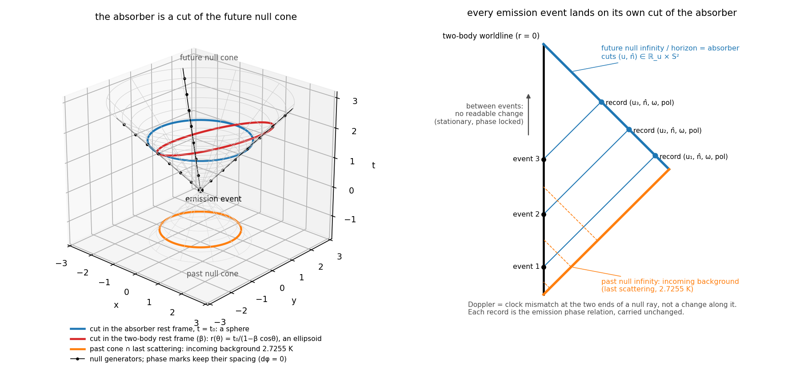
**図 16.** 吸収体は光円錐の null 面の写像。左：放出事象を頂点とする未来・過去光円錐。吸収体の静止系の時刻面で切れば球（青）、二体の静止系で切れば $r(\theta)=t_0/(1-\beta\cos\theta)$ の楕円体（赤）。過去円錐の断面（橙）は最終散乱面。ヌル測地線上の位相の目盛は間隔を保つ。右：二体の世界線から出た各事象の記録が、未来の無限遠（地平線）の別々の断面 $(u,\hat n)$ に着地する。事象の間に読める変化は無い。

---

# 3. 系 1：水素原子（陽子・電子）

## 3.1 準位

基底は $(n,\ell,s_e,s_p)$、$n\le5$、$s_e$ は $j-\ell$ の符号、$s_p$ は $F-j$ の符号で、50 準位。準位エネルギーは

$$
E = E_{\rm C} + E_{\rm G} + E_{\rm HFS}
$$

**Coulomb（電磁）**：電子の Dirac–Coulomb 厳密解 $f(n,j)$ [4, 5] に、二体の反跳 $E_M$（Barker–Glover [6]、CODATA 2010 [3] 式 (16)）

$$
E_M=-\frac{\mu^2(f-1)^2}{2(m_e+m_p)}+\frac{\alpha^4\mu^3}{2n^3m_p^2}\left[\frac{1}{j+\tfrac12}-\frac{1}{\ell+\tfrac12}\right](1-\delta_{\ell0})
$$

と、遅延した光子交換の高次 $E_S$（Salpeter の $(Z\alpha)^5m^2/M$ [8, 9, 10]、Bethe 対数 $\ln k_0(n,\ell)$ は Drake–Swainson [17] と Jentschura–Mohr [18]）、$(Z\alpha)^6m^2/M$（$D_{60}=4\ln2-7/2$ の S 状態 [11, 12]、$[3-\ell(\ell+1)/n^2]\cdot2/((4\ell^2-1)(2\ell+3))$ の $\ell\ge1$ [13, 14]）、$(Z\alpha)^7$ の対数二乗項（$D_{72}=-11/(60\pi)$ [15, 16]）を CODATA 2010 式 (28)–(33) の形で加える。QED（Lamb シフト）と核サイズは入れない。

**重力**：Barker–O'Connell の二体 1PN ハミルトニアン [22] を、静的計量中の Dirac ハミルトニアン $H=\beta mV+\tfrac12\{F,\boldsymbol\alpha\cdot\mathbf p\}$（Obukhov [23]）の Foldy–Wouthuysen 変換 [24] で定めた順序

$$
m\Phi+\frac{3}{4m}\{p^2,\Phi\}+\frac{3\hbar^2}{8m}\nabla^2\Phi+\frac{3}{2m}(\nabla\Phi\times\mathbf p)\cdot\mathbf S
$$

で量子化し、Newton 項、EIH の自己項と交差項、$G^2$ 項、重力–電磁 1PN 交差項 $+\tfrac{27}{2}G(m_e+m_p)/r^2$（Khalil ら 2018 [25]、EFT 再導出 Gupta 2025 [26] 式 (4.8)）、スピン–軌道 $(G/r^3)[(2+\tfrac32m_p/m_e)\mathbf L\cdot\mathbf S_e+(2+\tfrac32m_e/m_p)\mathbf L\cdot\mathbf S_p]$ を期待値として準位に乗せる。1s で $-1.1988\times10^{-38}$ eV。

**超微細**：$E_{\rm HFS}=K[F(F+1)-j(j+1)-\tfrac34]/[4n^3(\ell+\tfrac12)j(j+1)]$、$K=g_p\alpha^4\mu^3/\mu_p$（Fermi [20]）。相対論補正（1s の $(3/2)\alpha^2$、2s の $(17/8)\alpha^2$ [7]）は §3.6 の数値解法で確認した。

## 3.2 放出率と時間発展

全ての下向きの対について Einstein の A 係数を計算する。

$$
A_{E1}=\frac{4\alpha\omega^3}{3c^2}\,|\langle n'\ell'|r|n\ell\rangle|^2\frac{\ell_>}{2\ell+1}\,\mathcal R_1,\qquad
A_{E2}=\frac{\alpha\omega^5}{15c^4}\,|\langle r^2\rangle|^2(2\ell'+1)\begin{pmatrix}\ell&2&\ell'\\0&0&0\end{pmatrix}^2\mathcal R_2
$$

$\mathcal R_k$ は $j$ と $F$ への再結合（6j 記号、Racah の式 [31] を有理数で厳密に）。M1 は同じ $n\ell$ の全対（超微細 $\Delta F=\pm1$ と微細構造間 $\Delta j=\pm1$）で $\boldsymbol\mu=-\mu_B(\mathbf L+2\mathbf S)+g_p\mu_N\mathbf I$ の換算行列要素（Edmonds 7.1.7／7.1.8 [30]）。2s→1s は二光子 8.2206 s⁻¹（Breit–Teller [32]、Goldman [33]）と相対論的 M1 $2.496\times10^{-6}$ s⁻¹（Johnson [34]）を定数で与える。重力波は同じ四重極演算子 $r_ir_j$ の行列要素なので、E2 との放出比は古典の四重極公式の比 $(G/45)/(1/180)=4G$（Landau–Lifshitz §110／§71 [27]）から

$$
W_{GW}=\frac{4G\mu^2M^2}{e^2(m_p-m_e)^2}=9.6129\times10^{-43}
$$

で、$A_{GW}=W_{GW}A_{E2}$。辺の数は E1 320、E2 376、GW 376、M1 59、二光子 2。

時間発展はマスター方程式 $\dot{\mathbf p}=R\mathbf p$。滞在時間 $\boldsymbol\tau=-R_{TT}^{-1}\mathbf p_0$（過渡状態 $T$）を線形方程式で厳密に解き、放出は各辺の流量 $A\tau_{\rm src}$ に $\Delta E$ を掛けて数える（時間刻みの誤差なし）。時刻ごとの占有は陰的 Radau で積分する。初期状態は 5p₃/₂ F=1。

## 3.3 外部値との照合

| 量 | 本計算 | 参照 | 比・差 |
|---|---|---|---|
| 1S 電離エネルギー | 13.5984684 eV | 実測 13.5984346 eV [35, 37] | 差 8170.31 MHz。1S Lamb シフト 8172.84 のうち反跳 2.40 は本計算に入ったので、残るべきは QED＋核サイズ 8170.44。不一致 0.12 MHz |
| 遅延の高次 1S／2S [kHz] | $E_S$ 2409.51／341.29、$(Z\alpha)^6$ −7.39／−0.92、$(Z\alpha)^7\log^2$ −0.42／−0.05 | Eides–Grotch–Shelyuto [19] 表 VIII：2409.51／341.29、−7.38／−0.92、−0.42／−0.05 | 全桁一致 |
| 2P₃/₂ − 2P₁/₂ | 10943.68 MHz | 実測 10969.04 MHz [38] | 差 25.4 MHz $=(\alpha/\pi)\times$分裂（QED） |
| 2S₁/₂ − 2P₁/₂ | 0.35 MHz（反跳の差） | 実測 1057.85 MHz | 残り 1057.5 MHz は QED（Lamb） |
| $g=Gm_em_p/e^2$ | $4.407886\times10^{-40}$ | SI から独立に $4.407886\times10^{-40}$ | 1.00000000 |
| E1 の A 係数 10 本（2p→1s $6.2651\times10^8$ s⁻¹ など） | | NIST ASD [35, 36] | 最大差 $1.2\times10^{-4}$ |
| 超微細 1s／2s／2p₁/₂／2p₃/₂ | 1418.84／177.36／59.12／23.65 MHz | 実測 1420.41／177.56／59.22／23.65 [40] | 0.9989 $=1/(g_e/2)$（QED） |
| 21 cm の A | $2.868\times10^{-15}$ s⁻¹ | 実測 $2.884\times10^{-15}$ | 0.9944（$(g_e/2)^2$ と $\omega^3$） |
| 3d→1s の E2／GW | 593.8 s⁻¹／$5.71\times10^{-40}$ s⁻¹ | 文献 594 s⁻¹ | |
| 期待値の恒等式・和則・射影定理 | | | $10^{-16}$ |

不一致はすべて入れていない QED と核サイズの大きさに一致する。

## 3.4 結果

**放出記録**（図 1、図 2）。放出合計 13.054539268 eV は準位の落差 13.054539268 eV と一致（差 $3.6\times10^{-15}$ eV）。内訳：

| 種別 | 放出 [eV] |
|---|---|
| E1 | 11.84379 |
| 二光子（2s→1s） | 1.210747（2s を経由した割合 11.9 %） |
| M1 | $2.410\times10^{-6}$ |
| E2 | $1.477\times10^{-6}$ |
| 重力波 | $1.420\times10^{-48}$ |

終状態は 1s F=0 が 1.0（$t=10^{17}$ s。1s F=1 は 21 cm で寿命 $1.1\times10^7$ 年）。重力束縛の増分は $-1.151\times10^{-38}$ eV $=2g\times13.05$ eV。

**時間構造**（図 3）。$10^{-8}$ s で 88 % が 1s に落ち、12 % が 2s に滞留して 0.1 s で二光子崩壊する。

**幅**。線幅は $\Gamma_i+\Gamma_f$ で、Lyman-α 99.71 MHz（実測 99.7）、可干渉長 $c/(\Gamma_i+\Gamma_f)=0.48$ m。二光子は和の振動数だけが鋭く（$\Gamma_{2s}+\Gamma_{1s}=8.2$ s⁻¹）、個々の光子は連続（可干渉時間 $6.5\times10^{-17}$ s、19 nm）。準位の空間的な広がりは 1s で $\langle r\rangle=79.4$ pm、$\Delta r\cdot\Delta p/\hbar=0.866$。

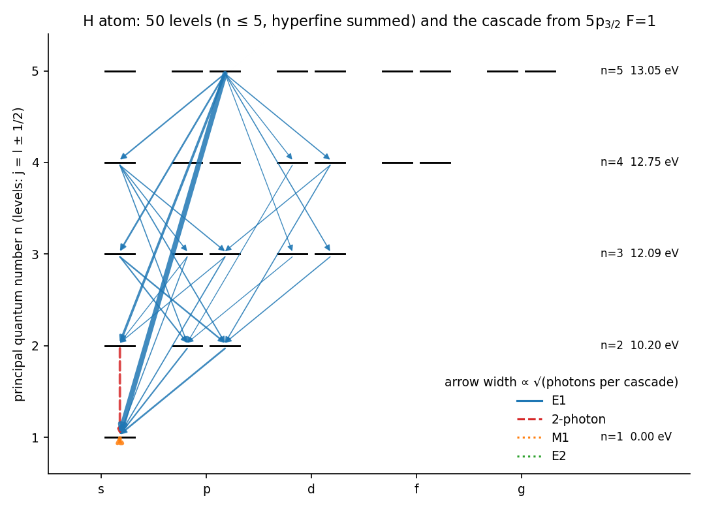
**図 1.** 水素原子：50 準位（超微細は和）と 5p₃/₂ F=1 からのカスケード。矢印の太さは一回のカスケードあたりの光子数の平方根に比例。実線 E1、破線 二光子、点線 M1・E2。

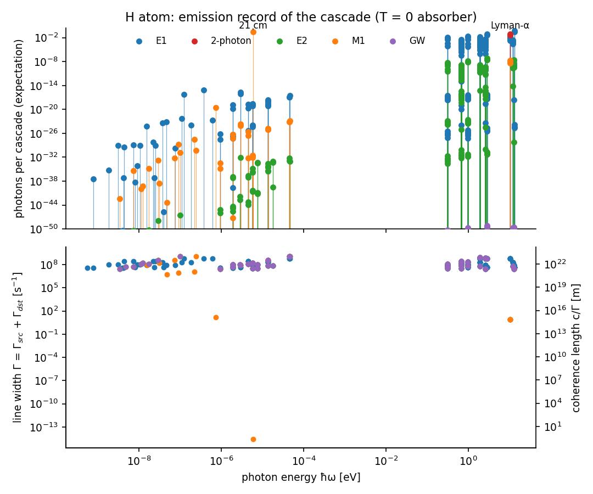
**図 2.** 水素原子の放出記録（$T=0$）。上：光子数の期待値 対 $\hbar\omega$、種別で色分け。下：線幅 $\Gamma=\Gamma_{\rm src}+\Gamma_{\rm dst}$ と可干渉長 $c/\Gamma$。

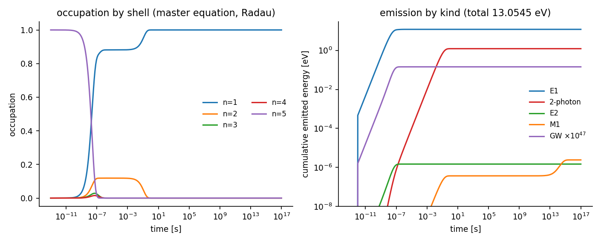
**図 3.** 殻 $n$ ごとの占有の時間発展（帳簿）と、種別ごとの累積放出。

## 3.5 吸収体の三層での読み出し

**層 2（温度 2.7255 K）**（図 4）。$kT=2.3487\times10^{-4}$ eV。21 cm は $\hbar\omega=5.8679\times10^{-6}$ eV、$\hbar\omega/kT=0.02498$、$\bar n=39.53$。Lyman-α は $\hbar\omega/kT=4.3\times10^4$ で $\bar n=0$。1s F=1→0 の率は自発 $2.868\times10^{-15}$、誘導 $1.134\times10^{-13}$、吸収 0→1 $3.401\times10^{-13}$ s⁻¹、緩和率 $4.563\times10^{-13}$ s⁻¹（時定数 $2.191\times10^{12}$ s $=6.94\times10^4$ 年）。定常分布は F=1 : F=0 $=0.745286:0.254714=3e^{-\hbar\omega/kT}$（差 $4\times10^{-16}$）、定常残差 $\max|R\mathbf p|=0$。21 cm の二準位の比から読んだスピン温度は 2.72550 K で、吸収体の温度に一致する。5p からの多段放出は不変。

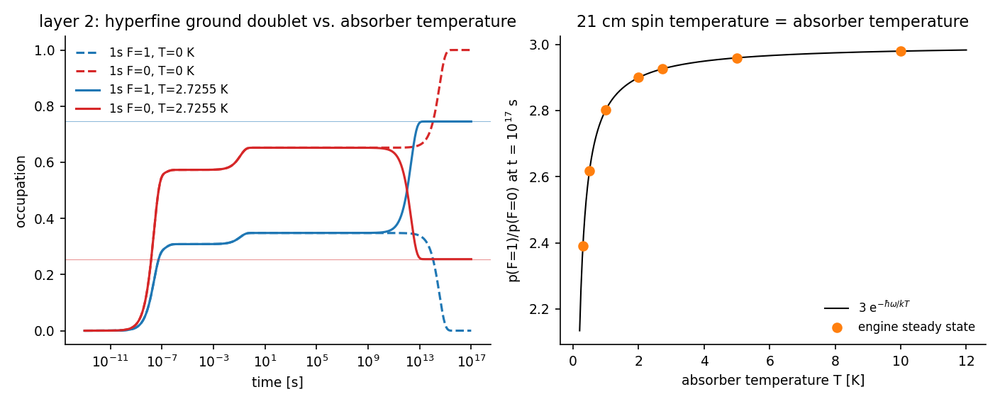
**図 4.** 層 2。左：1s 超微細二準位の占有の時間発展（$T=0$ と 2.7255 K）。右：$t=10^{17}$ s の比 $p(F{=}1)/p(F{=}0)$ の温度依存と $3e^{-\hbar\omega/kT}$。

**層 1（方向・重心速度・反跳）**（図 5）。Lyman-α の反跳シフト $\Delta E^2/(2Mc^2)=13.40$ MHz、一個の反跳速度 $\hbar\omega/(Mc)=3.257$ m/s、21 cm では $1.874\times10^{-6}$ m/s。1 次 Doppler $\beta=1.2342\times10^{-3}$、2 次 $\beta^2/2=7.616\times10^{-7}$。原子の静止系で見た背景の温度は前方 2.728866 K、後方 2.722138 K。読み出し：

1. 集団 200 原子の多段光子 212 個の記録 $(\delta,\hat n)$ から、厳密な Doppler 模型の最小二乗で $\vec v=(-0.03,-0.03,370000.08)$ m/s、与えた $(0,0,370000)$ との差 0.09 m/s（同じ計算をエンジン版で別の乱数列で行うと 0.11 m/s）。1 次の線形解は 2 次 Doppler の分だけ数十 m/s ずれる。
2. 一個の原子の 21 cm 事象（吸収・誘導放出・自発放出の列）では、各事象の $\delta$ が真の速度の厳密な Doppler と倍精度で一致する（21 cm の線幅 相対 $5\times10^{-23}$ は倍精度の床 $10^{-19}$ より下）。
3. 同じ 29 事象から、記録にある蹴り $\mp\hbar\omega\hat n/c$（吸収か放出かは記録にある）を積み上げて連立すると、最初の事象の前の $\vec v_0$ の 3 成分が $2.39\times10^{-10}$ m/s で復元される（反跳 $1.9\times10^{-6}$ m/s の $2\times10^{-4}$）。

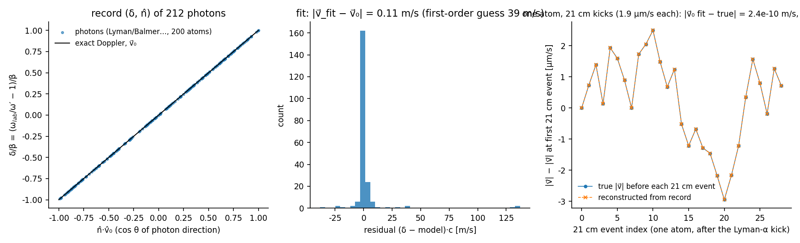
**図 5.** 層 1。左：200 原子の光子の $(\delta/\beta,\ \hat n\cdot\hat v_0)$ と厳密な Doppler。中：残差（m/s 換算）。右：一原子の 21 cm 事象列の $|\vec v|$ の履歴（真値）と記録からの復元。

**層 3（整列・偏光）**（図 6）。基底 220 状態、$m$ 分解した辺 15103 本、和則 $\sum_{m'}A_{mm'}=A$ の最大相対差 $5.5\times10^{-16}$。(A) 初期 5p₃/₂ F=1 の $m_F=0$ からの 5p→1s F0 は $\Delta m=0$ だけ（純 π、$I\propto\sin^2\theta$、90° の直線偏光度 +1）、$m_F=+1$ からは σ、$m$ 平均では全線が等方・無偏光に戻り放出合計は 13.054539268 eV。初期の $m$ は放出光の角分布と偏光として記録に出る。(B) 2.7255 K の定常整列 $A_2=(p_++p_--2p_0)/\sum p$：

| 背景 | $\langle\bar n\rangle_0$（π） | $\langle\bar n\rangle_{\pm1}$（σ） | 1s F=1 の整列 $A_2$ | 21 cm 放出の 90° 偏光度 |
|---|---|---|---|---|
| 等方 | 39.52787894 | 39.52787894 | 0 | 0 |
| 双極子 β のみ（2 次で四重極） | 39.52786065 | 39.52787285 | $+5.074\times10^{-9}$ | $-3.806\times10^{-9}$ |
| 双極子 β ＋ 四重極 $a_2=4\times10^{-6}$ | 39.52782863 | 39.52788886 | $+2.506\times10^{-8}$ | $-1.880\times10^{-8}$ |

無偏光の強度双極子は 1 次では整列を作らず、2 次 $\beta^2\approx1.5\times10^{-6}$ の四重極成分と背景の四重極 $a_2$ が作る。定常の副準位の占有は $p_m\propto\langle\bar n\rangle_q/(1+\langle\bar n\rangle_q)$ なので、占有数の相対差 $10^{-6}$ は $1/(\bar n(1+\bar n))\approx1/1600$ だけ抑えられ、整列は $10^{-8}$ 台になる。21 cm の直線偏光度 $2\times10^{-8}$ を読むには $10^{16}$ 個の光子が要る。

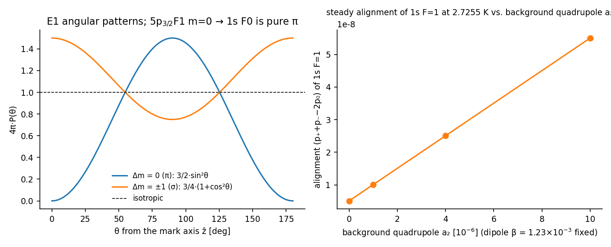
**図 6.** 層 3。左：$\Delta m$ の型の角分布（$m_F=0$ の 5p→1s F0 は純 π）。右：2.7255 K の 1s F=1 の定常整列 対 背景の四重極 $a_2$。

## 3.6 符号を入力にした数値解法との対照

準位を閉じた式でなく、径方向 Dirac 方程式の両側打ち込み（$\eta=1-\varepsilon$ で桁落ちを避ける）と Schrödinger 解からの期待値で作る一般の解法を別に組み、同じ条件（$n\le5$、5p₃/₂ F=1、$t_{\max}=10^{17}$ s）で固定一式と対照した。50 準位の Coulomb 準位の最大差 $3.0\times10^{-11}$ eV（相対 $10^{-11}$）、重力の最大相対差 $3.9\times10^{-9}$、超微細の Dirac／NR − 1 は 1s・2s で $(3/2)\alpha^2=8.0\times10^{-5}$（Breit の相対論補正を再現）、全エネルギーの最大差 $3.3\times10^{-10}$ eV。A 係数は E1 320 本・E2 376 本・M1 58 本で辺の集合が一致し、相対差の中央値 $6.6\times10^{-5}$（Dirac の $(G_aG_b+F_aF_b)$ と Schrödinger の動径積分の $\alpha^2$ の差）、放出合計 13.054539268 eV は一致。この解法は電荷の符号を入力にできるので、§4 の同符号の対に使う。

---

# 4. 系 2・3：電子–電子、陽子–陽子

## 4.1 束縛準位の不在

粒子以外の条件（基底 $n\le5$、初期準位 5p₃/₂ F=1 に当たるもの、吸収体）を水素と同じにして、§3.6 の解法に同符号の電荷を入力した。正味の結合は電子–電子で $+7.297\times10^{-3}$（Coulomb）に対し重力 $+1.752\times10^{-45}$、陽子–陽子で重力／Coulomb $=8.09\times10^{-37}$。正味ポテンシャルは全ての $r$ で正（斥力）なので束縛準位は厳密に 0 で、準位と率の模型には表現する対象が無く、放出 0、終状態なし。これは「準位と放射だけで解けるか」という問いに対する一式自身の答えである。

## 4.2 散乱：Mott 断面積

同符号の対について Einstein–Maxwell 理論が予言するのは散乱である。途中の軌道は観測されず、記録に残るのは偏向角の分布だけで、同種粒子で軌道を実在と仮定すると Mott の干渉項を落として誤る（S 行列の立場 [63]）。相対運動エネルギーは水素の初期準位に合わせて $E=|E(5p_{3/2}F1)|=0.543934$ eV、スペクトルの衝突径数は $\ell=1$ の角運動量 $L=\hbar\sqrt2$ から $b=L/(\mu v)$。

| 量 | 電子–電子 | 陽子–陽子 |
|---|---|---|
| 換算質量 $\mu$ | 0.5000 $m_e$ | 918.0763 $m_e$ |
| $v/c$ | $2.0634\times10^{-3}$ | $4.8155\times10^{-5}$ |
| Sommerfeld 径数 $\eta=(q_aq_b/\hbar c)/(v/c)$ | 3.5365（量子領域） | 151.5398（準古典） |
| 波数 $k$、de Broglie 波長 | 0.1414 $/a_0$、2.352 nm | 6.0583 $/a_0$、0.055 nm |
| 距離の径数 $a=q_aq_b/(\mu v^2)$、正面衝突の最接近 $2a$ | 25.014 $a_0$、2.647 nm | 25.014 $a_0$、2.647 nm |
| 衝突径数 $b$、離心率 $e$ | 10.003 $a_0$、1.0770 | 0.233 $a_0$、1.0000 |
| Darwin（磁気）項 $v^2/c^2$ | $4.26\times10^{-6}$ | $2.32\times10^{-9}$ |
| 重力／Coulomb、重力波／電気四重極 $4Gm^2/q^2$ | $2.401\times10^{-43}$、$9.602\times10^{-43}$ | $8.094\times10^{-37}$、$3.237\times10^{-36}$ |
| Mott $d\sigma/d\Omega$（90°）、区別できる粒子の両方を数えた値 | 1.7521、3.5041 nm²/sr | 1.7521、3.5041 nm²/sr |

Coulomb の厳密な振幅 $f(\theta)=-(\eta/2k\sin^2(\theta/2))\exp[-i\eta\ln\sin^2(\theta/2)+2i\sigma_0]$ を同種スピン ½ 非偏極で対称化した Mott 断面積 [44]

$$
\frac{d\sigma}{d\Omega}=\left(\frac{\eta}{2k}\right)^2\left[\frac{1}{\sin^4(\theta/2)}+\frac{1}{\cos^4(\theta/2)}-\frac{\cos(\eta\ln\tan^2(\theta/2))}{\sin^2(\theta/2)\cos^2(\theta/2)}\right]
$$

は 90° で区別できる粒子の 1/2（フェルミオンの反対称化）。干渉項は $\eta$ が大きいほど細かく振れる（図 7）。前方で発散し全断面積は定義されない。

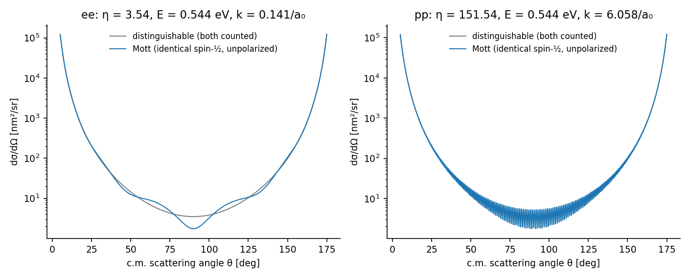
**図 7.** 電子–電子（$\eta=3.54$）と陽子–陽子（$\eta=151.5$）の Mott 断面積と、区別できる粒子の古典値。

## 4.3 四重極制動放射

同種粒子では重心系の電気双極子が恒等的に 0 なので、制動放射は四重極 $P=(1/180c^5)\dddot D_{\alpha\beta}\dddot D_{\alpha\beta}$（Landau–Lifshitz §71 [27]）。斥力双曲線 $x=a(e+\cosh\xi)$、$y=a\sqrt{e^2-1}\sinh\xi$、$t=(a/v)(e\sinh\xi+\xi)$ で $\dddot D$ を閉じた形にし、$\xi$ で Fourier 変換して $dE/d\omega$ を得る。Parseval $\int P\,dt=\int(dE/d\omega)d\omega$ の自己検査は電子–電子 0.9996、陽子–陽子 1.0001。

| 量 | 電子–電子 | 陽子–陽子 |
|---|---|---|
| 放射エネルギー $E_{\rm rad}=\int(dE/d\omega)d\omega$ | $1.54\times10^{-16}$ eV | $3.58\times10^{-25}$ eV |
| 特徴的な光子エネルギー $\hbar v/a$ | 0.31 eV | $7.18\times10^{-3}$ eV |
| 一回の衝突の光子数の期待値 $E_{\rm rad}/\hbar(v/a)$ | $5.0\times10^{-16}$ | $5.0\times10^{-23}$ |
| 重力波 | その $9.6\times10^{-43}$ 倍 | その $3.2\times10^{-36}$ 倍 |

スペクトルは $\omega\to0$ で一定（放出前後の $\ddot D$ の差）、$\omega\gtrsim v/a$ で指数的に落ちる（図 8）。陽子–陽子は $\eta\gg1$ で古典スペクトルが妥当、電子–電子は $\eta\approx3.5$ で目安（量子の Gaunt 因子は入れていない）。一回の衝突からは何も出ず、in と out の関係しか記録に残らない。

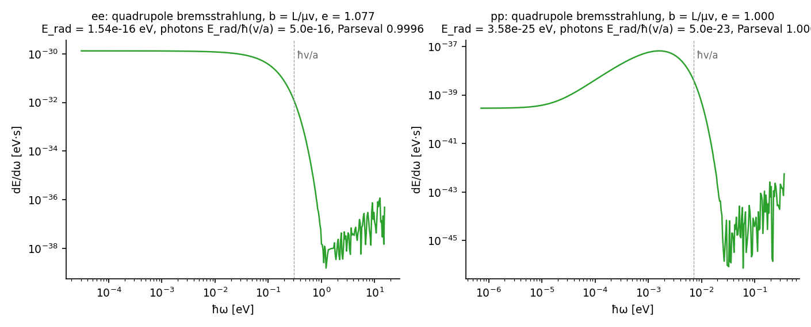
**図 8.** 四重極制動放射のスペクトル $dE/d\omega$。破線は $\hbar v/a$。

---

# 5. 系 4：水素分子（水素原子・水素原子）

## 5.1 ポテンシャルと準位

中性子–中性子は強い力を入れない限り意味を持たず、電荷を持たず質量のある二体で強い力を仮定せずに組めるのは中性原子の対である。その最小が H₂ で、基底電子状態 X¹Σg⁺ の振動回転準位 $(v,J)$ を系の準位とする。

核の動径方程式は断熱近似で

$$
-\frac{1}{2\mu_n}f''+\left[V(R)+\frac{J(J+1)}{2\mu_nR^2}\right]f=Ef,\qquad \mu_n=\frac{m_p}{2},\qquad V(R)=E_{\rm el}(R)+E_a(R)
$$

$E_{\rm el}$ は Pachucki の BO ポテンシャル [46]（R = 0.1–20 bohr の 82 点、精度 $10^{-15}$）の解析フィット（Łach、H2SPECTRE 7.4 [47] の FUNCTION V を移植。表との差の最大 $2.2\times10^{-12}$ hartree）、$E_a$ は Pachucki–Komasa の断熱補正 [48] のフィット（同 Eaint）。どちらも 2 個の水素原子を原点にとり、$V(\infty)=0$。非断熱・相対論・QED 補正は入れない。離散化は sinc-DVR（Colbert–Miller [55]、H2SPECTRE と同じ行列要素）、$dr=0.025$ bohr、$R\le50$ bohr。格子を $dr=0.02$、$R\le60$ にしても準位の変化は $2.2\times10^{-7}$ cm⁻¹。

束縛準位は $E<0$ の 301 個（Roueff ら [51] の 302 個のうち (14,4) は非断熱補正なしでは束縛しない。全補正では解離の 0.027 cm⁻¹ 下）。$D_0=36118.3637$ cm⁻¹（E2(FULL) 36118.7977、全補正 36118.0695）、(0,1)−(0,0) = 118.4919 cm⁻¹（全補正 118.4868）。$J$ 偶はパラ（$I=0$）、$J$ 奇はオルト（$I=1$）。

## 5.2 率

原子単位（$\hbar=m_e=e=1$、$c=1/\alpha$）で

$$
A_{E2}=\frac{\alpha^5\omega^5}{15}(2J_f+1)\begin{pmatrix}J_i&2&J_f\\0&0&0\end{pmatrix}^2|\langle f_f|\Theta|f_i\rangle|^2,\qquad
A_{M1}=\frac{\alpha^5\omega^3}{3}\left(\frac{m_e}{m_p}\right)^2J(J+1)|\langle f_f|g|f_i\rangle|^2
$$

E2 は $\Delta J=0,\pm2$、M1 は $\Delta J=0$、$v_i\ne v_f$。$\Theta(R)$ は分子四重極能率で、Wolniewicz–Simbotin–Dalgarno [49] 表 3 の $Q_{\rm WSD}(R)$（257 点）の 1/2（Roueff ら §3.1 の注）。Q 枝で $(2J+1)\begin{pmatrix}J&2&J\\0&0&0\end{pmatrix}^2=J(J+1)/((2J-1)(2J+3))$ となり Pachucki–Komasa 2011 [50] 式 (14) と一致する。$g(R)$ は同 [50] 表 I。重力波は水素と同じ比の導出で

$$
A_{GW}=4\frac{\alpha_{Gp}}{\alpha}\frac{|\langle q_m\rangle|^2}{|\langle\Theta\rangle|^2}A_{E2},\qquad q_m(R)=\frac{R^2}{2}+\frac{m_e}{m_p}\left(\frac{R^2}{2}-\Theta(R)\right),\qquad \alpha_{Gp}=\frac{Gm_p^2}{\hbar c}
$$

辺は E2 4669、M1 1467、GW 4669。E2・M1・GW はどれも $J$ の偶奇を保ち、オルトとパラは結ばれない（偶奇を変える辺 0 本）。質量は $M=2(m_p+m_e)+E/c^2$。核スピンの縮退は src と dst で共通なので、詳細釣り合いの $g_{\rm src}/g_{\rm dst}=(2J_s+1)/(2J_d+1)$ はそのまま使える。

## 5.3 検証

Roueff ら 2019 [51]（CDS J/A+A/630/A58、4712 遷移。$V$ は同じ BO＋断熱、$\Theta$・$g$ は Pachucki–Komasa の値、準位は Pachucki–Komasa 2018 [52] の全補正）と対照した（図 11）。

| 量 | 結果 |
|---|---|
| 準位エネルギー 本計算 − CDS | −0.29（(0,0)）〜 +4.6 cm⁻¹（$v=10$）。$v$ とともに増える＝非断熱補正の分 |
| 波数 σ の相対差 | 中央値 $1.6\times10^{-4}$（近接準位間の小さな σ で最大 $4\times10^{-2}$） |
| $A_{E2}$ の相対差（4669 本） | 中央値 $8.2\times10^{-4}$。σ⁵ を揃えて Θ の行列要素だけにしても $7.7\times10^{-4}$。$A>10^{-9}$ s⁻¹ の強い線で最大 6 %（$\Delta v\ge3$ の相殺の大きい線） |
| $A_{M1}$ の相対差（1467 本） | 中央値 $5.8\times10^{-4}$ |
| 1-0 S(1)（2.12 μm） | $3.471\times10^{-7}$ vs $3.470\times10^{-7}$ s⁻¹ |
| 0-0 S(0)（28.2 μm） | $2.942\times10^{-11}$ vs $2.943\times10^{-11}$ s⁻¹ |
| 1-0 Q(1) の M1 | $7.137\times10^{-10}$ vs $7.137\times10^{-10}$ s⁻¹ |

H2SPECTRE 配布の準位表 H2.dat の (2,24) は隣の $J$ から 115 cm⁻¹ 外れており、配布データ側の誤記と見る。

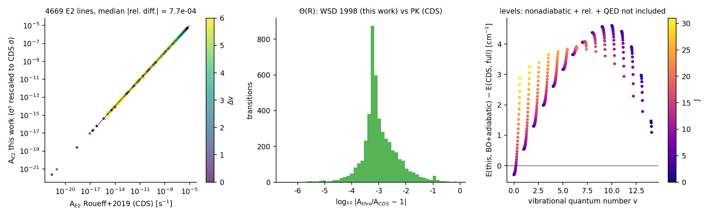
**図 11.** H₂ の検証。左：$A_{E2}$ の本計算と CDS の比較（4669 本、$\Delta v$ で色分け）。中：相対差の分布。右：準位エネルギーの差 対 $v$。

## 5.4 カスケードの結果

初期準位を (1,3)（1-0 S(1) の上準位）、(3,5)、解離限界直下の (14,0)・(14,1) にとり、§3.2 と同じマスター方程式で走らせた（図 9、図 10）。

| 初期 | 解離に対する深さ [cm⁻¹] | 放出合計 [eV]（$=E_{\rm init}-E_{\rm final}$、差） | 光子数 E2／M1 | 終状態 |
|---|---|---|---|---|
| (1,3) | 31286.1 | 0.584431745（$1\times10^{-15}$） | 1.830／0.0051 | (0,1) オルト最下 |
| (3,5) | 22850.8 | 1.630280932（$2\times10^{-15}$） | 3.537／0.027 | (0,1) |
| (14,0) | 143.3 | 4.460335799（$2\times10^{-15}$） | 7.479／0.022 | (0,0) パラ最下 |
| (14,1) | 126.2 | 4.447765200（$1\times10^{-14}$） | 6.972／0.024 | (0,1) |

(14,J) からの最初の段は (10,J±2)・(9,J±2)・(8,J±2) へ（$\hbar\omega$ 0.6–1.1 eV、分岐 0.37／0.36／0.14）で、$v'=0$ へ直接は行かない。以後 $v$ を 1〜3 ずつ下げ、最後は純回転の (0,2)→(0,0)（寿命 $3.4\times10^{10}$ s、28 μm）または (0,3)→(0,1)（寿命 $2.1\times10^9$ s、17 μm、$A=4.76\times10^{-10}$ s⁻¹）で止まる。線の自然幅 $\Gamma\hbar/\hbar\omega$ は $10^{-24}$〜$10^{-20}$ で、水素原子の $10^{-8}$ より極めて鋭い。重力波の放出は $1.5\times10^{-35}$〜$5.4\times10^{-35}$ eV。

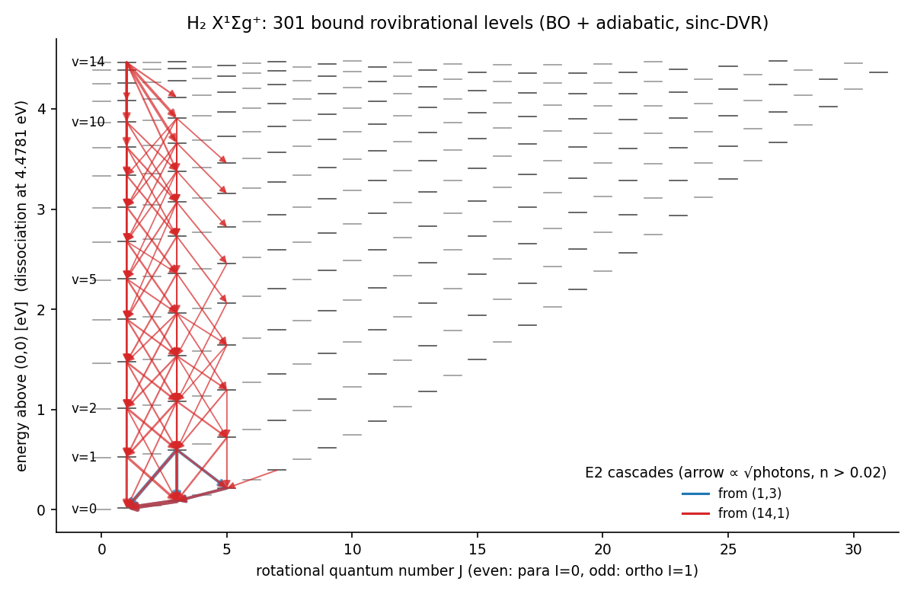
**図 9.** H₂ X¹Σg⁺ の 301 準位（横軸 $J$、縦軸 (0,0) からの励起）と (1,3)・(14,1) からの E2 カスケード。

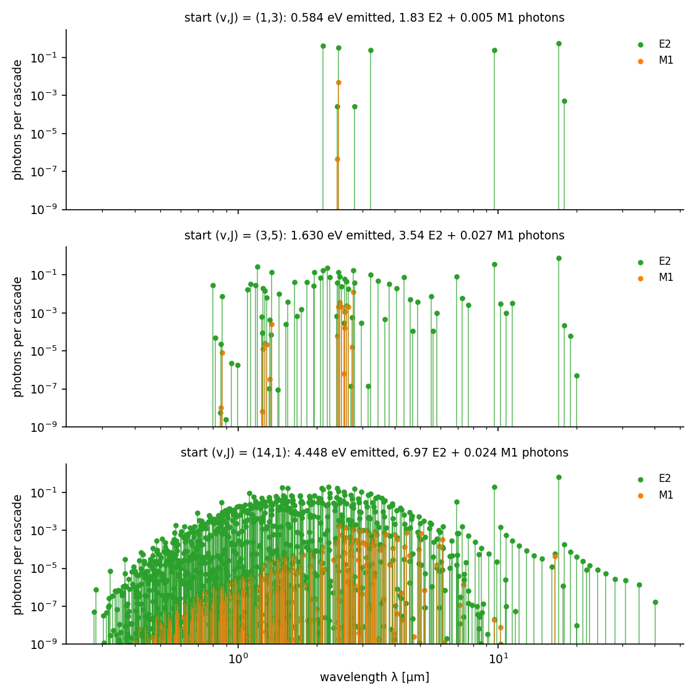
**図 10.** カスケードの放出記録（光子数 対 波長）。上から (1,3)、(3,5)、(14,1)。

## 5.5 吸収体の三層での読み出し

**層 2**。最下準位からの最低励起 (0,1)→(0,3) は 587 cm⁻¹ $=0.0728$ eV $=310\,kT$（2.7255 K）で、Boltzmann 比 $g_f/g_i\,e^{-\hbar\omega/kT}=6\times10^{-135}$。全辺で Planck 占有数が最大なのは高励起準位の偶然の近接対 (6,20)→(7,18)（1.77 cm⁻¹）の $\langle\bar n\rangle=0.65$。定常状態は核スピン系列の最下準位 1 つで、水素の 21 cm（$\bar n=39.5$）のような温度の読み出しは無い。

**層 1**（図 13）。(1,3) からのカスケード 200 分子・360 光子で、反跳は 0.01〜0.09 m/s、線幅 $2\times10^{-24}$〜$7\times10^{-22}$。記録 $(\delta,\hat n)$ だけから $\vec v$ を復元すると差 0.002 m/s（1 次の線形解は 27 m/s 外れる）。(3,5) では 695 光子で 0.007 m/s、(14,1) では 1430 光子で 0.026 m/s（反跳は最大 0.32 m/s）。$t\le10^{17}$ s に吸収・誘導放出は起きない。

**層 3**（図 14）。初期 $m=0$ からの 1-0 S(1)（(1,3)→(0,1)）は $N_0:N_{+1}:N_{-1}=0.6:0.2:0.2$（90° の偏光度 +0.5）、1-0 Q(3) の M1 は $\Delta m=0$ が 0（$(3\,1\,3;000)=0$）。終状態 (0,1) の $m$ 分布は 0.240／0.521／0.240（整列 −0.187）、(14,1) 開始では 0.330／0.339／0.330（−0.006）。背景は $\langle\bar n\rangle\approx0$ なので $m$ 副準位間の緩和・整列は起こらず、初期の $m$ の記憶が終状態にそのまま残る。

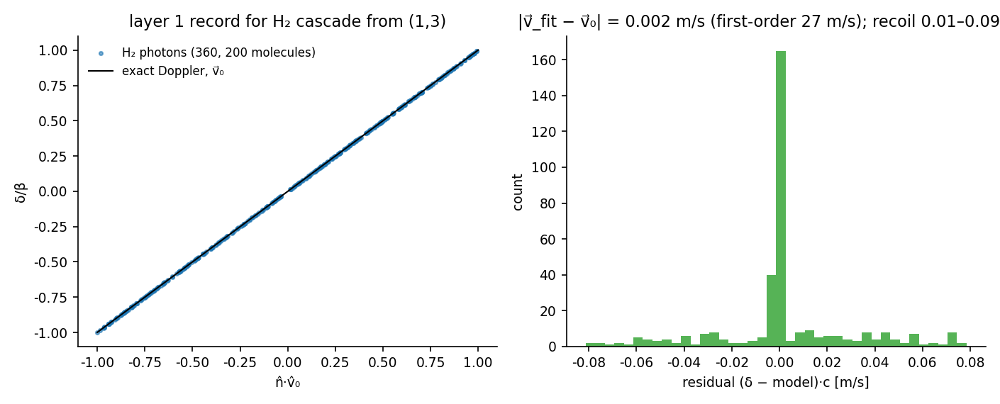
**図 13.** H₂ の層 1。(1,3) からの 360 光子の Doppler 記録と、厳密模型での $\vec v$ の復元残差。

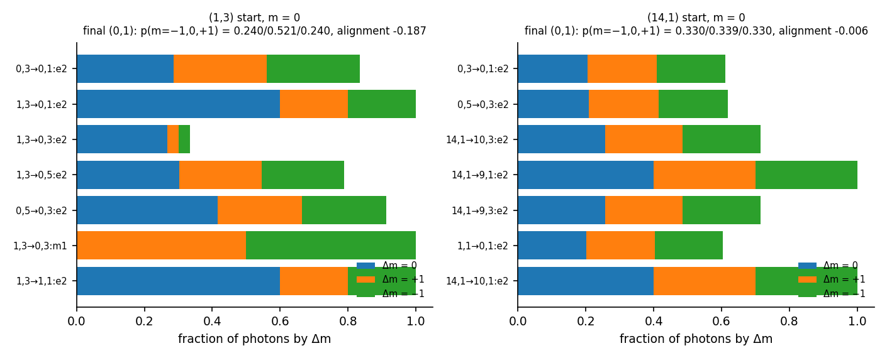
**図 14.** H₂ の層 3。初期 $m=0$ からの各線の $\Delta m$ 分配と、終状態 (0,1) の $m$ 分布。

## 5.6 放射会合 H + H → H₂ + γ

水素原子どうしは重力では近づかない。原子間重力 $-Gm_H^2/R$ は電磁相互作用の $8\times10^{-37}$ 倍で、分散力（Casimir–Polder $-C_7/R^7$）を上回るのは $R\gtrsim0.2$ mm からだが、そこで重力に束縛されるには Bohr 半径 $7\times10^{22}$ m（2.3 Mpc）、束縛エネルギー $8\times10^{-69}$ eV の「重力原子」が要る。実際の経路は電子スピンで分かれ、三重項 b³Σu⁺（3/4）は斥力で、一重項 X¹Σg⁺（1/4）は深さ 4.75 eV の井戸に落ちるが、核は Coulomb 斥力で内側の転回点（解離限界で $R=0.776\,a_0$）まで近づいて戻る。合体には 4.5 eV を捨てる相手が要り、二体だけなら放射しかなく、等核で E1 は無い。

そこで、箱 $R\le50$ bohr で規格化した離散化連続状態 $\psi_n$（$E_n>0$、部分波 $J$）から束縛準位への率を §5.2 と同じ式で計算し、

$$
P_J(E_n)=2\pi\hbar\rho_J(E_n)\sum_fA(n\to f),\qquad
\sigma(E)=\frac{\pi}{k^2}\sum_Jw_J(2J+1)P_J(E),\qquad k(E)=\sigma v
$$

$\rho_J=dn/dE$ は箱の準位密度で、$2\pi\hbar\rho_J$ は箱の往復時間（$J=0$、$E\approx100$ cm⁻¹ で $2.181\times10^{-12}$ s、古典の $2\int dR/v$ は $2.161\times10^{-12}$ s）。$P_J$ は通過 1 回あたりの捕獲確率で $R_{\max}$ に依らない（50 → 100 bohr で相対差 $10^{-5}$）。重み $w_J$ は電子一重項 1/4 × 核スピン（$J$ 偶 1/4、$J$ 奇 3/4）。$J\le24$、$E\le4389$ cm⁻¹。

| $E$ [cm⁻¹] | $E/k_B$ [K] | $P_0$ | $\sigma$ [cm²] | $k(E)$ [cm³ s⁻¹] |
|---|---|---|---|---|
| 3 | 4.3 | $9.4\times10^{-20}$ | $1.12\times10^{-34}$ | $4.2\times10^{-30}$ |
| 10 | 14 | $1.03\times10^{-19}$ | $8.9\times10^{-35}$ | $6.1\times10^{-30}$ |
| 100 | 144 | $1.12\times10^{-19}$ | $9.8\times10^{-35}$ | $2.1\times10^{-29}$ |
| 1000 | 1439 | $1.18\times10^{-19}$ | $4.4\times10^{-35}$ | $3.1\times10^{-29}$ |
| 3000 | 4316 | $1.27\times10^{-19}$ | $2.3\times10^{-35}$ | $2.7\times10^{-29}$ |

Maxwell–Boltzmann の熱平均 $k(T)$ は 10 K $2.4\times10^{-29}$、100 K $3.2\times10^{-29}$、300 K $3.8\times10^{-29}$、1000 K $3.5\times10^{-29}$、3000 K $2.4\times10^{-29}$ cm³ s⁻¹。主な終準位は $v'=8$〜11（$\hbar\omega$ 0.4〜1.1 eV）で、$v'=0$ へは行かない。$E\approx1$ cm⁻¹ では (14,4) の準束縛準位（本計算では解離限界の 0.74 cm⁻¹ 上、$P_4=9\times10^{-18}$）が σ の 99 % を占める。これは非断熱補正を入れれば束縛準位に戻り、連続状態からは消える。$k(E)$ に現れる鋭いピークは遠心力障壁の内側の準束縛 $(v,J)$（形状共鳴）で、幅は箱の離散化では解像されない。

計算に先立って $\hbar\omega=D_e$ の E2 率と井戸の通過時間から見積もった $10^{-14}$ は 5 桁過大だった。実際の捕獲は $\hbar\omega\approx0.4$〜1.1 eV への遷移で、$\omega^5$ が $10^{-4}$ 倍になる。

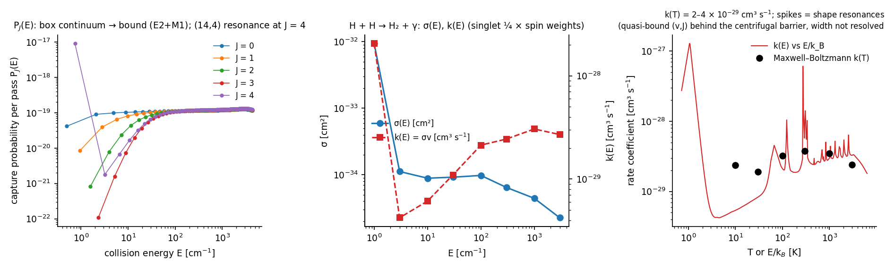
**図 12.** 放射会合。左：通過 1 回あたりの捕獲確率 $P_J(E)$（$J=0$〜4）。中：$\sigma(E)$ と $k(E)$。右：$k(E)$ と熱平均 $k(T)$。

## 5.7 原子間重力の別勘定

原子間の Newton 重力 $\langle f_{vJ}|-Gm_H^2/R|f_{vJ}\rangle$（$m_H=m_p+m_e-E_b/c^2$ の点質量）は (0,0) で $-1.244\times10^{-31}$ cm⁻¹、(14,0) で $-3.97\times10^{-32}$ cm⁻¹、線のずれは $10^{-37}$〜$10^{-36}$ eV。準位エネルギーの倍精度の床（$10^{-12}$ cm⁻¹）の 20 桁下なので $E$ に加えても値は変わらず、別の列として持つ（図 15）。電子–核・電子–電子の重力の交差項（核–核項の $\sim10^{-3}$、$\sim10^{-7}$。$\sum\langle1/r_{ia}\rangle(R)$、$\langle1/r_{12}\rangle(R)$ が要る）と 1PN（$(v/c)^2\sim10^{-10}$）は入れていない。重力はこの系で、準位の $10^{-31}$ cm⁻¹ のずれと $10^{-35}$ eV の重力波放出としてだけ現れる。

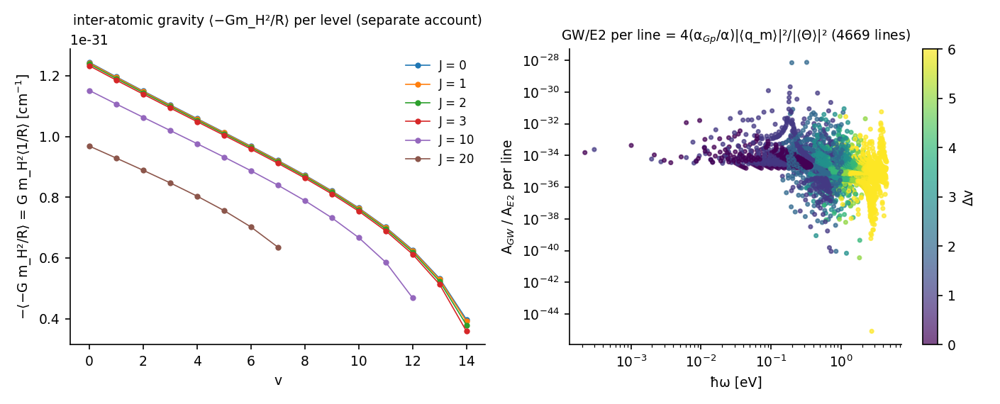
**図 15.** 左：準位ごとの $\langle-Gm_H^2/R\rangle$。右：各 E2 線の重力波／E2 の率の比（$\langle\Theta\rangle$ が相殺で小さい $\Delta v$ の大きい線で比が上がる）。

---

# 6. 四系の比較と考察

## 6.1 何が記録に残るか

| | 水素原子 | 電子–電子・陽子–陽子 | 水素分子 |
|---|---|---|---|
| 束縛準位 | 50（$n\le5$） | 0 | 301 |
| 放出の種類 | E1、二光子、M1、E2、GW | 四重極制動放射のみ（双極子は恒等的に 0） | E2、M1、GW（E1 なし） |
| 一回のカスケード／衝突の光子数 | 数個 | $5\times10^{-16}$／$5\times10^{-23}$ | 2〜7 個 |
| 最低遷移 vs 2.7255 K の $kT$ | 21 cm $=0.025\,kT$、$\bar n=39.5$ | — | 587 cm⁻¹ $=310\,kT$、$\bar n\sim10^{-135}$ |
| 層 2 の読み出し | スピン温度 2.72550 K | — | なし |
| 層 1 の読み出し | 0.09 m/s（集団）、$2.4\times10^{-10}$ m/s（一原子の履歴） | 偏向角の分布のみ | 0.002 m/s（線幅 $10^{-22}$） |
| 層 3 の読み出し | 初期 $m$ の偏光、定常整列 $10^{-8}$ | — | 初期 $m$ の偏光、緩和なし |
| 重力の現れ方 | 準位 $10^{-38}$ eV、GW $10^{-48}$ eV | GW／E2 $10^{-43}$〜$10^{-36}$ | 準位 $10^{-31}$ cm⁻¹、GW $10^{-35}$ eV |

吸収体の性質は、記録に対して三つの異なる仕方で入る。温度は生成子（上向きの率）を変え、方向と速度は記録の読み出し（Doppler と反跳）だけを変え、異方性は状態空間と生成子と読み出しのすべてを変える。等方・無限遠・完全吸収の殻には方向という関係量が無く、並進も反跳も定義できない。方向は吸収体の匿名な等重みの要素への割り当てとして初めて定義され、二光子対の角相関と双極子の $\cos\theta$ から読まれる。

## 6.2 内部状態は読めない

水素原子の 50 準位の占有、H₂ の 301 準位の占有、散乱の途中の軌道は、どれも記録には出ない。記録に出るのは放出・吸収の事象の列で、同じ記録を与える二つの模型は区別できない。本稿の帳簿（$\tau$、占有の時間発展）は検査のために計算したもので、観測量ではない。同種粒子の散乱で軌道を実在と仮定すると Mott の干渉項を落として誤ることが、その一例である。

## 6.3 標準理論の構造

この一式では、相互作用は固有値問題を解いた時点で使い切られ、走行中は定数の生成子 $R$ が確率を流すだけである。待ち時間の指数分布は無記憶で、事象と事象の間に系自身の時間は無い。線幅は準位の不確定さではなく放出過程の長さであり、包絡線が指数ならば Lorentz 型になる。二光子は一つの事象で二個が同時に出る対で、和の振動数だけが鋭く、個々は連続であり、対の同時性が原点の共有を外に出す。これらは標準理論が二体系について与える記録の構造であって、本稿の主張ではない。将来の分配配列演算が再現すべきものである。

## 6.4 水素原子と水素分子の違い

同じ枠組みを走らせると、吸収体 2.7255 K の読み出しは水素原子にだけある。水素の 21 cm は $kT$ の 1/40 で背景と平衡するが、H₂ の最低遷移は $kT$ の 310 倍で、背景は励起も $m$ 緩和も起こさない。層 1 の速度復元は H₂ の方が精度が高い。E2 の線幅が $10^{-22}$ と極めて細いためで、200 分子で 0.002 m/s、水素原子の 200 原子で 0.09 m/s である。

## 6.5 場の時間発展、記録、吸収体の物理的な対応物

本稿の生成子に場の自由度は無い。静的な場は固有値問題に、放射場は Einstein の A 係数に畳み込まれ、光子は放出の瞬間に無限遠の吸収体へ消える。場の時間発展が記録に残す分は、本稿が実測とずれている量そのものである：1S の 8170 MHz と 2S–2P₁/₂ の 1057.85 MHz（Lamb シフト）、超微細と 21 cm の因子 0.9989・0.9944（$g_e-2$）。古典的に場を時間発展させると定常状態が無く崩壊する（§1.2 の第十思考実験）ので、記録の「基底状態は放射しない」には場の時間発展と離散的なロックの両方が要る。本稿はその両方を持つ生成子が再現すべき記録を与える。

場の状態を実体とみなす立場と、無限遠の記録を実体とみなす立場は、放射の部分については同じことを別の言葉で言っている（§2.5）。両者が同じ予言を与えるのは吸収体が完全なときで、Wheeler–Feynman の吸収体理論 [58] が Maxwell の放射反作用と一致する条件、直接作用型の量子電磁力学 [67] が通常の量子電磁力学と一致する条件がそれである。吸収が不完全なら両者は異なる予言をし、Partridge [59] は放射パワーの方向依存を $10^{-6}$ の精度で探して見つけなかった。本稿の前提（全天を覆う完全吸収体）は、この実測に支えられている。

吸収体の物理的な対応物は宇宙論的な事象の地平線で、その静止系は背景放射の静止系である。Hogarth [64] と Hoyle–Narlikar [65] は、放射が完全に吸収されるかを宇宙の未来の構造で論じた。加速膨張する宇宙の地平線（半径 $c/H_0\approx4.4$ Gpc）は内側から見れば全方向を覆う完全吸収体で、その面積を Planck 単位で測った $4\pi(R_H/l_P)^2\approx7\times10^{122}$（de Sitter エントロピー [66]）が §2.2 の要素数 $N$ の上限である。本稿は入射する背景（過去円錐、2.7255 K）と吸収（未来円錐、地平線の温度 $\hbar H_0/2\pi k\approx2\times10^{-30}$ K）を一つの温度の熱浴にまとめている。これは実験の時間が膨張時間より短い近似で、$t_{\max}=10^{17}$ s（30 億年）の走行では背景の温度が 2 割変わるので、厳密には破れている。

内部位相が変わる源は吸収体との交換だけである。記録される交換（放出・吸収）は振動数そのものを与え、記録されない交換（仮想的な交換）は振動数のずれ（Lamb シフト）を与える。外部との交換が無い間、系は固有振動数と固有の内部時計と空間的な広がりを持つが定常で、読めるのは次の事象の統計だけである。重ね合わせの位相は次の事象の時刻分布に量子ビートとして現れるが、本稿のマスター方程式は占有だけを運ぶので出ない。

## 6.6 今後の方向

1. **記録の相関**。本稿の記録は一次（強度）で止まっている。場の位相が実体として現れるのは記録の間の相関で、$g^{(1)}(\tau)$（線形は本来これの Fourier 変換）、$g^{(2)}$（一原子の反バンチング $g^{(2)}(0)=0$、カスケード光子の時間相関）、二光子対の偏光相関（Bell [62]）、二つの源の干渉がそれである。いずれも標準の量子光学で計算でき、二次の正解表として本稿に加えられる。
2. **真空の場の痕跡**。Bethe の非相対論計算（放射場のモード和、切断 $m_ec^2$）は 2S の Lamb シフト 1040 MHz を与える。必要な双極子行列要素と Bethe 対数は本稿の一式に既にある。
3. **過去と未来の分離**。入射する背景の温度と未来の吸収を別の面として持ち、膨張による温度変化を入れる。
4. **生成子**。放射とロックを同じ交換から出す生成子（分配配列演算）が、本稿の記録とその相関を再現すること。これが本研究系列の目標である。

---

# 7. 限界と非主張

本稿は次を主張しない。

1. **Einstein–Maxwell 方程式を実装したこと。** 場は時間発展させていない。準位は束縛状態の式、重力は 1PN の期待値、放射は Einstein の A 係数である。
2. **万能相互作用の分配配列演算から動力学を導いたこと。** 本稿はその照合先を与えるだけである。
3. **新しい物理法則や定数の導出。** 入力はすべて既知の値（§2.1）。
4. **QED と核サイズを含む水素の準位。** 1S の 0.12 MHz を除く不一致はすべて入れていない QED・核サイズの大きさに一致する（§3.3）。重力の 2PN 以上は入れていない。
5. **非断熱・相対論・QED を含む H₂ の準位。** 準位は全補正値と −0.3〜+4.6 cm⁻¹ 違い、(14,4) は束縛しない。$\Theta(R)$ は 1998 年の値で、強い線の A 係数は最大 6 % 違う。
6. **H₂ の三重項チャネルと電子励起状態。** 電子スピンの 3/4 を占める b³Σu⁺（斥力）と Lyman・Werner 帯は入れていない。
7. **電子–電子の制動放射の量子論。** $\eta\approx3.5$ では古典スペクトルは目安で、Gaunt 因子は入れていない。
8. **原子間重力の完全な勘定。** 点質量の Newton 項だけで、電子の交差項と 1PN は入れていない（§5.7）。
9. **吸収体の四重極の実際の軸。** $a_2=4\times10^{-6}$ は COBE の $Q_{\rm rms}$ からの目安で、双極子と同じ軸に置いた。
10. **放射会合の共鳴の幅。** 箱の離散化は形状共鳴の幅を解像しない。(14,4) 共鳴は非断熱補正を入れれば消える。
11. **吸収体の要素数 $N=10^{60}$ の物理的な導出。** 飽和の下限 $1.5\times10^{34}$ より十分大きく、面積則の上限 $4\pi(R_H/l_P)^2\approx7\times10^{122}$ より小さい値として置いた。値は記録に現れない。
12. **吸収体と宇宙論的地平線の同定。** §6.5 の同定は解釈であり、計算は静的な一温度の吸収体で行った。過去の背景と未来の吸収の分離、膨張による温度変化は入れていない。
13. **記録の相関。** 本稿の記録は強度（一次）だけで、$g^{(1)}$・$g^{(2)}$・二光子対の偏光相関・量子ビートは計算していない。

---

# 8. 再現性

全プログラム・データ・図は GitHub リポジトリ ai-chat-logs-open の `匿名頂点状態生成幾何-匿名内部観測者から不変な関係量の体系/Grok移行実験/` にあり、各フォルダは `run_all.sh` で一式を再生成し、`SHA256SUMS` を持つ。Zenodo には同じファイルを同梱する。

| フォルダ | 内容 | 再現 |
|---|---|---|
| `exchange_rel_20261005/` | 水素原子の固定一式：`exchange_cascade.py`（準位・A 係数・マスター方程式）、検算 3 本（`coulomb_levels_check.py`、`gravity_levels_check.py`、`rates_check.py`）、付表 `structure_tables.py`、構造文書 `プログラム構造_ja_20261006.md`、重力の調査 `重力項目_調査と修正_ja_20261005.md`、原本との差分 `CHANGES_vs_original.diff` | `run_all.sh`、SHA 16 ファイル |
| `exchange_general_20261006/` | 符号を入力にした数値解法 `two_body_general.py`（ep／ee／pp）、対照 `control_general_vs_closed_form.py`、散乱 `scattering_same_sign.py`、吸収体の三層 `absorber_temperature.py`・`absorber_direction_recoil.py`・`absorber_alignment.py` | `run_all.sh`、SHA 19 ファイル |
| `exchange_engine_20261006/` | 共通エンジン `engine.py`、水素の部品と回帰テスト、H₂ の部品 `system_h2.py`、検証 `validation_h2.py`、走行 `run_h2.py`、放射会合 `radiative_association_h2.py`、文献データ `h2_data/`（出典と取得物の SHA は `SOURCES.md`）、図化用 JSON | `run_all.sh`（約 5 分）、SHA 29 ファイル |
| `figures_paper_20261006/` | 本稿の図 15 枚 `make_figures.py`、描いた数値 `data/*.json` | `run_all.sh`、SHA 29 ファイル |

主な検査：水素の固定一式とエンジン版の回帰（放出 13.054539268 eV の差 $-3.6\times10^{-15}$、生成行列・滞在時間・終状態の差 0）、固定一式と数値解法の対照（§3.6）、H₂ の文献値との対照（§5.3）、放射会合の箱非依存性と往復時間（§5.6）、エネルギー保存（放出合計 $=E_{\rm init}-E_{\rm final}$、差 $\le10^{-14}$ eV）。

乱数列：層 1 の集団は `default_rng(7)`、一原子の履歴は `default_rng(20261006)`、H₂ の層 1 は `default_rng(11)`。環境：Python 3.9、numpy 2.0.2、scipy、matplotlib。macOS の Accelerate では 50×50 以上の `@` が偽の警告を出すので `np.dot` を使う。H2SPECTRE 7.4 の配布サイトは証明書が期限切れで、アーカイブはハードリンクの重複を含むため Python の tarfile で正規ファイルだけを展開した。重い計算を並走させると Accelerate が全コアを取り合い 10 倍以上遅くなる。

本稿の数値はすべて、これらのフォルダの `audit*.txt`、`*.md`、`*.json` に書かれた値をそのまま転記した。

---

# 9. AI の関与の記録

- **Grok**（2026-10-05）：水素原子の多段放出の最初のプログラム（級数カスケード）。本稿の一式はそのコピーから出発し、Coulomb 準位を Dirac–Coulomb＋反跳に、重力を一般相対論の 1PN に、動力学を Einstein の A 係数によるマスター方程式に置き換えた。Grok の率（$\propto\Delta E$）、スピン項、率の帰還、$n\to n-1$ の拘束はすべて撤去した。差分は `CHANGES_vs_original.diff`。
- **ChatGPT**（2026-09-30〜10-01）：本稿に先立つ Einstein–Maxwell 完全仕様（v1.0〜v3.1）。本稿では使っていない。
- **Claude**（2026-10-05〜07）：上記の修正と実装、数値解法・散乱・三層・エンジン・H₂・放射会合・図・本稿の起草。設計と判断は著者。

---

# 10. 結論

標準理論が二体系について与える放出記録を、背景時空の格子も計量も持たず、無限遠の吸収体の静止系だけを基準にして数値計算するプログラムを構築し、水素原子・電子–電子・陽子–陽子・水素分子の 4 系で走らせた。水素原子は外部の実測値と、QED・核サイズを除いた精度で一致し、水素分子は文献の A 係数と $10^{-3}$ で一致した。同符号の対には束縛準位が無く、記録に残るのは Mott 断面積と四重極制動放射だけである。吸収体の温度・方向と速度・異方性は、記録にそれぞれ異なる仕方で入り、水素原子の 21 cm では吸収体の温度が読め、H₂ では読めない。重力はいずれの系でも準位の $10^{-31}$〜$10^{-38}$ の桁と重力波の $10^{-35}$〜$10^{-48}$ eV としてだけ現れる。

この記録が、将来の分配配列演算が再現すべき基準である。

---

# 付録 A. 水素一式の状態と辺

50 準位（$n\le5$、$(n,\ell,s_e,s_p)$）、初期 5p₃/₂ F=1。辺は E1 320、E2 376、GW 376、M1 59、二光子 2 の計 1133 本。準位・辺・放出・幅の全表は `exchange_rel_20261005/structure_tables.md`（表 A〜F）、式とコードの対応は `プログラム構造_ja_20261006.md` にある。

# 付録 B. 吸収体の層の式

- Doppler：$\delta=\omega_{\rm lab}/\omega'-1=\dfrac{\beta n_\parallel\gamma-(\gamma-1)}{\gamma(1-\beta n_\parallel)}$（桁落ちなし）。
- 反跳：静止系の二体運動学で放出 $\hbar\omega'=\Delta E(1-\Delta E/2Mc^2)$、吸収 $\Delta E(1+\Delta E/2M_fc^2)$。運動量 $\vec P\to\vec P\mp(\hbar\omega_{\rm lab}/c)\hat n$、エネルギー $E\to E\mp\hbar\omega_{\rm lab}$ から $\vec v$ を更新。
- 層 3 の角分布 $P_q(\theta)$：$k=1$ で $q=0$：$(3/8\pi)\sin^2\theta$、$q=\pm1$：$(3/16\pi)(1+\cos^2\theta)$。$k=2$ で $q=0$：$(15/8\pi)\sin^2\theta\cos^2\theta$、$|q|=1$：$(5/16\pi)(1-3\cos^2\theta+4\cos^4\theta)$、$|q|=2$：$(5/16\pi)(1-\cos^4\theta)$。
- 型ごとの占有数 $\langle\bar n\rangle_q=\int\bar n(\omega,T(\hat n))P_q\,d\Omega$、定常の副準位 $p_m\propto\langle\bar n\rangle_q/(1+\langle\bar n\rangle_q)$。

# 付録 C. 図一覧

| 図 | ファイル |
|---|---|
| 1 | `figures/fig01_H_levels_cascade.png` |
| 2 | `figures/fig02_H_spectrum_widths.png` |
| 3 | `figures/fig03_H_time_evolution.png` |
| 4 | `figures/fig04_H_layer2_temperature.png` |
| 5 | `figures/fig05_H_layer1_doppler_recoil.png` |
| 6 | `figures/fig06_H_layer3_alignment.png` |
| 7 | `figures/fig07_ee_pp_mott.png` |
| 8 | `figures/fig08_ee_pp_bremsstrahlung.png` |
| 9 | `figures/fig09_H2_levels_cascades.png` |
| 10 | `figures/fig10_H2_cascade_spectra.png` |
| 11 | `figures/fig11_H2_validation.png` |
| 12 | `figures/fig12_H2_radiative_association.png` |
| 13 | `figures/fig13_H2_layer1_doppler.png` |
| 14 | `figures/fig14_H2_layer3_polarization.png` |
| 15 | `figures/fig15_H2_gravity_accounting.png` |
| 16 | `figures/fig16_lightcone_absorber.png`（模式図、`figures/make_fig16_lightcone.py`） |

図 1〜15 は `Grok移行実験/figures_paper_20261006/make_figures.py` で生成し、描いた数値は同フォルダ `data/*.json` にある。図 16 は本フォルダの `figures/make_fig16_lightcone.py` で描いた模式図で、データは無い。

---

# 参考文献

## 本研究系列

[S1] 木原範昭, **設計書（第 0 論文）**. Concept DOI: 10.5281/zenodo.22851944.

[S2] 木原範昭, **第六思考実験：二種類の長距離相互作用を一つの閉じた状態写像へ内部化できるか ― 荷電準円二体系の重力・Coulomb・GW四重極・EM双極放射を8永続状態で再構成し、5条件で同一 transition の移植可能性を検証する ―**, v1.1 (2026-09-26). Concept DOI: 10.5281/zenodo.22974631; Version DOI: 10.5281/zenodo.22974632.

[S3] 木原範昭, **第六思考実験 補遺：規格化基準を質量から電荷単位へ変更しても状態生成は変わるか ― G=M=c=1 から G=q₀=c=1 への限定的再規格化と、保存済み5条件の初期状態完全一致検証 ―**, v1.0 (2026-09-27). Concept DOI: 10.5281/zenodo.22985299; Version DOI: 10.5281/zenodo.22985300.

[S4] 木原範昭, **中心投影の合成演算と合成曲率半径の閉形式 ── 1 回の中心投影と球面上の可換切断による高次元削減の代数的定式化**, v1 (2026-05-07). Concept DOI: 10.5281/zenodo.20060728; Version DOI: 10.5281/zenodo.20060729.

[S5] 木原範昭, **球面投影 (radial projection) の定義と中心投影との関係 ― 中心投影フレームワークの基礎写像としての位置付け（テクニカルノート）**, v3.3 (2026-06-06). Concept DOI: 10.5281/zenodo.20462569; Version DOI: 10.5281/zenodo.20567347.

第七〜第十思考実験と Einstein–Maxwell 離散変分の記録（未公開）：同リポジトリ `第七思考実験_自己相互作用_aa_bb_20260927/`、`第八思考実験_aa_ab_bb_交差結合仮定探索_20260927/`、`第九思考実験_倍音干渉による有限履歴読出し_20260929/`、`第十思考実験_EM自己無撞着有限履歴_LW_LAD_20260929/`。

## 外部文献

[1] P. J. Mohr, D. B. Newell, B. N. Taylor, E. Tiesinga, CODATA recommended values of the fundamental physical constants: 2022, Rev. Mod. Phys. 97, 025002 (2025).

[2] E. Tiesinga, P. J. Mohr, D. B. Newell, B. N. Taylor, CODATA recommended values of the fundamental physical constants: 2018, Rev. Mod. Phys. 93, 025010 (2021).

[3] P. J. Mohr, B. N. Taylor, D. B. Newell, CODATA recommended values of the fundamental physical constants: 2010, Rev. Mod. Phys. 84, 1527 (2012).

[4] P. A. M. Dirac, The quantum theory of the electron, Proc. R. Soc. London A 117, 610 (1928).

[5] A. Sommerfeld, Zur Quantentheorie der Spektrallinien, Ann. Phys. 51, 1 (1916).

[6] W. A. Barker, F. N. Glover, Reduction of relativistic two-particle wave equations to approximate forms. III, Phys. Rev. 99, 317 (1955).

[7] G. Breit, Possible effects of nuclear spin on X-ray terms, Phys. Rev. 35, 1447 (1930).

[8] E. E. Salpeter, Mass corrections to the fine structure of hydrogen-like atoms, Phys. Rev. 87, 328 (1952).

[9] G. W. Erickson, Energy levels of one-electron atoms, J. Phys. Chem. Ref. Data 6, 831 (1977).

[10] J. R. Sapirstein, D. R. Yennie, Theory of hydrogenic bound states, in Quantum Electrodynamics, ed. T. Kinoshita (World Scientific, Singapore, 1990).

[11] K. Pachucki, H. Grotch, Pure recoil corrections to hydrogen energy levels, Phys. Rev. A 51, 1854 (1995).

[12] M. I. Eides, H. Grotch, Recoil corrections of order (Zα)⁶(m/M)m to the hydrogen energy levels, Phys. Rev. A 55, 3351 (1997).

[13] E. A. Golosov, I. B. Khriplovich, A. I. Milstein, A. S. Yelkhovsky, Order α⁴(m/M)R∞ corrections to hydrogen P levels, JETP 80, 208 (1995).

[14] U. Jentschura, K. Pachucki, Higher-order binding corrections to the Lamb shift of 2P states, Phys. Rev. A 54, 1853 (1996).

[15] K. Pachucki, S. G. Karshenboim, Higher order recoil corrections to energy levels of two-body systems, Phys. Rev. A 60, 2792 (1999).

[16] K. Melnikov, A. Yelkhovsky, O(mα⁷ln²α) corrections to positronium energy levels, Phys. Lett. B 458, 143 (1999).

[17] G. W. F. Drake, R. A. Swainson, Bethe logarithms for hydrogen up to n = 20, and approximations for two-electron atoms, Phys. Rev. A 41, 1243 (1990).

[18] U. D. Jentschura, P. J. Mohr, Calculation of hydrogenic Bethe logarithms for Rydberg states, Phys. Rev. A 72, 012110 (2005).

[19] M. I. Eides, H. Grotch, V. A. Shelyuto, Theory of light hydrogenlike atoms, Phys. Rep. 342, 63 (2001).

[20] E. Fermi, Über die magnetischen Momente der Atomkerne, Z. Phys. 60, 320 (1930).

[21] A. Einstein, L. Infeld, B. Hoffmann, The gravitational equations and the problem of motion, Ann. Math. 39, 65 (1938).

[22] B. M. Barker, R. F. O'Connell, Gravitational two-body problem with arbitrary masses, spins, and quadrupole moments, Phys. Rev. D 12, 329 (1975).

[23] Yu. N. Obukhov, Spin, gravity, and inertia, Phys. Rev. Lett. 86, 192 (2001).

[24] L. L. Foldy, S. A. Wouthuysen, On the Dirac theory of spin 1/2 particles and its non-relativistic limit, Phys. Rev. 78, 29 (1950).

[25] M. Khalil, N. Sennett, J. Steinhoff, J. Vines, A. Buonanno, Hairy binary black holes in Einstein-Maxwell-dilaton theory and their effective-one-body description, Phys. Rev. D 98, 104010 (2018).

[26] P. K. Gupta, Binary dynamics from Einstein-Maxwell theory at second post-Newtonian order using effective field theory, Phys. Rev. D 112, 104047 (2025); arXiv:2205.11591.

[27] L. D. Landau, E. M. Lifshitz, The Classical Theory of Fields, 4th ed. (Butterworth-Heinemann, Oxford, 1975), §71, §110.

[28] A. Einstein, Zur Quantentheorie der Strahlung, Phys. Z. 18, 121 (1917).

[29] I. I. Sobelman, Atomic Spectra and Radiative Transitions, 2nd ed. (Springer, Berlin, 1992).

[30] A. R. Edmonds, Angular Momentum in Quantum Mechanics (Princeton University Press, Princeton, 1957).

[31] G. Racah, Theory of complex spectra. II, Phys. Rev. 62, 438 (1942).

[32] G. Breit, E. Teller, Metastability of hydrogen and helium levels, Astrophys. J. 91, 215 (1940).

[33] S. P. Goldman, Generalized Laguerre representation: Application to relativistic two-photon decay rates, Phys. Rev. A 40, 1185 (1989).

[34] W. R. Johnson, Radiative decay rates of metastable one-electron atoms, Phys. Rev. Lett. 29, 1123 (1972).

[35] A. Kramida, Yu. Ralchenko, J. Reader, NIST ASD Team, NIST Atomic Spectra Database (ver. 5.12), https://physics.nist.gov/asd（2026 年 10 月参照）.

[36] W. L. Wiese, J. R. Fuhr, Accurate atomic transition probabilities for hydrogen, helium, and lithium, J. Phys. Chem. Ref. Data 38, 565 (2009).

[37] A. E. Kramida, A critical compilation of experimental data on spectral lines and energy levels of hydrogen, deuterium, and tritium, At. Data Nucl. Data Tables 96, 586 (2010).

[38] E. W. Hagley, F. M. Pipkin, Separated oscillatory field measurement of hydrogen 2S₁/₂–2P₃/₂ fine structure interval, Phys. Rev. Lett. 72, 1172 (1994).

[39] C. G. Parthey et al., Improved measurement of the hydrogen 1S–2S transition frequency, Phys. Rev. Lett. 107, 203001 (2011).

[40] L. Essen, R. W. Donaldson, M. J. Bangham, E. G. Hope, Frequency of the hydrogen maser, Nature 229, 110 (1971).

[41] D. J. Fixsen, The temperature of the cosmic microwave background, Astrophys. J. 707, 916 (2009).

[42] Planck Collaboration, Planck 2018 results. I. Overview and the cosmological legacy of Planck, Astron. Astrophys. 641, A1 (2020).

[43] C. L. Bennett et al., Four-year COBE DMR cosmic microwave background observations: Maps and basic results, Astrophys. J. 464, L1 (1996).

[44] N. F. Mott, The collision between two electrons, Proc. R. Soc. London A 126, 259 (1930).

[45] E. Rutherford, The scattering of α and β particles by matter and the structure of the atom, Philos. Mag. 21, 669 (1911).

[46] K. Pachucki, Born-Oppenheimer potential for H₂, Phys. Rev. A 82, 032509 (2010).

[47] J. Komasa, M. Puchalski, P. Czachorowski, G. Łach, K. Pachucki, Rovibrational energy levels of the hydrogen molecule through nonadiabatic perturbation theory, Phys. Rev. A 100, 032519 (2019); H2SPECTRE ver. 7.4 (2022), https://qcg.home.amu.edu.pl/H2Spectre.html.

[48] K. Pachucki, J. Komasa, Accurate adiabatic correction in the hydrogen molecule, J. Chem. Phys. 141, 224103 (2014).

[49] L. Wolniewicz, I. Simbotin, A. Dalgarno, Quadrupole transition probabilities for the excited rovibrational states of H₂, Astrophys. J. Suppl. Ser. 115, 293 (1998).

[50] K. Pachucki, J. Komasa, Magnetic dipole transitions in the hydrogen molecule, Phys. Rev. A 83, 032501 (2011).

[51] E. Roueff, H. Abgrall, P. Czachorowski, K. Pachucki, M. Puchalski, J. Komasa, The full infrared spectrum of molecular hydrogen, Astron. Astrophys. 630, A58 (2019); CDS J/A+A/630/A58.

[52] K. Pachucki, J. Komasa, Nonadiabatic rotational states of the hydrogen molecule, Phys. Chem. Chem. Phys. 20, 247 (2018).

[53] K. T. Tang, J. P. Toennies, An improved simple model for the van der Waals potential based on universal damping functions for the dispersion coefficients, J. Chem. Phys. 80, 3726 (1984).

[54] Z.-C. Yan, J. F. Babb, A. Dalgarno, G. W. F. Drake, Variational calculations of dispersion coefficients for interactions among H, He, and Li atoms, Phys. Rev. A 54, 2824 (1996).

[55] D. T. Colbert, W. H. Miller, A novel discrete variable representation for quantum mechanical reactive scattering via the S-matrix Kohn method, J. Chem. Phys. 96, 1982 (1992).

[56] W. Kołos, L. Wolniewicz, Potential-energy curves for the X¹Σg⁺, b³Σu⁺, and C¹Πu states of the hydrogen molecule, J. Chem. Phys. 43, 2429 (1965).

[57] E. P. Wigner, On the behavior of cross sections near thresholds, Phys. Rev. 73, 1002 (1948).

[58] J. A. Wheeler, R. P. Feynman, Interaction with the absorber as the mechanism of radiation, Rev. Mod. Phys. 17, 157 (1945).

[59] R. B. Partridge, Absorber theory of radiation and the future of the universe, Nature 244, 263 (1973).

[60] R. Arnowitt, S. Deser, C. W. Misner, The dynamics of general relativity, in Gravitation: An Introduction to Current Research, ed. L. Witten (Wiley, New York, 1962).

[61] H. Bondi, M. G. J. van der Burg, A. W. K. Metzner, Gravitational waves in general relativity. VII. Waves from axi-symmetric isolated systems, Proc. R. Soc. London A 269, 21 (1962).

[62] W. Perrie, A. J. Duncan, H. J. Beyer, H. Kleinpoppen, Polarization correlation of the two photons emitted by metastable atomic deuterium: A test of Bell's inequality, Phys. Rev. Lett. 54, 1790 (1985).

[63] W. Heisenberg, Die „beobachtbaren Größen" in der Theorie der Elementarteilchen, Z. Phys. 120, 513 (1943).

[64] J. E. Hogarth, Cosmological considerations of the absorber theory of radiation, Proc. R. Soc. London A 267, 365 (1962).

[65] F. Hoyle, J. V. Narlikar, Time symmetric electrodynamics and the arrow of time in cosmology, Proc. R. Soc. London A 277, 1 (1964).

[66] G. W. Gibbons, S. W. Hawking, Cosmological event horizons, thermodynamics, and particle creation, Phys. Rev. D 15, 2738 (1977).

[67] P. C. W. Davies, Extension of Wheeler-Feynman quantum theory to the relativistic domain. I. Scattering processes, J. Phys. A 4, 836 (1971); II. Emission processes, J. Phys. A 5, 1025 (1972).

---

# 変更履歴

- v1.0（2026-10-07）：初版。同日、§2.5（吸収体の幾何：光円錐の null 面への写像、図 16）、§6.5（場の時間発展・記録・吸収体の対応物）、§6.6（今後の方向）、非主張 12・13、参考文献 [S4][S5][64]–[67] を追加。
