# 第七思考実験：二体関係だけでなく自己関係も状態として存在するか
## ― 無名性から導入した $aa,bb$ 自己相互作用へ第六思考実験と同一の状態写像を適用し、軌道相当量と放射散逸を検証する ―

**著者:** 木原範昭 (Noriaki Kihara)  
**ORCID:** 0009-0004-6753-4020  
**Version DOI:** （取得後記入）  
**Concept DOI:** （取得後記入）  
**版:** v1.1  
**日付:** 2026-09-27  

**キーワード:** 自己相互作用、無名性、関係状態、状態閉包、荷電系、重力波放射、電磁双極放射、離散電荷、再現可能性

---

# 要旨

第六思考実験 [1] では、二体 $a,b$ の関係状態に対して、Newtonian 重力と Coulomb 保存相互作用、leading gravitational quadrupole radiation、leading electric-dipole radiation を8永続状態と一つの同期状態写像 `transition(z)` へ内部化した。しかし、そこでは関係状態を暗黙に $ab$ と読んでいた。この表現は、系が「自分自身」と「相手」をあらかじめ区別できることを仮定しており、無名性の要請から見れば追加情報を含んでいる可能性がある。

そこで本稿では、二つの基礎状態 $a,b$ に対して $ab$ だけでなく

$$
aa,\qquad ab,\qquad bb
$$

という関係状態を考える必要があるのではないか、という疑問を出発点とする。ただし本稿では三状態をまだ結合しない。最初の最小検証として、$aa$ と $bb$ をそれぞれ独立な自己相互作用系として扱い、第六思考実験と**まったく同じ状態写像**を適用した。

初期化には第六思考実験補遺 [2] で検証した

$$
G=q_0=c=1,\qquad q_0=\frac{e}{3},\qquad \frac{M}{q_0}=\frac{20}{3}
$$

を用いた。等質量では

$$
|\lambda_n|=\frac{3n}{10}
$$

であり、自己関係では同じ状態が相互作用の両脚に入るため

$$
C_{aa}=1-\lambda_a^2,\qquad D_{aa}=0,
$$

$$
C_{bb}=1-\lambda_b^2,\qquad D_{bb}=0
$$

となる。したがって $n=1$ では $(C,D)=(0.91,0)$、$n=3$ では $(0.19,0)$、$n=4$ では $(-0.44,0)$ となる。

第六思考実験と同じ $P=50\rightarrow20$、4000 macro steps/orbit の条件で、$aa$ と $bb$ を別々に、$n=1$ と $n=3$ について $P\le20$ に到達するまで実行した。$n=1$ は 1,456,531 macro steps、約364.13周で $P=19.999971790606857$ に到達した。$n=3$ は 15,266,914 macro steps、約3816.7周で $P=19.999998005124105$ に到達した。$aa$ と $bb$ の結果は全 macro step で同じであった。$N,C,D$ の drift は 0 であった。$n=4$ は $C<0$ となり、現在の実数準円写像が必要とする $C>0$ の定義域外となったため、新しい規則を追加せず実行不能として記録した。

自己関係では $D=0$ であるため、本稿で採用する leading electric-dipole radiation は全域で 0 となった。一方、$C>0$ の $n=1,3$ では gravitational quadrupole radiation に対応する散逸が残り、状態だけから軌道に相当する周期運動と軌道縮小を読み出せた。

この結果が一体粒子の実在的内部運動を直接表すとは本稿では主張しない。周期運動をスピン等の内部自由度として読み出せる可能性はあるが、今回の独立自己相互作用系の軌道量は連続値であり、離散スピンは導出されていない。また $aa,ab,bb$ の同時相互作用、位相ロック、放射振幅の相殺、交差項による電磁成分の生成または相殺も本稿の対象外とし、次段階の検証課題として残す。

---

# 1. 動機

## 1.1 $ab$ だけを関係状態とすることは無名性と両立するか

第六思考実験 [1] では、二体 $a,b$ の荷電準円軌道を一つの閉じた状態写像として再構成した。そこで得られた重要な性質は、物理ケースを指定する外部パラメータを更新時に参照せず、

$$
z_{k+1}=T(z_k)
$$

という一つの決定論的写像だけで全状態を生成できることであった。

しかし、その関係を $ab$ と読むとき、別の問題が残る。

$$
\boxed{
\text{系はなぜ「自分自身」と「相手」を最初から区別できるのか}
}
$$

もし $a,b$ が本質的に無名な状態であるなら、$ab$ だけを許し、$aa$ と $bb$ を最初から除外すること自体が、状態の外から与えた区別になっている可能性がある。

この疑問から、本稿では二状態から作られる関係候補を

$$
\boxed{aa,\quad ab,\quad bb}
$$

と考える。

ただし、三関係を一度に結合すれば新しい相互作用係数や位相関係を導入する必要が生じる。それでは何が結果を生んだのか判別しにくい。そこで本稿では、まず $aa$ と $bb$ を**それぞれ独立した系**として第六思考実験の写像へ入力する。

## 1.2 放射が消える別の機構はあり得るか

標準理論の古典的な波動描像では、軌道長と波長の整数関係から定常波を考え、安定状態では放射が生じないという直観的説明が用いられる。本稿はその説明を再導出することを目的としない。

本研究で検討したい別の可能性は、将来 $aa,ab,bb$ を同時相互作用させたとき、各関係状態から生じる放射成分が位相関係によって相殺され、外部へ放射が現れない状態が生じ得るか、というものである。

その検討の前に、まず問うべきことは単純である。

$$
\boxed{
\text{$aa$ と $bb$ を単独で動かしたとき、何が生成されるか}
}
$$

本稿はこの一段階だけを扱う。

## 1.3 既存の自己相互作用概念との違い

古典電磁気では、荷電粒子が自分自身の retarded field を通じて受ける radiation reaction を自己相互作用として扱う議論がある。Teitelboim は Lorentz--Dirac 方程式を retarded self-field を適切に含めた自己相互作用として論じている [3]。また Wheeler--Feynman の直接作用理論は、独立な場の扱いを変え、粒子間直接作用と放射反作用の関係を追究した [4,5]。Kerner は Wheeler--Feynman 型電磁相互作用と重力相互作用を同じ Hamiltonian 構成で扱う試みを示した [6]。

本稿の $aa,bb$ はこれらの理論を採用するものではない。本稿でいう自己相互作用とは、

$$
\boxed{
\text{$ab$ に適用した同じ状態写像へ、同じ状態を両脚として入力する}
}
$$

という操作的定義である。動機も self-field の正則化ではなく、$ab$ だけを特別扱いしないという無名性の要請にある。

---

# 2. 本稿の問いと検証範囲

本稿の問いは次の三点に限定する。

1. 第六思考実験と同じ状態写像へ $aa$ または $bb$ の自己関係初期状態を与えられるか。
2. $C>0$ の範囲で、自己関係だけから軌道に相当する周期運動と放射散逸を生成できるか。
3. 自己関係において GW quadrupole と EM electric-dipole の各項がどのように振る舞うか。

本稿では以下を扱わない。

- $aa,ab,bb$ の同時結合
- 三関係間の位相ロック
- 放射振幅の干渉・相殺
- 交差項
- スピン量子化の導出
- 一体内部運動の実在性の主張
- 一般相対論的 self-force の導出
- 一般の Einstein--Maxwell 自己相互作用問題

この切り分けにより、今回追加する仮定を「自己関係も同じ写像へ入力する」の一点に限定する。

---

# 3. 第六思考実験から継承する状態生成器

第六思考実験 [1] では永続論理状態を

$$
Z_8=(U,P,E,H,Q,N,C,D)
$$

とし、RK4 work register と11相 one-hot 位相を含む41実数成分の full microstate を構成した。

唯一の生成写像は

```python
transition(z)
```

であり、現在状態 $z$ 以外の物理ケース情報を引数として受け取らない。

したがって

$$
\boxed{z_{k+1}=T(z_k)}
$$

であり、物理条件の違いは初期状態へ格納された $N,C,D$ によってのみ与えられる。

本稿ではこの `transition(z)`、11相機械、RK4 work state、数値解像度、readout を変更しない。

数値条件も第六思考実験と同じく

$$
P_0=50,
$$

$$
h=\frac{2\pi}{4000}
$$

とし、原則として

$$
P\le20
$$

に到達するまで走行する。

---

# 4. 自己相互作用の初期化

## 4.1 電荷単位基準の規格化

第六思考実験補遺 [2] では、旧規格化

$$
G=M=c=1
$$

を

$$
\boxed{G=q_0=c=1}
$$

へ変更し、

$$
q_0=\frac{e}{3},
$$

$$
\boxed{\frac{M}{q_0}=\frac{20}{3}}
$$

とすることで、第六思考実験の保存済み5条件と同一の初期状態を再生成できることを確認した。

等質量なら

$$
m_a=m_b=\frac{M}{2}=\frac{10}{3}
$$

である。

電荷を

$$
q=s n q_0,\qquad s\in\{+1,-1\}
$$

とすると、charge-to-mass ratio は

$$
\lambda=\frac{q}{m}=s\frac{3n}{10}
$$

となる。

## 4.2 $aa$ と $bb$ の定義

$aa$ では同じ状態 $a$ を相互作用の両脚へ入れる。したがって

$$
\lambda_A=\lambda_B=\lambda_a
$$

であり、第六思考実験の関係量

$$
C=1-\lambda_A\lambda_B,
$$

$$
D=(\lambda_A-\lambda_B)^2
$$

は

$$
\boxed{C_{aa}=1-\lambda_a^2}
$$

および

$$
\boxed{D_{aa}=0}
$$

となる。

同様に

$$
\boxed{C_{bb}=1-\lambda_b^2},\qquad
\boxed{D_{bb}=0}.
$$

ここで自己関係のため符号は二乗で消える。$|q_a|=|q_b|$ の今回の条件では

$$
\boxed{C_{aa}=C_{bb},\qquad D_{aa}=D_{bb}=0}
$$

である。

## 4.3 初期条件表

| $n$ | $|\lambda|$ | $C_{aa}=C_{bb}$ | $D_{aa}=D_{bb}$ | 実数準円写像 |
|---:|---:|---:|---:|---|
| 1 | 0.30 | 0.91 | 0 | 定義域内 |
| 3 | 0.90 | 0.19 | 0 | 定義域内 |
| 4 | 1.20 | -0.44 | 0 | 定義域外 |

第六思考実験で反対符号だったケースを含めても、自己関係へ写した時点で同じ状態を二度用いるため、$aa$ と $bb$ の独立な数値初期状態は $n$ ごとに一つへ縮退する。

---

# 5. 自己相互作用における放射項の予測

第六思考実験の leading-order 放射式は

$$
P_{\rm GW}
=
\frac{32}{5}
\frac{\mu^2 C^3}{r^5}
$$

および

$$
P_{\rm EM}
=
\frac23
\frac{\mu^2 D C^2}{r^4}
$$

である [1]。

自己相互作用では

$$
D_{aa}=D_{bb}=0
$$

なので、直ちに

$$
\boxed{P_{\rm EM}^{aa}=P_{\rm EM}^{bb}=0}
$$

を得る。

一方、$C>0$ なら

$$
\boxed{P_{\rm GW}>0}
$$

である。

したがって、数値実験前の予測は

$$
\boxed{
\text{自己相互作用単独では GW quadrupole 散逸は残り、leading EM dipole は消える}
}
$$

となる。

この予測は「自己相互作用一般では電磁放射が存在しない」という主張ではない。第六思考実験で採用した **leading electric-dipole 項**についての結果である。

---

# 6. 数値実験

## 6.1 実験方法

第六思考実験の strict generator と、第六思考実験補遺 [2] の初期化プログラムを、書き換えずに読み込んで実行した。初期状態の41成分は、補遺の初期化プログラムの `init_case` が作る。状態の更新、行の生成、保存は、第六思考実験の strict generator がそのまま行う。ラッパーが与えるのは実行条件と保存先である。strict generator が初期状態を受け取る関数 `init_state` は、補遺が作った初期状態を返すものに替えた。

実験コード:

```text
03_第六プログラム直接インポート再実行_v1/
  paper6_programs/run_strict_charged8_5cases.py   第六思考実験の strict generator（無変更）
  paper6_programs/paper6_init_G_q0_c1.py          第六思考実験補遺の初期化（無変更）
  wrapper_common.py
  wrap10_run_generator.py
```

実験条件は

$$
P_0=50,
\qquad
P_{\rm stop}=20,
\qquad
4000\ \text{macro steps/orbit}
$$

である。

$a$ の電荷を $+nq_0$、$b$ の電荷を $-nq_0$ とし、$aa$ と $bb$ を別々に、$n=1$ と $n=3$ の4ケースを $P\le20$ に到達するまで実行した。全 macro step の行を、第六思考実験と同じ形式で保存した。

同じ初期状態を持つ第六思考実験の保存データ `n1_repulsive`、`n3_repulsive` と、全行を比較した。保存している15列のうち、$P,E,U,H,N,C,D$ と軌道の読み出し $x,y$ を含む13列は、全行で同じであった。時計状態 $Q$ と時刻の読み出し $t$ は、最後の桁が異なった。差は、その値の最小刻みで数えて、$Q$ が $n=1$ で $-8$ から $+31$ 個、$n=3$ で $-80$ から $+124$ 個、$t$ が $n=1$ で $-2$ から $+4$ 個、$n=3$ で $-2$ から $+2$ 個である。$Q$ の更新に用いる指数関数の値が、実行環境によって最後の桁で異なるためである。最終状態の41成分、macro step 数、最終 $P$ は同じであった。最初の macrostep の raw microstate は byte 単位で一致した。

## 6.2 $n=1$

初期値は

$$
C=0.91,\qquad D=0.
$$

完全走行結果は

$$
1,456,531\ \text{macro steps}
$$

であり、

$$
P_{\rm final}=19.999971790606857
$$

となった。

累積位相から読み出した周回数は約

$$
\boxed{364.13\ \text{cycles}}
$$

である。

$N,C,D$ の最大 drift はすべて 0 であった。

## 6.3 $n=3$

初期値は

$$
C=0.19,\qquad D=0.
$$

完全走行結果は

$$
15,266,914\ \text{macro steps}
$$

で

$$
P_{\rm final}=19.999998005124105
$$

に到達し、累積周回数は約

$$
\boxed{3816.7\ \text{cycles}}
$$

であった。

$N,C,D$ の drift は 0 である。

ただし、第六思考実験ですでに記録された通り、指数時計 $Q$ による時刻読み出しは長時間走行で有限精度範囲を超える。これは軌道状態 $P,H$ の生成停止を意味せず、本稿でも修正を加えない。

## 6.4 $n=4$

$n=4$ では

$$
C=1-1.2^2=-0.44.
$$

現在の実数準円写像は

$$
\omega^2=\frac{C}{r^3}
$$

および更新式中の $\sqrt C$ を用いるため、

$$
\boxed{C>0}
$$

を必要とする。

したがって $n=4$ 自己相互作用は現在のモデルの定義域外である。本稿では複素化、絶対値化、符号反転などの追加規則を導入せず、**$n=4$ は実行していない**。

---

# 7. 結果

## 7.1 数値結果一覧

| self relation | $n$ | $C$ | $D$ | macro steps | cycles | $P_{\rm final}$ | GW | leading EM dipole |
|---|---:|---:|---:|---:|---:|---:|---|---|
| $aa=bb$ | 1 | 0.91 | 0 | 1,456,531 | 364.13 | 19.999971790606857 | 非零 | 0 |
| $aa=bb$ | 3 | 0.19 | 0 | 15,266,914 | 3816.7 | 19.999998005124105 | 非零 | 0 |
| $aa=bb$ | 4 | -0.44 | 0 | — | — | — | 現写像では未定義 | 0 |

$aa$ と $bb$ は今回の等質量・等電荷絶対値条件では同一初期状態を持つ。$aa$ と $bb$ を別々に実行し、全 macro step の全列が同じであることを確認した。

## 7.2 軌道図

以下の図は、第六思考実験の図化プログラムを書き換えずに用いて描いた。図中の題名と軸の名前は同プログラムのものである。ケース別の図は $aa$ の結果を示す。


**図1.** 4ケース（`self_aa_n1`、`self_bb_n1`、`self_aa_n3`、`self_bb_n3`）の軌道。独立解析基準（実線）と strict generator の出力（破線）を重ねて描いたケース別の図を、1枚に並べたものである。図中の題名にある "Five" は第六思考実験の図化プログラムの固定文字列であり、並んでいるのは4ケースである。

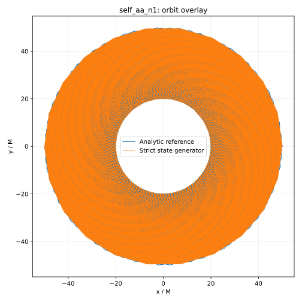

**図2.** $aa$、$n=1$ の軌道。独立解析基準（実線）と strict generator の出力（破線）。strict generator の出力は、全 1,456,532 行から 182 macro steps ごとに取り出した点を結んで描いている。$P=50$ から $P=20$ へ向かう inspiral 型の周期運動である。


**図3.** $aa$、$n=3$ の軌道。strict generator の出力は、全 15,266,915 行から 1908 macro steps ごとに取り出した点を結んで描いている。取り出す間隔が約0.48周にあたるため、点を結ぶ線が軌道の内側を横切り、図は円板状に塗りつぶされて見える。

多数周回する軌道は、$x=P\cos\phi$、$y=P\sin\phi$ の表示では線が密になり、内向きのスパイラル構造を判別しにくい。そこで、最初の10周を、半径軸を対数にした極座標で表示した。用いたのは strict generator が保存した $P$ と読み出し座標 $x,y$ であり、軌道の再計算はしていない。角度は $\operatorname{atan2}(y,x)$ を連続につないだもの、半径は $P$ である。半径軸の範囲は、10周の間に通過した範囲に合わせている。この表示は可視化専用であり、状態更新や readout dynamics には使用していない。

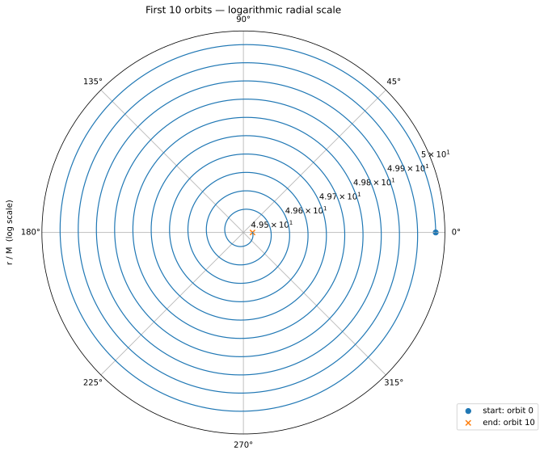

**図4.** $aa$、$n=1$ の最初の10周。半径軸は対数。$P$ は $50$ から $49.5026252158739$ へ縮小する。

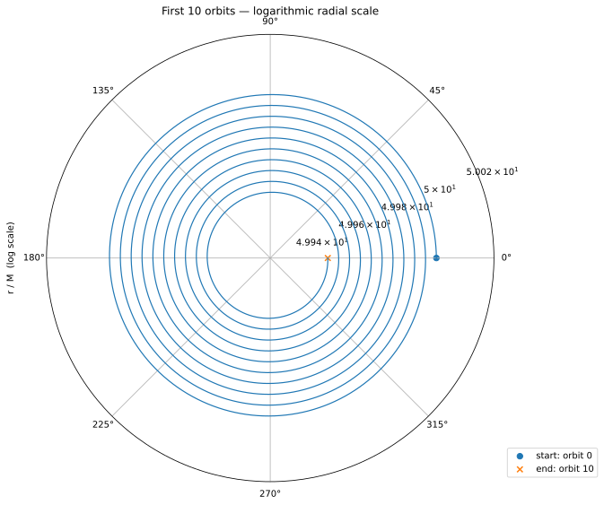

**図5.** $aa$、$n=3$ の最初の10周。半径軸は対数。$P$ は $50$ から $49.9528683833194$ へ縮小する。

## 7.3 半径縮小

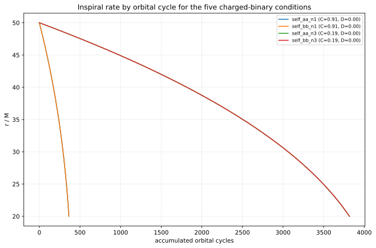

**図6.** 累積周回数に対する半径。独立解析基準の曲線である。$n=1$ は約364周、$n=3$ は約3817周で $P=20$ に達する。$aa$ と $bb$ の曲線は重なっている。図中の題名にある "five" は図化プログラムの固定文字列である。

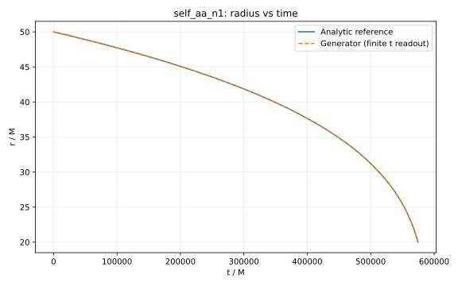

**図7.** $aa$、$n=1$ の半径と時刻。独立解析基準（実線）と strict generator の出力（破線）。

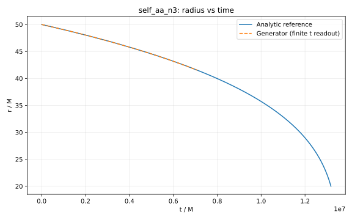

**図8.** $aa$、$n=3$ の半径と時刻。strict generator の線は、時刻の読み出しが有限である範囲だけを描いている。$n=3$ では指数時計 $Q$ が macro step 6,316,005、$P=41.514301346976836$ で有限精度範囲を超えるため、線はそこで終わる。軌道状態 $P,H$ の生成は $P=20$ まで続いている。

## 7.4 放射項

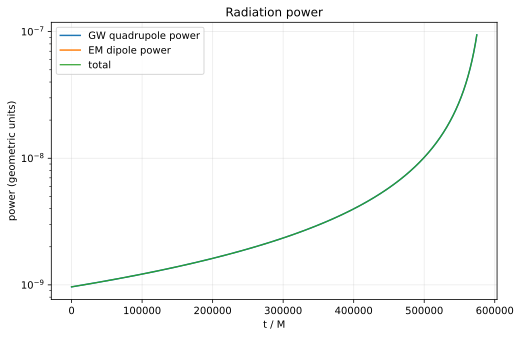

**図9.** $aa$、$n=1$ の放射量。第六思考実験と同じ leading-order の式による、独立解析基準の値である。縦軸は対数。自己相互作用では $D=0$ であるため leading electric-dipole power は全域で 0 であり、対数軸には描かれない。GW quadrupole power の線と total の線は重なっている。

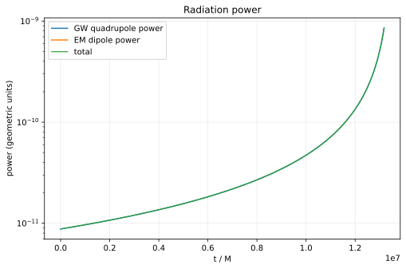

**図10.** $aa$、$n=3$ の放射量。図9と同じ表示である。

## 7.5 生成器との整合確認

strict generator の出力と独立解析基準の差を、全 macro step について計算した。以下の図は、全行から約8000点を取り出して描いている。図の説明に書いた最大値は、全点について計算した値である。

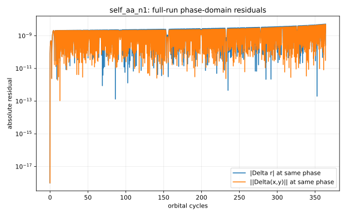

**図11.** $aa$、$n=1$ の、同じ位相での残差。全走行 1,456,531 点での最大値は $|\Delta r|=5.25\times10^{-9}$、$\|\Delta(x,y)\|=4.97\times10^{-9}$ である。

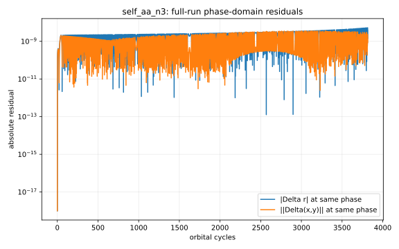

**図12.** $aa$、$n=3$ の、同じ位相での残差。全走行 15,266,914 点での最大値は $|\Delta r|=5.26\times10^{-9}$、$\|\Delta(x,y)\|=3.58\times10^{-9}$ である。

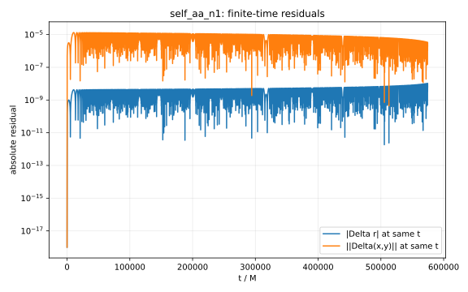

**図13.** $aa$、$n=1$ の、同じ時刻での残差。1,456,531 点での最大値は $|\Delta r|=1.05\times10^{-8}$、$\|\Delta(x,y)\|=1.34\times10^{-5}$ である。

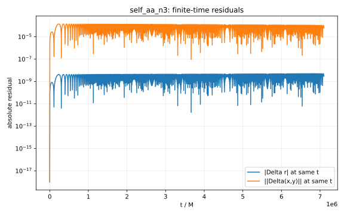

**図14.** $aa$、$n=3$ の、同じ時刻での残差。時刻の読み出しが有限である 6,316,005 点での最大値は $|\Delta r|=5.07\times10^{-9}$、$\|\Delta(x,y)\|=1.41\times10^{-4}$ である。

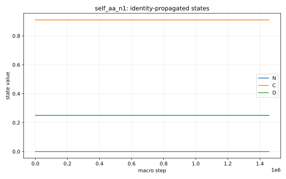

**図15.** $aa$、$n=1$ の $N,C,D$。全走行で $N=0.25$、$C=0.91$、$D=0$ のまま保持される。

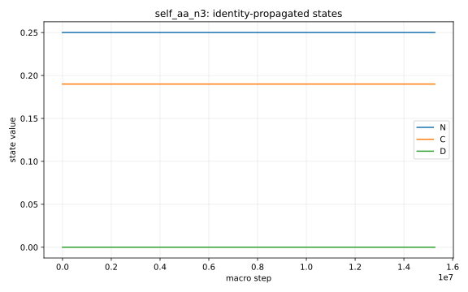

**図16.** $aa$、$n=3$ の $N,C,D$。全走行で $N=0.25$、$C=0.19$、$D=0$ のまま保持される。

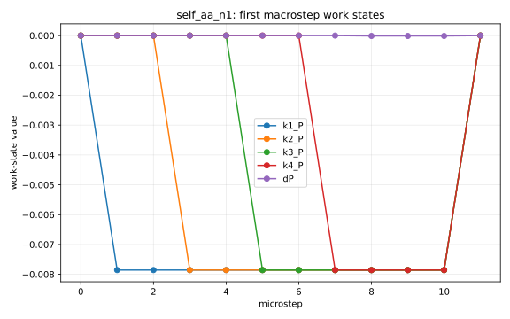

**図17.** $aa$、$n=1$ の最初の macrostep における work state（$k_1,k_2,k_3,k_4$ の $P$ 成分と $\Delta P$）の推移。

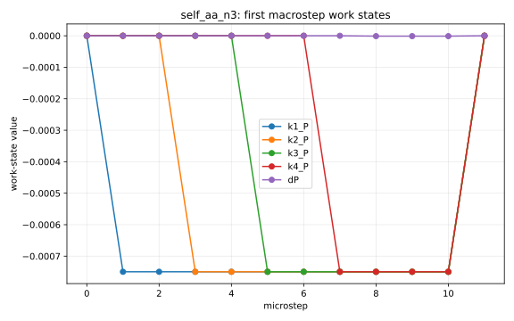

**図18.** $aa$、$n=3$ の最初の macrostep における work state の推移。

---

# 8. 解釈

## 8.1 一体でも「軌道に相当する量」を状態から読み出せる

今回の最小実験で得られた第一の結果は、$ab$ という異なる二状態の関係を使わなくても、

$$
aa
$$

または

$$
bb
$$

という自己関係を第六思考実験と同じ写像へ入れることで、周期位相、半径状態、軌道縮小に相当する量が生成されたことである。

ただし、これを通常の空間内で「一個の粒子が自分の周囲を公転している」と解釈する必要はない。本稿で確認したのは、**自己関係状態から軌道型 readout が生成可能である**という操作的事実だけである。

## 8.2 GW は残り、leading EM dipole は消える

自己関係では

$$
D=(\lambda-\lambda)^2=0
$$

なので、EM dipole 項が消えることは初期化時点で決まっている。

一方、

$$
C=1-\lambda^2>0
$$

なら GW quadrupole 項は残る。

したがって今回の独立自己相互作用は

$$
\boxed{
\mathrm{GW}\neq0,\qquad \mathrm{EM}_{\rm dipole}=0
}
$$

という非対称な放射構造を持つ。

これは次段階の $aa,ab,bb$ 同時系に対して重要な基準になる。単純な独立和だけを考えるなら、$aa$ と $bb$ は EM dipole 振幅を持たないため、$ab$ の EM dipole を自己項だけで相殺することはできない。もし同時結合系で完全な EM 相殺が現れるなら、それは独立自己項の単純和ではなく、交差項または結合によって新たに生じた成分を必要とする。

この点は本稿では計算せず、次段階の判定基準としてのみ記録する。

## 8.3 スピンとの接続可能性と限界

一体の自己関係から周期運動が読み出せることは、内部角運動量やスピンとの接続可能性を想起させる。しかし今回の自己相互作用系では、初期位相や連続状態量に対して軌道型 readout は連続的である。

一方、実在するスピン測定値は離散的である。

したがって本稿の結果だけから

$$
\text{self orbit}=\text{spin}
$$

とは言えない。

将来、$aa,ab,bb$ を同時に閉じた系として相互作用させたとき、位相整合条件が許容状態を離散化するなら、初めてスピン量子化との接続を検討できる。本稿ではこの可能性を仮説として残すだけとする。

## 8.4 $n=4$ の定義域外は修正しない

$n=4$ で

$$
C=-0.44
$$

となることは、現在の準円実数写像が自己相互作用の全離散電荷条件を覆わないことを示す。

ここで新しい規則を追加して $n=4$ を走らせれば、本稿の検証対象が変わってしまう。そのため、本稿では

$$
\boxed{C\le0\text{ は現在の実数準円モデルの定義域外}}
$$

という境界だけを記録する。

---

# 9. 先行研究との関係

自己相互作用という語は既存理論にも存在するが、本稿とは意味が異なる。

Teitelboim [3] の retarded self-interaction は、点電荷自身の retarded electromagnetic field を含めて Lorentz--Dirac radiation reaction を理解するものである。Wheeler と Feynman [4,5] は、独立な場を基本変数として扱う通常の表現とは異なる direct interparticle action と absorber による radiation reaction を検討した。Kerner [6] は Wheeler--Feynman 型電磁相互作用と Einstein--Infeld--Hoffmann 型重力相互作用を同一 Hamiltonian 構成へ組み込む方法を論じた。

これらは、本稿の問題意識と「自己作用」「直接相互作用」「重力と電磁気を同一力学内で扱う」という点で接点を持つ。しかし本稿は self-field の発散処理、advanced/retarded field の選択、absorber 条件を導入しない。

本稿の特徴は、前段階で $ab$ に用いた閉じた状態写像を固定したまま、無名性の観点から

$$
ab\quad\longrightarrow\quad aa,bb
$$

へ入力関係だけを変更し、その結果を観察する点にある。

したがって本稿は既存 self-force 理論の代替導出ではなく、**関係状態の選択に隠れたラベル情報がないかを監査する思考実験**として位置づける。

---

# 10. 本稿が示したこと／示していないこと

## 10.1 示したこと

今回の限定モデルでは、次を数値的に確認した。

- 第六思考実験と同じ `transition(z)` を自己関係へそのまま適用できる。
- $aa$ と $bb$ は今回の対称条件では同一の状態発展を生成する。
- $n=1,3$ の $C>0$ 領域では、自己関係だけから周期的な軌道相当量と軌道縮小を読み出せる。
- GW quadrupole 散逸は非零である。
- leading EM electric-dipole radiation は $D=0$ により厳密に 0 である。
- $n=4$ は $C<0$ となり、現在の実数準円写像の定義域外である。
- 新しい力学規則を追加しなくても以上の結果が得られる。

## 10.2 示していないこと

本稿は次を主張しない。

- $aa,bb$ が実在粒子内部の文字通りの軌道であること。
- 自己相互作用軌道がスピンそのものであること。
- スピン量子化を導出したこと。
- 自己相互作用一般で電磁放射が存在しないこと。
- $aa,ab,bb$ の放射が実際に完全相殺すること。
- 交差項の形を導出したこと。
- 標準的 electromagnetic self-force または gravitational self-force を再現したこと。
- 第六思考実験の leading-order 準円近似を越えた一般性。

---

# 11. 次段階

今回の結果により、独立三関係を考えた場合の出発点は

$$
\begin{array}{c|cc}
 & \mathrm{GW} & \mathrm{EM\ dipole}\\
\hline
aa & \neq0 & 0\\
ab & \neq0 & \neq0\\
bb & \neq0 & 0
\end{array}
$$

と整理できる。

次段階では、これらを独立系のまま足し合わせるのではなく、

$$
X=(aa,ab,bb)^T
$$

を一つの同時更新系として扱う必要がある。

そこで初めて、

$$
\text{位相ロック},
\qquad
\text{交差項},
\qquad
\text{GW/EM 放射振幅の干渉}
$$

を検討する。

本稿ではその相互作用則を仮定しない。今回確定した独立自己相互作用の結果を、次段階の基準状態として固定する。

---

# 12. 再現性

数値実験、図化、比較の一式は次のフォルダに保存した。

```text
第七思考実験_自己相互作用_aa_bb_20260927/
  03_第六プログラム直接インポート再実行_v1/
```

第六思考実験と第六思考実験補遺のプログラムは、書き換えずに `paper6_programs/` へコピーし、そこから読み込んで実行した。コピー元とコピー先の SHA-256 は `paper6_programs/COPY_MANIFEST.json` に記録した。

コピーしたプログラム:

```text
paper6_programs/run_strict_charged8_5cases.py
paper6_programs/paper6_init_G_q0_c1.py
paper6_programs/solve_charged_binary_analytic_reference_v1.py
paper6_programs/plot_charged_binary_analytic_reference_v1.py
paper6_programs/postprocess_strict_5case.py
paper6_programs/postprocess_strict_charged8_5cases.py
paper6_programs/generate_paper6_orbit_condition_comparison_v1.py
paper6_programs/plot_first_10_orbits_log_radial_scale.py
```

ラッパー（実行条件、保存先、初期状態の受け渡しを与える）と、比較のプログラム:

```text
step00_copy_programs.py
wrapper_common.py
wrap10_run_generator.py
wrap20_analytic_reference.py
wrap30_postprocess_figures.py
wrap40_orbit_condition_comparison.py
wrap50_log_radial_orbits.py
wrap60_analytic_reference_figures.py
compare_with_previous.py
inspect_Q_difference.py
step90_write_sha256sums.py
run_all.sh
```

出力:

```text
cases/<ケース名>/               全 macro step の行（HDF5）、最終状態、要約、解析基準との比較、図
analytic_reference/<ケース名>/  独立解析基準とその図
orbit_condition_comparison/     条件比較の図
comparison_results/             第六思考実験の保存データ、および書き換える前のプログラムの出力との比較
CASE_TABLE.json                 実行条件と、補遺の初期化が返した値
SHA256SUMS.txt
README_ja.md
```

ケース名は `self_aa_n1`、`self_bb_n1`、`self_aa_n3`、`self_bb_n3` である。一式は `run_all.sh` で再実行できる。

図化プログラムは SVG を生成する。条件比較の重ね描きの図（図1）を除き、同じデータから PNG も生成する。論文本文では可逆なベクトル形式である SVG を参照する。

`01_独立自己相互作用数値実験_v1/` と `02_論文図_自己相互作用_v1/` は、書き換える前のプログラムによる出力である。本稿の結果と図には用いていない。

---

# 13. 結論

第六思考実験では、二体 $a,b$ の関係状態 $ab$ から荷電準円軌道を生成した。本稿では、その $ab$ だけを特別に選ぶことが無名性に対する隠れた仮定ではないかという疑問から、自己関係

$$
aa,\qquad bb
$$

を導入した。

新しい相互作用則は作らず、第六思考実験と同一の

$$
z_{k+1}=T(z_k)
$$

へ自己関係の初期状態を入力した。

第六思考実験補遺で確定した

$$
G=q_0=c=1,
\qquad
\frac{M}{q_0}=\frac{20}{3}
$$

を用いると、自己関係は

$$
C_{\rm self}=1-\lambda^2,
\qquad
D_{\rm self}=0
$$

として初期化できる。

$n=1$ と $n=3$ の $C>0$ 条件では、自己関係だけから周期的な軌道相当量と軌道縮小が生成された。放射 readout は

$$
\boxed{
P_{\rm GW}>0,
\qquad
P_{\rm EM,dipole}=0
}
$$

となった。

一方、$n=4$ では

$$
C=-0.44
$$

となり、現在の実数準円写像の定義域外となった。これを救済する追加仮定は導入しなかった。

したがって本稿の限定的な結論は、

$$
\boxed{
\text{$ab$ に用いた同一状態写像は、$aa,bb$ 自己関係にも適用可能であり、}
}
$$

$$
\boxed{
\text{$C>0$ の範囲で軌道型状態発展と GW 散逸を生成する。}
}
$$

ということである。

この自己関係が物理的に何を意味するか、また $aa,ab,bb$ を同時相互作用させたときに位相の離散化や放射相殺が生じるかは、本稿では決めない。今回の独立自己相互作用結果を固定したうえで、次の思考実験で検証する。

---

# 参考文献

## 本研究系列

[1] 木原範昭, **第六思考実験：二種類の長距離相互作用を一つの閉じた状態写像へ内部化できるか ― 荷電準円二体系の重力・Coulomb・GW四重極・EM双極放射を8永続状態で再構成し、5条件で同一 transition の移植可能性を検証する ―**, v1.1 (2026-09-26). Concept DOI: 10.5281/zenodo.22974631; Version DOI: 10.5281/zenodo.22974632.

[2] 木原範昭, **第六思考実験 補遺：規格化基準を質量から電荷単位へ変更しても状態生成は変わるか ― $G=M=c=1$ から $G=q_0=c=1$ への限定的再規格化と、保存済み5条件の初期状態完全一致検証 ―**, v1.0 (2026-09-27). Concept DOI: 10.5281/zenodo.22985299; Version DOI: 10.5281/zenodo.22985300.

## 外部文献

[3] C. Teitelboim, “Radiation Reaction as a Retarded Self-Interaction,” *Physical Review D* **4**, 345 (1971). DOI: 10.1103/PhysRevD.4.345.

[4] J. A. Wheeler and R. P. Feynman, “Interaction with the Absorber as the Mechanism of Radiation,” *Reviews of Modern Physics* **17**, 157 (1945).

[5] J. A. Wheeler and R. P. Feynman, “Classical Electrodynamics in Terms of Direct Interparticle Action,” *Reviews of Modern Physics* **21**, 425 (1949). DOI: 10.1103/RevModPhys.21.425.

[6] E. H. Kerner, “Electromagnetism and Gravitation: an Action-at-a-Distance Confluence,” *Physical Review* **125**, 2184 (1962). DOI: 10.1103/PhysRev.125.2184.

---

## 再現性注記

本稿の数値実験は、第六思考実験の状態生成器と第六思考実験補遺の初期化プログラムを書き換えずに読み込み、自己関係の実行条件、保存先、および補遺が作った初期状態の受け渡しだけをラッパーで与えて実施した。数値実験コード、初期化コード、全 macro step の raw data、第六思考実験の保存データとの比較結果、図化コード、SVG、SHA256 を同一研究フォルダ内に保存した。$n=4$ の定義域外条件については、新しい規則を導入せず、実行していない。
