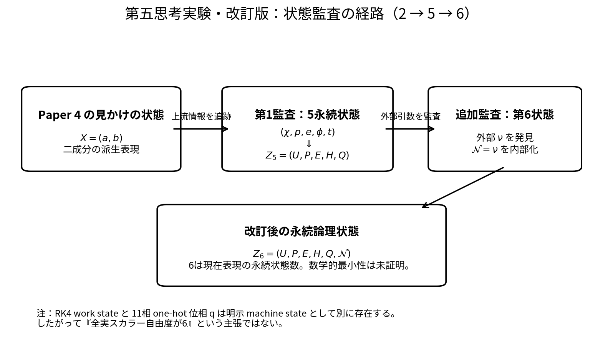
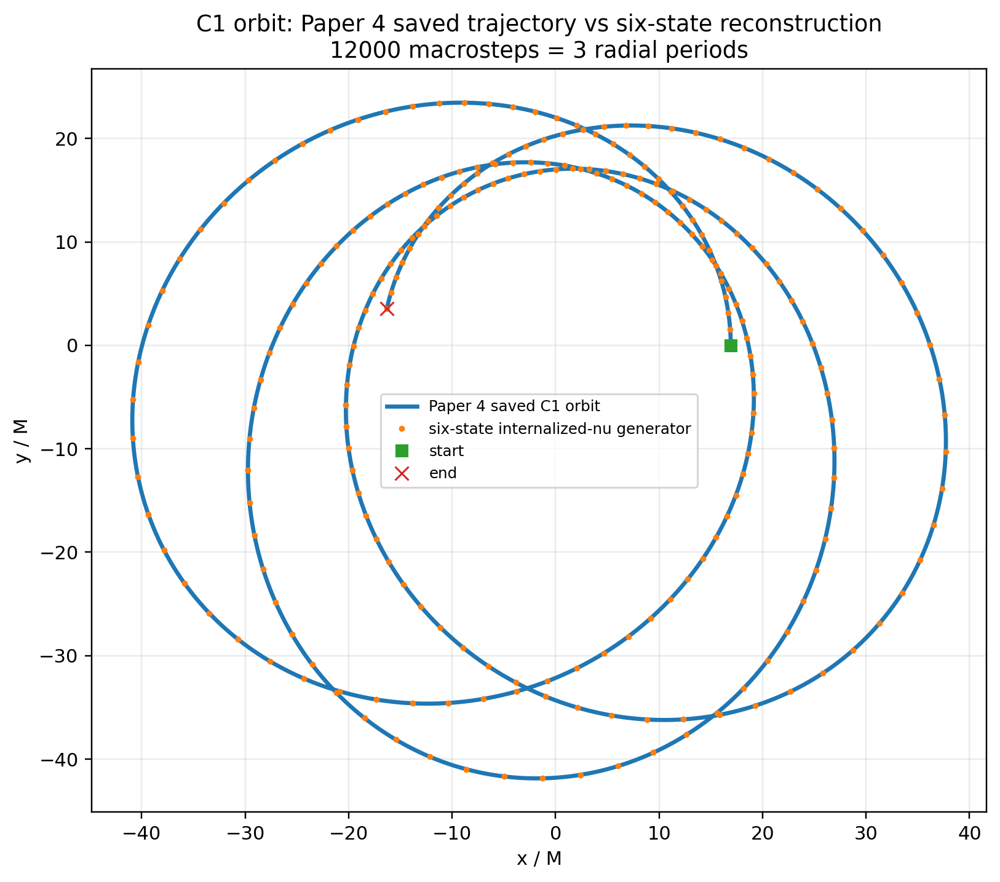
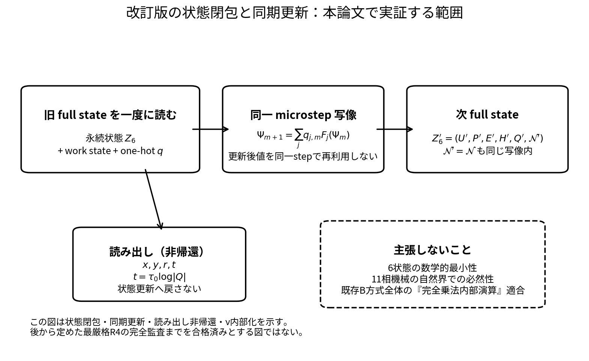
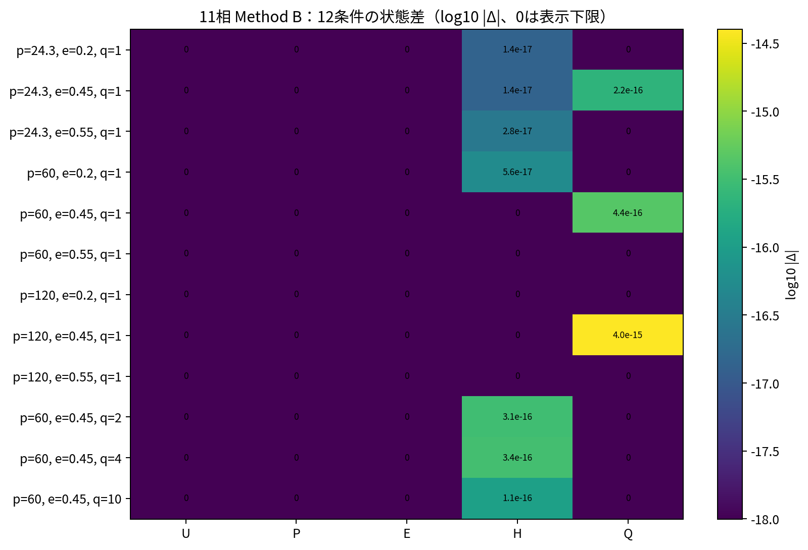
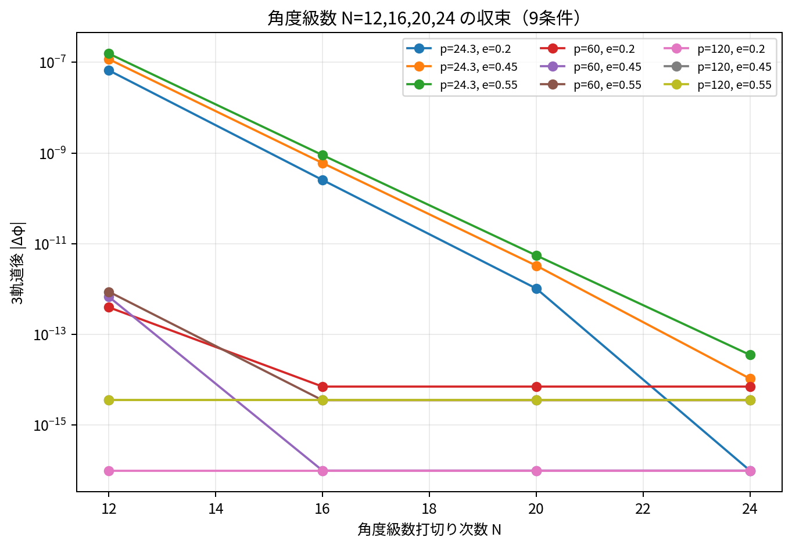
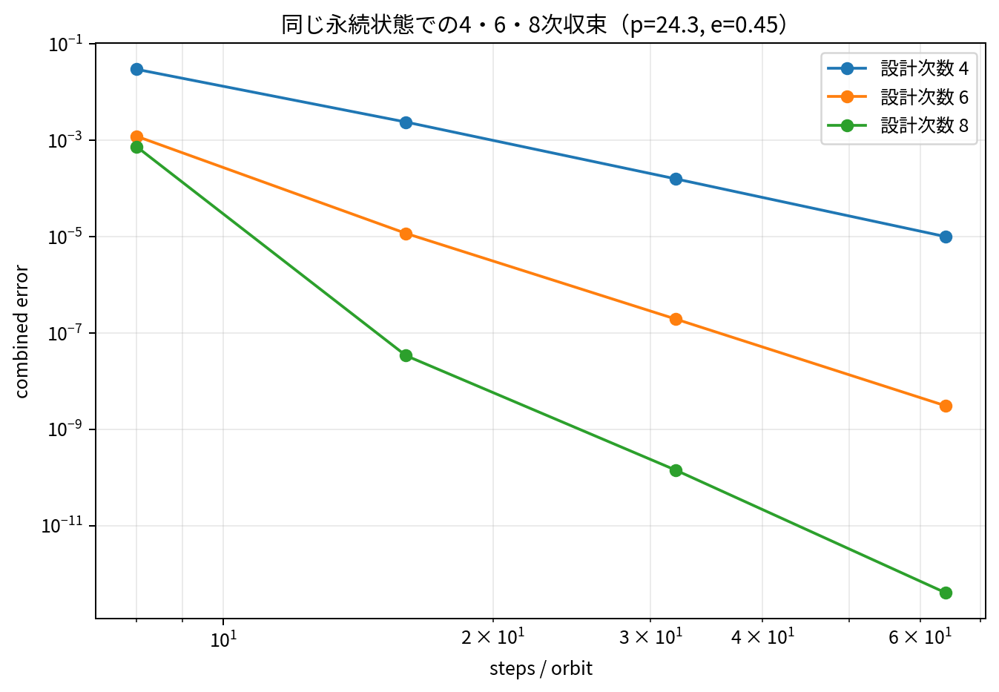
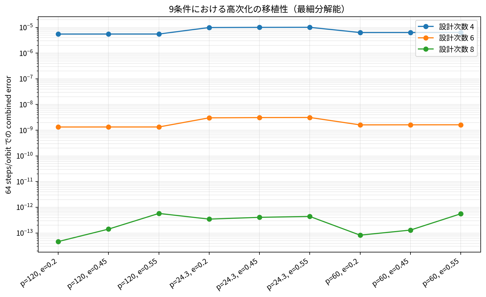

# The Fifth Thought Experiment: Was There No Hidden State?
## - A Self-Audit of the Two-State Orbit Generation of the Fourth Thought Experiment, Tracking the State Closure from Five States to the Sixth Persistent State $\mathcal N=\nu$ -

**Author:** Noriaki Kihara  
**ORCID:** 0009-0004-6753-4020  
**Version DOI:** 10.5281/zenodo.22973087  
**Concept DOI:** 10.5281/zenodo.22973086  
**Version:** v2.1  
**Date:** 2026-09-26  

---

## Abstract

In the fourth thought experiment [4], a state-dependent action $S_n$ was applied sequentially to the two-component internal state

$$
X_n=\begin{pmatrix}a_n\\b_n\end{pmatrix}
$$

and, from the quadratic readout

$$
\Phi(X_n)=
\begin{pmatrix}
a_n^2-b_n^2\\
2a_nb_n
\end{pmatrix}
$$

a family of gravitational orbits including the periastron advance and the decay by the leading 2.5PN radiation reaction was reconstructed. When that implementation is audited as a flow of information, however, the processing phase $\chi$, the semi-latus rectum $p$, the eccentricity $e$, the azimuth $\phi$ and the clock $t$ are held and updated outside $X_n$, and $X_n$ is a derived representation built from them. The reading that "the orbit was generated by two states alone" is therefore not exact.

In the first stage of the audit, the five persistent logical states that survive across macro steps,

$$
(\chi,p,e,\phi,t)
$$

were made explicit and re-encoded as

$$
Z_5=(U,P,E,H,Q)
=(e^{i\chi},p,e,e^{i\phi},e^{t/\tau_0}).
$$

The RK4 sequential processing of Paper 4 could be rearranged into a synchronous state machine in which the evaluation points, $k_1,\ldots,k_4$, the midpoints, the composite increments and an 11-phase one-hot phase are explicit machine/work states. In long comparisons over 12 conditions, the difference from the reference update was at most $3.38\times10^{-16}$ in $H$ and $4.00\times10^{-15}$ in $Q$.

A further audit, however, found that the symmetric mass ratio $\nu$ in the radiation-reaction kernel

$$
C_{\rm RR}=\frac85\nu r^{-3}
$$

remained as an external argument outside the state. The system after the first audit was therefore in fact

$$
Z_5'=F(Z_5;\nu)
$$

and was not fully state-closed. In this paper it is internalized as the sixth persistent state,

$$
\boxed{
Z_6=(U,P,E,H,Q,\mathcal N),\qquad \mathcal N=\nu
}
$$

and held in all 11 phases as the identity row

$$
\mathcal N'=
\sum_{j=0}^{10}q_j(1\cdot\mathcal N)
=\mathcal N
$$

inside the same synchronous map. In the control experiments in which the external `nu` argument was removed from the new transition function, over 12 conditions $\times$ 4000 macrosteps the first five components of the old 5-state and the new 6-state systems, and the stored values of $r,x,y,t$, were bitwise identical, and the bitwise mismatch of $\mathcal N$ was also 0. Over 3 representative conditions $\times$ 12000 macrosteps the maximum difference of the compared quantities was also 0, and there were 0 violations of the microstep identity of $\mathcal N$. The error profile against the stored Paper 4 C1 data also coincided exactly with the old system.

Furthermore, raising the angular series to $N=12,16,20,24$ reduced the azimuth error after three orbits for the most severe case $p=24.3,e=0.55$ to $1.56\times10^{-7}$, $9.03\times10^{-10}$, $5.54\times10^{-12}$ and $3.55\times10^{-14}$. For the time integration too, raising the order to 4, 6 and 8 was verified with the same physical state kept. Therefore, at least in these experiments, correcting the state closure and raising the numerical precision are separate operations.

This paper does not claim that six states are mathematically minimal, that the 11-phase machine is necessary in nature, that the whole existing B scheme satisfies the strictest "fully multiplicative internal operation" condition defined afterwards, or that general relativity has been derived from this state system. What is shown is that a self-audit of the fourth thought experiment corrects the state closure from an apparent two states to five persistent states and further to six persistent states including the external $\nu$, and that an orbit generation comparable with the known gravity model can be reconstructed as explicit states, synchronous updates and a non-feedback readout.

**Keywords:** hidden state, state closure, synchronous update, multiplicative state, state-dependent action, symmetric mass ratio, post-Newtonian approximation, discrete dynamics, numerical audit, thought experiment

---
# 0. Position of this paper

This paper is the fifth thought experiment under the research project design [0].

The first thought experiment [1] examined, without first placing a background spacetime or a metric, the minimal construction that distinguishes inertial, uniformly accelerated and rotating motion, from two degrees of freedom of undetermined meaning and the conservation of an area readout.

The second thought experiment [2] applied a fixed action $S$ repeatedly to those two values and constructed inverse-square motion from a product readout and an area clock.

The third thought experiment [3] reversed the direction and examined whether the mass ratio, the relative distance and the relative time can be read out from known Newtonian / PN two-body orbits.

The fourth thought experiment [4], in order to bring the orbit generation computed externally in the third thought experiment back to an internal interaction, constructed the state-dependent action

$$
X_{n+1}=S_nX_n,
\qquad
S_n=\mathcal S(\mathcal R_n),
\qquad
\det S_n=1.
$$

The purpose of the fifth thought experiment is not to extend that result further. The question is

$$
\boxed{
\text{Was the fourth thought experiment really closed by the states it made explicit alone?}
}
$$

In this paper the labels are used with the following meaning.

| Label | Meaning |
|---|---|
| [Principle] | Computational principle maintained in this paper for the self-audit |
| [Design assumption] | Assumption made for the present representation and implementation; may be removed later |
| [Construction] | Procedure that constructs an action from known formulas or explicit states |
| [Numerical] | Result confirmed by numerical comparison with programs |
| [Cross-check] | Comparison with known physics or existing mathematics; not a derivation from first principles |
| [Unproven] | Matter that cannot be decided by the present experiments |

The most important policy of this paper is **not to presuppose the success of the fourth thought experiment**. If a hidden state is found, it is not conveniently ignored but moved into the state. Indeed, in this paper, after making the five persistent states explicit in the first audit, the external $\nu$ was found in addition and internalized as the sixth persistent state. This process of correction itself is recorded as a result.

# 1. Motivation: was the orbit really generated by two states alone?

The surface state of the fourth thought experiment is

$$
X_n=(a_n,b_n)^{\mathsf T}
$$

and the orbit was read out from

$$
Y_n=\Phi(X_n).
$$

In the actual program, however, at each step

$$
\chi_n,
\quad p_n,
\quad e_n,
\quad \phi_n,
\quad t_n
$$

were held separately, from which

$$
r_n=\frac{p_n}{1+e_n\cos\chi_n},
\qquad
\theta_n=\frac{\phi_n}{2}
$$

were obtained, and then $S_n$ and $X_n$ were constructed [4]. The actual flow of information was therefore

$$
(\chi,p,e,\phi,t)
\longrightarrow
(r,\theta)
\longrightarrow
S_n
\longrightarrow
X
\longrightarrow
Y
$$

and $X$ was a derived representation obtained from the upstream states.

The first audit made this upstream information explicit as five persistent states. But when the state dependence was tracked further into the radiation-reaction kernel, the symmetric mass ratio $\nu$ was being passed from outside the state. The path of the state audit is therefore

$$
\boxed{
X=(a,b)
\;\longrightarrow\;
Z_5=(U,P,E,H,Q)
\;\longrightarrow\;
Z_6=(U,P,E,H,Q,\mathcal N)
}
$$



**Figure 1.** Tracing the apparent two states of Paper 4 upstream reveals five persistent states, and the additional audit found the external $\nu$. After the revision, $\mathcal N=\nu$ is included as the sixth persistent state in the same state map. The RK4 work states and the 11-phase one-hot phase $q$ are separate machine/work states; this is not a claim that "the total number of real scalar degrees of freedom is 6".

So as not to lose sight of the object of the audit itself, Figure 2 shows the orbit of the representative condition C1 that Paper 4 regenerated from the sequential interaction. This paper is not a paper deriving this orbit from a new law of gravity; it is a paper that self-audits which persistent information this existing orbit generation depended on. In Figure 2, the stored Paper 4 C1 orbit of 12001 points is overlaid with the orbit of 12000 macrosteps (3 radial periods) regenerated independently by the generator in which the external $\nu$ is internalized as the sixth state $\mathcal N$. During the generation, the stored C1 data are not fed back into the state update.



**Figure 2.** The stored C1 orbit of Paper 4 and the orbit regenerated by $Z_6=(U,P,E,H,Q,\mathcal N)$. The 12000 macrosteps correspond to 3 radial periods and include the periastron advance and the orbital decay by the radiation reaction. The two curves overlap at the drawing resolution. The maximum absolute differences against the stored C1 are $|\Delta x|=3.85\times10^{-12}$, $|\Delta y|=5.11\times10^{-12}$, $|\Delta r|=6.89\times10^{-13}$ and $|\Delta t|=1.94\times10^{-10}$. This is not an independent verification against a new physical model; it visualizes that the orbit generation of Paper 4 can be kept as the same output after internalizing the sixth state.

The question of this paper is divided into four.

$$
\boxed{
\text{(1) When all the information that determines the next state is counted as state, what remains?}
}
$$

$$
\boxed{
\text{(2) Does any case-dependent physical parameter flow in from outside the state?}
}
$$

$$
\boxed{
\text{(3) Can the intermediate update values and the processing stages be written as a synchronous map without hiding them?}
}
$$

$$
\boxed{
\text{(4) Can raising the approximation order be separated from adding a physical state?}
}
$$

# 2. Purpose and scope of the claims

The purpose of this paper is not to derive a new exact solution of general relativity. Nor does it claim that the state transition rule constructed here is a fundamental law of nature.

The purpose is to audit the external clock, the past states, the processing step number, the intermediate update values, the case-dependent parameters and the implicit registers that ordinary numerical computation tends to use implicitly, and to examine how far the computation can be closed into the form

$$
\boxed{
\text{present explicit state}
\rightarrow
\text{interaction}
\rightarrow
\text{next explicit state}
\rightarrow
\text{non-feedback readout}
}
$$

### What was confirmed in this paper

1. The implementation was not closed by the two states $X=(a,b)$ of Paper 4 alone.
2. In the first audit, making the five quantities $\chi,p,e,\phi,t$ explicit as persistent states allowed the orbit computation of Paper 4 to be reconstructed.
3. However, $\nu$ remained as an external argument in the radiation-reaction kernel, and the five-state system was not completely closed.
4. Internalizing $\mathcal N=\nu$ as the sixth persistent state and implementing $\mathcal N'=\mathcal N$ as an identity row of the same one-hot sum-of-products map removed the external `nu` argument without changing the old five states, the orbit or the clock bitwise.
5. The RK4 sequential computation of Paper 4 could be reconstructed as an 11-phase synchronous state machine with explicit processing stages and work registers.
6. Raising the order of the angular series and of the numerical integration is independent of adding the sixth state, and no new persistent physical state had to be introduced to improve the precision.

### What is not proved in this paper

1. That six persistent logical states are mathematically minimal.
2. That the 11-phase machine state is necessary in nature.
3. That a single fixed action $S$ is impossible in principle and a sequence of actions is always necessary.
4. That the whole existing B scheme satisfies the strictest "fully multiplicative internal operation" condition defined afterwards.
5. That the limit of raising the approximation order to infinity coincides with the exact solution of general relativity.
6. That the interaction rule of this paper is a fundamental law of nature.

# 3. Rules of the self-audit

## 3.1 Make the next state from the present state alone

Let the set of states be

$$
\Psi_n=(\psi_{1,n},\ldots,\psi_{N,n}).
$$

In one interaction, the present state is read once and the next state is written once.

$$
\boxed{
\psi_{i,n+1}=F_i(\Psi_n)
}
$$

must hold.

Using a $\psi_{j,n+1}$ computed earlier within the same single interaction for the computation of another component is forbidden.

---

## 3.2 Distinguish incremental assignment from sum of products

In a program,

```text
psi += delta
```

can be read as a sequential update that implicitly holds the old value and the new value, so it is not adopted as a fundamental interaction.

On the other hand, a **sum of products** computed at once from the present state alone,

$$
\psi_i'
=
\sum_{\alpha}
c_{i\alpha}
\prod_j \psi_j^{m_{i\alpha j}},
$$

and written at once, is permitted.

For example,

$$
P'=P+D_p
$$

does not violate the rule of this paper as long as it is computed at once, not as a sequential assignment but as the sum of products of two present states,

$$
P'=1\cdot P+1\cdot D_p.
$$

---

## 3.3 Do not refer to the number of operations from outside

The action must not be selected by an external loop counter.

If the processing stages have to be distinguished, a one-hot phase state

$$
q_n=(q_{0,n},\ldots,q_{m-1,n})
$$

is placed inside the system and updated by the cyclic permutation

$$
\boxed{
q_{n+1}=C_m q_n,
\qquad C_m^m=I.
}
$$

The selection of the action is also written, in the formulas, as the sum of products

$$
\boxed{
\Psi_{n+1}
=
\sum_{j=0}^{m-1} q_{j,n}F_j(\Psi_n).
}
$$

In the actual audit code, since $q$ is exactly one-hot, `argmax(q)` and a branch are used as an acceleration, but this is treated not as physical external information but as an implementation of the one-hot selection above. Therefore, **the fundamental definition in the formulas is the sum-of-products selection by $q$**, and `argmax` itself is not regarded as a fundamental interaction.

---

## 3.4 The readout is not written back into the state

A map for observation,

$$
O=\mathcal O(\Psi),
$$

is permitted.

However, the procedure of returning to additive coordinates, in particular using

$$
\log,
$$

performing the conventional additive computation and exponentiating again,

$$
\Psi
\rightarrow
\log\Psi
\rightarrow
\text{additive update}
\rightarrow
\exp
\rightarrow
\Psi',
$$

is not accepted as a fundamental model.

The readout is one-directional:

$$
\boxed{
\text{state}\rightarrow\text{observation}.
}
$$

---

## 3.5 Constants

A sum of products with fixed constants is permitted if their origin is clear.

For example, the RK4 coefficients

$$
\frac16(1,2,2,1)
$$

and the coefficients of the series

$$
c_{m+1}=\frac{2m+1}{m+1}c_m
$$

have a clear derivation.

On the other hand, free fitting coefficients used only to approach a known orbit are not used.



**Figure 3.** The scope of the audit after the revision. The old full state is read at once, and the next full state is generated by the same microstep map. The readouts $x,y,r,t$ are not returned to the state update. The identity holding of $\mathcal N$ is also included in the same map. On the other hand, the minimality of the six states, the necessity of the 11-phase machine in nature, and the full multiplicativity of the whole existing B scheme are not claimed.

---

# 4. Position among existing theories

This paper does not claim the individual computational concepts themselves as new mathematics.

That in an effective description projected onto a small number of variables the influence of the eliminated degrees of freedom can appear as a memory term is represented by the projection formalism of Zwanzig [5]. This paper does not use that result to derive the six states; it refers to it only as the background for **auditing where the missing information resides when the system does not close with the present state alone**.

For representing the evolution as a product of several actions, the product formula of Trotter [6] gives a classical precedent. The 11-phase state machine of this paper is not the Trotter decomposition itself, but treating several actions as an explicit sequence is itself within existing mathematics.

For numerical integration, the systematic construction of high-order Runge--Kutta processes has long been studied by Butcher [7]. The purpose of examining the raising of the order to 4, 6 and 8 in this paper is not to propose a new integration method but **to distinguish the depth of the numerical approximation from the number of persistent physical states**.

On the gravity side, the Darwin parameterization [8] is used for the angular progression of bound Schwarzschild orbits, and the osculating-orbit formalism [9] is referred to as the closely related standard background for the construction of orbital elements that evolve in time. The general background of the post-Newtonian approximation and the radiation reaction is placed in the review by Blanchet [10], and the lineage of the radiation-reaction expressions including the leading 2.5PN radiation-reaction term in Blanchet, Faye and Trestini [11].

What is specific to this paper is therefore not a new invention of these existing elements. It is to have audited, for the implementation of the fourth thought experiment, the state leakage, the intermediate update values, the processing phases and the feedback of the readout at the same time, and to have corrected the state closure including the external $\nu$ found on the way.

# 5. State audit of Paper 4

## 5.1 The surface state $X=(a,b)$ was not the fundamental state

Paper 4 displayed

$$
X_{n+1}=S_nX_n
$$

as the main state transition [4].

In the implementation, however,

$$
(\chi_n,p_n,e_n,\phi_n,t_n)
$$

were updated first, and from

$$
r_n=\frac{p_n}{1+e_n\cos\chi_n},
\qquad
\theta_n=\frac{\phi_n}{2}
$$

the state

$$
X_n
=
\sqrt{r_n}
\begin{pmatrix}
\cos\theta_n\\
\sin\theta_n
\end{pmatrix}
$$

was constructed. $X_n$ was therefore a compressed derived representation of the upstream states, and by itself cannot determine the next state.

---

## 5.2 First audit: five persistent states

In the first audit, the states needed across macro steps in the present representation were made explicit as

$$
(\chi,p,e,\phi,t):
$$

- $\chi$: the processing phase,
- $p$: the semi-latus rectum,
- $e$: the eccentricity,
- $\phi$: the orbital azimuth,
- $t$: the accumulated coordinate of the clock readout.

These were re-encoded as

$$
Z_5=(U,P,E,H,Q)
=(e^{i\chi},p,e,e^{i\phi},e^{t/\tau_0}).
$$

Comparing the five-state synchronous map with the original computation of Paper 4 over 12 conditions, the existing computation could be reproduced including the orbit readout. At this stage it was once judged that "the system closed with five states".

This conclusion, however, is corrected by the additional audit.

### Table 1. Final summary of the state audit

| Quantity | Role | Classification | Reason of the audit | Audit stage |
|---|---|---|---|---|
| $X=(a,b)$ | The two components displayed in Paper 4 | Derived representation | Constructed from $r,\phi$; does not close the next state by itself | Paper 4 to first audit |
| $U=e^{i\chi}$ | Processing phase | Persistent logical state | Holds the periodic information of $\chi$ | 5-state audit |
| $P=p$ | Orbital element | Persistent logical state | Updated by the radiation reaction | 5-state audit |
| $E=e$ | Orbital element | Persistent logical state | Updated by the radiation reaction | 5-state audit |
| $H=e^{i\phi}$ | Orbital azimuth phase | Persistent logical state | Holds the angular progression multiplicatively | 5-state audit |
| $Q=e^{t/\tau_0}$ | Clock state | Persistent logical state | $t$ is obtained by $\log$ only at readout | 5-state audit |
| $\mathcal N=\nu$ | Symmetric mass ratio | Persistent logical state | External argument in the old implementation; judged a state leakage in the additional audit | Additional $\nu$ audit |
| $q_0,\ldots,q_{10}$ | 11-phase one-hot processing phase | Machine state | Substitute for an external loop counter | 11-phase synchronous audit |
| RK work registers | $k_1,\ldots,k_4$ etc. | Work/machine state | Made explicit so that intermediate update values are not held implicitly | 11-phase synchronous audit |

---

## 5.3 Additional audit: the external $\nu$ was the sixth state

Since the radiation-reaction kernel uses

$$
C_{\rm RR}=\frac85\nu r^{-3},
$$

the implementation after the first audit was in fact

$$
\boxed{Z_5'=F(Z_5;\nu)}.
$$

$\nu$ is physical information given per case of fixed mass ratio, and was supplied from outside the state map. Read strictly as a state closure, therefore, the five-state system is not closed.

Accordingly,

$$
\boxed{
Z_6=(U,P,E,H,Q,\mathcal N),
\qquad
\mathcal N=\nu
}
$$

was taken, and the radiation-reaction kernel was replaced by

$$
C_{\rm RR}=\frac85\mathcal N r^{-3}.
$$

$\mathcal N$ is held as an identity row with coefficient 1 in all 11 phases,

$$
\boxed{
\mathcal N_{m+1}
=
\sum_{j=0}^{10}q_{j,m}(1\cdot\mathcal N_m)
=
\mathcal N_m.
}
$$

This was implemented not as a copy `N_next=N_old` outside the state machine but as the sixth row of the one-hot sum-of-products map.

The old transitions

```text
micro_fast(s, nu)
macro_fast(s, nu)
```

become

```text
micro_fast6(s)
macro_fast6(s)
```

and the new transition functions have no external `nu` argument.

### Control results of the internalization of $\nu$

Over the 48,012 stored rows of 12 conditions $\times$ 4000 macrosteps, for the first five components of the old 5-state and the new 6-state systems,

$$
\boxed{\Delta U=\Delta P=\Delta E=\Delta H=\Delta Q=0},
$$

and for the readouts too,

$$
\boxed{\Delta r=\Delta x=\Delta y=\Delta t=0}.
$$

In the comparison of the stored bit patterns in complex128 / float64 as well, the bitwise mismatch between the old 5 states and the first 5 states of the new system was 0, and the bitwise mismatch between $\mathcal N$ and the initial $\nu_0$ was also 0.

Furthermore, over 3 representative conditions $\times$ 12000 macrosteps,

$$
\boxed{
\max|\Delta(U,P,E,H,Q,r,x,y,t)|=0
}
$$

and there were 0 violations of the microstep identity holding of $\mathcal N$. The error profiles of $p,e,t,x,y$ against the stored Paper 4 C1 CSV were also completely identical between the old 5-state and the new 6-state systems. [Numerical]

What this control experiment shows is that **the physical formulas were not changed and only the place where the information is kept was moved from an external argument to the sixth state**. It is not the result of adding a charged interaction or another physical degree of freedom.

---

## 5.4 The meaning of "six states"

The exact claim after the revision is

$$
\boxed{
\text{In the present representation, there are six persistent logical states held across macro steps.}
}
$$

This does not mean that the real scalar components of the whole state machine number six. The $k_1,\ldots,k_4$, the evaluation points, the midpoints, the composite increments and the 11-phase one-hot phase needed to implement RK4 without hidden sequential registers exist as separate explicit machine/work states.

Also, that six is the mathematical minimum is unproven. Therefore

$$
\boxed{
\text{a self-audit of the present Paper 4 representation required at least six persistent logical states to be made explicit}
}
$$

is the conclusion of this paper.

# 6. Re-encoding into multiplicative states

To the additive coordinates obtained in the first audit,

$$
(\chi,p,e,\phi,t),
$$

the symmetric mass ratio $\nu$ found in the additional audit is added, and the persistent logical states after the revision are taken to be

$$
\boxed{
Z_6=(U,P,E,H,Q,\mathcal N).
}
$$

The definitions are

$$
U=e^{i\chi},
\qquad P=p,
\qquad E=e,
\qquad H=e^{i\phi},
\qquad Q=e^{t/\tau_0},
\qquad \mathcal N=\nu.
$$

The phases and the clock become the multiplicative updates

$$
U'=Ue^{i\Delta\chi},
$$

$$
H'=He^{i\Delta\phi},
$$

$$
Q'=Qe^{\Delta t/\tau_0}.
$$

In the fixed-mass-ratio model $\mathcal N$ satisfies

$$
\mathcal N'=\mathcal N
$$

and is held as an identity row of the same state map.

On the other hand, since $P,E$ appear directly as positive orbital elements in the present physical formulas, this paper does not force $\log P,\log E$ to be persistent states.

[Design assumption] The present verification programs implement $U,H$ concisely as complex numbers. This is not, however, a conclusion that the fundamental states must essentially be complex numbers. For example, $U=(\cos\chi,\sin\chi)$ can be taken as two real components and updated by a rotation matrix. Therefore "six states" is a statement about **the number of logical state quantities**, and does not fix the minimal number of real scalar components.

# 7. Scheme B: the 11-phase synchronous internal state machine

## 7.1 Why internal phases are needed

The radiation-reaction update of Paper 4 is RK4, and ordinary code processes it sequentially as

$$
k_1\rightarrow y_2\rightarrow k_2\rightarrow y_3\rightarrow k_3\rightarrow y_4\rightarrow k_4.
$$

If this is regarded as one physical interaction, the values in the middle of the processing become hidden registers.

Each intermediate value was therefore made an explicit state, and the processing was decomposed into 11 microsteps.

The internal state is written schematically as

$$
\mathcal Z
=(Z,W,q),
$$

where $Z_6=(U,P,E,H,Q,\mathcal N)$ is the persistent state, $W$ is the work state consisting of $k_1,\ldots,k_4$, the evaluation points, the composite increments, the midpoints and so on, and $q$ is the 11-phase one-hot state.

One microstep is

$$
\boxed{
\mathcal Z_{m+1}
=
\sum_{j=0}^{10}q_{j,m}F_j(\mathcal Z_m)
}
$$

and at the same time

$$
\boxed{
q_{m+1}=C_{11}q_m.
}
$$

After 11 microsteps,

$$
q_{m+11}=q_m,
$$

and one macro state update is completed.

---

## 7.2 The actual audit code

The following is the core of the control code after the internalization of $\nu$. `o` is the full state before the update and `n` is the write destination of the next state; every branch reads only the OLD state. The radiation reaction reads `o['N']`, not an external `nu`.

```python
def micro_fast6(s):
    j = int(np.argmax(s['q']))
    o = clone_state(s)          # OLD full state
    n = clone_state(s)          # next-state buffer

    U, P, E, N = o['U'], o['P'], o['E'], o['N']

    if j == 0:
        n['k1'] = rr(U, P, E, N)
    elif j == 1:
        n['Us'] = U * PH2
        n['Ps'] = P + 0.5 * H * o['k1'][0]
        n['Es'] = E + 0.5 * H * o['k1'][1]
    elif j == 2:
        n['k2'] = rr(o['Us'], o['Ps'], o['Es'], N)
    elif j == 3:
        n['Us'] = U * PH2
        n['Ps'] = P + 0.5 * H * o['k2'][0]
        n['Es'] = E + 0.5 * H * o['k2'][1]
    elif j == 4:
        n['k3'] = rr(o['Us'], o['Ps'], o['Es'], N)
    elif j == 5:
        n['Us'] = U * PH
        n['Ps'] = P + H * o['k3'][0]
        n['Es'] = E + H * o['k3'][1]
    elif j == 6:
        n['k4'] = rr(o['Us'], o['Ps'], o['Es'], N)
    elif j == 7:
        n['d'] = (H / 6) * (
            o['k1'] + 2*o['k2'] + 2*o['k3'] + o['k4']
        )
    elif j == 8:
        n['Um'] = U * PH2
        n['Pm'] = P + 0.5 * o['d'][0]
        n['Em'] = E + 0.5 * o['d'][1]
    elif j == 9:
        n['dphi'] = H * gN(o['Um'], o['Pm'], o['Em'])
    elif j == 10:
        n['U'] = U * PH
        n['P'] = P + o['d'][0]
        n['E'] = E + o['d'][1]
        n['H'] = o['H'] * complex(
            math.cos(o['dphi']), math.sin(o['dphi'])
        )
        n['Q'] = o['Q'] * math.exp(o['d'][2] / TAU0)

    # sixth persistent state: same one-hot interaction, identity row
    Nc = [1.0 * N for _ in range(11)]
    n['N'] = float(blend(o['q'], Nc))

    n['q'] = np.roll(o['q'], 1)
    return n
```

In the code,

```python
j = int(np.argmax(s['q']))
```

is an implementation shortcut that selects the nonzero component of the one-hot state quickly. The definition of the interaction in the formulas is not an external loop counter but

$$
\sum_{j=0}^{10}q_jF_j.
$$

One macro step was verified with

```python
def macro_fast6(s):
    for _ in range(11):
        s = micro_fast6(s)
    return s
```

Here too, the count of the `for` loop is not used as an input of the state transition. Only $q$ is used for the selection of the action.

---

## 7.3 The formulas of each internal phase

Let $h=\Delta\chi$ and

$$
\Phi_{1/2}=e^{ih/2},
\qquad
\Phi_1=e^{ih}.
$$

The first evaluation is

$$
K_1=R(U,P,E,\mathcal N),
$$

the second evaluation point is

$$
U_2=U\Phi_{1/2},
$$

$$
P_2=P+\frac h2 K_{1p},
\qquad
E_2=E+\frac h2 K_{1e},
$$

and the second evaluation is

$$
K_2=R(U_2,P_2,E_2,\mathcal N).
$$

Likewise

$$
U_3=U\Phi_{1/2},
\quad
P_3=P+\frac h2K_{2p},
\quad
E_3=E+\frac h2K_{2e},
$$

$$
K_3=R(U_3,P_3,E_3,\mathcal N),
$$

$$
U_4=U\Phi_1,
\quad
P_4=P+hK_{3p},
\quad
E_4=E+hK_{3e},
$$

$$
K_4=R(U_4,P_4,E_4,\mathcal N).
$$

The composition is

$$
\boxed{
D
=\frac h6
(K_1+2K_2+2K_3+K_4).
}
$$

Taking the angular evaluation point as

$$
U_m=U\Phi_{1/2},
\qquad
P_m=P+\frac12D_p,
\qquad
E_m=E+\frac12D_e,
$$

and

$$
\Delta\phi=h\,g_N(U_m,P_m,E_m),
$$

finally

$$
\boxed{
U'=U\Phi_1
}
$$

$$
\boxed{
P'=P+D_p,
\qquad
E'=E+D_e
}
$$

$$
\boxed{
H'=He^{i\Delta\phi}
}
$$

$$
\boxed{
Q'=Qe^{D_t/\tau_0}
}
$$

$$
\boxed{
\mathcal N'=\mathcal N
}
$$

This is not a sequential assignment such as `P += Dp`. $P'$ and $E'$ are sums of products written at once from the old state at the start of the microstep alone.

---

# 8. Full expansion of the interaction kernels

## 8.1 Reading the trigonometric quantities from $U$

From

$$
U=e^{i\chi}
$$

we have

$$
C_\chi:=\cos\chi
=\frac{U+U^{-1}}2,
$$

$$
S_\chi:=\sin\chi
=\frac{U-U^{-1}}{2i}.
$$

Therefore $\chi=\arg U$ need not be recovered inside the state update.

---

## 8.2 The 2.5PN radiation-reaction kernel

The same leading 2.5PN radiation reaction as in Paper 4 is used. For the background of PN theory see [10]; for the lineage of the radiation-reaction expressions see [11].

$$
d=1+EC_\chi,
\qquad
r=\frac Pd,
\qquad
\sqrt P=P^{1/2},
$$

$$
\dot r=\frac{ES_\chi}{\sqrt P},
\qquad
v_t=\frac d{\sqrt P},
$$

$$
v^2=\dot r^2+v_t^2,
\qquad
r^{-1}=\frac dP.
$$

With the radiation-reaction coefficients

$$
C_{\rm RR}=\frac85\mathcal N r^{-3},
$$

$$
A
=\dot r
\left(
18v^2+\frac23r^{-1}-25\dot r^2
\right),
$$

$$
B
=-\left(
6v^2-2r^{-1}-15\dot r^2
\right),
$$

we have

$$
\dot E_{\rm orb}
=C_{\rm RR}(A\dot r+Bv^2),
$$

$$
\dot p=2C_{\rm RR}Bp,
$$

$$
E_{\rm orb}=\frac{e^2-1}{2p},
$$

$$
\dot e
=\frac{p\dot E_{\rm orb}+E_{\rm orb}\dot p}{e}.
$$

Also

$$
\frac{dt}{d\chi}
=\frac{r^2}{\sqrt p}.
$$

The core of the actual order-verification code is the following.

```python
def rr_numeric(U, P, E, N):
    Cc = 0.5 * (U + 1.0 / U)
    Ss = (U - 1.0 / U) / (2j)

    den = 1.0 + E * Cc
    r = P / den
    sqP = P**0.5

    rdot = E * Ss / sqP
    vt = den / sqP
    v2 = rdot * rdot + vt * vt
    invr = den / P

    Crr = 1.6 * N * invr**3

    an = rdot * (
        18.0 * v2
        + (2.0 / 3.0) * invr
        - 25.0 * rdot * rdot
    )

    bv = -(
        6.0 * v2
        - 2.0 * invr
        - 15.0 * rdot * rdot
    )

    Edot = Crr * (an * rdot + bv * v2)
    pdot = 2.0 * Crr * bv * P

    Eorb = (E * E - 1.0) / (2.0 * P)
    edot = (P * Edot + Eorb * pdot) / E

    dt = r * r / sqP

    return pdot * dt, edot * dt, dt
```

This function takes the old-state $U,P,E,\mathcal N$ as input and returns $dp/d\chi,de/d\chi,dt/d\chi$.

---

## 8.3 The angular-progression kernel

From the Darwin parameterization of bound Schwarzschild orbits [8],

$$
\frac{d\phi}{d\chi}
=
\left[
1-\frac{2(3+e\cos\chi)}p
\right]^{-1/2}
$$

is used.

Putting

$$
u
:=
\frac{3+EC_\chi}{P},
$$

we have

$$
(1-2u)^{-1/2}
=
\sum_{m=0}^{\infty}c_mu^m,
$$

$$
c_0=1,
\qquad
c_{m+1}=\frac{2m+1}{m+1}c_m.
$$

At order $N$,

$$
\boxed{
g_N(U,P,E)
=\sum_{m=0}^{N}c_m
\left[
\frac{3+\frac E2(U+U^{-1})}{P}
\right]^m.
}
$$

In the code it is evaluated by Horner's method:

```python
def gN_numeric(U, P, E, N):
    C = 0.5 * (U + 1.0 / U)
    u = (3.0 + E * C) / P

    c = COEFF[N]
    y = complex(c[-1])
    for a in c[-2::-1]:
        y = complex(a) + u * y
    return y
```

---

## 8.4 Comparison of the full expansion with the auxiliary functions removed

In an intermediate stage of the work, the stage that still kept `rr()` and `gN()` was mistakenly called the "full expansion". It was not a full expansion.

In the final audit, $dp/d\chi$ and $de/d\chi$ were expanded into finite Laurent polynomials in $U^{\pm1}$, $g_{12}$ was also written out with explicit coefficients, and they were compared with the original formulas at 100,000 random points.

The maximum errors were

$$
|\Delta(dp/d\chi)|_{\max}
\approx1.25\times10^{-16},
$$

$$
|\Delta(de/d\chi)|_{\max}
\approx2.08\times10^{-17},
$$

$$
\left|\frac{\Delta(dt/d\chi)}{dt/d\chi}\right|_{\max}
\approx8.61\times10^{-16},
$$

$$
|\Delta g_{12}|_{\max}
\approx8.88\times10^{-16},
$$

in agreement within floating-point rounding. [Numerical]

---

# 9. Readout

## 9.1 Orbital position

From the states $U,P,E,H$, compute

$$
C_\chi=\frac{U+U^{-1}}2
$$

and take

$$
\boxed{
r=\frac{P}{1+EC_\chi}.
}
$$

Since

$$
H=e^{i\phi},
$$

we have

$$
\boxed{
x=r\operatorname{Re}H,
\qquad
y=r\operatorname{Im}H.
}
$$

---

## 9.2 Clock

Since

$$
Q=e^{t/\tau_0},
$$

only at observation is it read as

$$
\boxed{
t_{\rm obs}
=\tau_0\log |Q|.
}
$$

The $t_{\rm obs}$ obtained here is not returned to the state update.

Organized as a function, the readout operation in the audit code is the following. It is equivalent to the operation actually used in the audit.

```python
def readout(U, P, E, H, Q, tau0):
    cos_chi = 0.5 * (U + 1.0 / U)
    r = (P / (1.0 + E * cos_chi)).real

    x = r * H.real
    y = r * H.imag

    # log is used only here, never in the state update
    t = tau0 * math.log(abs(Q))

    return x, y, r, t
```

The fundamental flow of information of this paper is therefore separated into

$$
\boxed{
(U,P,E,H,Q)
\xrightarrow{\text{interaction}}
(U',P',E',H',Q')
}
$$

and

$$
\boxed{
(U,P,E,H,Q)
\xrightarrow{\text{readout}}
(x,y,r,t).
}
$$

---

# 10. Program audit results for scheme B and the sixth state

For scheme B, the rules as a state machine were audited directly, not merely whether the final orbit looks similar.

For the 11-phase machine of the first audit, it was checked

1. whether there is any place where the updated state is read within the same microstep,
2. whether the one-hot phase is ever broken,
3. whether the persistent state changes illegitimately in any phase other than the commit phase,
4. whether the phase returns to the original after 11 microsteps,
5. whether one macro step coincides with the original Paper 4 RK4 step.

In the one-macro-step comparison with 500 random states, for the five components of the first audit,

$$
\boxed{
\max|\Delta(U,P,E,H,Q)|=(0,0,0,0,0).
}
$$

In the long comparison over 12 conditions,

$$
\boxed{
\max|\Delta(U,P,E,H,Q)|
=
(0,0,0,3.38\times10^{-16},4.00\times10^{-15}).
}
$$

In the additional $\nu$ audit, over 12 conditions $\times$ 4000 macrosteps the first five components of the old 5-state and the new 6-state systems, and $r,x,y,t$, coincided down to the bit patterns of the stored values, and the bitwise mismatch of $\mathcal N$ was also 0. Over 3 representative conditions $\times$ 12000 macrosteps the maximum difference of all compared quantities was 0, and there were 0 violations of the microstep identity holding of $\mathcal N$.

The maximum absolute differences against the stored C1 CSV are identical for the old and the new systems:

$$
|\Delta p|_{\max}=4.97\times10^{-14},
\qquad
|\Delta e|_{\max}=7.77\times10^{-16},
$$

$$
|\Delta t|_{\max}=1.94\times10^{-10},
$$

$$
|\Delta x|_{\max}=3.85\times10^{-12},
\qquad
|\Delta y|_{\max}=5.11\times10^{-12}.
$$

These tiny differences did not arise from the present internalization of $\nu$; they are the differences in rounding and implementation path that the old scheme-B audit system already had against the stored C1. [Numerical]



**Figure 4.** The difference between scheme B and the reference update over 12 conditions. Even the nonzero components are essentially within floating-point rounding. In the control of the internalization of $\nu$, the first five components of the old 5-state and the new 6-state systems are bitwise identical, and the sixth state $\mathcal N$ is also held as an identity.

From the above, for the present limited model it was confirmed that

$$
\boxed{
\text{the sequential processing of Paper 4 can be rearranged into an explicit state machine without the external }\nu.
}
$$

This does not mean, however, that the 11-phase state machine is a fundamental action of nature, or that the whole existing scheme B satisfies the strictest fully multiplicative internal operation condition defined afterwards.

# 11. Separating the approximation orders

Several "orders" exist in Paper 4 and in this paper. They must not be confused.

### Table 2. Distinction between the approximation orders and the state closure

| Layer | Present / verified order | Error or unretained terms | Meaning | Relation to the number of states |
|---|---|---|---|---|
| Dissipative physical model | leading 2.5PN radiation reaction | Higher PN terms not introduced | Approximation order of the physical model | A separate issue from the six persistent states |
| Angular series | $N=12$ baseline; tested $12,16,20,24$ | $O(u^{N+1})$ | Series truncation | Raised without increasing the number of states |
| Paper 4 time integration | RK4 | local $O(h^5)$, global $O(h^4)$ | Order of numerical integration | The 11-phase expansion makes the processing order explicit |
| B 11-phase expansion | Algebraic rearrangement of RK4 | No new truncation error | Machine-state depth | Not a claim of a physical 11-stage structure |
| Taylor order verification | 4, 6, 8 | Measured convergence confirmed separately | Depth of numerical approximation | Raised without increasing the number of persistent states |
| Internalization of $\nu$ | $\mathcal N=\nu$ identity state | Not an approximation | Correction of the state closure | 5 to 6 is not a precision improvement but the removal of an information leakage |

In particular,

$$
\boxed{
\text{raising the order of the numerical integration}
\neq
\text{raising the PN physical order}.
}
$$

Whether

$$
\boxed{
\text{raising the approximation order}
\neq
\text{adding a physical state}
}
$$

holds is verified next.

---

# 12. Raising the order of the angular series

The exact expression of the angular factor is

$$
g_\infty(u)=(1-2u)^{-1/2},
$$

and at finite $N$

$$
g_N(u)=\sum_{m=0}^{N}c_mu^m.
$$

With the persistent states $Z_6=(U,P,E,H,Q,\mathcal N)$ fixed, only the truncation order of the angular series was increased to

$$
N=12,16,20,24.
$$

For one of the most severe test conditions,

$$
p_0=24.3,
\qquad e_0=0.55,
$$

the azimuth error after three orbits decreased as

| $N$ | $|\Delta\phi|$ |
|---:|---:|
| 12 | $1.56\times10^{-7}$ |
| 16 | $9.03\times10^{-10}$ |
| 20 | $5.54\times10^{-12}$ |
| 24 | $3.55\times10^{-14}$ |



**Figure 5.** Convergence for $N=12,16,20,24$ over 9 conditions. The number of states is not changed; only the truncation position of the same series generating rule is changed.

From this result, at least in a finite range,

$$
\boxed{
N\uparrow
\quad\text{while}\quad
\dim Z_6=6
}
$$

holds.

---

# 13. Can the order of the numerical integration be raised with the six persistent states kept?

## 13.1 Direct Taylor recurrence

Increasing the number of RK4 stages increases the internal stage states as well.

In order to examine separately "whether a new persistent physical state is needed to raise the order", the Taylor coefficients were generated within a single step for the five evolving components

$$
Z=(U,P,E,H,Q)
$$

of the same six persistent states, with $\mathcal N$ held as an identity.

Writing the continuous vector field as

$$
\frac{dZ}{d\chi}=F_N(Z),
$$

we take

$$
Z(\chi+h)
=\sum_{k=0}^{p}A_k h^k+O(h^{p+1}),
$$

$$
A_0=Z_n,
$$

$$
\boxed{
(k+1)A_{k+1}
=[\xi^k]
F_N\!\left(\sum_{j=0}^{k}A_j\xi^j\right).
}
$$

The core of the code is the following.

```python
def taylor_step(z, h, order, N, tau0):
    # Same five dynamically evolving components.
    # Revised closure appends N as an identity persistent state.
    # No RK stage is promoted to a new persistent state.
    a = np.zeros((5, order + 1), complex)
    a[:, 0] = z

    for k in range(order):
        series = [TPS(a[j], order) for j in range(5)]
        U, P, E, H, Q = series

        dp, de, dt = rr_tps(U, P, E)
        g = gN_tps(U, P, E, N)

        F = [
            1j * U,
            dp,
            de,
            1j * g * H,
            (dt / tau0) * Q,
        ]

        for j in range(5):
            a[j, k + 1] = F[j].c[k] / (k + 1)

    powers = np.array(
        [h**k for k in range(order + 1)],
        complex
    )
    return a @ powers
```

Here the Taylor coefficients $A_k$ are computational coefficients within one step, and are not carried to the next macro step.

In this numerical convergence experiment only the five evolving components are arrayed, but in the revised closure $\mathcal N$ is placed alongside as an identity state. Therefore $p=4,6,8$ can be compared with the six persistent states kept and the physical formulas unchanged.

---

## 13.2 Measured convergence orders

Over 9 conditions the steps per orbit were varied as 8, 16, 32 and 64.

Looking at the convergence rate from 16 to 32 steps per orbit, where the influence of rounding error is relatively small, averaged over the 9 conditions:

### Table 3. Average measured order from 16 to 32 steps per orbit

| Design order | $P$ | $E$ | $\phi$ |
|---:|---:|---:|---:|
| 4 | 3.998 | 3.993 | 3.928 |
| 6 | 5.997 | 6.010 | 5.921 |
| 8 | 7.918 | 8.072 | 7.916 |

At orders 4 and 6 the design order is almost kept from 32 to 64 as well. At order 8, $P,E$ begin to approach machine precision, so that at finer steps the influence of the reference-solution error and of rounding error can no longer be neglected.



**Figure 6.** Convergence test in which only the approximation depth is changed for the same vector field and the same five evolving components. The sixth state $\mathcal N$ after the revision is held as an identity and is independent of this raising of the order.

The overall picture over the 9 conditions is shown in Figure 7.



**Figure 7.** The decrease of the error with the raising of the order is confirmed in strong-, intermediate- and weak-field conditions and at different eccentricities.

What was confirmed in this paper is therefore

$$
\boxed{
\text{increase of the approximation order}
\not\Rightarrow
\text{addition of a new persistent physical state}.
}
$$

The amount of computation and the number of temporary Taylor coefficients, however, increase with the order.

---

# 14. On the fixed action $S$ and the sequence of state-dependent actions

In the audit of this paper, when the present representation of Paper 4 was expanded as it is into explicit states, the processing could not be expressed by a single fixed action, and several internal actions depending on the processing phase were used.

In the formulas,

$$
\boxed{
\mathcal Z_{m+1}
=F_{\sigma_m}(\mathcal Z_m),
\qquad
\sigma_m\ \text{is encoded in }q_m.
}
$$

From this result, however,

$$
\boxed{
S_n\text{ is always necessary in nature}
}
$$

cannot be concluded.

There are three reasons.

First, choosing other state coordinates may make it possible to unify into a single fixed action.

Second, the 11 internal phases make explicit the processing structure of the numerical algorithm RK4, and do not prove an 11-stage structure of the physics itself.

Third, in the Taylor recurrence the order could be raised with the same set of persistent states and a single vector field $F_N$.

The conclusion of this paper is therefore

$$
\boxed{
\text{a sequence of actions was necessary in the present B construction, but its necessity in principle is unproven}.
}
$$

---

# 15. What was learned from this paper

## 15.1 Self-correction of the "two-state model"

The $X=(a,b)$ of Paper 4 was a useful readout representation, but it was not a fundamental state containing all the information that determines the next state. This does not invalidate the numerical results of Paper 4. Paper 5 makes explicit which upstream information those results depended on.

## 15.2 The first audit's "closed with five states" was corrected again

The first audit judged that the system closed once $Z_5=(U,P,E,H,Q)$ was made explicit. But tracking the radiation-reaction kernel showed that $\nu$ was supplied from outside.

This paper itself therefore corrected the intermediate conclusion of the audit to

$$
\boxed{
Z_5'=F(Z_5;\nu)
\quad\longrightarrow\quad
Z_6'=\widetilde F(Z_6).
}
$$

What matters here is not the number "6" but the audit procedure: **the information that determines the next state is not hidden as a computational auxiliary value, and when found, it is moved to a state candidate**.

## 15.3 Making the hidden intermediate update values explicit yields a state machine

In ordinary sequential numerical code, the evaluation points and the intermediate values of the integration are treated as "matters of computational convenience". Under the rules of this paper, however, as long as information is held for use in the next operation, it is treated as an explicit work/machine state. As a result, the update of Paper 4 could be rewritten as an 11-phase state machine with a one-hot phase.

## 15.4 The readout and the state transition can be separated

For the clock in particular, taking

$$
Q=e^{t/\tau_0}
$$

as the state, neither $t$ nor $\log Q$ is needed during the state update.

$$
t=\tau_0\log|Q|
$$

is used only at readout. Likewise $x,y,r$ are readouts and are not returned to the state update.

$$
\boxed{
\text{the operational form of the internal state}
\neq
\text{the coordinate form read by the observer}
}
$$

could be implemented concretely.

## 15.5 Raising the precision and correcting the state closure can be distinguished

Raising the order of the angular series and of the numerical integration did not require adding a persistent state. On the other hand, the internalization of $\nu$ increased the number of states from 5 to 6 in order to remove an external information leakage, independently of any precision improvement.

Therefore, at least in this model,

$$
\boxed{
\text{raising the precision}
\neq
\text{correcting the state closure}.
}
$$

# 16. Limits

This paper has the following limits.

1. **The minimality of the six persistent states is unproven.**  
   Using other coordinates, conserved quantities, or a more fundamental state representation, the system might close with fewer persistent states.

2. **The minimality of the 11-phase machine state and its necessity in nature are unproven.**  
   The 11 phases are the structure of the present implementation that expands RK4 without hidden intermediate values; it is not a claim that nature acts in 11 stages.

3. **The conformity of the whole existing scheme B to the "fully multiplicative internal operation" is unproven.**  
   What was additionally confirmed in this paper is only that the old output is kept exactly when the external $\nu$ is internalized as the sixth state $\mathcal N$.

4. **The physical approximations of Paper 4 are inherited.**  
   The conservative part is of the Schwarzschild / test-particle type and the dissipation is the leading 2.5PN [4,8-11]; this is not full finite-mass-ratio general relativity.

5. **Physical orders higher than 2.5PN are not verified.**  
   Raising the numerical integration to order 8 does not raise the physical model itself beyond 2.5PN.

6. **The complex representation of $U,H$ is an implementation choice.**  
   Complex numbers are not claimed to be fundamental reality.

7. **Convergence of the whole physical model to the exact solution is not proved.**  
   The angular series showed clear convergence to a known analytic function, but whether the infinite-order limit of the whole model coincides with exact GR is a separate problem.

The point reached by this paper is therefore limited not to the discovery of the minimal registers of nature or of a universal interaction, but to **having carried out the state-closure audit of the present two-body gravity model from 2 to 5 to 6 and having removed the external $\nu$**.

# 17. Reproducibility and research record

Since in this paper the program audit itself is the experiment, not only the final code but also the intermediate path was saved.

In the research folder on Google Drive (the folder names in the repository are in Japanese; transliterated here),

```text
anonymous_vertex_state_generation_geometry/
fifth_thought_experiment_multiplicative_state_expansion_and_order_verification_20260924/
```

at least the following are saved.

- `00_reference_from_paper4/` - reference code of Paper 4 and the C1 raw data
- `01_reconstruction_of_five_state_synchronous_map/` - first audit: five persistent states
- `02_multiplicative_state_representation_and_synchronous_inlining_history/` - including intermediate and rejected proposals
- `03_A_local_exp_log_vs_B_internal_state_expansion/` - comparison of A and B
- `04_scheme_B_11_phase_synchronous_state_machine_strict_audit/` - static and numerical audit of scheme B
- `05_full_expansion_of_operation_blocks_Laurent_N12/` - Laurent expansion and the 100,000-point comparison
- `06_approximation_order_and_state_S_non_increase_verification/` - $N=12,16,20,24$ and orders 4, 6, 8
- `08_nu_sixth_state_internalization_control_experiment_20260925/` - internalization of the external $\nu$ as the sixth state, 12-condition and long-run controls, bitwise audit
- `paper5_revision_v2_figures_tables_20260926/` - revised figures and tables, source data, figure/table regeneration program, reproducibility ZIP

The revised figures and tables can be regenerated from the stored CSV / JSON. The figure/table regeneration program is saved as

```text
paper5_revision_v2_figures_tables_20260926/scripts/
generate_paper5_revision_v2.py
```

The main reproduction code for the internalization of $\nu$ is

```text
08_nu_sixth_state_internalization_control_experiment_20260925/
run_nu_internal_state_control_v1.py
```

The orbit figure of Figure 2 can be regenerated with

```text
plot_c1_orbit_6state_audit_v1.py
```

in the same folder. This program reads the stored C1 CSV for reference comparison, separately generates 12000 macrosteps of the sixth-state generator, and then overlays them. The reference orbit is not fed back into the state update during the generation.

In the revision of this paper, the results of the charged eight-state experiments (09 onwards) are not used. The fifth thought experiment closes with the state-closure audit of the gravitational system alone.

# 18. Conclusion

The fourth thought experiment [4] was, on the surface, an experiment reconstructing relativistic gravitational orbits from the interaction of the two-component state

$$
X_{n+1}=S_nX_n.
$$

The first audit of this paper, however, made clear that the actual orbit generation used the five persistent states

$$
\chi,p,e,\phi,t,
$$

and that $X=(a,b)$ was a derived representation made from them. They were therefore re-encoded as

$$
Z_5=(U,P,E,H,Q),
$$

and by expanding the intermediate values and the processing phases of RK4 as explicit states as well, the sequential processing of Paper 4 was reconstructed into an 11-phase synchronous state machine.

Stopping the audit there, however, was insufficient. Since the symmetric mass ratio $\nu$ remained as an external argument in the radiation-reaction kernel, the system was in fact

$$
Z_5'=F(Z_5;\nu).
$$

Accordingly,

$$
\boxed{
Z_6=(U,P,E,H,Q,\mathcal N),
\qquad
\mathcal N=\nu
}
$$

was taken, and $\mathcal N$ was internalized as an identity row of the 11-phase one-hot interaction. The new transition function has no external `nu` argument.

Over 12 conditions $\times$ 4000 macrosteps, the first five components of the old 5-state and the new 6-state systems, and $r,x,y,t$, were bitwise identical, and the bitwise mismatch of $\mathcal N$ was also 0. Over 3 representative conditions $\times$ 12000 macrosteps the maximum difference of the compared quantities was 0, and there were 0 violations of the microstep identity holding of $\mathcal N$. The present correction from 5 to 6 is therefore not a modification that changes the physical formulas or the orbit, but **a correction of the state closure that moves the place of physical information left outside into the state**.

Furthermore, raising the truncation order of the angular series or the order of the numerical integration did not require adding a new persistent physical state. In this paper, therefore,

$$
\boxed{
\text{correction of the state closure}
\neq
\text{numerical precision improvement}
}
$$

could be separated concretely.

Written in the most restricted form, the point reached by this paper is to have traced, with formulas, code and bitwise control experiments, the path of self-correction

$$
\boxed{
\begin{array}{c}
\text{the apparent two states of Paper 4}\
\downarrow\\
\text{first audit: five persistent states}\
\downarrow\\
\text{additional audit: the external }\nu\text{ is found}\
\downarrow\\
\text{internalization into the six persistent states }Z_6
\end{array}
}
$$

This does not mean that six states are the minimal registers of nature, that the 11 phases are the real structure of the fundamental interaction, or that general relativity has been derived from six states. What is established at present is only that, for this limited system reverse-constructed from the known two-body gravity model, **the information that determines the next state could be rearranged, without leaving it as a hidden external parameter, into a synchronous state map with six persistent logical states and explicit machine/work states**.

# References

## This series

[0] Noriaki Kihara, **Designing a Research Project to Explore the Emergence of Spacetime, Particles, and Interactions from States and Relations: A Framework of Preliminary Design and Feasibility Verification for Foundational-Physics Model Exploration under Uncertainty**, v1.0 (2026-09-20). Concept DOI: 10.5281/zenodo.22851944; Version DOI: 10.5281/zenodo.22851945.

[1] Noriaki Kihara, **The First Thought Experiment: Tracing the Equivalence Principle Down to Two Nameless Degrees of Freedom - Deriving the Sign of the Sum of Squares, the Curvature Radius, and Three Systems (Inertial, Uniformly Accelerated, Rotating) from the Conservation of an Area Readout**, v1.0 (2026-09-20). Concept DOI: 10.5281/zenodo.22857952; Version DOI: 10.5281/zenodo.22857953.

[2] Noriaki Kihara, **The Second Thought Experiment: Deriving the Coulomb-Type Inverse-Square Force from a Product Readout and an Area Clock - Keeping Two Values and a Linear Law, Obtaining the Focus, Attraction and Repulsion and Neutrality, and Fixing What Two Values Cannot Write**, v1.2 (2026-09-21). Concept DOI: 10.5281/zenodo.22867336; Version DOI: 10.5281/zenodo.22876596.

[3] Noriaki Kihara, **The Third Thought Experiment: Reading Out the State of Two Bodies a, b from the Orbit of Two Celestial Bodies a, b - Obtaining the Mass Ratio, the Relative Distance and the Relative Time from Orbit and Gravitational-Wave Readouts, with Two Values of Undetermined Meaning and the Knowledge $G=c=M=1$ Alone**, v1.5 (2026-09-23). Concept DOI: 10.5281/zenodo.22909660; Version DOI: 10.5281/zenodo.22909661.

[4] Noriaki Kihara, **The Fourth Thought Experiment: From a Fixed Action $S$ to a State-Dependent Action $S_n$ - Can the Relativistic Gravitational Orbits Computed Externally in the Third Thought Experiment Be Regenerated from the Sequential Interaction $X_{n+1}=S_nX_n$?**, v1.0 (2026-09-23). Concept DOI: 10.5281/zenodo.22919787; Version DOI: 10.5281/zenodo.22919788.

## External

[5] R. Zwanzig, "Memory Effects in Irreversible Thermodynamics," *Physical Review* **124**, 983-992 (1961). DOI: 10.1103/PhysRev.124.983.

[6] H. F. Trotter, "On the Product of Semi-Groups of Operators," *Proceedings of the American Mathematical Society* **10**(4), 545-551 (1959). DOI: 10.1090/S0002-9939-1959-0108732-6.

[7] J. C. Butcher, "On Runge-Kutta Processes of High Order," *Journal of the Australian Mathematical Society* **4**(2), 179-194 (1964). DOI: 10.1017/S1446788700023387.

[8] C. G. Darwin, "The Gravity Field of a Particle," *Proceedings of the Royal Society of London A* **249**, 180-194 (1959). DOI: 10.1098/rspa.1959.0015.

[9] A. Pound and E. Poisson, "Osculating Orbits in Schwarzschild Spacetime, with an Application to Extreme Mass-Ratio Inspirals," *Physical Review D* **77**, 044013 (2008). DOI: 10.1103/PhysRevD.77.044013.

[10] L. Blanchet, "Post-Newtonian Theory for Gravitational Waves," *Living Reviews in Relativity* **27**, 4 (2024). DOI: 10.1007/s41114-024-00050-z.

[11] L. Blanchet, G. Faye, and D. Trestini, "Gravitational Radiation Reaction for Compact Binary Systems at the Fourth-and-a-Half Post-Newtonian Order," *Classical and Quantum Gravity* **42**, 065015 (2025). DOI: 10.1088/1361-6382/adac9d.

---

# Appendix A: Figures used in the main text

The figures of the revised main text are stored in

```text
paper5_revision_v2_figures_tables_20260926/
figures_png_preview/
```

1. `paper5_revision_v2_figures_tables_20260926/figures_png_preview/figure01.png` - the path of the state audit, 2 to 5 to 6
2. `08_nu_sixth_state_internalization_control_experiment_20260925/figures/figure_orbit_c1_paper4_vs_6state.png` - the Paper 4 C1 orbit and the orbit regenerated after internalizing the sixth state
3. `paper5_revision_v2_figures_tables_20260926/figures_png_preview/figure02.png` - the scope of state closure, synchronous update and non-feedback readout
4. `paper5_revision_v2_figures_tables_20260926/figures_png_preview/figure03.png` - 12-condition strict audit of scheme B
5. `paper5_revision_v2_figures_tables_20260926/figures_png_preview/figure04.png` - convergence of the angular series for $N=12,16,20,24$
6. `paper5_revision_v2_figures_tables_20260926/figures_png_preview/figure05.png` - convergence of the numerical integration at orders 4, 6 and 8
7. `paper5_revision_v2_figures_tables_20260926/figures_png_preview/figure06.png` - comparison of the raising of the order over 9 conditions

The same revision package includes the SVG originals, the table CSV files, the source data, the figure/table regeneration program and the reproducibility ZIP.

---

# Appendix B: Main files for reproduction

- `08_nu_sixth_state_internalization_control_experiment_20260925/run_nu_internal_state_control_v1.py`
- `08_nu_sixth_state_internalization_control_experiment_20260925/plot_c1_orbit_6state_audit_v1.py`
- `08_nu_sixth_state_internalization_control_experiment_20260925/figures/figure_orbit_c1_paper4_vs_6state.svg`
- `08_nu_sixth_state_internalization_control_experiment_20260925/figures/figure_orbit_c1_paper4_vs_6state_summary.txt`
- `08_nu_sixth_state_internalization_control_experiment_20260925/nu_internal_state_control_case_summary.csv`
- `08_nu_sixth_state_internalization_control_experiment_20260925/nu_internal_state_control_summary.json`
- `08_nu_sixth_state_internalization_control_experiment_20260925/long_run_checks.json`
- `08_nu_sixth_state_internalization_control_experiment_20260925/saved_C1_check.json`
- `paper5_revision_v2_figures_tables_20260926/EXPERIMENT_INDEX_v2.csv`
- `paper5_revision_v2_figures_tables_20260926/FIGURE_INDEX_v2_ja.md`
- `paper5_revision_v2_figures_tables_20260926/tables/table01_state_audit_summary_v2.csv`
- `paper5_revision_v2_figures_tables_20260926/tables/table02_approximation_and_state_scope_v2.csv`
- `paper5_revision_v2_figures_tables_20260926/tables/table03_key_numerical_results_v2.csv`
- `paper5_revision_v2_figures_tables_20260926/scripts/generate_paper5_revision_v2.py`
- `paper5_revision_v2_figures_tables_20260926/paper5_revision_v2_figures_tables_20260926.zip`

The charged eight-state experiments (09 onwards) are not used as evidence in this paper.
