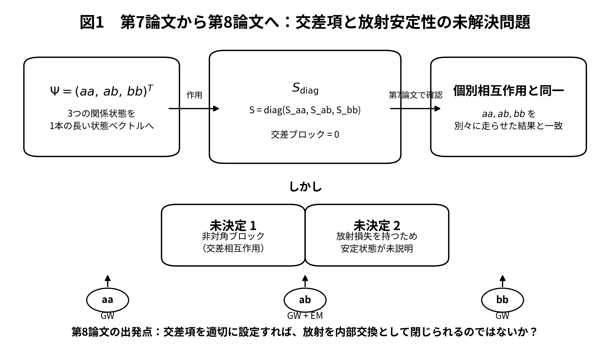
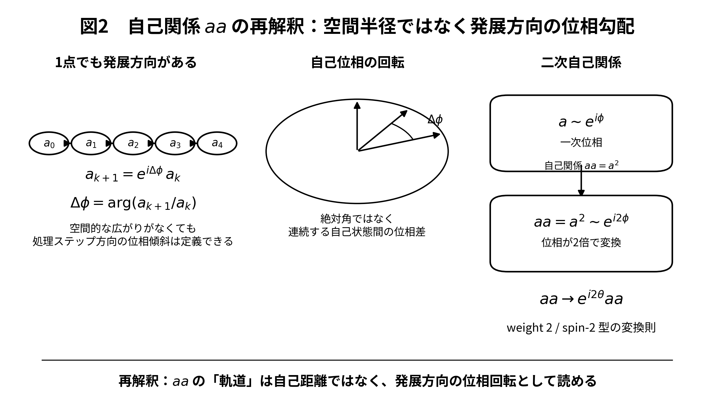

# 第八思考実験：万能相互作用は本当に万能だったか
## 自己関係の位相幾何から見た spin-2 型構造と、奇数倍音による spin-1/2 型拡張の可能性

**著者:** 木原範昭  
**版:** v1.0  
**日付:** 2026-09-29  

---

## 要旨

本研究系列では、外部に隠れた状態を持たず、現在状態だけから次状態を生成する閉じた状態写像を構成し、重力相互作用とクーロン相互作用を同一の状態更新形式へ内部化することを試みてきた。前報では、二体関係 `ab` に加えて自己関係 `aa`, `bb` を同じ状態写像で処理し、さらに三つの関係状態を一つの長い状態ベクトル \(\Psi\) に連結し、対角ブロック以外をゼロとした大きな相互作用行列 \(S\) を作用させた場合にも、三関係を個別に更新した場合と同じ結果が得られることを確認した。しかし、非対角ブロック、すなわち関係間の交差項をどのように定めるべきかは未解決であった。また、各関係が重力波または電磁波としてエネルギーを放射するなら、単純な独立関係の集合は安定状態として存在できない可能性が残った。

本稿は、当初「交差項を適切に設定すれば放射を内部交換として閉じられるのではないか」という疑問から開始した。しかし検討の過程で、自己関係 `aa`, `bb` に現れる角度変数を空間的な自己軌道の角度と解釈する必要はなく、離散処理ステップ方向に沿う位相傾斜として読むことができることに気付いた。複素状態 \(z\) が \(z\mapsto e^{i\theta}z\) と変換するとき、その二次関係は \(z^2\mapsto e^{i2\theta}z^2\) と変換する。この意味で、現在の自己関係は少なくとも weight-2、すなわち spin-2 型の位相構造を持つ。

さらに、規格化を \(G=M=c=1\) から \(G=q_0=c=1\), \(q_0=e/3\) へ変更し、電荷を \(q=nq_0\) と離散化した既存の構成を再検討すると、離散初期条件から生成される関係ラベル \(C,D\) は状態写像中で厳密に保存されている。処理自体も離散ステップ \(\Delta\tau\) で進む。したがって現在の系は、連続系を事後的に量子化するというより、離散 sector を選択した後、その sector を保ったまま発展する系として読むことができる。

この再解釈から、本研究で「万能相互作用」と呼んできた写像は、少なくとも現在実装された自由度の範囲では、より限定的な spin-2 / gravitational-like sector を自然に表現していたのではないか、という疑問が生じた。`aa`, `bb` では leading electric-dipole radiation が消える一方、quadrupole gravitational radiation は残る。三関係間で重力波成分を内部的に分配・相殺できる可能性はあるが、`ab` に固有の電荷依存 electric-dipole radiation を同じ最小構造だけで相殺する明確な相手は見つからない。このことは charged spin-2 状態一般の不存在を意味しないが、少なくとも現在の最小関係構造だけでは安定な荷電状態を表すには不足する可能性を示す。

最後に、spin-0, spin-1, spin-1/2 などを同じ枠組みでどのように表現できるかを検討した。単音の複素振動ではなく奇数半整数倍音を含む状態

\[
\Psi(\phi)=\sum_{k=0}^{K} A_k e^{i(2k+1)\phi/2}
\]

を考えると、

\[
\Psi(\phi+2\pi)=-\Psi(\phi),\qquad
\Psi(\phi+4\pi)=\Psi(\phi)
\]

が直ちに得られる。これは完全な \(SU(2)\) spinor 構造の導出ではないが、spin-1/2 に特徴的な 4\(\pi\) 周期性を持つ位相 sector を、現在の乗法的相互作用則を大幅に変更せず、初期状態の倍音構造を拡張することで導入できる可能性を示す。本稿ではここまでを解析的結果として固定し、その動力学的保存性と安定性の数値検証を次の課題とする。

**キーワード:** 閉じた状態写像、自己相互作用、spin-2、位相勾配、離散電荷、重力波、電磁双極放射、奇数倍音、spin-1/2、4\(\pi\) 周期

---

## 1. 研究の出発点

### 1.1 第六・第七思考実験から残った問題

第六思考実験では、非回転点粒子、準円軌道、leading Newtonian gravity + Coulomb、leading gravitational quadrupole radiation、leading electromagnetic electric-dipole radiation、および adiabatic energy balance に限定し、二種類の長距離相互作用を一つの閉じた状態写像へ内部化した [1]。その後、規格化基準を質量 \(M\) から離散電荷単位 \(q_0=e/3\) へ変更しても、同一の物理初期状態を与える限り状態生成が変わらないことを確認した [2]。

第七思考実験では、二体関係 `ab` だけを特別扱いすることが匿名性に反していないかを問い、自己関係

\[
aa,\qquad ab,\qquad bb
\]

を同じ状態写像で処理した [3]。

さらに三関係の状態を一つの長い状態ベクトル

\[
\Psi=
\begin{pmatrix}
\Psi_{aa}\\
\Psi_{ab}\\
\Psi_{bb}
\end{pmatrix}
\]

に連結し、相互作用行列を

\[
S_0=
\begin{pmatrix}
S_{aa}&0&0\\
0&S_{ab}&0\\
0&0&S_{bb}
\end{pmatrix}
\]

とした control calculation では、三関係を個別に更新した場合と同じ結果が得られた。

この結果は、対角ブロックの再現性を確認すると同時に、次の問題を明確にした。

\[
\boxed{
S_{aa,ab},\ S_{aa,bb},\ S_{ab,bb}\ \text{を何によって決めるのか}
}
\]

すなわち、未解決なのは非対角ブロック＝交差項である。

### 1.2 放射を持つ独立関係は安定か

第六・第七思考実験の局所モデルでは、条件を満たす各関係は gravitational quadrupole radiation を持ち得る。また、異なる charge-to-mass ratio を持つ二体関係 `ab` では leading electric-dipole radiation も生じ得る。

したがって、三関係を単に独立に並べただけでは、

\[
E_{\rm internal}\longrightarrow E_{\rm radiation}
\]

という一方向の散逸が続き、有限の内部状態が定常的に存在できない可能性がある。

本稿の当初の問いは単純であった。

\[
\boxed{
\text{交差項を適切に設定すれば、放射を外部損失ではなく内部交換として閉じられるか？}
}
\]

図1に、この出発点を示す。

**図1.** 対角ブロックだけの大きな \(S\) は三関係の独立更新を再現する。したがって第八思考実験の当初の問題は、非対角ブロックをどのような物理的関係として与えるか、および各関係からの放射を内部交換として閉じられるか、であった。

---

## 2. 自己関係の「軌道」は空間軌道である必要がない

### 2.1 `aa` の空間距離という読み方の不自然さ

二体関係 `ab` では、準円軌道近似のもとで半径 \(P\) と位相 \(\phi\) を空間的な相対軌道として読むことが自然である。しかし自己関係 `aa` に同じ語をそのまま適用すると、「a と a の距離」や「a が自分自身の周りを回る」という不要な空間像を導入することになる。

ところが、現在の状態写像は離散処理ステップ

\[
k\rightarrow k+1
\]

を持つ。したがって一点状態であっても、連続する状態間の位相差

\[
\Delta\phi_a
=
\arg\left(\frac{a_{k+1}}{a_k}\right)
\]

を定義できる。

これは空間的な二点間角度ではない。状態発展方向に沿った位相傾斜である。

連続表記を用いるなら、

\[
\omega_a=\frac{d\phi_a}{d\tau}
\]

であり、ここで \(\tau\) は外部絶対時間を仮定する必要はなく、状態更新を順序づける発展パラメータとして読める。

したがって自己関係 `aa` の角度変数は、

\[
\boxed{
\text{空間的自己軌道角}
\quad\longrightarrow\quad
\text{状態発展方向の自己位相勾配}
}
\]

と再解釈できる。

### 2.2 二次関係の位相は二倍になる

複素状態を

\[
z=re^{i\phi}
\]

とする。位相回転

\[
z\mapsto e^{i\theta}z
\]

に対して、自己二次関係は

\[
z^2=r^2e^{i2\phi}
\]

であり、

\[
z^2\mapsto e^{i2\theta}z^2
\]

と変換する。

二次複素量を実成分で書けば、

\[
z=x+iy
\]

に対して

\[
z^2=(x^2-y^2)+i(2xy).
\]

したがって

\[
Q_+=x^2-y^2,\qquad
Q_\times=2xy
\]

と置けば、

\[
\boxed{Q_+ + iQ_\times=z^2=r^2e^{i2\phi}}
\]

となる。この二倍角構造は本研究系列でも以前から複素二次量と曲率・quadrupole 読出しの関係として扱ってきた [5]。

ここで重要なのは、これだけから量子論的 graviton の完全な導出を主張することではない。本稿で言えるのは、現在の自己二次関係が

\[
\boxed{\text{weight-2 / spin-2 型の位相変換則を持つ}}
\]

ということである。

図2にこの再解釈を示す。

**図2.** 自己関係 `aa` の角度を空間的な自己軌道として読む必要はない。離散状態更新に沿う位相傾斜として読むと、一次位相 \(e^{i\phi}\) の二次関係は \(e^{i2\phi}\) となり、weight-2 の変換則を持つ。

---

## 3. 標準的 spin-2 重力との接点と相違

標準理論では、massless spin-2 field と重力の関係は古くから詳細に研究されている。Weinberg は Lorentz invariance と S-matrix の pole structure、および massless spin-2 particle を仮定した soft-emission analysis から gravitational coupling の普遍性に関する強い制約を示した [7]。また Deser は線形 spin-2 gauge field の自己結合を整合的に導入することで Einstein 型非線形性へ至る構成を示した [8]。

本稿の構成はこれらとは異なる。ここでは Lorentz-covariant field equation や gauge invariance から spin-2 を導入したのではなく、既存の閉じた複素状態写像に含まれていた自己二次関係を位相幾何として読み直した結果、

\[
z^2\sim e^{i2\phi}
\]

という weight-2 構造が現れた。

したがって本稿の主張は、

\[
\text{「重力子を導出した」}
\]

ではなく、

\[
\boxed{
\text{現在の状態写像が、少なくとも spin-2 / gravitational-like sector と整合的な位相構造を自然に持つ}
}
\]

という限定されたものである。

---

## 4. 離散性は相互作用中に失われていない

### 4.1 規格化基準の変更

第六思考実験の補遺では、

\[
G=M=c=1
\]

から

\[
\boxed{G=q_0=c=1},\qquad q_0=\frac{e}{3}
\]

へ規格化基準を変更した [2]。

等質量の設定では、電荷を

\[
q=s\,nq_0,\qquad n\in\mathbb Z
\]

と置くことで charge-to-mass ratio \(\lambda\) が離散ラベル \(n\) から生成される。

現在の実験条件では

\[
\lambda_n=\frac{2n}{M/q_0}=\frac{3n}{10}
\]

であり、そこから

\[
C=1-\lambda_A\lambda_B,
\qquad
D=(\lambda_A-\lambda_B)^2
\]

が生成される。

すなわち、初期化は

\[
\boxed{
n\in\mathbb Z
\longrightarrow
\lambda_n
\longrightarrow
(C,D)
}
\]

という離散 sector の選択になっている。

### 4.2 状態写像は sector を保存する

第六・第七思考実験で用いた閉じた状態写像では、\(N,C,D\) は状態成分として保持され、

\[
N'=N,\qquad C'=C,\qquad D'=D
\]

である。長時間計算でもこれらの drift は観測されなかった [1,3]。

したがって、現在のモデルについては、

\[
\boxed{
\text{離散初期条件から選択された sector は、相互作用中も保存される}
}
\]

と言える。

これは「連続的な電荷が動力学によって自発的に量子化された」という主張ではない。逆に、現在のモデルは最初から離散ラベル \(n\) を選び、そのラベルから生成された関係量を閉じた写像が保存している。

また更新自体も有限処理ステップ \(\Delta\tau\) で進む。したがって現在の実装は、少なくとも状態 sector と更新順序の双方に離散構造を持つ。

---

## 5. 「万能相互作用」だったのか

### 5.1 自己関係では electric dipole が消える

第六思考実験で用いた leading electromagnetic electric-dipole radiation の係数は

\[
D=(\lambda_A-\lambda_B)^2
\]

である [1]。

自己関係では

\[
\lambda_A=\lambda_B
\]

なので、

\[
\boxed{D_{aa}=D_{bb}=0}
\]

となる。

したがって現在の近似次数では、`aa`, `bb` は leading electric-dipole radiation を持たない。

一方、conservative factor は

\[
C_{aa}=1-\lambda_a^2,
\qquad
C_{bb}=1-\lambda_b^2
\]

であり、実数準円軌道領域 \(C>0\) では gravitational quadrupole radiation は残る。

これは、自己二次関係の weight-2 構造と合わせると、現在の写像が少なくとも自己関係について spin-2 / gravitational-like sector を自然に選択しているように見える。

### 5.2 三関係の比較

| relation | \(C\) | \(D\) | GW quadrupole | leading EM dipole | 本稿での読み |
|---|---:|---:|---|---|---|
| \(aa\) | \(1-\lambda_a^2\) | \(0\) | あり得る | なし | spin-2 型自己関係 |
| \(ab\) | \(1-\lambda_a\lambda_b\) | \((\lambda_a-\lambda_b)^2\) | あり得る | \(D\neq0\) ならあり | 二体関係 |
| \(bb\) | \(1-\lambda_b^2\) | \(0\) | あり得る | なし | spin-2 型自己関係 |

ここで「GW quadrupole あり」は、現在採用している leading-order radiation model の範囲での意味であり、独立に伝播する量子重力場を実装したという意味ではない。

### 5.3 現在の相互作用の適用範囲

以上から、本研究で「万能相互作用」と呼んできた写像について、より慎重な問いが必要になる。

\[
\boxed{
\text{この写像は本当に spin に依存しない万能相互作用なのか？}
}
\]

それとも、現在選択している状態自由度と二次関係が、

\[
\boxed{
\text{spin-2 / gravitational-like sector を主として記述しているのではないか？}
}
\]

本稿では後者の可能性を新たな仮説として採用し、他の spin sector を表すために状態空間側の拡張が必要かを検討する。

---

## 6. 交差項と放射閉包を再考する

### 6.1 gravitational sector は三関係に共通し得る

`aa`, `ab`, `bb` はいずれも現在の近似では gravitational quadrupole channel を持ち得る。したがって、各関係の放射を独立な外部損失とみなす代わりに、三関係の共通 neutral spin-2 sector への内部交換として再構成する余地がある。

模式的には、各関係の quadrupole amplitude を

\[
Q_{aa},\qquad Q_{ab},\qquad Q_{bb}
\]

とすれば、外部に読み出される成分が

\[
Q_{\rm ext}=Q_{aa}+Q_{ab}+Q_{bb}
\]

であり、内部状態では各 \(Q_i\neq0\) であっても、

\[
\boxed{Q_{\rm ext}=0}
\]

となる位相配置が存在する可能性がある。

これは本稿では可能性の指摘に留める。非対角ブロックを一意に決定する動力学はまだ導出されていない。

### 6.2 electromagnetic dipole は同じ方法では閉じない

一方、自己関係では

\[
D_{aa}=D_{bb}=0
\]

であるのに対し、異なる charge-to-mass ratio を持つ `ab` では

\[
D_{ab}=(\lambda_a-\lambda_b)^2>0
\]

となり得る。

したがって最小三関係の中では、`ab` の leading electric-dipole radiation に対して、`aa` と `bb` は同種の dipole channel を提供しない。

このため、

\[
\boxed{
\text{単純な二つの spin-2 型自己状態とその一つの相互関係だけでは、荷電した安定状態を閉じられない可能性がある}
}
\]

という結論に至る。

### 6.3 この結論が意味しないこと

この結果は、次を否定しない。

- charged spin-2 state が一般に存在不可能であること。
- より多くの内部自由度を持つ複合状態での安定化。
- higher multipole を含む electromagnetic sector による閉包。
- 特殊な運動状態、位相同期状態、または非最小結合による安定化。
- 現在の leading-order approximation を超えた相互作用。

標準的 higher-spin theory でも、charged massive higher-spin field には causality や自由度保存に関する非自明な問題が知られており、特に charged spin-2 では単純な結合が困難であることが議論されている [9]。一方、別の higher-spin 系では非最小結合によって伝播の病理を回避できる例もあり [10]、荷電 higher-spin 一般を一括して禁止する根拠にはならない。

本稿の結論は、あくまで

\[
\boxed{
\text{現在の最小関係構造だけでは不足している}
}
\]

というモデル内部の限定的な結論である。

---

## 7. 放射を「外へ捨てる量」ではなく内部関係として読む可能性

放射反作用を孤立した一粒子の自己作用だけでなく、全体系の関係として捉える発想には歴史的先行例がある。Wheeler と Feynman の absorber theory は、電磁放射を emitter と absorber の直接的関係から扱う [11]。

本稿のモデルは absorber theory ではなく、数式構造も同一ではない。しかし、

\[
\text{radiation} = \text{必ず外部へ失われる独立自由度}
\]

と最初から固定せず、閉じた全状態の内部交換として再検討するという問題意識には類似性がある。

第八思考実験の当初の交差項問題は、この意味で依然として重要である。ただし本稿では、交差項の具体式を仮定して数値走行するより先に、現在の関係状態がどの spin sector を表しているのかを明確にする必要があると判断した。

---

## 8. では spin-0, spin-1, spin-1/2 はどう表すのか

### 8.1 単音状態だけでは自由度が足りない可能性

現在の基本的な複素状態を

\[
z=Ae^{i\phi}
\]

という単一位相モードとして読むと、その自己二次関係は

\[
z^2=A^2e^{i2\phi}
\]

となり、weight-2 sector が自然に現れる。

ここで次の疑問が生じる。

\[
\boxed{
\text{spin-0, spin-1, spin-1/2 などを表すには、相互作用則そのものを増やす必要があるのか？}
}
\]

別の可能性は、相互作用則ではなく、基本状態の内部倍音構造が不足しているというものである。

### 8.2 奇数半整数倍音による 4\(\pi\) 周期

基本状態を単音ではなく、

\[
\boxed{
\Psi(\phi)
=
\sum_{k=0}^{K}A_k e^{i(2k+1)\phi/2}
}
\]

とする。

各項について

\[
e^{i(2k+1)(\phi+2\pi)/2}
=
e^{i(2k+1)\phi/2}e^{i(2k+1)\pi}
=
-e^{i(2k+1)\phi/2}
\]

であるから、全体として

\[
\boxed{\Psi(\phi+2\pi)=-\Psi(\phi)}
\]

となる。

さらに、

\[
e^{i(2k+1)(\phi+4\pi)/2}
=
e^{i(2k+1)\phi/2}e^{i(2k+1)2\pi}
=
e^{i(2k+1)\phi/2}
\]

なので、

\[
\boxed{\Psi(\phi+4\pi)=\Psi(\phi)}.
\]

これは spin-1/2 spinor に特徴的な 2\(\pi\) 回転での符号反転と 4\(\pi\) 回転での復帰と同じ周期構造を持つ。

ただし、本稿では任意の三次元回転に対する完全な \(SU(2)\) transformation law を導出していない。したがって、ここでは

\[
\boxed{\text{spin-1/2 型の位相構造}}
\]

と呼ぶ。

### 8.3 乗法則との相性

奇数半整数倍音 sector を

\[
F=\mathrm{span}\left\{e^{i(2m+1)\phi/2}\right\}
\]

整数倍音 sector を

\[
B=\mathrm{span}\left\{e^{ij\phi}\right\}
\]

とする。

すると、

\[
e^{i(2m+1)\phi/2}e^{i(2n+1)\phi/2}
=
e^{i(m+n+1)\phi}
\]

より

\[
F\times F\subset B.
\]

また、

\[
e^{ij\phi}e^{i(2m+1)\phi/2}
=
e^{i(2j+2m+1)\phi/2}
\]

より

\[
B\times F\subset F,
\]

そして

\[
B\times B\subset B.
\]

したがって乗法構造は

\[
\boxed{
\begin{array}{c|cc}
\times & B & F\\
\hline
B & B & F\\
F & F & B
\end{array}}
\]

という \(\mathbb Z_2\)-graded closure を持つ。

最小モード

\[
\psi=e^{i\phi/2}
\]

では、

\[
\psi^2=e^{i\phi},
\qquad
\psi^4=e^{i2\phi}.
\]

したがって位相 weight だけを見れば、

\[
\boxed{
\frac12\longrightarrow1\longrightarrow2
}
\]

という階層が乗法によって生成される。

これは quantum spin の完全な導出ではないが、現在の相互作用則が積を基本演算としていることを考えると重要である。spin-1/2 型 sector を追加するために直ちに新しい相互作用演算を導入する必要はなく、まず初期状態の倍音構造を拡張するだけで足りる可能性がある。

### 8.4 既存の奇数倍音研究との接続

本研究系列では、一定振幅奇数倍音和が局在した孤立ピークを形成することを以前に数値・解析的に検討している [6]。今回の奇数半整数倍音の利用目的は、その局在性そのものではない。しかし、単一複素波を単音としてではなく複数の整合した倍音成分を持つ状態として読むという点で、既存研究の自然な拡張である。

---

## 9. 本稿で分かったことと、まだ分かっていないこと

### 9.1 本稿で得られた解析的結果

本稿で得られた結果を整理すると次のようになる。

1. 第七思考実験の block-diagonal control により、三関係を一つの長い状態ベクトルへ統合しても、非対角ブロックがゼロなら個別更新と同じ結果になる。したがって交差項が次の自由度として明示された。
2. 自己関係 `aa`, `bb` の角度変数は、空間的自己軌道ではなく、離散処理ステップ方向の位相傾斜として解釈できる。
3. 二次関係 \(z^2\) は \(e^{i2\theta}\) と変換し、weight-2 / spin-2 型の位相構造を持つ。
4. \(q=nq_0\), \(q_0=e/3\) から生成された \(C,D\) は閉じた状態写像中で保存され、選択された離散 sector は相互作用中に失われない。
5. 自己関係では \(D=0\) となり leading EM dipole は消えるが、現在の近似では GW quadrupole sector は残る。
6. gravitational-like radiation は複数関係間で内部交換・位相相殺できる可能性がある一方、`ab` に固有の electric-dipole channel を最小自己関係だけで相殺する構造は現時点で見つからない。
7. したがって現在の写像は「完全に万能な相互作用」というより、少なくとも実装済み自由度では spin-2 / gravitational-like sector を自然に表している可能性がある。
8. 奇数半整数倍音状態を導入すると、2\(\pi\) で符号反転し 4\(\pi\) で復帰する spin-1/2 型位相構造を解析的に構成できる。
9. その sector は現在の乗法則と \(\mathbb Z_2\)-graded に閉じるため、相互作用則を直ちに変更せず、初期状態の拡張だけで導入できる可能性がある。

### 9.2 本稿では主張しないこと

一方、本稿は次をまだ示していない。

- 現在の自己関係が量子重力の graviton そのものであること。
- 完全な \(SU(2)\) spinor representation の導出。
- spin-statistics relation の導出。
- charged spin-2 state 一般の不存在。
- 非対角交差項の一意な導出。
- 内部放射相殺状態の動力学的安定性。
- 奇数半整数倍音 sector が現在の transition の下で保存されること。
- spin-0, spin-1, spin-1/2, spin-2 の全 sector を一つの完成した相互作用則で同時に記述できること。

この区別は重要である。本稿の目的は完成した particle model を提示することではなく、既存の状態写像の適用範囲を再同定し、次に必要な自由度を解析的に特定することである。

---

## 10. 次の数値実験

次の課題は明確である。

単音初期状態

\[
z=Ae^{i\phi}
\]

を、奇数半整数倍音を持つ初期状態

\[
\Psi(\phi)=\sum_{k=0}^{K}A_k e^{i(2k+1)\phi/2}
\]

へ置き換え、現在の閉じた相互作用写像を可能な限り変更せずに走行させる。

最低限確認すべき量は、

\[
\Psi(\phi+2\pi)=-\Psi(\phi),
\qquad
\Psi(\phi+4\pi)=\Psi(\phi)
\]

という 4\(\pi\) 位相構造が動力学中にも保存されるか、また自己相関・二体相関を取ったときに

\[
F\times F\subset B,
\qquad
B\times F\subset F
\]

という grading が壊れないかである。

さらに、生成された integer-harmonic relation sector が現在の spin-2 型 readout とどのように接続するかを調べる。

したがって次の数値実験の中心問題は、

\[
\boxed{
\text{奇数半整数倍音を初期状態に与えるだけで、現在の閉じた相互作用写像の中に安定な spin-1/2 型 sector が生成・保存されるか？}
}
\]

である。

---

## 11. 結論

第八思考実験は、当初、`aa`, `ab`, `bb` の交差項を導入して放射損失を内部交換として閉じることを目的として始まった。しかし、その検討過程で問題の位置が一段深いところにあることが分かった。

自己関係 `aa`, `bb` に現れる位相を空間的な自己軌道ではなく状態発展方向の位相傾斜として読むと、その二次関係は

\[
z^2\sim e^{i2\phi}
\]

という weight-2 構造を持つ。また離散電荷単位から生成された状態 sector は閉じた状態写像中で保存されている。これらを合わせると、現在「万能相互作用」と呼んできた写像は、少なくとも現在実装された状態自由度の範囲では、spin-2 / gravitational-like sector を自然に記述する写像だった可能性がある。

この解釈では、自己関係で leading electric dipole が消え、quadrupole gravitational channel が残ることも自然に整理できる。一方、異なる charge-to-mass ratio を持つ `ab` の electric-dipole radiation は、最小の `aa`, `ab`, `bb` 構造だけでは明確な相殺相手を持たない。この結果は charged spin-2 一般を否定するものではないが、安定な荷電状態にはより複合的な内部構造が必要である可能性を示す。

そして、この限定性は相互作用則そのものの失敗を直ちに意味しない。基本状態を単音から奇数半整数倍音へ拡張すると、

\[
\Psi(\phi+2\pi)=-\Psi(\phi),
\qquad
\Psi(\phi+4\pi)=\Psi(\phi)
\]

という spin-1/2 型位相構造が得られ、その積は現在の integer-harmonic relation sector へ自然に写る。

したがって本稿で得られた次の仮説は、

\[
\boxed{
\text{不足していたのは相互作用則ではなく、基本状態の倍音自由度だった可能性がある}
}
\]

というものである。

この仮説を数値実験で検証することを次の課題とする。

---

# 参考文献

## 自己引用

[1] 木原範昭, **「第六思考実験：二種類の長距離相互作用を一つの閉じた状態写像へ内部化できるか」**, 2026, Zenodo, DOI: 10.5281/zenodo.22974632.

[2] 木原範昭, **「第六思考実験 補遺：規格化基準を質量から電荷単位へ変更しても状態生成は変わるか」**, 2026, Zenodo, DOI: 10.5281/zenodo.22985300.

[3] 木原範昭, **「第七思考実験：二体関係だけでなく自己関係も状態として存在するか」**, v1.1, 2026. 本研究系列の直前稿（`thought_experiment_07_self_interaction_aa_bb_ja_v1.1.md`）.

[4] 木原範昭, **「第五思考実験：隠れた状態はなかったか」**, 2026, Zenodo, DOI: 10.5281/zenodo.22973087.

[5] 木原範昭, **「複素旋回波の面積交差項による曲率振動の読出し」**, 2026, Zenodo, DOI: 10.5281/zenodo.22230941.

[6] 木原範昭, **「半波長位相区間における一定振幅奇数倍音和の孤立ピーク波とその局在性に関する観察」**, v0.6, 2026, Zenodo, DOI: 10.5281/zenodo.21073985.

## 外部文献

[7] S. Weinberg, **“Photons and Gravitons in S-Matrix Theory: Derivation of Charge Conservation and Equality of Gravitational and Inertial Mass,”** *Physical Review* **135**, B1049–B1056 (1964). DOI: 10.1103/PhysRev.135.B1049.

[8] S. Deser, **“Self-Interaction and Gauge Invariance,”** *General Relativity and Gravitation* **1**, 9–18 (1970). DOI: 10.1007/BF00759198.

[9] S. Deser and A. Waldron, **“Inconsistencies of Massive Charged Gravitating Higher Spins,”** *Nuclear Physics B* **631**, 369–387 (2002). DOI: 10.1016/S0550-3213(02)00199-2.

[10] M. Porrati and R. Rahman, **“Causal Propagation of a Charged Spin 3/2 Field in an External Electromagnetic Background,”** *Physical Review D* **80**, 025009 (2009). DOI: 10.1103/PhysRevD.80.025009.

[11] J. A. Wheeler and R. P. Feynman, **“Interaction with the Absorber as the Mechanism of Radiation,”** *Reviews of Modern Physics* **17**, 157–181 (1945). DOI: 10.1103/RevModPhys.17.157.

---

## 注記

本稿における “spin-2 型”, “spin-1/2 型” は、それぞれ位相変換則または周期構造についての記述である。標準量子場理論における完全な Lorentz-group / \(SU(2)\) representation、spin-statistics theorem、量子化された graviton または fermion の存在を本稿だけから主張するものではない。
