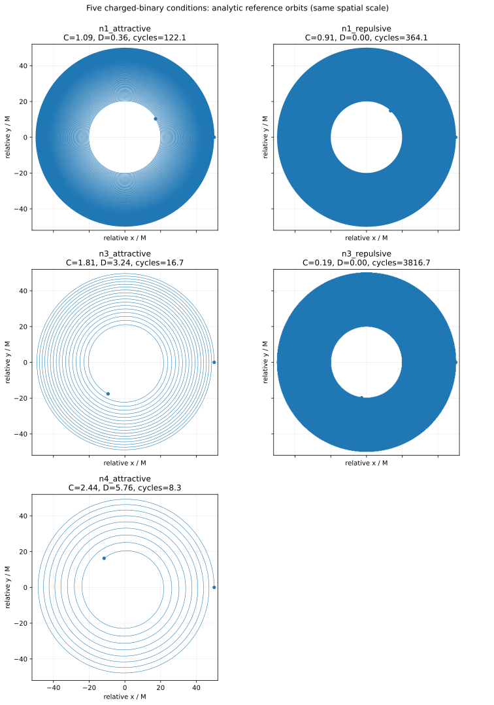
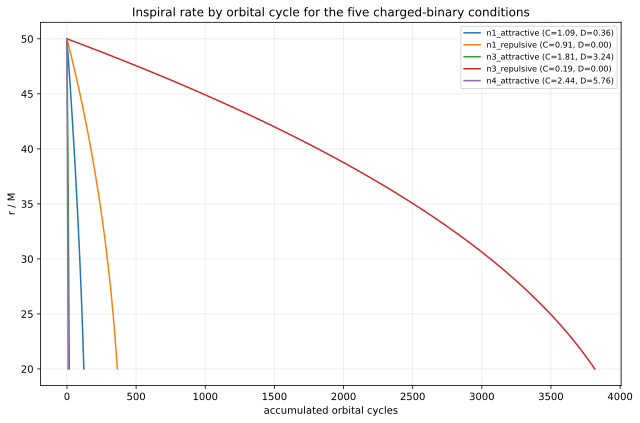
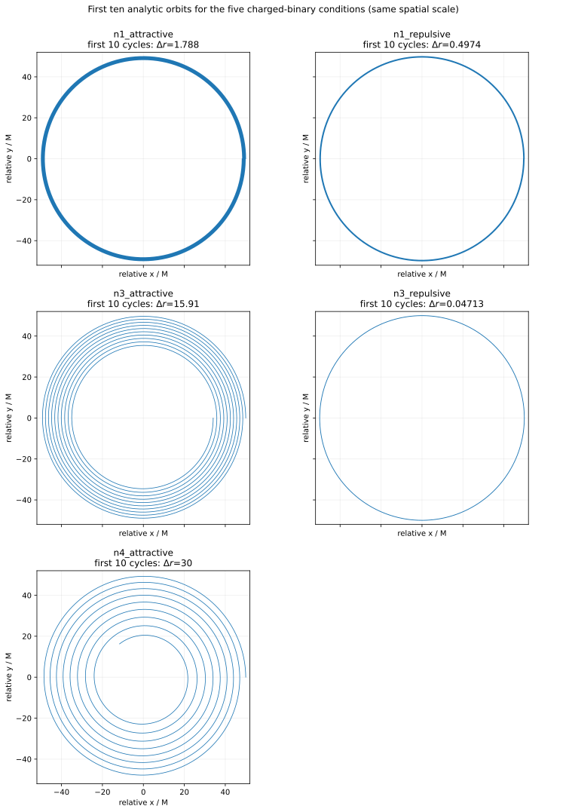
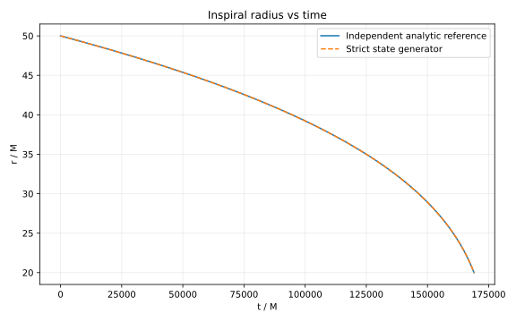
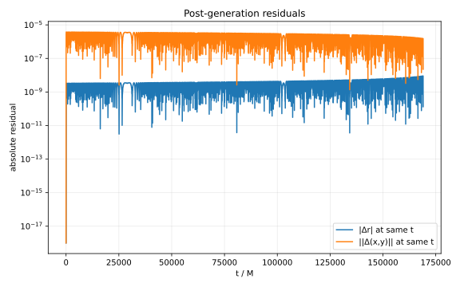
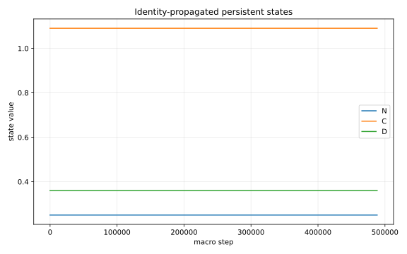
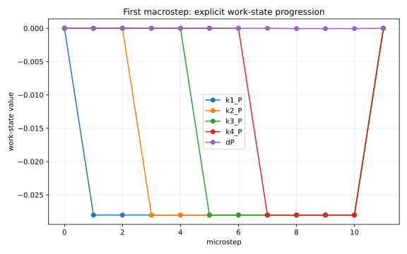
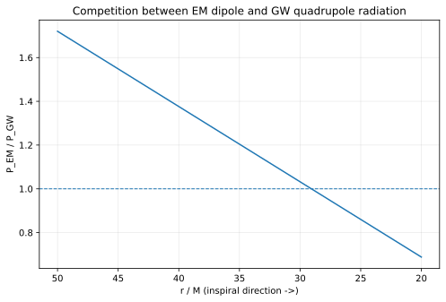

# 第六思考実験：二種類の長距離相互作用を一つの閉じた状態写像へ内部化できるか
## ― 荷電準円二体系の重力・Coulomb・GW四重極・EM双極放射を8永続状態で再構成し、5条件で同一 transition の移植可能性を検証する ―

**著者:** 木原範昭 (Noriaki Kihara)  
**ORCID:** 0009-0004-6753-4020  
**Version DOI:** 10.5281/zenodo.22974632  
**Concept DOI:** 10.5281/zenodo.22974631  
**版:** v1.1  
**日付:** 2026-09-26  

**キーワード:** 荷電二体系、状態閉包、同期状態写像、Coulomb 相互作用、重力波放射、電磁双極放射、放射反作用、永続論理状態、離散力学、再現可能性

---

# 要旨

第五思考実験 [5] では、第四思考実験 [4] で二状態として表示されていた重力軌道生成器を情報流の観点から自己監査し、現在の表現では、マクロ step を越えて保持される情報を

$$
Z_6=(U,P,E,H,Q,N)
$$

として明示する必要があることを確認した。さらに、RK4 の途中量と処理位相を machine/work state として状態内部へ置き、OLD-state-only の同期更新、外部物理パラメータ禁止、読み出し非帰還、一つの `transition(z)` のみを生成経路とする形へ再構成した。

本稿では、その監査規則を初めて、**一種類の相互作用から二種類の相互作用へ拡張した系**に適用する。対象は、$G=M=c=1$、非回転点粒子、準円軌道、leading-order adiabatic inspiral に限定した荷電二体系である。保存運動は Newtonian 重力と Coulomb 相互作用、散逸は leading gravitational quadrupole radiation と leading electric-dipole radiation を用いる。独立な解析基準側では、荷電依存性は

$$
C=1-\lambda_A\lambda_B,
\qquad
D=(\lambda_A-\lambda_B)^2
$$

の二つの関係量へ整理できる。ここで $\lambda_A=q_A/m_A$、$\lambda_B=q_B/m_B$ である。$C$ は保存力と軌道角速度に入り、$D$ は leading electric-dipole radiation の有無と強さを決める。

第五思考実験の六永続状態へ $C,D$ を追加し、

$$
\boxed{
Z_8=(U,P,E,H,Q,N,C,D)
}
$$

とした。実装では、これら8永続論理状態に RK4 work register と11相 one-hot 位相を加えた41実数成分の full microstate を用いる。`transition(z)` は外部物理引数を受け取らず、全候補値を OLD full state のみから作り、one-hot 積和で次状態を同時生成する。$N,C,D$ は全相で恒等候補として保持されるため、外部コピーではなく同一写像の結果として保存される。

基準ケース

$$
\lambda_A=+0.30,
\qquad
\lambda_B=-0.30,
$$

すなわち

$$
C=1.09,
\qquad
D=0.36,
\qquad
N=\nu=0.25
$$

について、$r=50\rightarrow20$ の厳格8状態生成は 488,345 macro steps で完了した。解析基準との差は

$$
|\Delta t|=1.46\times10^{-8},
\qquad
|\Delta\phi|=8.44\times10^{-11},
$$

全保存範囲で

$$
\max|\Delta r|=9.12\times10^{-9},
$$

であり、

$$
\Delta N=\Delta C=\Delta D=0
$$

であった。

さらに、同じ `transition(z)`、同じ11相機械、同じ8永続状態を変更せず、初期状態の $C,D$ だけを変えた5条件

$$
(+0.30,-0.30),
(+0.30,+0.30),
(+0.90,-0.90),
(+0.90,+0.90),
(+1.20,-1.20)
$$

を実行した。5条件すべてで軌道状態生成は完了し、$N,C,D$ の drift は 0 であった。特に同符号等比率では $D=0$ となり、本稿で採用した leading electric-dipole 項だけが消える一方、$C<1$ の Coulomb 斥力効果は保存運動に残る。$C=0.19$ の `n3_repulsive` は約3816.7周を要し、$P,H$ は最後まで生成できたが、指数時計 $Q$ による時刻読み出しは有限精度範囲を超えた。この事実は修正せず、そのまま定義域・数値表現上の限界として記録する。

本稿が示すのは、限定された leading-order 準円荷電二体系について、重力と Coulomb の保存効果、および GW quadrupole と EM dipole の散逸効果を、**外部の荷電物理パラメータや力種別分岐を持たない一つの同期状態写像へ再配置できる**ということである。これは重力と電磁気の基礎的統一、Einstein–Maxwell 方程式の導出、8状態の最小性、$C,D$ の存在論的基本性、あるいは一般荷電二体系への普遍性を意味しない。

---

# 0. 本稿の位置づけ

本稿は研究プロジェクト設計 [0] のもとでの第六思考実験である。

第一思考実験 [1] では、背景時空や計量を先に置かず、意味を固定しない二自由度と面積読み出しの保存から、慣性・一様加速・回転を区別する最小構成を調べた。

第二思考実験 [2] では、二つの値へ固定作用を反復し、積の読み出しと面積時計から Coulomb 型の逆二乗運動を構成した。

第三思考実験 [3] では方向を逆転し、既知の二体軌道から質量比・相対距離・相対時間を読み出す逆問題を扱った。

第四思考実験 [4] では、第三思考実験で外部計算していた重力軌道を、状態依存作用

$$
X_{n+1}=S_nX_n
$$

による内部逐次生成へ戻した。

第五思考実験 [5] では、その第四思考実験を自己監査した。そこで重要になったのは、

$$
\boxed{
\text{数値結果が既知軌道と一致しても、明示状態だけで系が閉じているとは限らない}
}
$$

という点である。第四思考実験の見かけの二状態 $X=(a,b)^T$ の外側に、マクロ step を越えて保持される情報が残っていたため、それらを六永続論理状態

$$
Z_6=(U,P,E,H,Q,N)
$$

として明示し、処理途中の RK4 値と11相 one-hot 位相も machine/work state として full state 内へ置いた。

第六思考実験では、この監査規則自体は変更しない。新しい問いは、

$$
\boxed{
\begin{array}{c}
\text{相互作用を重力一種類から、重力+Coulomb の二種類へ増やし、}\\
\text{散逸も GW quadrupole + EM dipole の二チャネルへ増やしたとき、}\\
\text{それでも外部物理情報なしの一つの同期状態写像として閉じられるか。}
\end{array}
}
$$

である。

したがって、本稿の主題は単に「荷電軌道を計算すること」ではない。既知の荷電二体系を答え合わせ側に置いたうえで、**何を永続状態として内部に持てば、同じ更新規則のまま複数条件へ移植できるか**を監査することである。

---

# 1. 動機

## 1.1 一種類の相互作用から二種類へ

重力だけの二体系では、中心相互作用の種類は一つである。そこへ Coulomb 相互作用を加えると、保存力側では同じ $1/r^2$ 型であっても符号によって引力・斥力が変わる。さらに散逸側には、重力四重極放射とは別の leading electric-dipole radiation が現れる [6–11]。

したがって荷電二体系は、

$$
\boxed{
\text{保存相互作用の複数化}
+
\text{散逸チャネルの複数化}
}
$$

を同時に試す最小の次段階になる。

一方、一般の Einstein–Maxwell 二体問題へ進むと、検証対象が急速に複雑になる。本稿では意図的に、

- 非回転点粒子、
- 準円軌道、
- leading-order 保存力学、
- leading GW quadrupole radiation、
- leading EM electric-dipole radiation、
- adiabatic energy balance、
- $G=M=c=1$

へ限定する。この範囲なら独立解析基準を明示でき、状態生成器との比較方向を

$$
\boxed{
\text{state generator output}
\longrightarrow
\text{independent analytic reference}
}
$$

の一方向に固定できる。

## 1.2 荷電パラメータを外部から毎 step 与えない

荷電二体系を普通に実装すれば、各 step で

$$
\lambda_A,
\qquad
\lambda_B
$$

を外部パラメータとして参照できる。しかし第五思考実験 [5] の監査規則から見ると、それでは「次状態を決める物理情報」が状態の外に残る。

そこで本稿では、解析式に実際に現れる組合せを先に監査する。すると今回の限定モデルでは、個々の $\lambda_A,\lambda_B$ を直接保持する代わりに、

$$
\boxed{
C=1-\lambda_A\lambda_B
}
$$

と

$$
\boxed{
D=(\lambda_A-\lambda_B)^2
}
$$

で十分である。

$C$ は保存力と軌道周波数へ入り、$D$ は leading electric-dipole radiation へ入る。この二つを状態へ内部化できれば、`transition(z)` は天体 A/B の個別ラベルも、引力/斥力の外部分岐も、重力/電磁の力種別分岐も必要としない。

## 1.3 一条件一致ではなく移植可能性を見る

一条件だけで解析基準と一致しても、そのケース専用の係数化である可能性が残る。そのため本稿では、同一の `transition(z)` を固定したまま、初期状態に入れる $C,D$ だけを変更する。

特に、

- 反対符号電荷: $C>1$, $D>0$、
- 同符号等 charge-to-mass ratio: $C<1$, $D=0$、

を含めることで、保存力の強弱と dipole radiation の有無を同時に変える。

成功条件は、

$$
\boxed{
\text{同じ transition が、異なる条件を状態値の違いだけで処理すること}
}
$$

である。

---

# 2. 本稿の問いと主張範囲

本稿で検証する問いを、次の四段階に分ける。

1. **解析閉包**  
   今回の leading-order 荷電準円二体系は、荷電依存性を $C,D$ へ整理できるか。

2. **状態閉包**  
   第五思考実験の六永続状態へ $C,D$ を追加した
   $$
   Z_8=(U,P,E,H,Q,N,C,D)
   $$
   で、次状態決定に必要な物理ケース値を状態内部へ置けるか。

3. **一回写像**  
   RK4 の途中量、処理位相、保存関係量を含む full state を、外部物理引数を取らない一つの `transition(z)` で更新できるか。

4. **移植可能性**  
   同じ `transition(z)` を変更せず、異なる5条件へ初期状態の $C,D$ だけを変えて移植できるか。

本稿の肯定的結論は、**この限定モデルとこの実装範囲について**のみ述べる。

---

# 3. 独立解析基準

## 3.1 近似と単位

解析基準は、後続の状態生成器とは独立に構成する。採用する条件は、

$$
G=M=c=1,
\qquad
\epsilon_0=\frac{1}{4\pi},
$$

$$
M=m_A+m_B=1
$$

である。

対象は、非回転点粒子、adiabatic quasi-circular inspiral とし、保存力学は Newtonian 重力 + Coulomb の leading order、散逸は leading mass-quadrupole gravitational radiation と leading electric-dipole electromagnetic radiation とする。Peters–Mathews [6,7] は重力四重極放射と軌道縮退の基礎であり、荷電二体系で GW/EM の双方を扱う先行研究として Liu et al. [8]、Benavides-Gallego and Han [9]、Zhang et al. [10]、Verma et al. [11] を参照する。

Zhang et al. [10] の記号では $1-\lambda_A\lambda_B$ に相当する量を用いるが、本稿では状態ベクトル $Z_8$ との衝突を避けるため、これを $C$ と書く。

## 3.2 質量・電荷の無次元量

charge-to-mass ratio を

$$
\lambda_A=\frac{q_A}{m_A},
\qquad
\lambda_B=\frac{q_B}{m_B}
$$

とする。

換算質量と対称質量比は

$$
\mu=\frac{m_A m_B}{M},
\qquad
\nu=\frac{m_A m_B}{M^2}
$$

である。$M=1$ では

$$
\mu=\nu.
$$

本実験は等質量なので、

$$
\mu=\nu=\frac14.
$$

## 3.3 保存運動をまとめる関係量 $C$

重力と Coulomb の leading-order 有効中心相互作用をまとめ、

$$
\boxed{
C=1-\lambda_A\lambda_B
}
$$

とする。

準円軌道では

$$
\boxed{
\omega^2=\frac{C}{r^3}
}
$$

であり、束縛エネルギーは

$$
\boxed{
E_{\rm orb}=-\frac{\mu C}{2r}
}
$$

となる。

$\lambda_A\lambda_B<0$ なら $C>1$ で、Coulomb は重力と同じ向きの引力として働く。$\lambda_A\lambda_B>0$ なら $C<1$ で、Coulomb 斥力が実効中心引力を弱める。

本稿の実数準円基準は

$$
\boxed{C>0}
$$

を必要とする。したがって $C\le0$ は、現在の解析基準の定義域外である。

## 3.4 GW quadrupole radiation

leading mass-quadrupole power は

$$
P_{\rm GW}
=
\frac{32}{5}\mu^2 r^4\omega^6.
$$

$\omega^2=C/r^3$ を代入すると、

$$
\boxed{
P_{\rm GW}
=
\frac{32}{5}
\frac{\mu^2C^3}{r^5}
}
$$

となる [6,7]。

## 3.5 EM electric-dipole radiation

COM 系の electric dipole moment は leading order で

$$
\mathbf d
=
\mu(\lambda_A-\lambda_B)\mathbf r.
$$

ここで、

$$
\boxed{
D=(\lambda_A-\lambda_B)^2
}
$$

と置く。

leading dipole power は

$$
\boxed{
P_{\rm EM}
=
\frac23
\frac{\mu^2 D C^2}{r^4}
}
$$

である [8–11]。

この式から、

$$
\lambda_A=\lambda_B
\quad\Longrightarrow\quad
D=0
$$

なら、**本稿で採用した leading electric-dipole 項**は消える。ただし Coulomb 保存力そのものが消えるわけではない。

## 3.6 energy balance と半径進化

放射損失を

$$
\frac{dE_{\rm orb}}{dt}
=-(P_{\rm GW}+P_{\rm EM})
$$

とする。

$$
\frac{dE_{\rm orb}}{dr}
=
\frac{\mu C}{2r^2}
$$

より、

$$
\boxed{
\frac{dr}{dt}
=-\frac{A}{r^2}-\frac{B}{r^3}
}
$$

を得る。ここで、

$$
\boxed{
A=\frac43\mu D C
}
$$

は EM dipole 側、

$$
\boxed{
B=\frac{64}{5}\mu C^2
}
$$

は GW quadrupole 側の係数である。

したがって半径進化には、

$$
\boxed{
r^{-2}\ \text{と}\ r^{-3}
}
$$

という異なる距離依存性を持つ二つの散逸寄与が同時に現れる。

## 3.7 解析的な $t(r)$ と $\phi(r)$

$$
\frac{dt}{dr}
=-\frac{r^3}{Ar+B}
$$

なので、$A\ne0$ では

$$
F_t(r)
=
\frac{r^3}{3A}
-\frac{Br^2}{2A^2}
+\frac{B^2r}{A^3}
-\frac{B^3}{A^4}\ln(Ar+B)
$$

と置けば、

$$
\boxed{
t(r)=F_t(r_0)-F_t(r)}.
$$

また、

$$
\frac{d\phi}{dt}=\sqrt{\frac{C}{r^3}}
$$

より、

$$
\frac{d\phi}{dr}
=-\frac{\sqrt C\,r^{3/2}}{Ar+B}.
$$

$A\ne0$ では、

$$
F_\phi(r)
=
\sqrt C
\left[
\frac{2r^{3/2}}{3A}
-\frac{2B\sqrt r}{A^2}
+\frac{2B^{3/2}}{A^{5/2}}
\tan^{-1}\sqrt{\frac{Ar}{B}}
\right]
$$

として、

$$
\boxed{
\phi(r)=F_\phi(r_0)-F_\phi(r)}.
$$

同符号等比率では $D=0$、したがって $A=0$ となる。この場合は極限を直接用い、

$$
\boxed{
t(r)=\frac{r_0^4-r^4}{4B}}
$$

および

$$
\boxed{
\phi(r)=\frac{2\sqrt C}{5B}
\left(r_0^{5/2}-r^{5/2}\right)
}
$$

とする。

相対軌道は

$$
\boxed{
x=r\cos\phi,
\qquad
y=r\sin\phi}
$$

で読み出す。

---

# 4. 解析基準ケース

基準条件を

$$
m_A=m_B=0.5,
$$

$$
\lambda_A=+0.30,
\qquad
\lambda_B=-0.30
$$

とする。

このとき、

$$
C=1.09,
\qquad
D=0.36,
\qquad
\mu=\nu=0.25.
$$

$r=50\rightarrow20$ の独立解析基準は、

$$
t_f=169032.31760706357,
$$

$$
\phi_f=767.0889994015913,
$$

$$
N_{\rm cyc}=\frac{\phi_f}{2\pi}
=122.086006046
$$

となる。

基準ケースでは、

$$
\frac{P_{\rm EM}}{P_{\rm GW}}
=
\frac{5}{48}\frac{D}{C}r
$$

なので、

$$
r_{\rm cross}
=
\frac{48C}{5D}
\simeq29.0667
$$

で EM dipole と GW quadrupole が同程度になる。外側では EM dipole が相対的に強く、内側へ入るほど $r^{-5}$ の GW quadrupole が追い越す。


---

# 5. 六状態から八状態への拡張

## 5.1 第五思考実験の六永続状態

第五思考実験 [5] では、現在の重力軌道再構成に必要なマクロ永続情報を

$$
Z_6=(U,P,E,H,Q,N)
$$

とした。

ここで、

$$
U=e^{i\chi},
\qquad
H=e^{i\phi},
\qquad
Q=e^{t/\tau_0},
\qquad
N=\nu.
$$

$P$ は軌道半径/半直弦に相当する状態、$E$ は離心率状態である。本稿の準円基準では $E$ の更新率は 0 であり、初期値 0 のまま保持される。

## 5.2 荷電系で追加される保存関係量

今回の解析基準を次状態決定に必要な情報という観点で見ると、新たに必要なのは

$$
C=1-\lambda_A\lambda_B
$$

と

$$
D=(\lambda_A-\lambda_B)^2
$$

である。

そこで、

$$
\boxed{
Z_8=(U,P,E,H,Q,N,C,D)
}
$$

とする。

ここで重要なのは、$C,D$ を「新しい基本物理自由度」と断定しないことである。これらは、**今回の限定された解析表現を閉じるために必要な永続関係量**である。

## 5.3 永続状態表

| 状態 | 現在の意味 | 種類 | macro step を越える更新 |
|---|---|---|---|
| $U$ | $e^{i\chi}$ | 位相状態 | 回転 |
| $P$ | 軌道半径/半直弦状態 | 動的 | 放射反作用で減少 |
| $E$ | 離心率状態 | 動的状態 | 本準円モデルでは $dE/d\phi=0$ |
| $H$ | $e^{i\phi}$ | 観測方位位相 | 回転 |
| $Q$ | $e^{t/\tau_0}$ | 時計符号化 | 乗法更新 |
| $N$ | $\nu$ | 保存関係量 | $N'=N$ |
| $C$ | $1-\lambda_A\lambda_B$ | 保存関係量 | $C'=C$ |
| $D$ | $(\lambda_A-\lambda_B)^2$ | 保存関係量 | $D'=D$ |

個々の $\lambda_A,\lambda_B$ は `transition(z)` に渡さない。引力/斥力の違いも、EM dipole の有無も、$C,D$ の状態値の違いとして表す。

---

# 6. 状態生成器

## 6.1 位相を独立変数とした局所更新式

解析基準の

$$
\frac{dr}{dt}
=-\frac{A}{r^2}-\frac{B}{r^3}
$$

と

$$
\frac{d\phi}{dt}=\sqrt{\frac{C}{r^3}}
$$

を組み合わせると、

$$
\frac{dr}{d\phi}
=
-\frac{4}{3}\mu D\frac{\sqrt C}{\sqrt r}
-\frac{64}{5}\mu C\frac{\sqrt C}{r\sqrt r}.
$$

$M=1$ では $\mu=\nu=N$ なので、状態変数で

$$
\boxed{
\frac{dP}{d\phi}
=
-\frac{4}{3}ND\frac{\sqrt C}{\sqrt P}
-\frac{64}{5}NC\frac{\sqrt C}{P\sqrt P}
}
$$

と書ける。

また、

$$
\boxed{
\frac{dE}{d\phi}=0
}
$$

および

$$
\boxed{
\frac{dt}{d\phi}
=
\frac{P\sqrt P}{\sqrt C}
}
$$

である。

これにより、局所 rate は

$$
R(P,E,N,C,D)
=
\left(
\frac{dP}{d\phi},
0,
\frac{dt}{d\phi}
\right)
$$

として、**現在の状態 $P,N,C,D$ だけ**から評価できる。

## 6.2 数値解像度と符号化定数

1軌道を4000 macro steps に分割し、

$$
h=\frac{2\pi}{4000}
$$

とする。

時計状態は

$$
Q=e^{t/\tau_0},
\qquad
\tau_0=10^4
$$

で符号化する。

$h$ と $\tau_0$ は物理ケースを指定する状態ではなく、数値解像度および読み出し符号化の定数として扱う。

## 6.3 41実数成分の full microstate

8永続論理状態のうち $U,H$ は複素数なので、実装では

$$
(U_R,U_I,P,E,H_R,H_I,Q,N,C,D)
$$

の10実数成分となる。

これに、RK4 の

$$
(k_1,k_2,k_3,k_4),
$$

各 $k_j$ の3成分、stage state、合成増分、中点、$\Delta\phi$、11相 one-hot 位相

$$
q=(q_0,\ldots,q_{10})
$$

を加え、full state は41実数成分とする。

概念的には、

$$
\begin{aligned}
z=&(U_R,U_I,P,E,H_R,H_I,Q,N,C,D;\\
&k_1,k_2,k_3,k_4;P_s,E_s;d;P_m,E_m;\Delta\phi;q_0,\ldots,q_{10}).
\end{aligned}
$$

ここで work state は「次 macro state までだけ一時的に使うから状態ではない」と外部へ逃がさず、microstep 間で必要なら full state の一部として明示する。

## 6.4 初期化コードと数式の対応

基準ケースの生成器で実際に用いた初期化関数は次である。これは `run_strict_charged8_final.py` の実コードそのものである。

```python
def init_state(p0=50.0,n0=0.25,c0=1.09,d0=0.36):
    z=np.zeros(NST,dtype=np.float64)
    z[UR]=1.0; z[P]=p0; z[HR]=1.0; z[Q]=1.0
    z[N]=n0; z[C]=c0; z[D]=d0
    z[PS]=p0; z[PM]=p0; z[QB]=1.0
    return z
```

`np.zeros` により、明示代入していない成分はすべて 0 から始まる。したがって永続論理状態については、

$$
U_0=1+0i,
\qquad
P_0=p_0,
\qquad
E_0=0,
$$

$$
H_0=1+0i,
\qquad
Q_0=1,
$$

$$
N_0=n_0,
\qquad
C_0=c_0,
\qquad
D_0=d_0
$$

に対応する。

基準ケースでは

$$
p_0=50,
\qquad
n_0=0.25,
\qquad
c_0=1.09,
\qquad
d_0=0.36.
$$

ここで

$$
Q_0=1=e^{0/\tau_0}
$$

なので初期読み出し時刻は $t_0=0$ である。また、

$$
U_0=e^{i\chi_0}=1,
\qquad
H_0=e^{i\phi_0}=1
$$

より

$$
\chi_0=0,
\qquad
\phi_0=0
$$

を表す。

`z[PS]=p0` と `z[PM]=p0` は RK4 の stage / midpoint 用 work register の初期値であり、`z[QB]=1.0` は11相 one-hot 位相

$$
q=(1,0,\ldots,0)
$$

すなわち phase 0 から処理を開始することを表す。

重要なのは、個々の

$$
\lambda_A,
\qquad
\lambda_B
$$

を `transition(z)` へ渡していないことである。荷電条件は初期化以前に

$$
C=1-\lambda_A\lambda_B,
\qquad
D=(\lambda_A-\lambda_B)^2
$$

へ写像され、その後は $C,D$ が永続状態として伝播する。したがって5条件試験で変更される物理情報は、同じ状態形式の $C,D$ の初期値だけである。

## 6.5 局所相互作用率コードと数式の対応

現在状態から一意に評価される局所 rate は、実コードでは次の関数にまとめた。

```python
@njit(cache=True)
def _rates(p,n,c,d):
    rp=math.sqrt(p); rc=math.sqrt(c)
    dp=-(4.0/3.0)*n*d*rc/rp -(64.0/5.0)*n*c*rc/(p*rp)
    dt=p*rp/rc
    return dp,0.0,dt
```

この3成分はそのまま

$$
R(P,E,N,C,D)
=
\left(
\frac{dP}{d\phi},
\frac{dE}{d\phi},
\frac{dt}{d\phi}
\right)
$$

に対応する。

コード中の

```python
dp=-(4.0/3.0)*n*d*rc/rp -(64.0/5.0)*n*c*rc/(p*rp)
```

は、

$$
\boxed{
\frac{dP}{d\phi}
=
-\frac{4}{3}ND\frac{\sqrt C}{\sqrt P}
-\frac{64}{5}NC\frac{\sqrt C}{P\sqrt P}
}
$$

をそのまま評価している。第一項は leading electric-dipole radiation に由来する $r^{-2}$ 型の半径減衰、第二項は leading gravitational quadrupole radiation に由来する $r^{-3}$ 型の半径減衰を、$d\phi/dt=\sqrt{C/P^3}$ で位相微分へ変換したものである。

`return dp,0.0,dt` の第2成分が 0 なのは、本稿が円軌道

$$
E=0,
\qquad
\frac{dE}{d\phi}=0
$$

に限定されるためである。

また、

```python
dt=p*rp/rc
```

は、

$$
\boxed{
\frac{dt}{d\phi}
=
\frac{P\sqrt P}{\sqrt C}
}
$$

に対応する。

この `_rates` は、引力ケースと斥力ケース、GW 項と EM 項を外部分岐で切り替えない。違いは状態値 $C,D$ に入り、同じ式の中で連続的に評価される。特に同符号等 charge-to-mass ratio では

$$
D=0
$$

となるため、コードを書き換えずに EM dipole 項だけが自動的に 0 になる。

## 6.6 一回写像 `transition(z)` の実コード

候補値の one-hot 積和は次である。

```python
@njit(cache=True)
def _blend(q,c):
    x=0.0
    for j in range(11): x += q[j]*c[j]
    return x
```

これは数式

$$
\boxed{
z_i'=\sum_{j=0}^{10}q_jF_{ij}(z)}
$$

を、そのまま11項の積和として実装している。

基準ケースで使用した唯一の状態更新 `transition(z)` の中核は次である。

```python
@njit(cache=True)
def transition(z):
    """Sole legal state-transition map."""
    q=z[QB:QB+11]
    p=z[P]; e=z[E]; n=z[N]; c=z[C]; dd=z[D]
    # old work values
    k1=z[K1:K1+3]; k2=z[K2:K2+3]; k3=z[K3:K3+3]; k4=z[K4:K4+3]
    ps=z[PS]; es=z[ES]; dv=z[DV:DV+3]; pm=z[PM]; em=z[EM]; dphi=z[DPHI]

    # stage rates are functions of OLD state only
    rP,rE,rT=_rates(p,n,c,dd)
    rPsP,rPsE,rPsT=_rates(ps,n,c,dd)

    cand=np.empty((30,11),dtype=np.float64)  # all non-q registers 0..29
    # default: identity candidate in all phases for every non-q register
    for i in range(30):
        for j in range(11): cand[i,j]=z[i]

    # k1: phase 0 compute, phase 10 reset
    cand[K1,0]=rP; cand[K1+1,0]=rE; cand[K1+2,0]=rT
    for a in range(3): cand[K1+a,10]=0.0
    # stage2 fields phase 1
    cand[PS,1]=p+0.5*HSTEP*k1[0]; cand[ES,1]=e+0.5*HSTEP*k1[1]
    # k2 phase 2, reset phase 10
    cand[K2,2]=rPsP; cand[K2+1,2]=rPsE; cand[K2+2,2]=rPsT
    for a in range(3): cand[K2+a,10]=0.0
    # stage3 fields phase 3
    cand[PS,3]=p+0.5*HSTEP*k2[0]; cand[ES,3]=e+0.5*HSTEP*k2[1]
    # k3 phase 4 uses OLD Ps,Es
    cand[K3,4]=rPsP; cand[K3+1,4]=rPsE; cand[K3+2,4]=rPsT
    for a in range(3): cand[K3+a,10]=0.0
    # stage4 fields phase 5
    cand[PS,5]=p+HSTEP*k3[0]; cand[ES,5]=e+HSTEP*k3[1]
    # k4 phase 6 uses OLD Ps,Es
    cand[K4,6]=rPsP; cand[K4+1,6]=rPsE; cand[K4+2,6]=rPsT
    for a in range(3): cand[K4+a,10]=0.0
    # combined d phase 7; reset 10
    for a in range(3):
        cand[DV+a,7]=(HSTEP/6.0)*(k1[a]+2.0*k2[a]+2.0*k3[a]+k4[a])
        cand[DV+a,10]=0.0
    # midpoint phase 8; commit-safe values phase 10
    cand[PM,8]=p+0.5*dv[0]; cand[EM,8]=e+0.5*dv[1]
    cand[PM,10]=p+dv[0]; cand[EM,10]=e+dv[1]
    # dphi phase 9; reset 10. Circular model dphi=h exactly.
    cand[DPHI,9]=HSTEP; cand[DPHI,10]=0.0
    # commit phase 10 for persistent states
    ur=z[UR]; ui=z[UI]; hr=z[HR]; hi=z[HI]
    cand[UR,10]=ur*PH_RE-ui*PH_IM; cand[UI,10]=ur*PH_IM+ui*PH_RE
    cand[P,10]=p+dv[0]; cand[E,10]=e+dv[1]
    cd=math.cos(dphi); sd=math.sin(dphi)
    cand[HR,10]=hr*cd-hi*sd; cand[HI,10]=hr*sd+hi*cd
    cand[Q,10]=z[Q]*math.exp(dv[2]/TAU0)
    # N,C,D remain identity candidates in all phases via default rows.
    cand[PS,10]=p+dv[0]; cand[ES,10]=e+dv[1]

    out=np.empty(NST,dtype=np.float64)
    for i in range(30): out[i]=_blend(q,cand[i])
    # fixed cyclic linear map q' = C_11 q (not external loop counter)
    out[QB]=q[10]
    for j in range(1,11): out[QB+j]=q[j-1]
    return out
```

各 phase の意味は、

$$
\begin{array}{c|l}
0 & k_1\text{ の評価}\\
1 & k_2\text{ 用 stage state}\\
2 & k_2\text{ の評価}\\
3 & k_3\text{ 用 stage state}\\
4 & k_3\text{ の評価}\\
5 & k_4\text{ 用 stage state}\\
6 & k_4\text{ の評価}\\
7 & \Delta=(h/6)(k_1+2k_2+2k_3+k_4)\\
8 & midpoint work state\\
9 & \Delta\phi=h\\
10 & \text{永続状態への commit}
\end{array}
$$

である。

例えば phase 1 の

```python
cand[PS,1]=p+0.5*HSTEP*k1[0]
```

は

$$
P_s=P+\frac{h}{2}k_{1P}
$$

に、phase 7 の

```python
cand[DV+a,7]=(HSTEP/6.0)*(k1[a]+2.0*k2[a]+2.0*k3[a]+k4[a])
```

は通常の RK4 合成

$$
\Delta
=
\frac{h}{6}
\left(k_1+2k_2+2k_3+k_4\right)
$$

に対応する。

ただし通常の逐次コードと違い、同じ microstep の中で直前に書いた next 値を次の演算へ使わない。`transition(z)` の冒頭で読んだ OLD full state から各 phase の候補を構成し、one-hot $q$ によってその microstep で有効な候補だけを選ぶ。次の評価は次の microstep に移ってから行う。

commit phase では、

```python
cand[P,10]=p+dv[0]
cand[E,10]=e+dv[1]
```

が

$$
P'=P+\Delta P,
\qquad
E'=E+\Delta E
$$

に対応する。また

```python
cand[Q,10]=z[Q]*math.exp(dv[2]/TAU0)
```

は

$$
Q'=Q\exp\left(\frac{\Delta t}{\tau_0}\right)
$$

であり、

$$
Q=e^{t/\tau_0}
$$

という時計符号化を加法的時刻更新なしで維持する。

円軌道では1 macro step の位相増分は

$$
\Delta\phi=h
$$

なので、$H=e^{i\phi}$ の更新は

$$
H'=He^{ih}
$$

となる。コードでは `HR,HI` の2実数成分を回転行列として更新している。

1 macro step は次の実コードの通り、唯一の `transition` をちょうど11回作用させる。

```python
@njit(cache=True)
def macrostep(z):
    # exactly 11 applications of the sole transition, no alternate formula
    for _ in range(11): z=transition(z)
    return z
```

したがって macrostep 自身は別の物理更新則ではなく、11相を一巡させるための反復だけである。

## 6.7 保存関係量 $N,C,D$

`cand` は最初にすべての非-$q$ レジスタについて OLD state の恒等候補で埋める。

```python
for i in range(30):
    for j in range(11):
        cand[i,j]=z[i]
```

$N,C,D$ の行には、その後いずれの phase でも別候補を書き込まない。したがって one-hot 積和を通しても

$$
\boxed{
N'=N,
\qquad
C'=C,
\qquad
D'=D
}
$$

となる。

これは Python の外部定数を毎回コピーしているのではない。$N,C,D$ も full state に含まれ、他のレジスタと同じ候補行・同じ one-hot 選択を通過した結果として恒等伝播する。

## 6.8 読み出しコードと数式の対応

観測用読み出しの実コードは次である。

```python
def readout(z):
    t=TAU0*math.log(z[Q])
    return t,z[P]*z[HR],z[P]*z[HI]
```

第一成分は

$$
Q=e^{t/\tau_0}
$$

の逆写像

$$
\boxed{
t=\tau_0\ln Q}
$$

である。

また現在の実験は

$$
E=0
$$

の準円軌道なので、半径は

$$
r=P
$$

である。$H=e^{i\phi}=H_R+iH_I$ だから、

$$
PH
=
P(\cos\phi+i\sin\phi)
=
x+iy
$$

より

$$
\boxed{
x=P H_R,
\qquad
y=P H_I}
$$

を得る。したがって `readout(z)` の返り値は、そのまま

$$
(t,x,y)
$$

である。

この関数は状態更新則の一部ではない。生成ループでは、状態保存用のログを書き出すときにのみ呼び出し、その返り値を `transition(z)` へ渡さない。

終端 $P=20$ は一般に macrostep の格子点と一致しないため、生成終了後だけ隣接2点から

```python
t1,_,_=readout(z); p1=z[P]
t0,_,_=readout(prev); p0=prev[P]
frac=(p0-20.0)/(p0-p1)
tcross=t0+frac*(t1-t0)
phicross=(nstep-1+frac)*HSTEP
```

と線形補間する。これは

$$
f
=
\frac{P_0-20}{P_0-P_1},
$$

$$
t_{20}=t_0+f(t_1-t_0),
$$

$$
\phi_{20}=(n-1+f)h
$$

に対応する。ここで得た $t_{20},\phi_{20}$ も比較用 readout であり、すでに生成された軌道へ帰還させない。

## 6.9 「完全乗法」についての限定

本実装でいう厳格一回写像は、

- 外部物理引数なし、
- 唯一の `transition(z)`、
- OLD-state-only、
- work state 明示、
- one-hot 積和、
- readout 非帰還

を意味する。

一方、平方根、逆数、指数関数まで原始演算から除去したことは主張しない。それらは「現在状態から一意に計算される相互作用関数」として残る。したがって、本稿はあらゆる演算を乗算だけへ還元した証明ではない。

---

# 7. 実験設計

## 7.1 基準ケース

基準ケースは

$$
\lambda_A=+0.30,
\qquad
\lambda_B=-0.30,
$$

$$
N=0.25,
\qquad
C=1.09,
\qquad
D=0.36,
\qquad
P_0=50.
$$

初期状態は

$$
U_0=1,
\qquad
H_0=1,
\qquad
Q_0=1,
\qquad
E_0=0.
$$

生成器は $P\le20$ に到達するまで状態更新を続ける。

## 7.2 5条件 transferability 試験

基準値 $0.30$ の整数倍系列から、現在の準円基準で $C>0$ を満たす5ケースを選ぶ。

| case | $\lambda_A$ | $\lambda_B$ | $C$ | $D$ | 物理的特徴 |
|---|---:|---:|---:|---:|---|
| n1 attractive | +0.30 | -0.30 | 1.09 | 0.36 | Coulomb 引力 + EM dipole |
| n1 repulsive | +0.30 | +0.30 | 0.91 | 0 | Coulomb 斥力、leading dipole なし |
| n3 attractive | +0.90 | -0.90 | 1.81 | 3.24 | 強い Coulomb 引力 + 強い dipole |
| n3 repulsive | +0.90 | +0.90 | 0.19 | 0 | 強い Coulomb 斥力、leading dipole なし |
| n4 attractive | +1.20 | -1.20 | 2.44 | 5.76 | 最も強い引力側 + dipole |

$\lambda_A=\lambda_B=1.20$ なら

$$
C=1-1.44=-0.44
$$

となるため、現在の実数準円解析基準の定義域外であり、5ケースには含めない。$|C|$ を取る等の修正は別の物理モデルになるため行わない。

5ケースで変更するのは初期状態の $C,D$ だけであり、`transition(z)`、`macrostep(z)`、11相機械、8永続状態、数値解像度は変更しない。

---

# 8. 結果

## 8.1 まず「条件によって軌道がどう変わるか」

論文6で最も重要な可視化は、各条件の軌道そのものである。



**図1.** 5条件の独立解析基準軌道。全パネルで $x,y$ の表示範囲を同一に固定している。各条件で $r=50\rightarrow20$ を描く。反対符号で $C,D$ が大きいほど inspiral が速く、同符号等比率では $D=0$ のため leading EM dipole が消え、特に $C=0.19$ の n3 repulsive は非常に多数の周回を要する。

同じ5条件について、保存済みの厳格8状態生成器との overlay を並べる。


**図2.** 5条件すべてに対する analytic reference と strict 8-state generator の軌道 overlay。各パネルの元図は保存済み個別実験からそのまま統合し、軌道データ自体を改変していない。

半径と累積周回数を直接比較すると、軌道図の密度差を定量的に読める。



**図3.** $r=50\rightarrow20$ における半径と累積周回数。5条件で軌道縮退の速さが数桁規模で変わる。

最初の10周だけを同一空間スケールで比較すると、初期段階の縮退速度差が読みやすい。



**図4.** 最初の10周の軌道比較。表示範囲を固定し、初期 inspiral の条件差を示す。

解析基準の総周回数と最終時刻は次の通りである。

| case | $C$ | $D$ | $A_{\rm EM}$ | $B_{\rm GW}$ | cycles $50\to20$ | $t_f$ |
|---|---:|---:|---:|---:|---:|---:|
| n1 attractive | 1.09 | 0.36 | 0.1308 | 3.80192 | 122.086006 | 169032.317607 |
| n1 repulsive | 0.91 | 0 | 0 | 2.64992 | 364.132605 | 574545.646661 |
| n3 attractive | 1.81 | 3.24 | 1.9548 | 10.48352 | 16.671907 | 17450.031850 |
| n3 repulsive | 0.19 | 0 | 0 | 0.11552 | 3816.728393 | 13179536.011080 |
| n4 attractive | 2.44 | 5.76 | 4.6848 | 19.05152 | 8.348877 | 7507.620157 |

この表が示すのは単なる「電荷を強くすると速い」という単調関係ではない。符号によって $C$ の方向が変わり、同符号等比率では $D=0$ になるため、保存力と散逸の両方が同時に変化する。

## 8.2 基準ケースの厳格8状態生成

基準ケースの厳格生成は、

- macro steps: 488,345
- microsteps: 5,371,795

で $P=20$ へ到達した。

生成器の読み出しは

$$
t_{\rm gen}=169032.317607049,
$$

$$
\phi_{\rm gen}=767.088999401507.
$$

独立解析基準は

$$
t_{\rm ref}=169032.31760706357,
$$

$$
\phi_{\rm ref}=767.0889994015913.
$$

したがって、

$$
\boxed{
|\Delta t|=1.463923\times10^{-8}
}
$$

$$
\boxed{
|\Delta\phi|=8.435563\times10^{-11}
}
$$

である。

保存全範囲の同一物理時刻比較では、

$$
\max|\Delta r|=9.116260\times10^{-9},
$$

$$
\operatorname{RMS}(|\Delta r|)=3.771324\times10^{-9},
$$

$$
\max\|\Delta(x,y)\|=3.763773\times10^{-6},
$$

$$
\operatorname{RMS}(\|\Delta(x,y)\|)=2.130252\times10^{-6}.
$$



**図5.** 基準ケースの半径–時間比較。独立解析基準は状態生成後の比較にのみ使用する。



**図6.** 基準ケースにおける独立解析基準との残差。



**図7.** 基準ケースにおける $N,C,D$ の保持。全走行で最大 drift は 0 であった。



**図8.** 最初の macrostep における明示 work state の推移。RK4 の stage 値は同一 microstep 内で直接再利用せず、次 microstep で OLD state として初めて参照する。



**図9.** 基準ケースにおける $P_{\rm EM}/P_{\rm GW}$。この図は独立解析基準側の診断であり、状態生成器の更新には帰還させない。

## 8.3 5条件すべてを同じ厳格写像で生成

図2の5条件について、数値要約は次の通りである。

| case | macro steps | $|\Delta\phi|$ | $|\Delta t|$ | time readout | $\Delta N,\Delta C,\Delta D$ |
|---|---:|---:|---:|---|---|
| n1 attractive | 488,345 | $8.436\times10^{-11}$ | $1.464\times10^{-8}$ | finite | 0, 0, 0 |
| n1 repulsive | 1,456,531 | $1.305\times10^{-9}$ | $3.203\times10^{-7}$ | finite | 0, 0, 0 |
| n3 attractive | 66,688 | $4.229\times10^{-9}$ | $8.739\times10^{-7}$ | finite | 0, 0, 0 |
| n3 repulsive | 15,266,914 | $3.653\times10^{-9}$ | N/A | nonfinite after step 6,316,005 | 0, 0, 0 |
| n4 attractive | 33,396 | $8.323\times10^{-9}$ | $1.545\times10^{-6}$ | finite | 0, 0, 0 |

重要なのは、5ケースで別々の生成式を使っていないことである。全ケースで、

$$
\boxed{
\text{same }transition(z)
+
\text{same 11-phase machine}
+
\text{same }Z_8
}
$$

を使い、物理条件の違いは初期状態の $C,D$ だけで与えた。

## 8.4 n3 repulsive の時刻読み出し限界

`n3_repulsive` は

$$
C=0.19,
\qquad
D=0
$$

であり、約3816.7周を要する最も遅いケースである。

軌道状態 $P,H$ は最後まで生成でき、位相残差も有限である。一方、

$$
Q=e^{t/\tau_0}
$$

による時計符号化は長時間のため有限精度範囲を超え、step 6,316,005 以後に nonfinite となった。

本稿ではこのケースを削除せず、$Q$ のクリップ、再正規化、別時計への切り替えも行わない。これは、

$$
\boxed{
\text{軌道生成の失敗ではなく、現在の指数時計読み出しの有限精度限界}
}
$$

として記録する。

ただし、時刻を最後まで読み出せない以上、このケースについて $\Delta t$ の有限値一致を主張しない。

---

# 9. 考察

## 9.1 個別電荷ではなく関係量が状態へ残った

今回の限定モデルでは、`transition(z)` が直接必要とするのは

$$
\lambda_A,
\lambda_B
$$

そのものではなく、

$$
C=1-\lambda_A\lambda_B,
\qquad
D=(\lambda_A-\lambda_B)^2
$$

であった。

これは、個々の物体へ貼ったラベル付きパラメータより、相互作用式に実際に現れる**関係量**で状態を表現できることを示す。ただし、これは今回の準円 LO モデルにおける表現上の事実であり、一般の荷電二体系でも $C,D$ だけが基本であることを証明したわけではない。

## 9.2 引力/斥力を外部分岐にしなかった

`transition(z)` には、

- attractive / repulsive の if 分岐、
- 天体 A/B の identity、
- gravity / Coulomb の force-type branch

を置いていない。

異符号なら $C>1,D>0$、同符号等比率なら $C<1,D=0$ という状態値の違いが、そのまま異なる軌道へ展開する。

したがって本実験で確認したのは、

$$
\boxed{
\text{異なる物理条件を、アルゴリズム切替ではなく状態値の違いとして扱える}
}
$$

という点である。

## 9.3 二種類の散逸が一つの rate に入る

半径進化は

$$
\frac{dr}{dt}
=-\frac{A}{r^2}-\frac{B}{r^3}
$$

であり、EM dipole と GW quadrupole は異なる距離依存性を持つ。それでも位相微分へ変換すると、

$$
\frac{dP}{d\phi}
=
-\frac{4}{3}ND\frac{\sqrt C}{\sqrt P}
-\frac{64}{5}NC\frac{\sqrt C}{P\sqrt P}
$$

として同じ rate 関数に入り、`transition(z)` 自身を切り替える必要がない。

この意味で本稿は、**複数の既知相互作用・散逸項を一つの閉じた状態更新形式へ内部化できる例**を与える。

## 9.4 これは「重力と電磁気の統一」ではない

同じ state map で二種類の寄与を扱えたことと、それらが自然界で同一の基本相互作用であることは別問題である。

本稿では既知の重力項と既知の電磁項を解析基準として先に与え、その係数と必要状態を監査している。したがって、

$$
\boxed{
\text{same representation}
\not\Rightarrow
\text{same fundamental interaction}
}
$$

である。

## 9.5 8状態は最小とは限らない

$C,D$ は $\lambda_A,\lambda_B$ から構成されるため、独立な基本自由度ではない。また今回の対称系列では $|\lambda_A|=|\lambda_B|$ なので、許される $(C,D)$ に強い関係がある。

したがって、

$$
\boxed{
8\text{ が数学的最小状態数である}
}
$$

とは主張しない。

今確認したのは、

$$
\boxed{
\text{現在の表現では }Z_8\text{ で閉包できる}
}
$$

ということまでである。

---

# 10. 限界と非主張

本稿は次を主張しない。

1. **Einstein–Maxwell 方程式を8状態から導出したこと。**  
   本稿は既知の leading-order 解析モデルを逆構成している。

2. **重力と電磁気を基礎的に統一したこと。**  
   一つの状態更新形式で扱えることと、相互作用の存在論的同一性は別である。

3. **8状態が最小または物理的実在であること。**  
   $Z_8$ は現在の表現を閉じる永続論理状態である。

4. **一般の荷電二体系への普遍性。**  
   eccentricity、spin、tidal/finite-size、generic mass ratio、higher PN、NLO radiation、strong-field merger、full nonlinear Einstein–Maxwell numerical relativity は扱わない。

5. **$C\le0$ の準円軌道。**  
   現在の実数準円基準は $C>0$ を必要とする。

6. **leading dipole が消えたとき電磁放射がすべて消えること。**  
   $D=0$ が消すのは本稿で採用した leading electric-dipole 項である。

7. **あらゆる内部演算を乗算だけへ還元したこと。**  
   平方根、逆数、指数関数などは current-state interaction function として残る。

8. **11相が自然界の基本構造であること。**  
   11相は現在の RK4 処理を OLD-state-only に展開する machine schedule である。

また `n3_repulsive` の $Q$ nonfinite は、現在の読み出し符号化の数値限界としてそのまま残す。

---

# 11. 再現性

## 11.1 解析基準

解析式、初期条件、独立 solver、validation、raw CSV は、

`第五思考実験_乗法状態内部展開と近似次数検証_20260924/07_荷電二体系_解析近似基準解_20260925/`

に保存している。

主要コード:

- `solve_charged_binary_analytic_reference_v1.py`
- `validate_charged_binary_analytic_reference_v1.py`
- `plot_charged_binary_analytic_reference_v1.py`

状態生成器はこれらの reference data を読み込まない。

## 11.2 基準ケースの厳格8状態生成器

保存先:

`第五思考実験_乗法状態内部展開と近似次数検証_20260924/11_荷電8状態_厳格一回写像実験_20260925/`

主要コード:

- `01_CODE/run_strict_charged8_final.py`
- `01_CODE/postprocess_strict_charged8.py`

監査証拠:

- `00_RULES_AND_AUDIT/preexec_audit.json`
- `03_ANALYSIS/generator_summary.json`
- `03_ANALYSIS/reference_comparison.json`

## 11.3 5ケース移植実験

保存先:

`第五思考実験_乗法状態内部展開と近似次数検証_20260924/13_charged8_integer_multiple_5case_strict_numeric_20260925/`

主要コード:

- `00_CODE_AND_RULES/run_strict_charged8_5cases.py`
- `00_CODE_AND_RULES/run_n3_repulsive_checkpointed.py`
- `00_CODE_AND_RULES/postprocess_strict_charged8_5cases.py`
- `00_CODE_AND_RULES/CASE_MATRIX.json`

全 macrostep 行は HDF5 part files に保存した。`n3_repulsive` は実行時間上限のため分割実行したが、part 間で継続したのは完全41成分 full state のみであり、別の生成式へ切り替えていない。

## 11.4 論文6用軌道比較図

保存先:

`第六思考実験_荷電8状態_重力クーロン複数相互作用_20260926/01_軌道条件比較図/`

再現コード:

- `generate_paper6_orbit_condition_comparison_v1.py`

生成物:

- `figures/figure01_five_case_reference_orbits_same_scale.svg`
- `figures/figure02_five_case_strict_generator_overlay_panels.svg`
- `figures/figure03_five_case_radius_vs_cycles.svg`
- `figures/figure04_five_case_first_10_orbits_same_scale.svg`
- `figures/paper6_orbit_condition_case_summary.csv`

5ケースの strict overlay 元図は `strict_sources/` に保存し、統合時に軌道データは変更していない。

## 11.5 論文本文用補助図

保存先:

`第六思考実験_荷電8状態_重力クーロン複数相互作用_20260926/02_論文本文図/`

- `figure05_baseline_radius_vs_time.svg`
- `figure06_baseline_reference_residuals.svg`
- `figure07_identity_states_NCD.svg`
- `figure08_microphase_work_states.svg`
- `figure09_em_to_gw_power_ratio.svg`

---

# 12. 結論

第五思考実験 [5] では、重力軌道生成器を自己監査し、見かけの二状態ではなく、現在の表現では六永続論理状態と明示 machine/work state が必要であることを確認した。

第六思考実験では、その監査規則を、重力だけの系から重力 + Coulomb の荷電二体系へ拡張した。

独立解析基準を整理すると、今回の leading-order 準円モデルにおける荷電依存性は、

$$
C=1-\lambda_A\lambda_B
$$

と

$$
D=(\lambda_A-\lambda_B)^2
$$

へ集約された。これらを第五思考実験の六状態へ加え、

$$
\boxed{
Z_8=(U,P,E,H,Q,N,C,D)
}
$$

とすると、外部の $\lambda_A,\lambda_B$、引力/斥力分岐、力種別分岐を `transition(z)` に持ち込まずに、荷電準円 inspiral を生成できた。

基準ケースでは、解析基準との差は

$$
|\Delta t|\simeq1.46\times10^{-8},
\qquad
|\Delta\phi|\simeq8.44\times10^{-11},
$$

であり、

$$
\Delta N=\Delta C=\Delta D=0
$$

であった。

さらに、同じ `transition(z)`、同じ11相機械、同じ8永続状態のまま、5種類の荷電条件へ移植できた。条件の違いは、同一アルゴリズムの外部分岐ではなく、初期状態の $C,D$ の値として軌道差へ展開された。

したがって本稿で得た結果は、

$$
\boxed{
\begin{array}{c}
\text{限定された既知の重力+Coulomb準円二体系について、}\\
\text{保存力と二種類の放射反作用を、}\\
\text{外部物理パラメータを持たない一つの同期状態写像へ}\\
\text{内部化して再構成できる。}
\end{array}
}
$$

というものである。

これは「統一理論の完成」ではない。むしろ、**既知物理を逆構成したとき、どの情報を状態内部へ置けば閉じるのかを一段ずつ監査する**という本研究系列の次の固定点である。

---

# 付録A. 厳格一回写像の監査項目

実行前監査では、次を確認した。

| 項目 | 内容 | 結果 |
|---|---|---|
| A1 | `transition` の引数は `z` のみ、永続状態は $U,P,E,H,Q,N,C,D$ | pass |
| A2 | 唯一の generator は `transition`、fast/collapsed/shortcut 経路なし | pass |
| A3 | 非-$q$ 次状態は11候補の one-hot 積和、$q$ は固定巡回線形写像 | pass |
| A4 | 各候補は OLD full state のみを使用、work register を明示 | pass |
| A5 | readout は出力時のみで dynamics へ非帰還 | pass |
| A6 | A/B identity、force-type branch なし | pass |
| A7 | 物理ケース値 $N,C,D$ は状態、その他は解像度・符号化・RK係数 | pass |
| A8 | 旧失敗実験を保存、reference import・別generatorなし | pass |

旧 `09_...`、`10_...` の失敗実験は削除・上書きせず保存している。

---

# 付録B. 図一覧

1. **図1** `01_軌道条件比較図/figures/figure01_five_case_reference_orbits_same_scale.svg`  
   5条件の独立解析基準軌道、同一スケール。

2. **図2** `01_軌道条件比較図/figures/figure02_five_case_strict_generator_overlay_panels.svg`  
   5条件の解析基準 vs 厳格8状態生成器。

3. **図3** `01_軌道条件比較図/figures/figure03_five_case_radius_vs_cycles.svg`  
   半径 vs 累積周回数。

4. **図4** `01_軌道条件比較図/figures/figure04_five_case_first_10_orbits_same_scale.svg`  
   最初の10周の同一スケール比較。

5. **図5** `02_論文本文図/figure05_baseline_radius_vs_time.svg`  
   基準ケースの半径–時間比較。

6. **図6** `02_論文本文図/figure06_baseline_reference_residuals.svg`  
   基準ケースの独立解析基準残差。

7. **図7** `02_論文本文図/figure07_identity_states_NCD.svg`  
   $N,C,D$ の恒等保持。

8. **図8** `02_論文本文図/figure08_microphase_work_states.svg`  
   11相 machine/work state。

9. **図9** `02_論文本文図/figure09_em_to_gw_power_ratio.svg`  
   基準ケースの EM/GW power ratio。

---

# 参考文献

## 本研究系列

[0] 木原範昭, **状態と関係性から時空・粒子・相互作用の創発を探索する研究プロジェクト設計 ― 不確実性下の基礎物理モデル探索に対する予備設計と実装可能性検証の枠組み ―**, v1.0 (2026-09-20). Concept DOI: 10.5281/zenodo.22851944; Version DOI: 10.5281/zenodo.22851945.

[1] 木原範昭, **第一思考実験：等価原理を無名な二自由度まで遡る ― 面積読み出しの保存から、二乗和の符号・曲率半径・三つの系（慣性／一様加速／回転）を導く ―**, v1.0 (2026-09-20). Concept DOI: 10.5281/zenodo.22857952; Version DOI: 10.5281/zenodo.22857953.

[2] 木原範昭, **第二思考実験：クーロン型の逆二乗の力を、積の読み出しと面積の時計から導く ― 二つの値と線形の法則のまま、焦点・引力と斥力・中性を出し、二つの値では書けないものを確定する ―**, v1.2 (2026-09-21). Concept DOI: 10.5281/zenodo.22867336; Version DOI: 10.5281/zenodo.22876596.

[3] 木原範昭, **第三思考実験：a b 2体の天体の軌道から a b 2体の状態を読み出す ― 意味を定めない二つの値と $G=c=M=1$ の知識だけで、軌道と重力波の読み出しから質量比・相対距離・相対時間を得る ―**, v1.5 (2026-09-23). Concept DOI: 10.5281/zenodo.22909660; Version DOI: 10.5281/zenodo.22909661.

[4] 木原範昭, **第四思考実験：固定作用 $S$ から状態依存作用 $S_n$ へ ― 第三思考実験で外部計算していた相対論的重力軌道を、$X_{n+1}=S_nX_n$ の逐次相互作用から再生成できるか ―**, v1.0 (2026-09-23). Concept DOI: 10.5281/zenodo.22919787; Version DOI: 10.5281/zenodo.22919788.

[5] 木原範昭, **第五思考実験：隠れた状態はなかったか ― 第四思考実験の二状態軌道生成を自己監査し、五状態から第六永続状態 $\mathcal N=\nu$ まで状態閉包を追跡する ―**, v2.1 (2026-09-26). Concept DOI: 10.5281/zenodo.22973086; Version DOI: 10.5281/zenodo.22973087.

## 外部文献

[6] P. C. Peters and J. Mathews, “Gravitational Radiation from Point Masses in a Keplerian Orbit,” *Physical Review* **131**, 435–440 (1963). DOI: 10.1103/PhysRev.131.435.

[7] P. C. Peters, “Gravitational Radiation and the Motion of Two Point Masses,” *Physical Review* **136**, B1224–B1232 (1964). DOI: 10.1103/PhysRev.136.B1224.

[8] L. Liu, Ø. Christiansen, Z.-K. Guo, R.-G. Cai, and S. P. Kim, “Gravitational and electromagnetic radiation from binary black holes with electric and magnetic charges: Circular orbits on a cone,” *Physical Review D* **102**, 103520 (2020). DOI: 10.1103/PhysRevD.102.103520.

[9] C. A. Benavides-Gallego and W.-B. Han, “Gravitational Waves and Electromagnetic Radiation from Charged Black Hole Binaries,” *Symmetry* **15**, 537 (2023). DOI: 10.3390/sym15020537.

[10] Z.-H. Zhang, T. Liu, S. Zhang, and Z.-K. Guo, “Post-Newtonian dynamics of charged compact binaries,” *Physical Review D* **114**, 044088 (2026). DOI: 10.1103/4x8q-2kzm.

[11] S. Verma et al., “Post-newtonian dynamics of radiating charges: canonical formulation and binary inspiral laws,” *European Physical Journal C* **86**, 830 (2026). DOI: 10.1140/epjc/s10052-026-16076-2.

---

# 変更履歴

- **v1.1 (2026-09-26):** 状態生成器の初期化、局所相互作用率、唯一の `transition(z)`、macrostep、読み出し、および終端補間の実コードを本文へ追加し、対応する数式と情報流を明示。
- **v1.0 (2026-09-26):** 第六思考実験の初版。荷電 LO 準円解析基準、8永続状態の厳格一回写像、5条件 transferability、軌道比較図、再現性情報、主張範囲と非主張を統合。
