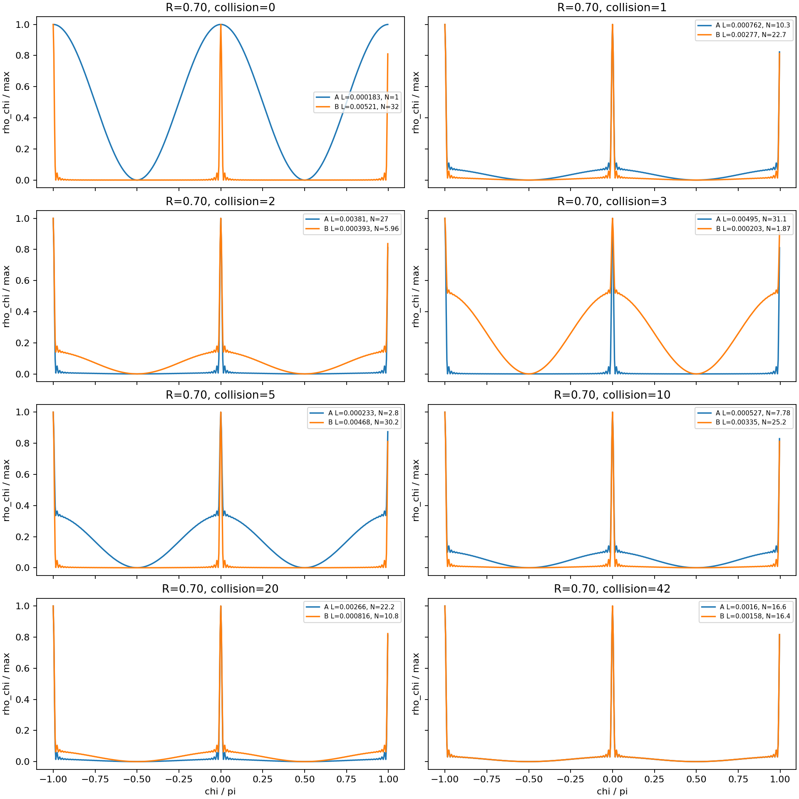
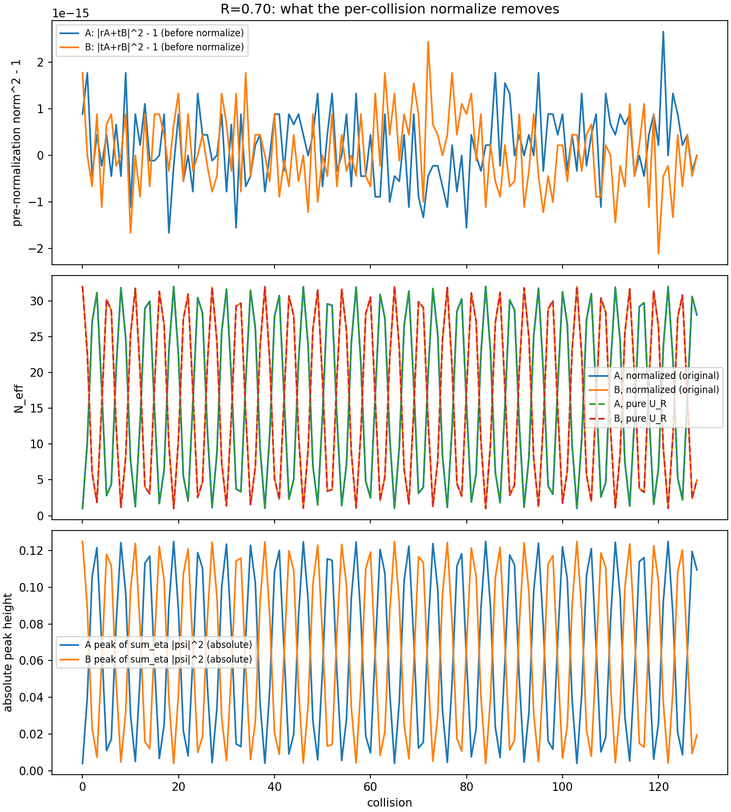

# The Thirteenth Thought Experiment: Why Does a Particle That Has Acquired Mass Not Dissipate and Vanish?
## ― Coherence as a Relation, Harmonic Exchange of Localized Waves, Internal Clocks and Particle Lifetimes Considered from a Single Interaction ―

**Author:** Noriaki Kihara  
**ORCID:** 0009-0004-6753-4020  
**Version DOI:** 10.5281/zenodo.23266251  
**Concept DOI:** 10.5281/zenodo.23266250  
**Version:** v1.0  
**Date:** 2026-10-10  
**Related papers:** Twelfth Thought Experiment [S1], double slit with localized waves [S2], earlier two-wave exchange experiment [S3], finite-order resonance [S4], exchange weight [S5], re-examination of xyztRQ [S6], re-run of the earlier experiment [S7]

**Keywords:** coherence, decoherence, observation, wave-packet collapse, harmonics, localization, scattering, reversible exchange, periodic closure, internal clock, Lorentz contraction, mass, quasi-stationary state, particle lifetime

---

# Abstract

This thought experiment began with a naive question about classifying wave-packet collapse and decoherence as separate phenomena. Taking experience with laser holography as a clue, it asks whether coherence is not an absolute attribute of a single wave but differs according to the partner wave in the interaction, the harmonic structures of both, their phases and the readout conditions. A localized wave built from aligned high harmonics forms a sharp peak, but the spatiotemporal alignment it needs with another localized wave is extremely strict. Even when interference with a monochromatic wave can be read, overlap with an equally localized wave is limited to very narrow conditions.

Next, consider a localized wave colliding with a monochromatic background wave. Even if the background is initially monochromatic, the high harmonics of the localized wave can be distributed to the background by scattering. A new question then arises: even if a particle acquires some mass-like response through interaction with the background, does it not at the same time keep losing harmonics and decay? Looking again at the author's earlier closed two-wave scattering experiment, localization was not lost in one direction but was redistributed back and forth between the two waves. A change that looks locally like dissipation may therefore be a reversible circulation of the whole system.

If this circulation closes stably, finite periodicity $U^n=I$ may be observed **as a result**. We do not impose $U^n=I$ first as a law of interaction in order to explain stability. Rather, we examine which localized states can survive under the actual interaction, and ask whether periodic closure, phase locking, quasi-stationarity and lifetimes appear as results. We further consider whether the temporal readout of this circulation can correspond to an internal clock delay, and the spatial readout to the localization width and Lorentz contraction.

The "background" in this paper is not a container with places, times and a number of waves. It refers to the anonymous part of the total state that has not yet been distinguished by interaction readouts (§4). If background and particle are not separate entities, particle species may be names for conserved quantities of the interaction. This question is left at the end (§14).

This paper is a **thought experiment that formulates verification tasks** arising from a reinterpretation of existing numerical experiments. It is not a paper that completes derivations of mass, the Lorentz metric, quantum energy levels or the lifetimes of real particles.

---

# 0. Starting Point and Causal Order

In the previous Twelfth Thought Experiment [S1], without giving physical names such as time, mass or charge in advance, we asked whether the apparent physics changes according to the axes from which the same state and interaction are read. Here we bring that question back to a concrete two-wave interaction and the localization of harmonics.

The most important caution in the discussion is that **$U^n=I$ is a result, not a cause**.

The order of examination is

$$
\begin{gathered}
\text{redistribution of harmonics and phases by a given interaction}\\
\downarrow\\
\text{stability selection: which localized states can persist}\\
\downarrow\\
\text{results: quasi-stationarity, circulation, finite lifetime}\\
\downarrow\\
\text{read whether periodic closure and integer-ratio phase locking occur}\\
\downarrow\\
\text{read the temporal, spatial and mass-like responses of the same state}
\end{gathered}
$$

The arrows describe the order of exploration; they do not mean that all the physical correspondences in the lower rows have been confirmed.

# 1. First Question: For Whom Is Coherence a Property?

The starting point was a question about Hotta's explanation of the many-worlds interpretation, wave-packet collapse and decoherence. We set aside the merits of the quantum measurement problem itself. More basically: in reading what, against what partner, are coherence and decoherence words?

In laser holography, a tiny vibration rapidly disturbs the interference image. But if the phase merely shifts by a fixed amount, the fringes simply move. The case where the phase fluctuates and is averaged during exposure, and the case where the alignment of high harmonics breaks down, must be considered separately.

In the author's earlier thought experiment [S2], it was shown that when a localized wave made of odd harmonics is sent through a double slit, the localized peak interferes as a wave and is read again as a localized peak, while the alignment condition becomes markedly sensitive as the number of harmonics increases. From this, the following question arises.

> Even for the same wave, interference can be read if the partner is monochromatic, while if the partner is also a sharply localized wave, the spatiotemporal window for interaction is extremely narrow. If so, may we speak of coherence as an absolute property of the target wave alone?

Standard wave optics already distinguishes self-coherence and mutual coherence. This paper does not claim that this distinction was unknown. The issue is to **connect it to an interaction that actually exchanges localization**.

# 2. A Single Tone and $10^{60}$ Harmonics: Sharp Windows in Both Space and Time

Consider, for illustration, a one-way travelling wave in which $N$ integer harmonics of a fundamental, including even as well as odd harmonics, are superposed with equal amplitudes and aligned phases.

$$
\Psi_N(x,t)=\frac1N\sum_{h=1}^{N}e^{ih\phi(x,t)},
\qquad \phi(x,t)=k_0x-\omega_0t.
$$

From the finite geometric series, its amplitude is

$$
\Psi_N=e^{i(N+1)\phi/2}
\frac{\sin(N\phi/2)}{N\sin(\phi/2)}.
$$

Within the fundamental period, a very sharp main peak appears near $\phi=0\pmod{2\pi}$. The phase width to the first zero is $2\pi/N$.

$$
\Delta x\sim\frac{\lambda_0}{N},
\qquad
\Delta t\sim\frac{T_0}{N}.
$$

Thus the sharp selectivity due to phase-aligned high harmonics appears **not only in the spatial direction but also in the temporal direction**. However, the one-way travelling wave above is a moving peak along $x-ct$; it does not mean that the three spatial directions and the time direction are localized independently. Implementing three-dimensional localization requires a separate check of how the propagation directions are constructed. Temporal localization by phase alignment of many frequency components is established as laser mode locking [11].

In the discussion we placed the extreme example $N=10^{60}$. Note that this is not a measured number of harmonics of a real particle. For example, if $\lambda_0\sim10^{26}\,\mathrm m$, then $\lambda_0/N\sim10^{-34}\,\mathrm m$, finer even than the atomic scale. The point is not the numerical value of an absolute length but that the localization width shrinks roughly in proportion to $1/N$.

# 3. Second Question: Why Do Two Localized Waves Interfere Poorly?

"The existence of interference", "the visibility of interference" and "the probability of collision or interaction of localized waves" are not synonymous. First, consider the normalized mode overlap when harmonic waves of identical shape overlap with a phase difference $\delta$.

$$
C_N(\delta)=\frac1N\sum_{h=1}^N e^{ih\delta},
\qquad
|C_N(\delta)|^2=
\left[\frac{\sin(N\delta/2)}{N\sin(\delta/2)}\right]^2.
$$

For $N=1$ the magnitude of this overlap does not depend on the phase difference. For $N\gg1$, the overlap drops sharply when the two localized waves are shifted only slightly, and the phase window narrows to $O(1/N)$. On the other hand, if the partner is monochromatic, interference with the common fundamental component can remain. In the full-mode inner product normalized to equal intensity, its magnitude becomes $1/\sqrt N$, so we distinguish the existence of interference from obtaining a strong signal.

Furthermore, $\delta=k_0\Delta x-\omega_0\Delta t$. Whether localized waves actually interact depends not only on the relative phase but also on the locality of the interaction, the place and time of overlap, and the coupling law. The question in this model becomes:

> Before attaching the label "coherent" to a wave, should we not state with which wave, in which temporal and spatial window, and what is read out?

# 4. Third Question: Concretely, What Kind of Wave Is the "Environment"?

## 4.0 How the Word "Background" Is Used

We first fix how the word "background" is used in this and later sections.

At the starting point of this paper there are no spatial coordinates and no time coordinate. There are only the total complex state $Z$ and the interaction

$$
Z'=F(Z).
$$

Hence "where the background wave is" and "when it interacted" cannot be asked before deciding from which relational quantities position and time are read. The background spacetime is not removed afterwards; it is not placed in the first place. The index counting computational updates is not, as it stands, physical time.

Nor can the number of background waves be counted beforehand. The $N$ in $Z=(z_1,\ldots,z_N)$ is the number of components used in the representation, and the count changes when the basis is changed. Two waves can be distinguished only when their interaction responses differ. Likewise, "with which wave it interacted" cannot be asked without names. What we require of the law is covariance under a relabelling $P$ of the components,

$$
F(PZ)=P\,F(Z),
$$

and the rule for choosing interaction partners must not depend on hidden coordinates, orderings or particle labels. What can be observed is determined afterwards by which relations are conserved and which change across the interaction. Observation is not a naming performed afterwards, separately from the interaction.

Therefore the "background" in this paper is not a container with places, times and a count, but a convenient name for the anonymous part of the total state not yet distinguished by interaction readouts. Treating the background below as "a phase-aligned monochromatic complex wave" is the simplest illustrative model of this anonymous part, and does not fix what the background is. The definition of the background itself will be organized in the next paper.

## 4.1 What, Concretely, Is the Environment?

Standard quantum decoherence theory divides the whole into a subsystem $S$ and an environment $E$, and treats the decay of interference terms when the unobserved degrees of freedom are removed by a partial trace [1, 2]. This mathematical procedure is clear. When implementing a thought experiment, however, we must specify **what the environment is, which degrees of freedom interact, and what state change remains**.

First, let the background be a phase-aligned monochromatic complex wave. If the interaction is only a reversible phase rotation of each wave,

$$
A'=Ae^{i\alpha},\qquad B'=Be^{i\beta}.
$$

The amplitudes do not change, while the relational information of relative phase does. But this alone does not newly generate harmonics, radiate them outward, or irreversibly lose phase correlations. **A change in relational information is different from the occurrence of decoherence or dissipation.** The spin echo [12], in which a signal that vanished because phases went out of alignment returns by refocusing, is a classic example of this distinction.

Yet it is also not correct to assert that "nothing happens if the background is monochromatic". The next question changed that view.

# 5. Fourth Question: What If the Background Is Monochromatic but the Particle Has Harmonics?

The particle side $P$ has many harmonics, and the background side $B$ initially has only the fundamental frequency. If a scattering that exchanges high-harmonic components between the two waves acts, the background receives high harmonics.

For illustration, take a linear two-channel exchange for each harmonic $h$,

$$
\begin{pmatrix}p_h'\\b_h'\end{pmatrix}
=
\begin{pmatrix}
\cos\theta&-\sin\theta\\
\sin\theta&\cos\theta
\end{pmatrix}
\begin{pmatrix}p_h\\b_h\end{pmatrix}.
$$

If $b_h(0)=0$ for the high harmonics,

$$
p_h' =p_h\cos\theta,\qquad
b_h'=p_h\sin\theta.
$$

**That the background was monochromatic does not prevent the redistribution of harmonics from particle to background.** Mathematically, no nonlinear operation is needed for the redistribution itself. Readouts of the localized shape or of the density $|\Psi|^2$ are nonlinear quantities, so the apparent change of the waveform can be complicated. This rotation matrix is illustrative. The implementation of the earlier experiment is the complex exchange operator $U_R$ (§6.1), whose eigenvalues are $1$ and $-e^{i\delta}$.

The new question that arose here goes well beyond the initial debate on decoherence.

> Even if interaction with the background changes the phase evolution of a particle and gives it mass-like properties, will the particle not keep leaking high harmonics to the background and eventually lose its localization?

Localized structures that remain without dissipating are already known in nonlinear field theory. Breathers of the sine-Gordon equation [5] and Q-balls [6], localized solutions of a complex field whose internal phase rotates, are examples. These, however, are obtained by assuming specific potentials or symmetries. In the author's earlier experiment [S3] as well, in a closed two-wave exchange without a radiation term, localization did not dissipate but kept going back and forth between the two waves. The question of this paper is whether this non-dissipation, obtained without assuming specific potentials or symmetries, can be reread as a problem of particle stability and lifetime.

# 6. Citing an Earlier Numerical Experiment Again: What Looked Like Leakage Was a Back-and-Forth Exchange

In response to this question, the author presented the closed two-wave scattering experiment of "Does a wave packet shrink by observation, or gather by interaction?" [S3] from July 2026. A is initially a broad low-order wave and B a localized high-order wave; complete transmission, complete reflection and intermediate scattering were compared. The earlier experiment reported that, for intermediate scattering, localization moved between A and B, and that the exchange of localization continued even when the observer was stopped.

**Figure 1.** Original figure of the earlier numerical experiment [S3], which the author presented again during the dialogue of this thought experiment. The figure shown here was re-output by a faithful copy of the original program and is pixel-identical to the original output [S7]. The collision counts shown are $0,1,2,3,5,10,20,42$; the vertical axis is the normalized density readout of each waveform `rho_ch / max`, the horizontal axis is `chi / pi`, and the setting shown is `R=0.70`. Blue is A and orange is B. $R$ is the reflection probability $|r|^2$ of one collision (in the original program $t=e^{i\delta/2}\cos(\delta/2)$, $r=-ie^{i\delta/2}\sin(\delta/2)$, $\delta=2\arcsin\sqrt R$). The numbers below are transcribed from the figure legends. The re-run with a faithful copy of the original program [S7] confirmed that the same values are obtained (§6.1).

| Collisions | effective order of A $N_A$ | effective order of B $N_B$ | sum of shown values |
|---:|---:|---:|---:|
| 0 | 1.0 | 32.0 | 33.0 |
| 1 | 10.3 | 22.7 | 33.0 |
| 2 | 27.0 | 5.96 | 32.96 |
| 3 | 31.1 | 1.87 | 32.97 |
| 5 | 2.8 | 30.2 | 33.0 |
| 10 | 7.78 | 25.2 | 32.98 |
| 20 | 22.2 | 10.8 | 33.0 |
| 42 | 16.6 | 16.4 | 33.0 |

The effective orders $N_A,N_B$ are the harmonic orders averaged with the weights of each wave's harmonic distribution, $N_{\rm eff}=\sum_n n\,w_n$.

The author further interpreted the phase progression beyond the figure as follows: "at some stage the two waveforms become the same, pass a position corresponding to 180 degrees of the phase cycle, and at 360 degrees separate back into the original two waves".

This back-and-forth exchange has already been treated in the author's later papers [S5] and [S4], as a sweep of the reflectance $R$ and as an eigenvalue analysis of the two-channel exchange operator.

What matters here is that **a temporary decrease of harmonics seen from the particle side can no longer be interpreted directly as irreversible dissipation**. That apparent coherence collapses and then revives is known even in a simple quantum model [3].

## 6.1 What the Re-run of the Original Program Confirmed

The original program of Figure 1 (the 2026-07-13 preliminary experiment of [S3]) was copied without changing a single character and re-run, and the state at each collision was recorded [S7].

**Control.** The output of the copy was identical to the original output in all 6163 CSV rows and in the verdict JSON, and the seven output figures, including Figure 1, were pixel-identical.

**The normalization does nothing.** The update of the original program is

$$
a_{k+1}=\mathrm{normalize}(r\,a_k+t\,b_k),\qquad b_{k+1}=\mathrm{normalize}(t\,a_k+r\,b_k).
$$

A ($q=+1$, identification oscillation $m=1$) and B ($q=-1$, $m=2$) are orthogonal (overlap $|\langle a,b\rangle|$ at most $5.4\times10^{-15}$), and the deviation from 1 of each squared norm before normalization was at most $2.7\times10^{-15}$. The update is therefore the pure exchange operator $U_R=\begin{pmatrix}r&t\\t&r\end{pmatrix}$ itself; removing the normalization changes $N_{\rm eff}$ by at most $3.6\times10^{-14}$. This recursive map has no dissipation term, and the total power of each wave stays at 1.

**The peak height changes.** Figure 1 draws each line scaled to a maximum of 1. The peak of the density $\sum_\eta|\psi|^2$, not divided by its total, is

| Collisions | peak of A | peak of B |
|---:|---:|---:|
| 0 | 0.0039 | 0.1250 |
| 1 | 0.0402 | 0.0887 |
| 2 | 0.1056 | 0.0233 |
| 3 | 0.1216 | 0.0073 |
| 5 | 0.0109 | 0.1180 |
| 10 | 0.0304 | 0.0985 |
| 20 | 0.0867 | 0.0422 |
| 42 | 0.0648 | 0.0642 |

and varies by a factor of about 30, between about 0.004 and 0.125, while the total power of each wave stays at 1. When localization moves to the partner, the wave spreads with its power conserved and its peak goes down.

**The sum of effective orders is exactly 33.** For all collisions 0 to 128,

$$
N_A(k)=1+31\sin^2\frac{k\omega}{2},\qquad N_A(k)+N_B(k)=33,\qquad \omega=\pi+2\arcsin\sqrt R,
$$

held (maximum difference from the closed form $1.5\times10^{-12}$, from the sum 33 $7.1\times10^{-14}$). $\omega$ is the phase difference between the two eigenvalues $1$ and $-e^{i\delta}$ of $U_R$, and $\sin^2(k\omega/2)$ is the fraction that has moved to the partner by the $k$-th collision. A (order 1) and B (odd harmonics 1 to 63, mean order 32) mix in this fraction, so the sum is conserved. The fraction moved in the first collision is $\sin^2(\omega/2)=1-R=0.30$, indistinguishable from the transmittance $T$.

**Reading 180 and 360 degrees.** Read in terms of the exchange phase $k\omega$, the two waves are equally divided at $k\omega\equiv90^\circ,270^\circ$ ($N_A=N_B=16.5$), completely interchanged at $k\omega\equiv180^\circ$, and back at $k\omega\equiv360^\circ$. The values $N_A=16.6$, $N_B=16.4$ at collision 42 are near the equal division. For $R=0.70$, however, $\omega/2\pi=0.8155\ldots$ is irrational ($\cos\delta=1-2R=-0.4$ is not a value that gives $U^n=I$), and an exact return does not occur. Within 128 collisions the closest approach to a return is collision 103, with exchange phase $358.55^\circ$ and a fraction $1.6\times10^{-4}$ remaining on the partner side. An exact return occurs only when $R$ lies on a finite-order root $R_{n,m}=\cos^2(\pi m/n)$ [S4].

**Figure 2.** Result of recording collisions 0 to 128 with a faithful copy of the original program of Figure 1 [S7]. Top: the amount removed by the normalization at each collision (squared norm before normalization − 1, at the level of rounding error). Middle: effective orders $N_A,N_B$ (solid: original update; dashed: pure $U_R$ without normalization; they overlap). Bottom: absolute peak height of the density not divided by its total. Data: `検証_R070交換の正規化と振幅_20261009/results/trace_renormalized_R070.csv`, `trace_pure_unitary_R070.csv`, `summary.json`; recording program: `検証_R070交換の正規化と振幅_20261009/measure_normalization_trace.py`.

# 7. Fifth Question: Is $U^n=I$ Not a Result Rather Than a Cause?

In the illustrative two-channel rotation model,

$$
S(\theta)^k=
\begin{pmatrix}
\cos(k\theta)&-\sin(k\theta)\\
\sin(k\theta)&\cos(k\theta)
\end{pmatrix}.
$$

If $n\theta=2\pi m$ (integer $m$) for some $n$,

$$
S^n=I.
$$

So harmonics can move once to the partner and, after several exchanges, return.

But **if $S^n=I$ is imposed as the first assumption, periodic return is a matter of course**. That explains neither stability nor quantization. This paper asks the reverse: why does a system driven by a given exchange law close, or not close?

In particular, we distinguish the following three.

1. **Apparent recovery:** the normalized density waveform returns to a similar shape.
2. **State recovery:** the complex amplitudes of both A and B, all harmonics, phases and the pre-normalization scale return to their initial values.
3. **Finite order of the operator:** $U^n=I$ holds for all allowed states.

Neither 2 from 1 nor 3 from 2 follows automatically. For example, if only one initial state lies on a periodic orbit, the whole operator need not have finite order. Periodic closure is **to be confirmed as a computational result**.

In the implementation of the earlier experiment the update is $U_R$ itself on the two-dimensional space spanned by the two waves, so state recovery and finite order of the operator on that space reduce to the same condition $(-e^{i\delta})^n=1$. $R=0.70$ does not satisfy it (§6.1).

# 8. Sixth Question: As What Is a Non-dissipating Internal Circulation Observed?

Suppose the particle exchanges harmonics with the background and the same localized peak can be read repeatedly from outside. Then, even with no dissipation overall, a **circulation required for the exchange with the background** exists inside the particle. The question the author raised here is:

> Is what looked like the acquisition of mass an apparent delay of an internal clock caused by this circulation?

The "clock" in this question is not an ideal clock given a time axis from outside in advance. It is a period read from the relative phases of interacting complex waves and the recurrence of the localized peak. For example, compare the readout phases of a free wave $F$ and a localized wave $P$ with circulation, and examine how

$$
\Delta\varphi(k)=\varphi_P(k)-\varphi_F(k)
$$

accumulates with interaction steps. The recurrence period of the localized peak, the phase rotation of each mode and the recovery period of the full state are not necessarily the same.

We must not conclude that "the clock is necessarily delayed because there is circulation". The sign, size and comparison reference of the delay should be determined from the actual interaction and readout map.

The idea of attaching an internal period to matter goes back to de Broglie [7], and the idea of associating mass with a localized structure of a field appears in Wheeler's geon [10]. De Broglie, however, gave the internal period from a known mass, whereas this paper asks the reverse direction: reading a mass-like response from internal circulation.

# 9. Seventh Question: Does the Spatial Metric Not Change at the Same Time?

Next the author added an important correction. Clock delay alone is a one-sided correspondence with relativity. In special relativity, the delay of proper clocks and the contraction of length in the direction of motion are contained in the same Lorentz transformation.

$$
\Delta\tau=\frac{\Delta t}{\gamma},\qquad
L=\frac{L_0}{\gamma},\qquad
\gamma=(1-v^2/c^2)^{-1/2}.
$$

However, entering these formulas into a computer program does not **derive** relativity. Building on the observation maps examined in the Twelfth Thought Experiment [S1], this paper proposes to read separately the temporal phase period and the spatial localization width from the same harmonic-exchange state, and to check whether they **move together by the same function** when the relative motion is changed.

We do not immediately identify "the internal clock due to circulation with the background" with "velocity-dependent time dilation". Moreover, claiming **the acquisition of mass** requires, beyond the change of the clock, correspondence with the momentum–energy relation, inertial response and so on. At the present stage, mass is a hypothetical reading name.

# 10. Eighth Question: Why Phase Locking at Integer Ratios?

If waves that can exist stably close with a finite period as a result, integer ratios may appear between several phase rotations. If two rotations return exactly with a common period $T$,

$$
\omega_1T=2\pi p,\qquad
\omega_2T=2\pi q,
\quad p,q\in\mathbb Z,
$$

and therefore

$$
\frac{\omega_1}{\omega_2}=\frac pq.
$$

But **integer ratios must not be given from the start**. Moreover, in a closed reversible system, quasi-periodic motion with an irrational ratio can also persist without dissipation. For integer ratios to be selected as stable states, an actual open path, coupling or stabilizing mechanism that removes non-aligned states is needed. A precedent for treating phase locking not as a condition given at the start but as a result of the dynamics is the synchronization of coupled oscillators [13].

The inference this paper wants to test is:

> Among waves exchanging harmonics through interaction, there are states that can circulate and states that pass localized components to paths that do not return. If the latter are lost and only the former are observed for a long time, are not integer-ratio phase locking and discrete quasi-stationary states apparently selected?

Here "phase locking" is not a cause but **a result that may appear after stability selection**.

# 11. Ninth Question: Why Do Particles with Lifetimes Exist?

Here the author pointed out that not only stable particles but also particles with finite lifetimes actually exist. Therefore not only fully closing states but also incomplete circulations and quasi-stationary states must be treated in the same framework.

Schematically, we can distinguish

- **Stable localized states:** even as the exchange between object and background continues, the property of being read as a localized wave persists.
- **Metastable localized states:** maintained for a long time, but leaking to other degrees of freedom through a slight coupling.
- **Short-lived states:** redistributing the localized structure in a short time to other waves or several particle states.

Evaluating a decay that looks irreversible requires a model that includes whether components that went to external channels return. A purely closed two-wave exchange alone generally cannot derive exponential particle lifetimes or decay rates. Bound states in the continuum, where radiation is suppressed by interference even though radiating paths exist [4], their counterpart under periodic driving [9], and long-lived localized oscillations that keep radiating slightly (oscillons) [8] are precedents for quantitatively comparing the stable and the metastable.

If the survival probability $P(t)$ of a localized state approximately follows $e^{-t/\tau}$, $\tau$ can be read as a lifetime. Standard quantum theory has the correspondence $\Gamma_E\simeq\hbar/\tau$ between resonance linewidth and lifetime, but this formula is not used as a starting assumption of this model. The goal is first to see whether a distribution of lifetimes emerges from the interaction, and then to compare with known relations.

This also connects to the question of quantum energy levels. However, **there is as yet no result that integer-ratio phase locking, discrete energies and decay lifetimes have been reproduced from the same numerical model**.

# 12. Verification Method: Do Not Embed the Conclusion in the Initial Conditions

To turn this thought experiment into computation, the verification needs the following order.

## 12.1 First Reproduce the Old Experiment

Using **the same interaction matrix, state representation and readout as the implementation of the time** of the earlier two-wave exchange experiment [S3], reproduce the waveforms at `R=0.70` and collision counts $0,1,2,3,5,10,20,42$. Recheck the controls of complete transmission and complete reflection. Identify the definition of the effective-order indicators $N_A,N_B$ in Figure 1.

**In this paper, the experiment was re-run with a faithful copy of the original program [S7].** Data and figures all matched the original output; the definition and closed form of $N_{\rm eff}$, the action of the normalization and the absolute peak heights are given in §6.1. The procedure and package of the re-run are in `検証_R070交換の正規化と振幅_20261009/README.md`, `run_all.sh` and `SHA256SUMS`.

Note that $R$ in the old experiment is an input value, and its periodicity is fixed in advance by the eigenvalues of the exchange operator [S4]. To verify $U^n=I$ as a result, a separate model that determines the mixing angle from the interaction is therefore needed.

## 12.2 Track the Complex State Itself, Not Only the Waveform

Record the complex coefficients $p_h(k),b_h(k)$ of each harmonic at each step, and the difference from the initial state

$$
\varepsilon(k)=
\frac{\|\Psi(k)-\Psi(0)\|}{\|\Psi(0)\|}.
$$

Compute separately the difference with only the global phase removed, so as not to confuse it with the exact difference. Record **separately** candidate indicators corresponding to the norm, the square closure and the energy. Do not judge "$U^n=I$" from agreement of normalized density waveforms alone.

## 12.3 Compare Repeated Exchange with the Same Background and Leakage to New Background

Compare a closed condition in which reversible exchange is repeated between the same two waves with an open condition in which components can be transferred to new background degrees of freedom at each step. In the latter, keep the state of the new background channels explicitly in the computational model, and do not casually erase components that disappeared from the object. Observe leakage to the background, re-inflow and the lifetime of the localized peak at the same time.

## 12.4 Measure Phase Locking Afterwards

Without restricting exchange angles or periods to rational numbers, sweep the initial phases and coupling parameters and measure the phase advance rates of localized solutions that remain for a long time. Examine whether long-surviving solutions accumulate near integer ratios, and whether non-aligned quasi-periodic solutions also survive long. **Do not give integer ratios in advance as a setting.**

## 12.5 Read Time and Space Independently and Compare Afterwards

For each localized solution, obtain the change of relative phase against an external reference wave (the internal clock) and the readout of spatial localization width and direction of motion. Without changing the interaction, compare afterwards whether the changes with relative motion are consistent with the Lorentz metric. Do not embed $\gamma$ from the start.

## 12.6 Falsifiable Conditions

If the following occur, the strong expectations of this thought experiment are restricted or denied.

1. Even under closed repeated interaction, the full complex state does not return and leaks monotonically outward.
2. Stable localized states are generally quasi-periodic, and no selection by integer-ratio phase locking appears.
3. Stable harmonic circulation is found, but no internal clock delay appears, or it does not move together with the spatial readout.
4. The relation between readable mass-like responses and dissipation, circulation and localization width is inconsistent with the features of existing real particles.

# 13. What This Thought Experiment Has Confirmed and Not Yet Confirmed

| Item | Status at present |
|---|---|
| Phase alignment of high harmonics creates a sharp localized peak and narrows the alignment tolerance | Mathematical consequence of the finite harmonic sum. Theme of earlier work [S2] |
| Mutual interference properties change with the partner wave and readout conditions | Can be organized mathematically as wave optics |
| Existing harmonics of a localized wave move to a monochromatic background | Possible in the two-channel exchange model. Nonlinear action is not required |
| In intermediate scattering, localization between A and B is redistributed oscillatorily | Based on the earlier numerical experiment [S3] and Figure 1 |
| A closed two-wave exchange has no dissipation; each wave's total power is conserved while its peak height changes | Confirmed by the re-run of the original program [S7]. The normalization acts only at the level of rounding error |
| The sum of effective orders $N_A+N_B=33$ is conserved | Confirmed by the re-run [S7]. $N_A=1+31\sin^2(k\omega/2)$ holds for collisions 0–128 to $10^{-12}$ |
| Equal division at exchange phase $k\omega=90^\circ$, interchange at $180^\circ$, return at $360^\circ$ | Confirmed by the re-run [S7]. $R=0.70$ is not a finite-order root, so no exact return occurs |
| $U^n=I$ arises as a result of the interaction | Central hypothesis. Finite order of the whole operator is unproven |
| Circulation produces a mass-like delay of the internal clock | Untested new hypothesis |
| Lorentz contraction is obtained from the same circulation | Untested. Joint derivation of time and space needed |
| Integer-ratio phase locking, levels and particle lifetimes arise from stability selection | Untested. Numerical experiments including open channels needed |

# 14. The Question That Remains Next: Are Particle Species Reading Names of Conserved Quantities?

Treating the background in §4.0 as an anonymous part raises another question. If background and particle are not separate entities, where do particle species come from?

Returning to the author's earlier examination of axis signs [S6], the signs can be considered not binary but ternary,

$$
\sigma_i\in\{-1,0,+1\}.
$$

$0$ does not mean that the component is absent but that it is not made to contribute to the inner product of that readout. Writing the internal state for illustration as $v=(t,R,Q_1,Q_2,Q_3)$, a readout candidate is

$$
\mathcal R_\sigma(v)=\sigma\cdot v=\sum_{i=1}^{5}\sigma_iv_i.
$$

This is an interpretive example treating 3 of the 8 directions as spatial readouts; it is not a proposal to input named axes $xyz$ or $t,R,Q_i$ into the universal interaction. The formal number of combinations of three values over five components, $3^5=243$, does not mean a number of particles either. It is merely a symbolic count before considering the anonymity of axes, the dynamics and the equivalence relations due to observational indistinguishability.

The order considered here is:

$$
\boxed{\begin{array}{c}
\text{universal interaction}
\longrightarrow
\text{conserved / non-conserved relations}
\\
\longrightarrow
\text{distinction by interaction}
\longrightarrow
\text{reading name: particle species}
\end{array}}
$$

Rather than making particle species an input of the interaction, we ask what is conserved under the same interaction and whether that conservation relation becomes distinguishable through interaction with other states.

The first thing to check is whether the existing universal interaction $F$ has a sign-conserving property. No new conservation law is added. Using the existing $F$ as it is, we examine whether

$$
\boxed{\mathcal I(F(Z))=\mathcal I(Z)}
$$

holds for an invariant $\mathcal I$ representing the sign of rotation axes or the relative sense of rotation. If it holds, the interaction itself has a conservation structure before periodicity or particle species are assumed.

Further, sign conservation and the stability of a localized structure may be separate conditions. When a particle decays and changes into another group of particles, the localized structure breaks, but the overall conservation relation of rotation signs may be maintained. If so, a way opens to treat stable and unstable particles in one framework. The question of lifetimes in §11 is then placed on top of this distinction.

However, which of charge, spin or particle species this sign corresponds to must be determined from interaction and observation. Sign conservation, the correspondence with particle species, and the physical meaning of the rotation and distribution among 6 directions are, at the present stage, tasks for verification.

> Is it not that particle species are not conserved as such, but that particle species appear distinguishable as a result of reading out the conserved quantities of the universal interaction?

---

# 15. Conclusion: Does Being Able to Exist Stably Come First?

This dialogue began with the question of how to define decoherence. The important turning point, however, was reaching the question: **if a localized particle's harmonics move to a monochromatic background, why does the particle not keep dissipating?** Here the meaning of the earlier two-wave exchange experiment changed.

Passing harmonics to the background in one scattering does not mean that information is lost from the whole system. In a closed system those harmonics can return to the particle. If there is periodic circulation, the particle's localized structure can be maintained; if there is a path leaking out of the circulation, a quasi-stationary state can have a lifetime.

Then stability, periodicity, integer-ratio phase locking, internal clocks, spatial localization, and even mass and particle lifetime, several reading names, may not be mutually unrelated principles but different faces of one problem: **which properties of the same interaction can exist for a long time**.

But here the order must not be mistaken.

$$
\boxed{\begin{array}{c}
\text{It is not stable because it has a period.}
\\
\text{First there is the interaction; ask what remains stable.}
\\
\text{If periods or integer ratios appear, they are results.}
\end{array}}
$$

If the Twelfth Thought Experiment was an attempt "not to give names of physical quantities first", the Thirteenth Thought Experiment is an attempt "**not to give periodicity conditions or mass first**". Common to both is the principle of not pushing properties that could be read back into the starting point.

## The Last Question

> When a monochromatic background wave and a localized harmonic wave interact without imposing any special periodicity condition, **if we select only the states that can exist stably**, can the period of those states, the delay of the internal clock, spatial localization, integer-ratio phase locking and the presence or absence of a finite lifetime all be read out at the same time?

---

# Reproducing the Figures

Figures 1 and 2 are outputs of the program of the earlier experiment. Running `検証_R070交換の正規化と振幅_20261009/run_all.sh` performs, in order, the run of the copy identical character by character to the 0713 original (control, about 5.5 minutes) and the run of the recording program, and regenerates both figures. The results of the comparison with the original output are in `README.md` in the same folder (Python 3.9.6, numpy 2.0.2, matplotlib 3.9.4, no random numbers).

| Figure | File | Generated by |
|--|--|--|
| 1 | `figures/fig01_exchange_R070_waveform_evolution.png` | output `exchange_scattering_matrix_R070_waveform_evolution_v1.png` of `検証_R070交換の正規化と振幅_20261009/original_copy/run_exchange_scattering_matrix_fermionic_localization_transfer_preliminary_v1.py` |
| 2 | `figures/fig02_normalization_trace_R070.png` | output `results/normalization_trace_R070.png` of `検証_R070交換の正規化と振幅_20261009/measure_normalization_trace.py` |

---

**Note:** This paper is a thought experiment and clearly distinguishes the earlier numerical experiment on the exchange of localization by interaction from the newly proposed hypotheses on mass, the Lorentz metric, levels and lifetimes. The earlier numerical experiment was re-run with a faithful copy of the original program, and the output was confirmed to match [S7].

- §4.0 and §14 integrate into the main text the content recorded as appendix v0.1 from the latter half of the same day's dialogue (the author's questions on the place, time, count and interaction partners of the background, and the examination of sign conservation of the universal interaction). They contain no new numerical experiment, proof or establishment of a conservation law.
- Figure 1 is the **figure of the earlier numerical experiment** presented by the author during the dialogue. §6.1 and Figure 2 are based on the re-run [S7], in which that original program was copied without changing a character, its output compared with the original, and the states of collisions 0 to 128 recorded. No new computation of mass or lifetime was performed.
- Among the formulas, the finite harmonic sum, the real two-channel rotation and the overlap are illustrative analytical models. The exchange operator of the earlier experiment's implementation was identified in §6.1.
- External references [3]–[13] were integrated into the main text from the list of external prior work compiled the same day (`external_references_thought_experiment_13_ja_v1.0.md`). Not all sections of each reference were read closely.

---

# Record of AI Involvement

- **ChatGPT** (2026-10-09): drafting of the first version from the dialogue with the author (reconstruction in the order in which ideas arose; structure, distinction of formulas, explicit statement of untested items).
- **Claude** (2026-10-09 to 10): rewriting §6 as a re-citation of the author's own paper; adding self-citations [S4]–[S6]; integrating the appendix into the main text (§4.0, §14); citing external references [3]–[13] in the main text; correcting sentences in §5 and §12.1; re-running the earlier experiment with a faithful copy of the original program and recording it ([S7], §6.1, Figure 2); organizing the section structure and format; English translation. The posing of the problems, the correction of the main causal order, the ideas of stability selection and of mass and lifetime, the provision of the existing figure, and design and judgement are the author's.

---

# References

## This research series

[S1] Noriaki Kihara, **The Twelfth Thought Experiment: From the Fine-Structure Constant to Observation Maps and Gauge Symmetry**, v1.0 (2026-10-08). DOI: https://doi.org/10.5281/zenodo.23226259 . Manuscript: `thought_experiment_12_observation_mapping_gauge_symmetry_ja_v1.0.md` (in the Twelfth Thought Experiment folder under the same parent folder).

[S2] Noriaki Kihara, **The mystery of the double slit: neither observation nor "wave-packet collapse" was needed? — A particle-like lump of waves interferes as a wave and appears as a particle** (in Japanese), note (2026-06-29). https://note.com/kiharanoriaki/n/n65be6bf06c9b . DOI of the localized-wave version of the original study: https://doi.org/10.5281/zenodo.21035831 .

[S3] Noriaki Kihara, **Does a wave packet shrink by observation, or gather by interaction?** (in Japanese), note (2026-07-13). https://note.com/kiharanoriaki/n/nbc6649e30af3 . Concept DOI of the original study: https://doi.org/10.5281/zenodo.21333766 ; Version DOI: https://doi.org/10.5281/zenodo.21333768 .

[S4] Noriaki Kihara, **Discovery of finite-order resonances in repeated exchange scattering — identifying the cause of peaks near the fine-structure constant 137 and 128 and a reproducible wave-packet mathematical model** (in Japanese), v1 (2026-07-18). Concept DOI: https://doi.org/10.5281/zenodo.21421366 ; Version DOI: https://doi.org/10.5281/zenodo.21421367 .

[S5] Noriaki Kihara, **Selection of the exchange weight G_R=1-R and numerical experiments on candidates corresponding to the fine-structure constant** (in Japanese), v1 (2026-07-15). Concept DOI: https://doi.org/10.5281/zenodo.21396760 ; Version DOI: https://doi.org/10.5281/zenodo.21396761 .

[S6] Noriaki Kihara, **Re-examination of the six-dimensional encoding xyztRQ — thought-experiment notes toward the next paper** (in Japanese), v4 (2026-04-30). Concept DOI: https://doi.org/10.5281/zenodo.19902677 ; Version DOI: https://doi.org/10.5281/zenodo.19904714 .

[S7] Noriaki Kihara, **Verification: normalization and amplitude in the R=0.70 recursive exchange** (2026-10-09, in the same folder as this paper). `検証_R070交換の正規化と振幅_20261009/`: faithful copy of the original program `original_copy/run_exchange_scattering_matrix_fermionic_localization_transfer_preliminary_v1.py` and its output (control), recording program `measure_normalization_trace.py`, data `results/trace_renormalized_R070.csv`, `trace_pure_unitary_R070.csv`, `control_vs_original_snapshots.csv`, `summary.json`, figure `results/normalization_trace_R070.png`, `README.md`, `run_all.sh`, `SHA256SUMS`. Included in the Zenodo record of this paper (10.5281/zenodo.23266251) as `verification_R070_exchange_20261009.zip`.

## External references

[1] W. H. Zurek, *Decoherence, einselection, and the quantum origins of the classical*, Reviews of Modern Physics **75**, 715–775 (2003). https://doi.org/10.1103/RevModPhys.75.715 .

[2] M. Schlosshauer, *Decoherence, the measurement problem, and interpretations of quantum mechanics*, Reviews of Modern Physics **76**, 1267–1305 (2005). https://doi.org/10.1103/RevModPhys.76.1267 .

[3] J. H. Eberly, N. B. Narozhny, J. J. Sánchez-Mondragón, *Periodic spontaneous collapse and revival in a simple quantum model*, Physical Review Letters **44**, 1323 (1980). https://doi.org/10.1103/PhysRevLett.44.1323 .

[4] H. Friedrich, D. Wintgen, *Interfering resonances and bound states in the continuum*, Physical Review A **32**, 3231–3242 (1985). https://doi.org/10.1103/PhysRevA.32.3231 .

[5] K. Maki, H. Takayama, *Quantum-statistical mechanics of extended objects. II. Breathers in the sine-Gordon system*, Physical Review B **20**, 5002 (1979). https://doi.org/10.1103/PhysRevB.20.5002 .

[6] S. Coleman, *Q-balls*, Nuclear Physics B **262**, 263–283 (1985). https://doi.org/10.1016/0550-3213(85)90286-X .

[7] L. de Broglie, *Waves and quanta*, Nature **112**, 540 (1923). https://doi.org/10.1038/112540a0 .

[8] G. Fodor, *A review on radiation of oscillons and oscillatons*, arXiv:1911.03340 (2019). https://doi.org/10.48550/arXiv.1911.03340 .

[9] S. Longhi, G. Della Valle, *Floquet bound states in the continuum*, Scientific Reports **3**, 2219 (2013). https://doi.org/10.1038/srep02219 .

[10] J. A. Wheeler, *Geons*, Physical Review **97**, 511 (1955). https://doi.org/10.1103/PhysRev.97.511 .

[11] H. A. Haus, *Mode-locking of lasers*, IEEE Journal of Selected Topics in Quantum Electronics **6**, 1173–1185 (2000). https://doi.org/10.1109/2944.902165 .

[12] E. L. Hahn, *Spin echoes*, Physical Review **80**, 580–594 (1950). https://doi.org/10.1103/PhysRev.80.580 .

[13] Y. Kuramoto, *Self-entrainment of a population of coupled non-linear oscillators*, Lecture Notes in Physics **39**, 420–422 (1975). https://doi.org/10.1007/BFb0013365 .
