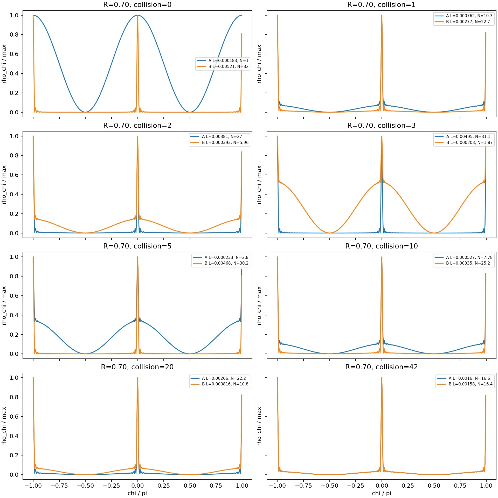

# 第十三思考実験：質量を獲得した粒子は、なぜ散逸して消滅しないのか？
## ――コヒーレンスの関係性、局在波の倍音交換、内部時計、粒子寿命を一つの相互作用から考える――

**著者：** 木原範昭（Noriaki Kihara）  
**ORCID：** 0009-0004-6753-4020  
**版：** 思考実験稿 v0.1（未査読・未DOI）  
**日付：** 2026年10月9日  
**系列：** 第十二思考実験「微細構造定数から観測写像とゲージ対称性へ」に続く第十三思考実験  
**キーワード：** コヒーレンス、デコヒーレンス、観測、波束収縮、倍音、局在、散乱、可逆交換、周期閉包、内部時計、ローレンツ収縮、質量、準定常状態、粒子寿命

---

# 要旨

本思考実験は、波束収縮とデコヒーレンスを別々の現象として分類することへの素朴な疑問から始まった。レーザーホログラフィーの経験を手掛かりに、コヒーレンスは波単体の絶対的属性ではなく、相互作用する相手の波、両者の倍音構造、位相、そして読み出し条件によって異なるのではないか、と問い直す。高次倍音を整列させた局在波は鋭いピークを作る反面、別の局在波との時空間的な整列条件が非常に厳しい。単音波との干渉が読める場合でも、同程度に局在した波との重なりはごく狭い条件に限られる。

次に、単音の背景波に局在波が衝突した場合を考える。背景が最初は単音であっても、局在波の高次倍音は散乱によって背景側に配分され得る。すると、粒子が背景との相互作用によって何らかの質量様応答を獲得するとしても、同時に倍音を失い続けて崩壊しないのか、という新しい疑問が生じる。ここで過去の閉じた二波散乱実験を見直すと、局在性は一方向へ失われるのではなく二つの波の間を振動的に再配分されていた。したがって、局所的に散逸と見える変化が、全体系では可逆な循環である可能性がある。

この循環が安定に閉じるなら、その**結果として**有限周期性 $U^n=I$ が観察され得る。$U^n=I$ を相互作用則として先に課して安定性を説明するのではない。むしろ、どの局在状態が実際の相互作用で存続できるかを調べ、周期閉包、位相ロック、準定常性、寿命が結果として現れるかを問う。さらに、この循環の時間方向の読み出しが内部時計の遅れ、空間方向の読み出しが局在幅やローレンツ収縮に対応し得るかを検討する。

本稿でいう「背景」は、場所・時刻・波の数を持つ容器ではない。全体の状態のうち、相互作用の読み出しによってまだ区別されていない無名の部分を指す（§4）。背景と粒子が別々の実体でないなら、粒子の種類は相互作用の保存量の読み名かもしれない。この問いを最後に残す（§15）。

本稿は既存の数値実験の再解釈から生じた**検証課題を定式化する思考実験**である。質量、ローレンツ計量、量子エネルギー準位、実粒子の寿命の導出を完了した論文ではない。

---

# 0. 出発点と因果順序

前回の第十二思考実験 [S1] では、あらかじめ時間・質量・電荷などの物理的名称を与えず、同じ状態と相互作用をどの軸から読み出すかで見かけの物理が変わる可能性を問うた。本稿ではそれを、具体的な二波相互作用と倍音の局在性に戻して検討する。

議論の中で最も重要な注意は、**$U^n=I$ は原因ではなく結果である**という点である。

検討する順序は、

$$
\begin{gathered}
\text{与えられた相互作用による倍音・位相の再配分}\\
\downarrow\\
\text{どの局在状態が持続できるかという安定性の選別}\\
\downarrow\\
\text{準定常・循環・有限寿命という結果}\\
\downarrow\\
\text{周期閉包と整数比の位相ロックの有無を読む}\\
\downarrow\\
\text{同じ状態の時間・空間・質量様応答を読む}
\end{gathered}
$$

とする。ここに書いた矢印は研究の探索順序であり、下段の物理的対応がすべて確認されたという意味ではない。

# 1. 第一の疑問：コヒーレンスとは誰にとっての性質か

発端は、堀田氏による多世界解釈・波束収縮・デコヒーレンスの解説に対する疑問だった。量子測定問題そのものの是非は一旦脇へ置く。より基本的に、コヒーレンスやデコヒーレンスは、何を相手に、何を読み出すときの言葉なのか。

レーザーホログラフィーでは、微小な振動で干渉像が急激に乱れる。しかし位相が一定量ずれるだけなら、干渉縞は移動するだけである。露光中に位相が変動して平均化される場合や、高次倍音の整列が崩れる場合を分けて考える必要がある。

著者による先行思考実験 [S2] では、奇数倍音による局在波を二重スリットへ与えると、局在したピークが波として干渉し、再び局在したピークとして読まれる一方、倍音数の増加に伴って整列条件が著しく鋭敏になることが示された。ここから、次の問いが生まれる。

> 同じ波でも、相手が単音なら干渉を読め、相手も鋭い局在波なら相互作用可能な時空間の窓が極端に狭い。そうであれば、コヒーレンスを対象波だけの絶対的性質として語ってよいのか。

なお、標準の波動光学にも自己コヒーレンスと相互コヒーレンスの区別がある。本稿はその区別自体が未知だったと主張しない。問題は、それを**実際に局在性を交換する相互作用へ接続する**ことである。

# 2. 単音と $10^{60}$ 倍音：空間にも時間にも鋭い窓ができる

奇数倍音だけでなく偶数倍音も含め、基本波の整数倍音を $N$ 本、等振幅・整列位相で重ねた、説明用の一方向進行波を考える。

$$
\Psi_N(x,t)=\frac1N\sum_{h=1}^{N}e^{ih\phi(x,t)},
\qquad \phi(x,t)=k_0x-\omega_0t.
$$

その振幅は有限等比級数から、

$$
\Psi_N=e^{i(N+1)\phi/2}
\frac{\sin(N\phi/2)}{N\sin(\phi/2)}
$$

となる。基本周期の中では、$\phi=0\pmod{2\pi}$ の近傍に非常に鋭い主ピークが現れる。第一零点までの位相幅は $2\pi/N$ である。

$$
\Delta x\sim\frac{\lambda_0}{N},
\qquad
\Delta t\sim\frac{T_0}{N}.
$$

したがって、位相を整列させた高次倍音による鋭い選択性は**空間方向だけでなく時間方向にも**現れる。ただし上式の一方向進行波は $x-ct$ に沿う移動ピークであり、空間三方向と時間方向を互いに独立に局在させることまで意味しない。三次元的な局在の実装には伝播方向の構成を別途確かめる必要がある。

議論では $N=10^{60}$ という極端な例を置いた。これが実粒子の倍音数という測定結果ではないことに注意する。例えば $\lambda_0\sim10^{26}\,\mathrm m$ なら $\lambda_0/N\sim10^{-34}\,\mathrm m$ となり、原子スケールよりもさらに微細である。主張の要点は絶対長さの数値ではなく、局在幅が概ね $1/N$ に比例して縮むことにある。

# 3. 第二の疑問：二つの局在波は、なぜ干渉しにくいのか

「干渉の存在」「干渉の可視度」「局在波の衝突・相互作用確率」は同義ではない。まず、同一形状の倍音波が位相差 $\delta$ で重なる場合の、正規化したモード重なりを考える。

$$
C_N(\delta)=\frac1N\sum_{h=1}^N e^{ih\delta},
\qquad
|C_N(\delta)|^2=
\left[\frac{\sin(N\delta/2)}{N\sin(\delta/2)}\right]^2.
$$

$N=1$ ならこの重なりの絶対値は位相差に依存しない。$N\gg1$ では、二つの局在波がわずかにずれるだけで重なりが急減し、位相窓は $O(1/N)$ に狭まる。一方、相手が単音なら、共通の基本周波数成分との干渉は残り得る。等強度に規格化した全モード内積ではその大きさが $1/\sqrt N$ になるので、干渉が存在することと強い信号が得られることは区別する。

さらに $\delta=k_0\Delta x-\omega_0\Delta t$ である。局在波同士が実際に相互作用するかどうかは、相対位相だけでなく相互作用の局所性、重なる場所・時刻、結合則による。このモデルでの問いは次のようになる。

> 波に「コヒーレント」という札を貼る前に、どの波と、どの時間・空間窓で、何を読み出すのかを明示すべきではないか。

# 4. 第三の疑問：「環境」は具体的にどのような波なのか

## 4.0 「背景」という語の扱い

本節以降でいう「背景」について、先に扱いを定めておく。

本稿の出発点には、空間座標も時間座標もない。あるのは全体の複素状態 $Z$ と相互作用

$$
Z'=F(Z)
$$

だけである。したがって「背景の波がどこにあるか」「いつ相互作用したか」は、位置と時刻をどの関係量から読むかを定める前には問えない。背景時空は後から取り除くのではなく、最初から置かない。計算の更新回数を示す添字も、そのまま物理的な時間ではない。

背景の波の数も、先には数えられない。$Z=(z_1,\ldots,z_N)$ の $N$ は表現に用いた成分の個数であり、基底を取り替えれば数え方は変わる。二つの波を区別できるのは、相互作用の応答が異なるときだけである。同様に、「どの波と相互作用したか」も名前なしには問えない。法則に求めるのは、成分の名前の付け替え $P$ に対する共変性

$$
F(PZ)=P\,F(Z)
$$

であり、作用の相手を選ぶ規則も、隠れた座標・順序・粒子ラベルに依存してはならない。何が観測できるかは、相互作用の前後でどの関係が保存され、どの関係が変化したかによって後から決まる。観測は、相互作用とは別に後から行う名前付けではない。

したがって本稿の「背景」は、場所・時刻・個数を持つ容器ではなく、全体の状態のうち相互作用の読み出しによってまだ区別されていない無名の部分を指す便宜上の呼び名である。以下で背景を「位相のそろった単音の複素波」として扱うのは、この無名の部分の最も簡単な説明用モデルであり、背景の正体を定めるものではない。背景の定義そのものは次稿で整理する。

## 4.1 環境は具体的に何か

標準的な量子デコヒーレンス理論では、全体系を部分系 $S$ と環境 $E$ に分け、観測しない自由度を部分跡で除いた際の干渉項の減衰を扱う [1, 2]。この数学的手続きは明確である。一方、思考実験を実装するときには、**環境が何で、どの自由度が相互作用し、どんな状態変化が残るのか**を指定しなければならない。

まず背景を、位相がそろった単音の複素波とする。相互作用が各波の可逆な位相回転だけなら、

$$
A'=Ae^{i\alpha},\qquad B'=Be^{i\beta}.
$$

振幅は変わらず、相対位相という関係情報は変わる。しかし、それだけで倍音が新しく生成されたり、外部へ放射されたり、位相相関が不可逆に失われたりするわけではない。**関係情報が変わることと、デコヒーレンスや散逸が起こることは別である。**

ここで「単音の背景なら何も起きない」と言い切るのも正しくない。次の問いが、その見方を変えた。

# 5. 第四の疑問：背景が単音でも、粒子の側が倍音ならどうなるか

粒子側 $P$ が多数の倍音を持ち、背景側 $B$ は最初は基本周波数だけを持つ。二波間に高次倍音成分を交換する散乱が作用すれば、背景は高次倍音を受け取る。

説明用に、各倍音 $h$ に対する線形二チャネル交換を

$$
\begin{pmatrix}p_h'\\b_h'\end{pmatrix}
=
\begin{pmatrix}
\cos\theta&-\sin\theta\\
\sin\theta&\cos\theta
\end{pmatrix}
\begin{pmatrix}p_h\\b_h\end{pmatrix}
$$

と置くと、高次倍音について $b_h(0)=0$ なら、

$$
p_h' =p_h\cos\theta,\qquad
b_h'=p_h\sin\theta.
$$

**背景が単音だったことは、粒子から背景への倍音再配分を妨げない。** 数式上、倍音再配分そのものには非線形演算は不要である。局在形状や密度 $|\Psi|^2$ の読み出しは非線形な量なので、見かけの波形変化は複雑になり得る。なお、この回転行列は機構の説明用であり、先行実験の実装と同一であると確認したものではない。

ここで発生した新しい疑問は、最初のデコヒーレンス論争から大きく進んでいる。

> 背景との相互作用が粒子の位相発展を変え、質量様の性質をもたらすとしても、粒子は高次倍音を背景へ流出させ続け、いずれ局在を失ってしまうのではないか。

# 6. 過去の数値実験の再引用：流出に見えたものは往復交換だった

この疑問に対し、著者は2026年7月の「波束は、観測で縮むのか。それとも相互作用で集まるのか」[S3] の閉じた二波散乱実験を提示した。A は初期に広域の低次数波、B は局在した高次数波で、完全透過・完全反射・中間散乱を対照した。先行実験では、中間散乱の場合にAとBの間で局在性が移り、観測機を止めても局在性の交換は継続したと報告されている。

**図1.** 著者が本思考実験の対話中に再提示した先行数値実験の原図。表示された衝突回数は $0,1,2,3,5,10,20,42$、縦軸は各波形の規格化された密度読出し `rho_ch / max`、横軸は `chi / pi`、設定表示は `R=0.70` である。青はA、橙はB。図の $R$ が散乱行列のどのパラメータに対応するかは、この画像だけでは確定しない。以下の数値は図の凡例からの転記であり、原データの再計算ではない。

| 衝突回数 | A の有効次数 $N_A$ | B の有効次数 $N_B$ | 表示値の和 |
|---:|---:|---:|---:|
| 0 | 1.0 | 32.0 | 33.0 |
| 1 | 10.3 | 22.7 | 33.0 |
| 2 | 27.0 | 5.96 | 32.96 |
| 3 | 31.1 | 1.87 | 32.97 |
| 5 | 2.8 | 30.2 | 33.0 |
| 10 | 7.78 | 25.2 | 32.98 |
| 20 | 22.2 | 10.8 | 33.0 |
| 42 | 16.6 | 16.4 | 33.0 |

有効次数の和が約33で推移することは、**少なくとも図に記された指標が二波の間で再配分されている**ことを示唆する。ただし、この和が厳密な保存量であるか、エネルギー・ノルムに対応するかは、指標の定義と全複素振幅の再検算なしには断定できない。

著者はさらに、図の先の位相進行について「ある段階で二つの波形が同じになり、位相循環の180度に相当する位置を経て、360度で元の二波へ分離して戻る」と解釈した。図に直接示されたのは42回までの**密度波形**である。180度・360度に関する完全復帰の主張は、元の複素状態配列を用いて改めて照合すべき検証対象として記録する。

この往復交換は、著者の後続論文 [S5]・[S4] で、反射率 $R$ の掃引と二チャネル交換作用素の固有値解析として既に扱われている。

ここで重要なのは、**粒子側から見た一時的な倍音の減少を、そのまま不可逆な散逸と解釈できなくなった**ことである。

# 7. 第五の疑問：$U^n=I$ は原因ではなく結果ではないか

二チャネル回転の説明モデルなら、

$$
S(\theta)^k=
\begin{pmatrix}
\cos(k\theta)&-\sin(k\theta)\\
\sin(k\theta)&\cos(k\theta)
\end{pmatrix}.
$$

ある $n$ に対して $n\theta=2\pi m$（整数 $m$）なら、

$$
S^n=I
$$

となる。したがって、倍音は一旦相手へ移り、何度か交換した後、元へ戻り得る。

しかし**$S^n=I$ を最初の仮定として課せば、周期的に戻るのは当然**である。それでは安定性も量子化も説明したことにならない。本稿は逆に、与えられた交換則で動かした系がどうして閉じるのか、あるいは閉じないのかを問う。

とくに次の三つは区別する。

1. **見かけの回復：** 規格化密度波形が似た形に戻る。
2. **状態の回復：** A・B両方の複素振幅、全倍音、位相、規格化前のスケールが初期値に戻る。
3. **演算子の有限位数：** 全ての許される状態に対して $U^n=I$ が成り立つ。

1から2、2から3は自動的には導けない。例えば初期状態一つが周期軌道に乗るだけなら、演算子全体が有限位数である必要はない。周期閉包は**計算結果として確認する**。

# 8. 第六の疑問：散逸しない内部循環は、何として観測されるか

粒子が背景と倍音を交換し、外からは同じ局在ピークを繰り返し読み出せるとする。すると、全体として散逸がなくても、粒子の内部には**背景との交換に要する循環**が存在する。著者がここで指摘したのは次の問いである。

> 質量獲得に見えていたものは、この循環による見かけ上の内部時計の遅れではないか。

この問いでいう「時計」は、外から先に時間軸を与えた理想時計ではない。相互作用する複素波同士の相対位相と、局在ピークの再現によって読める周期である。例えば自由波 $F$ と循環を持つ局在波 $P$ の読み出し位相を比較し、

$$
\Delta\varphi(k)=\varphi_P(k)-\varphi_F(k)
$$

が相互作用ステップに対してどう蓄積するかを調べる。ただし、局在ピークの再出現周期、各モードの位相回転、全状態の復帰周期は互いに同じとは限らない。

ここで「循環があるから必ず時計が遅れる」と結論してはいけない。遅れの符号、大きさ、比較対象は、実際の相互作用と読み出し写像から決定されるべきである。

# 9. 第七の疑問：空間方向の計量も同時に変わるのではないか

次に著者は重要な訂正を加えた。時計の遅れだけでは、相対論との対応として片手落ちである。特殊相対論では、固有時計の遅れと運動方向の長さの収縮は同じローレンツ変換に含まれる。

$$
\Delta\tau=\frac{\Delta t}{\gamma},\qquad
L=\frac{L_0}{\gamma},\qquad
\gamma=(1-v^2/c^2)^{-1/2}.
$$

ただし、上式を計算プログラムへ入力すれば相対論を**導出**したことにはならない。第十二思考実験 [S1] で検討した観測写像を踏まえ、本稿では、同じ倍音交換状態から時間方向の位相周期と空間方向の局在幅を別々に読み出し、相対運動条件を変えた際に**同じ関数で連動するか**を確かめることを提案する。

「背景との循環による内部時計」と「速度に依存する時間の遅れ」を直ちに同一視しない。また、**質量の獲得**を主張するには、時計の変化に加えて、運動量・エネルギー関係、慣性応答などへの対応が必要になる。現在の段階では質量は仮説的な読み名である。

# 10. 第八の疑問：なぜ整数比で位相ロックするのか

安定して存在できる波が、結果として有限周期で閉じるなら、複数の位相回転の間に整数比が現れる場合がある。二つの回転が共通の周期 $T$ で厳密に戻るなら、

$$
\omega_1T=2\pi p,\qquad
\omega_2T=2\pi q,
\quad p,q\in\mathbb Z,
$$

したがって、

$$
\frac{\omega_1}{\omega_2}=\frac pq.
$$

しかし、**整数比を最初から与えてはいけない**。また、閉じた可逆系なら無理数比の準周期運動も散逸なしに存続できる。整数比が安定状態として選別されるには、非整列状態を失わせる実際の開放経路、結合、または安定化機構が必要である。

本稿が試したい推論は次の通りである。

> 相互作用で倍音を交換する波には、循環できる状態と、戻らない経路へ局在成分を渡す状態がある。後者が失われ、前者だけが長期間観測されるなら、見かけ上、整数比の位相ロックと離散的な準定常状態が選ばれるのではないか。

ここでは「位相ロック」は原因ではなく**安定性選別の後に現れる可能性のある結果**である。

# 11. 第九の疑問：なぜ寿命のある粒子が存在するのか

ここで著者は、安定粒子ばかりでなく有限寿命の粒子が実際に存在することを指摘した。したがって、完全に閉じる状態だけでなく、不完全な循環や準定常状態も同じ枠組みで扱う必要がある。

模式的には、

- **安定な局在状態：** 対象と背景の交換が継続しても、局在波として読み出される性質が持続する。
- **準安定な局在状態：** 長時間保たれるが、わずかな結合によって他の自由度へ流出する。
- **短寿命の状態：** 局在構造を短時間で別の波・複数の粒子状態へ再配分する。

と区別できる。不可逆に見える減衰を評価するには、外部チャネルへ出た成分が戻るかどうかまで含めたモデルが必要である。純粋な閉じた二波交換だけでは一般に、指数的な粒子寿命や崩壊率は導出できない。

局在した状態の残存率 $P(t)$ が近似的に $e^{-t/\tau}$ に従えば、$\tau$ を寿命として読むことができる。標準量子理論では共鳴線幅と寿命の対応 $\Gamma_E\simeq\hbar/\tau$ があるが、この式を本モデルの出発仮定には用いない。目標はまず相互作用から寿命の分布が現れるかを確かめ、その後に既知の関係と比較することである。

これは量子エネルギー準位の問いにも接続する。ただし、**整数比位相ロック、離散エネルギー、崩壊寿命が同じ数値モデルから再現された、という結果はまだ無い**。

# 12. 検証方法：結論を初期条件へ埋め込まない

ここまでの思考実験を計算に落とすなら、検証には次の順序が必要である。

## 12.1 まず旧実験を再現する

過去の二波交換実験 [S3] の**当時の実装と同じ相互作用行列・状態表現・読み出し**を使い、`R=0.70`、衝突回数 $0,1,2,3,5,10,20,42$ の波形を再現する。完全透過・完全反射の対照も再確認する。図1の有効次数指標 $N_A,N_B$ の定義を特定する。

**本稿で再実行は行っていない。** 図1は既存結果の再掲である。

## 12.2 波形だけでなく、複素状態そのものを追跡する

各回の各倍音の複素係数 $p_h(k),b_h(k)$ と、初期状態からの差

$$
\varepsilon(k)=
\frac{\|\Psi(k)-\Psi(0)\|}{\|\Psi(0)\|}
$$

を記録する。全体位相だけを除いた差も、厳密な差と混同しないよう別途算出する。ノルム、二乗閉塞、エネルギーに相当する候補指標を**別々に**記録する。規格化された密度波形の一致だけで「$U^n=I$」と判定しない。

## 12.3 同一背景への反復交換と、新しい背景への流出を比較する

同じ二波間で可逆な交換を反復する閉じた条件と、毎回新しい背景自由度に成分を移せる開放条件を比較する。後者では新しい背景チャネルの状態を計算モデルに明示して保持し、対象から消えた成分を安易に消去しない。背景への流出、再流入、局在ピークの寿命を同時に観測する。

## 12.4 位相ロックを後から測定する

交換角や周期を有理数に制限せず、初期位相や結合パラメータを掃引し、長時間残る局在解の位相進行率を測る。残存時間が長い解で整数比近傍への集積があるか、非整列な準周期解も長寿命で残るかを調べる。**整数比を設定として先に与えない。**

## 12.5 時間と空間を独立に読み、後から比較する

各局在解について、外部基準波との相対位相変化（内部時計）と、空間的な局在幅・運動方向の読み出しを求める。同一の相互作用を変更せず、相対運動に応じた変化がローレンツ計量と整合するかを後から比較する。$\gamma$ を最初から埋め込まない。

## 12.6 反証可能な条件

以下が起きれば、この思考実験の強い予想は制限または否定される。

1. 閉じた反復相互作用でも、全複素状態が戻らず単調に外部へ流出する。
2. 安定な局在状態が一般に準周期的で、整数比の位相ロックによる選別が現れない。
3. 安定な倍音循環は見つかるが、内部時計の遅れは現れない、または空間方向の読み出しと連動しない。
4. 読み出し可能な質量様応答と、散逸・循環・局在幅の関係が、既存の実粒子の特徴と整合しない。

# 13. 本思考実験で確認できたこと／まだ確認していないこと

| 項目 | 現段階での位置づけ |
|---|---|
| 高次倍音の位相整列から鋭い局在ピークができ、整列許容幅が狭まる | 有限倍音和からの数学的帰結。先行研究 [S2] の主題 |
| 相手波と読み出し条件により相互干渉特性が変わる | 波動光学として数学的に整理可能 |
| 単音背景へ局在波の既存倍音が移る | 二チャネル交換モデルで可能。非線形作用は必須でない |
| 中間散乱でA・B間の局在性が振動的に再配分される | 過去の数値実験 [S3] と図1に基づく |
| 有効次数指標 $N_A+N_B$ が約33で推移する | 図1の凡例値についての観察。厳密保存則とは未同定 |
| 180度で二波が等しく、360度で完全復帰する | 著者による過去実験の解釈。全複素状態の再検証が必要 |
| $U^n=I$ が相互作用の結果として生じる | 中心仮説。演算子全体での有限位数は未証明 |
| 循環が質量様の内部時計の遅れを作る | 未検証の新しい仮説 |
| 同じ循環からローレンツ収縮が得られる | 未検証。時間・空間の共同導出が必要 |
| 安定性の選別から整数比位相ロック、準位、粒子寿命が生じる | 未検証。開放チャネルを含む数値実験が必要 |

# 14. 結論：安定して存在できることが、先にあるのではないか

今回の対話は、デコヒーレンスをどう定義するかという疑問から始まった。しかし重要な転換点は、**単音背景へ局在粒子の倍音が移れば、粒子はなぜ散逸し続けないのか**という問いに到達したことである。ここで、以前の二波交換実験の意味が変わった。

一回の散乱で背景へ倍音が渡ることは、全体系から情報が失われることではない。閉じた系ではその倍音は再び粒子へ戻り得る。周期的な循環があれば粒子の局在構造は維持され得るし、循環から外れて流出する経路があれば準定常状態には寿命があり得る。

すると、安定性、周期性、整数比の位相ロック、内部時計、空間的な局在、さらには質量や粒子寿命という複数の読み名は、互いに無関係な原理ではなく、**同じ相互作用のどの性質が長く存在できるか**という一つの問題の異なる面かもしれない。

しかし、そこで順序を取り違えてはいけない。

$$
\boxed{
\text{周期があるから安定なのではない。}
\\
\text{まず相互作用があり、何が安定に残るかを問う。}
\\
\text{周期や整数比が現れるなら、それは結果である。}
}
$$

第十二思考実験が「物理量の名前を先に与えない」試みだったとすれば、第十三思考実験は「**周期条件や質量を先に与えない**」試みである。両者に共通するのは、読めた性質を出発点へ遡って押し込まないという原則である。

## 最後の問い

> 単音の背景波と局在した倍音波を、何も特別な周期条件を課さずに相互作用させたとき、**安定して存在できる状態だけを選び出せば**、その状態の周期、内部時計の遅れ、空間的局在、整数比位相ロック、そして有限寿命の有無は、すべて同時に読み出せるのだろうか？

---

# 15. 次に残る問い：粒子の種類は保存量の読み名か

§4.0 で背景を無名の部分として扱ったことから、もう一つの問いが生じる。背景と粒子が別々の実体でないなら、粒子の種類はどこから来るのか。

著者の先行する軸符号の検討 [S6] に戻ると、符号は二値ではなく三値

$$
\sigma_i\in\{-1,0,+1\}
$$

として考えられる。$0$ は成分が存在しないことではなく、その読み出しの内積に寄与させないことを意味する。説明のために内部状態を $v=(t,R,Q_1,Q_2,Q_3)$ と書けば、読み出しの候補は

$$
\mathcal R_\sigma(v)=\sigma\cdot v=\sum_{i=1}^{5}\sigma_iv_i
$$

である。これは 8 方向のうち 3 方向を空間的読み出しとして扱う解釈上の例であり、万能相互作用に $xyz$ や $t,R,Q_i$ という名前付きの軸を入力する提案ではない。三値五成分の形式的な組合せ数 $3^5=243$ も粒子数を意味しない。軸の無名性、動力学、観測上の区別不能性による同値関係を考える前の記号的な数にすぎない。

ここで考える順序は次である。

$$
\boxed{
\text{万能相互作用}
\longrightarrow
\text{保存・非保存の関係}
\longrightarrow
\text{相互作用による区別}
\longrightarrow
\text{粒子種という読み名}
}
$$

粒子の種類を相互作用の入力にするのではなく、同じ相互作用のもとで何が保存され、その保存関係が他の状態との相互作用で区別可能になるかを問う。

最初に確かめるべきことは、既存の万能相互作用 $F$ に符号を保存する性質があるかである。新しい保存則を追加するのではない。既存の $F$ をそのまま用い、回転軸の符号、あるいは相対的な回転方向を表す不変量 $\mathcal I$ について

$$
\boxed{\mathcal I(F(Z))=\mathcal I(Z)}
$$

が成り立つかを調べる。成り立つなら、周期性や粒子種を仮定する前に、相互作用そのものに保存構造があることになる。

さらに、符号が保存されることと、局在構造が安定することは、別の条件かもしれない。粒子が崩壊して別の粒子群へ変化するとき、局在構造は壊れても、回転符号の全体の保存関係は維持される可能性がある。そうであれば、安定な粒子と不安定な粒子を一つの枠組みで扱う道が開ける。§11 の寿命の問いは、この区別の上に置き直される。

ただし、この符号が電荷・スピン・粒子種のどれに対応するかは、相互作用と観測から決める必要がある。符号の保存、粒子種との対応、6 方向の回転・分配の物理的意味は、現段階では検証課題である。

> 粒子の種類が保存されるのではなく、万能相互作用の保存量を読み出した結果として、粒子の種類が区別可能に見えるのではないか。

---

# 本稿の作成と証拠の範囲

- 本稿は2026年10月9日の木原範昭とChatGPTの対話を基に、**着想が生じた順序を重視して**再構成した思考実験稿である。
- §4.0 と §15 は、同日の対話の後半（背景の所在・時刻・個数・相互作用相手への著者の問いと、万能相互作用の符号保存の検討）を、補遺 v0.1 として記録した内容から本文へ統合したものである。新しい数値実験・証明・保存則の確定を含まない。
- 図1は著者が対話中に提示した**過去の数値実験図**をそのまま添付した。図の元スクリプト・状態配列の再実行、180度／360度の検算、新規の質量・寿命計算は本稿作成時には実施していない。
- 式のうち有限倍音和、二チャネル回転、重なりは**説明用の解析モデル**であり、元の実験プログラムの実装が全て同じ式であると確認したわけではない。
- 本稿の構成・式の区別・未検証事項の明記にはChatGPTが協力した。問題提起、主要な因果順序の訂正、安定性選別と質量・寿命への着想、既存図の提供は著者による。

# 参照資料

## 本研究系列

[S1] 木原範昭, **第十二思考実験：微細構造定数から観測写像とゲージ対称性へ**, v1.0 (2026-10-08). DOI: https://doi.org/10.5281/zenodo.23226259 . 原稿: `thought_experiment_12_observation_mapping_gauge_symmetry_ja_v1.0.md`（同じ親フォルダの第十二思考実験フォルダ）。

[S2] 木原範昭, **二重スリットの謎、観測も「波束の収縮」もいらなかった？──粒子のような波のかたまりが、波として干渉し、粒子のように映る**, note (2026-06-29). https://note.com/kiharanoriaki/n/n65be6bf06c9b . 原研究の局在波版 DOI: https://doi.org/10.5281/zenodo.21035831 .

[S3] 木原範昭, **波束は、観測で縮むのか。それとも相互作用で集まるのか**, note (2026-07-13). https://note.com/kiharanoriaki/n/nbc6649e30af3 . 原研究の Concept DOI: https://doi.org/10.5281/zenodo.21333766 ; Version DOI: https://doi.org/10.5281/zenodo.21333768 .

[S4] 木原範昭, **反復交換散乱における有限位数共鳴の発見——微細構造定数137・128近傍ピークの原因特定と再現可能な波束数理モデル**, v1 (2026-07-18). Concept DOI: https://doi.org/10.5281/zenodo.21421366 ; Version DOI: https://doi.org/10.5281/zenodo.21421367 .

[S5] 木原範昭, **交換重みG_R=1-Rの選別と微細構造定数対応候補の数値実験**, v1 (2026-07-15). Concept DOI: https://doi.org/10.5281/zenodo.21396760 ; Version DOI: https://doi.org/10.5281/zenodo.21396761 .

[S6] 木原範昭, **6次元符号化 xyztRQ の再検討──次論文化に向けた思考実験ノート**, v4 (2026-04-30). Concept DOI: https://doi.org/10.5281/zenodo.19902677 ; Version DOI: https://doi.org/10.5281/zenodo.19904714 .

## 理論的位置づけを確認する外部文献

[1] W. H. Zurek, *Decoherence, einselection, and the quantum origins of the classical*, Reviews of Modern Physics **75**, 715–775 (2003). https://doi.org/10.1103/RevModPhys.75.715 .

[2] M. Schlosshauer, *Decoherence, the measurement problem, and interpretations of quantum mechanics*, Reviews of Modern Physics **76**, 1267–1305 (2005). https://doi.org/10.1103/RevModPhys.76.1267 .

---

**注記：** 本稿は思考実験であり、相互作用による局在性交換の先行数値実験と、そこから新たに提案された質量・ローレンツ計量・準位・寿命の仮説を明確に区別する。論文公開前には元コードの再現実験と全複素状態での検証が必要である。
