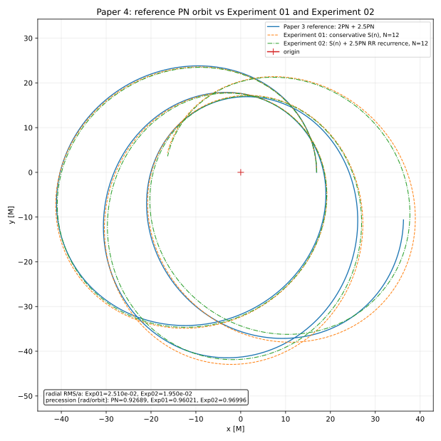
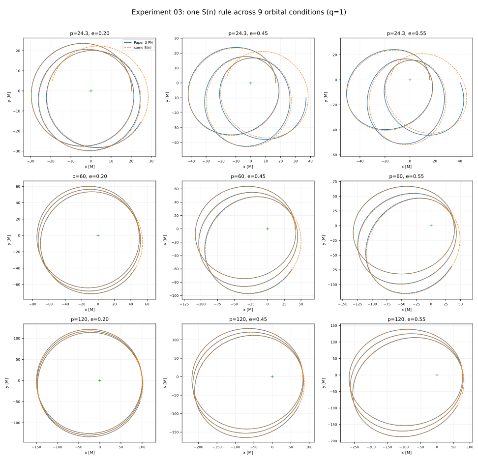
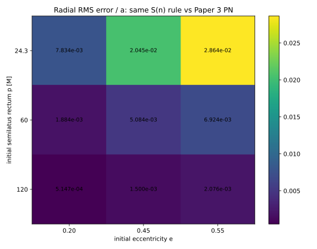
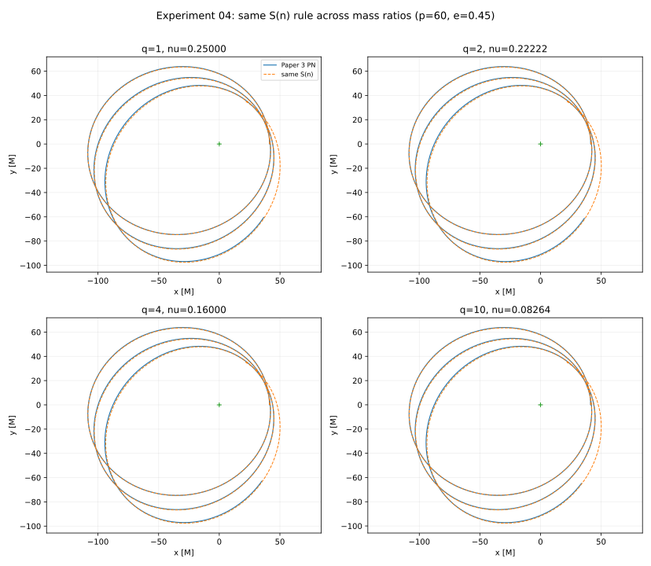
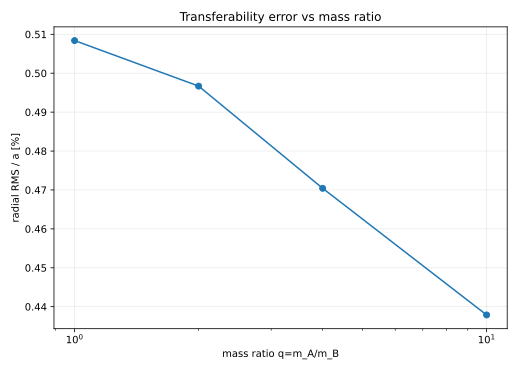
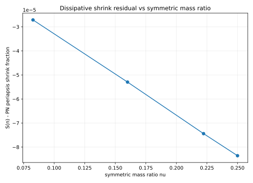

# The Fourth Thought Experiment: From a Fixed Action $S$ to a State-Dependent Action $S_n$
## - Can the Relativistic Gravitational Orbits Computed Externally in the Third Thought Experiment Be Regenerated from the Sequential Interaction $X_{n+1}=S_nX_n$? -

**Author:** Noriaki Kihara  
**ORCID:** 0009-0004-6753-4020  
**Version DOI:** 10.5281/zenodo.22919788  
**Concept DOI:** 10.5281/zenodo.22919787  
**Version:** v1.0  
**Date:** 2026-09-23

---

## Abstract

This paper starts from an inconsistency left between the second and the third thought experiments. In the second thought experiment, a fixed action $S$ was applied repeatedly to an internal state $X_n$ made of two values of undetermined meaning, and inverse-square orbits were generated from a product readout and an area clock. In the third thought experiment the direction was reversed: two-body orbits were computed externally with known Newtonian mechanics and the post-Newtonian approximation, and it was verified whether the mass ratio, the relative distance and the relative time could be read out from the observational data. That method confirmed the readout capability, but the most important part, the generation of the orbit itself, remained in the known equations of gravity.

This paper therefore examines whether the relativistic orbits given from outside in the third thought experiment can again be generated from the sequential interaction of internal states. With one and the same fixed action $S$, keeping the state representation and the readout of this paper, it becomes necessary to bring processing-dependent information in from outside the action in order to represent at the same time the periastron advance that depends on the orbital position and the change of the orbital elements by radiation reaction. As the minimal generalization, the action itself is made a function of the present relational state:

$$
X_{n+1}=S_nX_n,
\qquad
S_n=\mathcal S(\mathcal R_n),
\qquad
\det S_n=1
$$

Here $n$ is not a physical time but a processing step, and the physical time $t$ is read out separately from the state sequence.

For the conservative part, the Darwin parameterization of bound Schwarzschild orbits was used, and its angular progression was constructed as a recurrence to arbitrary order. In addition, the same 2.5PN radiation reaction as in the third thought experiment was added as a local update of the orbital elements $p_n,e_n$. For the first strong-field condition, adding the radiation reaction improved the normalized radial RMS error against the reference PN orbit from 2.51 per cent to 1.95 per cent.

Next, without changing the generating rule of $S_n$, it was applied to nine conditions with $p=24.3,60,120$ and $e=0.20,0.45,0.55$. The normalized radial RMS errors over the nine cases have median 0.508 per cent, mean 0.832 per cent and maximum 2.864 per cent, and the agreement improved systematically in weaker fields. Furthermore, fixing $p=60,e=0.45$ and comparing the mass ratios $m_A/m_B=1,2,4,10$, the normalized radial RMS error stayed in the range 0.508 per cent to 0.438 per cent, and the periastron shrinkage by radiation reaction was about 92 per cent of the PN reference in all conditions. In every experiment $|\det S_n-1|$ stayed within floating-point precision.

This paper does not derive general relativity from $S_n$. Nor does it claim the state-dependent discrete update itself as a new mathematical formalism. What is shown is the feasibility and the transferability: by the minimal extension from a fixed action $S$ to a state-dependent action $S_n$, one and the same generating rule of the action can represent, as internal state updates, a family of gravitational orbits with precession, dissipation, different orbital shapes and different mass ratios.

**Keywords:** state-dependent map, discrete interaction, gravitational orbits, Schwarzschild orbits, post-Newtonian approximation, radiation reaction, periastron advance, thought experiment

---

# 0. Position of this paper

This paper is the fourth thought experiment under the research project design [0].

In the second thought experiment [1], for the internal state

$$
X_n=\begin{pmatrix}a_n\\b_n\end{pmatrix}
$$

a fixed invertible linear action $S$ was used, and from the state update

$$
X_{n+1}=SX_n
$$

the position

$$
Y_n=\Phi(X_n)
=\begin{pmatrix}
a_n^2-b_n^2\\
2a_nb_n
\end{pmatrix}
$$

and the area clock were read out, generating inverse-square motion. The structure was

$$
\boxed{
\text{internal state}
\rightarrow
\text{interaction}
\rightarrow
\text{orbit}
}
$$

In the third thought experiment [2], this direction was reversed. Orbits were computed from the known Newtonian two-body problem and the post-Newtonian equations of motion including the 1PN and 2PN conservative terms and the 2.5PN radiation reaction, and it was examined whether the mass ratio, the relative distance, the relative time and other quantities could be read out from the orbit and the gravitational-wave observations alone. The structure was

$$
\boxed{
\text{known gravity model}
\rightarrow
\text{orbit}
\rightarrow
\text{observation}
\rightarrow
\text{readout of the state}
}
$$

The third thought experiment confirmed that several physical quantities can be read out from a strong-field two-body orbit. But from the aim of this research series, one dissatisfaction remains with that method.

$$
\boxed{
\text{The orbit itself is not generated from an internal interaction.}
}
$$

The generation of the most complex motion is still outsourced to the known post-Newtonian equations.

The question of the fourth thought experiment is therefore simple.

$$
\boxed{
\text{Can the gravitational orbits computed externally in the third thought experiment}
\\
\text{be brought back to an internal interaction of the form }
X_{n+1}=S(X_n)?
}
$$

From that examination, the $S_n$ of this paper arose.

In this paper the labels are used with the following meaning.

| Label | Meaning |
|---|---|
| [Principle] | Philosophical principle maintained in the research series |
| [Design assumption] | Assumption made for the implementation at the present stage; may be removed later |
| [Construction] | Procedure that builds $S_n$ explicitly using known formulas |
| [Numerical] | Result confirmed by numerical experiment |
| [Cross-check] | Comparison with known physics; not a derivation from first principles |

---

# 1. The question

The question verified in this paper is the following.

$$
\boxed{
\text{Using a state-dependent sequential action }S_n,
\\
\text{can different families of relativistic gravitational orbits be generated from one and the same generating rule?}
}
$$

What matters here is not to fit an individual orbit with high accuracy.

For one given orbit, computing $S_n$ backwards step by step does allow a sequence of maps that reproduces that orbit to be constructed. That alone does not amount to obtaining an interaction law.

The criterion of this paper is therefore

$$
\boxed{
\text{whether, with the same }\mathcal S\text{ fixed, it can be transferred to a family of orbits by changing the initial conditions only}
}
$$

In what follows this is called **transferability**.

---

# 2. Why go from a fixed action $S$ to $S_n$

## 2.1 The fixed action of the second thought experiment

In the second thought experiment [1],

$$
X_{n+1}=SX_n
$$

was used, applying the same $S$ at every processing step. $S$ is an invertible linear map, and from the conservation of the area readout

$$
\det S=1
$$

was used.

From this fixed action, an inverse-square orbit was obtained through the quadratic position readout and the area clock.

## 2.2 The problem of applying a fixed $S$ to the orbits of the third thought experiment

The strong-field orbits treated in the third thought experiment [2] have two features that a simple closed Kepler orbit does not have.

The first is the periastron advance. The increment of the azimuthal angle per radial period is not $2\pi$ but depends on the radius and the eccentricity.

The second is the orbital decay by the 2.5PN radiation reaction. As the processing proceeds, the semi-latus rectum $p$ and the eccentricity $e$ themselves change.

If one tries to keep the fixed $S$ while maintaining the state representation and the readout of this paper, these changes must be supplied from outside $S$ at every processing step. Then essentially the same problem remains as giving the orbit from outside in the third thought experiment.

What is claimed here is not an impossibility theorem saying that, even allowing every state space and every readout, a fixed $S$ can never represent relativistic orbits.

What this paper confirmed is

$$
\boxed{
\text{that, while keeping the state representation and the readout of the second thought experiment,}
\\
\text{in order not to supply the orbital changes of the third thought experiment from outside the action,}
\\
\text{removing the fixed condition }S_n=S\text{ is the minimal step.}
}
$$

## 2.3 The state-dependent action

The action itself is therefore made a function of the relational state $\mathcal R_n$ at the processing step $n$.

$$
\boxed{
S_n=\mathcal S(\mathcal R_n)
}
$$

And

$$
\boxed{
X_{n+1}=S_nX_n
}
$$

Here $n$ is **not a physical time**.

$$
\boxed{n=\text{processing step}}
$$

is a discrete index representing the order of the interaction processing. The physical time $t$ is obtained from the clock readout described below.

State-dependent difference equations and discrete maps are themselves a common mathematical form in discrete dynamics [3]. This paper therefore does not claim the mathematical generalization $S\rightarrow S_n$ itself as a novelty.

The point of this paper is that, after a concrete search process in which the fixed action proved insufficient, a known general form of discrete update is adopted as the minimal extension, and the question is whether a family of gravitational orbits can actually be generated from one and the same generating rule of the action.

---

# 3. Internal state, position readout, clock

## 3.1 The two-component internal state

The internal state is taken to be

$$
X_n=
\begin{pmatrix}
a_n\\
b_n
\end{pmatrix}
$$

The observed position is not the state itself; it is defined by the same quadratic readout as in the second thought experiment [1],

$$
\Phi(X_n)
=
\begin{pmatrix}
a_n^2-b_n^2\\
2a_nb_n
\end{pmatrix}
$$

Therefore, writing

$$
x_n=a_n^2-b_n^2,
\qquad
y_n=2a_nb_n,
$$

$$
r_n=a_n^2+b_n^2
$$

one has

$$
x_n^2+y_n^2=r_n^2.
$$

Conversely, putting

$$
X_n=
\sqrt{r_n}
\begin{pmatrix}
\cos(\phi_n/2)\\
\sin(\phi_n/2)
\end{pmatrix}
$$

gives

$$
\Phi(X_n)
=
\begin{pmatrix}
r_n\cos\phi_n\\
r_n\sin\phi_n
\end{pmatrix}.
$$

## 3.2 Separating the processing step from the physical time

In this paper the processing step $n$ is not identified with the physical time $t$.

$$
\boxed{n\neq t}
$$

To discretize the orbit of the conservative system, the processing phase $\chi_n=n\Delta\chi$ is used, but this is not a physical time.

Corresponding to the area clock of the second thought experiment, from numerical experiment 02 on,

$$
\frac{dt}{d\chi}=\frac{r^2}{\sqrt p}
$$

was used as the clock readout.

The physical time interval of one processing step is therefore obtained as

$$
\Delta t_n
\simeq
\frac{r_n^2}{\sqrt{p_n}}\Delta\chi
$$

[Design assumption] In the present implementation the increment $\Delta\chi$ of $\chi_n$ itself is fixed from outside, in order to give a numerical value to the processing order. The problem of generating the increment of $\chi$ itself from internal relations is not treated in this paper.

---

# 4. Construction of an action that keeps $\det S_n=1$

Let the radius and the azimuthal angle of the orbit be $r_n,\phi_n$, and put

$$
\theta_n=\frac{\phi_n}{2}
$$

Let the rotation matrix be

$$
R(\theta)=
\begin{pmatrix}
\cos\theta&-\sin\theta\\
\sin\theta&\cos\theta
\end{pmatrix}
$$

As a frame containing the internal state, take

$$
B_n
=
R(\theta_n)
\begin{pmatrix}
\sqrt{r_n}&0\\
0&1/\sqrt{r_n}
\end{pmatrix}
$$

Then, putting

$$
S_n=B_{n+1}B_n^{-1}
$$

one has

$$
S_n
=
R(\theta_{n+1})
\begin{pmatrix}
\rho_n&0\\
0&\rho_n^{-1}
\end{pmatrix}
R(-\theta_n),
$$

$$
\rho_n=
\sqrt{\frac{r_{n+1}}{r_n}}.
$$

Hence

$$
\boxed{\det S_n=1}
$$

holds at every processing step.

One point must be noted here. The $2\times2$ matrix $S_n$ is not uniquely determined by one state vector $X_n$ and the next state $X_{n+1}$ alone. The $B_n$ above is one gauge choice, completing the second frame direction with the reciprocal amplitude so that $\det B_n=1$.

This paper therefore does not claim that this $S_n$ is the unique fundamental interaction.

What is verified is whether this simple area-preserving construction **can be used without change in all cases**.

---

# 5. Putting conservative relativistic orbits on $S_n$

## 5.1 Bound Schwarzschild orbits

Bound geodesics of the Schwarzschild spacetime can be written, using the Darwin parameter $\chi$ [4], as

$$
r(\chi)=\frac{p}{1+e\cos\chi}
$$

The azimuthal angle progresses as

$$
\frac{d\phi}{d\chi}
=
\sqrt{\frac{p}{p-6-2e\cos\chi}}
$$

that is,

$$
\frac{d\phi}{d\chi}
=
\left[
1-\frac{2(3+e\cos\chi)}{p}
\right]^{-1/2}
$$

Putting

$$
u(\chi)=\frac{3+e\cos\chi}{p}
$$

one has

$$
(1-2u)^{-1/2}
=
\sum_{m=0}^{\infty}c_mu^m
$$

and the coefficients are

$$
c_m=\frac{\binom{2m}{m}}{2^m}
$$

or can be generated to arbitrary order by the recurrence

$$
\boxed{
c_0=1,
\qquad
c_{m+1}=\frac{2m+1}{m+1}c_m
}
$$

At order $N$, putting

$$
g_N(\chi;p,e)
=
\sum_{m=0}^{N}
c_m
\left(
\frac{3+e\cos\chi}{p}
\right)^m
$$

the update is

$$
\phi_{n+1}
=
\phi_n+
\int_{\chi_n}^{\chi_{n+1}}
g_N(\chi;p,e)d\chi
$$

In these numerical experiments

$$
N=12
$$

was used.

## 5.2 The meaning of this construction

At this stage, $r(\chi)$ and $\phi(\chi)$ are constructed from the known Schwarzschild orbit and lifted onto $S_n$.

Therefore, that $S_n$ reproduces the very Schwarzschild orbit it was constructed from is not an independent physical verification.

This is a **construction** showing that

$$
\boxed{
\text{a relativistic orbit can be represented as a sequential action with }\det S_n=1
}
$$

The nontrivial test is what comes after: to compare this same construction, without change, with the finite-mass-ratio PN orbits generated independently in the third thought experiment, and to see whether it transfers when the initial conditions are changed.

---

# 6. Recurrence of $p_n,e_n$ including the radiation reaction

## 6.1 The reference 2.5PN radiation reaction

The reference orbits of the third thought experiment [2] use, in harmonic coordinates, the Newtonian, 1PN and 2PN conservative terms and the 2.5PN radiation reaction. That the theory is conservative up to 2PN and that the first non-conservative effect, the radiation reaction, appears at 2.5PN is standard PN theory [5,7].

In this paper the non-spinning part of the same Kidder [5] expression as in the third thought experiment was used.

$$
\mathbf a_{\rm RR}
=C(A\mathbf n+B\mathbf v),
$$

$$
C=\frac85\nu r^{-3},
$$

$$
A
=\dot r
\left(
18v^2+\frac{2}{3r}-25\dot r^2
\right),
$$

$$
B
=-\left(
6v^2-\frac2r-15\dot r^2
\right),
$$

where

$$
\nu=\frac{m_Am_B}{(m_A+m_B)^2}
$$

## 6.2 The minimal osculating-element update

In order to add the radiation reaction to the $S_n$ system, the present orbit is read as an instantaneous Newtonian osculating orbit, using

$$
E=\frac{v^2}{2}-\frac1r,
$$

$$
h=(\mathbf r\times\mathbf v)_z,
$$

$$
p=h^2,
$$

$$
e^2=1+2Ep
$$

The change by the radiation reaction is

$$
\dot E
=\mathbf v\cdot\mathbf a_{\rm RR}
=C(A\dot r+Bv^2),
$$

and, since $\mathbf r\times\mathbf n=0$,

$$
\dot h=CBh,
$$

so that

$$
\boxed{
\dot p=2CBp
}
$$

Furthermore, differentiating

$$
e^2=1+2Ep
$$

gives

$$
\boxed{
\dot e
=\frac{p\dot E+E\dot p}{e}
}
$$

In the implementation, $p(\chi),e(\chi)$ were updated with the fourth-order Runge-Kutta method using $dt/d\chi=r^2/\sqrt p$.

The idea itself of treating an accelerated orbit as a sequence of osculating orbits, letting the orbital elements vary locally, is known, and has been systematized for the Schwarzschild spacetime as well [6]. This paper therefore does not claim this orbital-element update itself as a novelty.

The test of this paper lies in incorporating it into the area-preserving sequence of actions

$$
X_n\rightarrow S_n\rightarrow X_{n+1}
$$

of the internal state, and in whether the same generating rule for $S_n$ can be transferred to several orbits.

---

# 7. Design of the numerical experiments

## 7.1 Common conditions

As in the third thought experiment, the units are

$$
G=c=M=1,
\qquad
M=m_A+m_B
$$

The expansion order of the conservative part of $S_n$ was

$$
N=12
$$

in all cases.

No refitting of the coefficients of $S_n$ per case was performed.

Also, in all cases

$$
\det S_n=1
$$

was checked numerically.

For the mass ratio, in order to avoid a clash of symbols with the conserved area quantity of the second thought experiment, this paper writes

$$
q_m=\frac{m_A}{m_B}\ge1
$$

The column name `q` in the saved CSV files means this $q_m$.

## 7.2 Numerical experiment 01: conservative $S_n$

The same initial conditions as C1 of the third thought experiment were used:

$$
a=30,
\qquad b=27,
\qquad q_m=1
$$

so that

$$
e_0
=\sqrt{1-\frac{b^2}{a^2}}
=0.435889894\ldots,
$$

$$
p_0=a(1-e_0^2)=\frac{b^2}{a}=24.3.
$$

With $p,e$ held fixed, three radial periods were generated with the conservative $S_n$ alone.

## 7.3 Numerical experiment 02: $S_n$ + 2.5PN radiation reaction

The $p_n,e_n$ update of Section 6 was added to the same initial conditions as numerical experiment 01.

The matrix structure of $S_n$ was not changed.

## 7.4 Numerical experiment 03: transferability over nine orbits

Next, fixing the mass ratio at

$$
q_m=1
$$

**exactly the same $S_n$ generating algorithm** as in numerical experiment 02 was applied to the nine conditions given by the direct product of

$$
p\in\{24.3,60,120\},
$$

$$
e\in\{0.20,0.45,0.55\}
$$

Initially $e=0.65$ was planned as the high-eccentricity condition, but at the strongest field $p=24.3,e=0.65$ the PN initial-velocity calibrator on the side of the third thought experiment, which serves as the comparison reference, could not generate a solution stably. So that a comparison region favourable only to the $S_n$ side would not be chosen, $e=0.55$, which can be generated stably in common, was taken as the high-eccentricity condition.

## 7.5 Numerical experiment 04: transferability over mass ratios

Furthermore, fixing

$$
p=60,
\qquad e=0.45
$$

the mass ratios were taken as

$$
q_m\in\{1,2,4,10\}
$$

Since $q_m=1$ overlaps with numerical experiment 03, the additional computations are the three new mass ratios $2,4,10$.

---

# 8. Numerical results

## 8.1 Numerical experiments 01 and 02: the C1 reference orbit

In the PN reference of the third thought experiment, the extracted periastron advance was

$$
\Delta\varpi_{\rm PN}=0.926885\ {\rm rad/orbit}
$$

and the periastron radius shrank as

$$
16.923303
\rightarrow
16.825431
\rightarrow
16.725070
$$

With the conservative $S_n$,

$$
\Delta\varpi_{S,\rm cons}=0.960214\ {\rm rad/orbit},
$$

$$
\frac{\mathrm{RMS}_r}{a}=0.0251045
$$

and, having no radiation reaction, the periastron radius stayed at $16.923303$.

Adding the 2.5PN recurrence, over three revolutions

$$
p:
24.3\rightarrow23.704787,
$$

$$
e:
0.4358899\rightarrow0.4203470
$$

changed, and

$$
\frac{\mathrm{RMS}_r}{a}
=0.0195011
$$

was obtained.

This is a decrease from 2.510 per cent for the conservative system to 1.950 per cent, that is, an improvement of about 22.3 per cent.

On the other hand, the periastron advance became

$$
\Delta\varpi_{S,\rm RR}=0.969957\ {\rm rad/orbit}
$$

slightly larger than the PN reference.

This is consistent with the fact that, while introducing dissipation improves the radial direction, a difference remains because the conservative part is of the Schwarzschild / test-particle type while the reference PN contains the finite-mass-ratio 1PN and 2PN conservative corrections. [Cross-check]

**Figure 1.** Comparison of the three systems for the C1 initial conditions. Adding the 2.5PN radiation-reaction recurrence to the conservative $S_n$ makes the orbital decay seen in the PN reference appear, and improves the agreement in the radial direction.

## 8.2 Numerical experiment 03: nine orbits

Table 1 gives the results for the nine conditions.

### Table 1. Transfer of one and the same $S_n$ generating rule to nine orbits

| $p$ | $e$ | radial RMS/$a$ | PN periastron advance [rad/orbit] | $S_n$ periastron advance [rad/orbit] | difference [rad/orbit] |
|---:|---:|---:|---:|---:|---:|
| 24.3 | 0.20 | 0.783% | 0.927796 | 0.966421 | +0.038625 |
| 24.3 | 0.45 | 2.045% | 0.926007 | 0.970253 | +0.044246 |
| 24.3 | 0.55 | 2.864% | 0.926956 | 0.972619 | +0.045663 |
| 60 | 0.20 | 0.188% | 0.332836 | 0.340217 | +0.007381 |
| 60 | 0.45 | 0.508% | 0.331147 | 0.340531 | +0.009385 |
| 60 | 0.55 | 0.692% | 0.331805 | 0.340725 | +0.008919 |
| 120 | 0.20 | 0.051% | 0.160726 | 0.163264 | +0.002538 |
| 120 | 0.45 | 0.150% | 0.161215 | 0.163328 | +0.002112 |
| 120 | 0.55 | 0.208% | 0.161834 | 0.163367 | +0.001533 |

Over the nine cases,

$$
\operatorname{median}
\left(\frac{\mathrm{RMS}_r}{a}\right)
=0.508392\%,
$$

$$
\operatorname{mean}
\left(\frac{\mathrm{RMS}_r}{a}\right)
=0.832314\%,
$$

$$
\max
\left(\frac{\mathrm{RMS}_r}{a}\right)
=2.8642\%.
$$

The absolute values of the periastron-advance errors had median $0.00891949$ rad/orbit, mean $0.0178224$ rad/orbit and maximum $0.0456626$ rad/orbit.

**Figure 2.** Nine conditions with $p$ and $e$ varied. No case-specific coefficient fitting is performed; the same $S_n$ generating rule is used.

**Figure 3.** Normalized radial RMS error. The error decreases systematically towards the weak-field side, and at $p=120$ it is below 0.21 per cent in all three conditions.

For the periastron shrinkage as well, the same sign and the same tendency as the PN reference were reproduced in all nine conditions. However, the $S_n$ side gives a systematically smaller shrinkage, the relative difference being about 22 per cent in the strong field, about 8 per cent in the middle and about 4 per cent in the weak field.

What matters is that the error did not diverge irregularly from case to case, but varied smoothly with the field strength and the eccentricity.

## 8.3 Numerical experiment 04: mass ratios

Table 2 gives the results with $p=60,e=0.45$ and only the mass ratio varied.

### Table 2. Transferability with the mass ratio varied

| $q_m=m_A/m_B$ | $\nu$ | radial RMS/$a$ | PN periastron advance [rad/orbit] | $S_n$ periastron advance [rad/orbit] | difference [rad/orbit] |
|---:|---:|---:|---:|---:|---:|
| 1 | 0.25000000 | 0.5084% | 0.331147 | 0.340531 | 0.009385 |
| 2 | 0.22222222 | 0.4967% | 0.332513 | 0.340496 | 0.007983 |
| 4 | 0.16000000 | 0.4704% | 0.331694 | 0.340419 | 0.008725 |
| 10 | 0.08264463 | 0.4379% | 0.333864 | 0.340322 | 0.006458 |

The normalized radial error went as

$$
0.5084\%
\rightarrow
0.4967\%
\rightarrow
0.4704\%
\rightarrow
0.4379\%
$$

that is, it did not increase as the mass ratio was made larger.

**Figure 4.** Comparison with $p=60,e=0.45$ fixed and $q_m=1,2,4,10$. The same $S_n$ generating rule is used.

**Figure 5.** The error is stable when the mass ratio is varied, and decreases slightly towards the extreme-mass-ratio side.

The ratio of the periastron shrinkage by the radiation reaction,

$$
\frac{\Delta r_{p,S}}{\Delta r_{p,\rm PN}}
$$

was, for $q_m=1,2,4,10$ respectively, about

$$
0.9178,
\quad
0.9177,
\quad
0.9185,
\quad
0.9191
$$

**Figure 6.** The periastron shrinkage of $S_n$ keeps an almost constant ratio of about 92 per cent of the PN reference even when the mass ratio is varied.

This suggests that the present minimal recurrence does not lose the mass-ratio dependence irregularly, but that a systematic correction of about 8 per cent is missing. [Cross-check]

## 8.4 Area preservation

In all nine orbit tests,

$$
\max |\det S_n-1|
\le6.661\times10^{-16},
$$

and in the mass-ratio tests as well

$$
\max |\det S_n-1|
\lesssim5.6\times10^{-16}
$$

Therefore, while the orbit read out in physical space decays by the radiation reaction, each $S_n$ in the internal two-state space maintained area preservation within numerical precision. [Numerical]

---

# 9. What could be confirmed

## 9.1 Not that one orbit can be made, but that it transfers to a family of orbits

The most important thing in this paper is not the accuracy of agreement in the single case C1.

Merely computing $S_n$ backwards from one known orbit is no more than an encoding of that orbit.

Experiment 03 therefore applied the fixed $S_n$ generating rule to nine conditions of $p,e$. Experiment 04 varied the mass ratio as well.

As a result,

$$
\boxed{
\text{the same }\mathcal S\text{ worked for families of orbits with different field strengths, eccentricities and mass ratios.}
}
$$

In this sense the present result is stronger than case-specific fitting to a single orbit.

## 9.2 The error decreases in weak fields and at extreme mass ratios

The conservative part is constructed from Schwarzschild / test-particle orbits.

It is therefore a natural tendency that the difference from the finite-mass-ratio PN reference decreases on the weak-field side

$$
p\rightarrow\infty
$$

and at the extreme-mass-ratio side

$$
\nu\rightarrow0
$$

Indeed, in the nine-orbit test the error decreased systematically as $p$ increased, and in the mass-ratio test it decreased slightly as $q_m$ increased, that is, as $\nu$ decreased.

This is an interpretation of the results, not a derivation from first principles.

## 9.3 Internal conservation and observed dissipation are not the same

While at every processing step

$$
\det S_n=1
$$

holds, in the orbit that is read out $p_n,e_n$ decrease and the periastron and apastron shrink.

In the present construction, therefore,

$$
\boxed{
\text{area preservation of the internal state update}
\neq
\text{non-dissipativity of the observed orbit}
}
$$

Even without implementing dissipation directly as a loss of internal area such as $\det S_n<1$, dissipative effective motion can be represented by the pair of a state-dependent sequence of actions and the readout.

However, identifying this with the fundamental mechanism of the radiation reaction in nature is beyond the scope of this paper.

---

# 10. Relation to known mathematics and physics

## 10.1 State-dependent discrete updates

In difference equations and discrete dynamics, writing the next state as a function of the present state,

$$
X_{n+1}=F_n(X_n)
$$

or as an autonomous system

$$
X_{n+1}=F(X_n)
$$

is common [3].

Making the action state-dependent,

$$
S_n=\mathcal S(\mathcal R_n)
$$

is therefore not a special mathematical operation introduced only for this paper.

The meaning specific to the search of this paper is that, on actually trying to extend the fixed action of the second thought experiment to the relativistic orbits of the third thought experiment, the insufficiency was recognized, and **before increasing the states or the readouts, only the single assumption of a fixed action was relaxed**.

## 10.2 Schwarzschild orbits

The representation of bound orbits by $p,e,\chi$ used in the conservative part is a known structure of Schwarzschild geodesics, going back to Darwin [4].

This paper does not derive that geodesic solution anew; it lifts its orbital progression onto a sequence of state updates with $\det S_n=1$.

## 10.3 The PN reference and the radiation reaction

The finite-mass-ratio orbits and the 2.5PN radiation reaction used for comparison are the same known post-Newtonian mechanics as in the third thought experiment [2], and are given in [5,7]; they are not terms invented by this paper as a substitute for general relativity.

The order structure, with conservative mechanics up to 2PN and the first radiation reaction appearing at 2.5PN, is also standard [7].

## 10.4 Osculating orbits

The method of treating an accelerated orbit as the change of the orbital elements at each instant is also known, and has been organized as the osculating-orbit method in the Schwarzschild spacetime [6].

What this paper asks as a novelty is therefore not the existence of these known physical formulas, but the constructional question

$$
\boxed{
\text{whether those orbital changes can be put onto one and the same internal action form }X_{n+1}=S_nX_n
}
$$

---

# 11. Limits

The results of this paper have clear limits.

1. **General relativity is not derived from $S_n$.**  
   The conservative part is constructed using Schwarzschild orbits, and the dissipative part uses the known 2.5PN radiation reaction. This paper is a test of representability and feasibility.

2. **$S_n$ is not unique.**  
   $X_n\rightarrow X_{n+1}$ alone does not determine a $2\times2$ matrix uniquely. The $B_n$ of the main text is one natural completion that maintains $\det S_n=1$.

3. **Experiment 02 onwards is a hybrid construction.**  
   The conservative angle is of the Schwarzschild / test-particle type, while the dissipative term is the finite-mass-ratio 2.5PN expression in harmonic coordinates. It is not a theory in which the coordinates and the approximation orders of the two are completely unified.

4. **The $p,e$ update uses the minimal Newtonian osculating relations.**  
   It is not refined to PN-corrected transformations of the orbital elements. For this reason a systematic difference of about 8 per cent in the decay, and a difference in the precession in strong fields, may remain.

5. **The increment of the processing phase $\chi$ is not made internal.**  
   $n$ is a processing step, not a time, and $t$ is read out, but in the present programs $\Delta\chi$ is given as the step of the numerical processing. The problem of generating the processing order itself from relational states alone remains.

6. **The object of comparison is itself not full numerical relativity.**  
   The reference of the third thought experiment is a finite-order PN approximation, Newtonian + 1PN + 2PN + 2.5PN. The errors of this paper are therefore not differences from full general relativity but differences from this reference model.

7. **The general impossibility of a fixed $S$ is not proved.**  
   What this paper showed is the search result that, in the present construction which keeps the state representation and the readout of the second thought experiment, generalizing to $S_n$ was the minimal way to implement the orbital changes of the third thought experiment without placing processing-dependent information outside the fixed $S$.

These limits are the reason for restricting the claim of this paper, not to

$$
\boxed{
S_n\text{ is the fundamental law of gravity}
}
$$

but to

$$
\boxed{
\text{a sequential interaction of the }S_n\text{ type has representational power sufficient to carry families of gravitational orbits}
}
$$

---

# 12. Reproducibility

All the numerical experiments of this paper were saved in the same Google Drive project folder as the main text.

## 12.1 Numerical experiments 01 and 02

The main files are:

- `run_experiment01_sn_conservative.py`
- `run_experiment02_sn_2p5pn_rr.py`
- `compare_experiments_01_02.py`
- `run_all_experiments01_02.py`
- `reference_pn_C1.csv`
- `experiment01_sn_conservative_C1_N12.csv`
- `experiment02_sn_2p5pn_rr_C1_N12.csv`
- `comparison_experiments_01_02_C1_N12.json`
- `compare_C1_PN_vs_Exp01_Exp02_N12.svg`

## 12.2 Numerical experiment 03

Saved in `experiment03_9case_transferability/`.

For each case, as raw data before plotting,

- `pn_integrator_*.csv`: raw rows of the PN RK4 integration
- `pn_plot_*.csv`: uniformly time-sampled PN rows used in the comparison figures
- `sn_*.csv`: rows of every processing step of $S_n$

were saved. With nine conditions there are 27 raw CSV files in total.

The plotting code only reads the saved CSV files; it does not recompute the dynamics.

## 12.3 Numerical experiment 04

Saved in `experiment04_mass_ratio_transferability/`.

For the four conditions $q_m=1,2,4,10$, the same three kinds of raw CSV were saved, 12 files in total.

Every experiment folder also contains the aggregated CSV/JSON, the execution logs and the SHA-256 checksums.

Therefore other error measures or additional analyses can be carried out from the raw rows without re-running the orbit generation.

---

# 13. Conclusion

In the second thought experiment, from the fixed action

$$
X_{n+1}=SX_n
$$

inverse-square orbits were generated through the product position readout and the area clock.

In the third thought experiment the direction was reversed, and from orbits generated by the known equations of gravity the mass ratio, the relative distance and the relative time were read out.

At that stage, however, the orbit itself was given from an external known theory.

Taking this dissatisfaction as the starting point, this paper examined whether the relativistic orbits of the third thought experiment could again be generated from an internal interaction.

Since with a fixed $S$ the processing dependence needed for the periastron advance and the orbital decay cannot be carried inside the action while keeping the state representation and the readout of this paper, only the constraint of a fixed action was removed, giving

$$
\boxed{
X_{n+1}=S_nX_n,
\qquad
S_n=\mathcal S(\mathcal R_n)
}
$$

Here $n$ is a processing step, not a physical time, and the time is read out separately from the area clock.

This $S_n$ was constructed from a rotation and a reciprocal squeeze with $\det S_n=1$, and the conservative Schwarzschild-type orbit and the change of $p_n,e_n$ by the 2.5PN radiation reaction were incorporated.

As a result, not only a single strong-field orbit but also the nine orbits with

$$
p=\{24.3,60,120\},
\qquad
e=\{0.20,0.45,0.55\}
$$

and the different mass ratios

$$
q_m=\{1,2,4,10\}
$$

could be treated with the same generating rule of the action, without case-specific refitting.

The normalized radial RMS errors of the nine orbits have median 0.508 per cent, mean 0.832 per cent and maximum 2.864 per cent, and become systematically smaller in weaker fields. In the mass-ratio test they stayed in the range 0.508 per cent to 0.438 per cent, and the periastron shrinkage kept an almost constant ratio of about 92 per cent of the PN reference.

What was confirmed in this paper is therefore not only

$$
\boxed{
\text{that one known orbit can be encoded by }S_n
}
$$

More importantly, it is

$$
\boxed{
\text{that one and the same state-dependent generating rule of the action can be transferred to different families of gravitational orbits}
}
$$

This does not mean that $S_n$ has been derived independently of general relativity. But for the original question of the research series,

$$
\boxed{
\text{can physical motion be generated from the sequential interaction of states and relations?}
}
$$

it shows that the minimal extension from a fixed $S$ to a state-dependent $S_n$ is an effective implementation candidate.

The next problem is whether the $\mathcal S(\mathcal R)$ itself, constructed here from Schwarzschild orbits and the 2.5PN expressions, can be derived from a smaller number of relational invariants.

---

# References

## This series

[0] Noriaki Kihara, **Designing a Research Project to Explore the Emergence of Spacetime, Particles, and Interactions from States and Relations: A Framework of Preliminary Design and Feasibility Verification for Foundational-Physics Model Exploration under Uncertainty**, v1.0 (2026-09-20). Concept DOI: 10.5281/zenodo.22851944; Version DOI: 10.5281/zenodo.22851945.

[1] Noriaki Kihara, **The Second Thought Experiment: Deriving the Coulomb-Type Inverse-Square Force from a Product Readout and an Area Clock - Keeping Two Values and a Linear Law, Obtaining the Focus, Attraction and Repulsion and Neutrality, and Fixing What Two Values Cannot Write**, v1.2 (2026-09-21). Concept DOI: 10.5281/zenodo.22867336; Version DOI: 10.5281/zenodo.22876596.

[2] Noriaki Kihara, **The Third Thought Experiment: Reading Out the State of Two Bodies a, b from the Orbit of Two Celestial Bodies a, b - Obtaining the Mass Ratio, the Relative Distance and the Relative Time from Orbit and Gravitational-Wave Readouts, with Two Values of Undetermined Meaning and the Knowledge G = c = M = 1 Alone**, v1.5 (2026-09-23). Concept DOI: 10.5281/zenodo.22909660; Version DOI: 10.5281/zenodo.22909661.

## External

[3] S. Elaydi, **An Introduction to Difference Equations**, 3rd ed., Undergraduate Texts in Mathematics, Springer, New York (2005). DOI: 10.1007/0-387-27602-5.

[4] C. G. Darwin, "The Gravity Field of a Particle," *Proceedings of the Royal Society of London. Series A, Mathematical and Physical Sciences*, **249**(1257), 180-194 (1959). DOI: 10.1098/rspa.1959.0015.

[5] L. E. Kidder, "Coalescing binary systems of compact objects to (post)$^{5/2}$-Newtonian order. V. Spin effects," *Physical Review D*, **52**, 821-847 (1995). DOI: 10.1103/PhysRevD.52.821.

[6] A. Pound and E. Poisson, "Osculating orbits in Schwarzschild spacetime, with an application to extreme mass-ratio inspirals," *Physical Review D*, **77**, 044013 (2008). DOI: 10.1103/PhysRevD.77.044013.

[7] L. Blanchet, "Post-Newtonian theory for gravitational waves," *Living Reviews in Relativity*, **27**, Article 4 (2024). DOI: 10.1007/s41114-024-00050-z.

---

# Appendix A: Relative paths of the experiment files

Taking the folder in which this paper is stored as the base, the figures used in the main text are as follows.

1. `compare_C1_PN_vs_Exp01_Exp02_N12.svg`
2. `experiment03_9case_transferability/figures/experiment03_9case_orbit_grid.svg`
3. `experiment03_9case_transferability/figures/experiment03_radial_rms_over_a.svg`
4. `experiment04_mass_ratio_transferability/figures/experiment04_mass_ratio_orbits.svg`
5. `experiment04_mass_ratio_transferability/figures/experiment04_rms_vs_q.svg`
6. `experiment04_mass_ratio_transferability/figures/experiment04_shrink_vs_nu.svg`

Tables 1 and 2 of this paper were transcribed from the following saved aggregated data.

- `experiment03_9case_transferability/summary/case_metrics.csv`
- `experiment04_mass_ratio_transferability/summary/case_metrics.csv`
