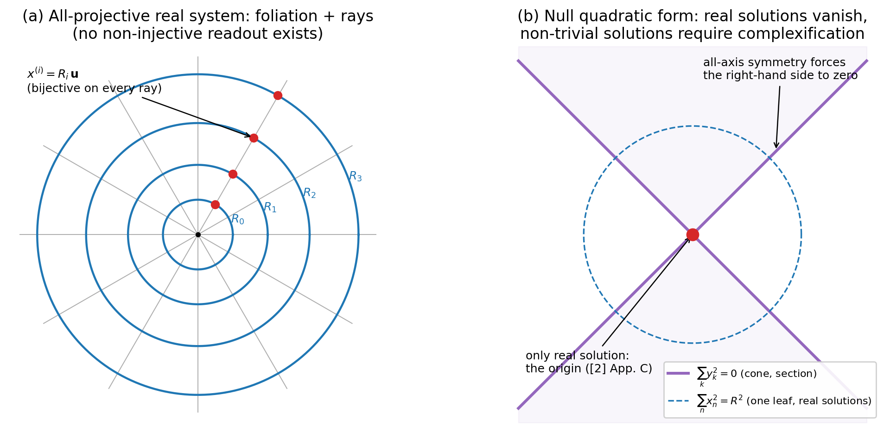

# 全射影系における読出しの不在と零二乗和形式への移行

## —— 決定論的な中心投影の幾何に、非単射な読出しが生じる条件 ——

**著者**: 木原範昭（Noriaki Kihara）
**日付**: 2026年7月6日
**版**: v0.1（ドラフト）
**シリーズ**: 差異の判別と最小レジスタ 第二篇

---

## 概要

第一篇 [1] は、複素振幅の二つの二次読出し（共役積 $Z\bar{Z}$・非共役積 $Z^2$）と射影の階梯（恒等・部分・零射影）を、読出し写像の非単射性の分類として整理した。本稿はその**上流**を扱う：そもそも非単射な読出しは、どのような系に存在し得るのか。まず、原点を共有する球面族 $\sum_n x_n^2 = R^2$（$0 < R < \infty$）による背景空間の葉層化と中心投影（原点を通る光線による葉間対応）から成る**実数の全射影系**を考え、次を示す。(i) 原点統一の下で葉間対応は純粋なスケール変換 $x^{(1)} = (R_1/R_0)\,x^{(0)}$ であり、全単射である。系のすべての構造写像が可逆であり、**第一篇の意味での非単射な読出し（部分射影・零射影）はこの系のどこにも存在しない**——階梯は恒等射影のみに退化する。したがってこの系は完全に決定論的であり、同時に、判別・記録（非単射写像を要する構造）を系内に構成できない。(ii) この系で「どの軸も動径（葉層化の方向）に選べる」という全軸対称性を宣言すると、それを式に反映する唯一の形は右辺の消去、すなわち全項を対等に並べた**零二乗和形式** $\sum_k y_k^2 = 0$ である。実数の範囲でこの形式は自明解しか持たず、非自明解には最低一つの非実成分が必須である（[2] 付録C）。(iii) この複素化によって初めて $U(1)$ ファイバーが生じ、第一篇の零射影・部分射影が非自明になる——**非単射な読出しの存在可能性は、零二乗和形式への移行と同時に開く**。(iv) 分解能型の制限（波長・周波数の 1/2 の壁）は実数の標本化定理として複素化以前に成立し、複素構造が真に必要になるのは干渉（交差項・位相差）の層である——不確定性の二根（第一篇：セルとファイバー）は、必要とする数学の層まで分離する。(v) 波の定義 $\lambda\nu = 1$ は、積不変量・反対称な相棒・読み方の交換という共役対と同型の構造を最初から持つ——複素記法は導入ではなく、この対称性に付けた名前である。本稿は第一篇と同じく観察的技術ノートであり、標準理論の置換・導出を主張しない。全軸対称性は導出された第一原理ではなく**現時点の最少仮説の候補**であり、軸の存在と本数はここでは前提である。

---

## 1. はじめに

### 1.1 位置づけ

第一篇 [1] は、定義域の有界性と状態の一価性を**前提**として等間隔格子を導き、非単射な読出しのファイバー階層を分類した。本稿はその前提の由来を与える：どのような系なら読出し（非単射写像）が存在し得るのか、有界性はどこから来るのか。素材は、著者の中心投影系列 [3][4] が既に証明した**実数の全射影幾何**である——そこでは全てが可逆・決定論的であり、まさにそれゆえに、第一篇の意味での読出しが存在できない。本稿の主題は、この決定論的な幾何から、読出しの存在し得る系への**移行の条件**である。

### 1.2 本稿の立場

第一篇 §1.2 の立場を引き継ぐ：本稿は標準的な理論物理学を置換する新理論の提示ではなく、既知の構造が最小限の仮定からどこまで同じ形として読めるかの観察的な整理である。とくに本稿で扱う「全軸対称性」（§3）は、**導出された第一原理ではない**。それは現時点で最少の仮説の候補であり、対称であるべき軸たちの存在・本数はここでは前提として置かれる（この前提自体のさらなる遡行は本稿の範囲外である）。用語（読出し・喪失・判別）は第一篇の定義に従い、写像の性質を指す作業用語である。

## 2. 実数の全射影系

**定義 2.1（全射影系）**. 背景空間 $\mathbb{R}^{n+1}$（ユークリッド座標）に、原点を共有する球面族

$$S(R) = \{x \in \mathbb{R}^{n+1} : \textstyle\sum_{k} x_k^2 = R^2\}, \qquad 0 < R < \infty$$

による葉層化を与える。葉の間の対応は中心投影：原点を通る光線が各葉と交わる一点どうしを対応させる。

**命題 2.2（スケール還元）**. 同一光線上の点は方向ベクトル $\mathbf{u}$（$|\mathbf{u}| = 1$）を共有し、葉 $S(R_i)$ 上の点は $x^{(i)} = R_i \mathbf{u}$ と書ける。したがって葉間対応は

$$x^{(1)} = \frac{R_1}{R_0}\, x^{(0)}$$

——純粋なスケール変換（相似拡大）であり、全単射である。合成は係数の積 $(R_1/R_0)(R_2/R_1) = R_2/R_0$ に従い、経路に依存しない。

*証明*. 直接計算。∎

**命題 2.3（読出しの不在）**. 全射影系の構造写像（葉間対応・光線対応・スケール群の作用）はすべて単射である。したがって、第一篇の意味での非単射な読出し——部分射影（$\mathbb{Z}_2$ 以上のファイバー）・零射影（連続ファイバー）——は、この系の構造の中に**存在しない**。第一篇の射影の階梯は、恒等射影のみに退化する。

*証明*. 命題 2.2 により葉間対応は全単射。光線対応（点 $\mapsto$ 方向 $\mathbf{u}$ と半径 $R$ の組）も全単射（極座標分解の一意性、$x \neq 0$）。単射写像の合成は単射であり、非自明なファイバーを持つ写像はこれらの合成からは生成できない。∎

**注意 2.4（決定論と、その代償）**. 命題 2.3 の帰結として、この系は完全に決定論的である：任意の葉の完全な状態から、他の全ての葉の状態が一意に復元できる。同時に、第一篇 §5 で整理した通り、判別の記録（非単射写像＝情報を捨てる操作）を要する構造は、この系の内部に構成できない。**すべてが見通せる系は、何も記録しない系である**。この二面性——正則・無発散・全射影という完成度と、読出しの不在——が本稿の出発点である。

**注意 2.5（階層と無次元比）**. スケール群は $\log$ で加法群に平坦化され、葉のラベルは一次元に載る。葉の間の差はスケール比 $R_1/R_0$ ただ一つの正実数であり、系内で意味を持つ量は無次元比のみである。

## 3. 全軸対称性と零二乗和形式

**宣言 3.1（全軸対称性）**. 定義 2.1 の葉層化は一つの方向（動径）を選んで構成したが、背景のどの方向にも同じ構成ができる：**どの軸も動径（葉層化の方向）に選べる**。この選択の自由を、構成の対称性として宣言する。

**命題 3.2（形式の強制）**. 宣言 3.1 を式の形に反映する唯一の書き方は、右辺の消去である。すなわち $\sum_n x_n^2 = R^2$ において $R$ を特権項（右辺）に残す限り対称性の宣言と式の形は矛盾し、対称性を貫くには $R$ を左辺の項に繰り込んだ

$$\sum_k y_k^2 = 0$$

（全項対等の**零二乗和形式**）に移行するほかない。

*証明*. 「どの軸も動径に選べる」とは、式の中でどの変数も同じ資格を持つこと。右辺に残る $R$ は葉層化の方向の特権的な記録であり、資格の非対称そのものである。移項 $\sum x_n^2 - R^2 = 0$ の後、全項を平方の和として対等に書くには $R$ の項の符号処理が要り、それが次節の主題である。∎

**命題 3.3（実数解の消滅と複素化の強制）**. 実数の範囲で $\sum_k y_k^2 = 0$ は自明解（全て零）しか持たない。非自明解の存在を要請すると、最低一つの成分の非実化（または同値に、計量の符号混合）が必須である。

*証明*. [2] 付録C（C.1, C.2）。正定値和が零になるのは全項零のときに限る。∎

**注意 3.4（本稿の立場の確認）**. この連鎖——全軸対称 ⇒ 零二乗和形式 ⇒ 複素化——において、最上流の全軸対称性は**仮説**である（§1.2）。本稿が主張するのは条件文の連鎖の各段（⇒ の部分、いずれも式の形の定理）であって、前件の真理性ではない。

## 4. 移行が開くもの：非単射読出しの可能化

**命題 4.1**. 複素化された成分 $Z = a + ib$ には $U(1)$ の回転自由度（位相）が生じ、第一篇の読出しの階梯が非自明になる：零射影 $Z\bar{Z}$ は $S^1$ ファイバーを、部分射影 $Z + \bar{Z}$ は $\mathbb{Z}_2$ ファイバーを持つ（[1] 命題 2.2, 3.1）。

*証明*. [1] の該当命題の適用。∎

**注意 4.2（対比の要点）**. §2 の実数系には非単射写像が存在せず（命題 2.3）、複素化後の系には存在する（命題 4.1）。**非単射な読出し——判別・記録・第一篇の全構造——の存在可能性は、零二乗和形式への移行と同時に、初めて開く**。移行前の系は「誤っている」のではない：正則・無発散・全射影の幾何として完成している。欠けているのは系の性質ではなく、その中に読出しの構造を置く場所である。

**注意 4.3（有界性と一価性の由来——第一篇の前提の供給）**. 第一篇 §6 は「定義域が有界（円）で状態が一価なら等間隔格子」を前提付きで導いた。本稿の構成はこの二前提を供給する：(i) **有界性**——葉 $S(R_0)$ 上の存在にとって、利用可能な空間は曲率半径 $R_0$ の閉空間であり、有界性は選択ではなく所属の帰結である。(ii) **一価性**——全葉が背景座標の複製を保持する（命題 2.2 の相似対応）以上、葉上の関数は背景座標の関数であり、同一点で同一値を取る。したがって、閉じた定義域に波（$\lambda\nu = 1$、§6）を導入した瞬間、等間隔格子とその帰結（第一篇 §6、付録A・B）が続く。

## 5. 不確定性の二根と、必要な数学の分離

**命題 5.1（第一根は実数で立つ）**. 間隔 $d$ の実格子上の実信号について、波長 $2d$ 未満（周波数 $1/2d$ 超）の成分は、格子上の別の低周波成分と識別不能である（標本化定理・折り返し [5]）。この分解能型の制限は実数の定理であり、複素構造を要さない。

**注意 5.2（第二根が複素数の請求書である）**. 第一篇の二根の分類——根1（セル：分解能）・根2（ファイバー：多対一の読出し）——に対応させると：根1は命題 5.1 の通り実数の標本化理論で完結する。根2のうち非自明な連続ファイバー（$S^1$：位相の喪失）と、それを差として読み戻す干渉（交差項 $\cos(\theta_m - \theta_n)$）は、複素化された系でのみ立つ——実格子の識別限界は「ぼやけ」を作るが「干渉」を作らない。**複素数が真に必要になる場所は、不確定性一般ではなく、干渉（位相という質）の層である**。

## 6. $\lambda\nu = 1$ と共役対の同型

**命題 6.1**. 波の定義 $\lambda\nu = 1$ における対 $(\lambda, \nu)$ と、共役対 $(Z, \bar{Z})$（$Z\bar{Z} = \rho^2$）は、次の対応で同型の構造を持つ：

| $\lambda\nu = 1$ | $Z\bar{Z} = \rho^2$ |
|---|---|
| 積が不変量 $1$ に固定 | 積が不変量 $\rho^2$ に固定 |
| 相棒は逆数 $1/\lambda$ | 相棒は共役 $\bar{Z}$（位相が反対に回る） |
| 空間読み／時間読みの交換 | $Z$／$\bar{Z}$ の選択 |
| $\log\lambda + \log\nu = 0$（加法的相殺） | $\theta + (-\theta) = 0$（加法的相殺） |

*証明*. 各行は定義の言い換え。$\log$ による乗法群の加法化と、偏角による $U(1)$ の加法化が、どちらも「単位元への対消滅」を加法座標で表す。∎

**注意 6.2**. この同型の含意：波を $\lambda\nu = 1$ で定義した時点で、共役対の代数構造は**同梱**されている。複素記法の $i$ は外部から持ち込む数ではなく、$\lambda \leftrightarrow \nu$ 交換（読み出し面の交換）という系に既にある対称性に付けた名前である——「複素数を導入するか否か」は実体の選択ではなく記法の選択であり、実体の選択（非自明解を持つか否か）は §3 の移行が担う。

## 7. 隣接する既知構造との接続点（導出は主張しない）

1. **動径の読み方二通り——SR と GR の共通の親**：零二乗和形式で一本の成分を動径 $R$ と読み、切片 $R = R_0$ 上の球面族に戻すと、中心投影から $G_{\mu\nu} + \Lambda g_{\mu\nu} = 0$、$\Lambda = 3/R^2$——一般相対論の真空解が得られる（[3]、公刊済み）。同じ式で一本を $t$ と読むと $\sum_i x_i^2 - t^2 = 0$——光錐、特殊相対論の因果構造。Minkowski 計量の符号 $(-,+,+,+)$ は独立の公理ではなく、全項対等の形式の中で一本を基準側に選んだ記録として現れる（Wick 回転の恒等と整合）。**ここまでは接続点の指摘であり、二理論の導出・置換の主張ではない**。
2. **標本化理論**：命題 5.1 は Nyquist–Shannon [5] の骨格であり、通信・制御工学が一世紀運用してきた実数の不確定性である。
3. **第一篇との分業**：本稿は第一篇の前提（有界・一価）と対象（複素振幅）の由来を与え、第一篇は移行後の系の読出しの分類を与える。二篇で「読出しがなぜ存在し得るか」から「読出しは何を失うか」までが接続する。

## 8. まとめ（線引き）

| 身分 | 内容 |
|---|---|
| 定理 | スケール還元（命題 2.2）、読出しの不在（命題 2.3）、形式の強制（命題 3.2）、実数解の消滅（命題 3.3 = [2] 付録C）、複素化による階梯の非自明化（命題 4.1 = [1]）、第一根の実数性（命題 5.1）、$\lambda\nu$–共役対の同型（命題 6.1） |
| 仮説（最少候補） | 全軸対称性（§3）。軸の存在・本数は前提のまま |
| 供給 | 第一篇の前提（有界性・一価性）の由来（注意 4.3） |
| 接続点（非主張） | SR 光錐・GR 真空解＝同じ零二乗和形式の動径の読み方二通り |
| 範囲外 | なぜ軸が存在するか・なぜこの本数か、移行の「機構」（本稿は移行の前後の構造の対比のみを扱う） |

---

## 参考文献

[1] 木原範昭, 「共役複素対の二つの積と射影の階梯」v0.3, 本シリーズ第一篇 (2026).

[2] 木原範昭, 「共役複素ノルムと平方量読出しの接続について」v0.5, Zenodo (2026). Concept DOI: [10.5281/zenodo.21126212](https://doi.org/10.5281/zenodo.21126212)

[3] 木原範昭, 「中心投影による4次元空間の幾何学的定式化」, Zenodo (2026). DOI: [10.5281/zenodo.19427780](https://doi.org/10.5281/zenodo.19427780)

[4] 木原範昭, 「球面投影 (radial projection) の定義と中心投影との関係」v3.3, Zenodo (2026). Concept DOI: [10.5281/zenodo.20462569](https://doi.org/10.5281/zenodo.20462569)

[5] H. Nyquist, "Certain Topics in Telegraph Transmission Theory," *Transactions of the AIEE* **47**, 617–644 (1928); C. E. Shannon, "Communication in the Presence of Noise," *Proceedings of the IRE* **37**, 10–21 (1949).
