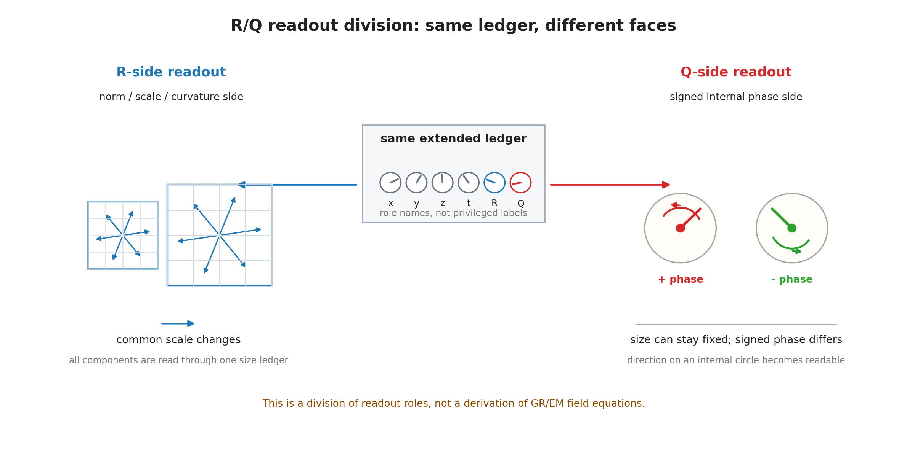

# 第10章 重力型読出しと電磁型読出し——$R/Q$ 軸の分業

> **この章の問い**：なぜ重力と電磁気は違う顔をするのか。$R$ 軸と $Q$ 軸は、標準理論のどの構造に接続しうるのか。
> **この章の答え**：本章では、$R$ 軸を曲率・質量型・重力型の有効表示に接続しうる読出し候補、$Q$ 軸を符号付き内部位相・電荷型・電磁型の有効表示に接続しうる読出し候補として扱う。重力型読出しは、全成分にかかるノルム・スケール・曲率側の読みとして、電磁型読出しは、符号付き内部円の位相差・位相増分率の読みとして整理される。ただし、これは Einstein 方程式や Maxwell 方程式の導出ではない。第V部で置いた追加仮定のもとで、標準理論の有効表示へ接続しうる入口を分ける章である。

**【高校向・読み下し】** 重力は、質量を持つものなら基本的にみな同じ向きに引かれるように見える。一方、電気は、プラスとマイナスがあり、同じ符号なら反発し、違う符号なら引き合う。この本では、この違いを「二つの別々の魔法」として始めない。$R$ 側は、大きさ・スケール・曲率のように全体へかかる読みとして扱う。$Q$ 側は、内部の円の向きや符号を持つ読みとして扱う。だから、重力型はノルム側、電磁型は符号付き位相側として顔が分かれる。ただし、ここで電磁気学や一般相対論を作り直したわけではない。どの台帳欄をどの標準理論の顔に接続できそうかを、慎重に分けている。

ここで、第0章以来の**無名性**との関係を明確にしておく。$R$ 軸や $Q$ 軸という名前は、宇宙の中に最初から特権的なラベルが貼られている、という意味ではない。第V部では、ノルム・スケール・曲率・質量型読出しとして働く欄がある、という作業仮説を置き、その役割を便宜上 $R$ 軸と呼ぶ。同じように、符号付き内部位相・電荷型読出しとして働く欄がある、という作業仮説を置き、その役割を便宜上 $Q$ 軸と呼ぶ。名前が先にあるのではない。読出し上の働きが先にあり、その働きに後から役割名を付けている。したがって、$R/Q$ という記号は無名性を破る特権名ではなく、以後の簿記を短くするための役割名である。

先に用語をほどいておく。**重力型読出し**とは、$R$ 軸を曲率・質量型・重力型の有効表示に接続しうる候補として読むことである。**電磁型読出し**とは、$Q$ 軸を符号付き内部位相・電荷型・電磁型の有効表示に接続しうる候補として読むことである。**質量型読出し**とは、$R$ 方向の位相増分率 $p_R$ を外部表示で $m$ と読むことである。**電荷型読出し**とは、$Q$ 方向の位相増分率 $p_Q$ を外部表示で $q$ と読むことである。どちらも、台帳欄そのものと外部読出し値を同一視しない。（いずれも→用語集）

---

## 10.1 第V部の中での位置

第V部では、標準理論の通常の定式化には含まれない追加仮定を置く。第V部はじめにで置いた追加仮定のうち、本章で直接使うのは次の二つである。

| 仮定 | 本章での使い方 |
|---|---|
| 有効表示仮定 | $R$ 軸・$Q$ 軸を、標準理論の重力型・電磁型の有効表示に接続しうる読出し候補として扱う |
| 境界記録仮定 | 外から読めるのは、内部軸そのものではなく、位相差・位相増分率・境界に落ちた記録である |

本章では、まだ相互作用の具体法則を作らない。たとえば、場の方程式、交換粒子、結合定数、ポテンシャルの厳密形、量子化の規則は置かない。まず、$R$ 軸と $Q$ 軸の読出しの顔がどう違うかを分ける。

この順序は重要である。$R$ 軸と $Q$ 軸の読みを分けないまま相互作用へ進むと、重力・電磁・ゲージ・粒子種・もつれがすべて同じ言葉で混ざってしまう。第11章で共有台帳と頂点写像を定義する前に、本章では読出し軸の分業だけを置く。

## 10.2 混同してはいけない四つの欄

まず、$R$ と $Q$ をめぐる欄を分ける。

| 記号 | 本章での読み | 同一視してはいけないもの |
|---|---|---|
| $R,Q$ | 台帳の内部欄または軸 | 質量・電荷そのもの |
| $\Delta R,\Delta Q$ | 二つの記録または台帳の内部欄の差 | 位相増分率 $p_R,p_Q$ |
| $p_R,p_Q$ | $R,Q$ 方向の位相増分率 | $R,Q$ 軸の存在・不在 |
| $m,q$ | 外部読出しで質量型・電荷型として出る値 | 内部台帳の全構造 |

第7章では、光錐型境界を読むとき、同じ内部セクター内で

$$
\Delta R=\Delta Q=0
$$

と置いた。これは内部欄の**差**を出さないという意味であり、$p_R=0$ や $p_Q=0$ を意味しない。ここでも同じである。

質量ゼロ型の読出しは

$$
p_R=0
$$

と読む。これは $R$ 軸が消えるという意味ではない。電気的に中性と読む場合も、ふつうは

$$
p_Q=0
$$

と読む。これも $Q$ 軸が消えるという意味ではない。

**【高校向】** 「住所欄があること」と「そこに書かれた番地」と「前回から番地が変わったか」と「外に表示された名前」は全部違う。本章の $R,Q,\Delta R,\Delta Q,p_R,p_Q,m,q$ も同じように分けて読む。

## 10.3 $R$ 軸は重力型読出しの候補である

$R$ 軸は、第4章では質量型読出しの側に置かれた。第7章では、$R$ 方向の位相増分率 $p_R$ を質量型読出し $m$ と対応させ、

$$
p_t^2-|\mathbf p|^2=p_R^2
$$

を

$$
E^2=|\mathbf p|^2+m^2
$$

と同じ形として読んだ。

第10章では、この $R$ 軸をもう少し広く、曲率・質量型・重力型の有効表示に接続しうる読出し候補として扱う。ここでの中心は、次の三つである。

| $R$ 側の読み | 内容 |
|---|---|
| ノルム側 | 全成分にかかる大きさ・目盛り・スケールの読み |
| 質量型 | $R$ 方向の位相増分率を外部表示で $m$ と読む |
| 曲率側 | スケールや局所フレームの変化を、重力型の有効幾何表示へ接続する候補 |

重力は、標準理論では時空幾何の曲率として扱われる。本書では、その標準形式を置き換えない。本章で言えるのは、$R$ 軸がノルム・スケール・質量型読出しに関わるため、重力型の有効表示に接続する候補として自然な場所を持つ、ということである。

この読みでは、重力型読出しは符号付き内部円というより、全体のノルムや局所スケールの変化に近い。質量型読出しがエネルギー運動量関係で $p_R^2$ として現れること、また $R$ 側が曲率半径や局所目盛りの読みと接続しやすいことは、同じ方向を向いている。

ただし、ここから Einstein 方程式は出ていない。Einstein 方程式には、計量、曲率テンソル、エネルギー運動量テンソル、それらを結ぶ場の方程式が必要である。本章が置くのは、そのような標準理論側の構造に接続しうる読出し候補であって、テンソル方程式の導出ではない。

## 10.4 $Q$ 軸は電磁型読出しの候補である

$Q$ 軸は、第4章では電荷型読出しの側に置かれた。第10章では、$Q$ 軸を符号付き内部位相・電荷型・電磁型の有効表示に接続しうる読出し候補として扱う。

電荷型読出しは、$Q$ 方向の位相増分率

$$
p_Q
$$

を外部表示で

$$
q
$$

と読む形である。ここで大事なのは、$Q$ 側には符号が残ることである。正電荷と負電荷のように、向きの違いが外部読出しに出る。

このため、$Q$ 側は内部円の位相と相性がよい。円上の位相原点は任意であり、同じ物理的読出しは位相原点の取り方に依存してはいけない。この点は、後の U(1) 型読出しにつながる。

標準電磁気学の有効表示を参照すると、静的な点電荷型の読出しは、空間側の球面に広がるフラックス保存として、逆二乗型の表示を持つ。

$$
E_Q(r)\sim \frac{q}{r^2}
$$

また、その場をポテンシャルの勾配として読むなら、

$$
E_Q(r)=-\frac{d\Phi_Q}{dr},
\qquad
\Phi_Q(r)\sim \frac{q}{r}
$$

という表示を持つ。

ここでの $r^{-2}$ は、三次元空間で球面面積が $4\pi r^2$ に比例するという標準的な幾何表示に対応する。本書は、この面積則や Maxwell 方程式を台帳だけから導出しているのではなく、$Q$ 軸の符号付き読出しがその標準表示へ対応しうる位置を確認している。

したがって、ここで確認しているのは Coulomb 法則や Maxwell 方程式そのものの導出ではない。$Q$ 軸の符号付き内部位相読出しを空間側の二乗ノルムに有効表示すると、標準的な電磁型表示に必要な部品と接続しやすい、という対応である。

## 10.5 なぜ顔が違うのか

$R$ 軸と $Q$ 軸は、同じ台帳内に置かれる。しかし、外部に出る顔は違う。

| 側 | 主な読み | 外部に出る顔 |
|---|---|---|
| $R$ 側 | ノルム、スケール、曲率、質量型位相増分率 | 重力型読出し |
| $Q$ 側 | 符号付き内部円、位相差、電荷型位相増分率 | 電磁型読出し |

$R$ 側は、全成分にかかる大きさや目盛りの側に近い。したがって、重力型読出しは、局所スケール・曲率・質量型読出しと結びつきやすい。

$Q$ 側は、内部円の位相と符号の側に近い。したがって、電磁型読出しは、電荷の符号、位相原点の任意性、干渉可能な内部位相と結びつきやすい。

この違いは、重力と電磁気がまったく別の台帳から来るという意味ではない。同じ拡張台帳の中で、読出しに出る欄と対称性が違う、という意味である。

## 10.6 同じ台帳に置くことは統一理論ではない

$R$ 軸と $Q$ 軸を同じ台帳に置くと、すぐに「重力と電磁気を統一したのか」と読まれやすい。しかし、本章は統一理論を主張しない。

本章で言えることは、次に限られる。

| 言えること | 言えないこと |
|---|---|
| $R$ 側と $Q$ 側を同じ台帳文法に置ける | 重力場と電磁場を一つの場として導出した |
| $p_R$ と $p_Q$ をそれぞれ質量型・電荷型の位相増分率として読める | 質量と電荷の値や結合定数を導出した |
| $R$ 側はノルム・スケール・曲率型、$Q$ 側は符号付き位相型として顔が分かれる | Einstein 方程式や Maxwell 方程式を置換した |
| 電子型の点粒子を、質量型読出しと電荷型読出しを持つ有効台帳として表せる | 電子の標準模型表現や量子電磁力学を導出した |

同じ台帳に置くことは、同じ法則で全部が決まることを意味しない。台帳の配置は読出しの場所を与える。具体的な相互作用法則は、共有台帳、境界、接続、頂点写像を定義した後でなければ扱えない。

## 10.7 本章の境界

本章で確定したことと、まだ置いていないことを分ける。

| 区分 | 内容 |
|---|---|
| 構成 | $R$ 軸を重力型読出し候補、$Q$ 軸を電磁型読出し候補として分けた |
| 対応 | $p_R\leftrightarrow m$、$p_Q\leftrightarrow q$、$R$ 側のノルム・曲率型、$Q$ 側の符号付き内部位相型 |
| 仮定 | $R/Q$ 軸を標準理論の有効表示に接続しうる読出し候補として扱うこと |
| 主張しないこと | Einstein 方程式、Maxwell 方程式、結合定数、交換粒子、量子場理論の導出 |

本章の役割は、重力型読出しと電磁型読出しの分業を置くことである。次章では、これらの読出しが、複数の系の間でどのように共有台帳・境界・接続として現れるかを見る。

## この章のまとめ

| 区分 | 内容 |
|---|---|
| 定義・構成 | 重力型読出し、電磁型読出し、$R/Q$ 軸の分業 |
| 整理・確認したこと | $R,Q,\Delta R,\Delta Q,p_R,p_Q,m,q$ を混同せずに分けて読むこと |
| 対応 | $R$ 側はノルム・スケール・曲率・質量型、$Q$ 側は符号付き内部位相・電荷型 |
| 仮説 | $R/Q$ 軸を標準理論の重力型・電磁型有効表示に接続しうると見ること |
| 主張しないこと | 一般相対論、電磁気学、量子電磁力学、標準模型の導出 |
| 次章への問い | 複数の系は、どの台帳・境界・記録面を共有すると相互作用として読まれるのか |
