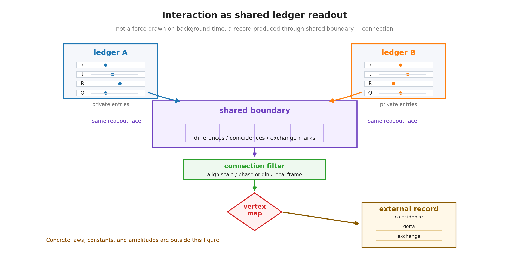

# 第11章 系の階層構成——共有台帳・接続・境界

> **この章の問い**：複数の系はどう階層を作り、どこで相互作用するのか。相互作用とは、背景時間上で力が働くことなのか、それとも台帳どうしの共有として読むべきなのか。
> **この章の答え**：本章では、相互作用を、二つ以上の系が一部の台帳・モード・境界・記録面・読出し条件を共有し、その共有が外部表示へ残ることとして定義する。系は親系・子系・孫系のように階層を作り、台帳の一部を継承・分割・合流させる。異なるスケール・位相原点・局所フレームを比べるためには接続が必要であり、分裂・合流・記録追記を扱うには頂点写像が必要になる。ただし、具体的な相互作用法則は本章から導出されず、追加仮説として残る。

**【高校向・読み下し】** ふつうは「二つの物体の間に力が働く」と考える。しかしこの本では、まず「二つの物体がどの記録を共有しているのか」と考える。たとえば、二つの時計を比べるには、同じ場面で針を読む必要がある。二つの波を干渉させるには、同じ読出し面に重ねる必要がある。相互作用も同じで、二つ以上の系がどこかで台帳や境界を共有し、その共有が記録として残ることから始める。力は、その記録を標準理論側の有効表示で読んだときに現れる顔である。

先に用語をほどいておく。**親系**とは、分割や読出しの前に一つの閉包として扱われる系である。**子系**とは、親系から分割・継承された部分系である。**共有台帳**とは、二つ以上の系が同じモード・境界・記録面を共有していると扱われる台帳欄である。**接続**とは、異なるスケール・位相原点・局所フレームを比べるための換算簿記である。**頂点写像**とは、分裂・合流・記録追記の局所規則である。（いずれも→用語集）

---

## 11.1 測定から相互作用へ

第8章では、外部測定を

$$
F:X\times B\to Y
$$

という非単射な読出しとして定義した。対象台帳、読み手台帳、境界条件、記録媒体がひと組になり、外部に残る記録 $y$ へ落ちる。

相互作用は、この測定面を一段だけ広げたものとして読む。測定では、対象と読み手を分けていた。相互作用では、二つ以上の系が互いに読み手にも対象にもなりうる。そこで、外から読めるのは、どちらか一方の内部値ではなく、共有された台帳や境界に落ちた記録である。

本章では、相互作用を次のように定義する。

> **相互作用 ＝ 二つ以上の系が、一部の台帳・モード・境界・記録面・読出し条件を共有し、その共有が外部表示へ残ること。**

この定義では、相互作用は背景時間の上で外から加えられる力ではない。まず共有があり、その共有を標準理論側の場・力・結合として読む。

## 11.2 親系・子系・孫系

第4章では、系譜によって原点を構成した。ここでは、その系譜を相互作用編の言葉で使う。

| 階層 | 読み |
|---|---|
| 親系 | 一つの閉包として扱われる元の系 |
| 子系 | 親系から分割・継承された部分系 |
| 孫系 | 子系からさらに分割・継承された部分系 |

親系と子系は、完全に別々のものではない。子系は親系の台帳の一部を継承する。したがって、子系どうしが相互作用するとき、そこには親系から受け継いだ共有台帳や境界が残っている可能性がある。

この見方では、分割は単なる切断ではない。分割された後にも、何が共有され、何が独立になり、何が外部記録として残るかを指定しなければならない。

**【高校向】** 会社を部署に分けても、会計帳簿や社員番号や共通の建物は残る。部署どうしは別々に動くが、共通の帳簿を通じて関係している。親系と子系も、完全な無関係になるのではなく、何を共有したまま分かれたかが重要になる。

## 11.3 共有台帳

共有台帳とは、二つ以上の系が、ある読出しで同じモード・境界・記録面を共有していると扱われる台帳欄である。

共有にはいくつかの型がある。

| 共有の型 | 内容 | 例としての読み |
|---|---|---|
| モード共有 | 同じ位相成分・周波数成分・内部成分を共有する | 干渉可能な成分 |
| 境界共有 | 同じ読出し面で照合される | 衝突、接触、測定面 |
| 記録面共有 | 同じ記録媒体または同じ記録列に落ちる | 相関記録 |
| 読出し条件共有 | 同じ目盛り・参照位相・単位系で読まれる | 比較可能な測定 |

共有台帳があると、二つの系の記録は単なる別々の測定値ではなく、同じ読出し面に落ちた相関として読める。共有台帳がない場合、外から読めるのは、別々の外部測定記録であり、相互作用としての内的な結びつきはまだ置かれていない。

ここで注意する。共有台帳は、二つの系が「同じ実体」になるという意味ではない。外部読出しで同じ欄・同じ境界・同じ記録面を使って比較される、という意味である。

## 11.4 境界と記録交換

相互作用を読むには、境界が必要である。境界とは、二つ以上の台帳が照合され、どの差・一致・交換記録が外に残るかを決める面である。

境界に落ちる記録には、少なくとも次がある。

| 境界に落ちるもの | 読み |
|---|---|
| 差 | 位相差、スケール差、位置差、時刻差 |
| 一致 | コインシデンス、衝突、同期、同じ読出し面 |
| 交換記録 | 保存量の受け渡しとして読める記録 |
| 変化 | 境界通過の前後で記録列が変わること |

この表は、標準理論の相互作用頂点を導出したものではない。しかし、頂点を読むために必要な入口を与える。標準的な場の理論では、粒子が頂点で結合したり分裂したりする。本書では、その手前で、どの境界にどの記録が落ちるかを定義する。

少なくとも本書の外部測定の有効表示では、境界を通じて記録に落ちない相互作用は、外部記録としては読めない。記録に残らない差異は、外部測定の有効表示では扱えない。

## 11.5 接続

複数の系を比べるとき、各系が同じスケール、同じ位相原点、同じ局所フレームを持っているとは限らない。第5章で見たように、閉じた系は自前の目盛りを持つ。第8章で見たように、外部値は読み手側の目盛りとの比として出る。

したがって、異なる系の台帳を比べるには、換算が必要である。本章ではこれを**接続**と呼ぶ。

> **接続 ＝ 異なるスケール・異なる位相原点・異なる局所フレームの換算簿記。**

接続は、単なる座標変換ではない。どの参照をどこまで運び、どの位相原点をどう対応させ、どの目盛りをどう換算するかを表す読出しの簿記である。

第12章では、この接続をゲージ的接続として詳しく読む。ここでは、相互作用を定義するために接続が必要になる、という位置だけを確認する。

## 11.6 頂点写像

相互作用で最も難しいのは、分裂・合流・記録追記の局所規則である。これを本章では**頂点写像**と呼ぶ。

「頂点」という名前は、素粒子物理学のファインマン図などで、線が合流・分裂する局所点を vertex と呼ぶことに由来する。ただし本章では、それを粒子図そのものではなく、台帳の合流・分裂・記録追記を決める読出し規則として使う。

頂点写像は、少なくとも次の問いに答えなければならない。

| 問い | 内容 |
|---|---|
| 分裂 | 一つの系が二つ以上の子系へ分かれるとき、どの台帳がどう継承されるか |
| 合流 | 複数の系が一つの系へ合流するとき、どの記録が残り、どのファイバーが畳まれるか |
| 記録追記 | 境界で起きた差・一致・交換記録が、次の記録列へどう追記されるか |
| 保存量 | 位相増分率として読まれる量が、前後でどのように保存・再配分されるか |
| 接続 | 局所フレームや位相原点をどう換算してから合成するか |

ここには新しい仮説が入る。第V部はじめにで述べたように、頂点写像は第1巻の代数だけから一意に決まるものではない。

したがって、本章では頂点写像の必要性を定義するが、具体法則は導出しない。たとえば、標準模型の頂点、結合定数、崩壊分岐比、散乱振幅は、この章の外に残る。

## 11.7 相互作用を読む最小構図

ここまでをまとめると、相互作用の最小構図は次のようになる。

$$
\text{系Aの台帳}
\quad+\quad
\text{系Bの台帳}
\quad+\quad
\text{共有境界}
\quad+\quad
\text{接続}
\quad\longrightarrow\quad
\text{外部記録}
$$

ここで「足し算」は数の加算ではなく、読出しに必要な部品を並べているだけである。実際の読出しは、境界と接続を含む非単射な写像として記録へ落ちる。

この構図を使うと、第10章の重力型・電磁型読出しは次のように置ける。

| 読出し | 共有されるものの候補 | 外部表示 |
|---|---|---|
| 重力型 | $R$ 側のノルム・スケール・曲率側の読出し・局所フレーム | 曲率・質量型・重力型表示 |
| 電磁型 | $Q$ 側の内部位相・符号付き位相増分率 | 電荷・電磁型表示 |
| ゲージ的接続 | 位相原点・局所フレーム・スケール換算 | 接続・ホロノミー |

この段階でも、具体法則はまだない。だが、何を定義しなければ具体法則へ進めないかは明確になる。

## 11.8 本章の境界

本章で確定したことと、まだ置いていないことを分ける。

| 区分 | 内容 |
|---|---|
| 定義 | 相互作用、共有台帳、境界、接続、頂点写像 |
| 構成 | 親系・子系・孫系の階層、台帳の継承・分割・合流 |
| 対応 | 標準理論の相互作用頂点や場の結合へ進む前の読出し面 |
| 仮説 | 共有台帳仮定、境界記録仮定、接続仮定、頂点写像仮定 |
| 主張しないこと | 標準模型の相互作用頂点、結合定数、散乱振幅、崩壊率の導出 |

本章の役割は、相互作用を語るための文法を定義することである。次章では、この接続を、ゲージ的構造としてどこまで読めるかを見る。

## この章のまとめ

| 区分 | 内容 |
|---|---|
| 定義・構成 | 相互作用、共有台帳、境界、接続、頂点写像、系の階層 |
| 整理・確認したこと | 本書の読出し語では、相互作用を共有台帳・境界・記録面の有効表示として定義する、という置き方ができること |
| 対応 | 場の結合、相互作用頂点、接続、ホロノミーへ進むための読出し面 |
| 仮説 | 具体的な頂点写像、保存量の再配分、結合定数、記録追記規則 |
| 主張しないこと | 標準模型の相互作用構造、Yang-Mills 動力学、崩壊率、散乱振幅の導出 |
| 次章への問い | 読めない位相原点や局所フレームを貼り替えても記録が変わらない構造は、どこまでゲージ的接続として読めるか |
