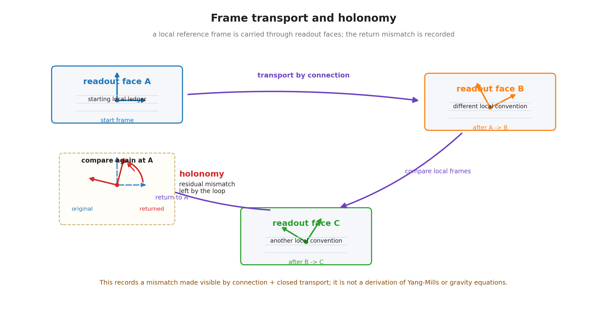

# 第12章 ゲージ的接続の射程——フレーム輸送と内部対称性候補

> **この章の問い**：なぜゲージ場か。読めない原点や局所フレームを貼り替えても記録が変わらない、という構造は、どこまで U(1) 型・SU(2) 型・SU(3) 型の文法へ接続できるのか。
> **この章の答え**：ゲージ的接続とは、読めない位相原点・内部規約・局所フレームを、複数の読出し面の間で比較するための換算簿記である。局所的に共在できない領域では、参照を直接共有できないため、輸送の規則が必要になる。この輸送の閉路にズレが残るとホロノミーとして読まれる。$Q$ 軸の閉位相読出しは U(1) 型の文法を持つ。二成分・三成分のノルム保存読出しは、全体位相を分け、行列式を 1 にそろえた内部変換として読む範囲で、それぞれ SU(2) 型・SU(3) 型の文法を持つ。ただし、これは Yang-Mills 理論や標準模型の導出ではない。標準模型の粒子表現・結合定数・対称性破れ・閉じ込めは本章の外に残る。

**【高校向・読み下し】** 目盛りのゼロをどこに置くかは、読む人が決める約束である。時計の針を12時から読むか、別の印から読むかは、差を読むだけなら本質ではない。けれど、別々の場所にある時計を比べるときは、「そのゼロをどう対応させるか」が必要になる。これが接続の直感である。ゲージとは、「読めない原点をどう選んでも、読める記録は変わらない」という性質である。局所ゲージとは、その約束が場所ごとに違ってもよく、その違いを運ぶ簿記が必要になる、ということである。

先に用語をほどいておく。**ゲージ**とは、読めない原点・位相規約・局所フレーム選択を貼り替えても、記録可能な量が変わらないこととして読む。**局所ゲージ**とは、その貼り替えを場所ごと、読出し面ごとに許す場合である。**接続**とは、異なる場所の参照・位相・フレームを比較する輸送簿記である。**ホロノミー**とは、接続に沿って一周輸送した後に残るズレである。**U(1) 型・SU(2) 型・SU(3) 型**とは、本章では、一成分の閉位相読出し、および二成分・三成分のノルム保存変換から全体位相を分け、行列式を 1 にそろえた内部読出し文法を指す候補名であり、標準模型のゲージ群との即時同一視ではない。（いずれも→用語集）

---

## 12.1 ゲージは読めない原点の貼り替え不変性である

第0章以来、本書は無名性を作業規則としてきた。名前を付ける根拠がないものは、名前を付け替えても読出し結果が変わらないように扱わなければならない。

位相原点も同じである。円周上のどこを $\theta=0$ と呼ぶかは、絶対的には決まらない。読めるのは絶対位相ではなく、位相差や強度である。

一つの複素成分

$$
z=Ae^{i\theta}
$$

に対して、位相原点の取り方を変えることは、有効表示では

$$
z\mapsto e^{i\alpha}z
$$

という全体位相の掛け替えとして表せる。この掛け替えをしても、ノルム

$$
z^*z=|z|^2
$$

は変わらない。

このように、読めない原点を貼り替えても記録可能量が変わらないことを、本章ではゲージ的な不変性として読む。

ただし、ここで標準理論のゲージ原理を導出したとは言わない。まず確認しているのは、読出しに出ない原点の任意性と、記録可能量の不変性の対応である。

## 12.2 局所ゲージは共在不能な参照の輸送簿記である

一つの読出し面の中だけなら、位相原点を一つ決めて計算すればよい。しかし、離れた二つの領域、別々の記録列、異なる局所フレームを比べるとき、その原点を直接共有できない場合がある。

このとき必要になるのが接続である。

> **接続 ＝ 異なるスケール・位相原点・局所フレームを比較するための換算簿記。**

局所ゲージとは、場所ごとに位相原点や局所フレームを選べるというだけではない。その選び方の違いを、隣り合う読出し面の間でどう換算するかまで含む。

第11章の言葉では、接続は共有台帳と境界をまたいで参照を運ぶ規則である。接続がなければ、別々の系の位相差や局所フレームを比較できない。

**【高校向】** 国ごとに通貨が違っても、為替レートがあれば値段を比べられる。位相原点や目盛りも同じで、場所ごとに選び方が違っても、換算表があれば比較できる。この換算表の役割をするのが接続である。

## 12.3 フレーム輸送とホロノミー

局所フレームとは、ある読出し面で使う局所的な基準軸の束である。たとえば、時間方向、空間方向、内部位相方向を、その場所でどう読むかという基準である。

二つの読出し面を比べるには、一方のフレームをもう一方へ輸送する必要がある。この輸送の規則が接続である。

接続に沿って閉じた経路を一周し、元の場所へ戻ったとする。そのとき、輸送したフレームが元のフレームとずれていることがある。この一周後のズレをホロノミーと呼ぶ。

ホロノミーは、曲率の読出しと深く関係する。標準幾何では、曲がった空間でベクトルを平行移動して一周すると、向きがずれることがある。本書では、このズレを、読出し面の間の接続が作る記録可能な差として読む。

ここで注意する。本章で最初に扱うゲージ的構造は、標準的な Yang-Mills 場の作用や場の方程式というより、まずはフレーム輸送・接続・ホロノミーの読出しに近い。重力理論で用いられる接続や曲率の文法とも親和性を持つが、本章では具体的な重力ゲージ理論を導出しない。

## 12.4 U(1) 型：$Q$ 軸の閉位相

$Q$ 軸は、符号付き内部位相・電荷型・電磁型の読出し候補として扱われた。$Q$ 側の一成分を

$$
z_Q=A_Qe^{i\phi_Q}
$$

と書くと、位相原点の貼り替えは

$$
z_Q\mapsto e^{i\alpha}z_Q
$$

である。この変換は

$$
z_Q^*z_Q
$$

を保存する。

この意味で、$Q$ 軸の閉位相読出しは U(1) 型の文法を持つ。

ただし、U(1) 型の文法があることと、標準電磁気学の全構造を導出することは別である。標準電磁気学には、場の方程式、電流、ポテンシャル、ゲージ固定、量子化などがある。本章では、$Q$ 側の閉位相と位相原点の任意性が U(1) 型の読出し候補になる、というところまでを扱う。

## 12.5 SU(2) 型：二成分のノルム保存

二つの有効成分をまとめて

$$
\Psi=
\begin{pmatrix}
z_1\\
z_2
\end{pmatrix}
$$

と書く。このとき、読出しノルムは

$$
\Psi^\dagger\Psi=|z_1|^2+|z_2|^2
$$

である。

このノルムを保つ線形変換を考えると、標準的にはユニタリ型の変換が現れる。全体位相だけの変換は U(1) 型としてすでに分けて読めるため、二成分内部の相対的な混合だけを見るときには、行列式を 1 にそろえた部分を取り出す。こうして得られる二成分の内部変換は、SU(2) 型の文法を持つ。

ここで行列式を 1 にそろえるとは、全体の大きさやスケールを勝手に変えず、内部成分どうしの混ざり方だけを取り出す、という意味である。標準語でいう Special Unitary の「Special」は、この条件に対応する。

本章では、これを二成分有効レジスタの内部読出し候補として扱う。標準模型の弱い相互作用そのものを導出したとは言わない。弱い相互作用には、粒子の二重項、カイラリティ、ゲージボソン、対称性破れ、質量生成など、多くの追加構造が必要である。

したがって、本章での主張は次に限る。

> 二成分の有効レジスタで、全体位相を分け、行列式を 1 にそろえたノルム保存内部変換を読むと、SU(2) 型の文法が現れる。

## 12.6 SU(3) 型：三成分のノルム保存

同じように、三つの有効成分をまとめて

$$
\Phi=
\begin{pmatrix}
z_1\\
z_2\\
z_3
\end{pmatrix}
$$

と書く。この読出しノルムは

$$
\Phi^\dagger\Phi=|z_1|^2+|z_2|^2+|z_3|^2
$$

である。

このノルムを保つ線形変換全体から、全体位相を分け、行列式を 1 にそろえた三成分の内部変換を読むと、SU(3) 型の文法が現れる。

ここで特に注意する。空間三軸 $x,y,z$ に三成分構造があることと、標準模型の色 SU(3) は同じではない。標準模型の色 SU(3) は、空間三方向ではなく、内部自由度としての色荷に関わる。したがって、空間三軸の SU(3) 型と、強い相互作用の色 SU(3) をただちに同一視してはいけない。

本章で言えるのは、三成分の有効レジスタで、全体位相を分け、行列式を 1 にそろえたノルム保存内部変換を読むと、SU(3) 型の読出し文法が現れる、ということである。色荷、グルーオン、閉じ込め、漸近的自由性、結合定数の走りは、本章の外に残る。

## 12.7 ゲージ的接続と標準模型の距離

ここまでで、U(1) 型、SU(2) 型、SU(3) 型の読出し文法を並べた。これらは、標準模型に現れる群名と同じである。しかし、同じ名前が出たからといって、標準模型を導出したことにはならない。

標準模型へ進むには、少なくとも次が必要である。

| 必要な層 | 内容 |
|---|---|
| 表現 | どの粒子がどの群のどの表現に属するか |
| 結合 | ゲージ場が物質場にどう結合するか |
| 動力学 | ゲージ場の作用、場の方程式、量子化 |
| 対称性破れ | SU(2) 型などがどの条件で破れるか |
| 世代構造 | 粒子の世代や質量階層をどう読むか |
| 閉じ込め | 強い相互作用の低エネルギー挙動をどう扱うか |

本章は、これらを導出しない。第12章が扱うのは、読めない原点・局所フレーム・内部位相の貼り替え不変性と、それらを比較する接続である。

## 12.8 本章の境界

本章で確定したことと、まだ置いていないことを分ける。

| 区分 | 内容 |
|---|---|
| 構成 | ゲージ的接続、局所ゲージ、フレーム輸送、ホロノミー |
| 対応 | U(1) 型、SU(2) 型、SU(3) 型の読出し文法 |
| 仮定 | 読めない原点・位相規約・局所フレームを、接続によって比較できると置くこと |
| 主張しないこと | Yang-Mills 理論、標準模型、粒子表現、結合定数、対称性破れ、閉じ込めの導出 |

本章の役割は、ゲージ的構造の射程を定めることである。ここで得たのは、標準理論のゲージ構造に接続しうる文法であり、標準模型そのものではない。

## この章のまとめ

| 区分 | 内容 |
|---|---|
| 定義・構成 | ゲージ、局所ゲージ、接続、フレーム輸送、ホロノミー |
| 整理・確認したこと | 一成分の閉位相読出し、および二成分・三成分のノルム保存内部変換を行列式 1 の部分として読むと、U(1) 型・SU(2) 型・SU(3) 型の文法に対応すること |
| 対応 | 標準理論のゲージ構造、特に位相原点・内部規約・局所フレームの貼り替え不変性 |
| 仮説 | 接続を、複数の読出し面を比べる換算簿記として置くこと |
| 主張しないこと | Yang-Mills 理論、標準模型、標準模型の粒子表、結合定数、対称性破れ、閉じ込めの導出 |
| 次章への問い | 内部モードや粒子種は、どの読出し成分・どの安定条件として現れるのか |
