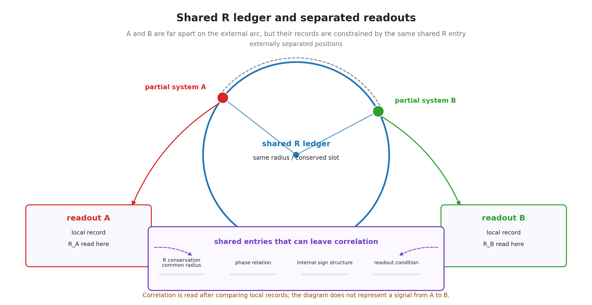

# 第15章 複合系ともつれ——共有台帳を別々の場所で読む

> **この章の問い**：なぜ複合系やもつれは、離れた場所にまたがる一つの関係として見えるのか。二つの粒子が遠く離れているのに相関を持つとは、台帳の言葉では何を意味するのか。
> **この章の答え**：本章では、複合系を、複数の部分系が一部の台帳・境界・内部モード・読出し条件を共有したまま外部には別々に読まれる構造として扱う。もつれは、別々の外部測定面で読まれる二つ以上の系が、親系から継承した、または共通境界で共有された台帳欄を完全には分解していない場合の相関読出しである。したがって、もつれは背景空間を超えて信号が飛ぶことではなく、共有された記録条件を別々の場所で読むこととして整理される。ただし、本章は Bell 不等式の破れ、Born 確率、量子情報理論、標準量子力学の完全導出ではない。

**【高校向・読み下し】** 二人が同じ元帳のコピーを持っていて、別々の場所で別々のページを開くとする。二冊は離れているが、もともと同じ取引を記録していれば、読む結果には強い関係が出る。もつれも、これに少し似ている。ただし、本当に紙のコピーがあるという意味ではない。二つの系が完全に別々のものになったのではなく、親系から受け継いだ、または同じ境界で共有された台帳欄をまだ持っているため、別々の測定でも相関が出る、という読みである。

先に用語をほどいておく。**複合系**とは、複数の部分系が一部の台帳・境界・内部モードを共有しながら、一つの外部対象としても読まれる系である。**部分系**とは、複合系から外部読出しで分けられた読出し束である。**束縛**とは、部分系どうしが共有境界や共有モードを保ち、外部では一つの安定な読出し束として現れることである。**もつれ**とは、別々の外部測定面で読まれる部分系が、親系から継承した、または共通境界で共有された台帳欄を通じて相関した記録を残す構造である。ここでいう共有は、必ずしも系譜上の親子関係に限らない。**デコヒーレンス**とは、共有台帳の位相関係が環境側の多数の記録面へ分散し、特定の測定面からは干渉可能な形で読めなくなることである。（いずれも→用語集）

---

## 15.1 第VII部の中での位置

第13章では、粒子種を、外部測定で安定に再識別できる内部モードの読出し束として定義した。第14章では、その読出し束が別の読出し束へ移る場合を、寿命・崩壊・行き先セルとして整理した。

本章では、粒子種が一つずつ独立にある場合から、複数の読出し束が一つの親系や共有台帳を持つ場合へ進む。

ここで注意する。複合系やもつれを扱うと、すぐに量子情報理論や Bell 実験の完全説明へ進みたくなる。しかし、本章の役割はそこではない。本章では、もつれを語るために必要な台帳上の部品を整理する。

| 層 | 本章で扱うこと | まだ扱わないこと |
|---|---|---|
| 複合系 | 複数の部分系が共有台帳を持つ構造 | 原子・核・ハドロンの詳細スペクトル |
| 束縛 | 共有境界や共有モードが安定に残る読出し | ポテンシャルや束縛エネルギーの計算 |
| もつれ | 親系由来または共通境界由来の共有台帳を別々の測定面で読む構造 | Bell 不等式の定量的導出 |
| モノガミー | 共有台帳を完全な形で複数へ自由複製できないこと | 量子情報理論の定理としての証明 |
| デコヒーレンス | 共有位相が環境記録へ分散して干渉不能になること | 測定問題の完全解決 |

この章は、第16章のブラックホール型複合系へ進む前に、「一つの系」と「複数の部分系」の間にある共有構造を整理する章である。

## 15.2 複合系は部分の足し算だけではない

複合系とは、単に二つ以上の粒子名を並べたものではない。二つの系を同時に置くだけなら、外部測定記録が二つあるだけである。複合系として読むには、少なくとも何かが共有されていなければならない。

本章では、複合系を次のように読む。

> **複合系 ＝ 複数の部分系が、一部の台帳・境界・内部モード・読出し条件を共有しながら、外部には一つのまとまりとしても読まれる系。**

共有されるものには、少なくとも次がある。

| 共有されるもの | 読み |
|---|---|
| 親台帳 | 部分系が同じ親系から分割された履歴 |
| 共有境界 | 部分系どうしが照合される面 |
| 内部モード | 位相・スピン型ラベル・符号構造などの共有成分 |
| 保存量 | 全体として保存される質量型・電荷型・角運動量型の毛 |
| 読出し条件 | 同じ測定面、同じ基底、同じ接続で比較される条件 |

この意味で、複合系は「部分の集合」ではなく、「共有を持つ部分の配置」である。共有台帳があるから、外部には一つの原子、一つの分子、一つの束縛状態、一つの相関対として読まれる。

**【高校向】** 部品を机に並べただけでは機械ではない。歯車がかみ合い、電源や軸や制御信号を共有して初めて、一つの機械として動く。複合系も同じで、粒子が複数あるだけではなく、何を共有しているかが重要になる。

## 15.3 束縛は共有境界が安定に残ることである

束縛というと、二つの粒子が力で引き合って離れない、という絵を思い浮かべやすい。本書では、まずその手前にある読出し条件を見る。

本章では、束縛を次のように読む。

> **束縛 ＝ 複数の部分系が共有境界・共有モード・保存量整合を保ち、外部では一つの安定な読出し束として再識別されること。**

この読みでは、束縛状態には少なくとも次が必要になる。

| 条件 | 読み |
|---|---|
| 共有境界 | 部分系どうしを照合する面が保たれる |
| 保存量整合 | 全体の $p_R,p_Q$ などが矛盾しない |
| 内部モード整合 | 位相・スピン型・符号構造が一つの束として閉じる |
| 接続整合 | 部分系間の位相原点や局所フレームを比較できる |
| 再識別性 | 外部測定で同じ複合種として繰り返し読める |

ただし、ここから具体的な束縛エネルギーは出ていない。水素原子のスペクトル、核の束縛エネルギー、ハドロンの質量、分子軌道は、それぞれの標準理論側の動力学を必要とする。本章で言えるのは、束縛を読むための台帳条件である。

## 15.4 もつれは共有台帳を別々の測定面で読むことである

もつれは、二つの系が遠く離れていても強い相関を示す構造として知られる。日常的には、片方を測るともう片方がただちに変わる、と言いたくなる。しかし、本書では、まず信号が飛ぶ絵から始めない。

本章では、もつれを次のように読む。

> **もつれ ＝ 親系から継承された、または共通境界で共有された台帳欄が、別々の外部測定面で読まれるとき、個別記録ではなく相関記録として現れる構造。**

ここで重要なのは、二つの部分系が外部空間では離れて読まれても、台帳上では完全に独立な二冊になっていない場合がある、ということである。空間位置の読出しでは二つに分かれていても、同じ共有台帳欄として保存量、位相関係、内部符号構造、読出し条件が共有されたままなら、測定結果には相関が残る。

図1では、$xyztRQ$ 台帳のうち $R$ 欄を共有している場合を模式的に描いている。部分系 A と部分系 B は、外部空間上では離れた位置に読まれる。しかし、両者が同じ $R$ 側の保存量、共通半径、ノルム制約、あるいはそれに付随する位相関係を共有台帳欄として持つなら、A 側と B 側の局所記録を後で照合したときに相関が残る。

この読みでは、もつれは「遠隔作用」ではなく、「共有台帳の分散読出し」である。離れた二つの測定面は、それぞれ独立の局所記録を作る。しかし、その記録を後で照合すると、同じ共有台帳に由来する制約が相関として見える。

ここでいう共有台帳は、すべての測定基底に対する結果をあらかじめ個別に書き込んだ局所隠れ変数表ではない。共有されているのは、保存量、位相関係、内部符号構造、読出し条件の制約であり、各測定面でどの記録が残るかは、測定基底、境界条件、読出し写像に依存する。本章は Bell 型相関を導出しないが、少なくとも「共有台帳＝全結果の事前リスト」という読みは採らない。

図1は、共有台帳の例として $R$ 欄を描いたものである。実際の複合系やもつれでは、共有される欄は $R$ に限られず、$Q$ 欄、内部符号構造、スピン型ラベル、共有境界、読出し条件などでありうる。本章では、これらを総称して共有台帳と呼ぶ。

ただし、ここから Bell 不等式の破れを導出したとは言わない。Bell 型設定には、測定基底の選択、確率法則、局所性条件、隠れ変数仮定、相関関数の計算が必要である。本章は、その定量計算ではなく、もつれを台帳の共有構造として置くところまでを扱う。

## 15.5 非局所に見える理由

もつれが非局所に見えるのは、外部空間の読出しと、台帳の共有構造が同じ分割を持たないからである。

外部空間の読出しでは、二つの測定装置は離れている。したがって、片方の測定結果ともう片方の測定結果が強く関係していれば、空間をまたいだ作用のように見える。

しかし、台帳の側では、次の二つを分ける必要がある。

| 視点 | 読み |
|---|---|
| 外部空間 | 測定面 A と測定面 B は離れている |
| 共有台帳 | A と B の結果は同じ共有台帳の制約を分けて読む |
| 外部記録 | 各測定は局所的な記録として残る |
| 照合記録 | 後で二つの記録を比較すると相関が現れる |

このため、もつれ相関は「空間的に近いから相関する」という種類の相関ではない。共有台帳の分割が、外部空間の分割と一致していないために、非局所的な顔を持つ。

ここでも注意する。この説明は、超光速通信を許すという意味ではない。各測定面で得られる単独の記録だけから、相手側の測定設定や結果を自由に送れるわけではない。相関は、記録を照合した後に読まれる。

## 15.6 モノガミーは共有台帳の複製不能性として読む

量子情報では、もつれにはモノガミーと呼ばれる性質がある。強くもつれた二つの系は、同じ形で第三の系と自由にもつれられない。

本書では、この性質を次のように読む。

> **モノガミー ＝ 一つの共有台帳を、互いに独立な複数の完全共有台帳として自由に複製できないこと。**

これは、台帳の同じ欄を何度も完全な独立コピーとして配れる、という絵を否定する。ある部分系 A と B が親台帳の特定の制約を強く共有しているなら、その同じ制約を A と C にも独立に完全共有させるには、台帳の系譜や境界条件を作り直さなければならない。

ただし、本章では量子情報理論のモノガミー不等式を証明しない。ここで言っているのは、共有台帳の読出しとして見ると、もつれの排他性の置き場所が自然に現れる、ということである。

## 15.7 デコヒーレンスは共有位相の環境記録への分散である

デコヒーレンスは、干渉が見えなくなる現象として知られる。本書では、これを内部状態の消滅ではなく、読出し面の変化として扱う。

本章では、デコヒーレンスを次のように読む。

> **デコヒーレンス ＝ 共有台帳の位相関係が環境側の多数の記録面へ分散し、特定の測定面からは干渉可能な形で読めなくなること。**

この読みでは、共有構造そのものが魔法のように消えるのではない。むしろ、共有されていた位相関係が環境の多くの自由度と共有され、元の少数の読出し面だけでは再構成しにくくなる。

| 状態 | 読み |
|---|---|
| 干渉可能 | 共有位相が少数の読出し面で比較できる |
| デコヒーレンス後 | 位相関係が環境記録へ分散し、局所測定では古典的相関に見える |
| 完全消滅ではない | 全系を含めれば相関構造は別の形で残りうる |
| 実用的不可読 | 外部測定では元の干渉を再構成できない |

ただし、これは測定問題の完全解決ではない。どの基底が選ばれるか、確率がどう出るか、記録がなぜ一つの結果として経験されるかは、標準量子論側でも深い問題である。本章では、共有台帳の読出しが環境へ広がるという整理に留める。

## 15.8 本章の境界

本章で確定したことと、まだ置いていないことを分ける。

| 区分 | 内容 |
|---|---|
| 定義 | 複合系、部分系、束縛、もつれ、モノガミー、デコヒーレンス |
| 構成 | 複数の部分系が親台帳・共有境界・内部モードを保つ構造として複合系を置いた |
| 対応 | もつれを、共有台帳を別々の外部測定面で読む構造として整理した |
| 仮説 | 具体的な粒子種・複合状態・環境記録への対応 |
| 主張しないこと | Bell 不等式の破れ、Born 確率、量子情報理論、束縛エネルギー、測定問題の完全導出 |

本章の役割は、複合系ともつれを、共有台帳の読出しとして定義することである。次章では、この共有構造が極端に粗視化され、外部からは少数の毛しか読めない場合として、ブラックホール型複合系を見る。

## この章のまとめ

| 区分 | 内容 |
|---|---|
| 定義・構成 | 複合系、束縛、もつれ、モノガミー、デコヒーレンス |
| 整理・確認したこと | もつれは、遠隔作用ではなく、共有台帳を別々の測定面で読む構造として置けること |
| 対応 | 共有台帳、相関記録、環境記録、非局所に見える相関 |
| 仮説 | 具体的な複合粒子、束縛状態、環境記録への対応 |
| 主張しないこと | Bell 統計、量子情報理論、Born 則、束縛スペクトル、測定問題の導出 |
| 次章への問い | 外部から内部を直接読めず、少数の毛だけが残る極端な複合系は、ブラックホール型読出しとして扱えるか |
