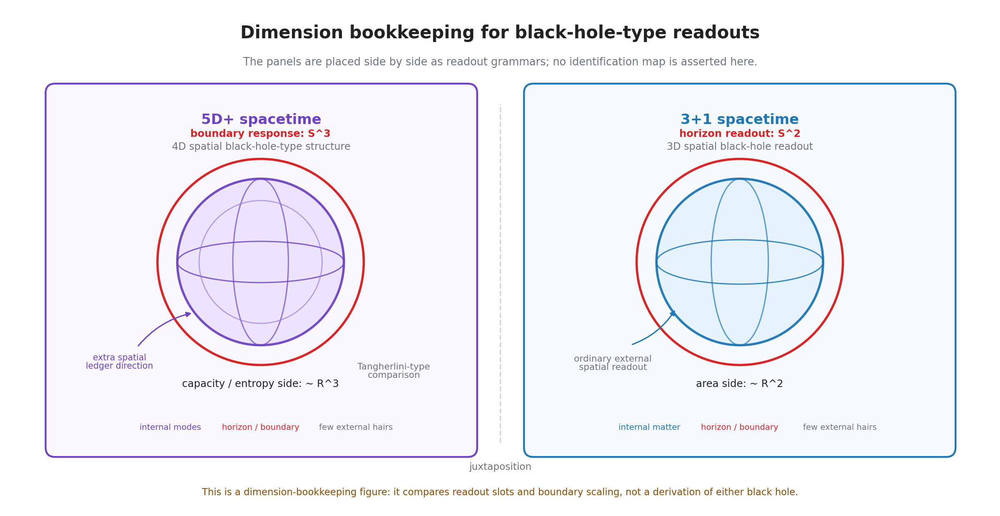

# 第16章 ブラックホール型複合系——無毛定理の先へ

> **この章の問い**：ブラックホールを複合系として読めるか。内部を直接読めず、外部には質量・角運動量・電荷のような少数の毛だけが残るとは、台帳の言葉では何を意味するのか。
> **この章の答え**：本章では、ブラックホール型読出しを、多数の内部モードを持つ複合系が、外部測定面からは少数の保存量と境界応答に粗視化される場合として扱う。地平面は、内部台帳を外部へ単射的に読めない境界であり、外部に残るのは対角項としての質量型・角運動量型・電荷型の毛である。$R$ 共有束、地平面、無毛型読出し、QNM 離散構造、エントロピー係数、Hawking 放射の準位構造は、本章では標準理論と接続しうる候補として整理する。ただし、一般相対論、ブラックホール熱力学、Hawking 放射、量子重力、情報問題を導出したとは言わない。

**【高校向・読み下し】** ブラックホールは、外から見ると「重さ」「回転」「電気」くらいしか分からない、と言われる。中に何が落ちたかを細かく読むことはできない。この本では、これを「情報が消えた」とすぐには言わない。むしろ、内部にはたくさんの台帳があっても、外から読める窓が極端に狭いため、少数の毛だけが外に残る、と読む。地平面とは、その窓の境界である。

先に用語をほどいておく。**ブラックホール型読出し**とは、内部の詳細台帳が外部測定面から直接読めず、少数の保存量と境界応答だけが残る読出し候補である。**地平面**とは、内部台帳を外部へ単射的に読めない境界として扱う。**無毛型読出し**とは、外部から読める毛が質量型・角運動量型・電荷型など少数に粗視化されることである。**$R$ 共有束**とは、多数の内部モードが一つの質量型・スケール型読出しとして束ねられる候補である。**QNM** とは、ブラックホール摂動で現れる準固有振動であり、本章では地平面を持つ複合系の境界応答候補として扱う。（いずれも→用語集）

---

## 16.1 第VII部の中での位置

第15章では、複合系ともつれを、複数の部分系が親台帳や共有境界を持つ構造として整理した。本章では、その共有構造がさらに極端になり、外部から内部を直接読めない場合を見る。

ブラックホールは標準理論では一般相対論の解として扱われる。地平面、特異点、面積定理、熱力学、Hawking 放射、情報問題など、多くの深い構造を持つ。本章はそれらを置き換えない。

本章で行うのは、次の整理である。

| 層 | 本章で扱うこと | まだ扱わないこと |
|---|---|---|
| 地平面 | 外部読出しが内部台帳へ単射的に届かない境界として読む | 事象地平面の厳密な時空幾何の導出 |
| 無毛型読出し | 外部に残る毛を $M,J,Q$ 型の保存量として整理する | Kerr-Newman 解や無毛定理の証明 |
| 複合系 | 多数の内部モードが一つの外部対象へ粗視化される候補 | 具体的な微視状態の完全構成 |
| エントロピー | 内部不可読性と境界セル数の対応候補 | 標準的な Bekenstein-Hawking 公式そのものの導出 |
| 放射 | 境界を通じた外部記録への漏れ候補 | Hawking 放射スペクトルの導出 |

この章は、第2巻の相互作用編の締めとして、共有台帳・接続・粒子種・崩壊・複合系を、極端な遮蔽構造へ接続する。

## 16.2 ブラックホール型読出しは内部不可読性の極限である

通常の複合系では、内部の一部を測定したり、スペクトルを読んだり、散乱で構造を推定したりできる。ブラックホール型読出しでは、この内部読出しが極端に制限される。

本章では、ブラックホール型読出しを次のように置く。

> **ブラックホール型読出し ＝ 多数の内部モードを持つ複合系が、外部測定面からは少数の保存量と境界応答に粗視化される読出し候補。**

この定義では、内部が存在しないとは言わない。内部を外部記録へ直接写せない、ということである。外部からは、内部のどの粒子がどの経路を通ったかではなく、全体としての質量型、角運動量型、電荷型、境界面積型の応答が読まれる。

| 内部側 | 外部側に残る顔 |
|---|---|
| 多数の内部モード | 質量型の総量 |
| 内部の回転・巻き | 角運動量型の毛 |
| 符号付き内部位相 | 電荷型の毛 |
| 境界セル・不可読自由度 | エントロピー型の読出し候補 |
| 境界応答 | QNM や放射候補 |

この表は、ブラックホール微視状態を構成したものではない。外部測定から読める量が少数に粗視化される、という読出し構造を整理したものである。

## 16.3 地平面は単射読出しが切れる境界である

地平面は、標準的には外へ戻れない境界として説明される。本書では、その物理的意味を尊重しつつ、読出しの言葉では次のように扱う。

> **地平面 ＝ 内部台帳を外部記録へ単射的に写せない境界。**

単射的に写せないとは、内部の異なる詳細状態が、外部からは同じ記録に落ちるということである。第8章の外部測定で見たように、外部読出しは一般に非単射である。ブラックホール型読出しでは、この非単射性が極端になる。

地平面には、少なくとも三つの読みがある。

| 読み | 内容 |
|---|---|
| 不可読境界 | 内部の詳細台帳を外部へ直接読めない |
| 粗視化境界 | 多数の内部状態が同じ外部毛へ畳まれる |
| 所属境界 | どの記録が外部側に属し、どの記録が内部側に残るかを分ける |

ここで注意する。地平面を「情報が完全に消える場所」と断定しない。外部読出しに出ないことと、内部台帳が無いことは同じではない。本章で言う不可読性は、外部測定面からの読出し制限である。

## 16.4 無毛型読出し

標準的なブラックホール物理では、定常ブラックホールは質量、角運動量、電荷のような少数の量で特徴づけられるとされる。この方向の結果は、無毛定理として知られる。

本章では、これを台帳の言葉で次のように読む。

> **無毛型読出し ＝ 内部の詳細な係数列や符号構造が外部へ出ず、外部には少数の保存量型読出しだけが残ること。**

外部に残る毛は、模式的には次のように整理できる。

| 毛 | 台帳側の候補 | 注意 |
|---|---|---|
| $M$ | $R$ 側の質量型・ノルム型の総読出し | 内部モードの総量として読む候補 |
| $J$ | 回転・巻き・角運動量型の読出し | 内部回転構造そのものの完全情報ではない |
| $Q$ | 符号付き内部位相・電荷型の読出し | $Q$ 軸そのものとの同一視ではない |
| 面積型 | 境界セル数・不可読自由度の候補 | エントロピー公式の導出ではない |

この読みでは、無毛とは「内部に何もない」ことではなく、「外部へ読める毛が少数に限られる」ことである。

ただし、本章では Israel、Carter などの標準的な無毛定理を証明しない [24][25]。また、Kerr 解、Reissner-Nordstrom 解、Kerr-Newman 解を導出しない。ここで扱うのは、無毛型の外部読出しが台帳の粗視化として自然に置ける、という構造である。

## 16.5 $R$ 共有束としてのブラックホール型複合系

第10章では、$R$ 側をノルム・スケール・曲率・質量型読出しの候補として扱った。ブラックホール型複合系では、この $R$ 側の共有が極端に強い形で現れる可能性がある。

本章では、次の仮説を置く。

> **$R$ 共有束仮説 ＝ 多数の内部モードが、外部からは一つの強い質量型・スケール型読出しとして束ねられる場合、ブラックホール型複合系として読める可能性がある。**

これは、ブラックホールを通常の粒子と同一視する主張ではない。多数の内部台帳が外部には一つの $R$ 側読出しとして束ねられ、内部の個別差が読めなくなる極限を、ブラックホール型読出しの候補として置く、という意味である。

| 普通の複合系 | ブラックホール型複合系候補 |
|---|---|
| 内部スペクトルを外部から一部読める | 内部詳細は外部へほぼ単射的に読めない |
| 複数の粒子種や準位が区別される | 少数の毛へ粗視化される |
| 境界を越えた散乱で構造を推定できる | 地平面が読出し境界として働く |
| 束縛状態として再識別される | 境界応答と毛として再識別される |

ここから、実在の天体ブラックホールの形成過程や内部構造は出ていない。重力崩壊、時空特異点、宇宙検閲仮説、量子重力は、本章の外に残る。

## 16.6 エントロピー型読出しと境界セル

ブラックホールのエントロピーは、標準理論では地平面面積に比例する量として扱われる。本書では、その標準形を置き換えない。

本章で言えるのは、内部が外部へ直接読めない場合、外部に残る不可読性の量を境界セル数として読む候補がある、ということである。

> **エントロピー型読出し ＝ 外部から区別できない内部台帳の多さを、境界面に落ちた容量として読む候補。**

この読みは、Bekenstein-Hawking エントロピーの標準公式と親和性を持つ [22]。また、別系列の検証論文では、4次元球の格子体積不足 $\Delta(R)$ と、4+1 次元 Schwarzschild-Tangherlini 型ブラックホールの Bekenstein-Hawking エントロピー $S_{BH}$ との定量的対応を検討している [31]。そこでは、両量が同じ $R^3$ スケーリングを持ち、Planck 単位での漸近比が

$$
\frac{\Delta(R)}{S_{BH}}\to \frac{32}{3\pi}
$$

となることを示している。この具体的な数値は、本章の基礎文法からここで導出するものではなく、別系列の検証論文 [31] における格子計算の結果として参照している。ただし、本章ではこの対応を、標準的なブラックホール熱力学そのものの導出、またはブラックホール微視状態の完全な計数とは扱わない。

したがって、本章での扱いは次に限る。

| 言えること | 言えないこと |
|---|---|
| 内部不可読性を境界容量として読む候補がある | 標準的な Bekenstein-Hawking 公式そのものを導出した |
| 境界セル数とエントロピー型読出しは相性がよい | ブラックホール微視状態を完全に数えた |
| $R$ 側のスケール読出しと面積型表示は接続候補を持つ | 3+1 次元ブラックホール熱力学を再構成した |

## 16.7 QNM と Hawking 放射をどこまで読むか

ブラックホールには、摂動に対して減衰する準固有振動、すなわち QNM が現れる。また、量子場論的には Hawking 放射が知られている。

本書では、これらを次のような読出し候補としてだけ扱う。

| 構造 | 本章での読み | 主張しないこと |
|---|---|---|
| QNM | 地平面を持つ複合系の境界応答候補 | QNM スペクトルの計算 |
| Hawking 放射 | 境界を通じて外部記録へ漏れる準位遷移候補 | Hawking 放射の導出 |
| 面積準位 | 境界容量の離散化候補 | Bekenstein-Mukhanov 型スペクトルの導出 |
| 蒸発 | 内部容量が外部記録へ移る候補 | 蒸発率や寿命の計算 |

QNM や Hawking 放射は、ブラックホール型複合系を検証するうえで重要な接点になりうる。しかし、本章では具体的スペクトルや温度を計算しない。標準的な Hawking 計算、Bogoliubov 変換、量子場の真空選択、曲がった時空上の場の量子論は、この章の外に残る。

ここで重要なのは、予言と未計算部分を混ぜないことである。QNM 離散構造、エントロピー係数、Hawking 放射の準位構造は、台帳モデル側で将来照合すべき予言在庫であって、本章で確定した結果ではない。

## 16.8 情報問題を解いたとは言わない

ブラックホールを語るとき、情報問題は避けられない。内部に落ちた情報はどうなるのか、Hawking 放射は情報を運ぶのか、ユニタリ性は保たれるのか、という問題である。

本書の台帳語では、次の区別を保つ。

| 区別 | 内容 |
|---|---|
| 内部台帳があること | 内部側の構造を仮定または記述すること |
| 外部から読めること | その構造が外部記録へ単射的に出ること |
| 相関が残ること | 外部記録の間に内部由来の制約が残ること |
| 情報問題を解くこと | 標準理論の時間発展と放射の全過程で矛盾を消すこと |

本章は、最後の意味で情報問題を解かない。内部不可読性と外部毛の粗視化を整理するだけである。ファズボール、相補性、ホログラフィー、島公式などの現代理論は、本章では参照対象に留める [26]。

したがって、本章の主張は、情報問題の解決ではなく、情報問題を台帳の読出し制限として言い直す入口である。

## 16.9 本章の境界

本章で確定したことと、まだ置いていないことを分ける。

| 区分 | 内容 |
|---|---|
| 定義 | ブラックホール型読出し、地平面、無毛型読出し、$R$ 共有束、エントロピー型読出し |
| 構成 | 内部台帳が外部へ単射的に読めず、少数の毛と境界応答へ粗視化される構造として置いた |
| 対応 | 無毛定理、地平面、エントロピー、QNM、Hawking 放射との接続候補 |
| 仮説 | $R$ 共有束、境界セル、QNM 離散構造、Hawking 放射の準位構造 |
| 主張しないこと | 一般相対論、Kerr 解、標準的な Bekenstein-Hawking エントロピー公式そのもの、Hawking 放射、量子重力、情報問題の導出 |

本章の役割は、ブラックホールを、内部不可読性と少数の毛へ粗視化される複合系として読む候補を整理することである。ここで第2巻の相互作用編は一区切りとなる。次の検証編では、どこまでが計算済みで、どこからが予言在庫で、どこに撤回済み主張があるかを整理する。

## この章のまとめ

| 区分 | 内容 |
|---|---|
| 定義・構成 | ブラックホール型読出し、地平面、無毛型読出し、$R$ 共有束、エントロピー型読出し |
| 整理・確認したこと | 内部の詳細が外部へ直接読めず、少数の毛と境界応答だけが残る読出しを、台帳の粗視化として置けること |
| 対応 | 無毛定理、地平面、Bekenstein-Hawking 型エントロピー、QNM、Hawking 放射 |
| 仮説 | $R$ 共有束、境界セル数、QNM 離散構造、Hawking 放射の準位構造 |
| 主張しないこと | 一般相対論、標準的なブラックホール熱力学そのもの、Hawking 計算、量子重力、情報問題の導出 |
| 次章への問い | 本書で整理した構造のうち、どこまでが検証済みで、どこからが予言在庫で、どの主張は撤回済みなのか |
