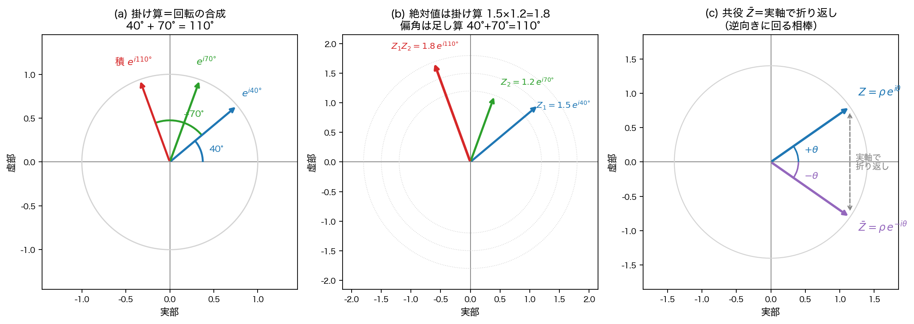
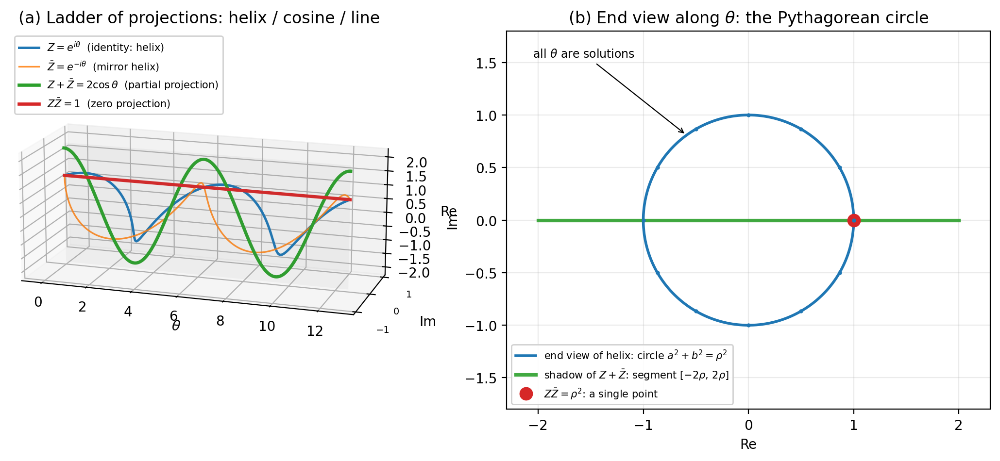
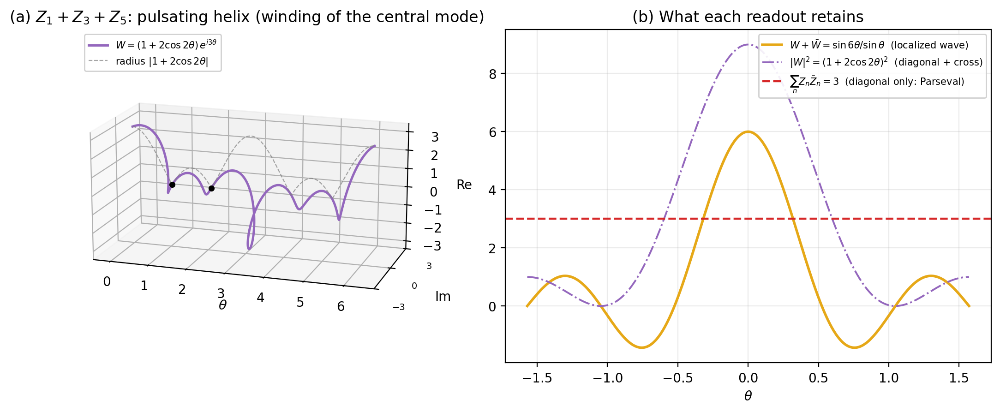
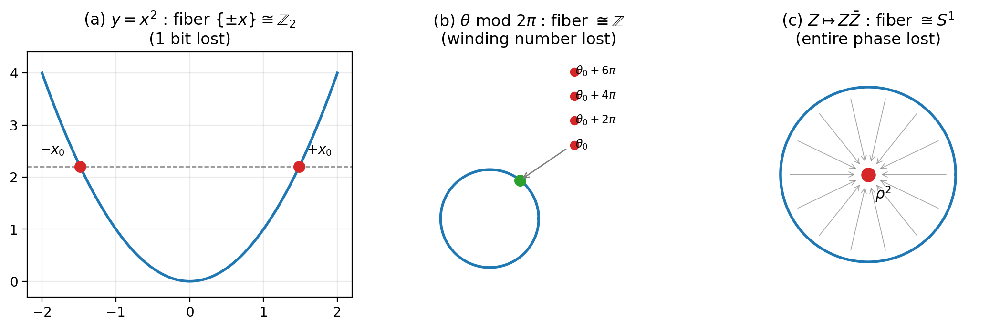
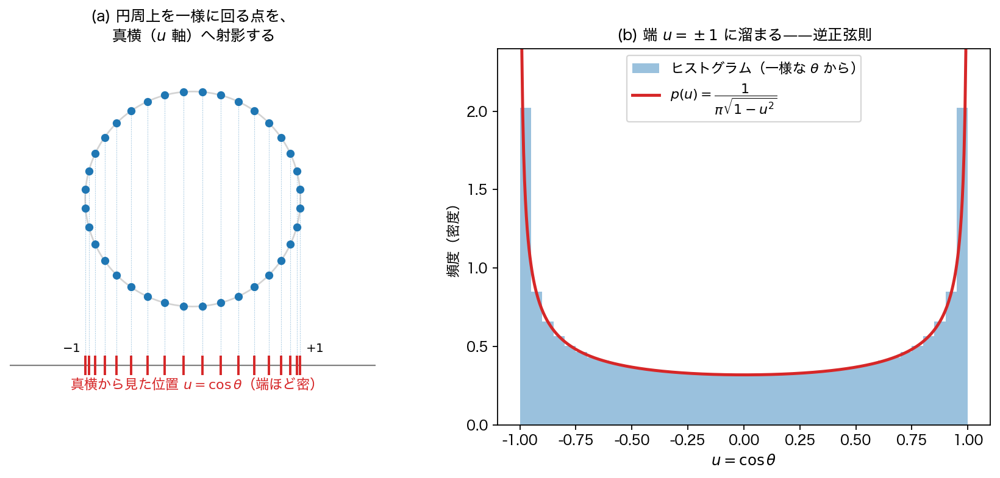

# 第1章 二つの積と射影の階梯

> **この章の問い**：なぜ共役を取るのか。読出しは何を保存し、何を失うか。
> **この章の答え**：複素数 $Z$ から作れる代表的な2乗型の読出しには、共役積 $Z\bar{Z}$ と非共役積 $Z^2$ がある。共役積は位相の連続自由度全体を失い、非共役積は符号1ビットだけを失う。さらに、読出しは恒等・部分・零射影の**階梯**をなし、「失われるもの」はファイバーの構造として分類できる。

**【高校向・読み下し】** 前章では、ランプが2個あると「そろっている／そろっていない」の1ビットが読めることを見た。本章では、ランプを**つまみ（角度）**を持つものに取り替える。つまみの向きは、数学Ⅲでいう複素数の偏角である。ここで問題になるのは、つまみの向きをどんな読み方で読むかである。相棒に**逆回しのコピー**（共役——本章の 1.1 節で定義する。→用語集）を掛けると、角度の情報は全部消えて、半径だけが残る。相棒に**自分自身**を掛けると、角度は2倍になってほぼ残るが、「正反対の向き」は区別できなくなる。つまり本章は、読み方ごとに「何が残り、何が取り戻せなくなるか」を仕分けする章である。

題名の新語もここで訳しておく。**射影**とは「影を落とすこと」——立体に光を当てて平らな影を読むように、情報の一部を落として読む写像のこと。**階梯（かいてい）**とは、はしご・階段のことで、ここでは「恒等・部分・零射影」＝「失わない／少し失う／全部失う」という**失い方の三段**を指す。「ファイバー」は、読出しの値からは取り戻せなくなった入力候補の集まりのことで、本文中で例と一緒に導入する。複素対（共役対）とは、互いに共役な2つの複素数のひと組 $\{Z, \bar{Z}\}$ のことである。（いずれも→用語集）

---

## 1.1 二つの積

前章のランプは、便宜上「点いているか、消えているか」と呼んだ二値だった。ただし、その呼び名自体に絶対の意味はなかった。本章では、その二値をさらに便宜上 $+1$ と $-1$ に置き換えて眺める。数直線上の $+1$ と $-1$ は、複素平面で言えば、**単位円が実軸と交わる2点**である。本章では、この2点の「間」を許す。ランプを、明/暗の2段階スイッチから、目盛りが円になっている**つまみ（ダイヤル）**に取り替えるのである。つまみの向きを角度 $\theta$ で表すと、$\theta = 0$ が $+1$、$\theta = \pi$（180°）が $-1$ にあたり、2つしかなかった状態が円周上の連続な状態に拡張される。この「つまみの向き」を、物理・工学の慣例に従って**位相**と呼ぶ——数学Ⅲの言葉では**偏角**そのものである。

記号の約束を先にしておく。複素数 $Z = a + ib$（$a, b \in \mathbb{R}$）は複素平面の点であり、原点からの距離 $\rho = |Z| = \sqrt{a^2 + b^2}$（絶対値）と偏角 $\theta$ を使って $Z = \rho(\cos\theta + i\sin\theta)$ と書ける——ここまでは数学Ⅲの極形式である。本書ではこれを

$$Z = \rho\, e^{i\theta}, \qquad e^{i\theta} := \cos\theta + i\sin\theta$$

と**略記**する（Euler の記法）。「$e$ の虚数乗」という見た目に深い意味を求めなくてよい——右辺の三角関数の組に付けた略号だと思ってよい。この略記の利点はただ一つ、**掛け算で位相が足される**ことが指数法則の形で見えることだ：

$$e^{i\theta_1} \cdot e^{i\theta_2} = e^{i(\theta_1 + \theta_2)}$$

これは数学Ⅲで学んだ「複素数の積では、絶対値は掛け算、偏角は足し算」（ド・モアブルの定理の中身）を、指数の肩に載せて書き直しただけである。記号をもう一つ約束しておく。複素数の**実部・虚部**を $\mathrm{Re}$、$\mathrm{Im}$（Real／Imaginary の頭文字）と書く：$Z = a + ib$ なら $\mathrm{Re}\,Z = a$、$\mathrm{Im}\,Z = b$ である。

もう一つ、本書の主役の記号を約束する。本書では複素数を $Z = a + ib$ と大文字で書き、$Z$ と**共役**な複素数を、上にバーを付けて $\bar{Z} = a - ib$ と書く。なぜ虚部の符号を変えただけで「逆回しの相棒」になるのか——極形式で表すと見える：

$$Z = a + ib = \rho(\cos\theta + i\sin\theta)$$

$$\bar{Z} = a - ib = \rho(\cos\theta - i\sin\theta) = \rho(\cos(-\theta) + i\sin(-\theta))$$

最後の変形は、$\cos$ は偶関数（$\cos(-\theta) = \cos\theta$ だから値は変わらない）、$\sin$ は奇関数（$\sin(-\theta) = -\sin\theta$）を使っただけである。$\sin\theta$ が $\sin(-\theta)$ に変わる——**ダイヤルを逆に回す**とは、この符号のことである。両方の角が $-\theta$ に揃ったので、さきほどの略記に $-\theta$ を入れれば

$$\bar{Z} = \rho\, e^{-i\theta}$$

位相が**逆向きに回る相棒**——本章の主役である（図0(c)：複素平面では、実軸に関する折り返しになっている）。

図0が、この記号の約束の全部である。複素数を掛けるとは「**回して、伸ばす**」操作だ：$Z_2$ を掛けると、相手は $\theta_2$ だけ回り、$\rho_2$ 倍に伸びる（図 (a)(b)）。数値で一つ確かめておこう。$i$ は絶対値 $1$・偏角 $90°$ の複素数（$i = e^{i\,90°}$）だから、「$i$ を掛ける」＝「90°回す」。すると $i \times i$ は「90°回して、もう90°回す」＝「180°回す」＝反対向き、すなわち $-1$。**中学以来の $i^2 = -1$ とは、「90°回転を2回続けると反転する」という幾何の文だった**のである。この「掛け算＝回転」の見方は、本書全体で最後まで使い続ける。

### 用語「共役」——本章で大事な言葉

先へ進む前に、「共役（きょうやく）」という言葉の使い方を確認しておく。複素数の共役は、虚部の符号を反転する標準的な操作である。本書では、この複素共役を出発点にして、「2つでひと組になり、掛けた答えが一定の値に保たれる相棒関係」を、広い意味で共役な対として読む。

**【高校向】** いちばん分かりやすい実例は、波の**波長 $\lambda$ と振動数 $\nu$** の関係である。単位に注目してほしい。

- 振動数 $\nu$ ＝ 1秒あたりの振動回数（**回/秒**）
- 波長 $\lambda$ ＝ 1回の振動で波が進む長さ（**m/回**）
- 掛けると：$\lambda \times \nu$ ＝（m/回）×（回/秒）＝ **m/秒** ——「回」が約分で消えて、**波の速さ** $c$ が出る。

$$\lambda \nu = c$$

理論物理学では**自然単位**という単位の取り方をよく使う。光速 $c$ がちょうど $1$ になるように長さと時間の単位を選び直すのである（「光が1秒で進む距離」を長さの単位にする、と思えばよい）。すると光（光子）では

$$\lambda \nu = 1$$

——**積が 1 に固定される**。積が一定なのだから、波長が2倍になれば振動数は半分。数学の言葉で言えば $\nu = 1/\lambda$、つまり**反比例のペア**（グラフは双曲線）である。本書では、このように「積が一定の値に固定され、片方が増えれば片方が減る」2量の組を、広い意味で**共役な対**と呼ぶ。ただし、これは本書での広い用法であり、数学の標準用語としての複素共役や、解析力学の正準共役と同一視するものではない。

ここで使っているのは、波長や振動数が複素平面で回転している、という意味ではない。物理の波長・振動数そのものは正の量である。ここで借りているのは、**積が固定され、片方が増えると相棒が減る**という相棒関係の型だけである。

では、**共役複素数**では何が起きるのか。$Z$ と $\bar{Z}$ の積は $Z\bar{Z} = \rho^2$ になり、位相は $+\theta$ と $-\theta$ で足すとゼロになる。$\lambda$ と $\nu$ が「積 $=1$・（対数を取れば）足してゼロ」のペアとして読めるのと、同じ型の相棒関係がここにも現れる。本書では、この対応を後の章で正確な形にしていく。

本章でいう複素対（共役対）とは、この相棒同士のひと組 $\{Z, \bar{Z}\}$ のことである。（→用語集）

### 第0章との接続——共役対は、2つのランプを内蔵している

第0章では、「違いがわかる」には比較できる2項が必要だと確認した。共役対は、その比較相手を**内蔵している**ように読める。いま導入した $\lambda\nu = 1$ で、簡単な読出し例を見ておこう。ここでの ON/OFF は、共役対の働きを見るための**仮の読出し例**であり、実際の物理的な検出を定義しているわけではない。「2乗して、1より大きければON、1より小さければOFF」と読むことにする。ここで使う $1$ は、積が $1$ に固定されているこの例の釣り合い点であり、2乗は符号を消して「基準より上か下か」だけを見るための仮の読出しである。

- $\nu = 1,\ \lambda = 1$（釣り合いの点）：$\nu^2 = 1$、$\lambda^2 = 1$——両方とも境界の上。**違いなし**。
- $\nu = 2,\ \lambda = 1/2$：$\nu^2 = 4$、$\lambda^2 = 1/4$——片方ON・片方OFF。**違いあり**。
- 一般に、積が $1$ に固定されているから $\lambda^2 = 1/\nu^2$——片方の2乗が $1$ より大きければ、相棒の2乗は**必ず** $1$ より小さい。**片方が基準から上に出れば、相棒は必ず下に出る。**

つまり共役対は、比較の相手を外から持ってこなくても、**自分の中に「2つのランプ」を持っている**ように扱える。積の固定が、違いを「対」の形で作り出すからである。ここで本章が取り出したいのは、$\nu$ 側・$\lambda$ 側という名前ではなく、「釣り合いから外れているか」だけである。ラベルまで読むならどちらが大きいかも分かるが、ラベルを忘れて第0章の無名な2項と同じ読み方に落とすと、残るのは「違いあり／なし」の1ビットだけになる。第0章の「そろっている／そろっていない」の区別が、掛け算の世界で再び現れている。

符号つきの量として代数だけを見るなら、負の場合も同じである。これは物理の波長や振動数が負になるという意味ではなく、同じ反比例の式を符号つきの実数へ広げたときの確認である。$\nu = -2,\ \lambda = -1/2$ も $\lambda\nu = 1$ を満たすが、2乗すれば $4$ と $1/4$ で、正の場合と**同じ読み**になる。読みから消えるのは、全体の符号をそろって変える $(\nu, \lambda) \to (-\nu, -\lambda)$ である。これは第0章の「0/1 の呼び名に意味がない」という制限の連続版と見ることができる。ここでは、2乗が全体符号を消すことだけを確認しておけばよい。

### 複素数の中の二つの成分

実は、この「対で違いを作る」仕掛けには、実数の対と複素数とで、面白い差がある。

実数の対 $(\nu, \lambda)$ には、両方のランプが**同時に**釣り合いに来てしまう盲点があった——$\nu = \lambda = 1$ である。共役対 $\{Z, \bar{Z}\}$ にも、同種の点は残る：2つの位相差は $2\theta$ だから、実軸上（$\theta = 0°, 180°$）では $Z = \bar{Z}$ となって、対の違いが消える。ここで、複素数を成分に分けて見ると、別の判別の仕組みが見えてくる。

$Z = a + ib$ の成分は $a = r\cos\theta$、$b = r\sin\theta$ である。つまり一つの複素数は、**振れ方が互いに90°ずれた2つの実数成分**として読める（$\sin\theta = \cos(\theta - 90°)$ だから、$b$ は $a$ の「90°遅れコピー」である）。ここでは $a$ と $b$ は実部・虚部という役割で区別されているので、第0章の無名なランプより情報が多い状況である。そのうえで、この2つに「正ならON・負ならOFF」の読出しを与えて、$\theta$ をぐるりと回してみる：

| 象限 | $a$ のランプ | $b$ のランプ |
|---|---|---|
| 第1（0°〜90°） | ON | ON |
| 第2（90°〜180°） | OFF | ON |
| 第3（180°〜270°） | OFF | OFF |
| 第4（270°〜360°） | ON | OFF |

4つの状態はすべて異なる——実部・虚部という役割つきの2成分なら、四つの象限が区別できる。しかも90°進むたびに、必ずどちらか**片方だけ**が切り替わる：状態は毎回変わるが、一度に変わるのは1ビットだけ、という規則的な巡回である（工学ではグレイコードと呼ぶ。→用語集）。さらに、$i$ を掛ける（＝90°回す）とは、この表を**1行進める**操作そのものである。

ここで効いているのが、90°のずれである。$a$ のランプが境界に来る瞬間（$a = 0$、ONかOFFか判定できない）、$b$ は必ず $\pm r$ で振り切れている。$a^2 + b^2 = r^2 > 0$ だから、**2つが同時に境界に来ることはない**——90°ずらした成分は、互いの境界を避ける配置になっている。

そして最初から見えていたとおり、半径 $r$ は、どれだけ回しても**変わらない**——変わらない量（保存量）である。一つの複素数の中に、「変わらない量 $r$」と「位相に応じて切り替わる成分 $(a, b)$」が同居している。この同居は、本章の後半で「保存されるもの」と「読出しで失われるもの」の関係として整理され、90°ずらしの成分対は第3章で改めて主役になる。

では、「読む」と「消える」を、正確な言葉にしよう。

次に、本書全体で使う二つの言葉を、いちばん簡単な例で決めておく。「読出し」は工学では日常語、「喪失」はふつうの日本語だが、本書ではこの二語に、次の正確な意味を与えて専門用語として使う（本書での用法である）。

**「読出し」**とは、写像 $f: X \to Y$ を適用することである。写像 $X \to Y$ とは、$X$ を決めると $Y$ の答えが**一つに決まる**、ということだ。

**【高校向】** 写像の記法 $f: X \to Y$ は第0章で導入した——「入口が $X$、出口が $Y$」の宣言で、学校の $y = f(x)$ と中身は同じものである（$y = x^2$ なら、宣言は $f: \mathbb{R} \to \mathbb{R}$、対応の中身は $f(x) = x^2$——二つで一組）。記号を二つ足しておく：複素数全体の集合を $\mathbb{C}$（Complex の頭文字）と書き、$a \in \mathbb{R}$ は「$a$ は実数全体の集合 $\mathbb{R}$ の要素（中の一つ）」と読む。この宣言の書き方が本書で効くのは、**入口と出口の広さ**が見えるからだ——たとえば共役積の読出しは $f: \mathbb{C} \to \mathbb{R}$、つまり**複素数（平面）を入れると実数（直線）が返る**。平面から直線へ——入口より出口が狭く、何かが失われそうだということが、宣言を見ただけで予感できる。（→用語集）

**「喪失」**とは、その逆——$Y$ から $X$ を求める逆演算 $Y \to X$ の答えが**一つに決まらない**——ことである。

最も単純な例が $y = x^2$ である。読出しは自明だ：$x = 1$ なら $y = 1$。しかし逆に $y = 1$ から $x$ を求めると、答えは $\pm 1$ の**二つ**ある。ここで「喪失」が起きている——$y$ の値だけからは、$x$ がどちらだったかを復元できない。この「復元できない答えの集まり」（いまの例では $\{+1, -1\}$）を、数学の言葉で**ファイバー**（逆像 $f^{-1}(y)$）と呼ぶ。

要するに、同じ読出し値に潰れてしまった入力たちの集まりが、ファイバーである。

**【高校向】** 記号 $f^{-1}$ に、ここで注意を一つ。数学Ⅲで習った**逆関数**の記号と同じ顔をしているが、意味が違う。逆関数 $f^{-1}$ という「新しい関数」は、対応が1対1のときに**しか**存在しない——まさに $y = x^2$ では、定義域を $x \geq 0$ に制限しない限り逆関数は作れない、と学んだはずである。ここでの $f^{-1}(y)$ は関数の適用ではなく、「**$f(x) = y$ となる入力 $x$ の集まり**」を表す**集合の記法**で、この集まりを**逆像**と呼ぶ。逆関数が存在しないときでも、逆像はいつでも定義できる。そして本書の関心は、まさにそこにある——**逆関数が作れない（＝喪失がある）読出しでこそ、逆像が2個以上の要素を持ち、その大きさが喪失の量を測る物差しになる**。本章は、このファイバーの大きさで喪失の度合いを分類していく。

なお、数学の標準用語では、喪失が起きること＝写像が**単射でない**（どの2つの入力も必ず違う出力に行く「1対1」の性質が、成り立っていない）ことに当たる。また、喪失は「逆の答えが一意でない」という写像の性質についての主張であって、読み出されなかった値が「実在するか」については、本書は立ち入らない（この点は第4章で再訪する）。

準備ができたので、本章の主役の対を定義する。

**定義 1.1（二つの積）**. 複素数 $Z$ を「2乗して読む」方法は、掛ける相棒に何を選ぶかで二つある。

**共役積**——相棒に共役 $\bar{Z}$ を選ぶ：

$$Z\bar{Z} = (a + ib)(a - ib) = a^2 + b^2 = \rho^2 \qquad \text{位相は } \theta + (-\theta) = 0 \text{ ——消える}$$

**非共役積**——相棒に自分自身 $Z$ を選ぶ：

$$ZZ = Z^2 = (a + ib)^2 = (a^2 - b^2) + 2iab = \rho^2 e^{i2\theta} \qquad \text{位相は } \theta + \theta = 2\theta \text{ ——2倍で残る}$$

複素数の掛け算そのものは一種類しかない。「二つの積」とは、**掛ける相手を共役にするか、しないか**という読出し方の対比の略称である。なお「共役積」「非共役積」という名前は**本書での呼び名**で、一般用語ではない——標準的には、前者は「絶対値の2乗 $|Z|^2$」と呼ばれるだけで固有名がなく、後者はただの「$Z$ の2乗」である（形式としては、大学の線形代数でエルミート形式・双線形形式という正式名が付いているが、本書を読むのにその名前は要らない）。

**命題 1.2（情報収支）**. $Z \neq 0$ とする。(i) 写像 $Z \mapsto Z\bar{Z}$ で出力が $c = \rho^2 > 0$ となる入力の集まり（ファイバー）は、円周 $\{\sqrt{c}\, e^{i\theta} : \theta \in [0, 2\pi)\}$ **全体**である。この型のファイバーを、円周の記号 $S^1$ で表す。(ii) 写像 $Z \mapsto Z^2$ のファイバーは $\{+Z, -Z\}$ の**2点**である。この型（2元で、符号反転で互いに移り合う）のファイバーを、記号 $\mathbb{Z}_2$ で表す。（$Z = 0$ ではいずれも一点に退化する。）

*証明*. (i) $Z\bar{Z} = \rho^2 e^{i(\theta - \theta)} = \rho^2$ は $\theta$ を含まない。方程式 $Z\bar{Z} = c$ の解集合は半径 $\sqrt{c}$ の円周全体である——「解が存在しない」のではなく「**すべての $\theta$ が解**」であることに注意する。(ii) $Z_1^2 = Z_2^2 \iff (Z_1 - Z_2)(Z_1 + Z_2) = 0 \iff Z_2 = \pm Z_1$。∎

命題名の「情報収支」とは、読出しの前後で、情報がいくら残り・いくら失われたかの決算、という意味の、本書での命名である（一般用語ではない）。抽象的なままでは掴みにくいので、実際に値を入れてこの決算を確かめよう。$Z = 3 + 4i$ とする（$a = 3$, $b = 4$）。

**共役積（読出し①）**：

$$Z\bar{Z} = (3 + 4i)(3 - 4i) = 9 - (4i)^2 = 9 + 16 = 25$$

**非共役積（読出し②）**：

$$Z^2 = (3 + 4i)(3 + 4i) = 9 + 24i + 16i^2 = (9 - 16) + 24i = -7 + 24i$$

さて、逆向きに問う。**出力だけ渡されて、入力 $Z$ を当てられるか？**

読出し①の出力「$25$」を渡された場合。$Z\bar{Z} = a^2 + b^2 = 25$ を満たす入力は、$3+4i$ のほかに $4+3i$（$16+9=25$）、$5$（$25+0=25$）、$5i$、$-3-4i$、……と、**半径 $5$ の円周上の点すべて**（連続無限個）が候補になり、絞り込む手がかりは出力のどこにも残っていない。この「復元できない候補の円周」が、命題の (i) が言うファイバー $S^1$ である。

読出し②の出力「$-7 + 24i$」を渡された場合。$Z^2 = -7 + 24i$ を満たす入力は $3+4i$ と $-3-4i$ の**二つだけ**である（実際、$(-3-4i)^2 = 9 + 24i + 16i^2 = -7 + 24i$ で確かに一致する）。さっき①で候補だった $4+3i$ は、$(4+3i)^2 = 16 + 24i - 9 = +7 + 24i$ となって出力が違うから、②なら区別できる。失われたのは全体の符号 $\pm$ の1ビットだけ——これが命題の (ii) が言うファイバー $\mathbb{Z}_2$ である。

同じ「二乗」の顔をした二つの読出しが、片方は円周まるごと（無限個）、片方は符号1ビットだけを忘れる——この非対称が、以下すべての出発点になる。

ここが本章の第一の要点である。**二つの積は「何を忘れるか」が正確に違う**：共役積は位相の連続無限（$S^1$）を捨てて実数1個を返し、非共役積は符号の1ビット（$\mathbb{Z}_2$）だけを捨ててほぼ全部を保つ。

なぜ共役を掛けると位相が消えるのか、成分 $(a, b)$ のままの展開でからくりを見ておく。$(a+ib)(a-ib) = a^2 - (ib)^2 = a^2 + b^2$——展開すれば交差項 $+iab$ と $-iab$ が現れて相殺する。共役の符号反転が交差項を打ち消し、平方和だけを残すのである。**共役積とは、平方和を取り出す代数装置である。** 一方、非共役積の成分は

$$\mathrm{Re}\,Z^2 = a^2 - b^2 = (a+b)(a-b), \qquad \mathrm{Im}\,Z^2 = 2ab$$

——実部は和と差の積（差の構造）、虚部は二成分の交差項であり、「差の判別」と「交差」が実部・虚部に自動的に振り分けられている。

ここで一つ、見逃せないことがある。二つの読出しが**独立**とは、片方の値を知っても、もう片方の取り得る値に何の制限もかからないことを言う（数学Aの確率で習う「独立」と同じ発想だが、ここでは確率の話ではない。→用語集）。では、二つの積は独立だろうか。さきほどの $Z = 3 + 4i$ の結果で試してみる。読出し①は $25$、読出し②は $-7 + 24i$ だった。②の実部と虚部を2乗して足すと

$$(-7)^2 + 24^2 = 49 + 576 = 625 = 25^2$$

——**①の2乗にぴったり一致する**。つまり「①$= 25$」と知った瞬間、②はもう自由ではない：実部²＋虚部²＝$625$、すなわち半径 $25$ の円周上に**縛られる**。たとえば②が $7 + 25i$ になることは決してない（$49 + 625 = 674 \neq 625$）。二つの積は独立ではないのである。この縛りを一般の式にしたのが、次の恒等式である。

**命題 1.3（拘束恒等式）**. $(a^2 + b^2)^2 = (a^2 - b^2)^2 + (2ab)^2$。

*証明*. $\rho^4 = |Z^2|^2 = (\mathrm{Re}\,Z^2)^2 + (\mathrm{Im}\,Z^2)^2$。∎

左辺は共役積の2乗、右辺は非共役積の実部・虚部の平方和。二つの読出しを互いに縛る恒等式（＝どんな $a, b$ を入れても成り立つ式）だから、本書では**拘束恒等式**と呼ぶことにする——この名前は本書での呼び名で、一般にはブラーマグプタ–フィボナッチ恒等式（二平方恒等式）の特別な場合として知られている式である。この式に $a = 2, b = 1$ を入れてみてほしい：$(4+1)^2 = (4-1)^2 + 4^2$、すなわち $5^2 = 3^2 + 4^2$——この章の例に使ってきた $(3, 4, 5)$ は、実はこの式が量産する組の最初の一つである。この恒等式は、直角三角形の整数辺の組（ピタゴラス三つ組）を作り出す、Euclid（ユークリッド）以来の生成公式と同一なのである。

## 1.2 射影の階梯

以下、本節では $\rho > 0$ を固定した円周上の写像として読出しを比較する。$\rho^2$ は $Z\bar{Z}$ で読める、変わらない量（保存量）なので、比較すべき対象は位相 $\theta$ の情報である（$\rho$ も未知とすると、たとえば $Z + \bar{Z} = 2\,\mathrm{Re}\,Z$ のファイバーは直線 $\mathrm{Re}\,Z = \text{const}$ 全体に広がる）。

**命題 1.4（部分射影）**. 和 $Z + \bar{Z} = 2\rho\cos\theta$ は実数であり、写像 $\theta \mapsto \cos\theta$ の一般の値（$\theta \not\equiv 0, \pi$——記号 $\equiv$ は「一周 $2\pi$ 回った分は同じ向きとみなして等しい」の意。高校の整数問題で使う合同式と同じ考え方で、ここでは $2\pi$ を法として、1周ごとに同じ角度とみなす）に対するファイバーは $\{\theta, -\theta\}$、すなわち $\mathbb{Z}_2$ である。通過するのは $\cos$（偶関数）の情報だけで、回転の向き（$\theta$ の符号）が失われる。

*証明*. $\cos$ は偶関数。$\cos\theta_1 = \cos\theta_2 \iff \theta_2 = \pm\theta_1 \pmod{2\pi}$。$\theta \equiv 0, \pi$ ではファイバーは一点に退化する。∎

これで、$Z$ から作れる読出しが**階梯**をなすことがわかる。

| 読出し | 値 | ファイバー | 失うもの |
|---|---|---|---|
| 恒等射影 | $Z$ 自身 | 自明（一点） | 何も失わない |
| 部分射影 | $Z + \bar{Z} = 2\rho\cos\theta$ | $\mathbb{Z}_2$ | 符号（回転の向き） |
| 零射影 | $Z\bar{Z} = \rho^2$ | $S^1$ | 位相全体 |

なお「恒等射影・部分射影・零射影」の三つ組と「射影の階梯」は、**本書での呼び名**である（数学の標準用語の「射影」はこれとは別の正確な定義を持つ語だが、本書では一貫して「影を落とす読出し」の意味で使う）。

幾何的な像を図1に示す。$(\theta, \mathrm{Re}, \mathrm{Im})$ 空間で $Z = e^{i\theta}$ は螺旋、$\bar{Z}$ はその鏡像螺旋である。和 $Z + \bar{Z}$ は実平面 $\mathrm{Im} = 0$ に潰れた余弦波（螺旋の影）、共役積 $Z\bar{Z}$ はうねりが完全に消えた水平の直線——**螺旋 → 余弦波 → 直線**の系列が、恒等 → 部分 → 零射影の階梯の幾何的な姿である。$\theta$ 軸の正面（端面）から見ると、螺旋は円 $a^2 + b^2 = \rho^2$ に潰れる。ピタゴラスの円とは、螺旋から $\theta$ の履歴を捨てた端面図であり、「円の方程式は円周上の点を指定しない」ことが命題 1.2 (i) の幾何的な言い換えになっている。

もう一つ、見逃せない事実がある。保存量 $\rho^2$ を取り出す操作 $Z \mapsto Z\bar{Z}$ こそが、位相に対する零射影である——**「何が保存されるか」と「何が完全に失われるか」は、別々の過程ではなく、一つの積演算の二側面**なのだ。この「保存と喪失は同一演算の表裏」という構図は、この先の章で繰り返し姿を変えて現れる。

**【読み方】** 初読では、ここまでを本章の中心として読めばよい。1.3 節以降は、この中心構造が複数のつまみ、干渉、測度、格子化へどう広がるかを見る発展部である。難しく感じた場合は、先に次章へ進み、必要になったところで戻ってきてよい。

## 1.3 発展：多モードへの拡張

**設定**. つまみ付きランプを $K$ 個に増やす：$Z_n = \rho_n e^{i\theta_n}$（$n = 1, \dots, K$）、和 $W = \sum_{n=1}^{K} Z_n$。以後、この重ね合わせに参加している個々の波 $Z_n$ を**モード**と呼ぶ（→用語集）。

**命題 1.5（二階建ての平方和）**. (i) 各モードは局所的な円 $a_n^2 + b_n^2 = \rho_n^2$ を満たす。(ii) 全成分の平方和は $2K$ 次元空間の球面 $\sum_n (a_n^2 + b_n^2) = \sum_n \rho_n^2 =: R^2$ をなす——記号 $=:$ は「右辺に $R^2$ という名前を付ける」の意。各モードの半径の2乗をぜんぶ足した合計も一定値 $R^2$ に保たれる、というこの有限次元の Parseval 型関係で定まる球面を、本書では便宜上 **Parseval 球**と呼ぶ（→用語集）。(iii) 和の強度は

$$|W|^2 = \underbrace{\sum_n \rho_n^2}_{\text{対角項}} + \underbrace{2\sum_{m<n} \rho_m \rho_n \cos(\theta_m - \theta_n)}_{\text{交差項}}$$

と分解され、対角項は位相に依存せず（零射影の総和）、交差項は位相**差**のみに依存する（$\sum_{m<n}$ は「ペア $(m, n)$ を1回ずつ全部足す」という意味の記号。$K = 3$ なら $(1,2), (1,3), (2,3)$ の3項である）。とくに大域位相の一斉回転 $\theta_n \mapsto \theta_n + \varphi$ の下で $|W|^2$ は不変である。

*証明*. 直接展開。∎

命題名の「二階建て」は本書での命名で、各モードの円（1階）の上に全体の球面（2階）が載る、という平方和の二層構造を指す。

単一モードでは共役積が位相を完全に消した（命題 1.2）。多モードでは対角項（保存・位相非依存）と交差項（位相差のみ）が分離し、**位相の情報は差としてのみ、交差項を通じてのみ、実数値の読出しに現れる**。大域位相は、どれだけモードを増やしても読出しに現れない。絶対的な位相名は読めず、相対的な差だけが読めるのである。

弦の振動で学んだ基本振動・3倍振動・5倍振動……のように、振動数が奇数倍のモードだけを**等しい振幅で**重ねると、何が起きるか。

**命題 1.6（等振幅奇数倍音の分解）**. $Z_k = e^{i(2k-1)\theta}$（$k = 1, \dots, K$）とすると

$$W_K(\theta) = \sum_{k=1}^{K} e^{i(2k-1)\theta} = e^{iK\theta}\,\frac{\sin K\theta}{\sin\theta}.$$

とくに $K = 3$ では $W_3 = (1 + 2\cos 2\theta)\, e^{i3\theta}$——**中央モードの巻き $e^{i3\theta}$ と、脈動する実半径 $1 + 2\cos 2\theta$ への厳密な一分解**である。「**巻き**」とは、一定の速さで回り続ける回転因子（ここでは $e^{i3\theta}$）のことである（正確な定義は第3章で与える。→用語集）。また

$$W_K + \bar{W}_K = 2\sum_{k=1}^{K}\cos(2k-1)\theta = \frac{\sin 2K\theta}{\sin\theta}$$

は $\theta = 0, \pi$ に鋭く**局在**した——波形がその点の近くに集中した——実波形（部分射影の多モード版）を与える（局在 →用語集）。

*証明*. 等比級数の和。$K = 3$ は $e^{-i2\theta} + 1 + e^{i2\theta} = 1 + 2\cos 2\theta$ を括り出す。∎

図2(b) は $K=3$ の場合に、局在波 $W + \bar{W}$（部分射影）・強度 $|W|^2$（対角＋交差）・Parseval 和 $\sum Z_n\bar{Z}_n = 3$（対角のみ、定数）の三者を対比している。この「等振幅の奇数倍音の和が局在波を作る」という事実は、第5章以降で局在を扱うときの準備として記録しておく。

## 1.4 読出しのファイバー階層

**定義 1.7**. 読出し $f: X \to Y$ に**喪失**があるとは、ファイバー $f^{-1}(y)$ が一点でないことをいう（1.1 節で例から導入した「喪失」を、ここで定義として正式に立て直した）。喪失の「大きさ」をファイバーの構造で測る。

**命題 1.8（ファイバー階層）**. 次の読出しのファイバーは、それぞれ次の構造をなす。

| 読出し | ファイバー | 大きさ |
|---|---|---|
| $y = x^2$（$x \in \mathbb{R}$） | $\{\pm x\} \cong \mathbb{Z}_2$ | 1ビット |
| $\theta \mapsto e^{i\theta}$（$\theta \in \mathbb{R}$） | $\{\theta + 2\pi k\} \cong \mathbb{Z}$ | 可算無限（巻き数） |
| $Z \mapsto Z\bar{Z}$ | $S^1$ | 連続無限（位相全体） |

記号と言葉を三つ補っておく。$\cong$ は「**同じ型**」（要素どうしが1対1に対応する）という意味の記号。無限には、整数で番号を振り切れる無限（**可算**——整数全体 $\mathbb{Z}$ がその代表）と、番号を振り切れない無限（**連続**——円周 $S^1$ 上の点全体）の2種類があり、本書はファイバーの大きさとしてこの2つを区別する。そして「回転ぜんぶの集まり」を $U(1)$ と書く。（いずれも→用語集）

さらに、各ファイバーは、許された操作で互いに移り合う入力の集まりである。このような集まりを**軌道**と呼ぶ（→用語集）：符号反転で互いに移り合う2点（$\mathbb{Z}_2$）、$2\pi$ ずらしで互いに移り合う無限列（$\mathbb{Z}$）、回転で互いに移り合う円周（$U(1)$）である。

*証明*. 各行は直接確認できる（退化点 $x = 0$、$Z = 0$ を除く）。$x^2$ は $x \mapsto -x$ で、$e^{i\theta}$ は $\theta \mapsto \theta + 2\pi$ で、$Z\bar{Z}$ は $Z \mapsto e^{i\varphi}Z$ で不変であり、それぞれの操作だけでファイバー内のどの点からどの点へも移れる（このことを、群がファイバー上に**推移的に作用する**という）。∎

$y = x^2$ は最小の非可逆多項式（1ビット）、共役ノルムは極限（連続ファイバー）である。「読出しの値からどの答えか決められない」——この喪失の正体は、読出し関数の逆像の構造なのである [3]。

**命題 1.9（誘導測度の例）**. $\theta$ を $S^1$ 上の一様分布とし、$u = \cos\theta$ を部分射影の読出し値とすると、$u$ の密度は逆正弦則

$$p(u) = \frac{1}{\pi\sqrt{1 - u^2}}, \qquad u \in (-1, 1)$$

に従う。

*証明*. 変数変換。$|du/d\theta| = \sqrt{1-u^2}$、ファイバーの2点の寄与を合算して $p(u) = 2 \cdot \frac{1}{2\pi}/\sqrt{1-u^2}$。∎

**【高校向】** ルーレットのように、どの向きも同じ頻度で回る点を思い浮かべ、それを**真横から**見る——見えるのは横位置 $u = \cos\theta$ だけである（部分射影そのもの）。点は中央（$u = 0$ 付近）では速く横切り、両端（$u = \pm 1$ 付近）では折り返すためにゆっくり動いて見える。だから残像は**端に濃く溜まる**。その溜まり方の正確な形が $p(u) = 1/\pi\sqrt{1-u^2}$——「逆正弦則」の中身である（図4）。

**測度**とは「頻度の割り振り方」の一般名である（→用語集）。ファイバーには自然な——偏りのない——割り振り方が一つずつ載っている：$\mathbb{Z}_2$ の2点には半々、円周 $S^1$ には回転で偏らない均等割り（これを Haar 測度と呼ぶ）。読出しは、この割り振りを出力側に写し取り、命題 1.9 で計算したような**誘導測度**（読出しを通した後の頻度の形）を定める。どの誘導測度が「実現頻度」を与えるか——という問いは、代数のこちら側からは決まらない。この境界線は第6章で正面から扱う。

## 1.5 閉じた円周と一価性が強制する等間隔格子

**命題 1.10**. 円周（$\theta \in \mathbb{R}/2\pi\mathbb{Z}$）上の連続な一価関数 $e^{i\nu\theta}$ に対し、$\nu \in \mathbb{Z}$。より一般に、円周 $L$ の円上では許容される波数は等間隔格子 $\{n \cdot 2\pi/L : n \in \mathbb{Z}\}$ に限られる。

*証明*. 一周で値が戻る条件 $e^{i\nu \cdot 2\pi} = 1 \iff \nu \in \mathbb{Z}$。∎

ここでは三つの身分を区別しておく。(i) **定理**：許容モードは等間隔の離散格子をなす——離散性（稠密でない）、通約性（非ゼロ二モードの比は有理数）、非自明な振動モードにおける最長波長の存在（器の上限）。(ii) **位相的事実**：巻き数の整数性は基本群 $\pi_1(S^1) = \mathbb{Z}$ に由来する位相的な量であり、任意の記号ではない。(iii) **規約**：波数の**数値表示**は、基本波数をどの単位で測るかの選択に依存する（単位の取り替えでラベルは有理数にもなる）。つまり整数 $n$ は巻き数を表す位相的ラベルであり、数値への換算にのみ単位選択が入る。

なお、離散か連続かは波数の性質ではなく、**定義域が閉じているか開いているか**の帰結である（$\theta \in \mathbb{R}$ なら任意の実 $\nu$ が一価関数を与える）。「なぜ定義域が閉じているのか」——は次章の主題である。

最後に分解能について一つ。二つの波数 $\nu_1 \neq \nu_2$ の判別には、長さ $\gtrsim 1/|\nu_1 - \nu_2|$ の観測区間が必要である（フーリエ解析の標準的事実 [11]）。二つの振動の重ね合わせは差の周波数でうねり（ビート）、うねりの1周期——相対位相の $2\pi$ スリップ、一方が他方より1周多く回るという**整数のイベント**——が完了して初めて、「異なる」ことが読出しに現れる。

## コラム：標準理論との接続点

本章の代数は、既知の物理・工学の構造と同じ形をいくつも持っている。(1) 1.5 節の「分解能 × 帯域 ≳ 1」は、Gabor が通信理論で logon（情報の最小セル）として定式化した関係である [11]。この分解能関係は、解析力学や量子論で現れる位置と運動量のような**正準共役**の対とも、フーリエ変換を介して深く結びついている。ただし、本章の「共役」は広い相棒関係の呼び名であり、正準共役そのものをここで導出したという意味ではない。(2) 標本化における折り返し $\nu \sim \nu + f_s$ は、命題 1.8 の $\mathbb{Z}$ ファイバー（mod による折り畳み）の実装例である [15][16]——折り返された周波数は「見えなくなる」のではなく「別の代表値として現れる」。(3) 位相空間の最小セル（quantum blob）の議論 [14] は、セル（分解能）とファイバー（同一視）という本章の二分と同じ対象を、シンプレクティック幾何の側から扱っている。(4) そして命題 1.5 の $|W|^2$——対角項＋交差項、$\cos$ 型の干渉項——は、Born 則で現れる平方強度読出しと同じ形を一部に持つ。Born 則そのものではなく、平方強度読出しで大域位相が消え、相対位相だけが交差項として現れる、という代数の部分である。一方、この代数だけからは、どの状態が実現するか・ファイバー上のどの測度が頻度を与えるか・なぜその頻度を確率と呼べるかは導かれない。そこから先が Born 則・測定公理・測度選択の問題である（測度の一意性を示す Gleason の定理 [13] は、非文脈性という公理の下での一意性であり、公理の置き場所を動かしたものである）。この境界線は [3] 付録C と同一であり、第6章で再訪する。

## この章のまとめ

| 区分 | 内容 |
|---|---|
| 証明・確認したこと | 二つの積の情報収支（$S^1$ / $\mathbb{Z}_2$）、拘束恒等式、射影の階梯、二階建て Parseval と交差項の分離、奇数倍音の一分解、ファイバー階層＝対称性軌道、誘導測度（逆正弦則）、閉じた円周＋一価 ⇒ 等間隔格子、可視度定理（付録A）、識別可能性（付録B） |
| 位相的事実 | 巻き数の整数性（$\pi_1(S^1) = \mathbb{Z}$） |
| 規約 | 波数の数値表示（単位選択） |
| 次章への問い | なぜ定義域は閉じているのか。そもそも読出し（非単射写像）が存在できる宇宙とは |

---

## 付録 1.A 可視度定理

**定理 1.A.1**. $W_K(\theta) = \sum_{k=1}^{K} e^{i(2k-1)\theta}$ に対し

$$|W_K(\theta)|^2 = \sum_{j = -(K-1)}^{K-1} (K - |j|)\, e^{i2j\theta}$$

（三角窓係数）。ここで $F_K(\theta) = |W_K(\theta)|^2 / (\pi K)$ は、$\pi$ 周期上で積分が $1$ になるように正規化した核である。この正規化核との（$\pi$ 周期上の）畳み込みは、周波数 $2m$ の余弦縞 $1 + V\cos(2m\theta)$ の可視度 $V$ をちょうど

$$V \mapsto V \cdot \left(1 - \frac{m}{K}\right)_{+}$$

に変える。とくに $m \geq K$ の縞は完全に消える（分解能カットオフ）。

*証明*. $|W_K|^2 = \sum_{k,l} e^{i2(k-l)\theta}$ で、$k - l = j$ となる組の個数は $K - |j|$（$|j| < K$）。畳み込みは各フーリエ成分を核の対応係数倍する。∎

三角窓は調和解析における Fejér 核 [12] の係数と同一である。数値検証（フーリエ係数の直接計算と数値畳み込み、いずれも理論値と4桁一致）は付録B（数値検証の記録）に収める。

## 付録 1.B 隣接モード数の識別可能性

**命題 1.B.1**. 正規化した局在波 $\hat{W}_K = W_K / \sqrt{K}$（内積 $\langle f, g\rangle = \frac{1}{2\pi}\int_0^{2\pi} \bar{f} g\, d\theta$）に対し

$$\left|\langle \hat{W}_K, \hat{W}_{K+1} \rangle\right|^2 = \frac{K}{K+1}.$$

したがって隣接するモード数 $K$ と $K+1$ の局在波の区別可能性（$1 -$ 忠実度）はちょうど $1/(K+1)$ である。

*証明*. 共有される下位 $K$ 本のモードの係数はすべて 1 だから $\langle W_K, W_{K+1}\rangle = K$。規格化して二乗する。∎

この量は、局在奇数倍音波の「局在の鋭さ $\sim 1/(N+1)$」として数値的に確認されている量 [5] と同一である——**縞の鋭さとは、モード数の識別可能性そのものである**。
