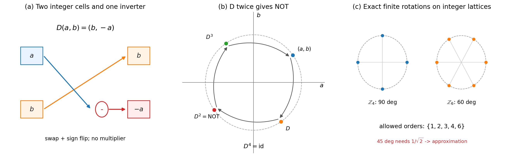
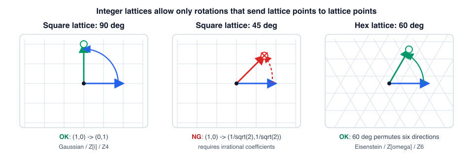

# 第3章 離散位相の実装——i＝√NOT と結晶学的制限

> **この章の問い**：なぜ量子化か。前章までの複素構造は、ハードウェアとして厳密に作れるのか。
> **この章の答え**：第1章で使った 90°遅延と有限個の離散位相なら、整数セルの上に丸めなしで実装できる。整数のセル2個とインバータ1個で 90°の位相遅延が実装でき、その二回の適用が符号反転（NOT）になる——**$i$ は、2セル上では NOT の平方根として働く**。ただし、整数演算で厳密に作れる離散位相は何でもよいわけではない。結晶学的制限により、位数は $\{1, 2, 3, 4, 6\}$ に限られ、実装の格子は 90°系と60°系の二種に分かれる。本章でいう量子化とは、まずこの「整数セルが丸めなしに許す離散位相」のことである。

**【高校向・読み下し】** 第2章では、複素数が必要になる入口を見た。本章では、それを「実際に作れる形」に落とす。1本の線だけでは、ON/OFF を反転する NOT を「半分だけ実行する」ことはできない。ところが線を2本にして、値を $(a,b)$ の組として持つと、$(a,b)\mapsto(b,-a)$ という操作ができる。これは平面で見ると90°回転であり、2回続けると $(a,b)\mapsto(-a,-b)$、つまり180°反転になる。だから、2本の線を使うと「NOT の平方根」が作れる。ここで大事なのは、複素数という謎の材料を入れることではなく、**2つの整数セルと符号反転だけで、複素数の90°回転と同じ代数が作れる**という点である。後半では、では何度刻みの回転なら整数のまま厳密に作れるのかを調べる。答えは 90°系と60°系だけで、45°は整数だけでは厳密に作れない。

先に用語をほどいておく。**セル**とは、整数値を保持する箱である。**セル対**とは、2つのセル $(a,b)$ をひと組にして、複素数の実部・虚部のように読むレジスタである。**インバータ**とは符号を反転する部品で、$a$ を $-a$ に変える。**NOT** は「反転」の意味で、本章では文脈により、ブール線の $0/1$ 反転と、2セルの全体符号反転 $(a,b)\mapsto(-a,-b)$ の両方を扱う。必要なときは、2セル上の全体符号反転を $\mathrm{NOT}_2 := -I$ と書き、文脈が明らかな場合は単に NOT と呼ぶ。**結晶学的制限**とは、整数格子で厳密に作れる有限回転の位数が $\{1,2,3,4,6\}$ に限られるという分類定理である。**quadrature（直交位相）**とは、90°ずれた相棒成分のことである。（いずれも→用語集）

---

## 3.1 セル対と $i = \sqrt{\mathrm{NOT}}$

前二章の複素振幅を、複素数を持たないハードウェア——整数のセルと配線——の上に載せてみる。回路設計の語彙を使うが、内容はすべて初等的な代数の定理である。

ここでいう「実装」とは、整数の加減・成分の入れ替え・符号反転だけで、指定した写像を**丸めなしに**作ることをいう。任意の連続位相を作る、という意味ではない。

**定義 3.1（セル対）**. 整数のセル2個の対 $(a, b) \in \mathbb{Z}^2$ を、複素数 $Z = a + ib$ の実部・虚部を保持するレジスタとして読む。この読み方を**セル対**と呼ぶ。ハードウェアの中に「複素数」という部品があるわけではない。セル対の上の写像が、複素数の掛け算と同じ代数を実装するのである。

**命題 3.2（90°遅延の実装）**. 90°の位相遅延 $Z \mapsto -iZ$ は

$$D: (a, b) \mapsto (b, -a)$$

——配線交差＋インバータ1個、乗算器ゼロ——で厳密に実装される。$D$ の反復は

$$(a,b) \xrightarrow{D} (b,-a) \xrightarrow{D} (-a,-b) \xrightarrow{D} (-b,a) \xrightarrow{D} (a,b)$$

であり、$D^2 = \mathrm{NOT}$（両線の符号反転＝180°）、$D^4 = \mathrm{id}$。

*証明*. $-i(a + ib) = b - ia$。∎

ここでは、時間遅延の向きに合わせて $Z \mapsto -iZ$ を 90°遅延と呼ぶ。逆向きの 90°回転 $Z \mapsto iZ$ は $(a,b)\mapsto(-b,a)$ であり、同じく配線交差とインバータ1個で実装できる。どちらを正向きと呼ぶかは位相原点と回転向きの規約であり、本章の要点は、2セル上では 90°ずれた相棒成分を丸めなしに作れることにある。

**命題 3.3（1線に $\sqrt{\mathrm{NOT}}$ は存在しない）**. 一本のブール線上の写像 $f: \{0,1\} \to \{0,1\}$ で $f \circ f = \mathrm{NOT}$ を満たすものは存在しない。

*証明*. $\{0,1\}$ 上の写像は4つしかなく、恒等・定数2つ・NOT のいずれの自乗も NOT にならない。∎

ここでの対比をはっきりさせておく。1線の NOT は $0/1$ の入れ替えであり、命題 3.3 はその「半分」が1線上にはない、という主張である。一方、2セルの NOT は全体符号反転 $(a,b)\mapsto(-a,-b)$ であり、この反転なら、成分の入れ替えと符号反転を組み合わせた 90°回転 $D$ によって二段に分けられる。

この対比が本章の第一の要点である。

> **複素構造とは、NOT（180°遅延）を二つの 90°遅延に分解できる、最小のレジスタ拡張である。**

この文は、本章での実装的な読みである。標準的な複素数の定義を置き換えるものではない。言っているのは、1線では作れない「半分の反転」が、2セルの整数レジスタでは $D$ として厳密に作れる、ということである。

虚部セルの中身も実装的に明確だ。回転信号 $a(t) = \cos\omega t$ に対し $b(t) = \sin\omega t = a(t - T/4)$——**$b$ は $a$ の 1/4 周期遅延コピー**（quadrature 成分）である。共役 $\bar{Z} = (a, -b)$ はインバータ1個で作られる逆走コピー。そしてクロックごとに $D$ を作用させるこの構成は、実在する——ディジタル信号処理の $f_s/4$ 直交発振器がそれで、乗数が $\{1, i, -1, -i\}$ に限られ乗算器が不要なため、実用の受信機で使われている。ここでは、この既知の工学的構成を、第1章・第2章の「位相を持つ2成分」の最小実装として読む。

## 3.2 結晶学的制限——厳密な離散位相は {1, 2, 3, 4, 6} に限る

では、90°以外の角度はどこまで厳密に作れるのか。ここで分類するのは、**2つの整数セルを、整数のまま、丸めなしに別の整数セルへ移す線形写像**である。つまり、行列の成分が整数で、逆向きの操作も整数で書けるものに限る。この範囲では、答えは完全に分類できる。

**定理 3.4**. 整数成分の $2 \times 2$ 行列 $M \in GL(2, \mathbb{Z})$ が有限位数 $m$（$M^m = I$、$m$ 最小）を持つならば、$m \in \{1, 2, 3, 4, 6\}$。逆に各位数は実現される。

この証明は大学数学の語彙を少し使う。初読では証明を飛ばし、直後の【高校向】だけ読めば十分である。

*証明*. $M$ の固有値は特性多項式 $x^2 - (\mathrm{tr}M)x + \det M$（整数係数・2次）の根であり、$M^m = I$ より1の冪根である。固有値が原始 $m$ 乗根なら、その最小多項式（円分多項式 $\Phi_m$、次数 $\varphi(m)$）は特性多項式を割るから $\varphi(m) \leq 2$。Euler のトーシェント関数について $\varphi(m) \leq 2 \iff m \in \{1, 2, 3, 4, 6\}$。実現例：$m = 2$ は $-I$、$m = 4$ は命題 3.2 の $D$、$m = 3, 6$ は命題 3.5。∎

**【高校向】** 証明に出てくる $GL(2,\mathbb{Z})$ は、「整数の2×2行列で、逆向きに戻す操作も整数でできるもの」の集まりである。有限位数とは、「何回か繰り返すと元に戻る」こと。たとえば90°回転は4回で元に戻るから位数4、60°回転は6回で元に戻るから位数6である。定理 3.4 が言っているのは、このような整数格子上の厳密な回転には、1回・2回・3回・4回・6回で戻るものしかない、ということである。証明の細部は大学数学の言葉を使うが、結論は「整数のマス目でぴったり閉じる回転は限られる」という素朴な事実である。

ここでの 60°系は、正方形のマス目ではなく、三角形・六角形に自然なアイゼンシュタイン格子での話である。正方格子では90°系が自然に閉じ、六角格子では60°系が自然に閉じる——格子の形が、許される離散位相を決めている。

**【高校向・格子の見方】** 正方格子は、「右へ1」「上へ1」という直角の2本の定規で作ったマス目である。90°回すと、右向きの定規は上向きに、上向きの定規は左向きに移るので、格子点は格子点のまま残る。ところが45°回すと、右向きの単位ベクトルは $(1/\sqrt{2}, 1/\sqrt{2})$ の方向へ行き、整数セル $(a,b)$ だけでは表せない。六角格子は、60°ずれた2本の定規で作る三角形のマス目で、60°回転は六つの最近接方向を互いに入れ替えるだけなので、やはり格子点が格子点に残る。アイゼンシュタイン格子とは、この六角格子を整数2個で番地付けしたものだと思えばよい。

**命題 3.5（60°・120°の厳密実装）**. アイゼンシュタイン格子上で

$$(a, b) \mapsto (a - b,\ a) \quad \text{は位数 } 6\ (60°), \qquad (a, b) \mapsto (-b,\ a - b) \quad \text{は位数 } 3\ (120°)$$

——いずれも加算器1個＋交差＋反転で実装される。

*証明*. 対応する行列 $\begin{pmatrix} 1 & -1 \\ 1 & 0\end{pmatrix}$, $\begin{pmatrix} 0 & -1 \\ 1 & -1 \end{pmatrix}$（トレース $1, -1$、行列式 $1$——$\varphi(m) \leq 2$ の実例）の冪を直接計算する。成分 $\in [-3, 3]$・$\det = \pm 1$ の全行列 232 個の全数検証で、発見される位数の集合が $\{1,2,3,4,6\}$ に一致することも確認済みである（本書末尾の検証付録Bに記録する）。∎

したがって、「2つの整数セルで丸めなしに作れる有限の離散位相遅延」の設計空間は、**ガウス整数 $\mathbb{Z}[i]$（90°系、$\mathbb{Z}_4$）とアイゼンシュタイン整数 $\mathbb{Z}[\omega]$（60°系、$\mathbb{Z}_6$）の二種に整理される**。45°は $\cos 45° = 1/\sqrt{2}$ が無理数のため、この整数セルの命令セットでは厳密には作れず、近似（CORDIC 等）を要する——**格子から外れる最初の角**である。

第1章 1.5 節で「円＋一価 ⇒ 等間隔格子」を見た。本章はその実装版である：この章で扱う位相の離散性（量子化）は、**閉じた器と整数のハードウェアが許す位相の全目録**として、分類定理の形で書ける。

ここでいう「全目録」は、この章で指定した実装規則——2つの整数セル、整数行列、丸めなし、有限回転——の範囲での全目録である。自然界の量子化全体をここで導出した、という主張ではない。

**【読み方】** 初読では、ここまでが本章の中心である。3.3 節以降は、第1章の読出しや、後の角運動量・スピンの議論へ、この整数セル実装がどう接続するかを見る発展部として読めばよい。

## 3.3 読出しの回路対応

第1章の読出しの階梯は、既製の回路に同じ形を持つ対応物を持っている。ここでの対応は、標準回路を本書から導出するという意味ではなく、**第1章の代数が、実際の信号処理で使われる読出しの形と一致している**という確認である。

| 第1章の読出し | 演算 | 回路 |
|---|---|---|
| 零射影 $Z\bar{Z} = a^2 + b^2$ | 乗算2＋加算1 | 包絡線検波器（位相に盲目・回転不変） |
| 対間干渉 $Z_1\bar{Z}_2$ | 実部 $a_1a_2 + b_1b_2$／虚部 $b_1a_2 - a_1b_2$ | IQ 復調・ロックインアンプ（相関器＋位相検出器） |
| 自己干渉 $Z^2 = (a^2 - b^2) + 2iab$ | — | 周波数2逓倍回路 |

位相が**差としてしか**出力に現れないこと——絶対位相を読む演算が命令セットに存在しないこと——は、この対応表の水準で既に実装されている。第1章の抽象的な定理群は、電子回路の実務が使ってきた装置の目録と、同じ代数の形を持っているのである。

ここでも、第2章で確認した位相原点の任意性が効いている。絶対的な $\theta = 0$ には根拠がないので、読出しに現れるのは、基準との位相差、または二つの信号の位相差だけである。

## 3.4 巻きの発生条件——実符号対と quadrature

最後に、回転に対する応答（巻き数）がどの構造から生じるかを見る。ここからは発展部であり、第4章・第9章への準備である。状態を方位角 $\chi$ 上の関数で表し、回転 $R_\varphi$（$\chi$ のシフト）前後の干渉位相 $\psi(\varphi) = \arg\langle \Psi | R_\varphi \Psi\rangle$ の傾きを巻き数とする（数値検証プログラムと記録は、本書末尾の検証付録Bに収める）。

**【高校向】** 「巻き数」とは、一周するあいだに中身の位相が何回まわるかを数える量である。ふつうの矢印なら一周で元に戻る。ところが、向かい合う2点を同じものとみなす（対蹠同一視）と、半周しただけで同じ場所に戻ったように読める。このとき、一周したつもりの道が内部では「半分の巻き」として数えられることがある。ここでは、その半分の巻きがどこから出るか、整数巻きには何が必要かを分けて確認する。

**結果 3.6**. (i) 実符号対（成分の位相が $\{0, \pi\}$ に限る——本章の整数セルの静的構成）は、円周 $S^1$ のループで**巻き 0**（干渉位相が立たず、振幅が $\cos\varphi$ で落ちるのみ）。(ii) 同じ実符号対を**対蹠同一視**した射影直線 $\mathbb{R}P^1$（向かい合う点を同じ点とみなした円の数学的な呼び名）のループで読むと、一周あたり位相 $\pi$ が蓄積し、**巻き $+1/2$**。(iii) quadrature 対（相対位相 $\pm\pi/2$、すなわち $\mathbb{Z}_4$ への細分）は巻き $\pm 1$、$m = 2$ の quadrature は巻き $\pm 2$。(iv) 方位角に依存しない因子の寄与（ギア比）は 0 であり、ノルムは回転で不変である。

要点は二つ。**整数巻き $\pm 1, \pm 2$ には quadrature——$\pm\pi/2$ の相対位相、位相 $\{0, \pi\}$ の格子のちょうど中間点——が必須**である。静的な実符号の集合は巻きを担えず、担えるのは「回っている」内容だけである。一方、**半整数の巻き $1/2$ は quadrature なしで**、実符号対＋対蹠同一視（射影構造）だけから生じる。本章の構成を通しで読むと、1線（$\mathbb{Z}_2$、NOT のみ、巻きなし）→ 2セル（$\mathbb{Z}_4$、$\sqrt{\mathrm{NOT}}$、整数巻き）→ 対蹠同一視（半整数巻き）——**巻きの資格が、格子の細分の階梯と同期している**。この結果は第4章（角運動量）と第9章（スピン）で使う準備である。

## コラム：量子計算の境界線と同じ場所

本章の整数厳密境界は、量子計算でよく知られた境界と同じ形を持つ。90°系のゲート群（H, S, CNOT——Clifford 群）だけの量子回路は、古典計算機で効率的にシミュレートできる（Gottesman–Knill の定理 [17]）。そこに 45°（T ゲート、$e^{i\pi/4} = (1+i)/\sqrt{2}$）を加えると、普遍量子計算に到達する。これは、**格子に乗る位相**と**格子から外れる最初の角**の境界が、量子計算の標準的な境界にも現れている、という接続点である。

ここでは、量子優位性そのものを本章から導出しているのではない。確認しているのは、$\sqrt{\mathrm{NOT}}$（量子計算でいう $\sqrt{X}$ ゲート）が標準ゲートとして現れ、古典の1線には存在しない、という命題 3.3 と同型の事実が、量子計算の側にもあるということである。歴史を遡れば、発振の位相 $0/\pi$ を1ビットとする後藤英一のパラメトロン [19] は「位相がレジスタとして働く」ことの実用化の先例であり、格子ガス法の HPP/FHP [18]——正方格子（$\mathbb{Z}_4$ 対称）では連続極限の等方性が回復せず、六角格子（$\mathbb{Z}_6$）で初めて Navier–Stokes が再現された——は、本章の二種の格子の選択が連続極限の成否に関わった歴史的実例である。

## この章のまとめ

| 区分 | 内容 |
|---|---|
| 定理 | $D^2 = \mathrm{NOT}$・$D^4 = 1$、1線に $\sqrt{\mathrm{NOT}}$ なし、結晶学的制限 $\{1,2,3,4,6\}$（$\varphi(m) \leq 2$）、60°/120° の厳密実装 |
| 計算事実 | 巻きの発生条件：実符号対は $S^1$ 上巻き 0・$\mathbb{R}P^1$ 上巻き $1/2$、整数巻きには quadrature 必須 |
| 対応 | 読出しの階梯＝包絡線検波・IQ 復調・周波数逓倍という既製の回路 |
| 次章への問い | この位相を「持ち歩く」もの——系に内在するレジスタ——から、質量や電荷は読めるか |
