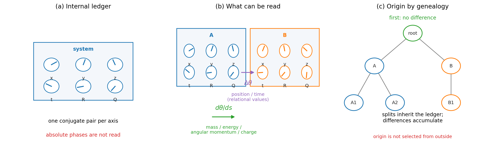

# 第4章 内在する台帳と保存量——質量・電荷とは何か

> **この章の問い**：物理量（毛）とは何か。なぜ保存量として読めるのか。
> **この章の答え**：各系に、軸ごとの共役対の束——本書ではこれを**台帳**と呼ぶ——を持たせると、外から読める量は二種類に分かれる。位置や時刻は、二つの台帳の**位相差**として読まれる関係量である。一方、質量・エネルギー・角運動量・電荷のような保存量（毛）は、台帳の各軸方向の**位相増分率**として読まれる。本章は、この文法が Compton 関係、Kaluza–Klein 機構、円の一価性による電荷量子化、無毛定理の読みと同じ形を持つことを確認する。標準理論をここで導出するのではなく、既知構造への接続点を整理する。

**【高校向・読み下し】** 第3章では、複素数の90°回転が、2つの整数セルとインバータで作れることを見た。本章では、その「2つのセルで持ち歩く位相」を、系そのものが持っている帳簿として読む。たとえば、ある粒子が $x,y,z,t,R,Q$ という欄を持つ台帳を持っている、と考える。各欄には「つまみの向き」がある。ただし、その向きそのものは読めない。読めるのは、別の系のつまみと比べた**差**か、そのつまみが単位あたりどれだけ進むかという**進み方**である。前者が「位置」や「時刻」のような関係量になり、後者が「質量」「エネルギー」「電荷」のような保存量として読まれる。本章の狙いは、物理量を天下りのラベルとして置くのではなく、「どの欄の位相が、どんな進み方をしているか」という一つの言い方に揃えることである。

先に用語をほどいておく。**台帳**とは、系に内在する共役対の束で、ここでは $x,y,z,t,R,Q$ の各軸に一本ずつあるものとして扱う。**位相増分率**とは、位相が単位あたりどれだけ進むかを表す量である。**毛**とは、外から読める保存量の愛称で、ブラックホール物理の「無毛定理」に由来する。**系譜**とは、最初の一つの系から分割によって生じた親子関係の履歴である。**Compton 関係**とは、粒子の質量と波長を結ぶ標準的な関係 $\lambda_C = h/(mc)$ のこと。**Kaluza–Klein 機構**とは、余分な円方向の運動量を電荷として読む標準的な考え方である。（いずれも→用語集）

---

## 4.1 台帳の定義と、値の読み分け

ここまでの章は、読出しの代数（第1章）、読出しが存在できる条件（第2章）、その整数実装（第3章）を扱ってきた。本章から、物理量との対応に入る。ただし、ここで行うのは標準理論の置換ではない。標準理論に現れる既知の構造——Compton 関係、Kaluza–Klein 機構、無毛定理など——が、第1章から第3章までの部品でどのような形に読めるかを整理する。

本章の主張は三つに分けて読む。

| 身分 | 意味 |
|---|---|
| 対応 | 標準理論にある既知の関係・機構と同じ形を持つことを確認する |
| 構成 | 明示した仮定の下で、本書内の部品から作る |
| 仮定 | まだ証明していないが、この章の組み立てに必要な前提 |

**定義 4.1（台帳）**. 系に、軸 $x,y,z,t,R,Q$ の各々につき一本の共役対を内在させる。この共役対の束を**台帳**と呼ぶ。ここで軸の本数と名前は、この章のモデルとして置くものであり、標準理論の全自由度をここで導出したという意味ではない。

ここでは $R$ を質量や曲率に関わる欄、$Q$ を電荷のような内部位相に関わる欄として読む。これは本章のモデルでの呼び名であり、これらの軸の由来や本数は後続章の課題として残す。

各対の位相は、単独では読めない。読めるのは、次の二種類だけである。

| 読めるもの | 読み方 | 例 |
|---|---|---|
| 位相差 | 二つの系の台帳を比べる | 位置・時刻のような関係量 |
| 位相増分率 | ある軸方向に位相がどれだけ進むか | 質量・エネルギー・角運動量・電荷のような保存量 |

ここで大事なのは、台帳が「隠れた値の一覧表」ではない、という点である。台帳が担うのは、全ての対の位相差が一つの系譜の中で整合する、という**関係の構造**である。個々の位相の値が、読出し前に確定しているとは主張しない。第1章で保留した「読み出されなかった値は実在するのか」という問いへの中立は、本章でも維持する。

**命題 4.2（所在は差の実数面）**. 系 $i$ の「位置・時刻」$x,y,z,t$ として観測される量は、系 $i$ の台帳と読み手の台帳との位相差を、実数面に読出したものである。したがって、位置や時刻の値は読み手に依存する関係量である。一方、台帳を持つという構造そのものは、どの読み手から見ても同じ意味を持つ。

言い換えると、「系が位置を持つ」という言葉には二つの層がある。**構造として**は、系は台帳を持つ。これは内在的である。**値として**の位置や時刻は、読み手との位相差として出る。これは関係的である。保存量（毛）の候補になるのは前者の構造と増分率であり、後者の値ではない。

## 4.2 原点はどこから来るか——系譜による構成

位置が「差」だとすると、すぐに原点の問題が起きる。$n$ 個の系のあいだにあるのは差だけであり、どれか一つを原点に選ぶには、なぜそれを選ぶのかという別の根拠が要る。背景から原点をもらえば、それは検証できない特権点になる。第0章の無名性の規則から見れば、これは避けたい。

**構成 4.3（系譜による原点）**. 次の二つを置く。

**初期条件**：最初は一つの系しかない。比較相手がないので、位相差は定義上ゼロである。原点は外から設定されるのではなく、**差がまだ存在しない状態**として立つ。

**生成規則**：系の新規追加はなく、分割のみで進む。分割の瞬間に、娘は母の台帳の位相を継承する。その後の変位は、それぞれの台帳に加減算で累積される。

このとき、任意の二系の位相差は、共通祖先までさかのぼることで一意に定まる。原点は「探すもの」でも「選ぶもの」でもなく、継承された履歴の中にある。誰かが特権的に選んだ点ではないので、原点選択の循環が発生しない。

**【高校向】** 家計簿を想像するとよい。最初に一冊だけ帳簿があるとき、誰かとの残高差はまだない。帳簿が二冊に分かれた瞬間には、両方の残高は同じで、そこから先の出入りだけが差として残る。後で二冊を比べるときは、共通の分岐点からの増減を足し引きすればよい。この「最初に差がなかった」という事実が、原点の役をしている。

**命題 4.4（離散実装での累積の厳密性）**. 第3章の整数セル実装の層では、台帳の位相は格子上の量として扱われる。したがって、格子点間の累積は整数演算であり、丸め誤差なしに扱える。

ここで言っているのは、自然界のすべての変化がこの段階で整数セルに還元された、という主張ではない。本章のモデルで使う台帳を、第3章の離散位相実装に載せるなら、累積は丸めなしに定義できる、ということである。

構成 4.3 が引き受ける仮定は一つである：**新規追加なし・分割のみ**。標準理論の対生成を「真空からの新規作成」ではなく「親構造の分割」と読めるかどうかは、この仮定の判定面であり、本章では開いた問題として残す。

## 4.3 毛の統一文法——保存量とは軸方向の位相増分率である

外部から読める保存量を、物理学の慣例に倣って**毛**（hair）と呼ぶ。本章の中心は、次の一つの文法である。

> **毛 ＝ 台帳の各軸方向の位相増分率。**

ここでいう「増分率」とは、位相が単位あたりどれだけ進むかである。波数や周波数が「位相の進む速さ」として読めるのと同じ発想である。

| 毛 | 本章での読み | 標準理論側の接地先 |
|---|---|---|
| 質量 $M$ | $R$ 軸共役対の位相増分率 $p_R$。定数を省いた読みでは、内在する $R$ 方向の波長 $\lambda_R$ に対して $m \propto 1/\lambda_R$ と読む | 定数を戻すと Compton 関係 $\lambda_C = h/(mc)$ と同じ形 |
| エネルギー $E$ | $t$ 軸共役対の位相増分率 $p_t$。時間方向の周期を $T$ とすれば $E \propto 1/T$ と読む | Euclid 化した時間周期と温度の関係にも同型の構造が現れる（Gibbons–Hawking 型の対応 [22]） |
| 角運動量 $J$ | 横断二軸の位相差を保った回転の増分率。第3章の quadrature と巻き数が効く | 角度原点の任意性と Noether 型の保存量対応（対称性に対応して保存量が出る、という標準的な考え方） |
| 電荷 $Q_e$ | コンパクトな $Q$ 軸上の位相増分率 $p_Q$ | Kaluza–Klein 機構 [20][21]：円上の運動量を電荷として読む。円の一価性により整数倍が出る |

この表は、標準理論の完全な導出ではない。たとえば電子の質量スペクトルや電荷の結合定数まで、この表から出たとは言わない。ここで確認しているのは、既知の物理量が、**どの軸の位相増分率として読めるか**という文法で整理できる、ということである。

三つ、補足しておく。

**連続と離散の見かけ。** $M,E,J$ が連続に見え、$Q_e$ だけ離散に見えるのは、毛の種類が根本的に違うからではなく、器の分割数（格子の粗さ）の違いとして読める。$Q$ の器は小さな円として露出しやすく、円の一価性による整数性が見えやすい。

**時間の有界性の正確な意味。** $E \propto 1/T$ 型の読みは、$t$ 方向に周期的な位相があることを使う。これは閉時間曲線、つまり歴史が同じ出来事へ戻るという意味ではない。位相は $\mathrm{mod}\ 2\pi$ で閉じていても、巻き数は $\mathbb{Z}$ として増え続ける。**文字盤は閉じ、日付は閉じない。** 周期性と歴史の単調性は、位相面と巻き数面の違いとして両立する。

**毛の打ち止めと種類。** この文法では、毛の本数は台帳の軸数で打ち止めになる。一方、粒子の**種類**——電子か光子か、どの内部構造を持つか——は、単なる増分率だけでは決まらない。種類を担う候補は、各軸の器の中に立つ倍音係数列（波形）である。種類と局在が同じ係数列で決まるなら、「小さく局在するものほど重い」という Compton 型の関係に自然な置き場ができる。ただし、係数列そのものの由来は本章では未構成であり、質量スペクトル問題として残る。

## 4.4 無毛定理の読み

ブラックホールの外部読み出しは、質量 $M$、角運動量 $J$、電荷 $Q$ に尽きる——これが無毛定理である [24][25]。本章の文法では、これは次のように読める。

> **毛とは、原点を設定できない軸に沿って発行される、外部から読める位相増分率である。**

時刻原点の不在はエネルギー、角度原点の不在は角運動量、$Q$ 円の原点の不在は電荷、$R$ 方向の増分率は質量として読まれる。一方、内部の位相の値や配置は、第1章の零射影の向こう側にあり、外部からは読めない。

この読みは、無毛定理を本章から証明したという意味ではない。無毛定理は一般相対論の条件付きの定理である。ここでしているのは、その定理の内容——外から読める量が少数の保存量に限られること——を、第1章からの読出しと台帳の言葉に翻訳することである。

位置 $x,y,z,t$ が毛に数えられない理由も、同じ文法で説明できる。位置や時刻の値は、命題 4.2 の通り、読み手との位相差として出る関係量である。系そのものに内在する保存量ではない。

第0章の無名性がここで一周して戻ってくる。ランプの世界で「絶対の名前が無い」ことが観測量を1ビットに絞ったように、台帳の世界では「絶対の原点が無い」ことが、保存量の形を決める。**読めないものの目録と、保存するものの目録は、同じ台帳の表裏である。**

**【読み方】** 第4章の本体はここまでである。ブラックホールを $R$ を共有する複合系として読む仮説、もつれ対を $R$ 共有束として読む仮説、そこから出る観測予言は、第9章の発展・仮説の部で扱う。本章では、保存量の文法だけを確定する。

## この章のまとめ

| 区分 | 内容 |
|---|---|
| 対応 | 質量＝Compton 関係の形、電荷＝Kaluza–Klein 機構＋円の一価性による整数性、エネルギー＝時間位相の周期性、角運動量＝角度原点の任意性と Noether 型対応、無毛定理の読み |
| 構成 | 系譜による原点（差の不在・分割による継承・差の累積） |
| 仮定 | 新規追加なし・分割のみ |
| 主張しないこと | 台帳の位相の値の読み出し前の実在、標準理論の導出・置換、質量スペクトルや結合定数の導出 |
| 次章への問い | この台帳を動かすと、光錐・ローレンツ変換・同時性の形はどこから現れるか |

ここまでで、本書の第Ⅰ〜Ⅲ部の土台——観測の最小構成、読出しの代数、複素数の由来、量子化の実装、保存量の文法——が揃った。続く第5章では、この台帳を**動かす**。位相増分率たちの間の拘束（零二乗和）から、光錐とローレンツ変換がどう現れるかを見る。
