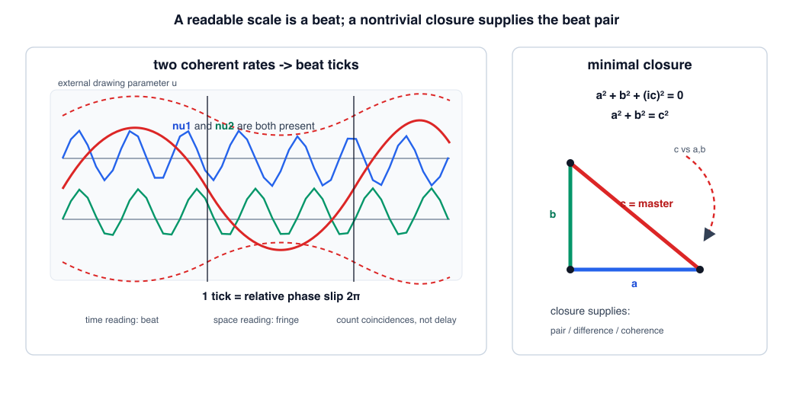
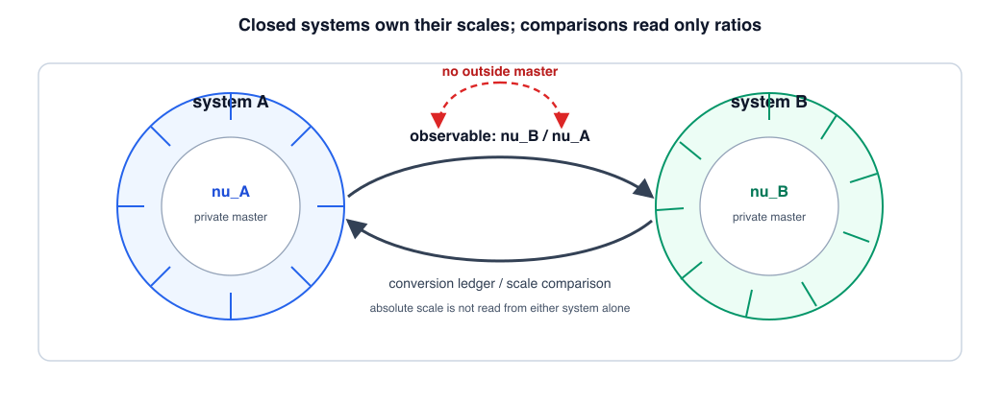

# 第5章 閉包と目盛り——マスターカウンターとスケール私有

> **この章の問い**：なぜ時間や長さの目盛りが立つのか。外部の時計や絶対スケールなしに、「1刻み」はどこから来るのか。
> **この章の答え**：目盛りは、単独の振動や観測不能な遅延からは立たない。読めるのは、コヒーレントで周波数または波数の違う2項が作る干渉——時間方向では**ビート**、空間方向では**縞**——である。1刻みとは、相対位相が $2\pi$ だけ滑る整数イベントである。さらに、閉じた系の零二乗和形式 $\sum_n \nu_n^2 = 0$ は、非自明であるためにマスターカウンターを要求し、そのマスターと成分とのビートが、系に自前の目盛りを与える。したがって、非自明な閉包は自分のスケールを持ち、系どうしで外から読めるのは絶対値ではなくスケールの比である。

**【高校向・読み下し】** 時計は「時間そのもの」を直接見ているわけではない。実際に読んでいるのは、二つの周期的なものを比べたときに現れる、ゆっくりした明暗のうねりである。音叉を二つ鳴らして、音の大きさが「ワンワン」と周期的に変わる現象を思い出してほしい。これがビートである。片方がもう片方より1周多く回ったとき、うねりが一つ進む。この「1周の勝ち越し」が、目盛りの1刻みである。空間でも同じで、二つの波が少し違う向きや波長で重なると、縞模様ができる。距離は、その縞を数えて読む。つまり時間の目盛りも空間の目盛りも、二つのランプの「同じ／違う」が周期的に戻ってくることから生まれる。

先に用語をほどいておく。**閉包**とは、系の成分がばらばらではなく、一つの拘束式で閉じていることを指す。ここでは零二乗和形式 $\sum_n \nu_n^2 = 0$ を、閉包の入口モデルとして使う。**マスターカウンター**とは、閉包した系全体の位相増分率を担う基準成分のことである。これは外部時計ではなく、系の中に含まれる全体側の成分である。**ビート**とは、二つの近い周波数が干渉したときに現れる、ゆっくりしたうねりである。**縞**とは、その空間版で、二つの波の波数差が作る明暗の格子である。**コインシデンス**とは、二つの指示値や状態が同じ場面で照合される一致イベントである。**スケール私有**とは、各閉じた系が、自分の閉包から生じる固有の目盛りを持つ、という本章の整理である。（いずれも→用語集）

---

## 5.1 遅延を基礎にしない

第3章では、2セル上で90°遅延 $D$ を実装できることを見た。ここで注意が必要である。**遅延を実装できる**ことと、**遅延の長さを基礎量として読める**ことは同じではない。遅延の長さを測るには時計が要る。時計を遅延から作ると言い、その遅延を測るために時計を使うなら、循環になってしまう。

したがって、本章では次の規則を置く。

> **読めるのは、過程としての遅延ではなく、共在した二項の照合結果である。**

ここでいう照合結果とは、二つの状態がその場で同じか違うか、位相差がどの代表値に落ちるか、何回一致イベントが記録されたか、である。遅延線の長さそのもの、流れていく持続そのもの、単独の振動の絶対周波数そのものは、閉じた系の内側からは読めない。

実際の計量もこの形をしている。周波数は単独の絶対値として測るのではなく、基準との比として測る。時刻も、流れる持続を直接読むのではなく、基準となる周期との一致イベントを数える。時計とは、ビートや周期のイベントを**記録可能な配置**へ写す装置であって、時間そのものを直接覗く装置ではない。

この点で、第0章の2つのランプが再び現れる。1つのランプだけでは明るいとも暗いとも言えなかった。同じように、1つの振動だけでは速いとも遅いとも言えない。比較相手があり、その相手と干渉できて初めて、目盛りが立つ。

## 5.2 目盛りとはビートである

目盛りの最小条件を、時間方向の言葉で書く。二つの位相が

$$\phi_1 = 2\pi\nu_1 u, \qquad \phi_2 = 2\pi\nu_2 u$$

のように進むとする。ここで $u$ は、外から図を描くためのパラメータであり、本章が基礎として仮定する「時間」ではない。中で読めるのは、二つの位相の差

$$\Delta\phi = \phi_1 - \phi_2 = 2\pi(\nu_1-\nu_2)u$$

が作る同／異の回帰である。相対位相が $2\pi$ だけ進むたびに、片方の振動はもう片方より1周多く回る。この1周の勝ち越しが、1刻みである。

**定義 5.1（ビート目盛り）**. コヒーレントで周波数の違う二項があり、その相対位相が $2\pi$ だけ滑るイベントを一つの刻みとして数えるとき、その刻みの列を**ビート目盛り**と呼ぶ。本書でいう目盛りの最小形である。

**命題 5.2（目盛りの三条件）**. ビート目盛りが立つには、次の三つが必要である。

| 条件 | 内容 | 第0章との対応 |
|---|---|---|
| 対がある | 比較できる二項が共在する | ランプは2個必要 |
| 刻める差がある | 周波数または波数が同一ではなく、相対位相が進む | そろっていないことが読める |
| コヒーレントである | 位相関係が安定して干渉できる | 比較可能な2項である |

どれが欠けても、目盛りは立たない。1つだけなら比較相手がない。同じ周波数なら相対位相が固定され、固定した位相差は読めても、刻みとして進む同／異の回帰はない。コヒーレンスがなければ、そもそも同じ読出しで比べられない。

空間方向では、同じ構造が波数差として現れる。二つの波の波数を $k_1, k_2$ とすると、読めるのは差 $\Delta k = k_1-k_2$ が作る明暗の縞である。時間方向ではビート、空間方向では縞。違う名前で呼ばれているが、どちらも「共在する対の差が、周期的な同／異を刻む」という同じ構造である。

**【高校向】** 二つの音が少しだけ違う高さだと、音量がゆっくり大きくなったり小さくなったりする。これがビートである。二つの光を重ねると、明るい縞と暗い縞が並ぶ。これが干渉縞である。時間の時計と空間の定規は別物に見えるが、どちらも「二つの波の差を数えている」という点では同じである。

## 5.3 閉包はマスターカウンターを要求する

第2章では、無名性を式に貫くと、右辺に特別な値を残さない零二乗和形式へ進むのが最小の道になることを見た。

$$\sum_n \nu_n^2 = 0$$

ここで $\nu_n$ は、台帳の各成分に対応する位相増分率だと思えばよい。すべてが実数なら、平方は負にならないので、非自明な解はない。全部が0になるだけである。非自明な閉包を残すには、少なくとも一つの成分を非実化するか、同じことを符号混合計量として読む必要がある。

第3章の2セル複素レジスタ $(a,b)$ を保ったまま、それを一つの全体側成分で束ねる最小形は、実2成分と非実1成分からなる。

$$a^2 + b^2 + (ic)^2 = 0$$

すなわち

$$a^2 + b^2 = c^2$$

である。これは、第1章の共役積

$$Z\bar{Z} = a^2 + b^2 = c^2 \qquad (Z = a+ib)$$

と同じ形をしている。つまり、2セルの複素レジスタとその共役積（絶対値の2乗）は、閉じた系の最小非自明解としても現れる。

**定義 5.3（マスターカウンター）**. 最小閉包

$$a^2 + b^2 = c^2$$

における $c$ を、その閉じた系の**マスターカウンター**と呼ぶ。$c$ は外から与えた時計ではなく、成分 $a,b$ と同じ閉包式の中にある、系全体側の位相増分率である。

この名前は本書での呼び名である。標準用語としての「マスタークロック」をそのまま導入しているのではない。言いたいことは、閉包した系には、各成分を束ねる全体側の増分率があり、それと成分との差がビートを作る、ということである。

## 5.4 非自明な閉包は自前の目盛りを持つ

ここで、5.2 節の三条件が、閉包の入口モデルの中でどのように対応するかを見る。

**命題 5.4（閉包が目盛りを供給する）**. $a,b$ がともに非零の実数で、

$$a^2 + b^2 = c^2, \qquad c > 0$$

を満たすとする。このとき、閉包はビート目盛りの三条件を供給する。

| 条件 | 閉包での現れ方 |
|---|---|
| 対がある | マスター $c$ と成分 $a,b$ の対がある |
| 差がある | $c^2=a^2+b^2$ なので、$a,b$ がともに非零なら $c>|a|$ かつ $c>|b|$ |
| コヒーレントである | 本章の入口モデルでは、$a,b,c$ を同じ閉包式に束ねられた、比較可能な一つの系の成分として扱う |

ここでいうコヒーレンスは、物理的な位相安定性を閉包式だけから導いた、という意味ではない。閉包式で一つの系として束ねた成分を、同じ読出しで比較できるものとして扱う、という本章の入口モデルの置き方である。

したがって、この入口モデルでは、非自明な閉包は、外部時計を借りずに、マスターと成分の差として目盛りを持つ。逆に、たとえば $b=0$ なら $c=|a|$ となり、$c$ と $a$ の差は消える。この縮退ではビートが立たない。これは、比較相手を失った1つのランプの世界に戻ることに対応する。

ここで得られる主張は、慎重に言えば次である。

> **非自明な閉包は、自前の目盛りを持つ。**

「時間が外から流れているから目盛りがある」のではない。閉包した系の中に、互いに違うが同じ式で束ねられた成分があり、その差が同／異の回帰を刻むから、目盛りが立つ。

マスターと成分の干渉は、どの軸に沿って読むかで顔を変える。時間方向に読むならビート、空間方向に読むなら縞である。ここでどの成分をマスター側として読むかには、まだ規約が残る。この任意性は、後のゲージの章で扱う「参照選択」の入口になる。本章では、ゲージ理論を導出したとは言わない。ただ、目盛りの任意性と参照選択が同じ場所に現れることだけを確認しておく。

## 5.5 多レジスタ閉包と目盛りの階層

閉包は、2成分だけで終わらない。複数の共役対を持つ場合、各レジスタを

$$Z_j = a_j + ib_j$$

と書くと、各レジスタの共役積、すなわちノルムの2乗は

$$Z_j\bar{Z}_j = a_j^2 + b_j^2 = |Z_j|^2$$

である。

**【高校向・ノルムの見方】** ここでいう**ノルム**は、複素平面で原点から点 $Z_j$ までの距離、つまり絶対値 $|Z_j|$ のことである。$Z_j = a_j + ib_j$ なら、実部 $a_j$ と虚部 $b_j$ は直角な2方向なので、三平方の定理から

$$|Z_j| = \sqrt{a_j^2+b_j^2}, \qquad |Z_j|^2 = a_j^2+b_j^2$$

となる。共役を掛ける理由は、この平方和を代数だけで取り出せるからである：

$$(a_j+ib_j)(a_j-ib_j) = a_j^2 - (ib_j)^2 = a_j^2+b_j^2.$$

したがって $Z_j\bar{Z}_j$ は「長さそのもの」ではなく、「長さの2乗」を読む操作である。本章ではこの量を、各レジスタの大きさを表すローカルノルムの2乗として使う。

この量を使うと、多レジスタの閉包は、入口モデルとして

$$\sum_j |Z_j|^2 + (i\nu)^2 = 0$$

すなわち

$$\sum_j |Z_j|^2 = \nu^2$$

と書ける。ここで $\nu$ は、複数のレジスタを束ねるグローバルなマスターカウンターである。

**命題 5.5（目盛りの階層）**. 多レジスタ閉包

$$\sum_j |Z_j|^2 = \nu^2$$

では、干渉の階層が三段に分かれる。

| 干渉 | 読み |
|---|---|
| グローバルマスター $\nu$ とローカルノルム $|Z_j|$（閉包式では $\nu^2$ と $|Z_j|^2$） | レジスタ束どうしの目盛り |
| ローカルノルム $|Z_j|$ と成分 $a_j,b_j$（閉包式では $|Z_j|^2=a_j^2+b_j^2$） | レジスタ内の目盛り |
| 成分どうし $a_j,b_j$ | 第0章型の同／異の判別 |

この表は、現段階では構成の目録である。標準理論の自由度すべてをここで導出したという意味ではない。ただし、「成分を束ねるマスター」と「マスターとの差が作る目盛り」という構造は、多レジスタでも同じ形で繰り返される。

**【高校向】** 大きな時計塔が一つあり、その下に部屋ごとの時計があり、さらに各部屋の中に小さなメーターがある、と思えばよい。ただし、ここで言う時計塔は外から持ち込んだ時計ではない。部屋たちを一つの系として閉じる式の中に、全体側の針が現れる、という意味である。

## 5.6 スケールは系ごとに私有される

閉包がマスターカウンターを持つなら、各閉じた系は自分の目盛りを持つ。これを本書では**スケール私有**と呼ぶ。

**定義 5.6（スケール私有）**. 非自明な閉包を持つ各系が、自分のマスターカウンターによって固有の目盛りを持つことを、スケール私有と呼ぶ。

ここで大事なのは、「私有」と言っても、他の系と比較できないという意味ではない。むしろ逆である。比較できるのは、二つのマスターの**比**である。系 $A$ のマスターを $\nu_A$、系 $B$ のマスターを $\nu_B$ とすれば、外から読めるのは

$$\frac{\nu_B}{\nu_A}$$

のような無次元の比である。$\nu_A$ だけ、$\nu_B$ だけを絶対値として読むことはできない。第2章で確認したように、全射影系でも意味を持つのはスケール比だった。本章では、その比を作る局所側の原因を、閉包とマスターカウンターの言葉で与えている。

この読み方は、標準理論でよく行う「規格化」とも関係する。状態の大きさを 1 に規格化すると、各系が持っていた固有の容量やスケールは、計算の表面から消える。もちろん、規格化は強力で便利な方法である。しかし本書の台帳の文法では、その消された量が、系の同一性やスケール換算の側に回っていると読む。

したがって、第5章の結論は次の二行に畳める。

1. **目盛りはビートであり、ビートは閉包した系のマスターと成分の差から生まれる。**
2. **閉包した系はスケールを私有し、系間で読めるのは絶対値ではなく比である。**

## 5.7 第6章への橋——目盛りの製造原価

最後に、第6章へ渡す境界線を置いておく。ビート目盛りの1刻みは、相対位相の $2\pi$ スリップである。ということは、まだ $2\pi$ 滑り切っていない端数は、1刻みとしては読めない。ここに、分解能の入口がある。

たとえば、差周波数を $\Delta\nu = |\nu_1-\nu_2|$ とすれば、1ビートを得るには、おおよそ $1/\Delta\nu$ の幅が要る。これは、波を $\sin$ と $\cos$ の足し合わせに分けるフーリエ解析や、通信の読み取り刻みを考える Gabor の通信理論で現れる「分解能と帯域の積」の関係 [11] と同じ形である（どちらも用語集で高校向けに説明する）。ここで重要なのは、この関係を外から公理として置いているのではなく、**目盛りがビートでしか作れない**ことの言い換えとして現れている点である。

ただし、本章では不確定性の全体は扱わない。本章で確定したのは、目盛りの成立条件である。第6章では、この目盛りのセル構造と、第1章で導入したファイバー構造を合わせて、レジスタ・因果・時間の矢・Born 型読出しの境界を整理する。

**【読み方】** 初読では、5.1〜5.6 節を本章の中心として読めばよい。5.7 節は次章への予告である。ここで覚えておくべきことは一つ——**外部時計ではなく、閉包した系の内部ビートが目盛りを作る**——である。

## この章のまとめ

| 区分 | 内容 |
|---|---|
| 証明・確認したこと | 遅延そのものは基礎読出しではないこと、目盛り＝ビート／縞であること、1刻み＝相対位相の $2\pi$ スリップであること、零二乗和の最小非自明閉包 $a^2+b^2=c^2$ がマスターカウンターを与えること、閉包がビートの三条件（対・差・コヒーレンス）を供給すること、多レジスタ閉包 $\sum_j |Z_j|^2=\nu^2$ に目盛りの階層が現れること |
| 構成 | マスターカウンター、ビート目盛り、スケール私有 |
| 対応 | 時間方向のビート、空間方向の縞、分解能×帯域の Gabor 型関係 |
| 主張しないこと | 外部時間の実在、絶対周波数の直接読出し、ゲージ理論や標準理論の導出、物理定数の数値の導出 |
| 次章への問い | レジスタが非単射な読出しを実行すると、因果・時間の矢・不確定性・Born 型読出しの境界はどこから現れるか |
