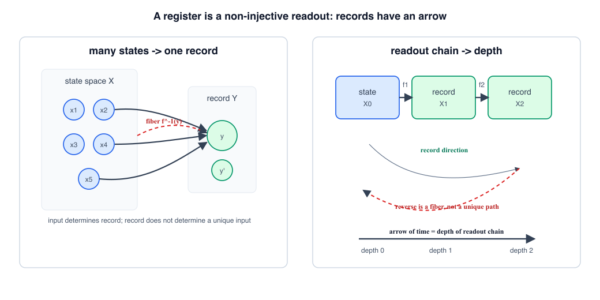
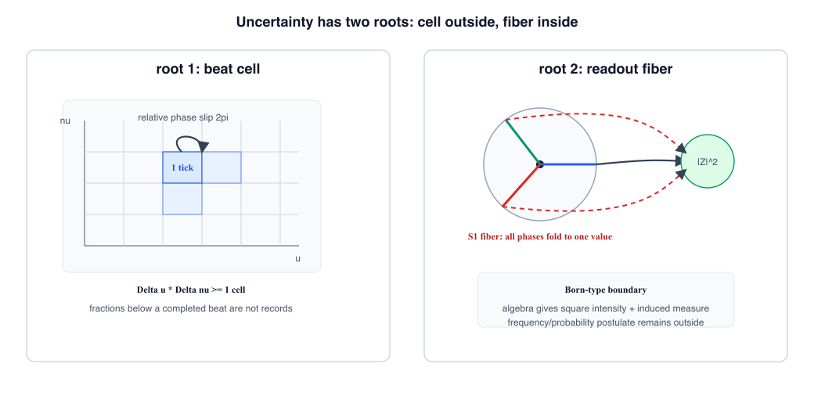
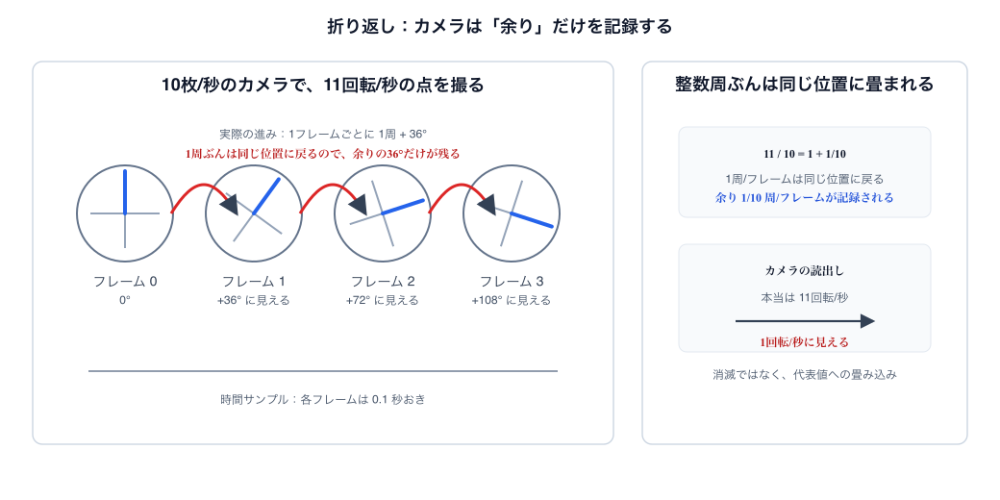

# 第6章 レジスタ・因果・時間の矢——不確定性の二根と Born 型読出しの境界

> **この章の問い**：なぜ因果や時間の向きが現れるのか。不確定性と Born 型読出しの境界はどこにあるのか。
> **この章の答え**：レジスタとは、状態をそのまま写す箱ではなく、非単射な読出しを実行して記録を残す機構である。非単射写像では、入力から出力は一つに決まるが、出力から入力は一つに戻らない。この向きが、因果と同じ形を持つ記録の矢である。時間の矢は、その記録が連鎖した深さとして読める。不確定性には二つの根がある。第一根は、第5章のビート目盛りが作るセル——格子より細かい差は1刻みとして定義できないこと。第二根は、第1章のファイバー——非単射な読出しが複数の入力を同じ出力に畳むこと。Born 型読出しについて本章が言えるのは、平方強度と誘導測度の形までであり、どの測度を実現頻度として採用するかは標準理論側の公理として残す。

**【高校向・読み下し】** 写真を撮ると、3次元の立体は2次元の画像になる。画像を見れば「何かが写った」ことは分かるが、奥行きの全部は戻らない。これが、この章でいうレジスタの基本である。レジスタは、もとの状態を完全に保存する箱ではなく、何かを捨てて読める形にする箱である。だから向きが生まれる。もとの状態から記録は決まる。しかし記録だけから、もとの状態を一つに決めることはできない。この「戻り先が一つに決まらない」ことが、時間を使わずに言える不可逆性である。さらに、時計の1刻みがビートで作られるなら、1刻み未満の端数は、そもそも記録の単位にならない。加えて、読出しそのものが複数の候補を同じ値に潰す。つまり不確定性には、「目盛りが粗い」側と、「読出しが畳む」側の二つがある。

先に用語をほどいておく。**レジスタ**とは、状態空間から記録空間への非単射な写像を実行し、その出力を保持する機構である。**非単射**とは、違う入力が同じ出力に潰れること。**読出し連鎖**とは、あるレジスタの出力が次のレジスタの入力になり、記録が記録を生む列のことである。**時間の矢**とは、その読出し連鎖の深さとして読まれる向きである。**不確定性の二根**とは、根1＝セル（目盛りの最小単位）と、根2＝ファイバー（読出しの多対一性）のことである。**Born 型読出し**とは、平方強度 $|Z|^2$ を重みとして読む形を指す。ただし、本章では Born 則そのものの導出は主張しない。（いずれも→用語集）

---

## 6.1 レジスタとは何か

第1章では、読出しを写像 $f:X\to Y$ として定義した。ここで、第4章・第5章で導入した台帳と目盛りの上に、記録を残す機構を置く。これを本章では**レジスタ**と呼ぶ。

**定義 6.1（レジスタ）**. レジスタとは、状態空間 $X$ から記録空間 $Y$ への非単射な写像

$$f:X\to Y$$

を実行し、その出力 $y=f(x)$ を次の読出しで使える形に保持する機構である。

ここで大事なのは、恒等写像 $x\mapsto x$ は、本章の意味ではレジスタではない、という点である。何も失わない写しは、記録というよりコピーである。レジスタは、状態をそのまま保存するのではなく、**状態をある分類に落とす**。その分類結果だけを後続の読出しに渡す。

例はすでに見た。

| 読出し | 入力 | 出力 | 失うもの |
|---|---|---|---|
| $x\mapsto x^2$ | 実数 $x$ | $x^2$ | 符号 $\pm$ |
| $Z\mapsto Z^2$ | 複素数 $Z$ | $Z^2$ | 全体符号 $\pm Z$ |
| $Z\mapsto Z\bar Z$ | 複素数 $Z$ | $|Z|^2$ | 位相全体 $S^1$ |

出力だけを見れば、入力候補は一つに戻らない。この候補の集まりがファイバーである。

**【高校向】** レジスタを「メモリ」と思うと、全部を覚えている箱に見えてしまう。ここでは逆である。レジスタは、全部を覚える箱ではなく、必要な形に丸めて残す箱である。たとえば「身長180cmくらい」と記録すれば、180.1cm も 179.8cm も同じ記録に入る。便利だが、細部は戻らない。

## 6.2 不可逆性は時間なしに定義できる

「不可逆」と言うと、つい「後から元に戻せない」と言いたくなる。しかし「後から」と言った瞬間、時間の向きを先に使ってしまう。本章では、それを避ける。

**定義 6.2（無時間的な不可逆性）**. 写像 $f:X\to Y$ が非単射であるとき、出力 $y$ に対する逆像 $f^{-1}(y)$ が一点に決まらない。この性質を、本章では無時間的な不可逆性と呼ぶ。

これは時間の話ではない。写像そのものの論理である。入力 $x$ を決めれば出力 $f(x)$ は一つに決まる。しかし出力 $y$ を決めても、入力 $x$ はファイバー $f^{-1}(y)$ の中のどれかにしか絞れない。

**命題 6.3（記録の矢）**. 非単射な読出し $f:X\to Y$ は、入力から記録への決定方向を持つ。逆向きは、一般に一意な決定方向を持たない。

*証明*. 写像の定義により、各入力 $x$ には一つの出力 $f(x)$ が対応する。一方、非単射なら、ある $y$ について $f^{-1}(y)$ は複数要素を持つ。したがって、$y$ から $x$ は一つに決まらない。∎

この非対称性は、因果と同じ形を持つ。原因から結果は決まるが、結果だけから原因は一つに戻らない。ただし、ここで注意しておく。本章は、宇宙に因果がなぜ存在するかを証明しているのではない。言っているのは、**非単射な記録機構を置くと、観測される因果の向きと同じ形の非対称性が現れる**、ということである。

## 6.3 時間の矢は読出し連鎖の深さである

一つのレジスタの出力は、次のレジスタの入力になり得る。

$$X_0 \xrightarrow{f_1} X_1 \xrightarrow{f_2} X_2 \xrightarrow{f_3} \cdots$$

この列を**読出し連鎖**と呼ぶ。各段で非単射な読出しが入るなら、後ろへ進むほど、前段の候補はファイバーとして広がる。記録は増えているように見えるが、元の状態については分類だけが残り、細部は戻らない。

**命題 6.4（時間の矢）**. 読出し連鎖には、記録の深さによる順序が入る。この深さ方向を一次元の座標として読むと、時間の矢と同じ形になる。

ここでも、時間を先に置いていない。順序は、非単射写像の合成から出る。現在から過去へアクセスする唯一の経路は、現在に残っている記録を読むことである。したがって、この枠組みでは、

> **過去とは、現在の記録から見た入力側の名前である。**

過去は「完全に復元できる状態」ではない。むしろ逆で、過去は現在の記録が指すファイバーの側にある。取得できた情報はある。しかし、その情報から元の状態を一意に戻すことはできない。

**【高校向】** 監視カメラの映像を考える。映像には過去の出来事が残っている。けれど、映像の外にいた人、カメラの後ろ側、録画されなかった音までは戻らない。過去が「見える」とは、完全な過去そのものが手元にあることではなく、現在の記録から過去側を読んでいる、ということである。

## 6.4 コーンと矢——因果の二部品

因果らしさには、二つの部品がある。

| 部品 | 本章での読み | 役割 |
|---|---|---|
| コーン | 干渉・比較できる範囲 | どの二項が同じ読出しで照合できるか |
| 矢 | 非単射な読出し | 記録の向きを作る |

ここでいうコーンは、まだ特殊相対性理論の**光錐**そのものではない。光錐とは、ある出来事から光が届ける範囲、またはその出来事へ光が届き得た範囲を表す円錐状の境界で、因果関係を持てる出来事の範囲を示す標準用語である（→用語集）。本章のコーンは、その手前の言葉として、二つの台帳が比較できるか、同じ目盛りで干渉できるか、記録としてつながるか、という**関係の範囲**を指す。矢とは、その範囲の中で実行された非単射な読出しの向きである。

この二つを分けると、混乱が減る。コーンだけでは向きは出ない。比較可能な関係があるだけである。矢だけでは、何と何を結べるかが決まらない。したがって、本章で扱う因果の形は、

> **因果らしさ ＝ 干渉可能性の関係（コーン）＋ 非単射読出しの向き（矢）**

である。第7章では、この関係を台帳の動力学へ送る。本章では、因果の名前を使う前に、記録構造として何が必要かを確定する。

## 6.5 不確定性の第一根——セル

第5章で見たように、目盛りはビートでできている。1刻みは、相対位相が $2\pi$ だけ滑る整数イベントである。したがって、まだ $2\pi$ に達していない端数は、1刻みとしては記録されない。

これが不確定性の第一根である。

**定義 6.5（セル）**. ビート目盛りで1刻みとして記録できる最小単位を、ここではセルと呼ぶ。第3章の「整数値を保持する箱」としてのセルとは文脈が違うが、どちらも「それ以上細かく割らない記録単位」を指す。

差周波数を $\Delta\nu$ とすれば、1ビートを得るには幅 $\Delta u \gtrsim 1/\Delta\nu$ が要る。したがって

$$\Delta u\,\Delta\nu \gtrsim 1$$

という形の関係が出る。これは、第1章・第5章で触れた Gabor の通信理論 [11]、フーリエ解析、Nyquist-Shannon 型の標本化限界 [15][16] と同じ骨格である。ここで本書が主張するのは、この形であって、物理定数 $h$ の数値ではない。物理単位をどう戻すかは、標準理論との接続の側に残る。

同じ骨格は、標準量子論でハイゼンベルクの不確定性関係と呼ばれる関係にも現れる（→用語集）。たとえば位置の幅と運動量の幅、時間幅と周波数幅のように、フーリエ変換で結ばれる二つの読みは、片方を細かく分けるほど、もう片方の幅が広がる。本章がここで確認するのは、その**分解能の形**であって、交換関係や $\hbar$ の値をここから導出したという意味ではない。

**【高校向】** 1秒に1回しかシャッターを切らないカメラでは、1秒の間に起きた細かい動きは直接は分からない。速すぎる回転が逆回転に見えることさえある。これは「見えない」というより、目盛りより細かい変化が、別の記録に折り返されてしまう、ということである。

## 6.6 不確定性の第二根——ファイバー

第一根は、目盛りの外形である。では、セルの中で何が同一視されるのか。それを決めるのが第二根、ファイバーである。

**命題 6.6（ファイバー不確定性）**. 非単射な読出し $f:X\to Y$ では、出力 $y$ から入力を一意に復元できない。不確定なものの正体は、ぼやけた一点ではなく、ファイバー $f^{-1}(y)$ である。

例を並べる。

| 読出し | ファイバー | 失うもの |
|---|---|---|
| $x\mapsto x^2$ | $\{+x,-x\}$ | 符号1ビット |
| $Z\mapsto Z^2$ | $\{+Z,-Z\}$ | 全体符号1ビット |
| $\theta\mapsto e^{i\theta}$ | $\{\theta+2\pi k\}$ | 何周目か |
| $Z\mapsto Z\bar Z$ | 円周 $S^1$ 全体 | 位相全体 |

これは第1章のファイバー階層そのものである。不確定性は「値がぼんやりしている」だけではない。読出しが、複数の入力を同じ出力に分類しているのである。

## 6.7 折り返しと Born 型読出しの境界

信号処理では、サンプリング周波数を超える成分が消えるとは限らない。別の低い周波数として見える。これを折り返し、またはエイリアシングという。見えないのではなく、別の代表値として読まれるのである。

**【高校向】** 1秒に10回だけ写真を撮るカメラで、1秒に11回転する点を撮るとする。点は本当は速く回っているが、写真は0.1秒ごとの位置しか残さない。すると、次の写真では点が「1回転と少し」進んでいる。1回転ぶんは写真では同じ位置に戻って見えるので、残るのは「少し進んだ」部分だけである。つまり、11回転/秒の動きが、1回転/秒のゆっくりした動きのように見えてしまう。これが折り返しである。

ビデオで、車輪・扇風機・ヘリコプターの羽が止まって見えたり、逆回転して見えたりするのも同じ現象である。回転数と撮影枚数の比が整数に近いと、カメラは毎回ほとんど同じ角度の羽を撮る。だから止まって見える。整数から少しずれると、その「ずれ」だけがゆっくりした回転として見える。高い周波数成分は、読まれずに消えたのではない。**目盛りで区別できない整数周ぶんが捨てられ、余りだけが低い周波数として記録に残る**のである。

電子回路で言えば、入力信号は読み取りクロックと比べられ、必要なら入力側のローパスフィルターや積分する入力段を通って、クロックの目盛りで読める低い変化だけが残る。このとき、細かすぎる変化は「細かいまま」読まれるのではなく、クロックとの差、つまりビートや余りとして読出し側へ現れることがある。本章で大事なのは、ここでも「消滅」ではなく「同じ代表値への畳み込み」が起きている、という点である。

この見方は、本書の読出し全体に通じる。

| 現象 | 本書での読み |
|---|---|
| サンプリングの折り返し | 周波数が同じ代表値に畳まれる |
| $x^2$ | $+x$ と $-x$ が同じ値に畳まれる |
| $Z\bar Z$ | 円周上の全位相が同じ半径に畳まれる |
| ビート計数 | 位相の端数が整数スリップに畳まれる |

同じ準備を繰り返して読むとき、どの代表値がどの頻度で現れるかを問うには、ファイバー上の**測度**が必要になる。測度とは、ここでは「候補の集まりの上に、どの候補をどれくらいの重みで数えるかを割り振る規則」だと思えばよい（→用語集）。第1章で見たように、円周上の一様な位相を $u=\cos\theta$ で読むと、出力側には逆正弦則が誘導される。

ここで、Born 則という標準理論の名前を一度ほどいておく。現在の量子力学では、複素振幅 $\psi$ の絶対値の2乗 $|\psi|^2$ を、測定結果が現れる確率密度として読む。この規則を Born 則と呼び、測定結果と確率を結びつける基本的な公理の一つとして扱われている（→用語集）。

本書でいう **Born 型読出し** は、Born 則そのものではない。ここでは、平方強度 $|Z|^2$ が非負で、加法的に足し合わせやすく、多モードでは対角項と交差項が分かれ、相対位相だけが干渉項として現れる、という**形**を指している（第1章 命題1.5）。この形は、Born 則で使われる平方強度読出しと一部同じである。

しかし、線は引く。

> **本章が与えるのは、平方強度読出しと誘導測度の置き場までである。どの測度を実現頻度として採用するか、なぜその頻度を確率と呼べるかは、ここでは導出しない。**

この文脈での Gleason の定理 [13] は、「確率の割り振り方を勝手には選べない」ことを、一定の公理の下で示す標準理論の重要な結果である。本書の立場では、それは測度選択の公理をどこに置くかの問題として読む。本章は、その公理を代数だけから取り出したとは言わない。

## 6.8 第1巻の境界

第0章からここまでで、本書の基礎巻が扱う範囲は閉じる。

| 確定したこと | 内容 |
|---|---|
| 観測の最小構成 | 比較できる2項の同／異が最小の観測量 |
| 読出しの代数 | 共役積・非共役積・ファイバー階層 |
| 複素構造の入口 | 零二乗和形式と非自明解 |
| 離散位相の実装 | 2セル上の $\sqrt{\mathrm{NOT}}$ と結晶学的制限 |
| 保存量の文法 | 台帳の位相増分率としての毛 |
| 目盛りの発生 | 閉包した系のマスターと成分のビート |
| 因果・時間・不確定性の境界 | レジスタ、読出し連鎖、セル、ファイバー |

同時に、主張しないことも明確にしておく。

| 主張しないこと | 理由 |
|---|---|
| 物理的因果の存在理由を導出した | 本章は非単射な記録構造が因果と同じ形を持つことを確認しただけ |
| Born 則を導出した | 平方強度の形と誘導測度の置き場までが本章の範囲 |
| 物理定数 $h$ の値を出した | セルの形は出るが、単位換算と数値は標準理論との接続側 |
| 標準量子論や相対論を置換した | ここまでの章は、既知構造への入口を作る基礎文法である |

ここから先は、台帳を動かす話になる。光錐、ローレンツ変換、同時性、ゲージ場、測定、運動方程式には、新しい仮説と標準理論への接続が入る。したがって第7章以降では、対応・構成・仮説の区別をさらに明示しながら進む。

**【読み方】** 初読では、6.1〜6.7 節を読めばよい。6.8 節は第1巻全体の境界線である。覚えておくべきことは二つ——**レジスタは非単射な読出しであり、時間の矢は読出し連鎖の深さとして読める**。そして、**不確定性にはセルとファイバーの二つの根がある**。

## この章のまとめ

| 区分 | 内容 |
|---|---|
| 定義・構成 | レジスタ＝非単射読出しを実行する機構、無時間的不可逆性、読出し連鎖、時間の矢、セル、ファイバー不確定性 |
| 証明・確認したこと | 非単射写像は入力→記録の一方向性を持つこと、読出し連鎖に深さ順序が入ること、不確定性がセルとファイバーの二根に分かれること |
| 対応 | Gabor/Fourier/Nyquist 型の分解能、ハイゼンベルク型の不確定性関係の数学的骨格、サンプリングの折り返し、Born 型の平方強度読出し、Gleason 型の測度選択問題 |
| 主張しないこと | 因果の存在理由、Born 則、物理定数の数値、標準理論の置換 |
| 次章への問い | この台帳を動かすと、光錐・ローレンツ変換・同時性の形はどこから現れるか |
