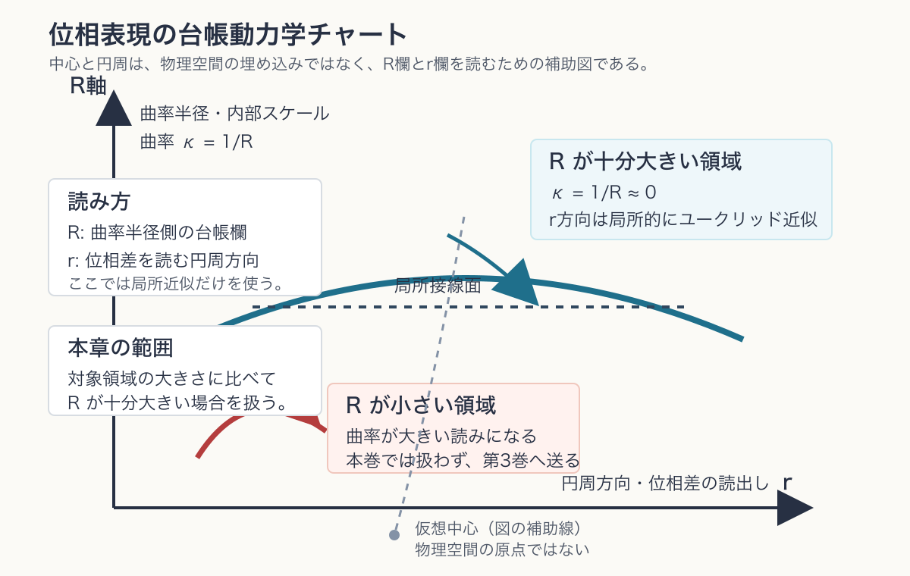

# 第7章 台帳の動力学——光錐・ローレンツ型変換・同時性

> **この章の問い**：第1巻で作った台帳を動かすと、なぜ光錐・ローレンツ型変換・同時性の相対性・エネルギー運動量関係と同じ形が現れるのか。
> **この章の答え**：運動を、外部時計の上を点が走ることとして始めない。読めるのは、台帳どうしの位相差の列と、各軸方向の位相増分率である。この読出しに二乗形式の閉包を課すと、比較可能な記録の境界として光錐型の条件が現れ、その境界を保つ読み替えとしてローレンツ型変換が現れる。さらに、時間方向の位相増分率をエネルギー、空間方向の位相増分率を運動量、$R$ 方向の位相増分率を質量として読むと、標準理論の $E^2=|\mathbf p|^2+m^2$ と同じ形が得られる。ただし、本章は特殊相対論を第1巻から完全導出したとは主張しない。標準理論の不変量を、台帳の別の簿記で読む章である。

**【高校向・読み下し】** ふつうは「物体が時間の中を動く」と考える。しかしこの本では、外から絶対時計を持ち込まない。代わりに、ある系の台帳と別の系の台帳を比べたとき、記録の行がどう並ぶかを見る。たとえば「この記録とあの記録は光で結べるか」「同じ出来事として照合できるか」という境界が立つ。その境界が光錐である。ローレンツ変換は、この境界を壊さないように、時間の読みと空間の読みを混ぜ直す変換である。大事なのは、これは「時間が本当に伸び縮みする」と最初から言っているのではなく、読出しの仕方を変えても同じ記録関係が保たれる、ということである。

先に用語をほどいておく。ここでいう**位相**は、第1章の複素数のつまみの向き、数学IIIの言葉では偏角である。**台帳の動力学**とは、台帳の位相差と位相増分率が、記録列の中でどう関係するかを扱う本章の言葉である。**光錐**とは、標準理論では光で結べる出来事の境界である。本章ではまず、比較・信号・記録が照合できる境界の有効表示として読む。**ローレンツ型変換**とは、その境界と二乗形式を保つ読み替えである。**同時性**とは、ある読出しで二つの記録の時間差がゼロと読まれることであり、絶対的な名前ではない。**エネルギー運動量台帳**とは、位相増分率を $p_t,\mathbf p,p_R$ のように並べた有効表示である。（いずれも→用語集）

---

## 7.1 台帳を動かすとは何か

第4章では、系に $x,y,z,t,R,Q$ の台帳を持たせた。第5章では、閉包した系の内部ビートが目盛りを作ることを見た。第6章では、記録は非単射な読出しであり、時間の矢は読出し連鎖の深さとして読めることを見た。

本章で「台帳を動かす」と言うとき、次の二つを混同しない。

| 層 | 内容 | 読み |
|---|---|---|
| 位相差 | 二つの台帳の相対位相 | 位置・時刻のような関係量 |
| 位相増分率 | 各軸方向に位相がどれだけ進むか | エネルギー・運動量・質量・電荷のような保存量 |

外部時計に沿って点が移動する、という絵は便利である。しかしこの絵を最初に置くと、本書の規則から外れる。第1巻の言葉で言えば、運動とは、単一の点の絶対的な変化ではなく、**記録列に残った台帳差の変化**である。速度も、単一の記録だけから読める量ではない。二つ以上の記録を比べたとき、位相差の変化率として初めて読める。

したがって、本章の基本対象は、点そのものではなく、二つの出来事または二つの記録の差である。

$$
\Delta x,\Delta y,\Delta z,\Delta t
$$

および、その読出しを支える位相増分率

$$
p_x,p_y,p_z,p_t,p_R,p_Q
$$

である。ここで $R,Q$ は、台帳の軸である。$p_R$ は質量型読出し、$p_Q$ は電荷型読出しとして使うが、$R$ という軸があること、$R$ の座標値、$p_R$、質量読出し $m$ は同じものではない。この区別は本章で特に重要である。

## 7.2 最小台帳式とゼロの分類

点粒子近似の最小モデルとして、空間側の読出しノルムを

$$
\Delta r^2=\Delta x^2+\Delta y^2+\Delta z^2
$$

と書く。ここで置く式は、物理時空の計量を直接定義するものではない。まず、外部に読まれる空間差 $\Delta r$ と、時間欄・内部欄の読出し差を、同じ平方量の台帳に載せるための、入口モデルとしての閉包形式である。これを、時間側・内部側の読出しと同じ二乗形式に載せる入口モデルは

$$
\Delta r^2=\Delta t^2+\Delta R^2+\Delta Q^2
$$

である。これは標準特殊相対論の時空間隔そのものを置き換える式ではない。また、高次元時空の計量そのものをここで定義しているのでもない。台帳の各欄を、同じ二乗形式に並べるための本書内の簿記である。本章で使うのは、この閉包条件のうち、外部時空読出しに現れる $(\Delta r,\Delta t)$ の部分が、内部欄を同じセクターにそろえた有効表示として光錐型境界を持つ、という限定された読みである。

ここでの $\Delta R,\Delta Q$ は、台帳の内部欄の**差**を形式的に並べたものであり、質量読出し $m$ や電荷読出し $q$ そのものではない。質量・電荷として外に出るのは、後で見るように $R,Q$ 方向の位相増分率 $p_R,p_Q$ である。したがって、同じ内部セクター内で $\Delta R=\Delta Q=0$ と置いて光錐型の境界を読むことは、$p_R=0$ や $p_Q=0$ を意味しない。座標差の欄と、位相増分率の欄を混同しないことが、この章の読みの要である。

この幾何的な読みを、図1に示す。縦方向を $R$ 軸、円周方向を $r$ と置く。ただし、この図を、物理空間が大きな円に埋め込まれている図として読んではいけない。中心・半径・円周は、台帳の $R$ 欄と $r$ 欄を同時に見るための**読出しチャート**である。$R$ は曲率半径側の内部スケールとして読み、曲率を $\kappa=1/R$ と表す。$r$ は、円周方向に沿って読まれる位相差の外部表示である。

現在の標準理論でも、通常の力学は、対象領域の大きさに比べて曲率半径が十分大きい局所領域で、接平面上のユークリッド近似として扱われる。本章もこの読みを採用する。つまり、本章が扱うのは $R$ が十分大きく、$\kappa=1/R\simeq 0$ と見なせる範囲である。$R$ が小さく、曲率が大きい場合の読出しは、本巻では扱わず、第3巻の検証・予言在庫に送る。

外部の時空読出しだけを見る場合、内部欄 $R,Q$ は、外部空間を横切る座標差ではなく、同じ内部セクターを指定するラベルとして扱われる。このとき、同じ内部セクター内の伝播境界を読む限りでは

$$
\Delta R=\Delta Q=0
$$

と置く。すると入口モデルは

$$
\Delta r^2=\Delta t^2
$$

に縮退し、自然単位 $c=1$ の光錐条件

$$
\Delta x^2+\Delta y^2+\Delta z^2-\Delta t^2=0
$$

と同じ形を持つ。

ここで、ゼロの読み分けを明示しておく。

| 書き方 | 意味 | 同一視してはいけないもの |
|---|---|---|
| $R=0$ | 台帳の $R$ 座標値をゼロと読む | $R$ 軸が存在しないこと |
| $p_R=0$ | $R$ 方向の位相増分率がゼロ | $R=0$、または質量概念の消滅 |
| $m=0$ | 外部読出しで質量型の毛がゼロ | 内部台帳の $R$ 欄の不在 |
| $Q=0$ | $Q$ 座標値をゼロと読む | 電荷読出しゼロ |
| $p_Q=0$ | $Q$ 方向の位相増分率がゼロ | $Q$ 軸の不在 |

光子型の読出しを述べるとき、本章では原則として「$p_R=0$、必要なら $p_Q=0$」と読む。これは質量型・電荷型の外部読出しがゼロという意味であって、$R$ 軸や $Q$ 軸が消えるという意味ではない。

**【高校向】** 「メーターの針が0を指している」と「メーターが存在しない」は違う。体重計に乗って0kgと表示された場合と、そもそも体重計がない場合は違う。本章の $p_R=0$ は、針が0を指す側である。$R$ 欄そのものを消してはいけない。

## 7.3 光錐は読出し可能な境界である

第6章では、因果らしさを

> 干渉可能性の関係（コーン）＋ 非単射読出しの向き（矢）

に分けた。本章では、そのコーンの標準理論側の有効表示として、光錐を読む。

二つの記録の差が

$$
\Delta r^2=\Delta t^2
$$

を満たすとき、空間側の隔たりと時間側の隔たりが、同じ目盛りでちょうど釣り合う。自然単位では、これは光で結べる境界である。$\Delta r^2<\Delta t^2$ なら、境界の内側として、光速以下の信号または記録連鎖で結べる余地がある。$\Delta r^2>\Delta t^2$ なら、同じ読出しでは結べない外側として読まれる。

本書の言葉では、光錐はまず「どの二つの記録が同じ台帳読出しで照合できるか」の境界である。標準理論では、これは光速不変性と因果構造として扱われる。本章は、その標準的な形を、台帳差の二乗形式として読み直している。

ここで注意する。光錐の数値的な速度 $c$ を本章から導いたわけではない。第5章で見たように、目盛りは閉包した系の内部ビートから立つ。$c=1$ という書き方は、時間目盛りと空間目盛りを、光錐境界で釣り合う単位にそろえた自然単位である。単位を戻せば

$$
\Delta r^2=c^2\Delta t^2
$$

となる。

## 7.4 ローレンツ型変換は二乗形式を保つ読み替えである

光錐の境界を保つ読み替えを考える。1次元の空間差 $\Delta x$ と時間差 $\Delta t$ だけを取り出すと、不変量は

$$
\Delta t^2-\Delta x^2
$$

である。この量を保つ標準的な変換は、速度パラメータ $v$ に対して

$$
\Delta t'=\gamma(\Delta t-v\Delta x),
\qquad
\Delta x'=\gamma(\Delta x-v\Delta t),
\qquad
\gamma=\frac{1}{\sqrt{1-v^2}}
$$

で与えられる。直接計算すると、交差項が打ち消し合う：

$$
\Delta t'^2-\Delta x'^2
=\gamma^2\{(\Delta t-v\Delta x)^2-(\Delta x-v\Delta t)^2\}
$$

$$
=\gamma^2(1-v^2)(\Delta t^2-\Delta x^2)
=\Delta t^2-\Delta x^2
$$

である。最後の等号では $\gamma^2=1/(1-v^2)$ を使った。したがって

$$
\Delta t'^2-\Delta x'^2=\Delta t^2-\Delta x^2
$$

が確かに保たれる。

本章では、この変換を**ローレンツ型変換**と呼ぶ。標準理論では、これは慣性系どうしの座標変換である。本書では、同じ二乗形式と光錐境界を保つ台帳読出しの変換として読む。

この言い換えには利点がある。第0章以来の無名性に従えば、どの読出し系が絶対に正しいかを外から選ぶ根拠はない。許されるのは、同じ照合関係を壊さない読み替えである。ローレンツ型変換は、光錐という読出し境界を保つ読み替えとして、その条件を満たす。

ただし、これを「特殊相対論を証明した」とは呼ばない。特殊相対論では、光速不変性、慣性系、物理法則の共変性が標準的な公理・経験事実として入る。本章が確認するのは、台帳差の二乗形式を保つ変換が、その標準変換と同じ形を持つ、という対応である。

## 7.5 同時性は読出しに依存する

二つの出来事が、ある読出しで同時であるとは

$$
\Delta t=0
$$

と読まれることである。これをローレンツ型変換に入れると

$$
\Delta t'=\gamma(\Delta t-v\Delta x)=-\gamma v\Delta x
$$

である。したがって、$\Delta x\neq0$ なら、別の読出しでは

$$
\Delta t'\neq0
$$

となる。

つまり、離れた二つの出来事について「同時である」という言い方は、読出し系を含んだ言い方である。台帳の言葉では、同時性とは、ある読み手の台帳に対して時間差の欄がゼロと出ることであり、すべての読み手に共通する絶対ラベルではない。

**【高校向】** 長い電車の前と後ろで同時にランプが光ったかどうかを、ホームの人と電車の中の人で違って読む、という有名な話がある。本章の言い方では、二人は別々の台帳で同じ出来事を読んでいる。守られるのは「光で結べる境界」であって、「どの出来事を同時と呼ぶか」ではない。

## 7.6 エネルギー運動量台帳

次に、記録差ではなく位相増分率を見る。第4章で述べたように、保存量として読める**毛**、つまり外から読める保存量は、台帳の各軸方向の位相増分率である。自然単位で

$$
p_t\leftrightarrow E,\qquad
(p_x,p_y,p_z)\leftrightarrow\mathbf p,\qquad
p_R\leftrightarrow m
$$

と読む。標準的なエネルギー運動量関係は

$$
E^2=|\mathbf p|^2+m^2
$$

である。ここではまず、電荷型の読出しを外へ出さない中性セクター、すなわち $p_Q=0$ と読める場合、または $Q$ 軸の寄与を後続の電磁型読出しへ送った有効表示を考える。$Q$ 軸が無いという意味ではなく、この節のエネルギー運動量関係にはまだ入れない、という整理である。

本章の台帳語では、時間方向の位相増分率と空間方向の位相増分率の差

$$
p_t^2-(p_x^2+p_y^2+p_z^2)
$$

を、内部 $R$ 方向の位相増分率の平方として読む。すなわち

$$
p_t^2-(p_x^2+p_y^2+p_z^2)=p_R^2
$$

である。これを移項すれば

$$
p_t^2=p_x^2+p_y^2+p_z^2+p_R^2
$$

という、位相増分率の二乗閉包として読める。$p_t\leftrightarrow E$、$(p_x,p_y,p_z)\leftrightarrow\mathbf p$、$p_R\leftrightarrow m$ と読むと、標準的な $E^2=|\mathbf p|^2+m^2$ と同じ形になる。

ここで再び注意する。$m=0$ と読むことは、$p_R=0$ と読むことである。$R$ 軸が消えたという意味ではない。同じように、電気的に中性と読むことは、ふつう $p_Q=0$ と読むことであって、$Q$ 軸の存在を否定することではない。$Q$ 軸の位相増分率を電荷として読む詳しい話は、後続の電磁型読出しの章で扱う。

この式から、質量型読出しがゼロなら

$$
E^2=|\mathbf p|^2
$$

すなわち自然単位で $E=|\mathbf p|$ となる。これは標準理論の質量ゼロ粒子の分散関係と同じ形である。

## 7.7 本章の境界

本章で確定したことと、まだ置いていないことを分けておく。

| 区分 | 内容 |
|---|---|
| 構成 | 台帳差の二乗形式、光錐型境界、ローレンツ型変換、同時性の読出し依存性 |
| 対応 | 標準特殊相対論の光錐、ローレンツ変換、エネルギー運動量関係と同じ形 |
| 仮定 | 台帳差を有効時空読出しとして使うこと、同じ内部セクターで $\Delta R=\Delta Q=0$ の伝播境界を読むこと、自然単位で目盛りをそろえること、点粒子近似 |
| 主張しないこと | 光速の数値の導出、特殊相対論の完全導出、全ての慣性系原理の証明、$R/Q$ 軸の由来の完全決定 |

本章の役割は、台帳を動かしたときに、標準理論で相対論と呼ばれる構造の入口がどこに現れるかを示すことである。次章では、この台帳を外から読むとは何かを定義する。内部台帳の値をそのまま覗くのではなく、別の台帳との境界・相関・記録として読む、という測定の面を作る。

## この章のまとめ

| 区分 | 内容 |
|---|---|
| 定義・構成 | 台帳の動力学、光錐型境界、ローレンツ型変換、エネルギー運動量台帳 |
| 証明・確認したこと | ローレンツ型変換が $\Delta t^2-\Delta x^2$ を保つこと、同時性が読出しに依存すること、$p_t^2-|\mathbf p|^2=p_R^2$（同値に $p_t^2=|\mathbf p|^2+p_R^2$）が $E^2=|\mathbf p|^2+m^2$ と同じ形を持つこと |
| 対応 | 光錐、ローレンツ変換、同時性の相対性、質量ゼロ分散関係 |
| 主張しないこと | 標準特殊相対論の置換、光速の数値導出、$R/Q$ 軸の完全な物理的同一視 |
| 次章への問い | 内部台帳を外から読むとは何か。測定は、どの境界・相関・記録として定義されるか |
