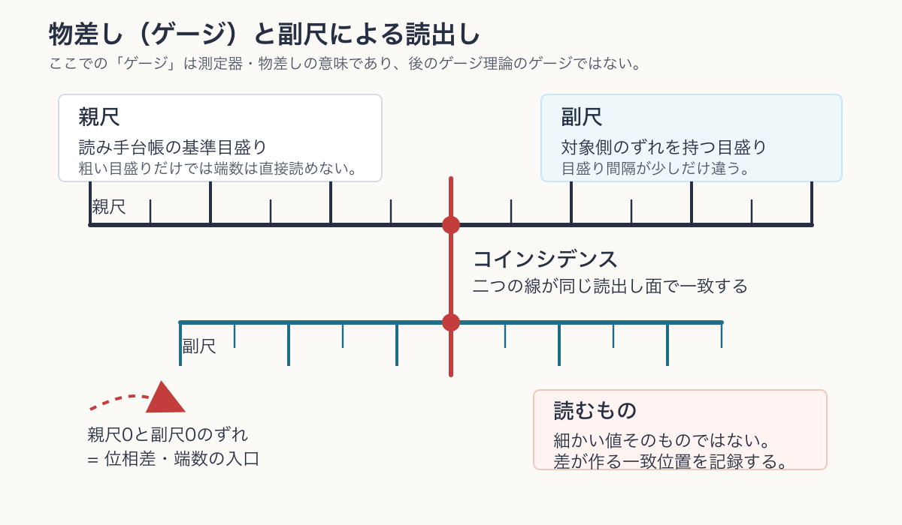

# 第8章 外部測定の定義——内部台帳をどう外から読むか

> **この章の問い**：測定とは、内部台帳の値をそのまま覗く操作なのか。外から読める量は何に限られるのか。
> **この章の答え**：外部測定とは、対象の内部台帳を直接見ることではない。対象台帳・読み手台帳・境界条件をまとめて、記録空間へ非単射に写す読出しである。外から読めるのは、位相差、コインシデンス、対角ノルム、交差項、記録列の変化であり、絶対位相や内部値そのものではない。したがって測定は、内部値の覗き見ではなく、二つ以上の台帳の相関を記録へ落とす境界操作である。

**【高校向・読み下し】** 温度計で水の温度を測るとき、温度計は「水の中の本当の温度」を魔法のように覗いているわけではない。水と温度計が触れ、温度計の中の液体やセンサーが変わり、その変化を目盛りとして読む。つまり読んでいるのは、水そのものではなく、水と温度計の相互作用でできた記録である。この章でいう外部測定も同じである。対象の台帳と、読み手の台帳が境界で照合され、その結果だけが記録として残る。

先に用語をほどいておく。**内部台帳**とは、系が持つ $x,y,z,t,R,Q$ などの共役対の束である。**外部測定**とは、対象台帳と読み手台帳の相関を記録空間へ写す読出しであり、内部値をそのまま覗く操作ではない。**読出し面**とは、二つの台帳が照合され、どの量が記録へ落ちるかを決める境界である。**コインシデンス**とは、二つの指示値・記録・イベントが同じ読出し面で照合される一致イベントである。第5章では、時計や目盛りを読む最小イベントとして使った。本章では、測定面に落ちる最小の記録単位として使う。**有効表示**とは、内部の全構造ではなく、外から読める記録だけで作った標準理論側の表示である。（いずれも→用語集）

---

## 8.1 測定を「覗き見」として始めない

第6章で、レジスタは非単射な読出しを実行する機構だと定義した。したがって測定も、まず非単射な写像として読む。

対象の内部状態を $X$、読み手と境界を含む読出し条件を $B$、記録空間を $Y$ とすると、外部測定は

$$
F:X\times B\to Y,\qquad (x,b)\mapsto F(x,b)
$$

という形を持つ。ここで $X\times B$ は、数の掛け算ではなく、$x\in X$ と $b\in B$ の組 $(x,b)$ 全体を集めた入口である。したがって、直感的には

$$
F:(x,b)\longmapsto y
$$

と読めばよい。第1章で導入した $f:X\to Y$ は、入力を一つだけ持つ読出しだった。本章の $F:X\times B\to Y$ は、その入力を「対象の内部状態 $x$」と「読み手・境界を含む読出し条件 $b$」の二つに増やした形である。射影というより、二つの入力を一組にして記録へ落とす読出し写像である。

$B$ には、読み手の台帳、基準目盛り、接触面、照合手順、記録媒体が含まれる。ここで $F$ は、測定結果の確率法則をすでに与えるものではない。まず、対象側の状態、読み手側の台帳、境界条件、記録媒体をまとめて、外部に残る記録 $y$ へ落とす読出し面を表している。実際の測定では一つの記録 $y$ が残るが、その記録から入口側の $(x,b)$ を一意に戻せるとは限らない。この非単射性が、本章でいう外部測定の基本である。

ここで本章が避けるべき誤解は明確である。

> **外部測定は、内部台帳の全ての値をそのまま読む操作ではない。**

読まれるのは、内部台帳が外部台帳と接したときに、どの差・一致・強度・交差項が記録に落ちたかである。これは第0章の二つのランプの拡張である。一つのランプだけでは読めなかった。同じように、一つの内部台帳だけを絶対的に読むことはできない。読み手との照合が必要である。

## 8.2 読出し面の三部品

外部測定には、少なくとも三つの部品が要る。

| 部品 | 役割 | 本書での読み |
|---|---|---|
| 対象台帳 | 読まれる側の位相差・位相増分率を持つ | 内部構造 |
| 読み手台帳 | 基準目盛り・参照位相・記録媒体を持つ | 外部基準ではなく、もう一つの系 |
| 境界 | どの量が照合されるかを決める | 読出し面 |

この三つがそろって初めて、記録が生じる。読み手を「宇宙の外にいる完全な観測者」として置く必要はない。読み手もまた台帳を持つ系である。ただし、局所的な測定では、読み手の台帳を基準として固定した有効表示を使う。この固定は便利な近似であって、絶対的な特権ではない。

**【高校向】** ものさしで長さを測るとき、読んでいるのは「物体の絶対長」ではなく、ものさしの目盛りとの一致である。ものさしも熱で伸びるし、観測者も動く。ふだんはそれを無視できるから便利に使えるだけで、原理的には測定とは「対象とものさしの照合」である。

この意味で、測定器は日常語の**物差し（ゲージ）**として働く。ただし、ここでいうゲージは、後で扱うゲージ理論のゲージではない。単に、対象と読み手の目盛りを照合するための器具、という意味である。たとえばバーニア副尺では、親尺より細かい値を直接覗いているのではない。親尺と副尺の目盛り間隔のわずかな差が作る一致位置を読む。この一致位置が、ここでいうコインシデンスの素朴な模型である。

> **補足：副尺のある物差し**
> 著者の頃は、中学の技術家庭科などでノギスやバーニアメータの副尺の読み方を学ぶ機会があった。しかし、現在の読者は副尺を見たことがないかもしれない。副尺とは、親尺と少しだけ目盛り間隔の違う小さな目盛りを重ね、どの線が一致するかで端数を読む仕組みである。関心がある読者は、副尺・ノギスの読み方に関する一般的な解説を参照してほしい。

## 8.3 外から読める量の一覧

第1巻の読出し代数を使うと、外部測定で読める量は次のように整理できる。

表の最初に置く**コインシデンス**は、第5章の用語を引き継いでいる。そこでは、時計や定規が読んでいるのは持続や長さそのものではなく、一致イベントの列だと整理した。本章では同じ語を、測定一般の読出し面に広げる。つまり、値を読む前にまず「二つの台帳が同じ面で照合された」という事実が記録の最小形として立つ。

| 読める量 | 形 | 失うもの |
|---|---|---|
| コインシデンス | 二つの記録が同じ読出し面に落ちる | その面に来るまでの内部履歴 |
| 位相差 | $\theta_A-\theta_B$ | 絶対位相 |
| 対角ノルム | $Z\bar Z=|Z|^2$ | 位相全体 |
| 交差項 | $2\mathrm{Re}(Z_A^*Z_B)$ | 大域位相、読出しに出ないファイバー |
| 記録列の差 | $y_{n+1}-y_n$ | 単一記録だけでは速度・変化率は戻らない |

この表は、外部測定の限界を示している。対象が「内部で何を持っているか」を丸ごと読むのではない。読出し面に落ちる形だけが記録される。第6章の言葉で言えば、不確定性の第二根であるファイバーが必ず残る。

たとえば、強度読出し

$$
I(\theta,\varphi)=|e^{i\theta}+e^{i\varphi}|^2
=2[1+\cos(\theta-\varphi)]
$$

は、相対位相の余弦だけを記録する。したがって $\theta-\varphi$ と $-(\theta-\varphi)$ は同じ強度を与える。ここには**反射縮退**、つまりプラスのズレとマイナスのズレが同じ記録に潰れることがある。これは第1章の部分射影で、$\theta$ と $-\theta$ が同じ $\cos\theta$ に落ちるのと同じ型であり、測定装置の失敗ではなく、読出し面がそういう写像だからである。

## 8.4 変位記録は相対位相の差である

対象の位相を $\theta$、参照台帳の位相を $\varphi$ とする。同じ読出し面で二つを干渉させると、読めるのは

$$
\theta-\varphi
$$

に依存する量である。配置が変わらなければ、強度値も変わらない。配置が $\theta$ から $\theta+\Delta\theta$ へ変われば、一般には強度値が変わる。その差が記録に残る。

本章では、これを**変位記録**と呼ぶ。変位記録とは、対象の絶対位置を覗いた結果ではなく、参照台帳に対する相対位相の変化が、記録値の差として残ったものである。

ここで注意する。変位記録は、二つの配置を区別可能にする。しかし、それだけで時間の向きを与えるわけではない。第6章で見たように、向きは非単射なレジスタの連鎖によって入る。変位記録は順序の可能性条件を与え、レジスタがその順序を記録の矢として固定する。

**【高校向】** 写真が2枚あって、2枚目ではボールの位置が違うとする。この2枚から「位置が変わった」ことは分かる。しかし、どちらが先に撮られた写真かは、ファイル名や連番や背景の時計がないと決まらない。変位記録は「違いがある」ことを残す。向きは、記録の並びが作る。

## 8.5 スケール共変な測定

第5章で見たように、閉じた系は自前の目盛りを持つ。したがって、外部測定で読めるのは、絶対スケールそのものではなく、読み手の目盛りとの比である。

対象のスケールを $S_A$、読み手のスケールを $S_B$ とすれば、外に出る基本量は

$$
\frac{S_A}{S_B}
$$

のような無次元比である。長さ、時間、質量、周波数を標準単位で書くとき、実際には読み手側の台帳を暗黙の基準にしている。

このため、外部測定の記述では次を区別する。

| 言い方 | 意味 |
|---|---|
| 内部スケール | 対象が閉包から持つ自前の目盛り |
| 読み手スケール | 測定に使う基準台帳 |
| 外部値 | 両者の比または換算結果 |

内部スケールを直接読むことはできない。比として読まれた値を、読み手の単位系に戻したものが外部値である。

したがって、外部測定でまず立つのは、対象だけに属する絶対値ではなく、対象台帳と読み手台帳の比である。単位系とは、この比を読み手側の目盛りに固定して表示する約束である。外部値は、その約束のもとで得られる換算値であって、内部スケールそのものの直接読出しではない。

## 8.6 読み手を含めると何が変わるか

測定では、読み手を固定した外部基準として扱うことが多い。しかし、第1巻の立場では、読み手も系であり台帳を持つ。したがって、対象と読み手を合わせて一つの大きな閉包として読むこともできる。

対象だけを見ると、測定は

$$
X\to Y
$$

という非単射写像に見える。一方、対象と読み手を合わせると

$$
F:X\times B\to Y,\qquad (x,b)\mapsto y
$$

である。ここでも $X\times B$ は、「対象側の状態」と「読み手・境界側の状態」をひと組にした入口を意味する。$B$ 側をただの固定パラメータではなく、読み手台帳を含む入力として扱うので、$B$ 側にも状態変化があり得る。測定装置が対象へ影響を与えうること、測定結果が装置側の記録として残りうることは、この形で表せる。ただし、どのような相互作用によってその記録が形成されるかは、ここではまだ具体法則としては置かない。

ただし、これによって非単射性が消えるわけではない。大きな系をさらに外から読むには、また読出し面が必要になる。どこまで含めても、最終的に記録として読まれる段階では、ファイバーが残る。これは第6章のレジスタ構造そのものである。

## 8.7 有効表示としての外部測定

標準理論では、測定は状態と測定演算子、あるいは場と検出器の相互作用として定式化される。本書は、その標準形式を置き換えない。本章がしているのは、その標準形式の手前に、次の読出し面を置くことである。

> **外部測定 ＝ 対象台帳と読み手台帳の相関を、非単射な記録へ落とす有効表示。**

この読み方により、次の整理が得られる。

| 標準理論側 | 本書での読み | 注意 |
|---|---|---|
| 測定値 | 読出し面に落ちた記録 | 内部値の完全復元ではない |
| 状態の重ね合わせ | 本書の有効表示では、複数の位相成分を持つ台帳表示として読む | ヒルベルト空間の線形構造や測度選択の導出ではない |
| 干渉 | 交差項の読出し | 相対位相だけが出る |
| 収縮 | 本書の有効表示では、複数の入口候補を持つ読出しから、一つの記録値が残ったものとして読む | 標準的な状態収縮公理、射影測定、Born 則の導出ではない |
| 測定装置 | 読み手台帳とレジスタ | 宇宙外の観測者ではない |

この章で定義した外部測定の面を使って、次章では Born 型読出しと有効運動方程式を置く。平方強度の形は第1章から見えている。しかし、それを実現頻度・確率として採用するには、測度の選択が要る。この境界線を保ったまま、標準量子論の有効表示へ接続する。

## この章のまとめ

| 区分 | 内容 |
|---|---|
| 定義・構成 | 外部測定、読出し面、変位記録、スケール共変な測定 |
| 証明・確認したこと | 外部測定は内部値の覗き見ではなく、対象台帳・読み手台帳・境界条件から記録への非単射写像であること |
| 対応 | 干渉強度、測定装置、記録、一つの測定記録が残ることの有効表示 |
| 主張しないこと | 測定問題の完全解決、Born 則の導出、測定装置を含む全宇宙状態の完全復元 |
| 次章への問い | 平方強度 $|Z|^2$ を重みとして読む Born 型読出しは、外部測定のどの面に置かれるか。有効運動方程式はどこから仮説として入るか |
