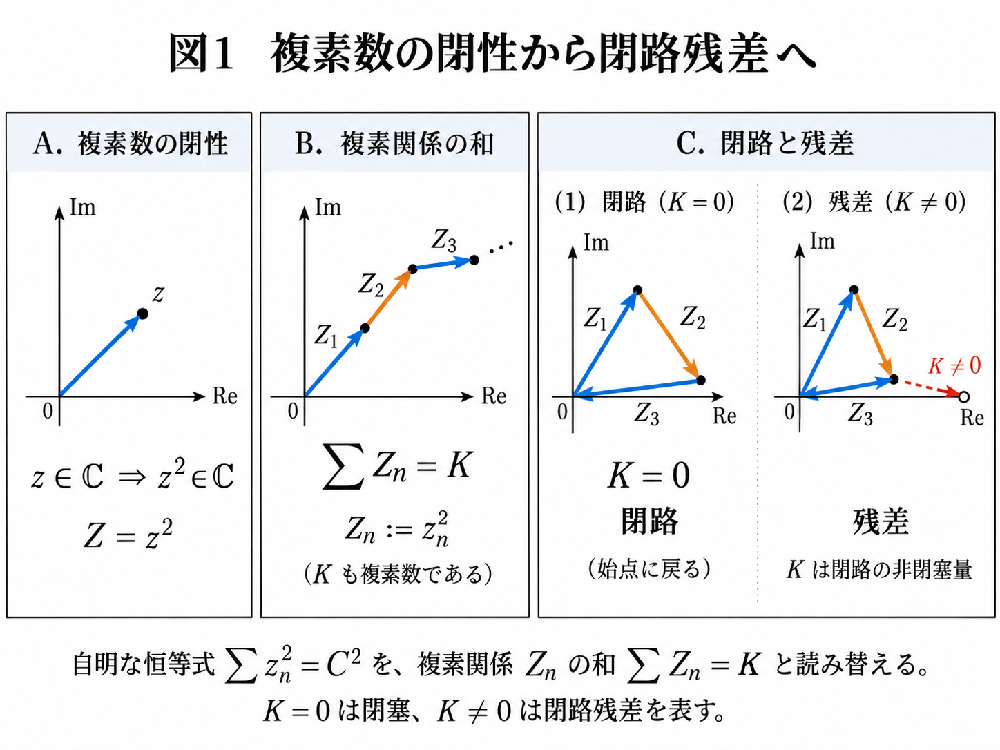
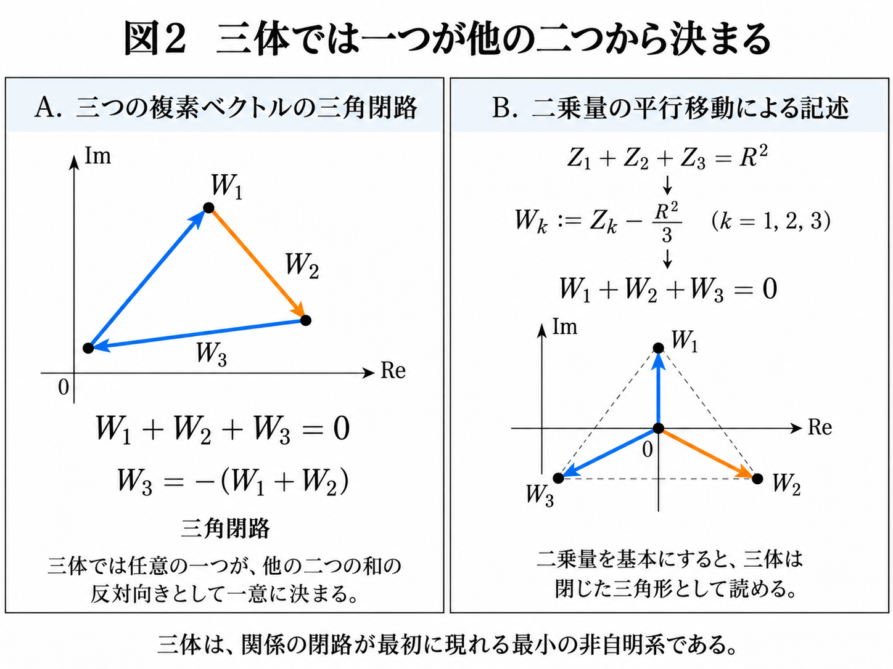
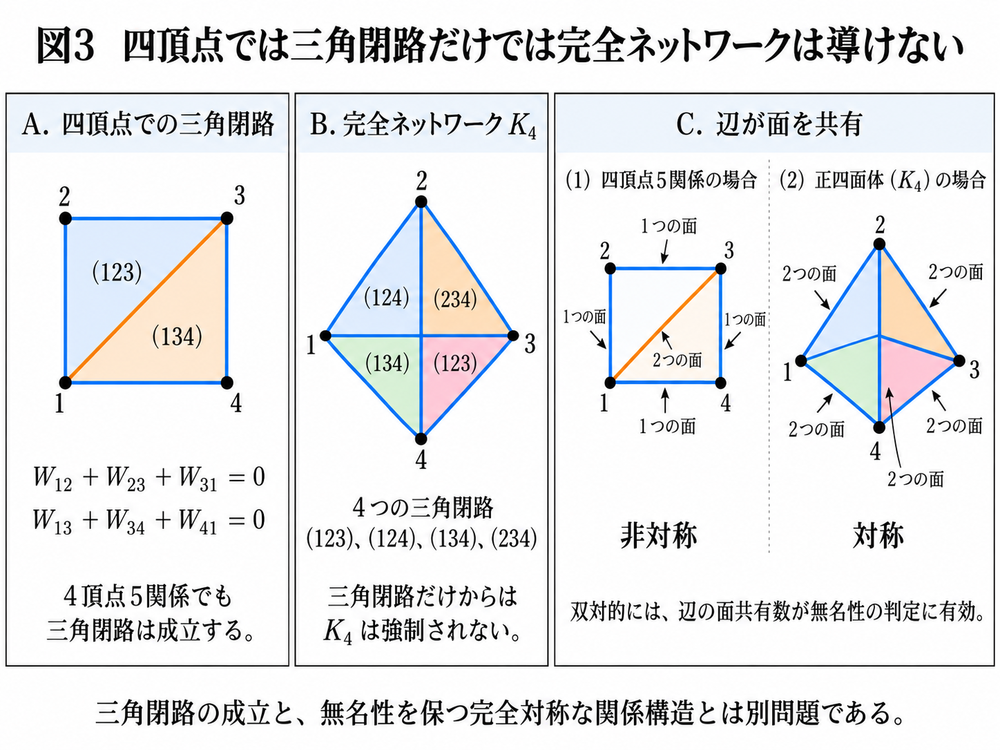
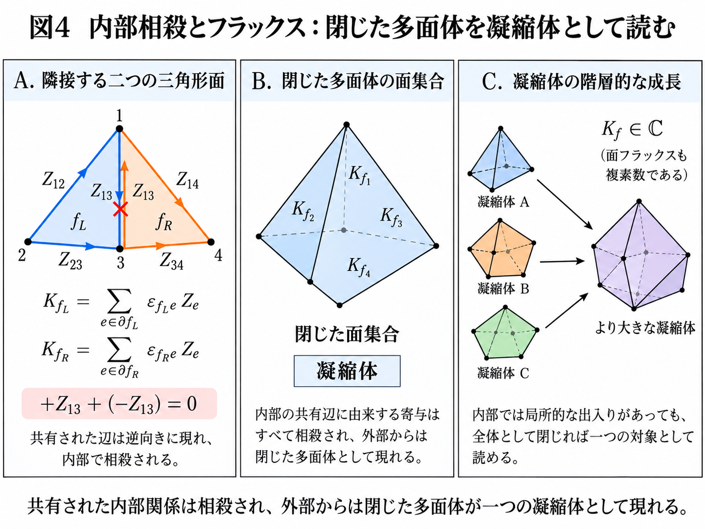
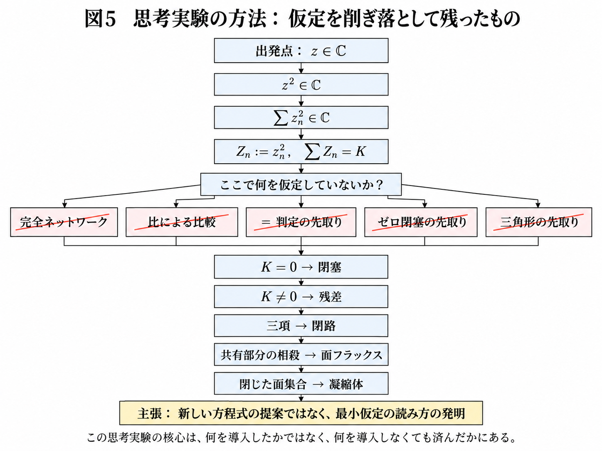

# 複素数の閉性からの関係・閉路・フラックス・凝縮体の読出し
## ― 公理候補を削ぎ落とす最小仮定思考実験 ―

**著者:** 木原範昭 (Noriaki Kihara)  
**ORCID:** 0009-0004-6753-4020  
**作成日:** 2026-09-19  
**版:** v1.3（査読修正：大域フラックスゼロの帰結化・複素対数の定義域・曲率対応写像の限定・有限列の明示）  
**Version DOI:** 10.5281/zenodo.22841917  
**Concept DOI:** 10.5281/zenodo.22841916

---

## 要旨

本稿は、新しい代数法則や新しい運動方程式を提案するものではない。出発点は通常の複素数 $z\in\mathbb C$ のみであり、複素数が加算・乗算・二乗に対して閉じているという既知の事実だけを用いる。特に、任意の有限複素数列 $\{z_n\}_{n=1}^{N}$ に対して $z_n^2\in\mathbb C$ であるから、$Z_n:=z_n^2$ と置けば

$$
\sum_{n=1}^{N} z_n^2=\sum_{n=1}^{N} Z_n=K,\qquad K\in\mathbb C
$$

と読める。さらに任意の $K\in\mathbb C$ はある $C\in\mathbb C$ に対して $K=C^2$ と書けるため、

$$
\sum_n z_n^2=C^2
$$

は新しい物理公理ではなく、複素数の閉性の範囲内にある表記である。

本稿の主題はこの自明な事実そのものではなく、その**読出し順序**にある。思考実験では、完全ネットワーク、外部基準、比、等号判定、ゼロ閉塞、三角形や頂点の先取りなどを一つずつ疑い、無名性に対する隠れた仮定を除去した。その結果、二乗量 $Z_n$ を普通の複素関係として読むと、複数関係の和、閉路、閉路残差、面フラックス、共有部分の相殺、閉じた多面体としての凝縮体、さらに凝縮体の階層化を同一の複素数型のまま記述できることが分かった。

3関係の和がゼロなら閉路として読め、非ゼロなら残差 $K_f$ を持つ。複数の閉路を向き付きで貼り合わせると共有辺は逆符号で相殺され、外部境界に残る量だけが有効フラックスとして残る。面残差 $K_f$ 自身も複素数であるため、それを上位階層の関係として再利用できる。この階層性は、辺・面・セルの型を別々に仮定せず、同じ $\mathbb C$ の中で再帰できるという特徴を持つ。

本稿は、格子ゲージ理論、spin network の coarse-graining、closure defect、Bianchi identity、bubble network との構造的類似を最後に比較する。ただし、それらを出発点には置かない。本稿の新規性候補は、既存理論を簡略化したことではなく、**通常の複素数の自明な閉性だけから出発し、隠れた仮定を削ぎ落とす過程を通じて、閉路・曲率・フラックス・凝縮体を読出す最小解釈枠組みを得たこと**にある。

**キーワード:** 複素数、二乗量、閉路、閉塞、closure defect、フラックス、曲率、凝縮体、無名性、最小仮定、格子ゲージ理論

---

## 1. 本稿が主張するもの／しないもの

### 1.1 主張しないこと

本稿は次を数学的新定理として主張しない。

1. 複素数の二乗が複素数であること。
2. 複素数の有限和が複素数であること。
3. 任意の複素数が複素平方根を持つこと。
4. 複素ベクトルの和がゼロなら閉多角形として図示できること。
5. 向き付き境界で共有要素が逆符号に現れること。

これらは既知の数学である。

### 1.2 本稿の対象

本稿が扱うのは、上記の既知事実を**どの順に、どの追加仮定を入れずに物理構造として読むことができるか**である。

したがって本稿は「新しい方程式の論文」ではなく、

$$
\boxed{\text{既知の恒等構造に対する最小仮定の読出し論文}}
$$

である。

### 1.3 方法論

思考実験の各段階で、新しい構造を導入する前に次を問う。

- その構造は複素数の代数から導出されたものか。
- 外部基準を暗黙に導入していないか。
- 個体名や頂点名を必要としていないか。
- 完全グラフ、距離、次元、座標、時刻を先に与えていないか。
- 「同じ／違う」の判定器を原始操作として置いていないか。
- 既存物理理論を逆輸入していないか。

導出できないが必要なものだけを**公理候補**として残し、導出できたものは公理候補から外す。

### 1.4 v1.2 改訂注：多体関係の完全性に関する隠れた仮定

本稿 v1.1 完成後、Anegawa, Miyata, Suzuki, Tamaoka (2026) [6] を読んだ。同論文は、本稿とは異なる量子情報・ホログラフィーの枠組みではあるが、固定した三分割において各部分系の通常のエンタングルメント・エントロピーが飽和した後にも、genuine multi-partite entanglement を測る量が時間発展し得る例を示している。

この論文を検討したことを契機に、本稿 v1.1 には、

$$
\boxed{\{Z_e,K_f\}\ \text{が多体系の有効な関係情報を十分に尽くす}}
$$

という仮定が暗黙に残っていたことに気づいた。すなわち、二体の複素関係 $Z_e$ と、それらから構成される閉路残差 $K_f$ の集合から、多体系の関係構造を十分に読めることを事実上前提としていた。しかし、この完全性は本稿の複素数代数から導出されていない。

Anegawa et al. [6] の結果は本稿のモデルを直接支持または反証するものではなく、$K_f$ と multi-entropy を同一視することもできない。一方で、**低次の読出しが飽和しても既約な多体関係が残り得る**という具体例は、上記の完全性を自明視できないことを示す。

したがって v1.2 では、この仮定を導出済みの性質から外し、その妥当性を今後の課題として明示する。本修正は、本稿自身が採用する「隠れた仮定を発見したら削除または保留する」という方法論を、本稿そのものに適用した結果である。

---

## 2. 出発点：一つの複素数

出発点を

$$
z\in\mathbb C
$$

とする。

ここでは粒子、辺、頂点、面、空間、時間、ゲージ群、ネットワークを仮定しない。

複素数体の閉性から、

$$
z^2\in\mathbb C
$$

である。

これは極めて自明である。しかし本稿では、この自明さを崩さずにどこまで構造を読めるかを追う。

一つの複素数に自己乗算を施しても、

$$
z\mapsto z^2
$$

結果は再び一つの複素数である。したがって、この段階では「一体が二体に分裂した」「新しい頂点が生じた」などとは言えない。代数型は

$$
\mathbb C\to\mathbb C
$$

のままである。

ここで重要なのは、**複素数の演算結果だけから生成履歴や個体数は復元されない**ことである。したがって構造を論じるには、複数の複素関係が同時に現れる場合を別に考える必要がある。

---

## 3. 二つの複素数：比較器を置かず、積を取る

二つの複素数

$$
z_1,z_2\in\mathbb C
$$

があるとする。

最初に比 $z_2/z_1$ を関係量とする案を考えることができる。しかし、比を「大きい／小さい」「同じ／違う」と読むには比較基準を暗黙に持ち込む危険がある。また $z_1=z_2$ という equality 判定を原始操作として置くことも、本稿の目的には強すぎる。

一方、積

$$
z_1z_2
$$

は外部基準を必要としない。複素数の閉性から

$$
z_1z_2\in\mathbb C
$$

である。

実部・虚部で展開すれば、

$$
z_1=a+ib,\qquad z_2=c+id
$$

に対して

$$
z_1z_2=(ac-bd)+i(ad+bc).
$$

結果は再び一つの複素数である。

同じ値を二度使えば

$$
z\,z=z^2
$$

となり、自己積は二体積の特殊例である。しかし、値が同じことを外部から判定して構造を分ける必要はない。代数上は積を取るだけでよい。

また複素数には零因子がないため、

$$
z_1z_2=0
$$

なら少なくとも一方がゼロである。したがって、外部尺度なしに現れる最小の代数的境界は「ゼロ／非ゼロ」である。ただし本稿ではこれを新しい物理公理とはしない。

---

## 4. 二乗量を基本量として読む

ここで本稿の主要な読替えを行う。

各複素数について

$$
\boxed{Z_n:=z_n^2}
$$

と定義する。

複素数の二乗は複素数なので、

$$
Z_n\in\mathbb C.
$$

すると、しばしば特殊な形に見える

$$
\sum_n z_n^2
$$

は、単に

$$
\boxed{\sum_n Z_n}
$$

という複素数の通常の和である。

したがって

$$
\sum_n z_n^2=C^2
$$

も、

$$
\boxed{\sum_n Z_n=K},\qquad K:=C^2\in\mathbb C
$$

と書けば、ただの複素和である。

この時点で $C^2$ を「平方だから特別な量」と扱う必要はない。二乗量の空間では $K=C^2$ も普通の複素数である。

この読替えが本稿の核心である。

*図1　複素数の閉性から閉路残差へ。自明な恒等式 $\sum z_n^2=C^2$ を、複素関係 $Z_n:=z_n^2$ の和 $\sum Z_n=K$ と読み替える。$K=0$ は閉塞、$K\neq0$ は閉路残差を表す。*

---

## 5. 二体の補助思考実験：和が実数になる場合

二つの複素数に対し、唯一の拘束として

$$
z_1^2+z_2^2=R^2\in\mathbb R
$$

を置く補助思考実験を考える。

二乗量を

$$
Z_1=z_1^2,\qquad Z_2=z_2^2
$$

とすれば、単に

$$
\boxed{Z_1+Z_2=R^2}
$$

である。

中心を引いて

$$
W_1:=Z_1-\frac{R^2}{2},\qquad
W_2:=Z_2-\frac{R^2}{2}
$$

とすると、

$$
\boxed{W_1+W_2=0}
$$

すなわち

$$
W_2=-W_1.
$$

元の $z$ 表現では平方根の枝を伴うが、二乗量 $Z$ を基本にすれば、二体は実軸上の中心 $R^2/2$ に対する反対称配置にまで単純化される。

この補助例は「二乗量を基本量として読む」ことの利点を示すが、本稿全体で $R^2\in\mathbb R$ を常に要求するわけではない。

---

## 6. 三体：最初の非自明閉路

三つの二乗量について

$$
Z_1+Z_2+Z_3=R^2\in\mathbb R
$$

とし、

$$
W_k:=Z_k-\frac{R^2}{3}
$$

と置けば、

$$
\boxed{W_1+W_2+W_3=0}.
$$

したがって任意の一つは他の二つから

$$
W_3=-(W_1+W_2)
$$

と決まる。

ここで重要なのは、「三角形」を先に仮定する必要がないことである。

まず三つの複素関係 $W_1,W_2,W_3$ があり、その和がゼロになる。この代数条件を複素平面上で図示すると閉三角形として読める。

すなわち論理順序は

$$
\boxed{\text{三角形を仮定}\Rightarrow\text{閉路条件}}
$$

ではなく、

$$
\boxed{W_1+W_2+W_3=0\Rightarrow\text{三角閉路として読める}}
$$

である。

この順序は後の無名性の議論で重要になる。

*図2　三体の三角閉路。三つの複素関係のゼロ和から、任意の一つが他の二つの和の反対向きとして定まり、閉三角形が後から読める。*

---

## 7. 四体で露出する問題：体と関係は同じではない

三体では頂点数3と辺数3が一致するため、「体」と「関係」を混同しやすい。

しかし四体なら、全ての二体関係を持つと仮定した場合の関係数は

$$
M=\binom{4}{2}=6
$$

である。

ここで最初に「四体なら完全グラフ $K_4$」と置きたくなる。しかしこれは本稿の方法論では許されない。完全結合が複素数の閉性から導出されていないからである。

実際、4頂点を外周4辺と対角線1本だけで構成した5関係系でも、二つの三角閉路を同時に閉じる非自明解が存在する。

例えば向き付き関係を用いて

$$
W_{12}+W_{23}-W_{13}=0
$$

$$
W_{13}+W_{34}+W_{41}=0
$$

とすれば、第一式から

$$
W_{13}=W_{12}+W_{23}
$$

第二式へ代入して

$$
W_{12}+W_{23}+W_{34}+W_{41}=0
$$

となる。

したがって、

$$
\boxed{\text{三角閉路が閉じる}\not\Rightarrow\text{完全結合}}
$$

である。

この反例により、完全ネットワーク仮説は本思考実験から除外される。

*図3　四頂点では三角閉路の成立だけから完全ネットワーク $K_4$ は導けない。4頂点5関係でも二つの三角閉路を閉じられるため、完全結合は追加仮定である。*

---

## 8. 頂点中心から辺中心への双対的転換

完全グラフを先に置かずに構造を読むため、考え方を反転する。

従来の図示では

$$
\text{頂点}\to\text{辺}\to\text{面}
$$

と考えがちである。

しかし本稿では複素関係 $Z_e$ を基本にしているため、むしろ

$$
\boxed{\text{関係（辺）}\to\text{閉路}\to\text{面}}
$$

と読む。

三つの関係 $Z_1,Z_2,Z_3$ が

$$
Z_1+Z_2+Z_3=0
$$

を満たすなら、その三関係は一つの閉じた面として読める。

ここでは「どの頂点を共有しているか」を先に与えない。閉路構造が先で、頂点やセル構造は後から双対的に読む。

この順序により、完全ネットワークや頂点名を原始構造として仮定する必要がなくなる。

---

## 9. 閉路残差

閉路が完全に閉じない場合、

$$
\boxed{\sum_{e\in\partial f}\epsilon_{fe}Z_e=K_f},\qquad K_f\in\mathbb C
$$

と書く。

$\epsilon_{fe}=\pm1$ は閉路の向きに対する符号である。

$K_f=0$ なら閉路は完全閉塞し、$K_f\neq0$ なら複素残差を持つ。

重要なのは、$K_f$ もまた普通の複素数であることである。

$$
\boxed{Z_e\in\mathbb C\quad\Rightarrow\quad K_f\in\mathbb C}
$$

したがって「辺の量」と「面の残差」は代数型を変えない。

---

## 10. 中心投影半径としての残差

$K_f\in\mathbb C$ なので、ある $C_f\in\mathbb C$ を用いて

$$
\boxed{K_f=C_f^2}
$$

と書ける。

したがって

$$
\sum_{e\in\partial f}\epsilon_{fe}Z_e=C_f^2
$$

は、二乗量で書かれた中心投影半径の複素版として読める。

この段階で「曲率」という全く別の変数を追加する必要はない。完全閉塞なら $C_f=0$、非閉塞なら有限の複素半径を持つ。

中心投影型の定曲率幾何として読出す場合、非閉塞（$K_f\neq0$）の面については、曲率尺度は二乗半径の逆数で

$$
\kappa_f\propto \frac{1}{C_f^2}=\frac{1}{K_f}
$$

と読める。

この曲率読出しは対応写像である。特に

$$
K_f=C_f^2\in\mathbb R_{>0}
$$

という実正値枝に制限し、標準的な曲率半径の規約を採れば、

$$
\kappa_f=\frac{1}{K_f}
$$

という実定曲率幾何の読出しを回収する。一般の複素 $K_f$、特に $\operatorname{Im}K_f\neq0$ が担う幾何学的意味は本稿では未導出であり、接続課題として残す。

本稿で重要なのは、$K_f$ を外から「曲率変数」として追加したのではなく、閉路残差そのものが中心投影半径を決める量として既に存在している点である。

---

## 11. 共有辺の相殺と面フラックス

二つの三角面を一つの内部辺で貼り合わせる例を考える。

面 $f_1$ と $f_2$ の残差を

$$
K_{f_1}=Z_{12}+Z_{23}-Z_{13}
$$

$$
K_{f_2}=Z_{13}+Z_{34}+Z_{41}
$$

とする。

両者を足すと、共有辺 $Z_{13}$ は

$$
-Z_{13}+Z_{13}=0
$$

と相殺され、

$$
\boxed{K_{f_1}+K_{f_2}=Z_{12}+Z_{23}+Z_{34}+Z_{41}}
$$

となる。

すなわち内部関係は消え、外部境界に接する関係だけが残る。

このとき $K_f$ を面フラックスとして読むと、

$$
\boxed{\text{内部共有関係の相殺}\Rightarrow\text{外部境界フラックスだけが残る}}
$$

という離散的な Stokes 型構造が得られる。

ここでも Stokes の定理を出発点に置いたわけではない。向き付き閉路を貼り合わせたときに共有項が逆符号で現れるという代数的事実を追った結果である。

---

## 12. 閉じた多面体を凝縮体として読む

複数の面が貼り合わされ、外殻が閉じた構造 $\mathcal C$ を考える。

各面に複素フラックス $K_f$ があり、隣接セルの共有面では向きが逆になるため、内部面の寄与は

$$
K_f+(-K_f)=0
$$

と相殺される。

したがって、本稿で定義したフラックス読出しにおいては、内部共有関係は相殺され、境界に残る量が有効量として読まれる。

ただし、**この境界フラックスが多体系の全ての既約関係情報を尽くすことは、本稿では証明されていない。** 二体関係と閉路残差だけでは捉えられない高次の関係量が独立に存在する可能性は、v1.2 で未解決問題として明示的に残す。

本稿ではこの閉じた多面体的関係構造を**凝縮体**と呼ぶ読出しを提案する。

$$
\boxed{\text{凝縮体}=\text{内部関係が共有面で相殺される閉じた関係複体}}
$$

これは「粒子＝点」とする定義ではない。多数の複素関係が閉じた面構造を作り、外部から一つの有効対象として読めるものを凝縮体とする。

この解釈は数学的同一性ではなく物理的読出しであり、公理候補／解釈候補として区別しておく。

---

## 13. 局所フラックスと大域フラックス

本稿でいう閉多面体的凝縮体、すなわち各辺がちょうど二つの面に逆向きで属する、閉じた向き付き2-多様体型の面複体 $\mathcal C$ を考える。$F(\mathcal C)$ を、凝縮体 $\mathcal C$ を構成する向き付き面集合とする。面フラックスを

$$
K_f=\sum_{e\in\partial f}\epsilon_{fe}Z_e
$$

とすると、

$$
\sum_{f\in F(\mathcal C)}K_f=\sum_{e}\left(\sum_{f\in F(\mathcal C)}\epsilon_{fe}\right)Z_e=0
$$

である。各共有辺について incidence 符号が $+1$ と $-1$ で一度ずつ現れるためであり、これは離散的な $\partial^2=0$ 型恒等式である。この構造は、文献 [4] が closure constraint を Bianchi identity として読む構造の可換版に対応する。

したがって、大域フラックスゼロは追加条件ではなく、この閉じた向き付き構造からの帰結である。しかしこれは各面について

$$
K_f=0
$$

を意味しない。$K_f\neq0$ の面が局所的に存在し得る。

これは重要である。内部では非ゼロの相互作用が持続しながら、全体としては閉じる構造が可能だからである。

したがって、

$$
\boxed{\text{大域フラックスゼロ}\neq\text{局所フラックスゼロ}}
$$

である。

ゲージ理論への物理対応を採る場合、内部共有面上の非ゼロフラックスを内部ゲージ交換のモードとして読むことができる。QED 的語彙で「仮想光子の交換」に近い解釈を与えることは可能だが、これは本稿の代数から直接導出された粒子同一性ではない。

---

## 14. フラックスも複素数であることによる階層性

本構成の重要な特徴は、面フラックス $K_f$ 自身も複素数であることである。

$$
K_f\in\mathbb C.
$$

したがって、ある凝縮体の外部フラックスを、次の階層では新しい関係量として扱える。

模式的に

$$
Z_e\in\mathbb C
\longrightarrow
K_f\in\mathbb C
\longrightarrow
K_{\mathcal C}\in\mathbb C
\longrightarrow\cdots
$$

である。

すなわち、

$$
\boxed{\mathbb C\to\mathbb C\to\mathbb C}
$$

の型を変えずに、

$$
\text{関係}\to\text{面}\to\text{凝縮体}\to\text{凝縮体間関係}
$$

を再帰的に読める。

この性質により、小さな閉構造が貼り合わされ、より大きな閉構造を形成する階層的凝縮を考えることができる。

*図4　共有関係の逆向き寄与は内部で相殺され、閉じた面集合は外部から一つの凝縮体として読める。面フラックス $K_f\in\mathbb C$ を次階層の関係として再利用できるため、同じ複素数型のまま階層化できる。*

---

## 15. 完全閉塞と「宇宙／孫宇宙」の識別不能

ある閉じた凝縮体の外部との関係フラックスが完全に消失したとする。

単なる総和ゼロより強く、外部接続として読める境界関係が存在しない、または外部境界の全有効フラックスが消えている場合、その系は外部から関係的に切り離される。

このとき内部観測者にとって、それが「宇宙全体」なのか「より大きな系の内部に生成された孫宇宙」なのかを、外部関係なしに区別することはできない。

したがって、

$$
\boxed{\text{完全閉塞した関係世界には絶対的な“全宇宙”ラベルがない}}
$$

という読出しが可能である。

これは物理仮説であり、現在の複素数代数だけから実在性まで導出したものではない。

---

## 16. 過去から現在への合成と時間方向

同じ複素和構造は、時間方向の読出しにも利用できる。

過去に確定した二乗量を

$$
Z_1,\ldots,Z_n
$$

とすると、現在の合成量

$$
K_n=\sum_{j=1}^{n}Z_j
$$

は一意に計算できる。

次の関係 $Z_{n+1}$ が実現した後には

$$
K_{n+1}=K_n+Z_{n+1}
$$

である。

この意味で、履歴が何個あっても更新は

$$
\boxed{(K_n,Z_{n+1})\to K_{n+1}}
$$

という二体合成に縮約される。

一方、現在 $K_n$ だけから未来 $Z_{n+1}$ を一意に因数分解・分解生成する規則は存在しない。したがって、

$$
\boxed{\text{過去}\to\text{現在}}
$$

は合成として定義できるが、

$$
\boxed{\text{現在}\to\text{未来}}
$$

には追加の生成則が必要である。

本稿ではこれを時間の矢そのものの証明とはしないが、**合成方向と生成方向の非対称性**として保持する。

---

## 17. Log 読出しとの補助的関係

非零の複素数 $z_1,z_2$ の乗法的関係について

$$
z_3=z_1z_2
$$

とすると $z_3\neq0$ であり、枝を適切に管理した複素対数では

$$
\operatorname{Log} z_3=\operatorname{Log} z_1+\operatorname{Log} z_2
$$

となる。

自己積

$$
z\mapsto z^2
$$

について、$z\neq0$ とし、選択した対数枝上で

$$
q:=\operatorname{Log}z
$$

と置くと、Log 空間で

$$
q\mapsto 2q
$$

となり、加法的自己倍化として読める。

一方、二乗量の和

$$
\sum_n Z_n=K
$$

を Log 空間で読むなら、非零の各 $Z_n$ について

$$
q_n:=\operatorname{Log}Z_n
$$

と置く。ゼロ項は和に寄与しないため除外できる。$K\neq0$ の場合に限り、

$$
\operatorname{Log} K=\operatorname{Log}\left(\sum_n e^{q_n}\right)
$$

となる。$K=0$ では $\operatorname{Log}K$ は定義されない。

この Log 読出しは本稿の閉路・フラックス構成に必須ではないが、乗法的基礎と加法的観測表現を接続する補助的読出しとして保持できる。

---

## 18. 隠れた仮定を削除した履歴

本稿の結論だけを提示すると、既存の離散ゲージ理論を複素数で書き直したように見える。したがって、思考実験で実際に除去された仮定を明示する。

| 候補 | 当初の読み | 判定 | 理由 |
|---|---|---|---|
| 完全ネットワーク $K_N$ | 全関係が全関係と接続 | 削除 | 三角閉路だけからは導出不能。4頂点5辺＋1対角線にも閉路解がある |
| 比 $z_2/z_1$ | 二体の最小関係 | 基礎から外す | 読出し時に比較基準を暗黙に持ち込みやすい |
| $z_1=z_2$ 判定 | 同一／差異の原始判定 | 基礎から外す | equality 判定器を物理演算として先に置く必要はない |
| 二体で $\sum z_n^2=0$ | 二波の成立条件 | 削除 | 本思考実験ではゼロ閉塞を追加条件としていない |
| 三角形 | 三体の先験的幾何 | 削除 | $W_1+W_2+W_3=0$ の後に閉路として読める |
| 頂点共有 | 辺の接続原理 | 保留 | 頂点を先に仮定せず、辺→面の双対読出しへ移行 |
| 曲率変数の追加 | 閉路残差とは別の場 | 不要 | $K_f=C_f^2$ として複素中心投影半径に読める |
| ゲージ粒子の追加 | フラックスを運ぶ別粒子 | 物理解釈へ降格 | 局所フラックス伝播をゲージ交換として読める可能性はあるが独立粒子は未導出 |
| 多体情報の完全性 | 二体関係 $Z_e$ と閉路残差 $K_f$ で多体系の全関係情報を尽くす | 保留 | v1.1 では暗黙に仮定していたが、Anegawa et al. [6] を契機に未導出であることに気づいた。既約な高次関係が独立に存在しないことを示していない |

この表が示すように、本稿は仮定を追加するより、仮定候補を導出または削除する方向に進んだ。

*図5　思考実験の方法。複素数の閉性から出発し、各段階で完全ネットワーク、比による比較、等号判定、ゼロ閉塞、三角形の先取りなどを仮定していないか点検し、不要な仮定を削ぎ落として残る読出しだけを採用する。*

---

## 19. 現時点で残る公理候補

複素数の代数そのものを除けば、現段階で残るのは次の候補である。

### 19.1 複数の複素関係の同時存在

単一の値 $z\in\mathbb C$ から「複数の出現」を代数だけで生成したとはまだ言えない。したがって、複数関係の存在または生成規則は公理候補である。

### 19.2 向き・incidence の生成

共有辺が二つの面で逆符号を持つ構造は、向き付き境界を定義すれば自動的に出る。しかし、その向き付き incidence 構造自体が無名な複素関係から必然的に創発するかは未確定である。

### 19.3 閉路を面として読むこと

三複素関係の和ゼロを閉三角形として図示することは数学的に自然だが、それを物理的「面」と同一視するのは読出し規則である。

### 19.4 閉じた面複体を凝縮体として読むこと

内部相殺された閉多面体を一つの有効物体と読むことは、本稿の主要な物理解釈候補である。

### 19.5 二体関係・閉路残差による多体情報の完全性

v1.1 では明示していなかったが、議論の一部では

$$
\mathcal I_{\mathrm{pair+loop}}:=\{Z_e,K_f\}
$$

が多体系の関係情報を十分に表すことを暗黙に用いていた。しかし、

$$
\boxed{\{Z_e,K_f\}\stackrel{?}{\Longrightarrow}\mathcal R_{\mathrm{full}}}
$$

という完全性は未証明である。特に、

$$
R_{123},\quad R_{1234},\quad\ldots
$$

のような既約な高次関係量が独立に必要なのか、それとも $Z_e$ と $K_f$ から導出できるのかは未確定である。本稿ではこの点を新たな公理として採用せず、**公理候補／導出課題として保留する。**

これらは今後、さらに複素数代数と無名性から導出可能かを調べる対象である。

---

## 20. 既存ゲージ理論との接続

ここまでの構成を得た後で既存理論と比較すると、格子ゲージ理論との構造的類似が明瞭になる。

Wilson の格子ゲージ理論では、離散格子上のリンク変数と閉ループが中心的役割を持つ [1]。Hamiltonian 格子ゲージ理論でも電気フラックスとリンク構造が基本となる [2]。

本稿ではゲージ群や格子を先に置かないが、

$$
K_f=\sum_{e\in\partial f}\epsilon_{fe}Z_e
$$

を面フラックスとして読むと、「辺上の量→閉路→面上の残差」という形式が可換格子ゲージ理論と近い。

違いは出発点にある。本稿では、

1. 格子を仮定しない。
2. 完全グラフを仮定しない。
3. 頂点を先に仮定しない。
4. 特定のゲージ群を先に仮定しない。
5. 二乗量も面残差も同じ $\mathbb C$ に属する。

したがって既存ゲージ理論を簡略化した構成ではなく、複素数閉性を追った後にゲージ理論的構造と接続した、という順序である。

---

## 21. closure defect・Bianchi identity・bubble network・multi-partite entanglement との比較

Livine は spin network の coarse-graining において closure constraint を緩和し、closure defect を coarse-grained region 内部の曲率の局所的尺度として解釈している [3]。

Charles と Livine は hyperbolic tetrahedron の closure constraint を Bianchi identity として再解釈し、面 holonomy と多面体閉塞を接続している [4]。

Freidel と Livine の bubble network は、3次元幾何セルを界面で貼り合わせ、境界面・フラックス・gluing の構造を扱う [5]。

これらは本稿の

$$
\text{関係}\to\text{閉路}\to\text{残差}\to\text{面フラックス}\to\text{閉セル}
$$

と強い類似を持つ。

一方で相違も明確である。先行研究では spin network、$SU(2)$ holonomy、spinor、グラフ、セル複体等の構造が先に存在する。本稿ではそれらを出発点にせず、

$$
z\in\mathbb C
$$

と

$$
Z=z^2\in\mathbb C
$$

および複素加算の閉性から、どこまで同型の読出しへ到達するかを検討する。

したがって先行研究との関係は「同じ構造の模倣」ではなく、**より少ない前提から同種の構造へ独立に到達した可能性の検証**として位置づける。

また Anegawa, Miyata, Suzuki, Tamaoka [6] は、二側 BTZ ブラックホールの固定三分割において、各部分系の通常のエンタングルメント・エントロピーが飽和した後にも genuine multi-partite entanglement を測る量が成長し、Einstein–Rosen bridge の成長を追跡し続ける例を示した。

この結果を本稿の $K_f$ や凝縮体と同一視することはできない。また、本稿の複素関係モデルを支持または反証する直接の結果でもない。本稿にとって重要なのは、**低次の読出しが多体系の全情報を尽くすとは限らない具体例**を与える点である。これにより、v1.1 に残っていた「$Z_e$ と $K_f$ で多体系の有効関係情報を十分に尽くす」という暗黙の仮定を認識し、v1.2 ではその完全性を未解決問題へ戻した。

---

## 22. 新規性候補

本稿の新規性候補を、数学的新規性と物理解釈の新規性に分ける。

### 22.1 数学的新規性

複素数の閉性、二乗和、閉多角形、境界の相殺自体には新規性を主張しない。

### 22.2 解釈上の新規性候補

本稿が提案するのは次の読出し連鎖である。

$$
\boxed{
\mathbb C
\to
z^2\in\mathbb C
\to
\sum Z_n=K\in\mathbb C
\to
\text{closure / defect}
\to
\text{face flux}
\to
\text{closed condensate}
\to
\text{hierarchical condensate}
}
$$

しかもこの連鎖を得る過程で、完全ネットワーク、固定頂点、固定次元、外部比較基準を仮定しない。

### 22.3 方法論的な新規性候補

本稿では、モデル構築時に公理を増やすのではなく、隠れた仮定を発見するたびに削除する。

したがって最終的に重要なのは

$$
\boxed{\text{何を導入したかではなく、何を導入しなくても済んだか}}
$$

である。

---

## 23. 限界と未解決問題

本稿だけでは次を導出していない。

1. 一つの複素数から複数の独立な複素関係がどのように生成されるか。
2. 向き付き incidence 構造が無名性から必然的に生じるか。
3. どの閉路が実在する面として選択されるか。
4. 三角閉路だけで十分か、高次多角閉路が独立に必要か。
5. フラックスの時間発展則。
6. フラックス伝播を標準模型の各ゲージ粒子へどう対応させるか。
7. 凝縮体の安定条件と質量・エネルギー・スピンの読出し。
8. 完全閉塞系が実在する独立宇宙に対応するか。
9. 複素 $K_f$、特にその虚部の幾何学的意味、および複素中心投影半径から一般の非一定曲率場への対応。
10. 二体関係 $Z_e$ と閉路残差 $K_f$ の集合が、多体系の全関係情報を十分に決定するか。この情報充足性は、面‐辺 incidence 行列に対して全面残差と外部境界読出しを固定し、内部 $Z_e$ の許容解空間の次元を階数計算で求めることで判別可能である。
11. 二体・閉路量から導出できない既約な三体以上の関係不変量 $R_{123},R_{1234},\ldots$ が独立に存在するか。

特に 10 と 11 は、v1.1 に残っていた隠れた仮定を v1.2 で明示化したものである。その妥当性は現時点では未確定であり、今後の理論解析および数値実験の課題とする。

これらは否定材料ではなく、次段階の接続課題である。

---

## 24. 結論

本稿の出発点は一つの通常の複素数である。

$$
z\in\mathbb C.
$$

複素数は二乗しても複素数であり、

$$
Z_n:=z_n^2\in\mathbb C.
$$

したがって

$$
\sum_n z_n^2=C^2
$$

は、二乗量を基本として読めば

$$
\boxed{\sum_n Z_n=K}
$$

という普通の複素数の和である。

この単純な読替えから、三関係のゼロ和を閉路として読み、非ゼロ和を閉路残差として読み、向き付き閉路を貼り合わせることで内部共有関係の相殺と外部境界フラックスを得ることができる。さらにフラックスも複素数なので、それを次階層の関係として再利用できる。閉じた面集合は内部自由度を相殺した一つの有効対象、すなわち凝縮体として読むことができる。

重要なのは、これらを得る過程で完全ネットワーク、固定頂点、三角形、ゲージ群、外部尺度を先に置かなかったことである。むしろ、それらを仮定候補として疑い、導出できないものを削除した結果、既存ゲージ理論と似た閉路・フラックス構造が後から現れた。

したがって本稿の中心的主張は新しい方程式ではない。

$$
\boxed{
\text{複素数の自明な閉性に、仮定を最小化した関係的読出しを与えると、}
\text{閉路・残差・フラックス・凝縮体の階層構造を統一的に読むことができる。}
}
$$

ただし、この統一的読出しが**多体系の全関係情報を尽くすことは主張しない。** v1.2 では、二体関係 $Z_e$ と閉路残差 $K_f$ だけで十分であるという暗黙の仮定を撤回し、既約な高次関係が独立に必要かどうかを未解決問題として残した。

この枠組みが最終的な物理理論であることは主張しない。しかし、どの追加仮定が本当に不可欠なのかを明確化するための最小基盤として、検討に値する。

---

## 参考文献

本稿は自己引用を用いない。以下は、本稿の構成を得た後で、既存理論との構造的類似を確認するために参照した外部文献である。

1. K. G. Wilson, “Confinement of quarks,” *Physical Review D* **10**, 2445–2459 (1974). DOI: 10.1103/PhysRevD.10.2445.
2. J. Kogut and L. Susskind, “Hamiltonian formulation of Wilson's lattice gauge theories,” *Physical Review D* **11**, 395–408 (1975). DOI: 10.1103/PhysRevD.11.395.
3. E. R. Livine, “Deformation Operators of Spin Networks and Coarse-Graining,” *Classical and Quantum Gravity* **31**, 075004 (2014). arXiv:1310.3362. DOI: 10.1088/0264-9381/31/7/075004.
4. C. Charles and E. R. Livine, “The closure constraint for the hyperbolic tetrahedron as a Bianchi identity,” *General Relativity and Gravitation* **49**, 92 (2017). arXiv:1607.08359. DOI: 10.1007/s10714-017-2255-2.
5. L. Freidel and E. R. Livine, “Bubble Networks: Framed Discrete Geometry for Quantum Gravity,” *General Relativity and Gravitation* **51**, 9 (2019). arXiv:1810.09364. DOI: 10.1007/s10714-018-2493-y.
6. T. Anegawa, A. Miyata, S. Suzuki, and K. Tamaoka, “Growing Einstein–Rosen Bridge with Multi-partite Entanglement,” arXiv:2609.18225 (2026).

---

## 付録A：式の最小系列

本稿の代数的骨格だけを抜き出すと、次の系列になる。

$$
z_n\in\mathbb C
$$

$$
Z_n:=z_n^2\in\mathbb C
$$

$$
K:=\sum_n Z_n\in\mathbb C
$$

$$
K=C^2,\qquad C\in\mathbb C
$$

閉路：

$$
\sum_{e\in\partial f}\epsilon_{fe}Z_e=0
$$

閉路残差：

$$
\sum_{e\in\partial f}\epsilon_{fe}Z_e=K_f
$$

中心投影半径読出し：

$$
K_f=C_f^2
$$

共有辺相殺：

$$
(+Z_e)+(-Z_e)=0
$$

複数面の合成：

$$
\sum_f K_f=\sum_{e\in\partial\Omega}\epsilon_e Z_e
$$

閉じた向き付き面複体での大域恒等式（導出済み恒等構造）：

$$
\boxed{\sum_{f\in F(\mathcal C)}K_f=0}
$$

$F(\mathcal C)$ は凝縮体 $\mathcal C$ を構成する向き付き面集合。各辺が二面に逆向きで属する閉多面体境界では、これは incidence の相殺、すなわち離散的な $\partial^2=0$ から恒等的に成立する。

階層化：

$$
K_f\in\mathbb C\quad\Rightarrow\quad K_f\ \text{を次階層の関係量として再利用可能}
$$

---

## 付録B：公理候補台帳

| 対象 | 現在の分類 | 判定理由 |
|---|---|---|
| $z\in\mathbb C$ | 数学的背景 | 複素数を記述言語として採用 |
| $z^2\in\mathbb C$ | 導出済み恒等構造 | 複素数の閉性 |
| $\sum z_n^2=C^2$ | 導出済み恒等構造 | $\sum z_n^2\in\mathbb C$ と平方根の存在 |
| $Z_n=z_n^2$ を基本量として読む | 読出し定義 | 新しい物理解釈の入口 |
| 複数の関係の存在 | 公理候補 | 単一複素数から多重出現をまだ導出していない |
| 閉路を面として読む | 読出し候補 | 幾何学的表現として自然だが物理同一性は未証明 |
| 向き付き incidence | 公理候補／導出課題 | 共有辺相殺には必要。無名性からの導出は未完 |
| $K_f=C_f^2$ を複素中心投影半径として読む | 幾何読出し | 同じ二乗和構造の再表現 |
| 閉多面体＝凝縮体 | 物理的解釈候補 | 内部相殺と外部有効化を持つ |
| 局所フラックス＝ゲージ交換 | 既存理論との接続課題 | 格子ゲージ理論と類似するが粒子同一性は未導出 |
| 多体情報の完全性 $\{Z_e,K_f\}\Rightarrow\mathcal R_{\mathrm{full}}$ | 公理候補／導出課題 | v1.1 では暗黙に仮定していたが未証明。既約な高次関係量が独立に存在する可能性を排除できない |
| 完全ネットワーク | 削除 | 閉路条件だけでは導出できない |

