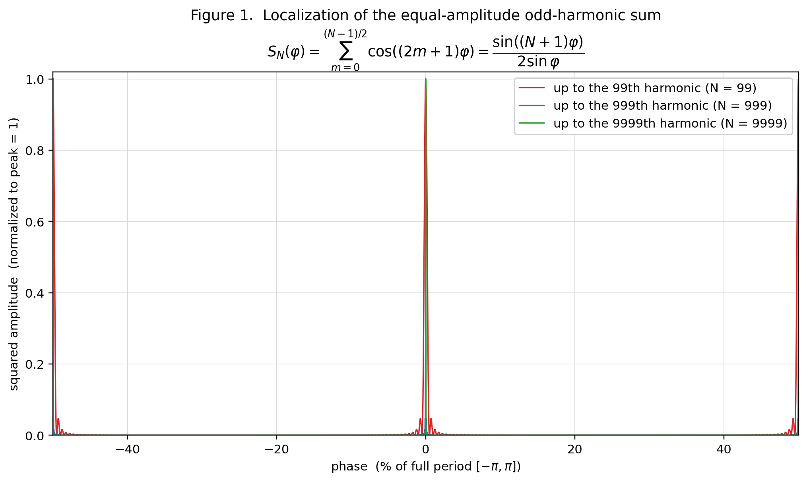
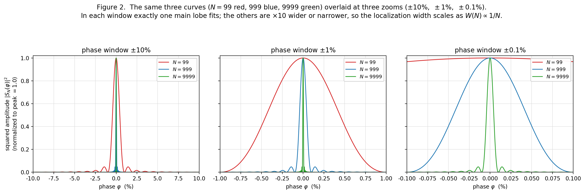

# An Observation on the Isolated Peak Wave of a Constant-Amplitude Odd-Harmonic Sum on a Half-Wavelength Phase Interval and Its Localization

**Subtitle**: Taking the fundamental domain to be the half-wavelength $[-\pi/2,\pi/2]$, the constant-amplitude odd-harmonic sum becomes an isolated peak wave with a peak at the center, and the localization width of its squared amplitude shrinks as $1/(N+1)$ (the reciprocal of the highest odd-harmonic order $N$ plus one; for large $N$, essentially the reciprocal of the highest harmonic order). A formula for the required highest harmonic order, inverted from a prescribed localization width, is also given.

**Author**: Noriaki Kihara  
**Version**: v0.6  
**Date**: 2026-07-01  
**DOI**: Version 10.5281/zenodo.21073985 (this version, v0.6) / v0.5: 10.5281/zenodo.20981890 / Concept 10.5281/zenodo.20833096 (cite this; always resolves to the latest version)  
**Zenodo**: https://zenodo.org/records/21073985  
**Position**: First draft as an observational and organizing paper. It records, as an elementary property of Fourier sums, that superposing constant-amplitude odd harmonics on a half-wavelength phase interval produces a waveform with a peak at the center (here called an "isolated peak wave"). It does not derive physical laws, assert observational facts, or give any particular physical interpretation.  
**Revision (v0.6, 2026-07-01)**: Added Appendix C (gradient-energy-preserving normalization). It records that, by multiplying by the coefficient $a_K=\sqrt{3/(K(4K^2-1))}$, the spatial-derivative energy of the standard Hamiltonian can be kept equal to the $N=1$ baseline wave however much the highest odd-harmonic order $N$ is increased (§2–§3 are unchanged, being scale-invariant shape properties).  
**Revision (v0.5, 2026-06-28)**: Added a remark on scale invariance (§2.5) and conclusion (6), making explicit that $\nu=1,\ \lambda=1$ is a relative normalization (no absolute scale is assumed) and that the odd harmonics only change the waveform, leaving the wave's fundamental frequency $\nu=1$ and fundamental wavelength $\lambda=1$ unchanged. Claims, equations, and existing results are unchanged (an explicit statement of the observation only).

---

## Abstract

This paper observes, for a wave formed by superposing constant-amplitude odd harmonics on the half-wavelength phase interval $\varphi\in[-\pi/2,\pi/2]$, that it becomes an isolated peak wave with a peak at the center, together with the relation between its localization width and the highest harmonic order. The wave under consideration is defined by

$$
S_N(\varphi)=\sum_{m=0}^{(N-1)/2}\cos\!\big((2m+1)\varphi\big)
$$

where $N$ is the highest odd-harmonic order ($N$ odd), and the sum contains the $(N+1)/2$ terms $1,3,5,\dots,N$.

This paper records this property only as a mathematical observation of an odd-harmonic superposition on a half-wavelength phase interval, and gives no physical interpretation.

---

## 1. Introduction

In Fourier analysis it is widely known that introducing higher harmonics shapes the local structure of a waveform. Here we restrict attention to odd harmonics with constant amplitude and observe the single isolated peak wave they form at the center of the half-wavelength interval, together with its localization.

The wave treated here, a constant-amplitude superposition of odd harmonics only, (a) uses cosine $\cos\!\big((2m+1)\varphi\big)$ rather than sine so that the center is a peak, and (b) keeps the coefficients at the constant amplitude $1$. In this paper we shall, for convenience, call a waveform that in this way has a dominant main peak at the center and vanishes at both ends of the half-wavelength interval an "isolated peak wave."

Notation and formulas follow a standard analysis text [1].

Note that the closed form of Eq. (2.3) below can also be written as a special case of the Dirichlet kernel; however, the aim of this paper is not to discuss the theoretical properties of the Dirichlet kernel, but to start directly from the constant-amplitude odd-harmonic sum on a half-wavelength phase interval and to organize its localization shape, the scaling of its localization width, and the inverse formula for the required harmonic order. We therefore proceed below without presupposing the Dirichlet kernel, deriving the wave under consideration independently.

---

## 2. Definitions and Fundamental Domain

### 2.1 Definition of the wave

For the variable $\varphi\in[-\pi/2,\pi/2]$, we define the wave amplitude $S_N(\varphi)$ by

$$
S_N(\varphi)=\sum_{m=0}^{(N-1)/2}\cos\!\big((2m+1)\varphi\big)
\tag{2.1}
$$

where $N$ is the highest odd-harmonic order and $N$ is odd.

Because the amplitude $S_N(\varphi)$ takes both positive and negative values, we use as the non-negative observed quantity the squared amplitude

$$
I_N(\varphi)=\big|S_N(\varphi)\big|^2=S_N(\varphi)^2
\tag{2.2}
$$

Figure 1 shows this squared amplitude $I_N$, normalized to a maximum of $1$ on the half-wavelength interval (for $N=99,\ 999,\ 9999$). The shape of the isolated peak wave, with a main peak at the center and zeros at both ends, is visible, and the higher the highest harmonic order $N$, the narrower the central main peak.

**Figure 1**: Isolated peak wave (the normalized squared amplitude of the constant-amplitude odd-harmonic sum, $N=99,\ 999,\ 9999$).

### 2.2 Cosine sum

From the cosine-sum formula for the arithmetic progression $a+md$ ($a=\varphi,\ d=2\varphi$) [1],

$$
S_N(\varphi)=\sum_{m=0}^{(N-1)/2}\cos\!\big((2m+1)\varphi\big)
=\frac{\sin\!\big((N+1)\varphi\big)}{2\sin\varphi}
\tag{2.3}
$$

This Eq. (2.3) is an exact identity used repeatedly in what follows (at $\varphi=0$ the right-hand side is read as $\lim_{\varphi\to0}$, giving $S_N(0)=(N+1)/2$ stated below).

### 2.3 The $\sin u/u$ approximation near the central main peak

Here we derive, step by step from Eq. (2.3), the approximate form used in the later discussion of the localization width (§2.4). The goal is to show that "if we fix the magnified variable $u=(N+1)\varphi$ and look near the central main peak, then the shape of $S_N$ normalized by its peak value approaches the universal function $\sin u/u$, independent of $N$."

**Step 1 (magnified variable near the peak).** To observe only the neighborhood of the central main peak ($\varphi=0$), introduce the variable stretched to the peak width,

$$
u=(N+1)\varphi,\qquad\text{that is,}\quad \varphi=\frac{u}{N+1}
\tag{2.4}
$$

This is a magnifying lens that keeps the interior of the peak at a fixed resolution however large $N$ becomes; the range $u=O(1)$ corresponds to the neighborhood of the central main peak. Substituting into Eq. (2.3), the numerator's argument $(N+1)\varphi$ becomes exactly $u$, so

$$
S_N(\varphi)=\frac{\sin\!\big((N+1)\varphi\big)}{2\sin\varphi}
=\frac{\sin u}{2\,\sin\!\big(u/(N+1)\big)}
\tag{2.5}
$$

This is still exact; no approximation has entered. The denominator $2\sin\varphi$ has not vanished but been rewritten as $2\sin\!\big(u/(N+1)\big)$.

**Step 2 (small-angle expansion of the denominator).** Keeping $u=O(1)$ (near the central main peak) and letting $N\to\infty$, the denominator's argument $u/(N+1)$ becomes arbitrarily small. Applying the small-angle expansion $\sin\theta=\theta+O(\theta^3)$ with $\theta=u/(N+1)$,

$$
\sin\!\Big(\frac{u}{N+1}\Big)=\frac{u}{N+1}+O\!\Big(\frac{u^3}{(N+1)^3}\Big)
\tag{2.6}
$$

For $u=O(1)$ (near the central main peak) the error is $O\!\big((N+1)^{-3}\big)$. Substituting into the denominator of Eq. (2.5),

$$
S_N(\varphi)\approx\frac{\sin u}{2\,\dfrac{u}{N+1}}
=\frac{N+1}{2}\cdot\frac{\sin u}{u}
\tag{2.7}
$$

All $N$-dependence has collected into the prefactor $\tfrac{N+1}{2}$, and the $u$-dependent part has separated into the universal form $\sin u/u$, independent of $N$.

**Step 3 (normalization by the peak value).** Since $\sin u/u\to1$ as $u\to0$, the peak value is

$$
S_N(0)=\frac{N+1}{2}
\tag{2.8}
$$

(which also follows directly from each cosine in Eq. (2.1) being $1$ at $\varphi=0$, with $(N+1)/2$ terms). To compare only the shape, not the actual height of the wave, define the **normalized amplitude** and **normalized squared amplitude**, divided by the peak value, by

$$
\widehat{S}_N(\varphi):=\frac{S_N(\varphi)}{S_N(0)},
\qquad
\widehat{I}_N(\varphi):=\frac{I_N(\varphi)}{I_N(0)}=\widehat{S}_N(\varphi)^2
$$

(the vertical-axis normalization in Figures 1 and 2, and the $\widehat{I}_N$ used from Eq. (2.10) on, refer to this quantity). Dividing Eq. (2.7) by Eq. (2.8), the prefactor $\tfrac{N+1}{2}$ cancels exactly, giving

$$
\widehat{S}_N(\varphi)\approx\frac{\sin u}{u},
\qquad
\widehat{I}_N(\varphi)=\widehat{S}_N(\varphi)^2\approx\Big(\frac{\sin u}{u}\Big)^2
\qquad(u=(N+1)\varphi)
\tag{2.9}
$$

This is the approximate form used from Eq. (2.10) on. The key points are three: (i) the magnified variable $u=(N+1)\varphi$ views the central main peak at fixed resolution; (ii) under it the denominator $2\sin\varphi$ turns into $2u/(N+1)$; and (iii) normalizing by the peak value $\tfrac{N+1}{2}$ makes the $N$-dependence drop out completely. Moreover, that the pre-normalization localization width is $\varphi\sim u/(N+1)$, i.e. shrinks as $1/(N+1)$, can be read off from Eq. (2.4).

Figure 2 shows ($N=99,\ 999,\ 9999$) together. The horizontal axis is varied by factors of $10$, $\pm10\%,\ \pm1\%,\ \pm0.1\%$. The vertical axis is shared across the three panels, with $|S_N(\varphi)|^2$ normalized to a maximum of $1.0$. The figure is to confirm visually that the width of the central main peak varies on the $1/(N+1)$ horizontal scale.

**Figure 2**: $1/(N+1)$ scaling of the localization width.

### 2.4 Required highest harmonic order $N_{\min}(\Delta_k,\,k)$ from a prescribed localization width

We show how to solve "how high must the highest odd-harmonic order $N$ be taken so that the normalized squared amplitude is held at or below a tolerance level $k$ outside a given phase." The key point is that $\widehat{I}_N$ has sidelobes (secondary maxima) outside the central main lobe, so the sidelobes can exceed $k$ far beyond the position where the main lobe first drops through $k$ (the main-peak half-width of §2.3). Here $\Delta_k$ is defined not as the main-lobe half-width but as the **outermost edge, including sidelobes, beyond which $k$ is never exceeded again.**

Use the normalized phase $x=\varphi/\pi\in[-\tfrac12,\tfrac12]$, taking the full width $\pi$ of the half-wavelength interval as $1$. For a tolerance level $k\ (0<k<1)$, define the **$k$-localization half-width** $\Delta_k$ as the outermost position at which the normalized squared amplitude exceeds $k$, i.e. the largest solution of $\widehat{I}_N(\pi x)=k$,

$$
\Delta_k=\max\{\,x\in(0,\tfrac12]:\ \widehat{I}_N(\pi x)=k\,\}
\qquad(\text{for}\ x>\Delta_k,\ \widehat{I}_N(\pi x)\le k)
\tag{2.10}
$$

This is "the boundary phase, away from the center, beyond which $\widehat{I}_N$ no longer exceeds $k$": not the first descent of the main lobe, but the **last crossing**.

For large $N$, by Eq. (2.9) of §2.3, $$\widehat{I}_N(\varphi)\approx(\sin u/u)^2\qquad(u=(N+1)\varphi)$$ so $\widehat{I}_N$ last exceeds $k$ when $u$ reaches the **largest positive root** $u_k^{\mathrm{out}}$ of

$$
\Big(\frac{\sin u_k^{\mathrm{out}}}{u_k^{\mathrm{out}}}\Big)^2=k
\tag{2.11}
$$

i.e. at $\varphi=u_k^{\mathrm{out}}/(N+1)$. Here $u_k^{\mathrm{out}}$ is the root on the descending flank of the outermost sidelobe exceeding $k$, a constant determined by the tolerance level $k$ alone ($u_k^{\mathrm{out}}=8.423204$ for $k=0.01$ and $30.151382$ for $k=0.001$; by contrast the first descent of the main lobe lies in $u\in(0,\pi)$, only $2.852342$ for $k=0.01$ and $3.045147$ for $k=0.001$). Since $g(u)=\sin u/u$ is monotone only on $[0,\pi]$ and oscillates in the sidelobe region, $u_k^{\mathrm{out}}$ is not given by a single inverse function but is the largest root, found numerically.

A closed-form upper bound follows from the sidelobe envelope. Since $|\sin((N+1)\varphi)|\le1$,

$$
\widehat{I}_N(\varphi)=\frac{\sin^2\!\big((N+1)\varphi\big)}{\big((N+1)\sin\varphi\big)^2}
\ \le\ \frac{1}{\big((N+1)\sin\varphi\big)^2},
\qquad
\Big(\frac{\sin u}{u}\Big)^2\le\frac{1}{u^2}
\tag{2.12}
$$

and this envelope decreases monotonically on $(0,\pi/2]$, reaching $k$ at $u=1/\sqrt{k}$. Hence $u_k^{\mathrm{out}}<1/\sqrt{k}$, and using the envelope for $\Delta_k$ is **conservative** (an over-estimate that guarantees $\widehat{I}_N\le k$). For small $k$ the approximate closed form

$$
u_k^{\mathrm{out}}\approx\frac{1}{\sqrt{k}},\qquad\text{i.e.}\quad
\sin(\pi\Delta_k)\approx\frac{1}{(N+1)\sqrt{k}}
\tag{2.13}
$$

holds (the relative slack is $\sim(\pi/2)\sqrt{k}$: about $19\%$ at $k=0.01$, about $4.9\%$ at $k=0.001$, improving as $k$ decreases, and always on the safe side — over-estimating $N$).

From the condition $u_k^{\mathrm{out}}/(N+1)\le \pi\Delta_k$ that the localization half-width be within $\Delta_k$,

$$
N\ \ge\ \frac{u_k^{\mathrm{out}}}{\pi\,\Delta_k}-1
\tag{2.14}
$$

The form is the same as in the main-lobe case, $N=u^{\ast}/(\pi\Delta_k)-1$, but the essential change is that the characteristic value passes from the main lobe's $u_k\approx\pi$ to the envelope / last-crossing value $u_k^{\mathrm{out}}$ (about $8.42$ for $k=0.01$, about $30.2$ for $k=0.001$).

We distinguish two inversion methods. First, the method that uses the largest root $u_k^{\mathrm{out}}$ obtained by solving Eq. (2.11) numerically is called here the **numerical-substitution method**. It is defined by the single expression

$$
\begin{aligned}
N_{\mathrm{cont}}^{(\mathrm{num})}(\Delta_k,k)
&:=\frac{u_k^{\mathrm{out}}}{\pi\,\Delta_k}-1,
\qquad
\Big(\frac{\sin u_k^{\mathrm{out}}}{u_k^{\mathrm{out}}}\Big)^2=k,\quad u_k^{\mathrm{out}}=\text{largest positive root},\\
N_{\min}^{(\mathrm{num})}(\Delta_k,k)
&:=\min\Big\{\,N\in 2\mathbb{Z}_{\ge 0}+1:\ N\ge N_{\mathrm{cont}}^{(\mathrm{num})}(\Delta_k,k)\,\Big\}.
\end{aligned}
\tag{2.15}
$$

Here $N_{\mathrm{cont}}^{(\mathrm{num})}$ is the continuous threshold before imposing the odd-integer condition, and $N_{\min}^{(\mathrm{num})}$ is the smallest odd integer at least as large. This inversion formula uses the numerical solution (largest root) of Eq. (2.11) directly, without replacing $u_k^{\mathrm{out}}$ by elementary functions.

Second, substituting the envelope approximation (2.13) to eliminate $u_k^{\mathrm{out}}$ yields the **approximate closed form**

$$
N_{\mathrm{cont}}^{(\mathrm{app})}(\Delta_k,k)
:=\frac{1}{\sqrt{k}\,\sin(\pi\Delta_k)}-1
\ \approx\ \frac{1}{\pi\sqrt{k}\,\Delta_k}-1
\tag{2.16}
$$

Eq. (2.16) is a **conservative over-estimate** stemming from the envelope upper bound (about $+19\%$ at $k=0.01$, about $+4.9\%$ at $k=0.001$, improving for small $k$), useful as a simple closed form when one wants to rigorously guarantee $\widehat{I}_N\le k$. For the exact required order, use the numerical-substitution method (2.15).

Adding $N=99999,\ 999999$ to the $N=99,\ 999,\ 9999$ used in Figures 1 and 2, and taking the localization half-width $\Delta_{0.01}$ at $k=0.01$ (the last crossing, evaluated from the exact $\widehat{I}_N$) as input, the numerical-substitution method (2.15) and the approximate closed form (2.16) compare as follows:

| Original highest odd-harmonic order $N$ | $\Delta_{0.01}$ (last crossing, exact evaluation, percent) | $N_{\mathrm{cont}}^{(\mathrm{num})}$ (Eq. (2.15)) | $N_{\min}^{(\mathrm{num})}$ (Eq. (2.15)) | $N_{\mathrm{cont}}^{(\mathrm{app})}$ (Eq. (2.16)) |
|---:|---:|---:|---:|---:|
| $99$ | $2.6816849\%$ | $98.981512$ | $99$ | $117.838252$ |
| $999$ | $0.2681194\%$ | $998.998149$ | $999$ | $1186.208552$ |
| $9999$ | $0.0268119\%$ | $9998.999815$ | $9999$ | $11870.968289$ |
| $99999$ | $0.0026812\%$ | $99998.999981$ | $99999$ | $118718.671164$ |
| $999999$ | $0.0002681\%$ | $999998.999998$ | $999999$ | $1187195.710468$ |

The numerical-substitution method (2.15) recovers the original $N$ almost exactly (the slight undershoot at $N=99$ is because the last crossing lies outside the main lobe, where $\varphi$ is larger, so the small-angle error of the $\sin u/u$ approximation is larger than for the main-lobe half-width; it disappears as $N$ grows). The approximate closed form (2.16) is consistently about $1.19\times$ ($+19\%$) larger, i.e. on the safe side.

### 2.5 Normalization and scale invariance (remark)

The wave $S_N(\varphi)$ of this paper is defined solely in terms of the dimensionless phase variable $\varphi$ and contains no dimensional constant. Hence frequency and wavelength have no absolute magnitude: $\nu=1,\ \lambda=1$ is merely a relative normalization (gauge) chosen as the reference. The odd harmonics $\nu=3,5,\dots,N$ (with corresponding wavelengths $\lambda=1/3,1/5,\dots$) are introduced as integer ratios relative to this reference $\nu=1$. These higher harmonics only change the **shape** of the central main peak (the localization sharpness $1/(N+1)$ relative to $\lambda=1$); the wave's own fundamental frequency $\nu=1$ and fundamental wavelength $\lambda=1$ are unchanged. Indeed, all odd harmonics are integer multiples of the fundamental $\nu=1$, and since $\gcd(1,3,\dots,N)=1$ the fundamental period of the composite wave coincides with that of $\nu=1$ (merely a restatement of the period structure of Conclusion (2)). All quantities hereafter are stated under this relative normalization, assuming no particular absolute scale. That $\nu,\lambda$ are scale-invariant follows immediately from the absence of any dimensional constant in the formulas; it is an observation, not a proposition requiring proof.

---

## 3. Conclusion

For the constant-amplitude odd-harmonic sum on the half-wavelength phase interval $\varphi\in[-\pi/2,\pi/2]$,

$$
S_N(\varphi)=\sum_{m=0}^{(N-1)/2}\cos\!\big((2m+1)\varphi\big)
$$

we obtained the following results.

**(1) Formation of the isolated peak wave**

- $S_N$ is an "isolated peak wave" with a main peak at the center, $S_N(0)=(N+1)/2$, and zeros at both ends.

**(2) Period and fundamental domain of the squared amplitude**

- The squared amplitude $I_N=|S_N|^2$ has period $\pi$, and the half-wavelength interval $[-\pi/2,\pi/2]$ is its fundamental domain.

**(3) Cosine sum**

- By the cosine-sum formula for an arithmetic progression (Eq. (2.3)), $S_N(\varphi)=\sin\!\big((N+1)\varphi\big)/(2\sin\varphi)$.

**(4) Normalized form near the central main peak**

- With the magnified variable $u=(N+1)\varphi$, for large $N$ the normalized amplitude is $\widehat{S}_N(\varphi)\approx \sin u/u$ and the normalized squared amplitude is $\widehat{I}_N(\varphi)\approx(\sin u/u)^2$ (Eq. (2.9)). At the same time, the horizontal width of the central main peak shrinks on the $1/(N+1)$ scale.

**(5) Inverse formula for the required harmonic order**

- Solve for $N$ from a target localization half-width $\Delta_k$ (the **last crossing** beyond which $k$ is never exceeded again — the outer edge where the sidelobe envelope finally falls to $k$, lying outside the main-lobe half-width) and tolerance level $k$. The characteristic value is the last crossing $u_k^{\mathrm{out}}$ (the largest root of $(\sin u/u)^2=k$), with $N=u_k^{\mathrm{out}}/(\pi\Delta_k)-1$ (numerical-substitution method, Eq. (2.15)). A conservative approximate closed form $N\approx1/(\pi\sqrt{k}\,\Delta_k)-1$ from the envelope upper bound $u_k^{\mathrm{out}}\lesssim1/\sqrt{k}$ (Eq. (2.16)) is also given.

**(6) Normalization and scale invariance**

- $\nu=1,\ \lambda=1$ is a relative normalization (gauge) and assumes no absolute scale. The odd harmonics only change the shape of the central main peak (the relative localization sharpness $1/(N+1)$); they do not change the wave's own fundamental frequency $\nu=1$ or fundamental wavelength $\lambda=1$ (§2.5).

All of these are elementary properties of Fourier sums, and no physical interpretation is given.

---

## References

[1] Teiji Takagi, *Kaiseki Gairon* (Introduction to Analysis), 3rd revised ed., Iwanami Shoten, 1961 (the chapter on Fourier series: trigonometric series, the closed form of cosine sums, the Dirichlet kernel, and the expansion of the square wave).

---

## Appendix A: Scale estimates (numerical example; not a physical claim)

The following is merely a **numerical example** to show the reach of the numerical-substitution method **Eq. (2.15)**. It does not claim any particular physical system or physical correspondence.

Let the full width of the half-wavelength interval correspond to some large length $L$ (regarded as a half-wavelength), and consider squeezing the central isolated peak wave to a half-width of order the Bohr radius $a_0\approx5.29\times10^{-11}\,\mathrm{m}$, used here for convenience as an example of an arbitrary small length scale (the Bohr radius is only one example of a concrete small scale and does not denote any particular physical object). Then, since the half-wavelength interval (full width $\pi$) corresponds to the physical length $L$, the normalized half-width is $\Delta_k=a_0/L$.

For each row, substitute $k=0.01$ and $\Delta_k=a_0/L$ into Eq. (2.15) to compute $N_{\mathrm{cont}}^{(\mathrm{num})}$. To obtain the required highest odd-harmonic order as an integer, choose, per (2.15), the smallest odd integer $N_{\min}^{(\mathrm{num})}$ at least equal to $N_{\mathrm{cont}}^{(\mathrm{num})}$.

Numerical example (target half-width $=a_0$, $k=1\%$, computed by Eq. (2.15)):

| Half-wavelength $L$ | $L$ [m] | $L/a_0$ | $\Delta_k=a_0/L$ | $N_{\mathrm{cont}}^{(\mathrm{num})}$ |
|---|---:|---:|---:|---:|
| $1$ light-year | $9.46\times10^{15}$ | $1.79\times10^{26}$ | $5.59\times10^{-27}$ | $\sim 4.8\times10^{26}$ |
| Radius of the observable universe | $4.4\times10^{26}$ | $8.3\times10^{36}$ | $1.2\times10^{-37}$ | $\sim 2.2\times10^{37}$ |
| $2\times10^{11}$ light-years | $1.89\times10^{27}$ | $3.58\times10^{37}$ | $2.79\times10^{-38}$ | $\sim 9.6\times10^{37}$ |

For example, at $L=2\times10^{11}$ light-years (merely an image of the size of the universe including unobservable regions), target half-width $=$ Bohr radius, and $k=1\%$, the normalized half-width is $\Delta_k=a_0/L\approx2.79\times10^{-38}$, and, using the $k=0.01$ last crossing $u_k^{\mathrm{out}}=8.423204$, the continuous value of Eq. (2.15) is $N_{\mathrm{cont}}^{(\mathrm{num})}\approx9.6\times10^{37}$. The required order $N$ is proportional to the half-wavelength $L$ and inversely proportional to the target half-width.

To repeat, this appendix is an arithmetic application of the numerical-substitution method (Eq. (2.15)) to given scale ratios, and does not claim physical reality or any physical process.

---

## Appendix B: Reproducing the figures

Figure 1 is generated by `figures/make_odd_harmonic_figure.py` and Figure 2 by `figures/make_odd_harmonic_scaling_figure.py` (outputs: `figures/fig01_odd_harmonic_localization.png` / `.svg` and `figures/fig02_odd_harmonic_scaling.png` / `.svg`). Both plot, on the half-wavelength interval $\varphi\in[-\pi/2,\pi/2]$ (horizontal axis $100\%=180^\circ$, $\pm50\%\leftrightarrow\pm90^\circ$), the amplitude $S_N$ evaluated, squared, and normalized to a maximum of $1.0$. Figure 2 has three panels with the horizontal axis taken as $\pm10\%,\ \pm1\%,\ \pm0.1\%$ (by factors of $10$) for $N=99,\ 999,\ 9999$. Each script first verifies that, for each $N$, the direct sum of Eq. (2.1) and the closed form of Eq. (2.3) agree to machine precision (maximum absolute difference $\lesssim 10^{-9}$) before plotting.

---

## Appendix C: Gradient-energy-preserving normalization

This appendix does not claim physical reality or any energy process; it records the normalization obtained when one adopts, as a conserved quantity, the quadratic form isomorphic to the spatial-derivative term of the standard free-particle Hamiltonian.

In the main text the isolated peak wave was normalized by its peak value ($\widehat{S}_N=S_N/S_N(0)$, Eq. (2.8)). As an alternative normalization, we give one that keeps the **spatial-derivative energy** corresponding to the standard free-particle Hamiltonian $\hat H=-\dfrac{\hbar^2}{2m}\dfrac{d^2}{dx^2}$,

$$
\mathcal{E}[\psi]=\int_0^{2\pi}\Big|\frac{d\psi}{d\varphi}\Big|^2 d\varphi,
$$

equal to that of the baseline wave $\psi_1=\cos\varphi$ ($\mathcal{E}[\cos\varphi]=\int_0^{2\pi}\sin^2\varphi\,d\varphi=\pi$). For the highest odd-harmonic order $N$ and the number of terms $K=(N+1)/2$, set

$$
\psi_N(\varphi)=a_K\sum_{m=0}^{K-1}\cos\!\big((2m+1)\varphi\big)
=a_K\,\frac{\sin\!\big((N+1)\varphi\big)}{2\sin\varphi},
\qquad
a_K=\sqrt{\frac{3}{K(4K^2-1)}}.
$$

From the orthogonality of the odd-harmonic cosines and the sum of odd squares

$$
\sum_{m=0}^{K-1}(2m+1)^2=\frac{K(4K^2-1)}{3},
$$

one obtains

$$
\mathcal{E}[\psi_N]=\pi\,a_K^2\sum_{m=0}^{K-1}(2m+1)^2=\pi
\qquad(\text{for all odd }N)
$$

($K=1$ gives $a_1=1$, $\psi_1=\cos\varphi$). That is, by multiplying by the coefficient $a_K$, the gradient energy is kept equal to that of the $N=1$ baseline wave no matter how many odd harmonics are added.

The results of §2–§3 (the localization width $1/(N+1)$, the normalized form $\sin u/u$, etc.) depend only on the **shape** of the waveform and are scale-invariant, so replacing the peak normalization by this gradient-energy-preserving normalization leaves them unchanged.
