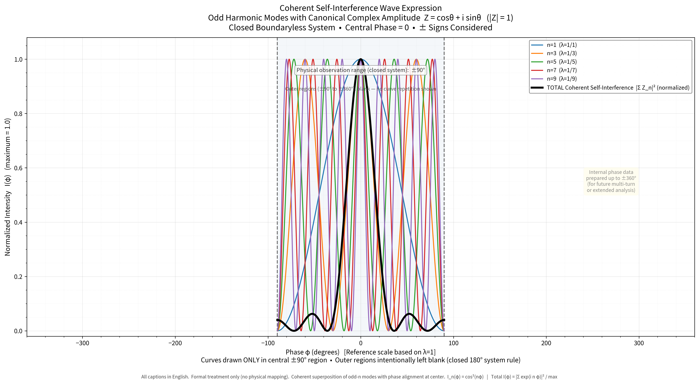
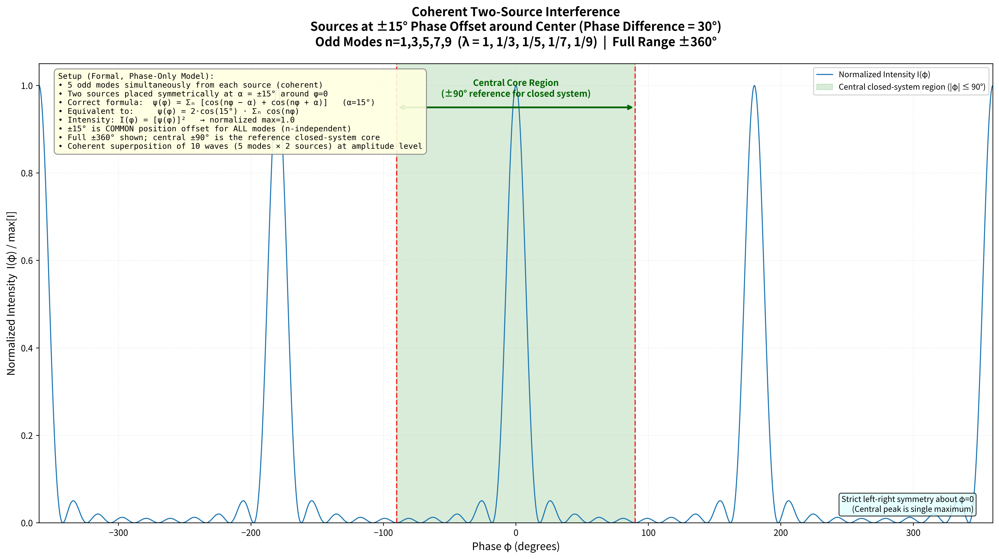

# Waveform Invariance and a Contrast Law for the Two-Copy Common-Relative-Phase Superposition of a Half-Wavelength Odd-Harmonic Isolated Peak Wave

**Subtitle**: Giving two copies a common relative phase leaves the waveform unchanged and scales the squared amplitude by the square of the cosine of the relative phase

**Author**: Noriaki Kihara  
**Version**: v0.1  
**Date**: 2026-06-26  
**DOI**: Version 10.5281/zenodo.20923462 (this version) / Concept 10.5281/zenodo.20923461 (cite this; always resolves to the latest version)  
**Zenodo**: https://zenodo.org/records/20923462  
**Position**: First draft as an observational and organizing paper. For the isolated peak wave formed by superposing constant-amplitude odd harmonics on a half-wavelength phase interval, it records, as an elementary property of Fourier sums and trigonometric identities, that giving two copies a common relative phase leaves the waveform (shape, the zeros at both ends, the localization width) independent of that relative phase, while only the squared amplitude changes in proportion to the square of the cosine of the relative phase. It does not derive physical laws, assert observational facts, or give any particular physical interpretation.

---

## Abstract

On the half-wavelength phase interval $\varphi\in[-\pi/2,\pi/2]$, the wave formed by superposing constant-amplitude odd harmonics,

$$
S_N(\varphi)=\sum_{m=0}^{(N-1)/2}\cos\!\big((2m+1)\varphi\big),
$$

is an isolated peak wave with a peak at the center and zeros at both ends ($N$ is the highest odd-harmonic order, $N$ odd).

This paper observes the wave obtained by giving two copies of this wave a common relative phase $2\alpha$ applied identically to all harmonics,

$$
\psi_\alpha(\varphi)=\sum_{m=0}^{(N-1)/2}\Big[\cos\!\big((2m+1)\varphi-\alpha\big)+\cos\!\big((2m+1)\varphi+\alpha\big)\Big].
$$

A trigonometric identity immediately gives $\psi_\alpha(\varphi)=2\cos\alpha\cdot S_N(\varphi)$, so the squared amplitude is $I_\alpha(\varphi)=4\cos^2\!\alpha\cdot S_N(\varphi)^2$. This means: (i) **the waveform does not depend on the relative phase $\alpha$** (the normalized waveform coincides with that of a single copy); (ii) **the relative phase appears only as an overall cosine-squared contrast factor $\cos^2\!\alpha$ on the squared amplitude**. This paper records the property only as an observation about Fourier sums and a trigonometric identity, and gives no physical interpretation.

---

## 1. Introduction

Superposing constant-amplitude odd harmonics only, on a half-wavelength interval, forms an isolated peak wave with a dominant main peak at the center and zeros at both ends. This paper observes not the properties of that isolated peak wave itself, but how the waveform and the squared amplitude behave **when two copies of it are superposed under a common relative phase**.

The relative phase treated here is a constant offset $\pm\alpha$ added **in common** to the phase of every harmonic. That is, it is not a quantity that shifts the phase in proportion to the harmonic order $n=2m+1$ (which would amount to a translation within the interval), but a phase quantity imposed identically on all harmonics. This distinction is a premise of the present observation and is made explicit in §2.

Notation and formulas follow a standard analysis text [1]. The main result (§3) is an elementary fact obtained merely by applying the product-to-sum identity $\cos(u-\alpha)+\cos(u+\alpha)=2\cos u\cos\alpha$ to each harmonic.

---

## 2. Definitions

### 2.1 Isolated peak wave

For the variable $\varphi\in[-\pi/2,\pi/2]$, define the constant-amplitude odd-harmonic sum

$$
S_N(\varphi)=\sum_{m=0}^{(N-1)/2}\cos\!\big((2m+1)\varphi\big)
\tag{2.1}
$$

where $N$ is the highest odd-harmonic order, $N$ odd, and the sum contains the $(N+1)/2$ terms $1,3,5,\dots,N$. The wave $S_N$ has a main peak at the center $\varphi=0$,

$$
S_N(0)=\frac{N+1}{2},
\tag{2.2}
$$

and vanishes at both ends $\varphi=\pm\pi/2$. The latter holds because each odd harmonic satisfies $\cos\!\big((2m+1)(\pm\pi/2)\big)=0$, independently of the value of $S_N$ or the number of terms. As a non-negative observable we use the squared amplitude

$$
I_N(\varphi)=\big|S_N(\varphi)\big|^2=S_N(\varphi)^2.
\tag{2.3}
$$

Figure 1 shows each odd harmonic ($n=1,3,5,7,9$, i.e. $N=9$) and their coherent sum (black) over the central region of the half-wavelength closed interval $\pm 90^\circ\ (=\pm\pi/2)$. One sees that the sum becomes an isolated peak wave with a main peak at the center.

**Figure 1**: Constant-amplitude odd harmonics ($n=1,3,5,7,9$, canonical complex amplitude $Z=\cos\theta+i\sin\theta$, $|Z|=1$) and their coherent sum (black), drawn normalized over the central region of the half-wavelength closed interval $\pm 90^\circ$.

### 2.2 Two-copy superposition under a common relative phase

Define the wave obtained by giving two copies of $S_N$ a common relative phase $\pm\alpha$ applied to all harmonics,

$$
\psi_\alpha(\varphi)
=\sum_{m=0}^{(N-1)/2}\Big[\cos\!\big((2m+1)\varphi-\alpha\big)+\cos\!\big((2m+1)\varphi+\alpha\big)\Big].
\tag{2.4}
$$

Here $\alpha$ is a constant independent of the harmonic order $n=2m+1$, and the relative phase difference of the two copies is uniformly $2\alpha$ for all harmonics. The observable is the squared amplitude

$$
I_\alpha(\varphi)=\big|\psi_\alpha(\varphi)\big|^2=\psi_\alpha(\varphi)^2.
\tag{2.5}
$$

---

## 3. Observation: waveform invariance and a contrast law

### 3.1 Identity

Applying the product-to-sum identity

$$
\cos\!\big(n\varphi-\alpha\big)+\cos\!\big(n\varphi+\alpha\big)=2\cos\!\big(n\varphi\big)\cos\alpha
\tag{3.1}
$$

to each harmonic $n=2m+1$ in Eq. (2.4), and noting that $\cos\alpha$ is a common factor independent of $n$ and so comes out of the sum,

$$
\psi_\alpha(\varphi)
=2\cos\alpha\sum_{m=0}^{(N-1)/2}\cos\!\big((2m+1)\varphi\big)
=2\cos\alpha\cdot S_N(\varphi).
\tag{3.2}
$$

This is an exact identity, not an approximation.

### 3.2 Squared amplitude, invariance, and contrast

Squaring Eq. (3.2),

$$
I_\alpha(\varphi)=4\cos^2\!\alpha\cdot S_N(\varphi)^2=4\cos^2\!\alpha\cdot I_N(\varphi).
\tag{3.3}
$$

Two consequences follow immediately.

**(1) Waveform invariance.** All dependence on $\varphi$ resides in $S_N(\varphi)^2=I_N(\varphi)$, and the relative phase $\alpha$ appears only in the prefactor $4\cos^2\!\alpha$. Hence the waveform normalized by its main-peak value,

$$
\widehat{I}_\alpha(\varphi):=\frac{I_\alpha(\varphi)}{I_\alpha(0)}
=\frac{4\cos^2\!\alpha\,I_N(\varphi)}{4\cos^2\!\alpha\,I_N(0)}
=\frac{I_N(\varphi)}{I_N(0)}=\widehat{I}_N(\varphi),
\tag{3.4}
$$

does not depend on $\alpha$ and coincides exactly with the normalized waveform $\widehat{I}_N$ of a single copy (for $\cos\alpha\neq0$). The shape, the zeros at both ends $\varphi=\pm\pi/2$, and the localization width near the main peak are all invariant under a change of the relative phase.

**(2) Contrast law.** The unnormalized peak squared amplitude is

$$
I_\alpha(0)=4\cos^2\!\alpha\cdot I_N(0)=(N+1)^2\cos^2\!\alpha
\tag{3.5}
$$

(using Eq. (2.2)), and relative to the in-phase value $(N+1)^2$ at $\alpha=0$,

$$
\frac{I_\alpha(0)}{I_0(0)}=\cos^2\!\alpha.
\tag{3.6}
$$

That is, the relative phase $2\alpha$ scales the overall squared amplitude by $\cos^2\!\alpha$ without changing the waveform: maximal at $\alpha=0$ (relative phase $0$) and zero at $\alpha=\pi/2$ (relative phase $\pi$).

As a concrete example, for the same $N=9$ ($n=1,3,5,7,9$) and $\alpha=15^\circ$ (relative phase $30^\circ$) as in Figures 1 and 2, one has $I_0(0)=(N+1)^2=100$, $I_\alpha(0)=100\cos^2 15^\circ\approx 93.30$, and the contrast factor $\cos^2 15^\circ\approx 0.9330$.

### 3.3 Confirmation by figure

Figure 2 shows the two-copy superposition $I_\alpha$ for $N=9$ and $\alpha=15^\circ$ (relative phase $30^\circ$), normalized by its main-peak value, over the full range $\pm 360^\circ$. As Eq. (3.4) states, this normalized waveform coincides with the normalized waveform of a single copy (the square of the black curve of Figure 1). The only change due to the relative phase is the contrast factor $\cos^2\!\alpha$, which is divided out by normalization and therefore does not appear in a normalized plot. This figure thus displays the consequence of Eq. (3.3) — "the relative phase changes only the amplitude, not the waveform" — as the invariance of the normalized waveform.

**Figure 2**: Normalized squared amplitude of the two-copy superposition $I_\alpha$ ($N=9$, relative phase $2\alpha=30^\circ$, i.e. $\alpha=15^\circ$). Full range $\pm 360^\circ$, with the central $\pm 90^\circ\ (=\pm\pi/2)$ highlighted. The normalized waveform coincides with that of a single copy (waveform invariance).

---

## 4. Conclusion

For the wave $\psi_\alpha=\sum[\cos(n\varphi-\alpha)+\cos(n\varphi+\alpha)]$ obtained by giving two copies of the constant-amplitude odd-harmonic sum $S_N$ on the half-wavelength phase interval $\varphi\in[-\pi/2,\pi/2]$ a common relative phase $\pm\alpha$, the product-to-sum identity yields

$$
\psi_\alpha(\varphi)=2\cos\alpha\cdot S_N(\varphi),
\qquad
I_\alpha(\varphi)=4\cos^2\!\alpha\cdot I_N(\varphi).
$$

From this exact identity the following results follow.

**(1) Waveform invariance**

- The normalized waveform $\widehat{I}_\alpha=\widehat{I}_N$ does not depend on the relative phase $\alpha$. The shape, the zeros at both ends, and the localization width near the main peak are invariant under a change of the relative phase.

**(2) Contrast law**

- The relative phase $2\alpha$ scales the squared amplitude by $\cos^2\!\alpha$ without changing the waveform (Eq. (3.6)): maximal at $\alpha=0$ and zero at $\alpha=\pi/2$.

All of the above are elementary facts obtained merely by applying the product-to-sum identity $\cos(n\varphi-\alpha)+\cos(n\varphi+\alpha)=2\cos(n\varphi)\cos\alpha$ to a constant-amplitude odd-harmonic sum, and no physical interpretation is given.

---

## References

[1] T. Takagi, *Kaiseki Gairon* (Introduction to Analysis), 3rd revised ed., Iwanami Shoten, 1961 (chapter on Fourier series: trigonometric series, closed forms of cosine sums, product-to-sum formulas).
