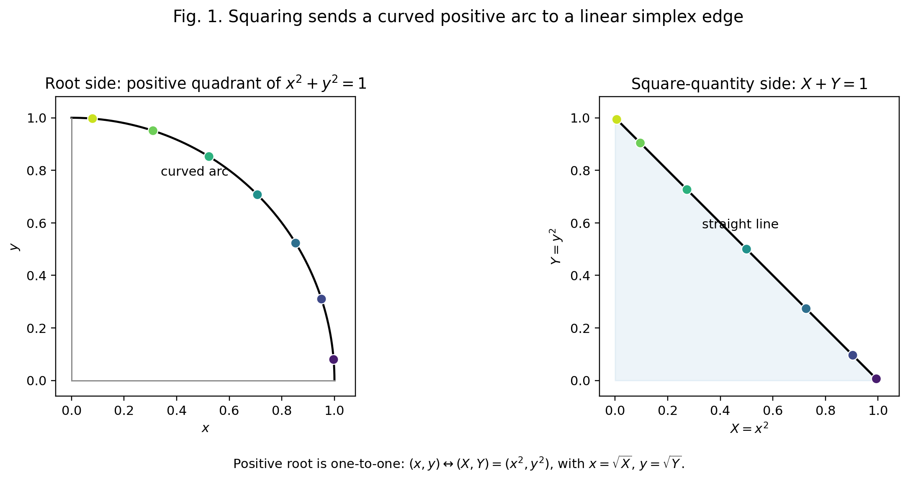
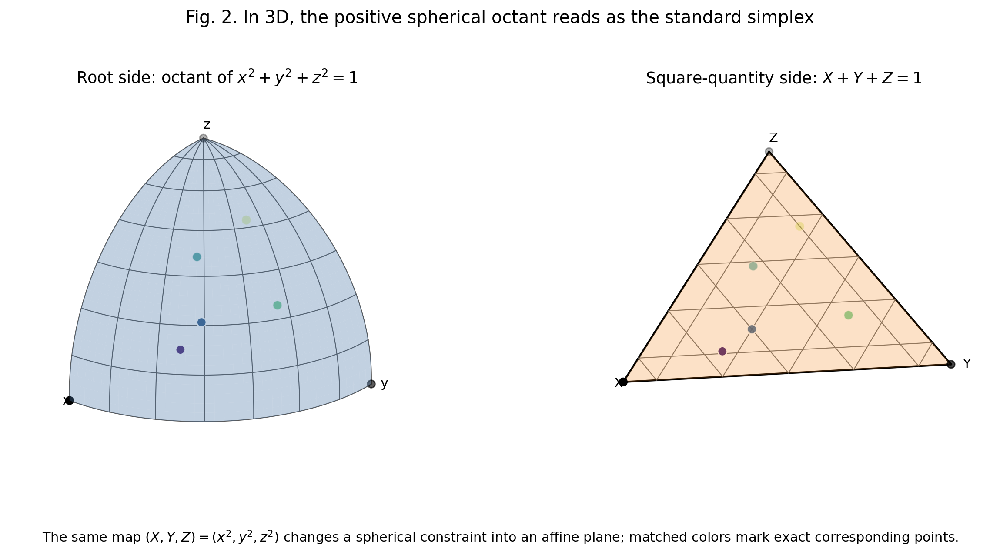
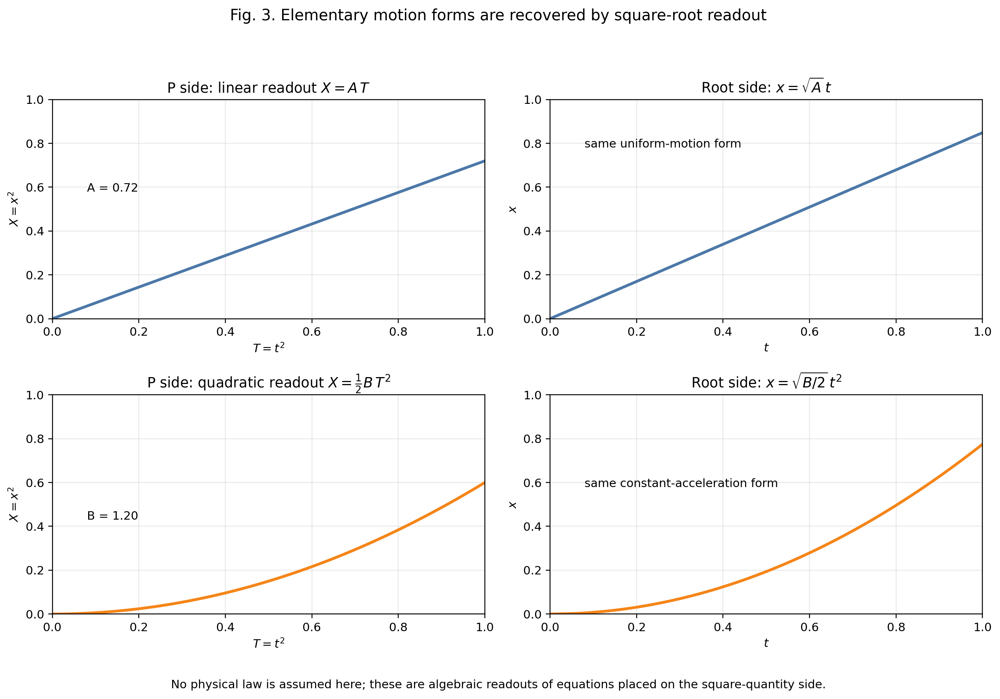
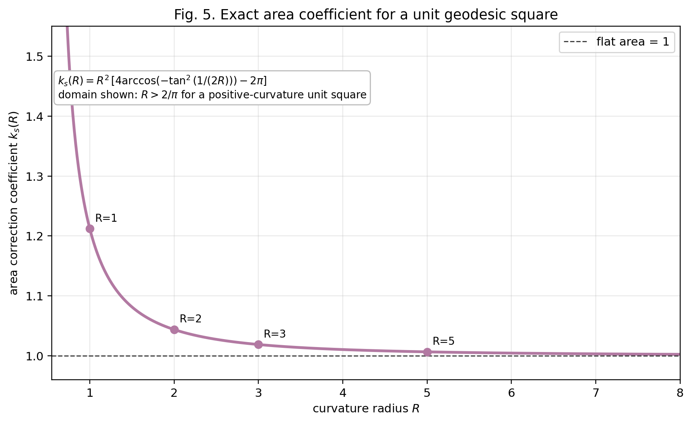
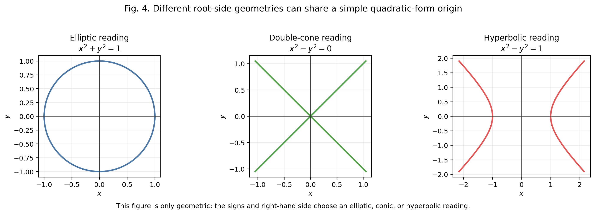

# 平方量読出しによる線形単体化と曲率補正候補の次元別整理

**副題**: 正の平方写像、初等運動形式、および長さ・面積・体積における補正候補の観察

**著者**: 木原範昭 (Noriaki Kihara)  
**版**: v0.1-r1（ChatGPT 査読・著者助言反映）  
**日付**: 2026-06-21  
**位置づけ**: 観察・整理論文としての初稿。独自性の候補は平方写像そのものではなく、平方量読出しの下で曲率補正候補が長さ・面積・体積のどこで問題になるかを、自己参照論文0の次元別結果と並置して整理できる点にある。ただし物理法則の証明、観測事実の主張、既存物理の置換は行わない。  
**自己参照**: 木原範昭, 「論文0: 正曲率定曲率空間における測地的単位セルの歪み」v1.4.

---

## 要旨

本稿は、正の実数領域で平方量

$$
X_i=x_i^2
$$

を基本変数として読むとき、曲率をもつ平方和制約

$$
\sum_i x_i^2=E
$$

が、平方量空間では線形制約

$$
\sum_i X_i=E
$$

として読めることを、初等幾何と初等代数だけで定式化する。

この事実自体は、確率単体と正の球面直交領域を結ぶ平方根表示として、情報幾何などに既知の構造をもつ。したがって本稿は、単体と正球面領域の対応そのものを新定理として主張しない。

本稿の目的は、この既知に近い平方根対応を、確率密度の幾何ではなく一般の「平方量読出し」として置き直し、曲率補正候補がどの幾何次元の量で初めて問題になるかを観察することである。平方量読出しによって曲率が消えるのではない。むしろ、長さだけで閉じる関係では補正候補が現れず、二次元面積量が関与したとき初めて、自己参照論文0の面積補正係数

$$
k_s(R)
$$

が試験的に登場する、という分岐が見える。

具体的には、第一に、正の平方写像が円弧・球面八分体などの平方和制約を、線分・三角形単体などの線形制約へ正確に移すことを確認する。第二に、平方量側に単純な方程式を置き、正の平方根で読出すと、等速運動形や等加速度運動形と同型な式が得られることを見る。第三に、二体衝突のように質量や保存則を外から置いても、一次元で閉じる限り面積補正は出ないことを確認する。第四に、接線方向と半径方向が同時に現れる遠心型モデルを、面積量が現れる最初の自然な試験例として扱う。

本稿は、ここまでを幾何学と代数学の観察・定理として述べる。古典物理の式は、物理法則の導出としてではなく、「既知の形の式を平方量側または平方根側に置いたら、どの幾何次元の補正が関与するか」を見る例としてのみ用いる。

---

## 0. 本稿で主張すること・しないこと

### 0.1 主張すること

本稿が主張するのは、次の限定された内容である。

1. 正の領域では、平方写像

   $$
   \Phi:(x_1,\ldots,x_n)\mapsto (X_1,\ldots,X_n)=(x_1^2,\ldots,x_n^2)
   $$

   は、平方和制約を線形単体制約へ写す。

2. この写像の逆は、正の平方根

   $$
   \Psi:(X_1,\ldots,X_n)\mapsto (\sqrt{X_1},\ldots,\sqrt{X_n})
   $$

   であり、内部領域 $x_i>0$, $X_i>0$ では一対一である。

3. 平方量側で

   $$
   X=A T,\qquad X=\frac{1}{2} B T^2
   $$

   のような単純な式を置くと、正の平方根読出しにより

   $$
   x=\sqrt{A}\,t,\qquad x=\sqrt{B/2}\,t^2
   $$

   が得られる。

4. 自己参照論文0によれば、定曲率空間で一辺の測地長は歪まず、二次元面積は歪む。したがって、長さだけで閉じる一次元的な式には面積補正を入れず、二方向が張る面積セルが現れたときに初めて $k_s(R)$ が候補になる、という分岐が立つ。

5. 遠心型モデルは、面積量が現れる最初の自然な試験例として扱う。ここで提示する $k_s(R)$ の掛け方は、幾何から一意に導かれた物理法則ではなく、定曲率・一様補正を仮定したモデル読出しである。

### 0.2 主張しないこと

本稿は、以下を主張しない。

- 物理法則を証明した、とは主張しない。
- 古典力学、相対論、量子論を置き換える、とは主張しない。
- $X_i$ を確率、エネルギー、質量、時間などの特定の物理量と同一視しない。
- 平方写像が計量として等長写像である、とは主張しない。
- 曲率空間そのものが平坦空間へ消える、とは主張しない。
- $k_s(R)$ を遠心型の式に掛けることが、力学法則として一意に導かれた、とは主張しない。
- 平方写像の非等長性が $k_s(R)$ の原因である、とは主張しない。
- 平方写像の計量歪みと、自己参照論文0の測地正方形面積超過を同一視しない。
- リーマン幾何学や局所微分幾何を否定しない。

本稿で「平坦に読める」と言うとき、それは制約式

$$
\sum_i x_i^2=E
$$

が平方量側で

$$
\sum_i X_i=E
$$

というアフィンな一次式になる、という意味である。これは計量の同一性ではなく、読出し座標の代数的単純化である。

### 0.3 本稿の正確な位置づけ

本稿は、局所曲率をもつ一般の連続系に対するリーマン幾何学の代替理論ではない。むしろ対象を、曲率半径が一様な定曲率空間、およびそこで測地的単位セルを考えられる場合に限定する。

その限定の下で問うのは、初等幾何と初等代数だけで何が読めるかである。自己参照論文0は、一辺の長さ、頂点角、面積、体積が曲率半径 $R$ に対してどのように変化するかを扱った。本稿はその続編として、平方量読出しの中で、どの種類の式が長さだけで閉じ、どの種類の式が二次元面積セルを要求するかを調べる。

したがって、本稿の中心観察は「曲率が消える」ことではない。中心観察は、長さだけで閉じる関係では面積補正候補が現れず、面積量が関与したところで初めて補正候補が現れる、という次元別の整理である。これは複数の独立な幾何事実の並置であり、平方写像の非等長性から $k_s(R)$ が因果的に導かれる、という主張ではない。

---

## 1. 正の平方写像

### 1.1 二次元の場合

まず二次元で見る。正の象限

$$
x\ge 0,\qquad y\ge 0
$$

において、単位円の弧

$$
x^2+y^2=1
$$

を考える。

ここで

$$
X=x^2,\qquad Y=y^2
$$

と置く。するとただちに

$$
X+Y=1
$$

となる。

つまり、正の円弧上の点は、平方量側では直線分上の点として読まれる。

**図1.** 正の円弧 $x^2+y^2=1$ は、平方量側で直線単体 $X+Y=1$ として読まれる。

これは近似ではない。たとえば

$$
(x,y)=\left(\frac{3}{5},\frac{4}{5}\right)
$$

なら

$$
(X,Y)=\left(\frac{9}{25},\frac{16}{25}\right)
$$

であり、確かに

$$
\frac{9}{25}+\frac{16}{25}=1
$$

である。

逆に、平方量側で

$$
(X,Y)=\left(\frac{9}{25},\frac{16}{25}\right)
$$

が与えられれば、正の平方根を取って

$$
(x,y)=\left(\frac{3}{5},\frac{4}{5}\right)
$$

へ戻る。

ここで正の領域に限っていることが重要である。符号を許すと、同じ $X=x^2$ から $x$ と $-x$ の二つが戻ってしまう。本稿では、平方根を一意にするため、基本的に正の領域を扱う。

### 1.2 一般次元

同じことは任意の次元で成り立つ。

正の領域

$$
x_i\ge 0\qquad (i=1,\ldots,n)
$$

で、平方和制約

$$
S_E^{n-1,+}
=
\left\{
(x_1,\ldots,x_n)\mid \sum_{i=1}^{n}x_i^2=E,\ x_i\ge 0
\right\}
$$

を考える。

平方量側では

$$
X_i=x_i^2
$$

と置き、

$$
P_E^{n-1}
=
\left\{
(X_1,\ldots,X_n)\mid \sum_{i=1}^{n}X_i=E,\ X_i\ge 0
\right\}
$$

を考える。

すると

$$
\Phi:S_E^{n-1,+}\to P_E^{n-1},\qquad
\Phi(x_1,\ldots,x_n)=(x_1^2,\ldots,x_n^2)
$$

は一対一対応であり、逆写像は

$$
\Psi:P_E^{n-1}\to S_E^{n-1,+},\qquad
\Psi(X_1,\ldots,X_n)=(\sqrt{X_1},\ldots,\sqrt{X_n})
$$

である。

**証明.**  
$(x_1,\ldots,x_n)\in S_E^{n-1,+}$ なら、各 $X_i=x_i^2$ は非負であり、

$$
\sum_i X_i=\sum_i x_i^2=E
$$

なので $\Phi(x)\in P_E^{n-1}$ である。

逆に、$(X_1,\ldots,X_n)\in P_E^{n-1}$ なら、各 $X_i\ge0$ なので $\sqrt{X_i}$ が定義でき、

$$
\sum_i (\sqrt{X_i})^2=\sum_i X_i=E
$$

である。よって $\Psi(X)\in S_E^{n-1,+}$ である。

さらに

$$
\Psi(\Phi(x))=(\sqrt{x_1^2},\ldots,\sqrt{x_n^2})=(x_1,\ldots,x_n)
$$

が正の領域で成り立ち、

$$
\Phi(\Psi(X))=((\sqrt{X_1})^2,\ldots,(\sqrt{X_n})^2)=(X_1,\ldots,X_n)
$$

も成り立つ。したがって互いに逆写像である。 $\square$

### 1.3 三次元の場合

三次元では、正の球面八分体

$$
x^2+y^2+z^2=1,\qquad x,y,z\ge0
$$

が、平方量側で標準二単体

$$
X+Y+Z=1,\qquad X,Y,Z\ge0
$$

として読まれる。

**図2.** 正の球面八分体は、平方量側で標準単体へ写る。同色の点は同じ点を平方写像で読んだものである。

ここでも重要なのは、球面側の曲がった制約が、平方量側では平面上の三角形になることである。図は模式図ではなく、写像

$$
(X,Y,Z)=(x^2,y^2,z^2)
$$

から生成したものである。

### 1.4 これは「等長な平坦化」ではない

ここで注意する。平方写像は、一般には等長写像ではない。

微分を取ると

$$
dX_i=2x_i\,dx_i
$$

であり、長さの測り方はそのまま保存されない。したがって、球面の内在計量がそのまま平面計量になるわけではない。

本稿で使う事実は、もっと限定されたものである。

平方和制約

$$
\sum_i x_i^2=E
$$

が、平方量側で

$$
\sum_i X_i=E
$$

という一次式になる。この一点が、以下の代数的読出しの基礎である。

---

## 2. 平方量側に方程式を置く

### 2.1 基本設定

ここから、二つの平方量

$$
X=x^2,\qquad T=t^2
$$

を取り出す。

$X$ と $T$ は平方量側の変数であり、$x$ と $t$ はその正の平方根側の変数である。

本稿では、$T$ をただちに物理的時間と同一視しない。単に、平方量側の一つの座標である。しかし読出しの形が古典的な運動方程式と同じ形になるため、比較例として「等速運動形」「等加速度運動形」という言葉を用いる。

### 2.2 一次式から等速運動形が出る

平方量側で

$$
X=A T
$$

を置く。ここで $A>0$ は定数である。

平方根側へ戻すために

$$
X=x^2,\qquad T=t^2
$$

を代入すると、

$$
x^2=A t^2
$$

である。正の平方根を取れば

$$
x=\sqrt{A}\,t
$$

となる。

これは、通常の等速運動

$$
x=vt
$$

と同じ形である。ただし本稿では、これを物理的速度 $v$ の導出とは呼ばない。単に

$$
v_{\rm read}=\sqrt{A}
$$

と読める、という代数的事実を述べる。

### 2.3 双円錐型の読出し

前節の式は

$$
x^2-A t^2=0
$$

とも書ける。

もし $A=c^2$ と書けば、

$$
x^2-c^2t^2=0
$$

である。

これは幾何的には双円錐型、二次元断面では二直線型の二次形式である。本稿では、この式を物理的な計量条件としてではなく、平方量側の一次式を平方根側で読んだときに現れる幾何的形として扱う。

### 2.4 二次式から等加速度運動形が出る

次に、平方量側で

$$
X=\frac{1}{2} B T^2
$$

を置く。ここで $B>0$ は定数である。

再び

$$
X=x^2,\qquad T=t^2
$$

を代入すると、

$$
x^2=\frac{1}{2} B t^4
$$

である。正の平方根を取れば

$$
x=\sqrt{\frac{B}{2}}\,t^2
$$

となる。

これは、通常の等加速度運動

$$
x=\frac{1}{2} a t^2
$$

と同じ形である。対応させるなら

$$
a_{\rm read}=\sqrt{2B}
$$

である。

ここでも、物理的加速度を証明しているのではない。平方量側の二次式が、正の平方根読出しで等加速度運動形になる、という代数的観察である。

**図3.** 平方量側に置いた一次式・二次式は、正の平方根読出しで等速運動形・等加速度運動形になる。

### 2.5 一般形

より一般に、平方量側で

$$
X=C T^m
$$

を置く。ここで $C>0$, $m>0$ とする。

$$
X=x^2,\qquad T=t^2
$$

より

$$
x^2=C t^{2m}
$$

であり、正の平方根を取ると

$$
x=\sqrt{C}\,t^m
$$

である。

したがって、平方量側の冪 $m$ は、平方根側でも同じ冪 $m$ として現れる。係数だけが平方根になる。

これは小さな事実に見えるが、重要である。平方量側では $X$ と $T$ がいずれも平方量であるにもかかわらず、正の平方根側では、見慣れた冪関係がそのまま残る。

---

## 3. なぜ一次元的な式では曲率補正が出ないのか

自己参照論文0では、定曲率空間に置かれた測地的単位セルについて、次の区別が示された。

- 一辺の測地長は、構成により厳密に保存される。
- 頂点角と二次元面積は、曲率半径 $R$ に依存して変化する。
- 体積は次元に依存して変化する。

さらに、同論文0では、小曲率極限における $d$ 次元体積の超過係数が

$$
V_d(R)=1+\frac{c_d}{R^2}+O(R^{-4}),
\qquad
c_d=\frac{d(d-1)}{12}
=\frac{\binom{d}{2}}{6}
$$

と書けることが示されている。これは、$d$ 次元体積の曲率超過が、$\binom{d}{2}$ 個の座標二平面それぞれの面積超過の和として読めることを意味する。

この観点では、曲率の最初の担い手は長さではなく面積である。長さだけで閉じる一次元的な関係では、面積補正は入らない。

前節の

$$
x=\sqrt{A}\,t
$$

も

$$
x=\sqrt{B/2}\,t^2
$$

も、読出し後は一つの $x$ と一つの $t$ の関係で閉じている。したがって、ここには二次元面積セルが現れない。

このため、本稿の読みに従えば、等速運動形でも等加速度運動形でも、ただちに $k_s(R)$ を掛ける理由はない。

ここで得られる観察は、次である。

> 曲率補正が現れるかどうかは、「加速度があるかどうか」ではなく、「二次元面積量が現れるかどうか」に依存する。

この文は、力学法則としてではなく、幾何次元の判定規則として読む。一次元量だけで閉じる式に、二次元測地セルの面積係数を機械的に掛ける理由はない。逆に、独立な二方向が同時に現れ、二次元セルを暗黙に含む式では、初めて面積係数を検討する余地が生まれる。

---

## 4. 二体衝突の式で何が起きるか

本稿の枠組み自体には、質量は含まれていない。そこで、質量を理論から導くのではなく、外から置いた場合に何が起きるかだけを見る。

一次元直線上で、二つの対象に質量

$$
m_1,\qquad m_2
$$

を仮に付与する。衝突前の速度を

$$
u_1,\qquad u_2
$$

衝突後の速度を

$$
u_1',\qquad u_2'
$$

とする。

通常の一次元完全弾性衝突では、

$$
m_1u_1+m_2u_2=m_1u_1'+m_2u_2'
$$

および

$$
\frac{1}{2}m_1u_1^2+\frac{1}{2}m_2u_2^2
=
\frac{1}{2}m_1{u_1'}^2+\frac{1}{2}m_2{u_2'}^2
$$

を置く。

これを解くと、

$$
u_1'
=
\frac{m_1-m_2}{m_1+m_2}u_1
+
\frac{2m_2}{m_1+m_2}u_2,
$$

$$
u_2'
=
\frac{2m_1}{m_1+m_2}u_1
+
\frac{m_2-m_1}{m_1+m_2}u_2
$$

である。

ここにも $k_s(R)$ は現れない。

ただし、エネルギー式には $u^2$ がある。では、これは面積量ではないのか。

本稿の答えは、次のように限定される。

ここでの $u^2$ は、同じ一次元速度成分の二乗であり、独立な二方向が張る面積セルではない。式全体は一次元直線上の速度変数だけで閉じている。したがって、自己参照論文0の「二次元面積の歪み」を入れる場所がない。

この点は、本稿の整理原理にとって重要である。二体問題、質量、運動量、エネルギーが現れても、それだけでは曲率補正は出ない。補正の入口は、対象の数ではなく、面積量の出現である。

---

## 5. 面積量が現れる遠心型モデル

### 5.1 遠心型の式

次に、遠心型の式を考える。

古典的には、半径 $r$、速さ $v$ に対して、遠心加速度の大きさは

$$
a_c=\frac{v^2}{r}
$$

と書かれる。また、外から質量 $m$ を置けば

$$
F_c=m\frac{v^2}{r}
$$

である。

本稿では、これを物理法則として導出しない。既知の古典的な形を、平方量読出しの中に置いたとき、どこで面積補正を検討すべきかを見る例として用いる。

### 5.2 なぜここで面積が現れるのか

等速運動形

$$
x=vt
$$

や等加速度運動形

$$
x=\frac{1}{2}at^2
$$

は、読出し上は一つの線に沿った関係で閉じていた。

しかし遠心型の式では、接線方向の速さ $v$ と半径方向の長さ $r$ が同時に現れる。円運動を幾何的に読めば、接線方向と半径方向という二方向がある。ここで初めて、一次元の長さだけではなく、二次元セルの情報が必要になる。

このため、遠心型の式は、本稿において面積補正係数が現れる最初の自然な試験例である。ただし、ここで分かるのは「面積係数を検討する入口がある」ということまでであり、どの力学量に、どちら向きに、どの冪で掛かるかは別問題である。

### 5.3 自己参照論文0の面積係数

自己参照論文0では、曲率半径 $R$ の正曲率定曲率空間における一辺 1 の測地正方形について、頂点角

$$
\theta(R)=\arccos\!\left(-\tan^2\frac{1}{2R}\right)
$$

を得ている。

この測地正方形の面積は

$$
A(R)=R^2\{4\theta(R)-2\pi\}
$$

である。

平坦な単位正方形の面積は 1 なので、本稿では面積補正係数を

$$
k_s(R):=A(R)
$$

すなわち

$$
k_s(R)
=
R^2
\left[
4\arccos\!\left(-\tan^2\frac{1}{2R}\right)-2\pi
\right]
$$

と定義する。

正曲率の一辺 1 の測地正方形については、少なくとも

$$
R\ge \frac{2}{\pi}
$$

が存在条件である。平坦極限では

$$
\lim_{R\to\infty}k_s(R)=1
$$

であり、展開の先頭は

$$
k_s(R)=1+\frac{1}{6R^2}+O(R^{-4})
$$

である。

**図5.** 自己参照論文0の式から得られる、一辺 1 の測地正方形の面積補正係数 $k_s(R)$。

### 5.4 遠心型モデルへの試験的挿入

以上より、遠心型の式に対して、面積補正を含む一つの試験的なモデル読出しは

$$
a_c^{(R)}=k_s(R)\frac{v^2}{r}
$$

と書ける。

外から質量 $m$ を置く場合には

$$
F_c^{(R)}=m\,k_s(R)\frac{v^2}{r}
$$

である。

ここで $k_s(R)$ は自由な調整係数ではない。曲率半径 $R$ が決まれば、自己参照論文0の幾何式から一意に決まる。

しかし、$k_s(R)$ が一意に決まることと、それを遠心型の式に上の向きで掛けるべきことは別である。測度の取り方、密度として読むか面積として読むか、あるいは逆面積として読むかによって、$k_s(R)$、$1/k_s(R)$、または別の関数が現れる可能性もある。

したがって、この式の意味は限定されている。これは遠心力の物理的証明ではなく、古典的な遠心型の式を、面積補正をもつ幾何読出しに置いた場合の最小モデルである。本稿で確定するのは、遠心型が二方向を含み、一次元式とは異なって面積補正を検討する自然な入口を持つ、という点までである。

---

## 6. 楕円型・双円錐型・双曲型の幾何語彙

平方量読出しで現れる二次形式は、符号と右辺によって、いくつかの幾何型に分かれる。

$$
x^2+y^2=1
$$

は楕円型、二次元では円である。

$$
x^2-y^2=0
$$

は双円錐型、二次元断面では二本の直線である。

$$
x^2-y^2=1
$$

は双曲型である。

**図4.** 同じ二次形式の符号選択により、楕円型・双円錐型・双曲型の読出しが現れる。

本稿では、これらを物理的な空間の種類としてではなく、平方根側に現れる純粋な二次曲線・二次曲面の語彙として用いる。

---

## 7. 既知構造との関係と、本稿の独自性の範囲

### 7.1 既知である部分

正の平方根または平方写像によって、単体と球面の正の直交領域が対応することは、広い意味では既知である。

たとえば情報幾何では、確率密度 $p_i$ に対して平方根

$$
q_i=\sqrt{p_i}
$$

を取ると、

$$
\sum_i p_i=1
$$

が

$$
\sum_i q_i^2=1
$$

となる。この平方根密度表示では、確率単体が正の球面領域として扱われ、Fisher--Rao 計量と球面幾何の関係が議論される。

したがって、本稿は「単体と正の球面領域の平方根対応」そのものを新発見として主張しない。

### 7.2 本稿の整理原理

本稿の独自性は、平方写像そのものにはない。平方写像は入口であり、既知構造に近い。本稿で提示するのは、新定理というより、平方量読出しの後に「どこで曲率補正候補を検討すべきか」を次元別に整理するための整理原理である。

より具体的には、次の組合せである。

1. 確率密度ではなく、一般の平方量 $X_i=x_i^2$ を基本読出しとして置く。
2. 曲率をもつ平方和制約が、平方量側で線形単体制約になることを、物理的意味づけなしに代数・幾何として定式化する。
3. 平方量側に置いた一次式・二次式が、正の平方根読出しで等速運動形・等加速度運動形になることを示す。
4. 二体衝突のように質量や保存則を置いても、一次元で閉じる限り面積補正が出ないことを確認する。
5. 自己参照論文0の「歪みの座は $d\ge2$ にある」という構造を用い、長さだけの関係と面積セルを含む関係を分離する。
6. 面積量が現れる遠心型モデルを、$k_s(R)$ が現れる最初の自然な試験例として位置づける。ただし、その掛け方を力学法則として一意に導いたとは主張しない。

もし既存文献に、この一連の整理、すなわち平方量読出し、線形単体化、一次元式での無補正、二次元面積セルでの補正候補の出現、そして定曲率測地正方形の $k_s(R)$ への接続を同じ形でまとめた論文があれば、本稿は新しい整理ではなく再整理として位置づけるべきである。現時点で確認した範囲では、平方根密度表示や Fisher--Rao 幾何は近いが、上記の「曲率補正候補の次元別整理」を同じ形で述べるものは確認していない。

---

## 8. 結論

本稿では、正の平方写像

$$
X_i=x_i^2
$$

を基本読出しとして、平方和制約

$$
\sum_i x_i^2=E
$$

が平方量側で線形単体制約

$$
\sum_i X_i=E
$$

になることを定式化した。

この単純な対応から、平方量側に置いた一次式

$$
X=A T
$$

は、正の平方根側で

$$
x=\sqrt{A}\,t
$$

となり、二次式

$$
X=\frac{1}{2} B T^2
$$

は

$$
x=\sqrt{B/2}\,t^2
$$

となる。これらは古典的な等速運動形・等加速度運動形と同型であるが、本稿では物理法則の導出とは呼ばない。

また、二体完全弾性衝突の式を外から置いても、一次元速度だけで閉じる限り、面積補正は現れない。これは、曲率補正の入口が「加速度」や「質量」そのものではなく、二次元面積量であることを示す。

最後に、遠心型モデルでは接線方向と半径方向が同時に現れるため、二次元面積セルを検討する自然な入口が生じる。このとき自己参照論文0の厳密式から

$$
k_s(R)
=
R^2
\left[
4\arccos\!\left(-\tan^2\frac{1}{2R}\right)-2\pi
\right]
$$

が得られる。この係数は任意の調整係数ではなく、一辺 1 の測地正方形の面積として定義される。ただし、これを遠心型の力学式へどのように反映するかは別問題である。本稿では、最小の試験モデルとして

$$
a_c^{(R)}=k_s(R)\frac{v^2}{r}
$$

を置くにとどめる。

以上が本稿の範囲である。平方量読出しは、曲率をもつ平方和制約と、線形単体制約と、初等的な運動形と、面積補正係数を、一つの初等的な代数・幾何の流れとして並置する。その核心は、曲率を消すことでも、平方写像の非等長性から面積補正を導くことでもない。長さだけで閉じる関係と、二次元面積セルを検討すべき関係を、次元別に整理して読むことである。

---

## 参考文献

### 自己参照

- [Kihara 2026] 木原範昭, [「論文0: 正曲率定曲率空間における測地的単位セルの歪み — 一辺・角・面積・体積の厳密評価」](../波長空間と周波数空間の双対幾何/paper0_geodesic_cell_distortion_ja_v1_4.md), v1.4, Zenodo DOI 10.5281/zenodo.20684135.

### 関連文献

- [Saha--Bharath--Kurtek 2017] A. Saha, K. Bharath, S. Kurtek, [*A Geometric Variational Approach to Bayesian Inference*](https://arxiv.org/abs/1707.09714), arXiv:1707.09714.
- [Holbrook--Lan--Streets--Shahbaba 2017] A. Holbrook, S. Lan, J. Streets, B. Shahbaba, [*The nonparametric Fisher geometry and the chi-square process density prior*](https://arxiv.org/abs/1707.03117), arXiv:1707.03117.
- [Bauer--Bruveris--Michor 2014] M. Bauer, M. Bruveris, P. W. Michor, [*Uniqueness of the Fisher--Rao metric on the space of smooth densities*](https://arxiv.org/abs/1411.5577), arXiv:1411.5577.
- [Chern 1944] S.-S. Chern, [*A Simple Intrinsic Proof of the Gauss--Bonnet Formula for Closed Riemannian Manifolds*](https://doi.org/10.2307/1969302), Annals of Mathematics **45**(4), 747--752 (1944).
