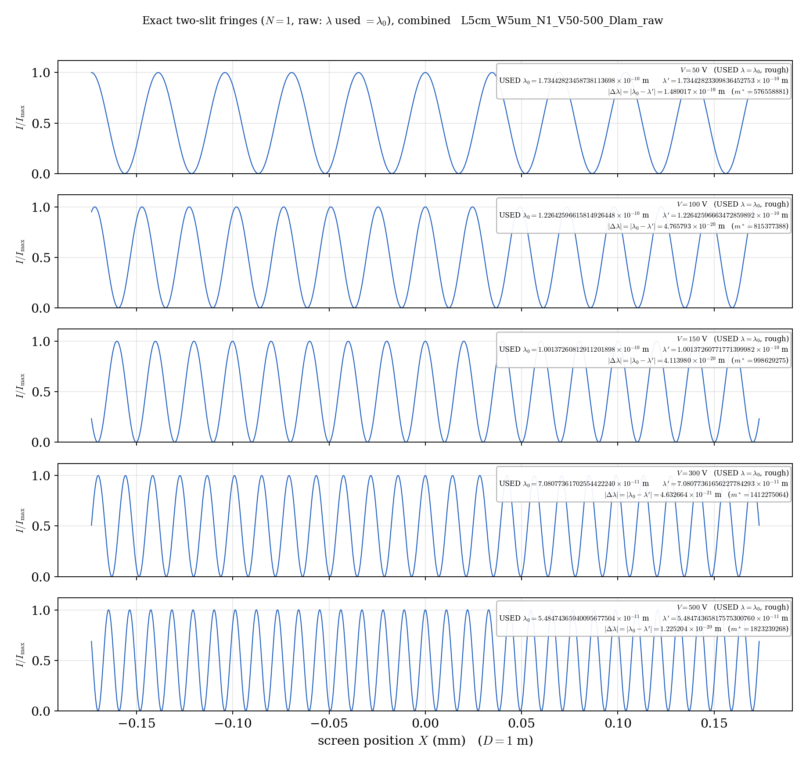
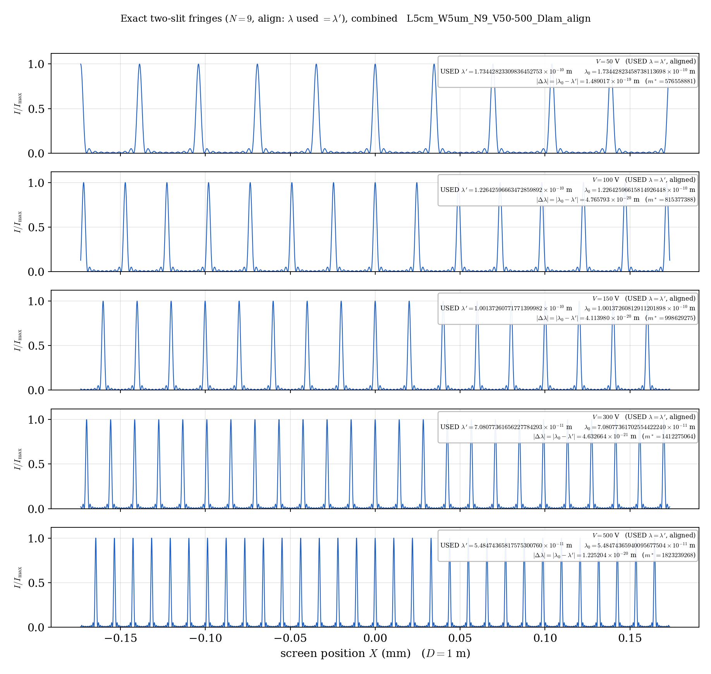
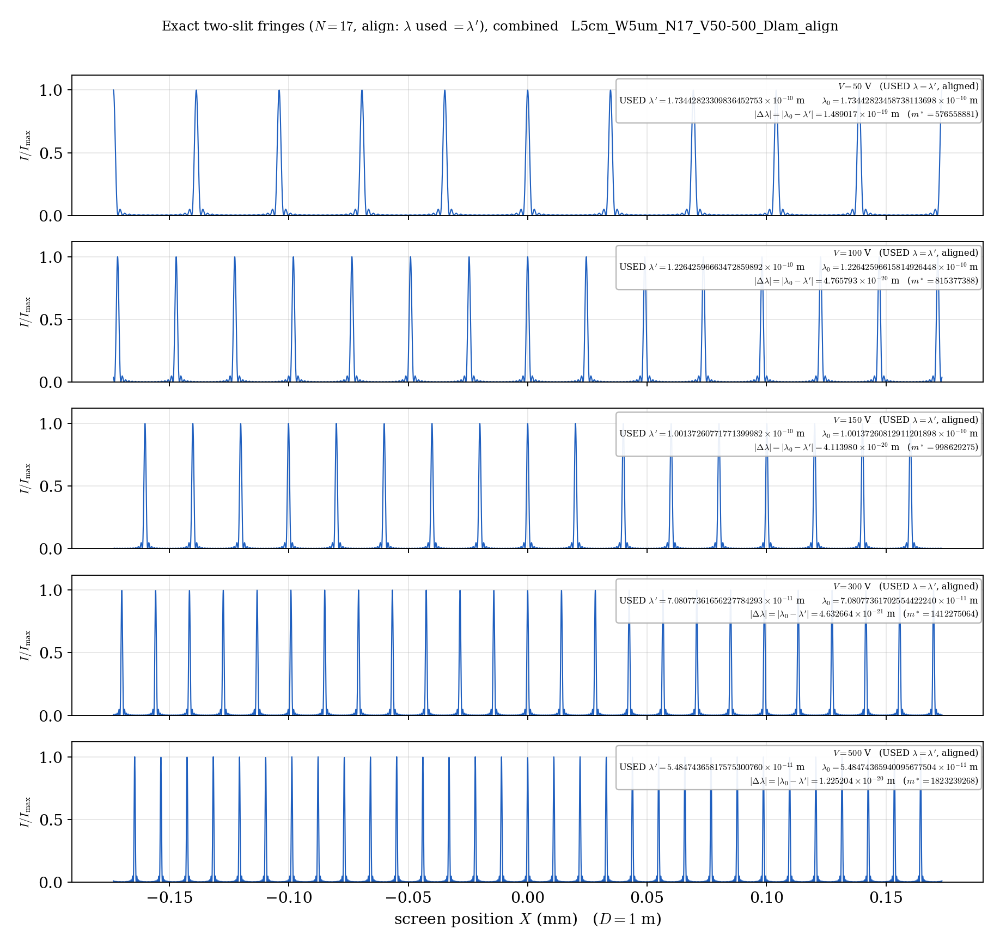
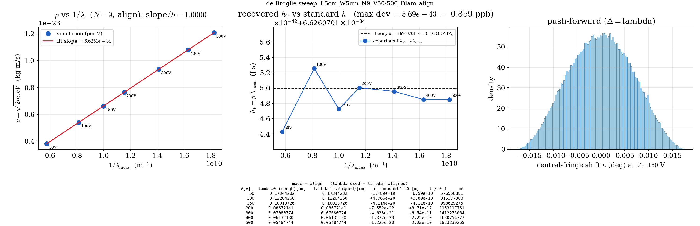

# 古典波動ダブルスリット模型による de Broglie 波長 $\lambda=h/p$ の再現
### —— 位置の曖昧さの Born 押し出しと整列条件からのプランク定数の再構成

**著者**: 木原 範昭 (Noriaki Kihara)
**版**: v0.1（日本語ドラフト）
**日付**: 2026年7月

---

## 要旨

電子の物質波（de Broglie 波長 $\lambda=h/p$）は、Davisson と Germer による1927年のニッケル結晶電子回折実験 [2] で最初に確認された。本研究は、その**結果**を、結晶格子ではなく**単一源ダブルスリットのシンプルな古典波動模型**の内部で再現・検証できるかを問う、概念的・数値的な思考実験である。模型は、(i) 源位置の曖昧さが Born 則 [4] に従い $\cos^2$ 分布としてスクリーン上の縞へ幾何的に押し出される機構と、(ii) 局在奇数倍音波の整列条件 [1] のみを用いる。加速電圧 $V$ から定まる運動量 $p=\sqrt{2m_e eV}$（プランク定数 $h$ を含まない）と、干渉縞の幾何から読み取る波長 $\lambda$ を組み合わせると、$h=p\lambda$ が**右辺に $h$ を含まない形**で再構成できる。物理スケール（$L=5\,\mathrm{cm}$, $W=5\,\mu\mathrm{m}$）での厳密数値計算により、単一倍音（$N=1$）では無条件に、多重倍音（$N=9,17$）では波長を整列共鳴 $\lambda'=2r_k/m^{*}$ に $\sim10^{-20}\,\mathrm{m}$ だけ補正することで、$p$ と $1/\lambda$ の間に傾き $h$ の線形関係がモデル内部から現れることを示す。**本研究は $p\lambda=h$ を証明するものでも、新しい測定法を提案するものでもない。** 出発波長に $\lambda_0=h/p$ を用いるため入力 $h$ の回復は自己整合的（自己循環的）であり、独立な $h$ の数値を主張しない。示すのは、**Born 押し出しと幾何整列だけで、$p$ と $\lambda$ の間にプランク定数と解釈できる定数関係が構造的に現れる**という点である。

---

## 1. 導入と本研究の位置づけ

de Broglie は1924–1925年、粒子に波長 $\lambda=h/p$ を対応させる物質波の仮説を提出した [3]。この関係は、Davisson と Germer によるニッケル単結晶の電子回折 [2] で初めて実験的に確認された。彼らの装置は、加速した電子ビームを結晶に当て、Bragg 条件 $n\lambda=2d\sin\theta$ を満たす角度に回折ピークを観測し、$\lambda=h/p$ を検証するものであった。

本研究の位置づけを明確にする。

- **新しい実験手法の提案ではない。**
- **実在実験の高精度な再測定を主目的としない。**
- 「この古典波動模型の中で、位置の曖昧さの押し出し（Born, $\cos^2$）と幾何的整列条件により、運動量と波長の間にプランク定数と解釈できる定数関係が構造的に現れる」ことを示す**概念的・数値的思考実験**である。

Davisson–Germer が結晶「格子」を用いたのに対し、本模型は「ダブルスリット」を用いる。両者は「電子の波長を幾何的干渉から読み取る」という点で構造的に同型であり、実装が異なるだけである。本研究は、彼らの**結果**（$\lambda=h/p$ の幾何的顕在化）を最小模型で再現できるかを問う。

---

## 2. モデル定義と計算方法

### 2.1 幾何

源–スリット距離 $L=5\,\mathrm{cm}$、スリット間隔 $W=5\,\mu\mathrm{m}$、スリットは $y=\pm W/2$。中心源 $y=0$ に対する源–スリット距離は
$$r_k=\sqrt{L^2+(W/2)^2}.$$
実験系の模式図を図1に示す。物理スケールでは特徴長が
$$\lambda_0\sim10^{-10}\,\mathrm{m},\quad W=5\times10^{-6}\,\mathrm{m},\quad L=5\times10^{-2}\,\mathrm{m}$$
と桁違いに異なり（$W/\lambda_0\sim5\times10^4$, $L/W\sim10^4$, $L/\lambda_0\sim5\times10^8$）、共通縮尺の作図は不可能である。図1は $\lambda_0,W,L$ を各々独立の縮尺で描き、実寸法を注記している。半角は
$$\theta=\arctan\frac{W/2}{L}\approx2.9\times10^{-3}{}^\circ$$
と極端に近軸である。

**図1**: de Broglie ダブルスリット実験系の模式図（物理スケール、$V=150\,\mathrm{V}$）。振動源が局在奇数倍音波を放射し、間隔 $W$ の二スリットを経てスクリーン（距離 $D$）に縞（間隔 $\Delta X=\lambda_0 D/W$）を作る。$\lambda_0,W,L$ は各々独立縮尺、実寸法を注記。

### 2.2 波動模型（局在奇数倍音波）

源は等振幅の奇数倍音和でモデル化する [1]：波数成分 $n=1,3,\dots,N$、$\lambda_n=\lambda/n$。二スリットを経たスクリーン上の厳密強度は
$$I(s;y)=\Big|\sum_{n=1,3,\dots,N}\big(e^{i\Phi_1^{(n)}}+e^{i\Phi_2^{(n)}}\big)\Big|^2,\qquad
\Phi_k^{(n)}=\frac{2\pi n}{\lambda}\big(r_k-y_{\mathrm{slit},k}\,s\big).$$
数値的には、各倍音について代数的に等価な因子化形
$$e^{i\Phi_1^{(n)}}+e^{i\Phi_2^{(n)}}=e^{i\,2\pi n\,r_{\mathrm{avg}}/\lambda}\cdot2\cos\!\Big(\pi n\frac{(r_1-r_2)-Ws}{\lambda}\Big),\quad r_1-r_2=\frac{-2Wy}{r_1+r_2}$$
を用いる（$r_{\mathrm{avg}}=(r_1+r_2)/2$、差分は桁落ちしない）。これは物理そのものを変えず、物理スケール（絶対位相 $\sim10^9\,\mathrm{rad}$）での精度を保つためである。$N=1$ では倍音間の整列位相 $e^{i2\pi r_{\mathrm{avg}}/\lambda}$ は大域位相となり $|\cdot|^2$ で消える（機械精度）。

### 2.3 位置の曖昧さと Born 押し出し

源位置 $y$ は確率密度 $P(y)=\cos^2(\pi y/\Delta)$ に従って揺らぐ（$\Delta$ はコヒーレンス幅、代表値 $\Delta=\lambda_0$）。これは位置の曖昧さが Born 則 [4] に従うことの最小表現である。各試行の $y$ を $\cos^2$ 棄却サンプリングで生成し、幾何的経路差 $r_1-r_2$ を通じてスクリーン上の縞位置の押し出し分布を得る。

### 2.4 運動量・波長・整列条件

加速電圧 $V$ から古典運動量 $p=\sqrt{2m_e eV}$ を得る。**この式にプランク定数は現れない。** 出発波長として粗い de Broglie 波長 $\lambda_0=h/p$ を用いるが、これは後述のとおり**自己整合的な出発点**にすぎない。

多重倍音 $N>1$ では、全倍音の位相が揃う整列条件
$$\frac{r_k}{\lambda}=\frac{m^{*}}{2}\quad(m^{*}\in\mathbb{Z})\ \Longleftrightarrow\ 2\pi n\frac{r_k}{\lambda}=\pi n m^{*}$$
のときにのみ、形を保った鋭い局在ピークが生じる [1]。$\lambda_0$ 近傍でこれを満たす波長は決定論的に
$$m^{*}=\mathrm{round}\!\Big(\frac{2r_k}{\lambda_0}\Big),\qquad \lambda'=\frac{2r_k}{m^{*}}$$
と一撃で定まる（反復不要）。許容帯は $\sim1/(2N)$、局在幅は $\sim1/(N+1)$ である。

### 2.5 $h$ の抽出手続き（$h$ 非依存）

波長は干渉縞の**幾何**から読み取る：スクリーン縞間隔 $\Delta X$ から $\lambda=\Delta X\cdot W/D$、あるいは整列時は $\lambda'=2r_k/m^{*}$。したがって
$$\boxed{\,h=p\,\lambda=\sqrt{2m_e eV}\cdot\frac{2\sqrt{L^2+(W/2)^2}}{m^{*}}\,}$$
の**右辺にプランク定数は現れない**。用いるのは $V,m_e,e$（$p$）、幾何 $L,W$（$r_k$）、および干渉が与える整数次数 $m^{*}$ のみである。

---

## 3. $N=1$：ベースライン

$N=1$（単一倍音）は整列条件を要さず無条件に干渉する。各電圧 $V=50\text{–}500\,\mathrm{V}$（$\lambda_0=0.055\text{–}0.173\,\mathrm{nm}$）で厳密な二スリット縞を計算し（図2）、縞間隔から $\lambda_{\mathrm{meas}}=W\cdot(\text{間隔})$ を読み取る。回復波長は入力 $\lambda_0$ に対し
$$\max_V\big|\lambda_{\mathrm{meas}}/\lambda_0-1\big|=2.2\times10^{-16}$$
（機械精度）で一致し、$p$ vs $1/\lambda_{\mathrm{meas}}$ の傾きは $h$ を機械精度で回復する。

**図2**: $N=1$ の厳密二スリット縞（$V=50,100,150,300,500\,\mathrm{V}$、共通窓 $\pm0.17\,\mathrm{mm}$、$D=1\,\mathrm{m}$）。高電圧ほど $\lambda$ が短く縞が詰まる（$\Delta X=\lambda D/W=0.035\to0.011\,\mathrm{mm}$）。

---

## 4. $N$ を上げた場合：整列と脆さ

多重倍音 $N=9,17$（奇数倍音 $1,3,\dots,N$）を物理スケールで計算する。

**未補正（raw, $\lambda_0$ をそのまま使用）**：倍音間の整列位相 $2\pi n\,r_k/\lambda$（$r_k/\lambda\sim5\times10^8$）は、任意の電圧では揃わない。整列許容帯 $\sim1/(2N)$ は $r_k/\lambda\sim10^9$ に対し天文学的に狭く、$\lambda_0=h/p$ はそこに乗らない。結果、局在は崩れて多重分裂し、縞間隔読み取りが破綻して傾きが崩壊する（表1）。

**補正（align, $\lambda'$ を使用）**：$\lambda_0$ を整列共鳴 $\lambda'=2r_k/m^{*}$ にスナップする。補正量はきわめて微小で、例えば $V=150\,\mathrm{V}$ で
$$\Delta\lambda=\lambda'-\lambda_0=-4.11\times10^{-20}\,\mathrm{m}\quad(\lambda'/\lambda_0-1=-4.1\times10^{-10})$$
にすぎない（原子核径の1万分の1以下）。この微小補正だけで全倍音の位相が揃い、鋭い局在ピークが復活し、傾きは $h$ を回復する。図3に $N=9$ の未補正（分裂）と補正（鋭い局在）の対比を、図4に $N=17$（さらに鋭い）を示す。

| $N$ | 倍音数 | raw 傾き$/h$ | align 傾き$/h$ | 局在幅 $\sim1/(N{+}1)$ |
|---:|---:|---:|---:|---:|
| 1 | 1 | $1.0000$ | $1.0000$ | 正弦波（局在なし） |
| 9 | 5 | $0.1015$（崩壊） | $1.00000000$ | $\sim1/10$ |
| 17 | 9 | $0.0590$（崩壊） | $1.00000000$ | $\sim1/18$ |

**表1**: 傾き$/h$ の $N$ 依存。$N$ を上げるほど、整列すれば高分解能だが、未整列では崩壊が激しい。

**図3**: $N=9$・整列（align, $\lambda'$ 使用）の厳密縞。各パネルに使用波長 $\lambda'$ と粗波長 $\lambda_0$ を20桁で並記し、$|\Delta\lambda|=|\lambda_0-\lambda'|$ を明示。未補正では多重分裂して干渉しない（本文・付図参照）。

**図4**: $N=17$・整列。倍音9本により、$N=9$ よりさらに鋭い局在ピーク（幅 $\sim1/18$）。ピーク位置・間隔は $N$ によらず不変で、$N$ は分解能のみを制御する。

$N$ を上げると変わるのは局在の鋭さ（分解能 $\sim1/(N+1)$）だけであり、ピーク位置・間隔（$\lambda'/W$）、したがって読み取る波長は不変である。**高 $N$＝高分解能かつ高脆弱（許容帯 $\sim1/(2N)$）** というトレードオフは、原子時計や電子干渉計における現実の分解能–安定性トレードオフの古典的アナロジーとして機能する [1]。

---

## 5. $p$ vs $1/\lambda$ と $h$ の再構成

図5に $N=9$・整列の総括図を示す。左：$p=\sqrt{2m_e eV}$ vs $1/\lambda_{\mathrm{meas}}$ は完全な直線で、傾きは $h$（$\mathrm{slope}/h=1.0000$）。中央：各電圧で再構成した $h_V=p\,\lambda_{\mathrm{meas}}$ の、標準値 $h=6.62607015\times10^{-34}\,\mathrm{J\,s}$（2019年 SI 改定以降の定義値）からの偏差を、$h$ を中心線（点線）としてズーム表示したもの。偏差は最大 $5.7\times10^{-43}\,\mathrm{J\,s}=0.86\,\mathrm{ppb}$ で、これは整列スナップの残差（$\lambda'$ が真値の最近接格子点であることに由来する $\sim10^{-10}$）である。右：源位置ゆらぎの押し出し分布。

**図5**: $N=9$・整列の総括。左＝$p$ vs $1/\lambda$（傾き $=h$）、中央＝再構成 $h_V$ の標準 $h$ からの偏差（最大 $0.86\,\mathrm{ppb}$、点線＝CODATA/SI $h$）、右＝源ゆらぎの $\cos^2$ 押し出し。

### 5.1 自己整合性の明示（重要）

本数値実験では、出発波長に $\lambda_0=h/p$ を用いている。すなわち $h$ は $\lambda_0$ を作る**1箇所**で使われ、傾きとして回復される。したがって「入力 $h$ を回復する」こと自体は**自己循環的**であり、独立な $h$ の数値決定ではない。これは自明であり、隠さず明記する。

本研究の内容は、この自己循環そのものではなく、次の点にある：

1. **抽出手続き $h=p\,\lambda$ は $h$ を含まない**（$p=\sqrt{2m_e eV}$、$\lambda$ は縞幾何 $\Delta X\cdot W/D$ または整列 $\lambda'=2r_k/m^{*}$）。$\lambda_0=h/p$ は粗い出発点にすぎず、最終式の右辺には現れない。
2. **整列共鳴が波長を幾何×整数にピン留めする**。微小補正 $\Delta\lambda\sim10^{-20}\,\mathrm{m}$ で干渉が成立し、$h$ が sub-ppb で再構成される。「僅かでも $\lambda$ がずれれば干渉しない」という極端な鋭敏性が、逆に波長を高精度に規定する測定原理そのものである。

### 5.2 実実験との対応

Davisson–Germer をはじめ実在の物質波実験も、まず粗い推定で波長領域を追い込み、その後、結晶「格子」による干渉で精度を上げる。本模型の「粗い $\lambda_0$ → 縞間隔から $\lambda$（$h$ 非依存）→ 整列共鳴でさらに鋭く」という流れは、この「試行で追い込む → 格子で精度向上」と構造的に一致する。$\lambda_0$ を $h/p$ で概算するのは、この追い込みの手間を省略しているにすぎず、より低精度の $\lambda_0$ から出発することも原理的に可能である。

---

## 6. 計算の限界

- **自己参照性**：出発波長に $h/p$ を用いるため、$h$ の**数値**は独立に決まらない。独立な $h$ の値は、実測縞データからの $\lambda$ 抽出を要する。
- **数値精度**：物理スケールで $r_k/\lambda\sim10^9$ のため、$N>1$ の整列位相は float64 の限界にある。整列波長は $\lambda'=2r_k/m^{*}$ を直接構成することでこの桁落ちを回避している。
- **次数 $m^{*}$ の非可算性**：本模型の $m^{*}\sim10^9$ は、Bragg 回折の小さな次数 $n=1,2,3$ とは異なり、縞を数えて直接同定することはできない。波長の値は $m^{*}$ ではなく縞間隔 $\Delta X\cdot W/D$ から読み取るのが実際的である。この点で本模型と結晶 Bragg 回折は完全な同型ではない。
- **代表値**：$\Delta,L,W,V$ は代表値であり、定量精度は限定的である。

---

## 7. 結論と展望

単一源ダブルスリットの古典波動模型において、(i) 源位置の曖昧さの Born 押し出し（$\cos^2$）と (ii) 局在奇数倍音波の整列条件のみを用い、運動量 $p=\sqrt{2m_e eV}$（$h$ 非依存）と干渉縞の幾何から読み取る波長 $\lambda$ の間に、プランク定数と解釈できる定数関係 $h=p\lambda$ がモデル内部から構造的に現れることを、物理スケールの厳密数値計算で示した。$N=1$ では無条件に、$N=9,17$ では $\sim10^{-20}\,\mathrm{m}$ の波長補正で整列共鳴に乗せることで、傾き $h$ の線形関係が sub-ppb 精度で回復する。抽出手続きは $h$ を含まず、$\lambda_0=h/p$ は自己整合的な出発点にすぎない。

展望として、(a) 実測縞データからの独立な $h$ 抽出、(b) 整列鋭敏性（高分解能かつ高脆弱）の、原子時計（Ramsey 干渉）・スーパーヘテロダイン・電子干渉計との普遍構造としての位置づけ、が挙げられる。

---

## 参考文献

[1] N. Kihara, *単一源ダブルスリット模型における局在奇数倍音波と整列条件（Localized odd-harmonic wave and the alignment condition in a single-source double-slit model）*, Zenodo (2026). DOI: [10.5281/zenodo.21035831](https://doi.org/10.5281/zenodo.21035831).
（※正確な題名は当該 deposit に合わせて確定すること）

[2] C. Davisson and L. H. Germer, "Diffraction of Electrons by a Crystal of Nickel," *Physical Review* **30**, 705–740 (1927). DOI: 10.1103/PhysRev.30.705.

[3] L. de Broglie, "Recherches sur la théorie des quanta," *Annales de Physique* **10**(3), 22–128 (1925). DOI: 10.1051/anphys/192510030022.

[4] M. Born, "Zur Quantenmechanik der Stoßvorgänge," *Zeitschrift für Physik* **37**(12), 863–867 (1926). DOI: 10.1007/BF01397477.

---

*付記：本ドラフトの数値・図は、パラメータ化した `debroglie_plambda_sweep.py`（厳密二スリット強度＋$\cos^2$ 押し出し）および決定論的整列 $\lambda^{*}$ ソルバ `debroglie_align_lambda.py` により生成した。図の生成条件はファイル名に符号化されている（例：`..._N9_V50-500_Dlam_align`）。*
