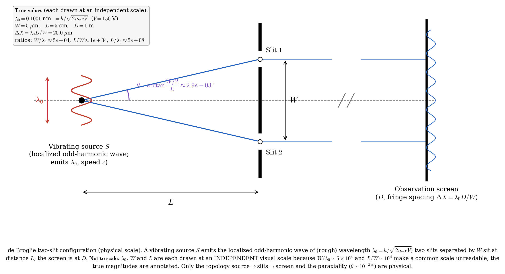
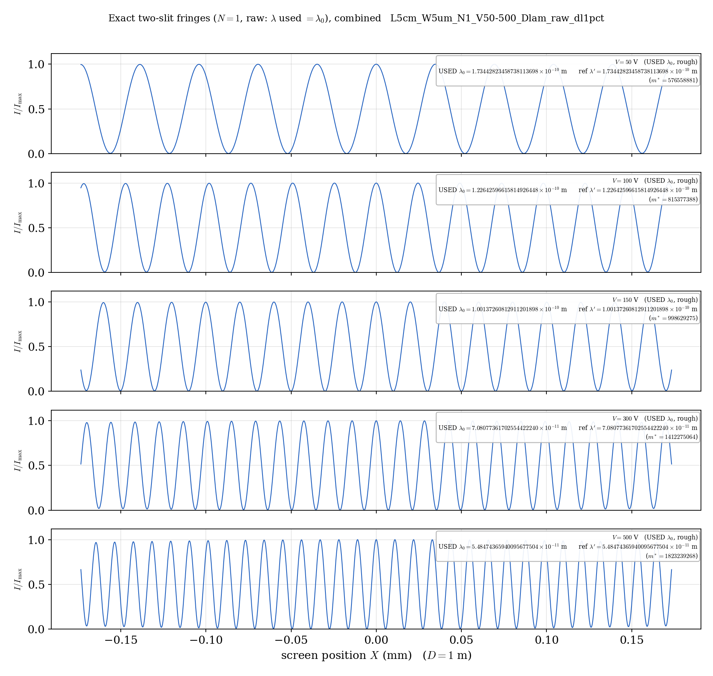
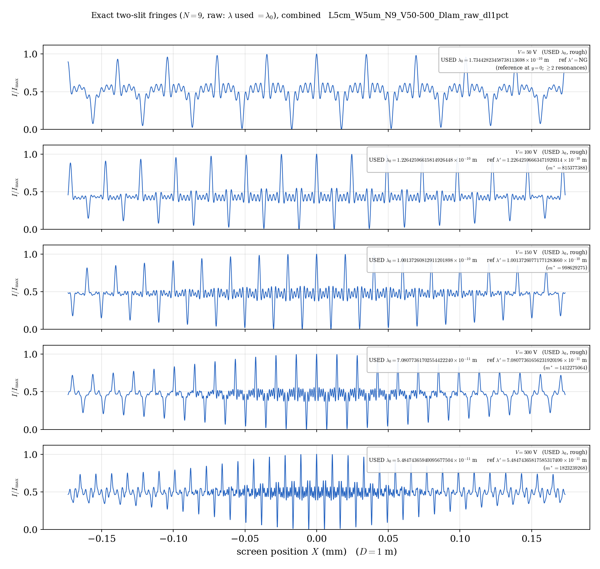
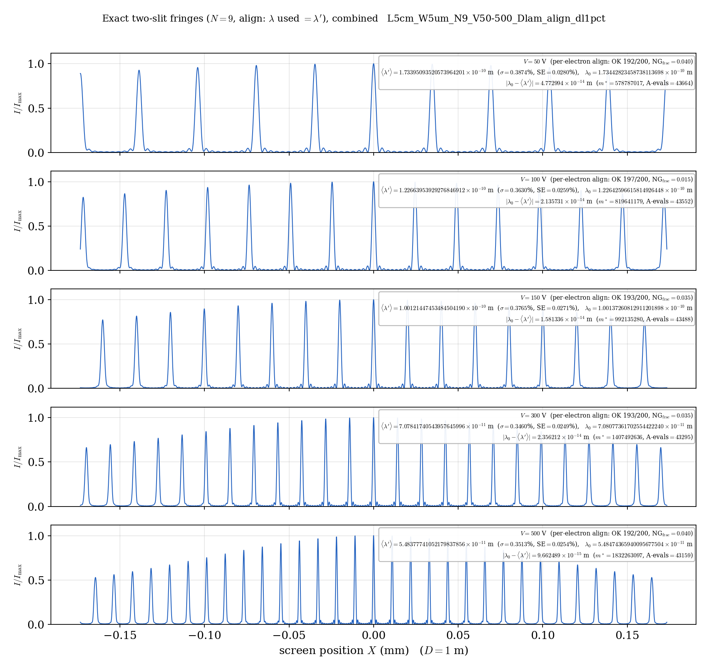
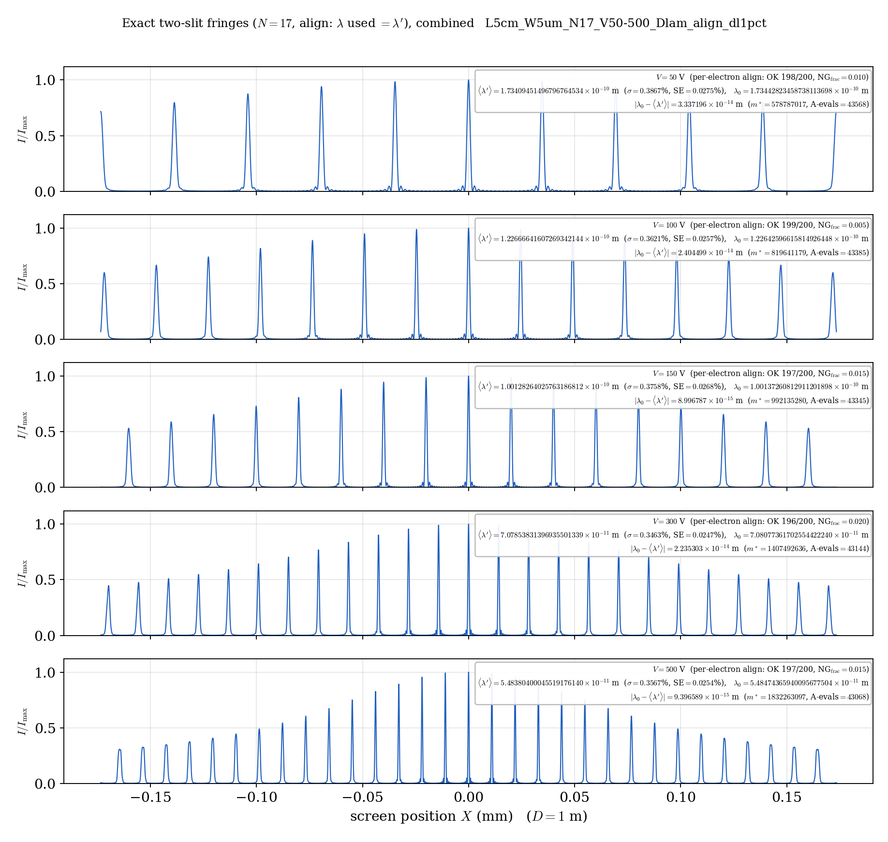
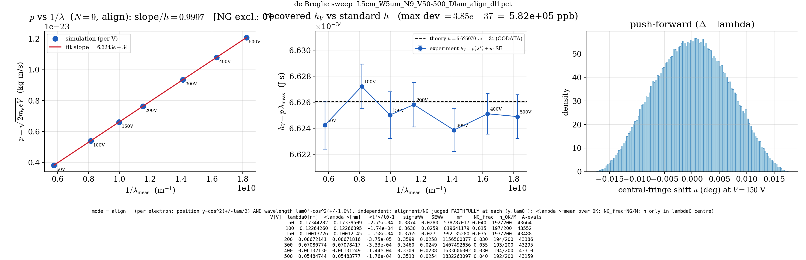

# 局在奇数倍音ダブルスリット模型における de Broglie 波長の模擬観測
### —— 整列条件と $p\lambda$ 一定性の自己整合的検証

**著者**: 木原 範昭 (Noriaki Kihara)
**版**: v0.2（日本語ドラフト）
**日付**: 2026年7月

---

## 要旨

de Broglie 波長 $\lambda=h/p$ は、Davisson と Germer による1927年のニッケル結晶電子回折 [2] で最初に確認された。本稿は、この関係を**単一源ダブルスリットの古典波動模型**の内部で**模擬観測**する数値実験である。電子は、代表波長 $\lambda_0=h/p$ を持ち、$N>1$ の奇数倍音和で構成される**局在波**としてモデル化する [1]。物理スケール（$L=5\,\mathrm{cm}$, $W=5\,\mu\mathrm{m}$）で厳密な二スリット干渉を計算すると、$N=1$（単一倍音）は整列条件を要さず常に干渉し、縞間隔から $\lambda_0$ を回収する（＝手続きの検算）。$N>1$ では、局在構造が保たれる整列条件は $r_{\mathrm{avg}}/\lambda=m/2$（幾何で決まる離散共鳴）であり、電子の $\lambda_0$ は一般にこの格子に乗らないため、そのままでは局在が崩壊して安定縞が得られない。そこで各電子について、中央整列度 $A(\lambda)=I(0)/(4K^2)$ が最大となる有効波長 $\lambda'$ を $\lambda_0$ 近傍で探索する。得られる $\lambda'$ は最近接共鳴 $\lambda'=2r_{\mathrm{avg}}/m^{*}$ であり、物理スケールでは $\lambda_0$ に相対 $\sim10^{-9}$ で一致する。したがって $p\lambda'\approx h$ は**自己整合的**であって独立導出ではない。**本稿は $p\lambda=h$ の第一原理的導出でも、$\Delta x\,\Delta p\sim h$ 型不確定性の導出でもない。** 示すのは、de Broglie スケールの波に $\lambda_0$ より細かい局在構造を与えても、二スリット幾何と整列条件のもとで模擬観測される有効波長が $p\lambda$ 一定性を決定論的に保つ、という古典波動模型としての結果である。誤読対策として、各電子ごとに源位置（$\cos^2$, $\pm\lambda_0/2$）と初期波長（$\cos^2$, $\pm1\%$）を**独立に**乱択し、各 $(y,\lambda_0')$ で毎回厳密に干渉・整列・NG 判定を行った。結果、$\langle p\lambda'\rangle$ は標準誤差の範囲で $h$ と一致し（標準偏差 $\sigma\approx0.36\%$ ＝ $\cos^2$ 分布の理論値、標準誤差 SE $\approx\sigma/\sqrt{n_{\mathrm{OK}}}$）、$\lambda_0'$ が共鳴中間点に落ちる電子は数%が NG となる。

---

## 1. 導入と本稿の位置づけ

de Broglie は1924–1925年、粒子に波長 $\lambda=h/p$ を対応させた [3]。この関係は Davisson–Germer のニッケル電子回折 [2] で初めて確認された（Bragg 条件 $n\lambda=2d\sin\theta$、$d$ 既知・$\theta$ 実測から $\lambda$ を得て $h/p$ と照合）。

本稿の位置づけを明確にする。

- **新しい実験手法の提案でも、実在実験の再測定でもない。**
- **$p\lambda=h$ を第一原理から導出するものでもない**（§5.1, §5.2 参照）。
- 「de Broglie スケールを代表波長として持つ古典波動が、$N>1$ の高局在構造（奇数倍音）を持った場合でも、二スリット幾何と整列条件を通じて $p\lambda$ 一定性を自己整合的に保つか」を調べる**決定論的な数値模型・模擬観測**である。

Davisson–Germer が結晶「格子」を用いたのに対し、本模型は「ダブルスリット」を用いる。「電子の波長を幾何的干渉から読み取る」点で構造は近いが、本稿は実験の再現ではなく**模型内の自己整合性の検証**であり、独立な $h$ の値は主張しない。

---

## 2. モデル定義と計算方法

### 2.1 幾何

源–スリット距離 $L=5\,\mathrm{cm}$、スリット間隔 $W=5\,\mu\mathrm{m}$、スリットは $y_{\mathrm{slit}}=\pm W/2$。源位置 $y$（後述で揺らぐ）に対する二経路の距離は
$$r_1(y)=\sqrt{L^2+(y-W/2)^2},\quad r_2(y)=\sqrt{L^2+(y+W/2)^2},\quad r_{\mathrm{avg}}=\tfrac{r_1+r_2}{2}.$$
中心源 $y=0$ では $r_1=r_2=r_{\mathrm{avg}}=\sqrt{L^2+(W/2)^2}$。物理スケールでは特徴長が桁違い（$W/\lambda_0\sim5\times10^4$, $L/W\sim10^4$, $L/\lambda_0\sim5\times10^8$）で共通縮尺の作図は不可能、半角は $\theta=\arctan[(W/2)/L]\approx2.9\times10^{-3}{}^\circ$ と極端に近軸である。

**図1**: 実験系の模式図（$V=150\,\mathrm{V}$）。
**図の読み方**：左の赤い振動源が局在奇数倍音波（振幅 $\lambda_0$）を放射し、間隔 $W$ の二スリットを経てスクリーン（距離 $D$）に縞（間隔 $\Delta X=\lambda_0D/W$）を作る。**$\lambda_0,W,L$ は各々独立の縮尺**で描いている（左上ボックスに実比 $W/\lambda_0\approx5\times10^4$ 等を明記）。物理的に正しいのは topology（源→スリット→スクリーン）と近軸性 $\theta\sim10^{-3\,\circ}$ のみで、寸法比は誇張されている。

### 2.2 局在奇数倍音波と厳密強度

源は等振幅の奇数倍音和でモデル化する [1]（波数成分 $n=1,3,\dots,N$、$\lambda_n=\lambda/n$、$K=(N{+}1)/2$ 本）。二スリットを経たスクリーン上の厳密強度は
$$I(s;y)=\Big|\sum_{n=1,3,\dots,N}\big(e^{i\Phi_1^{(n)}}+e^{i\Phi_2^{(n)}}\big)\Big|^2,\qquad
\Phi_k^{(n)}=\frac{2\pi n}{\lambda}\big(r_k-y_{\mathrm{slit},k}\,s\big),$$
ここで $s$ はスクリーン方向の近軸変数（遠方座標 $X$ に対し $s\simeq X/D$）。数値的には代数的に等価な因子化形
$$e^{i\Phi_1^{(n)}}+e^{i\Phi_2^{(n)}}=e^{i\,2\pi n\,r_{\mathrm{avg}}/\lambda}\cdot2\cos\!\Big(\pi n\frac{(r_1-r_2)-Ws}{\lambda}\Big),\quad r_1-r_2=\frac{-2Wy}{r_1+r_2}$$
を用いる（物理は不変、絶対位相 $\sim10^9\,\mathrm{rad}$ での桁落ちを回避）。

### 2.3 中央整列度 $A(\lambda)$（絶対指標）

スクリーン中央 $s=0$ の強度は $I(0)=\big|2\sum_n e^{i2\pi n r_{\mathrm{avg}}/\lambda}\big|^2=4K^2A(\lambda)$、
$$A(\lambda)=\frac{1}{K^2}\Big|\sum_{n=1,3,\dots,N}e^{i2\pi n\,r_{\mathrm{avg}}/\lambda}\Big|^2.$$
$A$ は**完全整列の割合**である：$A=1$（$I(0)=4K^2$）は全奇数倍音の位相が揃った真の共鳴（$r_{\mathrm{avg}}/\lambda=m/2$）のときのみで、それ以外は $A<1$。$A$ は幾何と $N$ で決まる絶対最大 $4K^2$ を基準とするため、**部分整列した劣化パターンは $A\ll1$ として正しく棄却される**（自己正規化した $I(0)/I_{\max}$ ではこの識別ができない点に注意）。

### 2.4 各電子ごとの独立な揺らぎと忠実計算

「与えた $\lambda_0$ をそのまま読み返しただけ」という誤読を避けるため、実在装置の揺らぎを模して、**各電子（各試行）ごとに2つの独立なモンテカルロ乱択**を与える：

1. **源位置** $y\sim\cos^2(\pi y/\Delta)$、範囲 $\pm\Delta/2$（$\Delta=\lambda_0$、中央 $0$ がピーク）。
2. **初期波長** $\lambda_0'=\lambda_0+\eta$、$\eta\sim\cos^2\!\big(\pi\eta/2\delta\big)$、$\delta=0.01\,\lambda_0$（$\pm1\%$、上とは**別の乱数**）。

2つは別々に乱択するので統計的に無相関（位置と波長の間に誤った相関が入らない）。各電子について、その $(y,\lambda_0')$ の幾何 $r_{\mathrm{avg}}(y)$ を用いて**毎回厳密に**干渉・整列・NG 判定を行う（$y=0$ 固定・$\lambda_0$ 固定のような近似はしない。$N=9$, 電圧 1 点あたり約 $4\times10^4$ 回の $A$ 評価を要する）。

$\cos^2$ 分布の理論標準偏差は $\sigma=\delta\sqrt{1/3-2/\pi^2}\approx0.362\,\delta$、すなわち $\pm1\%$ 入力に対し **$\sigma\approx0.362\%$**。

### 2.5 有効波長 $\lambda'$ の探索と NG 判定

各電子について、$\lambda_0'$ 近傍の**幾何窓**
$$\Big[\lambda_0'-\tfrac{\lambda_0'^2}{4r_{\mathrm{avg}}},\ \lambda_0'+\tfrac{\lambda_0'^2}{4r_{\mathrm{avg}}}\Big]\quad(\text{＝半共鳴間隔})$$
の中で $A(\lambda)$ を掃引し、$A\ge0.98$ の連結帯（共鳴帯）を数える。帯が**ちょうど1つ**なら黄金分割でそのピークを精密化して有効波長 $\lambda'=2r_{\mathrm{avg}}/m^{*}$ を得る（$A(\lambda')=1$, $I(0)=4K^2$ を機械精度で満たす）。帯が **0 または 2 以上**（$\lambda_0'$ が共鳴中間点近傍で最近接共鳴が一意でない）なら、その電子は **NG（計算不能）** として除外する。窓幅・整列条件は幾何のみで決まり、$h$ は $\lambda_0'$ の中心 $\lambda_0=h/p$ を通してしか入らない。

観測される次数 $m^{*}=\mathrm{round}(2r_{\mathrm{avg}}/\lambda')$ は事後出力である。

### 2.6 $\lambda_0$ の役割と $N=1$／$N>1$ の位置づけ

$\lambda_0=h/p$ は干渉計算の初期条件であり、$\lambda_0$ なしには位相 $2\pi r/\lambda$ が定義できない。$\lambda_0$ 自体が $h$ を用いて与えられる以上、以下の結果は $h$ の独立導出ではなく、模型内部の自己整合性の検証である。

- **$N=1$（単一倍音）** は整列条件を要さず常に干渉し、縞間隔から同じ $\lambda_0$ が回収される。したがって $N=1$ の結果は物理的発見ではなく、**計算と波長読み取り手続きの検算**である。
- **$N>1$（局在奇数倍音波）** が主眼である。この波形は $\lambda_0$ より細かい局在構造を持ち、安定に干渉できるのは離散共鳴 $r_{\mathrm{avg}}/\lambda=m/2$ 上に限られる。電子の $\lambda_0$ は一般にこの格子に乗らないため、そのままでは崩壊し、$A$ 最大の $\lambda'$（最近接共鳴）が干渉から選ばれる。**この $\lambda'$ は $h$ を再代入して作るのではなく、多重倍音波が二スリット幾何で安定干渉するために模型内部で選ばれる波長**である。

ただし物理スケールでは共鳴格子間隔 $\lambda_0^2/(2r_{\mathrm{avg}})\sim10^{-19}\,\mathrm{m}$ が極めて密で、$\lambda'$ は $\lambda_0$ に相対 $\sim10^{-9}$ で一致する。したがって $p\lambda'\approx h$ は自己整合的であり、**$N>1$ が示す固有の内容は、値としての $h$ ではなく「局在奇数倍音波の安定干渉が幾何共鳴 $\lambda'=2r_{\mathrm{avg}}/m$ 上に量子化され、de Broglie 波長がその最近接格子点にスナップされる」という構造的量子化**である。

---

## 3. $N=1$：ベースライン（手続きの検算）

$N=1$ は無条件に干渉する。各電圧 $V=50\text{–}500\,\mathrm{V}$（$\lambda_0=0.055\text{–}0.173\,\mathrm{nm}$）で、$\pm\lambda_0/2$ の位置揺らぎと $\pm1\%$ の波長揺らぎを与えた電子群の厳密二スリット縞を積算し（図2）、縞間隔から波長を回収する。$\langle p\lambda\rangle$ の傾きは $h$ に対し **$\mathrm{slope}/h=0.99977$**（$\pm1\%$ 入力を $M=200$ 平均した統計残差 $\sim2\times10^{-4}$）で一致する。

**図2**: $N=1$ の積算縞（$V=50,100,150,300,500\,\mathrm{V}$、$D=1\,\mathrm{m}$、共通窓）。
**図の読み方**：各段が1電圧。高電圧ほど $\lambda$ が短く縞が詰まる（$\Delta X=\lambda D/W=0.035\to0.011\,\mathrm{mm}$）。各段のパターンは**中心源1枚ではなく、$\pm\lambda_0/2$ で揺らぐ源位置と $\pm1\%$ で揺らぐ波長を持つ 200 電子を厳密に再計算して積算**したもの。位置揺らぎのフリンジシフトは $\sim0.02^\circ$ と極小のためほぼ重なるが、$\pm1\%$ の波長差により**窓の端へ向かうほど僅かに可視度が低下**する（±数十%周期のコヒーレンス包絡）。

---

## 4. $N>1$：整列共鳴と脆さ

多重倍音 $N=9,17$ を計算する（表1）。

**未補正（raw, $\lambda_0'$ をそのまま使用）**：倍音間の整列位相（$r_{\mathrm{avg}}/\lambda\sim5\times10^8$）は一般に揃わない。整列許容帯 $\sim1/(2N)$ は狭く、$\lambda_0'$ はそこに乗らない。局在は崩れて多重分裂し、縞間隔読み取りが破綻して傾きが崩壊する（$N=9$: $\mathrm{slope}/h=0.139$、$N=17$: $0.081$）。

**図3**: $N=9$・**未補正**（raw）の積算縞。
**図の読み方**：各周期が単一の鋭いピークにならず、**分裂した多重ピーク（櫛状）**になっている。これは倍音が整列していない＝安定干渉が成立していない状態。中央 $s=0$ が主ピークにならないため、この波長では「干渉していない」と判定される。

**補正（align, $\lambda'$ を使用）**：各電子の $\lambda_0'$ を、その幾何 $r_{\mathrm{avg}}(y)$ の最近接共鳴 $\lambda'=2r_{\mathrm{avg}}/m^{*}$ に整列（§2.5）。全倍音位相が揃い、鋭い局在ピークが復活する（図4）。$\langle p\lambda'\rangle$ の傾きは $N=9$: $0.99973$、$N=17$: $0.99972$ と $h$ を回復する。

**図4**: $N=9$・**整列**（align）の積算縞。
**図の読み方**：図3の櫛状分裂が、$A(\lambda)$ 最大の有効波長 $\lambda'$ に整列することで**鋭い単一局在ピーク（$S_N$ のサイドローブ付き）**に変わる。各パネルの注記に、成功電子数 $n_{\mathrm{OK}}/200$、NG 率、$\langle\lambda'\rangle$（20桁）、標準偏差 $\sigma\%$、標準誤差 SE$\%$ を表示。$\lambda'$ は $\lambda_0$ に相対 $\sim10^{-9}$ で一致しており、整列は**幾何共鳴へのスナップ**であることが読み取れる。

**図5**: $N=17$・整列。倍音9本により、$N=9$ よりさらに**鋭い局在ピーク**（幅 $\sim1/(N{+}1)$）。**ピーク位置・間隔は $N$ によらず不変**で、$N$ は分解能（鋭さ）のみを制御し、読み取る波長スケールは変えない。

| $N$ | 倍音数 $K$ | raw $\mathrm{slope}/h$ | align $\mathrm{slope}/h$ | 局在幅 $\sim1/(N{+}1)$ |
|---:|---:|---:|---:|---:|
| 1 | 1 | $0.99977$ | $0.99977$ | 正弦波（局在なし） |
| 9 | 5 | $0.139$（崩壊） | $0.99973$ | $\sim1/10$ |
| 17 | 9 | $0.081$（崩壊） | $0.99972$ | $\sim1/18$ |

**表1**: 傾き$/h$ の $N$ 依存（$\pm1\%$ 波長揺らぎ・200電子平均）。整列すれば $N$ によらず $\mathrm{slope}/h\approx1$（残差は $\pm1\%$ 入力の統計揺らぎ）、未整列では $N$ が大きいほど崩壊が激しい。**高 $N$＝高分解能かつ高脆弱（許容帯 $\sim1/(2N)$）** のトレードオフは、原子時計や電子干渉計の分解能–安定性トレードオフの古典的アナロジーとして機能する [1]。

---

## 5. $p$ vs $1/\lambda$ と $p\lambda$ 一定性の模擬観測

図6に $N=9$・整列の総括図を示す。

**図6**: $N=9$・整列の総括（$\pm1\%$ 波長揺らぎ、各電圧 200 電子）。
**図の読み方（3パネル）**：
- **左（$p$ vs $1/\lambda$）**：横軸 $1/\langle\lambda'\rangle$、縦軸 $p=\sqrt{2m_eeV}$。7電圧が直線に乗り、傾き $=h$（$\mathrm{slope}/h=0.9997$）。これは「de Broglie 関係が模型内で保たれる」ことの可視化だが、直線性は精度を示さない（下の中央パネルが精度を示す）。
- **中央（$h_V$ の $h$ からの偏差）**：縦軸を CODATA $h$ の周りに極端にズームし、各電圧の $h_V=p\langle\lambda'\rangle$ を **$\pm p\cdot$SE の誤差棒付き**でプロット、$h$ を点線（中心）で示す。**全点の誤差棒が $h$ 点線を含み**、$\langle p\lambda'\rangle$ が $h$ と統計的に無矛盾であることが読める。散布は $\pm1\%$ 入力を 200 平均した $\sim0.03\%$ 規模。
- **右（push-forward）**：源位置揺らぎ（$\cos^2$）による中央フリンジ位置シフトの分布。

下部の表に各電圧の $\langle\lambda'\rangle$、$\sigma\%$、SE$\%$、NG 率、$n_{\mathrm{OK}}/200$、$A$ 評価回数を記載。代表値：$\sigma\approx0.35\text{–}0.39\%$（理論 $0.362\%$ と一致）、SE $\approx0.025\text{–}0.028\%$（$=\sigma/\sqrt{n_{\mathrm{OK}}}$）、NG 率 $1.5\text{–}4.0\%$（$\lambda_0'$ が共鳴中間点に落ちた電子）、$n_{\mathrm{OK}}=192\text{–}197/200$。

### 5.1 自己整合性の明示

本数値実験では、各電子の初期波長 $\lambda_0'$ の**中心**に $\lambda_0=h/p$ を用いている。$h$ はこの1箇所で入り、$\lambda'\approx\lambda_0$（スナップ $\sim10^{-9}$）を経て $p\lambda'\approx h$ として戻る。したがって「$h$ を回復する」こと自体は**自己整合的（自己循環的）**であり、独立な $h$ の数値決定ではない。これは自明であり、隠さず明記する。$\pm1\%$ の波長揺らぎと 200 電子平均は、「与えた $\lambda_0$ をそのまま読み返しただけ」という誤読を避けるための現実性付与であって、多数平均 $\langle p\lambda'\rangle\to h$ は $\lambda_0'$ が $\lambda_0$ を中心に対称であることによる相殺の帰結である（干渉が真値 $h$ を独立に選別・補正するのではない）。

### 5.2 本稿が導出していないこと（主張の射程）

誤読を避けるため、本稿が**導出していない**ことを明記する。

**(a) $p\lambda=h$ の第一原理的導出ではない。** $p=\sqrt{2m_eeV}$ は加速電圧から定まる古典運動量（$h$ 不使用）、$\lambda$ は波源に与える代表波長 $\lambda_0=h/p$ および干渉から抽出される有効波長 $\lambda'$ である。$\lambda_0$ 自体が $h$ を用いて与えられる以上、$p\lambda'\approx h$ は自己整合的結果であり、$p$ と $\lambda$ の共役性から $h$ が現れることを導いたものではない。

**(b) $\Delta x\,\Delta p\sim h$ 型不確定性関係の導出ではない。** 本稿の局在奇数倍音波が本質的に持つのは、局在幅 $\Delta x$ と波数幅 $\Delta k$ の間の**古典波動的（フーリエ的）関係 $\Delta x\,\Delta k\sim1$** にすぎない。これを運動量幅に接続して $\Delta x\,\Delta p\sim\hbar$ を得るには、別途 $p=\hbar k$（＝de Broglie 対応そのもの）を物理的入力として要する。本稿はこれを仮定した前段階であり、不確定性関係を導出しない。

以上より本稿が示すのは、**de Broglie スケールを代表波長とする波に $\lambda_0$ より細かい局在奇数倍音構造を与えても、二スリット幾何と整列条件のもとで安定干渉する場合には、模擬観測される有効波長が $p\lambda$ 一定性を決定論的・自己整合的に保つ**、という古典波動模型としての結果であって、値としての $h$ の導出でも、共役性・不確定性の導出でもない。

### 5.3 実実験との対応（限定的アナロジー）

Davisson–Germer 等の実物質波実験も、粗い推定で波長域を追い込んだのち格子干渉で精度を上げる。本模型の「粗い $\lambda_0$ → 整列共鳴 $\lambda'$」の流れは構造的に近いが、実実験では回折角という**外部測定データ**が $\lambda$ を独立に与えるのに対し、本模型では $\lambda_0=h/p$ から縞を生成して読み戻すため、独立な測定経路を持たない点で同型ではない（§6）。

---

## 6. 計算・模型の限界

- **自己参照性**：$\lambda_0'$ の中心に $h/p$ を用いるため、$h$ の**数値**は独立に決まらない。独立な値は実測縞データからの $\lambda$ 抽出を要する。
- **数値精度**：$r_{\mathrm{avg}}/\lambda\sim10^9$ のため $N>1$ の整列位相は float64 の限界にある。$A(\lambda)$ は絶対整列（$I(0)/4K^2$）で計算し、$\lambda'=2r_{\mathrm{avg}}/m^{*}$ を直接構成することで桁落ちを回避している。
- **次数 $m^{*}$ の非可算性**：$m^{*}\sim10^9$ は Bragg 回折の小さな次数 $n=1,2,3$ と異なり縞計数で同定できない。実効波長は $m^{*}$ ではなく縞間隔から読むのが実際的で、この点で結晶 Bragg 回折と完全には同型でない。
- **押し出し効果の微小性**：源位置揺らぎ $\pm\lambda_0/2$（本稿の基本仮定）に対するフリンジシフトは近軸ゆえ $\sim0.02^\circ$ と微小である。押し出し機構は忠実に実装しているが、この幾何では中央波長スケールへの寄与は小さい（仮定の下での正しい帰結）。
- **代表値**：$L,W,V,\Delta,\delta$ は代表値であり、定量精度は限定的である。

---

## 7. 結論と展望

単一源ダブルスリットの古典波動模型において、局在奇数倍音波（$N>1$）に de Broglie スケールの代表波長 $\lambda_0=h/p$ を与え、各電子ごとに位置（$\pm\lambda_0/2$）と波長（$\pm1\%$）を独立に揺らがせて厳密に干渉・整列・NG 判定を行った。$N=1$ は手続きの検算にあたり、$N>1$ では安定干渉が幾何共鳴 $\lambda'=2r_{\mathrm{avg}}/m$ に量子化され、de Broglie 波長がその最近接格子点にスナップされる。多数電子平均 $\langle p\lambda'\rangle$ は標準誤差の範囲で $h$ と一致し（$\sigma\approx0.36\%$、SE $\approx0.026\%$、NG 率数%）、$p\lambda$ 一定性が自己整合的に保たれることを模擬観測した。

**本稿の結果は $p\lambda=h$ の第一原理的導出でも、$\Delta x\,\Delta p\sim h$ 型不確定性の導出でもない。** 示したのは、de Broglie スケールの局在奇数倍音波が二スリット幾何・整列条件のもとで、模擬観測波長として $p\lambda$ 一定性を自己整合的に保つ、という決定論的数値模型としての結果である。本稿の価値は「$h$ を導出した」ことではなく、**de Broglie 波長より小さい局在構造を持たせても、観測される干渉波長が de Broglie スケールとして残ることを、明示的な古典波動模型で検証した**ことにある。

展望：(a) 実測縞データからの独立な $h$ 抽出、(b) 整列鋭敏性（高分解能かつ高脆弱）の、原子時計（Ramsey 干渉）・スーパーヘテロダイン・電子干渉計との普遍構造としての位置づけ。

---

## 参考文献

[1] N. Kihara, *単一源ダブルスリット模型における局在奇数倍音波と整列条件（Localized odd-harmonic wave and the alignment condition in a single-source double-slit model）*, Zenodo (2026). DOI: [10.5281/zenodo.21035831](https://doi.org/10.5281/zenodo.21035831).（※正確な題名・DOI・公開状態は当該 deposit で確定すること）

[2] C. Davisson and L. H. Germer, "Diffraction of Electrons by a Crystal of Nickel," *Physical Review* **30**, 705–740 (1927). DOI: 10.1103/PhysRev.30.705.

[3] L. de Broglie, "Recherches sur la théorie des quanta," *Annales de Physique* **10**(3), 22–128 (1925). DOI: 10.1051/anphys/192510030022.（正式誌面情報・DOI を最終確認すること）

[4] M. Born, "Zur Quantenmechanik der Stoßvorgänge," *Zeitschrift für Physik* **37**, 863–867 (1926). DOI: 10.1007/BF01397477.（1926年に続報 *Z. Phys.* **38**, 803, DOI 10.1007/BF01397184 あり。引用意図を確認すること）

---

*付記：数値・図は、パラメータ化した `debroglie_plambda_sweep.py`（厳密二スリット強度＋位置・波長の独立 $\cos^2$ 揺らぎ＋per-electron 積算）と、絶対整列 $A$ 探索ソルバ `debroglie_align_lambda.py` により生成した。図の生成条件はファイル名に符号化されている（例：`..._N9_V50-500_Dlam_align_dl1pct`＝$N{=}9$・整列・波長揺らぎ $\pm1\%$）。*
