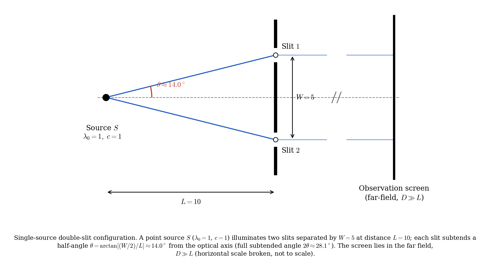
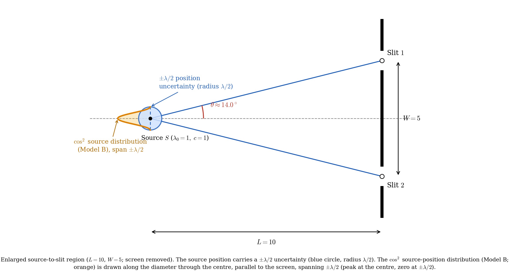
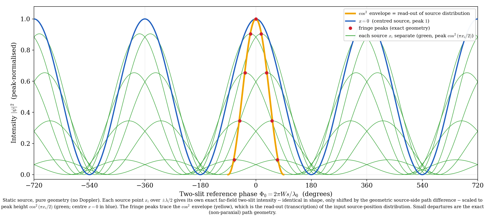
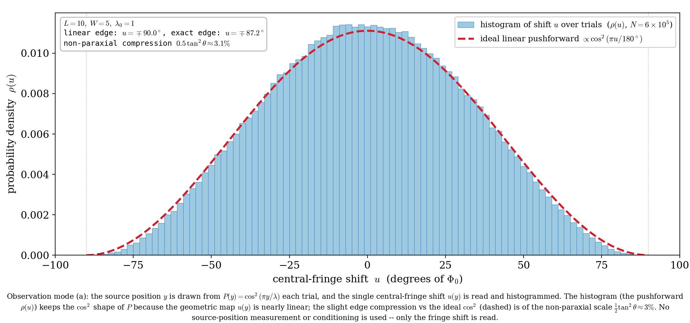

# A Thought Experiment on Double-Slit Interference from a Source with Positional Fluctuation — Push-forward of the Source-Position Distribution to the Fringe-Shift Distribution (Shape Preservation)

**Noriaki Kihara**

*This paper is a **thought experiment (model calculation)**, not a measurement. It contains no claim that overturns established physics (standard wave optics / quantum mechanics). For a specified geometry, it illustrates by exact analysis and numerical computation how the probability distribution of the source position is mapped onto the probability distribution of the far-field interference-fringe shift over repeated trials.*

Version v0.3 (2026-06-29)
DOI (Version): 10.5281/zenodo.21035809
DOI (Concept): 10.5281/zenodo.21035808
Zenodo: https://zenodo.org/records/21035809

---

## Abstract

We assume a stationary point source whose position has a fluctuation of order $\pm\lambda/2$ (half a wavelength), and consider far-field interference through a double slit. In a single trial with a given source position $y$, the interference fringe appears as a single fringe of **identical shape, merely shifted left or right by the pure geometric path difference** (the wavelength is $\lambda_0$ everywhere; no frequency shift is involved). The central-peak shift $u(y)$ is a **nearly linear map** of the source position.

The claim of this paper is the following. **In repeated observation where the source position $y$ is drawn randomly each trial from a probability distribution $P(y)$, the probability distribution of the per-trial fringe shift $u$ is the push-forward $\rho(u)=P(y(u))\,|dy/du|$ of $P$; because the map $u(y)$ is linear, the shape of $P$ is preserved whatever it is.** This is not the derivation of a new probability law but an illustration of a change of variables (push-forward) by which the input distribution is mapped, through a nearly linear geometric map, onto the distribution of the shift. We use $P(y)=\cos^2(\pi y/\lambda)$ as a concrete example and show that the shift distribution is the same-shape $\cos^2$. The $\sim2\text{–}3\%$ departure from this shape arises from the non-paraxial nonlinearity of the map $u(y)$ (the non-paraxial scale $\tfrac12\tan^2\theta\approx3\%$) and vanishes in the paraxial limit $W/L\to0$.

As an important caveat, this distribution is **not a property of a single observed image**. A single trial yields just one shift value (one fringe). Moreover, the image obtained by **accumulating** the intensity of many trials on one screen is a **single fringe of reduced visibility** convolved with the shift, not the shape of the input distribution. The shape appears when one reads the shift each trial and builds a histogram over repetitions (assuming the source position is quasi-static within a trial and fluctuates between trials).

---

## 1. Introduction

Double-slit interference is a basic stage for thought experiments in both wave optics and quantum mechanics. Here we ask what statistics appear in the fringe shift over repeated observation when the source position fluctuates.

To anticipate the conclusion: each trial merely shifts the same fringe, and the shift is a nearly linear map of the source position. Therefore, if the source position is repeatedly drawn from a distribution $P(y)$, **the shift distribution is the push-forward of $P$ and preserves the same shape in the paraxial regime**. This is not the derivation of a new probability law but an illustration of the change of variables that maps the input distribution onto the observed statistic (the shift). Taking $P(y)=\cos^2(\pi y/\lambda)$ as an example, we show that the shift distribution is the same-shape $\cos^2$ and that the departure is limited to the non-paraxial $\tfrac12\tan^2\theta\approx3\%$. This is a thought experiment; everything is an exact computation on the specified geometry.

---

## 2. Experimental conditions

### 2.1 Overall configuration

A single point source $S$ (wavelength $\lambda_0=1$, speed of light $c=1$) illuminates a double slit at distance $L=10$. The slit separation is $W=5$, and the slits are placed symmetrically about the optical axis ($y=\pm W/2=\pm2.5$). Each slit subtends a half-angle $\theta=\arctan(0.25)\approx14.04^\circ$ from the source about the axis. The screen is far ($D\gg L$, Fraunhofer regime).

*Fig 1: Overall configuration of single source and double slit ($L=10$, $W=5$, $\lambda_0=1$, $c=1$). Each slit subtends half-angle $\theta\approx14^\circ$ from the axis. The screen is far (the transverse direction is broken / not to scale).*

### 2.2 Positional fluctuation of the source

We assign the source position an uncertainty of radius $\lambda/2$ and take, as a concrete example, the probability distribution of the transverse position $y$ (parallel to the screen) to be

$$P(y)=\cos^2\!\Big(\frac{\pi y}{\lambda}\Big),\qquad y\in[-\tfrac{\lambda}{2},\,\tfrac{\lambda}{2}]$$

(a centrally-peaked bell that is zero at $\pm\lambda/2$). We take the positional scale $\lambda$ equal to the optical wavelength $\lambda_0$ ($\lambda=\lambda_0=1$). We treat this distribution as input and do not ask its origin. The source position is **held quasi-static within a single trial and re-drawn between trials according to this $P(y)$**.

*Fig 2: Magnified view of the source–slit region ($L=10$, $W=5$; the screen is removed). The source position has an uncertainty disc of radius $\lambda/2$ (blue); along the axis through its center, parallel to the screen, rides the distribution $P(y)=\cos^2$ (orange; $\pm\lambda/2$, central peak, zero at the ends).*

---

## 3. Method (pure geometric model)

Let the source be $S=(-L,\,y)$ and the slits $A_1=(0,+W/2)$, $A_2=(0,-W/2)$. The screen point is parametrized by the far-field diffraction angle $\theta_s$ ($s=\sin\theta_s$). The wavelength is $\lambda_0$ everywhere (no motion assumption, no Doppler: the light propagates at $c$ from a stationary source, and since the emission point does not move, no frequency shift occurs).

The phase of each arm $k$ is the sum of the source-side geometric path and the far-field screen-side path difference:

$$\Phi_k(s;y)=\frac{2\pi}{\lambda_0}\Big[\,r_k(y)-y_{{\rm slit},k}\,s\,\Big],\qquad
r_k(y)=\sqrt{L^2+(y-y_{{\rm slit},k})^2}.$$

The interference intensity (exact Born form via complex conjugation) is

$$I(s;y)=\big|e^{i\Phi_1}+e^{i\Phi_2}\big|^2
=2+2\cos\!\Big[\tfrac{2\pi}{\lambda_0}\big(\Delta r(y)-W s\big)\Big],\qquad \Delta r(y)=r_1-r_2.$$

Only the phase offset $\Delta r(y)$ depends on $y$; the **waveform is exactly identical in shape** ("identical shape, merely shifted" is exact, not an approximation). The position of the central peak ($\Delta\Phi=0$) is

$$u(y)\equiv\Phi_0^{\rm peak}(y)=\frac{2\pi}{\lambda_0}\,\Delta r(y)\ \approx\ -\frac{2\pi W}{L\lambda_0}\,y\quad(\text{linear in the paraxial regime})$$

(the horizontal axis is the slit-reference phase $\Phi_0=2\pi W s/\lambda_0$).

---

## 4. Results

### 4.1 Shift distribution = push-forward

Drawing the interference for each source position separately, each trial shifts a fringe of identical shape by $u(y)$ (Fig 3). The probability distribution of the shift $u$ is the push-forward of $P$,

$$\rho(u)=P\big(y(u)\big)\,\Big|\frac{dy}{du}\Big|.$$

If $u(y)$ is linear then $|dy/du|$ is constant, and **$\rho(u)$ has the same shape as $P$ (only the axis is rescaled). This is not a property special to $\cos^2$ but a consequence of a linear map preserving the shape of any input $P$.** For our example $P=\cos^2(\pi y/\lambda)$, $\rho(u)\propto\cos^2(\pi u/180^\circ)$.

*Fig 3: Stationary source, pure geometry (no Doppler). The exact far-field two-slit intensity for each source position $x$ is **identical in shape, merely shifted by the source-side path difference**. The peak height of each waveform is the weight $\cos^2(\pi x/2)$ (green; the central $x=0$ in blue). The fringe peaks (red dots) of the waveforms trace the $\cos^2$ envelope (yellow).*

We confirm this directly by a Monte-Carlo of repeated trials. Drawing $y$ from $P(y)$ and **reading only the fringe shift $u(y)$** each trial and histogramming (Fig 4), $\rho(u)$ preserves the $\cos^2$ shape.

*Fig 4: Observation mode (a). Each trial draws $y\sim P(y)$ and reads the single fringe shift $u(y)$, histogrammed ($N=6\times10^5$). The histogram $\rho(u)$ preserves the $\cos^2$ shape of $P$ (because the map $u(y)$ is nearly linear). The edge compression relative to the ideal $\cos^2$ (red dashed) (exact edge $u=\mp87.2^\circ$ vs linear $\mp90^\circ$, $3.09\%$) is the non-paraxial nonlinearity (scale $\tfrac12\tan^2\theta\approx3\%$). No source-position measurement or conditioning is used; only the fringe shift is read.*

### 4.2 Uniqueness (aliasing condition)

The shift $u$ is the position of the central (zeroth-order) fringe, and in this configuration stays within $|u|\le u_{\max}=\dfrac{\pi W}{L}=90^\circ<180^\circ$ (half of the fringe period $360^\circ$). Hence the zeroth-order fringe does not mix with the adjacent orders ($\pm360^\circ$), and the shift can be read uniquely. If $W/L$ or the source swing is large enough that $u_{\max}\ge180^\circ$, the map wraps around (aliases) and the histogram folds back. The push-forward of this paper holds within this uniqueness range.

### 4.3 Quantifying the departure

The departure from $\cos^2$ (at most $\sim3\%$ at the edges) arises from the non-paraxial nonlinearity of the map $u(y)$. Expanding the source-side path difference, the slope correction at the center is $\tfrac12\tan^2\theta=\tfrac12(0.25)^2=3.13\%$. The Monte-Carlo edge compression is $3.09\%$; because it includes quartic and higher terms at the edge it is not exactly the same quantity as $\tfrac12\tan^2\theta$, but it is of the same non-paraxial scale ($\approx3\%$) and consistent. In the paraxial limit $W/L\to0$, $u(y)$ becomes exactly linear and the shape preservation becomes exact.

---

## 5. Discussion

### 5.1 Stating the observation mode — what is the push-forward of what

The distribution in this paper is **not a property of a single observed image**. Two observation modes must be distinguished.

- **(a) Read the fringe shift (central-peak position) each trial and build a histogram over repetitions** $\rightarrow$ the push-forward of $P$ (Fig 4). This is the claim of this paper. The source position $y$ need not be measured directly; since the fringe position encodes $y$, it suffices to read the shift.
- **(b) Accumulate the intensity of many trials on one screen** $\rightarrow$ a **single fringe of reduced visibility** convolved with the shift ($2+2V\cos$, $V<1$), which is not the shape of the input distribution.

A single trial yields one shift (one fringe), not a distribution. The shape appears as the statistic of repeated trials (an ensemble). This requires the source position to be **quasi-static within a trial (fixed while the fringe forms) and to fluctuate between trials** (if the fluctuation is fast within a trial, mode (b) results and the shape vanishes). What one obtains is not a "derived distribution" but the **push-forward (change of variables)** by which the input $P(y)$ is mapped to the shift distribution.

### 5.2 On inertial frames (limited remark)

If the same experiment is constructed in any inertial frame (at rest in that frame), the relativity principle gives the same shift statistics. This is a trivial consequence of the relativity principle, and we claim nothing beyond it. In particular, we do **not** assert the strong statement that "because the set of detection events is Lorentz-invariant, the transcription relation holds even when one experiment is viewed by a moving observer" (the quantitative fringe spacing is frame-dependent via aberration etc., and consistency of the transformations on both sides requires a separate calculation).

### 5.3 Translation of the source itself is a separate problem (out of scope)

This paper treats a stationary source whose emission point does not move. A setting in which the source itself translates (transverse velocity $\beta_{\rm src}<1$) is a separate problem in which the two slits receive different Doppler frequencies and the visibility loss due to that frequency mismatch competes with the shift readout; it is out of scope (future work).

### 5.4 Relation to the classical picture (arcsine) — making the coordinate explicit

If the source is regarded as a classical point $e^{i\theta}$ moving uniformly on a circle of radius $\lambda/2$, the resulting distribution **depends on which coordinate one views it in**.

- **Projected coordinate $x=\sin\theta$**: the projection of uniform $\theta$ is the arcsine law $p_A(x)=1/(\pi\sqrt{1-x^2})$ (a U-shape diverging at the ends). Multiplying by the amplitude-squared weight (Born factor $\cos^2\theta=1-x^2$) gives $p\propto\sqrt{1-x^2}$ = a **semicircle**, not $\cos^2$.
- **Arc-length coordinate $\theta$ (the $y$ of this paper, $\theta=\pi y/\lambda$)**: uniform $\to$ uniform. Multiplying by the Born factor $\cos^2\theta$ gives $\cos^2\theta$. The $P(y)$ of this paper is the latter.

That is, the arcsine lives in the projected coordinate $x$ and $\cos^2$ in the arc-length coordinate $\theta$; they are **not related by the Born factor in the same coordinate** (a change of coordinate is involved). Robinett (1995) [1] shows that the classical probability density of the harmonic oscillator is arcsine-type and that the quantum $|\psi_n|^2$ approaches it in the large-$n$ limit; this is the standard backing for the arcsine (projected coordinate, high-$n$ correspondence of the classical HO) and is not directly identified with the $\cos^2$ (arc-length coordinate) of this paper.

---

## 6. Conclusion

For double-slit interference from a stationary source with positional fluctuation, exact pure-geometry computation shows the following.

1. In a single trial, the fringe shifts left or right by $u(y)$ while remaining **exactly identical in shape** (constant wavelength, no waveform deformation).
2. When the source position $y$ is repeatedly drawn from a distribution $P(y)$, **the probability distribution of the fringe shift $u$ is the push-forward of $P$, and because the map $u(y)$ is linear in the paraxial regime, the shape of $P$ is preserved**. This is not special to $\cos^2$ but a general consequence of a linear map; we showed with $P=\cos^2$ that the same-shape $\cos^2$ results. The departure from the shape ($\sim3\%$) arises from the non-paraxial nonlinearity of the map (scale $\tfrac12\tan^2\theta\approx3\%$) and vanishes in the paraxial limit. The shift is unique within $|u|<180^\circ$ (no aliasing).
3. This distribution is a **statistic of repeated-trial shifts**, not a single observed image, nor an intensity-accumulated single image (whose visibility is reduced and whose shape is lost).

This is not the derivation of a new probability law but an illustration that the input distribution is mapped onto the observed statistic (fringe shift), **preserving its shape**, by the paraxial linear geometric map. This paper is a thought experiment; it illustrates and organizes established physics rather than overturning it.

---

## References

[1] R. W. Robinett, "Quantum and classical probability distributions for position and momentum," *American Journal of Physics* **63**(9), 823–832 (1995). DOI: 10.1119/1.17807.

[2] M. Born and E. Wolf, *Principles of Optics*, 7th (expanded) ed. (Cambridge University Press, 1999).

---

*(Reproduction code: `fig_setup_double_slit.py`, `fig_setup_source_uncertainty.py`, `fig_decomposition_static.py`, `fig_shift_histogram.py`. All angles and paths are derived from $L,W$; no constants are placed arbitrarily. No motion assumption or Doppler is used.)*
