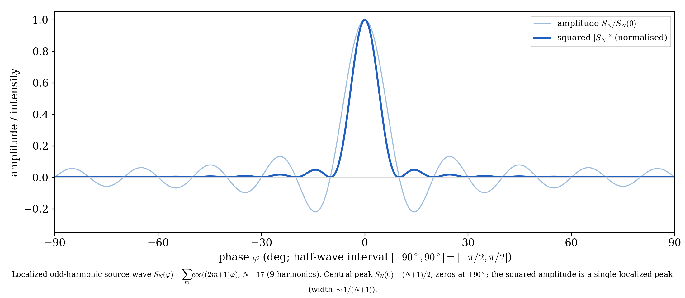
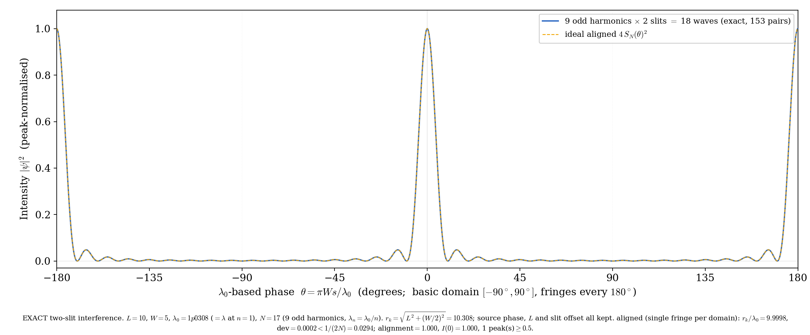
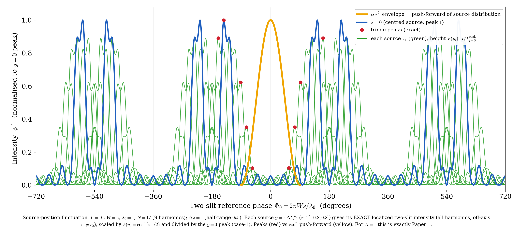
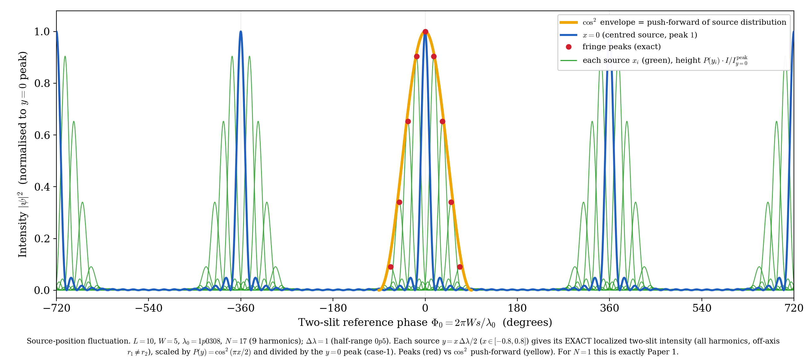

# A Thought Experiment on Double-Slit Interference from a Localized Odd-Harmonic Source — Shape Preservation Is Conditional and Fragile, and the Single-Wavelength N=1 Is the Robust Special Case (Alignment Condition, Tolerance Band, Off-axis Scattering)

**Noriaki Kihara**

*This paper is a **thought experiment (model calculation)**, not a measurement. It contains no claim that overturns established physics (standard wave optics / quantum mechanics). It illustrates and organizes, by exact analysis and numerical computation, the far-field interference when a **localized source** with positional fluctuation is passed through a double slit. We take the preceding position-readout paper [1] as the sole self-reference and limit external citations to established textbook facts (spatial coherence / far-field double slit; the closed form of the odd-harmonic cosine sum).*

Version v0.1 (2026-06-29)
DOI (Version): 10.5281/zenodo.21035831
DOI (Concept): 10.5281/zenodo.21035830
Zenodo: https://zenodo.org/records/21035831

---

## Abstract

The preceding paper [1] showed that when a **single-wavelength** point source has a positional fluctuation $P(y)$, in each trial the far-field double-slit fringe **shifts by the pure geometric path difference while keeping its shape**, and that over repeated trials the distribution of the fringe shift is the push-forward of $P$, which **preserves the shape** because the map is linear in the paraxial regime ($\cos^2$ if $P=\cos^2$).

This paper extends that to a **localized source wave**. We represent the localization by a constant-amplitude odd-harmonic sum (the isolated peak wave $S_N$) and pass it through the double slit. The results are threefold.

1. **Shape preservation (when aligned).** Although $S_N$ is a sum of odd harmonics, it appears in the far field as a single, sharply localized fringe **without changing shape**. This holds only when the source–slit diagonal distance $r_k=\sqrt{L^2+(W/2)^2}$ is "aligned" to an integer or half-integer multiple of the fundamental wavelength $\lambda_0$:
   $$\sqrt{L^{2}+(W/2)^{2}}=\frac{m}{2}\,\lambda_0\qquad(m\in\mathbb{Z}).$$
2. **Sharp alignment condition.** Alignment is not a knife edge but a band of width $\sim 1/(2N)$, narrowing as the highest odd-harmonic order $N$ grows. A **slight difference** in $\lambda_0$ (about $3\%$ in our example) decides whether interference forms or scatters. The central-alignment tolerance band itself is **independent of $W/L$**; the effect of $W$ appears as off-axis fragility (§3.3, §4.3).
3. **Inheritance and fragility of the $\cos^2$ readout.** An aligned localized source still traces $\cos^2$ in the fringe-shift distribution under positional fluctuation (inheriting the push-forward of [1]). But off-axis ($y\neq0$) the source–slit path difference becomes unequal on the two arms, the localization alignment breaks slightly, and the fringe peak shifts **downward** from $\cos^2$. This departure grows with $|y|$ and $N$. The single wavelength ($N=1$) has none of this fragility and is **unconditional**; running our method at $N=1$ under the same conditions reproduces [1] to machine precision (verified in §5).

**The net new content of this paper is a negative result**: localization ($N\ge2$) does not improve the simple push-forward of [1]; it adds an **alignment constraint** (3.4) and **off-axis fragility** that $N=1$ did not have. Shape preservation is real but **conditional and fragile**, and $N=1$ is the robust special case. For the broader program from localized waves toward Born statistics, this fragility itself is an important finding. These are not the derivation of a new probability law but illustrations of the change of variables that maps the input distribution onto the observed statistic (fringe shift), and of the alignment condition / sensitivity / fragility of the interference of the odd-harmonic localized wave. This paper is a thought experiment; it organizes established physics rather than overturning it. We note that the visibility loss from **intensity accumulation** of an extended source (spatial coherence / van Cittert–Zernike theorem [2,3]) is a different observation mode from the one of this paper (the push-forward of the fringe shift) (§6.1).

---

## 1. Introduction

Double-slit interference is a basic stage in wave optics and quantum mechanics. The preceding paper [1] asked, for a **stationary point source with positional fluctuation** (single wavelength $\lambda_0$), what statistics appear in the fringe shift over repeated observation, and showed: each trial shifts the same-shape fringe by the geometric path difference; the shift is a nearly linear map of the source position; hence drawing the source position repeatedly from $P(y)$, the fringe-shift distribution is the push-forward of $P$, preserving its shape in the paraxial regime.

Here we replace the source of that setting by a **localized wave**. That is, instead of the single-wavelength $\cos$ of a point source, we take as the source waveform a wave $S_N$ that is sharply localized at the center by superposing constant-amplitude odd harmonics. We ask two things: (i) does the localized wave, which is a sum of odd harmonics, localize in the far field **while preserving its shape**, and under what conditions; (ii) when that localized source has positional fluctuation, is the $\cos^2$ readout of [1] **inherited, or does it break down**.

We take the same geometry as [1] ($L=10$, $W=5$, $\lambda_0$ the fundamental wavelength). Everything is an exact computation on the specified configuration; this is a thought experiment. The notation and the closed form of the cosine sum follow a standard analysis text [4]; the far-field double slit and spatial coherence follow standard optics texts [2,3].

---

## 2. The localized odd-harmonic source

### 2.1 The isolated peak wave $S_N$

On the half-wave phase interval $\varphi\in[-\pi/2,\pi/2]$, define the constant-amplitude odd-harmonic cosine sum

$$
S_N(\varphi)=\sum_{m=0}^{(N-1)/2}\cos\!\big((2m+1)\varphi\big)
=\frac{\sin\!\big((N+1)\varphi\big)}{2\sin\varphi}
\tag{2.1}
$$

($N$ the highest odd-harmonic order, odd; the right-hand side is the closed form of the cosine sum of an arithmetic progression [4]). $S_N$ has a central peak $S_N(0)=(N+1)/2$ at $\varphi=0$ and is zero at the ends $\varphi=\pm\pi/2$ — an "isolated peak wave." For the observable we use the non-negative squared amplitude $|S_N|^2$, whose central peak width narrows as $1/(N+1)$ (Fig 1).

*Fig 1: The localized source wave $S_N(\varphi)=\sum_m\cos((2m+1)\varphi)$ ($N=17$, 9 odd harmonics). Thin line: normalized amplitude $S_N/S_N(0)$; thick line: normalized squared amplitude $|S_N|^2$. A single sharp localized peak at the center, zero at the ends $\pm90^\circ$. The fundamental frequency $\nu=1$ and wavelength $\lambda_0$ are unchanged by the harmonic carving ($\gcd(1,3,\dots,N)=1$).*

### 2.2 The fundamental wavelength $\lambda_0$ (cage) and the harmonics

We call the fundamental wavelength $\lambda_0$ (the longest wavelength = the $n=1$ wavelength) the "cage." The harmonic wavelengths are $\lambda_n=\lambda_0/n$ ($n=1,3,\dots,N$), and $\lambda_0$ gives the spatial period of the localized wave. $\nu=1,\lambda_0$ is a relative normalization; the odd harmonics only change the sharpness of the localization (relative width $1/(N+1)$) and do not change the fundamental frequency / wavelength.

---

## 3. Alignment condition and shape preservation

### 3.1 Far-field double slit (exact)

Let the source be $S=(-L,\,y)$ and the slits $A_1=(0,+W/2)$, $A_2=(0,-W/2)$. The screen point is parametrized by the far-field diffraction angle $\theta_s$ ($s=\sin\theta_s$). The wavelength is each $\lambda_n$ everywhere (no motion assumption, no Doppler). The phase of each harmonic $n$ and arm $k$ is the sum of the source-side geometric path and the far-field screen-side path difference:

$$
\Phi_k^{(n)}(s;y)=\frac{2\pi n}{\lambda_0}\Big[\,r_k(y)-y_{{\rm slit},k}\,s\,\Big],
\qquad r_k(y)=\sqrt{L^2+(y-y_{{\rm slit},k})^2}
\tag{3.1}
$$

(the harmonic version of the formula in [1]; $2\pi/\lambda_n=2\pi n/\lambda_0$). The total complex amplitude and intensity (exact Born form via complex conjugation) are

$$
\psi(s;y)=\sum_{n}\Big[e^{i\Phi_1^{(n)}}+e^{i\Phi_2^{(n)}}\Big],
\qquad I(s;y)=\big|\psi(s;y)\big|^2.
\tag{3.2}
$$

### 3.2 The alignment condition for the centered source $y=0$

For the centered source, $r_1=r_2=r_k\equiv\sqrt{L^2+(W/2)^2}$, and (3.2) becomes

$$
\psi(s;0)=\sum_n e^{\,i(2\pi n/\lambda_0)\,r_k}\cdot 2\cos\!\Big(\frac{2\pi n}{\lambda_0}\frac{W}{2}\,s\Big).
\tag{3.3}
$$

**The source-side phase $e^{i(2\pi n/\lambda_0)r_k}$ is common to both slits but differs per harmonic $n$.** The condition that it align over all odd $n$ (factor out as a common factor) is that $2\pi n\,r_k/\lambda_0$ be the same value (mod $2\pi$) independent of $n$, i.e.

$$
\boxed{\ \frac{r_k}{\lambda_0}=\frac{m}{2}\ \ (m\in\mathbb{Z}),\quad\text{i.e.}\quad
\sqrt{L^{2}+(W/2)^{2}}=\frac{m}{2}\,\lambda_0\ }
\tag{3.4}
$$

($m$ even gives phase $+1$, $m$ odd gives $(-1)^n=-1$; both align identically after squaring). Physically it means "the source–slit diagonal distance is an integer/half-integer number of fundamental wavelengths, i.e. the slit sits on a spike (node) of the localized wave."

When aligned, (3.3) becomes $\psi(s;0)=({\rm common\ factor})\cdot 2\,S_N(\theta)$, $I=4\,S_N(\theta)^2$ ($\theta=\pi W s/\lambda_0$), so **the screen interference intensity is the square of the localized wave itself**. Since $|S_N|^2$ has period $180^\circ$ in $\theta$, this is strictly **the central one of a periodic train of fringes** (the physical screen $|s|\le1$ can carry several per side), whose center appears, although a sum of odd harmonics, as a single sharply localized fringe **without shape change** (Fig 2). Note that $4S_N^2$ is the **instantaneous coherent image** of $\omega,3\omega,5\omega,\dots$ phase-locked (a frequency comb), including inter-harmonic cross terms. Under time-averaging by a slow detector the cross terms drop and it reverts to a sum of single-harmonic fringes; this paper treats the instantaneous image as a phase-domain thought experiment.

*Fig 2: Far-field intensity of the aligned centered source ($y=0$) ($L=10$, $W=5$, $\lambda_0=1.0308$, $N=17$, $r_k/\lambda_0=10.000$). 18 waves (9 odd harmonics × 2 slits) are summed exactly and squared. A single sharply localized fringe at the center (the central one of a period-$180^\circ$ train; several lie within $|s|\le1$), $I(0)=1$. Dashed: theory $4S_N(\theta)^2$, machine-precision agreement. Horizontal axis: $\lambda_0$-based phase $\theta=\pi W s/\lambda_0$.*

### 3.3 Sensitivity: the tolerance band $\sim 1/(2N)$ and where the $W$-dependence lives

Alignment is a band, not a knife edge. The phase error grows as $2\pi N\cdot\delta(r_k/\lambda_0)$ at the highest harmonic, so the tolerance is

$$
\big|\,r_k/\lambda_0-\tfrac{m}{2}\,\big|\ \lesssim\ \frac{1}{2N},
\tag{3.5}
$$

narrower as $N$ grows. For our geometry ($L=10$, $W=5$), $r_k=\sqrt{106.25}=10.3078$. With $\lambda_0=1$, $r_k/\lambda_0=10.308$, whose distance from the nearest half-integer $10.5$ is $0.192$. This fits the band (3.5) only for $N<1/(2\cdot0.192)\approx2.6$, i.e. **only $N=1$ among odd $N$**. By contrast $\lambda_0=1.0308$ ($r_k/\lambda_0=10.000$, a mere $\approx3\%$ change of $\lambda_0$) aligns comfortably even at $N=17$ (tolerance $\pm0.029$). **A slight difference in $\lambda_0$ decides interference vs scattering.**

The required wavelength-matching relative precision is of order $\sim 1/(2N\cdot r_k/\lambda_0)$ ($r_k/\lambda_0\approx10$, so about $0.3\%$ at $N=17$, $0.05\%$ at $N=99$). Note that scaling the whole geometry while keeping the ratio $W/L$ fixed leaves $r_k/\lambda_0$ unchanged, so a bad ratio cannot be fixed by scaling ($r_k/L=\sqrt{1+(W/2L)^2}$ is generally irrational, but this holds regardless of how large $W/L$ is). To satisfy alignment, tune the two free parameters $L$ and $\lambda_0$ to (3.4). **The central-alignment tolerance band (3.5) is itself independent of $W/L$, equal to $\sim1/(2N)$**; the effect of $W$ appears not in central alignment but as **off-axis fragility (when the source leaves the center)** (quantified in §4.3).

---

## 4. The $\cos^2$ readout under positional fluctuation

### 4.1 The fluctuation setting (identical to [1])

We assign the source position $y$ a fluctuation and take, as in [1], the transverse-position probability distribution

$$
P(y)=\cos^2\!\Big(\frac{\pi y}{\Delta\lambda}\Big),\qquad y\in\Big[-\frac{\Delta\lambda}{2},\,\frac{\Delta\lambda}{2}\Big]
\tag{4.1}
$$

(central peak, zero at the ends; full width $\Delta\lambda$, half-range $\Delta\lambda/2$; $\Delta\lambda=\lambda_0$ corresponds to the $\pm\lambda/2$ of [1]). The source position is quasi-static within a trial and re-drawn between trials according to $P(y)$. The experiments so far (§3, no fluctuation) correspond to $\Delta\lambda=0$.

![Fig 3 source with positional fluctuation (the setup of [1])](fig_setup_source_uncertainty.png)

*Fig 3: Magnified view of the source–slit region (from [1], $L=10$, $W=5$). The source position has an uncertainty of radius $\sim\lambda/2$, and along the axis parallel to the screen rides the distribution $P(y)=\cos^2$ (central peak, zero at the ends). This paper replaces this source by the localized wave $S_N$.*

### 4.2 Push-forward of the fringe shift (exact computation)

For each source position $y$ we compute (3.2) exactly (off-axis $r_1(y)\neq r_2(y)$, keeping all source-side phases), weight by $P(y)$, and normalize by the central peak at $y=0$. The central peak of the localized fringe stands where the difference phases of all harmonics align, $\Delta r(y)-Ws=0$, at the position

$$
\Delta r(y)=r_1(y)-r_2(y)\ \approx\ -\frac{W}{L}\,y\ (\text{length, linear in the paraxial regime}),
\qquad
u(y)=\frac{2\pi}{\lambda_0}\,\Delta r(y)\ \approx\ -\frac{2\pi W}{L\lambda_0}\,y\ (\text{phase})
\tag{4.2}
$$

which is identical to the single-wavelength fringe shift of [1]. Hence the fringe-shift distribution is the push-forward $\rho(u)=P(y(u))|dy/du|$ of $P$, preserving the $\cos^2$ shape in the paraxial regime.

### 4.3 Results: inheritance, fragility, and scattering

**(a) $N=1$ (single wavelength, reproducing [1]).** With only one harmonic, the source-side phase $e^{i\kappa_1 r_k}$ is a mere overall phase and cancels in $|\psi|^2$. Hence the alignment condition (3.4) is **not needed**: whatever $L,W,\lambda_0$, the fringe shifts in shape and the peaks trace $\cos^2$. Running our method at $N=1$ under the same conditions ($L=10$, $W=5$, $\lambda_0=1$, $\Delta\lambda=1$) agrees with [1]'s figure (fig_decomposition_static) in **all numbers and the whole curve to machine precision ($\le 2\times10^{-16}$)** (§5).

![Fig 4 N=1 positional-fluctuation readout (machine-precision match with [1])](fig_oddharm_fluct_L10_W5_lam1_N1_dlam1.png)

*Fig 4: $N=1$, $L=10$, $W=5$, $\lambda_0=1$, $\Delta\lambda=1$. The exact two-slit intensity of each source $y=x\,\Delta\lambda/2$ ($x\in[-0.8,0.8]$) is weighted by $P(y)=\cos^2(\pi x/2)$ and normalized by the $y=0$ peak. The fringe peaks (red) trace the $\cos^2$ push-forward (yellow). This is exactly [1], and serves as the verification that the base of this paper agrees with [1].*

**(b) $N=17$, misaligned ($\lambda_0=1$).** As in §3.3, with $\lambda_0=1$, $N=17$ is outside the tolerance band, and **the localization fails already at $y=0$** (central coherence $\approx25\%$). The fringe splits into multiple peaks and the peaks depart greatly from $\cos^2$ (Fig 5). This is not a fluctuation effect; it shows that **a misaligned localized source does not interfere/localize at all.**

*Fig 5: $N=17$, $\lambda_0=1$ (misaligned, $r_k/\lambda_0=10.308$). Even at $y=0$ the central peak is only about $25\%$ of the ideal $(N+1)^2$, and the fringe peaks of each source depart greatly from $\cos^2$ (yellow) — scattering. Same geometry and fluctuation as Fig 4, but a mere $\approx3\%$ difference in $\lambda_0$ breaks the interference.*

**(c) $N=17$, aligned ($\lambda_0=1.0308$).** With $\lambda_0$ at the aligned value, $y=0$ is fully coherent (center $=(N+1)^2=324$). The sharp localized fringe shifts in shape, and the peaks **nearly** trace $\cos^2$ (Fig 6). But off-axis $r_1\neq r_2$ breaks the alignment slightly and the peak shifts **downward** from $\cos^2$. This departure splits into two heterogeneous contributions:

- **(i) The benign push-forward nonlinearity** (common to all $N$, geometric): from the non-paraxial nature of the map $u(y)$; the departures of $N=1$ ($-0.0055\!\sim\!-0.027$) are this (already in [1]).
- **(ii) The excess from off-axis scattering** (newly appearing for $N\ge2$): off-axis $r_1\neq r_2$ breaks the localization alignment and the localized peak itself drops.

In the table below, the excess by which the $N=17$ departure exceeds $N=1$ is this new (ii) scattering (strictly, $N=1$ is $\lambda_0=1$ and $N=17$ is $\lambda_0=1.0308$, slightly different geometries so the (i) component is not exactly equal, but the comparison is broadly valid). For instance at $x=0.8$ ($y=0.4$) the peak is about $95\%$ of $P(y)$ (about $5\%$ scattering loss), and the excess grows with $|y|$.

This off-axis scattering depends on $W$. The rate of path imbalance at the center is $\,\big|dr_1/dy\big|_{y=0}=(W/2)/r_k\propto W\,$, so the larger $W$ is, the faster the path leaves the spike (node) when the source leaves the center, and the more scattering. **This is the "true $W$-dependence" foretold in §3.3**, appearing in the off-axis fragility, not in the central-alignment tolerance band ($W$-independent).

| $x$ | peak height | $\cos^2$ envelope value$^\dagger$ | departure ($N=17$ aligned) | ref: departure ($N=1$) |
|---:|---:|---:|---:|---:|
| 0.2 | 0.9045 | 0.9153 | $-0.011$ | $-0.0055$ |
| 0.4 | 0.6529 | 0.6899 | $-0.037$ | $-0.0178$ |
| 0.6 | 0.3404 | 0.4001 | $-0.060$ | $-0.0271$ |
| 0.8 | 0.0909 | 0.1442 | $-0.053$ | $-0.0233$ |

$^\dagger$ The "$\cos^2$ envelope value" is the **envelope at the peak position $p_x$**, $\cos^2(\pi p_x/180^\circ)$, not the weight $\cos^2(\pi x/2)$ (e.g. at $x=0.2$ the envelope value is $0.9153$, while the weight $\cos^2(\pi x/2)=0.9045$). The "departure" in the table is **peak height $-$ envelope value** (envelope basis). The "about $95\%$ of $P(y)$ (scattering loss $5\%$)" in the text is on the **weight $P(y)$ basis** and is the indicator of the pure scattering (ii). The two have different bases.

*Fig 6: $N=17$, $\lambda_0=1.0308$ (aligned, $r_k/\lambda_0=10.000$). At $y=0$, $\mathrm{peak}=323.98\approx18^2$. The sharp localized fringe shifts along the $\cos^2$ envelope (yellow), and the peaks (red) nearly trace $\cos^2$. Off-axis scattering loss makes the edges shift slightly below $\cos^2$ (table above).*

### 4.4 $N$-dependence of the central coherence ($\lambda_0=1$)

Central coherence at $y=0$ for $\lambda_0=1$ ($\mathrm{peak}_{y=0}\div$ ideal $(N+1)^2$):

| $N$ | $\mathrm{peak}_{y=0}$ | ideal $(N+1)^2$ | alignment | verdict |
|---:|---:|---:|---:|:--|
| 1 | 4.0 | 4 | $100\%$ | clean |
| 3 | 8.36 | 16 | $52\%$ | scattered |
| 5 | 14.97 | 36 | $42\%$ | scattered |
| 9 | 27.96 | 100 | $28\%$ | scattered |
| 17 | 80.43 | 324 | $25\%$ | scattered |

At $\lambda_0=1$, only $N=1$ is aligned; all $N\ge3$ scatter. Alignment is decided not by $N$ itself but by whether $r_k/\lambda_0$ falls in the band (3.5).

---

## 5. Verification ($N=1$ agrees with [1] exactly)

We directly confirmed that the computational base of this paper agrees with [1]. Running our method at $N=1$ with $L=10$, $W=5$, $\lambda_0=1$, $\Delta\lambda=1$ (running the standard program itself at the same parameters) and comparing with the output of [1]'s standard program (fig_decomposition_static):

- For all 9 source points the fringe peak position, peak height, $\cos^2$ value, and departure **agree in every row**.
- Over the whole 16001-point curve, the **maximum absolute difference is $2.2\times10^{-16}$** (machine precision).
- The peak value at the center $y=0$ is $4.0$ ($=2^2$, the two-slit maximum), confirming that the "$y=0$-peak normalization" of this paper is exactly equivalent to the per-fringe normalization of [1] at $N=1$ (because the two-slit peak is independent of the source position $y$).

Thus $N=1$ is a special limit of this paper, and [1] is that case.

---

## 6. Discussion

### 6.1 Distinction from spatial coherence (van Cittert–Zernike)

Accumulating the fringes from an extended / multi-point source **on an intensity basis** gives a visibility equal to the Fourier transform of the source brightness distribution: the larger the source, the fainter the fringes (spatial coherence, van Cittert–Zernike theorem [2,3]). This corresponds to observation mode (b) of [1] (intensity accumulation $\to$ visibility loss, not the shape of the input distribution), an established result.

What this paper (and [1]) treats is a different mode (a): reading the fringe **shift** each trial and histogramming over repetitions gives the push-forward of the source **position** distribution, which **preserves the shape**. Visibility loss (mode b / vCZ) and shape preservation (mode a / push-forward) are **different observables** and must not be conflated. The novelty here is to extend this mode (a) to a **localized odd-harmonic source** and to show that shape preservation comes with an **alignment condition (3.4) and a tolerance band $\sim1/(2N)$**, i.e. a sensitivity to $\lambda_0$ — an aspect absent from vCZ.

### 6.2 Scope (and non-claims)

What this paper shows is limited to: (i) the alignment condition (3.4) and its sensitivity (3.5) under which a localized odd-harmonic source localizes in the double slit while preserving shape; (ii) that an aligned localized source inherits the $\cos^2$ readout under positional fluctuation but the edges shift downward by off-axis scattering; (iii) that $N=1$ has none of this fragility and agrees with [1] exactly. These are **illustration and organization** by exact computation, not the derivation of a new probability law. The $\cos^2$ (Born form) that appears is the push-forward of the input $P(y)=\cos^2$; we do not ask the origin of the probability interpretation, the squaring rule, or randomness. We do not claim "derivation of the Born rule" or "solution of the measurement problem."

### 6.3 Implications of the sensitivity (limited remark)

That a slight difference in $\lambda_0$ ($\sim 1/(2N)$) decides interference vs scattering, that the required precision tightens as $N$ (the sharpness of localization) grows, and that the larger $W/L$ the greater the off-axis (under-fluctuation) fragility (**while the central-alignment tolerance band itself is independent of $W/L$**), are consequences of exact computation for our configuration. Between resolution (sharpness of localization $\propto N$) and robustness (alignment / fluctuation tolerance) there is a trade-off controlled by $N$. We give no physical interpretation beyond this observation.

---

## 7. Conclusion

For far-field double-slit interference from a **localized odd-harmonic source** with positional fluctuation, exact computation on the same geometry as [1] shows the following.

1. Representing the localization by the odd-harmonic sum $S_N$, the far field gives a single, sharply localized fringe at the center while preserving shape. But this requires the alignment condition $\sqrt{L^2+(W/2)^2}=(m/2)\lambda_0$ that the diagonal distance be an integer/half-integer multiple of the fundamental wavelength.
2. Alignment is a band of width $\sim1/(2N)$, narrower as $N$ (the sharpness of localization) grows. A $\approx3\%$ difference in $\lambda_0$ separates interference from scattering. The central-alignment tolerance band itself is independent of $W/L$, but the larger $W/L$ the greater the off-axis (under-fluctuation) fragility.
3. An aligned localized source still traces $\cos^2$ in the fringe-shift distribution under positional fluctuation (inheriting the push-forward of [1]), but off-axis scattering shifts the edges downward from $\cos^2$. The single wavelength $N=1$ has none of this fragility and is unconditional; running this paper at $N=1$ under the same conditions agrees with [1] to machine precision.

In short, the net finding of this paper is that **localization ($N\ge2$) does not improve the push-forward of [1]; it adds an alignment constraint and off-axis fragility** — i.e. **shape preservation is conditional and fragile, and $N=1$ is the robust special case.** This is a negative result — that localization complicates and weakens the readout — rather than a positive "shape preservation," and for the program from localized waves toward Born statistics this fragility is the important implication.

This is not the derivation of a new probability law but an extension of the input-distribution push-forward ([1]) to a localized source, illustrating and organizing the alignment condition / sensitivity / fluctuation tolerance (and its fragility) of the interference. It is a different observation mode from the visibility loss of an extended source (spatial coherence / vCZ [2,3]). This paper is a thought experiment; it organizes established physics rather than overturning it.

---

## References

[1] Noriaki Kihara, "A Thought Experiment on Double-Slit Interference from a Source with Positional Fluctuation — Push-forward of the Source-Position Distribution to the Fringe-Shift Distribution (Shape Preservation)," Zenodo, v0.3 (2026), Concept DOI: 10.5281/zenodo.21035808 / Version DOI: 10.5281/zenodo.21035809 (the starting point and sole self-reference).

[2] M. Born and E. Wolf, *Principles of Optics*, 7th (expanded) ed. (Cambridge University Press, 1999) (far-field double slit, partial coherence, van Cittert–Zernike theorem).

[3] L. Mandel and E. Wolf, *Optical Coherence and Quantum Optics* (Cambridge University Press, 1995) (spatial coherence and the van Cittert–Zernike theorem).

[4] T. Takagi, *Kaiseki Gairon* (Introduction to Analysis), 3rd rev. ed. (Iwanami Shoten, 1961) (trigonometric series, the closed form of the cosine sum of an arithmetic progression, the Dirichlet kernel).

---

## Appendix: Reproduction code

All results are reproduced by the following exact-computation scripts (all angles and paths derived from $L,W,\lambda_0$; no constants placed arbitrarily; no motion assumption or Doppler).

- Interference / fluctuation engine: `fig_oddharm_interference.py`
  - Aligned shape-preserving interference (Fig 2): `--L 10 --W 5 --lam0 1.0308 --N 17 --halfdeg 180`
  - Positional-fluctuation readout (Figs 4–6): add `--dlam 1` with `--N 1` ($\lambda_0=1$) / `--N 17` ($\lambda_0=1$) / `--N 17 --lam0 1.0308`
- Localized source wave $S_N$ (Fig 1): `make_paper2_localized_wave.py`
- Standard program of [1] (basis of the verification; the setup of Fig 3): `fig_decomposition_static.py`, `fig_setup_source_uncertainty.py`

The fluctuation mode computes (3.2) exactly at each source $y=x\,\Delta\lambda/2$ ($x\in[-0.8,0.8]$) over all harmonics, off-axis ($r_1\neq r_2$), with the source-side phase, weights by $P(y)=\cos^2(\pi x/2)$, and normalizes by the central peak at $y=0$ (case-1 normalization). At $N=1$ this agrees with [1] to machine precision (§5).
