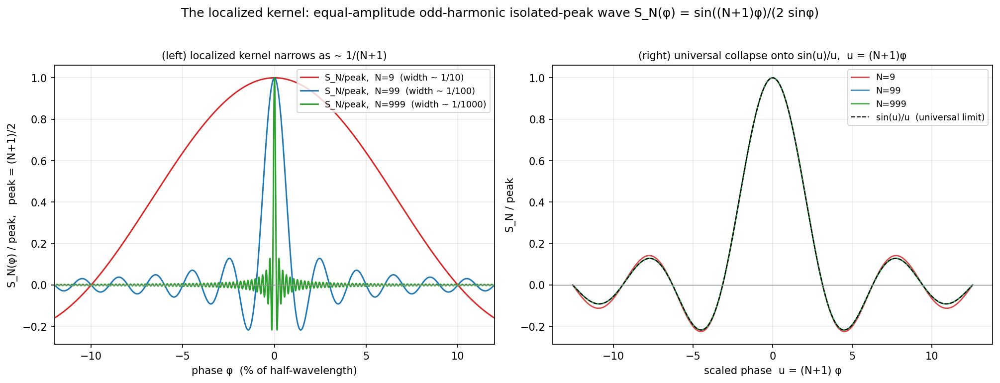
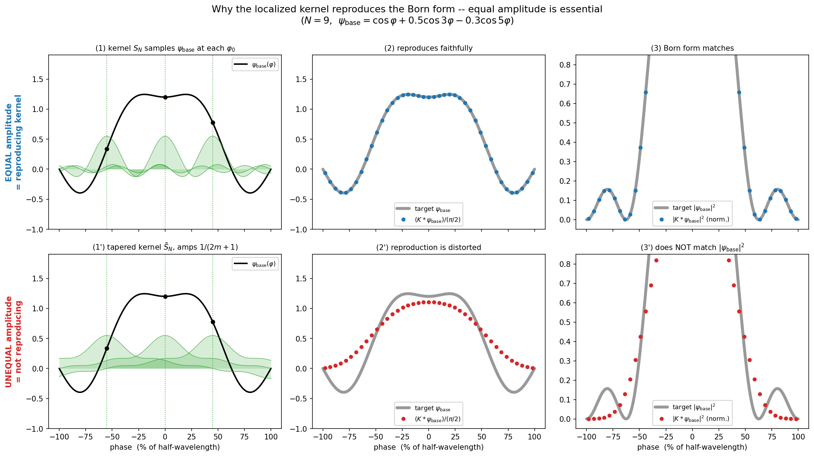
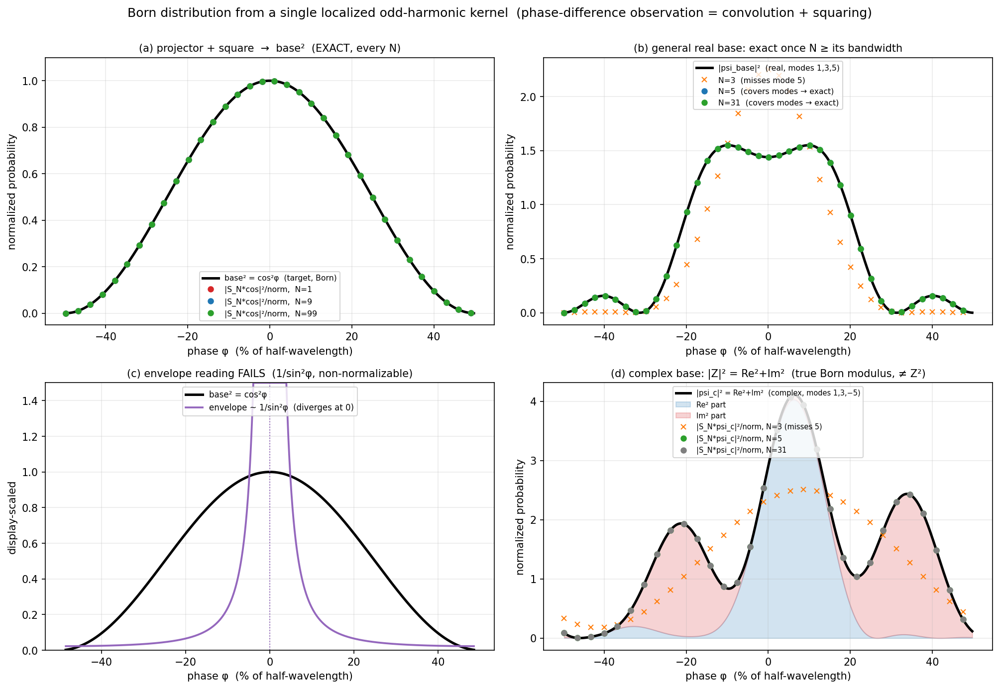

# 局在奇数倍音波の再生核性によるボルン分布の形の導出 ― 残す公準を二乗則とランダム性に絞る

**木原 範昭**
（査読対話ノート由来。本稿は確立物理の主張ではなく、数学的観察に一前提を加えたときの厳密な帰結の整理である。）

バージョン v0.1（2026-06-27）

---

## 要旨

量子力学において観測確率がベース波の二乗 $|\psi|^2$ で与えられるというボルン則は、標準理論では独立した公準として置かれる。本稿は、半波長位相区間 $\varphi\in[-\pi/2,\pi/2]$ 上の**一定振幅奇数倍音和**（孤立ピーク波）$S_N$ を観測の局在核とみなし、次の二つを**前提**として置く:(i) 観測は局在核による**位相差の畳み込み**であり、確率はその観測振幅の**二乗**である(振幅→確率の二乗則);(ii) 帯域より細かい位相差は観測されない(有限 $N$ 打ち切り)。このとき、$S_N$ が当該区間の奇数倍音基底の**切り詰め再生核**であることから、観測振幅が帯域制限ベース波 $\psi_{\rm base}$(厳密条件 $\mathrm{supp}(\hat\psi_{\rm base})\subseteq\{n\ \text{奇}:|n|\le N\}$)を**歪みなく再生**し、観測分布が **$|\psi_{\rm base}|^2$ に厳密に一致**する(規格化後)。ベース波が複素の場合にも、シフト核 $S_N(\varphi-\varphi_0)$ が複素奇数倍音基底の再生核であるため、二乗は真のモジュラス $|Z|^2=Z\bar Z\ (\ne Z^2)$ となり、実部・虚部のクロス構造を含む二乗となる。なお本稿が扱うのは配置空間上の量子力学のボルン則そのものではなく、**半波長区間・奇数倍音バンドモデル上での対応**である。用いる再生核の恒等式自体は古典的な Fourier 解析の事実(ディリクレ核／RKHS)であり、新規性は〈[2] の物理的局在波 $=$ 再生核 $=$ 観測モデル〉という写像にある。

本稿が**導出するのは分布の「形」**(再生核性による忠実再生)であり、**二乗則そのもの、および確率解釈は公準として残す**。したがって「ボルン則を導出した」「測定問題を解いた」とは主張しない。標準理論がボルン則 $|\psi|^2$ を一括で公準とするのに対し、本稿は分布の形を局在核の再生核性から導き、残す公準を「二乗則」と「ランダム性の存在」の二点に絞る、という射程の整理である。ランダム性の起源(なぜ単発が一点に出て試行ごとに散るか)は未解決であり、本稿はそこに触れない。

---

## 1. はじめに

ボルン則 $P(x)\propto|\psi(x)|^2$ は量子力学の予言力の中核でありながら、標準的定式化では基本公準として要請される。その「なぜ二乗か」「なぜ $|\psi|^2$ という形か」を導出しようとする試みには、ヒルベルト空間の測度論から二乗則を導く Gleason の定理 [3]、環境誘起不変性(envariance)から導く Zurek のアプローチ [4]、決定理論的導出 [7]、測定公準の operational 冗長性を論じる近年の仕事 [8] などがある。一方、ド・ブロイ＝ボーム理論 [5] とその量子平衡論 [6] は、初期分布として $|\psi|^2$ を仮定したうえで動力学的緩和を論じる。

本稿はこれらと**目的を異にする**。本稿は二乗則そのものの導出を**試みない**。代わりに、出発点論文 [2] が確立した単一の局在波(等振幅奇数倍音の孤立ピーク波)に「観測=位相差畳み込み＋二乗」という一前提を加えたとき、観測分布の**形**が何になるかを問う。結論は、その形が再生核性により $|\psi_{\rm base}|^2$ に**厳密に**一致するというものである。これにより、ボルン則の二乗構造のうち「形」の部分は自由な公準でなくなり、残す公準は「振幅→確率の二乗則」と「ランダム性の存在」の二点に縮減される。

本稿の貢献は控えめである:新しい物理法則の主張でも、新しい数学の主張でもない。用いる再生核の恒等式は古典的な Fourier 解析の事実(ディリクレ核の再生性／RKHS)であり、本稿の新規性はそこにはない。貢献は、〈文献 [2] の物理的局在波 $=$ その再生核 $=$ 観測のモデル〉という**写像**を立てると、一前提のもとでボルン分布の形が厳密に出る、という**観察**にある。誇張を避け、何が導かれ何が前提か(とくに循環でない理由)を各所で明示する(§3.1, §8, §9)。

---

## 2. 設定:局在核(孤立ピーク波)

### 2.1 孤立ピーク波

出発点論文 [2] の対象は、半波長区間 $\varphi\in[-\pi/2,\pi/2]$ 上の一定振幅奇数倍音和

$$
S_N(\varphi)=\sum_{m=0}^{(N-1)/2}\cos\big((2m+1)\varphi\big)=\frac{\sin((N+1)\varphi)}{2\sin\varphi}
$$

である($N$ は奇)。中央主ピーク $S_N(0)=(N+1)/2$、局在幅 $\sim 1/(N+1)$、ピーク規格化形は普遍的な $\sin u/u$($u=(N+1)\varphi$)に収束する(図1)。これらは [2] で厳密に確立済みであり、本稿の出発点とする。



**図1.** 局在核(等振幅奇数倍音の孤立ピーク波)$S_N(\varphi)=\sin((N+1)\varphi)/(2\sin\varphi)$。ピーク $(N+1)/2$ で規格化すると、(左)主ピーク幅が $\sim1/(N+1)$ で狭まり、(右)$u=(N+1)\varphi$ で普遍形 $\sin u/u$ に収束する。$N=9,99,999$。

### 2.2 基底の直交性と再生核性(鍵)

区間 $[-\pi/2,\pi/2]$ 上で奇数倍音余弦は直交する:

$$
\int_{-\pi/2}^{\pi/2}\cos((2m+1)\varphi)\cos((2m'+1)\varphi)\,d\varphi=\frac{\pi}{2}\,\delta_{mm'}.
$$

ゆえに $S_N$ は、この基底を**係数1で切り詰めた再生核(truncated reproducing kernel)**である。すべての係数が等しい(=振幅すべて1)ことが、再生核となる条件であり、[2] の「等振幅」という性質がここで本質的な役割を担う。等振幅でなければ再生核にならず、後述の忠実再生は成立しない。

**この恒等式自体は古典的事実である。** $S_N$ は奇数倍音バンドに適応したディリクレ型核であり、「帯域制限関数は同じバンドの再生核との畳み込みで忠実に再現される」ことは Fourier 解析の標準事実(ディリクレ核の再生性、帯域制限標本化、再生核ヒルベルト空間 RKHS)[10,11] にほかならない。本稿はこれを新発見として主張しない。むしろ本稿の新規性は恒等式そのものではなく、〈この核 $=$ 文献 [2] の物理的局在波 $=$ 観測のモデル〉という**写像**にある:観測核を恒等写像になるよう人為的に選んだのではなく、[2] が物理から独立に定めた局在波が**たまたま**この再生核に一致する、という対応が論点である(循環性は §3.1 で正面から扱う)。なお、後述 §4–5 のとおりこの核は**端効果を持たない**:再生は区間の**全域で点ごとに厳密**(境界 $\varphi_0=\pm\pi/2$ を含む)であり、通常の窓・打ち切り核に伴う端の劣化(ギブズ的にじみ)がない。これは各複素モードの再生積分が $\varphi_0$ に依らず厳密に閉じる(§5.1)ことの帰結である。

複素表示では、$\cos(n\varphi)=(e^{in\varphi}+e^{-in\varphi})/2$ により

$$
S_N(\psi)=\frac12\!\!\sum_{\substack{n\ \text{odd}\\|n|\le N}}\!\! e^{in\psi},
$$

すなわち $S_N$ は**複素奇数倍音基底** $\{e^{in\varphi}:n\ \text{odd}\}$ の切り詰め核でもある。この基底は当該区間で完全である:$\{e^{in\varphi}:n\ \text{odd}\}=e^{i\varphi}\cdot\{e^{i2m\varphi}:m\in\mathbb Z\}$ で、後者は長さ $\pi$ の区間で完全、$e^{i\varphi}$ は unimodular ゆえ完全性を保つ(偶関数も奇関数も表現可能)。この完全性が §5 の複素拡張を保証する。

---

## 3. 観測モデル(置く前提の明示)

本稿は観測を次のようにモデル化する。これは**導出ではなく前提モデル選択**であり、その旨を明示する。

**(i) 位相差のみが観測される ⇒ 局在核による畳み込み＋二乗。**
観測は局在核 $S_N$ をベース状態に走査(走査=畳み込み、差 $\varphi_0-\varphi$ にのみ依存)し、観測振幅の絶対値二乗を取る:

$$
P_N(\varphi_0)=\Big|\,(S_N*\psi_{\rm base})(\varphi_0)\,\Big|^2
=\Big|\int_{-\pi/2}^{\pi/2}S_N(\varphi_0-\varphi)\,\psi_{\rm base}(\varphi)\,d\varphi\Big|^2 .
$$

このモデル化の operational な動機は、局在参照波との重なりを読むマッチトフィルタ／ヘテロダイン検波にある。原子時計のラムゼー計量が「周波数=参照発振器との相対位相(ビート)の読み出し」であること [9] は、「観測=位相差・参照照合」の operational な接地を与える。ただし、**測定をこの局在核で表すこと自体は前提**である(測定基底／POVM を局在波族に取る、という選択)。本稿はこれを導出と偽らない。

**(ii) 観測できない位相差は無視 ⇒ 有限 $N$ 打ち切り。**
帯域より細かい位相差は観測に寄与しないとして、核を有限 $N$ で打ち切る。$N$ がベース波の帯域を覆えば、後述のとおり再生は厳密になる。

**二乗則について(本稿の核心的限定)。** 上記 (i) の「二乗」は前提である。畳み込み結果 $Z$ が実数の場合 $\bar Z=Z$ ゆえ $|Z|^2=Z^2$ となり、二乗のべき(指数2)は独立には導かれない。本稿が厳密に**導く**のは、二乗を取るならその結果が他の形に歪まず**ちょうど** $|\psi_{\rm base}|^2$ になる、という**形**の部分である。二乗則(振幅→確率)と確率解釈は公準として残す。確率密度として読むには $\int_{-\pi/2}^{\pi/2}|\psi_{\rm base}|^2\,d\varphi<\infty$(帯域制限ゆえ自明)を仮定する。

### 3.1 循環性への回答

想定される最強の反論は次である:「観測を再生核との畳み込み(=恒等写像)と置いたのだから、$|\psi|^2$ を仮定して $|\psi|^2$ を得ただけではないか。」これに正面から答える。鍵は、**歪みうる自由度**と**公準として認めるもの**を分離することにある。

- **核の形は自由度であり、恒等写像になるよう選んだのではない。** 一般の核(振幅が不揃いの奇数倍音和 $\sum_m a_m\cos((2m+1)\varphi)$、または別の窓)はベース波を**歪めて**再生する(モード係数 $c_m$ が $a_m c_m$ に化け、$a_m\not\equiv$ const なら形が変わる)。歪まないのは振幅がすべて等しいとき**だけ**であり、その等振幅核こそ文献 [2] が物理から独立に導いた局在波である。したがって「恒等写像」は仮定ではなく、**[2] の物理的局在波が再生核に一致するという事実の帰結**である。さらに §6 の否定対照(包絡読みは $1/\sin^2$ で非可積分)は、形の操作化として「射影＋二乗」が一意であることを独立に支える。
- **公準として残すのは二乗のべきだけである。** 上の議論は「形が歪まない」ことを保証するが、振幅を確率へ変える**二乗則(指数2)**は導かない。役割分担を明示すると:§4–§6 は**形**($|\cdot|$ の中身 $=\psi_{\rm base}$、および射影 vs 包絡の選択)を確定するが、**べき 2** は §3 で公準として宣言したものである。

要するに、循環があるとすれば**二乗則の部分だけ**であり、そこは初めから公準と明言している。本稿が新たに**導く**のは「形が歪まないこと」であって、これは核選択という実在の自由度に対する非自明な帰結(等振幅でなければ成り立たない)である。



**図2(機構).** なぜ再生されるのか、そして等振幅が本質である理由。同じベース波 $\psi_{\rm base}=\cos\varphi+0.5\cos3\varphi-0.3\cos5\varphi$($N=9$)で、(上段)等振幅核 $S_N$(=再生核)は各 $\varphi_0$ でベース波を標本化し((1))、歪みなく再生((2))、二乗して $|\psi_{\rm base}|^2$ に一致((3))。(下段)振幅を $1/(2m+1)$ にテーパーした非等振幅核 $\tilde S_N$ は、同じ手順で再生が**歪み**((2′))、$|\psi_{\rm base}|^2$ に**一致しない**((3′))。数値でも再生偏差は等振幅 $\sim10^{-16}$(機械精度)に対し非等振幅 $0.53$。循環でない理由(§3.1)を、核選択という実在の自由度に対して可視化したもの。

---

## 4. 主結果:再生核性による形の忠実再生(実・偶ベース)

### 4.1 核の恒等式(記号計算で厳密)

最低奇数倍音 $\cos\varphi$ をベース波とする。核の恒等式

$$
\int_{-\pi/2}^{\pi/2}\cos\big((2m+1)(\varphi_0-\varphi)\big)\cos\varphi\,d\varphi=\frac{\pi}{2}\cos\varphi_0\cdot\delta_{m,0}
$$

が成り立つ。$m\ge1$ はすべて直交性によりゼロ、$m=0$(基本波)だけが生き残る。`sympy` による記号積分で $m=0,\dots,4$ を確認し、$m=0$ が $\pi\cos\varphi_0/2$、他はゼロであることを厳密に得た(付録 A)。

### 4.2 射影＋二乗 = ベース波の二乗(全 $N$ で厳密)

恒等式から、$S_N$ のどの項も $m\ge1$ は消え、

$$
\boxed{\;(S_N*\cos)(\varphi_0)=\frac{\pi}{2}\cos\varphi_0
\quad\Longrightarrow\quad
\big|(S_N*\cos)(\varphi_0)\big|^2=\frac{\pi^2}{4}\cos^2\varphi_0\;}
$$

が**すべての奇 $N\ge1$ で厳密**に成り立つ。$N\to\infty$ の極限は不要で、しかも $\varphi_0$ の**全域(境界を含む)で点ごとに厳密**である(端効果なし。§5.1 のとおり再生積分が $\varphi_0$ に依らず閉じるため、通常の打ち切り核に見られる端の劣化がない)。数値検証では $N=1,9,31,99$ すべてで規格化後の偏差 $\sim10^{-16}$(機械精度、表1)。図3(a)に、$N=1,9,99$ の点がすべて目標曲線 $\cos^2\varphi_0$ 上に乗る様子を示す。

### 4.3 一般の(実・偶)帯域制限ベース波

$\psi_{\rm base}=\sum_m c_m\cos((2m+1)\varphi)$($c_m\in\mathbb R$)に対し、$N$ がその最高次数を覆えば(厳密条件 $\mathrm{supp}(\hat\psi_{\rm base})\subseteq\{n\ \text{奇}:|n|\le N\}$)

$$
\big|(S_N*\psi_{\rm base})(\varphi_0)\big|^2=\frac{\pi^2}{4}\,|\psi_{\rm base}(\varphi_0)|^2 .
$$

数値検証($\psi_{\rm base}=\cos\varphi+0.5\cos3\varphi-0.3\cos5\varphi$、最高次数 5):バンド条件を満たす $N\ge5$ で偏差 $\sim10^{-15}$、$N<5$ は第5モードがバンド外となり取りこぼし不一致(図3(b)、表1)。前提 (ii)「観測できない位相差は無視」=打ち切りが帯域を覆えば厳密、という対応が数値で確認される。

---

## 5. 複素拡張:真のボルン・モジュラス $|Z|^2=Z\bar Z\ne Z^2$

§4 のベース波は奇数倍音**余弦**のため偶・実に限られ、その場合 $|Z|^2=Z^2$ となってボルン則本来の複素構造(実部・虚部のクロス項)が現れない。これは退化ケースである。本節は、シフト核 $S_N(\varphi-\varphi_0)$ が**複素**奇数倍音基底の再生核であることを用いて、複素ベース波へ厳密に拡張する。

### 5.1 モードごとの再生(核心)

複素モード $\psi(\varphi)=e^{ik\varphi}$($k$ odd, $|k|\le N$)に対し、§2.2 の表示と直交関係

$$
\int_{-\pi/2}^{\pi/2}e^{i(k-n)\varphi}\,d\varphi=\pi\,\delta_{n,k}\qquad(k-n\ \text{は偶数ゆえ}\ \sin((k-n)\pi/2)=0)
$$

を用いると、

$$
(S_N*e^{ik\cdot})(\varphi_0)=\frac12\sum_{n}e^{-in\varphi_0}\!\int_{-\pi/2}^{\pi/2}\!e^{i(k-n)\varphi}d\varphi
=\frac{\pi}{2}\,e^{ik\varphi_0}.
$$

線形性より、帯域制限複素波 $\psi_{\rm base}=\sum_{|k|\le N}c_k e^{ik\varphi}$($c_k\in\mathbb C$)に対し

$$
\boxed{\;(S_N*\psi_{\rm base})(\varphi_0)=\frac{\pi}{2}\,\psi_{\rm base}(\varphi_0)
\quad\Longrightarrow\quad
\big|(S_N*\psi_{\rm base})(\varphi_0)\big|^2=\frac{\pi^2}{4}\,|\psi_{\rm base}(\varphi_0)|^2
=\frac{\pi^2}{4}\big(\mathrm{Re}^2+\mathrm{Im}^2\big)\;}
$$

が厳密に成り立つ。

### 5.2 帰結

$\psi_{\rm base}$ が複素なら畳み込み結果も複素となり、二乗は **$|Z|^2=Z\bar Z\ne Z^2$** の真のモジュラスとなる。数値検証($\psi_c=e^{i\varphi}+(0.5-0.3i)e^{i3\varphi}+(0.2+0.4i)e^{-i5\varphi}$):$N\ge5$ で $|conv|^2/\mathrm{norm}$ が $|\psi_c|^2=\mathrm{Re}^2+\mathrm{Im}^2$ に偏差 $\sim10^{-15}$ で一致(図3(d)、表1)。さらに純複素モード $\psi=e^{i\varphi}$ では $|Z|^2/\mathrm{norm}=1$(定数 $=\cos^2+\sin^2$)である一方、$Z^2$ は $e^{2i\varphi_0}$ として振動する($\max|\mathrm{Im}(Z^2)|=1$)ことを確認し、ここでの二乗が $(\cdot)^2$ ではなく $|\cdot|^2$ であることを明示した。

したがって、射程を「偶・実」に狭める必要はない。手法は半波長区間上の(複素)$L^2$ ベース波、奇数倍音展開に対して成立する。曖昧な「任意のベース波」という表現は用いず、スコープをこの形で明記する。

---

## 6. 否定対照:包絡読みは確率になりえない

「速い振動 $\sin^2((N+1)\varphi)$ を平均($\to1/2$)して包絡を観測分布とみなす」読みは、観測重みが $\propto 1/((N+1)\sin\varphi)^2$ となり、中心 $\varphi=0$ で $1/\varphi^2$ 発散して**規格化すらできない**(確率分布になりえない)。形も $1/\sin^2$ で $\cos^2$ とは別物である(図3(c))。これにより、二前提の正しい操作化が包絡平均ではなく**射影＋二乗**であることが確定し、本稿の観測モデルの選択が恣意でないことが補強される。



**図3.** 局在核による位相差畳み込み＋二乗が、ベース波のボルン分布 $|\psi_{\rm base}|^2$ を再現する。(a) base=$\cos$ で射影＋二乗が全 $N$($=1,9,99$)で $\cos^2$ に厳密一致。(b) 一般実ベース(モード1,3,5)は $N\ge5$ で厳密、$N=3$ は第5モード取りこぼし。(c) 否定対照=包絡 $1/\sin^2$ は中心発散・非規格化で $\cos^2$ と別物。(d) 複素ベースで $|Z|^2=\mathrm{Re}^2+\mathrm{Im}^2$ の真のモジュラス($N=5,31$ が一致、$N=3$ は取りこぼし)。横軸は半波長の % 表示。

---

## 7. 機構の透明化:sin 成分の役割

シフト核は $S_N(\varphi_0-\varphi)=\sum_m\big[\cos\cdot\cos+\sin\cdot\sin\big]$ と分解でき、再生核($\cos\cos$ 部)に $\sin\cdot\sin$ 部を加えたものである。

- **偶・実ベース(§4)**:$\sin$ 倍音は偶関数 $\psi_{\rm base}$ に対し奇×偶=奇となり、対称区間で積分ゼロ。$\cos$ 倍音のみが再生に寄与する。これが「相殺」の正体であり、この退化ケースで $|Z|^2=Z^2$ となる。
- **一般・複素ベース(§5)**:$\sin$ 倍音は**消えず、奇部／虚部を再生**する。モードごとの再生 $(S_N*e^{ik\varphi})(\varphi_0)=(\pi/2)e^{ik\varphi_0}$ が、$\cos$／$\sin$ 両成分の役割を透明に示す。

数値的にも、実だが奇成分を持つ波 $\psi=\cos\varphi+0.7\sin\varphi$ で、$\sin$ 倍音が奇部 $0.7\sin\varphi$ を正しく再生し相殺されないことを確認した($N=1,9$ で偏差 $\sim10^{-16}$、表1)。

---

## 8. 数値検証

`born_from_localization.py` は記号計算(`sympy`)・数値畳み込み・否定対照・複素拡張を含み、本稿の全結果を機械精度で再現する。

**表1. 規格化後偏差の最大値(全テストで機械精度一致)**

| テスト | ベース波 | 条件 | $\max$ 偏差 |
|:--|:--|:--|:--|
| §4.2 射影＋二乗 | $\cos\varphi$(実・偶) | $N=1,9,31,99$ すべて | $\sim3\times10^{-16}$ |
| §4.3 一般(実) | $\cos+0.5\cos3-0.3\cos5$ | $N\ge5$ | $\sim10^{-15}$ |
| §4.3 取りこぼし | 同上 | $N=3$(第5モード欠) | $O(1)$ 不一致 |
| §5 複素 | $e^{i\varphi}+(0.5{-}0.3i)e^{i3\varphi}+(0.2{+}0.4i)e^{-i5\varphi}$ | $N\ge5$ | $\sim2\times10^{-15}$ |
| §5.2 $|Z|^2\ne Z^2$ | $e^{i\varphi}$ | $|Z|^2{=}1$ 一定, $Z^2$ 振動 | — |
| §7 奇成分 | $\cos\varphi+0.7\sin\varphi$ | $N=1,9$ | $\sim9\times10^{-16}$ |
| §6 否定対照 | 包絡 $1/\sin^2$ | 中心発散 | 非規格化(破綻) |

---

## 9. 考察 ― 何が導かれ、何が前提か

各要素の役割を切り分ける:

- **等振幅奇数倍音(出発点 [2] の性質)** = 切り詰め再生核 ⇒ 畳み込みがベース波を**そのまま再生**。等振幅でないと再生核にならず再現しない。[2] の「振幅すべて1」がここで必然となる。
- **「位相差しか観測できない」(前提 (i))** = 差への畳み込み ＋ 二乗($Z\bar Z$) ⇒ 分布を $\psi$ でなく $|\psi|^2$ にする。
- **「観測できない位相差は無視」(前提 (ii))** = 有限 $N$ 打ち切り ⇒ 帯域を覆えば厳密。

**導出されたもの(数学的事実、追加仮定なし)**:観測分布の**形** $|\psi_{\rm base}|^2$ が、再生核性から厳密に出る。複素ベースでは実部・虚部のクロス項を含む真のモジュラスとして出る。

**前提として残るもの**:(a) 振幅→確率の**二乗則**(指数2は独立には導かれない);(b) 観測を局在核の畳み込みで表す**測定モデル**(POVM／測定基底の選択);(c) **ランダム性の存在**(なぜ単発が一点に出て試行ごとに散るか)。とくに (c) は本稿が触れない未解決問題である。

先行研究との対比:Gleason [3]・Zurek [4]・決定理論的導出 [7] は、二乗則そのものを深い仮定(測度論的非文脈性／envariance／合理的選好)から**導出**しようとする。本稿はそれを試みず、**二乗則を公準として残し、その下で分布の形が再生核性により $|\psi_{\rm base}|^2$ に一致することのみ**を示す。ド・ブロイ＝ボーム [5]／量子平衡 [6] が初期分布 $|\psi|^2$ を仮定するのと比べ、本稿の残す前提(位相差観測＝自己照合)は原子時計計量 [9] に operational に接地するが、依然として公準であることに変わりはない。

したがって正確な主張は:

> 「観測は局在核による位相差畳み込みであり、確率はその振幅の二乗である」を**公準**として置くと、等振幅奇数倍音局在波の再生核性により、観測分布が半波長区間上の(複素)帯域制限ベース波の $|\psi_{\rm base}|^2$ に**厳密一致**する。ボルン則の二乗の**形**は局在核から導かれ、残す公準は「二乗則」と「ランダム性の存在」に絞られる。

---

## 10. 結論

本稿は、単一の局在核(等振幅奇数倍音の孤立ピーク波 [2])と「観測=位相差畳み込み＋二乗」という一前提から、観測分布の形がベース波の(規格化後の)分布 $|\psi_{\rm base}|^2$ に厳密一致することを、再生核性により示した。複素ベースでは二乗が真のモジュラス $|Z|^2=Z\bar Z\ne Z^2$ となり、半波長区間・奇数倍音バンドモデル上でボルン則の複素構造に対応する。他の枠組みは不要で、単一の局在核と二前提で完結する。

本稿は「ボルン則を導出した」のでも「測定問題を解いた」のでもない。**ボルン則の二乗構造のうち「形」を局在核の再生核性から導き、残す公準を「二乗則」と「ランダム性の存在」に絞った**、という射程の縮減である。標準理論がボルン則を一括公準とするのに対し、公準が一段軽い。ランダム性の起源は未解決のまま残る。

---

## 付録 A:核の恒等式の `sympy` 出力

```
I_m(phi0) = ∫_{-π/2}^{π/2} cos((2m+1)(phi0−phi)) cos(phi) dphi
  m=0:  pi*cos(phi0)/2
  m=1:  0
  m=2:  0
  m=3:  0
  m=4:  0
```

$m=0$ のみ $(\pi/2)\cos\varphi_0$、$m\ge1$ はすべてゼロ(直交性)。ゆえに全奇 $N$ で $(S_N*\cos)(\varphi_0)=(\pi/2)\cos\varphi_0$。

## 付録 B:再現

```bash
python3 born_from_localization.py     # 記号＋数値＋否定対照＋複素拡張(機械精度)
python3 born_fig2.py                   # 図1 (born_localization_kernel.png/svg, 局在核の収束)
python3 born_mechanism.py              # 図2 (born_mechanism.png/svg, 機構:等振幅 vs 非等振幅)
python3 born_fig.py                    # 図3 (born_from_localization.png/svg, 4パネル)
```

## 図(一覧)

本文では図1を §2.1 直後、図2を §3.1 直後、図3を §6 直後に掲載した(初出順に採番)。掲載ファイルは以下(PNG=表示用、SVG=ベクター原本)。

- **図1**(核の性質):`born_localization_kernel.png` / `.svg`。局在核 $S_N$ がピーク規格化で(左)幅 $\sim1/(N+1)$ に狭まり、(右)$u=(N+1)\varphi$ で普遍形 $\sin u/u$ に収束。出発点論文 [2] の図と整合。
- **図2**(機構):`born_mechanism.png` / `.svg`。等振幅核は標本化→歪みなく再生→二乗で $|\psi_{\rm base}|^2$ に一致(上段)、非等振幅核 $1/(2m+1)$ は同手順で歪み不一致(下段)。§3.1 の「歪まないのは等振幅だけ」を視覚化。再生偏差 等振幅 $\sim10^{-16}$ / 非等振幅 $0.53$。
- **図3**(再生の検証):`born_from_localization.png` / `.svg`。(a) base=$\cos$ で射影＋二乗が全 $N$ で $\cos^2$ に厳密一致;(b) 一般実ベース(モード1,3,5)は $N\ge5$ で厳密、$N=3$ は取りこぼし;(c) 否定対照=包絡 $1/\sin^2$ が中心発散・非規格化;(d) 複素ベースで $|Z|^2=\mathrm{Re}^2+\mathrm{Im}^2$ の真のモジュラス($N=5,31$ が一致、$N=3$ は取りこぼし)。

## 参考文献

[1] M. Born, "Zur Quantenmechanik der Stoßvorgänge," *Z. Phys.* **37**, 863 (1926).
[2] 木原 範昭, 「半波長位相区間における一定振幅奇数倍音和の孤立ピーク波」, Zenodo, v0.4 (2026-06-25), DOI: 10.5281/zenodo.20833097.
[3] A. M. Gleason, "Measures on the closed subspaces of a Hilbert space," *J. Math. Mech.* **6**, 885 (1957).
[4] W. H. Zurek, "Probabilities from entanglement, Born's rule $p_k=|\psi_k|^2$ from envariance," *Phys. Rev. A* **71**, 052105 (2005).
[5] D. Bohm, "A Suggested Interpretation of the Quantum Theory in Terms of 'Hidden' Variables. I, II," *Phys. Rev.* **85**, 166, 180 (1952).
[6] A. Valentini and H. Westman, "Dynamical origin of quantum probabilities," *Proc. R. Soc. A* **461**, 253 (2005).
[7] D. Deutsch, "Quantum theory of probability and decisions," *Proc. R. Soc. A* **455**, 3129 (1999); D. Wallace, *The Emergent Multiverse* (Oxford, 2012).
[8] L. Masanes, T. Galley, M. Müller, "The measurement postulates of quantum mechanics are operationally redundant," *Nat. Commun.* **10**, 1361 (2019).
[9] N. F. Ramsey, "A Molecular Beam Resonance Method with Separated Oscillating Fields," *Phys. Rev.* **78**, 695 (1950)(参照計量としてのラムゼー／ヘテロダイン位相読み出し)。
[10] E. M. Stein and R. Shakarchi, *Fourier Analysis: An Introduction* (Princeton Univ. Press, 2003)(ディリクレ核と帯域制限関数の再生・標本化);Y. Katznelson, *An Introduction to Harmonic Analysis*, 3rd ed. (Cambridge Univ. Press, 2004).
[11] N. Aronszajn, "Theory of reproducing kernels," *Trans. Amer. Math. Soc.* **68**, 337 (1950)(再生核ヒルベルト空間 RKHS)。

---

*(本稿は査読対話ノート(木原範昭 × アイリス, 2026-06-27)に由来する。確立物理の主張ではなく、数学的観察＋明示された前提の帰結である。論文は単一の局在核と二前提で完結し、ランダム性の起源は未解決と明記する。検証コード `born_from_localization.py` が全結果を機械精度で再現する。)*
