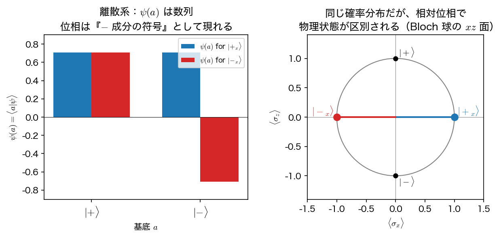
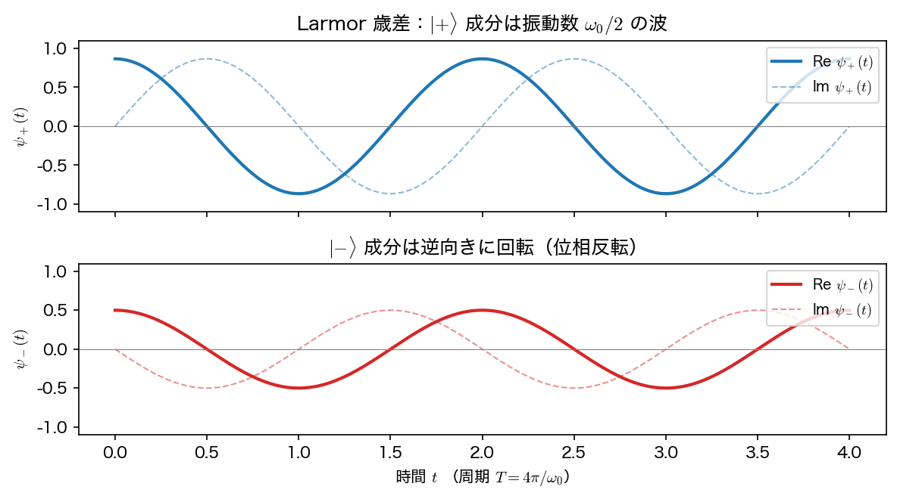
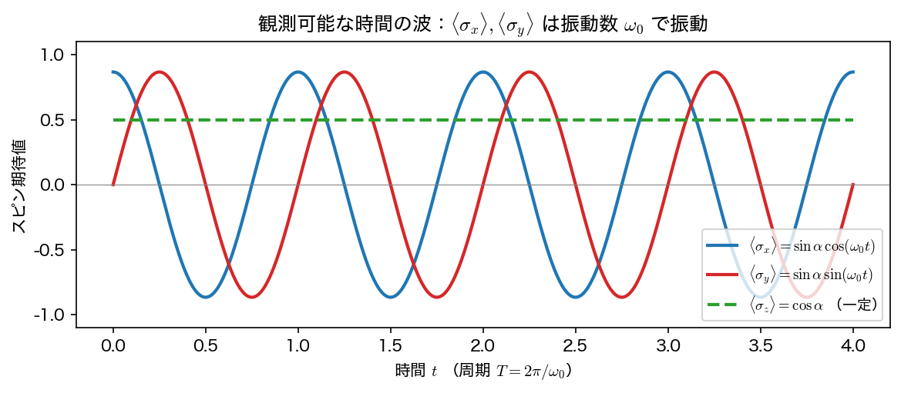
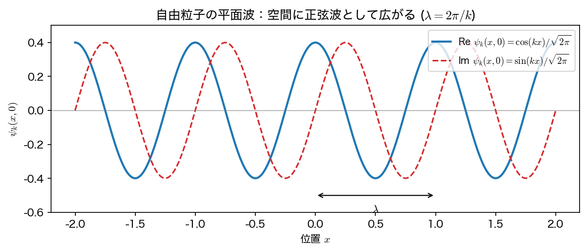
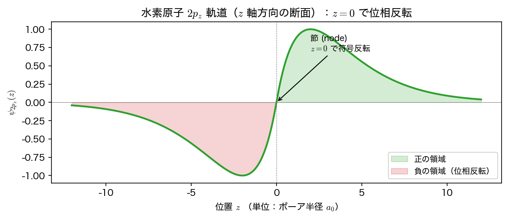
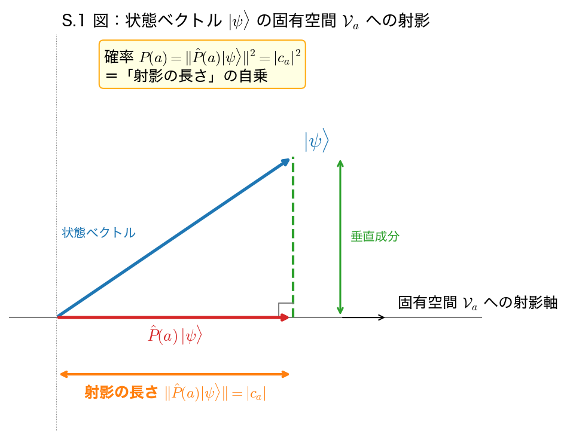
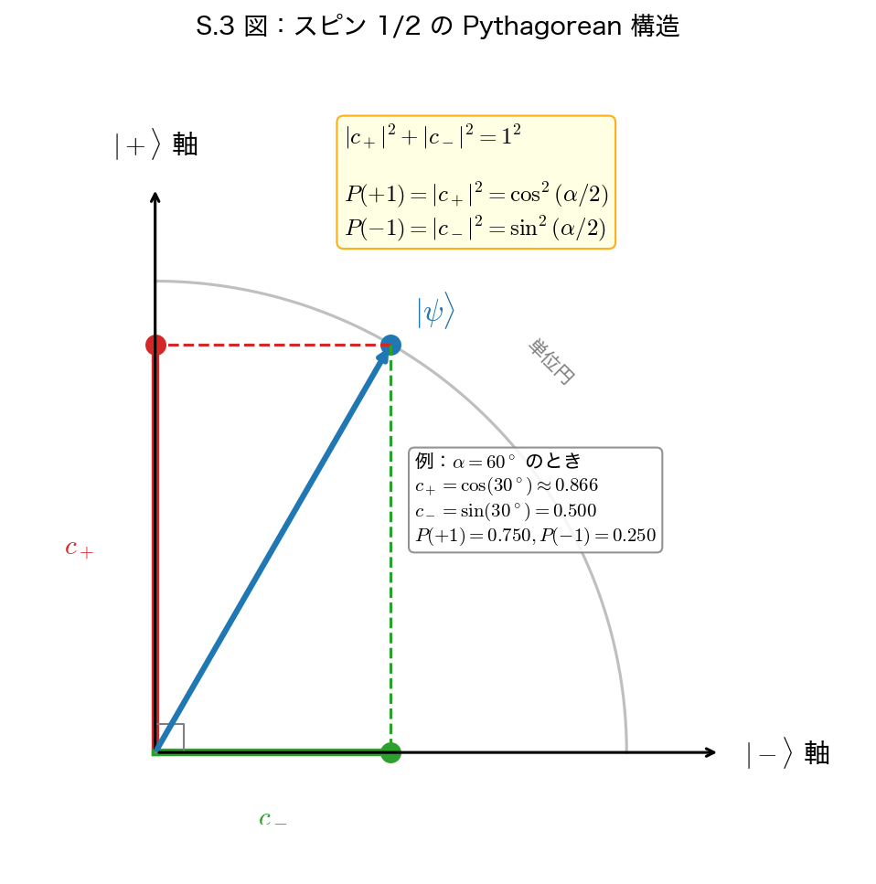
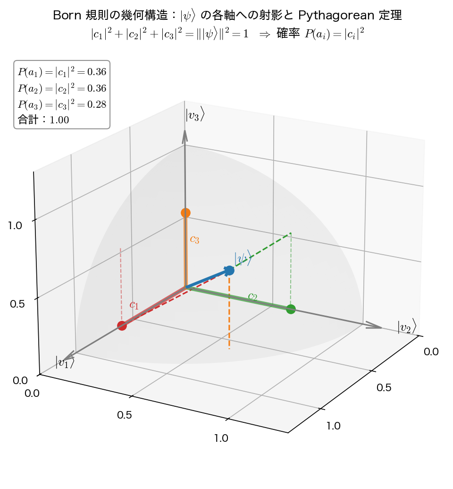

44
# 第3章 閉じた有限自由度系の純粋状態の量子論

## 3.6 自己共役演算子の固有値
自己共役演算子の固有値の性質を調べよう。a) と (3.28) の内積をとり、左右入れ替えると、$a\langle a|a\rangle=\langle a|\hat{A}|a\rangle$ を得るが、これの複素共役をとると、(3.45)より $a^{*}\langle a|a\rangle=\langle a|\hat{A}|a\rangle^{*}=\langle a|\hat{A}^{\dagger}|a\rangle$。従って、もしも$\hat{A}$が自己共役であれば、$a^{*}\langle a|a\rangle=a\langle a|a\rangle$ を得る。$\langle a|a\rangle\ne0$ だから、これは $a^{*}=a$ を意味する。故に、

**定理 3.1** 自己共役演算子の固有値は、全て実数である。

この定理から、自己共役演算子の固有値の全体は、いろいろな値の実数の集合をなすが、これを、$\hat{A}$ の固有値スペクトルと呼ぶ。例えば、p.39の例 3.6では、$\hat{\sigma}_{y}$ が自己共役だから固有値が実数だったのであり、$\hat{\sigma}_{y}$ 固有値スペクトルは、{-1, +1} である。
* 固有値スペクトルの中に、{-1, 0, +1} とか {1/2, 1/3, 1/4} のように値が飛び飛びの(離散的な)部分があるとき、その部分は離散スペクトル (discrete spectrum) をなすと言う。
* 一方、-1から+1までの全ての実数 [-1, +1] のように、連続した実数よりなる部分があれば、その部分は連続スペクトル (continuous spectrum) をなすと言う。
* 離散スペクトルに属する固有値を離散固有値 (discrete eigenvalue)、連続スペクトルに属する固有値を連続固有値(continuous eigenvalue) と言う。例えば $\hat{\sigma}_{y}$ の固有値+1は離散固有値である。

**例3.8** 水素原子のエネルギー演算子の固有値は、$E=-R/n^{2}$ (nは自然数、Rは正の定数)という離散固有値と、$0\le E<+\infty$ なる連続固有値とからなる。つまり、$E=0$ を境に、離散スペクトル $\{E|E=-R/n^{2},n=1,2,\dots\}$ と連続スペクトル $\{E|0\le E<+\infty\}$ とに分かれている。■

$\hat{A}$を2つの固有ベクトル a), a') で挟めば、$\langle a|\hat{A}|a^{\prime}\rangle=a^{\prime}\langle a|a^{\prime}\rangle$ を得るが、もしも$\hat{A}$が自己共役であれば、$\langle a|\hat{A}|a^{\prime}\rangle=\langle\hat{A}a|a^{\prime}\rangle=a\langle a|a^{\prime}\rangle$ と変形できる。ゆえに、$(a-a^{\prime})\langle a|a^{\prime}\rangle=0$。従って、$a\ne a^{\prime}$なら $\langle a|a^{\prime}\rangle=0$ である。故に、

45
**定理 3.2** 自己共役演算子の相異なる固有値に属する固有ベクトルは、直交する。ゆえに、p.35の問題3.1 より線形独立である。従って、相異なる固有値の数は、$\dim\mathcal{H}$以下である。従って、$\dim\mathcal{H}$が有限であれば、離散スペクトルしか現れない。

例えば、$\hat{\sigma}_{y}$ は有限次元 (2次元)のヒルベルト空間の上の演算子だから、固有値スペクトルは離散スペクトルになったのである。一方、後で出てくる、運動量演算子の固有値スペクトルは、$\{p|-\infty<p<+\infty\}$ という連続スペクトルになり、それが作用するヒルベルト空間は無限次元になる。

---

## 補講：例 3.8（水素原子）の「離散＋連続」スペクトルは $\mathbb{C}^N$ と $\mathbb{C}^\infty$ の混在ではない

### この補講の動機

例 3.8 で、水素原子のエネルギー演算子 $\hat{H}$ の固有値スペクトルが、

- 離散部分：$E_n = -R/n^2$ ($n=1,2,3,\dots$)
- 連続部分：$0 \le E < +\infty$

と「分かれている」と書かれている。これを初めて読むと、

> 離散スペクトルは有限次元 $\mathbb{C}^N$ の話で、連続スペクトルは無限次元 $\mathbb{C}^\infty$ の話だから、水素原子では $\mathbb{C}^N$ と $\mathbb{C}^\infty$ が**同じ系の中で同居している**のではないか？

という疑問が生じやすい。これは典型的な誤解で、本書の 3.7 節（離散固有値）→ 3.15 節（連続固有値）と進むあいだに自然に解消されるのだが、3.6 節の段階で先に明示しておいた方が混乱が少ない。結論を先に書けば：

> **$\hat{H}$ が住んでいるヒルベルト空間 $\mathcal{H}$ は、最初から最後まで「同一の可分無限次元ヒルベルト空間」1 つであり、$\mathbb{C}^N$ と $\mathbb{C}^\infty$ が混ざっているわけではない。混ざっているのは「固有値の並び方」だけである。**

以下、3 つの誤解候補を順に整理する。

### S.1 「離散スペクトル」≠ 「$\mathbb{C}^N$」

定理 3.2 の末尾「$\dim\mathcal{H}$ が有限であれば、離散スペクトルしか現れない」は、**逆は成り立たない**点に注意が必要である。すなわち、

- $\dim\mathcal{H} < \infty$ ⇒ 離散スペクトルのみ（これは正しい）
- 離散スペクトルのみ ⇒ $\dim\mathcal{H} < \infty$ （これは**誤り**）

例 3.8 の離散部分 $E_n = -R/n^2$ は $n = 1, 2, 3, \dots$ と**可算無限個**の値をとる。さらに各 $n$ には軌道角運動量 $\ell$ と磁気量子数 $m$ の縮退があり、束縛状態だけ集めても**可算無限個**の固有ベクトルが必要になる。だから

$$\mathcal{H}_{\text{bound}} \equiv \overline{\mathrm{span}\{|\varphi_{n\ell m}\rangle\}} \cong \mathbb{C}^\infty \quad (\text{可算無限次元})$$

である。つまり「離散」というのは「固有値の値が孤立している（飛び飛び）」という意味であって、「**有限個**」という意味ではない。

| よくある誤解 | 正しい区別 |
|---|---|
| 離散スペクトル ↔ $\mathbb{C}^N$（有限次元）| 離散スペクトル ↔ 固有値が**孤立点**として並ぶ |
| 連続スペクトル ↔ $\mathbb{C}^\infty$（無限次元）| 連続スペクトル ↔ 固有値が**実数の区間**を埋める |

次元（$\dim\mathcal{H}$）の話と、スペクトルの**並び方**の話は、独立した別の概念である。

### S.2 ヒルベルト空間自体は 1 つの $\mathbb{C}^\infty$ で固定

水素原子の量子力学では、最初に $\mathcal{H} = L^2(\mathbb{R}^3)$ を選ぶ。これは**可分**（=可算正規直交基底をもつ）無限次元ヒルベルト空間で、可分無限次元ヒルベルト空間はすべて互いに同型なので、抽象的には $\mathbb{C}^\infty$（$\ell^2$）と同じものである。

この**唯一の** $\mathcal{H}$ の上に、運動量演算子 $\hat{p}$、位置演算子 $\hat{x}$、ハミルトニアン $\hat{H}$ などが**すべて同じヒルベルト空間の上の演算子として**並んで住んでいる。

水素原子 $\hat{H}$ の特殊性は、**1 つの演算子のスペクトルの中に離散部分と連続部分が共存する**点であって、空間自体が 2 つに分かれているわけではない。

### S.3 演算子は依然として「$\infty \times \infty$ 行列」

$\mathcal{H}$ に何か可算正規直交完全系 $\{e_n\}_{n=1}^\infty$（CONB）を 1 つ固定すれば、任意の自己共役演算子 $\hat{A}$ は

$$A_{mn} \equiv \langle e_m|\hat{A}|e_n\rangle$$

という**$\infty \times \infty$ エルミート行列**として表現できる。これは水素原子 $\hat{H}$ についても同様である。

ただし、$\mathbb{C}^N$（有限次元）と $\mathbb{C}^\infty$（無限次元）で本質的に違う点が 1 つだけある：

| | $\mathbb{C}^N$ | $\mathbb{C}^\infty$ |
|---|---|---|
| エルミート行列の対角化 | 必ず CONB の固有ベクトルで対角化可能 | スペクトルの型による |
| 固有ベクトルの所属 | 必ず $\mathcal{H}$ の中 | 離散固有値の固有ベクトルは $\mathcal{H}$ の中／連続固有値の「固有ベクトル」は $\mathcal{H}$ の外（汎関数）|
| 完全性関係 | $\sum_n \lvert e_n\rangle\langle e_n\rvert = \hat{1}$（有限和）| 場合により $\sum + \int$ の併用が必要 |

水素原子 $\hat{H}$ は最後の行の典型例で、

$$\underbrace{\sum_{n\ell m}|\varphi_{n\ell m}\rangle\langle\varphi_{n\ell m}|}_{\text{束縛状態（離散）}} + \underbrace{\sum_{\ell m}\int_0^\infty dE\,|\psi_{E\ell m}\rangle\langle\psi_{E\ell m}|}_{\text{散乱状態（連続）}} = \hat{1}_{L^2(\mathbb{R}^3)}$$

という形で完全性関係が成立する。この $\hat{1}_{L^2(\mathbb{R}^3)}$ は**ただ 1 つの可分無限次元ヒルベルト空間上の恒等演算子**であって、$\mathbb{C}^N$ 部分と $\mathbb{C}^\infty$ 部分の直和になっているわけではない。

### S.4 「混ざっている」のは何か

整理すると：

| 何の話か | カーディナリティ | $\mathbb{C}^?$ |
|---|---|---|
| $\mathcal{H} = L^2(\mathbb{R}^3)$ 全体 | 可算無限次元 | $\mathbb{C}^\infty$ |
| 束縛状態の張る部分空間 $\mathcal{H}_{\text{bound}}$ | 可算無限次元 | $\mathbb{C}^\infty$ |
| 散乱状態の張る部分空間 $\mathcal{H}_{\text{scatt}}$ | 可算無限次元 | $\mathbb{C}^\infty$ |
| 離散固有値の**個数** | 可算無限個 | (次元の話ではない) |
| 連続固有値の**個数** | 連続濃度 | (次元の話ではない) |

下 2 行と上 3 行は**別カテゴリの話**である。**ヒルベルト空間の次元**（=正規直交基底の濃度）は最初から最後まで $\mathbb{C}^\infty$ で統一されていて、混在しているのは**固有値という実数集合の並び方**だけ。

### S.5 では何が 3.7 節と 3.15 節で違うのか

最後に、本書の章立てとの対応を整理する：

- **3.7 節**「正規直交完全系と波動関数——離散固有値の場合」：固有ベクトルがすべて $\mathcal{H}$ の中にあるので、内積 $\langle a|a'\rangle = \delta_{a,a'}$（クロネッカーのデルタ）で扱える、いちばん素直なケース。
- **3.15 節**「連続固有値の場合の正規直交完全系」：固有「ベクトル」が $\mathcal{H}$ の中にないため、内積 $\langle a|a'\rangle = \delta(a-a')$（ディラックのデルタ）という**規格化スキームの拡張**が必要になる。

「ヒルベルト空間を $\mathbb{C}^N$ から $\mathbb{C}^\infty$ に拡張する」のと、「規格化を $\delta_{a,a'}$ から $\delta(a-a')$ に拡張する」のは、**独立した別の数学的拡張**である。例 3.8 の水素原子は、後者の拡張が必要なケースの代表例として登場している、というのが正しい読み方である。

### まとめ

> 水素原子のエネルギースペクトルが「離散＋連続」になっているのは、**$\mathbb{C}^N$ と $\mathbb{C}^\infty$ が同じ系の中で同居している**からではない。**1 つの $\mathbb{C}^\infty$ ヒルベルト空間の上に住む 1 つの自己共役演算子 $\hat{H}$ について、その固有値の集合が実数直線上で「飛び飛びの部分」と「区間を埋める部分」の両方を持っている**だけである。空間や演算子のサイズの話と、固有値の並び方の話は、最後まで混同しないこと。

---

## 補講：エルミート演算子の縮退と固有空間——「固有値が重複する」とは何が起きているのか

### この補講の動機

3.7 節の冒頭で、いきなり「ひとつの固有値に属する固有ベクトルとして、互いに線形独立な 2 つ以上のベクトル $|a,1\rangle, \dots, |a,m_a\rangle$ が存在する」と書かれる。ここで初学者は次の素朴な疑問にぶつかりやすい：

> 3.6 節の定理 3.2 で「相異なる固有値の固有ベクトルは直交する」と習ったばかりなのに、**同じ固有値**に複数の固有ベクトルが存在してよいのか？　**エルミート演算子では固有値は重複しない**のではなかったか？

これは**よくある混同**で、原因は **「定理 3.2 を逆向きに読んでしまう」**ところにある。本補講では、

- 定理 3.2 が何を言っていて、何を**言っていないか**
- 「縮退」を**固有ベクトルの個数の話**ではなく **固有空間の次元の話**として捉え直す
- $m$ 重縮退の固有空間 $\mathcal{V}_a$ から、**$m$ 個の正規直交基底ベクトル**を構成する手続き
- 正規直交基底の**選び方の自由度**（$U(m)$ 回転）

を順に整理する。例 3.9 を読む前にここを押さえておくと、シュミット直交化のくだりが「なぜそんなことが必要なのか」自然に納得できる。

### S.1 定理 3.2 は何を言っているか／何を言っていないか

3.6 節定理 3.2：

> **相異なる**固有値に属する固有ベクトルは、直交する（ゆえに線形独立）。

ここで主語は「**異なる**固有値**間**の固有ベクトル」である。つまりこの定理が制限しているのは

| 状況 | 直交性 |
|---|---|
| 固有値 $a \ne a'$ の固有ベクトル同士 | **自動で直交**（定理 3.2 が保証） |
| 同じ固有値 $a$ に属する 2 つの独立固有ベクトル同士 | **何も言っていない**（直交するとは限らない） |

つまり、「**同じ固有値に何個の独立固有ベクトルが存在しうるか**」については、定理 3.2 は沈黙している。実際、これが**正の整数 $m_a$ 個**になることが普通にあり、これを縮退と呼ぶ。

### S.2 「エルミート演算子の固有値は重複しない」は誤り

明示的に書いておく：

> **エルミート演算子であっても、固有値は重複しうる（縮退しうる）。**

3 つの確実な反例：

1. **恒等演算子** $\hat{1}$ on $\mathbb{C}^N$：固有値は $1$ ただ 1 つ、$N$ 重縮退（最も極端な例）。
2. **例 3.9** の $3\times 3$ エルミート行列（本書 p.46）：固有値 $a=1$ が **2 重根**（$\mathcal{V}_1$ は 2 次元）。
3. **水素原子** $\hat{H}$（例 3.8）：固有値 $E_n = -R/n^2$ が **$n^2$ 重縮退**（軌道角運動量 $\ell, m$ の自由度ぶん）。例えば $n=2$ なら $2s, 2p_x, 2p_y, 2p_z$ がすべて同じ $E_2$。

「エルミート ⇒ 非縮退」という命題は、初学者がしばしば**直感的に思い込んでしまう**が、上の例で即座に反証される。

### S.3 縮退の正体は「固有空間」

「固有値 $a$ が $m_a$ 重に縮退している」というのは、本質的には**固有ベクトルの個数**の話ではなく、

$$\mathcal{V}_a \equiv \{|\psi\rangle \in \mathcal{H} \mid \hat{A}|\psi\rangle = a|\psi\rangle\}$$

という**固有空間**（$\hat{A}$ の作用で固有値 $a$ を返す全てのベクトルの集合＋ゼロベクトル）が、$\mathcal{H}$ の **$m_a$ 次元の部分空間**になっている、ということ。

$\mathcal{V}_a$ は $\mathcal{H}$ の部分線形空間なので、

- $|\psi\rangle, |\psi'\rangle \in \mathcal{V}_a$ ⇒ $|\psi\rangle + |\psi'\rangle \in \mathcal{V}_a$
- $|\psi\rangle \in \mathcal{V}_a$ ⇒ $c|\psi\rangle \in \mathcal{V}_a$（$c$ は任意の複素数）

が成り立つ（固有ベクトルの線形結合もまた同じ固有値の固有ベクトル）。$m_a = \dim \mathcal{V}_a$ がその空間の次元、これが**縮退度**の正体である。

| 縮退の言い回し | 数学的に同じこと |
|---|---|
| 固有値 $a$ が $m_a$ 重に縮退 | $\dim \mathcal{V}_a = m_a$ |
| 同じ固有値 $a$ に属する独立な固有ベクトルが $m_a$ 個ある | $\mathcal{V}_a$ の基底ベクトルが $m_a$ 個ある |
| 特性方程式で $a$ が $m_a$ 重根 | $\dim \mathcal{V}_a = m_a$ |

### S.4 $m_a$ 次元の固有空間 $\Rightarrow$ $m_a$ 個の正規直交基底

線形代数の基本事実：

> **$m$ 次元の複素ベクトル空間には、必ず正規直交基底が存在し、そのベクトル数は $m$ 個である。**

これを $\mathcal{V}_a$ に適用すれば：

> $m_a$ 次元の固有空間 $\mathcal{V}_a$ には、**互いに直交し、各ノルムが 1 の固有ベクトル $|a,1\rangle, \dots, |a,m_a\rangle$ が必ず構成できる**。

構成手順は**シュミット直交化**。$\mathcal{V}_a$ の中に何か $m_a$ 個の線形独立な固有ベクトル（直交しているとは限らない）$|a,1\rangle', \dots, |a,m_a\rangle'$ をとり、

1. $|a,1\rangle \leftarrow |a,1\rangle' / \||a,1\rangle'\|$（規格化）
2. $|a,2\rangle' - \langle a,1|a,2\rangle' |a,1\rangle$ を作り（$|a,1\rangle$ 方向の成分を引く）、規格化して $|a,2\rangle$
3. 以下、$|a,k\rangle' - \sum_{j<k} \langle a,j|a,k\rangle' |a,j\rangle$ を $|a,j\rangle$（$j<k$）に直交させて規格化、を繰り返す

これで得られる $|a,1\rangle, \dots, |a,m_a\rangle$ は、すべて $\mathcal{V}_a$ の元なので**全部固有値 $a$ の固有ベクトル**、かつ互いに正規直交、つまり

$$\langle a,l | a,l' \rangle = \delta_{l,l'} \qquad (l, l' = 1, \dots, m_a)$$

が成り立つ。これが (3.59) で「離散固有値の場合の規格直交化条件」として書かれているものの中身。

### S.5 正規直交基底の選び方には $U(m_a)$ の自由度がある

ここが本補講で最も初学者が見落としやすい点：

> **$\mathcal{V}_a$ の正規直交基底は一意ではない。$U(m_a)$ ぶんの取り方の自由度がある。**

つまり、$|a,1\rangle, \dots, |a,m_a\rangle$ が 1 つの正規直交基底であれば、任意の $m_a \times m_a$ ユニタリー行列 $U \in U(m_a)$ を使って

$$|a,l\rangle_{\text{新}} \equiv \sum_{l'=1}^{m_a} U_{l'l} |a,l'\rangle$$

と作った $|a,1\rangle_{\text{新}}, \dots, |a,m_a\rangle_{\text{新}}$ もまた **$\mathcal{V}_a$ の正規直交基底**になる（直交性とノルムは $U$ のユニタリー性で保たれる）。

例：

- $m_a = 1$（**非縮退**）：自由度は $U(1)$、つまり**位相 $e^{i\theta}$ のかけ算ぶんだけ**。これは波動関数全体の位相選択の自由度であり、物理的観測量には影響しない。
- $m_a = 2$（2 重縮退）：自由度は $U(2)$、**実 4 パラメータ**（パウリ行列 3 つ + 全体位相）。例 3.9 で「$|1,1\rangle', |1,2\rangle'$ を $|1,1\rangle, |1,2\rangle$ に**選び直した**」のは、この $U(2)$ 自由度のうちの 1 つの選び方を採用したということ。
- $m_a$ 一般：$U(m_a)$、実 $m_a^2$ パラメータ。

この自由度は、**物理的には観測量で区別できない方向の取り方**に対応する。水素原子の $n=2$ 殻なら、$2p_x, 2p_y, 2p_z$ の代わりに $2p_+, 2p_-, 2p_0$（角運動量 $\hat{L}_z$ の固有関数）を選んでもよく、どちらも $\mathcal{V}_{E_2}$ の正当な正規直交基底である。**どちらを選ぶかは、$\hat{A}$ 以外のどの観測量と同時固有状態にしたいかで決まる**（これは後の 3.10〜3.12 節の同時対角化の話につながる）。

### S.6 $\mathcal{H}$ 全体の正規直交完全系の構成

すべての固有空間 $\mathcal{V}_a$ で正規直交基底を作ったあと、

- **異なる固有値の固有空間どうしは自動的に直交**（定理 3.2）
- **各固有空間の中**で正規直交基底を構成（S.4）

の 2 段で寄せ集めると、$\mathcal{H}$ 全体の正規直交基底

$$\{|a,l\rangle\}_{a, \, l=1,\dots,m_a}$$

が得られる。$\mathcal{H}$ が有限次元（$\dim\mathcal{H} = N$）なら $\sum_a m_a = N$ になり、$N$ 個の正規直交基底が揃う。これがまさに**「エルミート行列はユニタリー行列で対角化可能」**という線形代数の基本定理（脚注 *15）の量子論版である。

### S.7 ご質問の理解の精密化

> 「$N \times N$ エルミート演算子には、$N$ 個の固有値があり、$N$ 個の固有ベクトルがあるが、そのうち、$m$ 個の重根がある場合、$m$ 個の正規固有ベクトルは直交しているとは限らないが、直交するように調整することができる」

この理解は本質的に正しい。少しだけ言い回しを精密化すると：

| ご質問の言い方 | 精密な言い回し |
|---|---|
| 「$N$ 個の固有値がある」 | 「特性方程式の根を**重複度込みで**数えて $N$ 個」 |
| 「$N$ 個の固有ベクトルがある」 | 「正規直交化したあとに $N$ 個の正規直交固有ベクトルが揃う」 |
| 「$m$ 個の重根がある場合」 | 「ある固有値 $a$ について $\dim\mathcal{V}_a = m_a$ である場合」 |
| 「$m$ 個の正規固有ベクトル」 | 「$\mathcal{V}_a$ の中の $m_a$ 個の独立固有ベクトル」 |
| 「直交するように調整できる」 | 「シュミット直交化で正規直交基底に取り直せる（取り方は $U(m_a)$ ぶん自由）」 |

つまりご質問は「**$m$ 次元の固有空間 $\mathcal{V}_a$ には、$m$ 個の正規固有ベクトル（つまり正規直交基底）を作れる**」と読み替えれば、完全に正しい。

### まとめ

> **エルミート演算子であっても固有値は縮退しうる。**「縮退」とは固有空間 $\mathcal{V}_a$ の次元 $m_a$ が 1 より大きいこと。$m_a$ 次元の $\mathcal{V}_a$ にはいつでも $m_a$ 個の正規直交基底を構成でき、それらは全て固有値 $a$ の固有ベクトルとなる。基底の選び方には $U(m_a)$ ぶんの自由度があり、どれを選ぶかは「$\hat{A}$ 以外のどの観測量と同時固有状態にしたいか」で決まる。

定理 3.2「異なる固有値の固有ベクトルは直交」+ 本補講「同じ固有値の固有空間内では直交基底を**構成できる**」の 2 つを組み合わせることで、$\mathcal{H}$ 全体の正規直交完全系が得られる、というのが定理 3.3 の中身である。

---

## 3.7 正規直交完全系と波動関数 - 離散固有値の場合

自己共役演算子のひとつの固有値に属する固有ベクトルとして、互いに線形独立な2つ以上のベクトル $|a,1\rangle, |a,2\rangle, \dots, |a,m_{a}\rangle$ が存在するとき「固有値には $m_{a}$ 重の縮退 (degeneracy) がある」と言い、$m_{a}$ を縮退度(または縮重度)と言う。

ひとつの自己共役演算子の固有ベクトルを、縮退しているものも含めてもれなく集めてくれば、完全系 (complete set) *14 を成すことが知られている*15:

**定理 3.3** 自己共役演算子の固有ベクトルの全体は、完全系を成す。

従って、自己共役演算子Aの固有ベクトルを $|\alpha,l\rangle$ とすると、どんなベクトル $|\psi\rangle\in\mathcal{H}$ も離散的な場合には、
$$|\psi\rangle=\sum_{a}\sum_{l=1}^{m_{a}}\psi(a,l)|a,l\rangle$$
(3.53)
のように、適当な係数 $\psi(a,l)\in\mathbb{C}$ を用いて展開できる。aやlが連続的な場合の展開式は、3.15節で述べる。

* *14) どんなベクトル$|\psi\rangle\in\mathcal{H}$も、同じ$\mathcal{H}$上のベクトル達 $|1\rangle, |2\rangle, \dots$ の線形結合として表せるとき、「$|1\rangle, |2\rangle, \dots$は$\mathcal{H}$の完全系を成す」と言う。
* *15) $\mathcal{H}$が有限次元の場合には、これは、「エルミート行列はユニタリー行列で対角化できる」という線形代数のよく知られた定理と同じことを言っている。

---
46
**例3.9** 次のようなエルミート行列の固有値と固有ベクトルを考える。
$$\hat{A}=\begin{pmatrix}0&1&0\\ 1&0&0\\ 0&0&1\end{pmatrix}$$
(3.54)

特性方程式は $(a^{2}-1)(a-1)=0$ だから、固有値は、$a=1$ (2重根)と $a=-1$ であることが判る。2重根があると言うことは、2重縮退があることを示している。実際、$a=1$ に属する固有ベクトル (で互いに独立なもの)は1つでなく、例えば、
$$|1,1\rangle^{\prime}=\begin{pmatrix}1/\sqrt{3}\\ 1/\sqrt{3}\\ 1/\sqrt{3}\end{pmatrix}, \quad |1,2\rangle^{\prime}=\begin{pmatrix}1/\sqrt{3}\\ 1/\sqrt{3}\\ -1/\sqrt{3}\end{pmatrix}$$
(3.55)
のように、互いに独立な2つのものがある。この2つの固有ベクトルは、同じ固有値に属しているので、直交している保証はなく、実際、${}^{\wedge}\langle1,1|1,2\rangle^{\prime}=1/3$ だから、直交していない。しかし、これらの任意の線形結合がまた $a=1$ に属する固有ベクトルになる。これを利用して、互いに直交する(しかも長さが1の) 2つのベクトルに選び直すことができる。例えば、
$$|1,1\rangle\equiv\frac{\sqrt{3}}{2\sqrt{2}}|1,1\rangle^{\prime}+\frac{\sqrt{3}}{2\sqrt{2}}|1,2\rangle^{\prime}=\begin{pmatrix}1/\sqrt{2}\\ 1/\sqrt{2}\\ 0\end{pmatrix}$$
$$|1,2\rangle\equiv\frac{\sqrt{3}}{2}|1,1\rangle^{\prime}-\frac{\sqrt{3}}{2}|1,2\rangle^{\prime}=\begin{pmatrix}0\\ 0\\ 1\end{pmatrix}$$
(3.56), (3.57)
と選び直せる。これらと、$a=-1$ に属する固有ベクトル
$$|-1,1\rangle=\begin{pmatrix}1/\sqrt{2}\\ -1/\sqrt{2}\\ 0\end{pmatrix}$$
を合わせたものをAの固有ベクトルに選んでおけば、どれも互いに直交する。上の定理により、任意の$|\psi\rangle\in\mathcal{H}$は、$|1,1\rangle^{\prime}, |1,2\rangle^{\prime}, |-1,1\rangle$ の線形結合としても、あるいは、$|1,1\rangle, |1,2\rangle, |-1,1\rangle$ の線形結合としても表せるのだが、後者の方が何かと便利である。■

この例のように、縮退がある場合、ひとつの固有値に属する $m_{a}$ 個の固有ベクトル $|a,l\rangle$ $(l=1,2,\dots,m_{a})$ は、互いに直交している保証はない。一方、これらの線形結合も固有ベクトルである。そこで、本書では、いつも適当な線形結合をとり、互いに直交するように選び直してあるものとする。これは、シュミットの直交化法(線形代数の本を参照) などにより、いつでも可能である。適当に定数倍して規格化しておくことも前に約束したから、結局、
$$\langle a,l|a^{\prime},l^{\prime}\rangle=\delta_{a,a^{\prime}}\delta_{l,l^{\prime}} \quad (\text{離散固有値の場合})$$
(3.59)
となるように $|a,l\rangle$ を選ぶ約束をしたことになる。ただし、右辺にあるのは、任意の離散変数 $n,n^{\prime}$ に対して次式で定義される、クロネッカーのデルタである:
$$\delta_{n,n^{\prime}}=\begin{cases}1& \text{for } n=n^{\prime},\\ 0& \text{for } n\ne n^{\prime}.\end{cases}$$
(3.60)

(3.59) のように選んだ $|a,l\rangle$ の全体 (a, lの、可能な全ての値について、$|a,l\rangle$を集めたもの)を $\{|a,l\rangle\}$ と書くことすると、先の定理から。$\{|a,l\rangle\}$ は正規直交完全系(complete orthonormal set) (付録A.2) を成すことになり、この後の計算が著しく簡単になる。なぜなら、計算の中に $\delta_{n,n^{\prime}}$ ($=\delta_{n^{\prime},n}$) が現れたら、(3.60) より次のように簡単になってしまうからである:
$$f_{n^{\prime}}\delta_{n,n^{\prime}}=f_{n}\delta_{n,n^{\prime}}$$
$$\sum_{n^{\prime}}f_{n^{\prime}}\delta_{n,n^{\prime}}=f_{n}$$
(3.61), (3.62)

ここで、$f_{n^{\prime}}$ は、離散変数 $n^{\prime}$ の任意の関数である。例えば、(3.53)と $|\psi^{\prime}\rangle=\sum_{a}\sum_{l}\psi^{\prime}(a,l)|a,l\rangle$ の内積をとると、(3.59) と (3.62)より、
$$\langle\psi|\psi^{\prime}\rangle=\sum_{a}\sum_{l=1}^{m_{a}}\sum_{a^{\prime}}\sum_{l^{\prime}=1}^{m_{a^{\prime}}}\psi^{*}(a,l)\psi^{\prime}(a^{\prime},l^{\prime})\langle a,l|a^{\prime},l^{\prime}\rangle$$
$$=\sum_{a}\sum_{l=1}^{m_{a}}\sum_{a^{\prime}}\sum_{l^{\prime}=1}^{m_{a^{\prime}}}\psi^{*}(a,l)\psi^{\prime}(a^{\prime},l^{\prime})\delta_{a,a^{\prime}}\delta_{l,l^{\prime}}$$
48
$$=\sum_{a}\sum_{l=1}^{m_{a}}\psi^{*}(a,l)\psi^{\prime}(a,l)$$
(3.63)
と簡単な表式になる。これが、内積を展開係数から計算する公式である。

以後、式の見かけを簡単にするために、a, lを、ひとまとめにaと書くことにする。(縮退がなければ、$a=a$ である。)
$$\delta_{a,a^{\prime}}\delta_{l,l^{\prime}}\equiv\delta_{a,a^{\prime}}$$
(3.64)
と略記することにする。この記法を使うと、(3.53), (3.59) (3.63)は、それぞれ、
$$|\psi\rangle=\sum_{a}\psi(a)|a\rangle$$
$$\langle a|a^{\prime}\rangle=\delta_{a,a^{\prime}}$$
$$\langle\psi|\psi^{\prime}\rangle=\sum_{a}\psi^{*}(a)\psi^{\prime}(a)$$
(3.65), (3.66), (3.67)
と簡明に書ける。特に、最後の式から、
$$\langle\psi|\psi\rangle=\sum_{a}|\psi(a)|^{2}$$
(3.68)

また、a) と (3.65)の内積をとると、(3.66), (3.62)より、
$$\psi(a)=\langle a|\psi\rangle$$
(3.69)
この$\psi(a)$は、aの値ごとに値が異なるのだから、aを引数として値が複素数になる関数である。(3.65), (3.69)より、基底 $\{|a\rangle\}$ が与えられたとき、関数 $\psi(a)$ とベクトル $|\psi\rangle$ は一対一に対応することが判る。この事実を、「$|\psi\rangle$を基底$\{|a\rangle\}$ で表示 (representation) したのが$\psi(a)$ である」と言う。

特に量子論では、$|\psi\rangle$が状態ベクトルであるとき、$\psi(a)$を、「基底 $\{|a\rangle\}$で表示した波動関数(wave function)」と呼ぶ*16。要請 (1) (p. 36) より状態ベクトルは規格化されているので、(3.68)より、
$$\sum_{a}|\psi(a)|^{2}=1$$
(3.70)
これを、波動関数の規格化条件と言う。

状態ベクトルと波動関数は、(基底をひとつ固定したとき) 完全に一対一に対応し、(3.65), (3.69)により、一方から他方が求められる。ただし、(3.69)から判るように、同じ状態$|\psi\rangle$の波動関数でも、基底を変えれば異なる関数形になる。例えば、$\hat{A}$ とは異なる物理量 Bの固有ベクトル $|b\rangle=|b,k\rangle$ $(k=1,2,\dots,m_{b})$を用いて、
$$|\psi\rangle=\sum_{b}\overline{\psi}(b)|b\rangle=\sum_{b}\sum_{k=1}^{m_{b}}\overline{\psi}(b,k)|b,k\rangle$$
(3.71)
と展開すると、この ($\psi(a)$ と区別するために $\overline{\psi}(b)$ と書いた) 波動関数
$$\overline{\psi}(b)=\langle b|\psi\rangle$$
(3.72)
は、(3.65)の$\psi(a)$ とは異なる関数形になる。ただし、どちらも$|\psi\rangle$と一対一に対応しているのだから、両者の間にもまた、一対一の対応がある。それは、(3.65) と b)の内積をとれば求まる:
$$\overline{\psi}(b)=\sum_{a}\psi(a)\langle b|a\rangle$$
(3.73)
あるいは、この逆は、(3.71) と a)の内積をとれば求まる:
$$\psi(a)=\sum_{b}\overline{\psi}(b)\langle a|b\rangle$$
(3.74)
これらを用いて、ひとつの基底で表示した波動関数から、別の基底で表示した波動関数を求めることもできる。

*16) 「A表示の波動関数」とも言う。ただし、これは少し曖昧な言い方ではある。というのは、Aを定めただけでは基底 $\{|a\rangle\}$が一意的には定まらない(特に縮退がある場合)ので、波動関数も一意的には定まらないからである。

**例3.10** p.39の例3.6で、$\hat{\sigma}_{y}$ の規格直交化された固有ベクトル$|\pm\rangle$を、(3.36)のように求めてある。これらは、$\mathcal{H}=\mathbb{C}^{2}$ の正規直交完全系をなし、任意の状態ベクトル$|\psi\rangle$は、これらの線形結合で表せる:
$$|\psi\rangle=\sum_{a=\pm1}\psi(a)|a\rangle$$
(3.75)
この係数$\psi(a)$が、基底 (3.36) で表示した波動関数であり、その値は、
$$|\psi\rangle=\begin{pmatrix}\xi\\ \eta\end{pmatrix}$$
(3.76)
に対しては、
$$\psi(\pm1)=\langle\pm|\psi\rangle=\frac{1}{\sqrt{2}}\xi\mp\frac{i}{\sqrt{2}}\eta$$
(3.77)
と計算できる。一方、Bが (3.26) $\hat{\sigma}_{z}$ とすると、その固有値は、Aの固有値と同じ
$$b=\pm1$$
(3.78)
と計算されるが、規格化された固有ベクトル ($|\pm\rangle$ と区別するため$|\overline{\pm}\rangle$ と書く)は、
$$|\overline{+}\rangle=\begin{pmatrix}1\\ 0\end{pmatrix}, \quad |\overline{-}\rangle=\begin{pmatrix}0\\ 1\end{pmatrix}$$
(3.79)
であり、$\hat{A}$ の固有ベクトルとは異なる。これも、$\mathcal{H}=\mathbb{C}^{2}$ の正規直交完全系をなし、$|\psi\rangle$は、これらの線形結合としても表せる:
$$|\psi\rangle=\sum_{b=\pm1}\overline{\psi}(b)|\overline{b}\rangle$$
(3.80)
この表示における波動関数 ($\psi(a)$ と区別するため $\overline{\psi}(b)$ と書いた)の値は、
$$\overline{\psi}(+1)=\xi, \quad \overline{\psi}(-1)=\eta$$
(3.81)
と計算できる。こうして、全く同じ状態を表す、2種類の波動関数$\psi(a)$と$\overline{\psi}(b)$が得られたが、両者は、(3.74)により、
$$\psi(\pm1)=\sum_{b=\pm1}\langle\pm|\overline{b}\rangle\overline{\psi}(b)=\frac{1}{\sqrt{2}}\overline{\psi}(+1)\mp\frac{i}{\sqrt{2}}\overline{\psi}(-1)$$
(3.82)
という関係式で結びついているはずである。実際、この式の右辺に (3.81) を代入すると、(3.77) が得られる。■

なお、任意のベクトルが $\{|a\rangle\}$ で展開できるのだから、例えば、Bの固有ベクトル $|b\rangle$ も、
$$|b\rangle=\sum_{a}\varphi_{b}(a)|a\rangle, \quad \varphi_{b}(a)=\langle a|b\rangle$$
(3.83)
のように展開できる。このときの展開係数 $\varphi_{b}(a)$ は、aを引数として値が複素数になる関数であり、固有ベクトル $|b\rangle$ と一対一に対応する。これを、「基底 $\{|a\rangle\}$ で表示した、Bの固有関数 (eigenfunction)」と呼ぶ。固有関数について(3.70)-(3.74) と同様の関係式が成立する。

---

## 補講：なぜ $\psi(a)$ を「波動関数」と呼ぶのか——3 つの場面で書き下す

### この補講の動機

3.7 節で $\psi(a) = \langle a|\psi\rangle$ を「**基底 $\{|a\rangle\}$ で表示した波動関数 (wave function)**」と呼ぶことが、$a$ が離散の場合（例：スピン）でも宣言された。しかし離散の場合、$\psi(a)$ は「複素数の数列」にしか見えず、**「波」と呼ぶには見た目が伴わない**ように感じる読者が多い。

この補講では、$\psi(a)$ が「波動関数」という名前を持つ正当性を、次の 3 段階で明示する：

1. **離散系をそのまま処理した場合**：$\psi(a)$ は数列、「波」には見えない
2. **離散系に $e^{i\theta}$ の位相因子を組み込んだ場合**：時間発展で $\theta \to -\omega_n t$ となり、**時間軸上の波**として実体化
3. **連続系の場合**：$\psi(a)$ は文字通り $a$ 軸上の波

結論を先に書けば：

> **「波動関数」という名前の正当性は、空間上の波（連続系）でも時間上の波（離散系の時間発展）でも、$e^{i(\text{位相})}$ という波の本質構造を $\psi(a)$ が持っていることに由来する。離散・連続は関係ない。**

### S.1 離散系をそのまま処理した場合——「数列」としての波動関数

$\hat{A} = \hat{\sigma}_z$（スピン z 成分）の例で書き下す。基底は $\{|+\rangle, |-\rangle\}$ の **2 個だけ**で、固有値は $a \in \{+1, -1\}$。

任意の状態を

$$|\psi\rangle = \alpha|+\rangle + \beta|-\rangle, \quad |\alpha|^2 + |\beta|^2 = 1$$

と書くと、波動関数 $\psi(a) = \langle a|\psi\rangle$ は

$$\psi(+1) = \alpha, \quad \psi(-1) = \beta$$

の**2 つの複素数**にすぎない。これを表にすれば：

| $a$ | $+1$ | $-1$ |
|---|---|---|
| $\psi(a)$ | $\alpha$ | $\beta$ |

**この段階では「波」の見た目はない**。$a$ 軸上にプロットしても、点が 2 つあるだけで、振動も波長もない。

ところが「**位相情報**」は既に含まれている。たとえば

- 状態 $|\psi_1\rangle = \frac{1}{\sqrt{2}}(|+\rangle + |-\rangle) = |+_x\rangle$：$\psi_1(a) = (1/\sqrt{2}, 1/\sqrt{2})$
- 状態 $|\psi_2\rangle = \frac{1}{\sqrt{2}}(|+\rangle - |-\rangle) = |-_x\rangle$：$\psi_2(a) = (1/\sqrt{2}, -1/\sqrt{2})$

両者は**$|\psi(a)|^2 = (1/2, 1/2)$ という確率分布は同じ**だが、$|+\rangle$ と $|-\rangle$ の**相対位相が $1$ か $-1$ かで物理的に別の状態**（$x$ 軸スピン上向きか下向きか）。これが「位相がある」=「波の本質」の核心。離散版でも、**位相干渉**という波の本質はすでに動いている。



**左**：$|+_x\rangle$ と $|-_x\rangle$ の波動関数 $\psi(a)$ を棒グラフで表したもの。$|-\rangle$ 成分の符号だけが異なる（$+1$ vs $-1$）。**右**：これを Bloch 球の $xz$ 面で見ると、両者は球面上の真逆の点に対応し、明確に**別の物理状態**であることが分かる。確率分布 $|\psi(a)|^2$ は同じでも、相対位相が物理量 $\langle\sigma_x\rangle$ の符号を反転させる。

→ 結論：離散系をそのまま処理しただけでは、$\psi(a)$ は「複素数の数列＋位相情報」。**波の見た目はないが、波の本質である位相は持っている**。

### S.2 離散系で $e^{i\theta}$ の位相因子を時間発展に組み込んだ場合——「時間の波」

ここで本書 2 章で導入された**射線**（ray）の発想——「$|\psi\rangle$ と $e^{i\theta}|\psi\rangle$ は同じ状態」という U(1) 位相自由度——を、**時間軸に動かす**と何が起こるか。

シュレディンガー方程式 $i\hbar\frac{d}{dt}|\psi(t)\rangle = \hat{H}|\psi(t)\rangle$ の解は、$\hat{H}$ の固有状態 $|n\rangle$（固有値 $E_n$、固有振動数 $\omega_n = E_n/\hbar$）を使って

$$|\psi(t)\rangle = \sum_n c_n\, e^{-i\omega_n t}\, |n\rangle$$

と書ける（3.24 節）。基底 $\{|n\rangle\}$ で表示した波動関数は

$$\psi_n(t) \equiv \langle n|\psi(t)\rangle = c_n\, e^{-i\omega_n t}$$

つまり、**射線で導入された $e^{i\theta}$ が、時間発展のもとで $\theta = -\omega_n t$ という時間の関数に固定され、$\psi_n(t)$ は時間 $t$ の正弦波になる**：

$$\mathrm{Re}\,\psi_n(t) = |c_n|\cos(\omega_n t - \arg c_n), \quad \mathrm{Im}\,\psi_n(t) = -|c_n|\sin(\omega_n t - \arg c_n)$$

#### 具体例：スピン 1/2 の Larmor 歳差

$\hat{H} = -\frac{\hbar\omega_0}{2}\hat{\sigma}_z$ のもとで、初期状態

$$|\psi(0)\rangle = \cos\frac{\alpha}{2}|+\rangle + \sin\frac{\alpha}{2}|-\rangle$$

を取ると、時刻 $t$ で

$$|\psi(t)\rangle = \cos\frac{\alpha}{2}\,e^{+i\omega_0 t/2}|+\rangle + \sin\frac{\alpha}{2}\,e^{-i\omega_0 t/2}|-\rangle$$

各成分を $t$ の関数として書き下すと：

$$\psi_+(t) = \cos\frac{\alpha}{2}\,e^{+i\omega_0 t/2}, \quad \psi_-(t) = \sin\frac{\alpha}{2}\,e^{-i\omega_0 t/2}$$

これを時間軸に描けば、振動数 $\omega_0/2$ の**純然たる時間の波**：



上が $|+\rangle$ 成分、下が $|-\rangle$ 成分の実部・虚部（実線・破線）。両者は **逆向きに回転**し、位相反転していることが見て取れる。各成分は単独でも振動数 $\omega_0/2$ の正弦波。

そして両者の重ね合わせから生じる **$\hat{\sigma}_x, \hat{\sigma}_y$ の期待値**は、振動数 $\omega_0$ で時間振動する：

$$\langle\sigma_x\rangle(t) = \sin\alpha\,\cos(\omega_0 t), \quad \langle\sigma_y\rangle(t) = \sin\alpha\,\sin(\omega_0 t)$$



$\langle\sigma_x\rangle$（青）と $\langle\sigma_y\rangle$（赤）は振動数 $\omega_0$ で 90° 位相のずれた正弦波として振動し、$\langle\sigma_z\rangle = \cos\alpha$（緑破線）は一定。スピンベクトルが $z$ 軸まわりに歳差運動する（NMR / MRI の原理）のが、波動関数の位相 $e^{-i\omega_n t}$ から自然に出てくる。

#### ここでの教訓

| 段階 | $e^{i\theta}$ の位置づけ |
|---|---|
| 射線（2 章） | 静的なゲージ自由度（観測量に影響しない単なる複製識別） |
| 時間発展（3.24 節） | $\theta = -\omega_n t$ に**固定**され、**時間軸上の波**として実体化 |
| 観測（複数固有状態の重ね合わせ） | 相対位相 $e^{-i(\omega_m - \omega_n)t}$ が**観測可能な振動**を生む |

つまり離散系であっても、**時間方向には常に $e^{-i\omega_n t}$ の波**であり、$\psi_n(t) = c_n e^{-i\omega_n t}$ は**$t$ を引数として $a=n$ をパラメータにした時間波動関数**そのもの。「波動関数」と呼ぶ正当性はここで明確になる。

→ 結論：離散系でも、$e^{i\theta}$ の位相自由度が時間発展で実体化することで、$\psi(a, t)$ は**時間軸上の波**になる。

> ### ⚠ 重要な注意：この時間軸の写像はあくまで「分かりやすい絵」であって必須ではない
>
> S.2 で「離散基底の波動関数 $\psi_n(t) = c_n e^{-i\omega_n t}$ を時間軸上の波として描く」と書いたが、**この写像が物理実体だと読み取らないこと**。以下の 2 点が肝心：
>
> **(1) 時間が連続実数で微分可能、という前提は必須ではない**
>
> 標準的な書き方では $i\hbar\,d/dt|\psi\rangle = \hat{H}|\psi\rangle$ と書いて時間 $t \in \mathbb{R}$ を連続体として扱うが、観測量に効くのは**位相 $\omega_n t \mod 2\pi$**（または相対位相 $(\omega_m - \omega_n)t \mod 2\pi$）だけ。位相は $S^1$（円周）上の点なので、**連続な実軸の構造は過剰**である。時間方向を離散点列にサンプリングしても、観測される物理量は同じ。歴史的に標準とされた「連続時間の波」という絵は、**離散系でも理解しやすいよう持ち込んだ便利な写像**であって、物理に**必須ではない**。
>
> 別の言い方をすると：観測される値は、**それぞれの固有モードに付随する波長（＝逆振動数）に応じた固有時間**を持っており、外部から与えられた連続実数 $t$ は、その固有時間達を比較するための事後的な共通スケールにすぎない。各固有モードは自分自身の位相時計（ド・ブロイの内部時計と同じ発想）を持ち、観測量はその位相時計の差し示す角度から計算される。
>
> **(2) 「時間がないと干渉が起こらない」と誤読しないこと**
>
> 上の注意を**裏返して読まないこと**が同じくらい重要。**干渉は時間と無関係に発生する位相の構造的性質**である。
>
> - 重ね合わせ状態 $|\psi\rangle = c_1|1\rangle + c_2|2\rangle$ における干渉項 $2\,\mathrm{Re}(c_1^* c_2 \langle 1|\hat{A}|2\rangle)$ は、**時間を一切登場させずに**、状態と物理量だけから計算できる。
> - 干渉縞や 2 重スリットの強度パターンは、**時間発展を取り除いたスナップショットの状態**だけで決まる位相情報の発現。
> - 時間発展は「異なる固有エネルギーを持つ状態間で**相対位相を回す**」装置であって、**干渉そのものを生む装置ではない**。
>
> つまり、
>
> | 命題 | 正誤 |
> |---|---|
> | 「連続時間がないと位相は進まない」 | **誤り**（位相は離散点列でも進む／そもそも位相は時間と独立に存在しうる） |
> | 「時間発展がないと干渉が起こらない」 | **誤り**（干渉は静的な重ね合わせ状態にすでに内在） |
> | 「連続時間の波という写像は分かりやすいが必須ではない」 | **正しい** |
> | 「干渉は時間によって駆動される現象である」 | **誤り**（干渉は位相の構造、時間発展は位相を回転させる作用） |
>
> 補講 S.2 の図（Larmor 歳差）で「時間軸の波」として描いたのは、あくまで**離散基底でも波動関数と呼ぶ正当性を示すための補助的写像**である。本質は「位相の重ね合わせ＝干渉」であって、その位相を**時間軸に展開して見せた**にすぎない。位相は時間がなくても、空間がなくても、ヒルベルト空間の中に**最初から存在する構造**である。

### S.3 連続系の場合——「空間の波」

$\hat{A} = \hat{x}$（位置演算子、$L^2(\mathbb{R})$ 上）のとき、基底は $\{|x\rangle\}_{x\in\mathbb{R}}$ という連続濃度の集合。波動関数 $\psi(x) = \langle x|\psi\rangle$ は $x$ を引数とする複素関数で、**書き下すと文字通り空間軸上の波**になる。

#### 例 A：自由粒子の平面波（第 5 章 (5.27)）

$$\psi_k(x, t) = \frac{1}{\sqrt{2\pi}}\, e^{i(kx - \omega_k t)}$$

実部・虚部を書き下せば：

$$\mathrm{Re}\,\psi_k = \frac{1}{\sqrt{2\pi}}\cos(kx - \omega_k t), \quad \mathrm{Im}\,\psi_k = \frac{1}{\sqrt{2\pi}}\sin(kx - \omega_k t)$$

これは**波長 $\lambda = 2\pi/k$ の正弦波が、速さ $\omega_k/k$ で右に進む進行波**：



青実線が実部 $\cos(kx)/\sqrt{2\pi}$、赤破線が虚部 $\sin(kx)/\sqrt{2\pi}$。両者は $\pi/2$ 位相のずれた正弦波で、$x$ 軸上に**波長 $\lambda = 2\pi/k$ の純然たる空間波**として広がる。これがド・ブロイ波（5.4 節）の正体で、「波動関数」の語源そのもの。

#### 例 B：水素原子 $2p_z$ 軌道

$$\psi_{2p_z}(r,\theta) \propto r\cos\theta\, e^{-r/2a_0}$$

$z$ 軸方向（$\theta = 0, \pi$）に書き下すと：



$z > 0$ で正（緑領域）、$z < 0$ で負（赤領域）に分かれ、$z = 0$ で**節**（符号反転）を持つ。これが化学結合の方向性や反転対称性を決める。「波の位相」が直接観測量（電子分布の対称性）に効いている例。

#### 連続系での「波」の意味

| 量 | 「波」としての解釈 |
|---|---|
| $\psi(x)$ の振動 | 空間波長 $\lambda = 2\pi/k$ |
| $\psi(x)$ の節 | 波の位相反転点（軌道の節） |
| $\lvert\psi(x)\rvert^2$ | 確率密度（波の振幅自乗） |
| 重ね合わせ $\psi_1 + \psi_2$ | 干渉縞・回折パターン |

→ 結論：連続系では、$\psi(a)$ は**書き下しただけで空間軸上の本物の波**として現れる。

> ### ⚠ 重要な注意：「空間軸上の波」も実際には観測されていない
>
> S.3 で「波動関数 $\psi(x)$ や $\psi_{2p_z}(r,\theta)$ を空間軸上の滑らかな波として描く」と書いたが、これも S.2 末尾の時間軸警告と**完全に対称な意味で**、**直接観測されている量ではない**。以下の 3 点が肝心：
>
> **(1) 1 回の測定は常に離散イベント**
>
> 検出器（写真乾板、CCD、Geiger 管、霧箱の飛跡 …）が**一発ごとにある 1 点で「カチッ」と鳴る**——これが現実に観測される全て。$\psi(x)$ の滑らかな曲線そのものは、1 回の測定では決して見えない。
>
> **(2) 滑らかな確率密度は多数回測定の頻度比として事後的に浮かび上がる**
>
> $|\psi(x)|^2$ は **Born 規則の予言する確率密度**であり、これは「**多数回の同じ実験を行ったときの検出頻度の比**」として、統計的に再現されるもの。つまり：
>
> - 観測される 1 事象：離散点（カチッ）
> - 観測される N 事象（$N \to \infty$）：ヒストグラムが $|\psi(x)|^2$ に収束
>
> 滑らかな波動関数の図は、**多数回の観測での時間積分（または ensemble 平均）で平均化された分布**を可視化したものであって、それ自体は単発の測定では原理的に観測不能。観測量は最後まで離散値である。
>
> **(3) 連続空間 $\mathbb{R}^3$ という背景の正当性は実験から検証されていない**
>
> $\cos\theta$ のような滑らかな角度依存性は、
>
> - **離散量子数**（$\ell = 1, m = 0$ など、これは実験で確認される）
> - **連続空間**（角度 $\theta$ や半径 $r$ が実数連続体、これは持ち込まれた前提）
>
> の**合作**である。検出器の角度・空間分解能は常に有限で、空間が「実数連続体」であることは検証不能。$\cos\theta$ の連続曲線は、本質的な離散構造（量子数）と便宜的な連続仮定（座標）が混在した数学的写像にすぎない。
>
> #### 時間軸警告との対応関係
>
> | 軸 | 「滑らかな波」として描かれるもの | 実際に観測されるもの |
> |---|---|---|
> | 時間 $t$ | $\psi_n(t) = c_n e^{-i\omega_n t}$ の連続的時間振動 | 単独固有状態は常に同じ／重ね合わせの**相対位相差**だけが多数回測定の平均で現れる |
> | 空間 $x$ | $\psi(x)$ の連続的空間波 | 単発の離散検出点／確率密度 $|\psi(x)|^2$ は**多数回測定の頻度比**として現れる |
>
> つまり、
>
> | 命題 | 正誤 |
> |---|---|
> | 「単発の測定で波動関数の形が見える」 | **誤り**（1 回の測定はあくまで離散イベント） |
> | 「$|\psi(x)|^2$ は実在する連続的な物質分布である」 | **誤り**（多数回測定の頻度比であって、単発の存在密度ではない） |
> | 「連続空間の波という写像は分かりやすいが必須ではない」 | **正しい** |
> | 「$\psi(x)$ は計算上有用な数学的対象で、観測される滑らかな分布は事後的な統計的再構成」 | **正しい** |
>
> 補講 S.3 の図（平面波・$2p_z$ 軌道）で「空間軸の波」として描いたのは、あくまで**連続基底で書き下した波動関数の数学的な形**である。本質は「単発の離散観測 + 多数回の統計集積」であって、滑らかな曲線は**観測量の時間積分・統計平均を可視化した便宜的写像**にすぎない。
>
> #### 統一原理
>
> S.2（時間軸）と S.3（空間軸）の警告を合わせると、次の統一原理が浮かび上がる：
>
> > **連続実数を引数とする滑らかな波動関数 $\psi(a)$ や $\psi(a, t)$ は、観測の統計予言を計算するための数学的道具であって、それ自体は決して直接観測されない。観測は本質的に離散事象（カチッ）であり、滑らかな波の形は多数回測定の統計集積として事後的に再構成される。**
>
> この観察は、量子論の枠を**離散位相構造から再構築する**立場（ド・ブロイの内部時計、Page-Wootters メカニズム、関係的量子力学、格子量子重力など）と完全に整合する。「波動関数は実在する波である」と素朴に読むのではなく、「**離散観測の統計予言を生成する数学的写像**」として理解するのが、本書の枠組みからも自然な読み方である。

### S.4 3 つの場面の統一的な見方

| 場面 | $\psi(a)$ の引数 | 「波」が現れる場所 | 観測される現象 |
|---|---|---|---|
| S.1 離散・時間止め | $a \in \{$有限集合$\}$ | 見た目には現れない（位相は内在） | 重ね合わせ・相対位相による状態の区別 |
| S.2 離散・時間発展 | $a \in \{$有限集合$\}, t \in \mathbb{R}$ | **時間軸 $t$** の上に振動数 $\omega_n$ の波 | Rabi / Larmor 振動、NMR、量子ビートなど |
| S.3 連続 | $a = x \in \mathbb{R}$ | **空間軸 $x$** の上に波長 $\lambda = 2\pi/k$ の波 | 干渉、回折、ド・ブロイ波 |

3 つの場面に共通するのは：

> **$\psi(a)$（または $\psi(a, t)$）はある実数引数の上の複素関数であり、位相 $e^{i(\text{位相})}$ の構造を持っている。** これが「波」の本質。

「位相」の中身は：
- S.1：相対位相（離散ラベル間の位相差）
- S.2：$-\omega_n t$（時間軸上の位相変化）
- S.3：$kx$ または $kx - \omega t$（空間 or 時空軸上の位相変化）

いずれも $e^{i\theta}$ の形をしており、**離散か連続かは引数空間の話であって、波の本質には関係ない**。だから清水先生は 3.7 節の段階で、離散・連続を問わず**統一的に「波動関数」と呼んでしまう**のである。

### S.5 「離散・時間止め」と「離散・時間発展」の関係——射線が時間で実体化するとは

最後に、S.1 と S.2 の関係を整理する。

S.1（時間を止めた離散系）で見た「位相情報」——状態 $|+_x\rangle$ と $|-_x\rangle$ の違いを生む $\pm 1$ の相対位相——は、**射線として導入される U(1) 位相自由度**そのものである：

$$|+_x\rangle = \frac{1}{\sqrt{2}}(|+\rangle + |-\rangle), \quad |-_x\rangle = \frac{1}{\sqrt{2}}(|+\rangle + e^{i\pi}|-\rangle)$$

つまり相対位相は $\theta = 0$ と $\theta = \pi$ で違う物理状態。

S.2（時間発展）では、この $\theta$ がもはや**任意定数ではなく**、$\theta = -\omega_n t + \arg c_n$ という**時間の関数**として固定される。射線の段階では「物理に効かない自由度」と見えた $e^{i\theta}$ が、時間発展のシュレディンガー方程式によって**観測可能な時間振動の源**になる。

これが「**離散系でも波動関数と呼ぶ正当性**」の最終的な根拠：

> **射線の U(1) 位相は静的には観測量に効かないが、時間発展の文脈に置かれた瞬間に $e^{-i\omega_n t}$ という時間の波となり、複数固有状態の重ね合わせで観測可能になる。**

### まとめ

> $\psi(a)$ を「波動関数」と呼ぶ正当性は、**位相 $e^{i(\text{位相})}$ の構造**を $\psi(a)$ が持っていることに由来する。離散系では時間を止めると見た目には現れないが、時間発展を加えれば $e^{-i\omega_n t}$ という時間軸上の波として実体化する。連続系では引数 $x$ がそのまま空間軸となり、$\psi(x) \propto e^{ikx}$ が文字通り空間波として現れる。**離散か連続かは引数空間の話、波の本質は位相、位相が動く軸（時間軸／空間軸）で「波」の見た目が決まる**。

これを念頭に置くと、3.7 節で離散・連続を問わず $\psi(a)$ を統一的に「波動関数」と呼ぶ清水先生の流儀が、ようやく自然に納得できる。

---
## 3.8 ブラとケット
$\mathcal{H}=\mathbb{C}^{2}$ のとき、縦ベクトル $|\psi\rangle=\begin{pmatrix}\xi\\ \eta\end{pmatrix}$ から、そのエルミート共役である横ベクトル $(\xi^{*}\eta^{*})$ を作り、それを$\langle\psi|$ と書くことにする。つまり、両者の対応は、
$$|\psi\rangle=\begin{pmatrix}\xi\\ \eta\end{pmatrix} \iff \langle\psi|=(\xi^{*}\eta^{*})$$
(3.84)
すると、内積 (3.3)は、$\langle\psi|$を$|\psi^{\prime}\rangle$に「作用させて」(行列のかけ算をして)得られる、と読みかえることができる。逆に言うと、$\langle\psi|$とは、任意の$|\psi^{\prime}\rangle$に作用したときに、複素数値$\langle\psi|\psi^{\prime}\rangle$を与えるものである」と見なすこともできる。この「･･･」の部分を定義に用いれば、任意のヒルベルト空間で$\langle\psi|$ を定義することができる。(詳しく知りたい読者は、節末の補足を参照されたい。)もちろん、p. 32の $\mathbb{C}^{N}$ については、上記の $\mathbb{C}^{2}$ と同様に、縦ベクトル$|\psi\rangle$のエルミート共役である横ベクトル $(|\psi\rangle)^{\dagger}$ が$\langle\psi|$ になる。

このようにして定義された $\langle\psi|$を、「$|\psi\rangle$ に共役 (conjugate) なブラベクトル (bra vector)」と呼ぶ。また、$|\psi\rangle$は、ブラベクトルとの区別を強調するときには、ケットベクトル (ket vector) と呼ぶ、あるいは、それぞれ単に、「ブラ」「ケット」と呼ぶ。これは、英語で「括弧」を意味する bracket から P. A. M. Dirac が造語したものである。

定義から、ケットの定数倍や線形結合に共役なブラは、以下のようになる(これらは、$\mathbb{C}^{2}$ の例では自明だろう):
$$c|\psi\rangle \iff c^{*}\langle\psi|$$
(3.85)
$$c_{1}|\psi_{1}\rangle+c_{2}|\psi_{2}\rangle \iff c_{1}^{*}\langle\psi_{1}|+c_{2}^{*}\langle\psi_{2}|$$
(3.86)

また、$\hat{A}|\psi\rangle=|\hat{A}\psi\rangle$ に共役なブラ $\langle\hat{A}\psi|$を、$\langle\psi|$と$\hat{A}$で表すには、共役演算子の性質から、任意の$|\psi^{\prime}\rangle\in\mathcal{H}$ に対して、
$$\langle\hat{A}\psi|\psi^{\prime}\rangle=\langle\psi|\hat{A}^{\dagger}|\psi^{\prime}\rangle$$
であることから、
$$\langle\hat{A}\psi|=\langle\psi|\hat{A}^{\dagger}$$
(3.88)
と判る。即ち、
$$\hat{A}|\psi\rangle \iff \langle\psi|\hat{A}^{\dagger}$$
(3.89)
これも、$\mathbb{C}^{N}$ では、『行列と縦ベクトルの積 $\hat{A}|\psi\rangle$ のエルミート共役 $(\hat{A}|\psi\rangle)^{\dagger}$ は$\langle\psi|\hat{A}^{\dagger}$に等しい」という自明な式にすぎないが、(3.89)は、一般のヒルベルト空間でも成り立つのである。

ところで、(3.88)の右辺の $\langle\psi|\hat{A}^{\dagger}$ の意味は、(3.87) の右辺から判るように、「任意の $|\psi^{\prime}\rangle\in\mathcal{H}$ に作用させたときに、まず$\hat{A}^{\dagger}$を作用させ、できたベクトルに$\langle\psi|$ を作用させる」という意味であるが、もっと便利な解釈をすることもできる。それは、(3.88) を右辺から左辺の方向に読んで、「演算子は、(ケットに左から作用するだけでなく) ブラに右から作用することができて、(3.88)は、$\hat{A}^{\dagger}$をブラ$\langle\psi|$ の右側から作用させると、ブラ $\langle\hat{A}\psi|$ になることを示している」と解釈するのである。そのように解釈しても (3.87) はやはり成り立つので、2つの解釈は全く等価である*17。あるいは、同じことだが、(3.88) の$\hat{A}$を$\hat{A}^{\dagger}$に置き換えた式
$$\langle\hat{A}^{\dagger}\psi|=\langle\psi|\hat{A}$$
(3.90)
を、『$\hat{A}$をブラ $\langle\psi|$ の右側から作用させると、ブラ $\langle\hat{A}^{\dagger}\psi|$ (つまり、$|\hat{A}^{\dagger}\psi\rangle=\hat{A}^{\dagger}|\psi\rangle$ に共役なブラ)になる」と解釈できる。こうして、演算子がブラにもケットにも作用できることになった。

* *17) 量子論では、最終結果に効くのは内積の値だけなので、内積が同じ値になれば等価である。
* 例えば、$\langle\psi|\hat{A}|\psi^{\prime}\rangle$ は、右から順に読んで、「$|\psi^{\prime}\rangle$に$\hat{A}$を作用させてから $\langle\psi|$ を作用させる」とも解釈できるし、左から順に読んで、「$\langle\psi|$ に $\hat{A}$を作用させてから $|\psi^{\prime}\rangle$ に作用させる」とも解釈でき、どちらの解釈をとっても等価である。
* Aをその固有ベクトル $|a\rangle$ に作用させると、$\hat{A}|a\rangle=a|a\rangle$ であったが、両辺の共役をとると、
  $$\langle a|\hat{A}^{\dagger}=a^{*}\langle a|$$
  (3.91)
  つまり、Aの固有ケット $|a\rangle$ に共役なブラ $\langle a|$は、$\hat{A}^{\dagger}$ の固有ブラになる。
* 特に Aが自己共役なら。
  $$\langle a|\hat{A}=a\langle a|$$
  (3.92)
  となるので、Aの固有ケット $|a\rangle$に共役なブラ $\langle a|$ は、A自身の固有ブラになる。

特に (3.91), (3.92)は、計算にとても便利である。

なお、ここで示したのは、結局は次のようなことである: 『一般の演算子$\hat{A}$、ケット$|\psi\rangle$、ブラ$\langle\psi|$を扱うときにも、$\hat{A}$が行列で、$|\psi\rangle$が縦ベクトルで、$\langle\psi|$がそのエルミート共役の横ベクトル $(|\psi\rangle)^{\dagger}$ だと思って、行列の計算と同じ規則で計算すれば、大抵の場合*18 正しい結果が得られる。」そう思ってしまえば、計算はスラスラできるだろう。

◆◆補足:双対空間
$\langle\psi|$ の定義をもう少し正確に(数学的に)言えば、$\langle\psi|$ とは、任意の$|\psi^{\prime}\rangle\in\mathcal{H}$に対して、複素数値 $\langle\psi|\psi^{\prime}\rangle$ を与える線形写像である。そのような写像の全体も線形空間をなし、$\mathcal{H}$の双対空間 (dual space) と呼ばれる。$\mathbb{C}^{2}$ の場合、任意の縦ベクトルに対して、横ベクトル $(\xi^{*}\eta^{*})$ が、行列のかけ算により内積を与えるので、そのような写像と $(\xi^{*}\eta^{*})$ が一対一に対応し、同一視できる。だから、「$(\xi^{*}\eta^{*})$ が$\langle\psi|$である」と述べた。横ベクトルの全体も線形空間をなすのは明らかであろう。なお、ブラベクトルの空間を$\mathcal{H}$の双対空間とは別のものにとるなどの、他の試みもある (3.16.1節参照)。
*18) 例外は4.7節で注意する。

---

## 補講：「観測値 = 自己共役演算子の固有値」は証明ではなく公理である——量子論の最深部の仮定

### この補講の動機

3.9 節で射影演算子 $\hat{P}(a) = |a\rangle\langle a|$ が導入され、3.10 節でスペクトル分解 $\hat{A} = \sum_a a\,\hat{P}(a)$ が、3.11 節で Born の確率規則 $P(a) = \langle\psi|\hat{P}(a)|\psi\rangle$ が登場する。ここで初学者が感じる強い違和感がある：

> 観測される確率の集合 $\{P(a)\}$ がいつのまにか **演算子** $\hat{P}(a)$ になり、その演算子が **自己共役演算子 $\hat{A}$ の固有値** によって生成され、結果として「観測値 = $\hat{A}$ の固有値の実数値」となっている。**この同一視は本当に証明されているのか？　循環論法ではないのか？**

結論を先に書く：

> **これは証明ではない。現在の理論物理学は、この同一視に対する数学的・物理的証明を持っていない。「観測値 = 物理量を表す自己共役演算子の固有値」は、量子論の論理体系の中で、それ以上遡れない最も基本的な公理（要請）として置かれている。**

以下、なぜそうなのか、それが何を意味するのかを整理する。

### S.1 清水本の 5 要請の中の位置づけ

本書の量子論は、p.75 周辺で明示される **5 つの要請（公理）** から論理的に構築されている：

| 要請 | 内容 | 地位 |
|---|---|---|
| 要請 (1) | 純粋状態は射線（位相を除いた単位ベクトル）で表される | **公理（証明なし）** |
| 要請 (2) | 物理量は自己共役演算子 $\hat{A}$ で表される | **公理（証明なし）** |
| 要請 (3) | **測定値は $\hat{A}$ の固有値のひとつである** | **公理（証明なし）** ←本補講の主題 |
| 要請 (4) | 観測確率は Born 規則 $P(a) = \lvert\langle a\rvert\psi\rangle\rvert^2$ で与えられる | **公理（証明なし）** |
| 要請 (5) | 時間発展はシュレディンガー方程式に従う | **公理（証明なし）** |

5 つはすべて **公理（axiom / postulate）** であり、量子論の枠組みの**外**から正当化されるべきものであって、量子論の枠組みの**中**では証明されない。

ご質問の核心である「観測値 = 固有値」は**要請 (3)** そのもの。そして射影演算子 $\hat{P}(a)$ を通じて観測確率を計算する仕掛けは**要請 (4)** そのもの。両者とも、清水先生が「**証明できないが、こう仮定すると首尾一貫して観測と合うから、これを出発点に置く**」と宣言した公理である。

### S.2 「循環論法」に見える構造の正体——定義的閉包

ご指摘の循環構造は、論理的には**循環論法ではなく、定義的閉包**（definitional closure）である。以下の 3 ステップで閉じている：

1. **数学的定理**（証明される）：自己共役演算子の固有値は実数（定理 3.1）
2. **公理（要請 3）**（証明されない）：観測値は $\hat{A}$ の固有値のひとつ
3. **経験的事実**：観測値は実数

3 つを組み合わせると「観測値は実数」が整合的に説明される。逆向きに辿れば：

> 観測値は実数（経験）→ 観測値が固有値であるためには、$\hat{A}$ は自己共役でなければならない → そこで要請 (2) で $\hat{A}$ を自己共役と決めた

という**逆算による Hermiticity の正当化**が暗黙にある。これは論理的循環ではなく、

- **経験的事実** → **数学的構造への翻訳** → **公理化** → **整合性チェック** → **経験的事実の再現**

という**閉じた整合系**の構造で、すべての公理化された物理理論（古典力学、相対論、熱力学）が共有する性質である。

### S.3 $\hat{P}(a)$ のトリック感の 2 段ジャンプ

ご質問の「観測確率の集合 $\{P(a)\}$ が、いつのまにか写像 $\hat{P}(a)$ になっている」というトリック感は、次の **2 段の論理ジャンプ**を 1 段に圧縮しているところから来る：

#### ジャンプ 1：観測（実験データ）→ 射影演算子（数学的対象）

- **実験で得られるもの**：多数回の測定で、値 $a$ が出る相対頻度 $P(a)$（実数の集合）
- **数学が用意するもの**：$\hat{P}(a) \equiv |a\rangle\langle a|$ という演算子（ヒルベルト空間上の線形写像）
- **両者を結ぶ橋**：要請 (4) で「**$P(a) = \langle\psi|\hat{P}(a)|\psi\rangle$**」と**宣言**する

この橋（要請 4）は、$P(a)$（実数）と $\hat{P}(a)$（演算子）という**本来別カテゴリーの量を同一視する仮定**であって、証明されたものではない。

#### ジャンプ 2：射影演算子 → スペクトル分解 → 物理量

- $\hat{A} = \sum_a a\,\hat{P}(a)$（スペクトル分解、定理）
- これは数学的に証明される
- しかし「**この $\hat{A}$ が物理量 A を表す**」と読むのは、要請 (2) + (3) の合作

つまり：

```
[観測確率 P(a)]   ←——要請(4)——→   [射影演算子 P̂(a)]
                                          │
                                          │ (定理：スペクトル分解)
                                          ↓
                                    [Â = Σa·P̂(a)]
                                          ↑
                                          │ 要請(2)＋(3)
                                          │
                                    [物理量 A]
```

この 3 本の矢印のうち、**スペクトル分解だけが純粋に数学的定理**で、他の 2 つは**公理**である。

### S.4 「証明はあるのか？」——現在の理論物理学の答え

直接的な答え：

> **ない。**

詳しく書くと：

#### (a) 量子論の枠組みの中では証明できない

要請 (3) は量子論の出発点であって、量子論の他の要請から導出することはできない。導出を試みれば、結局はもっと弱いが等価な公理に置き換わるだけ（Gleason の定理の状況、後述）。

#### (b) Gleason の定理（1957）が部分的に弱い前提から Born 規則を導く

「3 次元以上のヒルベルト空間で、射影演算子の集合上に確率測度を定めると、それは必ず密度演算子 $\hat{\rho}$ を用いて $P(\hat{P}) = \mathrm{tr}(\hat{\rho}\hat{P})$ の形に書ける」というのが Gleason の定理。これにより**要請 (4) の任意性は弱まる**が、

- 「射影演算子で観測が記述される」（=要請 2 の系）
- 「観測値が固有値である」（=要請 3）

の 2 つは依然として**前提**として残る。Gleason は要請 (3) を証明しない。

#### (c) 隠れた変数理論・修正量子論

ボーム力学、自発的崩壊理論（GRW、CSL）、多世界解釈、QBism、関係的量子力学など、要請 (3) の解釈を再考する立場は多数あるが、**いずれも別の公理を別の場所に置くだけ**で、究極の証明には至っていない。

#### (d) 量子情報理論からの再導出の試み

Hardy (2001)、Masanes-Müller (2011) などが、より「操作論的」な公理（情報処理の性質、合成系の構造、可逆性など）から量子論全体を再導出する試みを行っている。しかし、これらも結局は「**別の公理セットを採用**」しているだけで、要請 (3) を**証明**しているわけではない。

### S.5 なぜこの公理を採用するか——経験的整合性

要請 (3) を採用する正当性は、**経験的整合性**でしか保証されない。具体例：

| 実験 | 観測値 | 対応する $\hat{A}$ の固有値 | 一致 |
|---|---|---|---|
| Stern-Gerlach（銀原子のスピン） | $\pm\hbar/2$ ぴったり 2 値 | $\hat{S}_z$ の固有値 $\pm\hbar/2$ | ✓ |
| 水素原子スペクトル | $-R/n^2$ の差として観測 | $\hat{H}$ の固有値 $E_n = -R/n^2$ | ✓ |
| 調和振動子（フォノン、光子） | $\hbar\omega(n+1/2)$ | $\hat{H}$ の固有値 | ✓ |
| 軌道角運動量 | $\hbar^2 \ell(\ell+1)$、$\hbar m$ | $\hat{L}^2$、$\hat{L}_z$ の固有値 | ✓ |
| 光子の偏光（PBS 通過/反射） | 2 値の離散結果 | $\hat{\sigma}$ の固有値 | ✓ |

過去 100 年間、要請 (3) と矛盾する観測は**ひとつも見つかっていない**。これが採用の唯一の根拠である。

### S.6 「証明できない最も基本的な公理」が意味すること

要請 (3) を「証明できない公理」と認めることは、量子論の**限界と射程**を正しく理解する上で本質的である：

#### (a) 量子論は「測定の理論」ではなく「測定結果を予言する理論」

量子論は「**なぜ測定がそのような結果を与えるのか**」を説明する理論ではない。「**測定すると、こういう値がこういう確率で得られる**」という規則を提供するだけ。要請 (3) は、この「測定」という操作を**理論の中ではこれ以上分解できないプリミティブな概念**として固定する。

#### (b) 測定問題（measurement problem）

「測定はいつ起こるのか」「観測装置と被観測系の境界はどこか」「波束の収縮は物理過程か」といった問いは、要請 (3) を**理論内部で**説明しようとした瞬間に発生する。これらは現在も決着していない**未解決の基礎問題**である。

#### (c) 観測値の量子化の起源

観測値が**離散的（量子化）**なのは、要請 (3) + 「物理量を表す自己共役演算子の固有値が離散スペクトルを持つ」（数学的事実）の合作。**離散性の起源は要請 (3) にある**のであって、自然界が本質的に離散だから、ではない。
逆向きに言えば、要請 (3) を採用するから、自然界の離散性が「予言」される。

#### (d) 古典極限との接続

要請 (3) は古典力学では存在しない。古典力学では「測定値は系の実在状態の関数」であって、固有値などという数学的概念は登場しない。**要請 (3) は量子論を量子論たらしめている核心**であり、古典極限を取ると（$\hbar \to 0$、または十分大きな量子数極限で）固有値間隔が観測精度以下になって連続値のように見え、古典力学に一致する。

### S.7 まとめ

> **「観測値 = 物理量を表す自己共役演算子 $\hat{A}$ の固有値」（要請 3）は、現在の理論物理学が証明する手段を持たない最も基本的な公理である。**
>
> $\hat{P}(a) = |a\rangle\langle a|$ という射影演算子に「観測確率を生成する」という物理的意味を与えるのも、Born 規則（要請 4）という同じく証明されない公理による。これらは数学的に整合的な構造を作るが、**なぜそうなっているのか**には、現在の理論物理学は答えを持っていない。
>
> 100 年間の経験的整合性が、これらの公理を採用する唯一の根拠である。量子論を学ぶときには、これらが**証明された定理ではなく、信頼するに足る経験的根拠を持つ公理である**ことを最初に認識すべきである。

清水本が「**要請**」（postulate）という言葉を選び、「**定理**」と区別しているのは、まさにこのことを強調するためである。要請（公理）と定理（証明可能な命題）の区別を保ちながら本書を読むと、「いつのまにかトリックで $\hat{P}(a)$ が出てきた」というような違和感は、**正しく公理の地位を明示することで解消される**。証明されていないことを認めるのは敗北ではなく、**理論の射程と前提を正確に把握する**という基本的な学問的態度である。

---

## 3.9 射影演算子
適当な2つのベクトル $|a\rangle, |b\rangle$ があったとする。これを用いて、任意のベクトル$|\psi\rangle$から、$\langle a|\psi\rangle|b\rangle$ という別のベクトルを作る操作を考えてみる。これは、ベクトル$|\psi\rangle$から別のベクトル $\langle a|\psi\rangle|b\rangle$ への線形写像を定めるので、この操作は演算子の作用として表せる。ところで、$\langle a|\psi\rangle|b\rangle$ において、内積$\langle a|\psi\rangle$は単なる複素数だから、後ろに書いてもよいとすると、$|b\rangle\langle a|\psi\rangle$と書ける。こう書いてみると、「$|\psi\rangle$にブラ $\langle a|$ を作用させてから、得られた内積の値を $|b\rangle$にかけなさい」という操作をしていることがよくわかる。そこで、この「･･･」内の操作を表す演算子を、$|b\rangle\langle a|$ と書くことにする。つまりこれは、任意のベクトル$|\psi\rangle$を、
$$|b\rangle\langle a|\psi\rangle=\langle a|\psi\rangle|b\rangle$$
(3.93)
という、$|b\rangle$に平行なベクトルに変える演算子である。ブラ-ケットの順に並ぶとただの複素数である内積を与えたのに対して、このように、ケット-ブラの順に背中合わせに並べると演算子を与えると約束するのである*19)。

特に、互いに共役な、長さ1のケットとブラを背中合わせに並べた、
$$\hat{\mathcal{P}}(a)\equiv|a\rangle\langle a| \quad (\text{ちなみに、 } \hat{\mathcal{P}}(a)=\hat{\mathcal{P}}^{\dagger}(a))$$
は、任意のベクトル $|\psi\rangle$ から、
$$\hat{\mathcal{P}}(a)|\psi\rangle=|a\rangle\langle a|\psi\rangle=\langle a|\psi\rangle|a\rangle$$
(3.94), (3.95)
という、$|a\rangle$に平行な成分だけ抜き出す演算子になる。これは、普通のベクトルで言えば、$|\psi\rangle$の$|a\rangle$ 方向への射影 (projection) を取り出すことに相当するので、$\hat{\mathcal{P}}(a)$を「$|a\rangle$ への射影演算子 (projection operator)」と呼ぶ。

もしも、$|a\rangle$が自己共役演算子Aの固有ベクトル $|a,l\rangle$ $(l=1,2,\dots,m_{a})$ であれば、(3.95) から明らかなように、$\hat{\mathcal{P}}(a)|\psi\rangle$ は、固有値a に属するAの固有ベクトルになる:
$$\hat{A}\hat{\mathcal{P}}(a)|\psi\rangle=a\hat{\mathcal{P}}(a)|\psi\rangle$$
(3.96)

この両辺を $|a\rangle=|a,l\rangle$ のlについて足し合わせると、$\hat{\mathcal{P}}(a)$ をlに付いて足し合わせた演算子
$$\hat{\mathcal{P}}(a)\equiv\sum_{l=1}^{m_{a}}\hat{\mathcal{P}}(a,l)=\sum_{l=1}^{m_{a}}|a,l\rangle\langle a,l| \quad (\text{これも } \hat{\mathcal{P}}(a)=\hat{\mathcal{P}}^{\dagger}(a))$$
を用いて、
$$\hat{A}\hat{\mathcal{P}}(a)|\psi\rangle=a\hat{\mathcal{P}}(a)|\psi\rangle$$
(3.98)
を得る。従って、$\hat{\mathcal{P}}(a)|\psi\rangle$ も固有値aに属するAの固有ベクトルになる。この $\hat{\mathcal{P}}(a)$ の働きをもっと詳しくみるために、任意のベクトル$|\psi\rangle$を Aの固有ベクトル $|a,l\rangle$ で展開した表式
$$|\psi\rangle=\sum_{a}\sum_{l=1}^{m_{a}}\psi(a,l)|a,l\rangle$$
に $\hat{\mathcal{P}}(a)$ をかけてみれば
$$\hat{\mathcal{P}}(a)|\psi\rangle=\sum_{l=1}^{m_{a}}|a,l\rangle\langle a,l|\sum_{a^{\prime}}\sum_{l^{\prime}=1}^{m_{a^{\prime}}}\psi(a^{\prime},l^{\prime})|a^{\prime},l^{\prime}\rangle$$
$$=\sum_{l=1}^{m_{a}}|a,l\rangle\sum_{a^{\prime}}\sum_{l^{\prime}=1}^{m_{a^{\prime}}}\psi(a^{\prime},l^{\prime})\delta_{a,a^{\prime}}\delta_{l,l^{\prime}}$$
$$=\sum_{l=1}^{m_{a}}\psi(a,l)|a,l\rangle$$
(3.99), (3.100)
を得る。これは、(3.99) から $\sum_{a}$ を外したものになっている。従って、$\hat{\mathcal{P}}(a)$ をかけることは、ひとつの固有値に属する固有ベクトル達に平行な成分だけを、係数 $\psi(a,l)$ を全く変えずにそのまま抜き出すことになる。一般に、固有値aに属するAの固有ベクトル全体(とそれらの線形結合)は、$\mathcal{H}$の部分空間 (subspace) ($\mathcal{H}$の部分集合で、それ自体がベクトル空間)を成し、「固有値aに属する固有空間 (eigenspace)」と呼ばれる。$\hat{\mathcal{P}}(a)$ は、一般のベクトルから固有値aに属する固有空間の成分だけを抜き出す演算子なので、「固有値aに属するAの固有空間への射影演算子」と呼ばれる。

縮退があるとき、$\hat{\mathcal{P}}(a)$ は明らかに固有ベクトル $|a,l\rangle$の選び方に依存するが、$\hat{\mathcal{P}}(a)$ の方はそうではない。つまり、$\hat{\mathcal{P}}(a)$ は $(\mathcal{H}, \hat{A}, a)$ が与えられれば一意的に定まる。これは、固有値aに属する$\mathcal{H}$の固有空間が一意的に定まることから明らかではあるが、直接的な証明を問題として示しておく。

ところで、(3.65)に (3.69) を代入すると、
$$|\psi\rangle=\sum_{a}\langle a|\psi\rangle|a\rangle=\sum_{a}|a\rangle\langle a|\psi\rangle=\left(\sum_{a}|a\rangle\langle a|\right)|\psi\rangle$$
(3.101)
これが任意の$|\psi\rangle$ について成立するのだから、()内は恒等演算子と同一視できる。つまり、$\{|a\rangle\}$ を任意の正規直交完全系とするとき。
$$\sum_{a}|a\rangle\langle a|=\hat{1}$$
(3.102)
逆に、何かあるベクトル達の集合 $\{|a\rangle\}$ があったとき, (3.102) が成り立てば、任意の$|\psi\rangle$が、$|\psi\rangle=\hat{1}|\psi\rangle=\sum_{a}|a\rangle\langle a|\psi\rangle=\sum_{a}\langle a|\psi\rangle|a\rangle$ と、必ず$\{|a\rangle\}$ で展開できることが判る。つまり、$\{|a\rangle\}$ は完全系であることが判る。このことから、(3.102) を完全性関係 (completeness relation または closure)とも呼ぶ。
以上のことから, $\{|a\rangle\}$ が正規直交完全系であれば、
$$\sum_{a}\hat{\mathcal{P}}(a)=\sum_{a}\hat{\mathcal{P}}(a)=\hat{1}$$
(3.103)
が言えるが、これは、「全ての異なる向きへの射影を寄せ集めれば、元のベクトルに戻る」という当然のことを言っている。また、$|a\rangle\langle a|a^{\prime}\rangle\langle a^{\prime}|=\delta_{a,a^{\prime}}|a\rangle\langle a^{\prime}|$ などより、
$$\hat{\mathcal{P}}(a)\hat{\mathcal{P}}(a^{\prime})=\delta_{a,a^{\prime}}\hat{\mathcal{P}}(a), \quad \hat{\mathcal{P}}(a)\hat{\mathcal{P}}(a^{\prime})=\delta_{a,a^{\prime}}\hat{\mathcal{P}}(a)$$
(3.104)
も成り立つ、これも、「射影したベクトルを、もう一度同じ向きに射影しても変わらないし、違う向きに射影したらゼロになる」という当然のことを言っているだけである。

---
## 3.10 スペクトル分解と演算子の関数
任意の演算子$\hat{B}$は、前後に恒等演算子$\hat{1}$をかけても同じだから、$\hat{B}=\hat{1}\hat{B}\hat{1}$ である。ここで前後の$\hat{1}$に (3.102) を代入すると、
$$\hat{B}=\sum_{a}\sum_{a^{\prime}}|a\rangle\langle a|\hat{B}|a^{\prime}\rangle\langle a^{\prime}|=\sum_{a}\sum_{a^{\prime}}\langle a|\hat{B}|a^{\prime}\rangle|a\rangle\langle a^{\prime}|$$
(3.107)
このように、任意の演算子は、正規直交完全系のケットと、それに共役なブラを背中合わせにした $|a\rangle\langle a^{\prime}|$ の線形結合で表せる。そのときの係数は、その演算子を$\langle a|$ と$|a^{\prime}\rangle$ で挟んだものになる。

特に、演算子$\hat{A}$が自己共役であれば、その固有ベクトルは完全系を成すので、自分自身の固有ケットとブラで表すことができる。その場合、係数が、$\langle a|\hat{A}|a^{\prime}\rangle=a^{\prime}\langle a|a^{\prime}\rangle=a^{\prime}\delta_{a,a^{\prime}}=a\delta_{a,a^{\prime}}$ となるから、
$$\hat{A}=\sum_{a}a|a\rangle\langle a|=\sum_{a}a\hat{\mathcal{P}}(a)=\sum_{a}a\hat{\mathcal{P}}(a)$$
(3.108)
と簡単な形になる。自己共役演算子をこのような形に表すことを、スペクトル分解 (spectral resolution) と言う。その意味は単純である: 任意のベクトルに演算すると、まず$\hat{\mathcal{P}}(a)$ により $|a\rangle$に平行な成分だけ抜き出されるが、そうすると、各成分は、もはや$\hat{A}$の固有ベクトルだから、それに固有値aをかけることは $\hat{A}$ を演算することと等価である。

**例3.11** p. 39の例3.6について言うと、(3.102), (3.108) はそれぞれ次のようになる:
$$\hat{1}=|+\rangle\langle+|+|-\rangle\langle-|$$
$$\hat{\sigma}_{y}=|+\rangle\langle+|-|-\rangle\langle-|$$
(3.109), (3.110)

ところで、演算子の積 $\hat{A}\hat{A}$ とは、任意のベクトル$|\psi\rangle$に、演算子$\hat{A}$を2度続けてかける操作であるが、これも明らかに演算子である。これを、$\hat{A}^{2}$ と書く。同様に、$\hat{A}$をn回続けてかけて得られる演算子は、
$$\hat{A}^{n}\equiv\hat{A}\hat{A}\dots\hat{A} \quad (\text{n個の積})$$
ただし、
$$\hat{A}^{0}=\hat{1}$$
(3.111), (3.112)
と約束する。また、演算子 $\hat{A}, \hat{B}$ の線形結合 $c_{1}\hat{A}+c_{2}\hat{B}$ ($c_{1}, c_{2}$ は任意の複素数)を、
$$(c_{1}\hat{A}+c_{2}\hat{B})|\psi\rangle=c_{1}\hat{A}|\psi\rangle+c_{2}\hat{B}|\psi\rangle$$
により定義する。以上の定義式から、演算子の任意の多項式
$$\sum_{n=0}^{m}c_{n}\hat{A}^{n}$$
(Aは任意の演算子) が定義できたことになる。

しかし、自己共役演算子の場合は、その「関数」として考えたいのは、多項式に限らない。そこで、$f(a)$ が数aの、普通の意味での関数であるとき、自己共役演算子 $\hat{A}$ の関数 $f(\hat{A})$ を、$\hat{A}$ のスペクトル分解 (3.108) を用いて次のように定義する:
$$f(\hat{A})\equiv\sum_{a}f(a)\hat{\mathcal{P}}(a)$$
($\hat{A}$は任意の自己共役演算子)。
(3.115)

これにより、$\hat{A}$の多項式以外の関数も定義できている。例えば、$\hat{A}$の固有値が全て非負であれば$\hat{A}$の「平方根」が、全て正であれば「自然対数」が、
$$\sqrt{\hat{A}}\equiv\sum_{a}\sqrt{a}\hat{\mathcal{P}}(a)$$
$$\ln\hat{A}\equiv\sum_{a}\ln a\hat{\mathcal{P}}(a)$$
と定義できる。さらに、$f(a)$ が多項式の場合には、(3.115) は (3.114) と同じ結果を与えるので、もっともらしい定義になっている。なお、Aが自己共役でなくても、スペクトル分解さえできれば、その関数はやはり (3.115) で定義できることを注意しておく。

---

## 補講：なぜ Born 規則は「射影の長さの自乗」なのか——Pythagorean 定理として読む

### この補講の動機

3.11 節の Born 規則 (3.118)：

$$P(a) = \|\hat{P}(a)|\psi\rangle\|^2$$

は、いきなり「**射影の長さの自乗**が確率」と書かれていて、初学者には「なぜノルムの自乗なのか？」「**射影**とは何の射影で、何の方向に？」が見えにくい。この補講では、この式の**幾何学的構造**を明示し、**$\mathbb{C}^N$（または $\mathbb{C}^\infty$）の Pythagorean 定理**として読み直す。

結論を先に書く：

> **Born 規則は、ヒルベルト空間 $\mathcal{H}$ 上のピタゴラスの定理 $\sum_i |c_i|^2 = \|\psi\|^2 = 1$ を「確率分布の正規化条件」と読み替えたもの**である。$|c_i|^2 = \|\hat{P}(a_i)|\psi\rangle\|^2$ は「**$|\psi\rangle$ を $a_i$ 方向に射影した辺の長さの自乗**」であり、**直交分解された各辺の自乗の和が斜辺の自乗 ＝ 1**、というのが確率の保存則の正体。

### S.1 「射影の長さの自乗」を分解する

式 (3.118) の各要素を、慎重に分解する：

1. **$\hat{P}(a)$**：固有値 $a$ に属する固有空間 $\mathcal{V}_a$ への**射影演算子**（3.9 節）
2. **$\hat{P}(a)|\psi\rangle$**：状態ベクトル $|\psi\rangle$ を $\mathcal{V}_a$ に射影した**ベクトル**
3. **$\|\hat{P}(a)|\psi\rangle\|$**：その射影ベクトルの**ノルム（長さ）**
4. **$\|\hat{P}(a)|\psi\rangle\|^2$**：そのノルムの**自乗** = 確率

つまり「射影の長さの自乗」とは、

> **状態ベクトル $|\psi\rangle$ を、固有空間 $\mathcal{V}_a$ という「軸」へ正射影した影の長さの 2 乗**

のこと。図示すれば：



青の太い矢印が状態ベクトル $|\psi\rangle$、赤の太い矢印が射影 $\hat{P}(a)|\psi\rangle$（$\mathcal{V}_a$ 軸への影）、緑の破線が $|\psi\rangle$ と射影軸との垂直距離（直交補空間成分）。**橙色の両矢印で示した「射影の長さ」$\|\hat{P}(a)|\psi\rangle\| = |c_a|$ の自乗** が、固有値 $a$ が観測される確率 $P(a)$。

### S.2 「射影方向 $v_0$」の正体

ご質問でよく出る「射影の方向 $v_0$ とは何か？」の答えは：

> **$v_0$ は、観測する物理量 $\hat{A}$ の正規直交固有ベクトル $\{|v_i\rangle\}$**。

これは「**測定基底**」と呼ばれ、観測する物理量によって完全に決まる。具体的には：

| 観測する物理量 $\hat{A}$ | 測定基底 $\{\,\lvert v_i\rangle\,\}$ |
|---|---|
| $\hat{\sigma}_z$（z 軸スピン）| $\{\,\lvert +\rangle,\ \lvert -\rangle\,\}$（z 軸固有ベクトル） |
| $\hat{\sigma}_x$（x 軸スピン）| $\{\,\lvert +_x\rangle,\ \lvert -_x\rangle\,\}$（x 軸固有ベクトル） |
| $\hat{x}$（位置）| $\{\,\lvert x\rangle\,\}_{x \in \mathbb{R}}$（位置固有ベクトル） |
| $\hat{p}$（運動量）| $\{\,\lvert p\rangle\,\}_{p \in \mathbb{R}}$（運動量固有ベクトル） |
| $\hat{H}$（エネルギー）| $\{\,\lvert n\rangle\,\}_n$（エネルギー固有ベクトル） |

つまり「$v_0$ は何ですか？」の答えは「**測定する物理量 $\hat{A}$ を決めた瞬間に、その固有ベクトル集合 $\{|v_i\rangle\}$ として自動的に決まる**」。実験者が選ぶのは「**何を測定するか**」であって、$v_0$ そのものではない。

### S.3 「自乗の合計 = 1」は Pythagorean 定理

ヒルベルト空間 $\mathcal{H}$ の中で、$\{|v_i\rangle\}$ は**正規直交基底**（CONB）を成す（定理 3.3）：

$$\langle v_i|v_j\rangle = \delta_{ij}, \quad \sum_i |v_i\rangle\langle v_i| = \hat{1}$$

状態 $|\psi\rangle$ を展開：

$$|\psi\rangle = \sum_i c_i |v_i\rangle, \quad c_i = \langle v_i|\psi\rangle$$

正規化条件 $\langle\psi|\psi\rangle = 1$ を CONB で計算：

$$1 = \langle\psi|\psi\rangle = \sum_{i,j} c_i^* c_j \underbrace{\langle v_i|v_j\rangle}_{=\delta_{ij}} = \sum_i |c_i|^2$$

つまり

$$\boxed{|c_1|^2 + |c_2|^2 + \dots + |c_N|^2 = 1}$$

これは **$N$ 次元複素ヒルベルト空間における Pythagorean 定理**そのもの。

#### 2 次元の場合（スピン 1/2）

$\mathbb{C}^2$ で $|\psi\rangle = c_+|+\rangle + c_-|-\rangle$ なら：

$$|c_+|^2 + |c_-|^2 = 1$$

これは見慣れた**2 辺の自乗 = 斜辺の自乗**のピタゴラス（斜辺の長さ = 1 の単位円上の点）。



青の太い矢印が状態ベクトル $|\psi\rangle$（単位円上の点）、赤の太い実線が $|+\rangle$ 軸方向の射影 $c_+$、緑の太い実線が $|-\rangle$ 軸方向の射影 $c_-$。**この 2 つの辺の自乗の和が斜辺の自乗 $1^2$**——これが量子論の確率の総和条件 $P(+1) + P(-1) = 1$ の幾何学的中身。具体例として $\alpha = 60^\circ$ のとき、$P(+1) = \cos^2 30^\circ = 0.75$、$P(-1) = \sin^2 30^\circ = 0.25$ で確かに合計 1。

#### 3 次元以上

$\mathbb{C}^3$ なら $|c_1|^2 + |c_2|^2 + |c_3|^2 = 1$。これは 3 次元空間の球面上の点を $(x, y, z)$ 座標で見たときの $x^2 + y^2 + z^2 = 1$ と同じ構造（実数 vs 複素数の違いはあるが）。

#### 無限次元（連続スペクトル）

連続スペクトル（位置・運動量など）では、和が積分に：

$$\int |\psi(x)|^2 dx = 1$$

これも「無限次元 Pythagorean 定理」と読める。

### S.4 各辺の長さ $|c_i|$ と「確率」を結びつける論理

ピタゴラス的に「斜辺の自乗 = 1 = $\sum_i$（辺の自乗）」が成り立っているから、**各辺の自乗 $|c_i|^2$ は「全体 1 のうち $a_i$ 方向が占めるシェア」**と読める。これが**確率分布の必要条件**（非負・総和 1）を**自動的に**満たす：

- **非負性**：$|c_i|^2 \ge 0$（ノルムの自乗は常に非負）
- **正規化**：$\sum_i |c_i|^2 = 1$（Pythagorean 定理）

つまり、「**$|\psi\rangle$ を $\{|v_i\rangle\}$ で展開した各辺の自乗**」は、定義する前から**既に確率分布の数学的条件を完璧に満たしている**。だから、これを**「観測される確率と同一視する」**のは、数学的に最も自然な選択肢。Born 規則の正当性の核心はここにある。

### S.5 「なぜノルムではなく自乗か」——3 つの理由

#### 理由 1：ピタゴラスの形式を保つため

ノルムそのもの $|c_i|$ では和が 1 にならない（一般に $\sum_i |c_i| \ne 1$）。**自乗にして初めて Pythagoras 形 $\sum_i |c_i|^2 = 1$ が成立**する。確率の総和条件を**幾何学的に**満たすには、自乗が必須。

#### 理由 2：位相の自由度を消すため

複素係数 $c_i = |c_i|e^{i\theta_i}$ の位相 $\theta_i$ は、Ray (射線) として観測量に無関係（要請 1）。**$|c_i|^2 = c_i^* c_i$ は位相を自動的に消す**——これは確率がゲージ不変であることを保証する。ノルム $|c_i|$ も位相は消えるが、ピタゴラス形には合わない。

#### 理由 3：内積 = ノルム自乗の自然な構造

ヒルベルト空間の内積は本質的に「**自乗形式**」（quadratic form）。たとえば

$$\langle\psi|\psi\rangle = \sum_i |c_i|^2 = (\text{自乗形式})$$

であって、$\sum_i |c_i|$ という形式は内積から自然には出ない。Born 規則は**内積構造を直接使う最もシンプルな確率**で、これが「自乗」の本質的な理由。

### S.6 縮退がある場合の射影

$a_i$ が $m_i$ 重縮退している場合、固有空間 $\mathcal{V}_{a_i}$ は $m_i$ 次元。射影は

$$\hat{P}(a_i)|\psi\rangle = \sum_{l=1}^{m_i} c_{i,l} |v_{i,l}\rangle$$

ノルムの自乗：

$$\|\hat{P}(a_i)|\psi\rangle\|^2 = \sum_{l=1}^{m_i} |c_{i,l}|^2$$

つまり**縮退成分の自乗を全部足す**。これも Pythagoras 構造で、「$m_i$ 次元の部分空間への射影は、そこでの $m_i$ 個の直交辺の自乗の和」として理解できる。

水素原子の例：$n=2$ の固有値 $E_2$ は 4 重縮退（$2s, 2p_x, 2p_y, 2p_z$）。$P(E_2)$ は **これら 4 成分の係数の自乗の和**になる。

### S.7 図解：Born 規則の幾何学的構造

$\mathbb{C}^N$ を「単位球面上の点」として可視化する：



3 次元の場合の図。状態ベクトル $|\psi\rangle$（青）は単位球面上の点で、3 つの直交する基底ベクトル $|v_1\rangle, |v_2\rangle, |v_3\rangle$（灰色の軸）方向に分解される。各軸への射影の長さ $c_1$（赤）、$c_2$（緑）、$c_3$（橙）の自乗が、それぞれの固有値 $a_1, a_2, a_3$ が観測される確率：

- $|c_1|^2 = 0.36 = P(a_1)$
- $|c_2|^2 = 0.36 = P(a_2)$
- $|c_3|^2 = 0.28 = P(a_3)$
- 合計：$1.00$（Pythagorean 定理が確率の総和条件を保証）

Born 規則は、**「単位球面上の点の各座標成分の自乗を確率と読む」**規則。各色の太い実線が「射影の長さ」、破線が射影の幾何関係を示している。

### S.8 まとめ

> Born 規則 $P(a) = \|\hat{P}(a)|\psi\rangle\|^2$ は、$\mathbb{C}^N$ ヒルベルト空間における **Pythagorean 定理** $\sum_i |c_i|^2 = 1$ を「**観測される確率の分布**」と読み替えたもの。
>
> - **射影**：$\hat{P}(a)|\psi\rangle$ は、$|\psi\rangle$ を $a$ の固有空間 $\mathcal{V}_a$ に正射影したベクトル
> - **長さ**：その射影のノルム $\|\hat{P}(a)|\psi\rangle\|$
> - **自乗**：Pythagoras 形を成立させるため、かつ位相を消すため
> - **方向 $v_0$**：観測する物理量 $\hat{A}$ の固有ベクトル集合（測定基底）。$\hat{A}$ を決めた瞬間に自動的に決まる
> - **確率の正規化**：ヒルベルト空間の Pythagoras 定理が自動的に保証する
>
> 「射影の長さの自乗」を**ノルムの自乗** $|c_i|^2$ と読み、それを**ピタゴラスの各辺の自乗**として理解すれば、Born 規則は単なる公理ではなく、**ヒルベルト空間の幾何学的構造から最も自然に出てくる確率定義**であることが見えてくる。
>
> ただし「**この自乗を実際の観測頻度と同一視する**」という最後の一歩は、依然として要請 (3)+(4) という**証明不能の公理**であることに注意（先の補講「観測値 = 自己共役演算子の固有値は証明ではなく公理である」参照）。

---
## 3.11 ボルンの確率規則 離散固有値の場合
数学的準備が終わったので、いよいよ、要請 (1) (p.36), 要請 (2) (p. 43)を、自然現象(実験) と対応させるための要請をおく。これがあってはじめて、単なる数式ではない、物理の理論になる。

**要請 (3) の離散固有値の場合**
状態$|\psi\rangle$について、物理量Aの、誤差がない(無視できるほど小さい)測定を行ったとき、測定値 $a_{\psi}$ は、$\hat{A}$ の固有値のどれかに限られる。どの固有値になるかは、一般には測定ごとにランダムにばらつき、$a_{\psi}$ がAの離散固有値aのひとつになる確率 $P(a)$ は、aに属する固有空間への状態ベクトルの射影の長さの自乗
$$P(a)=||\hat{\mathcal{P}}(a)|\psi\rangle||^{2}$$
(3.118)
で与えられる。(ボルン (Born) の確率規則)

上式は、(3.104) や (3.97) を用いれば、
$$P(a)=\langle\psi|\hat{\mathcal{P}}(a)|\psi\rangle$$
$$=\sum_{l=1}^{m_{a}}|\langle a,l|\psi\rangle|^{2}=\sum_{l=1}^{m_{a}}|\psi(a,l)|^{2}$$
のように様々な形に変形できる。実用上は (3.120)で計算するのが簡単であり、特にaに属する固有ベクトル $|a\rangle$ に縮退がない場合には、
$$P(a)=|\langle a|\psi\rangle|^{2}=|\psi(a)|^{2}$$
(3.121)
と、すこぶる簡明になる。

この要請で言う確率 (probability)とは、図3.1のように、「全く同じ状態 $|\psi\rangle$ を用意しては、物理量Aの測定を行う」という実験を、独立に(つまり、ひとつの実験が別の実験の結果に影響しないように) N回行った時に、
$$P(a)\equiv \lim_{N\rightarrow\infty}\frac{\text{N回のうちで、測定値 } a_{\psi} \text{がaであった回数}}{N}$$
(3.122)
で定義される。従って、上の要請は、いくら個々の測定値がばらついても、この式の右辺は定まる(一定値に収束する) ということも主張していることになる。

ところで、定義 (3.122) から、$P(a)$ は以下の性質を持つことが判る:
* $P(a)$ は、非負(non-negative): $P(a)\ge0$
* $P(a)$ を、あらゆる (互いに排他的な) 可能性について総和すると1になる: $\sum_{a}P(a)=1$
(3.123), (3.124)

これらの性質は、確率である限りは必ず満たさねばならない性質である。従って、量子論が正当な理論であるためには、(3.118) で計算される $P(a)$ が必ずこれらを満たす保証が必要である。まず (3.123)は、ヒルベルト空間のどんなベクトルも自分自身との内積は正またはゼロであることから保証される。次に (3.124)は、(3.119)を $\sum_{a}$ した式に (3.103)を代入すれば、$\sum_{a}P(a)=\langle\psi|\hat{1}|\psi\rangle=\langle\psi|\psi\rangle=1$ となるので、やはり成立する。

---
## 3.13 期待値
p. 61の図 3.1のようにAの測定を繰り返し行ったときに、j回目の実験で得た測定値を $a_{\psi}^{(j)}$ と書く。それらの平均値(mean value)は
$$\langle A\rangle\equiv \lim_{N\rightarrow\infty}\frac{1}{N}\sum_{j=1}^{N}a_{\psi}^{(j)}$$
で定義される。これと (3.122) を比べると、
$$\langle A\rangle=\sum_{a}aP(a)$$
(3.127)
という、よく知られた式を得る。これは「確率分布から期待される平均値」とも読めるので、$\langle A\rangle$ を期待値 (expectation value) とも言う。これに (3.119)を代入して、スペクトル分解 (3.108) を用いると、
$$\langle A\rangle=\langle\psi|\hat{A}|\psi\rangle$$
これは大変便利な公式なので、頻繁に使われる。

## 3.14 状態の重ね合わせと干渉効果
2つの状態 $|\psi_{1}\rangle, |\psi_{2}\rangle$ の 「中間の状態」を考えてみる。量子論の著しい特徴は、$\mathcal{H}$がベクトル空間であるため、2つの状態ベクトルの線形結合をとって「中間の状態」を作れることにある。これを、重ね合わせの原理 (principle of superposition) と言う。
$$|\psi\rangle=c_{1}|\psi_{1}\rangle+c_{2}|\psi_{2}\rangle \quad (c_{1},c_{2}\in\mathbb{C})$$
(3.131)
この操作を、状態を重ね合わせる (superpose) と言い、「$|\psi\rangle$ は、$|\psi_{1}\rangle$と$|\psi_{2}\rangle$の重ね合わせ (superposition) である」と言う。

重ね合わせて作った$|\psi\rangle$が規格化されていなかったら、3.3節で述べたように、
$$\frac{1}{\sqrt{\langle\psi|\psi\rangle}}|\psi\rangle$$
に置き換えて規格化しておく必要がある。実際に $\langle\psi|\psi\rangle$ を計算してみると、
$$\langle\psi|\psi\rangle=|c_{1}|^{2}+|c_{2}|^{2}+(c_{1}^{*}c_{2}\langle\psi_{1}|\psi_{2}\rangle+c.c.)$$
となる。ただし、c.c.は、その直前の項の複素共役を表す。特に、$|\psi_{1}\rangle$ と$|\psi_{2}\rangle$ が直交している場合には、$\langle\psi|\psi\rangle=|c_{1}|^{2}+|c_{2}|^{2}$ と簡単になるので、$c_{1}, c_{2}$ を、例えば $c_{1}=\cos\theta, c_{2}=\sin\theta$ のように、あらかじめ
$$|c_{1}|^{2}+|c_{2}|^{2}=1$$
を満たすように選んでおけば、わざわざ規格化の操作をするまでもなく(3.131)は規格化される。

このように、$|\psi\rangle$が (3.131) のように2つの異なる状態 $|\psi_{1}\rangle$ と $|\psi_{2}\rangle$ の重ね合わせとして表せるときに、
$$P_{\psi}(a)\ne|c_{1}|^{2}P_{\psi_{1}}(a)+|c_{2}|^{2}P_{\psi_{2}}(a)$$
(3.137)
となることを、一般に干渉効果 (interference effect) と言う。これが生ずる原因を見るために、(3.131) について $P_{\psi}(a)=||\hat{\mathcal{P}}(a)|\psi\rangle||^{2}$ を計算してみると、
$$P_{\psi}(a)=|c_{1}|^{2}P_{\psi_{1}}(a)+|c_{2}|^{2}P_{\psi_{2}}(a)+c_{1}^{*}c_{2}\langle\psi_{1}|\hat{\mathcal{P}}(a)|\psi_{2}\rangle+c_{2}^{*}c_{1}\langle\psi_{2}|\hat{\mathcal{P}}(a)|\psi_{1}\rangle$$
後ろの2項が干渉効果の原因であるので、これらを干渉項(interference term)と呼ぶ。あるいは、上式にaをかけてからaについて和をとると、
$$\langle\psi|\hat{A}|\psi\rangle=|c_{1}|^{2}\langle\psi_{1}|\hat{A}|\psi_{1}\rangle+|c_{2}|^{2}\langle\psi_{2}|\hat{A}|\psi_{2}\rangle+c_{1}^{*}c_{2}\langle\psi_{1}|\hat{A}|\psi_{2}\rangle+c_{2}^{*}c_{1}\langle\psi_{2}|\hat{A}|\psi_{1}\rangle$$
のように期待値に関する関係式を得るが、後ろの2項が干渉項であり、これらのために、
$$\langle\psi|\hat{A}|\psi\rangle\ne|c_{1}|^{2}\langle\psi_{1}|\hat{A}|\psi_{1}\rangle+|c_{2}|^{2}\langle\psi_{2}|\hat{A}|\psi_{2}\rangle$$
となることが干渉効果である。

---
## 3.15 正規直交完全系と波動関数 連続固有値の場合
自己共役演算子が連続固有値を持つ場合は、$\sum_{a}$ などとは書けなくなるから、今まで述べたことは若干の修正を要する。まず、離散固有値の場合のクロネッカーのデルタの役割を担うものとして、次のような特異的な「関数」を導入する:

**数学的定義**: 任意の連続関数 $f(x)$ について、
$$\int_{-\infty}^{\infty}f(x^{\prime})\delta(x^{\prime}-x)dx^{\prime}=f(x)$$
(3.141)
となるような $\delta(x)$ を (Diracの) デルタ関数 (delta function)と呼ぶ。

粗っぽく言うと、
$$\delta(x^{\prime}-x)=\begin{cases}0& \text{for } x^{\prime}\ne x,\\ \infty& \text{for } x^{\prime}=x,\end{cases}$$
のようになっている必要がある。

次に、デルタ関数を用いて、連続固有値に属する固有ベクトルを、(3.66)に似せて、次のように規格化する:
$$\langle a|a^{\prime}\rangle=\delta(a-a^{\prime})$$
そうすれば、全ての式が離散変数の時とそっくりになるので、離散固有値の時の結果に対して、次のような置き換えをするだけで、連続固有値の場合の結果が得られる:
$$\sum_{a}\rightarrow\int da$$
$$\delta_{a,a^{\prime}}\rightarrow\delta(a-a^{\prime})$$
例えば、
$$|\psi\rangle=\int da\,\psi(a)|a\rangle$$
$$\langle\psi|\psi^{\prime}\rangle=\int da\,\psi^{*}(a)\psi^{\prime}(a)$$
$$\int da\,|\psi(a)|^{2}=1 \quad (|\psi\rangle\text{が状態ベクトルなら})$$
$$\psi(a)=\langle a|\psi\rangle$$
$$\int da\,|a\rangle\langle a|=\hat{1}$$
(3.153) - (3.157)

---
## 3.17 ボルンの確率規則 連続固有値の場合
連続固有値の場合には、よほどのことがない限り、「測定値がぴったりaに等しい確率」はゼロになってしまう。そこで、「ぴったり等しい確率」ではなく、「測定値が区間 $(a-\Delta,a+\Delta]$ の範囲内にある確率」を考える:
$$P(a-\Delta,a+\Delta] = \lim_{N\rightarrow\infty}\frac{\text{N回のうちで、測定値が } (a-\Delta,a+\Delta] \text{ の範囲内であった回数}}{N}$$
(3.164)

**要請 (3)**
状態$|\psi\rangle$について、物理量Aの、誤差がない測定を行ったとき、測定値は、$\hat{A}$ の固有値のどれかに限られる。$a_{\psi}$ が区間 $(a-\Delta,a+\Delta]$ に入る確率 $P(a-\Delta,a+\Delta]$ は、この範囲の固有値に属する固有空間への状態ベクトルの射影の長さの自乗
$$P(a-\Delta,a+\Delta]=||\hat{\mathcal{P}}(a-\Delta,a+\Delta]|\psi\rangle||^{2}$$
で与えられる。(ボルン (Born) の確率規則)

一般に、aが連続変数である場合に $P(a-\Delta,a+\Delta]$ を次のような積分で与える量 $p(a)$ を、確率密度(probability density)と呼ぶ:
$$P(a-\Delta,a+\Delta]=\int_{a-\Delta}^{a+\Delta}da^{\prime}p(a^{\prime})$$
量子論の場合に、確率密度 $p(a)$ をボルンの確率規則で計算すると、
$$p(a)=\langle\psi|\hat{\mathcal{P}}(a)|\psi\rangle$$
特に、aに属する固有ベクトル $|a\rangle$ に縮退がなければ、
$$p(a)=|\langle a|\psi\rangle|^{2}=|\psi(a)|^{2}$$
(3.175)
波動関数の絶対値自乗は、離散スペクトルの場合は (3.121)のように確率を与えたが、連続スペクトルの場合は (3.175)のように確率密度を与えるのである。期待値(平均値)は、
$$\langle A\rangle=\int ap(a)da=\int a|\psi(a)|^{2}da = \langle\psi|\hat{A}|\psi\rangle$$
という、離散固有値の時の公式 (3.128)と全く同じ公式を得る。

---
## 3.18 ゆらぎ
測定値が平均値の周りにどれだけばらつくかを考える。Aの値を平均値分だけシフトした量 $\Delta A\equiv A-\langle A\rangle$ のばらつきを調べる。この量自体の自乗の平均値
$$\langle(\Delta A)^{2}\rangle=\langle(A-\langle A\rangle)^{2}\rangle=\langle A^{2}-2\langle A\rangle A+\langle A\rangle^{2}\rangle=\langle A^{2}\rangle-\langle A\rangle^{2}$$
を、Aの分散 (variance) と言う。平方根 $\delta A\equiv\sqrt{\langle(\Delta A)^{2}\rangle}$ を標準偏差 (standard deviation) と言う。

量子論では、物理量の分散や標準偏差を、ゆらぎ (fluctuation) とか不確定さ (uncertainty)とも呼ぶ。
$$\langle(\Delta A)^{2}\rangle=\langle\psi|(\hat{A}-\langle A\rangle)^{2}|\psi\rangle=\langle\psi|(\Delta\hat{A})^{2}|\psi\rangle$$
(3.188)
$$\langle(\Delta A)^{2}\rangle=\langle\psi|\hat{A}^{2}|\psi\rangle-\langle\psi|\hat{A}|\psi\rangle^{2}$$
(3.190)

ある状態$|\psi\rangle$におけるAの測定値 $a_{\psi}$ が、まったくばらつかずに、常に同じ値 $a_{\psi}=a$ になる場合には、$\langle(\Delta A)^{2}\rangle=0$ となる。このような状態を、「物理量A(の値)が (aに) 確定している状態」と言う。

**定理 3.4** $|\psi\rangle$が物理量Aを表す演算子の固有値のひとつに属する固有状態であれば、$|\psi\rangle$はAがその値に確定している状態である。逆に、$|\psi\rangle$が物理量Aが確定している状態であれば、$|\psi\rangle$はAを表す演算子$\hat{A}$の(その確定値を固有値とする) 固有状態である。

## 3.19 交換関係と不確定性原理
ある物理量の値が確定している状態であっても、他の物理量のゆらぎは様々である。例えば、スピンの成分 $\sigma_{y}$ が+1に確定している状態である $|+\rangle$ について、スピンの成分 $\sigma_{z}$ を測ったときの分散は、$\hat{\sigma}_{z}^{2}=\hat{1}$ などを用いて、$\langle(\Delta\sigma_{z})^{2}\rangle=1$ のように、最大の大きさになることがわかる。

2つの演算子 $\hat{A}, \hat{B}$ について、$\hat{A}\hat{B}=\hat{B}\hat{A}$、即ち、全ての $|\psi\rangle\in\mathcal{H}$ について $\hat{A}\hat{B}|\psi\rangle=\hat{B}\hat{A}|\psi\rangle$ であるとき、$\hat{A}$ と $\hat{B}$ は交換する (commute)とか可換(commutative) であると言う。そうでないときは、交換しないとか非可換 (noncommutative) であると言う。一般に、2つの演算子 $\hat{A}, \hat{B}$ から作られる新しい演算子 $\hat{A}\hat{B}-\hat{B}\hat{A}$ を、$\hat{A}, \hat{B}$ の交換子(commutator) と言う。