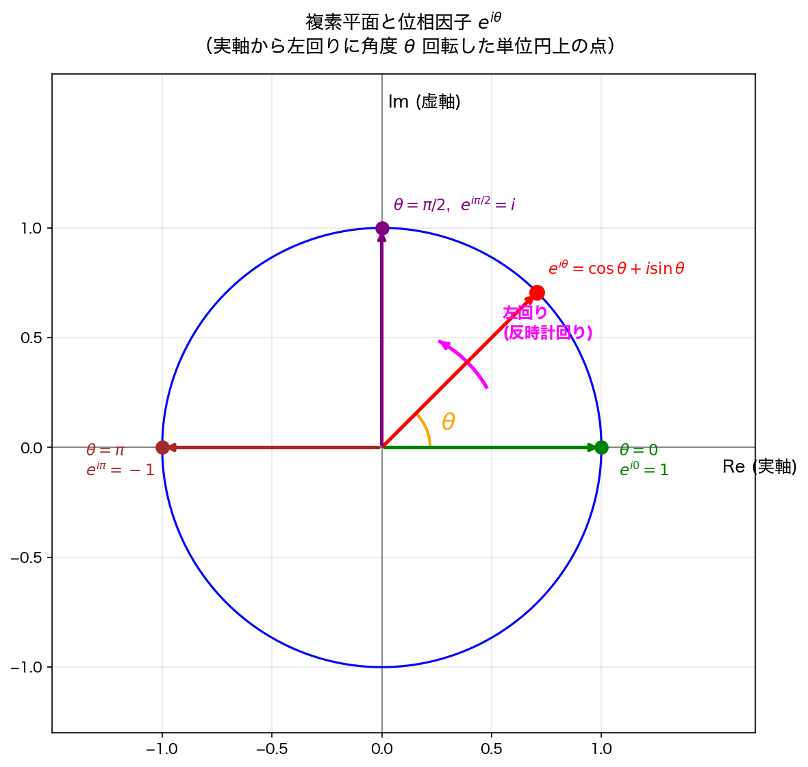
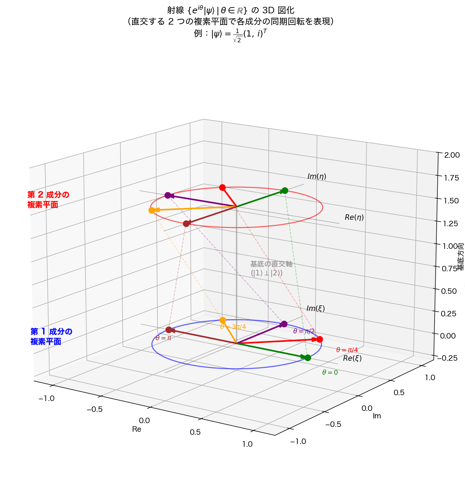

### 第3章

# 閉じた有限自由度系の純粋状態の量子論

前章で述べたように，量子論の最も一般の対象は，「無限自由度」の「開いた系」の「混合状態」であり，ほか場合は，このケースの特殊な場合として扱える．この章では，その中でも一番簡単な「有限自由度」の「閉じた系」の「純粋状態」の理論を述べる．形式としては「演算子形式」を用い，時間発展については「シュレディンガー描像」（2.2 節）を採用する．この理論が，他の様々な形式の量子論の基礎にもなっているので，しっかりと身につけて欲しい．

## 3.1 基本的な考え方

### 3.1.1 公理あるいは要請

本章で述べる，閉じた有限自由度系の純粋状態に対する量子論は，5つの「要請」(p. 36, 43, 75, 95, 102) から組み立てられた理論である．数学でも物理でも，理論を展開するためには，出発点にいくつかの仮定をおく．それを，物理では「要請」とか「仮定」とか「基本法則」と呼び，数学では「公理」と呼ぶ．違う要請なり公理をおけば，違う理論になる．例えば，中学・高校で，「どの直線にも平行線がひける」という公理を含む幾何学（ユークリッド幾何学）を習ったと思う．それはもちろん正しい数学理論なのだが，実は，「どんな直線にも平行線はひけない」という公理を含む幾何学もあり，それも正しい数学理論である．これと同様に，物理学では，ニュートン力学も矛盾のない理論だし，量子論もそうである．

数学の場合は，異なった理論はどちらも正しいのであり，「どちらが正しいのか？」とか「どうしてその公理を取らねばならないのか？」という問いかけは意味を持たない．しかし，物理学は実験科学であるから，どちらの理論が自然現象（実験結果）をより正確に記述できるか，という絶対的な判定基準がある．これに照らして，どのような「要請」をおいた理論が好ましいかを判定する．したがって，「どうしてその要請を取らねばならないのか？」という問いかけの答は，「そうすると自然現象をうまく記述できたから」としか答えようがない．もっともらしい理由を挙げることもある程度はできるのだが，1.4節で述べたように，それは決定的なものではない．もちろん，より深いレベルの理論によって説明することはできるかも知れないが，今度は，その深いレベルの理論に対して，なぜその理論を採用したのかという疑問が生じて，きりがない．やはり，「そうすると自然現象をうまく記述できたから」としか答えようがないのである．

### 3.1.2 抽象的な量による記述

前章で述べたように，「状態」を実験で確認しようと思っても，実際に測れるのは，物理量，つまり可観測量の値だけである．さらに，その物理量の測定値も実験するたびに値がばらつき，理論と比較する意味があるのはその確率分布 $\{P(a)\}$ だけである．そこで，「同じ状態」とか「違う状態」の定義も，2.2節で述べたように，確率分布だけで区別される．

そうであれば，$\{P(a)\}$ が具体的に求まりさえすれば，「状態」や「物理量」には，理論の中にしか存在しないような，抽象的な量を割り当ててもいっこうに構わないではないか？ つまり，計算の中には，身の回りに存在しない抽象的な量（例えば，$i^2=-1$ を満たす虚数単位 $i$ を含む量）が出てきても，いっこうに構わない．実験で直接測れないのだから，「そういう量が実際にこの世のどこかに存在するのか？」という問いかけは無意味である．誰にも確かめようがないのだから，存在してもしなくても何も変わらず，要するに，そういう量に対しては，「存在する」という言葉自体が定義できないのである．

そこで，演算子形式 (operator formalism) の量子論では，「複素ヒルベルト空間」と呼ばれる抽象的な空間（我々の住む3次元空間ではなく，抽象的な集合）を考え，「状態」や「物理量」を，その上の「ベクトル」（我々の住む3次元空間のベクトルではなく，「複素ヒルベルト空間」の元）や「演算子」（ベクトルを他のベクトルに移す規則（写像）のこと）に対応させる．そして，それらを組み合わせて，確率分布 $\{P(a)\}$ が計算できるように定式化する．

「なぜそんな抽象的な量を持ち出すのか？」と問われれば，「そうすると自然現象をうまく記述できたから」と答えるしかない．あるいは，同じことだが，「ヒルベルト空間論が，自然を記述するのに適した言葉（のひとつ）だった」と言ってもよい．人間の生物学的特性と日常経験に基づいて作られた言語である日常言語（日本語や英語）では日常経験を越えるような広い範囲の自然現象はうまく記述できないのは，考えてみればあたりまえである．自然を記述するには，日常言語よりもヒルベルト空間論の方が適していた．ただそれだけのことである．

## 3.2 複素ヒルベルト空間

複素数（付録 A.1）を成分とする，2成分の列ベクトル全体の集合


$${\mathbf C}^2 \equiv \left\{ \begin{pmatrix} \xi \\ \eta \end{pmatrix} \middle| \xi, \eta \in {\mathbf C} \right\} \quad ({\mathbf C}\text{ は複素数全体の集合}) \quad (3.1)$$


は，複素ベクトル空間（付録 A.2）を成す．ようするに，${\mathbf C}^2$ の元であるベクトルを，足したり，引いたり，複素数をかけたりできる．これに，以下のようにして「内積」という概念を導入し，豊かな内容を持つようにしよう．

個々のベクトルを，$|\psi\rangle$，$|\psi'\rangle$ などと書くことにする．その成分が


$$|\psi\rangle = \begin{pmatrix} \xi \\ \eta \end{pmatrix}, \quad |\psi'\rangle = \begin{pmatrix} \xi' \\ \eta' \end{pmatrix} \quad (3.2)$$


であるとき，これらの内積 (inner product) $\langle\psi|\psi'\rangle$ を次式で定義する：


$$\langle\psi|\psi'\rangle \equiv \xi^* \xi' + \eta^* \eta' = (\xi^* \ \eta^*) \begin{pmatrix} \xi' \\ \eta' \end{pmatrix} . \quad (3.3)$$


ただし，$^*$ は複素共役を表し，最後の式は行列のかけ算（付録 B）として表した．内積の値は（ベクトルではなく普通の）複素数であるが，特に，自分自身との内積は，非負の実数になる：

$$\langle\psi|\psi\rangle \ge 0 \quad \left(\text{等号は } |\psi\rangle = \begin{pmatrix} 0 \\ 0 \end{pmatrix} \text{ (ゼロベクトル) のときのみ}\right). \quad (3.4)$$


また，実空間のベクトルの内積とは異なり，上記の内積は左右を入れ換えると，値が複素共役に変わる：


$$\langle\psi'|\psi\rangle = \langle\psi|\psi'\rangle^* . \quad (3.5)$$


また，2つのベクトル $|\psi_1\rangle$，$|\psi_2\rangle$ の線形結合 $c_1|\psi_1\rangle + c_2|\psi_2\rangle$ を，$|c_1\psi_1 + c_2\psi_2\rangle$ と書くことにすると1），明らかに，


$$\langle\psi|c_1\psi_1 + c_2\psi_2\rangle = c_1\langle\psi|\psi_1\rangle + c_2\langle\psi|\psi_2\rangle \quad (c_1, c_2 \in {\mathbf C}). \quad (3.6)$$


一般に，上の3つの関係 (3.4), (3.5), (3.6) を満たす量（値は複素数）が定義されているベクトル空間のことを，内積空間 (inner product space) と言う2）．この3つの基本的関係を組み合わせれば，様々な内積の規則が導かれる．例えば，(3.6) の複素共役をとって (3.5) を用いれば，


$$\langle c_1\psi_1 + c_2\psi_2|\psi\rangle = c_1^*\langle\psi_1|\psi\rangle + c_2^*\langle\psi_2|\psi\rangle \quad (3.7)$$


が言える．また，$|\psi\rangle$ のノルム (norm) $\||\psi\rangle\|$ を，


$$\||\psi\rangle\| \equiv \sqrt{\langle\psi|\psi\rangle} \quad (3.8)$$


で定義すれば，(3.4) によりこれは非負実数である．従って，これをベクトルの「長さ」と解釈することができる．

このように，(3.3) により，${\mathbf C}^2$ は内積空間になった．しかも，完備*3）であることも，複素数の完備性から証明できる．従ってこれは，次のように定義される「複素ヒルベルト空間」の一例になっている：


*1) 念のために注意しておく：この書き方は便利なのだが，紛らわしい場合もある．例えば，それぞれのベクトルを $|1\rangle$, $|2\rangle$ と書いた場合は，$|1\rangle + |2\rangle$ を $|1+2\rangle$ と書くことになるが，この $| \ \ \rangle$ の中をうっかり足し算して $|3\rangle$ にしてしまってはいけない．
*2) 書物によって，ユニタリー線形空間 (unitary vector space) とか，計量線形空間とか，あるいは他の名前で呼んだりする．
*3) 直感的に言えば，「すき間なくびっしり詰まった集合」が完備な集合である．例えば，実数全体の集合 ${\mathbf R}$ は完備である．他方，${\mathbf R}$ からゼロを抜いた（すき間を作った）集合を ${\mathbf R}_0$ と書くと，数列 $a_n = 1/n \ (n > 0)$ は，${\mathbf R}_0$ の中にあるのに，その収束先 $\lim_{n \to \infty} a_n = 0$ は ${\mathbf R}_0$ の中にはない．これをもって，「${\mathbf R}_0$ は完備でない」と言う．詳しく知りたい読者は，節末の補足を見よ．

**数学的定義：** ${\mathbf C}$ 上の完備な内積空間 $\mathcal{H}$ を，複素ヒルベルト空間 (complex Hilbert space) と呼ぶ*4）．

内積を定義する前の単なる複素ベクトル空間に比べて，内積が定義されただけで，格段に豊かな内容を記述できるようになっていることが，おいおい判ってくるであろう．

**例 3.1** $N$ 個の複素数を成分とする列ベクトル（付録 A.2）全体の集合


$${\mathbf C}^N \equiv \left\{ \begin{pmatrix} z_1 \\ z_2 \\ \vdots \\ z_N \end{pmatrix} \middle| z_k \in {\mathbf C} \right\} \quad (3.9)$$


を考える．これの任意の2つのベクトル


$$|\psi\rangle = \begin{pmatrix} z_1 \\ z_2 \\ \vdots \\ z_N \end{pmatrix}, \quad |\psi'\rangle = \begin{pmatrix} z_1' \\ z_2' \\ \vdots \\ z_N' \end{pmatrix} \quad (3.10)$$


に対して，内積を


$$\langle\psi|\psi'\rangle = \sum_k z_k^* z_k' = (z_1^* \ z_2^* \ \cdots \ z_N^*) \begin{pmatrix} z_1' \\ z_2' \\ \vdots \\ z_N' \end{pmatrix} \quad (3.11)$$


で定義すれば，${\mathbf C}^N$ は複素ヒルベルト空間を成す．■


ヒルベルト空間の次元 (dimension)（付録 A.2 参照）を，$\dim \mathcal{H}$ と書く．以上の例では $\dim {\mathbf C}^2 = 2$, $\dim {\mathbf C}^N = N$ である．量子論では，$\dim \mathcal{H} = \infty$ である無限次元ヒルベルト空間を扱うことも多い．

**例 3.2** 2つのただの記号，$\heartsuit$, $\clubsuit$ を用いて，2次元の複素ヒルベルト空間を作ってみる．まず，2つの記号 $|\heartsuit\rangle$, $|\clubsuit\rangle$ を勝手に作る．そして，$\xi, \eta \in {\mathbf C}$ を用いて，$\xi|\heartsuit\rangle + \eta|\clubsuit\rangle$ という記号を作り，この記号全体の集合


$$\mathcal{H} \equiv \{ \xi|\heartsuit\rangle + \eta|\clubsuit\rangle \mid \xi, \eta \in {\mathbf C} \} \quad ({\mathbf C}\text{ は複素数全体の集合}) \quad (3.12)$$


を考える．そして，記号 $\xi|\heartsuit\rangle + \eta|\clubsuit\rangle$ に意味を持たせるために，足し算や複素数倍などを，複素ベクトル空間の公理（付録 A.2）を満たすように定義する．例えば，


$$|\psi_1\rangle = \xi_1|\heartsuit\rangle + \eta_1|\clubsuit\rangle, \quad |\psi_2\rangle = \xi_2|\heartsuit\rangle + \eta_2|\clubsuit\rangle \quad (3.13)$$


のとき，$c_1|\psi_1\rangle + c_2|\psi_2\rangle \ (c_1, c_2 \in {\mathbf C})$ を，


$$c_1|\psi_1\rangle + c_2|\psi_2\rangle \equiv (c_1 \xi_1 + c_2 \xi_2)|\heartsuit\rangle + (c_1 \eta_1 + c_2 \eta_2)|\clubsuit\rangle \quad (3.14)$$


と定義する．（$(\ \ )$ の中は，普通の複素数の足し算．）これにより，$\mathcal{H}$ は ${\mathbf C}$ 上のベクトル空間を成す．さらに，内積を，


$$\langle\heartsuit|\heartsuit\rangle = \langle\clubsuit|\clubsuit\rangle = 1, \quad (3.15)$$

$$\langle\heartsuit|\clubsuit\rangle = \langle\clubsuit|\heartsuit\rangle = 0, \quad (3.16)$$


及び，(3.4), (3.5), (3.6) により定義すると，任意の $\mathcal{H}$ の元の間の内積が計算できる．例えば，上の $|\psi_1\rangle$ と $|\psi_2\rangle$ の内積は，


$$\begin{aligned} \langle\psi_1|\psi_2\rangle &= \langle\xi_1\heartsuit + \eta_1\clubsuit | \xi_2\heartsuit + \eta_2\clubsuit\rangle \\ &= \xi_1^* \xi_2 \langle\heartsuit|\heartsuit\rangle + \xi_1^* \eta_2 \langle\heartsuit|\clubsuit\rangle + \eta_1^* \xi_2 \langle\clubsuit|\heartsuit\rangle + \eta_1^* \eta_2 \langle\clubsuit|\clubsuit\rangle \\ &= \xi_1^* \xi_2 + \eta_1^* \eta_2 . \end{aligned} \quad (3.17)$$


こうして，$\mathcal{H}$ は2次元の複素ヒルベルト空間になった（完備性の証明は略）．■


この例で判るように，複素ヒルベルト空間は，縦ベクトルの集合に限るわけではなく，なにか頭の中で適当に作りあげた抽象的なものでもよい．

実は，この例で取り上げたヒルベルト空間は，内積の値に関する限り，${\mathbf C}^2$ と等価である．実際，この空間のベクトルと ${\mathbf C}^2$ のベクトルとを，


$$\xi|\heartsuit\rangle + \eta|\clubsuit\rangle \longleftrightarrow \begin{pmatrix} \xi \\ \eta \end{pmatrix} \quad (3.18)$$


と，もれなく1対1に対応させれば，どんな2つのベクトルの内積の値も両者で一致することが判る．つまり，この2つの例は，内積の値に関する限りは実質的には同じもので，それを，異なった仕方で記述しているに過ぎなかったのである．（これについては，4.6節で再論する．）このように，ヒルベルト空間は「その具体的な作り方は異なっていても内積の値は同じ」というものが多数ある．量子論の計算を行う際には，逆にこのことを利用して，（同じ内積を与える範囲内で）好きなヒルベルト空間を作って計算すればよい．なぜなら，これから説明していくように，量子論の計算の最終結果は，内積の値で与えられるからである．

♠ **補足：内積空間の完備性**
内積空間 $\mathcal{H}$ が完備であるとは，$\mathcal{H}$ 内のどんなベクトル列 $|\psi_1\rangle, |\psi_2\rangle, \cdots$ でも，もしもそれが，


$$\lim_{n,m \to \infty} \| |\psi_n\rangle - |\psi_m\rangle \| = 0 \quad (3.19)$$


を満たすベクトル列であれば，必ずその収束先 $|\psi\rangle$，つまり，


$$\lim_{n \to \infty} \| |\psi_n\rangle - |\psi\rangle \| = 0 \quad (3.20)$$


を満たすベクトル $|\psi\rangle$ が $\mathcal{H}$ 内に存在することである．

## 3.3 量子状態

複素ヒルベルト空間には内積が定義されているので，普通の3次元実空間のように「直交」という概念が導入でき，「平行」の意味も明瞭になる．


**数学的定義：** ベクトル $|\psi\rangle$ と $|\psi'\rangle$ が $\langle\psi|\psi'\rangle = 0$ を満たすとき，互いに直交する (orthogonal) と言う．

例えば，$\begin{pmatrix} \xi \\ \eta^* \end{pmatrix}$ と $\begin{pmatrix} \eta \\ -\xi^* \end{pmatrix}$ は，内積が $\xi^* \eta - \eta \xi^* = 0$ となるので直交している．

**問題 3.1** 一般に，ゼロベクトルでないベクトル $|\psi_1\rangle, |\psi_2\rangle, \cdots$ が，どれも互いに直交するならば，それらは線形独立（付録 A.2 参照）であることを示せ．

他方，ベクトル $|\psi\rangle$ を定数倍したベクトル $c|\psi\rangle \ (c \in {\mathbf C})$ を $|c\psi\rangle$ と書くと，これは，$|\psi\rangle$ とは長さが違うだけの平行なベクトルと見なすことができる．実際，どんなベクトル $|\psi'\rangle$ と $|c\psi\rangle$ の内積も一律に $c$ 倍になる：


$$\langle\psi'|c\psi\rangle = c\langle\psi'|\psi\rangle . \quad (3.21)$$


あるいは，$|c\psi\rangle$ が左にある場合は，


$$\langle c\psi|\psi'\rangle = c^* \langle\psi|\psi'\rangle \quad (3.22)$$


のように，どんなベクトル $|\psi'\rangle$ との内積も一律に $c^*$ 倍になる．これらは，$|c\psi\rangle$ が $|\psi\rangle$ と「平行」であるという解釈とつじつまがあっている*5）．

特に，$\theta$ を実数としたとき，位相因子 (phase factor)（付録 A.1 参照）$e^{i\theta}$ を $|\psi\rangle$ にかけた $e^{i\theta}|\psi\rangle$ は，$\theta$ の値にかかわらず，$|\psi\rangle$ と「平行」で同じ「長さ」（ノルム）を持つベクトルになる．つまり，$|\psi\rangle$ の複製のようなものである．そこで，複製全てを集めた集合


$$\{ e^{i\theta}|\psi\rangle \mid \theta \in {\mathbf R} \} \quad ({\mathbf R}\text{ は実数全体の集合}) \quad (3.23)$$


を一括して，**射線**(ray) と呼ぶ*6）．

一般に，$\||\psi\rangle\| = 1$ のとき，$|\psi\rangle$ は規格化されている (normalized) と言う．

*5) 実空間のベクトル $\vec{a}$ の場合も，$\vec{a}$ と平行なベクトル $k\vec{a} \ (k \in {\mathbf R})$ は，どんなベクトル $\vec{a}'$ との内積も一律に $k$ 倍になったことを思い出せ．
*6) ノルムが同じでなくても射線に含める流儀もあるが，量子論ではこのような定義の方が便利である．


ゼロベクトルでない任意のベクトル $|\psi\rangle$ が与えられたとき，それは必ず規格化 (normalize) できる．なぜなら，$|\psi\rangle$ を


$$\frac{1}{\sqrt{\langle\psi|\psi\rangle}} |\psi\rangle \quad (3.24)$$


で置き換えれば，これは規格化されていて $|\psi\rangle$ と「平行」なベクトルになるからである．これに位相因子 $e^{i\theta}$ をかけて，全ての $\theta$ の値について集めれば，規格化された射線を得る．

**例 3.3** 任意の（ゼロベクトルでない）ベクトル $\begin{pmatrix} \xi \\ \eta \end{pmatrix}$ を規格化した
$\begin{pmatrix} \xi / \sqrt{|\xi|^2 + |\eta|^2} \\ \eta / \sqrt{|\xi|^2 + |\eta|^2} \end{pmatrix}$ の射線は，$\left\{ \begin{pmatrix} e^{i\theta}\xi / \sqrt{|\xi|^2 + |\eta|^2} \\ e^{i\theta}\eta / \sqrt{|\xi|^2 + |\eta|^2} \end{pmatrix} \middle| \theta \in {\mathbf R} \right\}$ となる．■

演算子形式の量子論では，このような抽象的な空間の射線に，量子系の状態を対応させる：

> **要請 (1)**
> 量子系の純粋状態は，ある複素ヒルベルト空間 $\mathcal{H}$ の，規格化された射線で表される．

実際の計算では，射線の中からひとつの規格化されたベクトル $|\psi\rangle$ を代表として選び，それで量子状態を表して，「この量子系は $|\psi\rangle$ という状態にある」などと言うことが多い*7）．この $|\psi\rangle$ を，**状態ベクトル** (state vector) と呼ぶ．以後，本書でもこの流儀に従うが，$|\psi\rangle$ と $e^{i\theta}|\psi\rangle$ は同じ状態を表すことを忘れてはいけない．

この要請の $\mathcal{H}$ としてどのようなヒルベルト空間を採用するのかは 3.22 節で述べるが，ひとつだけ注意しておく：異なる量子系は，一般には，異なる複素ヒルベルト空間で表す必要があるが，たまたま同じ複素ヒルベルト空間で記述できることもある．

*7) このようにする理由は，2つの状態を「重ね合わせる」(3.14) ときなどに，射線で考えるよりも記述が簡便だからである．


**例 3.4** ♠ 電子のスピンの状態は, $\mathcal{H} = \mathbb{C}^2$ の状態ベクトルで表される. 一方, 計算機のデータ記録部分を量子系に置き換えた量子計算機の各ビットの状態も, $\mathcal{H} = \mathbb{C}^2$ の状態ベクトルで表される. $\blacksquare$

---

## 補講：複素共役と内積 (3.3) の表現

### 複素共役の定義と性質

複素数 $z = a + bi$（$a, b$ は実数）に対して，**複素共役** $z^*$ を次で定義する：

$$z^* = a - bi$$

虚部の符号を反転したもの．主要な性質：

| 関係式                                | 内容                                        |
| ------------------------------------- | ------------------------------------------- |
| $(z^*)^* = z$                         | 共役を 2 回取ると元に戻る                   |
| $(z + w)^* = z^* + w^*$               | 和の共役は共役の和                          |
| $(zw)^* = z^* w^*$                    | 積の共役は共役の積                          |
| $z z^* = \vert z \vert^2 = a^2 + b^2$ | 自身との積は非負実数（$z$ の絶対値の 2 乗） |
| $z + z^* = 2\operatorname{Re}(z)$     | 和は実部の 2 倍                             |
| $z - z^* = 2i\operatorname{Im}(z)$    | 差は虚部の $2i$ 倍                          |
| $z = z^*$ ⟺ $z$ は実数                | 共役が等しいのは実数のとき                  |

### 内積 (3.3) の行列表現の導出

清水先生の (3.3) 式の右辺の 2 つの表現：

$$\xi^* \xi' + \eta^* \eta' = (\xi^* \ \eta^*) \begin{pmatrix} \xi' \\ \eta' \end{pmatrix}$$

がなぜ等しいのかを，行列の積として導出する．

#### ベクトルの行列としての見方

ベクトル $|\psi'\rangle$ は $2 \times 1$ の縦ベクトル（行列）：

$$|\psi'\rangle = \begin{pmatrix} \xi' \\ \eta' \end{pmatrix}$$

これに対して，$|\psi\rangle = \begin{pmatrix} \xi \\ \eta \end{pmatrix}$ の **エルミート共役**（転置をとってから各成分を複素共役にする操作）を取ると：

$$\langle\psi| \equiv |\psi\rangle^\dagger = \begin{pmatrix} \xi \\ \eta \end{pmatrix}^\dagger = (\xi^* \ \eta^*)$$

これは $1 \times 2$ の横ベクトル．記号 $\dagger$（ダガー）はエルミート共役を意味する．

| 操作                                       | 結果                                |
| ------------------------------------------ | ----------------------------------- |
| 転置 $T$                                   | 縦 $\to$ 横（成分の位置のみ変える） |
| 複素共役 $*$                               | 各成分の複素共役を取る              |
| エルミート共役 $\dagger$ = 転置 + 複素共役 | 縦 $\to$ 横かつ複素共役             |

#### 行列の積として計算

$1 \times 2$ 行列と $2 \times 1$ 行列の積は $1 \times 1$（スカラー）：

$$\langle\psi| \cdot |\psi'\rangle = (\xi^* \ \eta^*) \begin{pmatrix} \xi' \\ \eta' \end{pmatrix}$$

行列の積の定義（行の各成分と列の各成分を掛けて足す）に従って計算すると：

$$= \xi^* \cdot \xi' + \eta^* \cdot \eta' = \xi^* \xi' + \eta^* \eta'$$

これが (3.3) の右辺と一致する．

つまり：

$$\boxed{\ \langle\psi|\psi'\rangle = \langle\psi| \cdot |\psi'\rangle = (\xi^* \ \eta^*) \begin{pmatrix} \xi' \\ \eta' \end{pmatrix} = \xi^* \xi' + \eta^* \eta'\ }$$

スカラー和の表現と行列積の表現は，**行列の積の定義そのもの** で互いに等しくなっている．

#### ブラケット記法（Dirac 記法）の意味

この構造が **Dirac のブラケット記法** の本質：

| 記号                                    | 数学的実体               | 形                                    |
| --------------------------------------- | ------------------------ | ------------------------------------- |
| ケット $\vert \psi \rangle$             | ベクトル                 | 縦ベクトル（$2 \times 1$ 行列）       |
| ブラ $\langle \psi \vert$               | ベクトルのエルミート共役 | 横ベクトル（$1 \times 2$ 行列）       |
| 内積 $\langle \psi \vert \psi' \rangle$ | ブラとケットの行列積     | スカラー（$1 \times 1$ 行列＝複素数） |

「ブラ・ケット」の名前は，英語の括弧 "bracket"（$\langle \rangle$ のこと）を半分ずつに分けて "bra"（$\langle\psi|$）と "ket"（$|\psi'\rangle$）と呼んだことに由来する．

### 値が複素数（特に自身との内積は非負実数）になる確認

$\xi, \xi', \eta, \eta'$ はすべて複素数なので，$\xi^* \xi'$ も $\eta^* \eta'$ も複素数．和も複素数．

特に，$|\psi\rangle = |\psi'\rangle$ のとき（$\xi = \xi', \eta = \eta'$）：

$$\langle\psi|\psi\rangle = \xi^* \xi + \eta^* \eta = |\xi|^2 + |\eta|^2 \geq 0$$

複素共役の性質 $z z^* = |z|^2$ より，**非負の実数** になる．これが (3.4) の式の数学的根拠．等号が成り立つのは $\xi = \eta = 0$ のとき，すなわちゼロベクトルのときのみ．

---

## 補講：記号「$\equiv$」の意味（定義による等号）

清水先生の本文（および本メモの補講）で繰り返し現れる記号「$\equiv$」（横棒 3 本）は，**「定義による等号」** を意味する．

### 「$\equiv$」と「$=$」の違い

| 記号         | 意味                                            |
| ------------ | ----------------------------------------------- |
| $a = b$      | 「$a$ と $b$ は等しい」という **事実** を述べる |
| $a \equiv b$ | 「$a$ を $b$ と **定義する**」という宣言        |

両者とも「両辺が等しい」を表すが，$\equiv$ は **これを定義として導入する** という強い意味を持つ．

### 本文での使用例

(3.3) 式：

$$\langle\psi|\psi'\rangle \equiv \xi^* \xi' + \eta^* \eta'$$

→ 「内積 $\langle\psi|\psi'\rangle$ を，$\xi^* \xi' + \eta^* \eta'$ と **定義する**」

本メモの補講での使用例：

$$\langle\psi| \equiv |\psi\rangle^\dagger$$

→ 「$\langle\psi|$ という記号を，$|\psi\rangle$ のエルミート共役として **定義する**」

(3.1)，(3.8)，(3.12) などでも同じ用法．

### 他の用法（参考）

文脈によって「$\equiv$」は別の意味になることもある：

| 文脈                     | 意味                           |
| ------------------------ | ------------------------------ |
| 数学（量子論・線形代数） | 定義による等号（本書での用法） |
| 整数論                   | 合同（$\bmod n$ で等しい）     |
| 論理学                   | 同値・恒等式                   |

清水先生の本では一貫して **「定義による等号」** として使われている．

---

## 補講：内積の規則は実数四則演算の複素数版

清水先生の内積の規則 (3.4)〜(3.7) は，**実数の四則演算ルールの複素数版** として読むことができる．

### 内積の規則と実数四則演算の対応

| 内積の規則（複素ベクトル空間）                                                                                                    | 実数の四則演算（対応）                         | 違い                             |
| --------------------------------------------------------------------------------------------------------------------------------- | ---------------------------------------------- | -------------------------------- |
| **(3.4)** $\langle\psi\vert\psi\rangle \geq 0$                                                                                    | $a \cdot a = a^2 \geq 0$                       | なし — 実数値かつ非負            |
| **(3.5)** $\langle\psi'\vert\psi\rangle = \langle\psi\vert\psi'\rangle^*$                                                         | $a b = b a$（可換）                            | **入れ換えで複素共役**（非可換） |
| **(3.6)** $\langle\psi\vert c_1\psi_1+c_2\psi_2\rangle = c_1\langle\psi\vert\psi_1\rangle + c_2\langle\psi\vert\psi_2\rangle$     | $A(c_1 B_1 + c_2 B_2) = c_1 A B_1 + c_2 A B_2$ | なし — 右側からは普通の線形性    |
| **(3.7)** $\langle c_1\psi_1+c_2\psi_2\vert\psi\rangle = c_1^*\langle\psi_1\vert\psi\rangle + c_2^*\langle\psi_2\vert\psi\rangle$ | $(c_1 B_1 + c_2 B_2)A = c_1 B_1 A + c_2 B_2 A$ | **係数が複素共役に変わる**       |

### 一文でまとめると

> 内積の規則は，**実数の分配法則（線形性）と可換性をそのまま使えるが，左側（ブラ側）から扱う場合だけ係数を複素共役にする** という補正規則だけが付け足されている．

つまり：

- **右側（ケット側）への作用** ＝ 実数の場合と同じ振る舞い（係数そのまま）
- **左側（ブラ側）への作用** ＝ 実数の場合と同じ振る舞い ＋ 係数の複素共役

### なぜ左右で違うのか

これは (3.3) の内積の定義に立ち戻ると見える：

$$\langle\psi\vert\psi'\rangle = \xi^* \xi' + \eta^* \eta'$$

- **左側のベクトル $\vert\psi\rangle$ の成分は複素共役を取る**（$\xi^*, \eta^*$）
- **右側のベクトル $\vert\psi'\rangle$ の成分はそのまま**（$\xi', \eta'$）

したがって：
- 左側に係数 $c$ がかかると → 出てくるときは $c^*$（複素共役）
- 右側に係数 $c$ がかかると → 出てくるときは $c$（そのまま）

これが (3.6)（右からは $c$）と (3.7)（左からは $c^*$）の非対称性の正体．**内積の定義式で左側だけに $*$ を入れた帰結**．

### 可換性の破れも同じ起源

(3.5) の $\langle\psi'\vert\psi\rangle = \langle\psi\vert\psi'\rangle^*$ も同じ理屈：

$$\langle\psi'\vert\psi\rangle = \xi'^* \xi + \eta'^* \eta$$

$$\langle\psi\vert\psi'\rangle^* = (\xi^* \xi' + \eta^* \eta')^* = \xi \xi'^* + \eta \eta'^* = \xi'^* \xi + \eta'^* \eta$$

両者が一致する．つまり「入れ換えで複素共役」も内積定義の左側 $*$ から自動的に出る．

### 結論

複素内積空間の規則 (3.4)〜(3.7) は，**実数の四則演算ルール（分配法則・線形性・可換性）に，「左側からは複素共役を取る」という補正だけを加えたもの**．基本的な代数感覚は実数の場合と同じで，違うのは **「左側」の係数が複素共役になる** という一点だけ．補正規則さえ覚えれば実数感覚で計算できる．

---

## 補講：ノルムは絶対値の一般化

清水先生の (3.8) で定義されるノルム

$$\Vert\,\vert\psi\rangle\,\Vert \equiv \sqrt{\langle\psi\vert\psi\rangle}$$

は，実数の絶対値，複素数の絶対値の一般化として理解できる．

### 「自分の共役 × 自分 → 平方根」という共通構造

| 対象                                                                    | 自分の共役                                             | 「共役 × 自分」                                                    | 大きさ                                                |
| ----------------------------------------------------------------------- | ------------------------------------------------------ | ------------------------------------------------------------------ | ----------------------------------------------------- |
| **実数** $a$                                                            | $a$（実数の共役は自分自身）                            | $a \cdot a = a^2$                                                  | $\vert a \vert = \sqrt{a^2}$                          |
| **複素数** $z = a+bi$                                                   | $z^* = a-bi$                                           | $z^* z = a^2 + b^2$                                                | $\vert z \vert = \sqrt{z^* z}$                        |
| **ベクトル** $\vert\psi\rangle = \begin{pmatrix}\xi\\\eta\end{pmatrix}$ | $\langle\psi\vert = (\xi^*\ \eta^*)$（エルミート共役） | $\langle\psi\vert\psi\rangle = \vert\xi\vert^2 + \vert\eta\vert^2$ | $\Vert\psi\Vert = \sqrt{\langle\psi\vert\psi\rangle}$ |

すべて **「自分の共役と自分の積」の平方根** という同じ構造．

### 「共役を取る」操作の階層

| 対象     | 「共役を取る」操作                          |
| -------- | ------------------------------------------- |
| 実数     | 何もしない（実数は共役不変）                |
| 複素数   | 複素共役 $*$（虚部反転）                    |
| ベクトル | エルミート共役 $\dagger$（転置 + 複素共役） |

階層的に：
- 実数の絶対値 → 複素数の絶対値（共役を取る操作が拡張）
- 複素数の絶対値 → ベクトルのノルム（さらに拡張）

### 性質も同じ

絶対値とノルムは同じ性質を持つ：

| 性質           | 実数 $\vert a\vert$                               | 複素数 $\vert z\vert$                             | ベクトル $\Vert\psi\Vert$                                  |
| -------------- | ------------------------------------------------- | ------------------------------------------------- | ---------------------------------------------------------- |
| **非負性**     | $\vert a\vert \geq 0$                             | $\vert z\vert \geq 0$                             | $\Vert\psi\Vert \geq 0$                                    |
| **ゼロ条件**   | $\vert a\vert = 0 \iff a = 0$                     | $\vert z\vert = 0 \iff z = 0$                     | $\Vert\psi\Vert = 0 \iff \vert\psi\rangle = 0$             |
| **スカラー倍** | $\vert ca\vert = \vert c\vert\vert a\vert$        | $\vert cz\vert = \vert c\vert\vert z\vert$        | $\Vert c\psi\Vert = \vert c\vert\Vert\psi\Vert$            |
| **三角不等式** | $\vert a+b\vert \leq \vert a\vert + \vert b\vert$ | $\vert z+w\vert \leq \vert z\vert + \vert w\vert$ | $\Vert\psi+\phi\Vert \leq \Vert\psi\Vert + \Vert\phi\Vert$ |

「絶対値の振る舞い」がそのままノルムにも引き継がれている．

### まとめ

> **ノルムは「絶対値の一般化」**．対象が実数 → 複素数 → ベクトル と複雑になっても，**「自分の共役と自分の積の平方根」** という構造は同じで，「大きさ・長さ」の感覚も同じ振る舞いをする．

覚え方としても「自分の共役 × 自分 の平方根」と統一して理解できる．

---

## 補講：コーシー列と完備性

清水先生の補足（節末の「♠ 補足：内積空間の完備性」）で導入される (3.19), (3.20) は，量子論で頻繁に登場する **完備性** という概念の数学的定義．ここでは「コーシー列」と「完備性」の意味を分かりやすく整理する．

### コーシー列とは

**コーシー列** ＝ 要素同士の距離がどんどん $0$ に近づく列．直感的には「収束しそうな列」．

数式で：

$$\lim_{n,m \to \infty} \Vert\,\vert\psi_n\rangle - \vert\psi_m\rangle\,\Vert = 0 \quad (3.19)$$

番号 $n, m$ が大きくなると，$\vert\psi_n\rangle$ と $\vert\psi_m\rangle$ の差のノルム（長さ）が限りなく $0$ に近づく列のこと．

#### 具体例

実数列 $a_n = 1 + \frac{1}{2} + \frac{1}{4} + \cdots + \frac{1}{2^{n-1}}$：

| $n$ | $a_n$ |
| --- | ----- |
| 1   | 1     |
| 2   | 1.5   |
| 3   | 1.75  |
| 4   | 1.875 |
| ... | ...   |

各項の差はどんどん $0$ に近づく（コーシー列）．収束先は $2$．

#### 「収束列」との違い

| 概念           | 定義                                                                     |
| -------------- | ------------------------------------------------------------------------ |
| **収束列**     | 特定の値 $a$ に近づく：$\lim_{n \to \infty} \vert a_n - a\vert = 0$      |
| **コーシー列** | 要素同士が互いに近づく：$\lim_{n,m \to \infty} \vert a_n - a_m\vert = 0$ |

コーシー列の定義には **「収束先」が登場しない**（要素同士の距離だけで定義される）．これが重要．

### 完備性の定義

清水先生 (3.19), (3.20) の文章は **「完備とは何か」を定義** している：

> **完備とは：どんなコーシー列 (3.19) を満たす列も，その収束先 (3.20) を満たすベクトル $\vert\psi\rangle$ が空間 $\mathcal{H}$ 内に存在することである．**

要するに「**収束しそうな列の収束先が，必ず空間内にある**」という条件．

#### 完備でないとどうなるか

「収束しそう」なのに「収束先が空間外に飛び出す」ことがある．

例：**有理数の列** $a_n = (1+1/n)^n$ は有理数の範囲でコーシー列だが，極限 $e \approx 2.71828\ldots$ は **無理数**．有理数の集合 $\mathbf{Q}$ の中には収束先が存在しない．→ $\mathbf{Q}$ は完備でない．

実数の集合 $\mathbf{R}$ では，どんなコーシー列も実数の中に収束先がある．→ $\mathbf{R}$ は完備．

### 「定義」と「証明」を区別する

完備性の議論では， **2 つのレベル** を区別する必要がある：

| レベル                               | 内容                                                                     |
| ------------------------------------ | ------------------------------------------------------------------------ |
| **定義** （清水先生 (3.19), (3.20)） | 「完備」という言葉の意味．判定基準のルール                               |
| **証明**                             | 特定の空間（例：$\mathbf{C}^2$）がその判定基準を満たすかを実際にチェック |

例えると：

| 数学              | 日常の例                                         |
| ----------------- | ------------------------------------------------ |
| 完備性の **定義** | 「合格点とは 60 点以上のことである」というルール |
| 完備性の **証明** | 「太郎は 75 点だから合格」と実際に判定する手続き |

ルールを述べる（定義）と，ルールが満たされることをチェックする（証明）は別の作業．

### $\mathbf{C}^2$ の完備性の証明（定義を検証する手続き）

清水先生は本文で「$\mathbf{C}^2$ は完備（複素数の完備性から証明できる）」と一言で済ませているが，その証明を書き下すと次のようになる．

**ステップ 1**：任意のコーシー列 $\{\vert\psi^{(n)}\rangle\}$ を取る．

$$\vert\psi^{(n)}\rangle = \begin{pmatrix} \xi^{(n)} \\ \eta^{(n)} \end{pmatrix}$$

コーシー列の条件：$\lim_{n,m \to \infty} \Vert\vert\psi^{(n)}\rangle - \vert\psi^{(m)}\rangle\Vert = 0$

**ステップ 2**：成分分解する．

$$\Vert\vert\psi^{(n)}\rangle - \vert\psi^{(m)}\rangle\Vert^2 = \vert\xi^{(n)} - \xi^{(m)}\vert^2 + \vert\eta^{(n)} - \eta^{(m)}\vert^2$$

この和が $0$ に近づくということは，各項も $0$ に近づく．つまり $\{\xi^{(n)}\}$ と $\{\eta^{(n)}\}$ はそれぞれ $\mathbf{C}$ のコーシー列．

**ステップ 3**：既知の完備性を使う．

$\mathbf{C}$ は完備（実数の完備性から導かれる）なので：
- $\xi^{(n)} \to \xi \in \mathbf{C}$
- $\eta^{(n)} \to \eta \in \mathbf{C}$

**ステップ 4**：収束先を構成し，空間内であることを確認．

$\vert\psi\rangle = \begin{pmatrix} \xi \\ \eta \end{pmatrix} \in \mathbf{C}^2$

**ステップ 5**：収束を確認．

$$\Vert\vert\psi^{(n)}\rangle - \vert\psi\rangle\Vert^2 = \vert\xi^{(n)} - \xi\vert^2 + \vert\eta^{(n)} - \eta\vert^2 \to 0$$

→ 任意のコーシー列が $\mathbf{C}^2$ の元に収束する．$\mathbf{C}^2$ は完備．∎

### 証明の本質：完備性は「既知の完備性に帰着」

```
$\mathbf{C}^2$ の完備性
  ↑（成分分解）
$\mathbf{C}$ の完備性
  ↑（実部・虚部分解）
$\mathbf{R}$ の完備性（公理として置く）
```

**実数の完備性は公理として置かれる**．そこから複素数 → $\mathbf{C}^N$ → $L^2$ → 他のヒルベルト空間 と完備性が積み上がる．

### 完備でないことの証明（反例の構成）

逆に「完備でない」を示すには，**収束先が空間外に飛び出すコーシー列を 1 つ示せば十分**．

例：連続関数の空間 $C[0,1]$ に $L^2$ 内積を入れた空間は，連続関数列の極限が階段関数（不連続）になる場合があるため完備でない．これは反例 1 つで「完備でない」を示している．

### 一文でまとめると

> **コーシー列 ＝ 要素同士が互いに近づく列（「収束しそうな列」）．完備性 ＝ どんなコーシー列も収束先が空間内にあるという保証．「定義」（清水先生 (3.19), (3.20)）と「証明」（具体空間で定義を満たすかチェック）は別レベルで，両者を混同しないことが重要．**

---

## 補講：有限次元なら完備性は自動、無限次元では別途証明が必要

清水先生の例 3.2 で「（完備性の証明は略）」と書かれている部分には数学的に重要な事実が隠れている．**ヒルベルト空間が「安易に作れるか否か」は次元によって決まる**．

### 数学的事実

| 次元                                   | 完備性                     | 結果                               |
| -------------------------------------- | -------------------------- | ---------------------------------- |
| **有限次元**（例 3.2 のような 2 次元） | **自動的に保証される**     | 内積を定義すれば必ずヒルベルト空間 |
| **無限次元**                           | **自動的には保証されない** | 個別に完備性の証明が必要           |

### 有限次元では完備性が自動である理由

**定理**：有限次元の複素内積空間は，必ず完備である．

#### 証明のアイデア

例 3.2 の場合：

1. $\mathcal{H}$ の任意の元は $\xi\vert\heartsuit\rangle + \eta\vert\clubsuit\rangle$（$\xi, \eta \in \mathbf{C}$）と書ける
2. $\mathcal{H}$ のコーシー列は，対応 (3.18) によって $\mathbf{C}^2$ のコーシー列に翻訳できる
3. $\mathbf{C}^2$ が完備であることは既に証明済み
4. だから $\mathcal{H}$ も完備

→ **$\mathbf{C}^N$ との 1 対 1 対応** によって，$\mathbf{C}^N$ の完備性をそのまま引き継ぐ．これが「証明は略」の中身．

#### より一般に

任意の $N$ 次元複素内積空間 $\mathcal{H}$ は，基底を選んで $\mathbf{C}^N$ と同型にできる．$\mathbf{C}^N$ が完備なら，$\mathcal{H}$ も完備．

→ **有限次元では「完備性」は自動的に付いてくる**．

### 無限次元の場合は別

無限次元になると **完備でない無限次元内積空間が実際に存在する**：

| 空間                                       | 完備か               |
| ------------------------------------------ | -------------------- |
| 多項式 $\mathbf{P}$ に $L^2$ 内積          | **✗ 完備でない**     |
| 連続関数 $C[0,1]$ に $L^2$ 内積            | **✗ 完備でない**     |
| 滑らかな関数 $C^\infty[0,1]$ に $L^2$ 内積 | **✗ 完備でない**     |
| $L^2[0,1]$（自乗可積分関数）               | ◯ 完備（証明が必要） |
| $\ell^2$（自乗総和可能な数列）             | ◯ 完備（証明が必要） |

ここでは「安易に作れる」と思っても，完備性のチェックで失敗することがある．清水先生が「証明は略」と書ける時は，背景に：

- **有限次元だから自動**（例 3.2 のケース）
- もしくは **既知の標準的完備空間（$L^2$ や $\ell^2$）と同型だから自動**

のどちらかがある．

### 量子論における意味

| 量子系                         | ヒルベルト空間の次元 | 完備性                              |
| ------------------------------ | -------------------- | ----------------------------------- |
| スピン 1/2（例：電子のスピン） | 2 次元（有限）       | 自動                                |
| スピン $s$ の系                | $2s+1$ 次元（有限）  | 自動                                |
| 調和振動子のエネルギー固有状態 | 無限次元             | $\ell^2$ と同型，完備（証明済み）   |
| 1 次元の位置自由度を持つ粒子   | 無限次元             | $L^2(\mathbb{R})$，完備（証明済み） |
| 場の量子論                     | 無限次元（巨大）     | 標準的な完備空間を採用              |

物理で実際に使われるヒルベルト空間は，**ほぼすべて既に完備性が証明済みの標準的な空間**．だから物理学者は完備性を気にせず計算できる．

### 「安易に作れるか」の答え

| 場合           | 安易に作れるか                                                           |
| -------------- | ------------------------------------------------------------------------ |
| 有限次元の場合 | **作れる**（線形結合と内積を定義すれば自動的にヒルベルト空間）           |
| 無限次元の場合 | **作れない**（完備性のチェックが必要．多くの「自然な」候補は完備でない） |

清水先生の例 3.2 は 2 次元（有限次元）なので「証明は略」で済んでいる．

### 一文でまとめ

> **有限次元なら，内積を定義すれば自動的にヒルベルト空間（完備性は自動保証）．無限次元になると完備性のチェックが必要で，安易には作れない．清水先生の例 3.2 は 2 次元なので「証明は略」で正当化されている．**

---

## 補講：直交・平行は通常のベクトル演算と共通，(3.22) のみ複素特有

清水先生の 3.3 節冒頭で導入される「直交」「平行」の概念と (3.21), (3.22) について整理する．**(3.22) だけが複素特有** で，それ以外はすべて実ベクトル空間と共通の通常のベクトル演算．

### 関係ごとの整理

| 概念・式                                                                                        | 実ベクトル空間 | 複素ベクトル空間 | 性質                         |
| ----------------------------------------------------------------------------------------------- | -------------- | ---------------- | ---------------------------- |
| **直交の定義** $\langle\psi\vert\psi'\rangle = 0$                                               | ◯              | ◯                | 通常のベクトル演算と共通     |
| **平行の定義** $\vert c\psi\rangle = c\vert\psi\rangle$                                         | ◯              | ◯                | 通常のベクトル演算と共通     |
| **(3.21)** $\langle\psi'\vert c\psi\rangle = c\langle\psi'\vert\psi\rangle$（右側スカラー倍）   | ◯              | ◯                | 通常のベクトル演算と共通     |
| **(3.22)** $\langle c\psi\vert\psi'\rangle = c^*\langle\psi\vert\psi'\rangle$（左側スカラー倍） | ◯（自明）      | ◯                | **複素特有**（$c^*$ が出る） |

### 実ベクトル空間でも同じ概念

3 次元実ベクトル空間（高校数学の普通のベクトル）でも：

- **直交**：$\vec{a} \cdot \vec{b} = 0$ なら $\vec{a} \perp \vec{b}$
- **平行**：$\vec{b} = c\vec{a}$（$c$ は実数）なら $\vec{a} \parallel \vec{b}$
- **(3.21) に対応**：$\vec{a} \cdot (c\vec{b}) = c(\vec{a} \cdot \vec{b})$

清水先生の (3.21) と直交・平行の定義は，これら実ベクトルの常識を **そのまま複素に持ち込んだ** もの．

### (3.22) のみ複素特有

(3.22) で **複素共役 $c^*$** が出るのが，実ベクトルとの唯一の違い：

$$\langle c\psi\vert\psi'\rangle = c^*\langle\psi\vert\psi'\rangle$$

ただし実数の場合は $c^* = c$（実数の共役は自分自身）なので，(3.22) は実質的に (3.21) と同じ：

$$(c\vec{a}) \cdot \vec{b} = c(\vec{a} \cdot \vec{b})$$

実ベクトル空間では (3.21) と (3.22) を区別する意味がない（両者が一致する）．

### なぜ (3.22) で複素共役が出るのか

源は (3.3) の内積定義：

$$\langle\psi\vert\psi'\rangle = \xi^* \xi' + \eta^* \eta'$$

**左側のベクトルの成分だけに $*$ が付く** — この非対称性が，

- 右側のスカラー倍 $c$ → そのまま $c$ 倍（(3.21)）
- 左側のスカラー倍 $c$ → $c^*$ になって出る（(3.22)）

という違いを生む．

### 一文でまとめ

> **直交・平行・(3.21) は通常のベクトル演算と完全に共通（実ベクトル空間の常識をそのまま複素に持ち込めば良い）．(3.22) のみが複素特有で，「ブラ側から係数を引き出すと複素共役」という補正がかかる．実数の場合は $c^* = c$ なので (3.22) は (3.21) に退化する．**

清水先生が 3.3 節の冒頭でこれらを並べているのは，**「3 次元実ベクトル空間の常識を，ほぼそのまま複素ヒルベルト空間に持ち込める．例外は (3.22) だけ」** という保証を読者に与えるため．

---

## 補講：規格化 = 単位ベクトル

清水先生の「**規格化されている (normalized)**」は，通常のベクトルの「**単位ベクトル**」と **完全に同じ概念** ．呼び方が違うだけ．

### 同じ概念，異なる呼び名

| 用語                              | 分野                 | 定義                                 |
| --------------------------------- | -------------------- | ------------------------------------ |
| **規格化されている** (normalized) | 物理学（量子論など） | $\Vert\,\vert\psi\rangle\,\Vert = 1$ |
| **単位ベクトル** (unit vector)    | 数学（線形代数など） | $\Vert\vec{a}\Vert = 1$              |

どちらも **「長さ（ノルム）が 1」** という同じ条件．

### 規格化の操作も同じ

通常のベクトルで「単位ベクトル化」する操作：

$$\hat{a} = \frac{\vec{a}}{\Vert\vec{a}\Vert}$$

清水先生の (3.24) の「規格化」：

$$\frac{1}{\sqrt{\langle\psi\vert\psi\rangle}}\vert\psi\rangle = \frac{\vert\psi\rangle}{\Vert\,\vert\psi\rangle\,\Vert}$$

**完全に同じ操作**．元のベクトルを自身のノルムで割って，長さを 1 にする．

### なぜ物理学では「規格化」と呼ぶか

- **「単位ベクトル」**：幾何学的なニュアンス（長さ 1 の矢印）
- **「規格化」**：基準化のニュアンス（標準的な形にそろえる）

量子論では，状態ベクトル $\vert\psi\rangle$ に対する確率規則（ボルンの確率規則）が成り立つために $\vert\psi\rangle$ が長さ 1 であることを要請する．「基準としての長さ 1」を意識するので「規格化」と呼ばれるが，数学的内容は単位ベクトルと完全に一致．

### 一文でまとめ

> **「規格化されている」＝「単位ベクトルである」．呼び方が違うだけで，定義（長さ 1）も操作（自身のノルムで割る）も完全に同じ．**

---

## 補講：位相因子 $e^{i\theta}\vert\psi\rangle$ と射線 (3.23) の具体的展開

清水先生の (3.23) の「射線」の意味を，実際に展開式を書き下して確認する．

### 1. オイラーの公式の確認

$\theta$ が実数のとき，**オイラーの公式**：

$$e^{i\theta} = \cos\theta + i\sin\theta$$

これは複素数で，**絶対値が 1**：

$$\vert e^{i\theta}\vert = \sqrt{\cos^2\theta + \sin^2\theta} = 1$$

複素平面で単位円上を回る点と思えばよい．

| $\theta$ | $e^{i\theta}$       |
| -------- | ------------------- |
| $0$      | $1$                 |
| $\pi/2$  | $i$                 |
| $\pi$    | $-1$                |
| $3\pi/2$ | $-i$                |
| $2\pi$   | $1$（一周して戻る） |

### 2. $e^{i\theta}\vert\psi\rangle$ を成分で展開

$\vert\psi\rangle = \begin{pmatrix} \xi \\ \eta \end{pmatrix}$ とすると：

$$e^{i\theta}\vert\psi\rangle = e^{i\theta}\begin{pmatrix} \xi \\ \eta \end{pmatrix} = \begin{pmatrix} e^{i\theta}\xi \\ e^{i\theta}\eta \end{pmatrix}$$

各成分に $e^{i\theta}$ がかかるだけ．

### 3. 具体例：$\vert\psi\rangle = \begin{pmatrix} 1 \\ 0 \end{pmatrix}$

| $\theta$ | $e^{i\theta}\vert\psi\rangle$                                     | 結果                                                |
| -------- | ----------------------------------------------------------------- | --------------------------------------------------- |
| $0$      | $1 \cdot \begin{pmatrix} 1 \\ 0 \end{pmatrix}$                    | $\begin{pmatrix} 1 \\ 0 \end{pmatrix}$              |
| $\pi/2$  | $i \cdot \begin{pmatrix} 1 \\ 0 \end{pmatrix}$                    | $\begin{pmatrix} i \\ 0 \end{pmatrix}$              |
| $\pi$    | $-1 \cdot \begin{pmatrix} 1 \\ 0 \end{pmatrix}$                   | $\begin{pmatrix} -1 \\ 0 \end{pmatrix}$             |
| $3\pi/2$ | $-i \cdot \begin{pmatrix} 1 \\ 0 \end{pmatrix}$                   | $\begin{pmatrix} -i \\ 0 \end{pmatrix}$             |
| $\pi/4$  | $\frac{1+i}{\sqrt{2}} \cdot \begin{pmatrix} 1 \\ 0 \end{pmatrix}$ | $\begin{pmatrix} (1+i)/\sqrt{2} \\ 0 \end{pmatrix}$ |

これらすべて **互いに違うベクトル** に見えるが，**同じ「長さ」と「方向」（複素数倍を許せば）** を持つ．

### 4. ノルムが同じであることの計算

$\vert\psi\rangle = \begin{pmatrix} \xi \\ \eta \end{pmatrix}$ のノルム：

$$\Vert\vert\psi\rangle\Vert^2 = \vert\xi\vert^2 + \vert\eta\vert^2$$

$e^{i\theta}\vert\psi\rangle = \begin{pmatrix} e^{i\theta}\xi \\ e^{i\theta}\eta \end{pmatrix}$ のノルム：

$$\Vert e^{i\theta}\vert\psi\rangle\Vert^2 = \vert e^{i\theta}\xi\vert^2 + \vert e^{i\theta}\eta\vert^2$$

ここで $\vert e^{i\theta}\vert = 1$ なので $\vert e^{i\theta}\xi\vert = \vert\xi\vert$．したがって：

$$\Vert e^{i\theta}\vert\psi\rangle\Vert^2 = \vert\xi\vert^2 + \vert\eta\vert^2 = \Vert\vert\psi\rangle\Vert^2$$

→ **どんな $\theta$ でもノルムは変わらない**．

具体的に検算：$\vert\psi\rangle = \begin{pmatrix} 1 \\ 0 \end{pmatrix}$ で $\theta = \pi/2$ のとき，$e^{i\pi/2}\vert\psi\rangle = \begin{pmatrix} i \\ 0 \end{pmatrix}$：

$$\Vert\begin{pmatrix} i \\ 0 \end{pmatrix}\Vert^2 = \vert i\vert^2 + \vert 0\vert^2 = 1 + 0 = 1$$

確かに長さ 1．

### 5. 平行であることの確認

$e^{i\theta}\vert\psi\rangle$ は $\vert\psi\rangle$ に **複素数 $e^{i\theta}$ をかけたもの**．これは前の節 (3.21) の「定数倍」の特別な場合：

$$\vert c\psi\rangle = c\vert\psi\rangle, \quad c = e^{i\theta}$$

清水先生の定義通り，**「定数倍は平行」**．したがって $e^{i\theta}\vert\psi\rangle$ は $\vert\psi\rangle$ と平行．

### 6. 射線とは何か

(3.23) の集合：

$$\{ e^{i\theta}\vert\psi\rangle \mid \theta \in \mathbf{R} \}$$

これを **すべての $\theta \in \mathbf{R}$ について書き並べた集合**．具体例で書くと（$\vert\psi\rangle = \begin{pmatrix} 1 \\ 0 \end{pmatrix}$ の場合）：

$$\left\{ \begin{pmatrix} 1 \\ 0 \end{pmatrix}, \begin{pmatrix} i \\ 0 \end{pmatrix}, \begin{pmatrix} -1 \\ 0 \end{pmatrix}, \begin{pmatrix} -i \\ 0 \end{pmatrix}, \begin{pmatrix} (1+i)/\sqrt{2} \\ 0 \end{pmatrix}, \ldots \right\}$$

これらすべて：

- 長さは同じ（$= 1$）
- 互いに平行（複素数 $e^{i\theta}$ 倍の関係）
- 位相 $\theta$ だけ違う

この **「位相だけ違う仲間たちの集合」を 1 つにまとめたもの** が「射線 (ray)」．

### 7. 複素平面での回転としての $e^{i\theta}$

$e^{i\theta}$ の幾何学的意味は **複素平面の単位円上の点** で，**実軸から左回り（反時計回り）に角度 $\theta$ だけ進んだ位置**．

複素数を **複素平面** に描くと：

- 横軸：実部 $\operatorname{Re}$（実軸）
- 縦軸：虚部 $\operatorname{Im}$（虚軸）

$e^{i\theta} = \cos\theta + i\sin\theta$ は，複素平面で：

- 実部 $\cos\theta$（横方向の座標）
- 虚部 $\sin\theta$（縦方向の座標）

これは原点を中心とする **単位円上の点**．



| $\theta$ | 単位円上の位置     | 値               |
| -------- | ------------------ | ---------------- |
| $0$      | 実軸の正方向（右） | $1$              |
| $\pi/4$  | 第 1 象限（45 度） | $(1+i)/\sqrt{2}$ |
| $\pi/2$  | 虚軸の正方向（上） | $i$              |
| $\pi$    | 実軸の負方向（左） | $-1$             |
| $3\pi/2$ | 虚軸の負方向（下） | $-i$             |
| $2\pi$   | 元に戻る           | $1$              |

複素数 $z$ に $e^{i\theta}$ をかけることは，**複素平面で $z$ を原点まわりに角度 $\theta$ だけ左回りに回転させる** こと．

### 8. 射線 (3.23) の正確な意味

$$\{ e^{i\theta}\vert\psi\rangle \mid \theta \in \mathbf{R} \}$$

= **ベクトル $\vert\psi\rangle$ の各成分を，複素平面上でそれぞれの絶対値を半径とする円に沿って左回りに連続的に回転させたとき得られる，すべてのベクトルの集合**．

直感的には：

- 元の $\vert\psi\rangle$ を固定する
- 角度 $\theta$ を $0$ から $2\pi$ まで連続的に回す
- $\theta$ の各値で $e^{i\theta}\vert\psi\rangle$ を 1 つ得る
- それら全部の集合が射線

### 具体例による射線の 3D 図化

例として $\vert\psi\rangle = \frac{1}{\sqrt{2}}\begin{pmatrix} 1 \\ i \end{pmatrix}$（清水先生のスピン例の $\vert\psi_{+y}\rangle$）を取る．

$e^{i\theta}\vert\psi\rangle = \frac{1}{\sqrt{2}}\begin{pmatrix} e^{i\theta} \\ ie^{i\theta} \end{pmatrix} = \frac{1}{\sqrt{2}}\begin{pmatrix} e^{i\theta} \\ e^{i(\theta+\pi/2)} \end{pmatrix}$

ベクトル $\vert\psi\rangle$ の **第 1 成分と第 2 成分は，それぞれ直交する基底 $\vert 1\rangle, \vert 2\rangle$ に属する**．したがって各成分が住む 2 つの複素平面は **互いに直交** しており，全体構造を表すには 3D 空間が必要．

- xy 平面（z=0）：第 1 成分 $\xi$ の複素平面
- 別の平面（z=1.5）：第 2 成分 $\eta$ の複素平面
- z 軸方向：基底 $\vert 1\rangle$ と $\vert 2\rangle$ の **直交性** を表現



両成分は同じ $\theta$ で **同期して回転** し，破線で対応関係を示している．

- 第 1 成分 $\xi = 1/\sqrt{2}$（実数）→ 下の複素平面の円上を $\theta$ 回転
- 第 2 成分 $\eta = i/\sqrt{2}$（純虚数）→ 上の複素平面の円上を $\theta$ 回転（出発点が虚軸上、第 1 成分より $\pi/2$ 先行）

**両成分が同じ角度 $\theta$ で同時に回転する**．これが射線の本質．

| $\theta$ | 第 1 成分 $e^{i\theta}\xi$ | 第 2 成分 $e^{i\theta}\eta$ |
| -------- | -------------------------- | --------------------------- |
| $0$      | $1/\sqrt{2}$（実軸上）     | $i/\sqrt{2}$（虚軸上）      |
| $\pi/4$  | $(1+i)/2$                  | $(-1+i)/2$                  |
| $\pi/2$  | $i/\sqrt{2}$（虚軸上）     | $-1/\sqrt{2}$（実軸負）     |
| $3\pi/4$ | $(-1+i)/2$                 | $(-1-i)/2$                  |
| $\pi$    | $-1/\sqrt{2}$（実軸負）    | $-i/\sqrt{2}$（虚軸負）     |

各成分は **それぞれの円上**（半径は $|\xi|$ と $|\eta|$）を **同じ $\theta$ だけ同時に回転** する．第 1 成分と第 2 成分の **相対位相**（この例では $\pi/2$）は保たれる．

射線 ＝ **「ベクトルの各成分が，それぞれの絶対値を半径とする円上を，全成分同期して回転する軌跡」**．

### 9. なぜノルムが変わらないか（幾何的に）

$\vert e^{i\theta}\vert = 1$ は，「複素平面で単位円上を動いているので原点からの距離は常に 1」という意味．

→ 元の成分の絶対値（原点からの距離）を変えない．だからベクトル全体のノルム（長さ）も変わらない．

幾何的には：**回転は長さを保つ操作**（実数の世界での回転と同じ性質）．

### 10. なぜこれを物理で重要視するか

量子論では，状態ベクトル $\vert\psi\rangle$ と $e^{i\theta}\vert\psi\rangle$ は **同じ物理状態** を表す．観測される確率分布（後に出るボルンの規則）で計算すると，位相 $e^{i\theta}$ は消えてしまう（自身との積を取るので）．つまり位相は **観測上区別できない自由度**．

したがって「物理状態」を厳密に表すには，1 つのベクトルではなく，**位相だけ違う仲間たち全体（射線）** で表すのが正確．これが (3.23) の意味．

### 一文でまとめ

> **$e^{i\theta}\vert\psi\rangle$ は，元のベクトル $\vert\psi\rangle$ の各成分を，複素平面で原点中心の単位円に沿って左回りに角度 $\theta$ だけ回転させたもの．長さは変わらない（回転は長さ保存）．射線 (3.23) は，すべての $\theta$ で回転させた結果を集めた「回転軌跡」全体．**

---

## 補講：$\mathbf{C}^2$ から $\mathbf{C}^N$ への拡張

清水先生は 3.2 節と 3.3 節を主に $\mathbf{C}^2$ で記述しているが，例 3.1 で示されているように，**本節で導入された全ての定義は $\mathbf{C}^N$（任意の有限 $N \geq 2$）にそのまま拡張される**．量子論で扱う系の多くは $\mathbf{C}^2$ を超える次元を必要とするため，この拡張可能性は本質的に重要である．

### 拡張される物理系の例

| 系                                    | ヒルベルト空間 |
| ------------------------------------- | -------------- |
| スピン 1/2，量子ビット                | $\mathbf{C}^2$ |
| 3 準位原子（ラムダ系・V 系）          | $\mathbf{C}^3$ |
| 光子の偏光（量子情報での扱い）        | $\mathbf{C}^2$ |
| スピン 1 の系                         | $\mathbf{C}^3$ |
| スピン 3/2 の系                       | $\mathbf{C}^4$ |
| 一般のスピン $s$                      | $\mathbf{C}^{2s+1}$ |
| クォークのカラー三重項（SU(3) 内部対称性） | $\mathbf{C}^3$ |

スピン 1/2 だけで完結しないので，$\mathbf{C}^N$ への拡張は実用上も理論上も必須．

### 拡張される定義の一覧

3.2 節，3.3 節で導入された定義は，すべて成分数を $2 \to N$ に変えるだけで $\mathbf{C}^N$ に拡張される：

| 概念             | $\mathbf{C}^2$ での式                                                                | $\mathbf{C}^N$ での式                                       | 拡張の性質       |
| ---------------- | ------------------------------------------------------------------------------------ | ----------------------------------------------------------- | ---------------- |
| 内積 (3.3)       | $\xi^* \xi' + \eta^* \eta'$                                                          | $\sum_{k=1}^{N} z_k^* z_k'$                                 | 成分数だけ増える |
| ノルム (3.8)     | $\sqrt{\langle\psi\vert\psi\rangle}$                                                 | 同じ式                                                      | 同形             |
| 直交性           | $\langle\psi\vert\psi'\rangle = 0$                                                   | 同じ式                                                      | 同形             |
| 規格化 (3.24)    | $\dfrac{\vert\psi\rangle}{\sqrt{\langle\psi\vert\psi\rangle}}$                       | 同じ式                                                      | 同形             |
| 平行 (3.21)(3.22)| $\langle\psi'\vert c\psi\rangle = c\langle\psi'\vert\psi\rangle$                     | 同じ式                                                      | 同形             |
| 射線 (3.23)      | $\{ e^{i\theta}\vert\psi\rangle \mid \theta \in \mathbf{R} \}$                       | 同じ式                                                      | 同形             |
| 位相因子         | $e^{i\theta}\vert\psi\rangle$                                                        | 同じ式（成分ごとにかかる）                                  | 同形             |
| 完備性           | $\mathbf{C}^2$ で証明                                                                 | 成分分解で $\mathbf{C}^N$ も完備（自動）                    | 自動             |

すべての本質的構造が次元 $N$ の選択に依存しない．**成分の数が増えるだけで，定義の形は同じ**．

### 完備性の拡張（証明の補足）

$\mathbf{C}^2$ の完備性証明（前出補講「コーシー列と完備性」）と同じ方針で，$\mathbf{C}^N$ の完備性も成分分解により $\mathbf{C}$ の完備性に帰着できる：

任意のコーシー列 $\{\vert\psi^{(n)}\rangle\} \subset \mathbf{C}^N$ について，

$$\Vert\vert\psi^{(n)}\rangle - \vert\psi^{(m)}\rangle\Vert^2 = \sum_{k=1}^{N} \vert z_k^{(n)} - z_k^{(m)}\vert^2$$

$N$ 個の成分の各々が $\mathbf{C}$ のコーシー列となり，$\mathbf{C}$ の完備性から各成分が収束．したがって $\mathbf{C}^N$ の元として収束先が存在．∎

**有限次元なら完備性は次元によらず自動的に保証される**．

### 位相因子 $e^{i\theta}$ は $\mathbf{C}^N$ でも同じ構造

特に重要なのは，**位相因子 $e^{i\theta}$ の振る舞いが $\mathbf{C}^N$ でも完全に同じ** ことである：

$$e^{i\theta}\vert\psi\rangle = e^{i\theta}\begin{pmatrix} z_1 \\ z_2 \\ \vdots \\ z_N \end{pmatrix} = \begin{pmatrix} e^{i\theta}z_1 \\ e^{i\theta}z_2 \\ \vdots \\ e^{i\theta}z_N \end{pmatrix}$$

**全 $N$ 成分が同じ $\theta$ で同期回転する**．これは次元 $N$ によらない普遍的な構造．

ノルム保存も同様：

$$\Vert e^{i\theta}\vert\psi\rangle\Vert^2 = \sum_{k=1}^{N} \vert e^{i\theta} z_k\vert^2 = \sum_{k=1}^{N} \vert z_k\vert^2 = \Vert\vert\psi\rangle\Vert^2$$

$\vert e^{i\theta}\vert = 1$ が **成分ごとに** 効くため，総和でも保存される．

射線の定義：

$$\{ e^{i\theta}\vert\psi\rangle \mid \theta \in \mathbf{R} \}$$

も次元によらず同じ形．**「位相だけ違う仲間たちの集合」** という解釈もそのまま $\mathbf{C}^N$ に拡張される．

### 大域位相と相対位相の区別（重要）

$\mathbf{C}^N$ において「位相」と呼べるものには **2 種類** あることに注意：

| 名称                | 形                                              | 効果                       | 観測可能か                       |
| ------------------- | ----------------------------------------------- | -------------------------- | -------------------------------- |
| **大域位相**         | $e^{i\theta}$ を全体にかける                    | 全 $N$ 成分が同期回転      | **観測不可**（射線として同一視） |
| **成分ごとの相対位相** | 成分 $k$ ごとに $e^{i\phi_k}$                  | 成分ごとに独立に回転       | **観測可能**（一般に別の状態）   |

射線の定義 (3.23) で同一視されるのは **大域位相 $e^{i\theta}$ のみ**．これは $\mathbf{C}^2$ でも $\mathbf{C}^N$ でも同じ．成分ごとに異なる位相をかけた状態は **異なる物理状態** を表す．

$\mathbf{C}^2$ の場合，2 つの位相のうち全体の大域位相を除いた **1 つの相対位相** だけが物理的に意味を持つ（これが Bloch 球上の経度に対応）．$\mathbf{C}^N$ では，**$N-1$ 個の独立な相対位相** が物理的に意味を持つ．大域位相 1 つを除いた残り．

### 次元 $N$ に依存する構造（参考）

3.2 節，3.3 節の **ベクトル空間としての基本構造** は次元 $N$ に依存しないが，3.4 節以降で扱う **演算子の構造** は次元 $N$ に依存する：

| 量                                  | $\mathbf{C}^2$ | $\mathbf{C}^N$    |
| ----------------------------------- | -------------- | ----------------- |
| 自己共役演算子の独立成分数          | 4              | $N^2$             |
| ユニタリ群                          | $U(2)$         | $U(N)$            |
| 特殊ユニタリ群                      | $SU(2)$        | $SU(N)$           |
| 直交基底の数                        | 2              | $N$               |
| 独立な相対位相の数                  | 1              | $N-1$             |
| 状態空間（射線空間）の実次元        | 2              | $2(N-1)$          |

例えば $\mathbf{C}^3$ では，演算子は 9 個の独立実成分，対称群は $U(3)$ または $SU(3)$（標準模型のカラー対称性），独立な相対位相は 2 個，状態空間は実 4 次元（$\mathbf{C}^2$ の Bloch 球の高次元類比）．

### 一文でまとめ

> **3.2 節，3.3 節で清水先生が $\mathbf{C}^2$ で書いている内積，ノルム，直交性，規格化，平行，射線，位相因子 $e^{i\theta}$ の定義は，すべて $\mathbf{C}^N$（任意の有限 $N$）にそのまま拡張される．「全成分が同じ位相 $\theta$ で同期回転する」という射線の構造も次元 $N$ によらない．$N$ に依存するのは演算子の自由度や対称群（3.4 節以降で扱う）であり，ベクトル空間としての基本構造は次元独立である．**