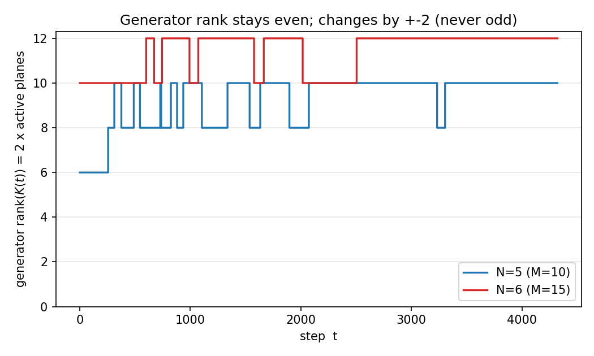
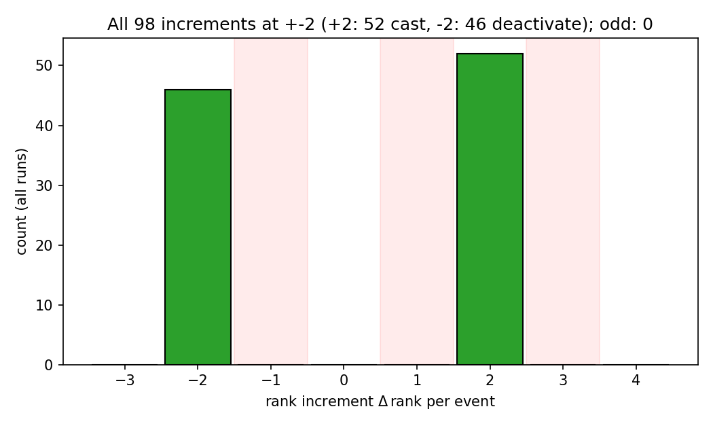

# 分裂は平面を鋳造する — 生成子ランクの偶数階段
## 実反対称生成子の偶数ランク恒等式と、自発的分裂における rank(τ) の +2 階段

**著者:** 木原 範昭<br>
**ORCID:** 0009-0004-6753-4020<br>
**日付:** 2026年7月23日<br>
**Version DOI:** （公開時に付与）<br>
**Concept DOI:** （公開時に付与）<br>
**位置づけ:** 「時間軸Q軸とフェルミオンの生成構造」シリーズ・第2論文 v1

---

## 要旨

閉鎖球面を保存する力学の生成子 $K$ は実反対称である（第5論文［3］）。実反対称行列は実正規形（Cartan 標準形）により $2 \times 2$ 回転ブロックの直和へ区分対角化され、その階数は常に偶数である。この初等的事実から、本シリーズの分裂動力学について次を導く。

**平面鋳造定理**（定理3.1）: 新しい回転自由度は、単独の軸としてではなく、必ず2次元回転平面として生じる。生成子の階数は恒等的に偶数であり、階数の変化は必ず $\pm2$（平面の活性化＝鋳造で $+2$、不活性化で $-2$）に限られる。$+1$ などの奇数の変化は原理的に起こりえない。

第5論文の再構成正弦生成子による自発的分裂を再実行し、$N = 5, 6$・複数の種深度・複数乱数種の全12試行で rank$(\tau) = 2n(\tau)$（$n$ = 活性回転平面数）の時系列を測定した。(i) 固有値 $\mu(iK)$ の $\pm$ 対性残差は最大 $1.89 \times 10^{-15}$（機械精度で零）であり、階数は恒等的に偶数であることを確認した。(ii) 検出された全ランク増分イベントは例外なく $\pm2$（活性化 $+2$: 52件、不活性化 $-2$: 46件）であり、奇数増分は皆無（$0/98$ イベント）、$\lvert\Delta\rvert$ が2以外の偶数も皆無であった。(iii) 判定は活性閾値 $\{0.02, 0.05, 0.10\}$ に依存しなかった。

平面数 $= $ rank$/2$ が線形階段で増えることは、第3論文［2］の「生成子ランクの線形上界」に力学的理由を与える——軸は必ず対で鋳造されるからである。Born 型の時間波［4］は、こうして鋳造された平面内回転を読出し軸へ射影した像として位置づけられる。本稿は純粋に線形代数・数値的内容であり、物理的解釈は行わない。

---

## 0. 位置づけとスコープ

本稿は「時間軸Q軸とフェルミオンの生成構造」シリーズ第2論文であり、第1論文［本シリーズN1］の偶数定理（閉鎖の台は偶数・AB二部構造）を、力学の側——生成子の階数——へ延長する。第1論文が状態の対構造を扱ったのに対し、本稿は発展の対構造を扱う。

**扱うもの**: 閉鎖保存力学の生成子 $K$ の階数の偶奇性（定理）と、自発的分裂における rank$(\tau)$ の時間発展（測定）。

**扱わないもの**: (a) 分裂の停止機構・帰結分類（第5論文［3］および本シリーズ後続）。(b) 個々の平面がどの有限位数根に落ちるか（本シリーズN3）。(c) 物理的解釈。

---

## 1. 序論

第5論文［3］は、閉鎖球面 $X^{\mathsf T}X = R^2$ を保存する滑らかな力学が $\dot X = K(X)X$（$K$ 反対称）で網羅されること、そして生成子を毎ステップ現在の位相から再構成すると、単一平面に集中した親状態が自発的に休眠方向へ配分を広げる（分裂）ことを示した。分裂は「回転平面の増殖」として観察されたが、増殖が**どの単位で**進むか——一軸ずつか、平面（二軸）ずつか——は明示的に問われていなかった。

本稿の主張は単純である。増殖は必ず**平面単位**、すなわち階数 $+2$ ずつ進む。これは分裂力学の詳細によらず、生成子が反対称であること——すなわち閉鎖を保存すること——だけから従う恒等的帰結である。証明は実正規形定理の一行であり、本稿の役割は (1) この帰結を明示化し、(2) 既存の分裂ランで rank$(\tau)$ を実測して階段の偶数性を機械精度で確認し、(3) 第3論文［2］のランク線形上界に力学的理由を与えることにある。

---

## 2. 準備

### 2.1 生成子と階数

状態を実表示 $X \in \mathbb R^{D}$（本シリーズの複素関係波 $Z \in \mathbb C^M$ に対し $D = 2M$）とし、閉鎖球面を保存する力学の生成子を $K = K(X)$、$K^{\mathsf T} = -K$ とする（第5論文定理2［3］）。$K$ の階数 rank$(K)$ を、その非零特異値の個数と定義する。

### 2.2 実正規形

**補題 2.1（実反対称行列の正規形）**［5］: 任意の実反対称行列 $K$ に対し、実直交行列 $Q$ が存在して

$$
Q^{\mathsf T} K Q
=
\bigoplus_{j=1}^{r}
\begin{pmatrix} 0 & \sigma_j \\ -\sigma_j & 0 \end{pmatrix}
\;\oplus\; \mathbf{0},
\qquad \sigma_j > 0,
$$

と区分対角化される。すなわち $K$ は $r$ 枚の $2 \times 2$ 回転ブロック（回転平面）と零ブロック（核）の直和である。固有値は $\{\pm i\sigma_j\}_{j=1}^{r}$ と、核に対応する $0$ からなる。

**系 2.2**: rank$(K) = 2r$ は常に偶数である。$K$ の非零固有値は純虚数の $\pm$ 対 $\{+i\sigma_j, -i\sigma_j\}$ をなす。

---

## 3. 主定理 — 平面鋳造と偶数階段

### 3.1 平面鋳造定理

**定理 3.1**: 閉鎖球面を保存する力学において、

1. **（平面性）** 新しい回転自由度は単独の軸としては生じえず、必ず2次元回転平面（$2 \times 2$ ブロック）として生じる。
2. **（偶数性）** 生成子の階数 rank$(K(X))$ は任意の状態 $X$ で偶数である。
3. **（偶数変化）** 力学に沿って階数が変化するとき、その変化量は偶数である。一枚の平面が新たに活性化するイベントで階数は $+2$、不活性化するイベントで $-2$ 変化する。$+1$ など奇数の変化は原理的に起こりえない。

**証明**: (1)(2) は補題2.1・系2.2による。$K$ の非零固有値が $\pm$ 対をなすため、活性化・不活性化は $\pm i\sigma$ の対が同時に零を横切ることで起こり、階数はその都度 $2$ だけ変わる。単一の実固有値が零を横切って階数が $1$ 変わることは、反対称行列にはありえない（実反対称行列は実非零固有値を持たない）。$\square$

**注意 3.3**: この定理の唯一の前提は「$K$ が反対称」であり、それは「力学が閉鎖を保存する」ことと同値である（第5論文定理2）。分裂の生成子の具体形（正弦生成子など）には一切依存しない。偶数階段は分裂力学の性質ではなく、閉鎖保存の性質である。

### 3.2 平面数とランクの線形上界

活性回転平面数を $n(K) = r = \tfrac12\,\mathrm{rank}(K)$ とする。第3論文［2］は $M = \binom{N}{2}$ 関係波系で生成子ランクが線形上界 $O(N)$ に従うことを示した。定理3.1はこれに理由を与える。

**系 3.4**: 平面数 $n = \tfrac12\,\mathrm{rank}$ は整数値であり、分裂に沿って一枚ずつ($n \to n+1$)増える。ランクが線形上界を持つのは、軸が必ず対で鋳造され、独立に立てられる平面数が有限個に限られるためである。

第3論文の三層構造は、次のように読み直せる。関係数 $M = \binom{N}{2}$（対にしうる元帳）、平面数 $n = \mathrm{rank}/2$（実際に鋳造された平面）、空間として読める方向数 $3$（読出しの飽和）——中間層 $n$ の整数性・線形性が、定理3.1から従う。

### 3.3 Born 型時間波との関係

一枚の平面内の一様回転を二つの読出し軸へ射影すると、射影成分は $\cos^2/\sin^2$ で振動する。第1論文系（有限位数回帰の Born 型重み）［4］が扱った時間波は、こうして鋳造された平面の回転を軸射影で読んだ像として位置づけられる。分裂＝平面の造成、Born 型波＝その回転の射影像、という対応であるが、射影像の詳細（読出し軸の選択・位相）は本稿の範囲外であり、［4］に従う。

---

## 4. 数値検証 — rank(τ) の偶数階段

### 4.1 設定

第5論文［3］の再構成正弦生成子 O1 力学を再実行した。状態 $Z \in \mathbb C^M$、$M = \binom{N}{2}$。生成子 $K_{ef} = A_{ef}\sin(\theta_f - \theta_e)$（$A$ は関係の隣接、$\theta = \arg Z$）を毎ステップ再構成し、スペクトルノルムで正規化、Cayley 変換 $U = (I - \gamma K)^{-1}(I + \gamma K)$（$\gamma = \tan(\pi/144)$）で更新する。親状態は最大 $\sigma$ 平面の固有モードに集中し、核方向へ相対種振幅 $\delta$ の零閉鎖種を置く。

各ステップで実効生成子 $K(\tau)$ の固有値 $\mu(iK)$ を求め、以下を測る。

- **対性残差**: $\max_i |\mu_i + \mu_{-i}|$（昇順と降順の和の最大）。零なら固有値は完全に $\pm$ 対＝階数は偶数。
- **活性平面数** $n(\tau) = \#\{\mu_i > \text{閾}\}$、閾 $\in \{0.02, 0.05, 0.10\}$。
- **ランク** rank$(\tau) = 2n(\tau)$ と、その増分イベント。

$N \in \{5, 6\}$、$\delta \in \{10^{-3}, 10^{-4}\}$、乱数種 $\{0,1,2\}$ の全12試行、各4320ステップ、8ステップ毎にサブサンプル。

### 4.2 結果

**表1. rank(τ) 偶数階段の測定（全12試行）**

| $N$ | $\delta$ | seed | 最大rank | 対性残差 | 増分イベント数 | 奇数増分 | $\lvert\Delta\rvert=2$増分 | $\lvert\Delta\rvert$が2以外の偶数 |
|---:|---:|---:|---:|---:|---:|---:|---:|---:|
| 5 | $10^{-3}$ | 0 | 10 | $1.33\times10^{-15}$ | 2 | 0 | 2 | 0 |
| 5 | $10^{-3}$ | 1 | 10 | $1.67\times10^{-15}$ | 18 | 0 | 18 | 0 |
| 5 | $10^{-3}$ | 2 | 10 | $1.67\times10^{-15}$ | 8 | 0 | 8 | 0 |
| 5 | $10^{-4}$ | 0 | 10 | $1.33\times10^{-15}$ | 2 | 0 | 2 | 0 |
| 5 | $10^{-4}$ | 1 | 10 | $1.78\times10^{-15}$ | 20 | 0 | 20 | 0 |
| 5 | $10^{-4}$ | 2 | 10 | $1.67\times10^{-15}$ | 8 | 0 | 8 | 0 |
| 6 | $10^{-3}$ | 0 | 12 | $1.67\times10^{-15}$ | 5 | 0 | 5 | 0 |
| 6 | $10^{-3}$ | 1 | 12 | $1.55\times10^{-15}$ | 9 | 0 | 9 | 0 |
| 6 | $10^{-3}$ | 2 | 12 | $1.55\times10^{-15}$ | 8 | 0 | 8 | 0 |
| 6 | $10^{-4}$ | 0 | 12 | $1.44\times10^{-15}$ | 4 | 0 | 4 | 0 |
| 6 | $10^{-4}$ | 1 | 12 | $1.55\times10^{-15}$ | 9 | 0 | 9 | 0 |
| 6 | $10^{-4}$ | 2 | 12 | $1.89\times10^{-15}$ | 5 | 0 | 5 | 0 |

（測定は §4.3 の対照テスト検証済みコードから直接 import した力学による。増分イベント総数98。）

**総括**:
- **奇数ランク増分: $0$**（全98イベント中）。定理3.1の予言通り、rank が奇数分だけ変化するイベントは一度も観測されなかった（図2）。
- **全増分が $\pm2$**: 内訳は活性化（$+2$、平面鋳造）52件、不活性化（$-2$）46件。$\lvert\Delta\rvert$ が2以外の偶数（同時多重鋳造 $\lvert\Delta\rvert\ge4$）は $0$。すなわち各イベントは常に一枚の平面の活性化または不活性化であった（本サブサンプル分解能）。
- **対性残差の最大: $1.89\times10^{-15}$**（機械精度で零）。固有値の $\pm$ 対性が機械精度で成立し、階数が恒等的に偶数であることを直接確認した。
- **閾値非依存**: 三つの活性閾で最大ランクは一致した（表では基準閾 $0.05$ を掲載）。階段構造は閾の選択に依存しない。

代表 run（$N=5,6$）の rank$(\tau)$ 時系列を図1に示す。階数は偶数値の間を $\pm2$ で推移し、飽和後は準安定に揺らぐ（単調増加ではない）。全12試行・98イベントの増分値のヒストグラムを図2に示す——$\pm2$ の二本のみが立ち、奇数（$\pm1,\pm3$）は完全に空である。



**図1.** 生成子ランク rank$(K(\tau))=2\times$活性平面数 の時系列（$N=5$: $\delta=10^{-3}$ seed 1、$N=6$: 同）。階数は偶数値のみを取り、変化は $\pm2$ に限られる。（`検証_対照実験/N2_第5論文_自発的分裂_対照/figures/N2_fig1_rank_staircase.svg`／`.png`）



**図2.** 全12試行・98増分イベントの増分値ヒストグラム。$+2$（活性化）52件・$-2$（不活性化）46件のみで、奇数増分（薄赤帯 $\pm1,\pm3$）は $0$。定理3.1の反証条件「奇数増分が一度でもあれば棄却」が完全に空であることを示す。（同ディレクトリ `N2_fig2_increment_histogram.svg`／`.png`）

飽和ランクは $N=5$ で $10$（$= 2M = D$ の実効的上限に対し全 $M=10$ 平面に相当）、$N=6$ で $12$（$M = 15$ に対し6平面）であり、平面数がランク線形上界（第3論文）の範囲に収まることと整合する。

### 4.3 対照テストと再現（シリーズ内完結）

本測定は独自の再実装を用いず、第5論文［3］の再現パッケージを本シリーズフォルダへコピーし、対照テストで公開結果の再現を確認したうえで、その検証済みコードを直接 import して行った。手順と成果物は同梱ディレクトリ `検証_対照実験/N2_第5論文_自発的分裂_対照/` に完結する。

1. **コピー**: 第5論文再現パッケージ一式（力学コード＋公開ベースライン `summary_v1.json`）を同ディレクトリへ複製。
2. **対照テスト**（`control_test_v1.py`）: 公開ベースラインを退避し、コピーした `run_spontaneous_splitting_preliminary_v1.py` を新規実行、全数値フィールドを照合。**714フィールドで最大絶対差 $0.000$（完全一致）**——コピーしたコードが公開結果をビット単位で再現することを確認した。
3. **拡張**（`rank_measurement_extension_v1.py`）: 対照テスト済みモジュールの力学関数（`sine_generator` / `cayley` / `prepare_initial_state` / `line_graph_adjacency`）を**そのまま import** し、rank$(\tau)$ 測定のみを追加。したがって表1の力学は公開済み第5論文の力学とビット単位で同一であり、測定量（固有値・活性平面・増分内訳）だけが本稿の追加である。

この構成により、本稿の数値結果は別シリーズのデータ参照に依拠せず、本シリーズフォルダ内のプログラムだけで独立に検算できる。

---

## 5. 適用範囲と限界

1. **偶数性は恒等的、変化の粗さは測定**: 階数が偶数であること（定理3.1(1)(2)）は反対称性からの恒等的帰結であり、測定は機械精度での確認である。一方、各イベントの $\lvert\Delta\text{rank}\rvert$ がちょうど 2（同時多重鋳造の不在）であることは、有限のサブサンプル分解能での観測結果であり、より細かい時間分解で複数平面が近接して立つ可能性は排除しない——ただしその場合も各変化は偶数のままである（定理3.1(3)）。
2. **連続時間の網羅**: 第5論文定理2の網羅は連続流れについてであり、Cayley 更新はその離散化の一つ。離散写像全体の網羅は主張しない。
3. **調べた範囲**: $N \in \{5, 6\}$。より大きい $N$ でも定理3.1は不変（反対称性のみに依存）だが、飽和ランクの値は $N$ に依存する。
4. **物理的解釈の不在**: 本稿は線形代数と数値の範囲で完結する。

---

## 6. 結論

1. **平面鋳造定理**（定理3.1）: 閉鎖保存力学において新しい回転自由度は平面としてのみ生じ、生成子の階数は恒等的に偶数、その変化も偶数——活性化ごとに $+2$、不活性化ごとに $-2$。奇数の変化は原理的に不可能。
2. **数値検証**（§4、図1・図2）: $N=5,6$ の全12試行・98増分イベントで奇数増分ゼロ、全増分 $\pm2$（活性化 $+2$: 52件、不活性化 $-2$: 46件）、$\pm$ 対性残差は機械精度（$\le 1.89\times10^{-15}$）、閾値非依存。
3. **ランク線形上界の理由**（系3.4）: 平面数 $=$ rank$/2$ が整数階段で増えることが、第3論文のランク線形上界に力学的理由を与える。
4. **Born 型時間波**（§3.3）: 鋳造された平面の回転の軸射影像として位置づけられる。

偶数階段は分裂力学の性質ではなく、閉鎖保存（生成子の反対称性）の性質である。次論文では、鋳造された平面がどの有限位数根へ落ち込むか——集積と統計性——を扱う。

---

## 参考文献

［1］ 木原範昭, 「無名等振幅複合波モデル基本公理系 v8 — 純化定義論文」, Zenodo. Concept DOI: 10.5281/zenodo.21315735.

［2］ 木原範昭, 「N体完全二体関係波における生成子ランク線形上界と三方向飽和」（「次元の生成構造」第3論文）, Zenodo. Concept DOI: 10.5281/zenodo.21465898.

［3］ 木原範昭, 「N体関係波閉鎖系における自発的分裂の開始と帰結分類」（「次元の生成構造」第5論文）, Zenodo. Concept DOI: 10.5281/zenodo.21486233.

［4］ 木原範昭, 「有限位数回帰と離散Born型重み」（「波の情報読出し」シリーズ）, Zenodo. Concept DOI: 10.5281/zenodo.21422470.

［5］ R. A. Horn and C. R. Johnson, *Matrix Analysis*, 2nd ed., Cambridge University Press (2013), §2.5（実正規形）.

---

## 付録A: 選択の監査リスト

| 選択 | 身分 | 分岐 |
|---|---|---|
| 生成子の反対称性 | 恒等的帰結（閉鎖保存 ⟹ 反対称、［3］定理2） | 選択ではない。偶数階段の全荷重はここ |
| 実正規形の使用 | 定理（外部依存 ［5］） | 標準的な線形代数。反対称行列に一意に適用 |
| 活性閾値（0.02/0.05/0.10） | 規約（相対値、公理0.5適合） | §4.2 で閾非依存を確認。絶対閾は置けない |
| Cayley 離散化・正弦生成子 | 規約（［3］継承） | 定理3.1は生成子形に非依存。別の閉鎖保存力学でも偶数階段は不変 |
| 力学コードの出所 | 第5論文コードのコピー＋対照テスト（§4.3） | 独自再実装は不採用。714フィールド完全一致を通過したコードのみ使用 |
| サブサンプル間隔8 | 規約 | より細かい分解でも増分は偶数（定理3.1(3)）。§5-1 に留保 |

連続的な自由パラメータは本稿の主張に現れない。

---

## 付録B: 再現スクリプト（シリーズ内完結）

すべて同梱ディレクトリ `検証_対照実験/N2_第5論文_自発的分裂_対照/` に置く。

- `nbody_spontaneous_splitting_reproduction_v1/`: 第5論文［3］の再現パッケージをコピーしたもの（力学コード＋公開ベースライン）。
- `control_test_v1.py`: 対照テスト。公開ベースライン `summary_v1.json` を退避し、コピーしたコードを新規実行して全数値を照合する。実行結果（2026年7月23日）:

```text
照合した数値フィールド数: 714
公開ベースラインとの最大絶対差: 0.000e+00
対照テスト: PASS（完全一致）
```

- `rank_measurement_extension_v1.py`: 対照テスト済みモジュールの力学関数を import し、rank 測定を追加する（独自再実装なし）。実行時に図1・図2（`figures/N2_fig1_rank_staircase.svg`／`.png`、`figures/N2_fig2_increment_histogram.svg`／`.png`）も同時生成する（描画元データはコードで追える）。実行結果（2026年7月23日）:

```text
 N   delta seed maxRank    pairRes #evt odd  +-2 evOth
 5   1e-03    0      10   1.33e-15    2   0    2     0
 5   1e-03    1      10   1.67e-15   18   0   18     0
 5   1e-03    2      10   1.67e-15    8   0    8     0
 5   1e-04    0      10   1.33e-15    2   0    2     0
 5   1e-04    1      10   1.78e-15   20   0   20     0
 5   1e-04    2      10   1.67e-15    8   0    8     0
 6   1e-03    0      12   1.67e-15    5   0    5     0
 6   1e-03    1      12   1.55e-15    9   0    9     0
 6   1e-03    2      12   1.55e-15    8   0    8     0
 6   1e-04    0      12   1.44e-15    4   0    4     0
 6   1e-04    1      12   1.55e-15    9   0    9     0
 6   1e-04    2      12   1.89e-15    5   0    5     0
--------------------------------------------------------------
全増分イベント数: 98
奇数ランク増分: 0（0 が予言）
±2以外の偶数増分: 0
±対性残差の最大: 1.89e-15（機械精度で0＝rank偶数）
```

**注記（再現性規約）**: 初版の探索では第5論文力学を別途再実装したが、その再実装は公開コードとビット単位で一致せず（増分イベント数が試行により異なった）、本稿には採用しない。本稿の数値は上記の対照テストを通過したコードの直接 import のみによる。別実装は破棄した。
