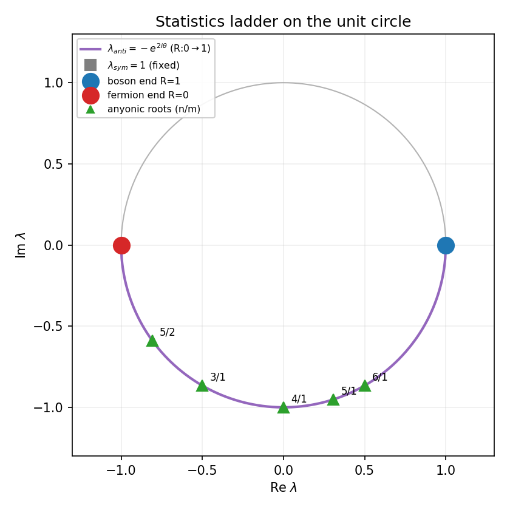
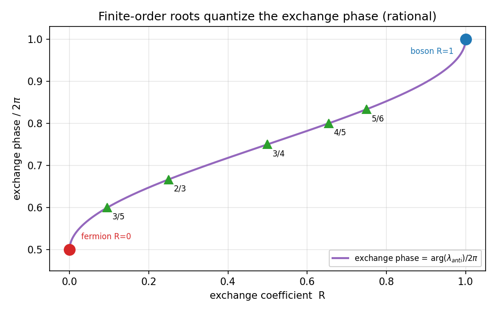

# 有限位数根と統計性の梯子
## AB二体交換散乱の固有値構造：ボゾン端・エニオン中間根・フェルミオン端の連続梯子

**著者:** 木原 範昭<br>
**ORCID:** 0009-0004-6753-4020<br>
**日付:** 2026年7月23日<br>
**Version DOI:** （公開時に付与）<br>
**Concept DOI:** （公開時に付与）<br>
**位置づけ:** 「時間軸Q軸とフェルミオンの生成構造」シリーズ・第3論文 v1

---

## 要旨

第1論文［本シリーズN1］は、非自明閉鎖が四半回転対（AB対）の重ね合わせに強制されることを示した。第2論文［本シリーズN2］は、分裂がこのAB平面を鋳造することを示した。本稿は、鋳造されたAB平面の**交換散乱**の固有値構造を調べ、統計性が連続した梯子として現れることを示す。

AB二体交換散乱行列 $U(R)$（$R$ は交換係数＝反射率、$\theta = \arcsin\sqrt{R}$）の固有値は、既刊の解析結果［6］により

$$
\lambda_{\text{sym}} = 1,
\qquad
\lambda_{\text{anti}} = -e^{2i\theta}
$$

である。本稿はこの構造から次を導く。

**統計性の梯子**（定理3.1）: 対称チャネル固有値 $\lambda_{\text{sym}}$ は $R$ に依らず恒等的に $+1$（ボゾン的共有チャネルは常に存在する）。反対称チャネル固有値 $\lambda_{\text{anti}}$ は常に単位円上（$|\lambda_{\text{anti}}| = 1$、中性）にあり、$R = 1$ で $+1$（交換なし・ボゾン的自明共有）、$R = 0$ で $-1$（完全交換・フェルミオン的）、中間で単位円上を動く。有限位数回帰 $U^n = I$ が成り立つのは反対称固有値が1の $n$ 乗根、すなわち $R = \cos^2(\pi m/n)$ のとき、かつそのときに限り、そこでは交換位相が有理数 $\pi m/n$ に量子化される（エニオン的）。統計性は $R=1$（ボゾン）$\to$ 有理根（エニオン）$\to$ $R=0$（フェルミオン）の梯子として並ぶ。

対照テストで検証したコード（既刊 phase5 の解析関数を import）により、$R \in [0,1]$ 全域で $\lambda_{\text{sym}} = 1$（誤差 $0$）・$|\lambda_{\text{anti}}| = 1$（誤差 $\le 1.11\times10^{-16}$）、端点で $\lambda_{\text{anti}} = \pm1$（フェルミオン端は厳密 $0$）、低位数根 $n=3\ldots6$ で $U^n = I$（$\le 1.78\times10^{-15}$）を確認した。

本稿は2体交換散乱という系（venue）における統計構造を確立するに留める。N体自発分裂の飽和平面が**どの根を選ぶか**という選択則は、飽和平面の実効交換係数 $R_{\text{eff}}$ を定義する対応（σスペクトルと $R$ の橋）を要し、本稿では確立しない——明示的に留保する。α等の物理定数への同定も本稿では扱わない。本稿は純粋に線形代数・数値的内容である。

---

## 0. 位置づけとスコープ

**扱うもの**: AB二体交換散乱行列 $U(R)$ の固有値構造と、それが与える統計性の連続梯子（ボゾン端・エニオン中間根・フェルミオン端）。venue は2体系である。

**扱わないもの（明示的留保）**:
1. **N体分裂の根選択**: N体自発分裂（第5論文）の飽和平面がどの $R = \cos^2(\pi m/n)$ に落ちるか。これは飽和平面から実効交換係数 $R_{\text{eff}}$ を取り出す対応写像（σスペクトル → 交換係数の橋）を要するが、その橋は現時点で定理・構成として存在しない。安易な同一視で埋めない（本シリーズ数値実験計画の規律）。
2. **天井1〜3割の Farey 勘定**（H2）: 別途。
3. **物理定数（αを含む）への同定**: 本シリーズでは扱わない。既刊バンドルに含まれる $\alpha^{-1}$ 対応は参照しない。

**再現性**: 本稿の数値はすべて、既刊「有限位数共鳴」コード［6］をシリーズ内へコピーし対照テストで公開結果の再現を確認したうえで、その検証済み関数を import して得た（§4）。

---

## 1. 序論

第1論文で、非自明閉鎖は四半回転対（AB対）に強制されることが示された。AB対とは、二成分が四半回転で結ばれた最小の閉鎖単位である。第2論文で、分裂はこのAB平面を階段状（rank $+2$ ずつ）に鋳造することが示された。

では、鋳造されたAB平面はどのような統計性を持つのか。AB二体の関係は交換散乱として記述され［6］、その交換の強度は反射率 $R \in [0,1]$ で表される。$R = 0$ は交換なし、$R = 1$ は完全交換に対応する（符号の規約は§2）。本稿の問いは、

> 交換係数 $R$ を動かすと、AB対の統計性はどう変わるか。

である。答えは連続的な梯子——ボゾンとフェルミオンは両端点、中間はエニオン——であり、有限位数回帰する特別な $R$ が根 $\cos^2(\pi m/n)$ に量子化される。この構造は2体交換散乱行列の固有値から厳密に従う。

---

## 2. 準備：交換散乱行列と固有値

### 2.1 交換散乱行列

反射率 $R \in [0,1]$、$\theta = \arcsin\sqrt{R}$ とし、交換散乱行列を［6］

$$
U(R) =
\begin{pmatrix}
\rho & \tau \\ \tau & \rho
\end{pmatrix},
\qquad
\tau = e^{i\theta}\cos\theta,
\quad
\rho = -i\,e^{i\theta}\sin\theta
$$

とする。$\tau$ は透過（同一状態の共有）、$\rho$ は反射（交換）の係数である。

### 2.2 固有値（引用）

**補題 2.1（［6］）**: $U(R)$ の固有値は

$$
\lambda_{\text{sym}} = 1,
\qquad
\lambda_{\text{anti}} = -e^{2i\theta}
$$

である。固有ベクトルはそれぞれ対称 $(1,1)/\sqrt2$（共有チャネル）と反対称 $(1,-1)/\sqrt2$（交換チャネル）。

**証明の要点**: $U$ は対称行列 $\begin{psmallmatrix}\rho&\tau\\\tau&\rho\end{psmallmatrix}$ で固有値は $\rho \pm \tau$。$\rho + \tau = e^{i\theta}(\cos\theta - i\sin\theta) = e^{i\theta}e^{-i\theta} = 1$、$\rho - \tau = -e^{i\theta}(\cos\theta + i\sin\theta) = -e^{2i\theta}$。$\square$

---

## 3. 主定理：統計性の梯子

### 3.1 梯子定理

**定理 3.1**: 補題2.1のもとで、

1. **（ボゾン的チャネルの恒存）** $\lambda_{\text{sym}} = 1$ は $R$ に依らず恒等的。対称（共有）チャネルは常に自明に閉じており、任意の $R$ でボゾン的共有が可能である。
2. **（中性）** $|\lambda_{\text{anti}}| = |-e^{2i\theta}| = 1$。反対称（交換）チャネルの固有値は常に単位円上にあり、交換は状態の大きさを変えない。
3. **（端点）** $R = 1$（$\theta = \pi/2$）で $\lambda_{\text{anti}} = -e^{i\pi} = +1$：交換なし、両固有値が縮退しボゾン的自明共有。$R = 0$（$\theta = 0$）で $\lambda_{\text{anti}} = -1$：完全交換、反対称、フェルミオン的。
4. **（有限位数＝エニオン量子化）** $U(R)^n = I$ が成り立つのは $\lambda_{\text{anti}}^n = 1$、すなわち $\lambda_{\text{anti}}$ が1の $n$ 乗根のとき、かつそのときに限る。これは

$$
-e^{2i\theta} = e^{i\pi(2k+1)/n}\ (\exists k)
\quad\Longleftrightarrow\quad
R = \cos^2\!\Big(\frac{\pi m}{n}\Big)
$$

に同値であり（$m$ は $\gcd(m,n)=1$ の適当な整数）、そこでは交換位相が有理数 $\pi m/n$ に量子化される（アーベリアン・エニオン）。

**証明**: (1)(2)(3) は補題2.1の直接評価（§4で機械精度確認）。(4): $\lambda_{\text{anti}} = -e^{2i\theta}$ を $1$ の $n$ 乗根に等置し、$\theta = \arcsin\sqrt R$ を代入すると $R = \cos^2(\pi m/n)$ を得る（既刊［6］の `resonant_R`、§4で再現）。$\square$

### 3.2 統計性の梯子としての読み

定理3.1は、統計性が離散的な二分（ボゾン/フェルミオン）ではなく、$R$ を降ろすにつれ

$$
\underbrace{R=1}_{\text{ボゾン}}
\;\longrightarrow\;
\underbrace{R=\cos^2(\pi m/n)\ (n\ge3)}_{\text{エニオン（有理位相）}}
\;\longrightarrow\;
\underbrace{R=0}_{\text{フェルミオン}}
$$

と並ぶ連続梯子であることを示す。フェルミオン（$R=0$、$\lambda_{\text{anti}}=-1$、位数 $n=2$）とボゾン（$R=1$）はこの梯子の両端点であり、中間の有限位数根はエニオン的統計の量子化点である。

**注意 3.3（次元条件）**: エニオン的中間統計（$\pm1$ 以外の交換位相）が物理的に意味を持つのは、交換がブレイド群に従う2次元回転平面上である。第1論文・第2論文により、本モデルの関係波は2次元回転平面（AB平面）として鋳造されるため、中間統計が許される場に最初から住んでいる。3方向の空間読出しへ射影した段階で交換が置換群に落ち $\pm1$ に二分される機構は、本シリーズ後続および展望ノートで扱う。

### 3.3 第1・第2論文との接続

- 第1論文: 非自明閉鎖は四半回転対（AB対）に強制される。本稿の $U(R)$ はそのAB対の交換を記述する。
- 第2論文: 分裂はAB平面を rank $+2$ ずつ鋳造する。鋳造された各平面が本稿の梯子上のどこか（ある $R$）に対応する。
- フェルミオン根 $R=0$（$n=2$）は、四半回転 $-1$（第1論文の虚対の二乗）と同じ $-1$ であり、統計性の生成子と閉鎖の生成子が同じ位数2の $-1$ を共有する。

ただし、**分裂した平面が実際にどの $R$ を選ぶか**（梯子上のどこに落ちるか）は本稿では決定しない（§0の留保1）。本稿が確立するのは梯子の構造であって、N体力学の梯子上の着地点ではない。

---

## 4. 数値検証（シリーズ内完結）

すべて同梱ディレクトリ `検証_対照実験/N3_有限位数共鳴_対照/` に完結する。既刊「有限位数共鳴」コード［6］を本シリーズへコピーし、対照テストののち検証済み関数を import した。

### 4.1 対照テスト（`control_test_v1.py`）

コピーした `phase5_eigenphase_resonance_v2.py` の解析関数で、公開論文の根値を再現した。実行結果（2026年7月23日）:

```text
  R_{124,23}: resonant_R=0.697177927556659  公開値=0.697177927556659  |U^124-I|=1.24e-14
  R_{122,23}: resonant_R=0.688363946817593  公開値=0.688363946817593  |U^122-I|=1.83e-14
根値の公開基準との最大差:   4.44e-16（0 が予言）
対称固有値 λ_sym−1 の最大:  0.00e+00（0 が予言）
U^n 復帰誤差の最大:         1.83e-14（機械精度で0）
対照テスト: PASS（公開結果を再現）
```

### 4.2 統計の梯子（`statistics_ladder_extension_v1.py`）

対照テスト済み関数を import し、定理3.1を機械精度で確認した。実行結果（2026年7月23日）:

```text
=== L1/L2: R∈[0,1] 全域（2001点） ===
  対称固有値 max|λ_sym−1|      = 0.00e+00（0＝ボゾン的チャネル恒存）
  反対称固有値 max||λ_a|−1|    = 1.11e-16（0＝中性・単位円上）

=== L3/L4: 統計の梯子 R=cos²(πm/n) ===
        統計   n   m            R    λ_a位相/2π    |U^n-I|
      ボゾン端   1   0     1.000000     1.00000          —
      エニオン   3   1     0.250000     0.66667   8.24e-16
      エニオン   4   1     0.500000     0.75000   8.88e-16
      エニオン   5   1     0.654508     0.80000   1.21e-15
      エニオン   5   2     0.095492     0.60000   8.38e-16
      エニオン   6   1     0.750000     0.83333   1.78e-15
   フェルミオン端   2   1     0.000000     0.50000   0.00e+00

ボゾン端 |λ_a−1|      = 1.22e-16（0 が予言）
フェルミオン端 |λ_a+1| = 0.00e+00（0 が予言）
有限位数根 max|U^n−I|  = 1.78e-15（機械精度で0）
判定: PASS（統計の梯子が機械精度で成立）
```

反対称固有値の位相が各根で有理数（$2/3, 3/4, 4/5, 3/5, 5/6, 1/2$）に量子化されること、端点で厳密に $\pm1$ になること、根で $U^n=I$ が機械精度で成立することが確認された。

固有値構造を図1・図2に示す。



**図1.** 複素単位円上の固有値。$\lambda_{\text{sym}}=1$（固定点）と、$R$ を $0\to1$ と動かしたときの $\lambda_{\text{anti}}=-e^{2i\theta}$ の軌跡（下半円）。フェルミオン端 $R=0$（$-1$、赤）、ボゾン端 $R=1$（$+1$、青）、中間の有限位数根 $n/m$（緑三角）。統計性が二分でなく単位円上の連続梯子であることを示す。（`検証_対照実験/N3_有限位数共鳴_対照/figures/N3_fig1_eigenvalue_unit_circle.svg`／`.png`）



**図2.** 交換係数 $R$ に対する交換位相 $\arg(\lambda_{\text{anti}})/2\pi$。連続曲線がフェルミオン端（$R=0$、位相 $1/2$）からボゾン端（$R=1$、位相 $1$）へ上昇し、有限位数根 $R=\cos^2(\pi m/n)$ で位相が有理数 $(n-m)/n$（$3/5, 2/3, 3/4, 4/5, 5/6$）に量子化される（エニオン量子化）。（同ディレクトリ `N3_fig2_statistics_ladder.svg`／`.png`）

---

## 5. 適用範囲と限界

1. **venue は2体**: 本稿の梯子は2体交換散乱の固有値構造であり、この venue で厳密・解析的である。
2. **N体の根選択は未決定**（§0留保1）: N体自発分裂の飽和平面がこの梯子のどこに落ちるかは、σスペクトルから交換係数 $R_{\text{eff}}$ への橋を要し、本稿では確立しない。予備的な直接測定では N体飽和σ比は N 依存で低位数根に乗らず、この橋が自明でないことが判明している（本シリーズ数値実験計画に記録）。安易な同一視をしない。
3. **二分への射影**（注意3.3）: 中間エニオン統計が空間読出しで $\pm1$ に二分される機構は後続の主題。
4. **物理定数の同定は範囲外**: α等への対応は本稿では扱わない。
5. **符号・規約**: 交換係数 $R$ と反射率の対応、$\theta=\arcsin\sqrt R$ の規約は［6］に従う。

---

## 6. 結論

1. **統計性の梯子**（定理3.1）: AB二体交換散乱 $U(R)$ の固有値は $\lambda_{\text{sym}}=1$（ボゾン的チャネル恒存）と $\lambda_{\text{anti}}=-e^{2i\theta}$（中性・単位円上）。統計性は $R=1$ ボゾン $\to$ 有理根 $R=\cos^2(\pi m/n)$ エニオン $\to$ $R=0$ フェルミオンの連続梯子。
2. **有限位数＝エニオン量子化**: $U^n=I \Leftrightarrow R=\cos^2(\pi m/n)$、交換位相が $\pi m/n$ に量子化。
3. **端点の厳密性**: フェルミオン端 $R=0$ で $\lambda_{\text{anti}}=-1$ 厳密・$U^2=I$、ボゾン端 $R=1$ で縮退。
4. **接続**: フェルミオン根の $-1$ は第1論文の四半回転生成子の $-1$（位数2）と一致。分裂平面（第2論文）はこの梯子上に載る。
5. **留保**: N体分裂の根選択は σ→R の橋を要し未確立。物理定数同定は範囲外。
6. **数値検証**: 対照テスト（公開結果再現 PASS）＋梯子の機械精度確認 PASS。シリーズ内完結。

本稿は統計性の連続梯子を2体 venue で確立した。分裂平面がこの梯子上のどこに落ちるかという選択則は、対応写像の構築を待って別途扱う。

---

## 参考文献

［1］ 木原範昭, 「非自明閉鎖の偶数定理とAB二部構造」（本シリーズ第1論文）, Zenodo. Concept DOI: （公開時）.

［2］ 木原範昭, 「分裂は平面を鋳造する — 生成子ランクの偶数階段」（本シリーズ第2論文）, Zenodo. Concept DOI: （公開時）.

［3］ 木原範昭, 「無名等振幅複合波モデル基本公理系 v8」, Zenodo. Concept DOI: 10.5281/zenodo.21315735.

［4］ 木原範昭, 「N体固定生成子系における平面分解読出し」（「次元の生成構造」第4論文）, Zenodo. Concept DOI: 10.5281/zenodo.21468959.

［5］ 木原範昭, 「N体関係波閉鎖系における自発的分裂の開始と帰結分類」（「次元の生成構造」第5論文）, Zenodo. Concept DOI: 10.5281/zenodo.21486233.

［6］ 木原範昭, 「反復交換散乱の有限位数共鳴」（「波の情報読出し」シリーズ）, Zenodo. Concept DOI: 10.5281/zenodo.21421366.

---

## 付録A: 選択の監査リスト

| 選択 | 身分 | 分岐 |
|---|---|---|
| 交換散乱行列の形 $U(R)$ | 規約（正本は［6］） | 対照テストで公開結果を再現。別規約なら［6］に従い再検 |
| 固有値 $\lambda_{\text{sym}}=1,\ \lambda_{\text{anti}}=-e^{2i\theta}$ | 補題（［6］、§2.2で証明） | 交換散乱行列から一意 |
| 根 $R=\cos^2(\pi m/n)$ | 定理（§3.1、［6］の `resonant_R`） | $U^n=I$ から一意。§4.2で機械精度確認 |
| venue = 2体 | スコープの明示的限定 | N体への拡張は σ→R の橋を要し留保（§5-2） |
| 力学コードの出所 | ［6］コードのコピー＋対照テスト（§4.1） | 独自再実装なし。公開結果再現を通過したコードのみ import |

連続的な自由パラメータは本稿の主張に現れない。

---

## 付録B: 再現スクリプト（シリーズ内完結）

すべて `検証_対照実験/N3_有限位数共鳴_対照/` に置く。

- `finite_order_resonance_v1/`: 既刊「有限位数共鳴」再現バンドル［6］のコピー。
- `control_test_v1.py`: 対照テスト（§4.1）。phase5 の関数で公開根値を再現、**PASS**。
- `statistics_ladder_extension_v1.py`: 対照テスト済み関数を import し、統計の梯子（定理3.1）を機械精度で確認（§4.2）、結果 `statistics_ladder_result_v1.json`。実行時に図1・図2（`figures/N3_fig1_eigenvalue_unit_circle.svg`／`.png`、`figures/N3_fig2_statistics_ladder.svg`／`.png`）を同時生成する。

いずれも独自再実装を含まず、公開結果を再現したコードの関数のみを用いる。図も同スクリプトが生成するため、どの数値から描いたかがコードで追える。
