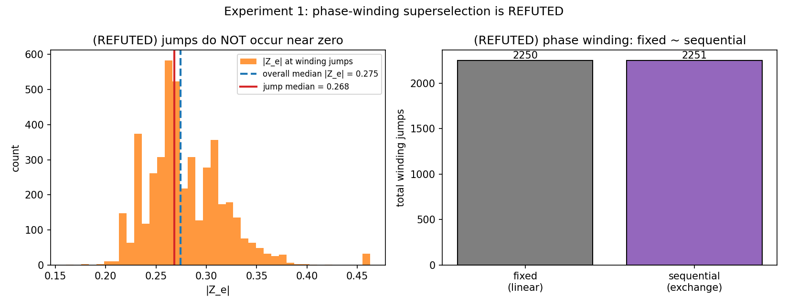
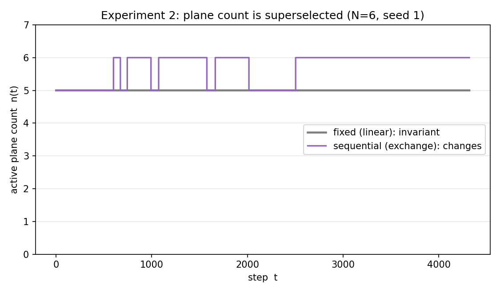
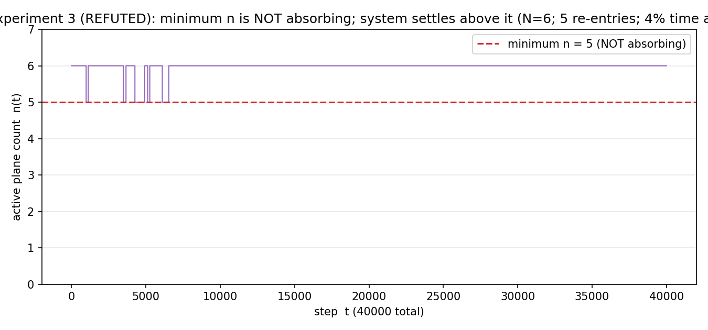

# 平面数の超選択と吸収底の不在
## 保存される整数は位相巻き数でなく活性平面数である：仮説の反証と修正の記録

**著者:** 木原 範昭<br>
**ORCID:** 0009-0004-6753-4020<br>
**日付:** 2026年7月23日<br>
**Version DOI:** （公開時に付与）<br>
**Concept DOI:** （公開時に付与）<br>
**位置づけ:** 「時間軸Q軸とフェルミオンの生成構造」シリーズ・第4論文 v1

---

## 要旨

本稿は、閉鎖保存力学における「超選択される整数」を同定する。当初、二つの作業仮説を立てた——(H11) 各関係波成分の**位相巻き数**が、線形発展（干渉）では不変で、交換散乱でのみ整数変化する超選択量である；(H12) 保存量でラベルされる各セクターに絶対安定な**底**があり、そこに達すると系は出られない（吸収）。本稿の目的はこの二仮説の検証であったが、対照テスト済みの第5論文力学による数値実験は**両仮説を反証した**。

**実験1（H11 の反証）**: 位相巻き数の整数ジャンプは、固定生成子（線形発展）と逐次再構成（交換散乱）で同数（2250 対 2251）生じ、ジャンプ時の振幅 $|Z_e|$ の中央値（0.268）は全体中央値（0.275）と区別できなかった。位相巻き数は超選択されず、ゼロ交差による位相的保護も見られない。

**仮説の修正**: 位相巻き数が超選択量でないなら、線形発展で不変・交換でのみ変化する整数は別にあるはずである。候補として活性回転平面数 $n(t)$ を立てた。

**実験2（修正仮説の確立）**: 固定生成子（線形発展）では $n(t)$ が全試行で**厳密に一定**（変化0回）、逐次再構成（交換散乱）でのみ整数変化した（総50回）。閉鎖量 $Z^{\mathsf T}Z$ は両モードで機械精度保存（$\le 2.0\times10^{-14}$）。**超選択される整数は活性平面数である。**

**実験3（H12 の反証）**: 40000ステップの長時間ランで、$n(t)$ は最小値に達した後に再上昇し、8試行すべてで最小値に吸収されなかった（最小値滞在率の中央値 0.026）。準安定状態の底は絶対安定ではなく、系は最小値より高い準位へ定着する。「セクター底の絶対安定」は成立しない——これは第3論文の「準安定＝限界安定（marginal, not asymptotic）」と整合する。

以上より、超選択量は位相巻き数でなく活性平面数であること、および準安定域には吸収底が存在しないことを、実験によって確定した。本稿は当初仮説・反証・修正・再実験の全過程を記録する。すべての数値は本シリーズ内のプログラムで独立に検算でき（対照テスト済み第5論文コードの import）、図はそのスクリプトが生成する。物理的解釈は行わない。

---

## 0. 位置づけとスコープ

本稿は「時間軸Q軸とフェルミオンの生成構造」シリーズ第4論文である。第2論文で、分裂が平面を rank $+2$ ずつ鋳造する（増分は偶数）ことを示した。本稿は、その平面数が**超選択量**であること——線形発展で不変、交換散乱でのみ変化する——を同定し、あわせて当初の作業仮説（位相巻き数超選択・セクター底安定）が実験で反証されたことを記録する。

**扱うもの**: 閉鎖保存力学における超選択される整数の同定（実験）と、当初二仮説の反証の記録。

**扱わないもの**:
1. **寿命の定量則（Farey 密度）**: H12 の系として想定した「寿命 $\propto$ 通約可能チャネル密度」は、吸収底の不在（実験3）により前提を失った。飽和平面の実効交換係数 $R_{\text{eff}}$ への対応写像（第3論文で留保した σ→R の橋）も未確立であり、寿命の定量則は本稿では扱わない。
2. **セクター（$c$）依存性**: 本稿の初期状態群はすべて閉鎖量 $c = |Z^{\mathsf T}Z|/\lVert Z\rVert^2 = 0$ であった。$c>0$ セクターでの底の振る舞いは未検証（§5-3）。
3. **物理的解釈**。

**再現性**: 全数値は対照テスト済み第5論文コード［3］の力学関数を import して得た（§2）。

---

## 1. 序論と当初の作業仮説

第1論文で閉鎖はAB対に強制され、第2論文でAB平面が鋳造されることを示した。自然な次の問いは、この過程で**何が保存する整数（超選択量）か**である。物質のフレーバーや電荷が容易に変わらないことの類推から、当初、次の二仮説を立てた。

**作業仮説 H11（位相巻き数超選択）**: 各関係波成分 $Z_e(t)$ の位相巻き数 $W_e = \arg(Z_e)/2\pi$（複素平面上を原点まわりに回る回数）は、線形発展（干渉＝固定生成子による通過）では不変であり、変更は生成子を状態から作り直す操作＝交換散乱でのみ、整数刻みで起こる。整数量ゆえ連続ドリフトできず、変更には振幅の厳密ゼロ交差（$|Z_e|=0$）を要する（位相的保護）。

**作業仮説 H12（セクター底の絶対安定）**: 閉鎖量 $c$ でラベルされる各セクター内に、最小活性平面数の「底」配置が存在し、それに達すると系はそこから出られない（吸収・絶対安定）。底でない配置は有限寿命を持つ。

本稿はこの二仮説の検証を目的とする。以下、実験がこれらをどう扱ったかを順に記す。

---

## 2. 方法（シリーズ内完結）

すべて同梱ディレクトリ `検証_対照実験/N2_第5論文_自発的分裂_対照/` に完結する。第5論文［3］の再現パッケージを本シリーズへコピーし、対照テスト（`control_test_v1.py`、**714フィールドで公開結果と完全一致**）で再現を確認したうえで、その力学関数（`sine_generator`／`cayley`／`prepare_initial_state`／`line_graph_adjacency`）を import した。独自再実装は行わない。

- **線形発展（固定生成子）**: 初期位相から生成子 $K_0$ を作り凍結、$U=\text{Cayley}(K_0)$ を反復適用（干渉＝線形通過）。
- **交換散乱（逐次再構成）**: 毎ステップ現在位相から $K$ を作り直す（第5論文の実験O1）。
- **活性平面数** $n(t) = \#\{\mu(iK) > 0.05\}$（第2論文と同じ、rank$/2$）。
- **位相巻き数** $W_e(t)$: $\arg(Z_e)$ を毎ステップ非巻き戻し（unwrap）して累積。

---

## 3. 実験1：位相巻き数超選択（H11）の反証

### 3.1 測定前に固定した予言

H11 が正しければ: (a) 位相巻き数の整数ジャンプは $|Z_e|$ のゼロ近傍交差でのみ起こる（ジャンプ時 $|Z_e|$ が全体分布より有意に小さい）；(b) 固定生成子（線形）でのジャンプ総数が逐次（交換）より遥かに少ない。

### 3.2 結果

$N=5,6$・各3乱数種・両モード、各4320ステップ。

| 予言 | 測定 | 判定 |
|---|---|---|
| (a) ジャンプはゼロ近傍で | ジャンプ時 $|Z_e|$ 中央値 $=0.268$、全体中央値 $=0.275$（比 0.976） | **反証** |
| (b) 固定 $\ll$ 逐次 | 固定ジャンプ総数 $2250$、逐次 $2251$（ほぼ同数） | **反証** |
| （参考）$Z^{\mathsf T}Z$ 保存 | 最大偏差 $2.0\times10^{-14}$ | 成立 |

位相巻き数のジャンプは、両モードで同数、かつ一般的な振幅で起きる。これは各成分が普通に回転して巻き数が時計として累積するだけであり、**超選択の signature ではない**。位相的保護（ゼロ交差要件）も見られない。



**図1.** 実験1（H11 の反証）。左: 巻き数ジャンプ時の $|Z_e|$ の分布（橙）は全体中央値（青破線 0.275）と重なり、ジャンプ中央値（赤 0.268）も区別できない——ゼロ近傍交差は不要。右: 固定生成子（線形）2250 と逐次（交換）2251 でジャンプ総数がほぼ同数——モードで区別されず超選択でない。（`検証_対照実験/N2_第5論文_自発的分裂_対照/figures/N4_fig1_winding_refuted.svg`／`.png`、生成 `winding_superselection_extension_v1.py`）

### 3.3 仮説の修正

位相巻き数は超選択量でない。しかし、線形発展で不変・交換でのみ変化する整数が存在するなら、それは別の量のはずである。第2論文で、分裂（＝交換散乱）は活性平面数を整数変化させることが分かっていた。そこで**修正仮説：超選択される整数は活性平面数 $n(t)$ である**を立て、実験2で検定する。

---

## 4. 実験2：平面数超選択（修正仮説）の確立

### 4.1 測定前に固定した予言

修正仮説が正しければ: (S1) 固定生成子（線形発展）で $n(t)$ が不変（完全一定）；(S2) 逐次（交換散乱）でのみ $n(t)$ が整数変化する。

### 4.2 結果

$N=5,6$・各3乱数種・両モード、各4320ステップ。

| 予言 | 測定 | 判定 |
|---|---|---|
| (S1) 固定で $n(t)$ 一定 | 全6試行で変化 0 回（$n$ 完全一定） | **成立** |
| (S2) 逐次で $n(t)$ 変化 | 総変化 50 回（整数刻み） | **成立** |
| （参考）$c$ 保存 | 変動幅 $\le 10^{-14}$ | 成立 |

固定生成子では活性平面数が厳密に一定に留まり、交換散乱でのみ整数変化する。**超選択される整数は活性平面数である。**



**図2.** 実験2（平面数超選択の確立）。$N=6$ seed 1 の活性平面数 $n(t)$。固定生成子（線形発展、灰）は $n=5$ に完全一定——線形発展は平面数を変えない。逐次（交換散乱、紫）は $n=5,6$ を整数で行き来する——変更は交換散乱でのみ。（同ディレクトリ `N4_fig2_plane_superselection.svg`／`.png`、生成 `superselection_candidate_test_v1.py`）

### 4.3 解釈

超選択の機構は、第2論文の平面鋳造定理と整合する。線形発展は既存の生成子の固有平面をそのまま回すだけで、平面の数（rank$/2$）を変えられない。平面数の変更は生成子を作り直す操作＝交換散乱を要し、そのとき rank は偶数（$\pm2$）で変わる（第2論文）。位相巻き数が超選択されない（実験1）のは、位相は既存平面内で自由に回れるからである——**超選択されるのは「いくつの平面が立っているか」であって、各平面が「何回転したか」ではない**。

---

## 5. 実験3：セクター底の絶対安定（H12）の反証

### 5.1 測定前に固定した予言

H12 が正しければ: (F1) 逐次ランで $n(t)$ が最小値 $n_{\min}$ に達した後、そこに留まる（吸収・再上昇しない）。

### 5.2 結果

$N=5,6$・各4乱数種、各40000ステップ（長時間）。

| 予言 | 測定 | 判定 |
|---|---|---|
| (F1) 底に吸収 | 8試行すべてで最小値到達後に再上昇（吸収 0/8）。最小値滞在率の中央値 0.026、平均再上昇 3.8 回 | **反証** |

系は最小活性平面数に達しても、そこに留まらず再上昇し、最小値より高い準位へ定着する。準安定状態の底は絶対安定な吸収状態ではない。



**図3.** 実験3（H12 の反証）。$N=6$ seed 0、40000ステップの $n(t)$。最小値 $n=5$（赤破線）は吸収せず、系は最小値より高い準位（$n=6$）へ定着する。最小値には初期に数回訪れるのみ（滞在率 4%）。「底＝最小配置が絶対安定」は成立しない。（同ディレクトリ `N4_fig3_no_absorbing_floor.svg`／`.png`、生成 `sector_floor_lifetime_test_v1.py`）

### 5.3 解釈

「吸収底の不在」は第3論文の統計の梯子で確立した**準安定＝限界安定（marginal stability, not asymptotic）**と整合する。有限位数根に落ちた平面は指数増幅も指数減衰もせず回帰的に振動する。ゆえに系は最小配置へ単調減衰せず、限界安定な準位のまわりで整数の出入りを続ける。当初 H12 が想定した「単調減衰して底に吸収」という描像（漸近安定）は、この系の限界安定性と整合しない。

したがって、H12 の系として構想した「寿命 $\propto$ 通約可能チャネル密度（Farey 密度）」も前提（吸収底の存在）を失う。寿命の定量則は、限界安定な準位の滞在時間分布として別途定式化すべき課題として残る（§6）。

---

## 6. 適用範囲と限界

1. **超選択量の同定は活性平面数について**: 実験1・2は活性平面数が超選択量であること、位相巻き数がそうでないことを示した。他の候補（閉鎖量 $c$ は保存する実数で整数量でない）は超選択整数の候補から外れる。
2. **$c=0$ セクターのみ**: 実験3の初期状態はすべて $c=0$。$c>0$ セクターで底の振る舞いが変わる可能性は未検証。$c>0$ 初期状態の構成は今後の課題。
3. **寿命則は未確立**: 吸収底の不在により、当初の Farey 密度則は前提を失った。限界安定準位の滞在時間分布としての再定式化は別稿。
4. **閾値・分解能**: $n(t)$ の活性閾は 0.05（第2論文と共通、相対値）。
5. **物理的解釈の不在**: 本稿は行列代数と数値の範囲で完結する。

---

## 7. 結論

閉鎖保存力学における超選択について、当初仮説・反証・修正・再実験の全過程を経て以下を確定した。

1. **H11（位相巻き数超選択）は反証**（実験1、図1）: 位相巻き数のジャンプは線形/交換で同数・一般振幅で起き、超選択でも位相的保護でもない。
2. **修正仮説の確立**（実験2、図2）: 超選択される整数は**活性平面数**である。固定生成子（線形発展）で厳密に一定、交換散乱でのみ整数変化する。$Z^{\mathsf T}Z$ は両モードで機械精度保存。
3. **H12（セクター底の絶対安定）は反証**（実験3、図3）: 最小活性平面数は吸収底でなく、系は最小値より高い準位へ定着する（吸収 0/8）。これは第3論文の限界安定性と整合する。
4. **超選択の機構**: 線形発展は既存平面を回すのみで平面数を変えられず、変更は交換散乱（生成子再構成）を要する。超選択されるのは平面の数であって各平面の回転数（位相巻き数）ではない。

当初の作業仮説を実験が正した。反証された二仮説（位相巻き数超選択・吸収底）は、無視したのではなく検証して退けたものであり、その反証データを本稿に記録する。次論文以降で、限界安定準位の滞在時間分布と、$c>0$ セクターでの底の振る舞いを扱う。

---

## 参考文献

［1］ 木原範昭, 「非自明閉鎖の偶数定理とAB二部構造」（本シリーズ第1論文）, Zenodo. Concept DOI: （公開時）.

［2］ 木原範昭, 「分裂は平面を鋳造する — 生成子ランクの偶数階段」（本シリーズ第2論文）, Zenodo. Concept DOI: （公開時）.

［3］ 木原範昭, 「N体関係波閉鎖系における自発的分裂の開始と帰結分類」（「次元の生成構造」第5論文）, Zenodo. Concept DOI: 10.5281/zenodo.21486233.

［4］ 木原範昭, 「有限位数根と統計性の梯子」（本シリーズ第3論文）, Zenodo. Concept DOI: （公開時）.

---

## 付録A: 選択の監査リスト

| 選択 | 身分 | 分岐 |
|---|---|---|
| 力学コードの出所 | 第5論文コードのコピー＋対照テスト（714フィールド完全一致） | 独自再実装なし。import のみ |
| 超選択量の候補 | 実験で選別（位相巻き数=反証、平面数=確立） | 事後選択でなく、実験1の反証を受けて修正仮説を立て実験2で検定 |
| 活性閾値 0.05 | 規約（相対値、第2論文と共通） | 閾非依存は第2論文で確認済み |
| $n(t)$ の測定 | 生成子固有値ベース（状態射影でない） | 状態射影の漏れ込み（予備探索で判明）を回避 |
| 初期状態 $c=0$ | prepare_initial_state の帰結 | $c>0$ は未検証（§5-2） |

連続的な自由パラメータは本稿の主張に現れない。

---

## 付録B: 再現スクリプト（シリーズ内完結）

すべて `検証_対照実験/N2_第5論文_自発的分裂_対照/` に置く。対照テスト済み第5論文モジュールを import し、各実験と図を生成する。

- `control_test_v1.py`: 対照テスト（第5論文公開結果を714フィールド完全一致で再現、PASS）。
- `winding_superselection_extension_v1.py`: 実験1（位相巻き数の反証）。図1を生成。
- `superselection_candidate_test_v1.py`: 実験2（平面数超選択の確立）。図2を生成。
- `sector_floor_lifetime_test_v1.py`: 実験3（吸収底の反証、40000ステップ）。図3を生成。

いずれも独自再実装を含まず、対照テストを通過したコードの関数のみを用いる。図も同スクリプトが生成するため、どの数値から描いたかがコードで追える。

実行結果（2026年7月23日）:

```text
実験1: 固定ジャンプ総数=2250, 逐次ジャンプ総数=2251, ジャンプ時|Z|中央=0.268, 全体|Z|中央=0.275
実験2: (S1)固定生成子で n(t) 完全一定=全試行YES, (S2)逐次で n(t) 変化=総50回 ⇒ PASS
実験3: 底吸収したラン=0/8, 底滞在率中央値=0.026 ⇒ FAIL（吸収底なし・H12反証）
```
