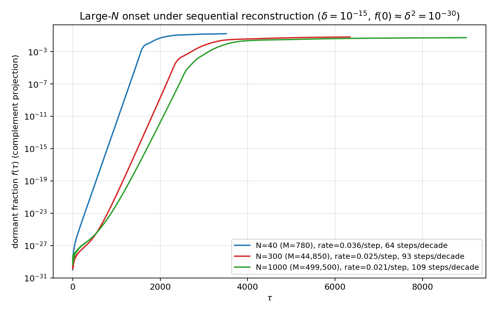

# 実験O6：原本対照再現結果 v1

実施日：2026年7月24日

## 1. 結論

前シリーズ第5論文の大N開始走行は、次の構成で実行されていた。

1. `run_n_scaling_lowrank_v1.py`：低ランク頂点分解エンジン
2. `run_spontaneous_splitting_largeN_v1.py`：Nごとの独立走行とCSV/JSON出力
3. `make_largeN_figure_v1.py`：保存された3系列の集約作図

論文図の体数は `N=40,300,1000` であり、`N=3,100,1000` ではない。

原本コードを新シリーズ側で再確認した結果、上記三ファイルは前シリーズ原本およびGit履歴の双方とSHA-256が一致した。数式や反復を改変せず、出力先だけを空の `O6_原本対照結果_v1/` に隔離した。

## 2. 実験系の正当性ゲート

低ランク頂点分解と密行列実装を `N=12`、同一初期値、300ステップで比較した。

| 検証量 | 結果 | 合格上限 |
|---|---:|---:|
| 行列ベクトル積の相対誤差 | `1.5573e-16` | `1e-12` |
| `G=W^T W` の相対誤差 | `8.7274e-17` | `1e-12` |
| 特異値スペクトル最大誤差 | `2.0822e-15` | `1e-12` |
| 300ステップ軌道最大偏差 | `5.5757e-14` | `1e-11` |

全項目が合格した。したがって、論文が用いた低ランク化は密行列力学を別の力学へ置換していない。

検証記録：`O6_原本対照結果_v1/validation_dense_N00012_seed0.json`

## 3. 原論文軌道の対照再現

共通条件は `delta=1e-15`、`seed=0`、`cap=9000`、`after=1500`、`tol=1e-12` とした。

| N | 扱い | CSV比較 | 時間以外のJSON比較 | 閾値交差 τ | 判定 |
|---:|---|---|---|---:|---|
| 40 | 隔離環境で再実行 | SHA-256完全一致 | 完全一致 | 2011 | 再現 |
| 300 | 隔離環境で再実行 | SHA-256完全一致 | 完全一致 | 4844 | 再現 |
| 1000 | 再実行を省略し原論文保存値を導入 | 原本ハッシュ一致 | 原本値一致 | 7926 | 参照値 |

`N=40` のCSVハッシュは
`b0b7a742c4092365662f4848f0cc163c800e550981da538fcfa09f563517c735`、
`N=300` は
`5f0821a106d3c11a2156254961cf57e0d593ff9e3e91f4ab37b70427d2a26f14`
であり、前シリーズの保存CSVと一致した。

`N=1000` は計算時間が長いため、研究判断により今回の再実行を省略した。原論文保存CSV
`ff708d9a39e7f72401a85064d07639bf9a0fb2df5dbcc0349eaf9ef4c3a9e534`
を参照系列として導入し、
`provenance_reference_N01000_delta1e-15_seed0.json`
に「再実行ではない」ことを記録した。

## 4. 既存コピーで見つかった問題

既存の `largeN_splitting_result_v1/` には、論文図に含まれない後発の `N=4` CSVが混入していた。原作図器はディレクトリ内のCSVをN順に並べて先頭3本だけを描くため、この状態で作図すると `N=4,40,300` が選ばれ、原論文図にならない。

また、既存コピーに保存されていた `N=1000` CSVは、前シリーズ原本の保存CSVと一致しなかった。したがって既存の集約出力を対照の正本にはせず、新しい空の出力ディレクトリを使用した。

## 5. 集約図

`N=40,300` の再生成CSVと、来歴を明記した `N=1000` の原論文参照CSVだけを入力として、原本作図器で集約図を生成した。

三系列の読みは、この対照段階では次に限定する。

- `f(0)≈1e-30` から指数的増幅が始まる
- 初期成長率は `N=40,300,1000` の順に低下する
- 各系列は指数区間を離れ、増加が鈍る領域へ移る

この対照には、時間軸・Q軸・フェルミオン性・σ比・有効ランク等の後発仮説を持ち込んでいない。次の調査では、この固定された `f(τ)` を基準データとして、まず「指数増幅から準安定域へ移る理由」と「準安定振幅のN依存」を測定定義から組み直す。
