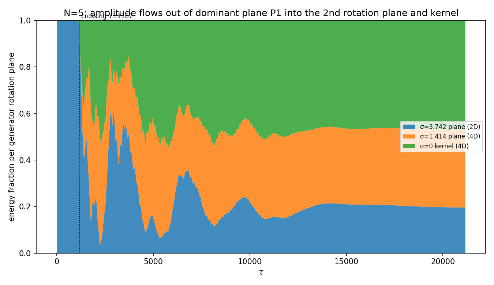

# 第6論文（仮説）自発的分裂の停止と時間軸・Q軸の創生機構

2026-07-24。前シリーズ「次元の生成構造」第5論文（N体関係波閉鎖系における自発的分裂の
開始と帰結分類）を原本力学とし、それを一切変更せずに計装した実験から、次の三つの謎に
対する現時点の答え（確定・仮説・未導出を峻別）を与える。

1. なぜインフレーション的な拡大が、準安定状態に移行するように見えるのか
2. なぜ準安定状態の振幅が、Nスケールと双対な関係に見えるのか
3. なぜ xyzR しかなかった系に、tQ1Q2Q3 が生まれるのか

本稿は仮説論文である。数式的に強制される主張と、検証可能だが未証明の予想と、
未着手の導出義務を、各節の末尾で明示的に分ける。

---

## 0. 方法と規約

- 原本三ファイル（`run_n_scaling_lowrank_v1.py` 他）は SHA-256 固定の不変対象。
  計装は原本ループを忠実複製し、走行ごとに f が原本とビット一致することを
  対照テストで確認する（本稿の全計装で f 最大偏差 0.0 を確認済）。
- 記号：波（頂点）N、関係（辺）M=N(N−1)/2、状態 Z∈ℂ^M、
  休眠フラクション f(τ)=‖Z−親平面射影‖²/‖Z‖²、閉鎖 Q(Z)=Σ_e Z_e²。
- δ=10⁻¹⁵、seed=0、RNG=`default_rng(40260722+1000N+seed)`、γ=tan(π/144)。

---

## 1. 系は二公理の力学的実現である

E8創出文書（`E8対称性の創出原理の考察.md`）の二公理を、この系はそのまま満たす。

- **公理1 非自明零二乗閉鎖 Q(X)=Σx²=0, X≠0** ⟺ 零閉鎖 Z^TZ=0。
  Cayley更新はこれを厳密保存（全走行で偏差 ≤10⁻¹⁴、代表 10⁻¹⁵）。
- **公理2 有限回帰 Uⁿ=I** ⟺ 更新はユニタリ、親は円偏波固有モードで
  厳密周期軌道（Uv=e^{−iθ}v、1周期144ステップで生成子変動 ~10⁻¹³）。

したがって本稿の力学は、E8文書が §8 で要求する「Q(X)=0 と Uⁿ=I を満たす具体的な
相互作用・読出し機構」の候補である。三つの謎への答えは、この機構の内部構造として与える。

---

## 2. 問い①：拡大 → 準安定の移行

### 2.1 拡大の正体（確定）：位相帰還によるパラメトリック増幅

生成子 K(θ) は位相 θ=arg(Z) のみに依存し（振幅非依存、`set_theta`）、K は実反対称。
娘成分が親の位相をずらし→ずれた K が親ノルムを娘方向へ漏らす、という自己無撞着
帰還ループで f が幾何級数的に育つ。

**対照実験（生成子凍結）**：K を親位相に固定すると、同じ種でも f は 10⁻²⁷ のまま
2000ステップ不成長。凍結解除すると30桁増幅して f=0.70（N=6）。増幅の源は
K の中身でなく位相帰還であることの直接証明。成長率 d(log f)/dτ ≈ 2λ⊥
（全ヤコビアン横方向成長率）と一致（N=6 で 2λ≈0.044）。

### 2.2 停止の正体（確定＋会話中の反証）

ノルムは厳密保存（ユニタリ）なので、拡大は無からの増幅でなく
**親平面ノルムを源泉とする再配分**。指数則は親がほぼ無傷な線形域だけ。

当初「資源（親ノルム）枯渇で停止」と考えたが、**これは大Nで反証された**。
プラトーで親に残る資源 1−f を測ると：

| N | 天井 f | 親に残る資源 1−f | 判定 |
|---|--------|------------------|------|
| 5 | 0.80 | 0.20 | 親ほぼ枯渇 |
| 40 | 0.20 | 0.80 | 親ほぼ無傷なのに停止 |
| 300 | 0.083 | 0.917 | 親ほぼ無傷なのに停止 |

N=40,300 は親が80〜92%残ったまま拡大が止まる。単純な資源枯渇は N=5 でしか
成り立たない。**停止の真因は殻の幾何**（娘が吸収できる上限＝天井 f(N) が N とともに
下がる）である。

### 2.3 「準安定」に見える理由（確定）：保存量殻への閉じ込め＋混合

飽和後も横方向成長率 λ⊥ は正のまま（初期の約8割、N=5〜7）。固定点へ落ちたのでなく、
ノルム=1・Z^TZ=0 が定めるコンパクト殻の上を彷徨う。振幅を抑えるのは安定性でなく
殻の幾何。**準安定＝閉じ込め＋混合**であり、固定点への接近ではない。

### 2.4 転移の秩序パラメータ（確定＋会話中の訂正）：σ₂/σ₁

当初 σ₂/σ₁ の生の値（N=40 で 0.488）が全域平坦なため「原因でない」と誤判定したが、
**訂正**：1/2 からのずれ ε=1/2−σ₂/σ₁ を N双対スケールで見ると秩序パラメータになる。

- 増幅中：状態が親にロック → ε/scale ≈ 1（親のグラフ値）に固定
- 交差（f が天井に達する）と同時に ε が離陸。N=5 で ε/scale が 1→2、
  N=40/300 で ~1 へ（変化量は親の枯渇度＝f上昇量に対応）

*図1：N=5,40,300。青=f(τ)（左・対数、拡大の結果）、赤=ε/scale=2(N−1)(1/2−σ₂/σ₁)
（右・線形、秩序パラメータ）、点線=交差τ。増幅中は赤が1.0にロックし、交差＝準安定
転移で離陸する。生成子は計装ランナーで σ₂/σ₁ を毎ステップ記録（f は正本とビット一致）。*

σ₂ の物理的意味は §4 で与える（第2回転平面）。§4.4 で、拡大とはこの第2平面への
振幅流入であることを固有ベクトル分解で直接確認する。

### ①の答え（要約）

拡大は位相帰還パラメトリック増幅で、増幅が逃げ込む先は第2回転平面（σ₂）。
それは殻の天井 f(N) で頭打ちになる（大Nでは資源枯渇でなく幾何的上限）。
「準安定」は殻上の混合（λ⊥>0）であって固定点でない。転移は σ₂/σ₁ の
親ロック値からの離陸で標識される。

**未導出**：天井 f(N) の閉形式。λ⊥>0 の殻上で振幅が有界に留まる正確な条件。

---

## 3. 問い②：準安定振幅の N双対

### 3.1 関係波振幅則（確定）

準安定域の1関係あたり振幅は

$$ A_{\mathrm{rel}} \simeq \frac{1}{\sqrt{M}} = \sqrt{\frac{2}{N(N-1)}} \sim \frac{\sqrt2}{N}. $$

N=3〜300、18個のN・全38試行で検証：A_rel·√M 平均 1.00004、
N≥20 のべき指数 α=1.00820（R²=0.999990、厳密二項則の同格子フィット 1.00823 と
3×10⁻⁵ で一致）、N=300 で A_rel=0.00472237 対 理論 1/√44850=0.00472192。
（`関係波準安定振幅_N300定量結果_v1.md`）

### 3.2 分解（確定）

A_rel=1/√M は二つに分かれる。
- **規約部分**：全ノルムを1に固定したこと（Σ|Z_e|²=1）。絶対値の「1」は規約。
- **力学部分（非自明）**：力学が保存ノルムを M=C(N,2) 本の関係へ等分配する
  （PR/M→1、分布幅→0）。双対の相手は N でなく関係数 M。1/N は 1/√M の漸近影。

### 3.3 σ₂/σ₁ も同じN双対の家系（確定）

ε=1/2−σ₂/σ₁ は 1/N オーダー（親で ε·2(N−1)≈0.90、大N一定）。
σ₂/σ₁→1/2。等配分振幅 1/√M〜1/N と同じ「一個あたり 1/N」量であり、
②の「N双対」は振幅と σ₂/σ₁ を貫く。

### ②の答え（要約）

力学が殻上で関係成分を等分配するから、1関係あたり 1/√M〜1/N。σ₂/σ₁ の
1/2 からのずれ ε も同じ 1/N 家系。両者はグラフサイズ M=C(N,2) が定める
「一個あたり」量である。

**未導出**：なぜ σ₂/σ₁ が厳密に 1/2 へ、係数 c≈0.45 の起源（親生成子スペクトルの解析）。

---

## 4. 問い③：xyzR → tQ1Q2Q3

### 4.1 基本要素は軸でなく直交2次元回転平面（確定）

K は実反対称 M×M（N=5 で 10×10、K+Kᵀ=0 実測）。反対称行列の運動は
互いに直交する2次元回転平面に正準分解される。N=5 実測：σ₁=3.742 の第1平面と
σ₂=√2 の第2平面は主角 cos=0 で完全直交、σ₁平面の直交補は M−2=8次元
（単一軸でない）。「回転軸」概念は3次元固有の特殊事情。

### 4.2 平面鋳造が拡大の相境界を決める（確定）

親生成子の σ₂/σ₁ と論文の拡大帰結：

| N | 平面 | σ₂/σ₁ | 論文帰結 |
|---|------|-------|----------|
| 3 | 1 | 0.000 | 拡大不可 |
| 4 | 1 | 0.000 | 拡大せず |
| 5 | 多 | 0.378 | 必ず拡大 |
| 6 | 多 | 0.386 | 必ず拡大 |
| 7 | 多 | 0.407 | 必ず拡大 |

σ₂/σ₁ が N=4→5 で 0→0.378 と跳び、拡大相境界と完全一致。**σ₂ は増幅が
逃げ込む「第2平面」そのもの**で、無ければ拡大できない。平面は対で鋳造される
（σ₂=σ₃ 縮退、ランク偶数階段＝N2論文）。

### 4.3 仮説：tQ1Q2Q3 は xyzR の複素回転パートナー

各実軸に回転平面が鋳造される＝実軸の複素化。実4軸 → 複素4平面 = 実8次元。

- R（動径・スケール）→ 支配平面 σ₁ の虚方向 = **t（固有時、位相回転 δt）**
- x,y,z → 従属平面の虚方向 = **Q1,Q2,Q3（3電荷）**

「xyzR しかない（実4）」→「tQ1Q2Q3 が生まれる（虚4を獲得）」= 平面鋳造による
8次元化。1+3（時間+3電荷）は R+xyz（動径+空間3）の 1+3 を引き継ぐ。

### 4.4 平面流入の直接計測（確定）：拡大は第2回転平面への振幅流入である

親生成子 K(arg v) の固有ベクトルから回転平面群（σ値ごと）と σ=0 核を取り出し、
状態エネルギー ‖Z‖² を各平面へ完全射影して時間発展を追った（`run_plane_flow_v1.py`、
和=1、次元合計=M）。N=5 は 3群：σ=3.742（2次元＝支配平面 P₁）、σ=1.414
（4次元＝第2回転平面、σ₂=σ₃縮退）、σ=0（4次元核＝種の初期居場所）。

**対照テスト（2つとも合格）**：(a) 恒等 f = 1 − (P₁エネルギー比) を全ステップで検査、
最大偏差 3.7×10⁻¹⁴。(b) 記録した f が正本 fcurve とビット一致（偏差 0.0）。
恒等 f=1−P₁ は「f とは支配平面 P₁ から流出したエネルギー割合」であることを意味する。

*図2：N=5 の積み上げ面図。交差 τ=1167 まで青（P₁, σ=3.742）が100%＝振幅は単一平面に
凍結。交差と同時に青が崩れ、橙（第2回転平面 σ=1.414）と緑（σ=0 核）へ振幅が噴き出す。
準安定域では青≈0.20・橙≈0.33・緑≈0.47 で振動しつつ定常配分に落ち着く。*

観測（確定）：
- 増幅中は 100% が支配平面 P₁。交差で **P₁ から第2回転平面（σ=1.414）と核へ流出**。
  「新たな回転面が立ち、そこへ流れ込む」を固有ベクトル分解で直接可視化。
- 準安定配分を**次元あたり**で見ると P₁:0.10、σ=1.414:0.083、核:0.117 と
  ほぼ均等（0.08〜0.12/次元）。①の「平面への流入」と②の「等配分 1/M」が
  同一現象の別断面であることが1枚で見える。

未検証：核（σ=0、非回転モード）へ約半分が流入する物理的意味。tQ1Q2Q3 のうち
「回転しない成分」に対応する可能性があり、③の tQ 構造に効く。大N（N=40）で
平面群が多数のとき、流入が第2平面優先か多平面等配分かも未測定。

### ③の答え（要約）

xyzR の各実軸に直交回転平面が鋳造され、その虚方向が tQ1Q2Q3。第2平面 σ₂ の
生成（N≥5）が「Q軸・時間軸が生まれる」相転移。σ₂/σ₁ はその第2平面の相対回転率。

**仮説段階**：軸の対応（R↔t、xyz↔Q1Q2Q3）は直感。**未導出**：なぜ読出しが
ちょうど8個（2×D4）に射影されるか（力学の平面数は N で増える）。

---

## 5. E8創生機構との接続

E8文書の骨子：二公理は E8 を強制せず、候補空間を生む。物理的読出し P_phys が
8量 (x,y,z,R)⊕(t,Q1,Q2,Q3) を読み、その2つの D4 を**対角接着**
（共通中心条件、(0,0),(v,v),(s,s),(c,c) のみ残る）したとき、8次元偶ユニモジュラ
＝E8 が一意に選ばれる（240=48+3×64、248=8(30+1)、C³⁰=I）。

本稿の力学がこの器を埋める対応：

| E8文書 | 本稿の力学 |
|--------|-----------|
| 公理1 Q(X)=0 | 零閉鎖 Z^TZ=0（厳密保存） |
| 公理2 Uⁿ=I | ユニタリ更新・親の周期軌道 |
| 第1クァルテット (x,y,z,R) | 実4軸 → D4 |
| 第2クァルテット (t,Q1,Q2,Q3) | 鋳造される回転平面の虚方向 → D4 |
| ③ tQ1Q2Q3 の創生 | 第2平面 σ₂ の生成（N≥5 相転移） |

**候補となる橋（仮説・要検証）**：親のAB二部構造。親は頂点を2群A,Bに自発分割し、
支配平面 σ₁ は A-B 橋モード。2つの D4 が群A・群Bに対応し、A-B橋結合（=σ₁=時間方向）が
「両クァルテットに同じ中心が作用する」＝対角接着の機構になり得る。

**未導出（E8文書§8の義務）**：なぜ2クァルテットが同じ中心作用を受け、読出しが
中性成分（b=a）だけを残すのかを、この力学から示すこと。対角接着が導出されれば
D4⊕D4→Λ_E8→240→248→C³⁰=I が固定される。

### 5.4 先行研究との関係（文献調査 2026-07-24）

本稿の予言「実4軸 xyzR のみを持つ回転系が、力学的に虚4軸 tQ1Q2Q3 を生成し、
零二乗和閉鎖の下で D4⊕D4→E8 を選ぶ」について文献を調査した。判定は
**「各構成要素には真剣な先行研究がある。しかしそれらを『平面を1枚ずつ鋳造する
離散力学』として結ぶ構成的統合は見当たらない」**。

**先行例がある部分**

1. 回転系からの時間創発：*Spontaneous Emergence of a Causal Time Axis from a
   Gauged Rotational Symmetry Theory*（Symmetry 2024, mdpi.com/2073-8994/16/1/4）。
   SO(4)→SO(2)⊗SO(2) で1方向が時間、SO(3,1) へ。R→t と発想が近いが、機構は
   モノポール凝縮による対称性の破れで、本稿の構成的平面鋳造とは別。
2. D4⊕D4→E8 を「4次元時空+4次元内部対称」に分ける：Frank (Tony) Smith,
   D4-D5-E6 モデル（arXiv:hep-th/9403007）。本稿の二クァルテット
   (x,y,z,R)⊕(t,Q1,Q2,Q3) の直接の先行例。ただし Clifford代数から構造として
   仮定するだけで力学的生成はなく、Smith の仕事は主流評価が低い。
3. Σx²=0（ヌル/等方ベクトル）→ 等方2平面：純スピノル（Cartan）/ツイスター
   （Penrose）の中核。純スピノルは二次関係 Γ_αβ Z^α Z^β=0 で特徴づけられ、
   各純スピノルが等方2平面を定義する（arXiv:1505.06938, Wikipedia "Pure spinor"）。
   本稿の「零閉鎖→直交2次元回転平面」は純スピノルの等方平面の力学版。数学的裏付けは
   古典的に確立。
4. 3電荷 Q1Q2Q3 + E8 が代数から出る：Furey の八元数プログラム
   （Cℓ(6)=ℂ⊗O から SU(3)×U(1) と3世代、arXiv:2206.06912）、査読論文
   *Octions: An E8 description of the Standard Model*（J. Math. Phys. 63, 081703, 2022）。

**見当たらない部分（新規性の核）**

上記はすべて代数的分解（先に E8/Clifford を置く）か対称性の破れである。本稿の
「実4軸だけから第2以降の回転平面を力学的に鋳造して虚4軸を生成する（分解でなく成長）」
「零二乗和 + 有限回帰を離散反復として実装し、生成子ランクの偶数階段・第2平面への
振幅流入を数値実証する（§4.4 図2）」「その力学が D4⊕D4 対角接着=E8 を選ぶ構成的経路」
という組み合わせは、調査範囲で先行例が見当たらない。

**但し書き**：「先行例が無い」は負の主張であり断定はしない。特にツイスター/純スピノル
文献は膨大で、null条件から自由度が動的に増える記述が埋もれている可能性は残る。一方、
部分がすべて本流（純スピノル・E8統一・八元数電荷・創発時間）に接続する点は強みである。
次の照合課題：Furey/Octions の E8→標準模型の電荷割り当てと、本稿の零二乗和力学が
与える Q1Q2Q3 が一致するか（着地目標④フェルミオンへの橋）。

---

## 6. 確定 / 仮説 / 未導出の台帳

**確定（実測・対照テスト付き）**
- 拡大＝位相帰還パラメトリック増幅（凍結実験）
- ノルム厳密保存、停止は大Nで資源枯渇でない（1−f=0.8〜0.92 で停止）
- 天井 f(N) 単調減少（0.80/0.20/0.083）
- 準安定で λ⊥>0（殻上混合、固定点でない）
- A_rel=1/√M（N=3〜300、指数一致3×10⁻⁵）
- σ₂/σ₁：N≤4=0⟺拡大不可、N≥5>0⟺拡大、N=4/5境界一致
- ε=1/2−σ₂/σ₁ は 1/N 家系（σ₂/σ₁→1/2）、増幅中ロック→転移で離陸
- 回転平面は直交2次元、平面は対で鋳造
- **f = 1 − P₁比（恒等、偏差3.7×10⁻¹⁴）：拡大は支配平面P₁から第2回転平面・核への
  振幅流入。準安定は次元あたりほぼ等配分（§4.4、図2）**

**仮説（検証可能・未証明）**
- tQ1Q2Q3 = xyzR の複素回転パートナー（R↔t、xyz↔Q1Q2Q3）
- AB二部構造 = E8対角接着の機構
- 二過程描像（等振幅化が交差と独立のクロック）

**未導出**
- 天井 f(N) の閉形式
- σ₂/σ₁→1/2 の厳密性と係数 c≈0.45 の起源
- 8への射影 P_phys（力学の平面数は N依存）
- E8文書§8：対角接着・共通中心の力学的導出

---

## 7. 再現性

**原本（SHA-256固定・不変更）**
- `run_n_scaling_lowrank_v1.py`（エンジン）
- `run_spontaneous_splitting_largeN_v1.py`（走行器）

**本稿の計装（原本ループ複製＋対照テスト内蔵、f ビット一致 0.0）**
- `run_metastable_series_v1.py`（N=5,40,300 準安定系列、交差後20000ステップ）
- `run_cause_instrumented_v1.py`（f と σ₂/σ₁ を同時記録）
- `make_cause_overlay_figure_v1.py`（f と ε/scale の重ね図＝図1）
- `run_plane_flow_v1.py`（親生成子の回転平面へエネルギー分解＝図2、対照テスト内蔵）
- `make_metastable_series_figure_v1.py`（3系列プラトー図）
- `trace_parent_iteration_v1.py`（親の不動点反復トレース）

**データ**
- `cause_instrumented_result_v1/`（f・σ₂/σ₁ の CSV と重ね図・図1）
- `plane_flow_result_v1/`（平面別エネルギー比 CSV と積み上げ面図・図2）
- `metastable_series_result_v1/`（N=5,40,300 の f曲線と準安定要約）
- `関係波準安定振幅_N300定量結果_v1.md`（1/√M則）
- `親結晶_低N観察記録_v1.md`（親の構造、位置づけの訂正付き）

CSV は `.gitignore *.csv` により意図的に追跡外（再生成可能な出力）。

---

## 8. 次の判別実験

1. **δ走査**（①補強）：N固定でδを10⁻⁹〜10⁻¹⁵。プラトー到達時刻が ln(1/δ) だけ
   平行移動し、天井は δ非依存かを確認（拡大＝δ²から天井までの増幅完了、を確定）。
2. **λ⊥ 計装**（①核心）：計装ランナーに λ⊥ を追加し、準安定で λ⊥>0 が大Nでも
   持続するかを f と重ねる。
3. **AB二部の D4 検定**（③・E8）：親の平面が D4 偶座標和条件を満たすか、
   A-B橋作用が判別群 (ℤ/2)² の対角部分だけを保存するかを測る。
4. **天井 f(N) の法則**（①）：N を密に振り f_ceiling(N) の関数形を同定
   （殻の幾何＝親平面2次元と等配分M次元の重なり、から予測できるはず）。
