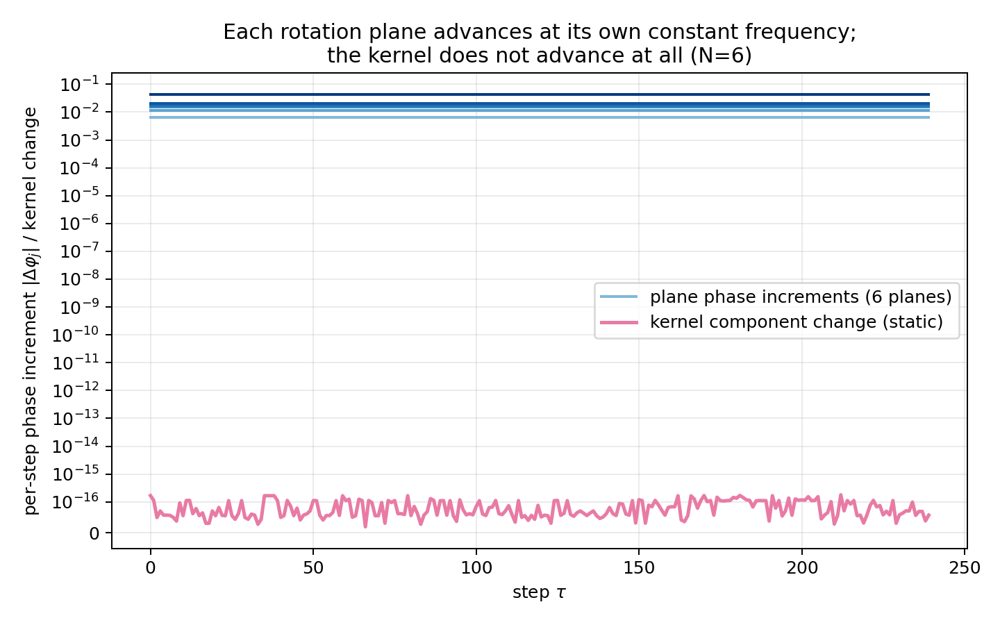
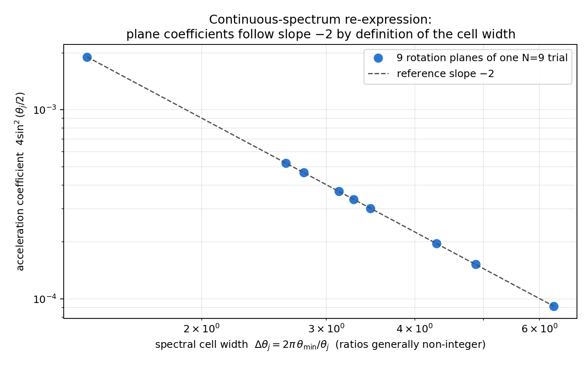
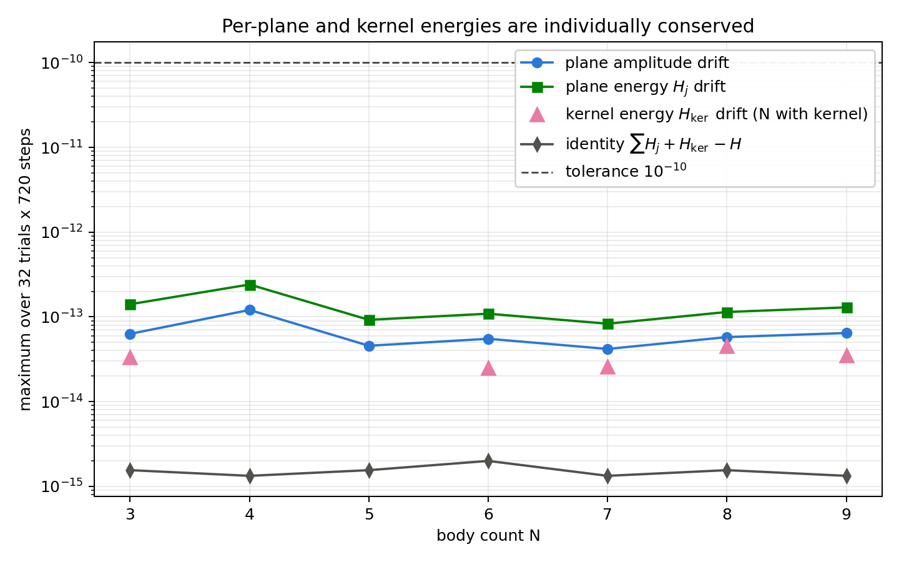
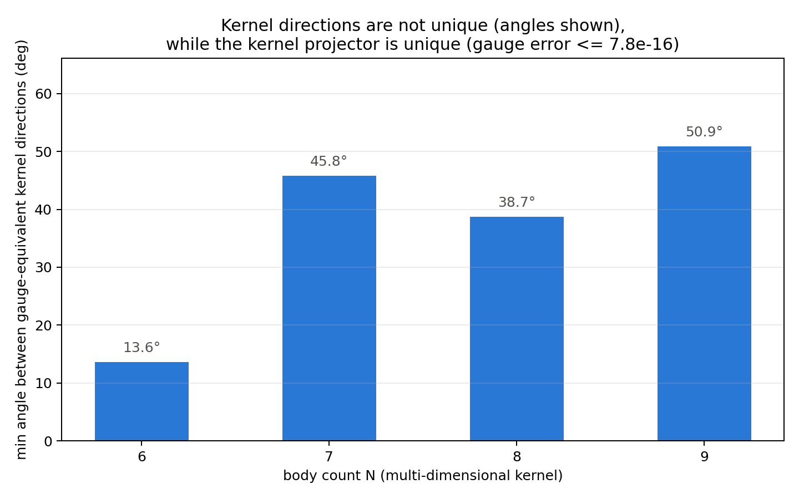

# N体固定生成子系における平面分解読出し
## 各回転平面はAB二体の回転運動学と同型に読める——進行・周波数・振幅・エネルギー・零次調和構造の平面成立と、位置・観測加速度読出しの接続課題

**著者:** 木原 範昭 
**ORCID:** 0009-0004-6753-4020 
**日付:** 2026年7月21日 
**Version DOI:** 未取得 
**Concept DOI:** 未取得 
**位置づけ:** 「次元の生成構造」シリーズ・第4論文 v1

---

## 要旨

先行する「波の情報読出し」シリーズは、AB二体閉鎖位相系において、位置読出し・調和読出し［2］と加速度様読出し・逆二乗則［3］を確立した。一方、第3論文［5］は、N体完全二体関係波の固定生成子が回転平面の直和と零空間へ分解され、回転モード数が高々線形にしか増えないことを証明した。本稿はこの二系列を接続し、次の問いに答える。

> AB二体で確立した読出し群は、N体固定生成子系のどの部分から、どこまで成立するか。

鍵は、固定生成子のもとで各回転平面が不変部分空間であり、平面上の運動が単一周波数の位相進行になることである。本稿はこれを平面AB運動学的同型性として定式化し、次の五つを数学的帰結として示す。第一に、各平面の位相進行は一定角 $\theta_j=2\arctan(\gamma\sigma_j)$ で進み、平面振幅は一定である（定理1）。第二に、面内 $SO(2)$ ゲージ（回転面の向きは生成子が定める）のもとで絶対位相は読めず、符号付き位相進行・周波数・振幅は読める。反射まで許す $O(2)$ では、不変なのは進行の絶対値と周波数の絶対値である。これは基本公理系の公理5（個別位相不可読）が、導出量である平面座標のレベルで再現されることを意味する（定理2）。第三に、全エネルギーは平面別と核の保存量へ厳密に分解される：$H=\sum_j H_j+H_{\ker}$（定理3）。第四に、残余部分空間（核）は位相進行を持たないため、進行に基づく読出し——進行位相としての位置読出しと調和加速度読出し——は核からは成立しない。一方、射影子・核二乗量・状態射影 $P_0X$ は名称置換共変に定義でき、$K$ だけからは核内部の標準基底を選べない（帰結16.3［1］の動力学的実現、定理4）。静的な $P_0X$ を位置方向として読めるか否かは本稿では検証しない。第五に、二乗閉鎖そのものも平面別・核別に分解され、各項が個別に保存される：$\sum_jQ_j+Q_{\ker}=R^2$（定理5）。したがって固定生成子では、閉鎖量もエネルギー様量も平面間を移動せず、これは状態の自発的分裂に対するno-go条件を与える。

数値実験（$N=3$〜$9$、各32試行×720ステップ、固定生成子、逐次正規化なし）では、平面振幅変動 $\le1.21\times10^{-13}$、位相進行の変動 $\le1.89\times10^{-13}$、進行の理論値偏差 $\le4.49\times10^{-15}$、面内 $SO(2)$ ゲージによる符号付き進行の変化 $\le1.52\times10^{-13}$、向き規約 $Kp_j=\sigma_jq_j$ の偏差 $\le7.64\times10^{-14}$、名称置換後の周波数・エネルギー集合の偏差 $\le3.30\times10^{-15}$、周波数非縮退（最小ギャップ $2.0\times10^{-3}$ 以上）を確認した。加速度様読出しの二階差分関係 $\Delta^2c_j=-4\sin^2(\theta_j/2)c_j$ は絶対偏差 $\le1.27\times10^{-16}$（機械精度）で成立し、最遅平面を基準とする連続スペクトル再表示での距離指数は、平面が2枚以上の全構成（$N=4$〜$9$）・全試行で $-1.99999$〜$-1.99987$ となった。エネルギー分解恒等式の偏差は $\le2.00\times10^{-15}$、閉鎖分解恒等式 $\sum Q_j+Q_{\ker}-R^2$ の偏差は $\le1.89\times10^{-15}$、各平面閉鎖量の変動は $\le1.81\times10^{-13}$、核成分の時間変動は $\le4.57\times10^{-14}$（静的）、核射影子のゲージ変動は $\le7.77\times10^{-16}$、独立核基底間の方向角は最小 $13.6^\circ$ だった。

本稿は検証を目的とする論文であり、結果の多くは第3論文の構造の帰結として予測されたものである。実質的な新規性は次の二点である。第一に、読出し可能性の非対称構造——回転平面では進行・周波数・振幅・エネルギー・零次調和構造が運動学的同型を通じて成立し、残余部分空間では進行に基づく読出しが成立しない——を定理と数値実験の両面で確定させたこと。第二に、固定生成子が平面別・核別の二重の保存レジスタ（$H_j$ と $Q_j$）を持ち、閉鎖量もエネルギー様量も平面間を移動しないこと（自発的分裂のno-go、定理5）を示したことである。なお、AB二体の同時刻二波間の位置位相読出し（$D_{AB}$）の平面対応量、および公理17の観測加速度射影の平面上での構成は、本稿では行わず接続課題として明示する。

---

## 0. 結論

N体固定生成子系の読出し可能性は、次の非対称構造を持つ。

$$
\boxed{
\begin{aligned}
&\text{回転平面（}\operatorname{rank}K\text{ の各2次元ブロック）:}\\
&\qquad\text{位相進行・周波数・振幅・エネルギー・零次調和二階構造がすべて成立（AB運動学的同型）}\\
&\text{残余部分空間（}\ker K\text{）:}\\
&\qquad\text{進行に基づく読出しは不成立（静的）。射影子・二乗量・状態射影は共変に定義できる}
\end{aligned}
}
$$

各回転平面は、一定振幅の単一周波数二次元回転として、AB二体の回転運動学と同型に振る舞う。位相進行・周波数・振幅・エネルギー・零次調和二階構造は、この運動学的同型を通じて平面ごとにN体へ持ち上がる。一方、AB二体の同時刻二波間の位置位相読出し（$D_{AB}$）の平面対応量と、公理17の観測加速度射影（曲率半径・未来位相位置・接線方向）の平面上での構成は、本稿では行わない。これらは接続課題である。

面内 $SO(2)$ ゲージで絶対位相が読めず符号付き位相進行が読めることは、公理5（個別位相不可読）［1］が基本波の公理としてだけでなく、スペクトル分解による導出量のレベルでも再現されることを示す。

全エネルギーは

$$
H=\sum_{j=1}^{r}H_j+H_{\ker}
$$

として平面別・核別の保存量へ厳密に分解される。さらに二乗閉鎖そのものも

$$
X^{\mathsf T}X=\sum_{j=1}^{r}Q_j+Q_{\ker}=R^2,
\qquad
Q_j=(p_j^{\mathsf T}X)^2+(q_j^{\mathsf T}X)^2
$$

と分解され、各項は個別に保存される（定理5）。固定生成子は平面別・核別の二重の保存レジスタを持ち、閉鎖量もエネルギー様量も平面間を移動しない。これは状態の自発的分裂に対するno-go条件であり、分裂には逐次再構成生成子・非線形結合・平面間交換のいずれかが必要である。

残余部分空間は固定生成子のもとで静的であり、位相進行を持たない。したがって進行に基づく読出し（位置・調和加速度）は核からは成立しない。射影子・核二乗量・状態射影 $P_0X$ は共変に定義でき、核内部の標準基底は $K$ だけからは選べない（帰結16.3［1］）。静的な $P_0X$ を位置方向として読めるかは未検証である。

空間的な採用（どの平面をXYZと読むか）は公理16の採用条件［1］が定める規則であり、本稿の検証対象ではない。本稿が確定したのは、採用の手前にある内部量読出しの成立範囲である。

---

## 1. 研究課題

### 1.1 二つの系列の接続

「波の情報読出し」シリーズは、AB二体閉鎖位相系で位置読出し・調和読出し［2］、加速度様読出しと逆二乗則［3］を確立した。これらはすべて、一つの位相関係の進行から構成される読出しである。

「次元の生成構造」シリーズは、N体完全二体関係波の構造を確立した。第3論文［5］により、固定生成子は

$$
\operatorname{rank}K\le2\min\!\left(N,\left\lfloor\frac{M}{2}\right\rfloor\right)
$$

を満たし、回転平面の直和と零空間へ分解される（帰結16.1・16.2［1］）。

残っていた問いは、二系列の接続である。AB二体の読出しは一つの位相関係を読んだ。N体の各回転平面は一つの位相進行を持つ。ならば、AB読出しのうち位相進行から構成できる部分は、平面ごとにN体へ持ち上がるはずである。本稿はこの持ち上げを定理として書き、数値実験で検証する。同時に、持ち上げがまだ導出されていない部分——同時刻二波間の位置位相読出し（$D_{AB}$）の平面対応量と、公理17の観測加速度射影——を接続課題として峻別する。

### 1.2 因果方向の規則——平面座標は導出量である

平面座標は関係波そのものではない。生成子のスペクトル分解から得られる導出量である。したがって、平面読出しを「読出し」と呼ぶには、それが関係データだけから名称置換共変に再構成できることを先に示さなければならない。本稿はこれを第3節で行い、あわせて読出せない量（面内の絶対位相・核内部の方向）を読出せる量から峻別する。

背景空間は導入しない。距離行列・埋め込み・外部観測器も導入しない。

### 1.3 本稿で判別すること

1. 各回転平面はAB二体の回転運動学と同型の単一周波数回転として読めるか。
2. 面内ゲージのもとで、何が読めて何が読めないか。公理5と整合するか。
3. エネルギー様読出しは平面別・核別の保存量へ分解されるか。
4. 残余部分空間から何が読めるか。進行に基づく読出しは成立するか。
5. 零次調和二階構造と連続スペクトル再表示の指数は平面ごとに成立するか。
6. 以上はすべて名称置換共変か。

---

## 2. 主張の分類

本稿は検証論文である。定理はいずれも既存構造（固定生成子の不変部分空間分解）の帰結であり、数値実験はその実装検証である。公理的基盤は基本公理系v6［1］による。

| 対象 | 分類 | 本稿での位置づけ |
|---|---|---|
| N体完全二体関係波モデル | モデル定義 | ［1］公理16の実装、［4,5］の継承 |
| 位相差正弦生成子・固定生成子動力学 | 作業仮説 | ［1］作業公理I、［4,5］と同一 |
| 平面座標＝スペクトル分解による導出量 | 定義 | 第3節。名称置換共変性を検査 |
| 平面AB運動学的同型性（一定進行・一定振幅） | 数学的帰結 | 定理1。各平面の独立な二乗閉鎖 $Q_j=0$ を意味しない |
| 面内 $SO(2)$ ゲージと可読量の峻別 | 数学的帰結 | 定理2。反射を含む $O(2)$ では符号付き進行は不変でない |
| エネルギー様分解 $H=\sum H_j+H_{\ker}$ | 数学的帰結 | 定理3 |
| 残余部分空間の読出し制限 | 数学的帰結 | 定理4。帰結16.3の動力学的実現 |
| 零次調和二階構造の平面成立 | 数学的帰結（定理1の系） | 第5節。公理17の観測加速度射影とは区別する |
| 同時刻二波間の位置位相読出し $D_{AB}$ の平面対応 | 接続課題 | 平面上の対応量は未定義。本稿では構成しない |
| 公理17の観測加速度の平面適用 | 接続課題 | $\rho_c$・未来位相位置・接線射影は採用平面上での構成後に定義される |
| 閉鎖分解 $\sum Q_j+Q_{\ker}=R^2$ と各 $Q_j$ の保存 | 数学的帰結 | 定理5 |
| 固定生成子での自発的分裂no-go | 導出済み帰結 | 定理5の系。分裂には固定生成子を超える動力学が必要 |
| 連続スペクトル再表示の距離指数 $-2$ | 定義に基づく帰結 | 第5節。セル幅 $\Delta\theta_j=2\pi\theta_{\min}/\theta_j$ の定義から恒等的に従う |
| 整数倍音閉鎖（［3］の機構）の平面版 | 未成立（未検討） | 平面周波数比は一般に非整数 |
| 周波数非縮退 | 一般位置仮定（独立） | 第3.3節。最大ランクからは導出されない。全224試行で数値的に成立 |
| 実験F〜Iの結果 | 数値実験事実 | 第7節 |
| 空間的採用は3平面まで | ［1］公理16の規則 | 本稿の検証対象外 |
| 近縮退平面の挙動 | 対象外 | 続報（配分と観測選択）で扱う |
| 一階読出し（速度フィードバック）の平面適用 | 対象外 | 本稿は零次に限定 |

---

## 3. モデルと平面分解

### 3.1 モデルの継承

$N$個の無名な個体の完全二体関係集合 $\mathcal E_N$（$M=\binom{N}{2}$）に複素関係波 $X\in\mathbb C^M$ を対応させ、閉鎖 $\sum_eX_e^2+(iR)^2=0$ を置く［1,4］。初期位相から位相差正弦生成子 $\widetilde K_{ef}=A_{ef}\sin(\theta_f-\theta_e)$ を一回構成し、スペクトルノルムで規格化した $K$ を固定する（固定生成子）。更新はCayley変換

$$
U=(I-\gamma K)^{-1}(I+\gamma K),\qquad \gamma=\tan(\pi/144)
$$

による実直交行列であり、二乗閉鎖と絶対値二乗和を逐次正規化なしで保存する［5,8］。

### 3.2 スペクトル分解と平面座標

実反対称行列 $K$ は直交変換で二次元回転ブロックの直和と零ブロックへ分解される［7］。各非零ブロック $j$ に正規直交対 $(p_j,q_j)$ と周波数 $\sigma_j>0$ が対応し、零空間には正規直交基底 $\{n_a\}$ が対応する。平面 $j$ の座標を

$$
\zeta_j(\tau)=p_j^{\mathsf T}\,\Re X_\tau+i\,q_j^{\mathsf T}\,\Re X_\tau
$$

と定義する（虚部 $\Im X_\tau$ にも同じ構成が並行して成立する）。

### 3.3 平面読出しのwell-defined性

平面座標が読出しとして成立する根拠は次である。第一に、$(p_j,q_j,\sigma_j)$ は関係データ（初期位相）から構成した $K$ のスペクトル分解だけで定まり、外部の軸名を使わない。第二に、名称置換 $\pi$ のもとで $K'=P_\pi KP_\pi^{\mathsf T}$ となるため、周波数集合 $\{\sigma_j\}$ は不変であり、平面基底は $p_j\mapsto P_\pi p_j$ と共変に移る。したがって周波数・振幅・エネルギーという読出し量は置換不変である（実験Fで数値検証）。第三に、各平面の基底には残余ゲージがある。$K$ が回転面の向きを定める（$Kp_j=\sigma_jq_j$ の向き付けで $\sigma_j>0$ の標準形が固定される）ため、標準形を保つ残余ゲージは $SO(2)$ であり、定理2が示すとおりこの自由度は読出し量に影響しない。反射まで含む $O(2)$ を許すと符号付き進行は反転する。

周波数が縮退する場合は平面の切り分け自体に追加の自由度が残る。ここで注意すべきは、帰結16.2［1］の一般位置ランク等号が保証するのは $\sigma_j\ne0$ であり、$\sigma_j\ne\sigma_k$（$j\ne k$）はそれとは別の命題だということである。本稿は周波数非縮退を独立した一般位置仮定として明示的に置く。数値実験の全224試行（$N=3$〜$9$×32）では全周波数が相異なった。縮退集合が測度零であることの証明は本稿では行わない（第8.4節）。近縮退の挙動も対象外として第8節に記す。

---

## 4. 平面読出し定理

> **定理1（平面AB運動学的同型性）**
>
> 固定生成子動力学のもとで、各回転平面の座標は
>
> $$
> \zeta_j(\tau+1)=e^{+i\theta_j}\zeta_j(\tau),
> \qquad
> \theta_j=2\arctan(\gamma\sigma_j)
> $$
>
> を満たす。すなわち位相進行は一定角 $\theta_j$、振幅 $\lvert\zeta_j\rvert$ は一定であり、各平面は一定振幅の単一周波数二次元回転として、AB二体［2,3］の回転運動学と同型である。位相進行の読出しは、非零振幅 $\lvert\zeta_j\rvert>0$ の平面に対して定義される（$\zeta_j=0$ では位相が定義されない）。

**証明** $K$ は平面 $j$ 上で二次元反対称ブロック

$$
\begin{pmatrix}0&-\sigma_j\\\sigma_j&0\end{pmatrix}
$$

として作用する。そのCayley変換は回転角 $2\arctan(\gamma\sigma_j)$ の二次元回転である。ブロックは互いに直交し混合しないため、平面座標は一定角速度の回転となり、振幅は保存される。∎

なお、平面内の複素双線形二次量 $Q_j=(p_j^{\mathsf T}X)^2+(q_j^{\mathsf T}X)^2$ も実直交更新のもとで保存されるが、$Q_j=0$ が成立するわけではない。したがって本定理が主張するのは運動学的同型であり、各平面が独立に二乗閉鎖した部分系であることではない。

> **定理2（面内 $SO(2)$ ゲージと可読量）**
>
> 非零振幅 $\lvert\zeta_j\rvert>0$ のもとで、面内基底の回転 $(p_j,q_j)\mapsto(p_j\cos\beta+q_j\sin\beta,\,-p_j\sin\beta+q_j\cos\beta)$ に対し、絶対位相 $\arg\zeta_j$ は $-\beta$ だけ移り、符号付き位相進行 $\Delta\varphi_j$・周波数 $\theta_j$・振幅 $\lvert\zeta_j\rvert$ は不変である。したがって、$SO(2)$ ゲージのもとで関係データから一意に読めるのは符号付き進行・周波数・振幅・位相差であり、絶対位相は読めない。

**証明** 基底回転は $\zeta_j\mapsto e^{-i\beta}\zeta_j$ を誘導する。比 $\zeta_j(\tau+1)/\zeta_j(\tau)$ と絶対値は $e^{-i\beta}$ に依存しない。∎

残余ゲージが $SO(2)$ である根拠は、$K$ 自身が回転面の向きを定めることにある（第3.3節）。反射 $(p_j,q_j)\mapsto(p_j,-q_j)$ まで許す $O(2)$ のもとでは $\zeta_j\mapsto\overline{\zeta_j}$ となり、符号付き進行は $\Delta\varphi_j\mapsto-\Delta\varphi_j$ と反転する。この場合に不変なのは進行の絶対値 $\lvert\Delta\varphi_j\rvert$ と周波数の絶対値である。

これは、基本波に対して公理として置かれた個別位相不可読（公理5［1］）が、導出量である平面座標のレベルで自動的に再現されることを示す。読出しの階層を上がっても、読める量と読めない量の区別は保存される。

> **定理3（エネルギー様分解）**
>
> $$
> H(X)=\sum_{j=1}^{r}H_j+H_{\ker},
> \qquad
> H_j=\lvert p_j^\dagger X\rvert^2+\lvert q_j^\dagger X\rvert^2,
> \qquad
> H_{\ker}=\lVert P_0X\rVert^2
> $$
>
> が恒等式として成立し、固定生成子動力学のもとで各 $H_j$ と $H_{\ker}$ は個別に保存される。

**証明** $\{p_j,q_j\}\cup\{n_a\}$ は $\mathbb R^M$ の正規直交基底なので、分解はParsevalの恒等式である。$U$ は各平面内の回転と核上の恒等写像に分解されるため、各成分ノルムは不変である。∎

> **定理4（残余部分空間の読出し制限）**
>
> 核成分 $P_0X_\tau$ は $\tau$ に依存しない（静的）。したがって、非零の位相進行に基づく読出し——進行位相としての位置読出しおよび調和加速度読出し——は残余部分空間からは成立しない。一方、射影子 $P_0$・核二乗量 $H_{\ker}$・状態射影 $P_0X$ は、いずれも名称置換に対して共変に定義できる。$K$ だけからは核内部の標準基底を選べない。

**証明** $K n=0$ なら $Un=n$ であり核成分は不変。進行が零なので位相増分・二階差分はともに恒等的に零となり、進行に基づく読出しは定義されない。射影子の一意性と内部基底の非一意性は帰結16.3［1］による。$P_0X$ は状態が与えられれば一意に定まり、置換のもとで $P_0X\mapsto P_\pi P_0X$ と共変に移る。∎

定理4は、帰結16.3が代数として述べた一意性の区別が、動力学の読出し可否としてそのまま実現することを示す。ただし、静的な状態射影 $P_0X$ を「位置方向」として読めるか否かは、本稿では検証しない。第2論文が一次元核をZ法線という静的方向として読んだ解釈［4］は、この未検証部分に位置する先行事例であり、本定理と矛盾しない。

> **定理5（閉鎖分解と分裂no-go）**
>
> 二乗閉鎖は
>
> $$
> X^{\mathsf T}X
> =\sum_{j=1}^{r}Q_j+Q_{\ker}
> =R^2,
> \qquad
> Q_j=(p_j^{\mathsf T}X)^2+(q_j^{\mathsf T}X)^2,
> \qquad
> Q_{\ker}=\sum_a(n_a^{\mathsf T}X)^2
> $$
>
> と分解され、固定生成子動力学のもとで各 $Q_j$ と $Q_{\ker}$ は個別に保存される。

**証明** $\{p_j,q_j\}\cup\{n_a\}$ は $\mathbb R^M$ の正規直交基底なので、分解は複素双線形形式に対するParsevalの恒等式である。平面 $j$ 内の回転 $c'=c\cos\theta-d\sin\theta$, $d'=c\sin\theta+d\cos\theta$ に対し $(c')^2+(d')^2=c^2+d^2$ は複素値 $c,d$ についても代数的恒等式として成立し、核上では恒等写像である。∎

> **系（自発的分裂のno-go）**
>
> 固定生成子のもとでは、閉鎖量 $Q_j$ もエネルギー様量 $H_j$ も、平面間・平面と核の間を移動しない。したがって、状態がレジスタ間の再配分を伴って自発的に分裂することは、固定生成子動力学では生じ得ない。分裂には、逐次再構成生成子・非線形結合・平面間交換のいずれか、すなわち固定生成子を超える動力学が必要である。

定理5は、固定生成子系が平面別・核別の二重の保存レジスタ（$H_j$ と $Q_j$）を持つことを示し、続報（配分と観測選択、および状態の分裂）に対する出発点となる。

---

## 5. 加速度様読出しの平面適用

定理1により平面座標は一定角 $\theta_j$ で回転するので、実部座標 $c_j(\tau)=p_j^{\mathsf T}\Re X_\tau$ の離散二階差分は

$$
\Delta^2c_j
=-4\sin^2\!\left(\frac{\theta_j}{2}\right)c_j
$$

を満たす（零次調和二階構造）。これは定理1の直接の系であり、逆二乗則論文［3］がAB二体で確認したものと同形の二階構造である。

注意すべきは、これが公理17［1］の観測加速度そのものではないことである。公理17の読出し $\boldsymbol\alpha_{\mathrm{read}}=\rho_c\lvert\omega\rvert^2\hat{\boldsymbol t}_\tau$ は、曲率半径 $\rho_c$・未来位相位置・円周進行方向 $\hat{\boldsymbol t}_\tau$、および中心方向補償から接線方向への射影を要するが、本稿ではこれらを平面上で構成していない。公理16で空間方向として採用された平面の上に公理17を適用して初めて観測加速度と呼べる。この構成は接続課題である。本節と実験Gが全平面で確認するのは、中心方向の零次調和二階構造である。

加速度係数を平面横断で整理するため、最遅平面を基準とする比

$$
n_j=\frac{\theta_j}{\theta_{\min}},
\qquad
\Delta\theta_j=\frac{2\pi}{n_j}=2\pi\frac{\theta_{\min}}{\theta_j}
$$

を定義する。ここで重要な注意がある。$n_j$ は**一般に整数ではない**。したがってこれは、逆二乗則論文［3］が用いた整数倍音 $\omega_n=n\omega_1$（$n\in\mathbb Z\setminus\{0\}$）による調和閉鎖とは別の構造であり、連続スペクトルに対するセル幅の再定義（連続スペクトル再表示）である。この定義のもとでは、小角領域で

$$
4\sin^2\!\left(\frac{\theta_j}{2}\right)\simeq\theta_j^2\propto\frac{1}{\Delta\theta_j^2}
$$

が恒等的に従う。すなわち本稿で成立する指数 $-2$ は定義に基づく帰結であり、［3］の整数倍音閉鎖による逆二乗則の平面版は本稿では成立を主張しない（未検討）。なお、この量は規格化された調和係数 $g_j=4\sin^2(\theta_j/2)$ であり、平面の加速度振幅は $a_j=\rho_jg_j$ と平面振幅 $\rho_j$ に依存する。指数 $-2$ は係数の指数であって、平面横断の加速度振幅の指数ではない。

本稿の二階構造は零次（固定生成子、$\omega$ 凍結）に限定する。一階読出し（速度フィードバック［3］v2）の平面適用は対象外であり、続報で扱う。

---

## 6. 空間的採用の境界

本稿が確認するのは、全 $r$ 平面の**内部量**——位相進行・周波数・振幅・エネルギー・零次調和二階構造——の読出し成立である。どの平面を空間方向（XYZ）として採用するかは、公理16の採用条件（回転周波数による区別可能性＋面法線の一意性、$d=3$ 限定）［1］が定める規則であり、第3論文が示したとおり採用は三方向で飽和する。本稿の実験は採用上限の検証を含まない。内部量が全平面で読めることと、空間的採用が三平面までであることは、矛盾なく両立する——これが読出しの二層構造である。

---

## 7. 数値実験

### 7.1 共通条件

| 項目 | 値 |
|---|---:|
| 構成 | $N=3$〜$9$ |
| 試行数 | 各32 |
| 更新ステップ数 | 各720 |
| 動力学 | 固定生成子・Cayley直交更新（$\gamma=\tan(\pi/144)$） |
| $R^2$ / 虚部初期振幅 | 1.0 / 0.35 |
| 乱数シード | 20260731 |
| 判定許容差 | $10^{-10}$ |
| 状態の逐次正規化・観測減衰・絶対背景軸 | なし |

各構成の平面数と核次元は全32試行で一致し、第3論文のランク則 $r=\min(N,\lfloor M/2\rfloor)$、$\dim\ker K=M-2r$ を再現した。低振幅により統計から除外された平面は全試行で0枚である。

| $N$ | $M$ | 回転平面数 $r$ | $\dim\ker K$ |
|---:|---:|---:|---:|
| 3 | 3 | 1 | 1 |
| 4 | 6 | 3 | 0 |
| 5 | 10 | 5 | 0 |
| 6 | 15 | 6 | 3 |
| 7 | 21 | 7 | 7 |
| 8 | 28 | 8 | 12 |
| 9 | 36 | 9 | 18 |

### 7.2 実験F: 平面AB運動学的同型性

| 検査量 | 全構成最大値 |
|---|---:|
| 平面振幅の変動 | $1.21\times10^{-13}$ |
| 位相進行の1ステップ変動（単一周波数性） | $1.89\times10^{-13}$ |
| **符号付き**平均進行と理論値 $+2\arctan(\gamma\sigma_j)$ の偏差 | $4.49\times10^{-15}$ |
| 面内 $SO(2)$ ゲージによる符号付き位相進行の変化 | $1.52\times10^{-13}$ |
| 向き規約 $(Kp_j)\cdot q_j/\sigma_j-1$ の偏差 | $7.64\times10^{-14}$ |
| 名称置換後の周波数集合の偏差 | $2.00\times10^{-15}$ |
| 名称置換後の平面エネルギー集合の偏差 | $3.30\times10^{-15}$ |

定理1・定理2の全主張が許容差の3桁下で成立した。面内 $SO(2)$ ゲージで絶対位相は移動し、符号付き位相進行は不変だった。また、全224試行で平面周波数はすべて相異なり（最小周波数ギャップ $2.0\times10^{-3}$〜$5.4\times10^{-2}$）、周波数非縮退の一般位置仮定が数値的に成立した。ランク則（平面数 $=\min(N,\lfloor M/2\rfloor)$、核次元 $=M-2r$）も全試行で成立した。

図1は $N=6$ の代表試行である。六つの平面の位相進行が一定値（$10^{-2}$ 台）を保つ一方、核成分の変化は機械精度（$10^{-16}$ 台）に留まり、読出し可能性の非対称が14桁の分離として現れる。

### 7.3 実験G: 零次調和二階構造の平面確認

二階差分関係 $\Delta^2c_j=-4\sin^2(\theta_j/2)c_j$ の回帰傾きと理論係数の**絶対偏差は全構成最大 $1.27\times10^{-16}$**（機械精度）だった。相対偏差は最遅平面で最大 $2.5\times10^{-9}$ まで増幅されるが、これは理論係数 $4\sin^2(\theta/2)$ 自体が微小なことによる指標の条件数であり、判定は絶対偏差で行う。

連続スペクトル再表示での距離指数は、回転平面が2枚以上の全構成（$N=4$〜$9$）・全試行で

$$
-1.99999\le\text{指数}\le-1.99987
$$

となり $-2$ に一致した（偏差 $\le1.2\times10^{-4}$ は $4\sin^2(\theta/2)$ と $\theta^2$ の差による既知の離散効果）。

図2は $N=9$ の代表試行の九つの平面が、連続スペクトルのセル幅表示で傾き $-2$ の直線に乗ることを示す。これは第5節の定義に基づく帰結の可視化であり、整数倍音閉鎖の検証ではない。

### 7.4 実験H: エネルギー様分解と閉鎖分解

| 検査量 | 全構成最大値 |
|---|---:|
| 各平面エネルギー $H_j$ の変動 | $2.41\times10^{-13}$ |
| 核エネルギー $H_{\ker}$ の変動 | $4.55\times10^{-14}$ |
| 恒等式 $\sum_jH_j+H_{\ker}-H$ の偏差 | $2.00\times10^{-15}$ |
| 各平面閉鎖量 $Q_j$ の変動 | $1.81\times10^{-13}$ |
| 核閉鎖量 $Q_{\ker}$ の変動 | $4.03\times10^{-14}$ |
| 閉鎖分解恒等式 $\sum_jQ_j+Q_{\ker}-R^2$ の偏差 | $1.89\times10^{-15}$ |

図3は全構成の変動の要約である。全エネルギーは平面別＋核の個別保存量へ厳密に分解される。さらに二乗閉鎖 $R^2$ も同じ基底で平面別＋核へ分解され、各 $Q_j$ が個別に保存された（定理5の数値確認）。固定生成子では、どちらの保存レジスタも平面間を移動しない。

### 7.5 実験I: 残余部分空間の読出し制限

| 検査量 | 値 |
|---|---:|
| 核成分の時間変動（静的性） | 最大 $4.57\times10^{-14}$ |
| 核射影子のゲージ変動（一意性） | 最大 $7.77\times10^{-16}$ |
| 独立核基底の第一方向間角度（非一意性） | 最小 $13.6^\circ$（$N=6$）〜 $50.9^\circ$（$N=9$） |

核成分は静的であり、進行に基づく位置・調和加速度読出しは核からは成立しない。射影子と核二乗量は一意に読め、状態射影 $P_0X$ は共変である。

図4は、核方向の非一意性（ゲージ等価基底間の角度）と核射影子の一意性（ゲージ変動 $\le7.8\times10^{-16}$）の対比である。

---

## 8. 本稿の主張範囲

### 8.1 証明した数学的帰結

1. 平面AB運動学的同型性：各平面は一定角 $\theta_j=2\arctan(\gamma\sigma_j)$・一定振幅の単一周波数二次元回転である（定理1）。
2. 面内 $SO(2)$ ゲージのもとで絶対位相は不可読、符号付き進行・周波数・振幅は可読。$O(2)$ では絶対値のみ可読（定理2）。
3. エネルギー様分解 $H=\sum H_j+H_{\ker}$ と各項の個別保存（定理3）。
4. 残余部分空間の読出し制限：静的ゆえ進行に基づく読出しは不成立。射影子・二乗量・状態射影は共変（定理4）。
5. 閉鎖分解 $\sum Q_j+Q_{\ker}=R^2$ と各項の個別保存、および自発的分裂のno-go（定理5）。

### 8.2 数値実験で確認した事実

1. 定理1〜4の全主張が $N=3$〜$9$・各32試行で許容差 $10^{-10}$ 内（実測は概ね $10^{-13}$ 以下）で成立した。
2. 読出し量（周波数集合・エネルギー集合）は名称置換不変だった。向き規約 $Kp_j=\sigma_jq_j$ と周波数非縮退（独立の一般位置仮定）も全試行で成立した。
3. 零次調和二階構造 $\Delta^2c_j=-4\sin^2(\theta_j/2)c_j$ が機械精度で成立し、連続スペクトル再表示の距離指数は $-2$ に一致した（$N=4$〜$9$）。
4. ランク則・核次元は第3論文の結果を再現した。
5. 閉鎖量 $Q_j$・$Q_{\ker}$ の個別保存と閉鎖分解恒等式が機械精度で成立した（定理5の数値確認）。

### 8.3 本稿の解釈

1. 公理5（個別位相不可読）は、基本波の公理としてだけでなく、導出量である平面座標のレベルでも再現される。
2. 帰結16.3の読出し非対称性（射影子・二乗量は一意、内部方向は非一意）は、動力学の読出し可否としてそのまま実現する。
3. 読出しは二層構造を持つ：内部量読出しは全平面で成立し、空間的採用は公理16により三平面までに限られる。

### 8.4 本稿で固定しないもの

1. 近縮退平面の挙動。周波数が縮退に近づくと平面の切り分けが不安定になる。配分と観測選択の続報（多色猫）で扱う。
2. 周波数縮退集合が測度零であることの証明。本稿は周波数非縮退を独立の一般位置仮定として置いた。
3. 整数倍音閉鎖（［3］の逆二乗機構）の平面版の成否。本稿の指数 $-2$ は連続スペクトル再表示の定義に基づく帰結である。
4. 静的な状態射影 $P_0X$ を位置方向として読めるか（一次元核のZ法線解釈［4］の多次元核への拡張）。
5. AB二体の同時刻二波間の位置位相読出し（$D_{AB}=\{\delta,2\pi-\delta\}$）に対応する平面上の関係量の定義と検証。
6. 公理17の観測加速度（$\rho_c$・未来位相位置・接線方向射影）の採用平面上での構成と検証。
7. 一階読出し（速度フィードバック）の平面適用。本稿は零次に限定した。
8. 空間的採用上限（3平面）の動力学的検証。本稿の実験は内部量読出しのみを対象とした。
9. 逐次再構成生成子での平面構造の安定性。
10. 平面間相互作用（群B：交換散乱）。

---

## 9. 再現可能性

本稿の数値実験は、次の実プログラムと出力に基づく。

### 実行プログラム

- `次元の生成構造/対照実験_一角度円周位相調和読出し_v1/run_nbody_plane_decomposition_readout_preliminary_v1.py`（実験F〜I）
- `次元の生成構造/対照実験_一角度円周位相調和読出し_v1/make_nbody_plane_decomposition_figures_v1.py`（図生成）

### 主要出力

- `plane_decomposition_readout_result_v1.json`
- `plane_decomposition_trials_v1.csv`
- `plane_decomposition_readout_report_v1.md`
- 図4点（`plane_ab_isomorphism_v1.png` ほか）

これらは次のディレクトリに保存されている。

`次元の生成構造/対照実験_一角度円周位相調和読出し_v1/nbody_plane_decomposition_readout_result_v1/`

---

## 10. 最終結論

N体固定生成子は独立な単一周波数回転平面へ分解され、平面別・核別の保存レジスタを持つ。各回転平面は一定振幅の単一周波数二次元回転としてABの回転運動学と同型であり、位相進行・周波数・振幅・エネルギー・零次調和二階構造を持ち上げる。一方、同時刻二波間の位置位相読出し（$D_{AB}$）の平面対応量と、公理17の観測加速度射影の平面上での構成は、接続課題として残る。面内 $SO(2)$ ゲージのもとで絶対位相が読めず符号付き進行が読めることは、公理5が導出量のレベルで再現されることを示す。

全エネルギーは平面別と核の保存量へ厳密に分解される。残余部分空間は位相進行を持たないため、進行に基づく位置・調和加速度読出しは成立しない。射影子・核二乗量・状態射影 $P_0X$ は共変に定義でき、静的な $P_0X$ を位置方向として読めるかは未検証である。

したがって、本稿の結論は次である。

$$
\boxed{
\begin{aligned}
&\text{N体固定生成子は独立な単一周波数回転平面へ分解され、}\\
&\text{平面別・核別の二重の保存レジスタ（}H_j\text{ と }Q_j\text{）を持ち、}\\
&\text{残余部分空間では進行に基づく読出しが成立しない}
\end{aligned}
}
$$

この読出し可能性の非対称構造は、帰結16.3が代数として与えた一意性の区別が、そのまま動力学の読出し可否になることを示している。定理5のno-go——固定生成子では閉鎖量もエネルギー様量も平面間を移動しない——は、状態の自発的分裂には固定生成子を超える動力学（逐次再構成・非線形結合・平面間交換）が必要であることを意味する。平面別の二重レジスタ $\{H_j,Q_j\}$ と $\{H_{\ker},Q_{\ker}\}$ は、観測選択（C弱読出し・D強観測）のN体化と状態分裂の続報に向けた土台であり、続報で扱う。

---

## 参考文献

### 自己引用

1. 木原 範昭「無名等振幅複合波モデル基本公理系 v6」Zenodo, 2026. Version DOI: [10.5281/zenodo.21465984](https://doi.org/10.5281/zenodo.21465984), Concept DOI: [10.5281/zenodo.21315735](https://doi.org/10.5281/zenodo.21315735).
2. 木原 範昭「AB二体閉鎖位相系における調和読出しとc=1面積スイープ予備実験総括 v4」Zenodo, 2026. Version DOI: [10.5281/zenodo.21374317](https://doi.org/10.5281/zenodo.21374317), Concept DOI: [10.5281/zenodo.21318696](https://doi.org/10.5281/zenodo.21318696).
3. 木原 範昭「AB二体閉鎖位相系における未来位相位置加速度写像と調和閉鎖による逆二乗則 v3」Zenodo, 2026. Version DOI: [10.5281/zenodo.21466981](https://doi.org/10.5281/zenodo.21466981), Concept DOI: [10.5281/zenodo.21441081](https://doi.org/10.5281/zenodo.21441081).
4. 木原 範昭「完全二体関係波から読み出されるXYZ三方向――AB・ABC・ABCD閉鎖系における内部関係方向の増加と空間方向読出しの飽和」Zenodo, 2026. Version DOI: [10.5281/zenodo.21454790](https://doi.org/10.5281/zenodo.21454790), Concept DOI: [10.5281/zenodo.21454789](https://doi.org/10.5281/zenodo.21454789).
5. 木原 範昭「N体完全二体関係波における生成子ランクの線形上界と空間方向読出しの三方向飽和」Zenodo, 2026. Version DOI: [10.5281/zenodo.21465899](https://doi.org/10.5281/zenodo.21465899), Concept DOI: [10.5281/zenodo.21465898](https://doi.org/10.5281/zenodo.21465898).

### 外部文献

6. Hassler Whitney, “Congruent Graphs and the Connectivity of Graphs,” *American Journal of Mathematics*, 54(1), 150–168, 1932. DOI: [10.2307/2371086](https://doi.org/10.2307/2371086).
7. Milan Vujivčić, Fedor Herbut, and Gradimir Vujivčić, “Canonical Form for Matrices Under Unitary Congruence Transformations. I: Conjugate-Normal Matrices,” *SIAM Journal on Applied Mathematics*, 23(2), 225–238, 1972. DOI: [10.1137/0123025](https://doi.org/10.1137/0123025).
8. Fasma Diele, Luciano Lopez, and R. Peluso, “The Cayley Transform in the Numerical Solution of Unitary Differential Systems,” *Advances in Computational Mathematics*, 8(4), 317–334, 1998. DOI: [10.1023/A:1018908700358](https://doi.org/10.1023/A:1018908700358).
