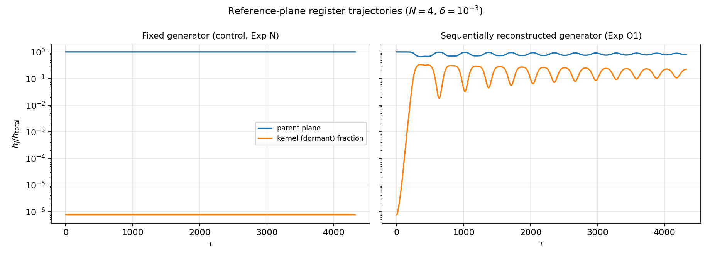
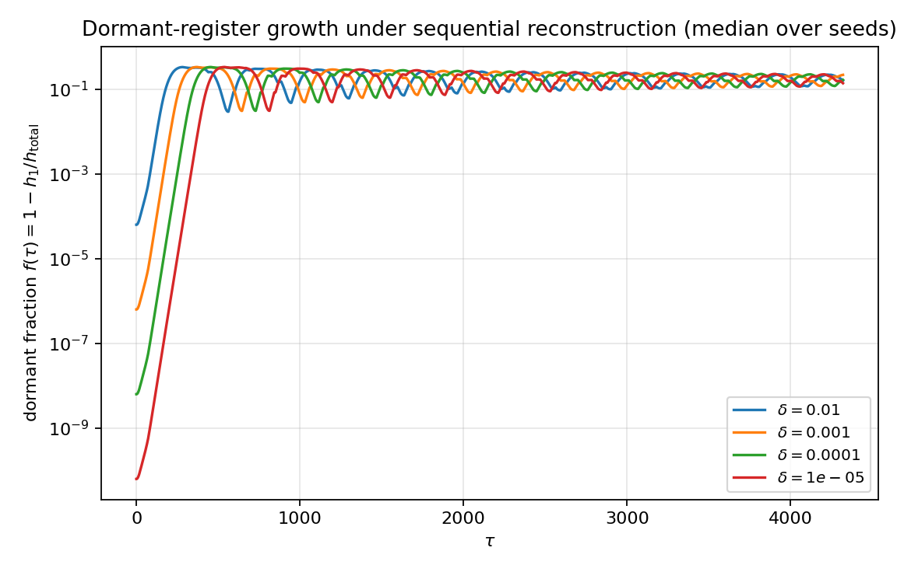
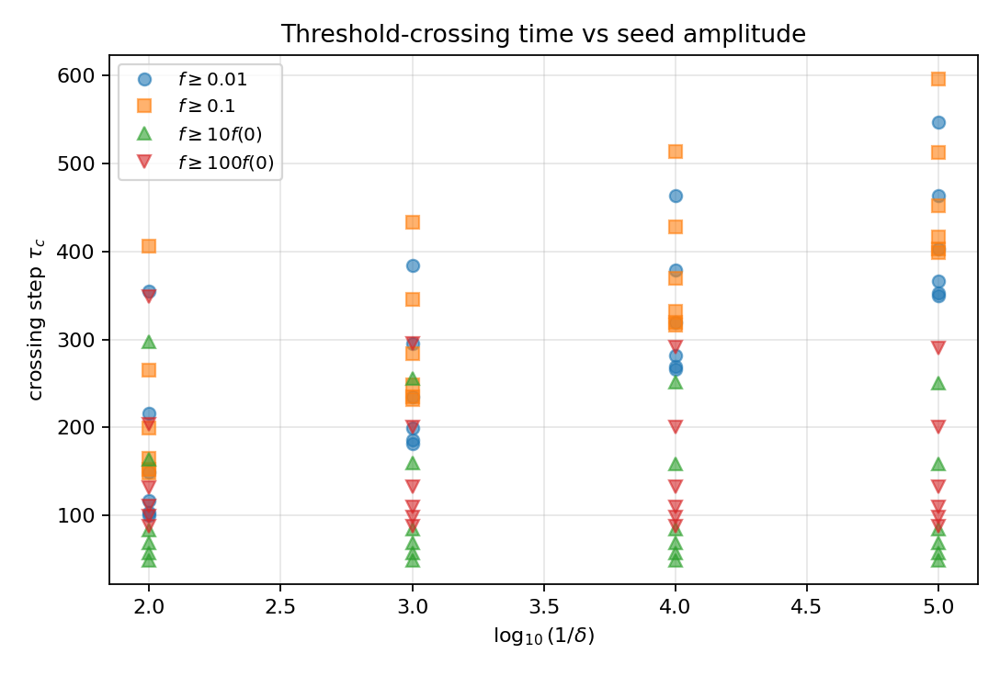
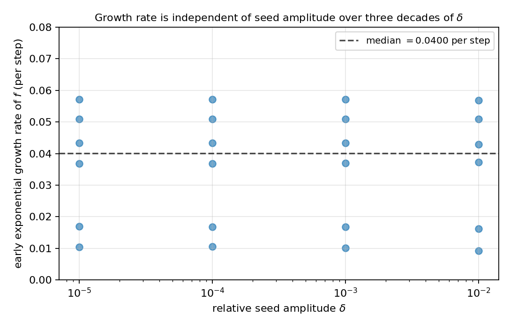
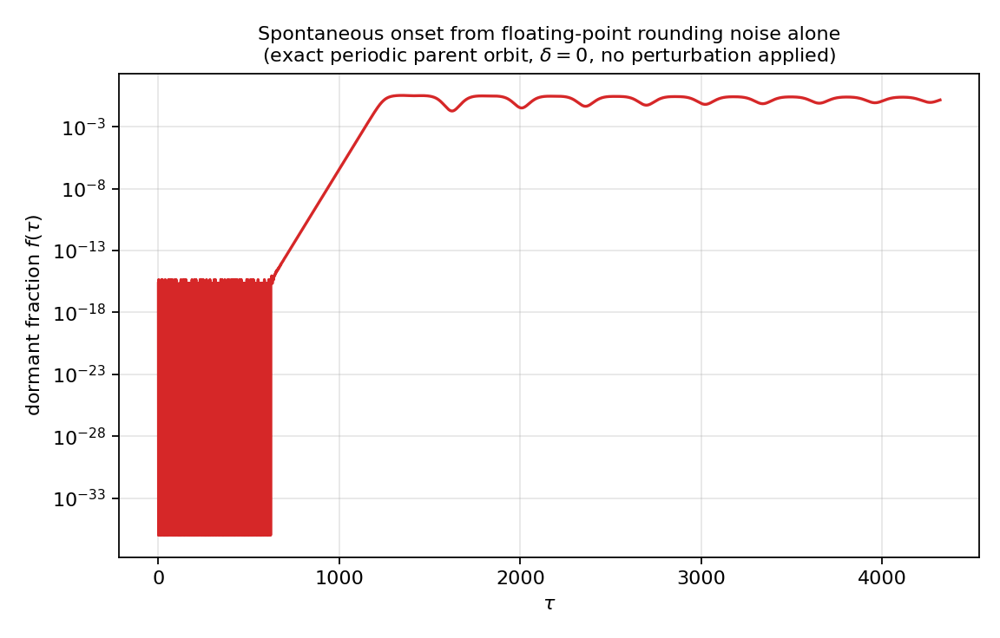
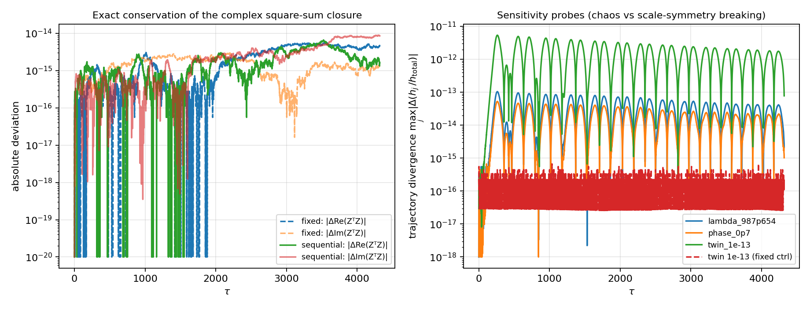
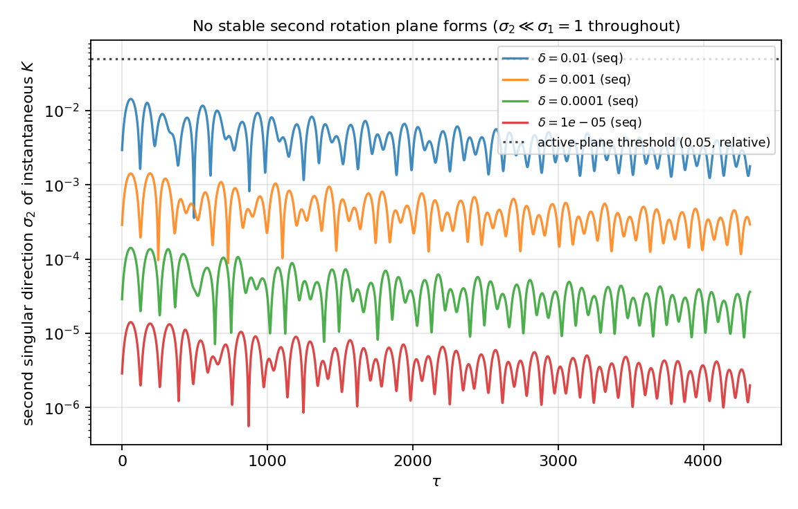
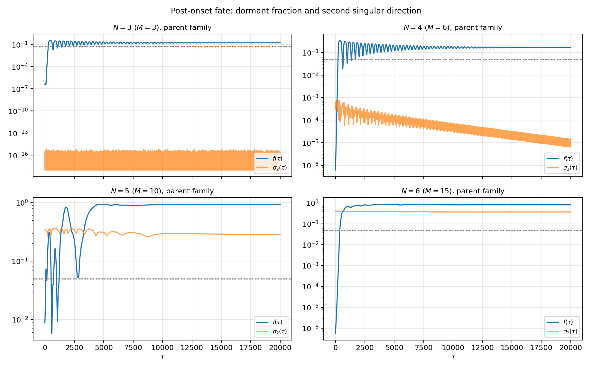
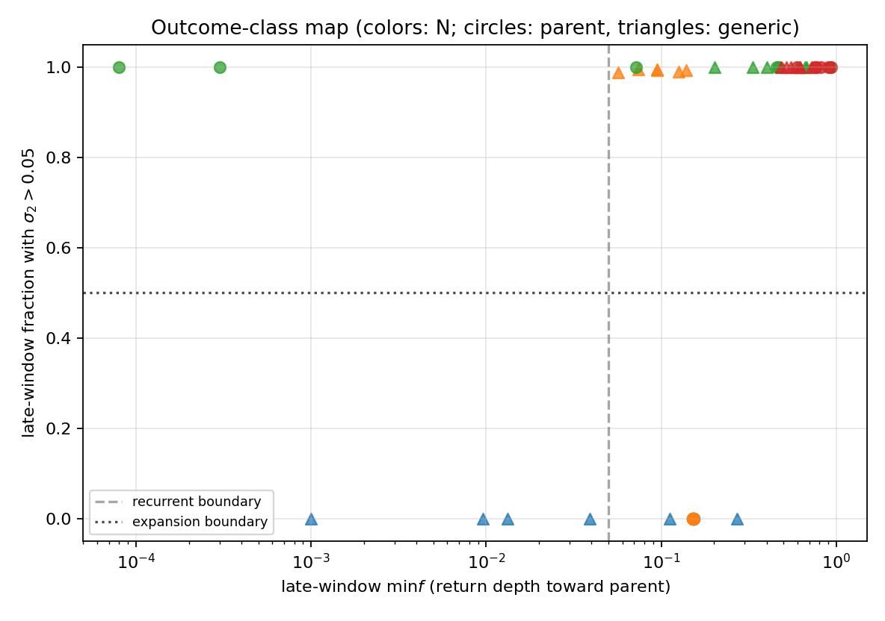
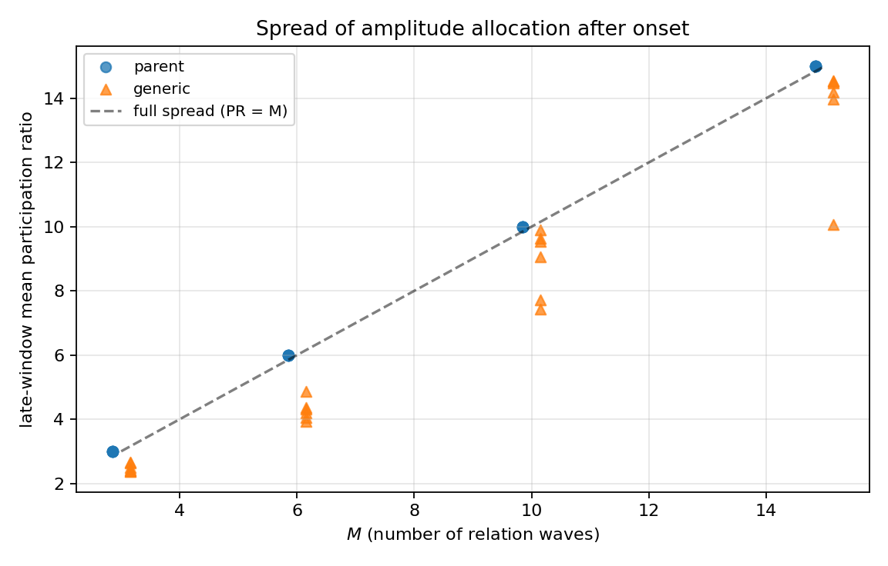

# N体関係波閉鎖系における状態の自発的分裂の開始と帰結の三分類
## 生成子の凍結解除だけで親状態は種振幅に依らない率で指数的に崩れ、帰結は拡大・有界混合・回帰へ分かれる——スケール無名性公理の導入と、分裂停止の接続課題

**著者:** 木原 範昭 
**ORCID:** 0009-0004-6753-4020 
**日付:** 2026年7月21日 
**Version DOI:** （公開時に付与） 
**Concept DOI:** （公開時に付与） 
**位置づけ:** 「次元の生成構造」シリーズ・第5論文 v1

---

## 要旨

第4論文［3］の定理5は、固定生成子のもとで閉鎖量もエネルギー様量も回転平面間を移動しないこと——状態の自発的分裂に対するno-go——を確立した（帰結16.5・16.6［1］）。本稿はこのno-goを出発境界として、次の問いに答える。

> 複数の波は、閉鎖条件のもとで自発的に分裂しうるか。分裂するなら、その後の帰結は分類できるか。

三つの準備を行う。第一に、スケール無名性を公理0.5として導入する。系の関係・更新則・読出しはいかなる絶対スケールも参照してはならず、すべての構成は $Z\to\lambda Z$（$\lambda\in\mathbb C^\ast$）のもとで共変でなければならない。これは公理0（無名性）と同格の証明不能な形成規則であり、公理1の零二乗和閉鎖は、この公理と両立する唯一の二次閉鎖として選択される。第二に、閉鎖球面を保存する滑らかな力学は $\dot X=K(X)X$（$K$ 反対称）の形で尽くされることを示す（定理2）。固定生成子はその特殊例 $K(X)=K_0$ にすぎず、「分裂を可能にする最小拡張」の探索空間はこれで閉じる。第三に、モデル内在の最小拡張として、位相差正弦生成子 $K_{ef}=A_{ef}\sin(\theta_f-\theta_e)$ を毎ステップ現在の位相 $\arg Z(\tau)$ から再構成する（凍結解除）。この生成子は位相差のみの関数なので零次同次であり、公理0.5を無調整で満たす。

自発性は操作的に定義する。親状態が力学的に不安定であること、すなわち任意に小さい摂動が摂動振幅に依らない固有率で指数成長することである。親状態の構成では二つの構造が確定した。実係数の平面内状態は全成分位相が共線となり正弦生成子が厳密に消えるため（定理4）、自己無撞着な親は円偏波固有モード $v=(p+iq)/\sqrt2$ に限られ、固有モードは共通位相回転だけで進むため厳密な周期軌道になる（命題1、数値検証：1周期の生成子変動 $9.2\times10^{-14}$）。さらに数値的知見として、自己無撞着な親の生成子は $\operatorname{rank}2$（回転平面が一つ）であり、残り $M-2$ 次元は静的な核となる。

数値実験（$N=4$、$M=6$、種振幅 $\delta=10^{-2}$〜$10^{-5}$ 各6試行、4320ステップ）で、自発性の三基準がすべて成立した。休眠フラクション $f(\tau)$ の指数成長率は $\delta$ の3桁にわたり中央値 $4.00\times10^{-2}$〜$4.01\times10^{-2}$/step で不変、絶対閾値到達時刻は $\log(1/\delta)$ に線形（1桁あたり約84ステップ）、相対閾値到達時刻は $\delta$ 非依存（約77ステップ）だった。決定的なのは $\delta=0$ の検証である。厳密周期軌道に摂動を一切与えなくても、浮動小数の丸め誤差（$f\sim10^{-33}$）だけを種として $\tau\approx850$ で $f>10^{-10}$ に達し、約20桁の指数ランプの後に飽和した。全過程で複素二乗和閉鎖の実部・虚部（第4論文の分裂厳密条件に対応）は偏差 $\le2.1\times10^{-14}$ で保存された。統制実験（同一初期条件・固定生成子）では参照レジスタ変動 $\le6.6\times10^{-12}$ であり、no-goの数値的再確認と分裂開始の対比が同一コード上で成立した。スケール無名性は数値的にも検証した。$\lambda=2^{10}$ のスケール変換で全比率観測量が bitwise 一致し、一般の $\lambda$ と共通位相回転では偏差 $\sim10^{-13}$ に留まった。

帰結の分類実験（$N=3,4,5,6$、初期条件2族、各6試行、20000ステップ）では、帰結が三クラスに分かれた。拡大（新しい回転平面が定着し配分が全関係波へ広がる）、有界混合（配分は広がるが第2平面は定着しない）、回帰（親平面近傍への深い回帰を反復する）である。クラス選択には鋭い $N$ 相構造がある。$N=3$ では拡大が構造的に不可能（$M=3$ の反対称行列は $\operatorname{rank}\le2$）、$N\ge5$ では初期条件によらず拡大、境界の $N=4$ は二安定で、親近傍初期条件は有界混合へ、一般初期条件は拡大へ向かう——帰結クラスそのものが初期流域で決まる。さらに $N=4$ 親族では第2特異方向 $\sigma_2$ が外部介入なしに指数減衰し（$10^{-3}\to10^{-5}$/20000ステップ）、系が自発的に単一平面の自己無撞着配置へ再凍結する経路が観察された。分裂の停止機構はこの観察とともに続報の中心課題である。

---

## 0. 結論

$$
\boxed{
\begin{aligned}
&\text{閉鎖を保存する力学は }\dot X=K(X)X\text{（}K\text{ 反対称）で尽くされ、固定生成子はその特殊例である。}\\
&\text{生成子の凍結解除だけで、親状態（円偏波固有モード）は外部強制なしに指数的に崩れ、}\\
&\text{閉鎖の実部・虚部を機械精度で保存したまま、配分は休眠方向へ自発的に移動する。}\\
&\text{帰結は拡大・有界混合・回帰の三クラスに分かれ、選択は }N\text{（構造的余地）と初期流域が決める。}
\end{aligned}
}
$$

自発性は力学的不安定性として成立する。成長率は種振幅 $\delta$ の3桁にわたり不変であり、$\delta=0$ の厳密周期軌道さえ丸め誤差だけから崩壊する。決定論的な更新則のもとで、どの方向へ崩れるかは巨視的記述に含まれない微視的差異が決める——決定論と予言可能性がこの最小モデルで分離する。

帰結クラスには $N$ 相構造がある。$N=3$ は拡大不可能（構造的）、$N\ge5$ は拡大不可避（初期条件に依らない）、境界 $N=4$ は二安定であり、同一の系・同一の力学で初期流域により拡大にも有界混合にもなる。$N=4$ 親族では第2特異方向が自発的に指数減衰し、再凍結へ向かう——停止が外部の凍結操作なしに生じうる証拠であり、続報（分裂停止）の中心対象である。

スケール無名性（公理0.5）は本稿の全構成を貫く。凍結解除生成子は位相差のみの関数として零次同次であり、読出しはすべて比率量、活性判定の閾値もすべて相対値である。数値的にも $2^{10}$ 倍スケールで全比率観測量が bitwise 一致した。

---

## 1. 研究課題

### 1.1 no-goを出発境界として

第3論文［2］は、N体完全二体関係波の固定生成子が回転平面の直和と零空間へ分解されること、回転モード数が高々線形にしか増えないことを証明した。第4論文［3］は各平面がAB二体と同型の運動学を持つことを確立し、その定理5は強いno-goを与えた。固定生成子のもとでは、閉鎖量 $Q_j$ もエネルギー様量 $H_j$ も平面間・核との間を一切移動しない（帰結16.5・16.6［1］）。

したがって、状態の自発的分裂——レジスタ間の再配分、新しい回転モードの活性化——は固定生成子の力学では原理的に生じ得ない。分裂を問うには、固定生成子を超える関係更新則が必要である。本稿はその最小拡張を特定し、分裂の開始を数値的に判定し、開始後の帰結を分類する。

本稿は三部構成の続報の第一である。第一の問い（本稿）：分裂は開始しうるか。第二の問い（続報）：分裂は停止しうるか。第三の問い（続報）：分裂が生成した保存量は分化しうるか。

### 1.2 自発性の操作的定義

分裂写像を手で適用したのでは自発性の証明にならない。本稿では自発性を力学的不安定性として操作的に定義する。

1. 休眠成分の成長率が種振幅 $\delta$ に依らない（固有率での指数成長）。
2. 絶対閾値到達時刻が $\log(1/\delta)$ に線形、相対閾値到達時刻が $\delta$ 非依存。
3. 全過程で閉鎖が厳密に保存される（分裂が閉鎖の破れによるものでない）。

さらに最強の検証として $\delta=0$ を置く。厳密な周期軌道に摂動を一切与えず、浮動小数の丸め誤差だけが種となる。それでも崩壊するなら、親状態は任意に小さい摂動で必ず崩れる。

### 1.3 本稿で判別すること

1. 閉鎖を保存する力学の全体はどう特徴付けられるか。固定生成子はその中でどこにいるか。
2. モデル内在の最小拡張（凍結解除）は公理0.5と整合するか。
3. 自己無撞着な親状態（凍結解除力学の厳密な周期軌道）は存在するか。どのような構造か。
4. 親状態は不安定か。自発性の三基準は成立するか。
5. 分裂開始後の帰結は分類できるか。クラス選択は何が決めるか。
6. 以上はすべてスケール共変か。

背景空間・距離行列・外部観測器は導入しない。宇宙論的・場の理論的な物理名は本稿では一切使用しない（公理0）。

---

## 2. 主張の分類

| 対象 | 分類 | 本稿での位置づけ |
|---|---|---|
| N体完全二体関係波モデル | モデル定義 | ［1］公理16の実装、［2,3］の継承 |
| スケール無名性 | 公理（初出） | 公理0.5。証明不能な形成規則。第3節 |
| 公理1の右辺零の選択 | 公理0.5の帰結 | スケール自由な唯一の二次閉鎖。第3節 |
| 直交更新による複素二乗和の厳密保存 | 数学的帰結 | 定理1 |
| 閉鎖保存力学の網羅 $\dot X=K(X)X$ | 数学的帰結 | 定理2。探索空間の閉包 |
| 凍結解除正弦生成子の零次同次性 | 数学的帰結 | 定理3。公理0.5の最初の適用 |
| 共線位相状態での生成子の消滅 | 数学的帰結 | 定理4。親は円偏波に限る |
| 固有モード親の厳密周期軌道性 | 数学的帰結 | 命題1 |
| 自己無撞着親の生成子が $\operatorname{rank}2$ | 数値的知見 | 未証明。第5節 |
| 親状態の指数不安定性（率の $\delta$ 非依存） | 数値的確認 | 実験O1。第8節 |
| $\delta=0$ での丸め誤差起源の崩壊 | 数値的確認 | 実験O1。第8節 |
| 固定生成子でのno-go | 導出済み帰結［1,3］ | 統制実験Nで数値的に再確認 |
| 帰結の三分類（拡大・有界混合・回帰） | 数値的分類 | 実験O4。分類規則の閾値は予備的 |
| $N=3$ で拡大が不可能 | 導出済み帰結 | $M=3$ の反対称行列は $\operatorname{rank}\le2$ |
| $N$ 相構造・$N=4$ 二安定性 | 数値的確認 | 実験O4 |
| $\sigma_2$ の自発的指数減衰（再凍結候補） | 数値的観察・作業仮説 | 停止機構は続報 |
| 飽和天井 $f\approx0.335$〜$0.338$ の由来 | 未解決 | 特定の定数との同定は行わない |
| 変調不安定性［5,6］との関係 | 構造的類似 | 現象論は同型、結合構造は異なる（第9節） |
| 分裂と再結合の再帰 | 数値的確認 | FPUT型再帰［7,8］と同型の現象論 |
| 成分数を増やす明示的分裂写像 | 未構成 | 本稿は活性平面数の増加として測定。接続課題 |
| 分裂の停止機構 | 接続課題 | 続報（第二の問い） |

---

## 3. 公理0.5：スケール無名性

### 3.1 公理の全文

> **公理0.5（スケール無名性）** 系の関係・更新則・読出しは、いかなる絶対スケールも参照してはならない。すべての構成は $Z\to\lambda Z$（$\lambda\in\mathbb C^\ast$）のもとで共変でなければならない。すなわち、関係（閉鎖条件）は同次、生成子は零次同次（$K(\lambda Z)=K(Z)$）、状態写像は一次同次、読出しは比率量のみである。系の内部から絶対スケールを測定する手段は存在しない。

### 3.2 位置づけ

公理0は「物理名を参照してはならない」という形成規則である。公理0.5は「絶対スケールを参照してはならない」という同格の形成規則であり、公理0の直後、公理1の手前に置く。両者は『名前も無い、スケールも無い——読めるのは関係と比率だけ』という単一の思想の二つの条項である。

この公理は導出済み帰結ではない。すべての読出しは比率であり、系の内部から絶対スケールを測る手段が原理的に存在しない、という意味で証明不能な公理である。公理1（零二乗和閉鎖）が証明不能であるのと同じ格を持つ。

### 3.3 公理1の形の選択

二次の閉鎖条件としては $\sum_n x_n^2=c$ のいずれもあり得たが、$c\ne0$ は $Z\to\lambda Z$ で $c\to\lambda^2c$ と壊れる。dilation不変な二次閉鎖は

$$
\sum_n x_n^2=0
$$

ただ一つである。公理0.5を先に置けば、公理1の右辺の零は選択の余地なく決まる。また共変性群 $\mathbb C^\ast$ のコンパクト部分 $|\lambda|=1$ は零二乗和閉鎖の共通位相不変性であり、位相の読出し不能性とスケールの読出し不能性は同じ一つの群の偏角部分と絶対値部分である。

### 3.4 本稿での帰結

公理0.5は本稿で三つの実際の仕事をする。第一に、拡張更新則の探索空間を切る。生成子は零次同次でなければならず、振幅の絶対値には依存できない（位相と振幅比のみ）。第二に、読出しの閾値をすべて相対値に制限する。活性平面の判定閾値・種振幅・回帰判定は、すべて比率として定義される。第三に、数値検証の判定基準を与える。スケール変換した軌道の比率観測量は厳密に一致しなければならない（第8.4節）。

本公理は本稿公開後、基本公理系の次版（v8）で0層へ取り込む。その際、公理0と公理0+は単一の公理0（無名性）の条項として統合する。

---

## 4. 準備：モデルと保存構造

### 4.1 状態と生成子

$N$ 体の完全二体関係波を考える。関係波は完全グラフ $K_N$ の辺に対応し、$M=\binom N2$ 本ある。状態は複素ベクトル $Z\in\mathbb C^M$、位相は $\theta_e=\arg Z_e$ である。線グラフ隣接行列 $A$（辺 $e,f$ が体を共有するとき $A_{ef}=1$）と位相差正弦生成子

$$
K_{ef}=A_{ef}\sin(\theta_f-\theta_e)
$$

は第3論文［2］の定義を継承する。$K$ は自動的に反対称であり、スペクトルノルムで正規化する（正規化後 $\sigma_{\max}=1$。これにより後続の閾値はすべて相対値になる）。更新はCayley変換［10］

$$
U=(I-\gamma K)^{-1}(I+\gamma K),
\qquad
\gamma=\tan\frac{\pi}{144}
$$

による。$K$ が反対称なら $U$ は実直交行列である。

**固定生成子（統制）**：$K$ を $\tau=0$ の位相 $\arg Z(0)$ で評価して凍結する。第3・第4論文の力学である。

**凍結解除（本稿の最小拡張）**：$K$ を毎ステップ現在の位相 $\arg Z(\tau)$ から再構成する。導入するのは新しい結合則ではなく、もともと位相差の関数として定義されていた生成子の凍結を解除することだけである。

### 4.2 定理1（直交更新による複素二乗和の厳密保存）

実直交行列 $U$ による更新 $Z'=UZ$ は、複素双線形二乗和とエルミートノルムを同時に厳密保存する。

$$
Z'^{\mathsf T}Z'=Z^{\mathsf T}U^{\mathsf T}UZ=Z^{\mathsf T}Z,
\qquad
Z'^{\dagger}Z'=Z^{\dagger}Z
$$

**証明** $U^{\mathsf T}U=I$ と $U$ の実性から直ちに従う。$\blacksquare$

複素二乗和 $Z^{\mathsf T}Z$ の保存は、実部と虚部の二条件の同時保存である。これは分裂の局所条件 $X_P^2=\sum_kY_k^2$ が要求する二条件と同じものであり、本稿の力学は分裂の全過程でこの閉鎖を破らない。

### 4.3 定理2（閉鎖保存力学の網羅）

閉鎖球面 $\{X:\,X^{\mathsf T}X=R^2\}$ 上の任意の滑らかな流れは、反対称行列値関数 $K(X)$ を用いて

$$
\dot X=K(X)X
$$

の形に書ける。逆にこの形の流れは閉鎖を保存する。

**証明** 保存は $\frac{d}{d\tau}X^{\mathsf T}X=2X^{\mathsf T}K(X)X=0$（反対称性）。網羅性：球面上の接ベクトル場 $V(X)$（$X^{\mathsf T}V=0$）に対し $K(X)=\dfrac{VX^{\mathsf T}-XV^{\mathsf T}}{X^{\mathsf T}X}$ と置けば $K$ は反対称で $K(X)X=V$。$\blacksquare$

したがって「状態依存生成子」は数ある拡張候補の一つではなく、閉鎖保存力学の全体である。固定生成子はその特殊例 $K(X)=K_0$ にすぎず、分裂を可能にする最小拡張の探索はこの空間の中で行えばよい。

### 4.4 定理3（凍結解除生成子のスケール共変性）

凍結解除正弦生成子は零次同次である。任意の $\lambda\in\mathbb C^\ast$ に対し

$$
K(\lambda Z)=K(Z)
$$

**証明** $\lambda=|\lambda|e^{i\varphi}$ と書く。$\arg(\lambda Z_e)=\arg Z_e+\varphi$ であり、位相差 $\theta_f-\theta_e$ は $|\lambda|$ にも $\varphi$ にも依らない。スペクトルノルム正規化も比率であるから不変。$\blacksquare$

したがって凍結解除力学は公理0.5を無調整で満たす。更新は線形（$U$ は $Z$ の零次関数）なので、軌道全体が $Z\to\lambda Z$ と可換であり、比率観測量の軌道はスケールに厳密に依らない。

---

## 5. 親状態：円偏波固有モードの必然性

### 5.1 定理4（共線位相状態での生成子の消滅）

全成分の位相が共線（ある $\psi$ について $\theta_e\in\{\psi,\psi+\pi\}$）である状態では、正弦生成子は厳密に零である。

**証明** 任意の $e,f$ について $\theta_f-\theta_e\in\{0,\pm\pi\}$、したがって $\sin(\theta_f-\theta_e)=0$。$\blacksquare$

実係数で平面基底を組み合わせた状態 $Z=e^{i\psi}(\cos\varphi\,p+\sin\varphi\,q)$（$p,q$ 実ベクトル）は、各成分が $e^{i\psi}$ の実数倍なのでこの条件に該当する。つまり直線偏波の平面内状態は生成子を退化させ、自己無撞着な力学を持てない。親状態は必然的に、成分位相が広がった円偏波でなければならない。

### 5.2 命題1（固有モード親の厳密周期軌道性）

$K$ の最大特異値平面 $(\sigma,p,q)$（向き規約 $Kp=+\sigma q$）の固有モード

$$
v=\frac{p+iq}{\sqrt2},
\qquad
Kv=-i\sigma v
$$

が自身の生成子と自己無撞着（$K(\arg v)=K$）であるとき、凍結解除力学のもとで $v$ は厳密な周期軌道である。

**証明** $Uv=\dfrac{1-i\gamma\sigma}{1+i\gamma\sigma}\,v=e^{-i\theta}v$（$\theta=2\arctan\gamma\sigma$）。更新は共通位相回転であり、全成分の位相が一様にシフトするので位相差は不変。したがって $K(\arg Uv)=K(\arg v)$ が保たれ、以後のすべてのステップで同じ回転が反復される。$\blacksquare$

自己無撞着な固有モードは不動点反復 $\theta\leftarrow\arg v(K(\theta))$ で数値的に構成した。平面内 $SO(2)$ ゲージは $v$ の共通位相にしか作用しないため（$p,q$ を角 $\alpha$ 回転すると $v\to e^{-i\alpha}v$）、この反復はゲージ選択に依らない。到達した親の固有モード方程式残差は中央値 $8.9\times10^{-13}$、$\delta=0$ 検証では1周期（144ステップ）にわたり生成子変動 $9.2\times10^{-14}$、休眠フラクション厳密零を維持した。

### 5.3 数値的知見：親の生成子は $\operatorname{rank}2$

自己無撞着な親の生成子 $K(\arg v)$ は、調べた全構成で $\operatorname{rank}2$（回転平面が一つ、$\sigma=1$）であり、残り $M-2$ 次元は核（静的部分空間）だった。親状態は自分の平面だけを見ており、休眠方向はすべて核に属する。この性質の証明は得られていない（数値的知見）。したがって休眠種は核方向へ複素係数で置く。

なお $N=5$ で6試行中4、$N=6$ で6試行中1の親準備において固有モード残差が $\sim9\times10^{-2}$ に留まった（不動点反復の収束悪化、または大きい $N$ での不動点の不存在の可能性）。当該試行の「親」は近似親である。第8.6節の結論は残差 $\sim10^{-15}$ の試行だけを見ても同一であり頑健だが、大きい $N$ での親の存在問題は未解決として残す。

---

## 6. 分裂の読出し定義

分裂は次の三つの比率量で読む（すべて公理0.5に適合する相対量である）。

**休眠フラクション** 参照生成子 $K(\arg Z(0))$ の親平面 $(p_1,q_1)$ に対し

$$
f(\tau)=1-\frac{|p_1^{\mathsf T}Z|^2+|q_1^{\mathsf T}Z|^2}{Z^{\dagger}Z}
$$

親平面の外（核）にある配分の割合。レジスタ再配分としての分裂の読出しである。

**第2特異方向** 瞬時生成子 $K(\arg Z(\tau))$ の第2特異値 $\sigma_2$（正規化後 $\sigma_1=1$ なので $\sigma_2$ は比率）。相対閾値 $\sigma_2>0.05$ を活性平面の判定とする。新しい回転モードの定着——成分数増加に対応する読出し——である。絶対閾値は公理0.5により置けないことを注意する。数値ダスト $\sigma_2=O(\delta)$ を平面と数えてはならない。

**関与比** 辺振幅の関与比

$$
\mathrm{PR}(\tau)=\frac{\left(\sum_e|Z_e|^2\right)^2}{\sum_e|Z_e|^4}\in[1,M]
$$

配分の広がりの読出しである［11］。

---

## 7. 実験設計

### 実験N（統制）

親＋休眠種の同一初期条件を固定生成子（$\tau=0$ で凍結）で更新する。帰結16.5・16.6［1,3］により、参照平面レジスタと核配分は機械精度で個別保存されるはずである。測定系の健全性検証とno-goの数値的再確認を兼ねる。

### 実験O1（分裂開始）

同一初期条件を凍結解除で更新する。$N=4$（$M=6$）、種振幅 $\delta=10^{-2},10^{-3},10^{-4},10^{-5}$、各6乱数種、4320ステップ。休眠種は親の直交補（核）方向へ複素係数で置き、初期休眠フラクションは $f(0)\approx0.63\,\delta^2$ となった。加えて $\delta=0$（純固有モード、摂動なし）の検証走行を置く。

### スケール検証

代表条件（$\delta=10^{-3}$）で $Z_0\to\lambda Z_0$ とした軌道の比率観測量を比較する。$\lambda=2^{10}=1024$（浮動小数のまるめ誤差が厳密に零になるスケール変換）、$\lambda=987.654$（一般値）、$\lambda=e^{0.7i}$（共通位相回転）。さらに双子摂動（1成分を相対 $10^{-13}$ 変化）との軌道発散率を比較し、一般 $\lambda$ での偏差がスケール対称性の破れでなく丸め差の力学的増幅であることを切り分ける。

### 実験O4（帰結分類）

$N=3,4,5,6$（$M=3,6,10,15$）、初期条件2族（parent：自己無撞着親＋$\delta=10^{-3}$ 種、generic：一様ランダム複素状態）、各6乱数種、20000ステップ。分類計量は後期窓（後半）の $f$ の最小値（回帰深度）、$\sigma_2>0.05$ の滞在率（拡大の定着）、関与比である。分類規則（予備的）は次のとおり。

- **拡大**：$\sigma_2$ 活性滞在率 $>0.5$
- **回帰**：後期 $\min f<0.05$
- **有界混合**：それ以外

---

## 8. 結果

### 8.1 統制（実験N）：no-goの数値的再確認

固定生成子のもとで参照レジスタ比率の最大変動は全試行で $6.6\times10^{-12}$ 以下、休眠核配分は $\delta^2$ のまま一切成長しなかった。帰結16.5・16.6の予言どおりである。

*図1：参照平面レジスタの軌道（$N=4$、$\delta=10^{-3}$）。左：固定生成子（統制）——親平面と核配分は機械精度で凍結。右：凍結解除——同一初期条件から配分が自発的に移動する。*

### 8.2 分裂開始（実験O1）：自発性の三基準が成立

$$
\begin{array}{c|cccc}
\delta & 10^{-2} & 10^{-3} & 10^{-4} & 10^{-5}\\\hline
\text{成長率（中央値, /step}) & 4.004\times10^{-2} & 4.011\times10^{-2} & 4.011\times10^{-2} & 4.010\times10^{-2}\\
\tau_c(f\ge10^{-2})\text{（中央値}) & 133 & 217 & 300.5 & 384.5\\
\tau_c(f\ge10f(0))\text{（中央値}) & 76.5 & 77 & 77 & 77
\end{array}
$$

成長率は $\delta$ の3桁にわたり不変である（率は乱数種——親配置——には依るが、$\delta$ には依らない）。絶対閾値到達時刻は $\log(1/\delta)$ に線形（1桁あたり約84ステップ）、相対閾値到達時刻は $\delta$ 非依存。基準1・2が成立する。

*図2：休眠フラクション $f(\tau)$ の成長（乱数種中央値）。4系列の平行な指数ランプが $\log(1/\delta)$ だけシフトして並ぶ——不安定性の古典的シグネチャである。飽和後は普遍的な天井（$f\approx0.335$〜$0.338$）と往復振動に入る。*

*図3：閾値到達時刻。絶対閾値（丸・四角）は $\log_{10}(1/\delta)$ に線形、相対閾値（三角）は $\delta$ 非依存。*

*図4：初期指数成長率の分布。各 $\delta$ 列の点パターンが同一——率は乱数種（親配置）で決まり、種振幅では決まらない。*

決定的なのは $\delta=0$ である。摂動を一切与えない厳密周期軌道が、丸め誤差の床（$f\sim10^{-33}$）から約20桁の指数ランプで崩壊し、$\tau\approx850$ で $f>10^{-10}$、その後同じ天井へ飽和した。

*図5：$\delta=0$ 検証。1周期にわたり厳密に周期的（生成子変動 $9.2\times10^{-14}$、$f=0$）だった軌道が、浮動小数の丸め誤差だけを種として自発的に崩壊する。*

### 8.3 閉鎖の厳密保存

$$
\begin{array}{l|ccc}
 & |\Delta\operatorname{Re}Z^{\mathsf T}Z| & |\Delta\operatorname{Im}Z^{\mathsf T}Z| & |\Delta Z^{\dagger}Z|/Z^{\dagger}Z\\\hline
\text{固定生成子} & \le1.2\times10^{-14} & \le8.0\times10^{-15} & \le8.0\times10^{-13}\\
\text{凍結解除} & \le1.3\times10^{-14} & \le1.3\times10^{-14} & \le2.0\times10^{-14}
\end{array}
$$

分裂の開始は、複素二乗和閉鎖の実部・虚部（分裂の局所条件が要求する二条件）を破らずに進行する。基準3が成立する。

### 8.4 スケール無名性の数値検証と鋭敏性の切り分け

$$
\begin{array}{l|c}
\text{変換} & \max|\Delta(\text{比率観測量})|\\\hline
\lambda=2^{10}=1024 & 0\ \text{（bitwise一致）}\\
\lambda=987.654 & 1.1\times10^{-13}\\
\lambda=e^{0.7i}\ \text{（共通位相）} & 5.3\times10^{-14}\\
\text{双子摂動 }10^{-13}\ \text{（対照）} & 5.4\times10^{-12}\\
\text{双子摂動・固定生成子（対照）} & 6.7\times10^{-16}
\end{array}
$$

まるめ誤差が厳密に生じない $\lambda=2^{10}$ で bitwise 一致することは、実装が厳密にスケール自由であることを示す。一般 $\lambda$ での $\sim10^{-13}$ の偏差は、双子摂動と同程度の緩慢な増幅率（$\sim2.5\times10^{-4}$/step）を持ち、スケール対称性の破れではなく初期まるめ差の力学的増幅である。定理3と合わせて、公理0.5は理論・数値の両面で成立する。

*図6：左——複素二乗和閉鎖の保存誤差（両力学とも機械精度）。右——鋭敏性プローブ。一般スケール・共通位相・双子摂動が同程度の緩慢な発散を示し、固定生成子対照は発散しない。*

### 8.5 開始後：飽和・再帰・第2平面の非定着（$N=4$）

飽和後の $f$ は普遍的な天井 $0.335$〜$0.338$ を持ち、$0.04$〜$0.34$ の間を往復する。保存系の分裂・再結合の反復であり、FPUT型再帰［7,8］と同型の現象論である。天井の値の由来（構造定数か力学定数か）は未解決であり、特定の定数との同定は行わない。判別には $N$・$\gamma$ 依存性の系統測定が必要である。

一方、瞬時生成子は終始単一平面のままである。$\sigma_2$ は $10^{-3}$〜$10^{-4}$ に留まり、相対閾値 $0.05$ を一度も超えない。$N=4$ の親近傍では、レジスタ再配分としての分裂は起こるが、新しい回転平面の定着——成分数増加としての分裂——は起こらない。

*図7：瞬時生成子の第2特異方向 $\sigma_2$（$N=4$、親族）。全 $\delta$ で活性閾値 $0.05$ を下回り続ける——第2回転平面は定着しない。*

### 8.6 帰結の三分類（実験O4）

$$
\begin{array}{cc|cc}
N & M & \text{parent 族} & \text{generic 族}\\\hline
3 & 3 & \text{有界混合 }6/6 & \text{回帰 }4/6\text{・有界混合 }2/6\\
4 & 6 & \text{有界混合 }6/6\ (\sigma_2\text{ 指数減衰}) & \text{拡大 }6/6\\
5 & 10 & \text{拡大 }6/6 & \text{拡大 }6/6\\
6 & 15 & \text{拡大 }6/6 & \text{拡大 }6/6
\end{array}
$$

全試行で閉鎖保存の最大偏差 $3.6\times10^{-14}$。三つの帰結クラスがすべて実現した。

**拡大** 新しい回転平面が定着し（$\sigma_2>0.05$ の滞在率ほぼ1）、配分が全関係波へ広がって定常な多平面状態へ収束する（$N=5$：$f\to0.9$、$\sigma_2\approx0.3$ 定常。$N=6$：$f\to0.85$、$\sigma_2\approx0.4$ 定常）。

**有界混合** 配分は広がる（親族では関与比が厳密に $\mathrm{PR}=M$ の等分配線に乗る）が、第2平面は定着せず、単一平面が彷徨しながら振幅だけを混合する。

**回帰** 親平面近傍への深い回帰を反復する（$N=3$ generic 族に出現）。

*図8：親族の運命曲線（$N=3,4,5,6$）。$N=3$ は $\sigma_2\equiv0$（拡大が構造的に不可能）。$N=4$ は $\sigma_2$ が自発的に指数減衰する。$N\ge5$ は $\sigma_2$ が定常値へ定着し拡大が完成する。*

*図9：全96試行の分類マップ（横軸：後期回帰深度、縦軸：$\sigma_2$ 活性滞在率）。三クラスが明確に分離する。*

*図10：後期関与比。親族は全 $N$ で厳密に $\mathrm{PR}=M$（等分配）に到達する。*

クラス選択の構造は次の三点に要約される。

1. **$N$ 相構造** $N=3$ では拡大が構造的に不可能である。$M=3$ の反対称行列は $\operatorname{rank}\le2$ であり、第2回転平面が存在し得ない（$\sigma_2\equiv0$、導出済み）。$N\ge5$ では初期条件2族・全乱数種で拡大が生じた。状態数が閾を超えた系では拡大が初期条件に依らない。
2. **$N=4$ の二安定性** 同一の系・同一の力学で、親近傍初期条件は有界混合へ、一般初期条件は拡大へ向かう。帰結クラスそのものが初期流域で決まる。流域境界の構造（フラクタル性の有無）は未測定である。
3. **自発的再凍結の観察** $N=4$ 親族では $\sigma_2$ が外部介入なしに指数減衰した（$10^{-3}\to10^{-5}$/20000ステップ）。系が自発的に新しい単一平面の自己無撞着配置——実効的な凍結状態——へ向かうことを示唆する。統制実験が示すとおり生成子の凍結は全レジスタを固定するから、この減衰が完了すれば分裂は内発的に停止する。停止機構の解明は続報の中心課題である。

---

## 9. 議論と限界

**変調不安定性との関係** 本稿の開始現象は、変調不安定性［5,6］と同型の現象論（指数成長・種振幅非依存の率・離散モードの活性化・飽和）を示す。ただし機構は異なる。NLS型の変調不安定性は振幅依存の非線形結合から生じるが、本系の生成子は振幅に依存しない（位相のみの結合、零次同次）。「MIの一種」ではなく「MIと同型の現象論を持つ位相結合型の不安定性」である。

**FPUT型再帰** 飽和後の分裂・再結合の往復は、保存系の再帰［7,8］と同型である。再帰と熱化（等分配 $\mathrm{PR}=M$）の判定枠組みは［8］に従った。有界混合クラスは「再帰しながら振幅は等分配へ向かう」中間的様相を示し、この分類の精密化は続報に回す。

**決定論と予言可能性** $\delta=0$ 走行の崩壊方向は浮動小数の丸め誤差が決めた。更新則は完全に決定論的だが、帰結は巨視的記述に含まれない微視的差異に鋭敏に依存する［9］。$N=4$ の二安定性はこの依存性が帰結クラスのレベルにまで及ぶことを示す。

**限界** （i）成分数そのものを増やす明示的分裂写像（局所条件 $X_P^2=\sum_kY_k^2$ を満たす構成）は本稿では構成していない。本稿の「分裂」は固定次元の状態空間内でのレジスタ再配分と活性平面数の増加である。（ii）親の $\operatorname{rank}2$ 性は数値的知見であり未証明。（iii）大きい $N$（$N\ge5$ の一部試行）で親の不動点反復が収束せず、近似親を用いた。（iv）分類規則の閾値（$\sigma_2>0.05$、$\min f<0.05$、後期窓＝後半）は予備的であり、感度解析は行っていない。（v）飽和天井の由来は未解決。（vi）成長率 $4.00\times10^{-2}$/step の理論式（親周期軌道まわりのFloquet解析）は未実施。

---

## 10. 接続課題

1. **分裂の停止**（続報・第二の問い）。$N=4$ 親族の自発的 $\sigma_2$ 減衰の機構と減衰率。減衰の到達先（新しい自己無撞着配置）の同定。外部の生成子固定（統制実験で全レジスタが凍結する操作）との関係。再分裂の閾値。
2. **保存量の分化**（続報・第三の問い）。分裂が生成した相対成分の交換対称性による分類。
3. 明示的分裂写像（成分数増加、複素二乗和厳密保存）の構成と、本稿の活性平面数増加との関係。
4. 親周期軌道のFloquet解析と測定成長率の突合。
5. $N=4$ 流域境界の精密マッピング（フラクタル性の判定）。
6. 飽和天井の $N$・$\gamma$ 依存性の系統測定。
7. 親の $\operatorname{rank}2$ 性の証明、大きい $N$ での自己無撞着親の存在問題。
8. 選択凍結の統計（凍結時刻と凍結される配分の分布）。

---

## 11. 再現可能性

本稿の数値実験は、次の実プログラムと出力に基づく。

### 実行プログラム

- `次元の生成構造/自発的分裂予備実験_v1/run_spontaneous_splitting_preliminary_v1.py`（実験N・O1・スケール検証・$\delta=0$ 検証）
- `次元の生成構造/自発的分裂予備実験_v1/run_outcome_classification_preliminary_v1.py`（実験O4）
- `次元の生成構造/自発的分裂予備実験_v1/make_paper_supplement_figures_v1.py`（補足図生成）

### 主要出力

- `spontaneous_splitting_result_v1/summary_v1.json`・`dormant_fraction_curves_v1.csv`・図7点
- `outcome_classification_result_v1/summary_v1.json`・図3点

---

## 12. 最終結論

閉鎖球面を保存する力学は $\dot X=K(X)X$（$K$ 反対称）で尽くされ、固定生成子はその特殊例である。もともと位相差の関数として定義されていた正弦生成子の凍結を解除するだけで——新しい結合則を導入することなく、外部強制もなしに——親状態は種振幅に依らない固有率で指数的に崩れ、複素二乗和閉鎖の実部・虚部を機械精度で保存したまま、配分は休眠方向へ自発的に移動する。$\delta=0$ の厳密周期軌道さえ丸め誤差だけから崩壊する。第4論文のno-goが規定した境界のすぐ外側で、自発的分裂は開始する。

$$
\boxed{
\begin{aligned}
&\text{分裂は開始しうる。ただし帰結は一本道ではない。}\\
&\text{拡大（新平面の定着・等分配）・有界混合（単一平面の彷徨）・回帰（親近傍への反復回帰）の}\\
&\text{三クラスが実在し、選択は }N\text{ の相構造（}N=3\text{ 不可能・}N\ge5\text{ 不可避・}N=4\text{ 二安定）と}\\
&\text{初期流域が決める。}
\end{aligned}
}
$$

スケール無名性（公理0.5）は、この全構成を貫く形成規則として導入された。凍結解除生成子は零次同次としてこれを無調整で満たし、読出しと閾値はすべて比率量であり、数値的には $2^{10}$ 倍スケールで全比率観測量が bitwise 一致した。公理1の零二乗和は、この公理と両立する唯一の二次閉鎖である。

$N=4$ 親族で観察された $\sigma_2$ の自発的指数減衰は、分裂が外部の凍結操作なしに停止しうることを示唆する。分裂は開始しうるか——本稿の答えは肯定である。それは止まりうるか——続報の問いである。

---

## 参考文献

### 自己引用

1. 木原 範昭「無名等振幅複合波モデル基本公理系 v7」Zenodo, 2026. Version DOI: [10.5281/zenodo.21469133](https://doi.org/10.5281/zenodo.21469133), Concept DOI: [10.5281/zenodo.21315735](https://doi.org/10.5281/zenodo.21315735).
2. 木原 範昭「N体完全二体関係波における生成子ランクの線形上界と空間方向読出しの三方向飽和」Zenodo, 2026. Version DOI: [10.5281/zenodo.21465899](https://doi.org/10.5281/zenodo.21465899), Concept DOI: [10.5281/zenodo.21465898](https://doi.org/10.5281/zenodo.21465898).
3. 木原 範昭「N体固定生成子系における平面分解読出し」Zenodo, 2026. Version DOI: [10.5281/zenodo.21468960](https://doi.org/10.5281/zenodo.21468960), Concept DOI: [10.5281/zenodo.21468959](https://doi.org/10.5281/zenodo.21468959).
4. 木原 範昭「AB二体閉鎖位相系における未来位相位置加速度写像と調和閉鎖による逆二乗則 v4」Zenodo, 2026. Version DOI: [10.5281/zenodo.21468270](https://doi.org/10.5281/zenodo.21468270), Concept DOI: [10.5281/zenodo.21441081](https://doi.org/10.5281/zenodo.21441081).

### 外部文献

5. T. Brooke Benjamin and J. E. Feir, “The disintegration of wave trains on deep water. Part 1. Theory,” *Journal of Fluid Mechanics*, 27(3), 417–430, 1967. DOI: [10.1017/S002211206700045X](https://doi.org/10.1017/S002211206700045X).
6. Vladimir E. Zakharov and Lev A. Ostrovsky, “Modulation instability: The beginning,” *Physica D*, 238(5), 540–548, 2009. DOI: [10.1016/j.physd.2008.12.002](https://doi.org/10.1016/j.physd.2008.12.002).
7. Enrico Fermi, John Pasta, and Stanislaw Ulam, “Studies of Nonlinear Problems. I,” Los Alamos Report LA-1940, 1955. DOI: [10.2172/4376203](https://doi.org/10.2172/4376203).（Mary Tsingou の計算実装への寄与を含む）
8. Gennady P. Berman and Felix M. Izrailev, “The Fermi–Pasta–Ulam problem: Fifty years of progress,” *Chaos*, 15(1), 015104, 2005. DOI: [10.1063/1.1855036](https://doi.org/10.1063/1.1855036).
9. Edward N. Lorenz, “Deterministic Nonperiodic Flow,” *Journal of the Atmospheric Sciences*, 20(2), 130–141, 1963. DOI: [10.1175/1520-0469(1963)020<0130:DNF>2.0.CO;2](https://doi.org/10.1175/1520-0469(1963)020%3C0130:DNF%3E2.0.CO;2).
10. Fasma Diele, Luciano Lopez, and R. Peluso, “The Cayley Transform in the Numerical Solution of Unitary Differential Systems,” *Advances in Computational Mathematics*, 8(4), 317–334, 1998. DOI: [10.1023/A:1018908700358](https://doi.org/10.1023/A:1018908700358).
11. David J. Thouless, “Electrons in disordered systems and the theory of localization,” *Physics Reports*, 13(3), 93–142, 1974. DOI: [10.1016/0370-1573(74)90029-5](https://doi.org/10.1016/0370-1573(74)90029-5).
