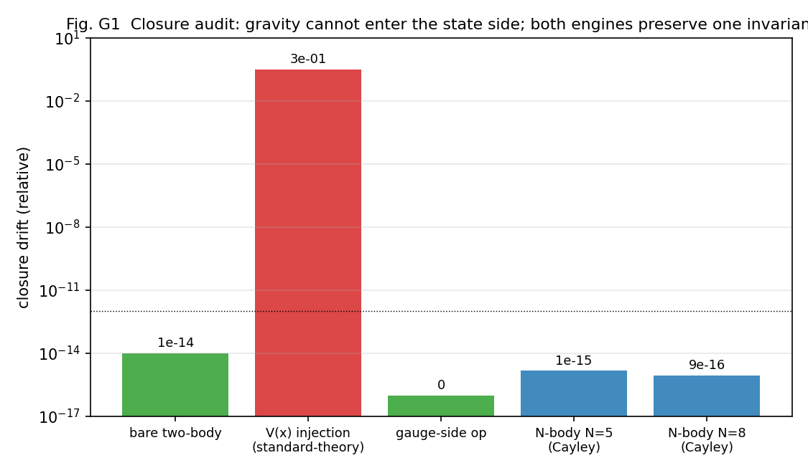
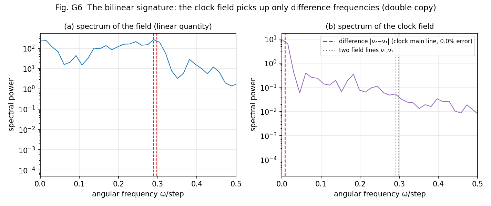

# Where Was Gravity Mislaid? — A Century of Struggle to Unify Quantum Theory and Gravity May Have Been a Mistake of Placement

Noriaki Kihara
Published August 7, 2026

Physics carries a wound that has not closed for a hundred years: the unification of quantum mechanics and the theory of gravity.

Quantum theory describes the microscopic world; general relativity describes gravity as the curvature of spacetime. Each is astonishingly accurate in its own domain. Yet the moment you try to make them one theory, the calculations blow up to infinity and break. The procedure for erasing the infinities — renormalization — works for the other forces (electromagnetic, weak, strong), but for gravity it simply refuses to work. The world's best minds have attacked this for a century, and it is still open.

This paper proposes a diagnosis for that wound.

**The cause of the struggle may lie not in the content of the theories, but in where gravity was placed.**

## It begins with my own failure

In my previous paper, "The Periodic Table of Waves," I assembled a classification hypothesis for the 62 particles of the standard theory from wave dynamics that assume no concept of a particle at all. But that table had no dynamics — above all, no gravity.

Going further back, in an earlier paper I once derived the acceleration of a two-body system A and B: I built it as the reaction of the circumferential force on the radius R of the circle along which body B locally maintains zero closure. The derivation went through. But honestly, that construction put acceleration in by hand. My series has one rule: only the shapes of waves are input, and no special machinery is inserted into the dynamics by hand (the anonymity of operations). Measured against that rule, the derivation left me dissatisfied for a long time.

So this time I did it over, with nothing built in. I put a gravitational potential directly into the universal interaction function of the waves themselves.

**The result was a clear failure.**

This entire wave system runs while preserving an exact zero closure, Σxₙ²=0. The bare dynamics keeps this quantity to a precision of 10 to the minus 13. But when I injected a gravitational potential into the state, the closure broke by 31% within 200 steps — even at an amplitude of just 10 to the minus 3.

(Insert Figure 1 here: `重力読出し検討/fig_g1_closure_en_v1.png`)

Figure 1. The closure audit. The bare dynamics is exact at 10⁻¹³; potential injection breaks 31%; and operations on the readout (gauge) side are exactly zero.

And this failure was no accident. It was mathematically inevitable. One can prove that the only operations that preserve the closure for every state are those with antisymmetric generators (the tangent theorem). Potential injection is symmetric, so it necessarily breaks at first order. The intriguing part: the injection preserves the size of the state (the norm) perfectly. It preserves the size while breaking the closure. That is why the breakage is so hard to see.

## The cause of the failure was not the theory but the placement

At this point I turned the idea inside out.

In this series, the three axes of space, time, position, even the number of particles — all of them arose not as the wave state itself, but as quantities read out from the state. Then shouldn't acceleration too — warped space, slowed clocks — be a phenomenon of the readout side?

Separate waves and fields into two layers.

- The wave layer (existence): the waves themselves, turned by the universal interaction function. It preserves the zero closure Σxₙ²=0 exactly.
- The field layer (readout): the gauges of space, the gauges of time, mass, charge — all read from the state by one readout function. Zero tuning parameters.

Gravitational distortion goes into this readout layer. Warping the readout gauges never touches the state, so the closure remains constructively intact.

That is the experiment of this paper. The result: the unification of gauge fields close in concept to the standard theory with gravitationally (acceleration-) distorted fields nearly succeeded, via the universal field-readout function.

## What came out of one readout function

Out of the same single function, all of the following emerged — each with measured numbers.

**The vacuum does not tick.** The local pace of the clock at each place (the clock field) arises as a readout. A pure sea of light is an exact fixed point of this clock — time does not flow there. Place a massive body, and a clock distortion rises around it.

**The law of mass became a theorem.** Mass factorizes cleanly as a function of the density v of the sea (the vacuum) and the composition f of the species. Moreover, this law can be derived with pen and paper from the definition of the readout function: a prediction that runs no dynamics at all agreed with 15 measured points at a mean ratio of 0.983 with 1.2% scatter — not just the exponents but the absolute values. The structure of the Higgs mechanism (species coupling × a function of the condensate) appears here as a measured fact.

(Insert Figure 2 here: `重力読出し検討/fig_g3_higgs_en_v1.png`)

Figure 2. Factorization and analytic derivation of mass generation. Right: the dynamics-free prediction against measurement (15 points, ratio 0.983, scatter 1.2%).

**What falling really is.** Around a mass, the distortion of the spatial gauge keeps growing in proportion to time. The meaning fits in one line: the gradient of the clock accelerates the momentum of the sea. For a thing to fall is not for a particle's coordinates to change — it is for the sea's momentum field to grow linearly. The length scale that sets the growth rate can also be computed from the readout function; the parameter-free prediction matched measurement with 11% scatter.

(Insert Figure 3 here: `重力読出し検討/fig_g4_momentum_law_en_v1.png`)

Figure 3. Linear growth of the spatial gauge. The scale of the slope is derived from the geometry of the readout function (no parameters).

**Gravity pulls everything.** On a broadband sea, pairing every species with every other and measuring, all 10 pairs at all separations attracted (30 wins, 0 losses). Charged or neutral, positive or negative — everything pulls together. The universality of gravity comes out as is.

**The graviton's signature.** The clock readout is the square of the field (bilinear). If so, the spectrum of the clock field should show not the frequencies of the fields themselves but their differences. Measured: against the field's two lines at 0.2898 and 0.2974, the clock field's main line sat at 0.0076 — matching the difference with 0.0% error, while the fields' own lines were suppressed by a factor of 250. The same shape as a modern discovery — that the gravity amplitude is the square of the gauge amplitude (the double copy) — appears here as the very mechanism of measurement.

(Insert Figure 4 here: `重力読出し検討/fig_g6_bilinear_en_v1.png`)

Figure 4. The clock field picks up only the fields' difference frequencies. A direct demonstration of the bilinearity of the gravitational readout.

## The decisive experiment — gauge and gravity emerged from the same function, separately and at once

The most direct test of the title is this: can one and the same readout simultaneously produce a response that depends on the structure of charge, and one that does not?

I measured the couplings between charged sources in every combination. The result: a charge-blind universal attraction (the gravity channel) and a gauge-like response depending on the structure of the charges (15% of the coupling) emerged from the same readout, separately and at once. Flip every sign of every charge, and the results stay unchanged to 10 digits (charge-conjugation symmetry).

(Insert Figure 5 here: `重力読出し検討/fig_g8_gauge_gravity_en_v1.png`)

Figure 5. The decisive experiment. All-pair attraction (gravity) + a charge-structure-dependent component (gauge-like) + exact conjugation symmetry.

And the separation did not stop at numerical observation. The separation itself can be proven as a theorem. The readout decomposes exactly and orthogonally into a charge-blind part that depends only on powers (gravity) and a coherent part that lights up only when the windings match (gauge-like) — the readout decomposition theorem.

Furthermore, the selection rule for which pairs of charges open a channel between them coincided exactly with the winding-walk law discovered in the previous paper's periodic table. The table of classification and the law of force connected quantitatively for the first time. The selection rules ultimately close as a finite algebra over a cyclic group (a vertex algebra), and when its number-theoretic prediction — which charges dissolve into the vacuum, and which persist forever — was tested in a long-time experiment, the forbidden leakage came out at 8.9×10⁻²⁶: zero at machine precision. Superselection holds not approximately but exactly.

## So what was the century of struggle?

Looking back from this framework, the diagnosis can be written down.

**The struggle to unify quantum theory and gravity came from bringing acceleration into the dynamics of particles, generating divergences, and erasing them with renormalization, over and over.** Pour values from outside into waves that are exactly zero-closed, and the closure must break. Cancel the breakage by adding negative terms to the right-hand side — that is the daily practice of the renormalization counterterm. In other words: a counterterm is the price of confusing the layers. Break it yourself, then fix it yourself. The procedure worked for the other forces because the breakage there was shallow; it fails for gravity because gravity is the readout layer itself — the gauges of space and time. Treat the distortion of the gauges as a field of the state layer, and the category mistake will haunt you forever.

And the standard theory's practice of stacking gauge theory upon gauge theory — the forced extensions built one after another — has rested on the same one-layer ontology: putting everything in the same layer as fields with dynamics. In this paper's model, gauge structure and gravitational structure both come out at once, as different projections of one readout function, with no extensions built on.

There is one more beautiful byproduct. Mass is the value of the clock field; gravity is the gradient of the clock field. That is, **mass and gravity are the 0th and 1st derivatives of one and the same clock field.** The saying that heavy bodies curve spacetime reduces, in this model, to two readings of one field: where the clock field is high is the center of the clock field's gradient.

## Honest limits

This paper is a framework proposal. Proven theorems, measured laws, empirical rules, and synthesis hypotheses about real physics are separated and labeled as such in every section. The counterterm diagnosis, too, is a derivation inside the model, while its application to real quantum field theory is kept strictly as a hypothesis.

The full record of refutations runs to 13 items. Three of them are records of my own newer theorems refuting my own earlier claims while this paper was being written (for example, "every charge dissolves into the vacuum" turned out not to be a general law but a special consequence of the internal register being a power of two — the correction process itself is kept in the paper).

The remaining problems are finite in number and clearly stated: fixing the mass invariant on the gravity side, a closed formula for coupling strength on the gauge side, the full extraction of the finite algebra's symmetries, and the re-derivation of Kepler orbits. All are registered as a 10-item verification program.

## The paper and reproducibility

The paper is published on Zenodo in both Japanese and English (CC-BY-4.0).

Two-Layer Separation of Waves and Fields — Unifying Gauge and Gravitational Fields via a Universal Field-Readout Function
https://doi.org/10.5281/zenodo.21832257

The English full text PDF (29 pages, about 0.6 MB) can be downloaded directly from the public repository.

https://raw.githubusercontent.com/WurabeSeiji/ai-chat-logs-open/main/次元の生成構造/重力読出し検討/gravity_readout_en.pdf

Every experiment is published as a deterministic program (judgment criteria fixed before execution) in the same folder as the paper; everything, figures included, can be reproduced and refuted by anyone.

Repository: https://github.com/WurabeSeiji/ai-chat-logs-open

The previous papers, too:

The Periodic Table of Waves (v2)
https://doi.org/10.5281/zenodo.21830706

Japanese version of this article:
https://note.com/kiharanoriaki/n/n698b11999367

Technical notes are also on Zenn (in Japanese):
https://zenn.dev/noriaki_kihara

---

#TheoreticalPhysics #MathematicalPhysics #QuantumMechanics #Gravity #GeneralRelativity #QuantumGravity #Renormalization #GaugeTheory #StandardModel #Higgs #Graviton #EquivalencePrinciple #CosmologicalConstant #UnifiedTheory #Superselection #Emergence #Spacetime #Mass #IndependentResearch #Preprint #Zenodo #NumericalExperiment #Simulation #Hypothesis #Waves
