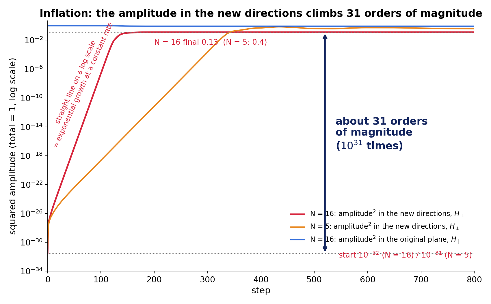
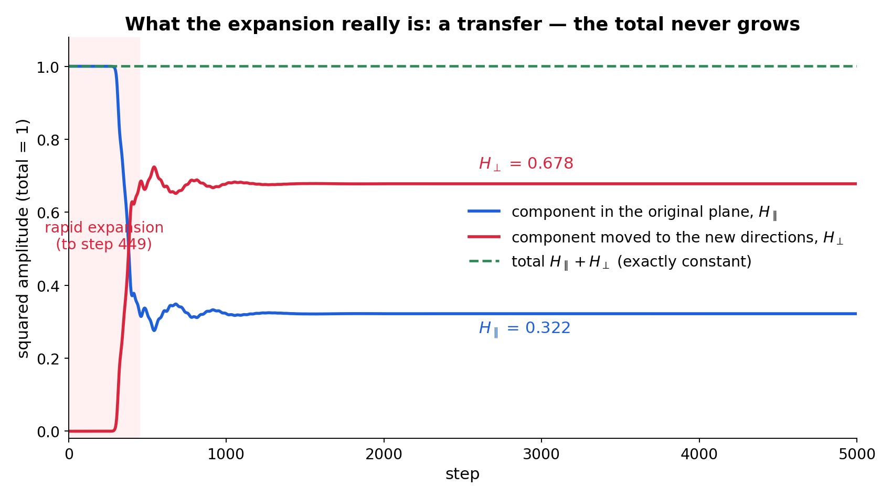
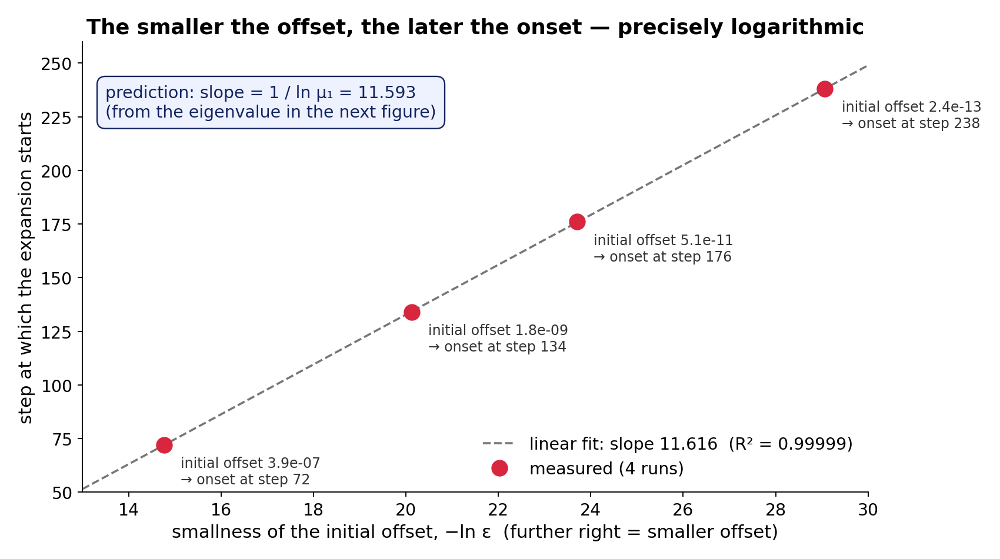
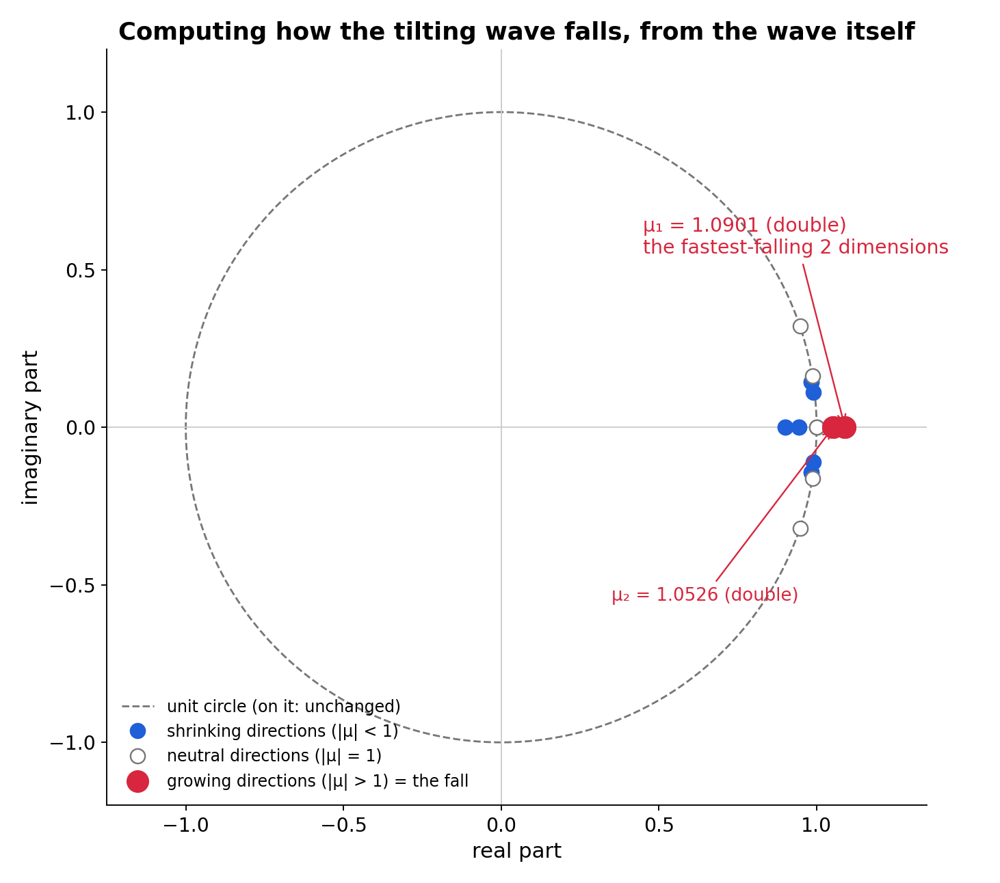
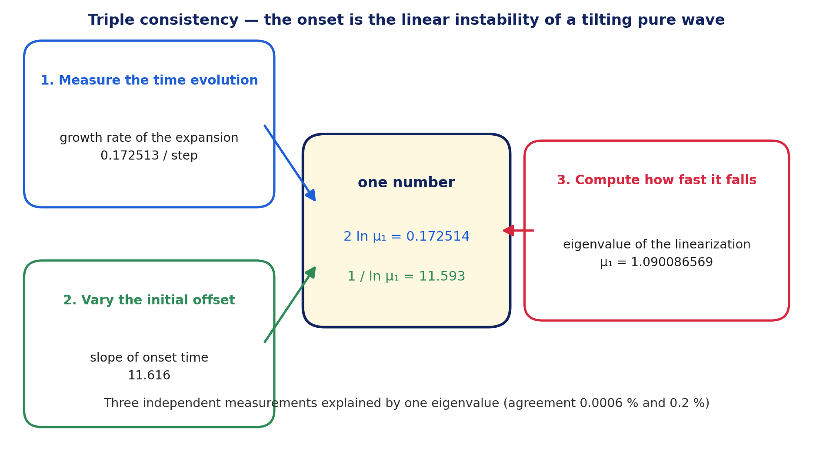
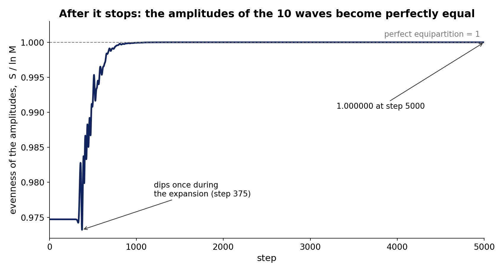
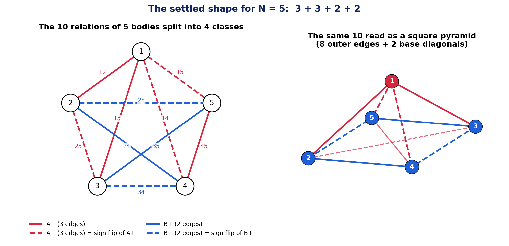
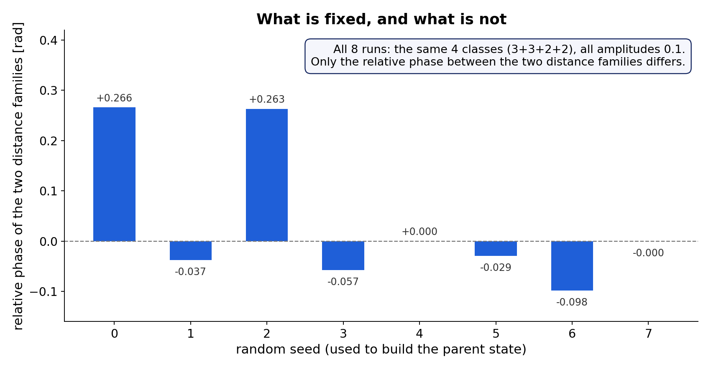

# The inflation was already written into the tilting wave — three independent measurements agree on one number

Noriaki Kihara  
2026-08-26

In the article "The inflation happened without a seed", I reported the following.

Even without planting a fluctuation seed by hand, my wave model starts a rapid expansion on its own, gives birth to three directions, and stops.

In the next article, "A universe cannot begin from noise", I continued.

What can trigger the expansion is not a noisy crowd of waves, but a pure wave in which everything rides on a single vibration. And that pure wave stands on an unstable balance, like a pencil about to fall.

Three questions were left.

Why does the expansion start?

What, exactly, is growing?

Why does it stop?

This paper answers all three with numbers. And along the way, one of the axioms we ourselves had placed turned out to be unnecessary.

## What was growing — the amplitude in the new directions, by 31 orders of magnitude

Let me first state clearly what grew.

The pure wave initially sits on one plane. What grows during the expansion is **the amplitude outside that plane — in the new directions.**

In numbers: the component in the new directions (squared amplitude) starts at only 10⁻³² of the total. Within a few hundred steps of expansion it reaches 0.13 in the 16-body system and 0.4 in the 5-body system. **About 31 orders of magnitude, 10³¹ times.** This is the inflation. How deep the starting point is depends on how precisely the pure wave was balanced (we will see this in the next section); in a run with a shallower balance the start is 10⁻²⁴ and the climb is 24 orders.

(Insert Figure 1 here)

Figure 1. Log scale. Red is the 16-body system: the squared amplitude in the new directions climbs in a straight line from 10⁻³² to 0.13, about 31 orders of magnitude. Orange is the 5-body system, from 10⁻³¹ to 0.4, again about 31 orders. Blue is the amplitude in the original plane of the 16-body system, which falls as the red rises.

So where did those 31 orders of magnitude come from? Was energy poured in from outside?

No. **The total did not grow by a single cent.**

The time evolution of this system is written as a kind of rotation called a Cayley transform. If the generator is a real antisymmetric matrix, that rotation is always a real orthogonal matrix. Orthogonal matrices do not change lengths. So even though the generator changes at every step according to the state, the total size of the wave is conserved exactly.

This is not something verified by experiment; it is a property of the update rule itself. What had looked "almost constant" to a numerical error of 10⁻¹⁵ was in fact exactly constant.

If the total is constant and the new directions grew by 31 orders, something must have decreased. That is the amplitude in the original plane. In the 5-body system, it fell from 1 to 0.32, and the 0.68 moved to the new directions.

**The expansion is the exponential growth of the amplitude in the new directions, and its substance is a transfer from the original plane into those new directions.**

(Insert Figure 2 here)

Figure 2. The same process for the 5-body system on a linear scale (a separate run with a shallower balance, starting from 10⁻²⁴). Blue: the component that was in the original plane. Red: the component that moved to the new directions. The green dashed line is the total, constant over 5000 steps to an error of 4×10⁻¹⁶. The blue falls exactly as much as the red rises.

And this fact answers half of the third question — "why does it stop?" — on the spot.

If the total is constant, the component in the new directions cannot exceed the total. It may grow by 31 orders, but the ceiling is 1. **That it does not grow forever was decided by arithmetic, before any dynamics.** The remaining question is only "why does it settle into this particular shape?"

## Why it starts — the size of the initial offset sets the starting time

Two articles ago I showed that the expansion happens even with the seed removed. Strictly speaking, though, a computer always leaves round-off. The computation that builds the pure wave also stops at a point very slightly off the exact balance.

So this time we deliberately varied the size of that offset over four levels: from 3.9×10⁻⁷ to 2.4×10⁻¹³, a range of a million.

The result was clean.

- The smaller the offset, the later the expansion starts
- The delay is exactly proportional to the logarithm of the offset (R² of the linear fit: 0.99999)
- The speed of the expansion itself does not change at all

(Insert Figure 3 here)

Figure 3. Horizontal axis: smallness of the initial offset (further right = smaller). Vertical axis: the step at which the expansion starts. The four points lie on one line. The slope is 11.616.

This is the pencil about to fall.

Try to stand a pencil exactly upright and it will tilt very slightly. The smaller the tilt, the longer it takes to start falling. But once it starts, the way it falls is the same regardless of the initial tilt.

**The offset sets the time of onset; the wave itself sets the speed of onset.**

## Computing how it falls, from the wave itself

Now one step further.

The speed at which a tilting pencil falls can be computed from its length and gravity. The same should be possible for this wave.

We linearized the time evolution around the balance point of the pure wave. This gives a 20-dimensional matrix; we compute its eigenvalues. Directions whose eigenvalue has magnitude larger than 1 are the falling directions.

(Insert Figure 4 here)

Figure 4. The 20 eigenvalues placed in the complex plane. Inside the dashed unit circle are the shrinking directions, on it the unchanged ones, outside it the growing ones. Only two points lie outside, both on the real axis — and each is doubly degenerate.

The outermost is μ₁ = 1.090086569, and it comes twice, i.e. it spans two dimensions.

Two predictions follow.

First: the growth rate of the expansion should be 2 ln μ₁ = 0.172514.

Second: the slope of the line in Figure 3 should be 1 / ln μ₁ = 11.593.

The measurements?

The growth rate was 0.172513. The slope was 11.616.

(Insert Figure 5 here)

Figure 5. The growth rate measured directly from the time evolution, the slope of the onset time measured by varying the initial offset, and the eigenvalue computed at the balance point. Three mutually independent measurements — explained by one and the same number.

**The onset of the expansion is nothing other than the linear instability of a tilting pure wave.**

There is a bonus. The falling directions are exactly two-dimensional.

The original pure wave sat on a two-dimensional plane. To it, the fastest-falling two dimensions are added. 2 + 2 = 4. The "rank 4 appears during the expansion" that I reported two articles ago **was this sum.**

Why the eigenvalue is doubly degenerate — the symmetry behind it — has not yet been proved. It is recorded as a numerical fact and listed among the open problems.

## One suspicion removed

Something I should write down honestly.

The earlier program contained a normalization: the generator was divided by its largest eigenvalue before use. Could this normalization have been creating the expansion? The reviewer raised that suspicion.

Here is what we found.

Dividing the generator by σ and dividing the time step by σ give the same formula in the Cayley transform. So the normalization **did not change the physics; it only relabelled the clock.**

At finite step size, however, a 6.8 percent difference remained in the growth rate per accumulated phase. That is not a difference one can leave alone.

So we used something measured in a separate experiment: how the growth rate converges as the step is refined. For step index n, the growth rate converges as g(n) = 1.15963 − 4.105 / n. The un-normalized run corresponds to an effective step 3.49 times coarser, so inserting n = 144 / 3.49 = 41.2 predicts 1.0600. The measurement was 1.05874. Difference: 0.13 percent.

The 6.8 percent difference was the difference in step coarseness. The physics does not change with or without normalization. Incidentally, the number "144" in the program is merely the denominator that produces a 2.5-degree step, not a physical constant.

## What happens after it stops

The expansion saturates at around 450 steps. But the system does not settle there.

Looking at the amplitudes of the ten waves, they become perfectly equal over the following few hundred steps. The evenness index (spectral entropy) reaches 1.000000 at step 5000 — perfect equipartition to six decimal places.

(Insert Figure 6 here)

Figure 6. The evenness index of the amplitudes of the ten waves; 1 is perfect equipartition. It dips once during the expansion, then — not monotonically, but steadily — approaches perfect equality.

The phases, however, are much slower.

In the 5-body system the phases of the ten waves finally split into four classes, 3 + 3 + 2 + 2. That structure is complete to an error of 10⁻⁴ at step 2627, and to 10⁻⁸ at step 4923. Over ten times the duration of the expansion, order is quietly engraved.

**The expansion and the ordering were different stages.**

## The identity of the settled shape

The settled shape has a definite geometry.

Reading the ten relations as complex distances and building the distance matrix between vertices, the five vertices form a four-dimensional simplex. In every system examined, from 3 to 16 bodies, the dimension was the number of vertices minus one.

Moreover, at every vertex, the sum of squares of the relational waves attached to it is zero.

Rewriting this in coordinates measured from the centroid yields a theorem: the sum of squares vanishing at every vertex is equivalent to **every vertex lying on a surface called the complex null cone.**

Together with the equal amplitudes, the settled shape can be stated in one phrase: a complex simplex with all edges of equal length, inscribed in the null cone.

For five bodies the picture is even easier to read.

(Insert Figure 7 here)

Figure 7. Left: the ten relations of the 5-body system, colour-coded. Red comes in threes and blue in twos, four classes in all; solid and dashed lines are sign-flipped pairs. Right: the same ten read as a square pyramid — four edges from vertex 1 to the base and four base edges make eight outer edges, and the remaining two are the base diagonals.

From this 3 + 3 + 2 + 2 split, two numbers found earlier by numerical search can be derived.

There were 13 "pairs of just two edges that sum to zero" not explained by the vertex closures. Only sign-flipped pairs can cancel, so 3 × 3 + 2 × 2 = 13.

There were 12 ways to partition the ten edges completely into five pairs. Matching three with three in 3! = 6 ways and two with two in 2! = 2 ways gives 6 × 2 = 12.

**Neither 13 nor 12 is an accident; both are necessities of this structure.**

The earlier observation for four bodies — "the phases of the three classes are about 120 degrees apart" — becomes a theorem by the same argument. Three waves of equal magnitude meet at each vertex, one from each class, and the only way for them to sum to zero is an equilateral triangle.

## What is not fixed

Not everything is fixed, however.

We ran the system with eight different random seeds for the parent pure wave. The 3 + 3 + 2 + 2 split and the equal amplitudes of 0.1 were the same in all eight runs.

But the relative phase between the two distance families differed from run to run.

(Insert Figure 8 here)

Figure 8. The relative phase between the two distance families over the eight runs. The class split and the amplitudes are identical every time; this one angle alone is different every time.

So this system seems to have both a part that the dynamics fixes rigidly and a free direction it leaves undetermined (what is called a modulus). Whether this free direction gets fixed over much longer times, or stays free forever, is not yet known.

## One axiom fewer

Finally, the most basic point.

This series started from two axioms: that the sum of squares of the waves is zero (that the system is closed), and that it returns to itself after finitely many steps.

This time we audited the program that builds the initial state, back to the original source, and found something surprising.

**The program never imposes the closure condition anywhere.**

All it does is: find the eigenmode of a real antisymmetric matrix, feed the phases of that eigenmode back into the matrix, find the eigenmode again — and repeat until the phases agree with themselves. It only searches for a self-consistent state, one that supports itself.

And the eigenmodes of a real antisymmetric matrix necessarily have zero sum of squares, as a matter of mathematics. The closure condition was something that comes out on its own, without being imposed.

This much can be derived:

　self-consistent fixed point → complex rotating pair → zero sum of squares → the phase runs around a circle (compact)

Beyond this, it cannot:

　runs around a circle → returns after finitely many steps

To return after finitely many steps, the phase advance per turn must be a rational number. If it is irrational, the orbit never closes. This "mechanism that selects a rational number" could not be derived in this paper and is left as an independent problem.

The axioms went from two to one. The one that was removed turned out to be a consequence of a deeper principle. The one that remains is not yet a consequence.

## A record of refutations and corrections

This paper was written with generation and review assigned to different AIs. The errors found during review were corrected and left on record in the paper itself.

- The regression statistics for the onset time contained an apparent contradiction, caused by confusing the requested precision with the residual actually reached. A table of measured residuals was added and the contradiction resolved
- The double degeneracy of the eigenvalue had been explained as "because they form a complex-conjugate pair", but the data showed the eigenvalues to be real. The error was withdrawn and the reason registered as unresolved
- The 6.8 percent difference had been deferred "to a further experiment", but it turned out to be settled by existing convergence data, and was closed in the text

A correct answer is worth more than an expected one.

## What can be claimed, and what cannot

What can be claimed as findings:

- What grew in the expansion is the amplitude in the new directions (from 10⁻³², to 0.13 for 16 bodies and 0.4 for 5 bodies, about 31 orders of magnitude). Since the total size of the wave and the closure condition are conserved exactly, its substance is a transfer from the original plane, and the ceiling is fixed by arithmetic
- The onset of the expansion is the linear instability of a tilting pure wave. The time of onset is set by the logarithm of the initial offset; the speed is independent of it
- The eigenvalue μ₁ = 1.0901 computed at the balance point predicts both the growth rate of the time evolution and the slope of the onset time (triple consistency)
- The falling directions are exactly two-dimensional, and added to the original two they give rank 4
- The normalization in the earlier program was a relabelling of the clock and did not create the expansion
- The settled shape is a complex simplex of equal edge lengths on the null cone
- The 13 closures and 12 partitions for five bodies, and the 120 degrees for four bodies, are all derivable as theorems
- The closure condition is derivable from self-consistency

What cannot yet be claimed:

- The dynamics of why the system settles into this particular shape (equal amplitudes, 3 + 3 + 2 + 2)
- The symmetry origin of the doubly degenerate eigenvalue
- Whether the relative phase between the two distance families gets fixed over long times
- Whether the remaining axiom — return after finitely many steps — can be derived from a deeper principle
- How far the same structure persists for body counts other than five

And, as before, I do not claim that this is the inflation of the real universe. With the total size conserved exactly, amplitude moves exponentially from one pure mode into others, saturates, and a long ordering follows — in cosmological terms this picture is closer to preheating (parametric resonance), which is said to happen right after inflation, than to inflation itself; that is what the discussion section says. The resemblance is one of structure; I am not claiming the equations are the same.

## In one line

Two articles ago I showed that

**inflation-like expansion and the birth of three directions happen on their own, without assuming a fluctuation.**

Last time I showed that

**only a tilting pure wave can trigger it.**

This time I have shown that

**how it falls can be computed from the wave itself, and three independent measurements agree on one number.** As a mechanism, the mystery of the beginning is closed.

What remains: why the shape it settles into is that shape, and where the last axiom — the return after finitely many steps — comes from.

That is where we go next.

---

## Paper and reproduction data

This article is based on the following paper.

"Mechanism of Inflation-like Rapid Expansion in Self-Consistent Closed Relational-Wave Systems — Normalization Audit, Rank Generation, Zero-Square-Closure Conservation, Simplex Symmetrization, and Reconstruction of the Axiom System"

Concept DOI (always the latest version)  
https://doi.org/10.5281/zenodo.22112008

Version DOI (v1)  
https://doi.org/10.5281/zenodo.22112009

Zenodo record  
https://zenodo.org/record/22112009

The Japanese and English full texts, PDFs, the complete set of figures, and the analysis packages for reproduction are published there.

Two articles ago  
"The inflation happened without a seed — and the directions stopped at three"  
https://note.com/kiharanoriaki/n/nb584455b0aa5

Previous article  
"A universe cannot begin from noise"  
https://note.com/kiharanoriaki/n/n1b83f7b50e0e

Japanese version of this article  
https://note.com/kiharanoriaki/n/n07c3e4c97e3a

---

<!-- pdf-links -->
The paper PDFs can be downloaded directly from the public repository.

- nbody_self_consistent_inflation_mechanism_en.pdf
  https://raw.githubusercontent.com/WurabeSeiji/ai-chat-logs-open/main/次元の生成構造/nbody_self_consistent_inflation_mechanism_en.pdf
- nbody_self_consistent_inflation_mechanism_ja.pdf
  https://raw.githubusercontent.com/WurabeSeiji/ai-chat-logs-open/main/次元の生成構造/nbody_self_consistent_inflation_mechanism_ja.pdf

Repository: https://github.com/WurabeSeiji/ai-chat-logs-open

#TheoreticalPhysics #MathematicalPhysics #Inflation #Cosmology #DynamicalSystems #Instability #Eigenvalues #Waves #Phase #Dimensions #ClosedSystem #Emergence #SelfConsistency #Metastability #IndependentResearch #Preprint #Zenodo #NumericalExperiment #NumericalSimulation
