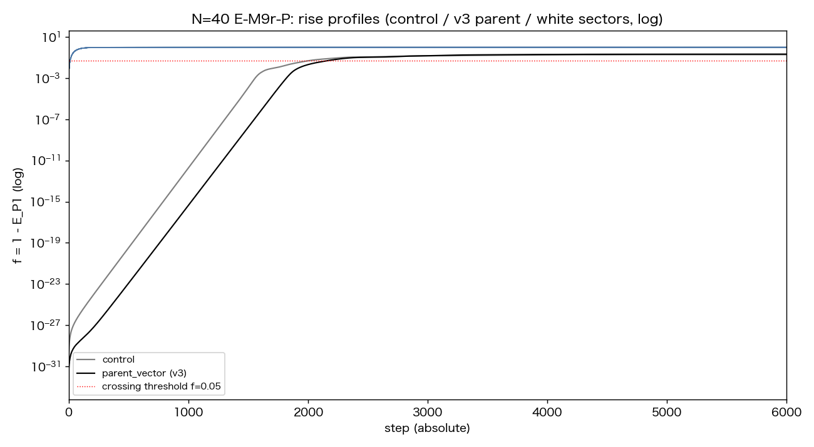

# 幾何級数的急拡大は不安定な自己無撞着閉包に固有である——一般零閉塞初期状態による開始様式の因果判別

**著者:** 木原 範昭（WF System Co., Ltd.）　**日付:** 2026-08-05
**Version DOI:** [10.5281/zenodo.21798855](https://doi.org/10.5281/zenodo.21798855)
**Concept DOI:** [10.5281/zenodo.21798854](https://doi.org/10.5281/zenodo.21798854)

---

## 主張

第8論文 [3] は、第7論文 [2] が発見した時間発展——長い潜伏、幾何級数的急拡大、三方向的準安定構造の自発的生成——から二つの明示的seedを因果的に除去し、この現象がseedに依存しないことを確定した。同時に第8論文は境界条件として、初期状態そのものの因果を未検証のまま残した。実験は一貫して自己無撞着な円偏波固有モード、すなわち全関係波が単一の固有振動に載った最大コヒーレント状態から出発しており、「閉鎖条件のみを満たす一般状態からの系統的対照は次の課題である」（第8論文 §9.6）と明記されていた。本稿はその対照の実行報告である。

第一に、一般零閉塞初期状態を作為なく構成する生成器を作った。ガウス白色雑音を素材とし、閉塞は射影や補正で事後に課すのではなく、等ノルム直交二成分の構成によって項ごとに恒等的に成立させる。DC成分（$k=0$）と偶数$N$のNyquist成分（$k=N/2$）の除去は追加仮定ではない。単独モード$k$の零二乗和は$\sum_n e^{4\pi ikn/N}$に比例するため、$2k\equiv 0 \pmod N$のモードは単独では決して閉塞できない。第一公理が既にこれらの成分の存在資格を否定しており、除去は定理の履行である（§2）。

第二に、判定基準を実行前に固定した上で、開始様式の二分を実測した（§3–§4）。自己無撞着閉包から出発した系列は潜伏バースト型であり、288〜695 stepの潜伏ののち、$\log f$は約18桁にわたって線形に成長した（N=5: 0.0494/step、決定係数 $R^2=0.9999998$。N=40: 0.0350/step、$R^2=0.998$）。一般零閉塞の白色倍音セクターは、N=5とN=40の全42本が即時型であり、floor滞在はゼロ、crossingは11〜16 step、増幅過程そのものが存在せず、直ちに三方向準安定構造（rank 4）へ移行した。例外は一本もない。

第三に、これが本稿の中心主張である。幾何級数的増幅は、任意の閉塞状態の普遍的性質ではない。自己無撞着閉包＝単一コヒーレント凝縮体の不安定性に固有の現象であり、倍音構造をあらかじめ持つ海からは増幅は発生しない。三方向準安定構造は両開始様式に共通の終着点であり、開始様式を区別する化石は増幅の痕跡だけである。したがって本模型の内部では、18桁の指数増幅の痕跡を持つ時間発展と、白色の混沌からの開始は、両立しない。開始様式は仮定でも解釈でもなく、増幅の有無として力学的に判別可能な命題である。この命題は第六項の安定性測定によって「不安定な自己無撞着閉包に固有」へ精密化される——表題はその最終形を採っている。

第四に、増幅の有無は状態の来歴ではなく構造だけで決まる（§6）。白色雑音を種として自己無撞着解を解いた親状態（N=40）は、決定論的に構成した対照と同じ潜伏バースト型を示し、成長率も一致した（0.0347 対 0.0350、差1%未満）。同じ生成器の親状態でもN=5では別の固有解に収束し、12000 stepまで増幅しなかった。したがってこの段階で確定するのは必要条件の側である——増幅が起きるならば、開始状態は自己無撞着な相対平衡である。この非対称は第六項の安定性測定で解消され、検査した範囲では**不安定な相対平衡が必要十分条件**であると確定した。残るのは、どの解が安定でどの解が不安定かを解の構造から予言する理論的分類である（§8）。

第五に、この二分には自然な機構的読みがある（§5）。現行更新則は、振幅積による明示的な生成頂点を持たない——これはコードの構造から機械的に確認できる事実である。自己無撞着閉包はこの力学の相対平衡であり、幾何級数的増幅はその不安定離脱、一般状態の即時離脱は非平衡状態の通常運動である。本稿はこの読みを線形無生成仮説として明示し、一般的な無生成定理の証明は主張しない。白色の海が最初から展開済みの状態として振る舞うことと、凝縮体だけが増幅の余地を持つことは、この読みの両面である。

第六に、この機構的読みを三つの検証実験で実測に変えた（§5.1–5.3）。(i) 一段残差は、親4状態で$\le2.5\times10^{-15}$、非平衡82状態（セクター42本＋一般状態40本）で$\ge1.8\times10^{-2}$——13桁の分離で中間なし。「自己無撞着閉包＝相対平衡」は直接観測量である。(ii) 相対平衡での接線写像の最大成長率は、予言$\lambda_{\max}=\text{rate}_f/2$とN=5で厳密一致（0.02468対0.02468）、N=40で4%内一致し、不活性だった白色起源親（N=5）は不安定固有値を一つも持たない安定平衡であった。したがって検査した全86状態の範囲で、**潜伏指数増幅⟺不安定な相対平衡**という同値が例外なく成立する。(iii) 摂動振幅$\varepsilon$の掃引で$t_{\mathrm{cross}}$は$-\ln\varepsilon$に対して線形（N=5: 傾き実測/予言比0.996）、$\varepsilon\lesssim3\times10^{-13}$で自然軌道の値に飽和した。この飽和は無seed軌道の内在的な種の位置を力学的に測定したものであり、その値$\varepsilon_{\mathrm{eff}}\approx3.4\times10^{-13}$（N=5）は親の固有モード残差$2.14\times10^{-13}$と同程度である——第8論文の未解決問題(i)「最初の微小差の物理的起源」への部分回答である。さらに一般零閉塞状態40本（多様体からの直接ランダム標本とセクター混合）は全て即時型であり、二分が単独セクターの特殊性でないことも確定した。

第七に、反証と修正の全過程を記録する（§7）。生成器の初版は閉塞を倍音$k$と$N-k$の交差対の相殺で満たしており、自己対セクターが非閉塞のまま残る欠陥があった。実験側の初回の閉塞測定にも誤った二次形式を用いた誤りがあった。いずれも対照実験（原本のbit再現、修正、再測定）で訂正した。中心の二分は、欠陥のあった初版と修正版の双方で観測され、帳簿修正を跨いで存続した。本結果は特定実装の産物ではない。

最後に、本稿の実験は先行研究に基づいて設計されたものではない。初期スペクトルの自然さに関する内部的疑問から独自に対照を設計し、作業仮説に反する結果を得たのちに先行研究を再調査した結果、標準インフレーション理論の初期条件問題と、本結果が正確にその論争点に接することを見出した（§10）。白色の海から自己無撞着閉包が自発形成される過程（捕獲問題）は本稿の範囲では観測されておらず、凝縮体からの構造の生成は線形力学の外にあり、閉塞保存から導出される非弾性頂点の系列 [5] で扱われる。したがって開始様式問題の未解明部分は、混沌から凝縮体への捕獲という一箇所に限定された。

---

## 1. 系（定義の継承）

**公理1（非自明零二乗和閉鎖）** $\sum_e Z_e^2=0,\ Z\neq0$。**公理2（有限回帰）** $U^n=I$。二公理は基本公理系 [1] による。

力学系は第7論文 [2]・第8論文 [3] と同一である。完全グラフ$K_N$の各辺$e$に複素振幅$Z_e$を置き（$M=N(N-1)/2$）、状態は$Z\in\mathbb C^M$、$\lVert Z\rVert=1$、$Z^{\mathsf T}Z=0$に閉じる。生成子$K$は辺位相のみの関数である実反対称行列、更新はスペクトルノルム正規化後のCayley変換（$\gamma=\tan(\pi/144)$）で、ノルムを厳密保存する。力学コードは第7論文原本をSHA-256固定・read-onlyでimportし、一切変更していない（§11）。

観測量は各系列の**自身の初期平面**からの離脱率である。初期状態$v_0$から$p=\mathrm{Re}\,v_0/\lVert\mathrm{Re}\,v_0\rVert$、$q$（$\mathrm{Im}\,v_0$の$p$直交化）を作り、

$$f(t)=\frac{\lVert Z-\Pi_{\mathrm{span}\{p,q\}}Z\rVert^2}{\lVert Z\rVert^2}$$

とする。構成により全系列で$f(0)=0$であり、開始様式の比較は同一の座標で行われる。crossingは第7論文既存閾値$f>0.05$の初回到達stepである。

## 2. 一般零閉塞初期状態の構成

### 2.1 生成器（白色・零閉塞・倍音事後読出し）

理論入力は$N$のみとする。各関係波$w_m$は$N$標本の複素波形であり、$N\times2$のガウス白色雑音をQR分解して得た正規直交二列$(q_1,q_2)$から

$$w_m=\frac{q_1+iq_2}{\sqrt2}$$

と作る。行の零二乗和は

$$\sum_n w_m[n]^2=\lVert q_1\rVert^2-\lVert q_2\rVert^2+2i\,q_1\!\cdot\!q_2=0$$

と恒等的に成立する。閉塞は補正で作るのではなく、等ノルム直交二成分から構造的に出る。倍音は生成器で配置せず、保存後にN点DFTで読み出す。

### 2.2 DC・Nyquist除去は仮定ではなく定理である

単独モード$k$の零二乗和は$\sum_n e^{4\pi ikn/N}$に比例し、$2k\not\equiv0\pmod N$なら零、$2k\equiv0\pmod N$なら非零である。すなわちDC（$k=0$）と偶数$N$のNyquist（$k=N/2$）は、どの$N$でも単独では閉塞できず、第一公理の下で存在資格を持たない。修正版生成器（v3）は、雑音の各列からQRの前にDC方向（全1ベクトル）と偶数$N$のNyquist方向（交代$\pm1$ベクトル）を射影除去する。射影はガウス性を保つため、これは「許容モード上の白色雑音」の厳密な実装である。さらに強化版（v4）は許容符号付きモード上の直接スペクトル構成により、$|k|$対間の閉塞の貸借（対積負債）も項ごとに零とする。本稿の力学実験はv3で行い、v4は初期値分類の監査に用いた。

### 2.3 注入系列

同一の力学・同一の測定に、次の三種の初期状態を注入する。

1. **control**: 第7・8論文の`make_parent`が返す自己無撞着円偏波固有モード（決定論的構成）。
2. **白色起源親**: 白色雑音を初期値として自己無撞着解を反復で解いた固有モード（生成器v3の`parent_vector`）。自己無撞着閉包という構造はcontrolと同じで、来歴（乱数起源）だけが異なる。
3. **白色倍音セクター**: 白色の海の倍音$k$成分だけを$M$本の関係振幅として取り出した状態$Z_k$（$2k\not\equiv0\pmod N$の全$k$。N=5は4本、N=40は38本、計42本）。各セクターの場の閉塞は厳密に零である（実測: 全42本で0.0）。これが「閉塞条件のみを満たし、固有モード条件を課さない一般状態」である。

## 3. 判定基準（実行前固定）

以下を実行前に固定し、事後変更を禁じた。

- **潜伏** $t_{\mathrm{launch}}=\max\{t: f(t)<10^{-20}\}$（floor滞在の最終時刻。初期から$f\ge10^{-20}$なら0）。
- **幾何級数的判定**: $f\in[10^{-20},10^{-2}]$の窓で$\ln f$対$t$を最小二乗し、窓が6桁以上かつ$R^2>0.99$。
- **即時型判定**: $f(2)>10^{-6}$（2 step以内の有限離脱）。
- **分類**: 潜伏バースト型＝$t_{\mathrm{launch}}>100$かつ幾何級数的／即時型＝$f(2)>10^{-6}$／どちらも満たさなければ「その他」として生データごと記録。

測定は$f(t)$の毎step記録（$T=6000$）。乱数は生成器シード（N=5: 2、N=40: 1）と、注入時補助乱数のシード（親91000、セクター$92000+k$）のみで、全て記録した。

## 4. 結果: 開始様式の二分

*表1: 全系列の分類（正本: `paper8_em9r_profile_N00005_v1.json` / `N00040_v1.json`）*

| 系列 | 分類 | 潜伏 | crossing | 増幅桁数 | 成長率 /step | $R^2$ | $f(2)$ |
|---|---|--:|--:|--:|--:|--:|--:|
| control N=5 | 潜伏バースト型 | 288 | 1166 | 17.97 | 0.0494 | 0.9999998 | $2.5\times10^{-29}$ |
| control N=40 | 潜伏バースト型 | 468 | 2011 | 17.99 | 0.0350 | 0.9981 | $2.0\times10^{-30}$ |
| 白色起源親 N=40 | 潜伏バースト型 | 695 | 2167 | 17.98 | 0.0347 | 0.9997 | $5.2\times10^{-32}$ |
| 白色起源親 N=5 | 不活性（その他） | —（floor滞在継続） | なし（$t\le12000$） | 0 | — | — | $3.0\times10^{-32}$ |
| 白色セクター N=5（4本） | 即時型 4/4 | 0 | 11〜16 | — | — | — | $0.95$〜$1.6\times10^{-3}$ |
| 白色セクター N=40（38本） | 即時型 38/38 | 0 | 13〜14 | — | — | — | $1.25$〜$1.46\times10^{-3}$ |

*図1: N=5の立ち上がりプロファイル（semilogy）。灰=control、黒=白色起源親、青=白色セクター4本。controlのみが潜伏とそれに続く18桁の線形成長（幾何級数的増幅）を示す。セクターは潜伏ゼロで直ちに有限離脱する。*

*図2: N=40の立ち上がりプロファイル。白色起源親（黒）はcontrol（灰）と同型の潜伏バーストを示し、成長率は1%未満で一致する。セクター38本（青）は全て即時型である。*

要点は三つである。

1. **増幅過程の有無が二分する。** 潜伏バースト型の三系列は、$\log f$が約18桁にわたり単一の線形則に載る（最良で$R^2=0.9999998$）。即時型の42本には、指数成長と呼べる区間が一切存在しない。floor滞在ゼロ、2 stepで$f\sim10^{-3}$へ有限離脱し、11〜16 stepでcrossingに達する。中間型は一本も現れなかった。
2. **終着点は共通である。** 全42本の白色セクターは、crossing後に三方向準安定構造（rank 4）へ移行した（$f$終盤: N=5で0.73〜0.83、N=40で0.995〜0.999。正本: `paper8_em9r_v3_result_*.json`）。第7・8論文の三方向構造は、コヒーレント開始に固有ではない。固有なのは**そこへ至る道**——増幅の痕跡——だけである。
3. **潜伏バーストの成長率は準備に依存しない。** control（決定論的構成）と白色起源親（乱数起源）のN=40成長率は0.0350対0.0347で一致する。増幅率は状態の来歴ではなく、力学と平衡構造の性質である。

## 5. 機構: 相対平衡の不安定性としての増幅

**明示的生成頂点の不在（機械的に確認できる事実）。** 現行エンジンの一段は、現在の位相配置$\theta=\arg Z$で凍結された生成子$K(\theta)$によるCayley型ユニタリ変換であり、$Z$の振幅積による明示的な生成頂点を持たない。これはコードの構造から確認できる。

**線形無生成仮説（解釈）。** 各段は$\theta$凍結の下で線形だが、写像全体$F(Z)=U(\arg Z)\,Z$は状態依存であるため非線形であり、反復が新しい内容を作れないことは上の事実だけからは従わない。本稿は、観測された幾何級数的増幅を新規内容の生成ではなく相対平衡からの不安定離脱として解釈する。これは本稿の二分を説明する作業仮説であり、一般的な無生成定理の証明を主張するものではない。不変部分空間の証明または倍音係数の更新式の直接導出は、次段階の課題である。

この仮説の下で、二分は次のように読める。

- 自己無撞着閉包は力学の**相対平衡**（一様な位相回転を除いて不動）である。平衡上では$f$は厳密には成長せず、離脱は平衡の線形不安定性が数値床（固有モード残差$\sim10^{-13}$と丸め）から指数的に成長することでのみ起こる。これが潜伏と、それに続く18桁の線形$\log f$の正体である。
- 一般零閉塞状態は平衡ではない。一段の写像が直ちに有限角の回転を与えるため、floor滞在も指数区間もなく、$O(10)$ stepで初期平面を離れる。**増幅過程が存在しないのは、成長すべき「平衡からの微小離脱」がそもそも存在しないからである。**

したがって「幾何級数的増幅はコヒーレント凝縮体に固有」という実測は、偶然の対比ではなく、相対平衡と非平衡初期状態の違いとして自然に説明される。同じ視点から、第8論文までの一連の否定的結果（内部からの倍音生成・統計的区別の予兆の不在）は、明示的生成頂点の不在と整合する——ただしそれらを系として厳密に導くには、上記仮説の証明が必要である。

この読みは検証可能な予言を三つ生む。(1) 一段残差$r(Z_0)=\min_\phi\lVert F(Z_0)-e^{i\phi}Z_0\rVert$は、親状態で数値零、非平衡状態で有限となり、中間は現れない。(2) 相対平衡での接線写像の最大固有値対数$\lambda_{\max}$は、$f$が振幅二乗量であることから、実測バースト率の半分$\text{rate}_f/2$に一致する。不活性だった親は不安定固有値を持たない。(3) 摂動振幅$\varepsilon$を注入すれば$f(0)\approx\varepsilon^2$から$f_{\mathrm{cross}}$までの成長時間は$t_{\mathrm{cross}}\approx\text{const}+(-2\ln\varepsilon)/\text{rate}_f$の対数則に従う。以下の三実験（ONS-1/2/3、判定基準と予言は各スクリプト冒頭に実行前固定）でこれらを検定した。

### 5.1 検証1: 一段残差と接線写像スペクトル（ONS-2）

*表2: 一段残差と接線スペクトル（正本: `onset_equilibrium_residual_N*.json`）*

| 状態 | 一段残差 $r$ | $\lambda_{\max}$ 実測 | $\lambda_{\max}$ 予言 | 不安定固有値数 |
|---|--:|--:|--:|--:|
| control 親 N=5 | $2.5\times10^{-15}$ | **0.02468** | 0.02468 | 4 |
| control 親 N=40 | $7.1\times10^{-16}$ | 0.01824 | 0.01750 | 383 |
| 白色起源親 N=40 | $1.0\times10^{-16}$ | 0.01815 | 0.01734 | 389 |
| 白色起源親 N=5（不活性） | $1.6\times10^{-16}$ | **0.00000** | $\le10^{-3}$ | **0** |
| 白色セクター N=5（4本） | $2.1$〜$2.6\times10^{-2}$ | — | — | — |
| 白色セクター N=40（38本） | $1.8$〜$2.1\times10^{-2}$ | — | — | — |

予言(1)(2)は成立した。残差は平衡4状態と非平衡状態の間で13桁分離し、中間は一本もない。$\lambda_{\max}$はN=5で予言と厳密に一致し、N=40では4〜5%高い——N=40の窓フィット（$R^2=0.998$）が非線形補正域を含むことと整合する。二つのN=40平衡の$\lambda_{\max}$比1.005は、実測バースト率比1.009と一致する。決定的なのは最終行である。**不活性だった白色起源親は、安定な相対平衡（不安定固有値ゼロ）だった。** これにより§6の非対称（コヒーレンスは必要条件であって十分条件ではない）は解消され、検査した全86状態（平衡4＋セクター42＋一般状態40）の範囲で、

$$\boxed{\text{潜伏指数増幅}\iff\text{不安定な相対平衡}}$$

が例外なく成立する。この同値は三分類として書ける。非平衡状態は即時に有限角離脱し、安定な相対平衡は離脱せず、不安定な相対平衡だけが潜伏ののち指数離脱する。時間発展様式を決めるのは、状態の来歴でも見かけのコヒーレンスでもなく、初期状態が属する力学的軌道類である。

### 5.2 検証2: 摂動振幅の対数則と内在床の測定（ONS-1）

control親に親平面直交のランダム摂動$\varepsilon\eta_\perp$（$\eta$は3シード、$\varepsilon=10^{-4}$〜$10^{-14}$）を注入した。$t_{\mathrm{cross}}$は$-\ln\varepsilon$に対して線形であり（正本: `onset_eps_sweep_N*.json`）、$\varepsilon\ge10^{-12}$の範囲の傾きはN=5で40.35（予言$2/\text{rate}_f=40.52$、比0.996、$R^2=0.9875$）、N=40で65.45（予言57.16、比1.145、$R^2=0.9985$）であった。N=40の超過は、383本の不安定モード（成長率0.0160〜0.0182に分布）を持つ平衡でランダム摂動の初期成長が合成的に遅くなることと整合し、各runの窓フィット率が$\varepsilon$の減少とともに0.027から0.035へ単調に漸近する実測がこれを裏づける。

$\varepsilon=10^{-14}$では、全シードで$t_{\mathrm{cross}}$が無seed自然軌道の値（N=5: 1166、N=40: 2011）に飽和した。注入摂動が系の内在的な種を下回った証拠である。直線の外挿から内在床は$\varepsilon_{\mathrm{eff}}=3.4\times10^{-13}$（N=5）、$2.5\times10^{-13}$（N=40）と測定され、親の固有モード残差$2.14\times10^{-13}$（第8論文 §9.1）と同程度である。すなわち、**無seed軌道の潜伏時間を決めていた「最初の微小差」は、親構成の固有モード残差そのものである**——第8論文の未解決問題(i)の、力学的測定による部分回答である。飽和点（$\varepsilon=10^{-14}$）を含む事前固定のプール回帰と、飽和レジームを除外した事後解析は、いずれも正本（`onset_eps_sweep_analysis_v1.json`）に併記した。

### 5.3 検証3: 一般零閉塞状態の直接注入（ONS-3）

§4の白色セクターは生成器由来の42状態であり、力学が非線形である以上、その結果から閉塞多様体上の他の点の挙動は従わない。そこで二つのアンサンブルを直接注入した（各Nにつき10状態ずつ、正本: `onset_general_closed_N*.json`）。

- **A: 多様体からの直接ランダム標本**——$M\times2$ガウス白色雑音のQR直交二列から$Z=(u_1+iu_2)/\sqrt2$。閉塞は恒等成立（実測$\le5.6\times10^{-16}$）。
- **B: 許容セクターのランダム混合**——複素ガウス係数で42セクターを重ね、閉塞多様体へ最小変更射影（$[X\,Y]$のSVD特異値均等化。射影距離0.003〜0.16を記録、射影後の閉塞$\le3.9\times10^{-16}$）。

結果: **40状態全てが即時型**（crossing 11〜21）で、潜伏バースト型もその他も現れなかった。予言どおりである。二分は単独倍音セクターという構成の特殊性ではなく、平衡か否かという状態構造の帰結である。

## 6. 来歴非依存性

白色起源親の結果は、二分の境界線が「乱数起源か決定論的構成か」ではないことを示す。同じ白色雑音から出発しても、自己無撞着解の反復が固有モードに収束すれば（N=40）、その状態は決定論的controlと同じ潜伏バーストを同じ率で示す。一方、N=5では反復が別の族の固有解に収束し、12000 stepまで増幅しなかった。すなわち、

- 増幅の開始様式を決める第一の境界は、状態が**自己無撞着な相対平衡であるか否か**であり、増幅の有無を最終的に決めるのは**その相対平衡の安定性**である（§5.1）。状態がどう用意されたかは、どちらの境界にも関与しない。
- 自己無撞着閉包の中にも、増幅する解（不安定平衡）と不活性な解（安定平衡）がある。コヒーレンス単独は増幅の**必要条件であって十分条件ではない**。

この非対称は本稿の主張を弱めない。本稿の主張は含意の向きを固定している——増幅が観測されたならば、開始状態は自己無撞着閉包であった。82本の非平衡状態（セクター42本＋一般状態40本、§5.3）に一つの反例もないことが、この含意の実測的根拠である。さらに§5.1の接線スペクトル測定は、この非対称そのものを解消した。不活性な白色起源親（N=5）は安定な相対平衡（不安定固有値ゼロ）であり、増幅の有無を最終的に分けるのは、平衡か否か、そして平衡ならばその安定性である。

## 7. 反証と修正の記録

本結果は一度の実験で得られたものではない。過程をすべて記録する。

1. **生成器初版（v2）の欠陥。** 行の閉塞をDFTで書くと$\sum_n w^2=N\sum_k c_kc_{N-k}$であり、v2の閉塞は倍音$k$と$N-k$の**交差対の相殺**で成立していた。このため自己対セクター（DC・Nyquist）が非閉塞のまま残った。§2.2の定理に基づき、v3で雑音の源から射影除去した。v3はv2と乱数消費順が同一で、親ベクトルと生雑音はbitwise一致する。
2. **実験側の測定誤り。** 初回のE-M9r実行では、セクターの閉塞測定に誤った二次形式を用い、「白色セクターは非閉塞」と誤報告した。正しい場の閉塞では、白色セクター42本は厳密に零閉塞する正当な状態である（保存検証: 500 stepでドリフト$\sim10^{-16}$）。
3. **対照実験による訂正。** 生成器は管理下にSHA-256一致でコピーし、同一シードで誤った結果ごとbit再現してから修正した。誤りの再現なしに修正だけを主張することはしない。
4. **二分の存続。** 中心の二分（潜伏バースト対即時型）は、v2（欠陥あり）とv3（修正後）の双方で観測された。帳簿の誤りは自己対セクターの扱いを変えたが、二分そのものを変えなかった。

## 8. 境界条件（本稿が証明していないこと）

1. **安定性の理論的分類の未完。** 増幅の有無が平衡の安定性で決まることは§5.1で実測した（不活性親＝安定平衡、λ_max=0）。しかし、どの自己無撞着解の族が安定でどれが不安定かを、解の構造（N・族・スペクトル）から予言する理論的分類は与えていない。なぜN=5の白色起源解は安定に、N=40の解は不安定に収束したのかは開いている。
2. **シード数。** 生成器シードは各$N$につき1個（N=5: 2、N=40: 1）である。ただし非平衡側は、同一シード内の独立な42セクターに加え、独立乱数系列による一般零閉塞状態40本（§5.3、rng 94000+/95000+）でも例外がなかった。生成器シード自体の掃引は未実施である。
3. **時間範囲。** プロファイル測定は$T=6000$、v3本実験は$T=12000$。白色セクターの「増幅不在」は初期2 stepの有限離脱として確定的だが、観測窓を超えた第二の増幅は論理的には排除していない。
4. **$N$の範囲。** N=5と40のみである。第8論文の主系列にあったN=300は本対照では未実施である。
5. **捕獲問題。** 白色の海から自己無撞着閉包が自発形成される過程は、本稿の線形力学では観測されていない。これは第9論文 [5] 以後の非弾性生成チャネルの領分である。
6. **語の限定。** 本稿の「インフレーション」「増幅」は本シリーズの現象名（$f$の潜伏→幾何級数→準安定という時間構造）であり、宇宙論的インフレーション（計量の指数膨張）そのものではない。§10の対応は構造的類比であって、場の理論・一般相対論の力学的導出ではない。
7. **線形無生成仮説の未証明。** §5の機構的読みのうち、明示的生成頂点の不在は確認済みの事実であり、相対平衡・不安定性・対数則・内在床は§5.1–5.3で実測になった。しかし、状態依存ユニタリの反復が新しい倍音内容を作れないこと（初期スペクトル台に対応する不変部分空間の保存）は依然として証明していない。本稿の中心結果である§4の二分と§5.1の同値は実測であり、この未証明部分に依存しない。

## 9. 結論

第8論文が残した系統的対照——閉塞条件のみを満たす一般状態からの出発——を実行した。結果は開始様式の完全な二分である。自己無撞着閉包（単一コヒーレント凝縮体）から出発した系列だけが、潜伏と18桁の幾何級数的増幅を示す。非平衡の零閉塞状態82本（白色セクター42本＋一般状態40本）は、例外なく増幅過程を持たず、有限角回転で直ちに三方向準安定構造へ移行する。増幅の有無は状態の来歴に依存せず、状態の構造だけで決まる。

機構は実測で閉じた。一段残差は平衡と非平衡を13桁で分離し、接線写像の最大成長率は実測バースト率の半分と一致し（N=5で厳密、N=40で4%内）、不活性だった親は安定平衡（不安定固有値ゼロ）であり、摂動振幅の対数則は傾きまで予言と一致し、その飽和は無seed軌道の内在床を固有モード残差の位置に測定した。検査した全86状態の範囲で、潜伏指数増幅⟺不安定な相対平衡、という同値が例外なく成立する。

第7・8論文と合わせて、因果の帳簿は次の形で閉じた。明示的seedは現象の原因ではない（第8論文）。初期状態が不安定な自己無撞着相対平衡に属することが原因である（本稿）。潜伏指数増幅の必要十分条件は、検査した範囲では、不安定な自己無撞着相対平衡である。三方向準安定構造は開始様式に依らない共通の終着点であり、幾何級数的増幅の痕跡だけが、系が不安定な相対平衡＝コヒーレントな凝縮体から始まったことの化石として残る。

未解明として残るのは、(i) 自己無撞着解の族と安定性の対応の理論的分類（なぜN=5の白色起源解は安定でN=40の解は不安定か）、(ii) 白色の混沌から凝縮体への捕獲、(iii) 凝縮体から構造（物質）への非弾性生成——(iii)は閉塞保存から頂点を導出する系列 [5] で既に着手されている——の三点である。

## 10. 先行研究との関係（設計後の再調査による）

本稿の対照実験は、先行研究の追試や反証として設計されたものではない。出発点は本シリーズ内部の疑問——「最小分解能の単一波長への集中よりも、あらゆる倍音が混在する平坦なスペクトルの方が、開始状態として自然ではないか」——であり、設計時の作業仮説は「白色の海も同じ幾何級数的発展を示すはずだ」であった。結果はこの作業仮説の棄却である（§4）。予想と異なる結果を得たため、インフレーション宇宙論の初期条件に関する文献を改めて調査した。その結果、以下を見出した。

**標準理論は開始状態を予言せず、仮定する。** スローロール・インフレーション [6,7] の出発点は、ポテンシャルが支配するほぼ一様なインフラトン凝縮体と、その上のBunch–Davies真空揺らぎである。この開始状態の起源は「インフレーションの初期条件問題」として未決であり [8,9]、観測される平坦に近いスペクトル（$n_s=0.9649$ [14]）は初期条件ではなくインフレーションの**出力**である。すなわち標準理論もまた、コヒーレントな凝縮体という開始様式を導出せずに置いている。本稿の実測は、この仮定に対応する状態（自己無撞着閉包）だけが増幅することを、本模型の内部で力学的に示した形になる。

**「非一様初期条件からでも着火する」という主張は、少数グループのモデル依存の数値実験である。** 数値相対論による研究 [10,11] は、大場（プラトー型）モデルでは勾配エネルギー支配の非一様な初期条件からもインフレーションが開始すると報告した。しかしこれらの計算の初期データは、場の値をポテンシャルのプラトー上に制限した上で非一様性を与えており、本稿の言葉では「白色の海」ではなく「凝縮体に摂動を加えた状態」に相当する。コヒーレンスの仮定は除去されておらず、初期データの構成に移されている。この読みが正しければ、それらの結果は本稿の二分（一般状態からは増幅が出ない）と矛盾しない。

**批判側の直観に、判定基準を与える。** インフレーションが解くはずの初期条件問題よりも特殊な初期条件を要求するという批判 [12,13]、およびその帰結としての論争状態（当事者自身が「schism」と呼ぶ [13]）に対し、本稿の結果は次の形の力学的判定基準を与える。まず模型内の結果として：指数増幅の時間構造を持つ軌道は、白色の非平衡状態からは直接生じず、不安定な自己無撞着相対平衡からのみ生じた（§4–§5、86状態に例外なし）。この結果を類比として宇宙論の言葉に置くなら、指数増幅の痕跡を持つ開始状態は白色の混沌ではあり得ず、不安定なコヒーレント凝縮体でなければならない——ただしこの翻訳の適用範囲は本模型の構造的類比までであり、場の理論への持ち込みは§8.6の限定に従う。

強調すべき順序はこうである。本稿はこれらの文献から仮説を得て検証したのではない。独自の対照実験が予想外の二分を返し、その二分が、40年来未決とされる論争点——開始にコヒーレンスは必要か——の、本模型における決定実験に相当することが、事後の再調査で判明した。模型は場の理論を含まないにもかかわらず、初期条件問題と同じ構造の問いに到達し、そこで明確な答え（コヒーレンスは必要条件である）を返した。この収束自体が、本シリーズの方法——公理を最小に固定し、力学に答えさせる——の検証可能な成果である。

## 11. 再現性

- 力学コードは第7論文原本（`run_preliminary_seed_ablation_v1.py`）をread-only import（SHA-256: `75a10a5b951302be…`）。生成器v3はSHA-256: `d3217579ab54ce29…`。両ハッシュは全結果JSONの`imports`に記録済み。
- 生成器・分類器・監査の正本: `次元の生成構造/make_parent_white_managed_v1/`（v2対照コピー・v3・v4・単体テスト・分類器対照）。v2とv3は同一シードで親ベクトル・生雑音がbitwise一致。対照実験はCodex原本とのSHA-256一致、および誤った結果ごとのbit再現を含む。
- 実験の正本: `次元の生成構造/第8論文_二段階seed除去による準安定相の因果分離/paper8_em9r_white_harmonics_inflation_v1/`——初回（v1）・帳簿訂正（fix_v2）・v3生成器版（v3_result）・プロファイル（profile、表1と図1–2の正本）の全JSONと図。
- 機構検証の正本: 同 `paper8_onset_mechanism_v1/`——ONS-1（ε掃引: `onset_eps_sweep_N*.json`、事後解析 `onset_eps_sweep_analysis_v1.json`）、ONS-2（残差・接線スペクトル: `onset_equilibrium_residual_N*.json`、表2の正本）、ONS-3（一般状態注入: `onset_general_closed_N*.json`）の全スクリプト・JSON・図。判定基準と予言は各スクリプト冒頭に実行前固定。乱数シード: η=93000+j、直接標本=94000+j、混合=95000+j、注入補助=96000+series。
- コミット系列: `52c83f13`（初期値分類）→ `aeaf8e57`（E-M9r初回）→ `d9346e37`（帳簿訂正）→ `e5232885`（v3再実験）→ `94aa76f9`（プロファイル測定）→ `b1cded81`（v4生成器・カタログ閉塞監査）→ `e6681744`（検討ノート）→ `2f443467`（機構検証 ONS-1/2/3）。
- 判定基準（§3）は測定プログラム冒頭に実行前固定として記載され、結果JSONの`criteria`に保存されている。乱数シードは全て記録済み（生成器: N=5→2、N=40→1。注入補助: 親91000、セクター$92000+k$）。
- 実行環境: Python 3.9.6、NumPy 2.0.2、macOS arm64。

## 引用

[1] 木原 範昭, 無名等振幅複合波モデル 基本公理系（純化定義論文）, Zenodo. Concept DOI: [10.5281/zenodo.21315735](https://doi.org/10.5281/zenodo.21315735).

[2] 木原 範昭, N体関係波閉鎖系における自発的分裂の停止と追加軸の創生（第7論文）, Zenodo. Concept DOI: [10.5281/zenodo.21543070](https://doi.org/10.5281/zenodo.21543070).

[3] 木原 範昭, N体関係波閉鎖系における三方向生成の時間構造——二段階seed除去による準安定相の因果分離（第8論文）, Zenodo. Concept DOI: [10.5281/zenodo.21614402](https://doi.org/10.5281/zenodo.21614402).

[4] 木原 範昭, 零二乗和拘束とスケール不変性の幾何学的正体（解説ノート）, Zenodo. Concept DOI: [10.5281/zenodo.21495305](https://doi.org/10.5281/zenodo.21495305).

[5] 木原 範昭, フェルミオンの生成構造（第9論文）, Zenodo. Concept DOI: [10.5281/zenodo.21766706](https://doi.org/10.5281/zenodo.21766706).

[6] A. H. Guth, Inflationary universe: A possible solution to the horizon and flatness problems, Phys. Rev. D **23**, 347 (1981).

[7] A. D. Linde, Chaotic inflation, Phys. Lett. B **129**, 177 (1983).

[8] R. Brandenberger, Initial conditions for inflation — A short review, Int. J. Mod. Phys. D **26**, 1740002 (2017). [arXiv:1601.01918](https://arxiv.org/abs/1601.01918).

[9] A. Linde, On the problem of initial conditions for inflation, Found. Phys. **48**, 1246 (2018). [arXiv:1710.04278](https://arxiv.org/abs/1710.04278).

[10] W. E. East, M. Kleban, A. Linde, L. Senatore, Beginning inflation in an inhomogeneous universe, JCAP **09** (2016) 010. [arXiv:1511.05143](https://arxiv.org/abs/1511.05143).

[11] K. Clough, E. A. Lim, B. S. DiNunno, W. Fischler, R. Flauger, S. Paban, Robustness of inflation to inhomogeneous initial conditions, JCAP **09** (2017) 025. [arXiv:1608.04408](https://arxiv.org/abs/1608.04408).

[12] A. Ijjas, P. J. Steinhardt, A. Loeb, Inflationary paradigm in trouble after Planck2013, Phys. Lett. B **723**, 261 (2013). [arXiv:1304.2785](https://arxiv.org/abs/1304.2785).

[13] A. Ijjas, P. J. Steinhardt, A. Loeb, Inflationary schism, Phys. Lett. B **736**, 142 (2014). [arXiv:1402.6980](https://arxiv.org/abs/1402.6980).

[14] Planck Collaboration, Planck 2018 results. X. Constraints on inflation, Astron. Astrophys. **641**, A10 (2020). [arXiv:1807.06211](https://arxiv.org/abs/1807.06211).
