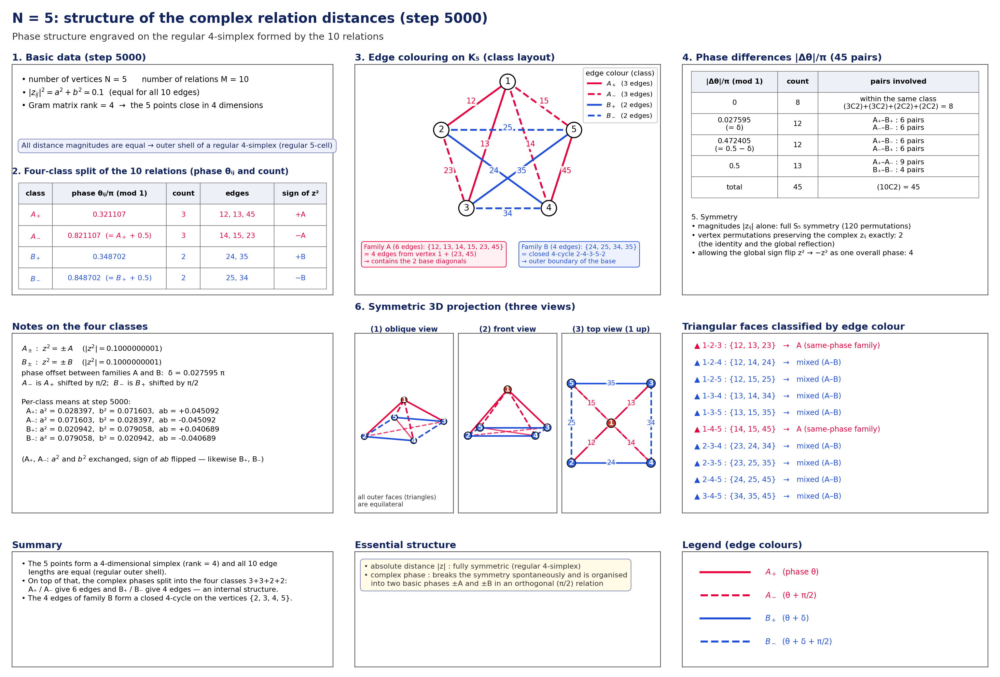
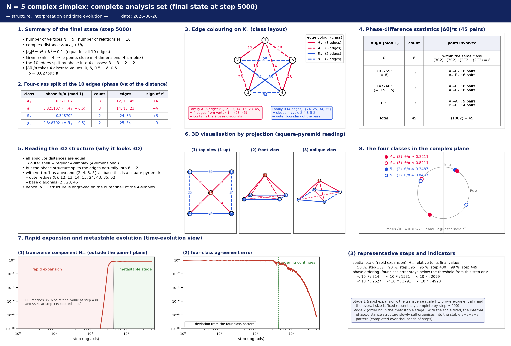
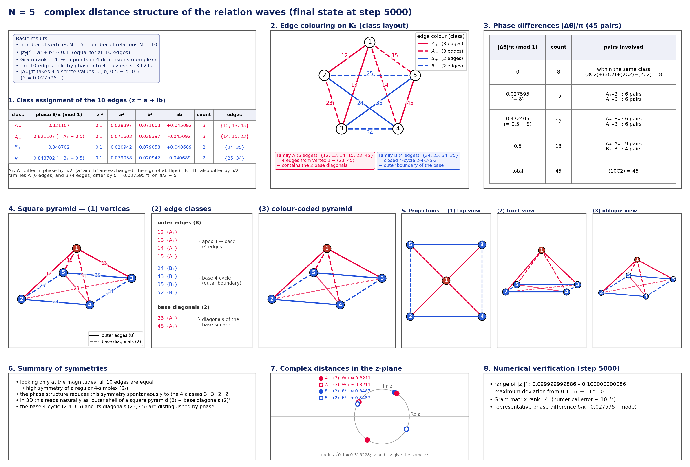

# Mechanism of Inflation-like Rapid Expansion in Self-Consistent Closed Relational-Wave Systems — Normalization Audit, Rank Generation, Zero-Square-Closure Conservation, Simplex Symmetrization, and Reconstruction of the Axiom System

**Author:** Noriaki Kihara (WF System Co., Ltd.)　**Date:** 2026-08-26
**Version DOI:** [10.5281/zenodo.22112009](https://doi.org/10.5281/zenodo.22112009)
**Concept DOI:** [10.5281/zenodo.22112008](https://doi.org/10.5281/zenodo.22112008)

---

## Abstract

Earlier work reported that a closed $N$-body relational-wave system, even with every external seed removed, undergoes a long latency followed by exponential growth of the component outside the parent plane, passes through rank-4 and a three-direction readout, and settles into a metastable structure. This paper reconstructs the onset, the conservation laws, the saturation, and the geometric ordering of that process by auditing the code, re-running $N=3,\ldots,16$, and adding a linear-stability study at $N=5$.

First, the Cayley update of the real antisymmetric generator $K_t$,

$$
C_t=(I-\gamma K_t)^{-1}(I+\gamma K_t),
$$

is a real orthogonal matrix, so $Z^\dagger Z$ and $Z^T Z$ are conserved exactly in exact arithmetic. The zero-square closure that had been described as "numerically conserved" is promoted to a kinematic theorem; the expansion is not an external injection but an internal transfer from $H_\parallel$ to $H_\perp$, and $H_\perp\le H_{\rm total}$ forbids unbounded growth.

Second, when the fixed-point residual of `make_parent` at $N=5$ is varied from $3.87\times10^{-7}$ to $2.38\times10^{-13}$, the onset step is delayed as 72, 134, 176, 238 while the exponential growth rate stays at about $0.17251$/step. Regression against the measured fixed-point residual gives

$$
t_{\rm onset}=11.6162[-\ln\varepsilon_{\rm parent}]-99.5631,
\qquad R^2=0.999992 .
$$

Moreover, the rotating-frame Jacobian has a dominant unstable real doubly degenerate eigenvalue $\mu_1=1.090086569$ and a weaker second real doubly degenerate eigenvalue $\mu_2=1.052603212$. The prediction from the dominant eigenvalue,

$$
2\ln|\mu_1|=0.172514229,
$$

agrees with the directly measured growth rate of $H_\perp$, and

$$
1/\ln|\mu_1|=11.5932
$$

agrees with the slope 11.6162 of the onset–residual regression. That the independent time evolution, the tolerance sweep, and the linearized spectrum are all consistent with one dominant eigenvalue is the main quantitative result of this paper. In the numerical spectrum the dominant multiplier $\mu_1$ appears as a real doubly degenerate eigenvalue whose real two-dimensional eigenspace gives the fastest unstable directions; adding this dominant unstable plane to the rank-2 parent therefore explains the initial selection of rank-4 quantitatively. All twenty multipliers show a clear pair structure, but fixing the symmetry origin of that doubling analytically would require showing separately that the Jacobian commutes with the complex structure.

Third, local zero-square closure at every vertex star is equivalent to all vertices of the centered complex simplex lying on the bilinear null cone. Combined with the equimodular amplitudes of the metastable state, the final geometry is described uniformly as an **equimodular null complex simplex**. The complex Gram rank $N-1$ was confirmed for $N=3$–16.

Fourth, the $120^\circ$ separation of the three phase classes at $N=4$ is derived exactly from local closure and equimodularity. At $N=5$, the sign-paired structure $3+3+2+2$ yields the number of nontrivial two-edge closures,

$$
3\times3+2\times2=13,
$$

and the number of exact covers partitioning the ten edges into five zero pairs,

$$
3!\,2!=12,
$$

combinatorially. In an 8-seed sweep, $3+3+2+2$ and equimodularity were reproduced in every run, whereas the relative phase between the two distance families was not fixed uniquely, indicating a flat direction.

Fifth, the axiom system is revised. Complex rotating pairs, $\sum z_m^2=0$, and a compact $S^1$ phase orbit follow from the self-consistent fixed point, but $U^n=I$ requires a separate rational phase-locking mechanism that selects $\Delta\theta/2\pi\in\mathbb Q$. The $K/\sigma_{\max}$ normalization corresponds exactly, at the same state, to a rescaling of the Cayley step. The roughly 6.8% difference in growth rate per accumulated phase observed at finite step is explained quantitatively by the independent step-refinement series $g(n)=g_\infty+c/n$ ($g_\infty=1.15963$, $c=-4.105$): estimating $n_{\rm eff}\simeq41.2$ from the mean $\bar\sigma\simeq3.49$ of the raw-$K$ run gives $g_{\rm pred}=1.0600$, within 0.13% of the measured $1.05874$. Both updates therefore converge to the same continuum limit, and the possibility that normalization artificially generated the expansion is excluded both by the Cayley identity and by the step-convergence series.

---

## 1. Introduction

This series studies numerically a closed system in which $N$ entities and all their pairwise relations,

$$
M=\frac{N(N-1)}2,
$$

are treated as relational waves. Previously the foundational conditions were the nontrivial zero-square closure

$$
\sum_m z_m^2=0
$$

and the finite recurrence

$$
U^n=I,
$$

taken as axioms, on top of which the possibilities of finite closed systems, phase, direction, interaction, and quantization were examined.

The preceding study [K8] confirmed that even when the external seeds are removed step by step, the system undergoes geometric rapid expansion after a long latency, the direction subspace rotates and mixes during the expansion, and the system finally moves to a metastable three-direction structure. The simple explanation "no seed, no expansion" was therefore rejected.

The following questions, however, remained open in that study.

1. Why does the rapid expansion start?
2. What actually expands?
3. When and from where does rank-4 appear?
4. Why does the rapid expansion stop?
5. Why are directions generated?
6. Do the numerical normalization and the step size contained in the initialization and the time evolution create the phenomenon?
7. Are the two conventional axioms $\sum z^2=0$ and $U^n=I$ really independent input axioms?

This paper re-examines these questions by an implementation audit and by re-running $N=3$–16.

---

## 2. What Is Inherited from the Preceding Study and What Is Corrected

### 2.1 The direct predecessor

The direct predecessor is [K8]. It confirmed that rapid expansion and direction generation persist after seed removal.

That paper, however, contained the following statement.

> The initialization `make_parent` presupposes the zero-square closure condition.

Auditing the code back to the original source, we found that this statement needs correction.

`make_parent` does not impose $\sum z_m^2=0$ directly as a numerical constraint. What it actually does is search for a self-consistent eigenmode fixed point of a phase-dependent real antisymmetric action. Zero-square closure appears on the output side as a consequence.

This paper therefore does not deny the experimental facts of [K8]; it **corrects the understanding of the initialization mechanism through a code audit and, as a consequence, reconstructs the axiom system further upstream**.

### 2.2 What was re-examined

We re-audited

- the original code,
- `make_parent`,
- the Cayley time evolution,
- the $K/\sigma_{\max}$ normalization,
- the step parameter `GAMMA`,
- the time evolution of the rank,
- $Z^T Z$,
- complex distances,
- the simplex rank,
- the metastabilization of amplitudes and phases,
- partial zero closures.

---

## 3. Minimal Input of the System

The only independent size parameter in this paper is $N$.

Because all pairwise relations of $N$ entities are taken,

$$
M=\binom N2=\frac{N(N-1)}2
$$

is a derived quantity, not an independent parameter.

Abstracting the current implementation, the minimal input is

$$
\boxed{
N
+\text{complete pairwise relations}
+\text{self-consistent fixed-point condition}
} .
$$

---

## 4. Implementation Audit of `make_parent`

### 4.1 The actual code

The core of the `make_parent` currently in use is the following.

```python
def make_parent(sys_lr, rng, iters=400, beta=0.5, tol=1e-8, restarts=3):
    best = (None, np.inf, None)
    for _ in range(restarts):
        theta = rng.uniform(0.0, 2.0 * np.pi, sys_lr.m)
        v = None
        for it in range(iters):
            sys_lr.set_theta(theta)
            ev, EV = np.linalg.eig(sys_lr.J @ sys_lr.G)
            idx = int(np.argmin(ev.imag))  # lambda = -i sigma_max
            v = sys_lr.w(EV[:, idx].astype(complex))
            v = v / np.linalg.norm(v)
            theta_new = np.angle(v)
            mix = (1.0 - beta) * np.exp(1j * theta) \
                + beta * np.exp(1j * theta_new)
            theta = np.angle(mix)

            if it % 10 == 9:
                sys_lr.set_theta(np.angle(v))
                res_now = _eigenmode_residual(sys_lr, v)
                if res_now < tol:
                    break

        sys_lr.set_theta(np.angle(v))
        residual = _eigenmode_residual(sys_lr, v)
        if residual < best[1]:
            best = (v, residual, sys_lr.sigma_spectrum())
        if residual < tol:
            break

    v, residual, sig = best
    sys_lr.set_theta(np.angle(v))
    return v, residual, sig
```

Here the initial value `theta` is

```python
theta = rng.uniform(0.0, 2.0*np.pi, M)
```

that is, **real random numbers**.

No pair of random amplitude sets for real and imaginary parts is given as a physical initial value.

The `astype(complex)` in the implementation exists only to store the complex-conjugate eigenmode of the real matrix `J @ G`; it does not specify any complex phase relation as an external condition.

### 4.2 Self-consistency as a fixed point

Conceptually, the iteration

$$
\theta
\rightarrow
G(\theta)
\rightarrow
v
\rightarrow
\arg v
\rightarrow
\theta'
$$

is repeated and a fixed point with

$$
\boxed{\theta'=\theta}
$$

is sought.

The essence of `make_parent` is therefore the self-consistent fixed-point condition

$$
\boxed{\mathcal F(X)=X} .
$$

---

## 5. Spontaneous Generation of the Complex Structure

### 5.1 Real antisymmetric action

The generator $K$ is real antisymmetric,

$$
K^T=-K.
$$

Its nonzero eigenmodes have the form

$$
Kv=i\sigma v .
$$

Writing

$$
v=a+ib
$$

gives

$$
Ka=-\sigma b,\qquad
Kb=\sigma a.
$$

Thus $a,b$ are not two components supplied independently from outside; they are **the rotating pair that appears inside a nonzero eigenmode of a real antisymmetric action**.

In this sense one may read

$$
\boxed{
\text{real initial phases}
+\text{self-consistent real antisymmetric action}
\Rightarrow
\text{complex rotating structure}
} .
$$

---

## 6. From Self-Consistency to Zero-Square Closure

By real antisymmetry, for any $v$,

$$
v^T K v=0 .
$$

Substituting a self-consistent nonzero eigenmode

$$
Kv=i\sigma v,\qquad \sigma\neq0
$$

gives

$$
v^TKv=i\sigma v^Tv=0 .
$$

Hence

$$
\boxed{v^Tv=0},
$$

that is,

$$
\boxed{\sum_m v_m^2=0} .
$$

Furthermore, with $v=a+ib$,

$$
\sum_m(a_m+ib_m)^2=0
$$

yields

$$
\boxed{\|a\|^2=\|b\|^2},
\qquad
\boxed{a\cdot b=0}.
$$

Zero-square closure is therefore not an external constraint given to `make_parent`; it is derived from the self-consistent nonzero antisymmetric eigenmode.

---

## 7. Linear-Combination Closure at Each Vertex

In the complete graph on $N$ vertices, $N-1$ relational waves are incident to vertex $i$.

In the present $N=3$–16 analysis, for $N\ge4$ each vertex satisfied

$$
\boxed{
\sum_{j\neq i} z_{ij}^2\simeq0
}
$$

within numerical precision.

This means that the state of each vertex is a linear-combination closure built from the $N-1$ relational waves other than itself:

$$
\boxed{
\text{state of one vertex}
=
\text{self-consistent linear combination of the }(N-1)\text{ incident relational waves}
} .
$$

Since each relation $z_{ij}$ belongs to the local closures of both vertex $i$ and vertex $j$, the whole system is covered by $N$ mutually overlapping local linear closures.

---

## 8. From Zero-Square Closure to a Compact Phase Orbit — the Logical Distinction from $U^n=I$

From

$$
v^Tv=0
$$

we have, for $v=a+ib$,

$$
\|a\|=\|b\|,
\qquad
a\perp b,
$$

so the state can be written as a rotating pair of finite radius,

$$
X(\theta)=a\cos\theta+b\sin\theta .
$$

Hence

$$
X(\theta+2\pi)=X(\theta),
$$

and a **compact $S^1$ phase orbit** can be derived from the self-consistent fixed point.

Finite recurrence,

$$
U^n=I,
$$

however, does not follow automatically. To return to the initial state after a finite $n$, the phase increment must satisfy

$$
\frac{\Delta\theta}{2\pi}\in\mathbb Q .
$$

For an irrational rotation the orbit is dense on $S^1$ and never closes in finitely many steps.

The logical hierarchy that this paper can establish rigorously is therefore

$$
\boxed{
\text{self-consistent fixed point}
\Rightarrow
\text{complex rotating pair}
\Rightarrow
\sum z_m^2=0
\Rightarrow
S^1\text{ compactness}
}
$$

and no further. The remaining step must be separated as

$$
\boxed{
S^1\text{ compactness}
+
\text{rational phase locking / discrete phase selection}
\Rightarrow
U^n=I
} .
$$

This paper therefore does not claim that $U^n=I$, previously placed as an axiom, has been fully derived from self-consistency. The rational phase-locking mechanism is an independent problem to be examined in connection with the separate phase-discretization experiments.

## 9. Implementation of the Time Evolution

At each step the time evolution reads the phase of the current state,

```python
sys_lr.set_theta(np.angle(Z))
sig_est, wp = sys_lr.sigma_max_power(wp)
Z = sys_lr.cayley_step(Z, sig_est)
```

and writes back the next state.

Physically,

$$
Z_t
\rightarrow
\theta_t=\arg Z_t
\rightarrow
K(\theta_t)
\rightarrow
U_t Z_t
\rightarrow
Z_{t+1} .
$$

The generator is therefore not fixed: it is **a state-dependent generator reconstructed at every step from the readout of the current wave state**.

---

## 10. Cayley Update and Phase Rotation

The time evolution is the Cayley transform

$$
Z_{t+1}
=
(I-\gamma K_t)^{-1}
(I+\gamma K_t)Z_t .
$$

For real antisymmetric $K_t$ this update is a norm-preserving rotation.

For an eigenmode

$$
K_tv=i\sigma v
$$

we have

$$
v\rightarrow
\frac{1+i\gamma\sigma}
     {1-i\gamma\sigma}v
=
e^{i\Delta\phi}v,
$$

$$
\boxed{
\Delta\phi
=
2\arctan(\gamma\sigma)
} .
$$

This formula is the mathematical expression of "read the state, rotate the phase, write back the next state".

---

## 11. The Unnecessary $K/\sigma_{\max}$ Normalization and Time Reparametrization

### 11.1 Old code and corrected code

The earlier code used the generator

$$
K\rightarrow\frac{K}{\sigma_{\max}} .
$$

The corrected code uses the raw $K$.

At the same state the Cayley map satisfies the identity

$$
C\!\left(\frac K\sigma,\gamma\right)
=
C\!\left(K,\frac\gamma\sigma\right) .
$$

In the continuum limit, therefore, the vector fields with and without normalization point in the same direction, and the normalization can be understood as a state-dependent change of clock.

In the earlier step-axis comparison at $N=4,5$, the ratio of growth rates raw/normalized and the ratio of arrival steps normalized/raw were

$$
N=4:\quad2.708\ \text{vs}\ 2.702,
$$

$$
N=5:\quad3.495\ \text{vs}\ 3.489,
$$

in agreement, which strongly suggested the time-reparametrization interpretation.

### 11.2 Additional verification on the accumulated-phase axis

The existing $N=5$ data were re-plotted against the accumulated Cayley phase of the dominant mode,

$$
\Phi(t)=\sum_{s<t}2\arctan(\gamma\sigma_s) .
$$


**Figure 1. $N=5$: comparison with and without normalization on the accumulated-phase axis. The finite-step trajectory difference is compared in terms of the accumulated Cayley phase.**


At finite step the two curves do not coincide completely; the RMSE of $\log_{10}H_\perp$ in the growth region was **0.944 decade**. In an unstable system, however, a tiny discretization difference is amplified exponentially, so the trajectory RMSE alone is not used as a refutation of the time-reparametrization hypothesis. We therefore regressed separately the slope of $\ln H_\perp$ per accumulated phase in the exponential-growth region $10^{-10}<H_\perp<10^{-3}$ of the same data. The result is

$$
\frac{d\ln H_\perp}{d\Phi}
=
1.13117\quad(K/\sigma_{\max}),
$$

$$
\frac{d\ln H_\perp}{d\Phi}
=
1.05874\quad(\text{raw }K),
$$

a difference of about 6.8%. The intercepts of the same regressions, $-55.7414$ and $-55.7412$, almost coincide. At the current $\gamma=\tan(\pi/144)$, therefore, the difference cannot be absorbed by a mere horizontal or vertical offset; a small but measurable difference remains in the effective finite-step growth rate.

This 6.8% difference can be closed with the step-refinement series already obtained in the next section. A least-squares fit of the five points of §12 to

$$
g(n)=g_\infty+\frac{c}{n}
$$

gives

$$
g_\infty=1.1596346,\qquad c=-4.10498,
$$

with a maximum residual of $8.12\times10^{-5}$ over the five points. The growth rate per accumulated phase is thus described to high precision by a first-order finite-step correction.

On the other hand, by the identity at the same state,

$$
C(K/\sigma,\gamma)=C(K,\gamma/\sigma),
$$

the raw-$K$ update can be read as the normalized update run at a coarser effective step on average. Estimating $\bar\sigma\simeq3.49$ from the $N=5$ step-axis growth-rate ratio,

$$
n_{\rm eff}\simeq\frac{144}{3.49}=41.2 .
$$

At this point the independent convergence law predicts

$$
g(41.2)=1.1596346-\frac{4.10498}{41.2}\simeq1.0600,
$$

which agrees with the directly measured raw-$K$ value $1.05874$ to about 0.13%. Since $\sigma_t$ is time dependent, $n_{\rm eff}$ is an average approximation, but this agreement shows that the roughly 6.8% finite-step difference is explained by the same first-order step correction. The agreement of the two intercepts, $-55.7414$ and $-55.7412$, is also consistent with the interpretation that the initial perturbation is common and the difference stems mainly from the step.

The conclusion is therefore

$$
\boxed{
\text{the }K/\sigma_{\max}\text{ normalization is a state-dependent rescaling of the Cayley step; the finite-step raw/normalized difference is explained quantitatively by the independently measured first-order step correction, and both converge to the same continuum limit.}
}
$$

Hence the possibility that normalization or step size artificially generated the inflation-like expansion itself is excluded both by the algebraic identity and by the continuum-limit series.

## 12. `144` Is a Time Step, Not a Physical Constant

The code sets

```python
GAMMA = math.tan(math.pi / 144.0)
```

Note that $\pi/144$ is the angle of the Cayley parameter; the actual one-step rotation angle for a normalized eigenmode with $\sigma=1$ is

$$
\Delta\phi
=
2\arctan[\tan(\pi/144)]
=
\frac{2\pi}{144}
=
\frac{\pi}{72}
=
2.5^\circ .
$$

Thus "144" is not a physical constant but the denominator of the numerical time step chosen to obtain a $2.5^\circ$ increment.

For $N=5$ we refined the step as

$$
n_\gamma=144,\ 288,\ 576,\ 1152,\ 2304
$$

with

$$
\gamma=\tan(\pi/n_\gamma)
$$

and examined the continuum limit.

The growth rate per accumulated phase converged as

- 144: 1.131171 /rad
- 288: 1.145300 /rad
- 576: 1.152475 /rad
- 1152: 1.156090 /rad
- 2304: 1.157905 /rad

These five points are described by the first-order convergence law

$$
g(n)=g_\infty+\frac{c}{n},\qquad
g_\infty=1.1596346,\quad c=-4.10498,
$$

with a maximum residual of $8.12\times10^{-5}$. This convergence law independently explains the raw/normalized difference of §11.2.

Therefore

$$
\boxed{
\text{there is no physical resonance specific to 144; the dynamics converges to the continuum-time limit }
\gamma\rightarrow0 .
}
$$


**Figure 2. $N=5$: continuum limit under step refinement. The growth rate per accumulated phase converges to a common limit with a first-order finite-step correction.**


---

## 13. The Rank-2 Initial State and the Spontaneous Generation of Rank-4

The parent state obtained by `make_parent` has a rank-2 initial plane spanned by its real and imaginary parts.

When the time evolution starts from this state, the component outside the parent plane rises spontaneously and the readout structure moves to rank-4.

The important point is

$$
\boxed{
\text{rank-4 is not given as an initial condition}
} .
$$

Rank-4 is generated spontaneously by the iteration that reads the current state, reconstructs the generator, and writes back the phase-rotated result.

The rank-4 referred to here differs from the Gram rank $N-1$ of the complex simplex discussed later. The former is the readout of the "two two-dimensional rotation planes" that rise during the time evolution; the latter is the simplex rank of the distance geometry of $N$ vertices.

---

## 14. Generation of Three Directions

Let the initial rank-2 plane be $A$.

During the time evolution a second two-dimensional plane $B$ rises outside the parent plane.

Reading the relative configuration of the two planes, one can identify three directions:

1. the shared direction related to both planes,
2. the independent direction on the side of plane $A$,
3. the independent direction on the side of plane $B$.

Hence the generation sequence

$$
\boxed{
\text{rank-2}
\rightarrow
\text{rank-4}
\rightarrow
\text{three-direction readout}
}
$$

is obtained.

The "three directions" observed in [K8] are not an amplification of three axes fixed from the beginning; they are formed dynamically during the rapid expansion, accompanied by rotation and mixing of subspaces.

---

## 15. What Expands — Internal Transfer under Exact Conservation

Let $Z_\parallel,Z_\perp$ be the projection onto the parent plane and the orthogonal component, and

$$
H_\parallel=\|Z_\parallel\|^2,
\qquad
H_\perp=\|Z_\perp\|^2 .
$$

Since the orthogonal decomposition is fixed, together with the exact conservation law of the Cayley update shown in the next section,

$$
H_\parallel+H_\perp=H_{\rm total} .
$$

We overlaid both quantities directly from the corrected raw-$K$ $N=5$ data.


**Figure 3. $N=5$: depletion of the parent-plane component and growth of the transverse component. Their sum is conserved exactly, showing that the rapid expansion is an internal transfer.**


The maximum error of the implementation is

$$
\max|H_\parallel+H_\perp-H_{\rm total}|=4.44\times10^{-16}.
$$

At step 5000,

$$
H_\parallel=0.3220054054,
\qquad
H_\perp=0.6779945946 .
$$

The rapid growth of $H_\perp$ is therefore not an external injection but an **exact internal redistribution** from the parent-plane component to the orthogonal directions.

Moreover, since

$$
0\le H_\perp\le H_{\rm total}=\text{const.},
$$

the fact that the exponential growth does not continue indefinitely is kinematically enforced.

## 16. Two Exact Conservation Laws of the Cayley Update

The generator at each step is real antisymmetric,

$$
K_t^T=-K_t .
$$

Hence the Cayley map

$$
C_t=(I-\gamma K_t)^{-1}(I+\gamma K_t)
$$

is a real orthogonal matrix satisfying identically

$$
C_t^T C_t=I .
$$

In exact arithmetic, therefore, even though the generator changes with the state at every step,

$$
\boxed{Z_{t+1}^\dagger Z_{t+1}=Z_t^\dagger Z_t}
$$

and

$$
\boxed{Z_{t+1}^T Z_{t+1}=Z_t^T Z_t}
$$

are conserved exactly.

The earlier statements "$H_{\rm total}$ is almost constant" and "$Z^TZ\simeq0$ is maintained" are thus promoted from numerical findings to **structural theorems of the update rule**. The residuals of order $10^{-15}$ observed in the $N=5$ raw-$K$ implementation are the floating-point implementation error of this exact theorem.

This theorem guarantees analytically that the inflation-like expansion is not an energy generation that violates conservation, but an internal rearrangement of a conserved total quantity.

## 17. Complex Simplex and the Null Cone — a Geometric Theorem on Local Closure

Let the complex squared distance of each relation be

$$
q_{ij}=z_{ij}^2=(x_i-x_j)\cdot(x_i-x_j),
$$

and take the centroid at

$$
\sum_i x_i=0 .
$$

The star sum at vertex $i$ is

$$
\sum_{j\ne i}(x_i-x_j)^2
=Nx_i^2+T,
\qquad
T\equiv\sum_jx_j^2 .
$$

If local closure

$$
\sum_{j\ne i}q_{ij}=0
$$

holds at every vertex, then

$$
x_i^2=-T/N
$$

is common to all $i$. Summing over all vertices gives $T=-T$, hence

$$
T=0,
$$

and therefore

$$
\boxed{x_i\cdot x_i=0\quad\forall i}.
$$

The converse holds immediately, so

$$
\boxed{
\text{zero-square closure of every vertex star}
\Longleftrightarrow
\text{all simplex vertices lie on the complex null cone}
}
$$

is a theorem.

In this case

$$
q_{ij}=-2x_i\cdot x_j .
$$

Across the whole series $N=3$–16 the complex Gram rank is

$$
\operatorname{rank}B=N-1,
$$

so the $N$ vertices form an $(N-1)$-dimensional complex simplex.

## 18. Metastabilization to an Equimodular Null Complex Simplex

After long evolution, for most $N$,

$$
|z_{ij}|^2\rightarrow\frac1M ,
$$

i.e. equipartition.

Combined with the null-cone theorem of the previous section, the metastable state is summarized as one geometric object,

$$
\boxed{
\text{equimodular null complex simplex}
} ,
$$

namely

$$
x_i^2=0,
\qquad
|x_i\cdot x_j|=\frac{1}{2M}\quad(i\ne j).
$$

For $N=5$ we computed the spectral entropy of the amplitude distribution,

$$
p_m=\frac{|z_m|^2}{\sum_k|z_k|^2},
\qquad
S=-\sum_mp_m\ln p_m .
$$


**Figure 4. $N=5$: spectral entropy. It approaches equipartition over long times, but not as a simple monotone H-theorem.**


Initially $S/\ln M=0.97472$; it dipped once to 0.97322 at step 375 and reached

$$
\boxed{S/\ln M=1.000000}
$$

at step 5000. The final equipartition is therefore quantitatively complete. Since $S(t)$ is not strictly monotone, however, this differs from a simple H-theorem.

## 19. Stopping of the Rapid Expansion: Kinematic Bound and Subsequent Simplex Ordering

By the Cayley orthogonality,

$$
H_\perp\le H_{\rm total}=\text{const.},
$$

so the fact that the exponential growth saturates rather than continuing indefinitely is explained kinematically.

The question "why does it stop" therefore splits into two.

1. **Why it does not grow indefinitely**: resolved by the bound from total-norm conservation.
2. **Why it moves to a specific equimodular simplex configuration**: still a dynamical problem.

At $N=5$, even after $H_\perp$ has nearly saturated, the ordering of the four phase/distance classes continues for a long time.


**Figure 5. $N=5$: time evolution of rapid expansion and ordering. Simplex ordering continues after the expansion has saturated.**


The time evolution therefore has at least two stages,

$$
\boxed{
\text{linear instability / rapid transfer}
\rightarrow
\text{bounded saturation}
\rightarrow
\text{slow simplex ordering}
} .
$$

## 20. The Series $N=3$–16

The main results are summarized below.

| N | M | simplex rank | outline of the metastable phase structure |
|---:|---:|---:|---|
| 3 | 3 | 2 | triangular simplex, still relaxing at 5000 steps |
| 4 | 6 | 3 | $2+2+2$: the three pairs of opposite edges of a tetrahedron |
| 5 | 10 | 4 | $3+3+2+2$, plus nontrivial two-edge closures |
| 6 | 15 | 5 | strictly multi-class, a boundary case with slow relaxation |
| 7 | 21 | 6 | 21 edges nondegenerate at high precision |
| 8 | 28 | 7 | 28 edges nondegenerate at high precision |
| 9 | 36 | 8 | 36 edges nondegenerate at high precision |
| 10 | 45 | 9 | 45 edges nondegenerate at high precision |
| 11 | 55 | 10 | 55 edges nondegenerate at high precision |
| 12 | 66 | 11 | 66 edges nondegenerate at high precision |
| 13 | 78 | 12 | 78 edges nondegenerate at high precision |
| 14 | 91 | 13 | nondegenerate, one 6-edge quasi-closure candidate |
| 15 | 105 | 14 | 105 edges nondegenerate at high precision |
| 16 | 120 | 15 | 120 edges nondegenerate at high precision |

Universal are

$$
\boxed{
\operatorname{rank}=N-1
}
$$

and, in the metastable state,

$$
\boxed{
|z|^2\rightarrow1/M
} .
$$

The small phase groups and the additional closures, on the other hand, depend strongly on $N$.

---

## 21. The Opposite-Edge Structure at $N=4$ — $120^\circ$ Is a Theorem, Not a Numerical Approximation

At $N=4$ the six edges split into three pairs of opposite edges,

$$
(12,34),\qquad(13,24),\qquad(14,23).
$$


**Figure 6. $N=4$: the three opposite-edge classes of the tetrahedron. The $120^\circ$ separation of the three classes follows exactly from local closure and equimodularity.**


Each vertex star contains one edge from each class, so local closure reads

$$
v_1+v_2+v_3=0 .
$$

Under metastable equipartition,

$$
|v_1|=|v_2|=|v_3| .
$$

Three complex numbers of equal modulus can sum to zero only by forming an equilateral triangle in the complex plane, hence

$$
\boxed{\Delta\arg=2\pi/3=120^\circ}
$$

follows exactly.

The earlier "about $120^\circ$" is therefore not a numerical observation but a theorem from local closure plus equipartition. Since a $120^\circ$ configuration contains no pair of opposite signs, this also explains at once why $N=4$ has no two-edge zero closures of the $N=5$ type.

## 22. The Special Symmetry of $N=5$

Among the present series $N=3$–16, $N=5$ is not merely "a complex simplex with five vertices and rank 4"; it is **the clearest singular case in which phase classification, complex-squared-distance classification, a three-dimensional readout, and partial zero closures independent of the generic vertex closures all coincide**.

Here we describe $N=5$ in detail, including its time evolution, not only its final state.

We first show overview figures that capture the structure obtained at $N=5$ on one page. The detailed subsections below decompose and verify each element of these figures in turn.



**Figure 7. $N=5$: overview of the complex relational distance structure. Five vertices, ten relations, rank 4, and the $3+3+2+2$ structure are displayed together.**



**Figure 8. $N=5$: overview of the complete complex-simplex analysis. The two-stage evolution — rapid expansion and four-class ordering — is shown on a common time axis.**


### 22.1 Basic geometry: five vertices, ten relations, rank 4

At $N=5$ the number of complete pairwise relations is

$$
M=\frac{5\cdot4}{2}=10 .
$$

From the ten complex relational waves $z_{ij}$ we form the complex squared distances

$$
d_{ij}^2=z_{ij}^2
$$

and the centered complex Gram matrix

$$
B=-\frac12 JD^2J ,
$$

whose nontrivial rank is

$$
\boxed{\operatorname{rank}B=4} .
$$

The basic structure is thus "five vertices, ten edges, rank 4", corresponding to an ordinary 4-simplex, and this in itself is not special to $N=5$. What is special is that **the phases and complex squared distances of the ten relations self-organize further into a small number of highly symmetric classes**.

### 22.2 The ten edges finally order into the four classes $3+3+2+2$

In the metastable state at step 5000 the ten edges converge to the four classes

$$
A_+:\{12,13,45\},
$$

$$
A_-:\{14,15,23\},
$$

$$
B_+:\{24,35\},
$$

$$
B_-:\{25,34\},
$$

i.e.

$$
\boxed{10=3+3+2+2} .
$$

The important point is that this is not an artificial clustering of "edges with nearby phases". Tracking $a,b,a^2,b^2,ab$ directly for each edge, edges in the same class converge to the same class even in the real and imaginary parts of the complex squared distance

$$
z_{ij}^2=(a_{ij}^2-b_{ij}^2)+2i a_{ij}b_{ij} .
$$


**Figure 9. $N=5$: final complex-squared-distance classes. The ten edges converge to the four classes $3+3+2+2$.**


### 22.3 The four classes reduce further to "two distance directions $\times$ sign reversal"

Among the four classes,

$$
A_-=-A_+,
\qquad
B_-=-B_+ .
$$

The four classes are therefore not four independent kinds; essentially they are

$$
\boxed{
2\text{ complex squared-distance directions}
\times
\text{sign reversal}
} .
$$

For complex squared distances the sign reversal $z^2\rightarrow-z^2$ shifts the phase by $\pi$, so $A_+$ and $A_-$, and $B_+$ and $B_-$, can each be read as the opposite orientations of the same distance family.


**Figure 10. $N=5$: the two distance families and sign reversal. Families A and B, each with its sign reversal, make up the four classes.**


This structure is the basis for reading the $N=5$ phase classification not as "four accidental classes" but as **a reversal symmetry with respect to two basic directions**.

### 22.4 Readout as a three-dimensional square pyramid

The distance geometry of $N=5$ itself is a 4-simplex of rank 4. Using the $3+3+2+2$ phase/distance classification above, however, the ten edges can be arranged very naturally as a three-dimensional square pyramid.

The edges of a square pyramid are

- 4 base edges,
- 4 lateral edges from the apex to the 4 base vertices,
- 2 base diagonals,

in total

$$
4+4+2=10 .
$$

All ten relations can therefore be read three-dimensionally as

$$
\boxed{8\text{ outer edges}+2\text{ base diagonals}} .
$$



**Figure 11. $N=5$: readout as a three-dimensional square pyramid. The phase/distance classification on the rank-4 complex simplex is visualized three-dimensionally.**


This point is important to avoid misreading:

$$
\boxed{
\text{complex simplex rank}=4
}
$$

and

$$
\boxed{
\text{three-dimensional readout of the phase/distance classification}
}
$$

are different observables, and the two do not contradict each other.

### 22.5 The four classes do not exist from the beginning of the expansion

Tracing the final $3+3+2+2$ structure backwards step by step, the completed pattern is not fixed from the onset of the rapid expansion.

The amplitude outside the parent plane grows rapidly first; afterwards the phase and distance differences within each class shrink over a long time.

At $N=5$, the transverse squared amplitude $H_\perp$ reaches 99% of its final value at about step 449, whereas the error to the final four-class pattern keeps relaxing until

$$
\le10^{-4}:\ \text{step }2627,
$$

$$
\le10^{-8}:\ \text{step }4923 .
$$


**Figure 12. $N=5$: convergence to the four-class structure. The ordering of intra-class phases and complex distances continues after the expansion.**


The time evolution at $N=5$ is therefore the two-stage process

$$
\boxed{
\text{rapid expansion into new directions}
\rightarrow
\text{ordering into the four-class phase/distance structure}
} .
$$

This observation is the most detailed visualization, at $N=5$, of the paper-wide claim that "the stopping of the expansion and the simplex symmetrization correspond in time".

### 22.6 The whole structure at $N=5$

In summary, at $N=5$ several readout levels hold simultaneously for the same ten relational waves.

1. **As a complete graph:** $K_5$, 10 edges.
2. **As distance geometry:** a complex 4-simplex with 5 vertices and rank 4.
3. **As a metastable phase classification:** the four classes $3+3+2+2$.
4. **As an algebraic reduction:** two complex distance directions and their sign reversals.
5. **As a three-dimensional readout:** 8 outer edges + 2 base diagonals of a square pyramid.
6. **As local closure:** the vertex-star zero closure of the 4 edges incident to each vertex.
7. **As additional closure:** nontrivial two-edge zero closures not explained by the vertex-star span.


**Figure 13. $N=5$: complete complex-simplex analysis. Rank, four classes, two distance families, square-pyramid readout, and time evolution are integrated.**


### 22.7 Derivation of the nontrivial two-edge zero closures: 13 and 12 are forced by $3+3+2+2$

After excluding the trivial 4-edge star closure at each vertex, 13 two-edge zero closures were observed at $N=5$.


**Figure 14. $N=5$: graph of the nontrivial two-edge zero closures. The 13 closures are derived from the $3+3+2+2$ sign-paired structure.**


This is not an independent numerical coincidence. Denote the four classes by

$$
A_+,\ A_-,\ B_+,\ B_-
$$

with sizes

$$
|A_+|=|A_-|=3,
\qquad
|B_+|=|B_-|=2,
$$

and squared-distance values

$$
q(A_-)=-q(A_+),
\qquad
q(B_-)=-q(B_+) .
$$

Then the two-edge zero closures $q_e+q_f=0$ are exactly all combinations between classes of opposite sign, so their number is

$$
\boxed{3\times3+2\times2=13}.
$$

Furthermore, to partition all ten edges into five zero pairs one chooses independently a bijection between $A_+$ and $A_-$ ($3!$ ways) and a bijection between $B_+$ and $B_-$ ($2!$ ways), so

$$
\boxed{3!\times2!=12}.
$$

The "13 closures" and "12 exact covers" found earlier by numerical search are therefore derived as a **combinatorial necessity** of the $3+3+2+2$ sign-paired structure.

The residual $1.88\times10^{-10}$ of the best numerical example,

$$
z_{23}^2+z_{45}^2\simeq0,
$$

is now a verification value showing that the numerical implementation reproduces this derived structure.


### 22.8 $N=5$ is not "simple because it is low-dimensional"

$N=4$ also has a clear opposite-edge symmetry $2+2+2$, but its closures can be explained as linear consequences of the vertex-star closures. At $N=5$, by contrast, in addition to the four-class structure, two-edge closures and exact covers independent of the generic star span appear.

What makes $N=5$ special in the present $N=3$–16 series is therefore not merely that it has few edges and is easy to visualize. It is that

$$
\boxed{
\text{simplex symmetry}
+
\text{phase degeneracy}
+
\text{three-dimensional readout}
+
\text{additional zero closures}
}
$$

coincide at the same $N$.

## 23. Search for Additional Closures at $N=14$–16

Over all orders smaller than the trivial $(N-1)$-edge vertex-star closure, we searched

- $N=14$: $k=2,\ldots,12$,
- $N=15$: $k=2,\ldots,13$,
- $N=16$: $k=2,\ldots,14$.

At $N=14$ a candidate with

$$
C=9.25\times10^{-7}
$$

exists at $k=6$, but in the time evolution it stalls near $10^{-6}$ and does not converge continuously to $10^{-8}$, $10^{-10}$ as at $N=5$.

It is therefore classified as a quasi-closure rather than a strict additional closure.

At $N=15,16$ no additional closure clearly below $10^{-6}$ was found at any order searched.

---

## 24. Reconstruction of the Axiom System in This Paper — What Is Settled and What Is Not

Previously the two basic axioms were

$$
\sum z_m^2=0,
\qquad
U^n=I .
$$

From the self-consistent real antisymmetric eigenmode we have now organized analytically

$$
\boxed{
\text{self-consistency}
\Rightarrow
\text{complex rotating pair}
\Rightarrow
\sum z_m^2=0
\Rightarrow
S^1\text{ compact phase orbit}
} .
$$

However,

$$
S^1\text{ compactness}\not\Rightarrow U^n=I .
$$

Finite recurrence requires, in addition, rational locking of the phase increment.

The axiom-reduction conclusion of this paper is therefore revised to: **zero-square closure and the complex rotating structure can be derived from self-consistency, but the full derivation of $U^n=I$ requires an additional rational phase-locking mechanism**.

## 25. Relation to Prior Work

### 25.1 Chronology of the research

The numerical model of this paper was not built for the purpose of implementing or reproducing the external prior work listed below.

The chronological order of the research is

$$
\boxed{
\text{independent numerical experiments}
\rightarrow
\text{discovery of the phenomenon}
\rightarrow
\text{later literature survey}
\rightarrow
\text{recognition of structural relations}
} .
$$

The external literature is therefore cited not as the starting assumptions of the model, but to locate independently obtained results in the existing research space.

### 25.2 Complex structure from real structure

Aste [E1] discusses the possibility that a complex structure emerges from the linear dynamics of a finite-dimensional real Euclidean Hilbert space.

The common concern with the present paper is that "complex numbers need not be a primitive input from the outset".

The difference is that here the self-consistent fixed point of a real antisymmetric action built from complete pairwise relations generates the complex rotating pair.

### 25.3 Low-dimensional expanding spacetime from high-dimensional degrees of freedom

In the Lorentzian type IIB / IKKT matrix model, the possibility that a low-dimensional expanding spacetime emerges dynamically from many matrix degrees of freedom has been studied numerically [E2,E3].

The present paper shares the structural feature that rank generation and direction selection arise from many relational degrees of freedom.

The action, the degrees of freedom, the probability measure, and the numerical methods differ, however, and this paper is not a reproduction of the IKKT model.

### 25.4 Inflation and dynamical compactification

Kihara et al. [E4] study, in a ten-dimensional Einstein–Yang–Mills system, exponential expansion on the four-dimensional side and compactification of the extra dimensions within one dynamical system.

In the seedless system of this paper all principal axes expand isotropically; in future harmonic-seed experiments we plan to test an anisotropic separation in which some directions become macroscopic while others remain compact.

In this sense that work is an important object of future comparison.

---

## 26. Discussion — the Onset Mechanism Is Quantified as the Linear Instability of a Relative Equilibrium

### 26.1 Seedless onset and the fixed-point residual

With no explicit seed added and $Z_0=v$, we varied the requested tolerance of `make_parent` over $10^{-6},10^{-8},10^{-10},10^{-12}$. The explanatory variable used in the regression, however, is not the requested tolerance itself but the final fixed-point residual $\varepsilon_{\rm parent}$ actually measured in each run.


**Figure 15. $N=5$: sweep of the `make_parent` residual tolerance. A smaller residual delays the onset while the exponential growth rate is almost unchanged.**


The measured values are as follows.

| requested tol | measured parent residual $\varepsilon_{\rm parent}$ | onset step $f\ge10^{-8}$ | growth rate /step |
|---:|---:|---:|---:|
| $10^{-6}$ | $3.8728081613\times10^{-7}$ | 72 | 0.17483734 |
| $10^{-8}$ | $1.8154355031\times10^{-9}$ | 134 | 0.17252539 |
| $10^{-10}$ | $5.0849521984\times10^{-11}$ | 176 | 0.17251311 |
| $10^{-12}$ | $2.3845913288\times10^{-13}$ | 238 | 0.17251360 |

The logarithms of the residuals are not equally spaced. The onset step must therefore not be regressed against the requested tolerances $10^{-6},10^{-8},10^{-10},10^{-12}$ alone. Using the **measured fixed-point residuals** in the table,


**Figure 16. $N=5$: onset versus the measured fixed-point residual. $t_{\rm onset}$ is linear in $-\ln(\text{residual})$ to high precision.**


the regression

$$
t_{\rm onset}=a[-\ln\varepsilon_{\rm parent}]+b
$$

gives

$$
a=11.616225,
\qquad b=-99.563139,
\qquad R^2=0.99999201.
$$

The predicted onsets for the four points are 71.940, 134.236, 175.766, 238.058 steps, differing from the integer detected values by at most 0.236 step. The regression statistics of the previous version are therefore consistent with the raw data; the apparent contradiction arose from identifying the "requested tolerance" with the "measured fixed-point residual".

This result shows that the intrinsic floor of the seedless onset is the `make_parent` fixed-point residual: the residual controls the onset time, while in the regime of sufficiently small residuals the dominant growth rate converges to about 0.17251/step.

### 26.2 The rotating-frame Jacobian explains rank-4 and the growth rate simultaneously

We linearized numerically the 20-real-dimensional Jacobian of the rotating-frame map, in which the one-step global phase rotation of the parent state has been removed.


**Figure 17. $N=5$: rotating-frame Floquet spectrum. It shows the gap between the dominant unstable real doubly degenerate eigenvalue and the second one. All unstable multipliers lie on the real axis.**


The largest unstable multiplier is real (zero imaginary part) and appears twice, with value

$$
|\mu_1|=1.090086569 .
$$

In the measured spectrum (`floquet_spectrum.csv`) both the dominant multiplier $\mu_1$ and the weaker second unstable multiplier $\mu_2=1.052603212$ appear as real doubly degenerate eigenvalues, with a clear gap in growth rate between them. What can be established directly from the data is therefore that the dominant unstable eigenspace is real two-dimensional and gives the fastest unstable directions.

All twenty multipliers show a clear pair structure. Global phase equivariance alone,
$$
F(e^{i\alpha}Z)=e^{i\alpha}F(Z),
$$
does not automatically imply, for an arbitrary perturbation $\delta Z$,
$$
DF(Z)[i\,\delta Z]=i\,DF(Z)[\delta Z],
$$
i.e. that the whole Jacobian is complex linear. To attribute the symmetry origin of the real doubling to the global phase symmetry, one would have to show separately that the Jacobian commutes with the complex structure. In this paper the doubling itself is treated as an observed fact of the numerical spectrum, and its symmetry origin is left as a future analytical problem.

The sum of the log-moduli of all twenty multipliers is about $-0.0855$, which is negative. Since the rotating-frame Jacobian is the derivative of the 20-real-dimensional state map,
$$
\sum_i\ln|\mu_i|=\ln|\det J|<0
$$
shows that local state volume contracts near the parent relative equilibrium. This does not contradict the exact conservation of the total norm, and it is consistent with the possibility of interpreting the simplex ordering as attractor-like. Restricting the contraction to particular "angular directions", however, would require a separate tangent-space decomposition.

Hence the selection rule

$$
\boxed{\text{parent rank-2}+\text{dominant unstable 2D}=\text{rank-4}}
$$

is obtained.

Furthermore, from the amplitude exponent

$$
\lambda_A=\ln\mu_1=0.0862571143
$$

the squared-amplitude exponent

$$
2\lambda_A=0.172514229
$$

is predicted, which agrees with the growth rate of $H_\perp$ in the direct time evolution, about 0.172513.

Moreover,

$$
\frac1{\lambda_A}=11.5932
$$

agrees with the slope 11.6162 of onset versus residual obtained from the tolerance sweep.

For the onset of the rapid expansion at $N=5$, therefore, the quantitative mechanism

$$
\boxed{
\text{self-consistent relative equilibrium}
\rightarrow
\text{linear instability}
\rightarrow
\text{dominant 2D unstable eigenspace}
\rightarrow
\text{rank-4 and }H_\perp\text{ exponential growth}
}
$$

holds.

The second unstable real doubly degenerate eigenvalue

$$
|\mu_2|=1.052603212
$$

also exists and predicts a slower secondary growth exponent $2\ln\mu_2\simeq0.10253$.


**Figure 18. $N=5$: finite-difference stability of the Floquet multipliers. The dominant multipliers are stable against the finite-difference step.**


### 26.3 Structural similarity to preheating-type mode transfer

Because the total norm is conserved exactly in this system, the rapid expansion is not an energy generation but an exponential transfer from the coherent parent mode to the orthogonal modes. Structurally it is closer to parametric mode amplification / preheating than to cosmological inflation proper.

This paper does not claim identity with the standard preheating equations, however. We only point out the dynamical similarity: Floquet instability, depletion of the parent component, and long-time redistribution after saturation.

Moreover, even at step 5000, $H_\parallel=0.322005$ and $H_\perp=0.677995$: the parent-plane component has not vanished. Taking an uncorrelated isotropic state on 20 real dimensions as a naive reference, the expected projection ratio onto a fixed two-dimensional parent plane is $2/20=0.1$, so the observed value 0.322 is about 3.22 times that. Since we have not shown that the metastable distribution of this map is uniform on the 20-dimensional sphere, this is treated as "a diagnostic suggesting residual memory of the initial parent plane", and its strict statistical significance is to be tested in future seed series.

### 26.4 Seed sweep of the $N=5$ moduli

Re-running 5000 steps for 8 parent random seeds, the final class sizes were

$$
3+3+2+2
$$

in every run, and both distance-family moduli converged to about 0.1.

The relative phase between the two distance families, taken modulo sign, varied from run to run.


**Figure 19. $N=5$: relative phase between the two distance families across seeds. $3+3+2+2$ is reproduced, while the relative phase is not fixed uniquely.**


This supports the possibility that $3+3+2+2$ and equimodularity are selected rigidly, whereas a flat direction remains in the relative phase between the distance families. Longer runs with more seeds are needed.

## 27. Limitations and Future Work

The additional analyses of this paper have narrowed some of the earlier open problems.

1. **Onset of the rapid expansion**: at $N=5$ it has been quantified as the linear instability of a relative equilibrium. Whether the same Floquet structure holds at other $N$ is to be checked.
2. **Rank-4 selection**: at $N=5$ it is explained by the two-real-dimensional dominant unstable space. The real-time growth of the second unstable pair is to be separated directly.
3. **Stopping**: the reason for the absence of unbounded growth is resolved by total-norm conservation. The remaining problem is why the system orders into an equimodular null simplex.
4. **Thermalization / ordering**: the spectral entropy eventually becomes maximal but not monotonically. The $N$-dependence of the relaxation time and the presence or absence of FPUT-type quasi-integrability are to be examined.
5. **Moduli at $N=5$**: whether the relative phase is a true flat direction or locks over very long times is to be confirmed with many seeds and long runs.
6. **$U^n=I$**: a compact phase orbit has been derived from self-consistency, but finite recurrence requires a rational phase-locking mechanism.
7. **General classification of the $N=5$ singularity**: the conditions for the existence of opposite-sign phase classes are to be classified as balanced edge-class designs on $K_N$.
8. **Floquet spectra at other $N$**: the correspondence between the dimension of the unstable space and the simplex ordering is to be organized as a series over $N=3$–16.
9. **Parent-plane memory**: at $N=5$, $H_\parallel=0.322$ remains even at step 5000. The seed dependence, $N$ dependence, and long-time limit of this residual fraction are to be examined.
10. **Symmetry origin of the real doubly degenerate eigenvalues**: the reason why all twenty multipliers of the rotating-frame Jacobian come in pairs and the unstable multipliers appear as real doubles was treated as a numerical observation. Since global phase equivariance alone does not imply complex linearity of the Jacobian, commutation with the complex structure or another symmetry must be shown analytically.

## 28. Conclusion

This paper re-audited the rapid expansion of the seedless closed relational-wave system and promoted some of the numerical observations to exact theorems and part of the onset mechanism to a linear-stability problem.

The main results are as follows.

1. The Cayley update of a real antisymmetric generator is real orthogonal and conserves $Z^\dagger Z$ and $Z^TZ$ exactly.
2. Hence the growth of $H_\perp$ is not an external injection but an internal transfer from $H_\parallel$, and $H_\perp\le H_{\rm total}$ gives the kinematic upper bound of the expansion.
3. The $K/\sigma_{\max}$ normalization corresponds exactly, at the same state, to a rescaling of the Cayley step. The roughly 6.8% growth-rate difference observed at finite step is predicted as $g_{\rm pred}\simeq1.0600$ from the first-order step-convergence law $g(n)=1.1596346-4.10498/n$ of §12 and $n_{\rm eff}\simeq41.2$ of the raw-$K$ run, agreeing with the measured $1.05874$ to about 0.13%. Both updates therefore converge to the same continuum limit, and the possibility that normalization or step size artificially generated the expansion is excluded.
4. In the seedless $N=5$ system, reducing the `make_parent` fixed-point residual delays the onset in proportion to $-\ln\varepsilon$ while the growth rate is unchanged.
5. The rotating-frame Jacobian has a dominant unstable real doubly degenerate eigenvalue $\mu_1=1.090086569$, faster than the second real doubly degenerate eigenvalue $\mu_2=1.052603212$. The numerical spectrum establishes that the dominant unstable space is real two-dimensional, and adding it to the rank-2 parent explains the initial selection of rank-4. The symmetry origin of the real doubling requires a separate proof of commutation between the Jacobian and the complex structure.
6. $2\ln|\mu_1|=0.172514$ agrees with the directly measured $H_\perp$ growth rate of about 0.172513, and $1/\ln|\mu_1|=11.593$ agrees with the onset-regression slope 11.616 against the **measured fixed-point residual**. This triple consistency is the central quantitative result on the $N=5$ onset mechanism.
7. Zero-square closure of every vertex star is equivalent, in the centered representation, to all simplex vertices lying on the complex null cone.
8. Together with equipartition, the metastable state is described uniformly as an **equimodular null complex simplex**.
9. The $120^\circ$ phase difference at $N=4$ is derived exactly from local closure plus equipartition.
10. The 13 nontrivial two-edge closures and 12 exact covers at $N=5$ are derived exactly from the $3+3+2+2$ sign-paired structure as $3\times3+2\times2=13$ and $3!2!=12$.
11. In the 8-seed sweep at $N=5$, $3+3+2+2$ and equimodularity were reproduced in every run, whereas the relative phase between the two distance families was not fixed uniquely, indicating a possible modulus.
12. From self-consistency one can derive the complex rotating structure, zero-square closure, and a compact $S^1$ phase orbit, but $U^n=I$ requires separate rational phase locking.

The onset of the rapid expansion at $N=5$ can therefore be described, at least within numerical linearization, as one dynamical sequence,

$$
\boxed{
\text{self-consistent rank-2 relative equilibrium}
\rightarrow
\text{dominant 2D linear instability}
\rightarrow
\text{rank-4}
\rightarrow
\text{exponential internal mode transfer}
\rightarrow
\text{bounded saturation}
\rightarrow
\text{equimodular null-simplex ordering}
} .
$$

## Location of Figure Files

The figures are numbered consecutively from Figure 1 in order of appearance.

The figures are stored in the repository under `次元の生成構造/電子の反跳実験/seed除去による準安定相追試/chatgpt追試/` and referenced by relative paths from there (the Zenodo release bundles the full set of figures in `nbody_self_consistent_inflation_figures_v1.zip`). The figures used in the additional experiments of this paper comprise the normalization comparison, the transfer from the parent plane to the orthogonal directions, the spectral entropy, the tolerance sweep, the onset–residual law, the Floquet spectrum, the finite-difference stability, and the $N=5$ moduli seed sweep. Figures 7, 8, 11, and 13 are the English versions of the corresponding Japanese infographics, regenerated from the same analysis data.

## Self-Citations

**[K1]** N. Kihara, *Anonymous Equal-Amplitude Composite-Wave Model: Basic Axiom System v9 — Pure Definition*, 2026.

**[K2]** N. Kihara, "Linear Upper Bound on Generator Rank and Three-Direction Saturation in N-Body Complete Pairwise Relational Waves", 2026. Concept DOI: 10.5281/zenodo.21465898.

**[K3]** N. Kihara, "Plane-Decomposition Readout in N-Body Fixed-Generator Systems", 2026. Concept DOI: 10.5281/zenodo.21468959.

**[K4]** N. Kihara, "Onset of Spontaneous State Splitting and the Threefold Classification of Its Outcomes in Closed N-Body Relational-Wave Systems", 2026. Concept DOI: 10.5281/zenodo.21486233.

**[K5]** N. Kihara, "The Number of Waves Is the Resolution of the System", 2026. Concept DOI: 10.5281/zenodo.21486544.

**[K6]** N. Kihara, "The Three-Direction Structure Arising from the Antisymmetric Generator of Complete Pairwise Relational Waves", 2026.

**[K7]** N. Kihara, "Emergence of Three-Direction Space in Closed N-Body Relational-Wave Systems", 2026.

**[K8]** N. Kihara, "Causal Separation of the Time Structure of Three-Direction Formation in Closed N-Body Relational Wave Systems via Two-Stage Seed Removal", 2026. Version DOI: 10.5281/zenodo.21614403; Concept DOI: 10.5281/zenodo.21614402.  
note: https://note.com/kiharanoriaki/n/n48a02cd70f47

## External Prior Work

**[E1]** A. Aste, "Origin of the Complex Structure of Quantum Mechanics," arXiv:1905.12894, 2019.  
https://arxiv.org/abs/1905.12894

**[E2]** T. Aoki, M. Hirasawa, Y. Ito, J. Nishimura, A. Tsuchiya, "On the structure of the emergent 3D expanding space in the Lorentzian type IIB matrix model," *Progress of Theoretical and Experimental Physics* 2019, 093B03 (2019). DOI: 10.1093/ptep/ptz092.

**[E3]** M. Hirasawa, K. N. Anagnostopoulos, T. Azuma, K. Hatakeyama, J. Nishimura, S. Papadoudis, A. Tsuchiya, "The effects of SUSY on the emergent spacetime in the Lorentzian type IIB matrix model," arXiv:2407.03491, 2024.  
https://arxiv.org/abs/2407.03491

**[E4]** H. Kihara, M. Nitta, M. Sasaki, C.-M. Yoo, I. Zaballa, "Dynamical Compactification and Inflation in Einstein-Yang-Mills Theory with Higher Derivative Coupling," *Physical Review D* **80**, 066004 (2009). DOI: 10.1103/PhysRevD.80.066004.

---

## Note on Reproducibility

The re-run data, programs, and figure generation used in this paper are stored in the following verification packages created on 2026-08-26 (the $\gamma$ continuum bundle on 2026-08-25).

- `K_sigma_normalization_artifact_test_N4_N5_20260826.zip`
- `N5_gamma_continuum_test_bundle_20260825.zip`
- `N3_N4_complex_simplex_complete_analysis_20260826.zip`
- `N5_complex_simplex_complete_analysis_20260826.zip`
- `N6_N7_complex_simplex_complete_analysis_20260826.zip`
- `N8_N9_complex_simplex_complete_analysis_20260826.zip`
- `N10_N11_complex_simplex_complete_analysis_20260826.zip`
- `N12_N13_complex_simplex_complete_analysis_20260826.zip`
- `N14_N15_complex_simplex_complete_analysis_20260826.zip`
- `N16_complex_simplex_complete_analysis_20260826.zip`
- `N3_N16_partial_zero_closure_analysis_20260826.zip`
- `N3_N16_nontrivial_zero_closure_analysis_20260826.zip`
- `N14_N16_complete_nontrivial_zero_closure_search_20260826.zip`
- `N5_dynamics_followup_theorems_and_stability_20260826.zip`

With these programs, raw data, and figure scripts, the main numerical results of this paper can be reproduced.
